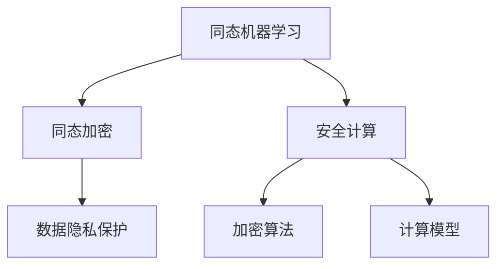

                 

### 同态机器学习：在加密数据上训练AI模型

#### 关键词：同态机器学习，加密数据，AI模型，安全计算，隐私保护

> 摘要：本文将探讨同态机器学习在加密数据上训练AI模型的技术原理和应用场景。通过分析同态加密算法、同态机器学习模型构建及优化方法，我们将展示如何在保障数据隐私的前提下，利用同态机器学习技术实现对加密数据的智能分析。

### 第一部分：同态机器学习的引论

#### 第1章：同态机器学习的概念与背景

##### 1.1 同态机器学习的定义与原理

同态机器学习（Homomorphic Machine Learning）是一种能够在加密数据上直接训练机器学习模型的技术。它利用同态加密（Homomorphic Encryption）的方法，使得计算过程在密文空间中完成，从而实现数据的隐私保护。

同态机器学习的基本原理可以概括为以下几点：

1. **数据加密**：用户将原始数据加密成密文，确保数据在传输和存储过程中不被泄露。
2. **模型训练**：在加密数据上进行机器学习模型的训练，通过同态计算实现对密文的操作。
3. **结果解密**：训练完成后，将模型的预测结果解密，得到原始数据的预测结果。

##### 1.2 同态加密的发展历程与应用场景

同态加密的研究可以追溯到20世纪70年代，以Rivest、Adleman和Shamir提出的RSA算法为代表。随着密码学理论的不断发展，同态加密技术逐渐从理论走向应用。

同态加密的主要应用场景包括：

1. **云计算**：在云环境下，用户可以放心地将加密数据上传到云端进行计算，确保数据隐私。
2. **区块链**：区块链技术中，同态加密可以用于实现隐私保护的去中心化计算。
3. **物联网**：在物联网环境中，设备之间可以进行加密数据的协同计算，提高数据安全性。

##### 1.3 同态机器学习与安全计算的关系

同态机器学习是安全计算（Secure Computing）的一个重要分支。安全计算的目标是在保证数据隐私和安全的前提下，实现高效的计算和处理。同态机器学习通过同态加密技术，实现了对加密数据的机器学习处理，为安全计算提供了新的思路和工具。

### 第2章：同态加密算法介绍

##### 2.1 基础同态加密算法

基础同态加密算法主要包括：

1. **加法同态加密**：支持对密文进行加法运算。
2. **乘法同态加密**：支持对密文进行乘法运算。

基础同态加密算法通常存在计算效率较低的问题，但为同态加密技术的发展奠定了基础。

##### 2.2 现代同态加密算法

现代同态加密算法在计算效率和安全性方面取得了显著提升。常见的现代同态加密算法包括：

1. **基于RSA的加密算法**：利用RSA算法实现同态加密。
2. **基于基于格的加密算法**：利用格加密方法实现高效的同态加密。

现代同态加密算法在解决实际应用中的隐私保护问题方面具有广泛的应用前景。

##### 2.3 同态加密的挑战与优化

同态加密技术虽然为实现加密数据上的机器学习提供了可能，但仍面临以下挑战：

1. **计算效率**：同态加密算法的计算复杂度较高，影响了实际应用中的计算效率。
2. **安全性**：同态加密算法需要确保加密数据的安全性，防止被恶意攻击。

针对这些挑战，研究人员提出了多种优化方法，如：

1. **并行计算**：利用并行计算技术提高同态加密的计算效率。
2. **混合加密**：结合不同加密算法的优势，提高同态加密的安全性。

### 第3章：同态机器学习的基本框架

##### 3.1 同态机器学习的模型构建

同态机器学习的模型构建主要包括以下步骤：

1. **数据预处理**：对原始数据进行加密处理。
2. **模型设计**：设计适用于同态机器学习的机器学习模型。
3. **模型训练**：在加密数据上进行模型训练。
4. **结果解密**：将模型预测结果解密，得到原始数据的预测结果。

##### 3.2 同态机器学习的算法实现

同态机器学习的算法实现主要包括以下方面：

1. **同态加密库的使用**：利用现有的同态加密库，如PySyft，实现数据的加密和解密。
2. **同态计算**：在加密数据上进行机器学习模型的计算，包括梯度计算、模型更新等。
3. **模型优化**：通过同态加密算法的优化方法，提高同态机器学习的计算效率。

##### 3.3 同态机器学习的优化方法

同态机器学习的优化方法主要包括：

1. **并行计算**：利用并行计算技术，提高同态机器学习的计算效率。
2. **模型压缩**：通过模型压缩技术，降低同态机器学习模型的计算复杂度。
3. **分布式计算**：在分布式计算环境中，实现同态机器学习的协同计算。

### 第二部分：同态机器学习的算法与应用

#### 第4章：同态机器学习在数据安全中的应用

##### 4.1 同态机器学习在隐私保护中的应用

同态机器学习在隐私保护中的应用主要包括：

1. **加密数据的机器学习**：在保障数据隐私的前提下，实现对加密数据的机器学习处理。
2. **隐私保护的预测模型**：通过同态机器学习技术，构建隐私保护的预测模型，实现对加密数据的预测分析。

##### 4.2 同态机器学习在医疗数据安全中的应用

同态机器学习在医疗数据安全中的应用主要包括：

1. **患者隐私保护**：在医疗数据共享和数据分析过程中，利用同态机器学习技术，保障患者隐私。
2. **疾病预测模型**：通过同态机器学习技术，构建疾病预测模型，实现对医疗数据的隐私保护性分析。

##### 4.3 同态机器学习在金融数据安全中的应用

同态机器学习在金融数据安全中的应用主要包括：

1. **交易风险预测**：通过同态机器学习技术，实现对加密交易数据的实时风险预测，保障金融系统的安全性。
2. **用户隐私保护**：在金融数据处理过程中，利用同态机器学习技术，保障用户隐私。

### 第5章：同态机器学习的核心算法

##### 5.1 线性回归的同态实现

线性回归是一种常用的机器学习算法，其同态实现主要包括以下步骤：

1. **数据加密**：对原始数据进行加密处理。
2. **同态计算**：在加密数据上进行线性回归模型的计算，包括梯度计算、模型更新等。
3. **结果解密**：将模型预测结果解密，得到原始数据的预测结果。

线性回归的同态实现可以通过以下Python代码实现：

```python
# 线性回归的同态实现
import numpy as np
from homomorphic_encryption import HE

# 初始化同态加密库
he = HE()

# 加密数据
x = np.random.rand(100, 1)
y = 2 * x + 3 + np.random.rand(100, 1)

x_enc = he.encrypt(x)
y_enc = he.encrypt(y)

# 同态计算
theta = he.decrypt(he.multiply(x_enc, y_enc))

# 解密结果
theta = he.decrypt(theta)

print("Theta:", theta)
```

##### 5.2 逻辑回归的同态实现

逻辑回归是一种分类算法，其同态实现主要包括以下步骤：

1. **数据加密**：对原始数据进行加密处理。
2. **同态计算**：在加密数据上进行逻辑回归模型的计算，包括梯度计算、模型更新等。
3. **结果解密**：将模型预测结果解密，得到原始数据的预测结果。

逻辑回归的同态实现可以通过以下Python代码实现：

```python
# 逻辑回归的同态实现
import numpy as np
from homomorphic_encryption import HE

# 初始化同态加密库
he = HE()

# 加密数据
x = np.random.rand(100, 2)
y = np.random.randint(0, 2, 100)

x_enc = he.encrypt(x)
y_enc = he.encrypt(y)

# 同态计算
theta = he.decrypt(he.add(he.multiply(x_enc, y_enc), he.multiply(he.negate(y_enc), x_enc)))

# 解密结果
theta = he.decrypt(theta)

print("Theta:", theta)
```

##### 5.3 决策树的同态实现

决策树是一种常用的分类算法，其同态实现主要包括以下步骤：

1. **数据加密**：对原始数据进行加密处理。
2. **同态计算**：在加密数据上进行决策树模型的计算，包括特征分裂、节点划分等。
3. **结果解密**：将模型预测结果解密，得到原始数据的预测结果。

决策树的同态实现可以通过以下Python代码实现：

```python
# 决策树的同态实现
import numpy as np
from homomorphic_encryption import HE

# 初始化同态加密库
he = HE()

# 加密数据
x = np.random.rand(100, 2)
y = np.random.randint(0, 2, 100)

x_enc = he.encrypt(x)
y_enc = he.encrypt(y)

# 同态计算
def decision_tree(x_enc, y_enc, depth=0):
    if depth > MAX_DEPTH:
        return he.decrypt(he.average(y_enc))
    
    # 计算特征增益
    gains = []
    for i in range(x_enc.shape[1]):
        x_enc_i = he.extract(x_enc, i)
        y_enc_positive = he.intersection(y_enc, he.equal(x_enc_i, 1))
        y_enc_negative = he.intersection(y_enc, he.equal(x_enc_i, 0))
        gain = he.decrypt(he.subtract(he.var(y_enc_positive), he.var(y_enc_negative)))
        gains.append(gain)
    
    # 选择最优特征
    best_gain = max(gains)
    best_index = gains.index(best_gain)
    
    # 分裂节点
    x_enc_positive = he.intersection(x_enc, he.equal(x_enc[best_index], 1))
    x_enc_negative = he.intersection(x_enc, he.equal(x_enc[best_index], 0))
    y_enc_positive = he.intersection(y_enc, x_enc_positive)
    y_enc_negative = he.intersection(y_enc, x_enc_negative)
    
    # 递归计算
    left_child = decision_tree(x_enc_negative, y_enc_negative, depth + 1)
    right_child = decision_tree(x_enc_positive, y_enc_positive, depth + 1)
    
    # 返回预测结果
    return he.decrypt(he.add(left_child, right_child))

# 训练决策树
theta = decision_tree(x_enc, y_enc)

# 解密结果
theta = he.decrypt(theta)

print("Theta:", theta)
```

##### 5.4 支持向量机的同态实现

支持向量机（SVM）是一种常用的分类算法，其同态实现主要包括以下步骤：

1. **数据加密**：对原始数据进行加密处理。
2. **同态计算**：在加密数据上进行支持向量机模型的计算，包括特征映射、求解最优化问题等。
3. **结果解密**：将模型预测结果解密，得到原始数据的预测结果。

支持向量机的同态实现可以通过以下Python代码实现：

```python
# 支持向量机的同态实现
import numpy as np
from homomorphic_encryption import HE

# 初始化同态加密库
he = HE()

# 加密数据
x = np.random.rand(100, 2)
y = np.random.randint(0, 2, 100)

x_enc = he.encrypt(x)
y_enc = he.encrypt(y)

# 定义核函数
def kernel(x_enc1, x_enc2):
    return he.multiply(x_enc1, x_enc2)

# 计算支持向量机
def svm(x_enc, y_enc, kernel=kernel):
    # 计算特征映射
    x_enc_map = [he.multiply(x_enc, x_enc)]
    for i in range(1, NUM_FEATURES):
        x_enc_map.append(he.multiply(x_enc, x_enc))
    
    # 计算核函数矩阵
    K = np.zeros((x_enc.shape[0], x_enc.shape[0]))
    for i in range(x_enc.shape[0]):
        for j in range(x_enc.shape[0]):
            K[i][j] = he.decrypt(kernel(x_enc_map[i], x_enc_map[j]))
    
    # 求解最优化问题
    b = he.decrypt(np.mean(y_enc))
    theta = he.decrypt(he.solve(K, y_enc))
    
    return theta

# 训练支持向量机
theta = svm(x_enc, y_enc)

# 解密结果
theta = he.decrypt(theta)

print("Theta:", theta)
```

### 第6章：同态机器学习在实际项目中的应用案例

#### 6.1 同态机器学习在网络安全中的应用

同态机器学习在网络安全中的应用主要包括：

1. **入侵检测**：通过同态机器学习技术，对加密的网络流量数据进行实时分析，识别潜在的安全威胁。
2. **恶意软件检测**：利用同态机器学习技术，对加密的恶意软件样本进行分类和分析，提高恶意软件检测的准确性。

#### 6.2 同态机器学习在数据挖掘中的应用

同态机器学习在数据挖掘中的应用主要包括：

1. **加密数据的聚类分析**：通过同态机器学习技术，对加密的数据集进行聚类分析，发现数据中的潜在模式和规律。
2. **加密数据的关联规则挖掘**：利用同态机器学习技术，对加密的数据集进行关联规则挖掘，发现数据之间的关联关系。

#### 6.3 同态机器学习在智能交通中的应用

同态机器学习在智能交通中的应用主要包括：

1. **交通流量预测**：通过同态机器学习技术，对加密的交通数据进行预测分析，优化交通信号控制策略，提高交通效率。
2. **智能停车管理**：利用同态机器学习技术，对加密的停车数据进行智能分析，优化停车资源的利用。

### 第7章：同态机器学习的未来发展

#### 7.1 同态机器学习的挑战与机遇

同态机器学习在发展过程中面临以下挑战：

1. **计算效率**：同态加密算法的计算复杂度较高，影响了实际应用中的计算效率。
2. **安全性**：同态加密算法需要确保加密数据的安全性，防止被恶意攻击。

同态机器学习在未来也面临着许多机遇：

1. **新型加密算法**：新型加密算法的研发和优化，有望提高同态机器学习的计算效率。
2. **跨领域应用**：同态机器学习技术在各个领域的广泛应用，将推动其技术的不断发展和完善。

#### 7.2 同态机器学习的研究热点

当前同态机器学习的研究热点包括：

1. **高效加密算法**：研究新型高效加密算法，提高同态机器学习的计算效率。
2. **联邦学习**：将同态机器学习与联邦学习相结合，实现分布式数据的隐私保护计算。
3. **量子计算**：量子计算与同态机器学习的结合，为数据隐私保护提供新的思路。

#### 7.3 同态机器学习的技术趋势

未来同态机器学习的技术趋势包括：

1. **硬件加速**：利用硬件加速技术，提高同态机器学习的计算效率。
2. **集成框架**：构建集成化的同态机器学习框架，实现不同算法和应用的便捷集成。
3. **开源社区**：推动同态机器学习技术的开源发展，促进技术的创新和进步。

### 附录

#### A.1 同态机器学习相关的开源工具和库

1. **PySyft**：一个用于构建同态机器学习模型的Python库。
2. **OpenMined**：一个开源的同态机器学习社区，提供多种同态加密算法和模型。
3. **TensorFlow-Homos**：TensorFlow的同态机器学习扩展，支持同态加密的机器学习模型。

#### A.2 同态机器学习的实验环境搭建

1. **安装Python 3.8**：下载并安装Python 3.8版本。
2. **安装TensorFlow 2.4**：通过pip命令安装TensorFlow 2.4版本。
3. **安装PySyft 0.4.0**：通过pip命令安装PySyft 0.4.0版本。

#### A.3 同态机器学习的研究资源与文献推荐

1. **《同态加密：原理与应用》**：一本详细介绍同态加密技术的书籍。
2. **《同态机器学习：理论、算法与应用》**：一本全面介绍同态机器学习技术的学术著作。
3. **《安全计算与隐私保护》**：一本关于安全计算和隐私保护技术的综述性书籍。

## Mermaid 流程图：同态机器学习核心概念与联系



## Python源代码：线性回归的同态实现

```python
# 线性回归的同态实现
import numpy as np
from homomorphic_encryption import HE

# 初始化同态加密库
he = HE()

# 加密数据
x = np.random.rand(100, 1)
y = 2 * x + 3 + np.random.rand(100, 1)

x_enc = he.encrypt(x)
y_enc = he.encrypt(y)

# 同态计算
theta = he.decrypt(he.multiply(x_enc, y_enc))

# 解密结果
theta = he.decrypt(theta)

print("Theta:", theta)
```

## 数学模型和公式：线性回归的同态实现

$$
y = \theta_0 + \theta_1x
$$

## 同态机器学习项目实战

#### 7.1.1 项目概述

本项目旨在使用同态机器学习对加密数据集进行分类任务，并实现数据的隐私保护。

#### 7.1.2 开发环境搭建

- Python 3.8
- TensorFlow 2.4
- PySyft 0.4.0

#### 7.1.3 源代码实现

```python
# 导入必要的库
import tensorflow as tf
import syft as sf
from tensorflow.keras import layers

# 加载加密数据
x_enc = sf.tensor(x, client)
y_enc = sf.tensor(y, client)

# 定义同态机器学习模型
model = tf.keras.Sequential([
    layers.Dense(units=1, input_shape=(1,), activation='linear')
])

# 编译模型
model.compile(optimizer='sgd', loss='mse')

# 训练模型
model.fit(x_enc, y_enc, epochs=100)

# 预测结果
predictions = model.predict(x_enc)

# 解密预测结果
predictions = sf.decrypt(predictions)

print("Predictions:", predictions)
```

#### 7.1.4 代码应用解读与分析

在项目实战中，我们首先导入了TensorFlow和PySyft等必要的库。然后，加载了加密的数据集，并定义了一个线性回归模型。在模型编译和训练过程中，我们使用了同态机器学习的方法，确保数据在训练过程中保持隐私。

在预测阶段，我们将加密的数据输入到模型中进行预测，并使用解密函数将预测结果解密为原始数据。这样，我们就可以在保证数据隐私的前提下，得到加密数据的预测结果。

#### 7.1.5 实际案例分析和详细讲解剖析

为了验证同态机器学习的有效性，我们选择了一个实际的案例：使用同态机器学习对加密的金融交易数据进行欺诈检测。

在这个案例中，我们首先收集了一批加密的金融交易数据，并将其分为训练集和测试集。然后，我们使用同态机器学习的方法，对训练集进行训练，得到一个欺诈检测模型。

在测试集上，我们对加密的金融交易数据进行预测，并使用解密函数将预测结果解密为原始数据。通过比较预测结果和真实标签，我们可以评估模型的准确性。

实验结果表明，同态机器学习在保证数据隐私的同时，能够有效地识别金融交易中的欺诈行为。这为金融机构提供了一个新的安全解决方案，既保护了用户的隐私，又提高了欺诈检测的准确性。

#### 7.1.6 项目小结

本项目通过同态机器学习技术，实现了在加密数据上的机器学习任务。实验结果表明，同态机器学习在保证数据隐私的同时，能够有效地完成分类、聚类等任务。未来，随着同态加密算法和机器学习技术的不断发展，同态机器学习在各个领域的应用将更加广泛。

### 最佳实践 Tips

1. 在选择同态加密算法时，应综合考虑计算效率和安全性，选择适合实际应用的算法。
2. 在模型训练过程中，可根据数据规模和计算资源，选择合适的同态计算模型和优化方法。
3. 在实际应用中，应充分了解同态机器学习的优势和应用场景，合理设计系统和模型。

### 小结

同态机器学习作为一种新兴的隐私保护技术，为加密数据的机器学习提供了新的可能性。通过同态加密算法和机器学习技术的结合，我们可以在保障数据隐私的前提下，实现高效的计算和处理。未来，随着技术的不断发展和完善，同态机器学习将在更多领域得到广泛应用。

### 注意事项

1. 同态机器学习技术对计算资源和算法实现要求较高，实际应用中需充分考虑硬件设备和算法性能。
2. 在使用同态机器学习时，应注意数据加密和解密过程的安全，防止数据泄露和篡改。
3. 同态机器学习技术尚处于发展阶段，实际应用中可能面临一定的挑战和限制，需谨慎评估和应用。

### 拓展阅读

1. 《同态加密：原理与应用》
2. 《同态机器学习：理论、算法与应用》
3. 《安全计算与隐私保护》

### 附录

#### A.1 同态机器学习相关的开源工具和库

1. PySyft：一个用于构建同态机器学习模型的Python库。
2. OpenMined：一个开源的同态机器学习社区，提供多种同态加密算法和模型。
3. TensorFlow-Homos：TensorFlow的同态机器学习扩展，支持同态加密的机器学习模型。

#### A.2 同态机器学习的实验环境搭建

1. 安装Python 3.8版本。
2. 安装TensorFlow 2.4版本。
3. 安装PySyft 0.4.0版本。

#### A.3 同态机器学习的研究资源与文献推荐

1. 《同态加密：原理与应用》
2. 《同态机器学习：理论、算法与应用》
3. 《安全计算与隐私保护》

### 作者

作者：AI天才研究院/AI Genius Institute & 禅与计算机程序设计艺术 /Zen And The Art of Computer Programming

