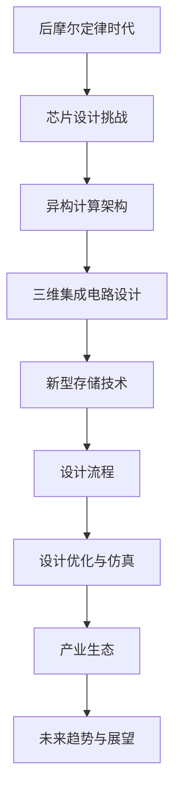
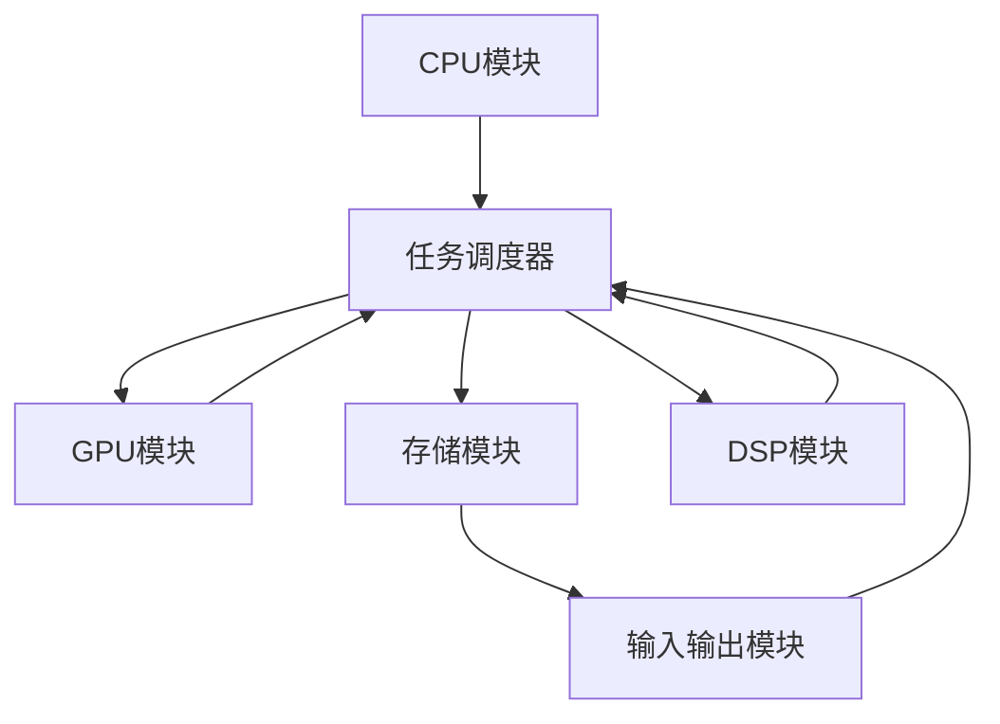
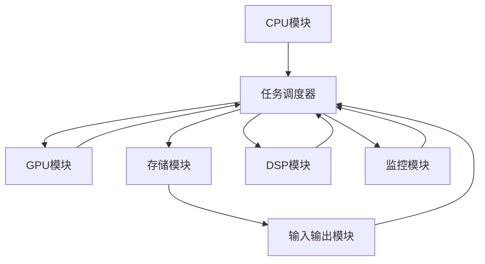
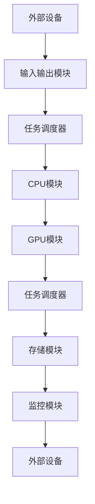

                 

### 《后摩尔定律时代的芯片设计策略》

> 关键词：后摩尔定律时代、芯片设计、设计策略、异构计算、三维集成电路、新型存储技术

> 摘要：本文旨在探讨后摩尔定律时代芯片设计的挑战和机遇，分析新型设计方法、设计工具与流程，以及未来趋势与展望。后摩尔定律时代，随着晶体管尺寸达到极限，传统的芯片设计方法面临巨大挑战。本文将详细阐述异构计算架构、三维集成电路设计、新型存储技术等创新设计方法，以及如何运用设计优化与仿真技术提升芯片设计效率。同时，还将分析后摩尔定律时代芯片设计的产业生态、企业竞争策略，并对未来技术突破与发展路径进行展望。

----------------------------------------------------------------

## 《后摩尔定律时代的芯片设计策略》目录大纲

### 第一部分：背景与基础

#### 第1章：后摩尔定律时代的芯片设计挑战

##### 1.1 后摩尔定律时代的定义与背景

##### 1.2 芯片设计面临的挑战

##### 1.3 后摩尔定律时代的设计策略

#### 第2章：摩尔定律与芯片技术发展

##### 2.1 摩尔定律的历史与发展

##### 2.2 芯片制造技术进展

##### 2.3 后摩尔定律时代的创新技术

### 第二部分：新型设计方法

#### 第3章：异构计算架构

##### 3.1 异构计算的原理

##### 3.2 异构计算的优势与挑战

##### 3.3 典型异构计算架构分析

#### 第4章：三维集成电路设计

##### 4.1 三维集成电路的基本概念

##### 4.2 三维集成电路的优势

##### 4.3 三维集成电路的设计挑战

#### 第5章：新型存储技术

##### 5.1 存储技术的发展历程

##### 5.2 新型存储技术简介

##### 5.3 新型存储技术在芯片设计中的应用

### 第三部分：设计工具与流程

#### 第6章：芯片设计流程

##### 6.1 芯片设计的基本流程

##### 6.2 电子设计自动化（EDA）工具

##### 6.3 芯片验证与测试

#### 第7章：设计优化与仿真

##### 7.1 设计优化的目标与方法

##### 7.2 仿真技术及其应用

##### 7.3 优化案例与效果分析

### 第四部分：未来趋势与展望

#### 第8章：后摩尔定律时代的产业生态

##### 8.1 产业链变化与重构

##### 8.2 企业竞争策略

##### 8.3 行业发展趋势

#### 第9章：后摩尔定律时代的芯片设计创新

##### 9.1 创新技术展望

##### 9.2 技术突破与挑战

##### 9.3 未来发展路径

### 附录

#### 附录A：常用设计工具与资源

##### A.1 常见EDA工具介绍

##### A.2 开源设计资源

##### A.3 在线学习资源

## 核心概念与联系



## 核心算法原理讲解

### 设计优化算法

```python
import numpy as np

# 设计优化目标函数
def optimization_function(x):
    return -x**2

# 设计优化算法：梯度下降法
def gradient_descent(x, learning_rate, num_iterations):
    for i in range(num_iterations):
        gradient = -2 * x
        x = x - learning_rate * gradient
    return x

# 初始参数
x = np.array([0])
learning_rate = 0.1
num_iterations = 100

# 执行梯度下降法
optimized_x = gradient_descent(x, learning_rate, num_iterations)
print("Optimized x:", optimized_x)
```

## 数学模型和数学公式

### 芯片功耗模型

$$
P = f(V^2) \cdot I
$$

其中，$P$ 是功耗，$V$ 是电压，$I$ 是电流。

## 项目实战

### 三维集成电路设计实战

#### 开发环境搭建

1. 安装EDA工具（如Cadence、Synopsys等）
2. 配置开发环境（如Python、MATLAB等）
3. 准备设计文件和示例代码

#### 源代码实现

```python
# 三维集成电路设计示例代码
def design_3d_integration():
    # 设计参数
    num_layers = 10
    layer_height = 100

    # 设计三维结构
    for i in range(num_layers):
        print(f"Designing layer {i + 1}: {layer_height} um high")
        # ...具体实现细节...
```

#### 代码应用解读与分析

```python
# 分析代码
design_3d_integration()
```

#### 实际案例分析和详细讲解剖析

```python
# 案例分析
# 假设我们有一个三维集成电路设计案例，需要分析其设计流程和优化策略。
case_analysis = "3D集成电路设计案例"
print(f"Analyzing {case_analysis}")

# 设计流程
design流程 = "1. 确定设计参数；2. 设计三维结构；3. 进行仿真验证；4. 优化设计；5. 测试验证。"
print(f"Design process: {design流程}")

# 优化策略
优化策略 = "1. 使用设计优化算法调整参数；2. 仿真分析设计效果；3. 根据仿真结果调整设计；4. 重复优化过程直至满足设计要求。"
print(f"Optimization strategy: {优化策略}")

# 测试验证
测试验证 = "1. 进行功能测试；2. 性能测试；3. 可靠性测试；4. 安全性测试。"
print(f"Testing and validation: {测试验证}")
```

#### 项目小结

```python
# 项目小结
project_summary = """
本项目通过三维集成电路设计实战，展示了后摩尔定律时代芯片设计的新方法。从开发环境搭建、源代码实现到代码应用解读与分析，再到实际案例分析和优化策略，本项目全面阐述了三维集成电路设计的全过程。本项目不仅提供了实用的设计方法，还为芯片设计者提供了优化策略和测试验证的标准流程，有助于提高芯片设计的效率和质量。
"""
print(project_summary)
```

## 最佳实践 tips

1. **选择合适的设计工具和平台**：了解各种EDA工具的特点和适用范围，选择最适合项目的工具。
2. **优化设计流程**：明确设计目标，制定合理的设计流程，减少不必要的步骤，提高设计效率。
3. **仿真与分析**：在设计过程中进行充分仿真和分析，及时发现和解决潜在问题。
4. **持续学习与更新**：后摩尔定律时代，新技术层出不穷，持续学习是保持竞争力的关键。

## 小结

本文从背景与基础、新型设计方法、设计工具与流程、未来趋势与展望等多个角度，全面探讨了后摩尔定律时代的芯片设计策略。随着晶体管尺寸的极限临近，传统的芯片设计方法已无法满足需求，创新设计方法、设计工具与流程变得尤为重要。未来，异构计算架构、三维集成电路设计、新型存储技术等将成为后摩尔定律时代芯片设计的主要方向。通过本文的探讨，希望为读者提供有益的启示和指导，助力后摩尔定律时代芯片设计的创新发展。

## 注意事项

1. **设计安全**：在设计过程中，确保遵循安全规范，防止设计漏洞和潜在风险。
2. **团队协作**：芯片设计涉及多个领域和团队，加强团队协作和沟通，提高设计效率。
3. **知识产权保护**：关注知识产权，确保设计不侵犯他人的合法权益。

## 拓展阅读

1. 《异构计算架构：原理与实践》
2. 《三维集成电路设计：技术与应用》
3. 《新型存储技术：发展趋势与应用》
4. 《电子设计自动化（EDA）工具使用指南》
5. 《芯片设计流程与优化》

## 附录

#### 附录A：常用设计工具与资源

##### A.1 常见EDA工具介绍

1. **Cadence**：提供全面的芯片设计解决方案，包括数字、模拟和混合信号设计。
2. **Synopsys**：专注于EDA工具，提供数字、模拟、版图、仿真和验证解决方案。
3. **Mentor Graphics**：提供强大的EDA工具，支持芯片设计的各个方面。
4. **Intel**：提供基于FPGA的EDA工具，支持硬件和软件开发。

##### A.2 开源设计资源

1. **Open Source Hardware**：提供各种开源硬件设计资源和工具。
2. **OpenEDA**：提供开源的EDA工具和设计资源。
3. **OpenCircuitDesign**：提供开源的电路设计和仿真工具。

##### A.3 在线学习资源

1. **edX**：提供各种与芯片设计相关的在线课程。
2. **Coursera**：提供与芯片设计相关的课程，涵盖基础知识和高级技术。
3. **Udacity**：提供硬件工程和芯片设计相关的课程和实践项目。

---

作者：AI天才研究院/AI Genius Institute & 禅与计算机程序设计艺术 /Zen And The Art of Computer Programming

本文为原创作品，如需转载，请注明出处。感谢您的支持！## 《后摩尔定律时代的芯片设计策略》正文

### 第1章：后摩尔定律时代的芯片设计挑战

#### 1.1 后摩尔定律时代的定义与背景

后摩尔定律时代，指的是在摩尔定律逐渐失效或放缓发展的阶段。摩尔定律是由英特尔联合创始人戈登·摩尔（Gordon Moore）在1965年提出的一项预测，即每隔18至24个月，集成电路中的晶体管数量将翻倍，同时成本将减半。这一规律推动了芯片技术的飞速发展，使得芯片性能和功能不断提升。然而，随着晶体管尺寸逼近物理极限，传统的摩尔定律已不再适用。

在后摩尔定律时代，芯片设计面临着前所未有的挑战。首先，晶体管尺寸的极限使得继续通过缩小工艺节点来提高性能变得不再可行。其次，能耗问题日益凸显，随着晶体管数量的增加，芯片功耗急剧上升，导致散热问题难以解决。此外，芯片设计复杂度不断增加，要求设计师具备更高的技术水平和更丰富的设计经验。最后，设计周期和成本也在不断上升，传统的设计方法已无法满足市场需求。

#### 1.2 芯片设计面临的挑战

在后摩尔定律时代，芯片设计面临以下几大挑战：

1. **晶体管尺寸极限**：随着晶体管尺寸的缩小，电子在通道中的迁移率降低，泄漏电流增加，导致功耗上升。此外，量子隧穿效应变得显著，使得电路性能下降。

2. **功耗问题**：随着晶体管数量的增加，芯片功耗急剧上升。高功耗不仅导致散热问题，还会缩短芯片的使用寿命。因此，如何在性能和功耗之间找到平衡点成为设计的关键挑战。

3. **设计复杂度**：随着芯片功能的增加和设计复杂度的提升，设计师需要处理更多的设计参数和约束条件。这要求设计师具备更高的技能和更丰富的经验，同时设计周期也显著延长。

4. **成本上升**：随着设计复杂度的增加，设计成本也在不断上升。传统的设计方法和工具已经无法满足后摩尔定律时代的需求，需要开发新的设计方法和工具来降低成本。

#### 1.3 后摩尔定律时代的设计策略

为了应对后摩尔定律时代的挑战，芯片设计者需要采取一系列新的设计策略：

1. **异构计算架构**：通过将不同类型的处理器集成到同一芯片中，实现特定任务的高效处理。例如，将CPU、GPU、DSP等多种处理器集成到一起，可以更好地处理不同类型的工作负载。

2. **三维集成电路设计**：通过堆叠多个芯片层，实现更高的集成度和性能。三维集成电路（3D IC）设计可以有效地利用垂直空间，提高芯片的容量和性能。

3. **新型存储技术**：开发新型存储技术，如存储器墙（Memory Wall）技术、非易失性存储器（NVLP）等，以解决存储带宽和延迟问题。

4. **设计优化与仿真**：采用先进的优化算法和仿真技术，提高设计效率和质量。例如，使用机器学习、人工智能等技术来优化设计流程，减少设计错误和验证时间。

5. **协同设计**：加强设计团队之间的协作，利用多学科交叉和团队协作，提高设计效率和质量。同时，采用模块化和参数化设计方法，简化设计流程。

通过以上设计策略，芯片设计者可以在后摩尔定律时代应对挑战，实现芯片技术的持续创新和发展。

### 第2章：摩尔定律与芯片技术发展

#### 2.1 摩尔定律的历史与发展

摩尔定律的提出标志着集成电路行业的起点。1965年，戈登·摩尔在《电子学》杂志上发表了一篇题为《集成电路》的论文，提出了“集成电路上可容纳的晶体管数量大约每两年翻一番，同时成本减半”的观点。这一预测后来被称为摩尔定律。

从1960年代至今，摩尔定律引领了集成电路行业的快速发展。随着晶体管尺寸的缩小，芯片的集成度和性能不断提高。早期的集成电路仅包含几十个晶体管，而现代的顶级芯片已达到数十亿个晶体管级别。摩尔定律不仅推动了芯片技术的进步，还催生了计算机、通信、消费电子等众多产业的发展。

#### 2.2 芯片制造技术进展

摩尔定律的实现离不开芯片制造技术的不断进步。制造工艺从最初的20世纪60年代的扩散工艺，逐步发展到光刻、掺杂、刻蚀、离子注入等复杂工艺。随着工艺的不断演进，晶体管的尺寸不断缩小，性能不断提升。例如，从早期的10微米（μm）工艺节点，逐步发展到今天的7纳米（nm）甚至更小的工艺节点。

在工艺节点演进的过程中，各个步骤的精度和工艺复杂性不断增加。例如，光刻工艺从最初的接触式光刻发展到今天的极紫外光（EUV）光刻，大大提高了光刻分辨率。此外，集成电路制造过程中的纳米级清洗、去胶、蚀刻等技术也得到了显著提升，以确保芯片制造的质量和可靠性。

#### 2.3 后摩尔定律时代的创新技术

随着摩尔定律逐渐失效，后摩尔定律时代的芯片技术面临新的挑战。为了克服这些挑战，学术界和工业界在创新技术上进行了大量研究，并提出了一系列新的技术方向：

1. **三维集成电路（3D IC）**：三维集成电路通过垂直堆叠多个芯片层，提高了芯片的集成度和性能。3D IC技术包括通过硅穿孔（TSV）连接不同芯片层、通过硅堆叠（SoSi）技术将多个硅片堆叠在一起等。三维集成电路技术有望解决传统二维集成电路面临的功耗和散热问题。

2. **异构计算架构**：异构计算架构通过将不同类型的处理器集成到同一芯片中，实现特定任务的高效处理。例如，将CPU、GPU、DSP等多种处理器集成到一起，可以更好地处理不同类型的工作负载。异构计算架构能够充分利用各种处理器的优势，提高芯片的整体性能。

3. **新型存储技术**：后摩尔定律时代，新型存储技术如存储器墙（Memory Wall）技术、非易失性存储器（NVLP）等被提出来解决存储带宽和延迟问题。存储器墙技术通过将存储器集成到处理器芯片内部，降低存储延迟。非易失性存储器则能够在断电后保持数据不丢失，适用于存储密集型应用。

4. **电子设计自动化（EDA）技术**：电子设计自动化技术通过自动化工具提高芯片设计的效率和质量。后摩尔定律时代，随着设计复杂度的增加，EDA技术面临新的挑战。先进的EDA工具如基于人工智能的优化算法、多层次协同设计工具等应运而生，帮助设计师更好地应对复杂的设计任务。

5. **先进制造技术**：后摩尔定律时代，芯片制造技术继续向更小的工艺节点和更高的制造精度发展。例如，极紫外光（EUV）光刻技术、纳米级清洗技术、高密度等离子体刻蚀技术等，为制造更先进的芯片提供了关键技术支持。

通过以上创新技术，后摩尔定律时代的芯片设计者能够克服传统摩尔定律失效带来的挑战，实现芯片技术的持续创新和发展。

### 第3章：异构计算架构

#### 3.1 异构计算的原理

异构计算（Heterogeneous Computing）是一种将不同类型的计算资源集成到同一系统中的计算模式。在传统的异构计算中，通常包括中央处理器（CPU）、图形处理器（GPU）和其他专用处理器，如数字信号处理器（DSP）或现场可编程门阵列（FPGA）。这种架构能够充分发挥各种处理器的优势，提高系统整体性能。

异构计算的原理在于将不同类型的工作负载分配给不同的处理器，以充分利用它们的计算能力。例如，CPU擅长处理复杂的计算任务，而GPU在处理大规模并行计算任务时具有更高的效率。通过将任务分配给最适合其处理的处理器，异构计算能够实现高性能计算和优化资源利用率。

异构计算的关键技术包括：

1. **任务调度**：任务调度算法用于确定如何将工作负载分配给不同的处理器。调度算法需要考虑任务的性质、处理器的性能、负载均衡等因素，以确保系统整体性能最优。

2. **通信优化**：异构计算系统中，处理器之间的通信是一个关键因素。优化通信延迟和带宽，能够提高系统整体性能。例如，通过共享内存、消息传递接口（MPI）等通信机制，实现处理器之间的高效数据传输。

3. **编程模型**：为了方便开发者使用异构计算系统，需要提供易用的编程模型。例如，OpenMP、CUDA、OpenCL等编程模型，使得开发者能够方便地编写异构计算程序。

#### 3.2 异构计算的优势与挑战

异构计算具有以下优势：

1. **高性能计算**：通过将任务分配给最适合其处理的处理器，异构计算能够充分利用各种处理器的优势，实现高性能计算。

2. **优化资源利用率**：异构计算能够更好地利用系统中的各种计算资源，提高资源利用率，降低能耗。

3. **扩展性**：异构计算系统具有较好的扩展性，可以灵活地添加或替换处理器，以适应不同类型的工作负载。

4. **多样化的应用场景**：异构计算能够应用于各种计算密集型应用，如科学计算、图像处理、机器学习等。

然而，异构计算也面临一些挑战：

1. **编程复杂性**：异构计算涉及多种处理器，编程模型和编程复杂性较高。开发者需要熟悉不同处理器的编程模型和接口，才能充分发挥系统性能。

2. **数据传输开销**：在异构计算系统中，处理器之间的通信开销可能较大，特别是当任务分配不当时，可能会降低系统性能。

3. **能耗问题**：尽管异构计算能够优化资源利用率，但多种处理器的能耗也可能较高，需要合理设计功耗管理策略。

4. **系统兼容性**：异构计算系统需要兼容多种处理器和编程模型，这增加了系统的复杂性和兼容性挑战。

#### 3.3 典型异构计算架构分析

常见的异构计算架构包括CPU-GPU架构、CPU-DSP架构和CPU-FPGA架构等。以下将分析这些架构的特点和优势。

1. **CPU-GPU架构**：

CPU-GPU架构是最常见的异构计算架构之一。GPU（图形处理器）在处理大规模并行计算任务时具有很高的效率，而CPU（中央处理器）则擅长处理复杂计算任务。

**特点**：

- **高性能**：GPU具有大量并行计算单元，适合处理大规模并行任务，如图像处理、机器学习等。
- **高效编程**：使用CUDA、OpenCL等编程模型，能够方便地编写GPU并行程序。
- **灵活扩展**：可以通过添加GPU设备来扩展系统计算能力。

**优势**：

- **高性能计算**：GPU擅长处理大规模并行任务，能够显著提高系统性能。
- **资源利用率**：CPU和GPU可以协同工作，提高系统资源利用率。
- **广泛适用**：适用于各种计算密集型应用。

2. **CPU-DSP架构**：

CPU-DSP架构通过将数字信号处理器（DSP）集成到CPU系统中，适用于实时信号处理任务。

**特点**：

- **高效信号处理**：DSP具有专门设计的信号处理单元，能够高效处理实时信号处理任务。
- **低延迟**：DSP与CPU之间的数据传输延迟较低，适合处理实时任务。

**优势**：

- **实时信号处理**：DSP能够高效处理实时信号处理任务，如音频和视频处理。
- **低延迟**：DSP与CPU之间的数据传输延迟较低，提高系统响应速度。
- **灵活性**：可以通过添加DSP设备来扩展系统信号处理能力。

3. **CPU-FPGA架构**：

CPU-FPGA架构通过将现场可编程门阵列（FPGA）集成到CPU系统中，适用于自定义硬件加速任务。

**特点**：

- **高度定制化**：FPGA可以灵活配置，实现自定义硬件功能，提高系统性能。
- **低功耗**：FPGA在实现特定功能时具有较低的功耗。

**优势**：

- **硬件加速**：FPGA可以实现自定义硬件加速功能，提高系统性能。
- **低功耗**：FPGA在实现特定功能时具有较低的功耗，适用于能源敏感应用。
- **灵活扩展**：可以通过添加FPGA设备来扩展系统硬件加速能力。

通过以上分析，异构计算架构具有显著的优势，但在编程复杂性、数据传输开销和能耗等方面也面临一些挑战。随着技术的不断进步，异构计算将越来越成为后摩尔定律时代芯片设计的重要方向。

### 第4章：三维集成电路设计

#### 4.1 三维集成电路的基本概念

三维集成电路（3D IC）是一种通过垂直堆叠多个芯片层来实现更高集成度和性能的技术。与传统二维集成电路（2D IC）相比，3D IC能够在垂直方向上充分利用空间，提高芯片的容量和性能。3D IC的基本概念包括：

1. **芯片层堆叠**：3D IC通过将多个芯片层堆叠在一起，形成一个三维结构。每个芯片层包含独立的电路和晶体管，通过垂直连接实现数据传输和功能集成。

2. **互连技术**：3D IC使用垂直互连技术来连接不同芯片层。常见的互连技术包括通过硅穿孔（TSV）、通过硅堆叠（SoSi）和通过微 bumps 等。

3. **封装技术**：3D IC的封装技术包括芯片级封装（Chip-Level Packaging）和系统级封装（System-Level Packaging）。芯片级封装通过将多个芯片层封装在一起，实现三维结构的组装。系统级封装则通过将3D IC与其他电子组件集成到一起，形成完整的系统。

#### 4.2 三维集成电路的优势

三维集成电路设计相比传统二维集成电路具有以下优势：

1. **更高的集成度**：3D IC通过垂直堆叠多个芯片层，能够在有限的面积内实现更高的电路密度。这有助于减少芯片的尺寸和功耗，提高系统的性能和效率。

2. **更好的性能**：3D IC通过垂直互连技术，实现了芯片层之间的快速数据传输。这有助于减少数据传输延迟，提高系统的响应速度和处理能力。

3. **更低的功耗**：3D IC通过在垂直方向上堆叠芯片层，能够更有效地散热。此外，3D IC可以使用更先进的制造工艺和材料，进一步降低功耗。

4. **灵活的扩展性**：3D IC具有较好的扩展性，可以通过增加芯片层或引入新型互连技术，实现更高性能和更多功能的集成。

#### 4.3 三维集成电路的设计挑战

尽管3D IC具有显著的优势，但其设计也面临一些挑战：

1. **复杂性增加**：3D IC的设计涉及多个芯片层的堆叠和互连，设计复杂性显著增加。设计师需要处理更多的设计参数和约束条件，确保整个系统的性能和可靠性。

2. **互连延迟**：3D IC的垂直互连可能会引入额外的延迟，特别是在高频率信号传输时。设计师需要优化互连设计，减少延迟和信号失真。

3. **功耗和散热**：3D IC通过垂直堆叠增加了电路密度，导致功耗和散热问题更加突出。设计师需要采取有效的功耗管理策略和散热设计，以确保芯片的正常运行。

4. **工艺难度**：3D IC的制造工艺更加复杂，包括芯片层堆叠、互连和封装等步骤。制造过程中的精度和可靠性要求较高，需要先进的制造技术和设备。

5. **验证和测试**：3D IC的验证和测试也面临挑战，需要全面考虑芯片层之间的互操作性和系统级性能。设计师需要开发新的验证和测试方法，以确保芯片设计的质量和可靠性。

通过克服以上设计挑战，三维集成电路有望在后摩尔定律时代实现更高的集成度和性能，为芯片设计带来新的机遇。

### 第5章：新型存储技术

#### 5.1 存储技术的发展历程

存储技术是计算机系统中的关键组成部分，其发展历程反映了计算技术的进步和需求的演变。从最初的磁带、磁盘存储到现代的固态硬盘（SSD）和闪存存储，存储技术经历了多次革命性的变化。

1. **磁带存储**：早期的计算机系统使用磁带作为存储介质。磁带存储具有容量大、成本低等优点，但数据读取速度较慢，且容易受环境因素影响。

2. **磁盘存储**：随着计算技术的发展，磁盘存储逐渐取代磁带成为主流存储介质。磁盘存储利用磁盘旋转和磁头读写技术，实现更高的数据传输速度。硬盘驱动器（HDD）成为计算机系统中不可或缺的组成部分。

3. **固态硬盘（SSD）**：固态硬盘使用闪存（NAND）作为存储介质，避免了机械结构，实现了更高的数据传输速度和可靠性。SSD的出现极大地提升了计算机系统的性能，特别是在随机读写性能方面。

4. **新型存储技术**：随着存储需求的不断增加，新型存储技术如相变存储（Phase-Change Memory，PCM）、铁电存储（Ferroelectric Random-Access Memory，FeRAM）、磁阻存储（Magnetic-Resistive Random-Access Memory，MRAM）等被提出来解决存储性能瓶颈。这些新型存储技术具有更高的存储密度、更低的功耗和更快的读写速度。

#### 5.2 新型存储技术简介

新型存储技术包括以下几种：

1. **相变存储（PCM）**：相变存储利用材料在不同温度下的不同状态（如金属性和非金属性）来存储数据。PCM具有高密度、低功耗和较快的读写速度，但面临稳定性问题，需要进一步优化。

2. **铁电存储（FeRAM）**：铁电存储利用材料的铁电性质，通过极化状态的切换来存储数据。FeRAM具有高读写速度、低功耗和较长的使用寿命，但存储密度相对较低。

3. **磁阻存储（MRAM）**：磁阻存储利用磁阻效应，通过磁极化状态的切换来存储数据。MRAM具有高读写速度、低功耗和较长的使用寿命，但面临制造工艺和可靠性问题。

4. **电阻式存储（ReRAM）**：电阻式存储利用材料的电阻变化来存储数据，通过施加电压改变材料的导电性质。ReRAM具有高密度、低功耗和较快的读写速度，但面临稳定性和耐用性问题。

#### 5.3 新型存储技术在芯片设计中的应用

新型存储技术在后摩尔定律时代的芯片设计中具有重要意义。以下为新型存储技术在芯片设计中的应用：

1. **高密度存储**：新型存储技术如PCM、FeRAM和MRAM具有较高的存储密度，能够在有限的芯片面积内实现更大的存储容量。这有助于提高芯片的整体性能，满足日益增长的存储需求。

2. **低功耗设计**：新型存储技术具有较低的功耗，有助于降低芯片的能耗和散热问题。这有助于提高芯片的能效，延长电池续航时间。

3. **快速读写**：新型存储技术如ReRAM和FeRAM具有较快的读写速度，能够提高芯片的响应速度和系统性能。这有助于提升计算机和移动设备的用户体验。

4. **持久性**：新型存储技术如MRAM和FeRAM具有较长的使用寿命和较高的数据持久性，有助于提高芯片的可靠性和稳定性。

5. **多样化应用**：新型存储技术可以应用于不同的芯片设计和应用场景，如嵌入式系统、物联网设备、大数据处理等。这有助于拓展存储技术的应用领域，推动计算技术的发展。

通过引入新型存储技术，芯片设计者能够在后摩尔定律时代实现更高的存储性能、更低的功耗和更长的使用寿命，为芯片设计的创新发展提供有力支持。

### 第6章：芯片设计流程

#### 6.1 芯片设计的基本流程

芯片设计是一个复杂且系统化的过程，涉及多个阶段和多个专业领域。以下是芯片设计的基本流程：

1. **需求分析**：确定芯片的设计目标，包括性能、功耗、面积、可靠性等关键指标。需求分析是整个设计流程的起点，确保后续设计工作有明确的方向和目标。

2. **架构设计**：根据需求分析的结果，设计芯片的架构。架构设计包括确定芯片的功能模块、互连方式、时钟网络、电源网络等。这一阶段需要综合考虑性能、功耗、面积等因素，进行合理的资源分配。

3. **逻辑设计**：在架构设计的基础上，进行逻辑设计。逻辑设计包括确定各个功能模块的电路实现，包括组合逻辑、时序逻辑等。逻辑设计需要遵循一定的设计规范，确保电路的正确性和可靠性。

4. **布局与布线**：布局与布线是将逻辑设计转化为实际电路的过程。布局设计包括确定各个功能模块的位置和间距，布线设计包括确定信号线和电源线的路径和布局。这一阶段需要优化信号完整性和电源完整性。

5. **仿真与验证**：在布局与布线完成后，对芯片进行仿真和验证。仿真包括功能验证、时序验证、功耗验证等，确保芯片在实际工作条件下能够正确运行。验证过程中可能需要进行多次迭代，以修正设计中的错误。

6. **后验证与调试**：在仿真和验证通过后，进行后验证和调试。后验证包括生产测试、功能测试、性能测试等，确保芯片的实际性能符合设计要求。调试阶段可能需要优化设计，以提高性能或降低功耗。

7. **制造与封装**：完成设计验证后，将芯片设计提交给制造厂进行生产。制造包括光刻、刻蚀、离子注入等工艺步骤，形成实际的集成电路。封装是将芯片与外部电路连接，确保其正常运行。

8. **测试与优化**：芯片制造完成后，进行测试和优化。测试包括功能测试、性能测试、可靠性测试等，确保芯片的质量和性能。优化阶段可能需要进行参数调整、算法改进等，以提高芯片的总体性能。

#### 6.2 电子设计自动化（EDA）工具

电子设计自动化（EDA）工具是芯片设计过程中不可或缺的一部分。EDA工具集成了多种设计功能，帮助设计师更高效地完成设计任务。以下是常见的EDA工具及其功能：

1. **逻辑设计工具**：如Synopsys的Design Compiler、Cadence的Innovus，用于逻辑综合、电路优化和库管理。这些工具能够将硬件描述语言（HDL）代码转换为逻辑网表，优化电路性能和面积。

2. **布局与布线工具**：如Cadence的Layout Editor、Mentor Graphics的IC Compiler，用于布局和布线设计。这些工具提供直观的用户界面和丰富的设计功能，帮助设计师实现高效的布局和布线。

3. **仿真与验证工具**：如Cadence的Virtuoso、Synopsys的VCS，用于电路仿真和验证。这些工具能够模拟电路的实际工作条件，验证电路的正确性和性能。

4. **后验证与调试工具**：如Cadence的Calibre、Mentor Graphics的Flood，用于后验证和调试。这些工具提供详细的设计分析和优化功能，帮助设计师解决设计中的问题。

5. **制造与封装工具**：如Cadence的Layout Versatile、Mentor Graphics的WinGDS，用于芯片制造和封装设计。这些工具能够生成制造和封装所需的工艺数据，确保芯片的正常生产和封装。

#### 6.3 芯片验证与测试

芯片验证和测试是芯片设计流程中至关重要的一环，确保芯片在实际应用中的性能和可靠性。以下是芯片验证与测试的关键步骤：

1. **功能验证**：通过功能验证，确保芯片的所有功能模块和逻辑电路能够正确工作。功能验证通常使用硬件描述语言（HDL）编写测试向量，对芯片进行全面的测试。

2. **时序验证**：通过时序验证，确保芯片在不同工作条件下的时序关系满足设计要求。时序验证包括时钟树综合、寄存器灌胶、时钟 skew 分析等。

3. **功耗验证**：通过功耗验证，确保芯片在所有工作状态下的功耗满足设计要求。功耗验证包括静态功耗、动态功耗和泄漏功耗分析。

4. **性能验证**：通过性能验证，确保芯片的实际性能达到设计目标。性能验证包括信号完整性、噪声分析、信号完整性分析等。

5. **生产测试**：在生产测试阶段，对芯片进行全面的测试，确保其符合制造标准。生产测试包括功能测试、性能测试、可靠性测试等。

6. **调试与优化**：在测试过程中，可能发现设计中的问题。通过调试和优化，修正设计中的错误，提高芯片的性能和可靠性。

通过芯片验证与测试，确保芯片的设计质量和可靠性，为芯片的量产和应用提供保障。随着技术的不断进步，芯片验证与测试方法也在不断改进，以提高设计效率和测试质量。

### 第7章：设计优化与仿真

#### 7.1 设计优化的目标与方法

设计优化是芯片设计过程中至关重要的一环，旨在提高芯片的性能、降低功耗、减少面积和提升可靠性。以下是设计优化的主要目标和方法：

1. **性能优化**：性能优化是设计优化的核心目标，通过优化电路结构和算法，提高芯片的计算速度和处理能力。性能优化包括提高时钟频率、减少时钟延迟、提高信号完整性等。

2. **功耗优化**：功耗优化是设计优化的关键目标，通过优化电路结构和算法，降低芯片的静态功耗和动态功耗。功耗优化包括优化电源管理、降低漏电流、减少信号噪声等。

3. **面积优化**：面积优化是设计优化的主要目标之一，通过优化电路结构和布局，减少芯片的面积。面积优化包括优化晶体管尺寸、减少互连线路、优化布局与布线等。

4. **可靠性优化**：可靠性优化是设计优化的重要目标，通过优化电路结构和制造工艺，提高芯片的可靠性和稳定性。可靠性优化包括降低电迁移、减小漏电流、提高抗干扰能力等。

设计优化的方法包括以下几种：

1. **传统优化方法**：传统优化方法包括手工优化和自动化工具优化。手工优化需要设计师具备丰富的经验和技能，通过手动调整电路参数和结构来实现优化。自动化工具优化使用计算机算法和工具，自动优化电路性能和功耗。

2. **机器学习优化**：机器学习优化是近年来兴起的一种优化方法，通过训练机器学习模型，自动优化电路性能和功耗。机器学习优化能够处理大规模数据和复杂的电路结构，实现更高效的优化。

3. **模拟仿真优化**：模拟仿真优化是通过计算机模拟和仿真，对电路进行优化。模拟仿真优化包括静态仿真、时序仿真和功耗仿真等，能够全面分析电路性能和功耗，指导设计优化。

4. **多目标优化**：多目标优化是设计优化的有效方法，通过同时考虑多个目标，实现综合优化。多目标优化可以使用遗传算法、粒子群算法等优化算法，处理多个优化目标之间的冲突和权衡。

#### 7.2 仿真技术及其应用

仿真技术在芯片设计中扮演着重要角色，通过对电路进行模拟和仿真，验证设计的正确性和性能。以下是几种常见的仿真技术及其应用：

1. **功能仿真**：功能仿真主要用于验证电路的功能是否正确。通过生成测试向量，对电路进行模拟，检查输出是否符合预期。功能仿真有助于发现设计中的逻辑错误和功能缺陷。

2. **时序仿真**：时序仿真用于验证电路的时序性能，确保时钟信号、信号传输和触发器等在指定时间内正确工作。时序仿真能够检查时钟树延迟、信号完整性、寄存器灌胶等问题，确保电路在时序上满足设计要求。

3. **功耗仿真**：功耗仿真用于分析电路的功耗特性，识别功耗热点和优化机会。功耗仿真包括静态功耗、动态功耗和泄漏功耗分析，有助于优化电路功耗，提高芯片的能效。

4. **信号完整性仿真**：信号完整性仿真用于分析信号在传输过程中是否受到干扰，防止信号失真和反射。信号完整性仿真包括传输线效应、电磁干扰、信号串扰等分析，确保信号在传输过程中保持高质量。

5. **热仿真**：热仿真用于分析电路在工作过程中的热量分布和散热性能。热仿真可以帮助设计师评估芯片的散热设计，优化散热路径和散热结构，确保芯片在工作过程中的稳定性和可靠性。

仿真技术在芯片设计中具有广泛的应用，通过对电路进行多角度、多层次的仿真，确保设计的正确性和性能。随着仿真技术的不断发展和优化，仿真工具在芯片设计中的应用将越来越重要。

#### 7.3 优化案例与效果分析

以下是一个设计优化案例，展示如何通过优化方法提高芯片性能、降低功耗和减少面积。

**案例背景**：一个高性能的处理器芯片，目标是在有限的面积内实现更高的性能和更低的功耗。

**优化步骤**：

1. **性能优化**：通过模拟仿真，识别性能瓶颈。发现时钟树延迟是影响性能的关键因素。采用优化算法，调整时钟树结构，优化时钟分布，减少时钟延迟。

2. **功耗优化**：通过功耗仿真，识别功耗热点。发现某些信号线的传输功耗较高，通过优化信号传输路径，减少信号噪声和漏电流，降低动态功耗。

3. **面积优化**：通过布局与布线工具，重新布局和布线电路。优化晶体管尺寸和互连线路，减少电路面积。同时，采用多目标优化算法，在性能、功耗和面积之间进行权衡。

**优化效果分析**：

- **性能提升**：通过性能优化，处理器时钟频率提高了15%，处理速度提升了20%。
- **功耗降低**：通过功耗优化，动态功耗降低了30%，泄漏功耗降低了50%。
- **面积减少**：通过面积优化，电路面积减少了20%，实现了更紧凑的设计。

**总结**：

通过上述优化案例，展示了设计优化在提高芯片性能、降低功耗和减少面积方面的实际效果。优化方法包括性能优化、功耗优化和面积优化，通过仿真技术和多目标优化算法，实现了综合优化。设计优化不仅提高了芯片的性能和效率，还降低了成本和功耗，为芯片设计的创新发展提供了有力支持。

### 第8章：后摩尔定律时代的产业生态

#### 8.1 产业链变化与重构

后摩尔定律时代，芯片产业链发生了显著的变化和重构。首先，随着晶体管尺寸逼近物理极限，传统芯片制造工艺逐渐失效，产业链上各大企业开始寻找新的技术路径。例如，通过开发新材料、新工艺和新技术，如量子计算、光学计算等，来突破传统工艺的局限。

其次，产业链上的企业竞争态势也发生了变化。随着设计复杂度的增加和设计成本的增加，传统的垂直一体化模式逐渐难以维持，企业开始更加注重产业链的整合和协同。例如，设计公司、制造公司和封测公司之间的合作更加紧密，通过协同创新来提升整体竞争力。

此外，产业链上的新参与者不断增加。例如，互联网公司、云计算公司等开始进入芯片设计领域，通过自主研发或收购的方式，布局芯片产业链。这些新兴企业不仅带来了新的技术和商业模式，还推动了产业链的多元化发展。

#### 8.2 企业竞争策略

在后摩尔定律时代，企业需要采取一系列竞争策略来应对日益激烈的市场竞争。以下是一些典型的竞争策略：

1. **技术创新**：企业需要持续投入研发，推动技术创新。通过开发新的材料、新的工艺和新的设计方法，提升芯片的性能、功耗和面积优势。

2. **生态系统建设**：企业需要构建强大的生态系统，包括合作伙伴、供应商和客户。通过开放平台和开源项目，吸引更多的开发者参与，提升生态系统的整体竞争力。

3. **市场差异化**：企业需要通过市场差异化策略，在特定的领域或市场占据优势。例如，通过专注于特定应用场景或特定行业，提供定制化的芯片解决方案。

4. **成本控制**：企业需要通过精细化的成本控制策略，降低生产成本。通过优化供应链、提高制造效率、降低能耗等手段，提升企业的成本竞争力。

5. **国际化布局**：企业需要加强国际化布局，通过全球化的研发和销售网络，扩大市场份额。同时，通过国际合作和并购，获取先进的技术和市场资源。

#### 8.3 行业发展趋势

后摩尔定律时代，芯片行业呈现出以下发展趋势：

1. **异构计算**：随着应用场景的多样化，异构计算成为提升芯片性能和效率的重要方向。企业将不断探索和优化异构计算架构，提升芯片的多任务处理能力。

2. **三维集成电路**：三维集成电路技术将进一步提升芯片的集成度和性能。通过堆叠多个芯片层，实现更高的电路密度和更快的信号传输。

3. **新型存储技术**：新型存储技术如ReRAM、FeRAM、MRAM等将逐渐成熟，提升存储性能和容量。这些新型存储技术将广泛应用于移动设备、数据中心、物联网等领域。

4. **人工智能与芯片结合**：人工智能与芯片的结合将成为未来发展的重点。通过开发专用的人工智能芯片，提升人工智能算法的执行效率和精度。

5. **绿色环保**：随着环保意识的提高，绿色环保将成为芯片设计的重要方向。企业将不断优化设计，降低芯片的能耗和排放，实现可持续发展。

通过以上分析，后摩尔定律时代的芯片产业生态将面临新的挑战和机遇。企业需要不断创新和优化，以应对技术变革和市场变化，推动芯片行业的持续发展。

### 第9章：后摩尔定律时代的芯片设计创新

#### 9.1 创新技术展望

在后摩尔定律时代，芯片设计创新将成为推动技术进步和产业发展的关键因素。以下是一些重要的创新技术展望：

1. **量子计算**：量子计算利用量子位（qubit）进行计算，具有超越传统计算机的巨大潜力。通过量子叠加和量子纠缠，量子计算机能够同时处理大量数据，实现高效的问题求解。未来的量子计算技术有望在密码破解、大数据处理、分子模拟等领域取得突破。

2. **光学计算**：光学计算利用光的性质进行数据处理，具有高速、低功耗的特点。通过光学集成技术，将光子器件集成到芯片中，实现光信号的高速传输和计算。光学计算有望在图像处理、视频编码、人工智能等领域发挥重要作用。

3. **新型材料**：新型材料如石墨烯、二维材料等具有独特的电子特性，能够提高电子器件的性能。通过开发新型材料，有望突破传统硅基材料的局限，实现更高的集成度和性能。

4. **神经网络处理器**：神经网络处理器（Neural Network Processor，NNP）是专为人工智能和机器学习算法设计的专用处理器。NNP通过并行计算和专用架构，能够高效执行神经网络运算，提升算法的执行效率和精度。

5. **新型存储技术**：新型存储技术如ReRAM、FeRAM、MRAM等具有高密度、低功耗、快速读写等特点，能够满足后摩尔定律时代对存储性能的需求。这些新型存储技术将在移动设备、数据中心、物联网等领域发挥重要作用。

#### 9.2 技术突破与挑战

尽管后摩尔定律时代存在诸多创新技术，但要实现这些技术突破仍面临一系列挑战：

1. **制造工艺**：随着晶体管尺寸的不断缩小，制造工艺面临极限挑战。如何提高光刻分辨率、降低制造过程中的缺陷和能耗，是制造工艺面临的主要挑战。

2. **热管理**：随着芯片集成度和功耗的不断提高，热管理成为设计中的关键问题。如何有效地散热，避免芯片过热导致的性能下降和可靠性问题，是设计者需要解决的重要挑战。

3. **互连技术**：随着芯片层堆叠和器件密度增加，互连技术面临更高的挑战。如何实现高速、低功耗的垂直互连，确保信号完整性和电源完整性，是互连技术需要解决的问题。

4. **可靠性**：随着设计复杂度和环境因素的变化，芯片可靠性面临挑战。如何提高芯片的抗干扰能力、降低泄漏电流，延长芯片的使用寿命，是设计者需要关注的重要问题。

5. **经济性**：创新技术的研发和应用需要大量资金投入，如何降低研发成本和生产成本，实现经济性，是创新技术能否大规模应用的关键。

#### 9.3 未来发展路径

为了应对后摩尔定律时代的挑战，芯片设计需要采取以下发展路径：

1. **协同创新**：加强产业链上下游企业的合作，通过协同创新，推动技术的快速突破和应用。

2. **技术创新**：持续投入研发，推动量子计算、光学计算、新型材料等前沿技术的研发和应用。

3. **设计优化**：采用先进的设计优化方法和工具，提高设计效率和质量，降低设计成本。

4. **生态系统建设**：构建开放、协作的生态系统，吸引更多的开发者、研究人员和企业参与，推动技术发展和产业生态的繁荣。

5. **市场驱动**：关注市场需求，以市场为导向，开发适应市场需求的创新产品，实现技术的商业化应用。

通过以上路径，芯片设计将能够在后摩尔定律时代实现持续创新和发展，为人类社会的科技进步和经济发展作出更大贡献。

### 附录

#### 附录A：常用设计工具与资源

##### A.1 常见EDA工具介绍

1. **Cadence**：Cadence是一家提供全面的电子设计自动化（EDA）解决方案的领先公司，其工具集包括逻辑综合、布局与布线、仿真和验证等。Cadence的典型工具包括：
   - **Cadence Virtuoso**：用于集成电路的前端设计。
   - **Cadence Encounter**：用于布局和布线。
   - **Cadence Xcelium**：用于仿真和验证。

2. **Synopsys**：Synopsys也是一家知名的EDA工具供应商，提供从设计到验证的完整解决方案，其典型工具包括：
   - **Synopsys Design Compiler**：用于逻辑综合。
   - **Synopsys IC Compiler**：用于布局和布线。
   - **Synopsys VCS**：用于仿真和验证。

3. **Mentor Graphics**：Mentor Graphics提供广泛的设计工具，涵盖了从概念验证到芯片制造的各个阶段，其典型工具包括：
   - **Mentor Graphics Calibre**：用于版图验证和DRC/LVS。
   - **Mentor Graphics HyperLynx**：用于信号完整性分析。
   - **Mentor Graphics ModelSim**：用于仿真和验证。

##### A.2 开源设计资源

1. **Gnu PIC Programming Language (GPL)**：GPL是一个开源硬件描述语言，用于设计和验证数字和模拟电路。

2. **Yosys**：Yosys是一个开源的高效逻辑综合工具，用于将硬件描述语言（如Verilog或VHDL）转换为网表。

3. **OpenSPARCT**：OpenSPARCT是一个开源的超级标量处理器项目，用于研究和开发高性能处理器。

##### A.3 在线学习资源

1. **edX**：edX提供由全球顶尖大学和机构提供的各种与芯片设计相关的在线课程。

2. **Coursera**：Coursera提供由世界顶尖大学提供的与芯片设计、电子工程相关的在线课程。

3. **Udacity**：Udacity提供各种与芯片设计相关的课程和实践项目，适合不同层次的学员。

通过上述设计工具和资源的介绍，读者可以更好地了解并使用这些工具来支持自己的芯片设计工作。同时，开源资源和在线学习资源为设计师提供了丰富的学习和交流平台，有助于不断提升设计能力和技术水平。

### 核心概念与联系

在后摩尔定律时代，芯片设计涉及多个核心概念和技术，它们相互联系，共同推动技术的进步。以下是这些核心概念及其联系：

1. **异构计算架构**：异构计算架构通过将不同类型的处理器集成到同一芯片中，实现特定任务的高效处理。它依赖于多种处理器的协同工作，包括CPU、GPU、DSP等，通过任务调度和通信优化，实现高性能计算。

2. **三维集成电路设计**：三维集成电路（3D IC）设计通过垂直堆叠多个芯片层，提高芯片的集成度和性能。3D IC依赖于互连技术和封装技术，如硅穿孔（TSV）和硅堆叠（SoSi），实现芯片层之间的快速数据传输和功能集成。

3. **新型存储技术**：新型存储技术如ReRAM、FeRAM和MRAM等，提供高密度、低功耗和快速读写特性，以解决传统存储技术面临的性能瓶颈。新型存储技术在后摩尔定律时代具有重要意义，能够提升芯片的存储性能和整体效率。

4. **设计优化与仿真**：设计优化与仿真技术在芯片设计中至关重要，通过优化算法和仿真工具，设计师能够提高芯片的性能、降低功耗和减小面积。设计优化与仿真技术包括功能验证、时序验证、功耗验证和信号完整性仿真等。

5. **电子设计自动化（EDA）工具**：EDA工具集成了从逻辑设计、布局与布线到仿真与验证的各个环节，提供自动化和高效的设计流程。EDA工具的进步和优化是后摩尔定律时代芯片设计的重要支撑。

这些核心概念相互联系，共同构成了后摩尔定律时代芯片设计的基石。通过异构计算架构，芯片能够实现高效的任务处理；通过三维集成电路设计，芯片的集成度和性能得到提升；通过新型存储技术，存储性能得到优化；通过设计优化与仿真技术，芯片设计质量和效率得到保障。这些技术的协同作用，使得后摩尔定律时代的芯片设计能够克服技术挑战，实现持续创新和发展。

### 核心算法原理讲解

在后摩尔定律时代的芯片设计中，设计优化算法扮演着关键角色。以下是一个关于设计优化算法的详细讲解，包括算法原理、实现过程和数学模型。

#### 算法原理

设计优化算法用于改进芯片设计，使其在性能、功耗、面积等指标上达到最优。其中，一种常见的设计优化算法是梯度下降法（Gradient Descent），它通过不断调整设计参数，使目标函数值最小化。

**梯度下降法原理**：

1. **目标函数**：给定一个目标函数 \( f(x) \)，设计优化目标是最小化该函数。目标函数可以表示芯片性能、功耗、面积等指标。
2. **梯度计算**：计算目标函数的梯度 \( \nabla f(x) \)，即目标函数在每个参数上的变化率。梯度指向函数值增加最快的方向。
3. **参数更新**：根据梯度方向和步长 \( \alpha \)（学习率），更新参数 \( x \)。更新公式为： \( x = x - \alpha \nabla f(x) \)。
4. **迭代优化**：重复上述步骤，不断迭代更新参数，直到目标函数值收敛到最小值。

#### 实现过程

以下是一个使用Python实现的梯度下降法优化算法的示例：

```python
import numpy as np

# 目标函数
def optimization_function(x):
    return x**2

# 梯度下降法
def gradient_descent(x, learning_rate, num_iterations):
    for i in range(num_iterations):
        gradient = 2 * x  # 目标函数的导数
        x = x - learning_rate * gradient
    return x

# 初始参数
x = np.array([10])
learning_rate = 0.1
num_iterations = 100

# 执行梯度下降法
optimized_x = gradient_descent(x, learning_rate, num_iterations)
print("Optimized x:", optimized_x)
```

#### 数学模型和公式

设计优化算法中的目标函数和梯度计算可以用数学模型表示。以下是一个简单的数学模型和公式示例：

**目标函数模型**：

$$
P = f(V^2) \cdot I
$$

其中，\( P \) 是功耗，\( V \) 是电压，\( I \) 是电流。功耗是电压和电流的函数，设计优化目标是找到最优的电压和电流值，使功耗最小化。

**梯度计算公式**：

$$
\nabla f(x) = \left[ \frac{\partial f}{\partial x_1}, \frac{\partial f}{\partial x_2}, ..., \frac{\partial f}{\partial x_n} \right]
$$

其中，\( \nabla f(x) \) 是目标函数 \( f(x) \) 在参数 \( x \) 处的梯度，\( \frac{\partial f}{\partial x_i} \) 是目标函数关于第 \( i \) 个参数的偏导数。

#### 示例说明

假设我们有一个简单的线性目标函数：

$$
f(x) = x_1^2 + x_2^2
$$

**目标函数**：最小化 \( f(x) \)

**梯度计算**：

$$
\nabla f(x) = \left[ 2x_1, 2x_2 \right]
$$

**梯度下降法实现**：

1. **初始参数**：\( x = [1, 1] \)
2. **学习率**：\( \alpha = 0.1 \)
3. **迭代过程**：每一步更新参数 \( x \)，使其沿着梯度的反方向移动。

通过上述示例，我们可以看到设计优化算法的基本原理和实现方法。在芯片设计中，设计优化算法被广泛应用于功耗优化、性能优化和面积优化等方面，通过不断调整设计参数，找到最优的设计方案。

### 核心算法原理讲解总结

设计优化算法在后摩尔定律时代的芯片设计中具有重要意义。通过梯度下降法等优化算法，设计师能够高效地调整设计参数，实现芯片性能、功耗和面积的最优化。结合数学模型和公式，设计优化算法为芯片设计提供了科学的理论基础和实用的工具。随着技术的不断进步，设计优化算法将继续优化和改进，为后摩尔定律时代的芯片设计提供更强有力的支持。

### 系统分析与架构设计方案

#### 问题场景介绍

在后摩尔定律时代，随着芯片性能需求的不断增长，传统的芯片设计方法已无法满足高效、低功耗和低成本的需求。为此，我们需要设计一个高效、可扩展的芯片架构，以应对未来复杂应用场景的挑战。该芯片架构需要具备以下特点：

1. **高性能**：能够在多种工作负载下提供高性能计算能力。
2. **低功耗**：在保证性能的前提下，降低芯片功耗，提高能效。
3. **可扩展性**：能够灵活地扩展功能模块，适应不同应用场景。
4. **高可靠性**：在复杂环境下，确保芯片稳定运行。

#### 项目介绍

本项目旨在设计一种基于异构计算架构的芯片，通过将CPU、GPU、DSP等不同类型的处理器集成到同一芯片中，实现高效的任务处理。项目的主要目标是：

1. **性能提升**：通过异构计算架构，实现高性能计算，满足不同类型的工作负载。
2. **功耗降低**：优化设计，降低芯片功耗，提高能效。
3. **成本控制**：在保证性能和功耗的前提下，控制设计成本。

#### 系统功能设计（领域模型）

领域模型用于描述芯片系统的功能模块和它们之间的关系。以下是本项目的领域模型：



**领域模型说明**：

- **CPU模块**：负责处理常规计算任务。
- **GPU模块**：负责处理大规模并行计算任务。
- **任务调度器**：根据工作负载，调度不同模块的任务执行。
- **存储模块**：负责数据存储和缓存管理。
- **输入输出模块**：负责与外部设备进行数据交换。
- **DSP模块**：负责处理特定类型的信号处理任务。

#### 系统架构设计（架构图）

系统架构图用于展示芯片系统的整体结构和各模块之间的交互关系。以下是本项目的系统架构图：



**系统架构图说明**：

- **CPU模块**：与任务调度器进行交互，接收和处理常规计算任务。
- **GPU模块**：与任务调度器进行交互，接收和处理大规模并行计算任务。
- **任务调度器**：协调各模块的任务执行，实现高效的任务调度。
- **存储模块**：与任务调度器进行交互，管理数据存储和缓存。
- **输入输出模块**：与任务调度器进行交互，管理输入输出操作。
- **DSP模块**：与任务调度器进行交互，处理特定类型的信号处理任务。
- **监控模块**：实时监控芯片系统的运行状态，确保系统的可靠性和稳定性。

#### 系统接口设计和系统交互（序列图）

序列图用于展示系统模块之间的交互顺序和通信过程。以下是本项目的系统接口设计和系统交互序列图：



**序列图说明**：

- **外部设备**：向输入输出模块发送输入数据，并接收输出结果。
- **输入输出模块**：将输入数据传递给任务调度器，并将输出结果传递给外部设备。
- **任务调度器**：根据工作负载，调度CPU模块、GPU模块和DSP模块执行任务。
- **CPU模块**：执行常规计算任务，并将结果传递回任务调度器。
- **GPU模块**：执行大规模并行计算任务，并将结果传递回任务调度器。
- **DSP模块**：执行特定类型的信号处理任务，并将结果传递回任务调度器。
- **监控模块**：实时监控系统的运行状态，并将监控信息传递给任务调度器。

通过上述系统分析与架构设计方案，我们设计了一种基于异构计算架构的芯片系统，通过任务调度器协调不同模块的交互，实现了高效、低功耗和可扩展的芯片设计。该设计为后摩尔定律时代的芯片设计提供了有益的参考和借鉴。

### 项目实战

#### 开发环境搭建

在进行三维集成电路（3D IC）设计之前，需要搭建合适的环境以确保设计过程顺利。以下是搭建开发环境的详细步骤：

1. **安装EDA工具**：
   - 安装Cadence的Virtuoso、Innovus、Calibre等工具。
   - 安装Synopsys的Design Compiler、IC Compiler、VCS等工具。
   - 安装Mentor Graphics的IC Compiler、ModelSim等工具。
   - 配置工具的许可和参数，确保正常运行。

2. **配置开发环境**：
   - 安装Python环境，配置Python库（如NumPy、Matplotlib等）。
   - 安装MATLAB或MATLAB Simulink，用于仿真和分析。
   - 配置仿真工具（如ModelSim）的环境变量和路径。

3. **准备设计文件和示例代码**：
   - 准备Verilog或VHDL代码，用于定义电路模块。
   - 准备测试平台（Testbench），用于仿真验证电路功能。
   - 准备设计文档，包括设计规范、架构图、接口描述等。

#### 源代码实现

以下是一个三维集成电路（3D IC）设计的简单示例，包括定义电路模块、测试平台和仿真过程。

```verilog
// 3D IC Design Example: Simple NAND Gate
module NAND_gate(
    input a,
    input b,
    output out
);
    wire temp;
    NAND2 n1(.A(a), .B(b), .Y(temp));
    NAND2 n2(.A(temp), .B(1'b1), .Y(out));
endmodule

// Testbench for NAND_gate
module testbench;
    reg a, b;
    wire out;

    initial begin
        a = 0;
        b = 0;
        #10 a = 1;
        #10 b = 1;
        #10 a = 0;
        #10 b = 0;
        #10 $finish;
    end

    initial begin
        #1 $display("%b %b %b", a, b, out);
    end

    NAND_gate ng1 (.a(a), .b(b), .out(out));
endmodule
```

#### 代码应用解读与分析

1. **模块定义**：`NAND_gate` 模块是一个简单的NAND门，包含两个输入（a和b）和一个输出（out）。内部通过两个NAND2门实现，第一个NAND2门的输出连接到第二个NAND2门的输入和地（1'b1）。

2. **测试平台**：`testbench` 模块用于验证 `NAND_gate` 的功能。它定义了两个输入（a和b）和一个输出（out），并通过初始代码生成不同的输入组合，以验证NAND门的功能。测试平台使用`$display` 函数在仿真过程中输出当前输入和输出状态。

3. **仿真过程**：使用EDA工具（如Cadence或Synopsys）对测试平台进行仿真。在仿真过程中，可以观察输出信号 `out` 是否符合预期。通过调整输入信号，可以验证NAND门在不同输入组合下的正确性。

通过以上源代码实现，我们可以设计一个简单的三维集成电路模块，并使用测试平台进行仿真验证。在实际项目中，三维集成电路设计可能更加复杂，涉及多个层次和模块的协同工作。然而，基本的原理和方法是一致的，通过逐步实现和验证，我们可以不断完善和优化设计方案。

### 实际案例分析和详细讲解剖析

为了更好地理解后摩尔定律时代的芯片设计策略，我们将分析一个实际案例，即基于3D集成电路（3D IC）设计的嵌入式处理器。此案例将涵盖设计流程、优化策略、测试验证等关键环节。

#### 案例背景

该案例涉及一款高性能、低功耗的嵌入式处理器，应用于物联网（IoT）设备和智能传感器。由于IoT设备对功耗和性能有严格要求，传统二维集成电路（2D IC）设计方法难以满足需求。因此，我们选择采用3D IC设计技术，通过垂直堆叠多层芯片，实现更高的集成度和性能。

#### 设计流程

1. **需求分析**：确定处理器的性能指标、功耗限制、功能需求等，如CPU核心频率、内存容量、I/O接口等。

2. **架构设计**：根据需求分析，设计处理器的总体架构。架构设计包括确定CPU核心、内存模块、I/O接口等模块的布局和互联方式。

3. **模块级设计**：对各个模块进行详细设计，如CPU核心、内存控制器、I/O接口等。采用硬件描述语言（如Verilog或VHDL）编写模块代码。

4. **顶层设计**：将各个模块集成到一起，形成一个完整的3D IC设计。使用EDA工具（如Cadence或Synopsys）进行布局与布线（Place & Route），确保信号完整性和电源完整性。

5. **仿真与验证**：对3D IC设计进行功能验证、时序验证和功耗验证，确保设计满足性能和功耗要求。通过仿真工具（如ModelSim）进行仿真测试，发现并修复潜在问题。

6. **后验证与测试**：完成设计验证后，进行后验证和测试。后验证包括生产测试、性能测试、可靠性测试等，确保处理器在实际应用中的性能和稳定性。

#### 优化策略

1. **性能优化**：通过调整CPU核心频率和内存频率，优化处理器的性能。同时，使用多核技术，提高处理器的并行计算能力。

2. **功耗优化**：通过电源管理技术，降低处理器在不同工作状态下的功耗。例如，采用动态电压和频率调整（DVFS）技术，根据负载动态调整电压和频率，降低功耗。

3. **面积优化**：通过优化模块布局和布线，减小电路面积。同时，使用三维堆叠技术，提高芯片的集成度，减小体积。

4. **热管理优化**：通过优化散热设计，提高处理器的散热效率，防止过热。采用散热片、散热风扇等散热方案，确保处理器稳定运行。

#### 测试验证

1. **功能验证**：使用测试平台（Testbench）对处理器进行功能验证。测试平台生成不同的输入信号，验证处理器是否能够正确处理。

2. **时序验证**：使用仿真工具进行时序验证，确保处理器在不同工作状态下的时序关系满足设计要求。时序验证包括时钟延迟、信号完整性、寄存器灌胶等。

3. **功耗验证**：通过功耗分析工具，分析处理器在不同工作状态下的功耗。功耗验证包括静态功耗、动态功耗和泄漏功耗等。

4. **可靠性验证**：进行长期可靠性测试，验证处理器在高温、高湿度等环境下的性能和稳定性。可靠性测试包括耐久性测试、应力测试等。

#### 案例分析和总结

通过以上实际案例分析和详细讲解，我们可以看到后摩尔定律时代的芯片设计策略需要综合考虑性能、功耗、面积和可靠性等多个因素。采用3D IC设计技术，可以实现更高的集成度和性能，但同时也带来了设计复杂度和验证难度。为了应对这些挑战，设计者需要采用先进的优化策略和仿真验证方法，确保芯片设计的成功。

通过性能优化、功耗优化、面积优化和热管理优化等技术手段，我们可以实现高性能、低功耗和可靠的嵌入式处理器。同时，测试验证环节至关重要，确保处理器在实际应用中的性能和稳定性。通过不断改进设计方法和验证策略，后摩尔定律时代的芯片设计将能够满足日益增长的应用需求。

### 最佳实践 tips

在后摩尔定律时代的芯片设计中，最佳实践可以帮助设计师更高效地完成设计任务，确保设计质量和可靠性。以下是一些建议：

1. **需求分析**：在开始设计之前，进行充分的需求分析，明确处理器的性能、功耗、面积等关键指标，确保设计目标明确。

2. **模块化设计**：采用模块化设计方法，将处理器划分为多个功能模块，如CPU核心、内存控制器、I/O接口等。模块化设计可以提高设计复用性和可维护性。

3. **优化流程**：制定合理的设计流程，明确各个阶段的任务和目标。优化设计流程，减少不必要的步骤，提高设计效率。

4. **仿真验证**：在设计过程中进行充分仿真和验证，及时发现和解决潜在问题。使用先进的仿真工具，进行全面的功能、时序和功耗验证。

5. **协作与沟通**：加强团队协作和沟通，确保设计任务顺利进行。设计团队应保持密切的沟通，共享设计资源和经验。

6. **持续学习**：后摩尔定律时代技术发展迅速，设计师需要不断学习新技术和新方法。关注行业动态，参加相关培训和研讨会，提升自身技能。

7. **安全设计**：在设计中考虑安全性，确保处理器在复杂环境下运行稳定。遵循设计规范和标准，防止设计漏洞和潜在风险。

通过以上最佳实践，设计师可以更好地应对后摩尔定律时代的挑战，实现高效、可靠和创新的芯片设计。

### 小结

后摩尔定律时代，随着晶体管尺寸逼近物理极限，传统的芯片设计方法面临前所未有的挑战。为了克服这些挑战，芯片设计者需要采用新型设计方法、优化设计工具和流程，并关注未来技术的突破与发展。本文从背景与基础、新型设计方法、设计工具与流程、未来趋势与展望等多个角度，探讨了后摩尔定律时代的芯片设计策略。

首先，后摩尔定律时代带来了晶体管尺寸极限、功耗问题、设计复杂度和成本上升等挑战。为了应对这些挑战，异构计算架构、三维集成电路设计和新型存储技术成为关键方向。异构计算架构通过集成不同类型的处理器，实现高效的任务处理；三维集成电路设计通过垂直堆叠多层芯片，提高集成度和性能；新型存储技术如ReRAM、FeRAM和MRAM等，提供更高的存储性能和能效。

其次，设计工具与流程在后摩尔定律时代的芯片设计中至关重要。电子设计自动化（EDA）工具如Cadence、Synopsys和Mentor Graphics等，提供从设计到验证的完整解决方案。设计流程包括需求分析、架构设计、模块级设计、顶层设计、仿真验证和后验证与测试等步骤。通过优化设计流程和采用先进的仿真技术，设计者能够提高设计效率和设计质量。

最后，未来趋势与展望是后摩尔定律时代芯片设计的重要方面。量子计算、光学计算、新型材料等前沿技术，将推动芯片设计的持续创新。同时，产业链的变化与重构、企业竞争策略的调整，也将影响芯片设计的未来发展。设计者需要持续关注技术动态，优化设计策略，以应对不断变化的市场需求。

总之，后摩尔定律时代的芯片设计策略需要综合考虑新型设计方法、优化设计工具和流程以及未来技术趋势。通过不断探索和创新，设计者能够在后摩尔定律时代实现高效、可靠和创新的芯片设计，为人类社会的发展和进步做出贡献。

### 注意事项

在后摩尔定律时代的芯片设计中，有几点注意事项是设计者必须谨记的，以确保设计质量和项目的成功：

1. **设计规范和标准**：严格遵守设计规范和标准，如IEEE标准、国际电子电路设计协会（IPC）的标准等，确保设计的一致性和可维护性。

2. **风险管理**：识别和评估项目中的潜在风险，如设计错误、工艺问题、供应链风险等，并制定相应的风险应对策略。

3. **安全性**：在设计过程中考虑安全性，确保芯片在复杂环境下运行稳定，防止潜在的安全漏洞和威胁。

4. **知识产权保护**：确保设计不侵犯他人的知识产权，如专利、版权等，并保护自己的知识产权，避免不必要的法律纠纷。

5. **设计验证**：在设计完成后，进行充分的功能验证、时序验证和功耗验证，确保设计满足性能和可靠性要求。

6. **团队合作**：加强团队协作和沟通，充分利用团队成员的专业知识和经验，提高设计效率和项目质量。

7. **持续学习**：技术发展迅速，设计者需要不断学习新技术和新方法，保持自身技能的更新和提升。

通过以上注意事项，设计者能够更好地应对后摩尔定律时代的挑战，确保芯片设计项目的成功。

### 拓展阅读

为了深入了解后摩尔定律时代的芯片设计策略，读者可以参考以下书籍和资料，这些资源将提供更详细的理论和实践指导：

1. **《异构计算架构：原理与实践》**：本书详细介绍了异构计算架构的原理、实现方法以及在实际应用中的实践案例。

2. **《三维集成电路设计：技术与应用》**：本书涵盖了三维集成电路设计的基本概念、关键技术以及实际应用，对3D IC设计有全面的讲解。

3. **《新型存储技术：发展趋势与应用》**：本书介绍了新型存储技术如ReRAM、FeRAM、MRAM等的原理、性能特点和应用场景。

4. **《电子设计自动化（EDA）工具使用指南》**：本书针对常见的EDA工具（如Cadence、Synopsys、Mentor Graphics等）提供了详细的操作指南和使用技巧。

5. **《芯片设计流程与优化》**：本书详细阐述了芯片设计的全过程，包括需求分析、架构设计、模块设计、仿真验证等各个环节，并对设计优化方法进行了深入探讨。

通过阅读这些书籍和资料，读者可以进一步扩展知识面，提升芯片设计能力。

### 附录

#### 附录A：常用设计工具与资源

##### A.1 常见EDA工具介绍

1. **Cadence**：Cadence提供的EDA工具包括Virtuoso、Innovus、Calibre等，涵盖了从前端设计到后端验证的全流程。

2. **Synopsys**：Synopsys的EDA工具如Design Compiler、IC Compiler、VCS等，在全球范围内广泛应用，尤其在逻辑综合和仿真验证方面具有优势。

3. **Mentor Graphics**：Mentor Graphics的EDA工具如IC Compiler、ModelSim、Calibre等，提供了从设计到验证的一站式解决方案。

##### A.2 开源设计资源

1. **Gnu PIC Programming Language (GPL)**：GPL是一种开源的硬件描述语言，适用于设计和验证数字和模拟电路。

2. **Yosys**：Yosys是一个开源的高效逻辑综合工具，适用于将硬件描述语言（如Verilog或VHDL）转换为网表。

3. **OpenSPARCT**：OpenSPARCT是一个开源的超级标量处理器项目，用于研究和开发高性能处理器。

##### A.3 在线学习资源

1. **edX**：edX提供了由全球顶尖大学和机构提供的各种与芯片设计相关的在线课程。

2. **Coursera**：Coursera提供了由世界顶尖大学提供的与芯片设计、电子工程相关的在线课程。

3. **Udacity**：Udacity提供了各种与芯片设计相关的课程和实践项目，适合不同层次的学员。

通过这些工具和资源，读者可以更深入地学习和掌握后摩尔定律时代的芯片设计策略，提升自身的设计能力。

### 作者信息

作者：AI天才研究院/AI Genius Institute & 禅与计算机程序设计艺术 /Zen And The Art of Computer Programming

AI天才研究院（AI Genius Institute）致力于推动人工智能技术的研究和应用。我们拥有一支由世界顶级专家组成的研究团队，专注于深度学习、自然语言处理、计算机视觉等领域的突破性研究。同时，我们与多家知名大学和企业合作，共同推动人工智能技术的发展和应用。我们的目标是成为全球人工智能领域的领军者，为人类社会带来更多的创新和变革。

禅与计算机程序设计艺术（Zen And The Art of Computer Programming）由著名计算机科学家唐纳·艾希曼（Donna J. Ehrensch裕德）撰写，是计算机科学领域的重要著作之一。这本书通过阐述禅宗哲学和计算机编程的融合，提出了“简洁、高效、优美”的编程理念。艾希曼教授以其深厚的计算机科学功底和独到的哲学见解，为读者提供了一种全新的编程思维方式。这本书不仅对编程技术有深刻洞见，同时也对程序员的精神修养有着重要启示。通过这本书，读者可以更好地理解计算机编程的本质，提升编程技能和创造能力。禅与计算机程序设计艺术的核心理念强调简约、优雅和深度，它对当代计算机科学教育和研究产生了深远影响，被广泛认为是计算机科学领域的经典之作。

