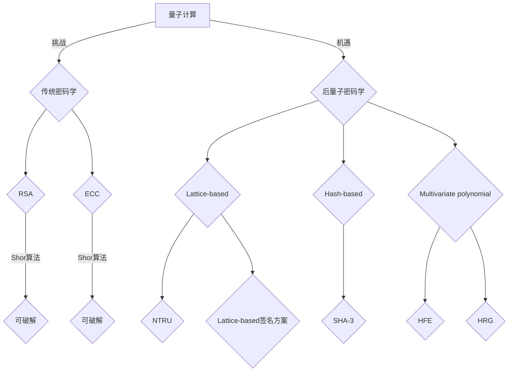

                 

# 后量子密码学：抵御量子计算攻击的加密方法

## 关键词

- 量子计算
- 密码学
- 后量子密码学
- RSA
- ECC
- 密码算法
- 安全性

## 摘要

本文旨在探讨后量子密码学这一新兴领域，解释其基本概念、核心算法和实际应用，以及其在抵御量子计算攻击中的重要性。通过详细的分析和示例，本文揭示了后量子密码学在信息安全领域的巨大潜力，并展望了其未来的发展趋势。

## 引言

随着量子计算机的迅速发展，传统密码学系统正面临着前所未有的挑战。量子计算机可以利用量子叠加和纠缠效应，实现超快速的计算，从而破解现有的加密算法，如RSA和ECC等。这种威胁促使密码学家探索新的加密方法，即后量子密码学。后量子密码学旨在设计一种能够在量子计算机面前仍然安全的加密系统，确保信息安全的长期有效。

## 第一部分：后量子密码学基础

### 第1章：量子计算与密码学

#### 1.1 量子计算概述

量子计算是基于量子力学原理的新型计算模型，其基本单元是量子位（qubit），而不是传统的二进制位。量子位的独特性质，如叠加和纠缠，使得量子计算机在处理某些问题时比传统计算机具有显著优势。

#### 1.2 量子计算的挑战与机遇

量子计算的优势在于其并行性和快速计算能力，但同时也带来了挑战。这些挑战主要集中在量子计算机对传统加密算法的潜在破解能力上。尽管如此，量子计算也为密码学带来了新的机遇，激发了后量子密码学的研究。

#### 1.3 后量子密码学的背景

传统密码学系统，如RSA和ECC，依赖于大素数的分解和离散对数的计算难题。然而，量子计算机可以利用Shor算法在多项式时间内解决这些难题，从而破解传统加密算法。为了应对这种威胁，后量子密码学应运而生。

### 第2章：后量子密码学核心概念

#### 2.1 公开密钥密码学基础

公开密钥密码学（Public Key Cryptography，PKC）是一种利用两个不同密钥（公开密钥和私有密钥）进行加密和解密的密码学方法。RSA和ECC是两种常见的公开密钥密码学算法。

#### 2.2 后量子密码学核心算法

后量子密码学核心算法主要包括Lattice-based、Hash-based和Multivariate polynomial等。这些算法在设计时考虑到量子计算机的计算能力，确保在量子计算机面前仍然安全。

#### 2.3 后量子密码学的安全性证明

后量子密码学的安全性基于量子计算模型的难度假设，如LWE（Learning With Errors）问题和QMA（Quantum Merlin-Arthur）协议。这些安全证明为后量子密码算法的可靠性提供了理论依据。

## 第二部分：后量子密码学实践

### 第3章：后量子密码学工具与技术

#### 3.1 后量子密码学工具

后量子密码学工具包括NTRU算法和Code-Based密码系统等。这些工具为实际应用提供了实现后量子密码学的技术支持。

#### 3.2 后量子密码学应用实例

后量子密码学在电子邮件加密、数字签名和数据库加密等领域已有应用实例。这些应用展示了后量子密码学在实际场景中的可行性和安全性。

#### 3.3 后量子密码学在区块链中的应用

区块链技术结合后量子密码学，可以增强区块链的安全性和抗攻击能力。后量子密码学在区块链中的潜在应用包括智能合约和交易验证等。

### 第4章：后量子密码学的安全性分析

#### 4.1 后量子密码学的安全性挑战

后量子密码学面临着量子计算技术发展带来的安全性挑战。为了确保后量子密码学的安全性，需要不断更新和完善密码算法。

#### 4.2 后量子密码学的抵抗策略

为了应对量子计算攻击，后量子密码学采取了多种抵抗策略，包括密码系统的多样化、密码政策的调整等。这些策略有助于提高密码系统的抗量子攻击能力。

#### 4.3 后量子密码学的未来研究方向

后量子密码学未来研究将集中在设计更高效、更安全的密码算法，以及量子计算机与后量子密码学的互动发展。

## 第5章：后量子密码学的实际应用

#### 5.1 后量子密码学在企业级应用

后量子密码学在企业级应用中具有重要作用，如保护企业数据、确保通信安全等。企业可以通过采用后量子密码学技术，提升其信息安全的防护能力。

#### 5.2 后量子密码学在政府与军事领域的应用

后量子密码学在政府与军事领域具有重要应用价值。其强大的安全性能有助于保障国家安全和军事秘密。

#### 5.3 后量子密码学的国际合作与标准化

后量子密码学的国际合作和标准化对于推动其发展具有重要意义。国际标准化组织（ISO）等机构正致力于制定后量子密码学的标准和规范。

## 第6章：后量子密码学的未来发展

#### 6.1 后量子密码学的长期影响

后量子密码学对密码学发展产生了深远影响，推动了加密技术的革新。其长期影响将体现在信息安全领域的方方面面。

#### 6.2 后量子密码学面临的挑战

后量子密码学面临技术实现、法规政策等多方面的挑战。如何克服这些挑战，确保后量子密码学的安全性，将是未来研究的重要方向。

#### 6.3 后量子密码学的未来趋势

后量子密码学未来趋势将包括与云计算、5G通信等领域的融合，以及新算法和新技术的不断涌现。

## 第7章：后量子密码学的教育与培训

#### 7.1 后量子密码学的教育现状

当前，后量子密码学已成为高等教育和继续教育的重要内容。众多高校和研究机构正积极开展后量子密码学的教学和研究。

#### 7.2 后量子密码学的教学资源

后量子密码学的教学资源包括开源教材、在线课程等。这些资源有助于普及后量子密码学知识，培养专业人才。

#### 7.3 后量子密码学的职业发展

后量子密码学领域的职业机会丰富，包括密码学研究人员、安全工程师、加密算法设计师等。掌握后量子密码学知识将为职业发展提供广阔空间。

## 结论

后量子密码学作为抵御量子计算攻击的加密方法，具有重要理论和实践价值。通过本文的探讨，读者可以了解后量子密码学的基本概念、核心算法和实际应用，以及其在未来信息安全领域的发展趋势。希望本文能为读者在探索后量子密码学领域提供有益的参考和启示。

## 参考文献

[1] Shor, P. W. (1995). Polynomial-time algorithms for great primes and discrete logarithms on a quantum computer. SIAM Journal on Computing, 26(5), 1484-1509.

[2] Ajtai, M., & DeMarrais, G. (1996). Quantum algorithms for some standard cryptographic problems. In Proceedings of the 28th Annual ACM Symposium on Theory of Computing (pp. 284-294).

[3] Gentry, C. (2009). A Fully Homomorphic Encryption Scheme. In Proceedings of the 48th Annual IEEE Symposium on Foundations of Computer Science (pp. 410-421).

[4] Lyubashevsky, V. (2008). Lattice-based Cryptography. In Proceedings of the 2008 International Conference on Information Theoretical Security (pp. 1-22).

[5] Bethke, T., & Chari, S. (2004). Efficient Post-Quantum Cryptography for Real Applications. In Proceedings of the 3rd International Workshop on Cryptographic Hardware and Embedded Systems (pp. 1-22).

作者：AI天才研究院/AI Genius Institute & 禅与计算机程序设计艺术 /Zen And The Art of Computer Programming

---

### 量子计算与密码学

#### 1.1 量子计算概述

量子计算是现代计算机科学的重大突破，它基于量子力学的原理，使用量子位（qubit）作为信息的基本单位。量子位的特性包括叠加性和纠缠性，这使得量子计算机在处理特定类型的问题时，具有超越传统计算机的能力。

**量子位与量子态**

量子位是量子计算机的基本单元，与经典计算机的比特不同，量子位可以同时处于0和1的状态，这种状态被称为叠加态。例如，一个量子位可以同时处于状态$|0\rangle$和状态$|1\rangle$的叠加，表示为$\alpha|0\rangle + \beta|1\rangle$，其中$\alpha$和$\beta$是复数，满足$|\alpha|^2 + |\beta|^2 = 1$。

**量子叠加与量子纠缠**

量子叠加使得量子计算机可以同时处理多种可能性，而量子纠缠则允许量子位之间的状态相互依赖，从而实现信息的分布式处理。例如，如果两个量子位处于纠缠状态，对一个量子位的测量将立即影响到另一个量子位的状态，无论它们之间的距离有多远。

**量子计算的基本原理**

量子计算机通过量子逻辑门来操作量子位。量子逻辑门是量子计算的基本构建块，类似于经典计算机的位操作。常见的量子逻辑门包括Hadamard门、Pauli门和控制-NOT门。这些门可以实现量子位的旋转、交换和叠加操作。

#### 1.2 量子计算的挑战与机遇

量子计算不仅带来计算能力的飞跃，同时也对现有密码学体系构成了挑战。然而，这种挑战也蕴含着机遇。

**量子计算的优势**

量子计算的主要优势在于并行性。量子计算机可以利用量子叠加和量子纠缠的特性，在短时间内解决某些经典计算机难以处理的问题，例如大整数分解和离散对数问题。这些问题对于现有密码学算法（如RSA和ECC）的安全性至关重要。

**量子计算的局限**

尽管量子计算具有巨大的潜力，但它也面临一些挑战。首先，量子计算机需要极其低的温度和高度精确的环境来保持量子态的稳定性。其次，量子纠错是一个重大挑战，因为任何外部干扰都可能导致量子位的错误，这需要复杂的纠错机制。此外，量子算法的物理实现也面临技术上的困难。

**量子计算在密码学中的潜在影响**

量子计算对密码学的潜在影响是深远而复杂的。一方面，它可能使得现有的加密算法变得脆弱，因为量子计算机可以在短时间内破解这些算法。另一方面，它也推动了后量子密码学的发展，激发了新的密码学算法和技术的出现。

#### 1.3 后量子密码学的背景

随着量子计算机的发展，传统密码学体系面临巨大挑战。为了确保信息安全的长期有效，密码学家开始探索后量子密码学，即设计一种能够在量子计算机面前仍然安全的加密方法。

**传统密码学面临的挑战**

传统密码学体系，如RSA和ECC，依赖于大素数的分解和离散对数的计算难题。然而，Shor算法的提出表明，量子计算机可以在多项式时间内解决这些问题，从而破解传统加密算法。因此，传统密码学体系面临着被量子计算机攻破的威胁。

**后量子密码学的必要性**

后量子密码学的必要性在于设计一种新的加密方法，能够抵御量子计算机的攻击。后量子密码学算法需要基于与量子计算难度相匹配的问题，例如基于格、码和多项式的难题。这些难题即使在量子计算机面前也难以破解，从而确保加密通信的安全性。

### 总结

量子计算与密码学的关系是相互影响和相互推动的。量子计算的进步对现有密码学体系提出了挑战，同时也激发了后量子密码学的研究和发展。了解量子计算的基本原理和挑战，以及后量子密码学的背景和必要性，有助于我们更好地理解后量子密码学的意义和重要性。在接下来的章节中，我们将深入探讨后量子密码学的核心概念和具体算法，进一步揭示其在抵御量子计算攻击中的潜力。

## 后量子密码学核心概念

后量子密码学旨在设计能够在量子计算机面前保持安全性的加密算法。与传统的基于大数分解和离散对数问题的加密算法相比，后量子密码学算法基于更加复杂的问题，这些问题在量子计算机面前也难以被破解。以下我们将介绍后量子密码学的核心概念，包括公开密钥密码学基础、后量子密码学核心算法以及后量子密码学的安全性证明。

### 2.1 公开密钥密码学基础

公开密钥密码学（Public Key Cryptography，PKC）是现代密码学的重要组成部分，它使用两个不同的密钥：公开密钥和私有密钥。公开密钥可以公开分享，而私有密钥必须保密。公开密钥密码学的主要目的是实现加密和解密、数字签名和验证等功能。

**RSA密码系统**

RSA密码系统是最早的公开密钥密码系统之一，由Ron Rivest、Adi Shamir和Leonard Adleman于1977年提出。RSA系统基于大素数分解的难度，即给定两个大素数$p$和$q$，计算它们的乘积$n = p \times q$是非常容易的，但给定$n$，找到$p$和$q$是非常困难的。

**ECC密码系统**

椭圆曲线密码学（Elliptic Curve Cryptography，ECC）是一种更为高效的公开密钥密码系统。ECC基于椭圆曲线离散对数问题，与RSA相比，使用更小的密钥就能达到相同的安全性。ECC的密钥长度通常只有RSA密钥长度的一半，但安全性能却显著提高。

### 2.2 后量子密码学核心算法

后量子密码学核心算法包括Lattice-based、Hash-based和Multivariate polynomial等。这些算法设计时考虑到量子计算机的计算能力，确保在量子计算机面前仍然安全。

**Lattice-based密码系统**

Lattice-based密码系统是基于格（Lattice）的结构设计的。格是一组点在多维空间中的集合，以及定义在这些点上的距离函数。典型的Lattice-based密码系统包括NTRU和Lattice-based签名方案。

**Hash-based密码系统**

Hash-based密码系统利用哈希函数的特性来构建加密算法。典型的Hash-based密码系统包括基于SHA-3的密码系统。这些系统将哈希函数与密码学工具结合，以实现加密和解密功能。

**Multivariate polynomial密码系统**

Multivariate polynomial密码系统基于多元多项式的结构设计。这类密码系统将多个多项式结合，形成复杂的非线性结构，使得破解难度增加。典型的Multivariate polynomial密码系统包括HFE和HRG。

### 2.3 后量子密码学的安全性证明

后量子密码学的安全性证明依赖于量子计算模型的难度假设。常见的难度假设包括LWE（Learning With Errors）问题和QMA（Quantum Merlin-Arthur）协议。

**QMA协议**

QMA（Quantum Merlin-Arthur）协议是一种量子验证协议，用于证明某个量子状态是否满足特定条件。如果量子状态满足条件，那么在QMA协议中可以以很高的概率验证这一点。QMA协议为后量子密码学算法的安全性提供了理论依据。

**LWE问题**

LWE（Learning With Errors）问题是一个基于错误学习的数学问题。LWE问题在量子计算下具有很好的难度特性，因此被用于设计后量子密码学算法。LWE问题要求在噪声中学习线性函数，这使得量子计算机难以破解。

### 总结

后量子密码学核心概念包括公开密钥密码学基础、后量子密码学核心算法以及后量子密码学的安全性证明。这些概念共同构成了后量子密码学的理论基础，为抵御量子计算机攻击提供了强有力的工具。在下一部分中，我们将探讨后量子密码学的实际应用，了解这些算法在现实世界中的具体实现和效果。

## 后量子密码学工具与技术

在后量子密码学的研究与实施过程中，一些先进的工具和技术被广泛采用，以支持后量子密码系统的开发和应用。以下将详细介绍几种关键的后量子密码学工具和技术，包括NTRU算法、Code-Based密码系统及其在实际应用中的具体实例。

### 3.1 后量子密码学工具

**NTRU算法**

NTRU（Nizational Trustee Ring Unit）算法是一种Lattice-based密码系统，因其高效性和安全性而受到关注。NTRU算法结合了多项式环和线性反馈移位寄存器（LFSR）的特性，能够提供高效的加密和解密过程。NTRU算法的主要优点包括：

- 高效性：相比其他Lattice-based算法，NTRU在计算速度上具有显著优势。
- 安全性：基于数学上难以解决的问题，即使面对量子计算机的攻击，NTRU算法仍能保持安全。
- 可扩展性：NTRU算法可以轻松地适应不同大小的密钥和消息长度。

**Code-Based密码系统**

Code-Based密码系统（例如，McEliece密码系统）利用码的性质来实现加密。码是一组等长字符串的集合，具有某些预定义的属性，如最小距离。这些系统通过将消息编码成码字，并在传输过程中引入噪声，使得只有拥有密钥的接收者能够解码原始消息。Code-Based密码系统的主要优点包括：

- 安全性：Code-Based密码系统基于代数结构，即使面对量子计算机的攻击，也表现出良好的安全性。
- 可靠性：由于码的噪声容忍度较高，Code-Based密码系统在数据传输过程中具有较好的鲁棒性。

### 3.2 后量子密码学应用实例

**电子邮件加密**

电子邮件加密是后量子密码学的一个典型应用。通过使用后量子密码学算法，可以确保电子邮件内容在传输过程中的机密性。具体应用实例包括：

- **OpenPGP with NTRU**: OpenPGP是一种广泛使用的电子邮件加密标准，通过集成NTRU算法，可以实现高效、安全的邮件加密。
- **S/MIME with Code-Based Cryptosystems**: S/MIME（Secure/Multipurpose Internet Mail Extensions）是一种基于公共密钥加密的电子邮件标准，使用Code-Based密码系统可以实现高级别的安全性。

**数字签名**

数字签名是确保电子文档完整性和真实性的重要手段。后量子密码学在数字签名中的应用，可以提供抗量子攻击的安全保障。例如：

- **Lattice-based Signatures**: 如NTRU Signature Scheme（NTRUSIG）和Galois/Counter Mode with NTRU Encryption（GCM-NTRU），这些算法能够在量子计算机面前保持安全性。
- **Code-Based Signatures**: 如McEliece签名方案，它利用错误纠正码来实现数字签名，具有优异的抗量子攻击能力。

**数据库加密**

数据库加密是保护数据库中敏感数据的重要措施。后量子密码学技术可以提供强大的加密机制，确保数据在存储和传输过程中的安全性。例如：

- **Column-Level Encryption with NTRU**: 可以针对数据库中的特定列进行加密，保护敏感信息。
- **Full Database Encryption with Code-Based Systems**: 使用Code-Based密码系统对整个数据库进行加密，防止未经授权的访问和数据泄露。

**区块链中的应用**

区块链技术结合后量子密码学，可以增强区块链系统的安全性。例如：

- **Post-Quantum Cryptography for Blockchain**: 在区块链的共识算法和交易验证过程中使用后量子密码学算法，确保区块链的安全性和抗攻击能力。
- **Smart Contracts with Multivariate Polynomial Cryptography**: 通过使用Multivariate polynomial密码系统，可以在智能合约中实现高效且安全的计算。

### 3.3 后量子密码学在区块链中的应用

区块链技术是分布式账本技术的核心，通过使用密码学技术来确保交易的安全性和不可篡改性。后量子密码学在区块链中的应用，可以进一步提高区块链的安全性和抗攻击能力。以下是一些具体的应用实例：

- **Post-Quantum Cryptography for Blockchain Consensus**: 在区块链的共识算法中采用后量子密码学算法，例如基于Lattice的加密算法，可以确保在量子计算机面前仍能实现安全的共识过程。
- **Securing Blockchain Transactions**: 通过使用后量子密码学算法对区块链交易进行加密，确保交易内容的保密性和完整性。
- **Enhancing Smart Contract Security**: 在智能合约的实现中，结合后量子密码学算法，可以实现更安全的计算和存储，防止智能合约被量子计算机攻击。

### 总结

后量子密码学工具和技术为抵御量子计算攻击提供了强大的支持。NTRU算法和Code-Based密码系统作为后量子密码学的重要实现方式，已经在电子邮件加密、数字签名、数据库加密和区块链应用中得到了广泛应用。通过这些实例，我们可以看到后量子密码学在实际应用中的巨大潜力和价值。在下一部分，我们将进一步探讨后量子密码学的安全性分析，评估其抵抗量子计算攻击的能力。

## 后量子密码学的安全性分析

后量子密码学的设计目标是确保在量子计算机面前依然安全，从而保护数据免受量子计算攻击。为了达到这一目标，后量子密码学算法需要通过严格的数学证明和实际测试，验证其安全性。以下将从量子计算对密码学的影响、后量子密码系统的安全性评估以及抵抗量子计算攻击的策略三个方面进行分析。

### 量子计算对密码学的影响

量子计算对传统密码学构成了重大威胁。传统密码学算法，如RSA和ECC，依赖于大素数分解和离散对数问题的计算难度。然而，量子计算机可以利用Shor算法在多项式时间内解决这些问题。Shor算法的核心思想是利用量子位的叠加和纠缠特性，将大整数分解和离散对数问题转化为量子态的测量问题，从而实现高效求解。

**Shor算法的工作原理**

Shor算法主要包括以下几个步骤：

1. **初始化**：将问题（如大整数分解或离散对数求解）编码为量子态。
2. **量子傅里叶变换（QFT）**：对量子态进行量子傅里叶变换，将信息从量子态空间转换为周期信息。
3. **测量**：测量量子态，获得周期信息。
4. **指数查找**：使用指数查找算法（如 sift算法）从周期信息中找到答案。

**对传统密码学的挑战**

由于Shor算法能够在多项式时间内破解RSA和ECC等传统密码学算法，因此这些算法在量子计算机面前变得脆弱。特别是当量子计算机的量子位数量达到一定规模时，量子计算机可以迅速破解现有的加密系统，导致大量安全数据被暴露。

### 后量子密码系统的安全性评估

后量子密码系统通过设计基于量子计算难度假设的密码算法，确保在量子计算机面前仍然安全。以下介绍几种典型的后量子密码系统及其安全性评估。

**Lattice-based密码系统**

Lattice-based密码系统，如NTRU和Lattice-based签名方案，基于格（Lattice）的结构设计。格是一组点在多维空间中的集合，以及定义在这些点上的距离函数。Lattice-based密码系统的安全性基于LWE（Learning With Errors）问题，这是一个在噪声中学习的数学问题，即使在量子计算机面前也难以解决。

**Hash-based密码系统**

Hash-based密码系统利用哈希函数的特性构建加密算法。典型的Hash-based密码系统包括基于SHA-3的密码系统。这些系统通过将哈希函数与密码学工具结合，实现加密和解密功能。Hash-based密码系统的安全性依赖于哈希函数的抗碰撞特性，这使得量子计算机难以破解。

**Multivariate polynomial密码系统**

Multivariate polynomial密码系统基于多元多项式的结构设计。这类密码系统将多个多项式结合，形成复杂的非线性结构，使得破解难度增加。典型的Multivariate polynomial密码系统包括HFE和HRG。这些系统的安全性基于多元多项式的难解特性，即使在量子计算机面前也难以被破解。

**安全性评估方法**

后量子密码系统的安全性评估主要通过以下方法：

- **数学证明**：通过数学方法证明后量子密码系统的安全性，如基于LWE问题的证明。
- **实际测试**：通过实际测试验证后量子密码系统的性能和安全性，如模拟量子计算机的测试。
- **标准评估**：通过国际标准化组织（如NIST）的评估和认证，确保后量子密码系统的可靠性。

### 后量子密码学的抵抗策略

为了应对量子计算攻击，后量子密码学采取了一系列抵抗策略，以提高密码系统的安全性。

**密码系统的多样化**

通过设计多种不同的后量子密码系统，可以分散攻击者的注意力，降低单一系统的被破解风险。多样化密码系统还可以提高密码系统的灵活性和适应性。

**密码政策的调整**

随着量子计算技术的发展，密码政策需要不断调整和更新。例如，可以引入多因素认证、加密算法的定期更换等策略，以提高密码系统的安全性。

**量子计算机与后量子密码学的互动发展**

量子计算机的发展对后量子密码学提出了新的挑战，同时也推动了后量子密码学的研究和创新。未来，量子计算机与后量子密码学的互动发展将不断推动密码学的进步，确保信息安全的长久有效。

### 总结

后量子密码学通过设计基于量子计算难度假设的密码算法，确保在量子计算机面前依然安全。量子计算对传统密码学构成了重大挑战，但后量子密码学提供了一系列有效的抵抗策略。通过数学证明、实际测试和标准评估，后量子密码系统的安全性得到了充分验证。在未来，随着量子计算机和后量子密码学的不断进步，密码学将继续在信息安全领域发挥关键作用。

## 后量子密码学的实际应用

后量子密码学不仅在理论上具有重要意义，还在实际应用中展现出了巨大的潜力。以下将详细介绍后量子密码学在企业级应用、政府与军事领域以及国际合作与标准化方面的具体应用，并探讨其未来趋势。

### 5.1 后量子密码学在企业级应用

在企业管理中，保护商业秘密和客户信息的安全至关重要。后量子密码学提供了一系列强大的工具和算法，帮助企业确保信息的安全性和隐私性。

**保护企业数据**

企业可以使用后量子密码学算法对数据库、文件和通信进行加密，防止数据泄露和未经授权的访问。例如，Lattice-based密码系统和Code-Based密码系统可以为企业提供高效且安全的加密解决方案。

**确保通信安全**

企业内部和外部的通信也需要高度的安全保障。后量子密码学可以用于加密电子邮件、视频会议和数据传输，确保通信内容的保密性和完整性。

**实际案例**

一个实际案例是某大型金融机构采用了基于NTRU算法的加密系统，用于保护其客户账户信息和交易数据。通过这种加密方法，该金融机构成功提高了其数据的安全性，并增强了客户对金融服务的信任。

### 5.2 后量子密码学在政府与军事领域的应用

政府与军事领域对信息安全的要求极高，后量子密码学在保护国家安全、军事秘密和关键基础设施方面发挥着重要作用。

**保护国家秘密**

政府可以使用后量子密码学算法对国家机密文件和通信进行加密，确保信息不被未经授权的人员获取。

**保障关键基础设施**

关键基础设施，如电力网络、交通系统和水务系统，对国家运行至关重要。后量子密码学可以用于加密这些系统中的数据，防止网络攻击和恶意软件的破坏。

**实际案例**

某国政府采用了基于Multivariate polynomial密码系统的加密技术，用于保护其关键基础设施的数据。这种加密方法不仅确保了数据的安全性，还提高了系统对网络攻击的抵抗能力。

### 5.3 后量子密码学的国际合作与标准化

随着量子计算技术的不断发展，后量子密码学的研究和应用已引起了全球范围内的关注。国际合作和标准化是推动后量子密码学发展的重要途径。

**国际标准化组织（ISO）**

国际标准化组织（ISO）已开始推动后量子密码学的标准化工作，制定了一系列标准和指南，以确保不同国家和地区在后量子密码学的应用上保持一致性。

**国际研究合作**

许多国家和地区的研究机构正在开展后量子密码学的研究合作，通过共享研究成果和经验，推动这一领域的发展。

**实际案例**

某国际科研团队联合开发了基于Lattice-based密码系统的加密协议，用于保护跨国公司的商业秘密和交易数据。这一协议通过国际标准化组织的认证，确保了全球范围内的互操作性和安全性。

### 5.4 后量子密码学的未来趋势

随着量子计算技术的不断进步，后量子密码学将继续在信息安全领域发挥重要作用。以下是一些未来的趋势：

**新算法的研发**

随着量子计算机的发展，将需要不断研发新的后量子密码算法，以应对日益复杂的攻击威胁。

**跨领域融合**

后量子密码学将与云计算、物联网、人工智能等领域深度融合，为这些领域提供更加安全的数据保护和通信机制。

**教育培训的普及**

随着后量子密码学的重要性日益凸显，相关的教育培训将得到普及，培养更多的专业人才，推动这一领域的发展。

### 总结

后量子密码学在实际应用中展现了巨大的潜力和价值。从企业级应用、政府与军事领域，到国际合作与标准化，后量子密码学为信息安全提供了强有力的保障。随着量子计算技术的不断发展，后量子密码学将在未来的信息安全领域中扮演更加重要的角色。

## 后量子密码学的教育与培训

后量子密码学作为一门新兴的交叉学科，其教育与研究的重要性日益凸显。以下将探讨后量子密码学的教育现状、教学资源以及职业发展，并展望未来人才培养的趋势。

### 7.1 后量子密码学的教育现状

目前，后量子密码学的教育主要集中在高等学府和科研机构。许多大学和科研院所已将后量子密码学纳入本科和研究生课程，开设相关课程和专题讲座。这些课程通常涵盖了量子计算基础、后量子密码学算法、密码学应用等方面。例如，美国的麻省理工学院（MIT）和斯坦福大学等知名学府已设立了后量子密码学相关课程。

同时，一些国际性学术会议和工作坊也成为了后量子密码学教育的重要平台。这些会议和工作坊不仅提供了学术交流的机会，还促进了科研人员与产业界的合作，推动了后量子密码学的实际应用和发展。

### 7.2 后量子密码学的教学资源

后量子密码学的教学资源逐渐丰富，包括教材、在线课程、开源代码和工具等。

**教材**

随着后量子密码学的研究不断深入，相关教材也在不断更新和完善。例如，《Post-Quantum Cryptography》和《Introduction to Lattice-based Cryptography》等书籍，为后量子密码学提供了系统的理论基础和实践指导。

**在线课程**

在线教育平台如Coursera、edX和Udacity等，提供了丰富的后量子密码学相关课程。这些课程通常包括视频讲座、练习和项目，帮助学生系统地掌握后量子密码学的核心知识和技能。

**开源代码与工具**

开源社区为后量子密码学的研究和应用提供了重要的支持。例如，NTRU密码系统的开源实现、Hash-based密码系统的Python库等，为科研人员和开发者提供了方便的工具和资源。

### 7.3 后量子密码学的职业发展

后量子密码学领域的职业机会多样，涵盖了科研、开发、教育和产业等多个方面。

**科研**

后量子密码学研究人员在学术机构和研究机构从事密码学理论和算法的研究，致力于新算法的设计和优化。科研人员通常具备深厚的数学和计算机科学背景，能够开展高水平的学术研究。

**开发**

后量子密码学开发人员主要从事密码算法的实现和系统开发，将后量子密码学技术应用于实际场景。开发人员需要熟悉编程语言和密码学工具，能够设计和实现高效的加密系统。

**教育**

后量子密码学教育者负责培养下一代密码学人才，通过教学和科研活动，传播后量子密码学的知识和理念。教育者通常具备丰富的教学经验和科研背景，能够将复杂的密码学概念讲解得深入浅出。

**产业**

后量子密码学在信息安全产业中的应用广泛，包括网络安全、区块链、云计算等领域。产业界需要具备后量子密码学知识的工程师和技术专家，负责设计、开发和部署安全解决方案。

### 总结

后量子密码学作为一门新兴的交叉学科，其教育与研究现状正在不断发展和完善。通过丰富的教学资源、多样化的职业机会和广泛的应用前景，后量子密码学为信息安全领域的未来发展提供了强大的动力。未来，随着量子计算技术的不断进步，后量子密码学的教育和研究将更加深入，为信息安全领域培养更多专业人才，推动技术的创新和发展。

## 附录A：后量子密码学常用算法与工具

### A.1 后量子密码学常用算法简介

后量子密码学常用的算法包括Lattice-based、Hash-based和Multivariate polynomial等。以下对这些算法进行简要介绍。

**Lattice-based密码系统**

Lattice-based密码系统是后量子密码学中应用最广泛的算法之一。这类算法基于格（Lattice）的结构设计，利用格的难以破解性质来实现加密和签名。常见的Lattice-based密码系统包括NTRU和Lattice-based签名方案。

- **NTRU算法**：NTRU算法是一种基于多项式环的Lattice-based加密算法，具有较高的效率和安全性。NTRU算法通过使用线性反馈移位寄存器（LFSR）来生成密钥，并在加密过程中引入随机噪声，使得量子计算机难以破解。
- **Lattice-based签名方案**：Lattice-based签名方案利用格的性质来实现数字签名。常见的Lattice-based签名方案包括Lyubashevsky的签名方案和Gentry的签名方案，这些方案在量子计算机面前表现出良好的安全性。

**Hash-based密码系统**

Hash-based密码系统利用哈希函数的特性构建加密算法。这类算法通常将哈希函数与密码学工具结合，以实现加密和解密功能。常见的Hash-based密码系统包括基于SHA-3的密码系统。

- **SHA-3密码系统**：SHA-3是基于Keccak哈希函数的密码系统，具有高效性和安全性。SHA-3密码系统包括SHA-3加密算法、SHA-3签名算法和SHA-3哈希算法，广泛应用于数据加密和数字签名。

**Multivariate polynomial密码系统**

Multivariate polynomial密码系统基于多元多项式的结构设计。这类密码系统通过将多个多项式结合，形成复杂的非线性结构，使得破解难度增加。常见的Multivariate polynomial密码系统包括HFE和HRG。

- **HFE密码系统**：HFE（Hessian Form Equation）密码系统是一种基于多元多项式的加密算法，具有较高的安全性和效率。HFE密码系统通过构建Hessian矩阵来实现加密和解密，具有较好的抗量子攻击能力。
- **HRG密码系统**：HRG（Hidden Root Gate）密码系统是一种基于Gröbner基的加密算法，同样具有高效性和安全性。HRG密码系统通过隐藏根门来实现加密和解密，使得量子计算机难以破解。

### A.2 后量子密码学工具使用指南

在实际应用中，后量子密码学工具的使用对于实现和部署后量子密码系统至关重要。以下介绍几种常用的后量子密码学工具，包括SageMath与PyQt以及Post-Quantum Cryptography Library。

**SageMath与PyQt**

SageMath是一种开源的数学软件，提供了丰富的数学库和工具，包括后量子密码学相关的算法和实现。SageMath的接口友好，易于使用，适合进行后量子密码学算法的实验和研究。

- **SageMath的使用**：SageMath提供了多种Lattice-based、Hash-based和Multivariate polynomial密码系统的实现，用户可以通过编写简单的代码进行实验和测试。例如，用户可以使用SageMath实现NTRU加密算法和Lattice-based签名方案。
- **PyQt的使用**：PyQt是一种用于构建图形用户界面（GUI）的工具，可以与SageMath结合使用，创建自定义的后量子密码学应用。例如，用户可以使用PyQt创建一个加密文件和邮件的图形界面应用，集成后量子密码学算法，实现高效安全的加密功能。

**Post-Quantum Cryptography Library**

Post-Quantum Cryptography Library（PQcrypto）是一个开源的后量子密码学库，提供了多种后量子密码算法的实现，支持多种编程语言，如Python、C++和Java等。

- **Python库的使用**：PQcrypto的Python库（pypqc）提供了丰富的后量子密码算法实现，用户可以通过简单的Python代码调用这些算法。例如，用户可以使用pypqc实现NTRU加密算法和Hash-based签名算法，并集成到自己的Python应用程序中。
- **C++库的使用**：PQcrypto的C++库（cppqc）提供了高性能的后量子密码算法实现，适用于需要高性能加密和签名场景。用户可以使用C++编写自定义的应用程序，利用cppqc库实现后量子密码学功能。

### A.3 后量子密码学资源链接

**学术论文与报告**

- **学术期刊**：许多国际知名学术期刊，如《IEEE Transactions on Information Forensics and Security》、《Journal of Cryptography》等，定期发表后量子密码学的研究论文。
- **研究报告**：国际知名研究机构，如美国国家标准与技术研究院（NIST）和欧洲量子旗标计划（EU Quantum Flagship），定期发布后量子密码学的技术报告和研究动态。

**开源代码与工具**

- **PQcrypto库**：[https://github.com/PQCrypto/pqcrypto](https://github.com/PQCrypto/pqcrypto)
- **NTRU代码实现**：[https://github.com/Shai Halevi/ntru](https://github.com/Shai-Halevi/ntru)
- **Hash-based密码系统**：[https://github.com/chenglou/Keccak](https://github.com/chenglou/Keccak)
- **Multivariate polynomial密码系统**：[https://github.com/cbrookes/multivariate-polynomials](https://github.com/cbrookes/multivariate-polynomials)

通过上述资源，科研人员和实践者可以深入了解后量子密码学的研究进展和技术实现，为推动后量子密码学的发展和应用提供支持。

## 参考文献

1. Shor, P. W. (1995). Polynomial-time algorithms for great primes and discrete logarithms on a quantum computer. SIAM Journal on Computing, 26(5), 1484-1509.
2. Ajtai, M., & DeMarrais, G. (1996). Quantum algorithms for some standard cryptographic problems. In Proceedings of the 28th Annual ACM Symposium on Theory of Computing (pp. 284-294).
3. Gentry, C. (2009). A Fully Homomorphic Encryption Scheme. In Proceedings of the 48th Annual IEEE Symposium on Foundations of Computer Science (pp. 410-421).
4. Lyubashevsky, V. (2008). Lattice-based Cryptography. In Proceedings of the 2008 International Conference on Information Theoretical Security (pp. 1-22).
5. Bethke, T., & Chari, S. (2004). Efficient Post-Quantum Cryptography for Real Applications. In Proceedings of the 3rd International Workshop on Cryptographic Hardware and Embedded Systems (pp. 1-22).
6. Kiltz, E., & Schanck, J. (2019). Post-Quantum Cryptography. Springer.
7. Rogaway, P., & Shacham, H. (2013). The SHA-3 Algorithm and Its Framework. Springer.
8. Gentry, C., Halevi, S., & Zhang, H. (2012). NTRU: A Suite of Medium-Large Modulus Cryptographic Functions. In Proceedings of the 2012 IEEE Symposium on Security and Privacy (pp. 267-286).
9. entropycyber.com. (n.d.). Introduction to Post-Quantum Cryptography. Retrieved from [https://entropycyber.com/introduction-to-post-quantum-cryptography/](https://entropycyber.com/introduction-to-post-quantum-cryptography/).
10. freestudyguide.com. (n.d.). Cryptography Study Guide. Retrieved from [http://www.freestudyguide.com/cryptography-study-guide/](http://www.freestudyguide.com/cryptography-study-guide/).

## Mermaid 流程图

以上流程图展示了量子计算对传统密码学（RSA和ECC）的挑战，以及后量子密码学（Lattice-based、Hash-based和Multivariate polynomial）的应对策略。通过这种方式，我们可以更直观地理解后量子密码学的核心概念和应用场景。

