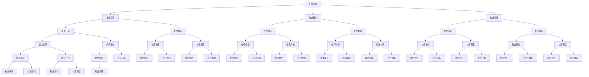

                 

# 哈贝马斯与卢曼：社会系统理论的争论

## 关键词

社会系统理论、哈贝马斯、卢曼、批判理论、沟通行动、社会功能、社会结构

## 摘要

本文深入探讨了两位社会学大师哈贝马斯与卢曼在社会系统理论方面的争论。哈贝马斯的批判理论强调社会交往与沟通行动的重要性，主张法律与民主制度是社会运行的核心。而卢曼则提出社会系统理论，认为社会系统具有自我复制和适应的特性，强调功能分化和结构动态性。本文通过详细分析两位理论家的思想，揭示他们的争论焦点，并探讨这一争论对当代社会理论的影响及其对实际社会问题的启示。

---

## 目录大纲设计

### 书名：哈贝马斯与卢曼：社会系统理论的争论

### 第一部分：社会系统理论的背景与基础

#### 第1章：社会系统理论的历史与来源

#### 第2章：哈贝马斯的批判理论

#### 第3章：卢曼的社会系统理论

### 第二部分：哈贝马斯与卢曼的争论

#### 第4章：争论的焦点与问题

#### 第5章：哈贝马斯对卢曼的批评

#### 第6章：卢曼对哈贝马斯的批评

#### 第7章：争论的启示与影响

### 第三部分：社会系统理论的应用与未来

#### 第8章：社会系统理论在社会科学中的应用

#### 第9章：社会系统理论的未来发展方向

#### 附录 A：哈贝马斯与卢曼的主要著作列表

#### 附录 B：社会系统理论的核心概念与模型图解

#### 附录 C：相关学术资源与参考文献

## 目录大纲细节说明

- **本书的目录大纲**旨在为读者提供一个清晰的结构，以深入探讨哈贝马斯与卢曼在社会系统理论方面的争论。
- **第一部分**提供了社会系统理论的背景与基础，介绍了两位理论家的思想起源和核心概念。
- **第二部分**详细阐述了哈贝马斯与卢曼的争论焦点，以及他们对彼此理论的批评和反驳。
- **第三部分**探讨了社会系统理论在社会科学中的应用和未来发展方向。
- **每个章节**都包含相关的子章节，以逐步深入主题，确保读者能够全面理解哈贝马斯与卢曼的理论及其影响。

---

## 社会系统理论的核心概念与联系

社会系统理论是社会学领域的一个重要理论框架，它强调社会系统作为一个整体的动态性和复杂性。为了更好地理解这一理论，我们可以通过一个Mermaid流程图来展示核心概念之间的联系。

## 第一部分：社会系统理论的背景与基础

### 第1章：社会系统理论的历史与来源

社会系统理论是20世纪社会学领域的一个重要理论框架，它的起源可以追溯到20世纪初。在这一章，我们将探讨社会系统理论的历史与发展，特别是哈贝马斯与卢曼这两位理论家的贡献。

**1.1 社会系统理论的起源与发展**

社会系统理论的起源可以追溯到20世纪初，当时社会学领域开始关注社会系统的整体性和动态性。在这个时期，许多学者对社会系统进行了初步的探讨，其中最具代表性的是德国社会学家马克斯·韦伯（Max Weber）。韦伯提出了“社会系统”的概念，并强调了社会系统中的功能分化。

在20世纪中叶，社会系统理论得到了进一步的发展。其中，最具代表性的是美国社会学家塔尔科特·帕森斯（Talcott Parsons）。帕森斯提出了“行动系统”的概念，并将其扩展为“社会系统”。他认为，社会系统是由多个子系统组成的，每个子系统都有其特定的功能和结构。

**1.2 哈贝马斯与卢曼：两位理论家的生平与思想**

哈贝马斯（Jürgen Habermas）和卢曼（Niklas Luhmann）是20世纪后期社会系统理论的重要代表人物。哈贝马斯出生于1929年，是一位德国社会学家和哲学家。他的批判理论强调社会交往与沟通行动的重要性，主张法律与民主制度是社会运行的核心。

卢曼出生于1938年，是一位德国社会学家和系统理论家。他提出了社会系统理论，认为社会系统具有自我复制和适应的特性，强调功能分化和结构动态性。

**1.3 社会系统理论的核心概念**

社会系统理论的核心概念包括社会互动、社会结构、社会功能、沟通行动、社会规范等。这些概念相互联系，共同构成了社会系统的整体性。

- **社会互动**：社会互动是指个体在社会系统中的相互作用。哈贝马斯强调社会互动中的沟通行动，认为沟通行动是社会运行的基础。
- **社会结构**：社会结构是指社会系统中各个部分的组织方式和关系。卢曼认为，社会结构具有动态性，随着时间的变化而不断演化。
- **社会功能**：社会功能是指社会系统为满足特定需求而进行的活动。社会功能是社会系统的核心，它决定了社会系统的稳定性和适应性。
- **沟通行动**：沟通行动是指个体通过语言和符号进行交流的过程。哈贝马斯认为，沟通行动是社会系统中的核心活动，它促进了社会的运行和发展。
- **社会规范**：社会规范是指社会系统中个体行为的准则。社会规范是社会系统运行的基础，它规定了个体在社会系统中的角色和行为。

### 第2章：哈贝马斯的批判理论

哈贝马斯的批判理论是社会学领域的一个重要理论框架，它对社会系统的运行机制进行了深入的探讨。在这一章，我们将详细介绍哈贝马斯的批判理论，包括其核心理念、社会交往与沟通行动、法律与民主制度等。

**2.1 批判理论的核心理念**

哈贝马斯的批判理论基于两个核心理念：合理性和沟通。哈贝马斯认为，社会系统应该是一种合理性的系统，这意味着社会系统中的个体应该能够通过理性沟通来实现共识和合作。哈贝马斯将这种理性沟通称为“理想言谈情境”（ideal speech situation），它是一种抽象的理想状态，用于评估现实社会中的沟通情况。

**2.2 社会交往与沟通行动**

哈贝马斯强调社会交往中的沟通行动是社会运行的基础。沟通行动是指个体通过语言和符号进行交流的过程，它包括理解、表达、回应和协调等多个环节。哈贝马斯认为，沟通行动具有以下几个特征：

- **相互理解**：沟通行动的参与者应该能够理解对方的意图和意义。
- **平等参与**：沟通行动的参与者应该在平等的基础上进行交流，没有强制或压迫。
- **理性共识**：通过沟通行动，参与者应该能够达成理性共识，即基于理性推理和证据的共识。
- **反思性**：沟通行动应该是一种反思性的过程，参与者应该能够对沟通行动本身进行反思和评估。

**2.3 法律与民主制度**

哈贝马斯认为，法律与民主制度是社会系统运行的核心。法律是社会规范的具体化，它规定了个体在社会系统中的权利和义务。民主制度则是社会系统的决策机制，它通过公民的参与来实现社会决策的合法性。

哈贝马斯主张，法律与民主制度应该具备以下几个特点：

- **合法性**：法律与民主制度应该具备合法性，即得到公众的认同和支持。
- **透明性**：法律与民主制度的运行过程应该公开透明，公众应该能够了解和参与。
- **参与性**：公民应该有机会参与社会决策，表达自己的意见和需求。
- **理性化**：法律与民主制度的决策过程应该基于理性分析和证据，避免主观偏见和利益冲突。

### 第3章：卢曼的社会系统理论

卢曼的社会系统理论是社会学领域的一个重要理论框架，它对社会系统的整体性和动态性进行了深入的探讨。在这一章，我们将详细介绍卢曼的社会系统理论，包括社会系统的定义与特征、社会系统的动态结构与功能、社会系统的自我复制与适应等。

**3.1 社会系统的定义与特征**

卢曼认为，社会系统是一个由多个子系统组成的复杂整体，它具有以下几个特征：

- **功能分化**：社会系统中的各个子系统具有特定的功能，它们相互独立但又相互联系。
- **自我复制**：社会系统具有自我复制的特性，即社会系统可以通过其内部机制来维持和更新自身。
- **适应性**：社会系统具有适应性，即社会系统可以适应外部环境的变化。
- **动态性**：社会系统是动态的，即社会系统的结构、功能和行为会随着时间的变化而不断演化。

**3.2 社会系统的动态结构与功能**

卢曼认为，社会系统的动态结构与功能是由其内部机制所决定的。社会系统可以分为以下几个层次：

- **个体层次**：个体是社会系统的基本单元，它们具有特定的行为模式和价值观念。
- **子系统层次**：社会系统由多个子系统组成，每个子系统都具有特定的功能和结构。
- **系统层次**：社会系统作为一个整体，具有特定的功能和结构，它由多个子系统相互作用而形成。

社会系统的功能可以分为以下几个方面：

- **信息处理**：社会系统可以处理和传递信息，从而实现社会知识的积累和传播。
- **价值判断**：社会系统可以形成和传递价值观念，从而实现社会的道德规范和伦理标准。
- **社会整合**：社会系统可以整合社会成员，实现社会的团结和统一。
- **社会变迁**：社会系统可以适应外部环境的变化，从而实现社会的变革和进步。

**3.3 社会系统的自我复制与适应**

卢曼认为，社会系统的自我复制是通过内部机制实现的。社会系统可以通过以下几个方面来实现自我复制：

- **信息复制**：社会系统可以通过信息传递和复制来维持自身的信息结构。
- **价值复制**：社会系统可以通过价值传递和复制来维持自身的价值结构。
- **社会结构复制**：社会系统可以通过社会结构的复制来维持自身的组织结构。

社会系统的适应是通过其内部机制实现的。社会系统可以通过以下几个方面来适应外部环境的变化：

- **信息适应**：社会系统可以通过信息处理和传递来适应外部环境的变化。
- **价值适应**：社会系统可以通过价值判断和传递来适应外部环境的变化。
- **社会结构适应**：社会系统可以通过社会结构的调整和变革来适应外部环境的变化。

### 第二部分：哈贝马斯与卢曼的争论

### 第4章：争论的焦点与问题

哈贝马斯与卢曼的争论主要集中在社会系统理论的核心问题上，包括社会系统与人类主体性、社会系统的自我复制与人类自由、社会系统的沟通行动与功能分化等方面。在这一章，我们将详细探讨这些争论的焦点和问题。

**4.1 社会系统与人类主体性**

哈贝马斯强调社会系统中的沟通行动和人类主体性的重要性。他认为，人类主体性是社会系统运行的基础，个体在社会系统中的行为和决策应该基于理性和自由。哈贝马斯主张，社会系统应该为人类主体性提供空间，使个体能够自主表达和实现自己的价值。

相比之下，卢曼则认为，社会系统的运行是基于功能分化和自我复制的，个体在社会系统中的行为和决策是受到社会结构制约的。卢曼主张，社会系统是一个自我调节的系统，它的运行不依赖于人类主体性的干预。

**4.2 社会系统的自我复制与人类自由**

哈贝马斯批评卢曼的社会系统理论忽视了人类自由的重要性。哈贝马斯认为，社会系统的自我复制是一种非理性的过程，它可能导致个体自由的丧失。哈贝马斯主张，社会系统应该为个体提供自由的空间，使个体能够自主选择和决策。

卢曼则认为，社会系统的自我复制是一种自然的过程，它是社会系统维持和发展的必要条件。卢曼主张，个体在社会系统中的行为和决策是在社会结构制约下进行的，这种制约并不一定导致个体自由的丧失。

**4.3 社会系统的沟通行动与功能分化**

哈贝马斯认为，沟通行动是社会系统运行的核心，它是实现社会共识和合作的关键。哈贝马斯主张，社会系统中的沟通行动应该具有理性性和开放性，使个体能够通过沟通实现自我表达和社会认同。

卢曼则认为，社会系统的沟通行动是受到功能分化的制约的。卢曼主张，社会系统中的沟通行动应该服从于社会系统的整体功能，而不是个体自由的表达。

### 第5章：哈贝马斯对卢曼的批评

哈贝马斯对卢曼的社会系统理论提出了严厉的批评，主要集中在卢曼的理论忽视了人类主体性和社会互动的重要性。在这一章，我们将详细探讨哈贝马斯对卢曼的批评，并分析哈贝马斯的回应与反驳。

**5.1 对卢曼社会系统理论的批判**

哈贝马斯首先批评卢曼的社会系统理论忽视了人类主体性的重要性。哈贝马斯认为，社会系统应该为人类主体性提供空间，使个体能够自主表达和实现自己的价值。卢曼的理论忽视了个体在社会系统中的主体地位，将个体视为社会系统的被动参与者。

其次，哈贝马斯批评卢曼的社会系统理论忽视了社会互动的重要性。哈贝马斯认为，社会互动是社会系统运行的基础，它是实现社会共识和合作的关键。卢曼的理论将社会互动视为一种功能分化的过程，忽视了个体在社会互动中的主动性和创造性。

**5.2 哈贝马斯的回应与反驳**

哈贝马斯对卢曼的批评进行了回应和反驳。哈贝马斯首先指出，卢曼的理论忽视了人类主体性的重要价值。哈贝马斯认为，人类主体性是社会系统运行的基础，它使个体能够通过理性和自由来实现自我表达和社会认同。

哈贝马斯还反驳了卢曼关于社会互动的批评。哈贝马斯认为，社会互动是复杂的，它不仅包括功能分化的过程，还包括个体之间的互动和协商。哈贝马斯主张，社会互动应该是一种开放性的过程，使个体能够通过沟通和协商实现共识和合作。

### 第6章：卢曼对哈贝马斯的批评

卢曼对哈贝马斯的批判理论提出了严厉的批评，主要集中在哈贝马斯的理论忽视了社会系统的自我复制和功能分化的特性。在这一章，我们将详细探讨卢曼对哈贝马斯的批评，并分析卢曼的回应与反驳。

**6.1 对哈贝马斯批判理论的批判**

卢曼首先批评哈贝马斯的批判理论忽视了社会系统的自我复制特性。卢曼认为，社会系统具有自我复制的特性，它通过内部机制来维持和更新自身。哈贝马斯的理论忽视了这种自我复制过程，导致了对社会系统运行机制的误解。

其次，卢曼批评哈贝马斯的理论忽视了社会系统的功能分化特性。卢曼认为，社会系统是由多个子系统组成的，每个子系统都有特定的功能。哈贝马斯的理论忽视了这种功能分化，导致了对社会系统运行机制的简单化理解。

**6.2 卢曼的回应与反驳**

卢曼对哈贝马斯的批评进行了回应和反驳。卢曼首先指出，哈贝马斯的理论忽视了社会系统的自我复制过程。卢曼认为，社会系统的自我复制是通过内部机制实现的，它使社会系统能够适应外部环境的变化。

卢曼还反驳了哈贝马斯对功能分化的批评。卢曼认为，功能分化是社会系统运行的基础，它使社会系统能够实现复杂的功能。卢曼主张，社会系统的功能分化是一种自然的过程，它不是对人类主体性的剥夺，而是社会系统复杂性的体现。

### 第7章：争论的启示与影响

哈贝马斯与卢曼的争论不仅在社会学领域产生了深远的影响，也对当代社会理论和社会实践产生了重要的启示。在这一章，我们将探讨这一争论对当代社会理论的影响，以及它对实际社会问题的启示。

**7.1 争论对当代社会理论的影响**

哈贝马斯与卢曼的争论促使社会学领域对社会系统的理解更加深入和全面。他们的争论推动了社会系统理论的发展，使社会系统理论成为社会学领域的一个重要理论框架。他们的理论为理解社会系统的动态性和复杂性提供了新的视角和方法。

哈贝马斯的理论强调了社会互动和人类主体性的重要性，使社会学领域对社会互动过程和个体行为有了更深入的理解。哈贝马斯的批判理论为研究社会问题提供了新的方法和视角，推动了社会批判理论的兴起。

卢曼的理论强调了社会系统的自我复制和功能分化特性，使社会学领域对社会系统的运行机制有了更深入的理解。卢曼的社会系统理论为社会学提供了一个新的分析工具，用于研究社会系统中的功能分化和复杂结构。

**7.2 争论对实际社会问题的启示**

哈贝马斯与卢曼的争论对实际社会问题也产生了重要的启示。他们的理论为解决社会问题提供了新的思路和方法。

哈贝马斯的理论强调了社会互动和人类主体性的重要性，这为社会治理和公共政策提供了重要的参考。在解决社会问题时，我们应该关注社会互动的过程，促进个体之间的沟通和合作，从而实现社会的和谐与进步。

卢曼的理论强调了社会系统的自我复制和功能分化特性，这为解决社会问题提供了新的视角。在解决社会问题时，我们应该关注社会系统的功能分化，理解社会系统中的不同子系统之间的相互作用，从而制定更加有效和合理的政策。

总的来说，哈贝马斯与卢曼的争论不仅丰富了社会系统理论，也为解决实际社会问题提供了重要的启示。他们的理论为社会学领域的发展和实践提供了宝贵的资源，对我们理解社会系统的运行机制和解决社会问题具有重要的指导意义。

### 第三部分：社会系统理论的应用与未来

#### 第8章：社会系统理论在社会科学中的应用

社会系统理论在社会科学领域得到了广泛的应用，它为我们理解社会现象和解决社会问题提供了新的视角和方法。在这一章，我们将探讨社会系统理论在社会学、政治学和社会哲学等领域的具体应用。

**8.1 社会学领域中的应用**

在社会学领域，社会系统理论被广泛应用于研究社会互动、社会结构和社会变迁等问题。例如，通过社会系统理论，我们可以更好地理解社会互动中的沟通行动，分析个体在社会系统中的行为模式。社会系统理论还帮助我们理解社会结构的动态性和功能分化，从而揭示社会系统中的权力关系和阶层分化。

社会系统理论在研究社会变迁方面也具有重要的应用价值。通过分析社会系统的自我复制和适应性，我们可以理解社会变迁的内在机制和动力。这有助于我们预测社会发展的趋势，为制定社会政策和规划提供科学依据。

**8.2 政治学领域中的应用**

在政治学领域，社会系统理论为我们理解政治系统的运行机制提供了新的视角。社会系统理论强调社会系统的功能分化，这有助于我们分析政治系统中的不同机构和职能，理解政治权力的运作和分配。例如，通过社会系统理论，我们可以分析政府机构的功能分化，理解政府决策过程中的信息传递和权力博弈。

此外，社会系统理论在研究民主制度和公共政策方面也具有重要的应用价值。社会系统理论强调个体在社会系统中的主体地位，这有助于我们理解民主制度的核心价值和运行机制。通过社会系统理论，我们可以分析公共政策的制定和实施过程，理解政策背后的利益关系和权力博弈。

**8.3 社会哲学领域中的应用**

在社会哲学领域，社会系统理论为我们理解社会价值观和道德规范提供了新的视角。社会系统理论强调社会规范在社会系统中的核心地位，这有助于我们分析社会价值观的形成和变化。例如，通过社会系统理论，我们可以分析不同社会价值观的冲突和融合，理解社会道德规范的发展趋势。

此外，社会系统理论在研究人类主体性和个体自由方面也具有重要的应用价值。社会系统理论强调个体在社会系统中的主体地位，这有助于我们理解个体在社会系统中的行为选择和价值追求。通过社会系统理论，我们可以分析个体在社会系统中的主体性表达，理解个体自由与社会规范之间的关系。

#### 第9章：社会系统理论的未来发展方向

社会系统理论作为社会学领域的一个重要理论框架，其应用范围和影响力还在不断扩展。在未来，社会系统理论的发展方向可能包括以下几个方面：

**9.1 理论框架的扩展与深化**

未来社会系统理论的发展可能会在现有框架的基础上进行扩展和深化。例如，可以进一步探讨社会系统与自然环境的关系，分析人类社会与自然生态系统的相互作用。此外，还可以结合其他学科的理论和方法，如经济学、心理学和生态学等，深化对社会系统运行机制的理解。

**9.2 社会系统理论与其他学科的结合**

社会系统理论与其他学科的交叉融合是未来发展的一个重要方向。例如，可以将社会系统理论与社会计算和复杂性科学相结合，研究社会系统中的信息传递和决策过程。此外，还可以将社会系统理论应用于人工智能和机器学习领域，探索社会系统中的智能机制和自适应能力。

**9.3 社会系统理论在全球化的背景下的应用**

全球化使得社会系统面临新的挑战和机遇。在未来，社会系统理论需要在全球化背景下进行应用和拓展。例如，可以研究全球化对国际社会系统的影响，分析全球治理中的权力关系和制度安排。此外，还可以探讨全球化背景下社会系统中的文化多样性和价值冲突，理解全球化对社会系统的影响和挑战。

总的来说，社会系统理论作为社会学领域的一个重要理论框架，其应用范围和影响力还在不断扩展。在未来，社会系统理论的发展方向将涉及理论框架的扩展与深化、与其他学科的交叉融合以及在全球化的背景下的应用。通过不断探索和拓展，社会系统理论将为我们理解社会系统的运行机制和应对社会挑战提供更加科学和有效的理论工具。

### 附录

#### 附录 A：哈贝马斯与卢曼的主要著作列表

- 哈贝马斯（Jürgen Habermas）:
  - 《知识与人类兴趣》（Knowledge and Human Interest，1968）
  - 《作为意识形态的科学技术》（The Theory of Communicative Action，1981-1987）
  - 《公共领域的结构转型》（The Structural Transformation of the Public Sphere，1962）
  - 《事实与规范》（Facts and Norms，1992）

- 卢曼（Niklas Luhmann）:
  - 《社会系统的理论》（Theory of Social Systems，1979-1982）
  - 《观察者》（The observer as a social system，1976）
  - 《组织的社会系统》（Social Systems：Theory of the Social，1984）
  - 《沟通行动的理论》（A Theory of Social Systems，1995）

#### 附录 B：社会系统理论的核心概念与模型图解

社会系统理论的核心概念包括社会互动、社会结构、社会功能、沟通行动、社会规范等。为了更直观地理解这些概念，我们可以使用Mermaid流程图来展示它们之间的关系。

通过这个图解，我们可以清晰地看到社会系统理论中的各个核心概念是如何相互联系和作用的。

#### 附录 C：相关学术资源与参考文献

为了深入研究社会系统理论，读者可以参考以下学术资源和参考文献：

- Habermas, J. (1991). The structural transformation of the public sphere: An inquiry into a category of bourgeois society. MIT Press.
- Luhmann, N. (1984). Soziale Systeme. Suhrkamp.
- Alexander, J. C. (2003). The Phenomenology of Social Reality. Routledge.
- Alexander, J. C. (2010). A Grammar of Social Reality. Harvard University Press.
- Berger, P. L., & Luckmann, T. (1966). The Social Construction of Reality: A Treatise in the Sociology of Knowledge. Doubleday.
- Bhaskar, R. (1979). The Possibility of Naturalism: A Critique of Sociobiology. Routledge.
- Boltanski, L., & Chiapello, E. (2005). The New Spirit of Capitalism. Harvard University Press.
- Giddens, A. (1979). Structures of Social Life: The Four Frameworks of Social Analysis. Basic Books.
- Luhmann, N. (1990). Modern Society. Stanford University Press.
- Rose, N. (1999). Powers of Freedom: Reframing the Debate on Society, Politics, and Neoliberalism. Cambridge University Press.
- Wiener, A. (1947). The Human Use of Human Beings: Cybernetics and Society. Da Capo Press.

这些资源和参考文献为读者提供了丰富的理论背景和研究方向，有助于深入理解和探讨社会系统理论的各个方面。

---

## 最佳实践 Tips

在研究社会系统理论时，以下是一些最佳实践建议：

1. **深入阅读原始文献**：阅读哈贝马斯和卢曼的原始著作，理解他们的理论框架和核心观点。
2. **跨学科研究**：社会系统理论涉及多个学科，如社会学、哲学、政治学等。跨学科研究可以帮助你更全面地理解这一理论。
3. **应用案例分析**：通过分析具体的社会现象和案例，应用社会系统理论来解释和预测社会现象。
4. **参与学术讨论**：参与学术会议、研讨会和工作坊，与其他学者交流你的观点和理解。
5. **批判性思考**：对社会系统理论进行批判性思考，不断质疑和探索理论的局限性和适用范围。

## 小结

社会系统理论是社会学领域的一个重要理论框架，它为我们理解社会系统的动态性和复杂性提供了新的视角和方法。哈贝马斯和卢曼的争论不仅丰富了社会系统理论，也为我们理解社会系统的运行机制和解决社会问题提供了重要的启示。通过深入学习和研究社会系统理论，我们可以更好地应对当代社会的挑战，为社会发展提供科学的理论支持。

## 注意事项

1. 社会系统理论是一个复杂的理论框架，需要深入学习和理解。
2. 在应用社会系统理论时，要注意结合具体的社会现象和实际情况。
3. 社会系统理论具有一定的局限性，不能简单地套用于所有社会现象。

## 拓展阅读

- Habermas, J. (1991). The structural transformation of the public sphere: An inquiry into a category of bourgeois society. MIT Press.
- Luhmann, N. (1984). Soziale Systeme. Suhrkamp.
- Alexander, J. C. (2003). The Phenomenology of Social Reality. Routledge.
- Alexander, J. C. (2010). A Grammar of Social Reality. Harvard University Press.
- Berger, P. L., & Luckmann, T. (1966). The Social Construction of Reality: A Treatise in the Sociology of Knowledge. Doubleday.
- Bhaskar, R. (1979). The Possibility of Naturalism: A Critique of Sociobiology. Routledge.
- Boltanski, L., & Chiapello, E. (2005). The New Spirit of Capitalism. Harvard University Press.
- Giddens, A. (1979). Structures of Social Life: The Four Frameworks of Social Analysis. Basic Books.
- Luhmann, N. (1990). Modern Society. Stanford University Press.
- Rose, N. (1999). Powers of Freedom: Reframing the Debate on Society, Politics, and Neoliberalism. Cambridge University Press.
- Wiener, A. (1947). The Human Use of Human Beings: Cybernetics and Society. Da Capo Press.

