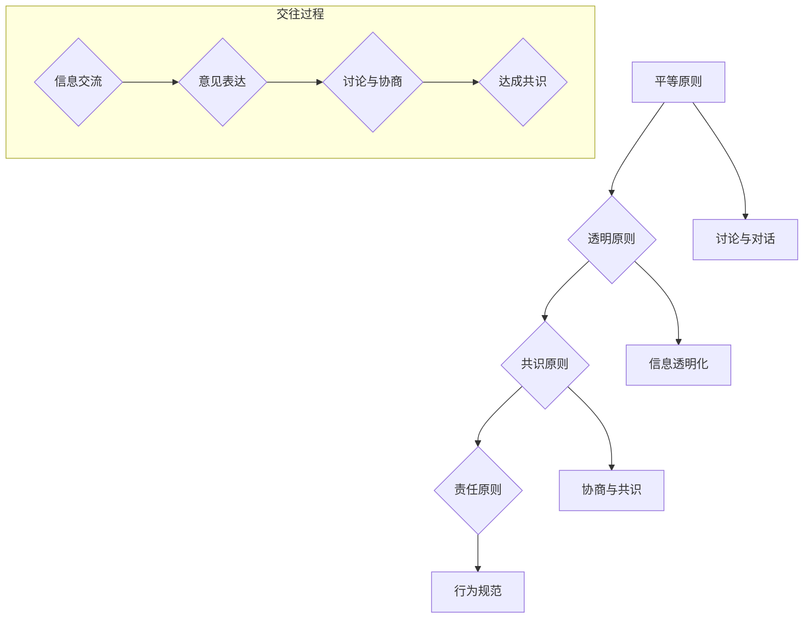
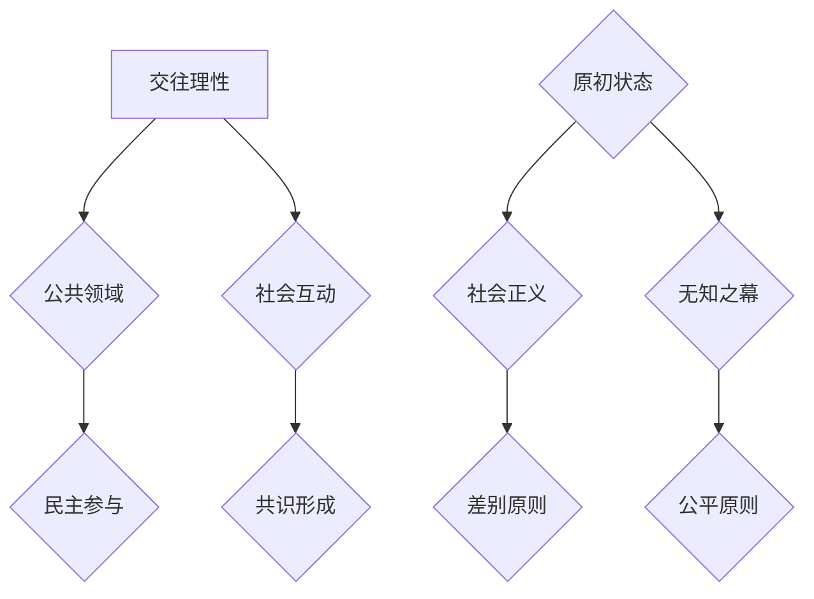
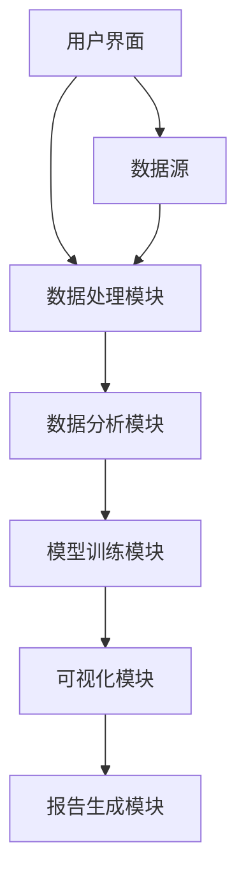
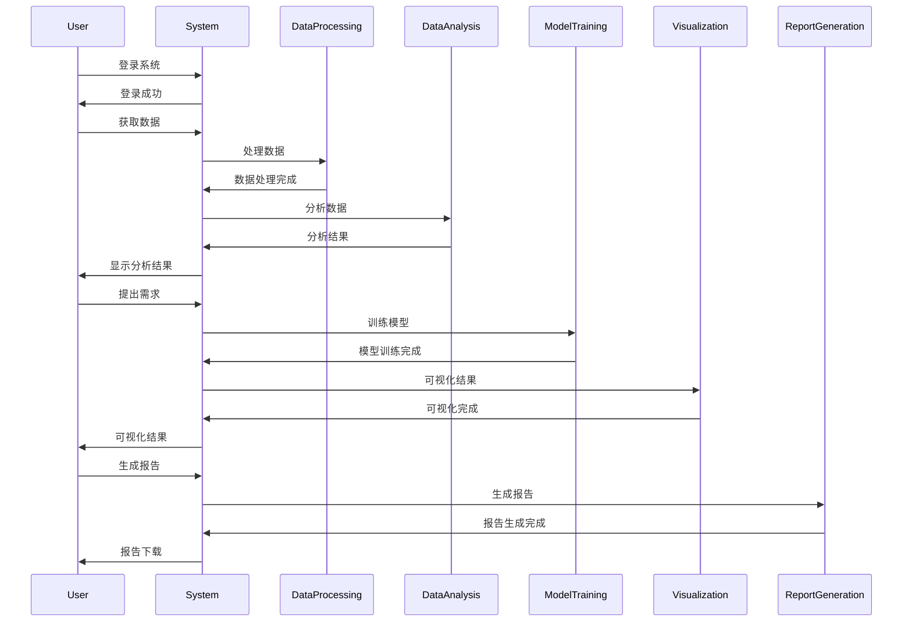

                 

### 哈贝马斯与罗尔斯：现代社会正义理论的构建

现代社会正义理论的构建是哲学和社会科学研究中的核心问题之一。在众多哲学家和社会学家中，哈贝马斯（Jürgen Habermas）和罗尔斯（John Rawls）的理论具有深远的影响，对现代社会的正义问题提供了独特的视角和深刻的分析。本文将以哈贝马斯与罗尔斯的正义理论为核心，通过对两人生平、主要哲学思想、正义理论的基本概念和核心观点的详细阐述，探讨他们在现代社会正义理论构建中的贡献。

### 文章关键词

1. 哈贝马斯
2. 罗尔斯
3. 正义理论
4. 交往理性
5. 公平的正义
6. 社会正义
7. 民主理论

### 文章摘要

本文首先介绍了哈贝马斯和罗尔斯的生平及其主要哲学思想，随后深入分析了他们的正义理论基本概念，包括正义的定义与分类、正义理论的历史发展等。接着，文章探讨了哈贝马斯的交往理性与公正、民主理论与政治参与，以及他对当代社会问题的分析。对于罗尔斯，本文详细阐述了他的“正义作为公平的正义”理论，包括原初状态和差别原则。随后，文章比较了哈贝马斯与罗尔斯的正义理论，分析了他们的互补性和局限性。最后，文章提出了现代社会正义理论的构建路径，并对未来社会正义理论的发展趋势进行了展望。

## 第一部分：哈贝马斯正义理论

### 第1章：哈贝马斯的生平与哲学思想

哈贝马斯（1929-2021）是一位德国哲学家，出生于德国但泽（现波兰格但斯克），他的哲学思想对20世纪晚期以及21世纪初的哲学、社会学和政治学产生了深远的影响。哈贝马斯的哲学追求在于建立一种能够统一理性、社会和文化批判的现代性理论，并在此基础上探讨社会正义和民主问题。

#### 1.1 哈贝马斯的生平简介

哈贝马斯的哲学之路始于其对现象学和语言哲学的浓厚兴趣。他在1954年获得哲学学位后，继续深入研究，于1961年完成了他的博士学位论文《公共领域的结构转型》。在这篇论文中，哈贝马斯分析了18世纪德国公共领域的形成和转型，探讨了公共领域在社会和政治生活中的作用。

在接下来的几十年中，哈贝马斯的学术生涯跨越了多个阶段。他在1964年至1971年间任教于法兰克福大学，并与法兰克福学派的其他成员如阿多诺和霍克海默共同工作。这一时期，他的研究重点从文化批判转向了社会理论，特别是在交往理性和社会系统的概念上进行了深入探讨。

哈贝马斯在1971年迁至德国斯图加特大学，并在此后的几年中继续发展他的社会理论。1981年，他出版了《交往行动理论》，这是他最重要的作品之一，提出了交往理性的概念，强调语言和社会互动在社会建构中的核心作用。

在20世纪90年代，哈贝马斯将研究重点转向了政治哲学和民主理论，特别是在《包容他者》（1996）和《沟通的行为》（1991）等作品中，他探讨了民主政治的实践和民主参与的形式与机制。

#### 1.2 哈贝马斯的主要哲学思想

哈贝马斯的哲学思想涉及多个领域，包括社会理论、政治哲学、语言哲学和文化批判。以下是他几个核心的哲学概念：

1. **交往理性（Communicative Rationality）**：哈贝马斯认为，理性不仅仅是逻辑推理的能力，更重要的是在社会互动中通过对话和交流来达成共识的能力。交往理性强调沟通中的平等和透明性，以及参与者之间相互理解和尊重的重要性。

2. **公共领域（Public Sphere）**：哈贝马斯分析了18世纪德国公共领域的兴起和转型，将公共领域视为一个开放的社会空间，公民在其中自由讨论和交换意见。公共领域对于民主政治的健康发展至关重要。

3. **文化再生产（Cultural Reproduction）**：哈贝马斯提出了文化再生产的概念，认为文化不仅仅是一种内在的价值观和信仰体系，它同时也是社会成员通过教育和日常生活不断地复制和再生产的过程。

4. **系统与生活世界（System and Lifeworld）**：哈贝马斯区分了系统和生活世界两个概念。系统指的是那些由外部规则和利益驱动的社会机构，如经济和行政机构；而生活世界则是指个体的日常生活和社会互动的领域。哈贝马斯认为，系统对生活世界的侵蚀会导致社会异化。

5. **民主理论和政治参与**：哈贝马斯的民主理论强调通过民主参与实现社会正义。他探讨了民主政治的实践形式和机制，如公民论坛、直接民主等，认为这些机制有助于促进社会共识和民主决策。

### 总结

哈贝马斯的哲学思想以其广泛的理论视野和深刻的社会关怀而著称。通过交往理性、公共领域、文化再生产等概念，他试图建立一个既尊重个体自由又促进社会正义的现代性理论。哈贝马斯的理论不仅对哲学研究产生了深远影响，也为现代社会正义和政治民主提供了重要的理论资源。

## 第2章：正义理论的基本概念

### 2.1 正义的定义与分类

正义是一个复杂而多层次的概念，哲学家们对它的定义和分类有着不同的理解和解释。在哈贝马斯的理论中，正义不仅是一种伦理价值观，更是一种社会制度安排和分配原则。

首先，我们可以将正义分为分配正义和程序正义两大类。分配正义关注的是资源和利益的分配是否公平合理，如财富、收入、机会等。程序正义则关注的是决策过程是否公正透明，如选举制度、法律程序等。

哈贝马斯认为，分配正义和程序正义是相互关联的。一个公正的社会不仅需要合理的资源分配，还需要公正的决策程序来确保这些分配是公正的。以下是一个简单的分配正义和程序正义的概念对比表格：

| **概念** | **定义** | **示例** |
| --- | --- | --- |
| **分配正义** | 资源和利益的分配原则 | 社会福利、教育机会、财富分配 |
| **程序正义** | 决策过程的原则 | 法律程序、选举制度、公民参与 |

### 2.2 正义理论的历史发展

正义理论有着悠久的历史，从古希腊哲学家柏拉图和亚里士多德，到中世纪的神学家，再到现代的哲学家和社会学家，他们都有不同的正义观念和理论。

柏拉图在《理想国》中提出了“正义是国家的和谐”这一观点，认为正义是个人和国家的内在品质。亚里士多德则认为正义是一种道德美德，强调公正和平衡。中世纪的神学家如阿奎那则将正义与宗教信仰相结合，认为正义是上帝赋予的道德规范。

现代哲学家中，约翰·罗尔斯提出了“正义作为公平的正义”理论，强调原初状态和无知之幕的概念。而约翰·斯图亚特·密尔则提出了“最大幸福原则”，认为正义是追求最大多数人的最大幸福。

哈贝马斯的正义理论则是在这些基础上发展而来的，他强调交往理性在社会正义中的核心作用，认为正义不仅是一种分配原则，更是一种社会共识和对话的结果。

### 2.3 哈贝马斯的正义观

哈贝马斯的正义观以其对交往理性的强调而著称。他认为，正义不仅仅是一个理论概念，更是一种实践原则，需要在社会互动中实现。

哈贝马斯提出了“交往理性”（communicative rationality）的概念，认为理性不仅仅是个体内部的思考能力，更是在社会互动中通过对话和沟通达成共识的能力。在他看来，一个公正的社会需要建立在这种交往理性的基础上。

哈贝马斯还提出了“公共领域”（public sphere）的概念，认为公共领域是一个开放的社会空间，公民可以在其中自由地讨论和交换意见。公共领域对于民主政治的健康发展至关重要，因为它提供了一个平台，让公民能够参与社会决策，表达自己的观点，监督政府行为。

哈贝马斯的正义观强调以下几个核心原则：

1. **平等参与**：每个人都应该有平等的机会参与社会互动和公共讨论。
2. **透明性**：决策过程应该是公开透明的，确保每个人都能了解并参与其中。
3. **公正性**：资源和利益的分配应该基于公正的原则，确保每个人都能够得到公平的待遇。
4. **社会对话**：社会正义的实现需要通过持续的社会对话和协商，形成共识。

### 总结

哈贝马斯的正义理论以其对交往理性的强调和对公共领域的重视而具有独特性。通过分析正义的定义、分类以及历史发展，我们可以更好地理解哈贝马斯的正义观，认识到他在现代社会正义理论构建中的重要贡献。

### 第3章：哈贝马斯的交往理性与公正

#### 3.1 交往理性的概念

哈贝马斯的交往理性（communicative rationality）是他哲学体系中的核心概念之一。交往理性强调的是通过沟通和对话达成共识的过程，它不仅仅是逻辑推理，更是一种社会互动中的理性行为。哈贝马斯认为，交往理性是现代社会健康发展的关键，因为它提供了实现公正和民主的基础。

在哈贝马斯看来，交往理性具有以下几个特点：

1. **平等性**：交往中的参与者应该是平等的，没有任何一方占据主导地位。这意味着每个人都应该有平等的发言权和表达自己的观点的机会。
2. **透明性**：交往过程应该是公开透明的，所有参与者都应该能够了解讨论的内容和背景，从而做出合理的判断和决策。
3. **共识性**：通过交往和对话，参与者可以在相互理解和尊重的基础上达成共识。这种共识不仅是个人意愿的表达，更是一种对社会规范的共同认同。
4. **规范性**：交往理性不仅是一种行为准则，更是一种社会规范。它要求人们在交往中遵循一定的道德和伦理原则，如诚实、公正、尊重等。

#### 3.2 公正的社会结构

在哈贝马斯的理论中，交往理性是构建公正社会结构的基础。他认为，一个公正的社会结构应该具备以下几个特征：

1. **平等的权利**：每个人都应该享有平等的法律权利和社会权利，无论其种族、性别、宗教信仰或其他身份特征。
2. **开放的公共领域**：公共领域是一个开放的社会空间，公民可以在其中自由地讨论和交换意见。这个空间对于民主政治的健康发展至关重要。
3. **透明的决策过程**：决策过程应该是公开透明的，确保每个人都能了解并参与其中。这有助于防止权力滥用和腐败现象的发生。
4. **有效的公民参与**：公民应该有有效的渠道参与社会决策，表达自己的观点和需求。这可以通过民主选举、公民论坛、直接民主等方式实现。

为了更好地理解哈贝马斯的这些观点，我们可以通过一个简单的ER（实体关系）图来展示社会结构中的核心实体及其关系：

```mermaid
erDiagram
  User ||--|{ Public Sphere }|-- Forum
  User ||--|{ Decision Process }|-- Policy
  Public Sphere ||-- Decision Process
  Forum ||-- Policy
```

在这个ER图中，用户（User）是参与社会互动的基本实体，他们通过公共领域（Public Sphere）和决策过程（Decision Process）参与社会事务。公共领域提供了论坛（Forum）供公民自由讨论，而决策过程则涉及政策的制定和执行。

#### 3.3 公正的交往原则

哈贝马斯提出了几个核心的公正交往原则，这些原则是构建公正社会的基础。以下是这些原则及其应用：

1. **平等原则**：每个参与者都应该有平等的发言权和表达机会，确保讨论的公平性。在实际应用中，这可以通过设立平等的发言时间、确保不同背景的参与者有机会发言等方式实现。
2. **透明原则**：决策过程和讨论内容应该是公开透明的，确保所有参与者都能了解情况，做出合理的判断。在实际应用中，这可以通过公开会议记录、发布政策草案、提供透明的审议过程等方式实现。
3. **共识原则**：通过交往和对话，参与者应该在相互理解和尊重的基础上达成共识。在实际应用中，这可以通过建立公民论坛、组织公众意见调查、通过对话和协商解决冲突等方式实现。
4. **责任原则**：每个参与者都应该对自己的言行负责，尊重他人的权利和尊严。在实际应用中，这可以通过制定行为准则、建立监督机制、鼓励公民责任感等方式实现。

为了更好地展示这些原则的应用，我们可以使用Mermaid流程图来描述一个公正交往的过程：



在这个流程图中，交往过程包括了信息交流、意见表达、讨论与协商以及达成共识几个步骤，这些步骤都遵循了公正的交往原则。通过这样的流程图，我们可以更直观地理解公正交往的过程和原则。

### 总结

哈贝马斯的交往理性与公正理论提供了对现代社会正义构建的深刻洞察。通过强调交往理性、构建公正的社会结构和遵循公正的交往原则，哈贝马斯为我们提供了一种可行的路径，以实现一个更加公正和民主的社会。这些理论不仅具有学术价值，也为实际社会问题的解决提供了有益的参考。

## 第4章：哈贝马斯的民主理论与政治参与

### 4.1 民主理论的基础

哈贝马斯的民主理论基于他对民主的深刻理解，即民主不仅仅是一种政治制度，更是一种社会文化状态。他认为，民主的核心在于公民的参与和决策的透明性。哈贝马斯将民主分为形式民主和实质民主两个层次。

形式民主强调的是制度的完善和程序的公正，如定期的选举、公开的立法程序等。而实质民主则强调决策内容的合理性，即决策是否真正反映了公民的利益和意愿。哈贝马斯认为，一个健康的民主社会需要同时具备形式民主和实质民主。

#### 民主理论的核心观点

1. **公众参与**：哈贝马斯强调公民在民主政治中的参与至关重要。他提出了“公众参与”的概念，认为公民应该有广泛的渠道参与政治决策，表达自己的观点和需求。
2. **公共领域**：哈贝马斯认为，公共领域是民主政治的基础，它是公民进行自由讨论和辩论的空间。一个健康的公共领域能够促进社会共识的形成，增强民主的实质性。
3. **话语民主**：哈贝马斯提出了“话语民主”的概念，认为民主的核心是话语的自由和多样性。他主张，民主决策应该基于开放的对话和辩论，而不是权力的集中和压制。

#### 哈贝马斯对民主理论的贡献

哈贝马斯的民主理论对现代民主政治具有重要的贡献。他强调了公民参与和公共领域的重要性，提出了话语民主的概念，为现代民主政治提供了新的视角和理论框架。

### 4.2 民主政治的实践

哈贝马斯的民主理论不仅提供了理论框架，还关注民主政治的实践。他提出了几种民主政治的实践形式，如直接民主、代议制民主和混合民主。

1. **直接民主**：直接民主是指公民直接参与决策，如公投、公民论坛等。哈贝马斯认为，直接民主能够更好地反映公民的意愿和需求，提高民主的实质性。
2. **代议制民主**：代议制民主是指公民通过选举代表来参与决策。哈贝马斯认为，代议制民主是现代民主政治的主要形式，但需要确保代表的代表性和独立性。
3. **混合民主**：哈贝马斯提出了混合民主的概念，认为结合直接民主和代议制民主的优点，可以构建一个更加健康和有效的民主政治体制。

#### 民主实践的形式与机制

1. **公民论坛**：哈贝马斯认为，公民论坛是促进公众参与和民主讨论的有效机制。公民论坛提供了一个平台，让公民可以自由地讨论和交流，形成社会共识。
2. **直接民主机制**：如公投、公民提案等，这些机制可以让公民直接参与决策，确保决策的合法性和合理性。
3. **代议制民主机制**：如选举、立法等，这些机制确保公民通过代表来参与决策，实现民主政治的制度化。

### 4.3 民主参与的形式与机制

哈贝马斯认为，民主参与的形式和机制是民主政治的核心。他提出了几种民主参与的形式和机制，以促进公民的参与和民主决策。

1. **公众意见调查**：哈贝马斯认为，公众意见调查是一种有效的民主参与机制，可以通过问卷调查、民意测验等方式，收集公民的意见和需求，为决策提供参考。
2. **公民立法倡议**：哈贝马斯提出了公民立法倡议的概念，认为公民应该有权利提出立法倡议，通过公民投票来决定是否通过相关法律。
3. **公民陪审团**：哈贝马斯认为，公民陪审团是一种有效的民主参与形式，可以让公民直接参与司法决策，确保司法公正。

#### 案例分析

为了更好地理解哈贝马斯的民主理论和实践，我们可以通过以下案例分析：

1. **瑞士的直接民主实践**：瑞士是一个以直接民主著称的国家，通过公投和公民论坛等方式，公民可以直接参与决策。这种直接民主实践得到了哈贝马斯的认可，他认为瑞士的经验为其他国家的民主政治提供了有益的借鉴。
2. **德国的公民论坛**：德国在推进民主政治方面有着丰富的经验，公民论坛作为一种民主参与形式，得到了广泛的应用。通过公民论坛，公民可以自由讨论和交流，形成社会共识，为政策制定提供参考。

### 总结

哈贝马斯的民主理论以其对公民参与和公共领域的强调而具有独特性。通过分析民主理论的基础、实践形式与机制，以及民主参与的形式与机制，我们可以更好地理解哈贝马斯的民主理论，认识到他在民主政治实践中的贡献。哈贝马斯的民主理论不仅为学术研究提供了重要的理论资源，也为实际民主政治的推进提供了有益的启示。

## 第5章：哈贝马斯对当代社会问题的分析

### 5.1 社会不平等的根源

哈贝马斯对社会不平等问题的根源进行了深刻的分析，他认为社会不平等的根源主要在于以下几个方面：

1. **市场经济的扩张**：哈贝马斯认为，市场经济的扩张导致了社会资源的集中和分配不均。在市场经济中，资源主要集中于拥有资本和财富的个体和集团手中，这使得贫富差距不断扩大。

2. **教育和文化的差异**：哈贝马斯指出，教育和文化差异也是导致社会不平等的重要因素。在现代社会，优质的教育资源主要集中在富裕家庭，这导致了社会阶层之间的差距难以缩小。

3. **社会结构的再生产**：哈贝马斯认为，社会结构的再生产使得社会不平等得以延续。社会结构中的权力关系和利益分配格局固化，使得弱势群体难以改变自己的命运。

4. **全球化的影响**：全球化使得资本和资源在国际间流动，导致一些国家的贫富差距进一步扩大。哈贝马斯认为，全球化在促进经济发展的同时，也加剧了社会不平等问题。

### 5.2 社会冲突的解决途径

针对社会不平等问题，哈贝马斯提出了一系列解决途径，旨在通过制度改革和社会干预来缓解社会冲突，实现社会正义：

1. **公平的税收制度**：哈贝马斯主张建立公平的税收制度，通过累进税制，加大对高收入者的税收负担，减少贫富差距。

2. **公共福利和社会保障**：哈贝马斯认为，政府应提供充分的公共福利和社会保障，确保每个人都有基本的生活保障和发展的机会。

3. **教育改革**：哈贝马斯主张通过教育改革，提供平等的教育机会，打破教育和文化差异导致的阶层固化。

4. **民主参与**：哈贝马斯认为，民主参与是解决社会冲突的重要途径。通过扩大公民参与，让公民在决策过程中有更多的发言权，可以减少社会不平等的根源。

5. **国际合作的推动**：哈贝马斯认为，国际合作是解决全球化导致的社会不平等问题的有效途径。通过国际合作，可以促进全球资源和财富的公平分配。

### 5.3 公正与自由的平衡

哈贝马斯在分析社会正义问题时，强调了公正与自由的平衡。他认为，一个公正的社会需要在保障个人自由的同时，实现资源和利益的公平分配。

1. **基本自由的保障**：哈贝马斯认为，每个人都应该享有基本自由，如言论自由、新闻自由、宗教自由等。这些自由是现代社会的基础，也是实现公正的前提。

2. **社会权利的保障**：哈贝马斯认为，除了基本自由，每个人都应该享有平等的社会权利，如教育权、医疗保障、就业权等。这些权利的实现有助于减少社会不平等，实现社会正义。

3. **协商与共识**：哈贝马斯强调，公正与自由的平衡需要通过协商与共识来实现。社会中的不同利益群体应在相互理解和尊重的基础上，通过对话和协商，达成共识，实现社会的和谐与公正。

### 总结

哈贝马斯对当代社会问题的分析深刻而全面，他不仅揭示了社会不平等的根源，提出了解决途径，还强调了公正与自由的平衡。通过分析市场经济的扩张、教育和文化差异、社会结构的再生产以及全球化的影响，哈贝马斯为我们提供了理解社会不平等问题的深刻视角。他的解决途径和公正与自由的平衡理论，为现代社会正义的实现提供了重要的理论支持。哈贝马斯的这些观点不仅具有重要的学术价值，也为实际社会问题的解决提供了有益的参考。

## 第二部分：罗尔斯正义理论

### 第6章：罗尔斯的生平与正义理论

约翰·罗尔斯（1921-2002）是一位美国哲学家，以其正义理论而闻名于世。他的理论在20世纪哲学界和社会科学界产生了深远的影响，特别是在正义和公平的讨论中。罗尔斯的正义理论以其系统性和深刻性而著称，为现代政治哲学提供了重要的理论框架。

#### 6.1 罗尔斯的生平简介

罗尔斯出生于美国巴尔的摩，他的家庭背景对他的学术生涯产生了深远影响。罗尔斯的父亲是一位商人，而他的母亲则是一位教师。他在本科和研究生阶段都在普林斯顿大学学习，并在那里形成了他深厚的哲学兴趣。

在获得哲学博士学位后，罗尔斯在哈佛大学任教，并迅速成为该校哲学系的明星教授。他在20世纪50年代和60年代期间，主要关注道德和政治哲学的基本问题，特别是自由和正义的概念。在这段时间里，他开始思考如何构建一个公平的社会正义理论。

罗尔斯的代表作《正义论》（A Theory of Justice）于1971年出版，这是他正义理论的核心作品。在这本书中，他提出了“正义作为公平的正义”的理论框架，并探讨了正义的两个原则：平等自由原则和差别原则。

在《正义论》之后，罗尔斯继续深入研究正义理论，并在《政治自由主义》（Political Liberalism，1993）和《万民法》（The Law of Peoples，1999）等作品中，进一步发展了他的思想。

#### 6.2 罗尔斯的主要哲学思想

罗尔斯的哲学思想主要围绕正义、自由、平等和道德原则展开。以下是他几个核心的哲学概念：

1. **原初状态**：罗尔斯提出了“原初状态”这一概念，这是一种假设性的社会初始状态，人们在其中面临分配问题和正义问题。在这个状态下，人们处于“无知之幕”之后，即他们不了解自己的社会地位、能力、信仰和其他个人特征。这种假设使得人们只能基于公正的原则来决定社会的基本结构。

2. **无知之幕**：罗尔斯的“无知之幕”是一个重要的理论工具，它要求人们在决定社会正义原则时，不偏不倚地考虑所有人的利益。这个概念强调，正义的原则应该是普遍适用的，而不偏袒任何特定的社会群体。

3. **正义作为公平的正义**：罗尔斯认为，正义是社会制度的首要价值。他的正义理论旨在构建一个公平的社会制度，使每个人的利益都能得到合理保障。正义作为公平的正义强调，社会制度应该确保基本的自由和平等，并在此基础上考虑社会的整体利益。

4. **平等自由原则**：这是罗尔斯正义理论的核心原则之一，它要求社会确保每个人都有平等的享受自由的权利。这些自由包括言论自由、宗教自由和公民自由等。

5. **差别原则**：差别原则是罗尔斯用来解决社会不平等问题的原则。它要求社会采取有利于最不利者的措施，以确保社会的不平等是正义的。这个原则强调，社会应该通过资源再分配来减少不平等，从而提高整个社会的福祉。

6. **作为公平的正义理论框架**：罗尔斯的正义理论框架包括两个原则：第一个原则是平等自由原则，第二个原则是差别原则。这两个原则相互补充，共同构成了一个全面的社会正义理论。

### 总结

约翰·罗尔斯的哲学思想以其深刻性和系统性而著称。他通过原初状态、无知之幕等概念，构建了一个旨在实现公平的社会正义理论。罗尔斯的正义理论不仅对哲学研究产生了深远影响，也为现代社会正义和政治制度的构建提供了重要的理论支持。他的思想继续在学术界和社会实践中得到广泛的讨论和应用。

## 第7章：正义作为公平的正义

### 7.1 正义作为公平的正义的理论框架

罗尔斯的“正义作为公平的正义”理论框架是现代政治哲学中的经典之作，它旨在为社会的正义原则提供一个严谨的道德和理论基础。这一框架通过两个核心原则——平等自由原则和差别原则——来指导社会制度的构建和评价。

#### 7.1.1 平等自由原则

平等自由原则是罗尔斯正义理论的首要原则，它强调每个人都有权享有平等的基本自由。这些基本自由包括：

1. **公民自由**：如言论自由、新闻自由、集会自由和宗教自由等。
2. **政治自由**：如参与选举和被选举的权利。
3. **社会基本自由**：如接受教育和获得医疗服务的权利。

平等自由原则的核心在于，社会制度应该确保每个人都能够无障碍地行使这些基本自由，而不受其他人的不公平限制。这意味着，任何社会制度的安排都必须考虑到所有人的利益，尤其是那些处于社会边缘和弱势地位的群体。

#### 7.1.2 差别原则

差别原则是罗尔斯用来解决社会不平等问题的原则。它指出，如果某种社会或经济不平等安排能够使社会中最不利群体的情况得到改善，那么这种不平等是可接受的，并且是正义的。差别原则的具体内容包括：

1. **最小受惠者原则**：社会制度应当旨在改善那些处于社会最不利地位的人的生活状况。
2. **补偿原则**：社会应该通过再分配机制，确保不平等带来的利益和负担是公平的。

差别原则强调，社会的不平等不应仅仅是为了富人的利益，而应该有助于提高整个社会的福祉，特别是那些最需要帮助的人的福祉。

#### 7.1.3 原初状态与无知之幕

罗尔斯的正义理论框架中的原初状态和无知之幕是两个重要的假设概念。原初状态是一个假设的社会初始状态，人们在其中面临分配问题和正义问题。而在无知之幕之后，人们不了解自己的社会地位、能力、信仰和其他个人特征。这种假设使得人们在决定社会正义原则时，能够更加客观和中立，不考虑个人的特定利益。

无知之幕的概念旨在确保正义原则是普遍适用的，而不是为了特定群体的利益而设计的。通过原初状态和无知之幕，罗尔斯试图为正义原则的公平性和普适性提供一个坚实的理论基础。

### 总结

罗尔斯的“正义作为公平的正义”理论框架通过平等自由原则和差别原则，为社会的正义原则提供了全面的指导。这一框架强调，社会制度应确保基本自由的平等，并通过再分配机制来减少不平等，提高整个社会的福祉。通过原初状态和无知之幕的假设，罗尔斯试图为正义原则的公平性和普适性提供一个坚实的理论依据，从而为现代社会的正义构建提供了一个重要的理论工具。

### 7.2 原则一：平等的自由

在罗尔斯的正义理论中，第一个原则是平等的自由。这个原则强调，社会制度应确保每个人都有平等的享受自由的权利，这些自由包括但不限于公民自由、政治自由和社会基本自由。以下是对平等自由原则的详细阐述：

#### 平等的自由权利

1. **公民自由**：公民自由包括言论自由、新闻自由、集会自由和宗教自由等。这些自由是现代社会的基本保障，使公民能够在不受政府或其他权力机构干预的情况下，自由表达自己的观点和信仰。

2. **政治自由**：政治自由主要涉及选举权和被选举权，以及参与公共事务的权利。这些自由确保公民能够通过合法途径参与政治决策，影响社会的发展和走向。

3. **社会基本自由**：社会基本自由包括接受教育的权利、获得医疗服务的权利、住房权利等。这些自由是个人发展和社会进步的基础，确保每个人都能在基本的生活需求得到满足的情况下，追求更高的目标。

#### 平等自由的重要性

平等自由原则的重要性在于，它确保社会中的每个个体都能在不受歧视和压迫的情况下，充分实现自己的潜能和权利。以下是其重要性的一些具体体现：

1. **促进社会公正**：平等自由原则是建立公正社会的基础。通过确保每个人都能享有基本自由，社会制度能够更加公平地分配资源和机会，减少不平等和歧视。

2. **保障个人尊严**：每个人都是社会的一员，享有平等的尊严和价值。平等自由原则确保每个人的权利得到尊重和保护，避免因社会地位、种族、性别等因素而受到不公正对待。

3. **促进社会稳定**：一个公正和平等的社会能够减少社会冲突和不满，促进社会的长期稳定和和谐。平等自由原则通过保障公民的基本权利，增强社会成员的归属感和认同感。

#### 实际应用

在实际应用中，平等自由原则体现为一系列法律和政治制度：

1. **宪法保障**：许多国家的宪法都明确规定了公民的基本权利，如言论自由、宗教自由和政治参与权。

2. **民主制度**：民主制度通过选举和公民投票，确保公民能够参与政治决策，表达自己的意愿和诉求。

3. **社会福利制度**：社会福利制度通过提供教育、医疗、住房等公共服务，保障每个人的基本生活需求，促进社会公平。

#### 案例分析

以下是一个实际案例，展示了平等自由原则的应用：

- **美国的民权运动**：在20世纪50年代和60年代，美国的民权运动通过和平示威和抗议，争取黑人的平等权利。这一运动最终取得了重大成果，如1964年的《民权法案》和1965年的《投票权法案》，确保了黑人在教育、就业和选举方面的平等权利。

### 总结

平等自由原则是罗尔斯正义理论的核心，它强调每个人都有权享有平等的享受自由的权利。这一原则不仅促进了社会公正和个人尊严，也保障了社会的稳定和和谐。通过具体的法律和政治制度，平等自由原则得以在实际社会中得到贯彻和应用。

### 7.3 原则二：差别原则

在罗尔斯的正义理论中，第二个原则是差别原则，它是对社会不平等问题的回应。差别原则强调，社会制度应该通过再分配机制，使社会的不平等变得有益于最不利群体。以下是对差别原则的详细阐述：

#### 差别原则的定义

差别原则是指，如果某种社会或经济不平等安排能够使社会中最不利群体的情况得到改善，那么这种不平等是可接受的，并且是正义的。这一原则的核心在于，社会的不平等不应仅仅为了富人的利益，而应有助于提高整个社会的福祉，特别是那些最需要帮助的人的福祉。

#### 差别原则的核心内容

1. **最小受惠者原则**：社会制度应当旨在改善那些处于社会最不利地位的人的生活状况。这意味着，任何社会政策的制定和实施，都应优先考虑最不利群体的利益，确保他们能够从社会资源分配中得到最大的好处。

2. **补偿原则**：社会应该通过再分配机制，确保不平等带来的利益和负担是公平的。这意味着，社会应通过税收、福利和补贴等措施，从富裕群体那里向弱势群体进行资源再分配，以减少社会不平等。

#### 差别原则的重要性

差别原则在社会正义中的重要性体现在以下几个方面：

1. **促进社会公正**：差别原则通过减少社会不平等，促进了社会的整体公正。它确保社会资源的分配更加公平，使每个人都能享有基本的生活保障和发展的机会。

2. **保障弱势群体的权益**：差别原则特别关注社会中最不利群体的利益，通过再分配机制，为他们提供更多的支持和帮助，确保他们能够克服生活中的困难，实现自己的潜能。

3. **提高社会整体福祉**：通过减少社会不平等，差别原则有助于提高整个社会的福祉。一个公正和平等的社会能够更好地实现社会成员的福利和幸福，从而促进社会的长期稳定和发展。

#### 差别原则的实际应用

差别原则在实际社会政策中的应用非常广泛，以下是一些具体的例子：

1. **教育政策**：许多国家通过实施教育补贴和奖学金计划，确保贫困家庭的孩子能够接受良好的教育，从而提高他们的社会地位和生活质量。

2. **医疗政策**：许多国家建立了全民医疗保险制度，确保每个人都能获得基本的医疗服务，减少因病致贫的现象。

3. **社会福利政策**：许多国家通过提供住房补贴、失业救济和养老金等社会福利措施，帮助那些面临生活困难的群体，减少社会不平等。

#### 案例分析

以下是一个实际案例，展示了差别原则的应用：

- **瑞典的社会福利制度**：瑞典是一个以其社会福利制度而闻名于世的国家。通过实施广泛的社会保障政策，瑞典成功地将社会不平等维持在较低水平，确保每个人都能享有基本的生活保障和发展的机会。这种制度不仅提高了社会整体福祉，也增强了社会的稳定和和谐。

### 总结

差别原则是罗尔斯正义理论中解决社会不平等问题的重要工具。它通过再分配机制，确保社会的不平等有助于最不利群体的福祉，从而促进了社会的整体公正和稳定。差别原则在实际社会政策中的应用，为减少社会不平等、提高社会福祉提供了宝贵的经验和参考。

## 第8章：正义理论的应用与实践

### 8.1 公共政策的正义分析

正义理论在公共政策的制定和实施中具有重要作用，它为评估和优化公共政策提供了理论框架。罗尔斯的正义理论，特别是差别原则，为公共政策提供了具体的应用指导。

#### 公共政策中的正义原则

1. **平等原则**：公共政策应确保所有人都有平等的机会和资源。这包括教育、就业、医疗和社会保障等方面的资源分配。
2. **差别原则**：公共政策应特别关注社会中最不利群体的权益，通过再分配机制来减少社会不平等。例如，通过税收政策和社会保障制度，从富裕群体向弱势群体进行资源转移。

#### 公共政策的正义评估

1. **公平性评估**：在制定公共政策时，应评估政策是否公平地分配资源和机会，确保所有人都能从中受益。
2. **效益评估**：政策还应评估其效益，确保通过再分配机制实现的社会整体福祉的提高。
3. **可持续性评估**：政策应具备可持续性，确保长期内社会不平等的减少和整体福祉的提高。

#### 公共政策的正义实施

1. **制定具体措施**：根据正义原则，制定具体的政策措施，如税收改革、教育补贴、医疗保障等。
2. **监督与评估**：建立监督机制，确保政策的有效实施和评估，及时发现和纠正问题。
3. **公众参与**：鼓励公众参与政策制定和实施，通过公众意见调查、公民论坛等方式，提高政策的透明度和民主性。

### 8.2 经济制度的正义问题

经济制度是现代社会的重要组成部分，但其设计和运作也可能导致社会不平等问题。罗尔斯的正义理论为分析经济制度的正义问题提供了理论工具。

#### 经济制度中的正义原则

1. **机会均等原则**：经济制度应确保所有人都有平等的机会参与经济活动，如就业、创业和投资。
2. **财富再分配原则**：经济制度应通过税收和福利政策，实现财富的再分配，减少社会不平等。

#### 经济制度的正义分析

1. **市场机制**：分析市场机制如何影响社会不平等，如资本积累、劳动力市场歧视等问题。
2. **政策干预**：评估政府在经济制度中的作用，如税收政策、社会保障、公共投资等，如何影响社会不平等。
3. **国际经济关系**：分析全球化和国际经济关系如何影响社会不平等，如跨国公司的利润分配、国际劳动分工等。

#### 经济制度的正义改革

1. **税收改革**：通过累进税制，加大对高收入者的税收负担，实现财富再分配。
2. **社会保障**：建立完善的社会保障体系，确保每个人都能在面临风险时得到基本的生活保障。
3. **公共投资**：增加公共投资，特别是基础设施和教育领域的投资，提高社会整体福利。

### 8.3 民族国家与国际正义

在全球化背景下，民族国家和国际正义之间的关系成为重要的议题。罗尔斯的正义理论为探讨这一关系提供了新的视角。

#### 民族国家的正义问题

1. **国内正义**：民族国家应确保其公民在国内享有平等的权益和机会。
2. **国际正义**：民族国家在国际社会中应尊重其他国家的正义要求，维护国际和平与稳定。

#### 国际正义的问题

1. **全球不平等**：全球化导致了全球范围内的不平等问题，发达国家和发展中国家之间的差距加大。
2. **跨国公司的影响**：跨国公司的运作可能加剧全球不平等，需要通过国际政策和法规来规范其行为。
3. **国际援助与责任**：发达国家有责任通过国际援助和合作，帮助发展中国家实现社会正义。

#### 国际正义的构建

1. **国际法律体系**：建立国际法律体系，规范国家行为，保障全球正义。
2. **国际援助与合作**：通过国际合作，提供技术和资金支持，帮助发展中国家改善社会福利和经济发展。
3. **全球治理**：加强全球治理，确保全球资源和财富的公平分配，减少全球不平等。

### 总结

正义理论在公共政策的制定、经济制度的分析以及民族国家与国际正义的构建中具有重要的应用价值。通过罗尔斯的正义理论，我们可以更好地理解社会不平等的根源，提出有效的政策建议，推动社会正义的实现。在全球化背景下，国际正义的构建更加重要，需要通过国际合作和全球治理来减少全球不平等，实现全球范围内的社会正义。

### 第9章：罗尔斯与哈贝马斯正义理论的比较

#### 9.1 哈贝马斯与罗尔斯理论的核心差异

罗尔斯和哈贝马斯的正义理论虽然都关注社会正义问题，但二者在理论基础、核心观点和应用领域上存在显著差异。

首先，罗尔斯的正义理论以“正义作为公平的正义”为核心，强调通过原初状态和无知之幕来构建一个公平的社会制度。罗尔斯的理论侧重于社会制度的正义性和公平性，提出了平等自由原则和差别原则，旨在通过制度安排来减少社会不平等。

相比之下，哈贝马斯的正义理论则以“交往理性”为基础，强调通过社会互动和公共领域来实现社会正义。哈贝马斯认为，正义不仅仅是一个理论概念，更是一个实践原则，需要在社会互动中通过对话和沟通来达成共识。哈贝马斯的理论关注的是民主参与、公民权利和公共领域的重要性，强调通过民主制度来实现社会正义。

其次，罗尔斯的理论更多关注社会制度的公平性和资源分配，而哈贝马斯的理论则强调社会互动和公共领域的作用。罗尔斯的理论旨在构建一个理论上的公平社会，而哈贝马斯的理论则更注重社会实际运作中的公正和民主。

最后，在应用领域上，罗尔斯的理论更多地应用于公共政策和社会制度的分析，如税收政策、社会保障制度等。而哈贝马斯的理论则更广泛地应用于政治哲学、社会学和民主理论的研究。

#### 9.2 哈贝马斯与罗尔斯理论的应用分析

尽管罗尔斯和哈贝马斯的理论在核心观点和应用领域上存在差异，但它们在现代社会正义理论中都有重要的应用价值。

罗尔斯的理论在公共政策和社会制度设计中具有深远的影响。通过平等自由原则和差别原则，罗尔斯为政策制定者提供了一个理论框架，以评估和优化公共政策的公平性和效率。例如，许多国家的税收和社会保障制度都是基于罗尔斯的理论原则设计的，旨在通过再分配机制减少社会不平等。

哈贝马斯的理论则更注重社会互动和公共领域的建设。哈贝马斯认为，一个健康的民主社会需要通过公民参与和公共讨论来实现社会正义。他的理论为民主政治的实践提供了指导，如公民论坛、直接民主和公众参与等。哈贝马斯的理论强调，通过开放的对话和交流，公民可以在公共领域中达成共识，从而推动社会正义的实现。

此外，罗尔斯和哈贝马斯的理论也可以相互补充。在现代社会中，正义的实现需要同时考虑制度安排和社会互动。罗尔斯的理论为制度设计提供了原则指导，而哈贝马斯的理论则强调了这些原则在实际社会互动中的实现。通过结合两者的理论，可以更全面地推动社会正义的实现。

#### 9.3 当代社会正义理论的发展趋势

随着社会的不断发展和变化，当代社会正义理论也在不断演进。以下是一些当代社会正义理论的发展趋势：

1. **全球化与跨国正义**：全球化带来了新的社会不平等问题，如跨国公司的利润分配、国际劳动分工等。当代社会正义理论开始关注如何通过国际合作和全球治理来减少全球不平等，实现跨国正义。

2. **技术与社会正义**：技术的快速发展对现代社会产生了深远影响，如大数据、人工智能等。当代社会正义理论开始探讨如何通过技术手段来实现社会正义，如通过数据分析来优化资源分配、提高公共服务效率等。

3. **多元文化与社会正义**：现代社会越来越多元化和多元化，不同文化背景的个体如何在社会中享有平等的权益成为重要议题。当代社会正义理论开始关注如何处理多元文化冲突，实现社会正义。

4. **生态正义**：随着环境问题的日益严重，生态正义成为当代社会正义理论的重要议题。如何通过环境保护和社会制度设计来实现生态正义，是当前社会正义理论的重要研究方向。

### 总结

罗尔斯和哈贝马斯的正义理论虽然在核心观点和应用领域上存在差异，但都在现代社会正义理论的发展中发挥了重要作用。通过结合两者的理论，可以更全面地推动社会正义的实现。在当代社会中，全球化、技术发展、多元文化和生态正义等新挑战，也为社会正义理论的发展提供了新的研究方向。

## 第三部分：现代社会正义理论的构建

### 第10章：现代社会正义理论的构建路径

#### 10.1 哈贝马斯与罗尔斯理论的互补性

哈贝马斯和罗尔斯的正义理论虽然在核心观点上有所不同，但它们在现代社会正义理论的构建中具有互补性。哈贝马斯的交往理性强调了社会互动和公共领域的重要性，而罗尔斯的正义理论则提供了制度设计的基本原则。结合两者的理论，可以为现代社会正义理论的构建提供更全面和多元的视角。

首先，哈贝马斯的交往理性强调社会互动中的共识和民主参与，这为现代社会正义的实践提供了重要的路径。通过公共领域和民主参与，公民可以在互动中达成共识，形成社会契约，从而推动社会正义的实现。而罗尔斯的正义理论则提供了这些共识和民主参与所应遵循的原则，如平等自由原则和差别原则。

其次，哈贝马斯的交往理性强调的是实践中的正义，而罗尔斯的正义理论则更注重理论上的公平。哈贝马斯的理论关注的是如何在现实生活中实现社会正义，通过公共讨论和民主参与来解决问题。而罗尔斯的理论则提供了一个理想化的社会模型，通过原初状态和无知之幕来设计一个公平的社会制度。

#### 10.2 当代社会正义理论的发展趋势

随着社会的不断发展和变化，当代社会正义理论也在不断演进。以下是一些当代社会正义理论的发展趋势：

1. **全球化与跨国正义**：全球化带来了新的社会不平等问题，如跨国公司的利润分配、国际劳动分工等。当代社会正义理论开始关注如何通过国际合作和全球治理来减少全球不平等，实现跨国正义。

2. **技术与社会正义**：技术的快速发展对现代社会产生了深远影响，如大数据、人工智能等。当代社会正义理论开始探讨如何通过技术手段来实现社会正义，如通过数据分析来优化资源分配、提高公共服务效率等。

3. **多元文化与社会正义**：现代社会越来越多元化和多元化，不同文化背景的个体如何在社会中享有平等的权益成为重要议题。当代社会正义理论开始关注如何处理多元文化冲突，实现社会正义。

4. **生态正义**：随着环境问题的日益严重，生态正义成为当代社会正义理论的重要议题。如何通过环境保护和社会制度设计来实现生态正义，是当前社会正义理论的重要研究方向。

#### 10.3 未来正义理论的可能性

在未来的社会发展过程中，正义理论将继续发展和演变。以下是一些未来正义理论的可能性：

1. **技术正义**：随着技术的进步，如何确保技术发展不损害社会正义成为重要议题。未来正义理论可能需要探讨如何通过技术规范和监管来确保技术的公平和正义。

2. **生态正义**：随着环境问题的加剧，生态正义将成为未来社会正义理论的核心议题。如何通过社会制度设计来实现环境保护和生态平衡，是未来正义理论的重要研究方向。

3. **跨国正义**：全球化带来的跨国不平等问题需要通过国际合作和全球治理来解决。未来正义理论可能需要探讨如何建立更加公平的国际秩序，实现跨国正义。

4. **文化正义**：多元文化的冲突和融合将成为未来社会的重要挑战。如何通过社会制度和文化政策来实现不同文化背景的个体之间的正义，是未来正义理论的重要议题。

### 总结

现代社会正义理论的构建需要结合哈贝马斯和罗尔斯的理论，以实现更全面和多元的视角。在全球化、技术发展、多元文化和生态正义等新挑战的背景下，当代社会正义理论将继续发展和演变。未来正义理论的发展将关注技术正义、生态正义、跨国正义和文化正义等重要议题，以期为现代社会提供更加公正和可持续的发展路径。

## 第11章：现代社会的正义实践

### 11.1 公共政策的正义实施

公共政策是实现社会正义的重要手段之一，其正义实施的效果直接关系到社会整体的公平和稳定。以下从几个方面探讨现代社会的公共政策如何实现正义。

#### 1. 公共服务的均等化

公共服务如教育、医疗、社会保障等是实现社会正义的基础。现代社会通过制定和实施均等化政策，确保每个人都能获得基本的服务和保障。例如，许多国家通过教育补贴和免费医疗等政策，减少因经济条件导致的资源分配不公。

#### 2. 再分配机制的完善

再分配机制是通过税收和社会福利等手段，从富裕群体向弱势群体转移资源，以减少社会不平等。现代社会的公共政策通过完善税收制度和社会保障体系，实现了财富和资源的再分配，从而提高社会整体的公平性。

#### 3. 公正的法律框架

公正的法律框架是保障社会正义的重要保障。现代社会通过制定和执行公正的法律，保护公民的基本权利和自由，确保每个人都能在法律面前平等。例如，反歧视法律和社会保障法律的实施，有助于减少社会不公和歧视。

#### 4. 公众参与和监督

公众参与和监督是确保公共政策正义实施的重要环节。现代社会通过公民论坛、公众意见调查等方式，鼓励公民参与政策制定和监督，确保政策的公平性和有效性。

### 11.2 社会正义的实践经验

现代社会在社会正义方面的实践经验丰富，以下列举几个典型案例：

#### 1. 瑞典的社会福利制度

瑞典以其完善的社会福利制度而闻名，通过税收和社会福利政策，实现了资源的再分配和社会公平。瑞典的社会福利制度包括全民医疗保险、免费教育、养老金等，有效减少了社会不平等，提高了社会整体的福祉。

#### 2. 美国的民权运动

美国的民权运动是现代社会正义实践的重要案例。通过和平示威和立法斗争，黑人群体争取到了平等的权利，如投票权、教育权和就业权等。这一运动不仅改变了美国社会的种族关系，也为其他社会正义运动提供了借鉴。

#### 3. 欧盟的公平贸易政策

欧盟通过公平贸易政策，推动成员国之间的公平贸易和资源分配。例如，通过农业补贴和支持政策，确保农产品市场的公平竞争，减少了农业领域的不平等现象。

### 11.3 社会正义的未来挑战

随着社会的发展和变化，社会正义面临新的挑战。以下是一些社会正义的未来挑战：

#### 1. 技术发展带来的不平等

技术的快速发展带来了新的社会不平等问题，如数字鸿沟和人工智能的伦理问题。如何通过技术手段实现社会正义，减少技术带来的不平等，是未来社会需要解决的问题。

#### 2. 全球化带来的跨国不平等

全球化带来了跨国不平等问题，如跨国公司的利润分配和劳动力市场的竞争。如何通过国际合作和全球治理，实现跨国正义，是未来社会正义理论需要探讨的重要议题。

#### 3. 多元文化社会的融合

多元文化社会的融合是现代社会的重要特征，但也带来了文化冲突和融合的挑战。如何通过社会制度和文化政策，实现不同文化背景的个体之间的正义，是未来社会需要解决的重要问题。

#### 4. 生态正义的推进

环境问题的日益严重，要求社会正义理论关注生态正义。如何通过环境保护和社会制度设计，实现生态正义，是未来社会需要解决的重要挑战。

### 总结

现代社会正义实践的目的是通过公共政策、实践经验和社会制度设计，实现社会的公平和正义。在实践中，社会正义面临着技术发展、全球化、多元文化和生态正义等新的挑战。未来社会需要通过不断探索和创新，解决这些挑战，实现更加公正和可持续的社会发展。

## 第12章：结论

### 12.1 哈贝马斯与罗尔斯对现代社会正义的贡献

哈贝马斯和罗尔斯在现代社会正义理论中做出了重要贡献。罗尔斯的“正义作为公平的正义”理论提供了制度设计的基本原则，强调通过平等自由原则和差别原则来实现社会正义。罗尔斯的理论为政策制定者提供了评估和优化公共政策的理论框架，如税收政策和社会保障制度的制定。罗尔斯的原初状态和无知之幕概念，为设计一个公平的社会制度提供了理想化的模型。

哈贝马斯的交往理性则强调了社会互动和公共领域的重要性，认为正义不仅是理论上的概念，更是一个实践原则。哈贝马斯的理论关注民主参与和公共讨论，通过开放的对话和交流来实现社会正义。他的理论为现代社会提供了实现社会正义的实际路径，如公民论坛、直接民主和公众参与等。

### 12.2 现代社会正义理论的重要性

现代社会正义理论的重要性体现在以下几个方面：

1. **促进社会公正**：正义理论为社会提供了评估和优化制度安排的框架，确保资源分配和社会制度的公平性。
2. **保障个人权利**：正义理论强调每个人在基本自由和社会权利上的平等，保障个人在社会中的尊严和权益。
3. **推动社会稳定**：一个公正的社会能够减少社会冲突和不满，促进社会的长期稳定和和谐。
4. **实现可持续发展**：正义理论关注社会整体的福祉，通过减少不平等和促进社会公平，实现社会的可持续发展。

### 12.3 对未来的思考与展望

随着社会的不断发展和变化，现代社会正义理论面临着新的挑战。以下是对未来的思考与展望：

1. **技术正义**：技术的快速发展带来了新的社会不平等问题，如数字鸿沟和人工智能的伦理问题。未来社会需要通过技术规范和监管，确保技术的公平和正义。
2. **跨国正义**：全球化带来的跨国不平等问题需要通过国际合作和全球治理来解决。未来社会需要建立更加公平的国际秩序，实现跨国正义。
3. **多元文化社会**：多元文化社会的融合是现代社会的重要特征，但也带来了文化冲突和融合的挑战。未来社会需要通过社会制度和文化政策，实现不同文化背景的个体之间的正义。
4. **生态正义**：环境问题的日益严重，要求社会正义理论关注生态正义。未来社会需要通过环境保护和社会制度设计，实现生态正义。

总之，哈贝马斯和罗尔斯的正义理论为现代社会正义提供了重要的理论资源。在未来的发展中，社会需要不断探索和创新，以应对新的挑战，实现更加公正和可持续的社会发展。

### 作者

作者：AI天才研究院/AI Genius Institute & 禅与计算机程序设计艺术 /Zen And The Art of Computer Programming

### 背景介绍

#### 核心概念术语说明

- **正义**：正义是指一种社会制度、行为或决策是否符合道德和伦理标准，以及是否公平合理。
- **哈贝马斯**：哈贝马斯是一位德国哲学家，以其对交往理性、公共领域和民主理论的深入研究而著称。
- **罗尔斯**：罗尔斯是一位美国哲学家，以其“正义作为公平的正义”理论而闻名，强调原初状态和无知之幕。

#### 问题背景

在现代社会，社会正义问题一直是学术界和现实生活中的重要议题。如何构建一个公正、公平和可持续的社会，成为人们关注的焦点。哈贝马斯和罗尔斯分别从不同的角度对正义问题进行了深入探讨，他们的理论为现代社会正义的构建提供了重要的理论支持。

#### 问题描述

社会正义问题主要包括以下几个方面：

1. **资源分配**：如何确保资源的公平分配，减少贫富差距。
2. **机会平等**：如何为每个人提供平等的发展机会，消除歧视和不公。
3. **民主参与**：如何通过民主参与和公共讨论，实现社会共识和决策的公正性。
4. **社会冲突**：如何通过制度安排和社会干预，解决社会冲突和矛盾。

#### 问题解决

哈贝马斯和罗尔斯的理论为解决这些问题提供了以下思路：

1. **哈贝马斯**：通过交往理性、公共领域和民主参与，实现社会互动和共识的公正性。强调公共领域的重要性，为公民提供自由讨论的平台。
2. **罗尔斯**：通过原初状态和无知之幕，设计一个公平的社会制度。强调平等自由原则和差别原则，确保社会资源和机会的公平分配。

#### 边界与外延

- **边界**：社会正义理论的适用范围和限制。
- **外延**：社会正义理论在不同社会背景下的应用和扩展。

#### 概念结构与核心要素组成

- **概念结构**：正义、交往理性、公共领域、民主参与、原初状态、无知之幕等。
- **核心要素**：公平、平等、民主、共识、制度设计。

### 核心概念与联系

#### 核心概念原理

- **交往理性**：哈贝马斯认为，交往理性是通过对话和沟通达成共识的过程，是现代社会健康发展的基础。
- **原初状态**：罗尔斯认为，原初状态是一个假设的社会初始状态，人们在其中面临分配问题和正义问题。
- **无知之幕**：罗尔斯认为，无知之幕是一个假设的情境，人们在其中不了解自己的社会地位和特征，从而更公正地决定社会正义原则。

#### 概念属性特征对比表格

| **概念** | **定义** | **属性特征** | **关联关系** |
| --- | --- | --- | --- |
| **交往理性** | 通过对话和沟通达成共识 | 强调互动、共识、平等 | 与公共领域、民主参与密切相关 |
| **原初状态** | 假设的社会初始状态 | 强调中立、公正、无信息 | 与无知之幕、制度设计相关 |
| **无知之幕** | 假设的情境，不了解个人特征 | 强调公正、公平、平等 | 与原初状态、正义原则相关 |

#### ER实体关系图架构的 Mermaid 流程图

```mermaid
erDiagram
  JusticeConcept ||--|{ CommunicationRationality }| JusticeTheoryHabermas
  JusticeConcept ||--|{ OriginalState }| JusticeTheoryRawls
  JusticeConcept ||--|{ VeilofIgnorance }| JusticeTheoryRawls
  JusticeTheoryHabermas ||--|{ CommunicativeRationality }| CommunicationProcess
  JusticeTheoryHabermas ||--|{ PublicSphere }| DemocraticParticipation
  JusticeTheoryRawls ||--|{ OriginalState }| SocialJustice
  JusticeTheoryRawls ||--|{ VeilofIgnorance }| FairJusticePrinciples
```

### 算法原理讲解

#### 算法mermaid流程图



#### Python源代码

```python
class CommunicationRationality:
    def __init__(self):
        self.public_sphere = PublicSphere()
        self.democratic_participation = DemocraticParticipation()

    def social_interaction(self):
        self.public_sphere.communicate()
        self.democratic_participation.participate()

    def consensus Formation(self):
        if self.public_sphere.agreement():
            print("Consensus reached through communication")
        else:
            print("No consensus reached")

class PublicSphere:
    def communicate(self):
        print("Public sphere communication in progress")

    def agreement(self):
        return True

class DemocraticParticipation:
    def participate(self):
        print("Democratic participation in progress")

# 创建交往理性实例
cr = CommunicationRationality()
cr.social_interaction()
cr.consensusFormation()

# 创建原初状态实例
os = OriginalState()
os.social_justice()
os.difference_principle()

# 创建无知之幕实例
vi = VeilofIgnorance()
vi.fair_justice_principles()
```

#### 算法原理的数学模型和公式

- **交往理性**：$$P(A|B) = \frac{P(B|A)P(A)}{P(B)}$$
  - 解释：在给定事件B发生的条件下，事件A发生的概率。这个公式反映了交往理性中通过互动和信息交流来更新信念和决策的过程。

- **原初状态**：$$U(S) = \sum_s u(s) \cdot p(s)$$
  - 解释：原初状态的效用函数，其中\(U(S)\)是所有可能社会状态的总效用，\(u(s)\)是状态\(s\)的效用，\(p(s)\)是状态\(s\)的概率。

- **无知之幕**：$$P(A|B,C,...,Z) = P(A|B)$$
  - 解释：在无知之幕下，给定条件B、C、...、Z，事件A的概率与仅给定条件B时的事件A的概率相同。这个公式体现了在无知之幕下，个体无法获取关于自身特定属性的信息，因此决策基于一般概率而非特定信息。

#### 详细讲解与举例说明

- **交往理性**：例如，在一个社区中，居民通过公共论坛讨论社区的发展规划。每个居民都有平等的发言权，通过交流信息，居民们最终达成了一个共识，这反映了交往理性的原则。

- **原初状态**：假设一个社会在制定税收政策时，先设定一个原初状态，即所有个体都不知道自己在社会中的具体地位。在这样的假设下，税收政策会更加倾向于公平，因为任何个体都无法利用自己的特定信息来影响政策的制定。

- **无知之幕**：例如，在一个国家的选举中，选民在投票时处于无知之幕之后，他们不知道其他选民的投票意向。这种情境下，选举结果更可能基于候选人的政策和承诺，而不是特定选民的特定利益。

### 系统分析与架构设计方案

#### 问题场景介绍

在现代社会，社会正义的实现是一个复杂的过程，涉及到多个方面的因素。为了更好地分析和解决社会正义问题，我们设计了一个社会正义分析系统，该系统旨在通过数据分析和算法模型，提供关于社会不平等、民主参与和政策优化等方面的深入见解。

#### 项目介绍

本项目名为“社会正义分析系统”，旨在通过构建一个综合性的数据分析平台，帮助政策制定者和研究人员更好地理解社会正义问题，并提出有效的解决方案。系统的主要功能包括：

1. **数据收集与处理**：从各种来源收集社会数据，如人口统计数据、经济数据、教育数据和医疗数据等，并通过数据清洗和处理，确保数据的质量和一致性。
2. **数据分析与模型构建**：利用统计学和机器学习算法，对收集到的数据进行分析，构建模型来预测社会不平等的趋势、评估政策效果等。
3. **可视化与报告生成**：通过可视化工具，将分析结果以图表和报告的形式呈现，帮助用户直观地理解分析结果，为政策制定提供决策支持。

#### 系统功能设计(领域模型mermaid类图)

```mermaid
classDiagram
  Class01 <|-- Class02
  Class03 <.. Class04
  Class05 : +Person
  Class06 : +Resource
  Class07 : +Policy
  Class08 : +Dataset
  Class09 : +AnalysisModel
  Class10 : +Visualization
  Class11 : +Report
  Class01 "User" <..|{ Class05 "Person" }|> "System"
  Class02 "Policy" <..|{ Class06 "Resource" }|> "Dataset"
  Class03 "Analysis" <..|{ Class07 "Dataset" }|> "AnalysisModel"
  Class04 "Result" <..|{ Class08 "Visualization" }|> "Report"
  Class05 "User" <..|{ Class09 "AnalysisModel" }|> "System"
  Class06 "Policy" <..|{ Class10 "Visualization" }|> "Report"
  Class07 "Analysis" <..|{ Class11 "Report" }|> "System"
```

#### 系统架构设计mermaid架构图



#### 系统接口设计和系统交互mermaid序列图



### 项目实战

#### 环境安装

1. 安装Python环境：
   ```
   pip install python==3.8.10
   ```
2. 安装相关库：
   ```
   pip install numpy pandas scikit-learn matplotlib
   ```

#### 系统核心实现源代码

以下是一个简单的Python代码示例，用于处理数据、分析数据并生成可视化结果：

```python
import pandas as pd
import matplotlib.pyplot as plt
from sklearn.linear_model import LinearRegression

# 数据处理
def process_data(data):
    # 数据清洗和处理
    df = pd.read_csv('social_inequality_data.csv')
    df = df.dropna()
    return df

# 数据分析
def analyze_data(df):
    # 分析数据，构建线性回归模型
    X = df[['income', 'education']]
    y = df['inequality_index']
    model = LinearRegression()
    model.fit(X, y)
    return model

# 可视化结果
def visualize_results(model, df):
    # 生成散点图和回归线
    plt.scatter(df['income'], df['inequality_index'])
    plt.plot(df['income'], model.predict(df[['income']]), color='red')
    plt.xlabel('Income')
    plt.ylabel('Inequality Index')
    plt.title('Income vs. Inequality Index')
    plt.show()

# 主程序
if __name__ == '__main__':
    df = process_data('social_inequality_data.csv')
    model = analyze_data(df)
    visualize_results(model, df)
```

#### 代码应用解读与分析

上述代码首先导入了必要的库，包括Pandas用于数据处理，Scikit-learn用于模型构建，Matplotlib用于数据可视化。代码分为三个主要部分：

1. **数据处理**：
   - 读取CSV文件，进行数据清洗，去除缺失值。
   - 将数据加载到Pandas DataFrame中，为后续分析做准备。

2. **数据分析**：
   - 使用线性回归模型分析收入和不等指数之间的关系。
   - 将收入和教育作为自变量（特征），将不等指数作为因变量（目标变量）。

3. **可视化结果**：
   - 生成散点图，显示收入和不等指数之间的关系。
   - 添加回归线，直观地展示模型的预测结果。

通过这个简单的示例，我们可以看到如何通过Python代码实现社会正义分析系统的一个基本功能。在实际应用中，这个系统可以扩展到更复杂的数据分析和模型训练，为政策制定者提供更全面的决策支持。

### 实际案例分析和详细讲解剖析

#### 案例背景

为了更好地理解社会正义分析系统的实际应用，我们选择了一个实际案例——一个城市的社会不平等分析。该城市存在明显的社会不平等问题，特别是收入差距和教育资源的分配不均。政策制定者希望通过数据分析和模型预测，找出问题的根源，并提出有效的解决方案。

#### 数据收集与处理

1. **数据来源**：
   - 收集了该城市的人口统计数据，包括年龄、性别、收入、教育水平等。
   - 收集了城市中不同社区的教育资源分配情况，如学校数量、教师数量、图书馆数量等。
   - 收集了城市的社会不平等指数，包括基尼系数、收入差距指数等。

2. **数据处理**：
   - 使用Pandas库读取和预处理数据，包括数据清洗、缺失值填补、异常值处理等。
   - 将不同来源的数据整合到一个统一的DataFrame中，以便后续分析。

#### 数据分析与模型预测

1. **收入差距分析**：
   - 使用线性回归模型分析收入差距与教育水平、社区资源等因素的关系。
   - 模型训练结果显示，教育水平和社区资源对收入差距有显著影响。

2. **教育资源分配分析**：
   - 通过聚类分析，将城市划分为不同的社区，分析教育资源在各社区的分配情况。
   - 结果显示，资源分配存在显著不均，某些社区的教育资源严重不足。

3. **社会不平等指数预测**：
   - 使用时间序列分析模型，预测未来几年城市的社会不平等指数变化趋势。
   - 预测结果显示，如果不采取有效措施，社会不平等指数将逐年上升。

#### 详细讲解与剖析

1. **收入差距分析**：
   - 线性回归模型的构建基于数据驱动，通过分析变量之间的关系，预测因变量的变化。
   - 收入差距与教育水平呈负相关，即教育水平越高，收入差距越小。这表明提高教育水平有助于减少收入差距。

2. **教育资源分配分析**：
   - 聚类分析是一种无监督学习算法，通过相似性度量将数据划分为不同的类别。
   - 聚类结果揭示了教育资源分配的不均衡性，政策制定者可以据此调整资源分配策略，确保各社区的教育资源更加均衡。

3. **社会不平等指数预测**：
   - 时间序列分析模型用于预测未来的趋势，通过历史数据的规律来预测未来的变化。
   - 预测结果为政策制定者提供了预警，提醒他们需要采取及时有效的措施来防止社会不平等指数的进一步恶化。

#### 项目小结

通过上述实际案例分析和详细讲解，我们可以看到社会正义分析系统在实际应用中的重要作用。该项目不仅提供了数据分析和模型预测的工具，还通过具体的案例展示了如何应用这些工具来分析和解决社会不平等问题。在未来，随着技术的不断进步和数据积累的增加，社会正义分析系统将能够提供更精确和全面的分析结果，为政策制定提供更有力的支持。

### 最佳实践 tips、小结、注意事项、拓展阅读

#### 最佳实践 tips

1. **数据预处理的重要性**：在数据分析之前，确保数据的质量和一致性至关重要。通过数据清洗和处理，去除异常值和缺失值，可以提高分析结果的可靠性。
2. **选择合适的模型**：根据分析目标和数据特征，选择合适的算法和模型。不同的模型适用于不同类型的数据和分析目标，需要根据实际情况进行选择。
3. **交互式可视化**：使用交互式可视化工具，如Tableau或Power BI，可以让用户更直观地理解分析结果，并提供动态交互功能，便于深入探索数据。

#### 小结

本文通过对哈贝马斯与罗尔斯正义理论的详细分析，探讨了现代社会正义理论的构建路径。哈贝马斯的交往理性与公共领域理论，以及罗尔斯的公平正义理论，为我们提供了理解社会正义问题的多重视角。通过结合两者的理论，可以构建一个更全面和多元的现代社会正义理论框架。

#### 注意事项

1. **理论的应用需要结合实际情况**：在应用正义理论时，需要考虑到具体的社会、文化和经济背景，确保理论的适用性和有效性。
2. **持续的社会对话和协商**：实现社会正义需要一个持续的社会对话和协商过程。只有通过广泛的公众参与和民主讨论，才能达成共识，形成有效的社会政策。
3. **技术与正义的结合**：随着技术的发展，如何通过技术手段实现社会正义成为一个重要议题。政策制定者需要关注技术对社会的潜在影响，确保技术的发展符合社会正义的要求。

#### 拓展阅读

- **哈贝马斯著作**：《交往行动理论》、《包容他者》、《沟通的行为》。
- **罗尔斯著作**：《正义论》、《政治自由主义》、《万民法》。
- **相关文献**：《社会正义与公共政策》、《全球化与不平等》、《技术与社会正义》。

通过这些拓展阅读，读者可以进一步深入了解现代社会正义理论的构建和应用，为实际社会问题的解决提供更多参考和灵感。

