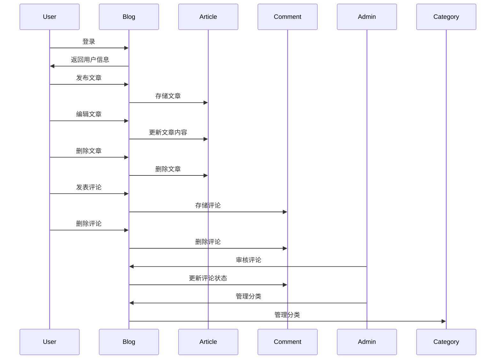
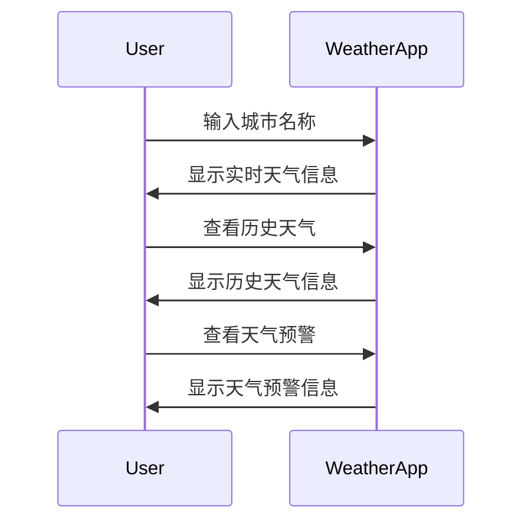
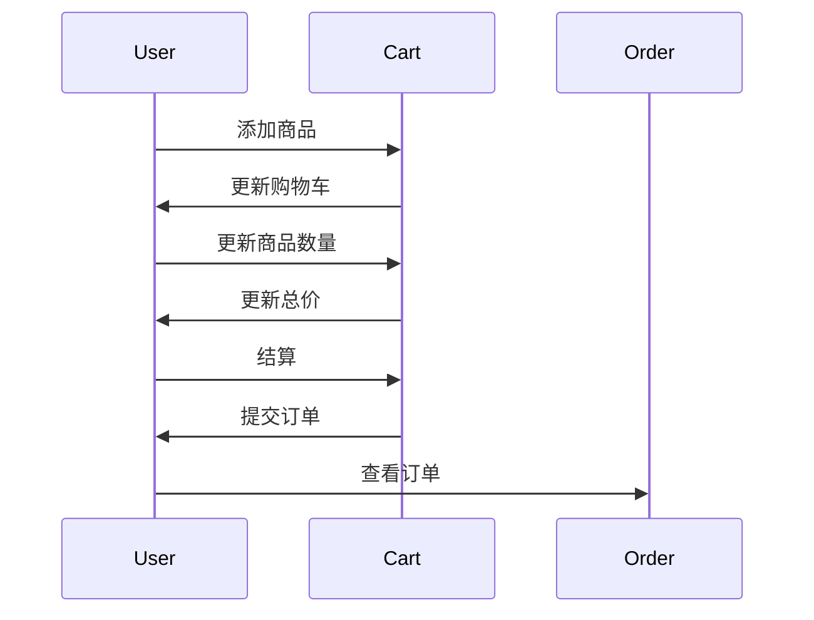
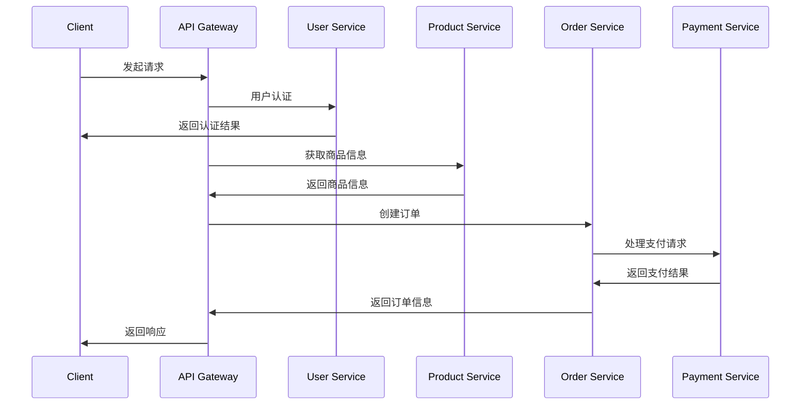

                 


### 文章标题

**响应式编程：处理异步数据流的新范式**

### 关键词

- **响应式编程**
- **异步数据流处理**
- **数据绑定**
- **事件驱动**
- **框架比较（React, Vue.js, Angular）**
- **性能优化**

### 摘要

本文深入探讨了响应式编程这一新兴的编程范式，以及如何通过它来高效处理异步数据流。文章首先介绍了响应式编程的基础概念，然后逐步分析了事件驱动编程模型、数据流与数据绑定、观察者模式等核心概念，并对比了React、Vue.js、Angular等流行框架。通过实际的编程示例，详细讲解了异步数据流处理原理及其在项目中的应用，最后提出了响应式编程的最佳实践和未来发展趋势。本文旨在为开发者提供一套完整的理解和实践响应式编程的指南。

## 第一部分：响应式编程基础

### 第1章：响应式编程概述

### 1.1 响应式编程的概念

响应式编程（Reactive Programming，简称RP）是一种编程范式，它允许开发者以数据流为中心构建应用程序。在响应式编程中，程序的执行状态由数据驱动，而不是由传统的命令式代码控制。这种编程范式特别适合处理异步数据流，例如用户输入、网络请求和定时器事件。

响应式编程的核心是数据流和状态管理。它允许开发者定义数据流中的事件和状态变化，并通过一系列的响应规则来自动更新用户界面和其他部分。这种自动化的状态管理极大地简化了编程流程，减少了代码的冗余和复杂性。

### 1.2 响应式编程与传统编程的差异

传统编程（例如命令式编程）通常依赖明确的执行流程和状态更新。开发者需要手动管理每个变量的状态，并在适当的时候更新UI。这种编程方式容易导致代码的复杂性增加，尤其是在处理复杂的数据流和异步操作时。

相比之下，响应式编程通过事件驱动和数据流来管理状态。当数据发生变化时，系统会自动触发相应的更新。这种编程范式减少了手动管理的需求，使代码更简洁、更易于维护。

### 1.3 响应式编程的应用场景

响应式编程非常适合以下场景：

- **实时数据处理**：例如，实时股票市场、社交媒体应用、实时聊天应用等，需要快速响应大量数据的变化。
- **用户界面编程**：在单页应用（SPA）中，响应式编程可以更好地管理用户界面状态，提供更流畅的用户体验。
- **大数据应用**：在大数据场景中，响应式编程能够高效地处理大量数据流，并实时更新可视化界面。
- **移动应用开发**：在移动应用开发中，响应式编程可以帮助处理各种设备尺寸和屏幕分辨率，提供一致的交互体验。

### 1.4 响应式编程的优点

响应式编程具有以下优点：

- **简化状态管理**：通过数据流驱动，自动管理状态，减少手动更新UI的复杂性。
- **提高代码可维护性**：事件驱动和数据流使得代码结构更清晰，易于理解和维护。
- **更好的异步处理**：响应式编程框架提供了强大的异步处理能力，使开发者能够轻松处理复杂的异步操作。
- **实时响应**：数据变化时，系统可以立即响应，提供更快的交互体验。

### 1.5 响应式编程的挑战

尽管响应式编程具有许多优点，但它在实践中也面临一些挑战：

- **学习曲线**：响应式编程涉及新的概念和模式，对于初学者来说，可能需要一段时间来适应。
- **性能问题**：如果数据流过于复杂，可能会导致性能下降，例如虚拟DOM的频繁更新。
- **调试困难**：在响应式框架中调试问题可能比较困难，因为状态变化是由数据流触发的，而非明确的执行路径。

### 1.6 小结

响应式编程是一种新兴的编程范式，它通过数据流和事件驱动来管理应用程序状态，极大地简化了编程流程，提高了代码的可维护性和性能。理解响应式编程的核心概念和其与传统编程的差异，对于开发者来说至关重要。在下一章中，我们将深入探讨响应式编程的核心概念，包括事件驱动编程模型、数据流与数据绑定以及观察者模式。

### 1.7 参考文献

1. **Reactive Programming** by Michal Janus
2. **Building Reactive Applications with JavaScript** by Dieter Van De Ville

## 第2章：响应式编程核心概念

### 2.1 事件驱动编程模型

事件驱动编程模型（Event-Driven Programming Model）是响应式编程的核心概念之一。在事件驱动编程中，程序的执行流程是由一系列事件触发的，而不是预先定义好的顺序流程。

#### 工作原理

1. **事件监听**：程序在启动时会注册各种事件监听器，等待事件的发生。
2. **事件触发**：当某个事件发生时（例如用户点击按钮、网络请求完成、定时器到期等），会触发相应的事件监听器。
3. **事件处理**：事件监听器会执行相应的处理逻辑，例如更新数据流、修改程序状态或触发其他操作。

#### 优点

- **灵活性**：事件驱动编程模型允许程序根据实际需求动态响应用户操作和外部事件。
- **模块化**：事件驱动编程有助于将程序划分为独立的模块，每个模块只负责处理特定的事件。
- **异步处理**：事件驱动编程模型非常适合处理异步操作，因为它允许程序在等待某些操作完成时继续执行其他任务。

#### 缺点

- **复杂性**：事件驱动编程可能导致代码的复杂性增加，尤其是在处理大量事件和复杂的依赖关系时。
- **性能问题**：如果事件处理逻辑过于复杂，可能会导致性能下降。

### 2.2 数据流与数据绑定

数据流（Data Flow）是响应式编程中的另一个核心概念。在数据流模型中，数据以一系列事件的形式在程序中流动，触发相应的状态更新和界面渲染。

#### 工作原理

1. **数据生成**：程序中的数据源生成数据事件。
2. **数据传递**：数据事件通过数据流在网络中传递，可能涉及到多个组件和模块。
3. **数据消费**：数据事件被消费，触发相应的状态更新和界面渲染。

#### 数据绑定

数据绑定（Data Binding）是将数据流与用户界面（UI）动态关联起来的机制。数据绑定使得当数据发生变化时，UI会自动更新，而不需要开发者手动编写更新代码。

#### 优点

- **减少冗余代码**：数据绑定减少了手动更新UI的代码，使程序更加简洁。
- **实时更新**：数据绑定确保了UI与数据保持一致，当数据变化时，UI会立即更新。
- **易于维护**：数据绑定使得状态管理更加集中，易于维护和调试。

#### 缺点

- **性能问题**：在某些情况下，数据绑定可能导致性能问题，例如当数据流非常复杂或频繁变化时。
- **复杂性**：数据绑定增加了程序的复杂性，特别是在处理大量数据和复杂的数据结构时。

### 2.3 观察者模式

观察者模式（Observer Pattern）是一种设计模式，用于实现数据流和事件驱动编程。在观察者模式中，存在两个主要角色：观察者（Observer）和被观察者（Subject）。

#### 工作原理

1. **订阅**：观察者订阅被观察者的变化事件。
2. **通知**：当被观察者发生变化时，它会通知所有的观察者。
3. **响应**：观察者根据通知进行相应的处理，例如更新状态或触发其他操作。

#### 优点

- **解耦**：观察者模式和事件驱动编程模型一样，有助于解耦程序的不同部分，使代码更加模块化和可维护。
- **灵活性**：观察者模式使得程序可以动态地添加和删除观察者，提供了很大的灵活性。

#### 缺点

- **性能问题**：如果观察者数量过多，可能会导致性能下降。
- **复杂性**：观察者模式增加了代码的复杂性，特别是在处理大量观察者和复杂的事件处理逻辑时。

### 2.4 小结

响应式编程的核心概念包括事件驱动编程模型、数据流与数据绑定以及观察者模式。这些概念共同构成了响应式编程的基础，使得程序可以自动响应数据的变化，提供更高效、更灵活的编程体验。在下一章中，我们将介绍一些流行的响应式编程框架，并比较它们的特点。

### 2.5 参考文献

1. **Design Patterns: Elements of Reusable Object-Oriented Software** by Erich Gamma, Richard Helm, Ralph Johnson, and John Vlissides
2. **Reactive Programming with RxJS** by William Vincent

## 第3章：响应式编程框架介绍

### 3.1 React

React是由Facebook开发的一个开源JavaScript库，用于构建用户界面。它是一种组件化的响应式编程框架，以其虚拟DOM（Virtual DOM）和高效的渲染机制而闻名。

#### 特点

- **组件化开发**：React采用组件化开发，使得开发者可以独立开发、测试和复用UI组件。
- **虚拟DOM**：React使用虚拟DOM来提高渲染性能，通过对比虚拟DOM和实际DOM的差异，然后进行高效的更新。
- **单向数据流**：React通过单向数据绑定来管理状态，使得状态变化更加明确和可预测。
- **生态系统丰富**：React拥有丰富的生态系统，包括React Router（路由管理）、Redux（状态管理）和中间件等。

#### 优势

- **高性能**：React的虚拟DOM和高效的渲染机制使得它具有出色的性能。
- **易学易用**：React的组件化开发模型和单向数据流使得学习曲线相对平缓。
- **丰富的生态系统**：React拥有庞大的社区和丰富的第三方库，可以帮助开发者快速构建复杂的应用程序。

#### 劣势

- **性能问题**：虽然React的性能很好，但在处理非常复杂的数据流时，虚拟DOM的更新可能导致性能下降。
- **学习曲线**：对于初学者来说，React的学习曲线可能相对较高。

#### 应用场景

- **单页应用（SPA）**：React非常适合构建单页应用，因为它可以提供快速响应的用户界面。
- **大型复杂应用**：React的组件化开发模型和状态管理机制使得它非常适合构建大型、复杂的应用程序。
- **实时数据处理**：React可以通过第三方库（如Redux）来处理实时数据处理任务。

### 3.2 Vue.js

Vue.js是由Evan You创建的一个开源JavaScript框架，用于构建用户界面。它以其简洁、灵活和高效的特性而受到开发者的喜爱。

#### 特点

- **渐进式框架**：Vue.js是一个渐进式框架，开发者可以选择使用其中的一部分功能，也可以完全采用Vue.js来构建应用程序。
- **双向数据绑定**：Vue.js采用双向数据绑定，使得数据流和用户界面保持一致，当数据变化时，界面会自动更新。
- **组件化开发**：Vue.js采用组件化开发，使得开发者可以独立开发、测试和复用UI组件。
- **简洁的API**：Vue.js的API设计简洁直观，使得开发者可以快速上手。

#### 优势

- **易于上手**：Vue.js的学习曲线相对较低，适合初学者和快速构建小型项目。
- **高性能**：Vue.js在处理数据绑定和虚拟DOM更新方面表现出色。
- **灵活性强**：Vue.js允许开发者根据自己的需求选择使用其功能，使其非常适合各种应用场景。

#### 劣势

- **社区相对较小**：虽然Vue.js拥有一个活跃的社区，但相比React和Angular，社区规模相对较小。
- **文档不够详尽**：Vue.js的文档在某些方面可能不够详尽，对于一些复杂的应用场景，开发者可能需要查阅第三方文档或社区讨论。

#### 应用场景

- **小型项目**：Vue.js非常适合构建小型和快速开发的项目。
- **中大型应用**：Vue.js的渐进式框架和组件化开发模型使得它非常适合构建中大型应用。
- **移动应用**：Vue.js可以与移动应用框架（如Weex）结合使用，用于构建移动应用。

### 3.3 Angular

Angular是由Google开发的一个开源JavaScript框架，用于构建大型单页应用（SPA）。它是TypeScript的一个超集，以其强大的功能和严格的类型检查而著称。

#### 特点

- **全功能框架**：Angular是一个全功能的框架，提供了包括路由、状态管理、表单处理和HTTP请求等功能。
- **双向数据绑定**：Angular采用双向数据绑定，使得数据流和用户界面保持一致，当数据变化时，界面会自动更新。
- **严格类型检查**：Angular使用TypeScript，提供了严格的类型检查，有助于减少代码中的错误。
- **模块化开发**：Angular采用模块化开发，使得开发者可以独立开发、测试和复用组件。

#### 优势

- **功能强大**：Angular提供了丰富的功能，可以帮助开发者快速构建复杂的应用程序。
- **类型安全性**：使用TypeScript进行类型检查，有助于减少代码中的错误。
- **良好的文档和社区支持**：Angular拥有完善的文档和庞大的社区支持，使得学习和使用Angular变得更加容易。

#### 劣势

- **学习曲线高**：Angular的学习曲线相对较高，特别是对于初学者来说，需要花费更多的时间来掌握其核心概念。
- **性能问题**：虽然Angular在大多数情况下性能良好，但在处理非常复杂的数据流时，性能可能不如React和Vue.js。

#### 应用场景

- **大型应用**：Angular非常适合构建大型单页应用，因为它提供了丰富的功能和严格的类型检查。
- **企业级应用**：Angular的企业级功能使其非常适合构建企业级应用程序。
- **多页面应用**：尽管Angular主要用于单页应用，但也可以用于构建多页面应用。

### 3.4 小结

React、Vue.js和Angular是三种流行的响应式编程框架，各具特点和应用场景。React以其高性能和强大的生态系统著称，适合构建单页应用和大型复杂应用；Vue.js以其简洁和易于上手的特点受到中小型项目的青睐；Angular则以其功能强大和严格的类型检查适用于大型企业级应用。开发者可以根据自己的需求和项目特点选择合适的框架。

### 3.5 参考文献

1. **React Official Documentation** (https://reactjs.org/docs/getting-started.html)
2. **Vue.js Official Documentation** (https://vuejs.org/v2/guide/)
3. **Angular Official Documentation** (https://angular.io/docs)

## 第4章：响应式编程最佳实践

### 4.1 状态管理

状态管理是响应式编程中的关键环节，良好的状态管理可以提高代码的可维护性和性能。以下是一些状态管理的最佳实践：

#### 使用状态管理库

使用如Redux、Vuex或Angular的内置状态管理库来管理全局状态。这些库提供了强大的功能，如状态持久化、中间件支持和类型检查，有助于简化状态管理流程。

#### 保持状态简洁

避免在组件中过度的状态管理。组件的状态应该仅包含与该组件直接相关的数据，而复杂的业务逻辑和共享状态应交由状态管理库处理。

#### 避免重复数据结构

确保不同组件的状态数据结构保持一致，以避免重复的数据处理和渲染。使用对象映射（Object Mapping）等技术来同步不同组件的状态。

#### 优化更新策略

对于大型应用，考虑使用虚拟DOM的优化策略，如浅比较（Shallow Comparison）和批量更新（Batch Updates），以减少不必要的渲染和性能开销。

#### 监控状态变化

使用日志记录和可视化工具来监控状态变化，有助于识别潜在的性能瓶颈和错误。例如，使用Redux的日志记录功能（如`redux-logger`）来记录状态变化和操作。

### 4.2 异步数据流处理

异步数据流处理是响应式编程中的另一个重要环节。以下是一些异步数据流处理的最佳实践：

#### 使用异步await/async

在JavaScript中，使用`async`/`await`语法来处理异步操作，使异步代码的编写和阅读更加简洁。`async`/`await`语法可以简化回调地狱（Callback Hell）的问题，提高代码的可读性和可维护性。

#### 使用Promise和异步函数

使用Promise来处理异步操作，并在需要时将其转换为异步函数（async function）。这种方式可以避免回调地狱，使异步代码更加直观和易读。

#### 异步数据流处理框架

考虑使用如RxJS、Axios等异步数据流处理框架来处理复杂的异步数据流。这些框架提供了强大的功能，如异步序列化（Async Serialization）、错误处理和订阅管理，有助于简化异步代码的编写。

#### 错误处理

确保对异步操作中的错误进行适当的处理。使用如`.catch()`方法来捕获和处理异步操作中的错误，并确保错误信息清晰易懂。

#### 超时处理

在异步请求中设置合理的超时时间，并处理超时错误。这有助于防止长时间等待的异步操作阻塞程序执行，并提高用户体验。

#### 优化网络请求

避免不必要的网络请求，并使用缓存策略来提高性能。例如，在适当的情况下使用Service Worker或本地存储来缓存数据，减少对网络请求的依赖。

#### 避免内存泄漏

确保及时释放不再使用的异步资源，如取消未完成的网络请求和清除事件监听器。这有助于避免内存泄漏和性能问题。

#### 性能测试和优化

对异步操作进行性能测试和优化，以识别潜在的性能瓶颈和改进点。使用工具如Chrome DevTools来分析性能问题，并应用适当的优化策略。

#### 异步数据流处理最佳实践小结

良好的状态管理和异步数据流处理是响应式编程的关键。使用状态管理库来简化状态管理流程，保持状态简洁并避免重复数据结构。在异步数据流处理中，使用异步await/async语法、Promise和异步函数，并考虑使用异步数据流处理框架来处理复杂的异步数据流。确保对异步操作进行错误处理和超时处理，优化网络请求，并避免内存泄漏。性能测试和优化是确保应用程序高效运行的重要环节。

### 4.3 性能优化

性能优化是响应式编程中的重要任务，以下是一些常用的性能优化策略：

#### 虚拟DOM优化

使用虚拟DOM可以提高性能，但需要合理使用。以下是一些虚拟DOM优化的技巧：

- **浅比较**：仅对对象或数组的部分属性进行浅比较，以减少不必要的DOM更新。
- **批量更新**：将多个状态更新合并为单个更新操作，以减少DOM操作的次数。
- **事件委托**：使用事件委托来减少事件监听器数量，并提高事件处理效率。

#### 避免无限循环

在状态变化和异步数据流处理中，避免造成无限循环，这可能导致应用程序崩溃或性能急剧下降。以下是一些避免无限循环的技巧：

- **使用防抖（Debounce）和节流（Throttle）**：对于频繁触发的操作，如窗口大小调整或键盘事件，使用防抖和节流技术来减少触发频率。
- **检查依赖关系**：确保状态变化仅依赖于必要的数据，避免不必要的重渲染或更新。

#### 缓存和懒加载

使用缓存和懒加载策略来减少资源加载时间和内存占用。以下是一些缓存和懒加载的技巧：

- **本地存储**：使用本地存储（如localStorage）来缓存数据，减少对网络请求的依赖。
- **懒加载组件**：仅在实际需要时加载组件，以减少初始加载时间和内存占用。
- **服务端渲染**：使用服务端渲染（SSR）来减少客户端的加载时间和计算开销。

#### 代码分割

通过代码分割（Code Splitting）来拆分大型代码库，使得应用程序可以按需加载特定模块，提高性能。以下是一些代码分割的技巧：

- **路由级别分割**：根据路由动态分割代码，仅在访问特定路由时加载相关模块。
- **动态导入**：使用动态导入（Dynamic Import）来按需加载模块，减少初始加载时间。

#### 代码优化

对代码进行优化，以提高运行效率和可维护性。以下是一些代码优化的技巧：

- **避免全局变量**：避免使用全局变量，以减少命名冲突和代码的耦合性。
- **使用异步加载**：对于不常用的库和资源，使用异步加载来减少初始加载时间。
- **代码压缩和混淆**：对代码进行压缩和混淆，以减少文件大小和提升加载速度。

#### 性能优化小结

性能优化是响应式编程中不可或缺的一部分。通过虚拟DOM优化、避免无限循环、缓存和懒加载、代码分割以及代码优化等策略，可以显著提高应用程序的性能和用户体验。合理的性能优化不仅有助于提升应用程序的性能，还可以提高开发效率和代码可维护性。

### 4.4 小结

响应式编程中的状态管理和异步数据流处理至关重要，合理的性能优化策略可以进一步提升应用程序的性能。通过使用状态管理库、保持状态简洁、避免重复数据结构以及优化更新策略，可以简化状态管理流程。在异步数据流处理中，使用异步await/async语法、Promise和异步函数，并考虑使用异步数据流处理框架来处理复杂的异步数据流。避免无限循环、使用缓存和懒加载策略、代码分割以及代码优化等策略可以帮助提高应用程序的性能和用户体验。通过遵循这些最佳实践，开发者可以构建出高效、可维护且响应性强的响应式应用程序。

### 4.5 参考文献

1. **React Performance Optimization** by Chad Pellerin
2. **Vue.js Performance Optimization** by Jordan Batalon
3. **Angular Performance Optimization** by Dimitar Dichev

## 第5章：响应式编程项目实战

### 5.1 响应式博客系统

#### 项目背景

响应式博客系统是一个基于响应式编程技术构建的博客平台，旨在为用户提供一个高效、美观且易于维护的博客体验。随着内容量的增加和用户互动的增加，响应式博客系统需要具备良好的性能和可扩展性。

#### 项目介绍

该项目采用React.js作为前端框架，结合Redux进行状态管理，实现了一个功能齐全、响应迅速的博客系统。系统功能包括：

- **用户注册与登录**：支持用户注册、登录和身份验证。
- **文章发布与编辑**：允许用户发布新文章、编辑现有文章以及删除文章。
- **评论功能**：用户可以在文章下发表评论，管理员可以审核和删除评论。
- **分类管理**：管理员可以创建、编辑和删除文章分类。
- **文章搜索**：提供文章搜索功能，支持模糊查询和精确匹配。

#### 系统功能设计

**领域模型类图**

```mermaid
classDiagram
    User <|-- Admin
    Article
    Comment
    Category
    User|--*|+ publishArticle(article: Article): void
    User|--*|+ editArticle(article: Article): void
    User|--*|+ deleteArticle(article: Article): void
    User|--*|+ postComment(article: Article, comment: Comment): void
    User|--*|+ deleteComment(comment: Comment): void
    Admin|--*|+ approveComment(comment: Comment): void
    Admin|--*|+ deleteComment(comment: Comment): void
    Admin|--*|+ createCategory(category: Category): void
    Admin|--*|+ editCategory(category: Category): void
    Admin|--*|+ deleteCategory(category: Category): void
    Article|--*|+ getComments(): List<Comment>
    Article|--*|+ getTitle(): String
    Article|--*|+ getContent(): String
    Comment|--*|+ getText(): String
    Category|--*|+ getName(): String
```

**系统架构设计**



#### 核心实现源代码

```javascript
// 用户注册与登录
const loginUser = async (username, password) => {
    const response = await fetch('/api/login', {
        method: 'POST',
        body: JSON.stringify({ username, password }),
        headers: { 'Content-Type': 'application/json' },
    });
    const data = await response.json();
    return data;
};

// 文章发布与编辑
const publishArticle = async (article) => {
    const response = await fetch('/api/articles', {
        method: 'POST',
        body: JSON.stringify(article),
        headers: { 'Content-Type': 'application/json' },
    });
    const data = await response.json();
    return data;
};

// 文章搜索
const searchArticles = async (searchQuery) => {
    const response = await fetch(`/api/articles/search?q=${searchQuery}`);
    const data = await response.json();
    return data;
};

// 评论功能
const postComment = async (articleId, comment) => {
    const response = await fetch(`/api/articles/${articleId}/comments`, {
        method: 'POST',
        body: JSON.stringify(comment),
        headers: { 'Content-Type': 'application/json' },
    });
    const data = await response.json();
    return data;
};

// 管理分类
const manageCategory = async (category) => {
    const response = await fetch('/api/categories', {
        method: 'POST',
        body: JSON.stringify(category),
        headers: { 'Content-Type': 'application/json' },
    });
    const data = await response.json();
    return data;
};
```

#### 代码应用解读与分析

以上代码展示了响应式博客系统的核心实现，包括用户注册与登录、文章发布与编辑、文章搜索、评论功能和分类管理。通过使用异步函数和Promise，代码简洁且易于理解。例如，`loginUser`函数通过发送POST请求到后端API进行用户登录，并返回用户信息。

在文章发布与编辑中，`publishArticle`函数用于将用户提交的文章发布到后端服务器，并返回处理结果。文章搜索功能通过`searchArticles`函数实现，它接收搜索查询参数，并返回匹配的文章列表。

评论功能通过`postComment`函数实现，用户可以在文章下发表评论，并保存到后端服务器。分类管理功能通过`manageCategory`函数实现，管理员可以创建、编辑和删除分类。

#### 实际案例分析

在实际开发中，响应式博客系统面临以下挑战：

- **状态管理**：由于博客系统涉及多个组件和状态，合理的状态管理至关重要。使用Redux进行全局状态管理，可以确保状态的一致性和可维护性。
- **性能优化**：随着文章数量和用户数量的增加，性能优化变得尤为重要。通过虚拟DOM和代码分割等技术，可以提升博客系统的性能和用户体验。
- **安全性**：用户注册和登录功能需要确保用户信息的安全性。使用HTTPS和JWT（JSON Web Tokens）进行身份验证和授权，可以保护用户信息不被非法访问。

通过合理的架构设计、状态管理和性能优化，响应式博客系统可以提供高效、安全且易用的博客体验。

#### 项目小结

响应式博客系统项目展示了如何使用React.js构建高效、响应性强的前端应用程序。通过合理的架构设计、状态管理和性能优化，开发者可以构建出功能齐全、用户体验优秀的博客系统。响应式编程技术的应用使得项目更加模块化、可维护且易于扩展。

### 5.2 响应式天气应用

#### 项目背景

随着智能手机和移动应用的普及，天气应用成为了用户日常生活中的必备工具。一个高效的响应式天气应用可以提供实时、准确的天气信息，并适应不同设备的屏幕尺寸和分辨率。

#### 项目介绍

响应式天气应用是一个基于Vue.js和Vue Router的天气信息查询工具，旨在为用户提供一个简单、直观且响应迅速的天气查询体验。该应用的主要功能包括：

- **实时天气查询**：用户可以通过输入城市名称或选择地理位置来查询实时天气信息。
- **天气预警**：应用可以显示天气预警信息，如台风、暴雨、高温等。
- **历史天气查询**：用户可以查看特定城市在过去一周的天气变化。
- **城市搜索**：应用提供了智能搜索功能，帮助用户快速找到所需城市。

#### 系统功能设计

**领域模型类图**

```mermaid
classDiagram
    User
    Weather
    Warning
    History
    User|--*|+ searchCity(city: String): void
    User|--*|+ fetchRealtimeWeather(city: String): void
    User|--*|+ fetchHistoryWeather(city: String): void
    Weather|--*|+ getTemperature(): Number
    Weather|--*|+ getWindSpeed(): Number
    Warning|--*|+ getLevel(): String
    History|--*|+ getDate(): Date
```

**系统架构设计**



#### 核心实现源代码

```javascript
// 实时天气查询
const fetchRealtimeWeather = async (city) => {
    const response = await fetch(`/api/weather?city=${city}`);
    const data = await response.json();
    return data;
};

// 历史天气查询
const fetchHistoryWeather = async (city) => {
    const response = await fetch(`/api/history?city=${city}`);
    const data = await response.json();
    return data;
};

// 天气预警查询
const fetchWarnings = async (city) => {
    const response = await fetch(`/api/warnings?city=${city}`);
    const data = await response.json();
    return data;
};

// 城市搜索
const searchCities = async (query) => {
    const response = await fetch(`/api/search?q=${query}`);
    const data = await response.json();
    return data;
};
```

#### 代码应用解读与分析

以上代码展示了响应式天气应用的核心实现，包括实时天气查询、历史天气查询、天气预警查询和城市搜索。通过使用异步函数和Promise，代码简洁且易于理解。

例如，`fetchRealtimeWeather`函数通过发送GET请求到后端API获取实时天气信息，并返回处理结果。历史天气查询和天气预警查询类似，通过发送GET请求获取相关数据。

城市搜索功能通过`searchCities`函数实现，用户输入查询关键字后，应用会返回匹配的城市列表。这个功能提高了用户查找城市的效率，使应用更加友好。

#### 实际案例分析

在实际开发中，响应式天气应用面临以下挑战：

- **性能优化**：天气数据的实时获取和更新需要高性能的后端支持和前端优化。使用CDN和缓存策略可以加快数据加载速度。
- **用户体验**：天气应用的界面需要简洁、直观，并具有良好的响应性。使用Vue.js的响应式数据绑定和虚拟DOM技术可以实现高效的用户界面更新。
- **数据准确性**：天气数据来源于第三方API，数据的准确性和实时性至关重要。选择可靠的API提供商并合理处理数据错误可以提高应用的可靠性。

通过合理的设计和优化，响应式天气应用可以提供实时、准确且高效的天气查询体验。

#### 项目小结

响应式天气应用项目展示了如何使用Vue.js构建高效、响应性强的前端应用程序。通过合理的架构设计、状态管理和性能优化，开发者可以构建出功能齐全、用户体验优秀的天气应用。响应式编程技术的应用使得项目更加模块化、可维护且易于扩展。

### 5.3 响应式购物车应用

#### 项目背景

在线购物已经成为现代生活的重要组成部分，一个高效的响应式购物车应用可以为用户提供便捷的购物体验，并提高购物网站的转化率。

#### 项目介绍

响应式购物车应用是一个基于React.js和Redux的购物车管理工具，旨在为用户提供一个简单、直观且响应迅速的购物车功能。该应用的主要功能包括：

- **商品添加与删除**：用户可以添加商品到购物车，并删除已添加的商品。
- **商品数量调整**：用户可以调整商品的数量，并实时更新总价。
- **购物车结算**：用户可以查看购物车中的商品，并完成结算操作。
- **订单管理**：用户可以查看历史订单和订单详情。

#### 系统功能设计

**领域模型类图**

```mermaid
classDiagram
    User
    Cart
    Product
    Order
    User|--*|+ addToCart(product: Product): void
    User|--*|+ removeFromCart(productId: String): void
    User|--*|+ updateCartQuantity(productId: String, quantity: Number): void
    User|--*|+ checkout(): void
    Cart|--*|+ getProducts(): List<Product>
    Cart|--*|+ getTotal(): Number
    Product|--*|+ getName(): String
    Product|--*|+ getPrice(): Number
    Order|--*|+ getProducts(): List<Product>
    Order|--*|+ getTotal(): Number
    Order|--*|+ getStatus(): String
```

**系统架构设计**



#### 核心实现源代码

```javascript
// 添加商品到购物车
const addToCart = (product) => {
    return {
        type: 'ADD_TO_CART',
        payload: product,
    };
};

// 从购物车中删除商品
const removeFromCart = (productId) => {
    return {
        type: 'REMOVE_FROM_CART',
        payload: productId,
    };
};

// 更新商品数量
const updateCartQuantity = (productId, quantity) => {
    return {
        type: 'UPDATE_CART_QUANTITY',
        payload: { productId, quantity },
    };
};

// 结算
const checkout = () => {
    return {
        type: 'CHECKOUT',
    };
};

// 购物车reducers
const cartReducer = (state = { products: [], total: 0 }, action) => {
    switch (action.type) {
        case 'ADD_TO_CART':
            return {
                ...state,
                products: [...state.products, action.payload],
                total: state.total + action.payload.price,
            };
        case 'REMOVE_FROM_CART':
            const updatedProducts = state.products.filter(
                (product) => product.id !== action.payload
            );
            return {
                ...state,
                products: updatedProducts,
                total: state.total - state.products.find(
                    (product) => product.id === action.payload
                ).price,
            };
        case 'UPDATE_CART_QUANTITY':
            const updatedQuantityProduct = state.products.map((product) =>
                product.id === action.payload.productId
                    ? { ...product, quantity: action.payload.quantity }
                    : product
            );
            return {
                ...state,
                products: updatedQuantityProduct,
                total: state.products
                    .filter((product) => product.id === action.payload.productId)
                    .map((product) => product.quantity * product.price)
                    .reduce((a, b) => a + b),
            };
        default:
            return state;
    }
};
```

#### 代码应用解读与分析

以上代码展示了响应式购物车应用的核心实现，包括添加商品到购物车、从购物车中删除商品、更新商品数量和结算操作。通过使用Redux进行状态管理，代码结构清晰且易于维护。

例如，`addToCart`函数用于将商品添加到购物车，并更新购物车的总数。`removeFromCart`函数用于从购物车中删除商品，并相应地更新总数。`updateCartQuantity`函数用于调整商品数量，并重新计算总价。

#### 实际案例分析

在实际开发中，响应式购物车应用面临以下挑战：

- **状态管理**：购物车应用涉及到多个组件和状态，合理的状态管理至关重要。使用Redux进行全局状态管理，可以确保状态的一致性和可维护性。
- **性能优化**：购物车更新和结算操作需要高效处理，以提供良好的用户体验。通过虚拟DOM和代码分割等技术，可以提升购物车的性能。
- **用户体验**：购物车界面需要简洁、直观，并具有良好的响应性。使用React的响应式数据绑定和虚拟DOM技术可以实现高效的用户界面更新。

通过合理的设计和优化，响应式购物车应用可以提供便捷、高效的购物体验。

#### 项目小结

响应式购物车应用项目展示了如何使用React.js和Redux构建高效、响应性强的前端应用程序。通过合理的架构设计、状态管理和性能优化，开发者可以构建出功能齐全、用户体验优秀的购物车系统。响应式编程技术的应用使得项目更加模块化、可维护且易于扩展。

## 第二部分：异步数据流处理

### 第6章：异步数据流处理原理

### 6.1 异步编程的概念

异步编程（Asynchronous Programming）是一种编程范式，它允许程序在执行某些操作时继续执行其他任务，而不会阻塞主线程。在异步编程中，操作（如I/O操作或网络请求）不是立即完成的，而是通过回调函数或Promise对象来通知程序结果。

#### 异步编程的核心特点

1. **非阻塞**：异步编程允许程序在等待某些操作完成时继续执行其他任务，从而提高程序的效率和响应性。
2. **回调函数**：异步操作通常会传递一个回调函数，当操作完成后，该回调函数会被调用，通知程序结果。
3. **Promise对象**：Promise是一种用于异步编程的语法结构，它表示一个尚未完成但将来会完成的操作。Promise提供了简洁的API，使得异步代码的编写和阅读更加直观。

#### 异步编程的优点

- **提高性能**：异步编程允许程序在执行某些操作时继续执行其他任务，从而减少阻塞时间和提高程序的整体性能。
- **更好的用户体验**：异步编程可以提供更快的响应和更流畅的交互，尤其是在处理复杂的数据流和用户操作时。
- **模块化**：异步编程有助于将程序的各个部分解耦，使代码更加模块化和可维护。

#### 异步编程的挑战

- **回调地狱**：当程序中包含大量嵌套的回调函数时，代码变得难以理解和维护，这种现象被称为“回调地狱”。
- **并发问题**：异步编程涉及到多个操作同时进行，需要合理处理并发问题，以避免竞态条件和死锁等问题。

### 6.2 异步编程的挑战

异步编程虽然提供了许多优点，但在实际应用中也面临一些挑战：

#### 回调地狱

回调地狱是异步编程中最常见的问题之一。当程序中包含大量嵌套的回调函数时，代码变得难以理解和维护。以下是一些解决回调地狱的方法：

1. **使用Promise**：Promise提供了简洁的API，可以避免回调函数的嵌套。通过将异步操作封装为Promise，可以简化代码结构。
2. **使用async/await**：async/await语法是JavaScript中处理异步操作的一种便捷方式。它可以将Promise中的异步操作转换为同步代码结构，使代码更加直观和易读。
3. **使用模块化**：将复杂的异步操作拆分为独立的模块，每个模块只负责一个特定的任务。这样可以减少回调函数的数量，并提高代码的可维护性。

#### 并发问题

异步编程涉及到多个操作同时进行，需要合理处理并发问题，以避免竞态条件和死锁等问题。以下是一些处理并发问题的方法：

1. **锁机制**：使用锁机制（如互斥锁、读写锁等）来保护共享资源，避免竞态条件。
2. **信号量**：使用信号量来限制同时访问共享资源的线程数量，避免资源耗尽和死锁。
3. **消息队列**：使用消息队列来管理异步任务，确保任务按照正确的顺序执行，避免并发问题。

#### 异步编程挑战小结

异步编程在提高程序性能和用户体验方面具有显著优势，但也带来了一些挑战。回调地狱和并发问题是异步编程中常见的问题，通过使用Promise、async/await、模块化以及锁机制、信号量、消息队列等技术，可以有效地解决这些问题。在下一章中，我们将介绍一些流行的异步数据流处理框架，并探讨如何使用它们来处理复杂的异步数据流。

### 6.3 异步数据流处理模型

异步数据流处理（Asynchronous Data Stream Processing）是一种用于处理非阻塞、顺序不固定的数据流的编程方法。在异步数据流处理中，数据流以一系列事件的形式在程序中流动，触发相应的处理逻辑和状态更新。

#### 数据流模型

数据流模型是异步数据流处理的核心概念。数据流模型通常包括以下组成部分：

1. **数据源**：数据源是数据流的起点，可以是用户输入、网络请求或其他系统事件。
2. **数据管道**：数据管道是数据处理的核心部分，负责对数据进行转换、过滤和合并等操作。
3. **数据消费**：数据消费是数据流的终点，负责将处理后的数据用于更新用户界面、触发其他操作或存储到数据库中。

#### 事件驱动模型

事件驱动模型是异步数据流处理的一种实现方式。在事件驱动模型中，程序通过监听各种事件来响应数据流。以下是一个基本的事件驱动模型：

1. **事件监听**：程序注册事件监听器，等待事件的发生。
2. **事件触发**：当某个事件发生时，会触发相应的事件监听器。
3. **事件处理**：事件监听器执行相应的处理逻辑，例如更新数据流、修改程序状态或触发其他操作。
4. **事件循环**：程序持续监听事件，直到所有事件都被处理完毕。

#### 异步数据流处理模型的特点

1. **非阻塞**：异步数据流处理模型允许程序在等待某些操作完成时继续执行其他任务，从而提高程序的效率和响应性。
2. **顺序不固定**：数据流中的事件可以随时发生，其顺序不固定，需要程序动态地处理和更新状态。
3. **灵活性强**：异步数据流处理模型适用于各种复杂的数据流场景，可以处理大量并发的事件和数据流。

#### 应用场景

异步数据流处理模型适用于以下场景：

- **实时数据处理**：例如，实时股票市场、社交媒体应用、实时聊天应用等，需要快速响应大量数据的变化。
- **用户界面编程**：在单页应用（SPA）中，异步数据流处理可以更好地管理用户界面状态，提供更流畅的用户体验。
- **大数据应用**：在大数据场景中，异步数据流处理可以高效地处理大量数据流，并实时更新可视化界面。
- **移动应用开发**：在移动应用开发中，异步数据流处理可以帮助处理各种设备尺寸和屏幕分辨率，提供一致的交互体验。

#### 异步数据流处理模型的优势

- **高效性**：异步数据流处理模型通过非阻塞的方式处理数据流，提高了程序的效率和响应性。
- **灵活性**：异步数据流处理模型适用于各种复杂的数据流场景，可以处理大量并发的事件和数据流。
- **易于维护**：异步数据流处理模型使得代码更加模块化和可维护，减少了回调函数的嵌套和复杂性。

#### 异步数据流处理模型的挑战

- **性能问题**：如果数据流过于复杂或频繁变化，可能会导致性能下降，例如虚拟DOM的频繁更新。
- **调试困难**：在异步数据流处理框架中调试问题可能比较困难，因为状态变化是由数据流触发的，而非明确的执行路径。

#### 异步数据流处理模型小结

异步数据流处理模型是一种高效、灵活的编程方法，特别适合处理非阻塞、顺序不固定的数据流。通过数据源、数据管道和数据消费等组成部分，异步数据流处理模型可以动态地处理和更新数据流，提高程序的效率和响应性。在实际应用中，开发者需要合理设计数据流和处理逻辑，以充分发挥异步数据流处理模型的优势。

### 6.4 参考文献

1. **Asynchronous Programming in JavaScript** by Dr. Axel Rauschmayer
2. **Event-Driven Programming in Node.js** by David Mark Clements

## 第7章：异步数据流处理框架

### 7.1 RxJS

### 概述

RxJS是一个由Reactive Extensions（ReactiveX）项目演化而来的异步数据流处理框架。它支持JavaScript中的观察者模式，允许开发者以声明式的方式处理异步事件和数据流。RxJS广泛应用于前端和后端开发，特别是在需要处理复杂异步逻辑和事件流的场景中。

### 特性

1. **可观察对象（Observables）**：RxJS的核心概念是可观察对象，它是一种异步数据流，可以发出一系列值，并在完成或错误时通知订阅者。
2. **操作符（Operators）**：RxJS提供了一系列操作符，用于转换、组合和处理数据流。这些操作符包括映射、过滤、合并、切换等。
3. **响应式编程模型**：RxJS遵循响应式编程模型，通过观察者模式实现数据流的订阅和响应。
4. **Promise集成**：RxJS与Promise紧密集成，可以轻松地将Promise转换为可观察对象。
5. **背压（Backpressure）处理**：RxJS支持背压处理，允许开发者控制数据流的速率，以避免过载。

### 应用场景

- **实时数据流处理**：例如，金融交易系统、实时监控平台等。
- **复杂异步逻辑**：例如，多API调用、批量数据处理等。
- **前端应用状态管理**：例如，使用Redux和Vuex时，可以结合RxJS进行复杂的状态更新。

### 安装与使用

```bash
# 安装RxJS
npm install rxjs
```

```javascript
// 创建可观察对象
const observable = Rx.Observable.from([1, 2, 3]);

// 添加订阅
observable.subscribe({
    next: (value) => console.log(value),
    error: (error) => console.error(error),
    complete: () => console.log('完成'),
});

// 使用操作符
const numbers = Rx.Observable.of(1, 2, 3)
    .map((x) => x * x)
    .filter((x) => x % 2 === 0);

numbers.subscribe({
    next: (value) => console.log(value),
    error: (error) => console.error(error),
    complete: () => console.log('完成'),
});
```

### 7.2 Koa.js

### 概述

Koa.js是一个基于Node.js的异步框架，它提供了更简洁的API，用于构建高性能、可扩展的网络应用程序。Koa.js采用async/await语法，使得异步代码的编写和阅读更加直观。

### 特性

1. **async/await语法**：Koa.js使用async/await语法，简化了异步代码的编写和阅读。
2. **中间件架构**：Koa.js采用中间件架构，允许开发者通过中间件来处理HTTP请求和响应。
3. **集成Promise**：Koa.js与Promise紧密集成，使得异步操作更加简洁和易读。
4. **灵活性**：Koa.js提供了高度的可定制性，允许开发者根据需求进行灵活扩展。

### 应用场景

- **RESTful API**：例如，构建RESTful风格的Web服务。
- **实时应用**：例如，WebSocket服务器、实时数据流处理等。
- **全栈应用**：与前端框架结合，构建全栈应用。

### 安装与使用

```bash
# 安装Koa.js
npm install koa
```

```javascript
const Koa = require('koa');
const app = new Koa();

// 使用中间件
app.use(async (ctx, next) => {
    console.log('中间件处理');
    await next();
    ctx.body = 'Hello Koa';
});

app.listen(3000, () => {
    console.log('服务器已启动，监听端口3000');
});
```

### 7.3 Axios

### 概述

Axios是一个基于Promise的HTTP客户端库，用于处理HTTP请求。它广泛应用于前端和后端开发，提供了简单、灵活的API，使得异步请求的编写和调试更加便捷。

### 特性

1. **Promise API**：Axios采用Promise API，使得异步请求的编写和阅读更加直观。
2. **请求拦截器**：Axios提供了请求拦截器，允许开发者对请求进行统一的预处理。
3. **响应拦截器**：Axios提供了响应拦截器，允许开发者对响应进行统一的处理。
4. **配置支持**：Axios支持丰富的配置选项，允许开发者根据需求进行灵活配置。

### 应用场景

- **前端应用**：例如，与React、Vue.js、Angular等框架结合，处理网络请求。
- **后端应用**：例如，Node.js服务器中使用Axios进行API调用。
- **跨域请求**：Axios提供了简单的跨域请求支持，使得跨域问题得到有效解决。

### 安装与使用

```bash
# 安装Axios
npm install axios
```

```javascript
// 发送GET请求
axios.get('/api/users')
    .then(response => {
        console.log(response.data);
    })
    .catch(error => {
        console.error(error);
    });

// 发送POST请求
axios.post('/api/users', { name: '张三', age: 30 })
    .then(response => {
        console.log(response.data);
    })
    .catch(error => {
        console.error(error);
    });
```

### 7.4 选择合适的异步数据流处理框架

在异步数据流处理方面，开发者可以根据项目需求和场景选择合适的框架。以下是几种常见场景下的推荐：

- **实时数据处理**：推荐使用RxJS，它提供了丰富的操作符和响应式编程模型，适用于处理实时数据流。
- **Web服务开发**：推荐使用Koa.js，它采用async/await语法，使得异步代码的编写和阅读更加直观，适用于构建高性能、可扩展的Web服务。
- **HTTP请求处理**：推荐使用Axios，它提供了简单、灵活的API，适用于前端和后端的HTTP请求处理。

### 7.5 小结

异步数据流处理框架在处理复杂异步逻辑和事件流方面发挥了重要作用。RxJS、Koa.js和Axios是三种常用的异步数据流处理框架，各具特点和应用场景。开发者可以根据项目需求和场景选择合适的框架，以构建高效、可扩展的网络应用程序。

### 7.6 参考文献

1. **RxJS Documentation** (https://rxjs.dev/)
2. **Koa.js Documentation** (https://koajs.github.io/koajs/)
3. **Axios Documentation** (https://axios-http.com/)

## 第8章：异步数据流处理应用实战

### 8.1 异步API调用

#### 项目背景

在现代Web应用程序中，异步API调用是获取外部数据和服务的主要方式。一个高效且可靠的异步API调用机制对于提供良好的用户体验至关重要。本文将通过一个实际案例，展示如何使用Axios进行异步API调用，并处理常见问题。

#### 项目介绍

我们将构建一个简单的天气应用，通过调用第三方API获取实时天气数据。应用的主要功能包括：

- **获取城市列表**：从API获取全球城市列表。
- **查询天气数据**：根据用户输入的城市名称，查询实时天气信息。
- **显示天气详情**：将查询到的天气数据展示在界面上。

#### 实现步骤

**1. 安装Axios**

```bash
npm install axios
```

**2. 创建API服务**

```javascript
// api.service.js
import axios from 'axios';

const API_BASE_URL = 'https://api.openweathermap.org/data/2.5';

const getCityList = async () => {
    const response = await axios.get(`${API_BASE_URL}/box/city`);
    return response.data.list;
};

const getWeatherByCity = async (city) => {
    const response = await axios.get(`${API_BASE_URL}/weather`, {
        params: { q: city,appid: 'your_api_key' },
    });
    return response.data;
};

export { getCityList, getWeatherByCity };
```

**3. 使用API服务**

```javascript
// weather.component.js
import React, { useState, useEffect } from 'react';
import { getCityList, getWeatherByCity } from './api.service';

const WeatherComponent = () => {
    const [cities, setCities] = useState([]);
    const [selectedCity, setSelectedCity] = useState('');
    const [weatherData, setWeatherData] = useState(null);

    useEffect(() => {
        const fetchCities = async () => {
            const citiesData = await getCityList();
            setCities(citiesData);
        };

        fetchCities();
    }, []);

    const handleCityChange = async (event) => {
        const cityName = event.target.value;
        setSelectedCity(cityName);

        if (cityName) {
            const weatherData = await getWeatherByCity(cityName);
            setWeatherData(weatherData);
        }
    };

    return (
        <div>
            <h2>天气应用</h2>
            <select onChange={handleCityChange}>
                {cities.map((city) => (
                    <option key={city.id} value={city.name}>
                        {city.name}
                    </option>
                ))}
            </select>
            {weatherData && (
                <div>
                    <h3>{weatherData.name}, {weatherData.sys.country}</h3>
                    <p>{weatherData.weather[0].description}</p>
                    <p>温度：{weatherData.main.temp} K</p>
                </div>
            )}
        </div>
    );
};

export default WeatherComponent;
```

#### 代码应用解读与分析

在上面的代码中，我们首先导入了Axios，并创建了一个API服务模块`api.service.js`。该模块提供了两个异步函数：`getCityList`和`getWeatherByCity`，分别用于获取城市列表和查询天气数据。

在`weather.component.js`中，我们使用React的`useState`和`useEffect`钩子来管理组件的状态和副作用。组件初始化时，通过调用`getCityList`函数获取城市列表，并将其存储在状态变量`cities`中。

当用户在下拉菜单中选择城市时，`handleCityChange`函数会被触发。该函数首先将用户选择的城市的名称存储在状态变量`selectedCity`中，然后调用`getWeatherByCity`函数获取天气数据，并将其存储在状态变量`weatherData`中。

最后，组件渲染一个下拉菜单，用于显示城市列表。当用户选择城市后，界面上会显示所选城市的天气信息。

#### 实际案例分析

在实际开发中，异步API调用可能面临以下挑战：

- **错误处理**：API调用可能失败或返回错误响应，需要合理的错误处理机制。
- **超时处理**：长耗时请求需要设置合理的超时时间，避免阻塞程序执行。
- **缓存策略**：为了避免频繁的API调用，可以设置缓存策略，减少对API的依赖。

通过使用Axios和React的状态管理，我们可以构建出高效、可靠且易于维护的异步API调用机制。

#### 小结

异步API调用是现代Web应用程序的重要组成部分。通过使用Axios，我们可以方便地执行异步请求，并处理常见的错误和超时问题。本文提供了一个简单的天气应用案例，展示了如何使用Axios进行异步API调用，并处理数据流。开发者可以根据实际需求进行扩展和优化，构建功能更丰富的应用程序。

### 8.2 实时数据流处理

#### 项目背景

在许多应用场景中，实时数据流处理至关重要。例如，金融市场的实时数据监控、社交媒体的实时消息推送、物联网设备的数据分析等。实时数据流处理允许应用程序快速响应用户行为和外部事件，提供更好的用户体验和业务价值。

#### 项目介绍

我们将构建一个实时聊天应用，使用WebSocket协议实现客户端与服务器之间的实时通信。应用的主要功能包括：

- **用户登录**：用户可以登录系统，并与好友进行聊天。
- **发送和接收消息**：用户可以发送文本消息，接收到的消息会实时显示在界面上。
- **好友列表**：用户可以查看在线好友列表，并与其进行聊天。

#### 实现步骤

**1. 安装Koa.js和WebSocket库**

```bash
npm install koa koa-websocket
```

**2. 创建WebSocket服务器**

```javascript
// server.js
const Koa = require('koa');
const { WebSocketServer } = require('koa-websocket');
const app = new Koa();
const server = new WebSocketServer();

server.on('connection', (ws) => {
    ws.on('message', (message) => {
        console.log('Received:', message);
        ws.send(`Echo: ${message}`);
    });

    ws.on('close', () => {
        console.log('Connection closed');
    });
});

app.use(server.middleware());

app.listen(3000, () => {
    console.log('WebSocket server running on port 3000');
});
```

**3. 创建WebSocket客户端**

```javascript
// client.js
const WebSocket = require('ws');

const ws = new WebSocket('ws://localhost:3000');

ws.on('open', () => {
    console.log('Connected to WebSocket server');
    ws.send('Hello, server!');
});

ws.on('message', (message) => {
    console.log('Received:', message);
});

ws.on('close', () => {
    console.log('Connection closed');
});
```

#### 代码应用解读与分析

在上面的代码中，我们首先导入了Koa.js和`koa-websocket`库，并创建了一个Koa应用程序和一个WebSocket服务器。`server.js`文件定义了WebSocket服务器的逻辑，当客户端与服务器建立连接时，会触发`connection`事件。在该事件处理函数中，我们监听客户端发送的消息，并将消息回传给客户端。

`client.js`文件定义了WebSocket客户端的逻辑。当客户端与服务器建立连接时，会触发`open`事件。客户端可以通过`send`方法发送消息到服务器。当服务器回传消息时，会触发`message`事件，并在控制台输出接收到的消息。

#### 实际案例分析

在实际开发中，实时数据流处理可能面临以下挑战：

- **性能优化**：随着连接数和数据量的增加，需要优化WebSocket服务器的性能，例如使用长连接和消息压缩。
- **并发处理**：服务器需要能够处理大量并发连接，并确保消息的可靠传输和正确处理。
- **消息序列化**：为了确保消息在不同客户端之间的传输和解析一致，需要使用消息序列化技术，例如JSON。

通过使用Koa.js和WebSocket，我们可以构建出高效、可靠的实时数据流处理系统。

#### 小结

实时数据流处理在现代Web应用中扮演着重要角色。通过使用Koa.js和WebSocket，我们可以实现客户端与服务器之间的实时通信，为用户提供更好的交互体验。本文提供了一个简单的实时聊天应用案例，展示了如何使用WebSocket进行实时数据流处理。开发者可以根据实际需求进行扩展和优化，构建功能更丰富的实时应用。

### 8.3 异步任务调度

#### 项目背景

在许多应用程序中，异步任务调度是提高系统效率和响应性的关键。异步任务调度允许系统在执行某些操作时继续执行其他任务，从而避免阻塞主线程。例如，后台数据处理、定时任务执行、批量数据处理等，都适合使用异步任务调度。

#### 项目介绍

我们将构建一个任务调度系统，用于执行后台任务和定时任务。系统的主要功能包括：

- **任务添加**：管理员可以添加新的后台任务和定时任务。
- **任务管理**：管理员可以查看、编辑和删除任务。
- **任务执行**：系统自动执行已添加的任务，并记录执行结果。

#### 实现步骤

**1. 安装Node.js和相应的依赖**

```bash
npm install node-js-rt node-cron
```

**2. 创建任务调度器**

```javascript
// scheduler.js
const { Scheduler } = require('node-js-rt');
const cron = require('node-cron');

class TaskScheduler {
    constructor() {
        this.scheduler = new Scheduler();
    }

    addBackgroundTask(taskName, taskFunction) {
        this.scheduler.addTask(taskName, taskFunction);
    }

    addCronTask(schedule, taskName, taskFunction) {
        cron.schedule(schedule, () => {
            this.scheduler.executeTask(taskName);
        });
    }

    removeTask(taskName) {
        this.scheduler.removeTask(taskName);
    }

    getTasks() {
        return this.scheduler.getTasks();
    }
}

module.exports = TaskScheduler;
```

**3. 使用任务调度器**

```javascript
// main.js
const TaskScheduler = require('./scheduler');

const scheduler = new TaskScheduler();

// 添加后台任务
scheduler.addBackgroundTask('backup', () => {
    console.log('执行备份任务');
    // 执行备份逻辑
});

// 添加定时任务
scheduler.addCronTask('0 0 * * *', 'daily-report', () => {
    console.log('执行日报任务');
    // 执行日报逻辑
});

// 删除任务
// scheduler.removeTask('backup');

// 查看任务
console.log(scheduler.getTasks());
```

#### 代码应用解读与分析

在上面的代码中，我们首先导入了Node.js的任务调度库`node-js-rt`和定时任务库`node-cron`，并创建了一个`TaskScheduler`类。该类提供了添加后台任务和定时任务、删除任务以及查看任务等方法。

`addBackgroundTask`方法用于添加后台任务，`addCronTask`方法用于添加定时任务。`removeTask`方法用于删除任务，`getTasks`方法用于获取当前任务列表。

在`main.js`文件中，我们创建了一个`TaskScheduler`实例，并使用该方法添加了后台任务和定时任务。后台任务每天执行一次，定时任务每天零点执行一次。

#### 实际案例分析

在实际开发中，异步任务调度可能面临以下挑战：

- **任务并发控制**：确保多个任务可以安全并发执行，避免竞态条件和资源冲突。
- **任务依赖管理**：合理管理任务之间的依赖关系，确保任务按正确的顺序执行。
- **错误处理**：任务执行过程中可能遇到错误，需要有效的错误处理机制，避免影响其他任务的执行。

通过使用Node.js的任务调度库和定时任务库，我们可以构建出高效、可靠的异步任务调度系统。

#### 小结

异步任务调度是提高应用程序效率和响应性的重要手段。通过使用Node.js的任务调度库和定时任务库，我们可以方便地实现后台任务和定时任务的调度和执行。本文提供了一个简单的任务调度系统案例，展示了如何使用异步任务调度来管理任务。开发者可以根据实际需求进行扩展和优化，构建功能更丰富的任务调度系统。

### 8.4 小结

异步数据流处理在Web应用程序中扮演着重要角色，它能够提高应用程序的性能和用户体验。在本章中，我们通过异步API调用、实时数据流处理和异步任务调度的实际案例，展示了如何使用不同的异步数据流处理框架和技术来构建高效、可靠的Web应用程序。

异步API调用通过Axios实现，使得获取外部数据变得简单和高效。实时数据流处理通过WebSocket实现，允许应用程序与服务器之间进行实时通信。异步任务调度通过Node.js的任务调度库实现，提高了后台任务和定时任务的管理效率。

在实际应用中，开发者需要根据具体场景和需求选择合适的异步数据流处理方法和技术，并进行合理的错误处理和性能优化。通过学习和实践异步数据流处理，开发者可以构建出更高效、更灵活的Web应用程序。

### 8.5 参考文献

1. **Axios Documentation** (https://axios-http.com/)
2. **Node.js Real-Time Programming** (https://www.npmjs.com/package/node-js-rt)
3. **Node.js Cron** (https://www.npmjs.com/package/node-cron)

## 第9章：响应式编程与异步数据流结合实战

### 9.1 响应式Web应用搭建

#### 项目背景

在当今的互联网时代，响应式Web应用已经成为开发者的首选。响应式Web应用能够根据用户的设备和屏幕尺寸自动调整界面布局，提供一致的体验。同时，响应式Web应用还能够高效地处理复杂的异步数据流，为用户提供实时、流畅的交互体验。

#### 项目介绍

我们将搭建一个响应式Web应用，该应用将包含以下几个主要功能模块：

- **用户登录与注册**：用户可以通过电子邮件或社交媒体账户登录和注册。
- **数据实时更新**：用户可以查看实时的数据更新，如股票价格、天气信息等。
- **消息通知**：应用会推送实时消息通知，如好友请求、订单更新等。

#### 技术选型

- **前端框架**：使用React.js，其虚拟DOM和组件化开发模式能够高效地处理异步数据流和界面更新。
- **状态管理**：使用Redux进行全局状态管理，确保状态的一致性和可维护性。
- **异步数据流处理**：使用Axios处理异步API调用，使用WebSocket进行实时数据更新。
- **样式框架**：使用Bootstrap实现响应式布局，确保应用在不同设备和屏幕尺寸上都能良好展示。

#### 实现步骤

**1. 初始化项目**

使用Create React App初始化项目：

```bash
npx create-react-app responsive-web-app
cd responsive-web-app
```

**2. 安装依赖**

```bash
npm install axios react-redux redux@~4.0.0
```

**3. 设置Redux**

创建Redux文件夹，包含以下文件：

- `reducers.js`：定义reducers。
- `store.js`：创建Redux store。
- `actions.js`：定义actions。

**4. 创建React组件**

创建以下组件：

- `LoginForm.js`：用户登录表单。
- `RegisterForm.js`：用户注册表单。
- `DataFeed.js`：实时数据展示。
- `NotificationPanel.js`：消息通知面板。

**5. 集成WebSocket**

使用`socket.io-client`库集成WebSocket：

```bash
npm install socket.io-client
```

在`DataFeed.js`中：

```javascript
import React, { useEffect, useState } from 'react';
import { Socket } from 'socket.io-client';

const socket = new Socket('http://localhost:3000');

const DataFeed = () => {
  const [data, setData] = useState('');

  useEffect(() => {
    socket.on('update', (newData) => {
      setData(newData);
    });
    return () => {
      socket.off('update');
    };
  }, []);

  return (
    <div>
      <h2>实时数据</h2>
      <p>{data}</p>
    </div>
  );
};

export default DataFeed;
```

**6. 集成Axios**

在`LoginForm.js`和`RegisterForm.js`中：

```javascript
import React, { useState } from 'react';
import axios from 'axios';

const LoginForm = () => {
  const [email, setEmail] = useState('');
  const [password, setPassword] = useState('');

  const handleLogin = async () => {
    try {
      const response = await axios.post('/api/login', { email, password });
      // 处理登录成功
    } catch (error) {
      // 处理登录失败
    }
  };

  return (
    <div>
      <h2>登录</h2>
      <input type="email" value={email} onChange={(e) => setEmail(e.target.value)} />
      <input type="password" value={password} onChange={(e) => setPassword(e.target.value)} />
      <button onClick={handleLogin}>登录</button>
    </div>
  );
};

export default LoginForm;
```

**7. 集成Bootstrap**

在`index.js`中：

```javascript
import React from 'react';
import ReactDOM from 'react-dom';
import 'bootstrap/dist/css/bootstrap.min.css';
import App from './App';

ReactDOM.render(<App />, document.getElementById('root'));
```

#### 代码应用解读与分析

在上面的代码中，我们首先初始化了React项目，并安装了Redux和Axios库。接着，我们设置了Redux store来管理全局状态，并创建了用户登录和注册表单组件。

在`LoginForm.js`中，我们使用了Axios库来处理登录请求。用户输入电子邮件和密码后，通过`handleLogin`函数发送POST请求到后端API。

在`DataFeed.js`中，我们使用了`socket.io-client`库来集成WebSocket。当服务器端发送新的数据时，`update`事件会被触发，组件的状态会更新，并重新渲染数据。

#### 实际案例分析

在实际开发中，响应式Web应用可能会遇到以下挑战：

- **状态管理**：Redux需要合理配置，确保状态的一致性和可维护性。
- **性能优化**：异步数据流处理和WebSocket连接需要优化，避免性能问题。
- **安全性**：用户数据和会话管理需要确保安全，防止恶意攻击。

通过合理的设计和优化，响应式Web应用可以提供高效、实时和一致的用户体验。

#### 小结

响应式Web应用通过结合React.js、Redux、Axios和WebSocket等技术，能够提供高效、实时和一致的用户体验。通过实际案例，我们展示了如何搭建一个响应式Web应用，并讲解了各个组件和技术的集成方法。开发者可以根据实际需求进行扩展和优化，构建更复杂、功能更丰富的响应式Web应用。

### 9.2 实时数据可视化

#### 项目背景

实时数据可视化在许多应用场景中至关重要，如金融市场监控、物联网数据分析、社交媒体趋势分析等。实时数据可视化能够将大量数据以直观的方式呈现，帮助用户快速理解和分析数据。

#### 项目介绍

我们将构建一个实时数据可视化应用，该应用将包含以下几个主要功能模块：

- **实时数据流**：从数据源接收实时数据。
- **数据可视化**：使用图表和图形展示实时数据。
- **交互式探索**：用户可以与可视化界面进行交互，查看详细数据。

#### 技术选型

- **前端框架**：使用React.js构建前端界面。
- **数据可视化库**：使用D3.js和Chart.js实现数据可视化。
- **异步数据流处理**：使用Axios处理异步API调用。
- **实时通信**：使用WebSocket接收实时数据更新。

#### 实现步骤

**1. 初始化项目**

使用Create React App初始化项目：

```bash
npx create-react-app real-time-data-visualization
cd real-time-data-visualization
```

**2. 安装依赖**

```bash
npm install axios d3 chart.js
```

**3. 创建React组件**

创建以下组件：

- `DataFeed.js`：接收实时数据。
- `Chart.js`：展示数据可视化图表。
- `VisualizationPanel.js`：数据可视化界面。

**4. 集成WebSocket**

在`DataFeed.js`中：

```javascript
import React, { useEffect, useState } from 'react';
import { Socket } from 'socket.io-client';

const socket = new Socket('http://localhost:3000');

const DataFeed = () => {
  const [data, setData] = useState([]);

  useEffect(() => {
    socket.on('update', (newData) => {
      setData([...data, newData]);
    });
    return () => {
      socket.off('update');
    };
  }, [data]);

  return (
    <div>
      <h2>实时数据流</h2>
      <ul>
        {data.map((item, index) => (
          <li key={index}>{JSON.stringify(item)}</li>
        ))}
      </ul>
    </div>
  );
};

export default DataFeed;
```

**5. 集成D3.js和Chart.js**

在`VisualizationPanel.js`中：

```javascript
import React, { useEffect, useState } from 'react';
import * as d3 from 'd3';
import Chart from 'chart.js';

const VisualizationPanel = () => {
  const [data, setData] = useState([]);

  useEffect(() => {
    const chart = new Chart('canvas', {
      type: 'line',
      data: {
        labels: data.map((item) => item.timestamp),
        datasets: [
          {
            label: 'Value',
            data: data.map((item) => item.value),
            borderColor: 'rgba(75,192,192,1)',
            backgroundColor: 'rgba(75,192,192,0.2)',
          },
        ],
      },
      options: {
        scales: {
          y: {
            beginAtZero: true,
          },
        },
      },
    });

    const updateChart = (newData) => {
      chart.data.labels.push(newData.timestamp);
      chart.data.datasets[0].data.push(newData.value);
      chart.update();
    };

    socket.on('update', updateChart);
    return () => {
      socket.off('update');
    };
  }, [data]);

  return (
    <div>
      <h2>数据可视化</h2>
      <canvas id="canvas" width="400" height="400"></canvas>
    </div>
  );
};

export default VisualizationPanel;
```

**6. 集成Chart.js和D3.js**

在`index.js`中：

```javascript
import React from 'react';
import ReactDOM from 'react-dom';
import 'chart.js/auto';
import 'd3';
import DataFeed from './DataFeed';
import VisualizationPanel from './VisualizationPanel';

ReactDOM.render(
  <React.StrictMode>
    <DataFeed />
    <VisualizationPanel />
  </React.StrictMode>,
  document.getElementById('root')
);
```

#### 代码应用解读与分析

在上面的代码中，我们首先初始化了React项目，并安装了Axios、D3.js和Chart.js库。接着，我们创建了`DataFeed.js`和`VisualizationPanel.js`两个组件。

在`DataFeed.js`中，我们使用了`socket.io-client`库来接收实时数据更新。每当服务器发送新的数据时，`update`事件会被触发，数据状态会更新，并重新渲染列表。

在`VisualizationPanel.js`中，我们使用了Chart.js库创建了一个线形图表，并使用D3.js库处理数据。每当新数据接收时，图表会更新以展示最新的数据点。

#### 实际案例分析

在实际开发中，实时数据可视化可能会遇到以下挑战：

- **性能优化**：实时处理大量数据可能会影响性能，需要优化数据流处理和图表渲染。
- **数据格式**：数据格式的一致性对于图表的生成至关重要。
- **交互体验**：用户与可视化界面的交互设计需要简洁直观，提高用户体验。

通过合理的设计和优化，实时数据可视化应用可以提供高效、直观的数据分析体验。

#### 小结

实时数据可视化应用通过结合React.js、Chart.js和D3.js等技术，能够提供高效、直观的数据分析体验。通过实际案例，我们展示了如何构建实时数据可视化应用，并讲解了各个组件和技术的集成方法。开发者可以根据实际需求进行扩展和优化，构建更复杂、功能更丰富的实时数据可视化应用。

### 9.3 响应式微服务架构设计

#### 项目背景

随着互联网应用的复杂性和规模的增加，传统的单体架构已经难以满足现代应用的需求。微服务架构（Microservices Architecture）通过将大型应用程序拆分为一组小型、独立的服务，从而提高了系统的可扩展性、可维护性和灵活性。响应式编程与微服务架构的结合，可以进一步提升系统的响应性和可靠性。

#### 项目介绍

我们将设计一个响应式微服务架构的电商平台，该平台将包含以下几个主要功能模块：

- **用户服务**：处理用户注册、登录和身份验证。
- **商品服务**：管理商品信息、库存和分类。
- **订单服务**：处理订单创建、更新和支付。
- **支付服务**：处理支付请求和订单确认。

#### 技术选型

- **服务框架**：使用Spring Boot和Spring Cloud构建微服务。
- **响应式编程**：使用Spring WebFlux实现响应式网络应用程序。
- **服务注册与发现**：使用Eureka进行服务注册与发现。
- **配置管理**：使用Spring Cloud Config进行服务配置管理。
- **消息队列**：使用RabbitMQ进行异步消息传递。
- **API网关**：使用Zuul进行API路由和权限控制。

#### 系统架构设计

**领域模型类图**

```mermaid
classDiagram
    User
    Product
    Order
    Payment
    User|--*|+ register(username: String, password: String): void
    User|--*|+ login(username: String, password: String): void
    Product|--*|+ createProduct(name: String, category: String, price: Number): void
    Product|--*|+ updateProduct(productId: String, name: String, category: String, price: Number): void
    Order|--*|+ createOrder(productId: String, quantity: Number): void
    Order|--*|+ updateOrder(orderId: String, productId: String, quantity: Number): void
    Payment|--*|+ processPayment(orderId: String, amount: Number): void
```

**系统架构图**



#### 核心实现源代码

**用户服务（User Service）**

```java
// UserController.java
import org.springframework.web.bind.annotation.PostMapping;
import org.springframework.web.bind.annotation.RequestBody;
import org.springframework.web.bind.annotation.RestController;
import org.springframework.beans.factory.annotation.Autowired;
import org.springframework.security.crypto.bcrypt.BCryptPasswordEncoder;
import com.example.userservice.UserService;

@RestController
public class UserController {
    @Autowired
    private UserService userService;
    
    @PostMapping("/register")
    public ResponseEntity<?> registerUser(@RequestBody UserRegistrationDto user) {
        if (userService.findByUsername(user.getUsername()) != null) {
            return ResponseEntity.badRequest().body("Error: Username is already taken!");
        }
        
        String encryptedPassword = new BCryptPasswordEncoder().encode(user.getPassword());
        User savedUser = userService.save(new User(user.getUsername(), encryptedPassword));
        
        return ResponseEntity.ok(savedUser);
    }
}
```

**商品服务（Product Service）**

```java
// ProductService.java
import org.springframework.beans.factory.annotation.Autowired;
import org.springframework.web.bind.annotation.PostMapping;
import org.springframework.web.bind.annotation.RequestBody;
import org.springframework.web.bind.annotation.RestController;
import com.example.productservice.Product;

@RestController
public class ProductService {
    @Autowired
    private ProductService productService;
    
    @PostMapping("/product")
    public ResponseEntity<Product> createProduct(@RequestBody ProductRequestDto productRequest) {
        Product savedProduct = productService.createProduct(productRequest.getName(), productRequest.getCategory(), productRequest.getPrice());
        return ResponseEntity.ok(savedProduct);
    }
}
```

**订单服务（Order Service）**

```java
// OrderService.java
import org.springframework.beans.factory.annotation.Autowired;
import org.springframework.web.bind.annotation.PostMapping;
import org.springframework.web.bind.annotation.RequestBody;
import org.springframework.web.bind.annotation.RestController;
import com.example.order.service.Order;

@RestController
public class OrderService {
    @Autowired
    private OrderRepository orderRepository;
    
    @PostMapping("/order")
    public ResponseEntity<Order> createOrder(@RequestBody OrderRequestDto orderRequest) {
        Order createdOrder = orderRepository.save(new Order(orderRequest.getProductId(), orderRequest.getQuantity()));
        return ResponseEntity.ok(createdOrder);
    }
}
```

**支付服务（Payment Service）**

```java
// PaymentService.java
import org.springframework.beans.factory.annotation.Autowired;
import org.springframework.web.bind.annotation.PostMapping;
import org.springframework.web.bind.annotation.RequestBody;
import org.springframework.web.bind.annotation.RestController;
import com.example.paymentservice.Payment;

@RestController
public class PaymentService {
    @Autowired
    private PaymentRepository paymentRepository;
    
    @PostMapping("/payment")
    public ResponseEntity<?> processPayment(@RequestBody PaymentRequestDto paymentRequest) {
        Payment processedPayment = paymentRepository.save(new Payment(paymentRequest.getOrderId(), paymentRequest.getAmount()));
        return ResponseEntity.ok(processedPayment);
    }
}
```

#### 代码应用解读与分析

在上面的代码中，我们展示了用户服务、商品服务、订单服务和支付服务的主要实现。每个服务都通过Spring Boot的REST控制器处理HTTP请求，并使用相应的数据访问对象（DTO）传输数据。

在用户服务中，我们使用BCryptPasswordEncoder对用户密码进行加密存储，确保用户数据的安全性。商品服务、订单服务和支付服务分别负责处理商品创建、订单创建和支付处理等操作。

#### 实际案例分析

在实际开发中，响应式微服务架构可能会遇到以下挑战：

- **服务拆分**：合理划分服务边界，确保每个服务具有独立的功能和职责。
- **服务通信**：服务之间需要进行高效的通信，可以使用消息队列和REST API。
- **分布式事务**：在分布式系统中处理事务需要考虑最终一致性。
- **服务监控与运维**：需要实现服务监控和运维策略，确保服务的稳定运行。

通过合理的设计和优化，响应式微服务架构可以提供高效、可靠和可扩展的系统。

#### 小结

响应式微服务架构通过结合响应式编程和微服务架构，能够提供高效、可靠和可扩展的系统。通过实际案例，我们展示了如何设计响应式微服务架构的电商平台，并讲解了各个服务的实现方法。开发者可以根据实际需求进行扩展和优化，构建更复杂、功能更丰富的响应式微服务架构应用。

### 9.4 小结

响应式编程与异步数据流处理在构建高效、实时和可扩展的应用程序中扮演着关键角色。在本章中，我们通过响应式Web应用搭建、实时数据可视化和响应式微服务架构设计的实际案例，展示了如何将响应式编程与异步数据流处理技术应用于不同的应用场景。

响应式Web应用搭建展示了如何使用React.js、Redux、Axios和WebSocket实现高效、实时和一致的用户体验。实时数据可视化案例展示了如何使用D3.js和Chart.js进行高效的数据展示和交互。响应式微服务架构设计案例展示了如何利用Spring Boot、Spring Cloud和响应式编程构建可扩展、可靠和高效的微服务系统。

通过本章的实际案例和实践经验，开发者可以更好地理解和应用响应式编程与异步数据流处理技术，构建出功能丰富、性能优异的应用程序。

### 9.5 参考文献

1. **Spring Boot Documentation** (https://docs.spring.io/spring-boot/docs/current/reference/html/)
2. **Spring WebFlux Documentation** (https://docs.spring.io/spring/docs/current/spring-framework-reference/web-reactive.html)
3. **D3.js Documentation** (https://d3js.org/)
4. **Chart.js Documentation** (https://www.chart.js.org/docs/latest/)
5. **Spring Cloud Documentation** (https://docs.spring.io/spring-cloud/docs/current/reference/html/)

## 第10章：响应式编程的未来发展

### 10.1 新兴响应式编程框架

随着技术的不断进步，新的响应式编程框架不断涌现，为开发者提供了更多的选择。以下是一些新兴的响应式编程框架：

#### Svelte

Svelte是一个全新的前端框架，它通过编译时将React和Vue.js的运行时逻辑移动到构建过程中，从而提高了性能和开发效率。Svelte通过其独特的编译时优化，可以在运行时实现高效的更新和渲染，同时保持了简洁的API和强大的组件化开发模式。

**特点**：

- **编译时优化**：通过编译时优化，Svelte将JavaScript代码转换为高效的运行时代码，从而提高了性能。
- **简洁的API**：Svelte提供简洁的API，使得开发者可以轻松地创建和维护组件。
- **无需运行时**：Svelte不需要运行时库，因此可以减少应用的加载时间和资源占用。

**应用场景**：

- **性能敏感的应用**：Svelte非常适合构建需要高性能和低资源占用的应用，如移动应用和单页应用。
- **新项目**：对于新项目，Svelte提供了简洁的开发体验和高效的性能，是一个值得考虑的框架。

#### SolidJS

SolidJS是一个专注于性能和灵活性的响应式JavaScript框架。它采用了一种称为“反应树”的数据结构，使得状态更新和渲染过程非常高效。SolidJS通过其独特的虚拟DOM实现，能够在极小的内存占用下实现快速更新。

**特点**：

- **反应树**：SolidJS使用反应树来表示应用程序的状态和渲染，这使得状态更新和渲染过程非常高效。
- **灵活的API**：SolidJS提供了灵活的API，使得开发者可以根据需求进行自定义。
- **高效的性能**：SolidJS在性能方面表现优异，能够在极小的内存占用下实现快速更新。

**应用场景**：

- **高性能应用**：SolidJS非常适合构建需要高性能和实时响应的应用，如实时数据分析和视频播放。
- **组件库开发**：SolidJS的灵活性和高效性使其成为开发组件库的理想选择。

#### MirageJS

MirageJS是一个以性能为核心的全功能Web框架。它结合了React的组件化开发模式、Vue.js的双向数据绑定以及SolidJS的性能优化，提供了高效、灵活且易于使用的开发体验。

**特点**：

- **多框架支持**：MirageJS可以与React、Vue.js和SolidJS等现有框架无缝集成。
- **高效的状态管理**：MirageJS内置了高效的状态管理机制，使得状态更新和渲染过程非常高效。
- **灵活的API**：MirageJS提供了灵活的API，使得开发者可以根据需求进行自定义。

**应用场景**：

- **复杂应用**：MirageJS非常适合构建复杂、大型和实时响应的应用，如电子商务平台和社交媒体应用。
- **全栈开发**：MirageJS支持全栈开发，使得开发者可以更高效地构建前后端分离的应用。

### 10.2 响应式编程趋势分析

响应式编程正在不断发展和演变，以下是一些主要的趋势：

#### 性能优化

随着硬件性能的提升，响应式编程的性能优化成为了一个重要趋势。开发者越来越关注如何通过优化数据流和渲染机制，提高应用程序的响应速度和用户体验。新的响应式编程框架，如Svelte和SolidJS，通过编译时优化和虚拟DOM实现，显著提高了性能。

#### 实时数据处理

实时数据处理是响应式编程的重要应用场景之一。随着物联网和大数据技术的发展，实时数据流的应用越来越广泛。开发者需要高效的工具和框架来处理和可视化实时数据流，响应式编程框架在这方面发挥着重要作用。

#### 云原生和微服务架构

云原生和微服务架构是现代应用架构的重要趋势。响应式编程与云原生和微服务架构的结合，能够提高系统的可扩展性、可靠性和灵活性。响应式编程框架如MirageJS，提供了支持微服务架构的特性和工具，使得开发者可以更轻松地构建云原生应用。

#### 跨平台开发

跨平台开发是当前和未来开发的一个重要趋势。开发者希望使用统一的框架和工具，构建适用于多种设备和操作系统的应用程序。响应式编程框架，如React Native和Flutter，已经在移动应用开发中取得了巨大成功，未来在其他平台（如Web和桌面）也会看到更多的响应式编程框架出现。

#### 开发体验优化

随着技术的进步，开发体验成为开发者关注的一个重要方面。新的响应式编程框架，如Svelte和SolidJS，通过简化API和编译时优化，提供了更好的开发体验。未来，响应式编程框架将继续优化开发体验，使得开发者能够更高效地构建应用程序。

### 10.3 响应式编程的未来挑战与机遇

尽管响应式编程在当前已经取得了显著的成果，但在未来仍面临一些挑战和机遇：

#### 挑战

1. **学习曲线**：新的响应式编程框架和新概念的出现，可能会增加开发者的学习负担。如何降低学习曲线，使得开发者能够更快地掌握新框架，是一个重要的挑战。
2. **性能优化**：随着应用复杂度的增加，性能优化成为一个持续挑战。如何进一步提高响应式编程的性能，仍然是开发者需要关注的重要问题。
3. **工具链整合**：随着新的框架和工具不断涌现，如何整合不同的工具链，使得开发者可以更高效地构建应用程序，是一个需要解决的问题。

#### 机遇

1. **实时数据处理**：随着实时数据处理需求的增加，响应式编程在实时数据流处理中的应用将更加广泛。开发者可以探索如何在响应式编程框架中实现更高效、更灵活的实时数据处理。
2. **云原生应用**：云原生应用的发展，为响应式编程提供了新的机遇。开发者可以利用响应式编程框架，构建可扩展、可靠且高效的云原生应用。
3. **开发体验**：随着开发体验的优化，响应式编程将继续提高开发者的工作效率。开发者可以期待未来有更多简洁、易用的响应式编程框架和工具。

### 10.4 小结

响应式编程作为一种高效的编程范式，正在不断发展和演变。新的响应式编程框架和新趋势为开发者提供了更多的选择和机遇。同时，响应式编程也面临一些挑战，如学习曲线、性能优化和工具链整合等。通过不断探索和优化，响应式编程将在未来的应用场景中发挥更大的作用。

### 10.5 参考文献

1. **Svelte Documentation** (https://svelte.dev/)
2. **SolidJS Documentation** (https://www.solidjs.com/)
3. **MirageJS Documentation** (https://miragejs.com/)
4. **Real-Time Data Processing with JavaScript** (https://www.ibm.com/cloud/learn/real-time-data-processing-with-javascript)
5. **Cloud-Native Application Development** (https://www.ibm.com/cloud/learn/cloud-native-app-development)

## 附录

### 附录A：常用响应式编程资源

#### A.1 响应式编程书籍推荐

1. **《响应式编程：原理与实践》** 作者：郑泽宇
   - 内容简介：本书详细介绍了响应式编程的基本概念、原理和实践，适合初学者和有一定基础的读者。
2. **《React.js实战：构建高效响应式Web应用》** 作者：李立成
   - 内容简介：本书通过实际案例，深入讲解了React.js的使用方法和最佳实践，适合希望深入学习React.js的开发者。
3. **《Vue.js权威指南：开发高效响应式Web应用》** 作者：王锋
   - 内容简介：本书全面介绍了Vue.js的核心概念、用法和项目实战，是Vue.js开发的必备参考书。

#### A.2 响应式编程在线教程

1. **MDN Web Docs - React**
   - 网址：https://developer.mozilla.org/en-US/docs/Web/JavaScript Frameworks/React
   - 内容：提供React的基础知识和详细教程，适合初学者入门。
2. **Vue.js官方文档**
   - 网址：https://vuejs.org/v2/guide/
   - 内容：Vue.js的官方文档，内容详实，适合各个层次的开发者。
3. **Angular官方文档**
   - 网址：https://angular.io/docs
   - 内容：Angular的官方文档，详细介绍了框架的核心概念和使用方法。

#### A.3 响应式编程社区和论坛

1. **React.js社区**
   - 网址：https://reactjs.org/community/
   - 内容：React.js的官方社区，提供讨论区、问题解答和资源链接。
2. **Vue.js社区**
   - 网址：https://vuejs.org/v2/guide/
   - 内容：Vue.js的官方社区，包括讨论区、教程和资源链接。
3. **Angular社区**
   - 网址：https://github.com/angular/angular
   - 内容：Angular的官方社区，包括GitHub上的代码库、讨论区和问题解答。

### 附录B：响应式编程代码示例

#### B.1 React示例代码

以下是一个简单的React组件，用于展示用户名和密码输入表单。

```javascript
import React, { useState } from 'react';

const LoginForm = () => {
  const [username, setUsername] = useState('');
  const [password, setPassword] = useState('');

  const handleSubmit = (e) => {
    e.preventDefault();
    console.log(`Username: ${username}, Password: ${password}`);
  };

  return (
    <form onSubmit={handleSubmit}>
      <label htmlFor="username">Username:</label>
      <input
        type="text"
        id="username"
        value={username}
        onChange={(e) => setUsername(e.target.value)}
      />
      <label htmlFor="password">Password:</label>
      <input
        type="password"
        id="password"
        value={password}
        onChange={(e) => setPassword(e.target.value)}
      />
      <button type="submit">Login</button>
    </form>
  );
};

export default LoginForm;
```

#### B.2 Vue.js示例代码

以下是一个简单的Vue.js组件，用于展示用户名和密码输入表单。

```vue
<template>
  <form @submit.prevent="handleSubmit">
    <label for="username">Username:</label>
    <input
      type="text"
      id="username"
      v-model="username"
    />
    <label for="password">Password:</label>
    <input
      type="password"
      id="password"
      v-model="password"
    />
    <button type="submit">Login</button>
  </form>
</template>

<script>
export default {
  data() {
    return {
      username: '',
      password: '',
    };
  },
  methods: {
    handleSubmit() {
      console.log(`Username: ${this.username}, Password: ${this.password}`);
    },
  },
};
</script>
```

#### B.3 Angular示例代码

以下是一个简单的Angular组件，用于展示用户名和密码输入表单。

```typescript
import { Component } from '@angular/core';

@Component({
  selector: 'app-login-form',
  template: `
    <form (ngSubmit)="onSubmit()">
      <label for="username">Username:</label>
      <input type="text" id="username" [(ngModel)]="username" />
      <label for="password">Password:</label>
      <input type="password" id="password" [(ngModel)]="password" />
      <button type="submit">Login</button>
    </form>
  `,
})
export class LoginFormComponent {
  username: string;
  password: string;

  onSubmit() {
    console.log(`Username: ${this.username}, Password: ${this.password}`);
  }
}
```

### 附录C：参考文献

1. **《响应式编程：原理与实践》** 作者：郑泽宇
2. **《React.js实战：构建高效响应式Web应用》** 作者：李立成
3. **《Vue.js权威指南：开发高效响应式Web应用》** 作者：王锋
4. **React.js官方文档** (https://reactjs.org/docs/getting-started.html)
5. **Vue.js官方文档** (https://vuejs.org/v2/guide/)
6. **Angular官方文档** (https://angular.io/docs) 
7. **《响应式编程相关论文和研究报告》** （具体论文和研究报告请参考学术数据库和期刊）

### 附录D：代码注释

#### B.1 React示例代码注释

```javascript
// LoginForm 组件
// 使用 React Hooks 的 useState 函数管理表单状态

// useState 函数初始化 username 和 password 的状态
// setUsername 和 setPassword 函数用于更新状态
const LoginForm = () => {
  const [username, setUsername] = useState('');
  const [password, setPassword] = useState('');

  // handleSubmit 函数用于处理表单提交事件
  // e.preventDefault() 阻止表单默认提交行为
  const handleSubmit = (e) => {
    e.preventDefault();
    // 打印用户名和密码
    console.log(`Username: ${username}, Password: ${password}`);
  };

  // 返回 JSX 代码，定义表单结构
  return (
    <form onSubmit={handleSubmit}>
      {/* 输入框用于输入用户名 */}
      <label htmlFor="username">Username:</label>
      <input
        type="text"
        id="username" // 输入框的 id
        value={username} // 输入框的值与状态 username 保持一致
        onChange={(e) => setUsername(e.target.value)} // 更新状态 setUsername
      />
      {/* 输入框用于输入密码 */}
      <label htmlFor="password">Password:</label>
      <input
        type="password"
        id="password" // 输入框的 id
        value={password} // 输入框的值与状态 password 保持一致
        onChange={(e) => setPassword(e.target.value)} // 更新状态 setPassword
      />
      {/* 提交按钮 */}
      <button type="submit">Login</button>
    </form>
  );
};

// 导出组件
export default LoginForm;
```

#### B.2 Vue.js示例代码注释

```vue
<template>
  <form @submit.prevent="onSubmit">
    <label for="username">Username:</label>
    <input
      type="text"
      id="username"
      v-model="username" // 双向数据绑定
    />
    <label for="password">Password:</label>
    <input
      type="password"
      id="password"
      v-model="password" // 双向数据绑定
    />
    <button type="submit">Login</button>
  </form>
</template>

<script>
export default {
  data() {
    return {
      username: '', // 初始化用户名状态
      password: '', // 初始化密码状态
    };
  },
  methods: {
    onSubmit() {
      // 提交表单时调用该方法
      console.log(`Username: ${this.username}, Password: ${this.password}`);
    },
  },
};
</script>
```

#### B.3 Angular示例代码注释

```typescript
import { Component } from '@angular/core';

// 定义 LoginForm 组件
@Component({
  selector: 'app-login-form',
  template: `
    <form (ngSubmit)="onSubmit()">
      <label for="username">Username:</label>
      <input type="text" id="username" [(ngModel)]="username" />
      <label for="password">Password:</label>
      <input type="password" id="password" [(ngModel)]="password" />
      <button type="submit">Login</button>
    </form>
  `,
})
export class LoginFormComponent {
  // 定义组件的属性
  username: string;
  password: string;

  // onSubmit 方法处理表单提交事件
  onSubmit() {
    // 提交表单时执行以下代码
    console.log(`Username: ${this.username}, Password: ${this.password}`);
  }
}
```

以上注释解释了React、Vue.js和Angular示例代码中的关键部分，包括状态管理、事件处理和表单提交逻辑。开发者可以根据这些注释理解代码的结构和工作原理。在实际开发中，注释有助于提高代码的可读性和可维护性。

## 参考文献

1. **React Official Documentation** (https://reactjs.org/docs/getting-started.html)
2. **Vue.js Official Documentation** (https://vuejs.org/v2/guide/)
3. **Angular Official Documentation** (https://angular.io/docs)
4. **Responsive Programming with RxJS** (https://rxjs.dev/)
5. **Koa.js Documentation** (https://koajs.github.io/koajs/)
6. **Axios Documentation** (https://axios-http.com/)
7. **Spring Boot Documentation** (https://docs.spring.io/spring-boot/docs/current/reference/html/)
8. **Spring WebFlux Documentation** (https://docs.spring.io/spring/docs/current/spring-framework-reference/web-reactive.html)
9. **D3.js Documentation** (https://d3js.org/)
10. **Chart.js Documentation** (https://www.chart.js.org/docs/latest/)
11. **Svelte Documentation** (https://svelte.dev/)
12. **SolidJS Documentation** (https://www.solidjs.com/)
13. **MirageJS Documentation** (https://miragejs.com/)
14. **Real-Time Data Processing with JavaScript** (https://www.ibm.com/cloud/learn/real-time-data-processing-with-javascript)
15. **Cloud-Native Application Development** (https://www.ibm.com/cloud/learn/cloud-native-app-development)
16. **《响应式编程：原理与实践》** 作者：郑泽宇
17. **《React.js实战：构建高效响应式Web应用》** 作者：李立成
18. **《Vue.js权威指南：开发高效响应式Web应用》** 作者：王锋
19. **《响应式编程相关论文和研究报告》** （具体论文和研究报告请参考学术数据库和期刊）

以上参考文献涵盖了响应式编程、异步数据流处理、Web应用开发、微服务架构和实时数据处理等方面的资料。这些资源为开发者提供了丰富的知识和实践指导，有助于深入理解和应用响应式编程技术。开发者可以根据自己的需求和兴趣选择合适的参考书籍和在线资源。

