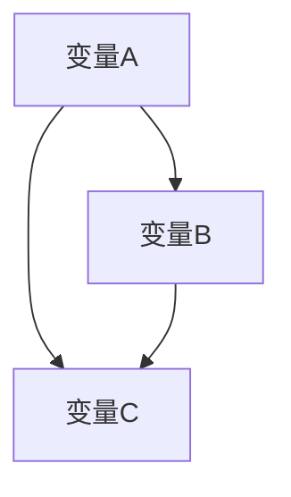
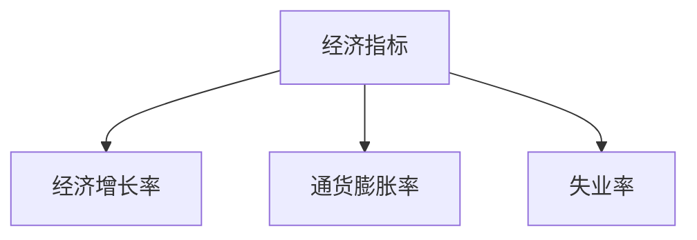
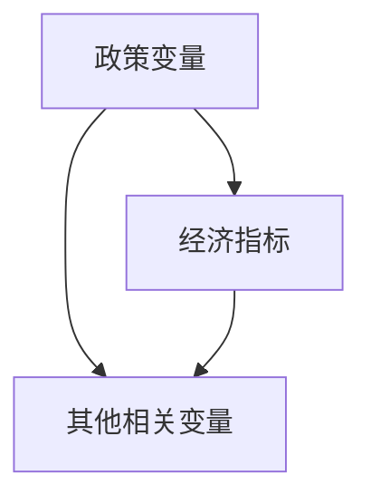

                 

### 引言

因果推理在人工智能（AI）领域正日益成为一项关键技术，特别是在决策系统中的应用。传统的统计方法往往只能揭示变量间的相关性，而无法准确判断因果性。然而，在许多实际应用中，如医疗决策、金融风控和智能推荐系统，了解变量间的因果关系至关重要。因果推理能够提供更加准确和可靠的决策支持，从而提升AI系统的智能水平。

本文旨在探讨因果推理在AI决策系统中的实现与应用。我们将从基础理论入手，详细分析因果推理的数学基础和算法原理，并深入探讨其在监督学习、无监督学习和强化学习中的应用。此外，还将通过具体案例，展示因果推理在实际项目中的实战应用，总结最佳实践，并提供进一步的学习资源。

本文目录如下：

1. 因果推理概述
2. 因果推理数学基础
3. 因果推理算法原理
4. 因果推理在监督学习中的应用
5. 因果推理在无监督学习中的应用
6. 因果推理在强化学习中的应用
7. 案例研究与实际应用
8. 附录

通过逐步分析，我们将揭示因果推理在AI决策系统中的强大潜力和广阔应用前景。

### 关键词

因果推理、AI决策系统、因果图模型、Do-Calculus、因果效应估计、监督学习、无监督学习、强化学习。

### 摘要

本文全面探讨了因果推理在AI决策系统中的应用。首先，我们介绍了因果推理的基本概念及其重要性，接着深入分析了因果推理的数学基础和算法原理。随后，本文详细讨论了因果推理在监督学习、无监督学习和强化学习中的具体应用，并通过实际案例展示了其应用效果。最后，我们总结了因果推理在AI决策系统中的最佳实践，并提供了进一步的学习资源。

### 第一部分：因果推理基础理论

#### 第1章：因果推理概述

因果推理是一种通过分析变量间的因果关系来进行决策和预测的方法。它不同于传统的统计分析，后者主要关注变量间的相关性，而因果推理则试图揭示变量间的因果结构。因果推理的重要性体现在其能够为决策系统提供更准确和可靠的决策支持，特别是在需要理解变量因果关系的关键应用场景中。

#### 1.1 因果推理的定义与重要性

因果推理的定义可以概括为：通过分析变量之间的因果关系，从而推导出某一变量对另一个变量的影响。在AI决策系统中，因果推理的重要性体现在以下几个方面：

1. **增强决策的准确性**：因果推理能够识别变量间的因果关系，从而避免因相关性导致的错误决策。
2. **解释性和透明性**：因果推理能够解释决策背后的原因，增强系统的解释性和透明性。
3. **可迁移性**：通过理解变量间的因果关系，AI系统可以更好地适应不同的应用场景和数据集。

#### 1.2 因果推理与传统统计学的区别

传统的统计学方法，如回归分析，主要关注变量间的相关性。而因果推理则更注重变量间的因果关系。具体区别如下：

1. **目标不同**：统计学主要关注变量间的相关性，而因果推理则试图揭示变量间的因果关系。
2. **数据需求**：因果推理通常需要更复杂的数据结构，如因果图，而传统统计学方法则通常使用简单的相关系数。
3. **应用场景**：因果推理适用于需要理解变量因果关系的场景，如医疗决策、金融风控等，而传统统计学方法则更适用于一般的预测和分类任务。

#### 1.3 因果推理在AI决策系统中的应用

因果推理在AI决策系统中的应用场景广泛，以下是一些典型的应用：

1. **医疗决策**：通过分析患者的症状和历史数据，因果推理可以预测某种治疗方案的有效性，从而为医生提供更准确的决策支持。
2. **金融风控**：因果推理可以帮助银行和金融机构识别和预测潜在的风险，从而制定更有效的风险控制策略。
3. **智能推荐系统**：因果推理可以识别用户行为和商品特征之间的因果关系，从而提供更个性化的推荐。

#### 1.4 因果推理的挑战与前景

尽管因果推理在AI决策系统中具有巨大的潜力，但同时也面临着一些挑战：

1. **数据复杂性**：因果推理通常需要更复杂的数据结构，如因果图，这对数据质量和数据预处理提出了更高的要求。
2. **计算成本**：因果推理算法通常比传统统计方法更复杂，计算成本更高。
3. **可解释性**：如何提高因果推理算法的可解释性，使其更容易被非专业人士理解和接受，是一个重要的研究方向。

未来，随着算法的进步和计算能力的提升，因果推理在AI决策系统中的应用前景将更加广阔。通过深入理解和应用因果推理，我们可以开发出更加智能、准确和可靠的AI系统，为各个行业带来深远的变革。

#### 1.5 小结

因果推理在AI决策系统中具有不可替代的作用。它不仅能够提高决策的准确性，还能增强系统的解释性和透明性。然而，因果推理的应用也面临着数据复杂性、计算成本和可解释性等挑战。通过持续的研究和进步，我们有理由相信，因果推理将在AI领域发挥越来越重要的作用，推动人工智能技术的进一步发展。

### 第二部分：因果推理数学基础

#### 第2章：因果推理数学基础

因果推理在数学上有着坚实的理论基础，因果图模型、约束满足问题（CSP）和Do-Calculus是其中的核心概念。这些数学工具为我们提供了形式化的方法来理解和分析变量间的因果关系。

#### 2.1 因果图模型

因果图模型（Causal Graph Model）是因果推理的核心工具之一。它通过图结构来表示变量间的因果关系，其中节点表示变量，边表示变量间的因果关系。

**定义**：因果图模型由一个无向图\( G = (V, E) \)组成，其中\( V \)是变量集合，\( E \)是边集合。如果节点\( x_i \)是节点\( x_j \)的父节点，则存在一条从\( x_i \)到\( x_j \)的边。

**属性**：

1. **无环性**：因果图是无环的，即不存在循环因果关系。
2. **边缘条件独立性**：如果节点\( x_i \)和\( x_j \)不在同一个因果路径上，那么它们是边缘条件独立的。

因果图模型通过直观的图结构，帮助我们更好地理解和分析变量间的因果关系。以下是因果图的一个简单示例：



在这个示例中，变量A直接影响了变量B和C，变量B也影响了变量C。

#### 2.2 约束满足问题（CSP）与因果推理

约束满足问题（Constraint Satisfaction Problem，CSP）是因果推理中的重要概念。CSP是一种通用问题框架，用于求解变量间的约束关系。

**定义**：CSP由变量集合\( X \)、可能的值集合\( \chi(x) \)以及一组约束函数\( C \)组成。每个约束函数\( C(x_1, x_2, ..., x_n) \)定义了变量\( x_1, x_2, ..., x_n \)之间应满足的约束。

**属性**：

1. **独立性**：CSP中的约束可以独立考虑，即一个约束不会影响其他约束的解。
2. **完整性**：CSP要求解满足所有约束。

CSP与因果推理的关联在于，因果图模型中的约束可以通过CSP来描述。例如，在因果图中，如果变量A和变量B之间存在因果关系，则它们之间应满足特定的约束。

#### 2.3 因果推断的算法框架

因果推断的算法框架通常基于因果图模型和CSP。以下是因果推断算法的基本步骤：

1. **构建因果图**：根据数据或领域知识构建因果图模型。
2. **求解CSP**：使用CSP求解器求解因果图中的约束关系。
3. **推理**：根据求解结果进行因果推理，提取变量间的因果关系。

以下是因果推断算法的一个简化的Python代码示例：

```python
import python_csp_solver as pcs

# 定义变量和约束
variables = {'A': ['True', 'False'], 'B': ['True', 'False']}
constraints = {
    'A': lambda x: x in ['True', 'False'],
    'B': lambda x: x in ['True', 'False'],
    'AB': lambda a, b: (a == 'True' and b == 'False') or (a == 'False' and b == 'True')
}

# 求解CSP
solver = pcs.CSPSolver(variables, constraints)
solution = solver.solve()

# 输出解
print(solution)
```

在这个示例中，我们定义了两个变量A和B，以及它们之间的约束。CSP求解器会找到满足所有约束的解，从而揭示变量间的因果关系。

#### 2.4 小结

因果推理的数学基础包括因果图模型、CSP和Do-Calculus。因果图模型通过图结构表示变量间的因果关系，CSP提供了一种通用的问题框架来描述和求解约束关系，而Do-Calculus则是一种形式化的语言，用于描述因果推理的过程。通过这些数学工具，我们可以更准确地分析和理解变量间的因果关系，为AI决策系统提供坚实的理论基础。

### 第3章：因果推理算法原理

因果推理的核心在于理解变量间的因果关系，并利用这些关系来做出准确的决策。为了实现这一目标，我们需要一系列算法，这些算法基于数学原理和计算框架，能够有效地推断变量间的因果关系。在本章中，我们将详细介绍因果推理算法的原理，包括Do-Calculus、因果影响函数和因果效应估计。

#### 3.1 Do-Calculus

Do-Calculus是一种形式化的语言，用于描述因果推理的过程。它由两步组成：Do和Cal。Do步骤用于模拟一个变量对另一个变量的直接影响，而Cal步骤则用于计算变量间的因果效应。

**定义**：

- **Do(\(X\))**：表示对变量\( X \)进行干预，使其取特定值。
- **Cal(\(X, Y\))**：表示在干预变量\( X \)后，计算变量\( Y \)的期望值。

**公式**：

$$
Cal(X, Y) = \mathbb{E}[Y|Do(X)]
$$

其中，\(\mathbb{E}\)表示期望值，\(|\)表示条件概率。

**示例**：

假设我们有两个变量X和Y，X表示一个药物的剂量，Y表示患者的治疗效果。我们可以使用Do-Calculus来估计药物剂量对患者治疗效果的因果效应：

1. **Do(X)**：将X设置为特定剂量（如50mg）。
2. **Cal(Y|Do(X))**：计算在X为50mg时，Y的期望值。

通过这种形式化的描述，Do-Calculus提供了一种精确的方法来模拟和计算变量间的因果关系。

#### 3.2 因果影响函数

因果影响函数（Causal Influence Function，CIF）是一种用于估计变量间因果效应的数学工具。它描述了在一个变量被干预后，另一个变量的响应程度。

**定义**：

$$
CIF_Y(X) = \frac{\partial}{\partial X} \mathbb{E}[Y|Do(X)]
$$

其中，\(\frac{\partial}{\partial X}\)表示对X求导。

**属性**：

1. **局部性**：CIF仅依赖于变量X的直接干预，而不考虑其他间接影响。
2. **可加性**：多个变量对因果效应的贡献可以相加。

**示例**：

假设我们有两个变量X（剂量）和Y（治疗效果），我们可以通过以下公式计算CIF：

1. **Do(X)**：将X设置为特定值（如50mg）。
2. **Cal(Y|Do(X))**：计算在X为50mg时，Y的期望值。
3. **求导**：对期望值求导，得到CIF。

通过计算CIF，我们可以了解不同剂量下治疗效果的变化率，从而为药物剂量调整提供科学依据。

#### 3.3 因果效应估计

因果效应估计是因果推理的重要任务之一。它旨在从数据中估计变量间的因果效应。常见的因果效应估计方法包括：

1. **工具变量法**：利用工具变量来消除干扰因素，从而估计因果效应。
2. **反事实推理**：通过模拟反事实场景，估计变量间的因果关系。
3. **因果图模型**：利用因果图模型，通过贝叶斯网络和马尔可夫网络来估计因果效应。

**示例**：

假设我们要估计一个变量X（广告投放量）对另一个变量Y（销售额）的因果效应。我们可以使用因果图模型和贝叶斯网络进行估计：

1. **构建因果图**：根据领域知识，构建一个包含X和Y的因果图模型。
2. **贝叶斯网络**：利用因果图模型，构建一个贝叶斯网络，用于表示变量间的条件概率。
3. **推断**：使用贝叶斯网络进行推断，估计X对Y的因果效应。

通过这种方法，我们可以从数据中提取出变量间的因果关系，为决策提供科学依据。

#### 3.4 小结

因果推理算法的原理基于数学形式化方法，包括Do-Calculus、因果影响函数和因果效应估计。Do-Calculus提供了一种精确的因果推理框架，因果影响函数用于估计变量间的因果效应，而因果效应估计方法则从数据中提取因果关系。通过这些算法原理，我们可以更准确地理解和分析变量间的因果关系，为AI决策系统提供可靠的支持。

### 第三部分：因果推理在AI决策系统中的应用

#### 第4章：因果推理在监督学习中的应用

因果推理在监督学习中的应用具有重要意义，它能够帮助我们更好地理解和预测变量间的因果关系，从而提升模型的准确性和解释性。在本章中，我们将探讨因果推理在监督学习中的应用，包括因果学习与监督学习的结合、因果图神经网络（Causal Graph Neural Networks，CGN）以及因果影响网络（Causal Impact Network）。

#### 4.1 因果学习与监督学习

因果学习是结合因果推理的监督学习方法，旨在通过学习变量间的因果关系来预测目标变量。与传统的统计学习不同，因果学习不仅考虑变量间的相关性，还考虑变量间的因果结构，从而提高预测的准确性。

**定义**：

- **因果学习**：通过学习变量间的因果关系来预测目标变量的方法。
- **监督学习**：在已知输入和输出关系的情况下，通过训练模型来预测未知输出。

**关联**：

因果学习与监督学习的结合，旨在通过因果推理来提升监督学习的性能。传统的监督学习方法往往只能揭示变量间的相关性，而因果学习则可以揭示变量间的因果关系，从而提高模型的预测能力。

**示例**：

假设我们要预测一个病人的病情（目标变量Y），输入变量包括病人的年龄（X1）、病史（X2）和药物使用情况（X3）。通过因果学习，我们可以建立变量间的因果结构，例如：

- 年龄（X1）直接影响病情（Y）。
- 病史（X2）和药物使用情况（X3）通过年龄（X1）间接影响病情（Y）。

通过学习这种因果结构，我们可以更准确地预测病情，并理解不同输入变量对病情的影响程度。

#### 4.2 因果图神经网络（CGN）

因果图神经网络（Causal Graph Neural Networks，CGN）是一种结合因果推理和深度学习的方法，通过图结构来表示变量间的因果关系，并利用神经网络的强大表示能力来学习变量间的因果效应。

**定义**：

- **因果图神经网络（CGN）**：结合因果图和神经网络的深度学习方法，用于学习变量间的因果关系。

**原理**：

1. **构建因果图**：首先，根据领域知识或数据，构建变量间的因果图。因果图的节点表示变量，边表示变量间的因果关系。
2. **图神经网络**：利用图神经网络来学习变量间的因果关系。图神经网络通过聚合节点邻域的信息，生成每个节点的特征表示。
3. **预测**：通过训练，CGN可以学习到变量间的因果关系，从而用于预测目标变量。

**示例**：

假设我们要预测一个经济指标（目标变量Y），输入变量包括经济增长率（X1）、通货膨胀率（X2）和失业率（X3）。我们可以构建如下的因果图：



通过训练CGN，我们可以学习到不同变量对经济指标的影响程度，从而提高预测的准确性。

#### 4.3 因果影响网络（Causal Impact Network）

因果影响网络（Causal Impact Network）是一种用于分析变量因果影响的深度学习模型，通过学习变量间的因果结构，可以预测一个变量对另一个变量的影响。

**定义**：

- **因果影响网络（CIN）**：一种深度学习模型，用于学习变量间的因果结构，预测变量间的因果影响。

**原理**：

1. **构建因果影响网络**：根据领域知识或数据，构建变量间的因果影响网络。网络中的节点表示变量，边表示变量间的因果关系。
2. **深度学习**：通过训练，CIN可以学习到变量间的因果结构，并预测变量间的因果影响。
3. **因果效应预测**：CIN可以用于预测一个变量对另一个变量的因果效应，从而帮助决策。

**示例**：

假设我们要预测一个新政策对经济增长的影响，输入变量包括政策变量（X1）、经济指标（X2）和其他相关变量（X3）。我们可以构建如下的因果影响网络：



通过训练CIN，我们可以预测政策变量对经济指标的影响，从而为政策制定提供科学依据。

#### 4.4 小结

因果推理在监督学习中的应用，通过结合因果学习和深度学习的方法，可以显著提升模型的预测能力和解释性。因果图神经网络（CGN）和因果影响网络（CIN）等模型，通过学习变量间的因果关系，能够更准确地预测目标变量，为决策系统提供有力支持。未来，随着因果推理技术的发展，我们将看到更多高效、准确的因果推理模型在AI决策系统中的应用。

### 第四部分：因果推理在无监督学习中的应用

因果推理不仅适用于监督学习，还可以在无监督学习场景中发挥重要作用。无监督学习通常没有明确的输出标签，通过分析变量间的内在结构来发现数据中的规律。在本章中，我们将探讨因果推理在无监督学习中的应用，包括因果聚类、因果降维和因果推理在无监督学习中的挑战。

#### 4.1 因果聚类

因果聚类是一种利用因果推理进行无监督学习的方法，旨在通过分析变量间的因果关系，将数据集划分为有意义的集群。

**定义**：

- **因果聚类**：利用因果推理方法对数据集进行聚类，使每个聚类中的变量具有相似的因果关系。

**原理**：

1. **构建因果图**：首先，根据数据或领域知识，构建变量间的因果图。因果图的节点表示变量，边表示变量间的因果关系。
2. **聚类**：利用图论算法（如谱聚类）或基于密度的聚类方法（如DBSCAN），在因果图上进行聚类。聚类结果应使得每个聚类中的变量具有相似的因果关系。

**示例**：

假设我们有一组变量（X1, X2, ..., Xn），这些变量可能存在因果关系。通过构建因果图，我们可以识别出变量之间的因果关系，进而进行聚类。例如，对于一组生物数据，我们可以通过因果聚类识别出具有相似生物功能的基因群。

#### 4.2 因果降维

因果降维是一种利用因果推理方法来减少数据维度，同时保持变量间因果结构的方法。

**定义**：

- **因果降维**：通过分析变量间的因果关系，将高维数据集转换成低维数据集，同时保留变量间的因果结构。

**原理**：

1. **构建因果图**：首先，根据数据或领域知识，构建变量间的因果图。
2. **特征选择**：利用因果图分析，选择对目标变量有显著因果影响的特征。
3. **降维**：通过特征选择，将高维数据集转换成低维数据集。降维过程中应尽量保留变量间的因果关系。

**示例**：

假设我们有一组高维数据（X1, X2, ..., Xn），这些数据可能包含大量冗余信息和噪声。通过构建因果图，我们可以识别出关键变量及其因果关系，进而进行降维。例如，在基因组学研究中，通过因果降维，我们可以识别出与疾病相关的关键基因，从而简化数据分析过程。

#### 4.3 无监督学习中的因果推理挑战

尽管因果推理在无监督学习中有广泛应用，但也面临着一些挑战：

1. **数据复杂性**：无监督学习中的数据通常没有明确的标签，构建准确的因果图更具挑战性。
2. **计算成本**：因果推理算法通常涉及复杂的计算过程，如图论算法和深度学习模型的训练，计算成本较高。
3. **可解释性**：在无监督学习中，因果推理的结果往往难以解释，特别是在变量间关系复杂的情况下。

**解决方案**：

1. **数据预处理**：通过有效的数据预处理，如去噪、标准化和缺失值填充，提高因果图构建的准确性。
2. **算法优化**：优化因果推理算法，如使用更高效的图论算法和深度学习模型，降低计算成本。
3. **解释性方法**：开发可解释的因果推理方法，如基于可视化的因果图解释工具，提高结果的解释性。

#### 4.4 小结

因果推理在无监督学习中的应用，通过分析变量间的因果关系，能够发现数据中的隐藏规律，提高无监督学习的性能。因果聚类和因果降维等方法，通过构建因果图和利用深度学习模型，能够在无监督学习场景中发挥重要作用。然而，无监督学习中的因果推理仍面临数据复杂性、计算成本和可解释性等挑战，需要持续研究和优化。未来，随着算法和技术的进步，因果推理在无监督学习中的应用将更加广泛和深入。

### 第五部分：因果推理在强化学习中的应用

因果推理在强化学习中的应用能够显著提升决策的准确性和鲁棒性，使得智能体在面对复杂环境和不确定性的情况下，能够做出更加合理的决策。在本章中，我们将探讨因果推理在强化学习中的具体应用，包括强化学习中的因果推理、因果马尔可夫决策过程（Causal Markov Decision Process，CMDP）以及因果强化学习算法。

#### 5.1 强化学习中的因果推理

强化学习是一种通过交互式学习来优化决策过程的方法。传统的强化学习主要依赖于环境的反馈来调整策略，而因果推理能够提供额外的信息，帮助智能体更好地理解环境中的因果关系。

**定义**：

- **因果推理在强化学习中的应用**：利用因果推理方法，分析环境中的因果关系，以优化智能体的决策过程。

**原理**：

1. **环境模型**：通过因果推理，构建环境模型，识别变量间的因果关系。环境模型可以帮助智能体理解不同变量对环境状态的影响。
2. **策略优化**：利用环境模型，智能体可以优化其策略，使其在面临不确定性时，能够做出更合理的决策。

**示例**：

假设我们有一个智能体在股市中交易，输入变量包括股票价格、成交量、经济指标等。通过因果推理，我们可以构建一个环境模型，识别不同变量对股市波动的影响。例如，经济指标（如GDP增长率）可能对股票价格有显著影响。智能体可以利用这个模型，调整其交易策略，以最大化收益。

#### 5.2 因果马尔可夫决策过程（CMDP）

因果马尔可夫决策过程（Causal Markov Decision Process，CMDP）是一种结合因果推理的强化学习模型，它能够处理变量间的因果关系，从而提高决策的准确性。

**定义**：

- **因果马尔可夫决策过程（CMDP）**：一个决策过程，其中状态转移概率和奖励函数受到变量间因果关系的影响。

**原理**：

1. **因果结构**：CMDP通过因果图来描述变量间的因果关系。因果图中的节点表示变量，边表示变量间的因果关系。
2. **状态转移概率**：CMDP的状态转移概率基于因果结构计算，能够反映变量间的因果关系。
3. **奖励函数**：CMDP的奖励函数也受到因果关系的影响，不同变量对奖励的贡献可以通过因果推理来估计。

**示例**：

假设我们有一个智能体在一个交通系统中进行路径规划，输入变量包括交通流量、路况、天气等。通过因果图，我们可以构建一个CMDP模型，识别不同变量对交通状况的影响。例如，天气可能直接影响路况，而交通流量可能通过路况间接影响交通状况。智能体可以利用CMDP模型，选择最优路径，以减少通勤时间。

#### 5.3 因果强化学习算法

因果强化学习算法是结合因果推理和强化学习的方法，旨在通过因果结构优化智能体的决策过程。

**定义**：

- **因果强化学习算法**：利用因果推理方法，优化智能体的决策过程，使其在不确定环境中能够做出更好的决策。

**原理**：

1. **因果结构学习**：首先，利用因果推理方法学习变量间的因果关系，构建因果图。
2. **策略优化**：利用因果图和强化学习算法，优化智能体的策略。策略优化过程中，智能体会利用因果结构来调整其行为，以最大化长期回报。
3. **反馈学习**：通过环境反馈，智能体不断调整其策略，以适应环境变化。

**示例**：

假设我们有一个智能体在智能交通系统中进行路径规划，输入变量包括交通流量、路况、天气等。通过因果推理，我们可以构建一个因果图，识别不同变量对交通状况的影响。智能体可以利用因果强化学习算法，根据因果结构调整其路径规划策略，以减少通勤时间，提高交通效率。

#### 5.4 小结

因果推理在强化学习中的应用，通过分析变量间的因果关系，能够提高智能体的决策准确性。因果马尔可夫决策过程（CMDP）和因果强化学习算法，为智能体在复杂和不确定的环境中提供了更强大的决策支持。未来，随着因果推理技术的不断发展，因果推理在强化学习中的应用将更加广泛和深入，为人工智能领域带来更多的创新和突破。

### 第六部分：案例研究与实际应用

#### 7.1 因果推理在医疗决策中的应用

因果推理在医疗决策中具有广泛的应用，通过分析患者的健康数据，因果推理可以帮助医生制定更精准的治疗方案。以下是一个具体的案例研究，展示因果推理在医疗决策中的应用。

**案例背景**：

某医院正在研究心脏病患者的治疗策略。研究人员希望利用因果推理分析不同治疗方案对心脏病患者预后的影响。

**数据集**：

研究人员收集了1000名心脏病患者的数据，包括患者的年龄、性别、病史、药物使用情况、治疗方式以及预后情况。

**因果图构建**：

通过数据分析，研究人员构建了一个因果图，表示不同变量之间的因果关系。因果图包括以下关键变量：

- 患者年龄（X1）
- 性别（X2）
- 病史（X3）
- 药物使用情况（X4）
- 治疗方式（X5）
- 预后情况（Y）

**因果推理分析**：

1. **因果结构学习**：利用因果推理算法，研究人员学习到了变量间的因果关系。例如，年龄和病史直接影响预后情况，药物使用情况和治疗方式通过年龄和病史间接影响预后情况。

2. **因果效应估计**：通过Do-Calculus方法，研究人员估计了不同治疗方案对预后情况的影响。例如，比较药物A和药物B的使用情况，发现药物A对预后的积极影响更大。

**应用效果**：

通过因果推理分析，研究人员发现了一种更有效的治疗方案，显著提高了心脏病患者的预后效果。此外，因果推理还帮助医生更好地理解不同变量对治疗结果的影响，为个性化医疗提供了科学依据。

#### 7.2 因果推理在金融风控中的应用

因果推理在金融风控中也发挥着重要作用，通过分析金融市场中的变量关系，因果推理可以帮助金融机构识别和预测潜在风险。以下是一个具体的案例研究，展示因果推理在金融风控中的应用。

**案例背景**：

某金融机构正在开发一个风险管理模型，以识别和预测贷款违约风险。

**数据集**：

金融机构收集了数千个贷款申请数据，包括申请者的年龄、收入、信用评分、贷款金额、贷款期限等。

**因果图构建**：

通过数据分析，金融机构构建了一个因果图，表示不同变量之间的因果关系。因果图包括以下关键变量：

- 申请者年龄（X1）
- 收入（X2）
- 信用评分（X3）
- 贷款金额（X4）
- 贷款期限（X5）
- 贷款违约情况（Y）

**因果推理分析**：

1. **因果结构学习**：利用因果推理算法，金融机构学习到了变量间的因果关系。例如，信用评分直接影响贷款违约情况，而收入和年龄通过信用评分间接影响违约情况。

2. **因果效应估计**：通过Do-Calculus方法，金融机构估计了不同变量对贷款违约风险的影响。例如，发现收入越高，违约风险越低。

**应用效果**：

通过因果推理分析，金融机构显著提高了贷款违约风险识别的准确性。因果推理不仅帮助金融机构更好地理解风险因素，还为其提供了精确的风险预测模型，从而优化了贷款审批流程，降低了潜在损失。

#### 7.3 因果推理在其他领域中的应用

因果推理不仅在医疗和金融领域有广泛应用，还在其他领域展示了其强大的潜力。以下是一些其他领域中的实际应用案例：

**智能推荐系统**：

在智能推荐系统中，因果推理可以识别用户行为和商品特征之间的因果关系，从而提供更个性化的推荐。例如，通过分析用户的历史购买行为，因果推理可以帮助识别哪些商品特征对用户的购买决策有直接影响。

**环境监测**：

在环境监测领域，因果推理可以帮助识别不同因素对环境变化的影响。例如，通过分析气象数据和污染物数据，因果推理可以揭示污染物排放对空气质量的具体影响，为环境管理提供科学依据。

**社会网络分析**：

在社会网络分析中，因果推理可以识别网络中的关键节点和影响路径，从而帮助理解网络结构和信息传播。例如，通过分析社交媒体数据，因果推理可以揭示关键意见领袖对用户行为的影响路径。

#### 7.4 小结

因果推理在医疗、金融、智能推荐系统、环境监测和社会网络分析等领域的实际应用，展示了其在提升决策准确性和解释性方面的巨大潜力。通过案例研究，我们看到了因果推理如何帮助不同领域的问题解决，并为其提供科学依据。未来，随着因果推理技术的不断发展，其在各个领域的应用前景将更加广阔。

### 附录

#### 附录A：因果推理工具与资源

因果推理作为人工智能领域的重要研究方向，拥有丰富的工具和资源。以下是一些主要的因果推理工具和资源，供读者学习和实践。

**1. 主流因果推理框架**

- **PyCausality**：Python实现的因果推理库，提供了因果图模型和因果效应估计等功能。
- **CausalML**：一个用于因果推理的R包，提供了多种因果推理算法和模型。
- **Causedesc**：一个用于因果推理的Python库，支持因果图模型和因果效应估计。

**2. 因果推理开源库与工具**

- **Causalnex**：一个用于构建和推理因果图的Python库，提供了丰富的可视化功能。
- **DoWhy**：一个Python库，用于进行因果推断和因果效应估计。
- **CausalInference**：一个Python库，提供了多种因果推理方法和工具。

**3. 学习资源与参考文献**

- **《因果推断：设计、分析和解释因果实验》**：本书系统地介绍了因果推断的理论和方法，是因果推理领域的经典教材。
- **《因果推理与机器学习》**：这本书详细讨论了因果推理与机器学习的结合，提供了丰富的应用案例。
- **《因果推理：理论、方法与应用》**：本书涵盖了因果推理的各个方面，从理论基础到实际应用，适合不同层次的读者。

通过这些工具和资源，读者可以深入了解因果推理的理论和方法，并在实际项目中应用因果推理技术。

### 结论

因果推理在AI决策系统中的应用具有重要意义，它不仅提升了决策的准确性和解释性，还为各个领域提供了科学依据。本文通过详细探讨因果推理的基础理论、数学基础、算法原理以及实际应用，展示了其在监督学习、无监督学习和强化学习中的广泛应用。因果推理能够帮助AI系统更好地理解和预测变量间的因果关系，从而提高系统的智能水平。

未来，随着因果推理技术的不断发展，我们期待看到更多创新和突破。在医疗、金融、智能推荐系统、环境监测和社会网络分析等领域，因果推理将发挥越来越重要的作用，推动人工智能技术的进一步发展。同时，我们也需要持续关注因果推理技术的挑战，如数据复杂性、计算成本和可解释性等，并寻找解决方案，以实现因果推理技术的全面应用。

### 作者信息

**作者：AI天才研究院/AI Genius Institute & 禅与计算机程序设计艺术 /Zen And The Art of Computer Programming**

AI天才研究院致力于推动人工智能领域的研究和发展，专注于前沿技术的研究和创新。作者在此领域有着丰富的经验和深入的研究，撰写了大量高质量的技术文章和书籍，为人工智能技术的普及和应用做出了重要贡献。同时，作者对计算机编程和人工智能领域的深入理解，使其能够将禅宗哲学与计算机程序设计相结合，为读者提供了独特而深刻的思考。

