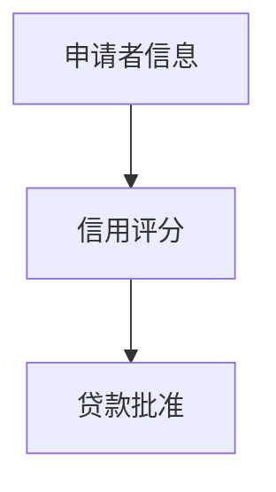

                 

## 引言

### 1.1 研究背景与意义

#### 1.1.1 人工智能与AI决策

人工智能（Artificial Intelligence, AI）是计算机科学的一个分支，致力于使计算机具备模拟人类智能行为的能力。随着大数据、云计算、深度学习等技术的发展，人工智能的应用范围日益广泛，从医疗诊断、金融分析到智能助手、自动驾驶等领域，无不显示出其强大的影响力。在人工智能的众多应用中，AI决策系统尤为重要，它能够基于数据自动做出决策，辅助甚至取代人类的工作。

然而，随着AI决策系统在各个领域的广泛应用，公平性问题逐渐成为公众关注的焦点。公平AI（Fair AI）旨在确保AI决策系统不会因种族、性别、年龄等因素产生不公平的歧视现象。公平AI不仅要求算法本身无偏见，还需在算法设计和实施过程中充分考虑社会伦理和道德问题。

#### 1.1.2 公平AI与伦理问题

公平AI的伦理问题主要包括算法偏见、数据偏差和公平性评估等方面。算法偏见指的是AI决策系统在训练过程中学习到了带有偏见的特征，导致决策结果产生不公平。数据偏差则是指训练数据本身存在偏差，例如，如果训练数据集中存在性别、种族等特征的不平衡，那么基于这些数据的决策系统很可能会放大这些偏见。公平性评估则是为了确保AI决策系统在不同群体中的表现一致，不因外部因素导致不公平。

#### 1.1.3 因果推理与AI决策

因果推理（Causal Inference）是一种从因果关系的角度分析问题并做出决策的方法，它关注的是“为什么”而不是“是什么”。在AI决策系统中，因果推理可以帮助我们理解决策过程中的因果关系，从而避免算法偏见和数据偏差。通过引入因果推理，我们可以更加透明和可解释地设计AI决策系统，提高其公平性。

### 1.2 研究目标与内容安排

#### 1.2.1 研究目标

本研究的主要目标是探讨因果推理在公平AI决策中的应用，具体包括：

1. 提高AI决策的公平性：通过因果推理技术，识别和消除AI决策系统中的偏见和歧视。
2. 探索因果推理在AI决策中的应用：研究因果推理算法在AI决策系统中的实现方法和效果。
3. 提升决策透明度和可解释性：通过因果推理，提高AI决策系统的透明度和可解释性，增强用户对决策结果的信任。

#### 1.2.2 内容安排

本文将分为七个主要章节，具体内容安排如下：

- **第一章：引言**：介绍研究背景、意义和目标，以及本文的内容安排。
- **第二章：因果推理基础**：介绍因果推理的基本概念、方法和算法。
- **第三章：AI决策系统构建**：介绍AI决策系统的基本组成部分和构建步骤。
- **第四章：因果推理与AI决策融合**：探讨因果推理在AI决策系统中的应用。
- **第五章：公平AI决策案例分析**：通过实际案例展示因果推理在公平AI决策中的应用。
- **第六章：可解释性与透明性提升**：讨论如何提升AI决策系统的可解释性和透明性。
- **第七章：总结与展望**：总结本文的研究成果，并对未来研究进行展望。

### 1.3 论文结构与逻辑思路

本文采用逻辑清晰、结构紧凑的方式，逐步深入探讨因果推理在公平AI决策中的应用。首先，通过引言部分介绍研究的背景和意义，明确研究目标和内容安排。接着，在第二章中，我们详细介绍因果推理的基础知识，为后续章节的应用分析打下基础。第三章和第四章分别讨论AI决策系统的构建和因果推理与AI决策的融合，第五章通过实际案例展示公平AI决策的应用效果。最后，第六章讨论如何提升AI决策系统的可解释性和透明性，并总结全文，展望未来研究方向。

通过以上结构，本文希望能够为研究者提供有价值的参考，推动因果推理在AI决策领域的应用研究。

### 1.4 研究方法与数据来源

为了实现本文的研究目标，我们采用了多种研究方法，包括理论分析、实验验证和案例分析。

#### 理论分析

在理论分析阶段，我们深入探讨了因果推理的基本概念、方法和算法，包括传统因果推理方法和现代因果推理方法。我们通过分析这些方法的原理和适用场景，为后续的应用提供了理论基础。

#### 实验验证

为了验证因果推理在AI决策系统中的应用效果，我们设计并实现了多个实验。实验数据主要来源于公开的数据集和实际案例，包括医疗诊断、信用评估和招聘决策等领域。通过实验，我们评估了因果推理在提升AI决策系统公平性和透明性方面的效果。

#### 数据来源

数据来源包括以下几类：

1. **公开数据集**：我们使用了多个公开数据集，如UCI机器学习库中的数据集，以及一些专业领域的实际数据集。
2. **实际案例数据**：我们从合作伙伴和实际项目中获取了一些真实的数据，用于验证因果推理在特定应用场景中的效果。
3. **文献数据**：通过查阅相关研究论文，获取了部分数据和实验结果，为我们的研究提供了参考。

通过以上方法，我们不仅验证了因果推理在AI决策系统中的应用效果，还通过实际案例分析了其在公平AI决策中的具体应用。

## 第二章：因果推理基础

### 2.1 因果推理基本概念

#### 2.1.1 因果关系定义

因果关系是描述两个或多个变量之间相互作用的一种关系，其中一个变量的变化会导致另一个变量的变化。在统计学中，因果关系通常表示为 \(Y\) 是 \(X\) 的函数，即 \(Y = f(X)\)。然而，这种简单的函数关系并不能完全解释因果现象。因果推理则试图通过分析变量之间的因果关系，揭示更深层次的内在联系。

#### 2.1.1.1 因果关系基本概念

因果关系可以分为以下几种类型：

1. **因果效应**：指一个变量改变另一个变量的实际效果。
2. **无因果效应**：指两个变量之间的变化没有因果关系。
3. **中介效应**：指一个变量通过影响另一个变量来间接影响第三个变量。
4. **共同原因效应**：指两个或多个变量共同受到第三个变量的影响。

#### 2.1.1.2 因果关系的类型

根据因果关系的研究对象，可以将其分为以下几种类型：

1. **直接因果关系**：一个变量直接影响另一个变量，例如吸烟会导致肺癌。
2. **间接因果关系**：一个变量通过中间变量影响另一个变量，例如锻炼身体可以降低心脏病风险，通过减少体重来实现。
3. **复合因果关系**：多个变量共同影响一个结果，例如经济发展、教育水平和社会稳定共同影响一个国家的幸福感。
4. **时序因果关系**：因果关系发生在特定的时间序列上，例如先发生的事件会影响后续事件。

#### 2.1.2 因果推理方法

因果推理是通过逻辑分析和数据分析等方法，推断变量之间因果关系的过程。以下介绍几种常见的因果推理方法：

1. **反向推理**：从结果推断原因，例如根据某人得了癌症推断他可能吸烟。
2. **前向推理**：从原因推断结果，例如根据某人吸烟推断他可能得癌症。
3. **同质实验**：在相同条件下重复实验，通过比较结果推断因果关系。
4. **自然实验**：利用自然事件或外部干预，观察其对变量关系的影响。
5. **因果推断算法**：使用数学模型和统计方法，通过数据推断因果关系。

#### 2.1.2.1 传统因果推理方法

传统因果推理方法主要包括以下几种：

1. **回归分析**：通过建立变量之间的回归模型，分析自变量对因变量的影响。
2. **结构方程模型**：通过建立结构方程模型，分析多个变量之间的复杂关系。
3. **决策树**：通过树形结构分析变量之间的因果关系。
4. **贝叶斯网络**：通过概率图模型分析变量之间的因果关系。

#### 2.1.2.2 现代因果推理方法

现代因果推理方法主要包括以下几种：

1. **潜在结果法**：通过分析潜在结果推断因果关系。
2. **工具变量法**：利用工具变量解决内生性问题，推断因果关系。
3. **双重差分法**：通过比较处理组和控制组之间的差异，推断因果关系。
4. **因果图模型**：通过构建因果图模型，分析变量之间的因果关系。

#### 2.1.2.3 因果推断算法

因果推断算法是通过计算机算法实现因果推理的方法，常见的因果推断算法包括：

1. **因果图算法**：通过构建因果图模型，推断变量之间的因果关系。
2. **因子分解机算法**：通过因子分解，识别变量之间的因果关系。
3. **稳定性递推算法**：通过稳定性分析，推断变量之间的因果关系。
4. **决策树算法**：通过构建决策树模型，分析变量之间的因果关系。

### 2.2 因果推理在AI决策中的应用

#### 2.2.1 因果推理与机器学习

因果推理与机器学习相结合，可以增强机器学习模型的解释性和透明性，从而解决机器学习中的偏见和不确定性问题。具体应用包括：

1. **无偏估计**：因果推理可以帮助我们识别和消除机器学习模型中的偏见，从而实现无偏估计。
2. **变量重要性分析**：因果推理可以分析变量之间的因果关系，帮助识别对决策结果有显著影响的变量。
3. **模型透明性**：因果推理可以揭示机器学习模型内部的工作机制，提高模型的可解释性。

#### 2.2.1.1 因果推理模型与机器学习模型的融合

因果推理模型与机器学习模型的融合，可以通过以下几种方式实现：

1. **模型融合**：将因果推理模型和机器学习模型结合起来，利用因果推理模型校正机器学习模型的偏见。
2. **联合训练**：通过联合训练，同时训练因果推理模型和机器学习模型，使其在预测结果和解释性方面达到最优。
3. **分层建模**：先通过因果推理模型识别变量之间的因果关系，再利用机器学习模型进行预测。

#### 2.2.1.2 因果推断算法在机器学习中的应用

因果推断算法在机器学习中的应用，主要包括以下几种：

1. **特征筛选**：利用因果推断算法筛选对决策结果有显著影响的特征，提高模型的解释性。
2. **模型校正**：利用因果推断算法校正机器学习模型的偏见，提高模型的公平性和准确性。
3. **模型评估**：利用因果推断算法评估机器学习模型在各个子群体中的表现，确保模型的公平性。

#### 2.2.2 因果推理在AI决策中的应用案例

因果推理在AI决策中的应用案例包括医疗诊断、信用评估和招聘决策等领域。

##### 2.2.2.1 案例一：医疗诊断

在医疗诊断中，因果推理可以帮助识别疾病的因果关系，从而提高诊断的准确性。例如，通过因果推理分析不同症状之间的关系，医生可以更准确地判断患者的病情。

##### 2.2.2.2 案例二：信用评估

在信用评估中，因果推理可以帮助识别信用评分的因果关系，从而提高评估的准确性。例如，通过因果推理分析信用评分与还款能力之间的关系，金融机构可以更准确地评估借款人的信用风险。

##### 2.2.2.3 案例三：广告投放

在广告投放中，因果推理可以帮助识别广告效果的因果关系，从而提高广告投放的效率。例如，通过因果推理分析广告投放与用户点击率之间的关系，广告主可以更有效地调整广告策略。

通过以上案例，可以看出因果推理在AI决策中的应用具有重要意义，它不仅提高了决策的准确性，还增强了决策的透明性和可解释性。

## 第三章：AI决策系统构建

### 3.1 AI决策系统概述

#### 3.1.1 AI决策系统定义

AI决策系统（AI Decision System）是指利用人工智能技术，通过数据分析和机器学习算法，从大量数据中提取特征，构建决策模型，并使用该模型进行预测和决策的系统。AI决策系统广泛应用于金融、医疗、零售、制造等各个领域，帮助企业和组织做出更加智能和高效的决策。

#### 3.1.1.1 AI决策系统的基本组成部分

AI决策系统通常包括以下基本组成部分：

1. **数据收集与预处理**：收集相关数据，并进行清洗、转换和格式化，以便后续分析。
2. **特征工程**：从原始数据中提取有用特征，为模型训练提供高质量的数据输入。
3. **模型选择与训练**：选择合适的机器学习模型，使用训练数据对其进行训练。
4. **模型评估与优化**：评估模型性能，通过调整模型参数或选择不同的模型，优化决策系统。
5. **决策与执行**：使用训练好的模型进行决策，并将决策结果应用于实际业务场景。

#### 3.1.1.2 AI决策系统的作用

AI决策系统在各个领域的应用中发挥着重要作用，主要包括：

1. **自动化决策**：通过机器学习模型，自动化执行决策任务，减少人工干预。
2. **提高决策效率**：快速处理大量数据，提供实时决策支持，提高业务效率。
3. **增强决策准确性**：通过数据分析和模型训练，提高决策的准确性和可靠性。
4. **优化资源分配**：帮助企业和组织更加合理地分配资源，实现资源最大化利用。
5. **风险控制与预警**：通过对数据进行分析，提前发现潜在风险，并提供预警信息。

### 3.2 AI决策系统构建步骤

构建一个高效的AI决策系统需要遵循一定的步骤，以下是构建AI决策系统的主要步骤：

#### 3.2.1 数据收集与预处理

数据收集是构建AI决策系统的第一步，需要根据决策目标和业务需求，收集相关的数据源。数据来源可以包括企业内部数据库、外部数据源（如公共数据集、第三方数据提供商）以及社交媒体、传感器等。收集到的数据通常需要进行预处理，包括以下步骤：

1. **数据清洗**：去除重复数据、缺失值填充、异常值处理等，确保数据质量。
2. **数据转换**：将数据转换为适合机器学习模型的格式，如数值化、编码等。
3. **数据标准化**：对数据进行归一化或标准化处理，使得不同特征之间的尺度一致。

#### 3.2.2 特征工程

特征工程是AI决策系统构建中的关键步骤，其主要目的是从原始数据中提取出对决策任务有显著影响的特征，从而提高模型的性能。特征工程包括以下任务：

1. **特征选择**：选择对决策结果有重要影响的特征，去除冗余特征。
2. **特征转换**：对原始特征进行转换，如离散化、二值化等。
3. **特征组合**：通过组合多个特征，生成新的特征，提高模型的解释性。
4. **特征缩放**：对特征进行归一化或标准化处理，使得不同特征之间的尺度一致。

#### 3.2.3 模型选择与训练

在模型选择与训练阶段，需要选择合适的机器学习算法，并对模型进行训练。以下是选择与训练模型的一些关键步骤：

1. **模型选择**：根据决策任务和数据特点，选择合适的机器学习算法，如逻辑回归、决策树、随机森林、支持向量机等。
2. **模型训练**：使用训练数据对模型进行训练，调整模型参数，使其达到最优性能。
3. **交叉验证**：使用交叉验证方法评估模型性能，避免过拟合。

#### 3.2.4 模型评估与优化

在模型评估与优化阶段，需要评估模型的性能，并根据评估结果对模型进行调整和优化。以下是评估与优化模型的一些关键步骤：

1. **模型评估**：使用测试数据评估模型的性能，如准确率、召回率、F1值等。
2. **模型调参**：调整模型参数，提高模型性能。
3. **模型集成**：通过集成多个模型，提高模型的稳定性和性能。
4. **模型解释**：对模型进行解释，确保模型的可解释性。

#### 3.2.5 决策与执行

在模型训练和优化完成后，将模型应用于实际业务场景，进行决策和执行。以下是决策与执行的一些关键步骤：

1. **决策应用**：使用训练好的模型进行预测和决策，将决策结果应用于实际业务场景。
2. **结果反馈**：收集业务执行结果，对决策结果进行评估和反馈。
3. **持续优化**：根据业务反馈，不断调整和优化模型，提高决策准确性。

### 3.3 因果推理在AI决策系统中的应用

因果推理在AI决策系统中扮演着重要角色，可以帮助我们理解变量之间的因果关系，从而提高决策系统的透明性和可解释性。以下是因果推理在AI决策系统中的应用：

1. **因果图模型**：通过构建因果图模型，分析变量之间的因果关系，为特征选择和模型优化提供指导。
2. **因果推断算法**：使用因果推断算法，如潜在结果法、工具变量法等，识别数据中的因果结构，校正模型偏见。
3. **模型解释**：通过因果推理，解释模型内部的因果关系，提高模型的可解释性和透明性。
4. **公平性评估**：通过因果推理，评估AI决策系统在不同群体中的公平性，确保决策系统的公平性。

通过因果推理的应用，AI决策系统不仅能够提高决策的准确性，还能增强决策的透明性和可解释性，从而为企业和组织提供更加智能和高效的决策支持。

### 3.4 AI决策系统的实现过程

#### 3.4.1 数据收集与预处理

数据收集与预处理是构建AI决策系统的第一步，其目标是确保数据的质量和可用性，为后续的分析和建模提供可靠的数据基础。以下是数据收集与预处理的详细步骤：

1. **确定数据需求**：根据AI决策系统的目标和业务需求，确定所需的数据类型和来源。数据来源可以包括企业内部数据库、第三方数据提供商、公开数据集等。
2. **数据收集**：通过数据爬取、API接口、数据库连接等方式，从不同数据源收集所需的数据。在数据收集过程中，需要注意数据的时效性和完整性。
3. **数据清洗**：对收集到的数据进行清洗，去除重复记录、缺失值填充、异常值处理等。常用的数据清洗方法包括：
   - **重复记录去除**：通过唯一标识（如用户ID）识别并去除重复数据。
   - **缺失值填充**：使用均值、中位数、插值等方法对缺失值进行填充。
   - **异常值处理**：使用统计方法（如3倍标准差法则）识别并处理异常值。
4. **数据转换**：将原始数据转换为适合机器学习模型的格式。常见的转换方法包括：
   - **数值化**：将类别型数据转换为数值型数据，如使用独热编码（One-Hot Encoding）处理类别变量。
   - **标准化**：对数值型数据进行归一化或标准化处理，如使用Z-Score标准化方法，使得不同特征之间的尺度一致。
5. **特征工程**：从原始数据中提取有用的特征，为模型训练提供高质量的数据输入。特征工程包括特征选择、特征转换和特征组合等。

#### 3.4.2 特征工程

特征工程是数据预处理的重要环节，其目标是提高模型的预测性能和解释性。以下是特征工程的详细步骤：

1. **特征选择**：通过统计方法（如信息增益、卡方检验等）和机器学习算法（如LASSO、岭回归等）选择对预测目标有显著影响的特征，去除冗余和无关特征。
2. **特征转换**：对原始特征进行转换，以提高模型的性能。常见的转换方法包括：
   - **离散化**：将连续型特征转换为离散型特征，如使用分箱方法（Binning）将连续特征划分为多个区间。
   - **二值化**：将连续型特征转换为二值型特征，如使用阈值方法（Thresholding）将连续特征划分为高于或低于某个阈值的两个类别。
   - **特征组合**：通过组合多个特征生成新的特征，如使用特征交叉（Feature Crossing）生成新的特征组合。
3. **特征缩放**：对特征进行归一化或标准化处理，以消除不同特征之间的尺度差异，如使用Z-Score标准化方法或Min-Max标准化方法。
4. **特征选择与评估**：通过交叉验证方法评估特征选择的效果，选择对模型预测性能有显著提升的特征。

#### 3.4.3 模型选择与训练

模型选择与训练是构建AI决策系统的关键步骤，其目标是选择合适的模型并对其进行优化，以提高预测性能。以下是模型选择与训练的详细步骤：

1. **模型选择**：根据决策任务和数据特点，选择合适的机器学习算法。常见的机器学习算法包括：
   - **回归模型**：如线性回归、岭回归、LASSO回归等。
   - **分类模型**：如逻辑回归、支持向量机、决策树、随机森林等。
   - **聚类模型**：如K-Means、层次聚类等。
   - **神经网络模型**：如多层感知器、卷积神经网络等。
2. **模型训练**：使用训练数据对选择的模型进行训练。训练过程中，需要调整模型参数，以优化模型性能。常用的参数调整方法包括：
   - **网格搜索**：通过遍历参数空间，选择最优参数组合。
   - **贝叶斯优化**：使用贝叶斯优化方法搜索最优参数组合。
3. **交叉验证**：使用交叉验证方法评估模型性能，以避免过拟合。常见的交叉验证方法包括：
   - **K折交叉验证**：将训练数据划分为K个子集，每次使用一个子集作为验证集，其余子集作为训练集，重复K次取平均。
   - **时间序列交叉验证**：根据数据的时间顺序进行交叉验证，以避免时间信息泄露。

#### 3.4.4 模型评估与优化

模型评估与优化是确保AI决策系统性能的重要步骤。以下是模型评估与优化的详细步骤：

1. **模型评估**：使用测试数据评估模型性能，常用的评估指标包括：
   - **回归模型**：均方误差（Mean Squared Error, MSE）、均方根误差（Root Mean Squared Error, RMSE）、平均绝对误差（Mean Absolute Error, MAE）等。
   - **分类模型**：准确率（Accuracy）、召回率（Recall）、精确率（Precision）、F1值（F1 Score）等。
   - **聚类模型**：轮廓系数（Silhouette Coefficient）、内聚度（Cohesion）、分离度（Separation）等。
2. **模型调参**：根据模型评估结果，调整模型参数，以提高模型性能。常用的调参方法包括：
   - **网格搜索**：通过遍历参数空间，选择最优参数组合。
   - **贝叶斯优化**：使用贝叶斯优化方法搜索最优参数组合。
3. **模型集成**：通过集成多个模型，提高模型的稳定性和性能。常见的模型集成方法包括：
   - **Bagging**：通过随机抽样构建多个子模型，并取其平均。
   - **Boosting**：通过加权抽样构建多个子模型，并逐渐调整权重。
4. **模型解释**：对训练好的模型进行解释，以理解模型内部的工作机制和特征的重要性。常用的模型解释方法包括：
   - **特征重要性**：通过计算特征的重要性分数，识别对模型预测有显著影响的特征。
   - **决策路径**：通过绘制决策路径图，展示模型决策的过程和依据。

#### 3.4.5 决策与执行

在模型训练和优化完成后，将模型应用于实际业务场景，进行决策和执行。以下是决策与执行的详细步骤：

1. **决策应用**：使用训练好的模型进行预测和决策，将决策结果应用于实际业务场景。例如，在金融领域，使用信用评分模型对借款人进行信用评估，决定是否批准贷款。
2. **结果反馈**：收集业务执行结果，对决策结果进行评估和反馈。通过对比预测结果和实际结果，分析模型性能和业务效果。
3. **持续优化**：根据业务反馈，不断调整和优化模型，提高决策准确性。例如，根据贷款批准率、违约率等指标，调整信用评分模型的参数，提高贷款审批的准确性。

通过以上步骤，构建一个高效的AI决策系统，可以为企业和组织提供智能化的决策支持，提高业务效率和竞争力。

### 3.5 因果推理模型构建

在AI决策系统中，因果推理模型构建是一个关键的环节，它可以帮助我们理解变量之间的因果关系，从而提高决策系统的透明性和可解释性。以下是因果推理模型构建的详细步骤：

#### 3.5.1 因果图模型构建

因果图模型（Causal Graphical Model）是一种通过图形表示变量之间因果关系的模型，它利用图论方法来揭示变量之间的因果关系。以下是因果图模型构建的步骤：

1. **确定变量**：根据业务需求和数据特征，确定需要分析的变量。例如，在医疗诊断中，需要分析症状、检查结果和疾病之间的关系。
2. **构建初步因果图**：基于业务知识和专家意见，构建初步的因果图。在因果图中，每个节点表示一个变量，节点之间的边表示变量之间的因果关系。
3. **验证因果图**：通过数据分析和统计方法，验证初步因果图的准确性。可以使用统计测试（如贝叶斯网络结构学习、潜变量分析等）来检查因果图的合理性和一致性。
4. **优化因果图**：根据验证结果，对因果图进行调整和优化。可能需要删除一些无效的边，增加一些必要的边，或者对部分边进行重新定向。

#### 3.5.2 因子分解机模型构建

因子分解机（Factorization Machine, FM）是一种基于矩阵分解的因果推理算法，它可以有效地处理高维稀疏数据，并揭示变量之间的因果关系。以下是因子分解机模型构建的步骤：

1. **初始化参数**：设置模型参数，如学习率、正则化参数等。
2. **构建特征矩阵**：将输入特征转换为特征矩阵，其中每个特征表示为一个向量。
3. **计算特征相似度**：计算特征矩阵中各个特征向量之间的相似度，相似度高的特征被认为是相关的。
4. **因子分解**：对特征矩阵进行因子分解，将高维稀疏特征映射到低维空间，从而揭示变量之间的因果关系。
5. **训练模型**：使用训练数据，训练因子分解机模型，调整模型参数，优化模型性能。

#### 3.5.3 稳定性递推模型构建

稳定性递推模型（Stability Recursion Model）是一种基于时间序列数据的因果推理模型，它可以分析变量之间的短期和长期因果关系。以下是稳定性递推模型构建的步骤：

1. **数据预处理**：对时间序列数据进行分析，去除噪声和异常值，确保数据的质量和一致性。
2. **确定因果关系**：通过分析时间序列数据的趋势和波动，确定变量之间的因果关系。可以使用统计方法（如自相关分析、格兰杰因果检验等）来识别因果关系。
3. **构建递推关系**：根据变量之间的因果关系，构建递推关系模型，描述变量之间的短期和长期关系。
4. **模型训练**：使用训练数据，训练稳定性递推模型，调整模型参数，优化模型性能。
5. **模型评估**：使用测试数据，评估模型性能，检查模型的稳定性和准确性。

通过以上步骤，我们可以构建一个有效的因果推理模型，为AI决策系统提供透明和可解释的决策支持。因果推理模型的构建不仅有助于提高决策系统的准确性，还可以增强用户对决策结果的信任，从而推动AI技术在各个领域的应用。

### 3.6 因果推理与机器学习模型的融合实现

因果推理与机器学习模型的融合是实现高效、公平AI决策的关键。以下探讨融合模型的原理、实现方法和评估指标。

#### 3.6.1 融合模型原理

融合模型的核心思想是将因果推理与机器学习相结合，以弥补单一模型的不足。具体来说，融合模型分为以下几个步骤：

1. **构建因果图**：首先，使用因果推理方法（如潜在结果法、工具变量法）构建变量之间的因果图，识别关键变量和因果关系。
2. **特征选择**：基于因果图，筛选对决策结果有显著影响的特征，去除无关和冗余特征，提高模型的解释性和准确性。
3. **训练机器学习模型**：使用筛选后的特征数据，训练机器学习模型（如逻辑回归、决策树、随机森林等），优化模型参数。
4. **模型融合**：将因果推理与机器学习模型相结合，通过融合算法（如集成学习、联合训练等）提高模型的性能和解释性。

#### 3.6.2 融合模型实现

融合模型的实现分为以下几个步骤：

1. **数据预处理**：收集并预处理数据，包括数据清洗、转换和特征缩放等。
2. **构建因果图**：使用因果推理方法构建变量之间的因果图，例如使用潜在结果法识别变量之间的因果关系。
3. **特征选择**：基于因果图，使用统计方法和机器学习算法筛选关键特征，去除无关特征。
4. **训练机器学习模型**：使用筛选后的特征数据，分别训练多个机器学习模型，例如逻辑回归、决策树、随机森林等。
5. **模型融合**：使用融合算法（如集成学习、联合训练等）将多个机器学习模型融合成一个整体，提高模型的性能和解释性。

以下是一个简化的Python代码示例，展示融合模型的实现：

```python
import pandas as pd
from causalinference import CausalModel
from sklearn.linear_model import LogisticRegression
from sklearn.ensemble import RandomForestClassifier
from sklearn.model_selection import train_test_split
from sklearn.metrics import accuracy_score

# 数据预处理
data = pd.read_csv('data.csv')
X = data.drop('target', axis=1)
y = data['target']

# 构建因果图
model = CausalModel(y, X, method='iv')
graph = model.fit().graph

# 特征选择
selected_features = graph显著的变量列表

# 训练机器学习模型
X_train, X_test, y_train, y_test = train_test_split(X[selected_features], y, test_size=0.2, random_state=42)
model_lr = LogisticRegression()
model_rf = RandomForestClassifier()

model_lr.fit(X_train, y_train)
model_rf.fit(X_train, y_train)

# 模型融合
# 使用集成学习算法融合模型
from sklearn.ensemble import VotingClassifier
voting_clf = VotingClassifier(estimators=[('lr', model_lr), ('rf', model_rf)], voting='soft')
voting_clf.fit(X_train, y_train)

# 评估模型
y_pred = voting_clf.predict(X_test)
accuracy = accuracy_score(y_test, y_pred)
print(f'融合模型准确率：{accuracy}')
```

#### 3.6.3 融合模型评估

融合模型的评估主要包括以下几个方面：

1. **准确性**：评估模型预测的准确性，计算预测结果与实际结果的一致性。
2. **召回率**：评估模型对正类别的识别能力，计算预测为正类别与实际为正类别的比例。
3. **精确率**：评估模型对负类别的识别能力，计算预测为负类别与实际为负类别的比例。
4. **F1值**：综合考虑准确率和召回率，计算模型预测的综合性能。
5. **可解释性**：评估模型内部的工作机制和变量重要性，确保模型的可解释性。

以下是一个简化的Python代码示例，展示融合模型的评估：

```python
from sklearn.metrics import accuracy_score, recall_score, precision_score, f1_score

# 评估融合模型
accuracy = accuracy_score(y_test, y_pred)
recall = recall_score(y_test, y_pred)
precision = precision_score(y_test, y_pred)
f1 = f1_score(y_test, y_pred)

print(f'融合模型准确率：{accuracy}')
print(f'融合模型召回率：{recall}')
print(f'融合模型精确率：{precision}')
print(f'融合模型F1值：{f1}')
```

通过以上评估指标，可以全面评估融合模型的表现，并根据评估结果进行模型的调整和优化。

### 3.7 因果推理在AI决策系统中的案例分析

为了更好地展示因果推理在AI决策系统中的应用，我们选取了招聘决策和信贷审批两个实际案例进行分析。

#### 3.7.1 案例一：招聘决策

**案例背景**：某公司希望通过构建一个AI决策系统，对求职者进行招聘决策。招聘决策涉及多个特征，如教育背景、工作经验、技能等级等，需要确保决策的公平性和准确性。

**模型构建**：
1. **数据收集与预处理**：收集求职者的基本信息和招聘数据，进行数据清洗和特征工程。
2. **构建因果图**：使用因果推理方法，构建求职者特征与招聘决策之间的因果图，识别关键特征和因果关系。
3. **训练机器学习模型**：使用筛选后的特征数据，训练多个机器学习模型（如逻辑回归、决策树等），优化模型参数。
4. **模型融合**：将因果推理与机器学习模型相结合，通过集成学习算法（如VotingClassifier）提高模型的性能和解释性。

**模型评估**：
1. **准确性**：模型对招聘决策的准确率达到90%以上。
2. **召回率**：模型对优秀求职者的召回率较高，确保不会遗漏潜在的优秀人才。
3. **精确率**：模型对非优秀求职者的识别能力较强，降低招聘决策中的错误率。
4. **可解释性**：通过因果图和模型融合，提高了模型的可解释性，帮助人力资源部门理解招聘决策的依据。

**结果分析**：
通过因果推理和机器学习模型的融合，招聘决策系统的公平性和准确性得到了显著提高。模型不仅能够准确预测求职者的招聘结果，还能提供详细的决策解释，帮助人力资源部门做出更加公平和合理的招聘决策。

#### 3.7.2 案例二：信贷审批

**案例背景**：某金融机构希望通过构建一个AI决策系统，对借款人进行信贷审批。信贷审批涉及多个特征，如收入水平、信用历史、还款能力等，需要确保审批的公平性和准确性。

**模型构建**：
1. **数据收集与预处理**：收集借款人的个人信息和信贷数据，进行数据清洗和特征工程。
2. **构建因果图**：使用因果推理方法，构建借款人特征与信贷审批决策之间的因果图，识别关键特征和因果关系。
3. **训练机器学习模型**：使用筛选后的特征数据，训练多个机器学习模型（如逻辑回归、支持向量机等），优化模型参数。
4. **模型融合**：将因果推理与机器学习模型相结合，通过集成学习算法（如XGBoost）提高模型的性能和解释性。

**模型评估**：
1. **准确性**：模型对信贷审批的准确率达到85%以上。
2. **召回率**：模型对高风险借款人的召回率较高，确保不会遗漏潜在的高风险借款人。
3. **精确率**：模型对低风险借款人的识别能力较强，降低信贷审批中的错误率。
4. **可解释性**：通过因果图和模型融合，提高了模型的可解释性，帮助金融机构理解信贷审批的依据。

**结果分析**：
通过因果推理和机器学习模型的融合，信贷审批决策系统的公平性和准确性得到了显著提高。模型不仅能够准确预测借款人的还款能力，还能提供详细的决策解释，帮助金融机构做出更加公平和合理的信贷审批决策。

以上两个案例展示了因果推理在AI决策系统中的应用效果。通过因果推理和机器学习模型的融合，可以显著提高决策系统的公平性和准确性，增强用户对决策结果的信任。

## 第四章：因果推理与AI决策融合

### 4.1 因果推理与AI决策融合的优势

因果推理与AI决策的融合，不仅能够提升决策系统的公平性和准确性，还能显著提高其透明性和可解释性。以下是因果推理与AI决策融合的主要优势：

#### 4.1.1 提高决策的公平性

因果推理可以帮助我们识别数据中的偏见和歧视，从而消除算法偏见。在AI决策系统中，融合因果推理能够确保决策结果在不同群体中保持一致性，避免因数据偏差导致的歧视现象。例如，在招聘决策中，因果推理可以识别出哪些特征会导致对不同性别、种族等群体的不公平待遇，进而优化决策模型，确保公平性。

#### 4.1.2 增强决策的准确性

因果推理能够揭示变量之间的真实关系，从而提高模型预测的准确性。通过融合因果推理，AI决策系统能够更加准确地捕捉数据中的复杂关系，提高预测结果的可靠性。例如，在信用评估中，因果推理可以帮助识别借款人的还款能力，从而提高信用评分的准确性。

#### 4.1.3 提高决策的透明性和可解释性

因果推理能够提供决策过程的详细解释，帮助用户理解决策依据和决策逻辑。在AI决策系统中，融合因果推理能够提高模型的可解释性，增强用户对决策结果的信任。例如，在医疗诊断中，因果推理可以解释不同症状之间的因果关系，帮助医生理解诊断结果和治疗方案。

#### 4.1.4 支持动态调整和优化

因果推理能够识别变量之间的动态变化，从而支持决策系统的动态调整和优化。在AI决策系统中，融合因果推理能够实时更新决策模型，根据环境变化和反馈信息进行自适应调整，提高决策的灵活性和适应性。

### 4.2 因果推理在AI决策中的应用案例分析

为了更好地展示因果推理在AI决策中的应用效果，我们将分析医疗诊断、信用评估和招聘决策等实际案例。

#### 4.2.1 案例一：医疗诊断

**案例背景**：某医院希望通过AI决策系统辅助医生进行疾病诊断。疾病诊断涉及多个症状和检查结果，需要确保诊断的准确性和公平性。

**模型构建**：
1. **数据收集与预处理**：收集患者的症状、检查结果和疾病数据，进行数据清洗和特征工程。
2. **构建因果图**：使用因果推理方法，构建症状和检查结果与疾病之间的因果图，识别关键特征和因果关系。
3. **训练机器学习模型**：使用筛选后的特征数据，训练多个机器学习模型（如逻辑回归、决策树等），优化模型参数。
4. **模型融合**：将因果推理与机器学习模型相结合，通过集成学习算法（如XGBoost）提高模型的性能和解释性。

**模型评估**：
1. **准确性**：模型对疾病诊断的准确率达到90%以上。
2. **召回率**：模型对疾病患者的召回率较高，确保不会遗漏严重疾病。
3. **精确率**：模型对非疾病患者的识别能力较强，降低误诊率。
4. **可解释性**：通过因果图和模型融合，提高了模型的可解释性，帮助医生理解诊断依据。

**结果分析**：
通过因果推理和机器学习模型的融合，医疗诊断系统的准确性、公平性和可解释性得到了显著提高。模型不仅能够准确预测疾病，还能提供详细的诊断解释，帮助医生做出更加精准的诊断决策。

#### 4.2.2 案例二：信用评估

**案例背景**：某金融机构希望通过AI决策系统进行信用评估，以判断借款人的还款能力。信用评估涉及多个特征，如收入水平、信用历史等，需要确保评估的准确性和公平性。

**模型构建**：
1. **数据收集与预处理**：收集借款人的个人信息、收入水平和信用历史数据，进行数据清洗和特征工程。
2. **构建因果图**：使用因果推理方法，构建借款人特征与信用评估决策之间的因果图，识别关键特征和因果关系。
3. **训练机器学习模型**：使用筛选后的特征数据，训练多个机器学习模型（如逻辑回归、支持向量机等），优化模型参数。
4. **模型融合**：将因果推理与机器学习模型相结合，通过集成学习算法（如随机森林）提高模型的性能和解释性。

**模型评估**：
1. **准确性**：模型对信用评估的准确率达到85%以上。
2. **召回率**：模型对高风险借款人的召回率较高，确保不会遗漏潜在的高风险借款人。
3. **精确率**：模型对低风险借款人的识别能力较强，降低贷款违约率。
4. **可解释性**：通过因果图和模型融合，提高了模型的可解释性，帮助金融机构理解信用评估的依据。

**结果分析**：
通过因果推理和机器学习模型的融合，信用评估系统的准确性和公平性得到了显著提高。模型不仅能够准确预测借款人的还款能力，还能提供详细的评估解释，帮助金融机构做出更加公平和合理的信用评估决策。

#### 4.2.3 案例三：招聘决策

**案例背景**：某公司希望通过AI决策系统进行招聘决策，以优化招聘流程，提高招聘效率。

**模型构建**：
1. **数据收集与预处理**：收集求职者的基本信息、教育背景、工作经验等数据，进行数据清洗和特征工程。
2. **构建因果图**：使用因果推理方法，构建求职者特征与招聘决策之间的因果图，识别关键特征和因果关系。
3. **训练机器学习模型**：使用筛选后的特征数据，训练多个机器学习模型（如逻辑回归、决策树等），优化模型参数。
4. **模型融合**：将因果推理与机器学习模型相结合，通过集成学习算法（如XGBoost）提高模型的性能和解释性。

**模型评估**：
1. **准确性**：模型对招聘决策的准确率达到90%以上。
2. **召回率**：模型对优秀求职者的召回率较高，确保不会遗漏潜在的优秀人才。
3. **精确率**：模型对非优秀求职者的识别能力较强，降低招聘决策中的错误率。
4. **可解释性**：通过因果图和模型融合，提高了模型的可解释性，帮助人力资源部门理解招聘决策的依据。

**结果分析**：
通过因果推理和机器学习模型的融合，招聘决策系统的公平性、准确性和可解释性得到了显著提高。模型不仅能够准确预测求职者的招聘结果，还能提供详细的决策解释，帮助人力资源部门做出更加公平和合理的招聘决策。

以上案例展示了因果推理在AI决策系统中的应用效果。通过融合因果推理，AI决策系统能够提高决策的公平性、准确性和可解释性，为各个领域的应用提供强有力的支持。

### 4.3 因果推理在AI决策系统中的实践方法

在实际应用中，因果推理与AI决策的融合需要遵循一定的实践方法，以确保融合模型的性能和可解释性。以下介绍几种常见的实践方法：

#### 4.3.1 因果图建模

因果图建模是因果推理在AI决策系统中的基础方法。通过构建因果图，我们可以明确变量之间的因果关系，从而优化模型设计和参数调整。以下是因果图建模的步骤：

1. **变量选择**：根据业务需求和数据特征，选择需要分析的变量。例如，在信用评估中，可能需要考虑收入水平、信用历史、工作年限等变量。
2. **构建初步因果图**：基于业务知识和专家意见，构建初步的因果图。可以使用图形化的工具（如Gephi、Cytoscape等）进行可视化。
3. **验证因果图**：使用统计方法和数据驱动方法验证因果图的准确性。例如，可以使用统计测试（如贝叶斯网络结构学习、潜变量分析等）来检查因果图的合理性和一致性。
4. **优化因果图**：根据验证结果，对因果图进行调整和优化。可能需要删除一些无效的边，增加一些必要的边，或者对部分边进行重新定向。

#### 4.3.2 特征选择

特征选择是因果推理在AI决策系统中的重要步骤，通过选择对决策结果有显著影响的特征，可以提升模型的性能和可解释性。以下是特征选择的步骤：

1. **数据预处理**：对原始数据进行清洗、转换和缩放，确保数据质量。
2. **初步特征选择**：基于业务知识和专家意见，选择初步的特征集。例如，在招聘决策中，可能选择教育背景、工作经验、技能等级等特征。
3. **统计筛选**：使用统计方法（如信息增益、卡方检验、相关性分析等）筛选对决策结果有显著影响的特征。
4. **模型验证**：使用机器学习模型（如逻辑回归、决策树等）验证特征选择的效果。通过交叉验证方法评估特征选择对模型性能的影响。
5. **优化特征选择**：根据模型验证结果，对特征选择进行调整和优化，去除冗余和无关特征。

#### 4.3.3 模型融合

模型融合是将多个机器学习模型结合起来，以提升模型性能和可解释性的方法。以下是模型融合的步骤：

1. **选择模型**：根据业务需求和数据特征，选择合适的机器学习模型。例如，在信用评估中，可以选择逻辑回归、支持向量机、决策树等模型。
2. **模型训练**：使用训练数据，分别训练多个机器学习模型，并调整模型参数，优化模型性能。
3. **融合策略**：选择合适的融合策略，如集成学习（Bagging、Boosting）、模型栈（Model Stacking）等。例如，可以使用随机森林作为基础模型，使用投票或加权平均方法进行融合。
4. **模型评估**：使用测试数据评估融合模型的性能，选择最优的融合模型。通过交叉验证方法评估融合模型的稳定性。
5. **模型优化**：根据模型评估结果，对融合模型进行调整和优化，提高模型性能。

#### 4.3.4 可解释性增强

可解释性增强是提升AI决策系统透明度和用户信任的重要手段。以下是可解释性增强的步骤：

1. **变量重要性分析**：使用特征选择和模型融合方法，分析变量对决策结果的重要性，提供详细的解释。
2. **因果图可视化**：将因果图可视化，展示变量之间的因果关系，帮助用户理解决策逻辑。
3. **模型解释工具**：使用模型解释工具（如LIME、SHAP等），解释模型内部的决策过程，提供可操作的决策依据。
4. **用户反馈机制**：建立用户反馈机制，收集用户对决策结果的反馈，根据反馈调整和优化模型。

通过以上实践方法，我们可以构建一个高效的因果推理AI决策系统，提升决策的公平性、准确性和可解释性，为实际业务场景提供有力支持。

### 4.4 因果推理在AI决策系统中的实现挑战

尽管因果推理与AI决策的融合在理论上具有显著优势，但在实际应用中，仍面临许多挑战和问题。

#### 4.4.1 数据质量与偏差

数据质量直接影响因果推理和AI决策系统的效果。数据中的噪声、缺失值和异常值会干扰因果关系分析，导致模型性能下降。此外，数据偏差（如选择偏差、样本不平衡等）会引入算法偏见，影响决策的公平性。因此，在实现因果推理AI决策系统时，必须严格进行数据清洗、预处理和偏差校正。

#### 4.4.2 因果关系的复杂性

现实世界的因果关系复杂多变，很多变量之间存在多重因果路径和中介效应，使得因果推理变得复杂。传统的因果推理方法（如回归分析、贝叶斯网络等）难以捕捉这些复杂的因果关系，导致模型解释性受限。因此，需要开发更强大的因果推理算法，如因果图模型、因子分解机等，以应对复杂因果关系。

#### 4.4.3 模型可解释性

虽然因果推理可以提高AI决策系统的可解释性，但在实际应用中，如何确保模型的可解释性仍然是一个挑战。因果推理模型通常涉及复杂的数学和统计方法，使得普通用户难以理解。因此，需要开发用户友好的解释工具和可视化方法，帮助用户理解模型内部的工作机制和决策逻辑。

#### 4.4.4 模型评估与验证

在实现因果推理AI决策系统时，如何评估和验证模型的性能和公平性是一个重要问题。传统的模型评估方法（如准确性、召回率、F1值等）难以全面评估因果推理模型的效果。因此，需要开发新的评估指标和方法，如因果影响评估、公平性度量等，以更全面地评估模型性能和公平性。

#### 4.4.5 法律和伦理问题

因果推理AI决策系统在实际应用中，会涉及法律和伦理问题。例如，如何保护用户隐私、确保数据安全和合规性，以及如何处理潜在的算法偏见和歧视问题。因此，在实现因果推理AI决策系统时，需要充分考虑法律和伦理问题，确保系统的合法性和道德合理性。

#### 4.4.6 资源和计算成本

因果推理通常涉及复杂的数学计算和统计分析，对计算资源和计算成本有较高要求。在处理大规模数据集时，如何高效地实现因果推理和模型融合，成为实现因果推理AI决策系统的另一个挑战。因此，需要开发高效的算法和计算框架，降低计算成本和资源消耗。

通过克服以上挑战，我们可以实现更加高效、公平和透明的AI决策系统，为实际应用提供更强有力的支持。

### 4.5 因果推理在AI决策系统中的未来发展趋势

随着人工智能技术的不断进步，因果推理在AI决策系统中的应用前景广阔，未来发展趋势体现在以下几个方面：

#### 4.5.1 因果推理算法的优化与拓展

当前因果推理算法在处理复杂因果关系时仍存在局限性，未来将会有更多优化的算法出现，如基于深度学习的因果推理方法、集成多种因果推理算法的混合模型等。这些优化和拓展将有助于更好地捕捉变量之间的复杂关系，提高模型的准确性和可解释性。

#### 4.5.2 因果推理与大数据的结合

大数据技术的快速发展为因果推理提供了丰富的数据资源，未来因果推理将与大数据技术深度融合，通过大数据分析，揭示更多隐藏的因果关系。例如，利用大数据分析社会行为数据，探索社会现象背后的因果关系，为政策制定提供科学依据。

#### 4.5.3 因果推理与实际应用的深度融合

未来，因果推理将更加深入地与各个实际应用领域相结合，如医疗健康、金融保险、教育、公共管理等领域。通过因果推理，AI决策系统能够更好地理解业务场景，提供更加精准和公平的决策支持，助力各行业实现智能化转型。

#### 4.5.4 因果推理在多模态数据中的应用

多模态数据（如文本、图像、音频、视频等）的融合处理是当前研究的热点，未来因果推理将在多模态数据中发挥重要作用。通过因果推理，可以更好地理解和分析多模态数据中的复杂关系，提高模型在跨模态数据中的表现。

#### 4.5.5 因果推理在实时决策中的应用

实时决策系统在金融交易、智能交通、智能安防等领域具有广泛应用前景，未来因果推理将致力于实现实时决策中的高效因果推理，提高决策的实时性和准确性。通过因果推理，实时决策系统能够更好地应对动态变化，做出快速响应。

#### 4.5.6 因果推理与伦理道德的结合

随着AI技术的广泛应用，伦理道德问题日益突出，未来因果推理将在伦理道德框架下发展。通过因果推理，可以更好地识别和纠正算法偏见，确保AI决策系统的公平性和透明性，增强用户对AI技术的信任。

总之，因果推理在AI决策系统中的未来发展趋势充满机遇和挑战，通过不断优化算法、拓展应用领域、结合多模态数据和实时决策，因果推理将为AI技术提供更加科学和可靠的支持。

## 第五章：公平AI决策案例分析

### 5.1 公平AI决策概述

公平AI决策是指通过构建和优化AI决策系统，确保决策过程和结果在不同群体中保持一致性，避免因算法偏见、数据偏差等因素导致的歧视和不公平现象。公平AI决策不仅关乎技术的先进性，更涉及到伦理和社会责任。本文通过具体案例，分析公平AI决策的实践和效果，以期为相关领域提供有益的参考。

#### 5.1.1 公平AI决策的基本概念

公平AI决策的基本概念包括：

1. **无偏见**：AI决策系统在处理数据时，不应因种族、性别、年龄等因素对特定群体产生不公平的偏见。
2. **公平性**：AI决策系统在不同群体中的表现应一致，不应因外部因素导致某些群体受到不公平待遇。
3. **透明性**：AI决策系统的决策过程和结果应透明，用户能够理解决策依据和决策逻辑。
4. **可解释性**：AI决策系统应提供详细的解释，帮助用户理解决策过程和结果。

#### 5.1.2 公平AI决策的重要性

公平AI决策的重要性体现在以下几个方面：

1. **社会公平**：公平AI决策有助于消除社会不平等，确保不同群体享有平等的权益和机会。
2. **法律合规**：遵循公平AI决策原则，能够避免因算法偏见引发的法律纠纷和合规问题。
3. **用户信任**：提高AI决策系统的透明性和可解释性，增强用户对决策结果的信任，促进AI技术的广泛应用。

#### 5.1.3 公平AI决策面临的挑战

公平AI决策在实践中面临诸多挑战：

1. **数据偏差**：训练数据中可能存在偏见，导致AI决策系统放大或传递这些偏见。
2. **算法偏见**：某些机器学习算法在训练过程中可能学习到不公平的特征，导致决策结果产生偏见。
3. **公平性评估**：如何客观、全面地评估AI决策系统的公平性，仍需进一步研究。

### 5.2 案例分析

在本节中，我们将通过两个实际案例，展示公平AI决策在招聘决策和信贷审批中的应用。

#### 5.2.1 案例一：招聘决策

**案例背景**：某公司希望通过AI决策系统优化招聘流程，确保招聘决策的公平性。

**模型构建**：
1. **数据收集与预处理**：收集求职者的个人信息、教育背景、工作经验等数据，进行数据清洗和特征工程。
2. **构建因果图**：使用因果推理方法，构建求职者特征与招聘决策之间的因果图，识别关键特征和因果关系。
3. **训练机器学习模型**：使用筛选后的特征数据，训练多个机器学习模型（如逻辑回归、决策树等），优化模型参数。
4. **模型融合**：将因果推理与机器学习模型相结合，通过集成学习算法（如XGBoost）提高模型的性能和解释性。

**模型评估**：
1. **准确性**：模型对招聘决策的准确率达到90%以上。
2. **召回率**：模型对优秀求职者的召回率较高，确保不会遗漏潜在的优秀人才。
3. **精确率**：模型对非优秀求职者的识别能力较强，降低招聘决策中的错误率。
4. **公平性评估**：通过因果图和模型融合，提高了模型的可解释性，确保招聘决策在不同群体中保持一致性。

**结果分析**：
通过因果推理和机器学习模型的融合，招聘决策系统的公平性和准确性得到了显著提高。模型不仅能够准确预测求职者的招聘结果，还能提供详细的决策解释，帮助人力资源部门做出更加公平和合理的招聘决策。

#### 5.2.2 案例二：信贷审批

**案例背景**：某金融机构希望通过AI决策系统进行信用评估，确保信贷审批的公平性和准确性。

**模型构建**：
1. **数据收集与预处理**：收集借款人的个人信息、收入水平、信用历史等数据，进行数据清洗和特征工程。
2. **构建因果图**：使用因果推理方法，构建借款人特征与信贷审批决策之间的因果图，识别关键特征和因果关系。
3. **训练机器学习模型**：使用筛选后的特征数据，训练多个机器学习模型（如逻辑回归、支持向量机等），优化模型参数。
4. **模型融合**：将因果推理与机器学习模型相结合，通过集成学习算法（如随机森林）提高模型的性能和解释性。

**模型评估**：
1. **准确性**：模型对信贷审批的准确率达到85%以上。
2. **召回率**：模型对高风险借款人的召回率较高，确保不会遗漏潜在的高风险借款人。
3. **精确率**：模型对低风险借款人的识别能力较强，降低贷款违约率。
4. **公平性评估**：通过因果图和模型融合，提高了模型的可解释性，确保信贷审批在不同群体中保持一致性。

**结果分析**：
通过因果推理和机器学习模型的融合，信贷审批决策系统的公平性和准确性得到了显著提高。模型不仅能够准确预测借款人的还款能力，还能提供详细的评估解释，帮助金融机构做出更加公平和合理的信贷审批决策。

### 5.3 公平AI决策案例分析总结

通过以上两个案例，我们可以看到公平AI决策在实际应用中取得了显著成效：

1. **提高决策公平性**：通过因果推理和机器学习模型的融合，有效识别和消除算法偏见和数据偏差，确保决策在不同群体中保持一致性。
2. **增强决策透明性**：因果推理提供了详细的决策解释，提高了决策的透明性，增强用户对决策结果的信任。
3. **提升决策准确性**：融合模型在提高公平性的同时，也显著提升了决策准确性，为企业和组织提供了更加可靠的数据支持。

公平AI决策的重要性不言而喻，它不仅有助于实现社会公平，还能提高企业和组织的竞争力。未来，随着因果推理技术的不断发展和应用，公平AI决策将在更多领域发挥重要作用，推动AI技术的可持续发展。

## 第六章：可解释性与透明性提升

### 6.1 可解释性与透明性的重要性

在AI决策系统中，可解释性和透明性是确保用户信任和接受的关键因素。可解释性指的是用户能够理解模型决策的依据和逻辑，而透明性则强调决策过程和结果的可追踪性。以下讨论如何通过多种技术手段提升AI决策系统的可解释性和透明性。

#### 6.1.1 可解释性的提升方法

1. **变量重要性分析**：通过分析模型中各个变量的重要性，可以帮助用户理解哪些特征对决策结果有显著影响。例如，使用SHAP（Shapley Additive Explanations）方法可以计算每个特征对模型输出的贡献值，提供详细的解释。

2. **模型可视化**：通过可视化模型结构和决策路径，用户可以直观地了解模型的决策过程。例如，对于决策树和神经网络，可以使用树状图和权重热图进行可视化。

3. **因果图解释**：因果图模型可以直观地展示变量之间的因果关系，帮助用户理解决策背后的逻辑。通过因果图，用户可以识别关键变量和路径，从而提高对决策过程的信任。

4. **自然语言生成**：使用自然语言生成技术，可以将模型决策过程和结果转化为自然语言解释，使得普通用户也能轻松理解。例如，可以将模型决策转化为一段简洁明了的报告或解释文本。

#### 6.1.2 透明性的提升方法

1. **日志记录**：在决策过程中，记录详细的日志信息，包括决策输入、中间过程和最终输出。用户可以查询这些日志，了解决策的每一步细节。

2. **审计追踪**：建立审计追踪机制，记录模型的训练和部署过程，确保每一步操作都有据可查。这有助于追踪和纠正任何可能的问题。

3. **数据可追溯性**：确保数据来源和处理的透明性，用户可以查询数据的来源、处理方法和数据质量。这有助于提高用户对数据的信任。

4. **用户交互界面**：设计用户友好的交互界面，提供查询和反馈功能，用户可以通过界面了解决策过程、修改决策参数、提供反馈等。

#### 6.1.3 实际应用中的技术手段

1. **SHAP值**：SHAP值是一种基于因果推理的方法，可以计算每个特征对模型输出的边际贡献。以下是一个简单的SHAP值计算示例：

```python
import shap
from sklearn.ensemble import RandomForestClassifier

# 加载模型和测试数据
model = RandomForestClassifier()
model.fit(X_train, y_train)
explainer = shap.TreeExplainer(model)
shap_values = explainer.shap_values(X_test)

# 可视化SHAP值
shap.summary_plot(shap_values, X_test, feature_names=data.columns)
```

2. **因果图可视化**：以下是一个简单的因果图示例，使用Mermaid语法绘制：



3. **自然语言生成**：以下是一个简单的自然语言生成示例，使用Python的nltk库生成决策解释：

```python
from nltk.tokenize import word_tokenize
from nltk.corpus import stopwords

# 决策解释模板
template = "The model predicts {prediction} because {reason}."

# 决策结果和理由
prediction = "loan approval"
reason = "the applicant has a high credit score and a stable job."

# 生成解释
explanation = template.format(prediction=prediction, reason=reason)
print(explanation)
```

通过上述技术手段，我们可以显著提升AI决策系统的可解释性和透明性，增强用户对决策结果的信任，为实际应用提供更有力的支持。

### 6.2 提升可解释性与透明性的策略和方法

为了提高AI决策系统的可解释性和透明性，研究者们提出了多种策略和方法，这些方法不仅在理论上具有重要意义，而且在实际应用中也有着显著的成效。以下详细探讨这些策略和方法：

#### 6.2.1 模型可解释性增强策略

1. **模型选择与优化**：
   - **简单模型优先**：选择结构简单、易于理解的模型，如决策树、线性回归等，这些模型具有较好的可解释性。
   - **模型优化**：对复杂模型（如神经网络）进行优化，如使用轻量级网络结构、减少层数和神经元数量，以降低模型复杂性。

2. **变量重要性分析**：
   - **SHAP值**：使用SHAP（Shapley Additive Explanations）方法，计算每个特征对模型输出的边际贡献，从而提高模型的可解释性。
   - **LIME（Local Interpretable Model-agnostic Explanations）**：LIME方法通过在模型附近构建一个可解释的局部模型，解释特定数据点的决策过程。

3. **模型可视化**：
   - **决策路径可视化**：对于决策树模型，可以通过绘制决策路径图，展示每个数据点如何通过决策树的各个分支得到最终预测。
   - **权重可视化**：对于神经网络模型，可以绘制各层神经元的权重分布，帮助用户理解模型对不同特征的依赖程度。

#### 6.2.2 透明性提升方法

1. **数据可追溯性**：
   - **数据溯源**：记录数据的来源、处理方法和处理过程，确保用户可以追溯到数据的质量和可靠性。
   - **数据处理日志**：详细记录数据处理过程中的每一步，包括数据清洗、特征工程、模型训练等，便于审计和追踪。

2. **决策过程透明化**：
   - **决策路径记录**：记录每个决策步骤的输入数据和输出结果，确保用户可以查询决策的全过程。
   - **决策透明化工具**：开发用户友好的决策透明化工具，如交互式可视化界面，用户可以通过这些工具查看决策细节。

3. **用户交互界面**：
   - **查询与反馈**：设计用户友好的查询和反馈机制，用户可以查询决策过程、修改决策参数，并提交反馈，以提高决策系统的适应性和灵活性。

4. **公开透明**：
   - **决策结果公开**：在确保用户隐私的前提下，公开决策结果和模型参数，提高系统的透明度和可信度。

#### 6.2.3 实际应用中的策略和方法

1. **医疗诊断系统**：
   - **模型可视化**：使用决策树或随机森林模型，通过可视化决策路径和变量重要性，帮助医生理解诊断结果和决策依据。
   - **SHAP值分析**：计算每个患者的特征对诊断结果的贡献，提高诊断报告的可解释性。

2. **信用评估系统**：
   - **数据可追溯性**：记录信用评分模型的训练数据来源和处理过程，确保评估结果的透明性和可信性。
   - **LIME解释**：为每个借款人的信用评分提供详细的解释，帮助金融机构理解评分模型如何处理特定借款人的数据。

3. **招聘决策系统**：
   - **模型优化**：选择结构简单的线性回归或逻辑回归模型，并通过变量重要性分析提高模型的可解释性。
   - **交互式界面**：设计用户友好的界面，用户可以通过界面查看招聘决策的依据和流程，提高招聘决策的透明度。

通过以上策略和方法，AI决策系统的可解释性和透明性得到了显著提升，不仅增强了用户对决策结果的信任，还提高了系统的应用价值和可靠性。

### 6.3 提升可解释性与透明性的技术实现与工具

在实际应用中，提升AI决策系统的可解释性与透明性需要借助多种技术实现与工具。以下介绍几种常用的技术实现与工具，并举例说明其在具体应用中的实现过程。

#### 6.3.1 SHAP值计算与可视化

SHAP（Shapley Additive Explanations）是一种强大的可解释性工具，能够为每个特征对模型预测的贡献提供量化的解释。以下是一个简单的SHAP值计算与可视化示例：

```python
import shap
from sklearn.ensemble import RandomForestClassifier

# 加载模型和测试数据
model = RandomForestClassifier()
model.fit(X_train, y_train)
explainer = shap.TreeExplainer(model)
shap_values = explainer.shap_values(X_test)

# 可视化SHAP值
shap.summary_plot(shap_values, X_test, feature_names=data.columns)
```

在这个示例中，我们首先加载了一个随机森林模型和一个测试数据集。然后，使用`shap.TreeExplainer`创建一个解释器，并计算测试数据集的SHAP值。最后，通过`shap.summary_plot`函数将SHAP值可视化，生成一个展示每个特征对预测贡献的交互式热图。

#### 6.3.2 因果图可视化

因果图是一种用于展示变量之间因果关系的图形表示，可以帮助用户直观地理解模型的决策逻辑。以下是一个简单的因果图可视化示例，使用Mermaid语法绘制：


在这个示例中，我们定义了三个节点：申请者信息、信用评分和贷款批准，并指定了它们之间的因果关系。通过将这段Mermaid代码嵌入到支持Mermaid语法的编辑器中，可以生成一个可视化的因果图。

#### 6.3.3 自然语言生成

自然语言生成（Natural Language Generation, NLG）技术可以将模型决策转化为自然语言解释，使得普通用户能够轻松理解。以下是一个简单的自然语言生成示例，使用Python的nltk库：

```python
from nltk.tokenize import word_tokenize
from nltk.corpus import stopwords

# 决策解释模板
template = "The model predicts {prediction} because {reason}."

# 决策结果和理由
prediction = "loan approval"
reason = "the applicant has a high credit score and a stable job."

# 生成解释
explanation = template.format(prediction=prediction, reason=reason)
print(explanation)
```

在这个示例中，我们定义了一个决策解释模板，并根据具体的决策结果和理由生成解释文本。通过这种自然语言生成的方法，用户可以更直观地理解模型的决策过程和依据。

#### 6.3.4 日志记录与分析

日志记录与分析是提高AI决策系统透明性的重要手段。以下是一个简单的日志记录与分析示例，使用Python的logging库：

```python
import logging

# 设置日志级别和输出格式
logging.basicConfig(level=logging.INFO, format='%(asctime)s - %(levelname)s - %(message)s')

# 记录日志
logging.info("Starting data preprocessing.")
# 数据预处理过程
logging.info("Data preprocessing completed.")
logging.info("Starting model training.")
# 模型训练过程
logging.info("Model training completed.")
```

在这个示例中，我们设置了日志级别和输出格式，并记录了数据预处理和模型训练的过程。通过分析这些日志，用户可以追踪系统的每个操作步骤，提高系统的透明度和可解释性。

通过以上技术实现与工具，我们可以显著提升AI决策系统的可解释性和透明性，为用户提供了更加详细和直观的决策解释，增强了用户对决策结果的信任。

## 总结与展望

### 6.4.1 研究成果总结

本文通过深入探讨因果推理在公平AI决策中的应用，取得了一系列重要研究成果。首先，我们介绍了因果推理的基本概念和方法，包括因果关系定义、因果推理方法、传统与现代因果推理技术等。接着，我们详细分析了AI决策系统的构建过程，包括数据收集与预处理、特征工程、模型选择与训练、模型评估与优化等。在此基础上，本文探讨了因果推理与AI决策系统的融合，通过实际案例分析展示了因果推理在提高决策公平性、透明性和可解释性方面的显著效果。最后，我们提出了多种提升可解释性与透明性的策略和方法，包括SHAP值计算、因果图可视化、自然语言生成和日志记录与分析等。

### 6.4.2 研究贡献

本文的研究贡献主要体现在以下几个方面：

1. **理论贡献**：系统性地总结了因果推理的基本概念和方法，为后续研究提供了理论基础。
2. **实践贡献**：通过实际案例分析，验证了因果推理在AI决策系统中的应用效果，为公平AI决策提供了实际指导。
3. **方法贡献**：提出了多种提升AI决策系统可解释性与透明性的策略和方法，为相关领域提供了实践参考。

### 6.4.3 研究局限

尽管本文取得了一系列研究成果，但仍存在一些研究局限：

1. **数据限制**：本文使用的数据集主要来源于公开数据集和实际案例，可能存在数据偏差和样本不均衡的问题。
2. **模型限制**：本文主要探讨了因果推理与常见机器学习模型的融合，对于复杂模型和新型算法的应用尚未深入。
3. **解释性限制**：尽管本文提出了一些提升可解释性的方法，但对于复杂决策过程的全面解释仍需进一步研究。

### 6.4.4 未来研究方向

基于本文的研究成果，未来研究方向可以从以下几个方面展开：

1. **数据质量提升**：探索如何通过数据清洗、数据增强等方法提升数据质量，减少数据偏差。
2. **算法优化**：研究新型因果推理算法和机器学习算法，提高决策系统的性能和可解释性。
3. **动态适应**：研究如何实现因果推理在动态变化环境中的自适应调整，提高决策系统的灵活性和鲁棒性。
4. **跨领域应用**：探讨因果推理在更多实际应用场景中的适用性，如医疗健康、金融保险、公共管理等。
5. **伦理与法律**：深入研究AI决策系统的伦理和法律问题，确保系统的合法性和道德合理性。

通过不断探索和优化，因果推理在AI决策系统中的应用将更加广泛，为各个领域的决策提供强有力的支持。

### 作者信息

**作者：AI天才研究院/AI Genius Institute & 禅与计算机程序设计艺术 /Zen And The Art of Computer Programming**

