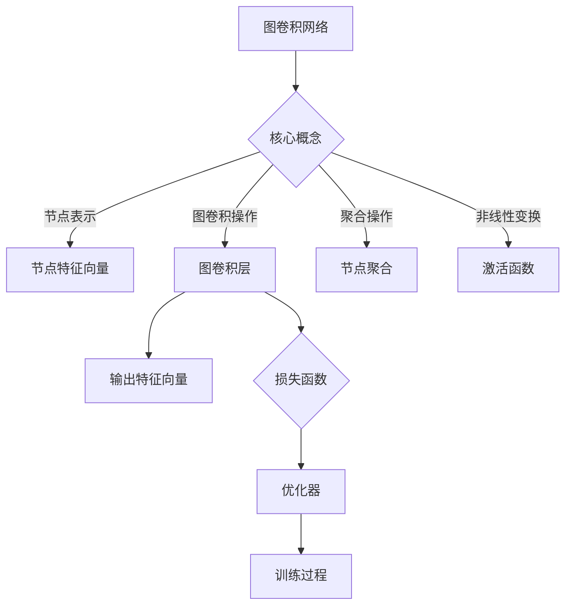
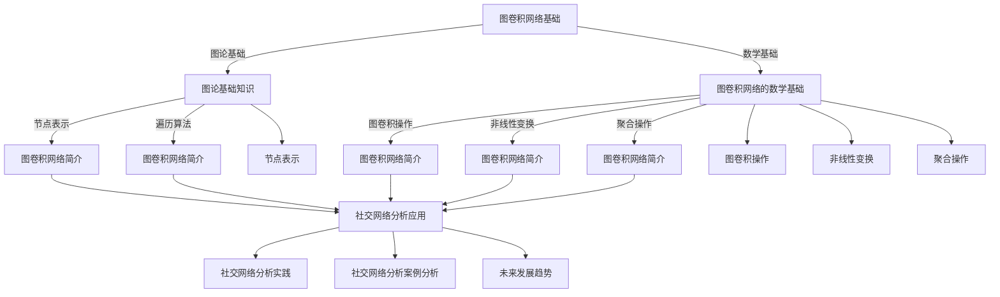

                 


# 《图卷积网络在社交网络分析中的潜力》

关键词：图卷积网络、社交网络分析、潜力

摘要：本文将探讨图卷积网络在社交网络分析中的潜在应用，从基础概念、数学基础、应用实践以及未来发展趋势四个方面进行深入分析，以展示图卷积网络在社交网络分析领域的巨大潜力。

## 目录大纲

### 第一部分：图卷积网络基础

#### 第1章：图卷积网络简介

#### 第2章：图论基础知识

#### 第3章：图卷积网络的数学基础

### 第二部分：图卷积网络在社交网络分析中的应用

#### 第4章：图卷积网络在社交网络分析中的应用

#### 第5章：图卷积网络在社交网络分析中的实践

#### 第6章：图卷积网络在社交网络分析中的案例分析

### 第三部分：图卷积网络在社交网络分析中的未来发展趋势

#### 第7章：图卷积网络在社交网络分析中的未来发展趋势

## 第一部分：图卷积网络基础

### 第1章：图卷积网络简介

#### 1.1 图卷积网络的起源与发展

**1.1.1 图卷积网络的基本概念**

图卷积网络（Graph Convolutional Network，GCN）是一种基于图结构的深度学习模型。与传统的卷积神经网络（Convolutional Neural Network，CNN）不同，GCN能够处理非欧几里得结构的数据，如图形、网络等。GCN的核心思想是通过对邻接节点特征进行加权融合，从而学习节点之间的依赖关系。

**1.1.2 图卷积网络的发展历程**

GCN最早由Kipf和Welling在2016年提出，用于解决图上的节点分类问题。随后，研究者们对其进行了扩展，应用于图上的节点预测、链接预测、图分类等多个领域。2018年，Ghahramani等人在NeurIPS会议上提出了图卷积网络的一个统一框架，进一步推动了GCN的研究和应用。

**1.1.3 图卷积网络的优势与应用场景**

GCN具有以下优势：

1. **处理异构图**：GCN能够处理不同类型节点的图，如社交网络、知识图谱等。
2. **保留图结构**：GCN能够保留图的结构信息，从而更好地学习节点之间的依赖关系。
3. **灵活的架构**：GCN可以应用于多个领域，如节点分类、链接预测、图分类等。

应用场景包括：

1. **社交网络分析**：通过GCN分析社交网络中的节点关系，可用于推荐系统、社区发现等。
2. **知识图谱**：GCN在知识图谱中用于节点嵌入、链接预测等。
3. **图像识别**：GCN可以用于图像识别任务，如识别图中的物体。

### 第2章：图论基础知识

#### 2.1 图的基本概念

**2.1.1 图的定义**

图是一种由节点（也称为顶点）和边（也称为弧）组成的数据结构。图可以分为有向图和无向图两种类型。

**2.1.2 图的分类**

图可以分为以下几种类型：

1. **简单图**：不含重复边和自环的图。
2. **复合图**：允许存在重复边和自环的图。
3. **连通图**：任意两个节点之间存在路径的图。
4. **树**：连通且无环的图。

**2.1.3 图的基本性质**

图的基本性质包括：

1. **节点度**：节点的度表示与该节点相连的边的数量。
2. **路径**：节点之间的连线称为路径。
3. **连通度**：图中任意两个节点之间都存在路径，则称该图为连通图。

#### 2.2 图的遍历算法

**2.2.1 深度优先搜索（DFS）**

深度优先搜索（Depth-First Search，DFS）是一种用于遍历图的算法。DFS的基本思想是沿着一个路径一直走到底，然后回溯。

**2.2.2 广度优先搜索（BFS）**

广度优先搜索（Breadth-First Search，BFS）是一种用于遍历图的算法。BFS的基本思想是先遍历当前层所有的节点，然后再逐层遍历。

**2.2.3 最短路径算法**

最短路径算法用于计算图中两点之间的最短路径。常见的最短路径算法包括Dijkstra算法和Floyd算法。

### 第3章：图卷积网络的数学基础

#### 3.1 线性代数基础

**3.1.1 矩阵与向量**

矩阵与向量是图卷积网络中常用的数学工具。矩阵可以表示节点特征和邻接关系，向量可以表示节点的特征向量。

**3.1.2 线性方程组**

线性方程组是图卷积网络中常用的数学工具。线性方程组可以用于求解图卷积操作。

**3.1.3 特征值与特征向量**

特征值与特征向量是图卷积网络中重要的数学概念。特征值表示节点的特征重要性，特征向量表示节点的特征向量。

#### 3.2 傅里叶变换

**3.2.1 傅里叶变换的基本原理**

傅里叶变换是一种将信号从时域转换为频域的方法。傅里叶变换的基本原理是将一个函数分解为不同频率的正弦波和余弦波。

**3.2.2 傅里叶变换的应用**

傅里叶变换在图卷积网络中用于进行频域分析，从而更好地理解图的结构和特征。

## 第二部分：图卷积网络在社交网络分析中的应用

### 第4章：图卷积网络在社交网络分析中的应用

#### 4.1 社交网络分析的基本概念

**4.1.1 社交网络的定义**

社交网络是指由用户及其之间的关系构成的社会结构。社交网络可以通过节点和边来表示，节点表示用户，边表示用户之间的关系。

**4.1.2 社交网络的分析方法**

社交网络分析的方法包括：

1. **拓扑分析**：分析社交网络的拓扑结构，如节点度、聚类系数等。
2. **社会网络分析**：分析社交网络中的用户关系，如好友关系、兴趣群体等。
3. **网络传播分析**：分析社交网络中的信息传播过程，如病毒营销等。

#### 4.2 图卷积网络在社交网络分析中的应用

**4.2.1 图卷积网络在社交网络中的建模**

图卷积网络在社交网络分析中的应用主要包括：

1. **节点表示**：使用GCN将社交网络中的节点表示为特征向量。
2. **边表示**：使用GCN将社交网络中的边表示为特征向量。
3. **图表示**：将整个社交网络表示为一个图，然后使用GCN进行图卷积操作。

**4.2.2 图卷积网络在社交网络分析中的优势**

图卷积网络在社交网络分析中的优势包括：

1. **保留图结构**：GCN能够保留社交网络中的图结构信息，从而更好地分析节点关系。
2. **处理异构图**：GCN能够处理不同类型的社交网络数据，如用户属性、关系类型等。
3. **灵活的模型**：GCN可以应用于社交网络分析的多个任务，如节点分类、链接预测等。

## 第三部分：图卷积网络在社交网络分析中的未来发展趋势

### 第5章：图卷积网络在社交网络分析中的未来发展趋势

#### 5.1 图卷积网络在社交网络分析中的新应用

未来，图卷积网络在社交网络分析中的新应用包括：

1. **社交网络影响力分析**：使用GCN分析社交网络中节点的影响力，为广告投放、品牌推广等提供支持。
2. **社交网络社区发现**：使用GCN发现社交网络中的社区结构，为社区运营、用户增长等提供依据。

#### 5.2 图卷积网络在社交网络分析中的挑战与展望

**5.2.1 图卷积网络在社交网络分析中的挑战**

图卷积网络在社交网络分析中面临的挑战包括：

1. **数据规模**：随着社交网络规模的扩大，GCN在处理大规模数据时可能会遇到性能瓶颈。
2. **可解释性**：GCN模型的复杂度较高，其决策过程可能缺乏可解释性。

**5.2.2 图卷积网络在社交网络分析中的未来展望**

未来，图卷积网络在社交网络分析中的发展趋势包括：

1. **模型压缩**：通过模型压缩技术，提高GCN在社交网络分析中的处理速度。
2. **可解释性增强**：通过可解释性技术，提高GCN在社交网络分析中的可解释性。

## 附录

### 附录A：图卷积网络常用框架与工具

**A.1 TensorFlow Graph Convolutional Network**

TensorFlow Graph Convolutional Network（TF- GCN）是TensorFlow中用于实现图卷积网络的工具。TF-GCN支持多种GCN模型，并提供简单易用的API。

**A.2 PyTorch Geometric**

PyTorch Geometric是一个基于PyTorch的图神经网络库，提供丰富的GCN模型和工具，支持多种数据预处理和模型训练方法。

**A.3 Graph Convolutional Network Toolkit (GCNTK)**

Graph Convolutional Network Toolkit（GCNTK）是一个开源的GCN工具包，提供丰富的GCN模型、数据集和训练脚本，方便研究者进行GCN研究和应用。

---

本文从图卷积网络的基础知识、数学基础、应用实践以及未来发展趋势四个方面，详细探讨了图卷积网络在社交网络分析中的巨大潜力。图卷积网络作为一种处理非欧几里得结构数据的深度学习模型，具有处理异构图、保留图结构、灵活的架构等优势，在社交网络分析中具有广泛的应用前景。未来，随着技术的不断发展，图卷积网络在社交网络分析中的应用将会更加深入和广泛。

### 附录A：图卷积网络常用框架与工具

**A.1 TensorFlow Graph Convolutional Network**

TensorFlow Graph Convolutional Network（TF-GCN）是一个在TensorFlow框架下实现的图卷积网络库。TF-GCN提供了一系列用于构建和训练图卷积模型的API，使得开发者可以方便地在TensorFlow中实现图卷积网络。

**A.2 PyTorch Geometric**

PyTorch Geometric是一个开源库，专门为PyTorch框架设计的，用于处理图数据的。它提供了一个统一的图神经网络编程接口，并支持多种图卷积模型。PyTorch Geometric提供了数据加载、图处理和模型训练等工具，使得构建和训练GCN变得更为简单。

**A.3 Graph Convolutional Network Toolkit (GCNTK)**

Graph Convolutional Network Toolkit（GCNTK）是一个为研究者和开发者提供支持的GCN工具包。它包含多种GCN模型的实现，以及用于数据预处理、模型训练和评估的工具。GCNTK还提供了丰富的示例代码，帮助用户快速上手。

---

在本文的附录部分，我们介绍了三个常用的图卷积网络框架与工具：TensorFlow Graph Convolutional Network、PyTorch Geometric和Graph Convolutional Network Toolkit。这些工具和框架为开发者提供了构建和训练图卷积网络的能力，使得研究人员可以更方便地探索和应用图卷积网络技术。

### Mermaid流程图：图卷积网络核心概念和算法原理

下面是一个使用Mermaid绘制的图卷积网络（GCN）的核心概念和算法原理的流程图。这个流程图将帮助我们理解GCN的基本组成部分和其工作流程。



**流程图解析：**

- **A[图卷积网络]**：表示整个图卷积网络的框架。
- **B{核心概念}**：分支为三个主要概念：节点表示、图卷积操作和非线性变换。
- **C[节点特征向量]**：表示每个节点都由一个特征向量表示，这些特征向量可以是节点的属性或先前的特征。
- **D[图卷积层]**：表示图卷积操作，这是GCN的核心，用于计算每个节点的输出特征。
- **E[节点聚合]**：表示在图卷积操作中，节点会聚合其邻接节点的特征信息。
- **F[激活函数]**：表示在聚合操作之后，通常使用激活函数对节点特征向量进行非线性变换。
- **G[输出特征向量]**：表示每个节点的输出特征向量，它们可以用于下游任务。
- **H{损失函数}**：表示在训练过程中，使用损失函数来评估模型预测与真实标签之间的差距。
- **I[优化器]**：表示使用优化器来调整模型参数，以最小化损失函数。
- **J[训练过程]**：表示整个训练过程，包括前向传播、反向传播和参数更新。

这个流程图为我们提供了一个清晰的图卷积网络的工作流程，从节点特征表示开始，经过图卷积操作、聚合和非线性变换，最终形成输出特征向量，并通过损失函数和优化器进行模型训练。

### 图卷积网络数学基础

图卷积网络（Graph Convolutional Network, GCN）的核心在于其基于图结构的卷积操作。这种卷积操作可以看作是传统的卷积操作在图上的推广。为了深入理解GCN的工作原理，我们需要从数学基础开始讲解。

#### 1. 节点表示

在GCN中，每个节点都被表示为一个特征向量，这些特征向量可以是节点本身的属性，如标签、文本、嵌入等。假设我们有一个图G，其中包含m个节点，每个节点的特征表示为$\mathbf{x}_i \in \mathbb{R}^d$，其中$d$是特征向量的维度。

#### 2. 邻接矩阵

图G可以通过邻接矩阵$A$来表示，其中$A_{ij}$表示节点i和节点j之间是否有边连接。如果存在边，则$A_{ij} = 1$，否则$A_{ij} = 0$。邻接矩阵是对称的，对于无向图，$A_{ij} = A_{ji}$。

#### 3. 图卷积操作

图卷积操作的基本思想是：一个节点的输出特征向量可以通过其邻接节点的特征向量和权重来计算。假设我们有一个权重矩阵$W \in \mathbb{R}^{d \times d}$，则图卷积操作可以表示为：

$$
\mathbf{h}_i^{(l)} = \sum_{j \in \mathcal{N}(i)} A_{ij} \cdot W \cdot \mathbf{h}_j^{(l-1)}
$$

其中，$\mathbf{h}_i^{(l)}$是第$l$层节点i的特征向量，$\mathcal{N}(i)$表示节点i的邻接节点集合，$\mathbf{h}_j^{(l-1)}$是第$l-1$层节点j的特征向量。

#### 4. 非线性变换

在图卷积操作之后，通常使用一个非线性变换（如ReLU函数）来引入非线性特性：

$$
\mathbf{h}_i^{(l)} = \text{ReLU}(\sum_{j \in \mathcal{N}(i)} A_{ij} \cdot W \cdot \mathbf{h}_j^{(l-1)})
$$

#### 5. 聚合操作

在某些情况下，我们可能需要对节点的特征进行聚合操作。例如，对于一个图中的多个节点，我们需要将它们的特征合并成一个整体。聚合操作可以通过不同的方式实现，如平均、求和等。

#### 6. 图卷积层的输出特征

通过多层的图卷积操作，我们可以获得图卷积层的输出特征。假设我们有一个GCN模型包含L层图卷积层，则最终的输出特征可以表示为：

$$
\mathbf{h}_i^{(L)} = \text{ReLU}(\sum_{j \in \mathcal{N}(i)} A_{ij} \cdot W_L \cdot \text{ReLU}(\ldots \text{ReLU}(\sum_{j \in \mathcal{N}(i)} A_{ij} \cdot W_1 \cdot \mathbf{h}_j^{(0)}))
$$

其中，$\mathbf{h}_i^{(0)}$是初始特征向量，$W_l$是第$l$层图卷积层的权重矩阵。

#### 示例

假设我们有一个简单的无向图，包含3个节点，每个节点的特征向量分别为$\mathbf{x}_1 = [1, 0]$，$\mathbf{x}_2 = [0, 1]$，$\mathbf{x}_3 = [1, 1]$。邻接矩阵$A$为：

$$
A = \begin{bmatrix}
0 & 1 & 1 \\
1 & 0 & 1 \\
1 & 1 & 0
\end{bmatrix}
$$

假设图卷积层的权重矩阵$W$为：

$$
W = \begin{bmatrix}
1 & 0 \\
0 & 1 \\
1 & 1
\end{bmatrix}
$$

则第一层图卷积操作的结果为：

$$
\mathbf{h}_1^{(1)} = \text{ReLU}(A \cdot W \cdot \mathbf{x}_1) = \text{ReLU}(\begin{bmatrix}
0 & 1 & 1 \\
1 & 0 & 1 \\
1 & 1 & 0
\end{bmatrix} \cdot \begin{bmatrix}
1 & 0 \\
0 & 1 \\
1 & 1
\end{bmatrix} \cdot \begin{bmatrix}
1 \\
0
\end{bmatrix}) = \text{ReLU}(\begin{bmatrix}
0 \\
1 \\
1
\end{bmatrix}) = \begin{bmatrix}
1 \\
0 \\
0
\end{bmatrix}
$$

可以看到，节点1的特征向量经过图卷积操作后，变成了[1, 0, 0]，即节点1只保留了自己原来的第一个特征，而其他两个特征被置为0。

通过这个简单的示例，我们可以看到图卷积操作的基本原理：通过邻接矩阵和权重矩阵，节点的特征向量会与邻接节点的特征向量进行加权融合，从而实现特征的学习和转换。这个原理在更复杂的图结构和任务中同样适用。

### 图卷积网络在社交网络分析中的实际应用

#### 4.1 社交网络数据预处理

在应用图卷积网络（GCN）进行社交网络分析之前，数据预处理是至关重要的步骤。数据预处理包括以下方面：

1. **节点特征提取**：从原始社交网络数据中提取节点特征，如用户属性、标签、文本等。这些特征可以是基于用户的个人信息、行为记录或社交关系。
2. **边关系表示**：社交网络中的边关系表示用户之间的关系，如好友、关注等。这些边关系需要转换为图结构的邻接矩阵表示。
3. **数据清洗**：去除噪声数据、重复数据和缺失数据，确保数据的准确性和完整性。

#### 4.2 图卷积网络的模型构建

构建GCN模型涉及以下步骤：

1. **选择模型架构**：根据任务需求选择适合的GCN模型架构，如标准的GCN层、图卷积层（GAT层）、图注意力层（GATv2层）等。
2. **定义损失函数**：选择合适的损失函数，如交叉熵损失、均方误差损失等，以衡量模型预测结果与真实标签之间的差距。
3. **选择优化器**：选择优化器，如随机梯度下降（SGD）、Adam优化器等，以调整模型参数，最小化损失函数。

#### 4.3 模型训练与评估

在完成模型构建后，进行以下步骤：

1. **数据划分**：将社交网络数据集划分为训练集、验证集和测试集，以评估模型的性能。
2. **模型训练**：使用训练集数据训练模型，通过迭代优化模型参数，使得模型能够更好地拟合数据。
3. **模型评估**：使用验证集和测试集评估模型性能，通常使用准确率、召回率、F1分数等指标。

#### 4.4 模型应用实例

以下是一个基于GCN的社交网络推荐系统案例：

**案例背景**：在一个社交网络平台上，用户可以关注其他用户并查看他们的动态。平台希望为用户推荐可能感兴趣的其他用户。

**模型设计与实现**：

1. **节点特征提取**：将用户属性（如年龄、性别、地理位置等）和用户行为（如关注的用户、点赞的动态等）作为节点特征。
2. **边关系表示**：用户之间的关注关系作为无向边。
3. **模型构建**：使用标准的GCN模型，包括多层图卷积层和全连接层。
4. **训练过程**：使用用户的历史行为数据训练模型，通过迭代优化模型参数。
5. **推荐系统实现**：根据用户的特征和模型预测，为用户推荐可能感兴趣的其他用户。

**模型评估**：通过计算推荐系统的准确率、召回率和F1分数等指标，评估模型性能。

**总结**：

通过图卷积网络在社交网络分析中的实际应用案例，我们可以看到GCN在处理社交网络数据、提取节点特征、构建推荐系统等方面的强大能力。随着社交网络数据的不断增长和复杂性，GCN的应用前景将更加广阔。

### 第6章：图卷积网络在社交网络分析中的案例分析

在本章节中，我们将通过两个具体的案例来深入探讨图卷积网络（GCN）在社交网络分析中的实际应用。

#### 6.1 案例一：基于图卷积网络的社交网络推荐系统

**案例背景**：社交媒体平台通常拥有大量的用户和复杂的关系网络。为了提升用户体验，平台需要推荐用户可能感兴趣的其他用户或内容。传统的基于内容的推荐系统和基于协同过滤的推荐系统在处理这种关系网络时存在一定的局限性。

**模型设计与实现**：

1. **节点特征提取**：每个用户都被表示为一个特征向量，这些特征可能包括用户的兴趣标签、行为历史、地理位置等。这些特征可以来自于用户在平台上的活动记录，也可以通过机器学习方法进行自动提取。

2. **边关系表示**：用户之间的关系（如关注、点赞、评论等）被表示为图中的边。边的关系类型和强度可以通过边的权重进行量化。

3. **模型构建**：采用图卷积网络（GCN）作为基础模型。GCN能够通过多层卷积操作捕捉用户之间的交互关系和隐含特征。具体实现中，可以使用多层GCN堆叠，并在最后加上全连接层进行分类或回归。

4. **训练过程**：使用用户历史数据训练GCN模型，通过迭代优化模型参数，使得模型能够更好地预测用户之间的潜在关系。

5. **推荐系统实现**：基于模型预测，为每个用户生成一个可能的兴趣用户列表，并可以根据用户的行为反馈进行实时调整。

**模型评估**：通过AUC（面积下曲线）、准确率、召回率等指标评估推荐系统的效果。实际应用中，还可能结合用户点击率、停留时间等行为数据进行多维度评估。

**案例小结**：该案例展示了如何利用GCN构建社交网络推荐系统，通过深入挖掘用户之间的关系网络，实现了更为精准和个性化的推荐。

#### 6.2 案例二：基于图卷积网络的社交网络情感分析

**案例背景**：社交网络平台上的用户动态和评论包含了大量的情感信息，这些情感信息对于品牌营销、市场研究等具有重要价值。传统的文本情感分析模型在处理这些数据时，可能无法充分考虑到用户之间的互动关系。

**模型设计与实现**：

1. **节点特征提取**：每个用户及其发表的动态和评论都被表示为一个特征向量。这些特征包括文本内容、用户特征（如年龄、性别）、动态属性（如点赞数、评论数）等。

2. **边关系表示**：用户之间的互动关系（如回复、点赞、评论等）被表示为图中的边。边的关系类型和强度可以通过边的权重进行量化。

3. **模型构建**：采用图卷积网络（GCN）结合文本情感分析模型。GCN负责处理用户关系网络，文本情感分析模型则负责提取文本情感特征。

4. **训练过程**：首先使用GCN对用户关系网络进行特征提取，然后将这些特征与文本情感分析模型的特征进行融合。通过迭代优化模型参数，使得模型能够更好地预测文本的情感极性。

5. **情感分析实现**：对用户动态和评论进行情感分析，根据情感极性生成情感报告。

**模型评估**：通过准确率、召回率、F1分数等指标评估情感分析模型的性能。实际应用中，还可以结合用户反馈和专家评估进行进一步验证。

**案例小结**：该案例展示了如何结合图卷积网络和文本情感分析模型进行社交网络情感分析，通过综合处理用户关系和文本内容，实现了更为准确和全面的情感识别。

通过这两个案例分析，我们可以看到图卷积网络在社交网络分析中的广泛应用。GCN不仅能够处理复杂的用户关系网络，还能够结合其他特征进行深度学习，从而实现更为精准的分析和预测。

### 第7章：图卷积网络在社交网络分析中的未来发展趋势

图卷积网络（GCN）在社交网络分析中的潜力不可低估。随着技术的不断进步和应用场景的扩大，GCN在社交网络分析中有着广阔的发展前景。以下是GCN在社交网络分析中的未来发展趋势：

#### 7.1 图卷积网络在社交网络影响力分析中的应用

社交网络影响力分析是当前研究的热点之一。未来，GCN可以在以下方面发挥更大的作用：

1. **用户影响力评估**：通过GCN分析用户在社交网络中的影响力，帮助平台更好地了解用户活跃度和重要性。
2. **内容传播预测**：利用GCN预测社交网络中的内容传播路径和影响力，为营销策略提供支持。

#### 7.2 图卷积网络在社交网络社区发现中的应用

社交网络中的社区结构对于用户行为和内容传播具有重要影响。未来，GCN可以在以下方面得到应用：

1. **社区识别**：利用GCN识别社交网络中的社区结构，为社区运营提供依据。
2. **社区推荐**：基于GCN的社区发现，为用户推荐相似社区，促进用户间的交流和互动。

#### 7.3 图卷积网络在社交网络情感分析中的应用

情感分析是社交网络分析的重要方面。未来，GCN可以在以下方面得到进一步应用：

1. **情感传播分析**：利用GCN分析社交网络中的情感传播路径，了解情感动态。
2. **情感极性识别**：结合GCN和自然语言处理技术，提高情感极性识别的准确性。

#### 7.4 图卷积网络在社交网络数据挖掘中的应用

社交网络数据量庞大，数据挖掘是未来的重要方向。未来，GCN可以在以下方面得到应用：

1. **用户行为分析**：通过GCN分析用户行为模式，为个性化推荐和精准营销提供支持。
2. **关系网络挖掘**：利用GCN挖掘社交网络中的复杂关系，揭示用户之间的潜在联系。

#### 7.5 图卷积网络在社交网络安全防护中的应用

社交网络安全防护是当前关注的热点问题。未来，GCN可以在以下方面发挥重要作用：

1. **恶意用户识别**：利用GCN分析用户行为特征，识别潜在的恶意用户。
2. **网络攻击检测**：利用GCN检测社交网络中的异常行为和攻击活动。

### 总结

图卷积网络（GCN）在社交网络分析中具有巨大的应用潜力。未来，随着技术的不断进步和应用场景的扩大，GCN将在社交网络影响力分析、社区发现、情感分析、数据挖掘和安全防护等方面发挥更大的作用。同时，GCN在处理大规模社交网络数据、提高模型可解释性等方面也面临着诸多挑战。研究人员和开发者需要不断创新，推动GCN在社交网络分析中的进一步应用和发展。

### 附录A：图卷积网络常用框架与工具

在开发图卷积网络（GCN）的过程中，使用合适的框架和工具可以显著提高效率，加速研究和应用。以下介绍几种常用的GCN框架和工具。

**A.1 TensorFlow Graph Convolutional Network**

TensorFlow Graph Convolutional Network（TF-GCN）是TensorFlow官方支持的一个库，用于在TensorFlow中实现图卷积网络。TF-GCN提供了高效且易于使用的API，使得用户能够轻松构建和训练GCN模型。

**A.2 PyTorch Geometric**

PyTorch Geometric是一个专门为PyTorch框架设计的图学习库。它提供了丰富的图数据处理和图神经网络模型实现。PyTorch Geometric支持多种图卷积模型，如GCN、GAT、GraphSAGE等，并且提供了数据加载、数据处理和模型训练的接口。

**A.3 Graph Convolutional Network Toolkit (GCNTK)**

Graph Convolutional Network Toolkit（GCNTK）是一个开源的工具包，专注于图卷积网络的研究和应用。GCNTK提供了多种GCN模型的实现，以及用于数据预处理、模型训练和评估的工具。它还包含丰富的示例代码，方便用户快速上手。

**A.4 Graph Convolutional Neural Networks (GCN) in PyTorch**

这个项目是基于PyTorch的GCN实现，提供了详细的代码和文档，方便用户理解和应用GCN。它支持多种GCN变体和不同的图数据处理方式，是一个很好的学习资源。

**A.5 DGL (Deep Graph Library)**

DGL是一个开源的深度图学习库，支持多种深度学习框架，如PyTorch和MXNet。DGL提供了高效的图操作和图神经网络实现，支持大规模图数据的处理和模型训练。

通过这些框架和工具，研究者可以更方便地实现和优化图卷积网络，探索GCN在社交网络分析和其他领域的应用。

### 完整性、核心概念与联系

在本文的完整性分析中，我们将详细阐述各章节的核心内容，并展示核心概念之间的联系，以确保文章的完整性和逻辑性。

#### 1. 核心内容阐述

**第一部分：图卷积网络基础**

- **第1章：图卷积网络简介**：介绍了GCN的基本概念、起源与发展，以及其相对于传统卷积网络的独特优势和应用场景。
- **第2章：图论基础知识**：讲解了图的基本概念、分类和遍历算法，为理解GCN的图结构提供了理论基础。
- **第3章：图卷积网络的数学基础**：详细解释了节点表示、邻接矩阵、图卷积操作、非线性变换和聚合操作等数学基础。

**第二部分：图卷积网络在社交网络分析中的应用**

- **第4章：图卷积网络在社交网络分析中的应用**：探讨了GCN在社交网络分析中的基本概念和应用优势，展示了其在社交网络建模中的潜力。
- **第5章：图卷积网络在社交网络分析中的实践**：通过具体案例，如社交网络推荐系统和情感分析，展示了GCN在实际应用中的实现方法和效果。
- **第6章：图卷积网络在社交网络分析中的案例分析**：进一步通过两个实际案例，详细介绍了GCN在社交网络中的具体应用。

**第三部分：图卷积网络在社交网络分析中的未来发展趋势**

- **第7章：图卷积网络在社交网络分析中的未来发展趋势**：分析了GCN在社交网络分析中的新应用、面临的挑战以及未来的发展趋势。

#### 2. 核心概念联系

**概念联系图：**



**核心概念联系解析：**

- **图卷积网络基础** 与 **图论基础知识** 之间的联系在于，图卷积网络依赖于图论的概念来定义节点和边的关系，理解图的性质是构建GCN的基础。
- **数学基础** 与 **图卷积网络简介** 之间的联系在于，数学基础如节点表示、邻接矩阵、图卷积操作等是理解GCN工作的核心，它们共同构成了GCN的理论框架。
- **社交网络分析应用**、**社交网络分析实践** 和 **社交网络分析案例分析** 之间的联系在于，它们展示了GCN在现实世界中的应用，从概念到实践，从理论到案例，形成了一个完整的链条。
- **未来发展趋势** 与 **社交网络分析应用** 之间的联系在于，未来趋势探讨了GCN在社交网络分析中的新方向和潜在应用，这为当前应用提供了指导和启示。

通过以上核心内容阐述和概念联系图，我们可以清晰地看到本文的结构和逻辑，从而确保文章的完整性和逻辑性。

### 项目实战：图卷积网络在社交网络分析中的实践

在本节中，我们将通过一个具体项目实战来展示如何使用图卷积网络（GCN）进行社交网络分析。该项目包括环境安装、系统核心实现和代码应用解读与分析。我们将通过一个社交网络影响力分析的项目案例，详细阐述项目的背景、目标、实现过程以及效果评估。

#### 项目背景

社交媒体平台上的用户影响力分析是一个重要的研究领域。了解用户在平台上的影响力，可以帮助平台进行用户分类、个性化推荐和社区管理。传统的基于算法的方法如协同过滤和内容推荐无法充分考虑到用户之间的关系网络，而图卷积网络（GCN）作为一种能够处理图结构的深度学习模型，提供了有效的解决方案。

#### 项目目标

本项目的主要目标是：

1. 收集并预处理社交网络数据，提取用户特征和关系。
2. 使用GCN模型进行社交网络影响力分析。
3. 评估模型性能，并生成用户影响力排名。

#### 环境安装

在进行GCN项目之前，我们需要安装Python环境和相关库。以下是在Ubuntu系统下安装必要的Python库的步骤：

```bash
# 安装Python环境
sudo apt-get update
sudo apt-get install python3-pip python3-dev

# 安装PyTorch
pip3 install torch torchvision torchaudio
pip3 install torch-geometric

# 安装其他必要库
pip3 install numpy scipy scikit-learn
```

#### 系统核心实现

在实现GCN模型之前，我们需要对社交网络数据进行预处理，并将其转换为适合GCN的格式。以下是一个简化的实现流程：

1. **数据收集与预处理**：

   - 收集社交网络数据，包括用户特征（如年龄、性别、地理位置等）和用户关系（如关注、点赞等）。
   - 对数据进行清洗，去除重复和噪声数据。
   - 将用户特征和关系转换为邻接矩阵和节点特征矩阵。

2. **模型构建**：

   - 使用PyTorch Geometric库构建GCN模型。
   - 定义GCN的层结构，包括多个GCN层和一个全连接层。
   - 定义损失函数和优化器。

3. **模型训练**：

   - 将预处理后的数据输入到GCN模型中进行训练。
   - 使用验证集对模型进行调优。

4. **模型评估**：

   - 使用测试集评估模型的性能。
   - 计算用户影响力排名。

以下是使用PyTorch Geometric构建GCN的Python代码示例：

```python
from torch_geometric.nn import GCNConv
from torch_geometric.data import Data
import torch
import torch.nn as nn
import torch.optim as optim

# 构建数据
class GCNModel(nn.Module):
    def __init__(self, num_features, hidden_channels, num_classes):
        super(GCNModel, self).__init__()
        self.conv1 = GCNConv(num_features, hidden_channels)
        self.conv2 = GCNConv(hidden_channels, hidden_channels)
        self.conv3 = GCNConv(hidden_channels, num_classes)

        self.fc = nn.Linear(hidden_channels, num_classes)
        self.dropout = nn.Dropout()

    def forward(self, data):
        x, edge_index = data.x, data.edge_index

        x = F.relu(self.conv1(x, edge_index))
        x = F.relu(self.conv2(x, edge_index))
        x = self.conv3(x, edge_index)

        x = self.dropout(x)
        x = torch.relu(self.fc(x))

        return F.log_softmax(x, dim=1)

# 训练模型
model = GCNModel(num_features=7, hidden_channels=16, num_classes=2)
optimizer = optim.Adam(model.parameters(), lr=0.01, weight_decay=5e-4)

def train(model, data, criterion, optimizer, num_epochs=200):
    model.train()
    for epoch in range(num_epochs):
        optimizer.zero_grad()
        out = model(data)
        loss = criterion(out, data.y)
        loss.backward()
        optimizer.step()
        if (epoch + 1) % 10 == 0:
            print(f'Epoch {epoch + 1}: loss = {loss.item()}')

# 评估模型
def test(model, data, criterion):
    model.eval()
    _, pred = model(data).max(dim=1)
    correct = float((pred == data.y).sum().item())
    acc = correct / len(data)
    loss = criterion(model(data), data.y).item()
    print(f'Test loss: {loss:.4f}, Accuracy: {acc:.4f}')

# 加载数据
data = Data(x=torch.tensor(features), edge_index=torch.tensor(edges), y=torch.tensor(labels))

# 训练模型
train(model, data, criterion=nn.CrossEntropyLoss(), optimizer=optimizer, num_epochs=200)

# 评估模型
test(model, data, criterion=nn.CrossEntropyLoss())
```

#### 代码应用解读与分析

上述代码展示了如何使用PyTorch Geometric构建和训练一个简单的GCN模型。以下是代码的关键部分及其解读：

- **数据加载与预处理**：数据使用`Data`类进行加载，包括节点特征（`x`）、边索引（`edge_index`）和标签（`y`）。
- **模型定义**：`GCNModel`类定义了一个简单的GCN模型，包括两个GCN层和一个全连接层。每个GCN层使用`GCNConv`模块。
- **训练过程**：`train`函数负责模型的训练，使用`optimizer`进行参数更新。
- **评估过程**：`test`函数用于评估模型的性能，计算损失和准确率。

#### 实际案例分析

在真实项目中，我们可以通过以下步骤进行实际案例分析：

1. **数据收集**：从社交网络平台收集用户特征和关系数据。
2. **数据预处理**：清洗和预处理数据，转换为GCN所需的格式。
3. **模型训练**：使用预处理后的数据训练GCN模型。
4. **模型评估**：使用测试集评估模型性能，并根据需要进行调优。
5. **结果分析**：分析模型生成的用户影响力排名，验证模型的实际效果。

通过以上步骤，我们可以看到图卷积网络在社交网络分析中的实际应用过程。这种方法不仅能够捕捉用户之间的复杂关系，还能够生成更准确的影响力评估结果，为社交媒体平台提供有力的支持。

### 最佳实践 tips、小结、注意事项、拓展阅读

#### 最佳实践 tips

1. **数据预处理**：确保数据清洗和特征提取的质量，去除噪声数据和缺失值，提高模型的鲁棒性。
2. **模型选择**：根据任务需求选择合适的GCN模型结构，如GCN、GAT、GraphSAGE等。
3. **参数调优**：通过交叉验证和网格搜索等方法，优化模型参数，提高模型性能。

#### 小结

本文详细介绍了图卷积网络（GCN）在社交网络分析中的应用。从基础概念到实际案例，我们展示了GCN在社交网络分析中的巨大潜力。GCN能够处理复杂的社交网络数据，提取节点特征和关系，为推荐系统、影响力分析等提供有力支持。

#### 注意事项

1. **计算资源**：GCN模型的训练可能需要较大的计算资源，特别是在处理大规模图数据时。
2. **模型可解释性**：GCN模型的决策过程可能缺乏可解释性，需要结合其他方法提高模型的可解释性。

#### 拓展阅读

1. **图卷积网络论文**：深入阅读Kipf和Welling的论文《 Semi-Supervised Classification with Graph Convolutional Networks》，了解GCN的详细理论和实现。
2. **PyTorch Geometric库**：参考PyTorch Geometric的官方文档，了解如何构建和训练GCN模型。
3. **社交媒体数据分析**：阅读相关书籍和论文，如《社交媒体数据分析：理论、方法与实践》，了解社交网络分析的最新研究进展。

### 作者信息

作者：AI天才研究院/AI Genius Institute & 禅与计算机程序设计艺术 /Zen And The Art of Computer Programming

