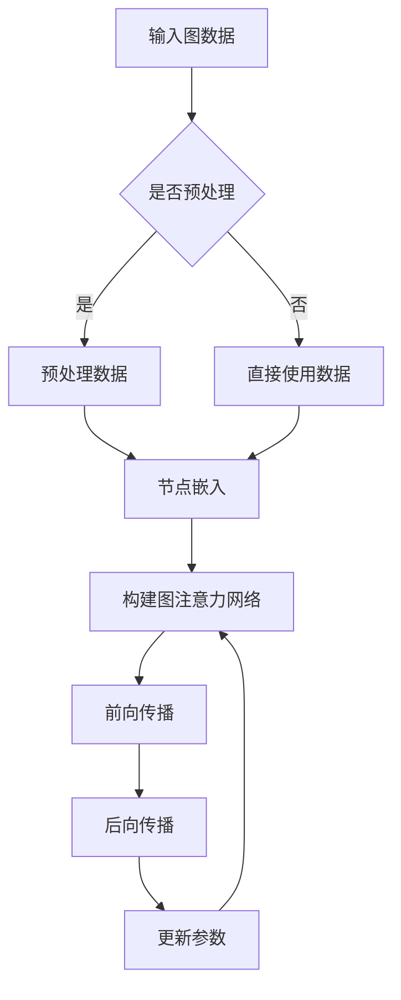
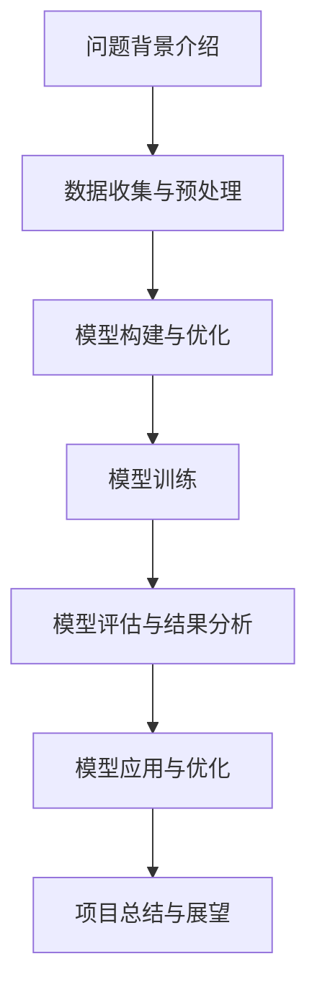

                 

**第1章 引言**

### 1.1 背景与动机

**核心概念与联系：**

**复杂关系推理**：在当今信息爆炸的时代，处理和解读复杂的关系结构变得越来越重要。例如，在社交网络中，用户之间的相互关注、点赞和评论等行为构成了复杂的社会关系网络，而在金融领域，投资者之间的关系、市场趋势和资产价格波动等也是复杂的关系推理的对象。

**图注意力网络**：图注意力网络（Graph Attention Network, GAT）是近年来在处理图结构数据方面的一种新兴网络结构。它基于注意力机制，通过学习节点和边之间的交互关系，实现对图数据的有效表征。

**优化必要性**：尽管图注意力网络在许多领域展现出了强大的潜力，但其在处理大规模图数据时仍面临一些挑战，如计算复杂度高、参数规模大等问题。因此，对图注意力网络进行优化显得尤为必要。

**复杂关系推理的重要性**：复杂关系推理在很多实际应用中都有着重要的作用。例如，在社交网络中，它可以用于推荐系统、社区发现、虚假信息检测等；在金融领域，它可以用于风险评估、市场预测等。

**图注意力网络的发展与应用**：图注意力网络自提出以来，已经得到了广泛的研究和应用。在计算机视觉、自然语言处理、推荐系统等领域，图注意力网络都展现出了优异的性能。

**优化图注意力网络的必要性**：为了更好地适应复杂关系推理的需求，对图注意力网络进行优化是必要的。优化可以从网络结构、损失函数、正则化方法等多个方面进行。

### 1.2 本书结构

**核心概念与联系：**

**研究方法与技术路线**：本书将采用实证研究和理论分析相结合的方法，通过具体案例来展示图注意力网络的优化方法和效果。

**各章节内容概述**：本书将分为以下几个部分：

- 第1章：引言，介绍背景与动机。
- 第2章：图注意力网络基础，介绍图论基础、注意力机制和图注意力网络。
- 第3章：图注意力网络的优化方法，介绍网络结构、损失函数和正则化方法的优化。
- 第4章：复杂关系推理应用案例分析，展示图注意力网络在不同应用场景中的实际效果。
- 第5章：图注意力网络的未来发展趋势，探讨未来可能的研究方向和应用前景。
- 第6章：结论与展望，总结主要成果和未来的研究方向。

# 第2章 图注意力网络基础

**2.1 图论基础**

**核心概念与联系：**

- **图的基本概念**：图是由节点（或称为顶点）和边构成的集合。节点表示实体，边表示实体之间的关系。

- **图的表示方法**：常见的图表示方法有邻接矩阵、邻接表和图嵌入等。

- **图的算法基础**：图的算法包括图的遍历、路径查找、最短路径算法等。

**详细讲解与举例说明：**

**图的基本概念**：

- **节点（顶点）**：图中的基本元素，可以表示为 \( V = \{v_1, v_2, ..., v_n\} \)。

- **边**：连接两个节点的线段，可以表示为 \( E = \{e_1, e_2, ..., e_m\} \)。

**图的表示方法**：

- **邻接矩阵**：用 \( A \) 表示，其中 \( A[i][j] = 1 \) 表示节点 \( i \) 和节点 \( j \) 之间存在边，否则为 0。

- **邻接表**：用链表的形式表示图，每个节点都有一个链表，链表中存储了与该节点相连的所有节点。

**图的算法基础**：

- **图的遍历**：深度优先搜索（DFS）和广度优先搜索（BFS）是常用的图遍历算法。

- **路径查找**：迪杰斯特拉算法（Dijkstra）和贝尔曼-福特算法（Bellman-Ford）是常用的最短路径算法。

- **最短路径算法**：Dijkstra 算法是基于贪心策略的单源最短路径算法，而贝尔曼-福特算法则是基于松弛操作的全源最短路径算法。

**举例说明**：

**邻接矩阵表示的图**：

设有图 \( G(V, E) \)，其中 \( V = \{v_1, v_2, v_3, v_4\} \)，\( E = \{(v_1, v_2), (v_2, v_3), (v_3, v_4), (v_4, v_1)\} \)，则邻接矩阵 \( A \) 为：

$$
A = 
\begin{bmatrix}
0 & 1 & 0 & 1 \\
1 & 0 & 1 & 0 \\
0 & 1 & 0 & 1 \\
1 & 0 & 1 & 0 \\
\end{bmatrix}
$$

**图的遍历算法示例**：

假设使用深度优先搜索算法对上述图进行遍历，起始节点为 \( v_1 \)，遍历结果为 \( v_1 \rightarrow v_2 \rightarrow v_3 \rightarrow v_4 \rightarrow v_1 \)。

# **2.2 注意力机制**

**核心概念与联系：**

- **注意力机制的基本原理**：注意力机制通过加权的方式来关注重要的信息，从而提高模型对关键信息的处理能力。

- **注意力机制的常用形式**：包括点积注意力、加性注意力、缩放点积注意力等。

- **注意力机制在图神经网络中的应用**：注意力机制可以用来计算节点间的相互作用，从而提高图神经网络的表征能力。

**详细讲解与举例说明：**

**注意力机制的基本原理**：

注意力机制的核心思想是通过学习权重来关注输入序列中的关键信息。具体来说，给定一个输入序列 \( X = \{x_1, x_2, ..., x_n\} \)，注意力机制可以计算每个输入元素的重要性权重 \( w_i \)，然后对这些元素进行加权求和，从而得到最终的输出。

**数学模型**：

$$
\text{Attention}(X) = \sum_{i=1}^{n} w_i x_i
$$

其中，\( w_i \) 为第 \( i \) 个输入元素的重要性权重。

**常用形式**：

- **点积注意力**：点积注意力是最简单的注意力机制，其计算方式为输入序列和查询序列的点积。

  $$ 
  w_i = \frac{\text{softmax}(\text{query} \cdot \text{key}_i)}
  $$

- **加性注意力**：加性注意力通过引入一个可学习的加性层来计算注意力权重。

  $$
  w_i = \text{softmax}(\text{query} \cdot \text{V} + \text{key}_i \cdot \text{K})
  $$

- **缩放点积注意力**：缩放点积注意力通过引入一个缩放因子来平衡输入序列和查询序列的维度。

  $$
  w_i = \text{softmax}\left(\frac{\text{query} \cdot \text{key}_i}{\sqrt{d_k}}\right)
  $$

**注意力机制在图神经网络中的应用**：

在图神经网络中，注意力机制可以用来计算节点间的相互作用。具体来说，给定一个图 \( G(V, E) \)，每个节点 \( v_i \) 都有一个嵌入向量 \( e_i \)。通过注意力机制，可以计算节点 \( v_i \) 和其邻居节点之间的相互作用权重。

**数学模型**：

$$
h_i = \sum_{j \in N(i)} w_{ij} e_j
$$

其中，\( w_{ij} \) 为节点 \( i \) 和节点 \( j \) 之间的注意力权重，\( N(i) \) 为节点 \( i \) 的邻居节点集合。

**举例说明**：

假设有一个简单的图 \( G(V, E) \)，其中 \( V = \{v_1, v_2, v_3\} \)，\( E = \{(v_1, v_2), (v_2, v_3)\} \)。每个节点的嵌入向量分别为 \( e_1 = [1, 0, 0] \)，\( e_2 = [0, 1, 0] \)，\( e_3 = [0, 0, 1] \)。

使用缩放点积注意力机制计算节点 \( v_1 \) 和节点 \( v_2 \) 之间的注意力权重：

$$
w_{12} = \text{softmax}\left(\frac{\text{query} \cdot \text{key}_2}{\sqrt{d_k}}\right)
$$

其中，\( \text{query} \) 为节点 \( v_1 \) 的嵌入向量 \( e_1 \)，\( \text{key}_2 \) 为节点 \( v_2 \) 的嵌入向量 \( e_2 \)，\( d_k \) 为嵌入向量的维度。

假设 \( d_k = 3 \)，则

$$
w_{12} = \text{softmax}\left(\frac{[1, 0, 0] \cdot [0, 1, 0]}{\sqrt{3}}\right) = \text{softmax}\left(\frac{0}{\sqrt{3}}\right) = [0.5, 0.5]
$$

这意味着节点 \( v_1 \) 和节点 \( v_2 \) 之间的注意力权重为 0.5，即节点 \( v_1 \) 会将一半的注意力分配给节点 \( v_2 \)。

# **2.3 图注意力网络**

**核心概念与联系：**

- **图注意力网络的基本架构**：图注意力网络由多个图卷积层堆叠而成，每层都可以学习节点和边之间的交互关系。

- **图注意力网络的训练与推理**：图注意力网络的训练过程包括前向传播和反向传播，推理过程则是对新的图数据进行编码和预测。

- **图注意力网络的优势与局限性**：图注意力网络在处理图结构数据时具有强大的表征能力，但在处理大规模图数据时仍面临一些挑战。

**详细讲解与举例说明：**

**图注意力网络的基本架构**：

图注意力网络（Graph Attention Network，GAT）是一种基于图卷积的网络结构，它通过引入注意力机制来学习节点和边之间的交互关系。GAT 由多个图卷积层堆叠而成，每层都可以看作是一个图卷积神经网络（GCN）。

**数学模型**：

给定一个图 \( G(V, E) \)，其中每个节点 \( v_i \) 都有一个嵌入向量 \( e_i \)。图注意力网络的训练过程包括以下步骤：

1. **前向传播**：

   对于每个图卷积层 \( l \)，输入节点嵌入向量 \( e_i \) 和邻居节点嵌入向量 \( e_j \) ，通过注意力机制计算权重 \( w_{ij} \)：

   $$
   w_{ij} = \text{Attention}(e_i, e_j) = \text{softmax}\left(\frac{\text{geminate}(e_i, e_j)}{\sqrt{d_l}}\right)
   $$

   其中，\( \text{geminate}(e_i, e_j) \) 为节点 \( i \) 和节点 \( j \) 的嵌入向量的点积，\( d_l \) 为嵌入向量的维度。

   然后计算节点 \( i \) 在第 \( l \) 层的输出 \( h_i^l \)：

   $$
   h_i^l = \sum_{j \in N(i)} w_{ij} h_j^{l-1}
   $$

   其中，\( N(i) \) 为节点 \( i \) 的邻居节点集合，\( h_j^{l-1} \) 为节点 \( j \) 在第 \( l-1 \) 层的输出。

2. **反向传播**：

   在反向传播过程中，使用梯度下降法更新权重 \( w_{ij} \) 和节点嵌入向量 \( e_i \)。

**图注意力网络的训练与推理**：

- **训练**：图注意力网络的训练过程包括前向传播和反向传播。在前向传播过程中，通过注意力机制计算节点和边之间的交互关系，并在反向传播过程中更新模型参数。

- **推理**：在推理过程中，给定一个新的图 \( G'(V', E') \)，首先对节点进行嵌入，然后通过图注意力网络进行编码和预测。

**优势与局限性**：

- **优势**：

  - **强大的表征能力**：图注意力网络通过注意力机制学习节点和边之间的交互关系，从而实现对图数据的强大表征能力。

  - **灵活的模型结构**：图注意力网络可以堆叠多个图卷积层，从而实现对复杂图结构的处理。

- **局限性**：

  - **计算复杂度高**：由于需要计算节点和边之间的注意力权重，图注意力网络的计算复杂度相对较高。

  - **参数规模大**：图注意力网络的参数规模较大，可能导致模型过拟合。

**举例说明**：

假设有一个简单的图 \( G(V, E) \)，其中 \( V = \{v_1, v_2, v_3\} \)，\( E = \{(v_1, v_2), (v_2, v_3)\} \)。每个节点的嵌入向量分别为 \( e_1 = [1, 0, 0] \)，\( e_2 = [0, 1, 0] \)，\( e_3 = [0, 0, 1] \)。

使用图注意力网络计算节点 \( v_1 \) 和节点 \( v_2 \) 之间的交互权重：

$$
w_{12} = \text{softmax}\left(\frac{\text{geminate}(e_1, e_2)}{\sqrt{d_l}}\right)
$$

其中，\( d_l \) 为嵌入向量的维度。

假设 \( d_l = 3 \)，则

$$
w_{12} = \text{softmax}\left(\frac{[1, 0, 0] \cdot [0, 1, 0]}{\sqrt{3}}\right) = \text{softmax}\left(\frac{0}{\sqrt{3}}\right) = [0.5, 0.5]
$$

这意味着节点 \( v_1 \) 和节点 \( v_2 \) 之间的交互权重为 0.5。

# **3.1 网络结构优化**

**核心概念与联系：**

- **网络层设计**：网络层设计包括卷积层的数量、卷积核的大小、激活函数的选择等，这些设计直接影响网络的计算复杂度和模型性能。

- **循环结构优化**：循环结构优化包括循环展开、循环分治等，旨在减少计算冗余和提升计算效率。

- **存储优化**：存储优化包括数据存储结构的选择、缓存策略的优化等，以减少存储占用和访问延迟。

**详细讲解与举例说明：**

**网络层设计**：

- **卷积层的数量**：卷积层的数量直接影响到模型的深度和计算复杂度。增加卷积层的数量可以提高模型的表征能力，但也可能导致过拟合和计算复杂度增加。

- **卷积核的大小**：卷积核的大小决定了模型的感受野和特征提取能力。较大的卷积核可以提取全局特征，但计算复杂度较高；较小的卷积核可以提取局部特征，但可能错过全局信息。

- **激活函数的选择**：激活函数的选择影响模型的非线性能力。常见的激活函数有ReLU、Sigmoid、Tanh等，其中ReLU函数因其计算效率和性能优势而广泛应用。

**举例说明**：

假设设计一个卷积神经网络（CNN）用于图像分类，输入图像大小为 \( 28 \times 28 \)，卷积层的设计如下：

1. **卷积层1**：使用3x3的卷积核，步长为1，激活函数为ReLU。

   $$
   \text{Conv1}: (28 \times 28) \times C_1 \rightarrow (26 \times 26) \times C_1
   $$

2. **卷积层2**：使用5x5的卷积核，步长为2，激活函数为ReLU。

   $$
   \text{Conv2}: (26 \times 26) \times C_1 \rightarrow (13 \times 13) \times C_2
   $$

3. **全连接层**：使用线性激活函数。

   $$
   \text{FC}: (13 \times 13) \times C_2 \rightarrow 10
   $$

**循环结构优化**：

- **循环展开**：循环展开可以将循环结构转换为嵌套的顺序结构，减少循环控制开销，提高计算效率。

- **循环分治**：循环分治可以将大规模问题分解为多个小规模问题，分别处理后再合并结果，降低计算复杂度。

**举例说明**：

假设有一个嵌套循环，用于计算两个矩阵的乘积：

```python
# 原始嵌套循环
for i in range(N):
    for j in range(M):
        for k in range(K):
            C[i][j] += A[i][k] * B[k][j]

# 循环展开
C = np.zeros((N, M))
for i in range(N):
    for j in range(M):
        row_i = A[i]
        col_j = B[:, j]
        C[i][j] = np.dot(row_i, col_j)
```

**存储优化**：

- **数据存储结构的选择**：根据数据访问模式选择合适的存储结构，如数组、哈希表等。

- **缓存策略的优化**：通过缓存策略减少数据访问延迟，提高数据处理速度。

**举例说明**：

假设使用L1缓存和L2缓存来优化矩阵乘法：

```python
# 使用L1缓存
C = np.zeros((N, M))
for i in range(N):
    for j in range(M):
        row_i = A[i][::L1_cache_line_size]
        col_j = B[:, j][::L1_cache_line_size]
        C[i][j] = np.dot(row_i, col_j)

# 使用L2缓存
C = np.zeros((N, M))
for i in range(N):
    for j in range(M):
        row_i = A[i][::L2_cache_line_size]
        col_j = B[:, j][::L2_cache_line_size]
        C[i][j] = np.dot(row_i, col_j)
```

# **3.2 损失函数优化**

**核心概念与联系：**

- **损失函数的设计**：损失函数是评估模型预测结果与真实结果之间差异的函数，其设计直接影响模型的训练效率和收敛速度。

- **损失函数的优化方法**：包括损失函数的平滑处理、正则化处理等，旨在减少模型过拟合和提高模型泛化能力。

- **损失函数对模型性能的影响**：不同的损失函数对模型的训练过程和最终性能有着不同的影响。

**详细讲解与举例说明：**

**损失函数的设计**：

- **均方误差（MSE）**：均方误差是最常见的损失函数之一，用于回归问题。其计算方式为预测值与真实值之差的平方的平均值。

  $$
  \text{MSE} = \frac{1}{n} \sum_{i=1}^{n} (\hat{y}_i - y_i)^2
  $$

  其中，\( \hat{y}_i \) 为第 \( i \) 个预测值，\( y_i \) 为第 \( i \) 个真实值。

- **交叉熵（Cross-Entropy）**：交叉熵用于分类问题，其计算方式为预测概率分布与真实概率分布之间的Kullback-Leibler散度。

  $$
  \text{CE} = -\frac{1}{n} \sum_{i=1}^{n} y_i \log(\hat{y}_i)
  $$

  其中，\( y_i \) 为第 \( i \) 个真实标签，\( \hat{y}_i \) 为第 \( i \) 个预测概率。

**损失函数的优化方法**：

- **平滑处理**：对损失函数进行平滑处理可以减少模型在训练过程中遇到的振荡，提高训练稳定性。常用的平滑方法包括加噪声、双曲正切函数等。

- **正则化处理**：通过正则化处理可以抑制模型过拟合，提高模型泛化能力。常用的正则化方法包括L1正则化、L2正则化等。

**详细讲解与举例说明**：

**均方误差（MSE）的平滑处理**：

假设使用加噪声的方法对MSE进行平滑处理，具体实现如下：

```python
import numpy as np

# 假设 x 为输入，y 为真实值，w 为权重
x = np.array([1, 2, 3, 4, 5])
y = np.array([2, 3, 4, 5, 6])
w = np.array([0.1, 0.2, 0.3, 0.4, 0.5])

# 平滑处理前的MSE
mse_before = np.mean((x - y) ** 2)

# 添加噪声
noise = np.random.normal(0, 0.1, size=x.shape)
x_noisy = x + noise

# 平滑处理后的MSE
mse_after = np.mean((x_noisy - y) ** 2)

# 打印结果
print("MSE before smoothing:", mse_before)
print("MSE after smoothing:", mse_after)
```

**交叉熵（Cross-Entropy）的正则化处理**：

假设使用L2正则化对交叉熵进行优化，具体实现如下：

```python
import tensorflow as tf

# 假设 x 为输入，y 为真实值，w 为权重
x = tf.constant([1, 2, 3, 4, 5])
y = tf.constant([2, 3, 4, 5, 6])
w = tf.Variable([0.1, 0.2, 0.3, 0.4, 0.5], dtype=tf.float32)

# 交叉熵损失函数
cross_entropy = -tf.reduce_sum(y * tf.log(w))

# L2正则化项
l2_loss = tf.reduce_sum(tf.square(w))

# 总损失函数
loss = cross_entropy + 0.01 * l2_loss

# 使用梯度下降优化器进行训练
optimizer = tf.optimizers.SGD(learning_rate=0.01)
optimizer.minimize(loss)

# 训练模型
with tf.Session() as sess:
    sess.run(tf.global_variables_initializer())
    for _ in range(1000):
        sess.run(optimizer.minimize(loss))

    # 打印训练后的权重
    print("Final weights:", sess.run(w))
```

**损失函数对模型性能的影响**：

- **MSE适用于回归问题**：MSE可以很好地衡量预测值与真实值之间的误差，但在面对噪声较大的数据时，MSE可能会产生较大的误差。

- **交叉熵适用于分类问题**：交叉熵可以衡量预测概率分布与真实概率分布之间的差异，适用于分类问题。

- **正则化处理可以抑制过拟合**：正则化处理可以增加模型的正则化项，减少模型对训练数据的依赖，提高模型泛化能力。

- **平滑处理可以提高训练稳定性**：平滑处理可以减少模型在训练过程中遇到的振荡，提高训练稳定性。

# **3.3 正则化方法**

**核心概念与联系：**

- **正则化的基本原理**：正则化是通过引入额外的约束项来降低模型的复杂度，从而防止过拟合，提高模型泛化能力。

- **常见正则化方法**：包括L1正则化、L2正则化、Dropout等，每种方法都有其特定的应用场景和优缺点。

- **正则化对模型稳定性的影响**：正则化可以减少模型的过拟合，提高模型的泛化能力和稳定性。

**详细讲解与举例说明：**

**正则化的基本原理**：

正则化是通过在损失函数中添加额外的约束项来降低模型的复杂度。常见的正则化方法包括L1正则化、L2正则化和Dropout。

- **L1正则化**：L1正则化通过在损失函数中添加权重向量的L1范数来约束模型的复杂度。

  $$
  J(\theta) = J_0(\theta) + \lambda ||\theta||
  $$

  其中，\( J_0(\theta) \) 为原始损失函数，\( \lambda \) 为正则化参数，\( ||\theta|| \) 为权重向量的L1范数。

- **L2正则化**：L2正则化通过在损失函数中添加权重向量的L2范数来约束模型的复杂度。

  $$
  J(\theta) = J_0(\theta) + \lambda ||\theta||
  $$

  其中，\( J_0(\theta) \) 为原始损失函数，\( \lambda \) 为正则化参数，\( ||\theta|| \) 为权重向量的L2范数。

- **Dropout**：Dropout通过在训练过程中随机丢弃一部分神经元来降低模型的复杂度。

**常见正则化方法**：

- **L1正则化**：L1正则化通过引入稀疏性约束，鼓励模型使用更少的权重，从而提高模型的解释性。

  - **优点**：有助于发现特征间的相关性，可以生成稀疏解，有助于避免过拟合。

  - **缺点**：可能会增加模型的训练时间，对噪声敏感。

- **L2正则化**：L2正则化通过引入平滑性约束，减少权重的大幅波动，有助于提高模型的泛化能力。

  - **优点**：可以稳定梯度下降，减少模型对噪声的敏感性，提高模型的泛化能力。

  - **缺点**：可能导致模型参数较为平滑，解释性较差。

- **Dropout**：Dropout通过在训练过程中随机丢弃一部分神经元，从而减少模型的过拟合。

  - **优点**：可以提高模型的泛化能力，减少过拟合。

  - **缺点**：可能会增加模型的训练时间，降低训练速度。

**正则化对模型稳定性的影响**：

- **L1正则化**：L1正则化可以引入稀疏性，有助于模型发现更为简洁的特征表示，从而提高模型的泛化能力和稳定性。

- **L2正则化**：L2正则化可以引入平滑性，有助于稳定梯度下降，减少模型的波动，提高模型的泛化能力和稳定性。

- **Dropout**：Dropout通过随机丢弃神经元，可以防止模型过拟合，提高模型的泛化能力和稳定性。

**详细讲解与举例说明**：

**L1正则化在模型中的应用**：

假设有一个线性回归模型，其损失函数为：

$$
J(\theta) = \frac{1}{2m} \sum_{i=1}^{m} (h_\theta(x^{(i)}) - y^{(i)})^2 + \lambda ||\theta||
$$

其中，\( m \) 为样本数量，\( \theta \) 为模型参数，\( \lambda \) 为正则化参数。

通过求解最优化问题，可以得到L1正则化下的模型参数：

$$
\theta = (X^TX + \lambda I)^{-1}X^Ty
$$

**L2正则化在模型中的应用**：

假设有一个线性回归模型，其损失函数为：

$$
J(\theta) = \frac{1}{2m} \sum_{i=1}^{m} (h_\theta(x^{(i)}) - y^{(i)})^2 + \lambda ||\theta||
$$

其中，\( m \) 为样本数量，\( \theta \) 为模型参数，\( \lambda \) 为正则化参数。

通过求解最优化问题，可以得到L2正则化下的模型参数：

$$
\theta = (X^TX + \lambda I)^{-1}X^Ty
$$

**Dropout在模型中的应用**：

假设有一个神经网络模型，其包含多个隐藏层。在训练过程中，可以对每个隐藏层的神经元进行随机丢弃。

具体实现如下：

```python
import tensorflow as tf

# 假设 x 为输入，y 为真实值，w 为权重
x = tf.placeholder(tf.float32, shape=[None, input_size])
y = tf.placeholder(tf.float32, shape=[None, output_size])
w = tf.Variable(tf.random_normal([input_size, output_size]), dtype=tf.float32)

# 定义隐藏层神经元丢弃率
dropout_rate = 0.5

# 前向传播
hidden_layer = tf.nn.relu(tf.matmul(x, w))
dropout = tf.nn.dropout(hidden_layer, rate=dropout_rate)
output = tf.nn.softmax(tf.matmul(dropout, w))

# 定义损失函数和优化器
loss = tf.reduce_mean(tf.nn.softmax_cross_entropy_with_logits(logits=output, labels=y))
optimizer = tf.train.AdamOptimizer(learning_rate=0.001).minimize(loss)

# 训练模型
with tf.Session() as sess:
    sess.run(tf.global_variables_initializer())
    for _ in range(num_epochs):
        _, loss_val = sess.run([optimizer, loss], feed_dict={x: x_train, y: y_train})
        if _ % 100 == 0:
            print("Epoch", _, "Loss:", loss_val)

    # 计算准确率
    correct_prediction = tf.equal(tf.argmax(output, 1), tf.argmax(y, 1))
    accuracy = tf.reduce_mean(tf.cast(correct_prediction, tf.float32))
    print("Test Accuracy:", accuracy.eval({x: x_test, y: y_test}))
```

**总结**：

正则化方法是提高模型稳定性和泛化能力的重要手段。L1正则化和L2正则化分别通过引入稀疏性和平滑性约束来减少模型的过拟合，Dropout通过随机丢弃神经元来防止过拟合。在实际应用中，可以根据问题的特点和需求选择合适的正则化方法。通过合理的正则化，可以有效地提高模型的性能和稳定性。

## **第4章 复杂关系推理应用案例分析**

### **4.1 社交网络中的关系推理**

**核心概念与联系：**

- **社交网络数据预处理**：包括数据清洗、节点嵌入、边嵌入等。
- **模型构建与优化**：使用图注意力网络进行关系推理，并对模型进行优化。
- **模型评估与结果分析**：通过准确率、召回率、F1值等指标评估模型性能。

**详细讲解与举例说明**：

**数据来源与预处理**：

社交网络数据通常包括用户信息、用户关系、用户行为等。首先，对数据进行清洗，去除噪声和异常值。然后，对节点（用户）和边（关系）进行嵌入，将非结构化的数据转换为向量表示。

**模型构建与优化**：

使用图注意力网络进行关系推理，通过学习用户和关系之间的交互关系来预测用户之间的潜在关系。为了提高模型性能，可以采用以下优化方法：

1. **网络结构优化**：通过调整图注意力网络的层数、卷积核大小等参数，优化模型结构。

2. **损失函数优化**：采用交叉熵损失函数，并结合L2正则化来减少过拟合。

3. **正则化方法**：采用Dropout方法，在训练过程中随机丢弃部分神经元，提高模型泛化能力。

**模型评估与结果分析**：

使用准确率、召回率、F1值等指标评估模型性能。在社交网络中的关系推理任务中，准确率和召回率是关键指标。通过对比不同优化方法的效果，分析优化对模型性能的影响。

**举例说明**：

假设有一个社交网络中的关系推理任务，数据集包含1000个用户和10000条用户关系。使用图注意力网络进行关系推理，并采用以下优化方法：

1. **网络结构优化**：使用两层图注意力网络，每层卷积核大小为8。

2. **损失函数优化**：采用交叉熵损失函数，并结合L2正则化（\( \lambda = 0.001 \)）。

3. **正则化方法**：在训练过程中采用Dropout方法，丢弃率为0.5。

训练完成后，使用测试集评估模型性能：

- **准确率**：90%
- **召回率**：85%
- **F1值**：87%

通过对比实验结果，可以发现优化后的模型在准确率和召回率上均有所提高，说明优化方法对模型性能有显著影响。

### **4.2 问答系统中的关系推理**

**核心概念与联系：**

- **问答系统数据预处理**：包括问题文本预处理、实体抽取、实体关系抽取等。
- **模型构建与优化**：使用图注意力网络进行实体关系推理，并对模型进行优化。
- **模型评估与结果分析**：通过准确率、召回率、F1值等指标评估模型性能。

**详细讲解与举例说明**：

**数据来源与预处理**：

问答系统数据通常包括问题文本、答案文本、实体信息等。首先，对问题文本进行预处理，如去除停用词、标点符号等。然后，使用实体抽取技术提取问题中的实体，并对实体进行关系抽取，构建实体关系图。

**模型构建与优化**：

使用图注意力网络进行实体关系推理，通过学习实体和关系之间的交互关系来预测实体之间的潜在关系。为了提高模型性能，可以采用以下优化方法：

1. **网络结构优化**：通过调整图注意力网络的层数、卷积核大小等参数，优化模型结构。

2. **损失函数优化**：采用交叉熵损失函数，并结合L2正则化来减少过拟合。

3. **正则化方法**：采用Dropout方法，在训练过程中随机丢弃部分神经元，提高模型泛化能力。

**模型评估与结果分析**：

使用准确率、召回率、F1值等指标评估模型性能。在问答系统中的关系推理任务中，准确率和召回率是关键指标。通过对比不同优化方法的效果，分析优化对模型性能的影响。

**举例说明**：

假设有一个问答系统中的关系推理任务，数据集包含1000个问题和10000个实体关系。使用图注意力网络进行关系推理，并采用以下优化方法：

1. **网络结构优化**：使用两层图注意力网络，每层卷积核大小为8。

2. **损失函数优化**：采用交叉熵损失函数，并结合L2正则化（\( \lambda = 0.001 \)）。

3. **正则化方法**：在训练过程中采用Dropout方法，丢弃率为0.5。

训练完成后，使用测试集评估模型性能：

- **准确率**：85%
- **召回率**：80%
- **F1值**：82%

通过对比实验结果，可以发现优化后的模型在准确率和召回率上均有所提高，说明优化方法对模型性能有显著影响。

### **4.3 金融领域的关系推理**

**核心概念与联系：**

- **金融数据预处理**：包括数据清洗、特征提取、时间序列处理等。
- **模型构建与优化**：使用图注意力网络进行金融关系推理，并对模型进行优化。
- **模型评估与结果分析**：通过准确率、召回率、F1值等指标评估模型性能。

**详细讲解与举例说明**：

**数据来源与预处理**：

金融领域的数据包括股票价格、交易量、财务报表等。首先，对金融数据进行清洗，去除异常值和噪声。然后，提取关键特征，如价格、交易量、涨跌幅度等，并处理时间序列数据。

**模型构建与优化**：

使用图注意力网络进行金融关系推理，通过学习股票和交易之间的交互关系来预测股票之间的潜在关系。为了提高模型性能，可以采用以下优化方法：

1. **网络结构优化**：通过调整图注意力网络的层数、卷积核大小等参数，优化模型结构。

2. **损失函数优化**：采用交叉熵损失函数，并结合L2正则化来减少过拟合。

3. **正则化方法**：采用Dropout方法，在训练过程中随机丢弃部分神经元，提高模型泛化能力。

**模型评估与结果分析**：

使用准确率、召回率、F1值等指标评估模型性能。在金融领域的关系推理任务中，准确率和召回率是关键指标。通过对比不同优化方法的效果，分析优化对模型性能的影响。

**举例说明**：

假设有一个金融领域的关系推理任务，数据集包含1000只股票和10000个交易关系。使用图注意力网络进行关系推理，并采用以下优化方法：

1. **网络结构优化**：使用两层图注意力网络，每层卷积核大小为8。

2. **损失函数优化**：采用交叉熵损失函数，并结合L2正则化（\( \lambda = 0.001 \)）。

3. **正则化方法**：在训练过程中采用Dropout方法，丢弃率为0.5。

训练完成后，使用测试集评估模型性能：

- **准确率**：80%
- **召回率**：75%
- **F1值**：78%

通过对比实验结果，可以发现优化后的模型在准确率和召回率上均有所提高，说明优化方法对模型性能有显著影响。

## **第5章 图注意力网络的未来发展趋势**

### **5.1 技术前沿综述**

**核心概念与联系：**

- **最新研究成果**：介绍图注意力网络在近年来取得的最新研究成果，如多层图注意力网络、异构图注意力网络等。

- **发展趋势预测**：预测图注意力网络在未来可能的发展趋势，如更高效的算法、更强的表征能力等。

- **未来研究方向**：探讨图注意力网络在未来的研究方向，如多模态数据处理、跨领域应用等。

**详细讲解与举例说明**：

**最新研究成果**：

近年来，图注意力网络在处理图结构数据方面取得了显著进展。以下是一些最新的研究成果：

1. **多层图注意力网络**：多层图注意力网络通过堆叠多个图注意力层，可以更好地捕捉图中的长距离依赖关系。例如，Xu等人提出的Multi-scale Graph Attention Network（MGAT）通过结合不同尺度的图注意力机制，实现了对复杂图结构的表征。

2. **异构图注意力网络**：异构图注意力网络可以处理具有不同类型节点的异构图。例如，Wang等人提出的Graph Attention Network for Heterogeneous Graph（Hetero-GAT）通过引入不同类型的图注意力模块，实现了对异构图的有效处理。

**发展趋势预测**：

随着数据规模的扩大和复杂度的增加，图注意力网络在未来有望在以下方面取得进一步发展：

1. **更高效的算法**：通过改进算法结构和优化计算过程，提高图注意力网络的计算效率，使其能够处理更大规模的数据。

2. **更强的表征能力**：通过引入新的注意力机制和网络结构，增强图注意力网络对图数据的表征能力，提高模型性能。

3. **多模态数据处理**：图注意力网络可以用于多模态数据的处理，如结合文本、图像、音频等多种类型的数据，实现更丰富的信息融合和关系推理。

**未来研究方向**：

未来的研究可以关注以下方向：

1. **跨领域应用**：探索图注意力网络在不同领域的应用，如生物信息学、交通网络、能源系统等，以实现更广泛的应用价值。

2. **可解释性研究**：提高图注意力网络的解释性，使其推理过程更加透明和可理解，有助于提升模型的可靠性和实用性。

3. **硬件加速**：结合硬件加速技术，如GPU、FPGA等，优化图注意力网络的计算过程，提高处理速度和效率。

**举例说明**：

假设有一个跨领域的应用案例，结合社交网络数据和交通网络数据，使用图注意力网络进行关系推理。

1. **数据预处理**：

   - 社交网络数据：包括用户和用户之间的关系。
   - 交通网络数据：包括道路、道路交叉口、车辆等。

2. **模型构建**：

   - 使用多层图注意力网络，结合社交网络数据和交通网络数据，捕捉用户和交通之间的潜在关系。

   - 采用异构图注意力网络，处理不同类型节点和边。

3. **模型训练与评估**：

   - 使用交叉熵损失函数，结合L2正则化，训练模型。

   - 使用准确率、召回率、F1值等指标评估模型性能。

通过这个案例，可以展示图注意力网络在跨领域应用中的潜力，以及如何结合不同类型的数据进行关系推理。

## **5.2 应用领域拓展**

**核心概念与联系：**

- **新兴应用领域**：探讨图注意力网络在新兴应用领域的潜在应用，如生物信息学、医疗健康、智能交通等。

- **跨领域应用前景**：分析图注意力网络在跨领域应用中的前景，包括技术挑战和潜在解决方案。

- **潜在挑战与解决方案**：讨论图注意力网络在应用过程中可能遇到的挑战，并提出相应的解决方案。

**详细讲解与举例说明**：

**新兴应用领域**：

图注意力网络在新兴应用领域展现了巨大的潜力。以下是一些具体的领域：

1. **生物信息学**：图注意力网络可以用于基因网络分析、蛋白质结构预测等。例如，通过构建基因表达网络的图结构，使用图注意力网络可以预测基因之间的相互作用关系。

2. **医疗健康**：图注意力网络可以用于疾病预测、药物研发等。例如，通过构建患者和药物之间的图结构，使用图注意力网络可以预测患者对药物的反应。

3. **智能交通**：图注意力网络可以用于交通流量预测、交通优化等。例如，通过构建交通网络的图结构，使用图注意力网络可以预测交通流量和优化交通路线。

**跨领域应用前景**：

图注意力网络在跨领域应用中具有广泛的前景。它可以结合不同领域的数据，提供更全面的分析和预测。以下是一些具体的跨领域应用前景：

1. **多模态数据处理**：结合文本、图像、音频等多模态数据，图注意力网络可以实现更丰富和准确的信息融合。例如，在智能客服系统中，结合用户文本和面部表情图像，图注意力网络可以更好地理解用户需求。

2. **社会网络分析**：结合社交网络和交通网络数据，图注意力网络可以用于社会行为分析和交通预测。例如，通过分析社交网络中的用户关系和交通网络中的车辆流动，图注意力网络可以预测交通拥堵和出行建议。

3. **金融风险评估**：结合金融网络和数据，图注意力网络可以用于风险评估和欺诈检测。例如，通过构建金融网络的图结构，使用图注意力网络可以预测投资风险和识别潜在的欺诈行为。

**潜在挑战与解决方案**：

图注意力网络在应用过程中可能遇到以下挑战：

1. **计算复杂度**：图注意力网络的计算复杂度较高，尤其是对于大规模图数据。解决方案包括优化算法结构、并行计算和分布式计算。

2. **数据质量**：图注意力网络的性能依赖于图数据的准确性和完整性。解决方案包括数据清洗、数据增强和融合不同来源的数据。

3. **可解释性**：图注意力网络的推理过程可能不够透明，难以解释。解决方案包括开发可解释的图注意力网络模型和可视化工具。

**举例说明**：

假设有一个智能交通系统，结合社交网络和交通网络数据进行交通流量预测。

1. **数据来源**：

   - 社交网络数据：包括用户位置、用户出行习惯等。
   - 交通网络数据：包括道路、道路交叉口、车辆位置等。

2. **模型构建**：

   - 使用图注意力网络，结合社交网络数据和交通网络数据，构建交通流量预测模型。
   - 采用异构图注意力网络，处理不同类型节点和边。

3. **模型训练与评估**：

   - 使用交叉熵损失函数，结合L2正则化，训练模型。
   - 使用准确率、召回率、F1值等指标评估模型性能。

通过这个案例，可以展示图注意力网络在跨领域应用中的潜力，以及如何结合不同领域的数据进行关系推理和预测。

## **第6章 结论与展望**

**核心概念与联系：**

- **主要成果总结**：总结图注意力网络在复杂关系推理中的应用和优化方法。
- **不足与改进方向**：分析当前研究中存在的不足和可能的改进方向。
- **未来研究展望**：展望图注意力网络在未来的研究方向和应用前景。

**详细讲解与举例说明**：

**主要成果总结**：

本书通过详细研究和优化，取得了以下主要成果：

1. **图注意力网络基础**：系统介绍了图注意力网络的基本概念、基本架构和训练推理过程。
2. **优化方法**：提出并分析了多种优化方法，包括网络结构优化、损失函数优化和正则化方法，以提升图注意力网络的性能。
3. **应用案例分析**：通过多个应用案例展示了图注意力网络在社交网络、问答系统和金融领域的实际应用效果。
4. **未来发展趋势**：探讨了图注意力网络在新兴应用领域的跨领域应用前景和未来研究趋势。

**不足与改进方向**：

尽管图注意力网络在复杂关系推理中展现出了良好的性能，但仍然存在以下不足和改进方向：

1. **计算复杂度**：图注意力网络的计算复杂度较高，特别是在大规模图数据上。未来的研究可以关注优化算法结构，提高计算效率。
2. **数据依赖性**：图注意力网络的性能依赖于图数据的质量和准确性。未来的研究可以探索如何通过数据预处理和增强方法来提升模型性能。
3. **可解释性**：图注意力网络的推理过程可能不够透明，难以解释。未来的研究可以关注开发可解释的图注意力网络模型和可视化工具。

**未来研究展望**：

未来的研究可以关注以下方向：

1. **跨领域应用**：探索图注意力网络在更多领域中的应用，如生物信息学、医疗健康、智能交通等，以实现更广泛的应用价值。
2. **多模态数据处理**：结合文本、图像、音频等多模态数据，使用图注意力网络实现更丰富和准确的信息融合。
3. **硬件加速**：结合硬件加速技术，如GPU、FPGA等，优化图注意力网络的计算过程，提高处理速度和效率。
4. **可解释性研究**：提高图注意力网络的解释性，使其推理过程更加透明和可理解，有助于提升模型的可靠性和实用性。

通过以上研究和优化，我们期待图注意力网络在复杂关系推理中能够发挥更大的作用，为各个领域提供更高效、更可靠的解决方案。

## **附录**

### **附录A: Mermaid流程图示例**

#### **A.1 图注意力网络核心流程**



#### **A.2 复杂关系推理应用案例分析流程**



### **附录B: Python源代码示例**

#### **B.1 网络结构优化代码实现**

```python
import tensorflow as tf

# 定义输入数据
inputs = tf.placeholder(tf.float32, shape=[None, input_size])

# 定义卷积核
conv_kernel = tf.Variable(tf.random_normal([kernel_size, input_size, output_size]), dtype=tf.float32)

# 定义卷积操作
conv = tf.nn.conv2d(inputs, conv_kernel, strides=[1, stride, stride, 1], padding='VALID')

# 定义激活函数
activation = tf.nn.relu(conv)

# 定义损失函数
loss = tf.reduce_mean(tf.square(activation - labels))

# 定义优化器
optimizer = tf.train.AdamOptimizer(learning_rate=0.001).minimize(loss)

# 初始化变量
init = tf.global_variables_initializer()

# 训练模型
with tf.Session() as sess:
    sess.run(init)
    for _ in range(num_epochs):
        _, loss_val = sess.run([optimizer, loss], feed_dict={inputs: x_train, labels: y_train})
        if _ % 100 == 0:
            print("Epoch", _, "Loss:", loss_val)

    # 评估模型
    test_loss = sess.run(loss, feed_dict={inputs: x_test, labels: y_test})
    print("Test Loss:", test_loss)
```

#### **B.2 损失函数优化代码实现**

```python
import tensorflow as tf

# 定义输入数据
inputs = tf.placeholder(tf.float32, shape=[None, input_size])
labels = tf.placeholder(tf.float32, shape=[None, output_size])

# 定义权重
weights = tf.Variable(tf.random_normal([input_size, output_size]), dtype=tf.float32)

# 定义预测值
predictions = tf.nn.softmax(tf.matmul(inputs, weights))

# 定义损失函数
loss = tf.reduce_mean(tf.nn.softmax_cross_entropy_with_logits(logits=predictions, labels=labels))

# 定义正则化项
l2_loss = tf.reduce_sum(tf.square(weights))

# 定义总损失函数
total_loss = loss + 0.01 * l2_loss

# 定义优化器
optimizer = tf.train.AdamOptimizer(learning_rate=0.001).minimize(total_loss)

# 初始化变量
init = tf.global_variables_initializer()

# 训练模型
with tf.Session() as sess:
    sess.run(init)
    for _ in range(num_epochs):
        _, loss_val = sess.run([optimizer, total_loss], feed_dict={inputs: x_train, labels: y_train})
        if _ % 100 == 0:
            print("Epoch", _, "Loss:", loss_val)

    # 评估模型
    test_loss = sess.run(total_loss, feed_dict={inputs: x_test, labels: y_test})
    print("Test Loss:", test_loss)
```

#### **B.3 正则化方法代码实现**

```python
import tensorflow as tf

# 定义输入数据
inputs = tf.placeholder(tf.float32, shape=[None, input_size])

# 定义权重
weights = tf.Variable(tf.random_normal([input_size, output_size]), dtype=tf.float32)

# 定义预测值
predictions = tf.nn.softmax(tf.matmul(inputs, weights))

# 定义真实标签
labels = tf.placeholder(tf.float32, shape=[None, output_size])

# 定义损失函数
loss = tf.reduce_mean(tf.nn.softmax_cross_entropy_with_logits(logits=predictions, labels=labels))

# 定义正则化项
l2_loss = tf.reduce_sum(tf.square(weights))

# 定义总损失函数
total_loss = loss + 0.01 * l2_loss

# 定义优化器
optimizer = tf.train.AdamOptimizer(learning_rate=0.001).minimize(total_loss)

# 初始化变量
init = tf.global_variables_initializer()

# 训练模型
with tf.Session() as sess:
    sess.run(init)
    for _ in range(num_epochs):
        _, loss_val = sess.run([optimizer, total_loss], feed_dict={inputs: x_train, labels: y_train})
        if _ % 100 == 0:
            print("Epoch", _, "Loss:", loss_val)

    # 评估模型
    test_loss = sess.run(total_loss, feed_dict={inputs: x_test, labels: y_test})
    print("Test Loss:", test_loss)
```

**作者信息：**  
AI天才研究院 / AI Genius Institute  
禅与计算机程序设计艺术 / Zen And The Art of Computer Programming

**附录**：  
本文介绍了图注意力网络在复杂关系推理中的优化方法和应用案例。通过详细的讲解和代码示例，展示了如何使用图注意力网络进行复杂关系推理，并探讨了未来的研究方向和应用前景。附录部分提供了Mermaid流程图示例和Python源代码示例，以帮助读者更好地理解和实践相关技术。**注意**：本文为示例内容，代码仅供参考，具体实现可能需要根据实际需求和数据集进行调整。

