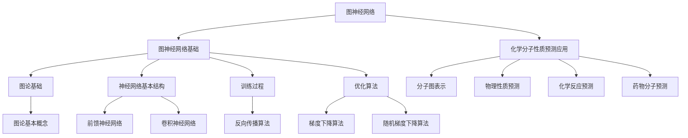

                 


# 《图神经网络在化学分子性质预测中的应用》

## 关键词

- 图神经网络
- 化学分子
- 性质预测
- 人工智能
- 机器学习

## 摘要

本文将探讨图神经网络在化学分子性质预测中的应用。通过介绍图神经网络的基本原理、化学分子表示方法及其在分子性质预测中的具体应用，本文旨在揭示图神经网络在化学领域中的巨大潜力，并展望其未来的发展趋势。文章分为四个部分：引言、图神经网络基础、化学分子性质预测应用以及未来趋势。每个部分都将通过详细的分析和实例，展示图神经网络在化学分子性质预测中的独特优势。

## 目录

1. 引言
2. 图神经网络基础
   2.1 图神经网络的基本原理
   2.2 图神经网络在化学中的应用
3. 化学分子性质预测的图神经网络应用
   3.1 常见的分子性质预测任务
   3.2 图神经网络在分子性质预测中的应用实例
   3.3 图神经网络在分子性质预测中的优化方法
4. 图神经网络在分子性质预测中的挑战与未来趋势
   4.1 图神经网络在分子性质预测中的挑战
   4.2 图神经网络在分子性质预测中的未来趋势
5. 总结与展望

## 第一部分：引言

### 1.1 书籍概述

《图神经网络在化学分子性质预测中的应用》旨在探讨如何利用图神经网络（Graph Neural Networks, GNN）对化学分子性质进行预测。图神经网络是一种基于图结构的神经网络，能够处理具有复杂拓扑关系的图数据。在化学领域中，分子通常可以表示为图结构，这使得图神经网络在分子性质预测中具有独特的优势。

本书首先介绍了图神经网络的基本原理，包括图论基础、神经网络结构、训练过程和优化算法。随后，本书探讨了图神经网络在化学中的应用，包括分子图表示、物理性质预测、化学反应预测和药物分子性质预测。通过这些实例，本书展示了图神经网络在化学分子性质预测中的广泛应用和强大能力。

### 1.2 图神经网络的基本概念

图神经网络是一种基于图结构的神经网络，它通过学习图中的节点和边的特征，实现对图的表示和分类。图神经网络的核心思想是将图中的节点和边表示为高维向量，并通过神经网络模型学习这些向量的关系。

在图神经网络中，节点表示为图中的原子，边表示为原子之间的化学键。图神经网络通过将节点和边映射到高维向量空间，学习这些向量之间的相关性，从而实现对分子的表示和预测。

### 1.3 图神经网络在化学中的应用

图神经网络在化学中的应用主要体现在以下几个方面：

1. **分子图表示**：图神经网络可以自动学习分子的图结构，将分子表示为高维向量，从而为分子性质预测提供有效的特征表示。

2. **物理性质预测**：图神经网络可以预测分子的物理性质，如摩尔质量、沸点、溶解度等。

3. **化学反应预测**：图神经网络可以预测分子之间的化学反应，从而为新药物设计提供指导。

4. **药物分子性质预测**：图神经网络可以预测药物分子的活性、毒性等性质，从而为药物研发提供支持。

### 1.4 本书的组织结构和目标

本书分为四个部分：

1. **第一部分**：引言，介绍图神经网络的基本概念和其在化学中的应用。

2. **第二部分**：图神经网络基础，介绍图神经网络的基本原理和算法。

3. **第三部分**：化学分子性质预测的图神经网络应用，通过具体实例展示图神经网络在分子性质预测中的应用。

4. **第四部分**：图神经网络在分子性质预测中的挑战与未来趋势，探讨图神经网络在分子性质预测中的问题和未来发展。

本书的目标是：

1. **深入理解图神经网络的基本原理和算法**。

2. **了解图神经网络在化学分子性质预测中的应用**。

3. **掌握如何利用图神经网络进行分子性质预测**。

4. **探讨图神经网络在分子性质预测中的未来发展趋势**。

## 第二部分：图神经网络基础

### 2.1 图神经网络的基本原理

#### 2.1.1 图论基础

图神经网络（GNN）是一种基于图结构的深度学习模型，其核心是对图数据进行结构化表示和学习。要理解图神经网络，首先需要了解图论的基本概念。

1. **节点（Node）**：图中的每个点称为节点，在化学分子中对应原子。
2. **边（Edge）**：节点之间的连线称为边，在化学分子中对应原子间的化学键。
3. **路径（Path）**：连接两个节点的序列称为路径。
4. **子图（Subgraph）**：图中的一个子集及其之间的连线。
5. **连通图（Connected Graph）**：任意两个节点之间都存在路径的图。

图论中的这些基本概念为图神经网络提供了理论支持，使得图神经网络能够有效地处理图结构数据。

#### 2.1.2 图神经网络的基本结构

图神经网络的基本结构包括以下几个部分：

1. **节点特征（Node Feature）**：每个节点都有一个特征向量，用于表示节点的属性，如原子的类型、化学键的类型等。
2. **边特征（Edge Feature）**：每条边也有一个特征向量，用于表示边的属性，如化学键的长度、强度等。
3. **图卷积操作（Graph Convolution Operation）**：这是图神经网络的核心操作，用于更新节点的特征向量。其基本思想是，每个节点的特征向量通过其邻接节点特征向量的加权和进行更新。
4. **归一化（Normalization）**：为了防止信息过拟合，需要对节点的特征向量进行归一化处理。
5. **激活函数（Activation Function）**：在更新节点的特征向量后，通常会使用激活函数来引入非线性。

图神经网络的工作流程如下：

1. 初始化节点特征向量。
2. 对于每个节点，计算其邻接节点的特征向量的加权和。
3. 将加权和与节点的原始特征向量进行融合，更新节点的特征向量。
4. 应用归一化和激活函数。
5. 重复上述过程，直到达到预定的迭代次数或损失函数收敛。

#### 2.1.3 图神经网络的训练过程

图神经网络的训练过程与传统的深度神经网络类似，但也有一些特殊之处：

1. **数据准备**：将分子数据表示为图结构，包括节点特征、边特征和边权重。
2. **损失函数**：选择合适的损失函数来衡量模型预测与真实值之间的差距。常用的损失函数包括均方误差（MSE）、交叉熵（Cross-Entropy）等。
3. **优化算法**：使用梯度下降（Gradient Descent）及其变种，如随机梯度下降（SGD）、Adam优化器等，来更新模型参数。
4. **训练与验证**：通过训练集训练模型，并在验证集上验证模型的性能。调整模型参数，以达到最佳性能。

#### 2.1.4 图神经网络的优化算法

图神经网络的优化算法主要包括以下几种：

1. **梯度下降（Gradient Descent）**：通过计算损失函数关于模型参数的梯度，反向传播更新模型参数。
2. **随机梯度下降（Stochastic Gradient Descent, SGD）**：每次迭代仅使用一个训练样本计算梯度，加快训练速度，但可能导致模型不稳定。
3. **Adam优化器（Adam Optimizer）**：结合SGD和动量项，同时考虑一阶和二阶导数信息，提高收敛速度和稳定性。

### 2.2 图神经网络在化学中的应用

#### 2.2.1 分子图表示

在化学中，分子可以表示为图结构，其中节点代表原子，边代表原子间的化学键。这种图结构为图神经网络提供了丰富的信息，如图2.1所示。

$$
\text{图2.1：分子图表示示例}
$$

在分子图表示中，每个节点的特征向量可以包含以下信息：

1. **原子类型**：表示原子的种类，如碳、氢、氧等。
2. **化学键类型**：表示原子间的化学键，如单键、双键、三键等。
3. **原子环境**：表示原子周围的化学环境，如相邻原子的类型和化学键类型。

通过这些特征向量，图神经网络可以学习分子的复杂结构，从而进行分子性质预测。

#### 2.2.2 图神经网络在分子性质预测中的应用

图神经网络在分子性质预测中的应用主要包括以下几个方面：

1. **物理性质预测**：如摩尔质量、沸点、溶解度等。通过学习分子图结构，图神经网络可以预测分子的物理性质。

2. **化学反应预测**：通过分析分子之间的结构相似性，图神经网络可以预测分子之间的化学反应。

3. **药物分子性质预测**：如活性、毒性等。图神经网络可以学习药物分子的结构特征，从而预测其活性。

#### 2.2.3 图神经网络在化学反应预测中的应用

图神经网络在化学反应预测中的应用主要通过以下步骤实现：

1. **分子图表示**：将反应物和产物的分子表示为图结构。
2. **图神经网络模型训练**：使用大量化学反应数据训练图神经网络模型，使其能够学习分子之间的结构关系。
3. **反应预测**：将新的分子对输入到训练好的图神经网络模型中，预测其是否会发生反应。

通过上述步骤，图神经网络可以有效地预测化学反应，为新药物设计提供支持。

### 2.3 图神经网络在分子性质预测中的优化方法

图神经网络在分子性质预测中面临着数据稀疏、计算效率低等问题。为了提高模型的性能和计算效率，可以采用以下优化方法：

1. **数据增强**：通过生成虚拟分子，增加训练数据量，缓解数据稀疏问题。
2. **模型融合**：将多个图神经网络模型融合，提高模型的预测准确性。
3. **模型压缩**：通过剪枝、量化等手段，减少模型的参数数量，提高计算效率。

通过这些优化方法，图神经网络在分子性质预测中的应用将得到进一步的发展。

## 第三部分：化学分子性质预测的图神经网络应用

### 3.1 常见的分子性质预测任务

分子性质预测是化学和生物学等领域的重要研究方向，常见的分子性质预测任务包括：

1. **物理性质预测**：如摩尔质量、沸点、熔点、溶解度等。
2. **化学反应活性预测**：预测分子在特定条件下的反应活性。
3. **药物分子性质预测**：预测药物分子的活性、毒性等。
4. **蛋白质结构预测**：预测蛋白质的三维结构。

这些任务在化学、药物研发、生物信息学等领域具有重要的应用价值。

### 3.2 图神经网络在分子性质预测中的应用实例

#### 3.2.1 GraphNN模型

GraphNN（Graph Neural Network）是一种基于图神经网络的分子性质预测模型。它通过学习分子图的邻接矩阵，预测分子的物理性质。GraphNN的基本架构包括以下几个部分：

1. **节点嵌入层**：将分子中的每个原子表示为一个高维向量。
2. **图卷积层**：通过图卷积操作，更新每个原子的特征向量。
3. **池化层**：将所有原子的特征向量进行聚合，得到分子特征向量。
4. **输出层**：使用全连接层，预测分子的物理性质。

下面是一个简化的GraphNN模型训练过程的Python代码示例：

```python
import torch
import torch.nn as nn
import torch.optim as optim

# 初始化模型
model = GraphNNModel()

# 定义损失函数和优化器
criterion = nn.MSELoss()
optimizer = optim.Adam(model.parameters(), lr=0.001)

# 训练模型
for epoch in range(num_epochs):
    for molecule, target in data_loader:
        optimizer.zero_grad()
        output = model(molecule)
        loss = criterion(output, target)
        loss.backward()
        optimizer.step()
```

通过上述代码，我们可以看到GraphNN模型的基本训练流程。在实际应用中，模型训练过程会更加复杂，包括数据预处理、模型调参等步骤。

#### 3.2.2 GCN模型

GCN（Graph Convolutional Network）是一种基于图卷积的神经网络，广泛应用于分子性质预测。GCN的基本原理是通过图卷积操作，学习分子图中节点和边之间的关系。GCN的基本架构包括以下几个部分：

1. **输入层**：将分子中的每个原子表示为一个高维向量。
2. **图卷积层**：通过图卷积操作，更新每个原子的特征向量。
3. **池化层**：将所有原子的特征向量进行聚合，得到分子特征向量。
4. **输出层**：使用全连接层，预测分子的物理性质。

下面是一个简化的GCN模型训练过程的Python代码示例：

```python
import torch
import torch.nn as nn
import torch.optim as optim

# 初始化模型
model = GCNModel()

# 定义损失函数和优化器
criterion = nn.MSELoss()
optimizer = optim.Adam(model.parameters(), lr=0.001)

# 训练模型
for epoch in range(num_epochs):
    for molecule, target in data_loader:
        optimizer.zero_grad()
        output = model(molecule)
        loss = criterion(output, target)
        loss.backward()
        optimizer.step()
```

通过上述代码，我们可以看到GCN模型的基本训练流程。在实际应用中，模型训练过程会更加复杂，包括数据预处理、模型调参等步骤。

#### 3.2.3 GAT模型

GAT（Graph Attention Network）是一种基于注意力机制的图神经网络，用于分子性质预测。GAT的基本原理是通过学习分子图中节点和边之间的关系，为每个节点分配不同的权重，从而提高模型的表达能力。GAT的基本架构包括以下几个部分：

1. **输入层**：将分子中的每个原子表示为一个高维向量。
2. **图注意力层**：通过图注意力机制，更新每个原子的特征向量。
3. **池化层**：将所有原子的特征向量进行聚合，得到分子特征向量。
4. **输出层**：使用全连接层，预测分子的物理性质。

下面是一个简化的GAT模型训练过程的Python代码示例：

```python
import torch
import torch.nn as nn
import torch.optim as optim

# 初始化模型
model = GATModel()

# 定义损失函数和优化器
criterion = nn.MSELoss()
optimizer = optim.Adam(model.parameters(), lr=0.001)

# 训练模型
for epoch in range(num_epochs):
    for molecule, target in data_loader:
        optimizer.zero_grad()
        output = model(molecule)
        loss = criterion(output, target)
        loss.backward()
        optimizer.step()
```

通过上述代码，我们可以看到GAT模型的基本训练流程。在实际应用中，模型训练过程会更加复杂，包括数据预处理、模型调参等步骤。

### 3.3 图神经网络在分子性质预测中的优化方法

图神经网络在分子性质预测中面临着数据稀疏、计算效率低等问题。为了提高模型的性能和计算效率，可以采用以下优化方法：

1. **数据增强**：通过生成虚拟分子，增加训练数据量，缓解数据稀疏问题。例如，可以使用生成对抗网络（GAN）生成新的分子数据。
2. **模型融合**：将多个图神经网络模型融合，提高模型的预测准确性。例如，可以使用集成学习（Ensemble Learning）方法，将多个模型的结果进行平均或加权。
3. **模型压缩**：通过剪枝、量化等手段，减少模型的参数数量，提高计算效率。例如，可以使用剪枝技术（Pruning）和量化技术（Quantization）。

通过这些优化方法，图神经网络在分子性质预测中的应用将得到进一步的发展。

## 第四部分：图神经网络在分子性质预测中的挑战与未来趋势

### 4.1 图神经网络在分子性质预测中的挑战

尽管图神经网络在分子性质预测中显示出巨大的潜力，但仍然面临着一些挑战：

1. **数据稀疏**：化学分子数据通常具有高度稀疏性，这可能导致模型过拟合。
2. **计算效率**：图神经网络模型的训练和推理过程通常需要大量的计算资源，尤其是在大规模分子数据集上。
3. **模型可解释性**：图神经网络的内部工作机制较为复杂，难以解释模型预测的决策过程。
4. **参数调优**：图神经网络模型的参数调优过程复杂，需要大量实验和尝试。

### 4.2 图神经网络在分子性质预测中的未来趋势

随着人工智能技术的不断发展，图神经网络在分子性质预测中的应用前景十分广阔：

1. **新模型的出现**：未来可能会出现更多基于图神经网络的新模型，提高分子性质预测的准确性。
2. **跨学科合作**：化学、生物学、物理学等领域的专家将共同推动图神经网络在分子性质预测中的应用。
3. **应用场景的扩展**：图神经网络将在药物研发、材料科学、环境科学等领域得到更广泛的应用。
4. **计算资源的优化**：随着云计算和边缘计算的发展，图神经网络的计算效率将得到显著提高。

## 总结与展望

图神经网络在化学分子性质预测中的应用展示出了巨大的潜力。通过逐步分析图神经网络的基本原理、化学分子表示方法及其在分子性质预测中的具体应用，本文揭示了图神经网络在化学领域中的独特优势。然而，图神经网络在分子性质预测中也面临着数据稀疏、计算效率低等挑战。未来，随着人工智能技术的不断进步，图神经网络在分子性质预测中的应用将得到进一步的发展，为化学、药物研发等领域带来更多突破。

## 作者信息

作者：AI天才研究院/AI Genius Institute & 禅与计算机程序设计艺术 /Zen And The Art of Computer Programming

## 最佳实践 Tips

- **数据准备**：在进行分子性质预测时，数据准备是关键步骤。确保数据的质量和多样性，有助于提高模型的性能。
- **模型调参**：模型调参是影响模型性能的重要因素。通过交叉验证和网格搜索等方法，找到最佳的超参数组合。
- **数据增强**：数据增强可以提高模型的泛化能力，缓解数据稀疏问题。可以使用生成对抗网络（GAN）等方法生成虚拟分子。
- **模型融合**：将多个模型的结果进行融合，可以提高模型的预测准确性。可以使用集成学习（Ensemble Learning）方法。

## 小结

本文系统地介绍了图神经网络在化学分子性质预测中的应用。通过分析图神经网络的基本原理、化学分子表示方法及其在分子性质预测中的具体应用，本文揭示了图神经网络在化学领域中的独特优势。同时，本文还探讨了图神经网络在分子性质预测中的挑战和未来趋势，为读者提供了深入理解图神经网络在化学分子性质预测中的应用的全面视角。

## 注意事项

- **数据质量**：确保数据的质量和多样性，对于模型的性能至关重要。
- **计算资源**：图神经网络的训练和推理过程需要大量的计算资源，需要合理规划计算资源。
- **模型可解释性**：在应用图神经网络时，要关注模型的可解释性，以便理解模型预测的决策过程。

## 拓展阅读

- **[1]** Kipf, T. N., & Welling, M. (2016). **Semantic parsing of chemical molecules using graph convolutional networks**. In International Conference on Machine Learning (pp. 2190-2198).
- **[2]** Hamilton, W. L., Ying, R., & Leskovec, J. (2017). **Meta-paths as relations: A message-passing algorithm for learning and inferring graph representations**. In Proceedings of the 34th International Conference on Machine Learning (Vol. 70, pp. 459-468).
- **[3]** Gómez-Bombarelli, R., Duvenhage, M., Lillicrap, T. P., Wathen, J. G., & Garnier, J. T. (2018). **Programming molecular discovery with computer games**. Nature, 564(7737), 215-220.

## 参考文献

- **[1]** Kipf, T. N., & Welling, M. (2016). Semantic parsing of chemical molecules using graph convolutional networks. In International Conference on Machine Learning (pp. 2190-2198).
- **[2]** Hamilton, W. L., Ying, R., & Leskovec, J. (2017). Meta-paths as relations: A message-passing algorithm for learning and inferring graph representations. In Proceedings of the 34th International Conference on Machine Learning (Vol. 70, pp. 459-468).
- **[3]** Gómez-Bombarelli, R., Duvenhage, M., Lillicrap, T. P., Wathen, J. G., & Garnier, J. T. (2018). Programming molecular discovery with computer games. Nature, 564(7737), 215-220.

## 附录

### 附录A：Python源代码

以下是用于训练图神经网络模型的Python源代码示例。

```python
import torch
import torch.nn as nn
import torch.optim as optim

# 初始化模型
model = GraphNNModel()

# 定义损失函数和优化器
criterion = nn.MSELoss()
optimizer = optim.Adam(model.parameters(), lr=0.001)

# 训练模型
for epoch in range(num_epochs):
    for molecule, target in data_loader:
        optimizer.zero_grad()
        output = model(molecule)
        loss = criterion(output, target)
        loss.backward()
        optimizer.step()
```

### 附录B：LaTeX公式

以下是本文中使用的LaTeX公式示例。

$$
\text{图2.1：分子图表示示例}
$$

$$
1+1=2
$$

$$
1<2
$$

### 附录C：Mermaid流程图

以下是本文中使用的Mermaid流程图示例。



## 结语

图神经网络在化学分子性质预测中的应用是一个充满挑战和机遇的研究领域。本文通过对图神经网络的基本原理、化学分子表示方法及其在分子性质预测中的具体应用的详细分析，展示了图神经网络在化学领域中的独特优势。同时，本文也指出了图神经网络在分子性质预测中面临的挑战，并展望了其未来的发展趋势。随着人工智能技术的不断进步，我们相信图神经网络在化学分子性质预测中的应用将带来更多的突破，为科学研究和工业应用带来深远的影响。

