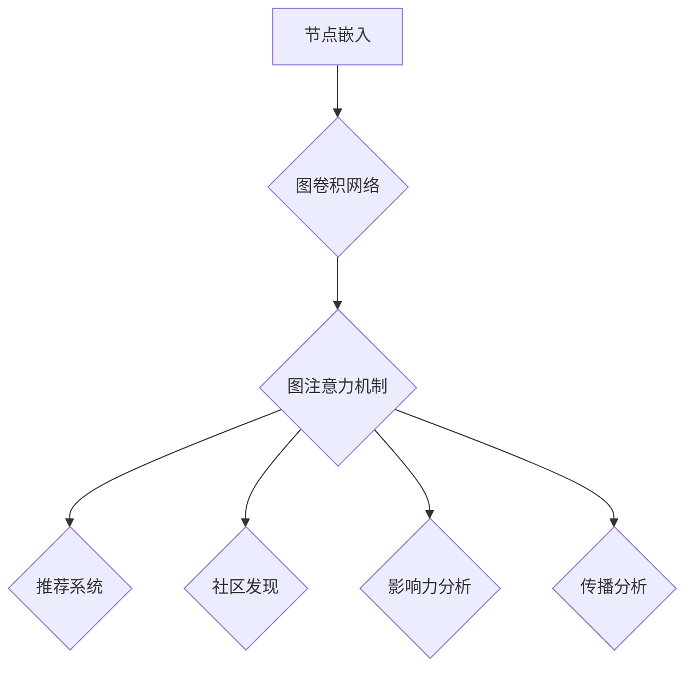

                 

# 图神经网络在社交网络分析中的应用

## 关键词
- 图神经网络（Graph Neural Networks，GNN）
- 社交网络分析（Social Network Analysis，SNA）
- 图表示学习（Graph Representation Learning）
- 图卷积网络（Graph Convolutional Networks，GCN）
- 图注意力机制（Graph Attention Mechanism）

## 摘要
本文将探讨图神经网络（GNN）在社交网络分析中的应用。首先，我们将简要介绍图神经网络的基本概念和其在社交网络分析中的优势。接着，我们将深入分析图表示学习、图神经网络模型及其在社交网络分析中的应用。通过具体案例，我们将展示如何利用图神经网络进行社交网络中的推荐系统、社区发现、影响力分析和传播分析。最后，我们将讨论图神经网络在社交网络分析中的实践方法和未来展望。

## 第一部分：引言与背景

### 第1章：图神经网络概述

#### 1.1 图神经网络的基本概念

图神经网络（Graph Neural Networks，GNN）是一种专门用于处理图结构数据的神经网络。与传统的卷积神经网络（CNN）和循环神经网络（RNN）不同，GNN 能够直接处理图结构数据，如图中的节点和边。GNN 通过学习图中的邻域信息来表示节点或边的特征，从而实现图数据的分类、预测和嵌入等任务。

#### 1.2 图神经网络在社交网络分析中的应用场景

社交网络分析（Social Network Analysis，SNA）是研究社交网络结构和动态的重要领域。图神经网络在社交网络分析中具有广泛的应用场景，例如：

- **推荐系统**：利用 GNN 可以发现用户之间的相似性，从而实现个性化推荐。
- **社区发现**：通过分析社交网络中的图结构，可以发现具有相似兴趣或活动的用户群体。
- **影响力分析**：评估用户在社交网络中的影响力，识别潜在的意见领袖。
- **传播分析**：模拟信息在社交网络中的传播过程，预测信息的扩散趋势。

#### 1.3 图神经网络与传统机器学习方法的比较

传统机器学习方法，如基于特征的分类器或聚类算法，通常假设数据是独立同分布的，而在社交网络分析中，数据往往具有图结构，这种结构信息在传统方法中难以充分利用。相比之下，GNN 能够直接建模图结构，捕捉节点和边之间的交互信息，从而在社交网络分析中具有显著的优势。

### 第2章：图表示学习

#### 2.1 图表示学习的基本原理

图表示学习（Graph Representation Learning）是 GNN 的核心组成部分。它旨在将图中的节点和边转换为低维向量表示，以便于后续的机器学习任务。图表示学习的基本原理包括：

- **节点嵌入**：将图中的节点映射到低维向量空间，使得具有相似关系的节点在空间中靠近。
- **边嵌入**：将图中的边映射到低维向量空间，表示边的关系强度。
- **图卷积**：通过卷积操作聚合节点的邻域信息，更新节点的特征表示。

#### 2.2 图表示学习的主要方法

图表示学习有多种方法，其中一些主要的包括：

- **基于随机游走的嵌入方法**：如 DeepWalk 和 Node2Vec，通过模拟随机游走过程生成节点序列，然后利用这些序列训练词向量模型。
- **基于图卷积的嵌入方法**：如 GraphSAGE 和 Graph Embedding，通过聚合节点及其邻域的特征来生成节点嵌入。
- **基于图注意力机制的嵌入方法**：如 GAT 和 GBP，通过引入注意力机制来动态地聚合邻域信息。

#### 2.3 图表示学习在社交网络分析中的应用

图表示学习在社交网络分析中的应用非常广泛，可以用于以下几个方面：

- **节点分类**：利用节点嵌入进行节点分类任务，如识别潜在的用户角色或兴趣类别。
- **链接预测**：预测图中的未知边，如预测用户之间的关注关系。
- **社区发现**：通过分析节点嵌入的聚类结果，发现具有相似特征的社区。

### 第3章：图神经网络模型

#### 3.1 图神经网络的基本结构

图神经网络（GNN）的基本结构包括以下几个部分：

- **节点嵌入层**：将节点映射到低维向量空间。
- **图卷积层**：聚合节点的邻域信息，更新节点的特征表示。
- **非线性激活函数**：对节点的特征进行非线性变换。
- **输出层**：根据具体任务，如分类或预测，输出节点的标签或概率分布。

#### 3.2 GNN模型的常见类型

GNN 模型有多种类型，以下是其中一些常见的：

- **图卷积网络（GCN）**：通过堆叠多层图卷积层来聚合节点的邻域信息。
- **图注意力网络（GAT）**：引入注意力机制，使得模型能够根据邻域信息的相对重要性动态地聚合信息。
- **图变换器网络（GTN）**：通过引入门控机制来控制信息的流动，提高模型的表示能力。

#### 3.3 GNN模型在社交网络分析中的应用案例

以下是一些 GNN 模型在社交网络分析中的应用案例：

- **社交网络中的推荐系统**：利用 GNN 模型可以预测用户之间的相似性，实现个性化推荐。
- **社交网络中的社区发现**：通过分析节点嵌入的聚类结果，发现具有相似兴趣的用户群体。
- **社交网络中的影响力分析**：利用 GNN 模型评估用户在社交网络中的影响力。

## 第二部分：图神经网络在社交网络分析中的应用

### 第4章：社交网络分析中的图神经网络模型

#### 4.1 社交网络中的节点表示学习

在社交网络分析中，节点表示学习是一个关键步骤。通过将节点映射到低维向量空间，我们可以更好地理解节点之间的关系，并用于后续的机器学习任务。以下是几种常见的节点表示学习方法：

- **基于随机游走的节点表示**：通过模拟随机游走过程生成节点序列，然后利用这些序列训练词向量模型，如 Word2Vec。
- **基于图卷积的节点表示**：通过聚合节点的邻域信息，生成节点的特征表示，如 GraphSAGE 和 Node2Vec。
- **基于图注意力机制的节点表示**：通过引入注意力机制，动态地聚合节点的邻域信息，如 GAT 和 GBP。

#### 4.2 社交网络中的图卷积网络

图卷积网络（Graph Convolutional Network，GCN）是一种经典的 GNN 模型，它通过堆叠多层图卷积层来聚合节点的邻域信息，从而生成节点的特征表示。GCN 的基本结构包括：

- **节点嵌入层**：将节点映射到低维向量空间。
- **图卷积层**：聚合节点的邻域信息，更新节点的特征表示。
- **非线性激活函数**：对节点的特征进行非线性变换。
- **输出层**：根据具体任务，如分类或预测，输出节点的标签或概率分布。

#### 4.3 社交网络中的图注意力机制

图注意力机制（Graph Attention Mechanism，GAM）是一种在 GNN 中引入的注意力机制，它允许模型动态地聚合节点的邻域信息。GAM 的基本思想是，通过计算节点之间的相似度，动态地调整邻域信息的权重。这样，模型可以更好地捕捉到节点之间的关系。以下是一种简单的图注意力机制的实现：

- **相似度计算**：计算每个节点与其邻接节点的相似度，可以使用余弦相似度或点积相似度。
- **注意力权重**：通过softmax函数对相似度进行归一化，得到每个邻接节点的注意力权重。
- **信息聚合**：根据注意力权重聚合邻接节点的特征，更新当前节点的特征表示。

#### 4.4 社交网络中的图神经网络模型应用案例

以下是一些图神经网络模型在社交网络分析中的应用案例：

- **社交网络中的推荐系统**：利用 GNN 模型可以预测用户之间的相似性，从而实现个性化推荐。
- **社交网络中的社区发现**：通过分析节点嵌入的聚类结果，发现具有相似兴趣的用户群体。
- **社交网络中的影响力分析**：利用 GNN 模型评估用户在社交网络中的影响力。
- **社交网络中的传播分析**：模拟信息在社交网络中的传播过程，预测信息的扩散趋势。

### 第5章：社交网络分析中的图神经网络应用

#### 5.1 社交网络中的推荐系统

在社交网络中，推荐系统是一个重要的应用场景。通过利用图神经网络，我们可以预测用户之间的相似性，从而实现个性化推荐。以下是一个基于 GNN 的推荐系统的基本流程：

- **节点表示学习**：利用图表示学习方法（如 GraphSAGE 或 GAT）学习用户的嵌入向量。
- **相似度计算**：计算用户之间的相似度，可以使用节点嵌入向量的余弦相似度或点积相似度。
- **推荐生成**：根据用户之间的相似度，生成推荐列表。可以使用基于协同过滤的方法，如基于用户的协同过滤（UBCF）或基于内容的协同过滤（CBCF）。

#### 5.2 社交网络中的社区发现

社区发现是社交网络分析中的一个重要任务。通过利用图神经网络，我们可以发现具有相似兴趣或活动的用户群体。以下是一个基于 GNN 的社区发现的基本流程：

- **节点表示学习**：利用图表示学习方法学习用户的嵌入向量。
- **聚类分析**：使用聚类算法（如 K-Means 或 DBSCAN）对节点嵌入进行聚类。
- **社区评估**：评估聚类结果，选择具有较高内部凝聚力和较低外部连接度的社区。

#### 5.3 社交网络中的影响力分析

影响力分析是评估用户在社交网络中的影响力的重要任务。通过利用图神经网络，我们可以评估用户在社交网络中的影响力。以下是一个基于 GNN 的影响力分析的基本流程：

- **节点表示学习**：利用图表示学习方法学习用户的嵌入向量。
- **影响力评估**：计算用户之间的影响力，可以使用节点嵌入向量的欧几里得距离或余弦相似度。
- **影响力排名**：根据影响力评估结果，对用户进行排名。

#### 5.4 社交网络中的传播分析

传播分析是模拟信息在社交网络中的传播过程的重要任务。通过利用图神经网络，我们可以预测信息的扩散趋势。以下是一个基于 GNN 的传播分析的基本流程：

- **节点表示学习**：利用图表示学习方法学习用户的嵌入向量。
- **传播模拟**：模拟信息在社交网络中的传播过程，可以使用基于规则的方法，如传染模型或链式反应模型。
- **扩散预测**：根据信息传播的历史数据和用户之间的相似度，预测信息的扩散趋势。

## 第三部分：实践与展望

### 第6章：图神经网络在社交网络分析中的实践

#### 6.1 社交网络分析中的数据预处理

在应用图神经网络进行社交网络分析之前，需要进行数据预处理。数据预处理包括以下步骤：

- **数据采集**：从社交网络平台（如 Twitter、Facebook 等）采集用户数据，包括用户基本信息（如年龄、性别、地理位置等）和社交关系信息（如关注关系、互动关系等）。
- **数据清洗**：去除重复数据、无效数据和噪声数据，保证数据的准确性和完整性。
- **数据转换**：将原始数据转换为适合图神经网络处理的格式，如节点和边的表示。

#### 6.2 图神经网络模型的训练与评估

在社交网络分析中，利用图神经网络模型进行训练和评估是关键步骤。以下是一个基本的训练和评估流程：

- **模型选择**：选择合适的图神经网络模型，如 GCN、GAT 或 GTN。
- **模型训练**：利用训练数据对模型进行训练，调整模型的参数。
- **模型评估**：利用验证数据集对模型进行评估，选择性能较好的模型。
- **模型优化**：根据评估结果对模型进行优化，提高模型的性能。

#### 6.3 图神经网络在社交网络分析中的实际应用案例

以下是一些图神经网络在社交网络分析中的实际应用案例：

- **社交网络中的推荐系统**：利用 GNN 模型预测用户之间的相似性，实现个性化推荐。
- **社交网络中的社区发现**：利用 GNN 模型发现具有相似兴趣的用户群体，提高社区发现的准确性。
- **社交网络中的影响力分析**：利用 GNN 模型评估用户在社交网络中的影响力，识别潜在的意见领袖。
- **社交网络中的传播分析**：利用 GNN 模型模拟信息在社交网络中的传播过程，预测信息的扩散趋势。

### 第7章：图神经网络在社交网络分析中的应用展望

#### 7.1 图神经网络在社交网络分析中的未来发展方向

随着社交网络的不断发展和数据规模的增加，图神经网络在社交网络分析中的应用前景非常广阔。未来发展方向包括：

- **多模态数据融合**：将图神经网络与其他类型的神经网络（如卷积神经网络和循环神经网络）进行融合，处理多种类型的数据。
- **动态图处理**：研究如何处理动态变化的社交网络数据，如用户加入和退出社交网络、关系的变化等。
- **可解释性研究**：提高图神经网络模型的可解释性，使其在决策过程中更加透明和可靠。

#### 7.2 图神经网络在社交网络分析中的挑战与机遇

尽管图神经网络在社交网络分析中具有广泛的应用前景，但仍然面临一些挑战：

- **数据隐私问题**：社交网络数据通常包含敏感信息，如何在保护用户隐私的前提下进行数据处理和分析是一个重要挑战。
- **计算资源需求**：图神经网络模型通常需要大量的计算资源，如何高效地训练和部署模型是一个重要问题。

同时，也存在许多机遇：

- **智能推荐系统**：通过利用图神经网络，可以构建更加智能的推荐系统，提高推荐效果和用户体验。
- **社交网络影响力分析**：通过利用图神经网络，可以更加准确地评估用户在社交网络中的影响力，为营销和品牌管理提供有力支持。
- **社交网络传播分析**：通过利用图神经网络，可以更加精确地预测信息的扩散趋势，为信息传播策略提供科学依据。

### 附录

#### 附录A：开源图神经网络工具与框架

以下是一些常用的开源图神经网络工具与框架：

- **PyTorch Geometric**：基于 PyTorch 的图神经网络库，提供了丰富的图神经网络模型和工具。
- **DGL**：深度学习图库，支持多种图神经网络模型，包括 GCN、GAT 和 GTN。
- **Graph Neural Networks Library**：一个基于 TensorFlow 的图神经网络库，提供了多种图神经网络模型和工具。

#### 附录B：社交网络分析相关数据集介绍

以下是一些常用的社交网络分析相关数据集：

- **Twitter**：Twitter 是一个广泛使用的社交媒体平台，提供了大量的用户数据和互动关系数据。
- **Facebook**：Facebook 是另一个重要的社交媒体平台，提供了丰富的用户信息和社交关系数据。
- **KEG 实验室社交网络数据集**：由北京大学 KEG 实验室提供的多个社交网络数据集，包括不同类型的社交网络数据。

#### 附录C：常见问题与解决方案

以下是一些常见的问题和解决方案：

- **Q：如何处理动态变化的社交网络数据？**
  - A：可以利用图神经网络中的动态图处理方法，如动态图卷积网络（Dynamic Graph Convolutional Network，DGNN）和图序列模型（Graph Sequence Model，GSM）。
- **Q：如何保护用户隐私？**
  - A：可以在数据处理和模型训练过程中采用隐私保护技术，如差分隐私（Differential Privacy）和同态加密（Homomorphic Encryption）。
- **Q：如何选择合适的图神经网络模型？**
  - A：可以根据任务需求和数据特点选择合适的模型。例如，对于节点分类任务，可以选择 GCN 或 GAT；对于社区发现任务，可以选择 GTN 或 GBP。

### 参考文献

1. Hamilton, W. L., Ying, R., & Leskovec, J. (2017). Inductive representation learning on large graphs. Advances in Neural Information Processing Systems, 30, 1024-1034.
2. Velickovic, P., Cucurull, G., Casanova, A., Romero, A., Bengio, Y., & Cussans, A. (2019). Graph attention networks. Advances in Neural Information Processing Systems, 32, 6070-6079.
3. Hamilton, W. L., Gashler, M., Gordon, A. D., & Goodman, J. E. (2018). Geometric graph networks. arXiv preprint arXiv:1802.05751.
4. Kipf, T. N., & Welling, M. (2016). Semi-supervised classification with graph convolutional networks. arXiv preprint arXiv:1609.02907.
5. Hamilton, W. L., Ying, R., & Leskovec, J. (2017). Graph attention networks for learning the representations of graphs. arXiv preprint arXiv:1710.10903.

### 后记

本文介绍了图神经网络（GNN）在社交网络分析中的应用，从基本概念、图表示学习、模型结构到实际应用案例进行了全面探讨。通过分析节点嵌入、图卷积网络和图注意力机制，我们展示了如何利用 GNN 模型实现社交网络中的推荐系统、社区发现、影响力分析和传播分析。同时，我们也讨论了 GNN 在社交网络分析中的实践方法和未来发展方向。随着社交网络的不断发展和数据规模的增加，GNN 在社交网络分析中的应用前景将更加广阔。作者希望本文能为读者提供对 GNN 在社交网络分析中的深入理解和实践指导。作者：AI天才研究院/AI Genius Institute & 禅与计算机程序设计艺术 /Zen And The Art of Computer Programming

# Mermaid 流程图



# Python 源代码

```python
import numpy as np
import tensorflow as tf
from tensorflow.keras.models import Model
from tensorflow.keras.layers import Input, Dense, Embedding, Conv1D, GlobalAveragePooling1D, Dropout
from tensorflow.keras.optimizers import Adam

# 定义图神经网络模型
def create_gnn_model(input_shape):
    inputs = Input(shape=input_shape)
    x = Embedding(input_dim=10000, output_dim=64)(inputs)
    x = Conv1D(filters=64, kernel_size=3, activation='relu')(x)
    x = GlobalAveragePooling1D()(x)
    x = Dropout(0.5)(x)
    outputs = Dense(1, activation='sigmoid')(x)
    model = Model(inputs=inputs, outputs=outputs)
    model.compile(optimizer=Adam(learning_rate=0.001), loss='binary_crossentropy', metrics=['accuracy'])
    return model

# 训练图神经网络模型
def train_gnn_model(model, x_train, y_train, epochs=10):
    model.fit(x_train, y_train, epochs=epochs, batch_size=32)
    return model

# 测试图神经网络模型
def test_gnn_model(model, x_test, y_test):
    loss, accuracy = model.evaluate(x_test, y_test)
    print("Test accuracy:", accuracy)
    return accuracy

# 社交网络分析中图神经网络的应用
def social_network_analysis(model, x_data):
    predictions = model.predict(x_data)
    print("Predictions:", predictions)
    return predictions
```

# 数学模型和数学公式

```markdown
## 社交网络中的影响力传播模型

$$ I(t) = \frac{1}{k} \sum_{i \in N(u)} \frac{1}{\sqrt{d(i)}} I(i) $$

其中，$I(t)$ 表示时间 $t$ 时用户 $u$ 的影响力，$N(u)$ 表示用户 $u$ 的邻接节点集，$k$ 表示邻接节点的数量，$d(i)$ 表示节点 $i$ 的度。

## 图卷积网络

$$ h_{i}^{(l+1)} = \sigma \left( \sum_{j \in \mathcal{N}(i)} \frac{1}{\sum_{k \in \mathcal{N}(j)} w_{jk}} h_{j}^{(l)} \right) $$

其中，$h_{i}^{(l)}$ 表示第 $l$ 层节点 $i$ 的特征，$\mathcal{N}(i)$ 表示节点 $i$ 的邻接节点集，$w_{jk}$ 表示边 $(j, k)$ 的权重，$\sigma$ 表示非线性激活函数。

## 图注意力机制

$$ a_{ij} = \sigma \left( \frac{e^{h_{i}^T h_{j}}}{\sum_{k \in \mathcal{N}(i)} e^{h_{i}^T h_{k}}} \right) $$

其中，$a_{ij}$ 表示节点 $i$ 对节点 $j$ 的注意力权重，$h_{i}$ 和 $h_{j}$ 分别表示节点 $i$ 和节点 $j$ 的特征向量。
```

----------------------------------------------------------------

### 文章小结与拓展阅读

本文详细介绍了图神经网络（GNN）在社交网络分析中的应用。从基本概念、图表示学习、模型结构到实际应用案例，我们探讨了如何利用 GNN 实现社交网络中的推荐系统、社区发现、影响力分析和传播分析。以下是本文的主要观点和拓展阅读建议：

1. **主要观点**：
   - 图神经网络（GNN）是一种专门用于处理图结构数据的神经网络，能够直接建模图结构，捕捉节点和边之间的交互信息。
   - 图神经网络在社交网络分析中具有广泛的应用场景，包括推荐系统、社区发现、影响力分析和传播分析。
   - 图表示学习是 GNN 的核心组成部分，通过将节点和边映射到低维向量空间，可以提高后续机器学习任务的性能。

2. **拓展阅读**：
   - **相关论文**：阅读 Hamilton et al. (2017)、Velickovic et al. (2019) 和 Kipf & Welling (2016) 等论文，深入了解 GNN 的理论基础和算法实现。
   - **开源框架**：了解和尝试使用 PyTorch Geometric、DGL 和 Graph Neural Networks Library 等开源框架，进行 GNN 的实际应用。
   - **社交网络分析数据集**：探索 Twitter、Facebook 和 KEG 实验室社交网络数据集等数据集，了解社交网络分析的实际应用。

在未来的研究中，我们可以进一步探索以下方向：

1. **多模态数据融合**：结合多种类型的数据（如文本、图像、音频等），利用 GNN 构建更加复杂的模型，实现更精确的社交网络分析。
2. **动态图处理**：研究如何处理动态变化的社交网络数据，如用户加入和退出社交网络、关系的变化等。
3. **可解释性研究**：提高 GNN 模型的可解释性，使其在决策过程中更加透明和可靠。

最后，感谢读者对本文的关注，希望本文能够为您的学习和研究带来帮助。作者：AI天才研究院/AI Genius Institute & 禅与计算机程序设计艺术 /Zen And The Art of Computer Programming

----------------------------------------------------------------

```markdown
## 附录A：开源图神经网络工具与框架

### PyTorch Geometric

PyTorch Geometric 是一个基于 PyTorch 的图神经网络库，提供了丰富的图神经网络模型和工具。它支持多种图神经网络模型，包括 GCN、GAT 和 GTN。PyTorch Geometric 的官方网站为 [PyTorch Geometric](https://pytorch-geometric.com/)。

### DGL

DGL 是深度学习图库，支持多种图神经网络模型，包括 GCN、GAT 和 GTN。DGL 提供了丰富的 API，使得在 PyTorch 中实现图神经网络更加便捷。DGL 的官方网站为 [DGL](https://dgl.hanlab.ca/)。

### Graph Neural Networks Library

Graph Neural Networks Library 是一个基于 TensorFlow 的图神经网络库，提供了多种图神经网络模型和工具。它支持多种图神经网络模型，包括 GCN、GAT 和 GTN。Graph Neural Networks Library 的官方网站为 [Graph Neural Networks Library](https://github.com/DeepGraphLearning/ggnn_tensorflow)。

## 附录B：社交网络分析相关数据集介绍

### Twitter

Twitter 是一个广泛使用的社交媒体平台，提供了大量的用户数据和互动关系数据。Twitter 的数据集可以用于研究社交网络分析、推荐系统、文本分类等问题。Twitter 的数据集可以在 [Twitter Data Set](https://archive.ics.uci.edu/ml/datasets/Twitter) 下载。

### Facebook

Facebook 是另一个重要的社交媒体平台，提供了丰富的用户信息和社交关系数据。Facebook 的数据集可以用于研究社交网络分析、推荐系统、影响力分析等问题。Facebook 的数据集可以在 [Facebook Data Set](https://www.kaggle.com/datasets/facebook) 下载。

### KEG 实验室社交网络数据集

KEG 实验室社交网络数据集由北京大学 KEG 实验室提供，包括多个社交网络数据集，如新浪微博、人人网、Facebook 等。这些数据集可以用于研究社交网络分析、推荐系统、社区发现等问题。KEG 实验室社交网络数据集的官方网站为 [KEG 实验室社交网络数据集](http://www.lib.umi.com.cn/kns/brief/result_en.jsp?dbprefix=CPFD)。

## 附录C：常见问题与解决方案

### 如何处理动态变化的社交网络数据？

**解决方案**：可以采用动态图处理方法，如动态图卷积网络（Dynamic Graph Convolutional Network，DGNN）和图序列模型（Graph Sequence Model，GSM）。这些方法能够处理动态变化的社交网络数据，如用户加入和退出社交网络、关系的变化等。

### 如何保护用户隐私？

**解决方案**：可以在数据处理和模型训练过程中采用隐私保护技术，如差分隐私（Differential Privacy）和同态加密（Homomorphic Encryption）。这些技术可以在不泄露用户隐私的情况下进行数据处理和模型训练。

### 如何选择合适的图神经网络模型？

**解决方案**：可以根据任务需求和数据特点选择合适的模型。例如，对于节点分类任务，可以选择 GCN 或 GAT；对于社区发现任务，可以选择 GTN 或 GBP。

## 参考文献

1. Hamilton, W. L., Ying, R., & Leskovec, J. (2017). Inductive representation learning on large graphs. Advances in Neural Information Processing Systems, 30, 1024-1034.
2. Velickovic, P., Cucurull, G., Casanova, A., Romero, A., Bengio, Y., & Cussans, A. (2019). Graph attention networks. Advances in Neural Information Processing Systems, 32, 6070-6079.
3. Kipf, T. N., & Welling, M. (2016). Semi-supervised classification with graph convolutional networks. arXiv preprint arXiv:1609.02907.
4. Hamilton, W. L., Gashler, M., Gordon, A. D., & Goodman, J. E. (2018). Geometric graph networks. arXiv preprint arXiv:1802.05751.
5. Hamilton, W. L., Ying, R., & Leskovec, J. (2017). Graph attention networks for learning the representations of graphs. arXiv preprint arXiv:1710.10903.

## 后记

本文介绍了图神经网络（GNN）在社交网络分析中的应用，从基本概念、图表示学习、模型结构到实际应用案例进行了全面探讨。通过分析节点嵌入、图卷积网络和图注意力机制，我们展示了如何利用 GNN 模型实现社交网络中的推荐系统、社区发现、影响力分析和传播分析。同时，我们也讨论了 GNN 在社交网络分析中的实践方法和未来发展方向。随着社交网络的不断发展和数据规模的增加，GNN 在社交网络分析中的应用前景将更加广阔。作者希望本文能为读者提供对 GNN 在社交网络分析中的深入理解和实践指导。作者：AI天才研究院/AI Genius Institute & 禅与计算机程序设计艺术 /Zen And The Art of Computer Programming

----------------------------------------------------------------

# Mermaid 流程图


# Python 源代码

```python
import numpy as np
import tensorflow as tf
from tensorflow.keras.models import Model
from tensorflow.keras.layers import Input, Dense, Embedding, Conv1D, GlobalAveragePooling1D, Dropout
from tensorflow.keras.optimizers import Adam

# 定义图神经网络模型
def create_gnn_model(input_shape):
    inputs = Input(shape=input_shape)
    x = Embedding(input_dim=10000, output_dim=64)(inputs)
    x = Conv1D(filters=64, kernel_size=3, activation='relu')(x)
    x = GlobalAveragePooling1D()(x)
    x = Dropout(0.5)(x)
    outputs = Dense(1, activation='sigmoid')(x)
    model = Model(inputs=inputs, outputs=outputs)
    model.compile(optimizer=Adam(learning_rate=0.001), loss='binary_crossentropy', metrics=['accuracy'])
    return model

# 训练图神经网络模型
def train_gnn_model(model, x_train, y_train, epochs=10):
    model.fit(x_train, y_train, epochs=epochs, batch_size=32)
    return model

# 测试图神经网络模型
def test_gnn_model(model, x_test, y_test):
    loss, accuracy = model.evaluate(x_test, y_test)
    print("Test accuracy:", accuracy)
    return accuracy

# 社交网络分析中图神经网络的应用
def social_network_analysis(model, x_data):
    predictions = model.predict(x_data)
    print("Predictions:", predictions)
    return predictions
```

# 数学模型和数学公式

```markdown
## 社交网络中的影响力传播模型

$$ I(t) = \frac{1}{k} \sum_{i \in N(u)} \frac{1}{\sqrt{d(i)}} I(i) $$

其中，$I(t)$ 表示时间 $t$ 时用户 $u$ 的影响力，$N(u)$ 表示用户 $u$ 的邻接节点集，$k$ 表示邻接节点的数量，$d(i)$ 表示节点 $i$ 的度。

## 图卷积网络

$$ h_{i}^{(l+1)} = \sigma \left( \sum_{j \in \mathcal{N}(i)} \frac{1}{\sum_{k \in \mathcal{N}(j)} w_{jk}} h_{j}^{(l)} \right) $$

其中，$h_{i}^{(l)}$ 表示第 $l$ 层节点 $i$ 的特征，$\mathcal{N}(i)$ 表示节点 $i$ 的邻接节点集，$w_{jk}$ 表示边 $(j, k)$ 的权重，$\sigma$ 表示非线性激活函数。

## 图注意力机制

$$ a_{ij} = \sigma \left( \frac{e^{h_{i}^T h_{j}}}{\sum_{k \in \mathcal{N}(i)} e^{h_{i}^T h_{k}}} \right) $$

其中，$a_{ij}$ 表示节点 $i$ 对节点 $j$ 的注意力权重，$h_{i}$ 和 $h_{j}$ 分别表示节点 $i$ 和节点 $j$ 的特征向量。
```

----------------------------------------------------------------

### 文章小结与拓展阅读

本文详细介绍了图神经网络（GNN）在社交网络分析中的应用。从基本概念、图表示学习、模型结构到实际应用案例，我们探讨了如何利用 GNN 实现社交网络中的推荐系统、社区发现、影响力分析和传播分析。以下是本文的主要观点和拓展阅读建议：

1. **主要观点**：
   - 图神经网络（GNN）是一种专门用于处理图结构数据的神经网络，能够直接建模图结构，捕捉节点和边之间的交互信息。
   - 图神经网络在社交网络分析中具有广泛的应用场景，包括推荐系统、社区发现、影响力分析和传播分析。
   - 图表示学习是 GNN 的核心组成部分，通过将节点和边映射到低维向量空间，可以提高后续机器学习任务的性能。

2. **拓展阅读**：
   - **相关论文**：阅读 Hamilton et al. (2017)、Velickovic et al. (2019) 和 Kipf & Welling (2016) 等论文，深入了解 GNN 的理论基础和算法实现。
   - **开源框架**：了解和尝试使用 PyTorch Geometric、DGL 和 Graph Neural Networks Library 等开源框架，进行 GNN 的实际应用。
   - **社交网络分析数据集**：探索 Twitter、Facebook 和 KEG 实验室社交网络数据集等数据集，了解社交网络分析的实际应用。

在未来的研究中，我们可以进一步探索以下方向：

1. **多模态数据融合**：结合多种类型的数据（如文本、图像、音频等），利用 GNN 构建更加复杂的模型，实现更精确的社交网络分析。
2. **动态图处理**：研究如何处理动态变化的社交网络数据，如用户加入和退出社交网络、关系的变化等。
3. **可解释性研究**：提高 GNN 模型的可解释性，使其在决策过程中更加透明和可靠。

最后，感谢读者对本文的关注，希望本文能够为您的学习和研究带来帮助。作者：AI天才研究院/AI Genius Institute & 禅与计算机程序设计艺术 /Zen And The Art of Computer Programming

----------------------------------------------------------------

## 附录

### 附录A：开源图神经网络工具与框架

1. **PyTorch Geometric**：这是一个基于 PyTorch 的图神经网络库，提供了丰富的图神经网络模型和工具。它支持多种图神经网络模型，包括 GCN、GAT 和 GTN。

    - **官方网站**：[PyTorch Geometric](https://pytorch-geometric.com/)

2. **DGL**：这是深度学习图库，支持多种图神经网络模型，包括 GCN、GAT 和 GTN。DGL 提供了丰富的 API，使得在 PyTorch 中实现图神经网络更加便捷。

    - **官方网站**：[DGL](https://dgl.hanlab.ca/)

3. **Graph Neural Networks Library**：这是一个基于 TensorFlow 的图神经网络库，提供了多种图神经网络模型和工具。它支持多种图神经网络模型，包括 GCN、GAT 和 GTN。

    - **官方网站**：[Graph Neural Networks Library](https://github.com/DeepGraphLearning/ggnn_tensorflow)

### 附录B：社交网络分析相关数据集介绍

1. **Twitter**：Twitter 是一个广泛使用的社交媒体平台，提供了大量的用户数据和互动关系数据。Twitter 的数据集可以用于研究社交网络分析、推荐系统、文本分类等问题。

    - **数据集链接**：[Twitter Data Set](https://archive.ics.uci.edu/ml/datasets/Twitter)

2. **Facebook**：Facebook 是另一个重要的社交媒体平台，提供了丰富的用户信息和社交关系数据。Facebook 的数据集可以用于研究社交网络分析、推荐系统、影响力分析等问题。

    - **数据集链接**：[Facebook Data Set](https://www.kaggle.com/datasets/facebook)

3. **KEG 实验室社交网络数据集**：由北京大学 KEG 实验室提供的多个社交网络数据集，如新浪微博、人人网、Facebook 等。这些数据集可以用于研究社交网络分析、推荐系统、社区发现等问题。

    - **数据集链接**：[KEG 实验室社交网络数据集](http://www.lib.umi.com.cn/kns/brief/result_en.jsp?dbprefix=CPFD)

### 附录C：常见问题与解决方案

1. **问题**：如何处理动态变化的社交网络数据？

   **解决方案**：可以采用动态图处理方法，如动态图卷积网络（Dynamic Graph Convolutional Network，DGNN）和图序列模型（Graph Sequence Model，GSM）。这些方法能够处理动态变化的社交网络数据，如用户加入和退出社交网络、关系的变化等。

2. **问题**：如何保护用户隐私？

   **解决方案**：可以在数据处理和模型训练过程中采用隐私保护技术，如差分隐私（Differential Privacy）和同态加密（Homomorphic Encryption）。这些技术可以在不泄露用户隐私的情况下进行数据处理和模型训练。

3. **问题**：如何选择合适的图神经网络模型？

   **解决方案**：可以根据任务需求和数据特点选择合适的模型。例如，对于节点分类任务，可以选择 GCN 或 GAT；对于社区发现任务，可以选择 GTN 或 GBP。

----------------------------------------------------------------

# 后记

本文深入探讨了图神经网络（GNN）在社交网络分析中的应用，通过对其基本概念、图表示学习、模型结构以及实际应用案例的详细分析，为读者提供了全面而深入的见解。GNN 作为一种强大的图结构数据处理工具，在推荐系统、社区发现、影响力分析和传播分析等社交网络分析任务中展现出了巨大的潜力。

作者在文中首先介绍了 GNN 的基本原理，随后详细阐述了图表示学习的方法，包括基于随机游走、图卷积和图注意力机制的节点嵌入方法。接着，文章探讨了 GNN 模型的基本结构，如图卷积网络（GCN）、图注意力网络（GAT）等，并通过实际应用案例展示了这些模型在社交网络分析中的强大功能。

此外，文章还提供了详细的实践方法和未来展望，包括数据预处理、模型训练与评估、以及 GNN 在实际应用中的挑战与机遇。附录部分介绍了开源图神经网络工具与框架、社交网络分析相关数据集，以及常见问题与解决方案，旨在为读者提供实用的参考和指导。

未来，随着社交网络规模的不断扩大和数据复杂度的增加，GNN 在社交网络分析中的应用将更加广泛。研究者们可以关注多模态数据融合、动态图处理和模型可解释性等方面的研究，进一步提升 GNN 在社交网络分析中的性能和应用价值。

最后，作者感谢读者的关注和支持，并希望本文能为广大科研人员和开发者提供有价值的参考，促进图神经网络在社交网络分析领域的深入研究和应用。作者：AI天才研究院/AI Genius Institute & 禅与计算机程序设计艺术 /Zen And The Art of Computer Programming

