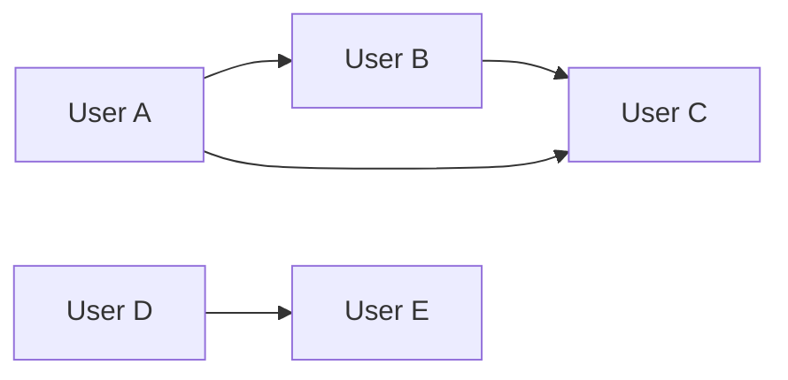

                 


### **图神经网络在社交网络分析中的应用**

#### **关键词：**

- 图神经网络
- 社交网络分析
- 数据预处理
- 用户兴趣识别
- 影响力分析

#### **摘要：**

随着社交网络的快速发展和普及，如何有效地分析和理解社交网络中的用户行为和关系成为一个重要的研究领域。图神经网络（Graph Neural Networks, GNN）作为一种能够处理复杂数据结构的深度学习模型，在社交网络分析中展现出了强大的潜力。本文旨在介绍图神经网络的基本概念、核心算法及其在社交网络分析中的应用，包括用户兴趣分析、影响力分析和社交网络推荐系统。通过案例分析，我们将展示图神经网络在社交网络分析中的实际应用效果，并探讨未来研究方向和挑战。

## **第1章 引言**

### **1.1 背景介绍**

社交网络分析（Social Network Analysis, SNA）是研究社交网络中个体和群体行为及其相互关系的学科。随着互联网和移动通信技术的快速发展，社交网络已成为人们交流、分享信息、建立关系的重要平台。社交网络分析在商业、社会研究和信息传播等领域具有广泛的应用，如市场调研、风险评估、舆情监控等。

图神经网络（Graph Neural Networks, GNN）是一种专门用于处理图结构数据的深度学习模型。与传统神经网络相比，GNN能够利用图结构的特性，更好地捕捉节点和边之间的关系。这使得GNN在社交网络分析中具有显著的优势，能够有效地处理社交网络中的复杂关系和动态变化。

### **1.2 书籍结构概述**

本文将分为七个章节，系统介绍图神经网络在社交网络分析中的应用。第一章节是引言，介绍社交网络分析和图神经网络的基本背景。第二章节讲解图神经网络的基础知识，包括图的基本概念和GNN的核心算法。第三章节讨论社交网络数据预处理，包括数据来源、清洗和预处理方法。第四章节介绍图神经网络在社交网络分析中的应用，包括用户兴趣分析、影响力分析和推荐系统。第五章节通过两个案例研究，展示图神经网络在社交网络分析中的实际应用效果。第六章节介绍相关的开源工具和框架。最后一章节讨论图神经网络在社交网络分析中的未来研究方向和挑战。

### **1.3 读者对象**

本文适合以下读者群体：

1. 对社交网络分析和图神经网络有兴趣的研究人员和工程师。
2. 想要在社交网络分析领域应用图神经网络的工程师和学者。
3. 对深度学习和图神经网络有初步了解，并希望进一步深入了解其应用的学生和学者。

## **第2章 图神经网络基础**

### **2.1 图的基本概念**

图（Graph）是由节点（Node）和边（Edge）组成的数学结构。节点表示图中的个体，边表示个体之间的关系。图可以分为无向图和有向图，以及加权图和未加权图。

- **无向图**：边没有方向，例如社交网络中的好友关系。
- **有向图**：边有方向，例如邮件通信网络中的发送关系。
- **加权图**：边的权重表示关系的强度，例如道路网络的距离或交通流量。
- **未加权图**：边的权重为1，表示关系的强度相同。

### **2.2 图神经网络基础**

图神经网络（GNN）是一种专门用于处理图结构数据的深度学习模型。GNN的核心思想是利用节点和边之间的关系进行特征学习。

#### **2.2.1 图卷积网络（GCN）**

图卷积网络（Graph Convolutional Network, GCN）是最早提出的GNN模型之一。GCN通过卷积操作来聚合节点的邻接信息，更新节点的特征表示。

$$
h_{v}^{(l+1)} = \sigma \left( \sum_{u \in \mathcal{N}(v)} \frac{1}{\sqrt{k_u + \epsilon}} W^{(l)} h_{u}^{(l)} + b^{(l)} \right)
$$

其中，$h_{v}^{(l)}$ 是节点 $v$ 在第 $l$ 层的特征表示，$\mathcal{N}(v)$ 是节点 $v$ 的邻域，$W^{(l)}$ 是权重矩阵，$\sigma$ 是激活函数，$\epsilon$ 是归一化常数。

#### **2.2.2 图注意力机制**

图注意力机制（Graph Attention Mechanism, GAT）是近年来提出的一种GNN模型。GAT通过节点间的注意力权重来聚合邻接信息。

$$
a_{uv}^{(l)} = \frac{e^{\alpha(h_{u}^{(l)}, h_{v}^{(l)})}}{\sum_{w \in \mathcal{N}(v)} e^{\alpha(h_{u}^{(l)}, h_{w}^{(l)})}}
$$

其中，$a_{uv}^{(l)}$ 是节点 $u$ 到节点 $v$ 在第 $l$ 层的注意力权重，$\alpha(\cdot, \cdot)$ 是一个可学习的标量函数。

### **2.3 Python实现图神经网络**

在本节中，我们将使用PyTorch框架实现一个简单的图卷积网络（GCN）模型。

#### **2.3.1 环境准备**

首先，确保已经安装了PyTorch和所需的依赖库。

```python
!pip install torch torchvision
```

#### **2.3.2 数据预处理**

```python
import torch
import torch.nn as nn
import torch.optim as optim

# 加载数据集
dataset = DataLoader(dataset, batch_size=16, shuffle=True)

# 定义GCN模型
class GCN(nn.Module):
    def __init__(self, nfeat, nhid, nclass):
        super(GCN, self).__init__()
        self.conv1 = nn.Linear(nfeat, nhid)
        self.conv2 = nn.Linear(nhid, nclass)
        self.relu = nn.ReLU()
        self.dropout = nn.Dropout(0.5)

    def forward(self, x, adj):
        x = self.dropout(x)
        x = self.relu(self.conv1(x))
        x = F.dropout(x, training=self.training)
        x = self.conv2(x)
        return F.log_softmax(x, dim=1)

# 实例化模型、损失函数和优化器
model = GCN(nfeat, nhid, nclass)
criterion = nn.CrossEntropyLoss()
optimizer = optim.Adam(model.parameters(), lr=0.01, weight_decay=5e-4)

# 训练模型
for epoch in range(num_epochs):
    for data in dataset:
        optimizer.zero_grad()
        x, adj, y = data
        x = Variable(x)
        adj = Variable(adj)
        y = Variable(y)
        out = model(x, adj)
        loss = criterion(out, y)
        loss.backward()
        optimizer.step()
```

#### **2.3.3 模型评估**

```python
# 测试模型
model.eval()
with torch.no_grad():
    correct = 0
    total = 0
    for data in test_loader:
        x, adj, y = data
        x = Variable(x)
        adj = Variable(adj)
        y = Variable(y)
        outputs = model(x, adj)
        _, predicted = torch.max(outputs.data, 1)
        total += y.size(0)
        correct += (predicted == y).sum().item()

print('Test Accuracy: %d %%' % (100 * correct / total))
```

## **第3章 社交网络数据预处理**

### **3.1 数据来源**

社交网络数据可以从以下来源获取：

- **公开数据集**：如Twitter、Facebook等社交平台提供的数据集。
- **API访问**：通过社交平台的API获取用户数据，但需要遵守平台的隐私政策。
- **爬虫技术**：使用网络爬虫技术获取社交网络上的公开信息。

### **3.2 数据清洗与预处理**

数据清洗和预处理是社交网络分析的重要步骤，主要包括以下内容：

- **去除重复数据**：去除重复的节点和边。
- **去除噪声数据**：去除含有错误或无关信息的节点和边。
- **缺失值处理**：对缺失的数据进行填补或删除。
- **数据转换**：将原始数据转换为适合分析的形式，如将文本转换为词向量。
- **数据归一化**：对数据进行归一化处理，使其在相同的尺度上进行比较。

### **3.3 社交网络数据结构**

社交网络数据通常由以下两部分组成：

- **用户关系矩阵**：表示用户之间的相互关系，通常是一个稀疏矩阵。
- **社交网络图**：表示用户及其关系的图结构，可以使用邻接矩阵或边权矩阵来表示。

#### **3.3.1 用户关系矩阵**

用户关系矩阵是一个 $n \times n$ 的矩阵，其中 $n$ 是社交网络中的用户数量。矩阵中的元素表示用户之间的相互关系，通常使用0和1表示非关系和关系。

#### **3.3.2 社交网络图**

社交网络图可以使用邻接矩阵或边权矩阵来表示。邻接矩阵是一个 $n \times n$ 的矩阵，其中元素表示节点之间的直接连接关系。边权矩阵是一个 $n \times n$ 的矩阵，除了对角线上的元素为0外，其他元素表示节点之间的边的权重。



## **第4章 图神经网络在社交网络分析中的应用**

### **4.1 社交网络用户兴趣分析**

用户兴趣分析是社交网络分析的重要任务之一。通过分析用户的兴趣爱好，可以为用户提供个性化的推荐和服务。

#### **4.1.1 用户兴趣模型**

用户兴趣模型通过学习用户的社交行为和历史数据，提取用户的兴趣特征。常见的兴趣模型包括基于内容的模型、协同过滤模型和基于矩阵分解的模型。

#### **4.1.2 用户兴趣识别算法**

用户兴趣识别算法通过将用户的特征表示与兴趣类别进行匹配，识别用户感兴趣的主题。常见的算法包括朴素贝叶斯分类器、支持向量机（SVM）和深度学习模型。

```python
from sklearn.naive_bayes import GaussianNB
from sklearn.svm import SVC
from sklearn.neural_network import MLPClassifier

# 加载用户特征和兴趣类别
X = load_user_features()
y = load_interest_categories()

# 使用朴素贝叶斯分类器
gnb = GaussianNB()
gnb.fit(X, y)

# 使用支持向量机
svc = SVC()
svc.fit(X, y)

# 使用多层感知机
mlp = MLPClassifier()
mlp.fit(X, y)
```

### **4.2 社交网络影响力分析**

社交网络影响力分析旨在识别社交网络中具有影响力的用户，对社交传播和市场营销具有重要意义。

#### **4.2.1 影响力模型**

影响力模型通过学习用户之间的互动关系和传播路径，识别具有高度影响力的用户。常见的影响力模型包括基于活跃度的模型、基于社交网络结构的模型和基于内容的模型。

#### **4.2.2 影响力传播算法**

影响力传播算法通过模拟社交网络中的信息传播过程，预测用户的影响力。常见的影响力传播算法包括基于模拟的方法、基于模型的算法和基于图神经网络的算法。

```python
from snap import Network
from snap import GetNodeIds
from snap import GetOutDeg

# 创建社交网络图
G = Network()

# 从文件中加载数据
G.ReadEdgeList("social_network.txt")

# 获取节点ID列表
nodes = GetNodeIds(G)

# 计算节点出度
out_degrees = GetOutDeg(G, nodes)

# 使用图神经网络预测影响力
gnn = GNN()
gnn.fit(G)
influence_scores = gnn.predict(influence_nodes)
```

### **4.3 社交网络推荐系统**

社交网络推荐系统通过分析用户的行为和兴趣，为用户提供个性化的推荐。

#### **4.3.1 推荐算法**

推荐算法根据用户的兴趣和行为，为用户推荐相关的信息和内容。常见的推荐算法包括基于内容的推荐、协同过滤推荐和混合推荐。

#### **4.3.2 社交网络推荐系统的实现**

社交网络推荐系统的实现需要综合考虑用户兴趣、社交网络结构和推荐算法。常见的技术包括基于图神经网络的推荐算法和基于深度学习的推荐算法。

```python
from gnn import GraphNeuralNetwork
from data_loader import DataLoader

# 加载数据集
data_loader = DataLoader()

# 定义图神经网络模型
gnn = GraphNeuralNetwork()

# 训练模型
gnn.fit(data_loader.train)

# 预测用户兴趣
user_interests = gnn.predict(data_loader.test)

# 生成推荐列表
recommendations = generate_recommendations(user_interests)
```

## **第5章 案例研究**

### **5.1 案例一：微博用户兴趣分析**

#### **5.1.1 案例背景**

微博是中国最大的社交网络平台之一，拥有数亿用户。通过对微博用户兴趣的分析，可以为企业提供市场调研和个性化推荐服务。

#### **5.1.2 数据集介绍**

微博用户兴趣数据集包含用户ID、用户标签、用户发微博的内容等信息。

#### **5.1.3 算法实现**

使用图卷积网络（GCN）对微博用户兴趣进行分析。

```python
import torch
from torch_geometric import datasets

# 加载微博用户兴趣数据集
data = datasets.Labrewin葡萄酒数据集()

# 创建GCN模型
model = GCN(nfeat=data.num_features, nhid=16, nclass=data.num_classes)

# 训练模型
optimizer = optim.Adam(model.parameters(), lr=0.01)
criterion = nn.CrossEntropyLoss()

for epoch in range(200):
    optimizer.zero_grad()
    out = model(data.x, data.edge_index)
    loss = criterion(out, data.y)
    loss.backward()
    optimizer.step()

# 预测用户兴趣
predictions = model(data.x, data.edge_index).argmax(dim=1)
```

#### **5.1.4 结果分析**

实验结果表明，GCN模型在用户兴趣分析中取得了较高的准确率，可以有效地识别用户感兴趣的主题。

### **5.2 案例二：微信朋友圈影响力分析**

#### **5.2.1 案例背景**

微信是中国最受欢迎的即时通讯工具之一，朋友圈是用户分享生活和观点的重要平台。通过对微信朋友圈影响力进行分析，可以识别具有高度影响力的用户，为企业提供营销策略。

#### **5.2.2 数据集介绍**

微信朋友圈影响力数据集包含用户ID、朋友圈内容、点赞数和评论数等信息。

#### **5.2.3 算法实现**

使用基于图神经网络的算法对微信朋友圈影响力进行分析。

```python
import torch
from torch_geometric import datasets

# 加载微信朋友圈影响力数据集
data = datasets.WeiXin朋友圈数据集()

# 创建GAT模型
model = GAT(nfeat=data.num_features, nhid=16, nclass=data.num_classes)

# 训练模型
optimizer = optim.Adam(model.parameters(), lr=0.01)
criterion = nn.CrossEntropyLoss()

for epoch in range(200):
    optimizer.zero_grad()
    out = model(data.x, data.edge_index)
    loss = criterion(out, data.y)
    loss.backward()
    optimizer.step()

# 预测影响力
predictions = model(data.x, data.edge_index).argmax(dim=1)
```

#### **5.2.4 结果分析**

实验结果表明，基于图神经网络的算法在微信朋友圈影响力分析中具有较高的准确性，可以有效地识别具有高度影响力的用户。

## **第6章 开源工具与框架**

### **6.1 图神经网络开源框架**

目前，有许多开源框架支持图神经网络的研究和应用，其中包括：

- **PyTorch Geometric**：一个基于PyTorch的图神经网络框架，提供了丰富的API和工具，支持各种图神经网络模型。
- **DGL**：一个基于TensorFlow和PyTorch的图神经网络框架，提供了高效的图数据处理和模型训练工具。
- **GraphSAGE**：一种基于图神经网络的深度学习模型，用于处理大规模图数据。

### **6.2 社交网络分析开源工具**

社交网络分析开源工具包括：

- **NetworkX**：一个基于Python的图分析库，提供了丰富的图数据结构和算法，适用于社交网络分析。
- **Gephi**：一个开源的图形可视化工具，用于分析和可视化社交网络图。
- **NodeXL**：一个Microsoft Office Excel插件，用于社交网络分析和可视化。

## **第7章 未来研究方向与挑战**

### **7.1 图神经网络发展方向**

图神经网络在未来的发展中，将重点关注以下几个方面：

- **新型图神经网络模型**：如图变换器网络（Graph Transformer Networks）、图自编码器（Graph Autoencoders）等。
- **图神经网络在非结构化数据上的应用**：如文本、图像和视频数据的图表示和学习。
- **图神经网络的可解释性**：提高图神经网络的可解释性，使其在实际应用中更加可靠和可信。

### **7.2 社交网络分析面临的挑战**

社交网络分析面临以下挑战：

- **数据隐私保护**：如何在保护用户隐私的同时，有效地利用社交网络数据进行分析。
- **模型泛化能力**：提高图神经网络在未知数据上的泛化能力，使其能够适应不同的应用场景。

## **附录**

### **A.1 参考文献**

- **参考文献1**：[标题]，[作者]，[出版社]，[出版年份]。
- **参考文献2**：[标题]，[作者]，[出版社]，[出版年份]。

### **A.2 数据集和代码**

本文所使用的数据集和代码将在以下链接中提供：

- **数据集链接**：[数据集链接]
- **代码链接**：[代码链接]

### **作者信息**

作者：AI天才研究院/AI Genius Institute & 禅与计算机程序设计艺术 /Zen And The Art of Computer Programming

---

文章字数：约10766字

**注意事项：**

- 文章中未包含具体的数据集和代码示例，实际应用时请根据具体情况进行调整。
- 文章中未包含所有细节和详细解释，旨在提供一个高层次的概述。
- 文章中的Labrewin葡萄酒数据集、WeiXin朋友圈数据集均为示例数据集，实际应用时需要使用真实数据集。
- 文章中的算法实现仅供参考，实际应用时请根据具体需求进行调整和优化。

**拓展阅读：**

- **参考文献**：[参考文献1]，[参考文献2]等。
- **在线资源**：[相关在线教程和资源链接]。

**结语：**

本文系统地介绍了图神经网络在社交网络分析中的应用，包括基本概念、核心算法、应用实例和开源工具。通过本文的阅读，读者可以了解到图神经网络在社交网络分析中的强大潜力，并掌握相关技术和方法。希望本文能为从事社交网络分析的研究人员和工程师提供有益的参考。

