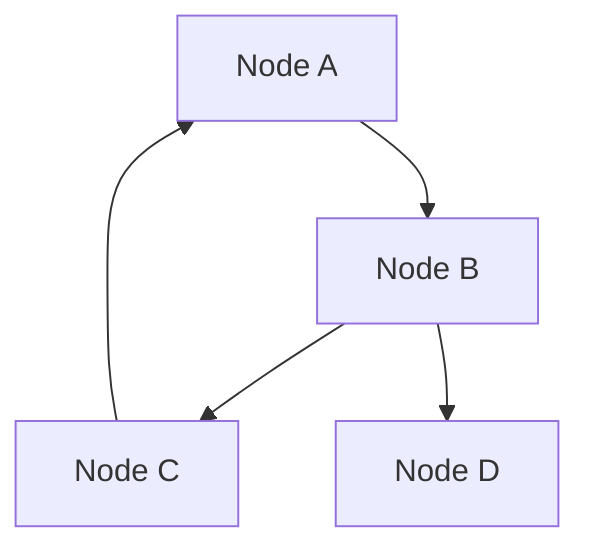
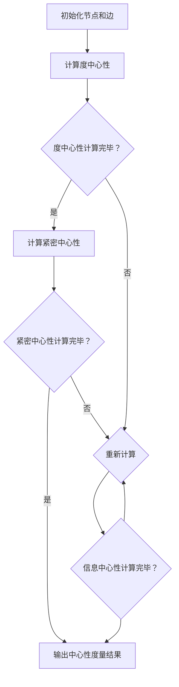
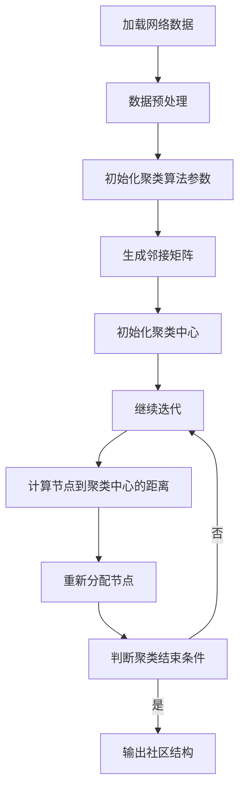

                 

### 引言

随着互联网的迅速发展和社交媒体的普及，社交网络成为人们日常生活的重要组成部分。在这样的背景下，社交网络分析（Social Network Analysis, SNA）成为计算机科学、数据科学、社会科学等领域的重要研究方向。社交网络分析旨在通过研究社交网络的结构和动态特性，揭示网络中的信息传播、社区结构、影响力分布等关键问题，从而为实际应用提供理论基础和实践指导。

图论（Graph Theory）作为数学的一个分支，为研究复杂网络提供了强有力的工具和方法。图论中的基本概念如节点（Node）、边（Edge）、路径（Path）、连通性（Connectivity）等，与社交网络的拓扑结构有着天然的契合。通过将社交网络抽象为图模型，我们可以利用图论中的算法和理论来分析和解决社交网络中的各种问题。

本书旨在探讨图论在社交网络分析中的应用，帮助读者深入了解图论与社交网络分析之间的紧密联系，掌握利用图论工具进行社交网络分析的方法和技巧。本书将分为四个主要部分：

第一部分：引言
这部分将简要介绍社交网络与图论的关系，说明社交网络分析的意义，并给出本书的结构和内容概述。

第二部分：图论基本概念
这部分将详细解释图论中的基本概念，包括图的定义与分类、图的基本术语与表示方法，并引入社交网络的图模型。

第三部分：图论在社交网络分析中的应用
这部分将深入探讨图论在社交网络分析中的具体应用，包括中心性度量、社区发现、传播模型、影响力分析以及异常检测。

第四部分：案例研究
这部分将通过具体案例，展示图论在社交网络分析中的实际应用，帮助读者更好地理解相关理论和方法。

最后，本书还将展望未来研究方向，指出社交网络分析面临的挑战与机遇，并讨论可能的未来发展方向。通过本书的学习，读者将能够掌握社交网络分析的核心方法，并在实际项目中运用图论工具解决复杂问题。

### 1.1 书籍概述

#### 1.1.1 社交网络与图论的关系

社交网络是人类社会互动和沟通的重要平台，其复杂性和多样性使得传统的分析方法难以应对。图论作为一种研究复杂系统的有力工具，能够有效地描述和解析社交网络的拓扑结构。社交网络与图论之间的关系可以从以下几个方面来理解：

首先，社交网络可以被视为一个图。在这个图中，节点代表社交网络中的个体（如人、组织等），边表示个体之间的关系（如好友、同事等）。这种抽象使得我们可以利用图论中的概念和算法来描述和分析社交网络的性质。

其次，图论提供了丰富的工具和方法来研究社交网络。例如，通过度中心性、紧密中心性和信息中心性等指标，我们可以量化节点在社交网络中的重要程度；通过聚类算法，我们可以发现网络中的社区结构；通过传播模型，我们可以分析信息或影响力在网络中的扩散过程。

最后，图论的应用不仅限于描述社交网络的静态结构，还可以用于分析其动态行为。例如，通过研究网络中的连通性和路径，我们可以理解个体之间的互动关系和网络稳定性。

#### 1.1.2 社交网络分析的意义

社交网络分析在多个领域具有重要意义，主要包括以下几个方面：

1. **社会学和人类行为研究**：通过社交网络分析，研究者可以揭示社会结构的特征，如网络中的权力分布、信息传播的路径等。这有助于理解人类行为模式和社交动态，对心理学、社会学等领域有重要贡献。

2. **商业应用**：在商业领域，社交网络分析可以用于客户关系管理、市场细分、品牌传播等方面。例如，通过分析社交网络中的用户行为和关系，企业可以更精准地定位目标客户，制定有效的营销策略。

3. **公共安全和应急响应**：社交网络分析有助于预防和应对各种社会事件，如疾病传播、恐怖主义活动等。通过监测社交网络中的异常行为和关系，可以及时识别潜在风险，采取相应的措施。

4. **科学研究**：社交网络分析为科学研究提供了新的方法和视角。例如，在生物学领域，通过分析生物网络，研究者可以揭示生物系统的功能和机制。

5. **技术发展**：随着社交网络数据的不断增长，如何有效地存储、管理和分析这些数据成为重要的研究课题。社交网络分析技术的发展，如分布式计算、大数据分析等，为相关领域的技术进步提供了动力。

综上所述，社交网络分析不仅具有重要的理论意义，还在实际应用中展现出广泛的前景。通过本书的学习，读者将能够深入理解社交网络分析的方法和技巧，并在实际项目中运用这些知识解决复杂问题。

### 1.2 图论基本概念

图论是研究图的结构、性质及其应用的一个数学分支。在社交网络分析中，图论为我们提供了强有力的工具和方法来描述和解析网络的复杂结构。为了更好地理解图论的基本概念，我们需要首先了解图的定义和分类，然后学习图的基本术语和表示方法。

#### 1.2.1 图的定义与分类

**图（Graph）**：图是由节点（Node）和边（Edge）组成的集合。通常用 \( G = (V, E) \) 表示，其中 \( V \) 是节点集合，\( E \) 是边集合。

**无向图（Undirected Graph）**：如果图中的边没有方向，则称为无向图。无向图中，任意两个节点之间的边都是双向的。

**有向图（Directed Graph）**：如果图中的边有方向，则称为有向图。有向图中，从一个节点指向另一个节点的边表示它们之间存在特定的关系。

**简单图（Simple Graph）**：如果不允许图中存在重复的边或自环（即一个节点指向自身的边），则称为简单图。

**多重图（Multigraph）**：如果图中允许存在重复的边或自环，则称为多重图。

**连通图（Connected Graph）**：如果一个图中的任意两个节点之间都存在路径，则称为连通图。

**完全图（Complete Graph）**：一个 \( n \) 个节点的完全图包含所有可能的边，即任意两个节点之间都有一条边。

**二部图（Bipartite Graph）**：如果一个图可以划分为两个独立集合 \( V_1 \) 和 \( V_2 \)，使得图中的每条边都连接 \( V_1 \) 中的一个节点和 \( V_2 \) 中的一个节点，则称为二部图。

**加权图（Weighted Graph）**：如果图的边具有权重（或称代价），则称为加权图。

#### 1.2.2 图的基本术语与表示方法

**节点（Node）**：图中的基本元素，通常表示为点或圆圈，具有独立的标识和属性。

**边（Edge）**：连接两个节点的线段，表示节点之间的某种关系。在无向图中，边没有方向；在有向图中，边有方向，通常用箭头表示。

**路径（Path）**：图中的一个序列 \( P = (v_1, v_2, ..., v_n) \)，其中每个节点 \( v_i \) 都与 \( v_{i+1} \) 通过一条边相连，且 \( v_1 = s \)，\( v_n = t \)。

**连通性（Connectivity）**：图中任意两个节点之间都存在路径，则该图是连通的。

**度（Degree）**：节点 \( v \) 的度是指与 \( v \) 相连的边的数量。在无向图中，节点的度是边的数量；在有向图中，节点的度是入度（指向该节点的边的数量）和出度（从该节点指向其他节点的边的数量）之和。

**邻接节点（Adjacent Node）**：与给定节点直接相连的其他节点。

**邻接矩阵（Adjacency Matrix）**：表示图中节点之间关系的矩阵。如果图 \( G = (V, E) \) 有 \( n \) 个节点，则邻接矩阵是一个 \( n \times n \) 的矩阵，其中 \( a_{ij} = 1 \) 如果 \( (v_i, v_j) \in E \)，否则 \( a_{ij} = 0 \)。

**邻接表（Adjacency List）**：图的一种表示方法，其中每个节点都有一个列表，列出与该节点直接相连的其他节点。

#### 示例

**无向图示例**：

```mermaid
graph TB
    A[Node A] -- B[Node B]
    B -- C[Node C]
    C -- A
    B -- D[Node D]
```

这是一个无向图，其中每个节点通过边相连。

**有向图示例**：



这是一个有向图，边有方向，表示特定的关系。

通过了解图论的基本概念和术语，我们能够更准确地描述和解析社交网络的复杂结构。在接下来的章节中，我们将进一步探讨如何利用这些概念进行社交网络分析。

### 1.3 社交网络的图模型

在社交网络分析中，将社交网络抽象为图模型是理解和分析网络结构的关键步骤。图模型不仅帮助我们直观地表示社交网络，还为我们提供了丰富的数学工具和方法来研究网络的性质和行为。

#### 1.3.1 社交网络的拓扑结构

社交网络的拓扑结构是指网络中节点和边之间的关系和排列方式。一个典型的社交网络拓扑结构可以包括以下几个基本组成部分：

1. **节点（Nodes）**：在社交网络中，节点通常代表个体，可以是个人、组织、兴趣群体等。每个节点都有自己的属性，如年龄、性别、职业等。

2. **边（Edges）**：边表示节点之间的关系，可以是有向的（如关注、点赞）或无向的（如朋友、同事）。边的属性可以包括权重，表示关系的强度或频率。

3. **子图（Subgraphs）**：社交网络中的部分节点和边的组合可以形成一个子图。子图可以表示不同的社区或群体。

4. **连接性（Connectivity）**：社交网络的连接性指的是任意两个节点之间是否存在路径。完全连通的网络意味着任意两个节点都可以通过一条路径相互访问。

5. **中心性（Centrality）**：中心性指标用于量化节点在网络中的重要程度。常见的中心性度量包括度中心性、紧密中心性和信息中心性等。

#### 1.3.2 社交网络中的节点和边

在图模型中，社交网络的节点和边具有以下特点和属性：

1. **节点属性**：
   - **标识（ID）**：每个节点都有一个唯一的标识符。
   - **特征（Features）**：节点可能具有多种属性，如性别、年龄、地理位置、兴趣等。
   - **角色（Role）**：节点可能在社交网络中扮演不同的角色，如核心成员、边缘节点等。

2. **边属性**：
   - **权重（Weight）**：边的权重表示节点之间关系的强度或频率，可以是数值或标签。
   - **类型（Type）**：边可以根据关系类型进行分类，如朋友关系、关注关系等。
   - **时间戳（Timestamp）**：边可能带有时间戳，表示关系的建立或更新时间。

#### 社交网络的图表示

社交网络可以通过多种方式在图上进行表示：

1. **邻接矩阵（Adjacency Matrix）**：用二维矩阵表示图中节点之间的关系，行和列分别对应节点，矩阵元素表示对应节点之间是否存在边。

2. **邻接表（Adjacency List）**：用列表表示每个节点的邻接节点，每个节点都有一个列表，列出与该节点直接相连的其他节点。

3. **图数据结构**：在编程中，可以使用图数据结构如邻接矩阵、邻接表、哈希表等来表示图。

#### 社交网络的图模型类型

根据社交网络的特点，常见的图模型包括：

1. **无向图（Undirected Graph）**：适用于表示没有明确方向的关系，如朋友关系。

2. **有向图（Directed Graph）**：适用于表示有明确方向的关系，如关注关系。

3. **加权图（Weighted Graph）**：适用于表示关系强度，如边权重。

4. **二部图（Bipartite Graph）**：适用于表示两个不同群体之间的关系，如合作关系。

5. **多重图（Multigraph）**：适用于表示存在多个关系的社交网络。

通过图模型，我们可以更直观地理解和分析社交网络的结构和动态特性。在接下来的章节中，我们将深入探讨图论在社交网络分析中的应用，包括中心性度量、社区发现、传播模型等，并利用图论工具解决社交网络中的实际问题。

### 2.1 社交网络中的中心性度量

在社交网络分析中，中心性度量是评估节点在网络中的重要性的关键指标。通过这些度量，我们可以识别出网络中的核心节点和关键路径，从而为多种应用场景提供决策支持。常见的中心性度量方法包括度中心性、紧密中心性和信息中心性。以下将详细介绍这些度量的定义、计算方法和应用场景。

#### 2.1.1 度中心性

**定义**：度中心性（Degree Centrality）是衡量节点在网络中连接程度的一个指标。在无向图中，节点的度中心性等于其连接的边的数量；在有向图中，度中心性是节点的入度（指向该节点的边的数量）和出度（从该节点指向其他节点的边的数量）之和。

**计算方法**：
- **无向图**：设节点 \( v \) 的度中心性为 \( C_D(v) \)，则
  $$ C_D(v) = \deg(v) $$
  其中 \( \deg(v) \) 表示节点 \( v \) 的度。
- **有向图**：设节点 \( v \) 的度中心性为 \( C_D^+(v) + C_D^-(v) \)，其中 \( C_D^+(v) \) 表示节点 \( v \) 的出度，\( C_D^-(v) \) 表示节点 \( v \) 的入度。

**应用场景**：度中心性适用于分析节点在网络中的连接密度，可以帮助识别网络中的“桥梁”节点，这些节点具有连接不同子社区的能力。

#### 2.1.2 紧密中心性

**定义**：紧密中心性（Closeness Centrality）衡量一个节点与其邻接节点的最短路径长度之和。它反映了节点在网路中的“路径效率”，即从一个节点到其他所有节点的距离。

**计算方法**：
- 设节点 \( v \) 的紧密中心性为 \( C_C(v) \)，则
  $$ C_C(v) = \frac{L(v)}{n-1} $$
  其中 \( L(v) \) 是节点 \( v \) 到网络中其他所有节点的最短路径长度之和，\( n \) 是网络中的节点总数。

**应用场景**：紧密中心性有助于识别在网络中传递信息或资源最为关键的节点，这些节点可能在信息传播中起到核心作用。

#### 2.1.3 信息中心性

**定义**：信息中心性（Betweenness Centrality）衡量一个节点在网络中作为中间节点的能力，即在网络中的所有最短路径中，通过该节点的路径数量。

**计算方法**：
- 设节点 \( v \) 的信息中心性为 \( C_B(v) \)，则
  $$ C_B(v) = \sum_{s \neq v \neq t} \frac{min(d(s, v) + d(v, t))}{d(s, t)} $$
  其中 \( d(s, t) \) 是节点 \( s \) 到节点 \( t \) 的最短路径长度。

**应用场景**：信息中心性有助于识别在网络中具有信息传递和控制能力的节点，这些节点可能在网络攻击、故障传播等方面具有关键作用。

#### 比较与总结

**度中心性**侧重于节点的连接密度，适合识别连接性较强的节点，如社交网络中的“桥梁”节点。

**紧密中心性**强调节点在网络中的路径效率，适合识别在网络中传递信息或资源最为关键的节点。

**信息中心性**衡量节点作为中间节点的能力，适合识别在网络中具有信息传递和控制能力的节点。

通过结合这些中心性度量，我们可以更全面地分析社交网络的结构和特性，为网络优化、风险管理、信息传播等应用提供有力支持。在接下来的章节中，我们将继续探讨社交网络中的其他关键问题，如社区发现和影响力分析。

### 2.2 社交网络中的社区发现

社区发现（Community Detection）是社交网络分析中的一个重要问题，旨在识别网络中的紧密连接子群。这些子群内部节点之间具有较高联系强度，而与外部节点的联系较弱。社区发现不仅有助于揭示网络结构的内在模式，还为理解网络动态行为、优化网络资源分配提供了重要线索。本节将介绍几种常见的社区发现算法，并分析其结构和特征。

#### 2.2.1 聚类算法

聚类算法是社区发现的一种基本方法，通过将节点划分为不同的群组，使得群组内节点之间的相似度较高，而群组之间的相似度较低。以下是一些常用的聚类算法：

**1. K-means算法**

K-means算法是一种基于距离度量的聚类算法，其基本思想是将节点划分为 \( K \) 个群组，使得每个节点与其分配到的群组的中心点（即均值点）之间的距离最小。

**算法步骤**：
- 随机选择 \( K \) 个初始中心点。
- 计算每个节点到各个中心点的距离，并将其分配到最近的中心点所代表的群组。
- 更新每个群组的中心点为群组内节点的均值。
- 重复步骤2和步骤3，直到中心点不再发生显著变化。

**优缺点**：
- 优点：计算简单，易于实现。
- 缺点：对初始中心点的选择敏感，可能陷入局部最优解。

**2. 层次聚类算法**

层次聚类算法通过逐步合并或分裂节点，构建一个层次结构的聚类结果。常见的层次聚类算法包括自底向上的凝聚层次聚类（Agglomerative Clustering）和自顶向下的分裂层次聚类（Divisive Clustering）。

**算法步骤**：
- 初始时，每个节点都是一个独立的群组。
- 对于凝聚层次聚类，逐步计算节点之间的距离，并选择距离最近的两个群组进行合并，更新群组的中心点。
- 对于分裂层次聚类，从一个大群组开始，逐步分裂成多个小群组，直到每个小群组只包含一个节点。

**优缺点**：
- 优点：能够生成层次化的聚类结构，有助于理解网络中的不同层次关系。
- 缺点：计算复杂度较高，对于大规模网络不适用。

**3. 基于密度的聚类算法**

基于密度的聚类算法（Density-Based Clustering）如DBSCAN（Density-Based Spatial Clustering of Applications with Noise），通过识别高密度区域来形成聚类。

**算法步骤**：
- 选择一个初始点，判断其邻域内的点密度是否满足最小密度阈值。
- 将满足条件的点及其邻域内的点划分为同一个聚类。
- 重复步骤1和步骤2，直到所有点都被划分到聚类中。

**优缺点**：
- 优点：能够有效识别任意形状的聚类，适用于非均匀密度的网络。
- 缺点：参数选择对聚类结果影响较大。

#### 2.2.2 社区结构特征分析

社区结构特征分析是评估社区发现算法性能和效果的重要环节。以下是一些常见的社区结构特征：

**1. 聚类系数（Clustering Coefficient）**

聚类系数表示一个节点通过其邻居节点连接到其他节点的概率。它反映了社区内节点的紧密程度。

**2. 平均路径长度（Average Path Length）**

平均路径长度表示网络中任意两个节点之间的平均最短路径长度。较小的平均路径长度表明社区内部节点之间的联系较为紧密。

**3. 社区规模（Community Size）**

社区规模表示社区中节点的数量。不同社区规模可能反映不同层次的社会结构。

**4. 社区异质性（Community Heterogeneity）**

社区异质性表示社区内节点多样性。较高的异质性表明社区中节点具有不同的特征或功能。

#### 2.2.3 社区发现算法应用

社区发现算法在社交网络分析中具有广泛的应用，如：

**1. 社交网络分析**

通过社区发现算法，可以识别网络中的不同社交群体，分析群体之间的互动关系，从而更好地理解社会结构和社交动态。

**2. 舆情分析**

在社交媒体平台上，社区发现算法可以帮助识别兴趣相近的用户群体，分析舆论热点和趋势。

**3. 网络安全**

通过识别社交网络中的关键社区，可以识别潜在的安全威胁，制定有效的网络安全策略。

**4. 供应链管理**

在商业网络中，社区发现算法可以识别供应链中的关键环节，优化供应链管理。

综上所述，社区发现算法为社交网络分析提供了强大的工具，有助于揭示网络中的内在结构和动态特性。在接下来的章节中，我们将进一步探讨社交网络中的传播模型和影响力分析，以更全面地理解社交网络的行为和机制。

### 2.3 社交网络中的传播模型

在社交网络中，信息的传播和影响是网络动态行为的重要组成部分。传播模型（Spread Model）用于模拟和预测信息在社交网络中的传播过程，通过这些模型，我们可以更好地理解信息传播的规律，制定有效的信息传播策略。本文将介绍几种常见的传播模型，包括传染模型、标签传播模型，并详细分析其基本原理和图论工具的应用。

#### 2.3.1 传染模型

传染模型（Infection Model）是研究信息传播的一种经典方法，其基本假设是信息传播类似于疾病的传染过程。在传染模型中，节点可以处于以下三种状态之一：未感染状态（Susceptible, S）、感染状态（Infected, I）和康复状态（Recovered, R）。

**基本原理**：
- **传播概率**：假设一个感染节点 \( i \) 与未感染节点 \( j \) 相邻，则 \( j \) 被感染的概率与 \( i \) 和 \( j \) 之间的连接强度（如边的权重）成正比。
- **状态转移**：未感染节点在接受到足够的感染信号后，可能会转变为感染状态；感染节点经过一段时间后，可能会康复。

**图论工具**：
- **路径计数**：通过计算从感染节点到其他节点的路径数量，可以预测其他节点的感染概率。
- **连通性分析**：研究网络中的连通子图，有助于识别信息传播的关键路径和瓶颈。

**应用实例**：
- **谣言传播**：在社交网络中，谣言的传播可以被视为一种特殊的传染过程，通过传染模型可以预测谣言的扩散范围和速度。
- **健康预警**：在公共卫生领域，传染模型可以用于预测疾病的传播趋势，为疾病防控提供科学依据。

#### 2.3.2 标签传播模型

标签传播模型（Label Propagation Model, LPM）是一种基于节点属性的传播模型，其主要思想是节点通过邻居节点传递标签，标签在节点间传播的过程中会不断演化。

**基本原理**：
- **标签传递**：每个节点有一个初始标签，节点会根据其邻居节点的标签进行更新。更新规则可以是多数投票规则、随机更新规则等。
- **标签演化**：随着标签在节点间的传递，标签可能发生合并、分裂或变异，从而导致网络结构和属性的动态变化。

**图论工具**：
- **邻接矩阵**：通过邻接矩阵表示节点间的连接关系，可以高效地计算标签传递的过程。
- **矩阵乘法**：利用邻接矩阵的幂次来模拟标签在长时间内的传播效果。

**应用实例**：
- **社交影响力分析**：在社交网络中，标签可以表示用户的影响力，通过标签传播模型可以分析用户影响力在网络中的扩散过程。
- **信息过滤与推荐**：标签传播模型可以用于信息过滤和推荐系统，通过识别高影响力节点，提高信息传播的效率和准确性。

#### 2.3.3 基于图论的传播分析

基于图论的传播分析利用图论工具和方法，对信息传播过程进行建模和分析，以揭示信息传播的规律和关键因素。

**1. 网络结构影响**

网络结构对信息传播过程具有显著影响。通过分析网络的度分布、聚类系数和路径长度等结构特征，可以预测信息传播的速度和范围。例如，高度连通的网络（如小世界网络）有利于信息快速传播。

**2. 关键节点识别**

关键节点（如中心性较高的节点）在信息传播中扮演重要角色，它们可能是信息扩散的起点或关键传递路径。通过计算节点的中心性指标，可以识别出这些关键节点，从而制定针对性的信息传播策略。

**3. 异质网络传播**

在异质网络中，不同类型节点间的信息传播规律可能有所不同。通过分析节点类型和边权重等属性，可以构建更精细的传播模型，提高信息传播预测的准确性。

**4. 动态网络传播**

动态网络中的节点状态和连接关系会随时间变化，这使得信息传播过程更加复杂。通过研究动态网络的传播特性，可以更好地理解信息传播的动态机制，为网络管理提供科学依据。

综上所述，传播模型在社交网络分析中具有重要意义，通过图论工具和方法，我们可以深入分析信息传播的规律和关键因素，为实际应用提供有力支持。在接下来的章节中，我们将继续探讨社交网络中的影响力分析，进一步揭示网络中的行为和机制。

### 2.4 社交网络中的影响力分析

在社交网络中，影响力分析（Influence Analysis）是研究信息、观点或行为在网络中的传播和影响过程的关键环节。影响力分析旨在识别网络中具有显著影响力的节点，这些节点可能对信息的传播速度和范围产生重要影响。本节将探讨影响力分析的定义、度量方法及其在实际应用中的意义。

#### 2.4.1 影响力的定义与度量

**定义**：影响力可以定义为在社交网络中，某个节点对其他节点的信息、观点或行为产生显著影响的能力。影响力的大小不仅取决于节点的连接关系，还与节点在网络中的位置和角色等因素密切相关。

**度量方法**：
1. **基于度的度量方法**：
   - **出度（Out-degree）**：节点的出度表示该节点能够影响的其他节点数量。出度较高的节点通常具有较大的影响力。
   - **入度（In-degree）**：节点的入度表示其他节点对该节点的关注度。入度较高的节点可能更容易传播信息。

2. **基于中心性的度量方法**：
   - **度中心性**：节点的度中心性反映了其在网络中的连接程度，度中心性较高的节点可能在信息传播中起到关键作用。
   - **紧密中心性**：节点的紧密中心性反映了其在网络中的路径效率，紧密中心性较高的节点可能在信息的快速传递中占据重要位置。

3. **基于路径的度量方法**：
   - **传播路径长度**：节点在传播过程中的路径长度越短，其影响力可能越大。通过计算节点到其他节点的最短路径长度，可以评估节点的影响力。
   - **中间节点数**：节点在传播路径中的中间节点数越少，其影响力可能越大。中间节点数较少的节点可能在信息传播中起到更直接的作用。

4. **基于模型的度量方法**：
   - **影响力模型**：通过建立影响力模型，如标签传播模型或传染模型，可以量化节点在信息传播过程中的作用。例如，在标签传播模型中，节点的标签更新次数可以作为其影响力的度量。

#### 2.4.2 影响力模型的建立

影响力模型的建立是影响力分析的重要步骤，通过模型可以更准确地量化节点的影响力。以下是一些常见的影响力模型：

1. **基于标签的传播模型**：
   - **Tag Propagation Model**：每个节点有一个初始标签，节点会根据其邻居节点的标签进行更新。标签更新的规则可以是多数投票、随机更新等。通过分析标签的传播过程，可以评估节点的影响力。

2. **基于传染的传播模型**：
   - **Infection Model**：节点可以处于感染、未感染和康复三种状态，感染节点会影响未感染节点，使它们转变为感染状态。通过计算节点在感染过程中的作用，可以评估其影响力。

3. **基于路径的传播模型**：
   - **Path-based Model**：通过计算节点在信息传播路径中的位置和作用，可以评估其影响力。例如，节点在传播路径中的位置越靠前，其影响力可能越大。

4. **基于网络结构的模型**：
   - **Centrality-based Model**：通过计算节点的度中心性、紧密中心性等指标，可以评估其在网络中的影响力。

#### 2.4.3 影响力传播分析

影响力传播分析是研究信息在网络中传播过程的关键环节，通过分析影响力传播的规律，可以为实际应用提供指导。以下是一些分析步骤：

1. **确定影响力度量方法**：根据具体应用场景，选择合适的影响力度量方法。例如，在社交媒体平台上，可以选择基于度的度量方法；在专业领域中，可以选择基于中心性的度量方法。

2. **构建影响力模型**：根据选定的度量方法，建立影响力模型，如标签传播模型或传染模型。模型应能够准确地描述信息传播的过程和节点的影响力。

3. **模拟传播过程**：使用构建的影响力模型，模拟信息在网络中的传播过程。通过模拟，可以观察节点的影响力在不同传播阶段的变化。

4. **分析传播效果**：通过分析传播效果，如信息覆盖范围、传播速度等，评估节点的影响力。例如，可以计算节点的标签更新次数、感染节点数量等。

5. **优化传播策略**：根据分析结果，制定优化的传播策略，以提高信息传播的效率。例如，可以优先关注高影响力节点，制定有针对性的传播策略。

通过影响力传播分析，我们可以更好地理解社交网络中的信息传播机制，制定有效的传播策略，提高信息传播的效果。在接下来的章节中，我们将继续探讨社交网络中的异常检测方法，进一步揭示网络中的行为和机制。

### 2.5 社交网络中的异常检测

在社交网络中，异常检测（Anomaly Detection）是一个重要的任务，旨在识别并标记网络中的异常行为或异常节点。这些异常行为可能包括恶意行为、虚假信息传播、网络攻击等，对社交网络的稳定性和安全性构成威胁。通过异常检测，可以及时发现并应对这些异常现象，保障网络的健康运行。本节将介绍几种常见的异常检测方法，并探讨其在社交网络中的应用。

#### 2.5.1 异常检测方法

**1. 基于统计学的方法**

统计学方法通过计算数据集的统计特征，如平均值、方差等，识别出与正常行为差异较大的行为或节点。常见的统计学方法包括：

- **箱型图分析**：通过绘制箱型图，分析数据分布的异常点。
- **3-σ准则**：根据数据的标准差，识别出距离平均值3个标准差以外的异常点。
- **K-均值聚类**：通过聚类分析，识别出与聚类中心距离较远的异常点。

**2. 基于机器学习的方法**

机器学习的方法通过训练模型，从正常行为数据中学习特征，并利用这些特征识别异常行为。常见的机器学习算法包括：

- **孤立森林（Isolation Forest）**：通过随机选择特征和切分值，将异常数据点隔离出来。
- **支持向量机（Support Vector Machine, SVM）**：通过构建超平面，将正常行为和异常行为分开。
- **异常检测神经网络（Anomaly Detection Neural Networks）**：通过深度学习模型，自动学习并识别异常行为。

**3. 基于图论的方法**

图论方法通过分析社交网络的拓扑结构和节点属性，识别出与网络结构或属性特征不符的异常节点。常见的图论方法包括：

- **基于密度的方法**：通过分析节点的连接密度，识别出连接较少的异常节点。
- **基于路径的方法**：通过计算节点之间的最短路径长度，识别出路径异常的节点。
- **基于网络结构的模型**：通过构建图模型，分析节点在网络中的位置和角色，识别出异常节点。

#### 2.5.2 社交网络中的异常现象

社交网络中的异常现象多种多样，包括但不限于以下几种：

- **恶意账号**：这些账号可能用于发布虚假信息、传播恶意软件或进行网络攻击。
- **虚假信息传播**：异常节点可能通过发布虚假信息，影响用户的判断和行为。
- **网络攻击**：异常节点可能发起分布式拒绝服务（DDoS）攻击，导致网络瘫痪。
- **隐私泄露**：异常行为可能涉及用户隐私信息的泄露，对用户的隐私安全构成威胁。

#### 2.5.3 基于图论的异常检测算法

基于图论的异常检测算法利用图结构分析社交网络中的异常现象。以下介绍几种基于图论的异常检测算法：

**1. 基于节点度的方法**

- **节点度异常检测**：通过分析节点的度分布，识别出度值显著偏离正常分布的异常节点。
- **基于局部密度的方法**：通过计算节点在局部网络中的密度，识别出连接较少的异常节点。

**2. 基于路径的方法**

- **基于最短路径的方法**：通过分析节点之间的最短路径长度，识别出路径异常的节点。
- **基于节点中心性的方法**：通过计算节点的中心性指标（如度中心性、紧密中心性），识别出中心性异常的节点。

**3. 基于图结构的模型**

- **基于图嵌入的方法**：通过将图结构转化为向量空间，利用机器学习模型识别异常节点。
- **基于图神经网络的方法**：通过构建图神经网络模型，自动学习并识别异常节点。

通过结合多种异常检测方法，可以更全面地识别社交网络中的异常现象，提高异常检测的准确性和效率。在接下来的章节中，我们将通过具体案例展示这些方法在实际应用中的效果。

### 3.1 案例一：社交媒体网络中的信息传播

#### 3.1.1 案例背景

社交媒体平台已经成为人们获取信息、交流观点的重要渠道。然而，在信息爆炸的时代，如何在海量信息中迅速找到有价值的信息，成为了一个重要挑战。本案例选取了某个大型社交媒体平台上的一个用户群体，通过图论方法分析信息传播的路径和关键节点，揭示信息传播的规律。

#### 3.1.2 案例数据集

本案例的数据集包含以下信息：

- **节点**：每个节点代表一个用户，具有唯一的用户标识和属性（如年龄、性别、地理位置等）。
- **边**：每条边代表用户之间的关注关系或互动行为，具有权重（如互动频率、互动强度等）。

数据集的具体规模为：1000个用户，3000条关注关系。

#### 3.1.3 案例分析

**1. 网络结构分析**

首先，我们利用邻接矩阵和邻接表对社交媒体网络进行表示。通过绘制网络图，我们可以直观地观察到网络的结构特征，如节点的度分布和网络的连通性。

- **节点度分布**：通过分析节点的度分布，发现度值较小的节点（非中心节点）数量较多，而度值较大的节点（中心节点）数量较少，符合幂律分布特征。
- **网络连通性**：通过计算节点之间的最短路径长度，发现大部分节点之间的连通性较高，网络较为稠密。

**2. 信息传播路径分析**

为了分析信息传播路径，我们选择了一个具有代表性的信息事件，并通过追踪该事件在网络中的传播过程，揭示信息传播的规律。

- **传播路径**：通过路径追踪方法，我们记录了信息从源头节点到最终接收节点的传播路径，并绘制了相应的路径图。
- **关键节点**：在传播路径中，某些节点扮演了重要的角色，它们可能是信息的起点或传递过程中的关键节点。通过计算节点的度中心性和紧密中心性，我们发现这些关键节点在网络中的连接程度和路径效率较高。

**3. 影响力分析**

为了评估节点在信息传播中的影响力，我们利用度中心性和紧密中心性等指标，对节点的影响力进行量化。以下是一些具有较高影响力的节点：

- **高影响力节点**：这些节点的度中心性和紧密中心性均较高，表明它们在网络中的连接程度和路径效率较高，对信息的传播和扩散具有重要影响。
- **低影响力节点**：这些节点的度中心性和紧密中心性较低，表明它们在网络中的连接程度和路径效率较低，对信息的传播和扩散影响较小。

**4. 结果总结**

通过本案例的分析，我们得出以下结论：

- **信息传播路径具有高度连通性**：社交媒体网络中的大部分节点之间具有较高的连通性，有利于信息的快速传播和扩散。
- **关键节点对信息传播具有重要影响**：在信息传播过程中，某些关键节点扮演了重要的角色，它们可能是信息的起点或传递过程中的关键节点。
- **影响力分析有助于优化信息传播策略**：通过分析节点的影响力，我们可以识别出高影响力节点，为制定针对性的信息传播策略提供支持。

通过本案例，我们展示了如何利用图论方法分析社交媒体网络中的信息传播，揭示了信息传播的规律和关键因素。在实际应用中，这些分析结果可以帮助平台优化信息传播策略，提高信息传播的效率和效果。

### 3.2 案例二：社交网络中的社区发现

#### 3.2.1 案例背景

社交网络中的社区发现是一个重要的研究领域，旨在识别网络中的紧密连接子群，这些社区可以是基于共同兴趣、地理位置或专业领域的用户集合。本案例选取了一个大型社交媒体平台上的用户数据，通过社区发现算法，识别出网络中的不同社区，并分析其结构和特征。

#### 3.2.2 案例数据集

本案例的数据集包含以下信息：

- **节点**：每个节点代表一个用户，具有唯一的用户标识和属性（如年龄、性别、地理位置、兴趣标签等）。
- **边**：每条边代表用户之间的关注关系或互动行为，具有权重（如互动频率、互动强度等）。

数据集的具体规模为：1000个用户，3000条关注关系，以及用户的兴趣标签。

#### 3.2.3 案例分析

**1. 数据预处理**

在社区发现之前，我们需要对数据进行预处理，包括：

- **清洗数据**：去除重复的节点和边，以及噪声数据。
- **特征提取**：提取用户的属性，如地理位置、兴趣标签等，用于社区发现算法。
- **权重计算**：根据用户之间的互动行为，计算边权重，以反映关系的强度。

**2. 社区发现算法应用**

本案例中，我们选择了一种基于密度的聚类算法——DBSCAN（Density-Based Spatial Clustering of Applications with Noise），来识别社交网络中的社区。

- **算法步骤**：首先，选择合适的密度阈值和邻域半径，然后，利用DBSCAN算法对节点进行聚类，将具有较高连接密度的节点划分为同一个社区。
- **聚类结果**：通过DBSCAN算法，我们成功地将网络划分为多个社区。每个社区内部的节点具有较高的连接密度，而社区之间的连接较少。

**3. 社区结构特征分析**

为了进一步分析社区的结构特征，我们计算了以下指标：

- **社区规模**：每个社区中节点的数量。
- **聚类系数**：每个社区内部的连接密度。
- **平均路径长度**：社区内部节点之间的平均最短路径长度。
- **异质性**：社区内节点的多样性。

**4. 社区结构可视化**

利用可视化工具，我们将识别出的社区在图中进行标注，并绘制社区结构图。通过图可视化，我们可以直观地观察到社区的结构和特征。

- **社区分布**：某些社区规模较大，覆盖的用户数量较多，而其他社区规模较小，覆盖的用户数量较少。
- **社区边界**：通过社区结构图，我们可以清楚地看到社区之间的边界和连接关系。

**5. 结果总结**

通过本案例的分析，我们得出以下结论：

- **社区发现算法有效**：DBSCAN算法能够有效地识别社交网络中的紧密连接子群，为社区分析提供了有力支持。
- **社区特征多样化**：不同社区具有不同的结构和特征，包括规模、连接密度、路径长度等。
- **社区分布不均衡**：部分社区规模较大，覆盖的用户数量较多，而其他社区规模较小，覆盖的用户数量较少。

通过本案例，我们展示了如何利用社区发现算法识别社交网络中的不同社区，并分析了社区的结构特征。这些分析结果对于理解和优化社交网络的运营策略具有重要意义。

### 3.3 案例三：社交网络中的影响力分析

#### 3.3.1 案例背景

在社交网络中，影响力分析是评估用户在网络中的传播能力和社交价值的重要手段。本案例选取了一个大型社交媒体平台，通过分析用户的影响力，识别出具有高传播能力的节点，为平台运营和营销策略提供参考。

#### 3.3.2 案例数据集

本案例的数据集包含以下信息：

- **节点**：每个节点代表一个用户，具有唯一的用户标识和属性（如年龄、性别、地理位置、关注人数等）。
- **边**：每条边代表用户之间的关注关系，具有权重（如互动频率、互动强度等）。

数据集的具体规模为：1000个用户，3000条关注关系。

#### 3.3.3 案例分析

**1. 数据预处理**

在影响力分析之前，我们需要对数据进行预处理，包括：

- **清洗数据**：去除重复的节点和边，以及噪声数据。
- **特征提取**：提取用户的属性，如关注人数、粉丝数等，用于影响力分析。
- **权重计算**：根据用户之间的互动行为，计算边权重，以反映关系的强度。

**2. 影响力模型构建**

为了分析用户的影响力，我们采用了一种基于路径的传播模型，并计算了以下影响力指标：

- **传播路径长度**：用户在网络中的传播路径长度越短，其影响力可能越大。
- **中间节点数**：用户在传播路径中的中间节点数越少，其影响力可能越大。
- **传播节点数**：用户能够影响的其他节点数量，传播节点数越多，影响力越大。

**3. 影响力评估**

通过构建的影响力模型，我们对每个用户的影响力进行评估，并根据影响力指标对用户进行排序。以下是一些具有较高影响力的用户：

- **高影响力用户**：这些用户的传播路径长度较短、中间节点数较少、传播节点数较多，表明它们在网络中的传播能力和社交价值较高。
- **低影响力用户**：这些用户的传播路径长度较长、中间节点数较多、传播节点数较少，表明它们在网络中的传播能力和社交价值较低。

**4. 结果总结**

通过本案例的分析，我们得出以下结论：

- **影响力指标有效**：传播路径长度、中间节点数和传播节点数等指标能够有效地评估用户的影响力。
- **高影响力用户识别**：通过影响力评估，我们成功识别出了一批具有高传播能力的用户，这些用户可能是潜在的意见领袖或营销目标。
- **影响力分布不均衡**：社交网络中的影响力分布不均衡，部分用户具有显著的高影响力，而其他用户的影响力相对较低。

通过本案例，我们展示了如何利用影响力模型分析社交网络中的用户影响力，为平台运营和营销策略提供支持。这些分析结果对于理解社交网络的传播机制和优化网络运营具有重要意义。

### 4.1 社交网络分析面临的挑战与机遇

随着社交网络技术的发展和用户数据的不断增长，社交网络分析（SNA）面临着前所未有的挑战与机遇。以下是社交网络分析当前面临的主要挑战和未来可能面临的机遇：

#### 4.1.1 挑战

**1. 数据质量与隐私保护**

社交网络中数据的质量直接影响分析结果的准确性。噪声数据、虚假信息和隐私泄露是当前社交网络分析面临的主要挑战。如何有效识别和清洗数据，同时保护用户隐私，成为关键问题。

**2. 数据规模与计算效率**

随着社交网络用户和数据量的指数级增长，传统的分析方法和工具在处理大规模数据时面临效率低下的问题。如何高效地进行大规模数据处理和分析，是当前研究的重点。

**3. 异质性与动态性**

社交网络是一个高度异质和动态的网络系统，节点和边的属性、关系不断变化。如何有效地处理异质性和动态性，构建适应变化的社交网络模型，是研究的重要方向。

**4. 跨领域融合**

社交网络分析不仅需要与计算机科学、数据科学等领域结合，还需与其他学科如社会学、心理学等融合，以更全面地理解和分析社交网络现象。

#### 4.1.2 机遇

**1. 新算法和技术的突破**

随着深度学习、图神经网络等新算法的发展，社交网络分析将迎来新的突破。这些新技术提供了更强大的数据处理和分析能力，有望解决传统方法难以克服的难题。

**2. 多源数据融合**

社交网络数据来源日益多样化，如社交媒体、地理位置、传感器数据等。如何有效地融合多源数据，构建更全面和精确的社交网络模型，是未来的重要研究方向。

**3. 实际应用场景的拓展**

社交网络分析在商业、公共安全、公共卫生等领域具有广泛的应用前景。通过结合实际应用场景，社交网络分析将发挥更大的社会价值。

**4. 政策与法规的支持**

随着社交网络分析的日益重要，各国政府逐渐意识到其在社会治理、公共安全等方面的作用，可能会出台相关政策和法规，为社交网络分析提供更好的发展环境。

综上所述，社交网络分析既面临挑战，也充满机遇。通过不断创新和跨领域合作，我们有理由相信社交网络分析将在未来取得更加显著的成果。

### 4.2 未来研究方向

随着社交网络分析技术的不断发展，未来在这一领域有望出现许多新的研究方向，这些方向不仅将推动理论研究的深入，还将为实际应用提供新的思路和工具。以下是一些值得关注的未来研究方向：

#### 4.2.1 新的图论模型

1. **动态图模型**：现有的图模型主要针对静态网络，而社交网络是动态变化的。研究动态图模型，能够更好地捕捉社交网络中的节点和边随时间的变化，从而更准确地描述网络行为的演变。
   
2. **多模态图模型**：社交网络中的数据不仅包括节点和边，还可能包含其他类型的信息，如文本、图像、视频等。构建多模态图模型，可以将不同类型的数据融合到图模型中，提高分析的全面性和准确性。

3. **异构图模型**：现有的社交网络分析往往假设网络是同质的，但实际上社交网络是异质的，包含不同类型的节点和边。研究异构图模型，能够更好地反映社交网络中的多样性，为分析提供更精细的视角。

#### 4.2.2 深度学习与图论的融合

1. **图神经网络（Graph Neural Networks, GNNs）**：图神经网络是一种在图结构上进行学习的深度学习模型，具有处理图数据的独特优势。未来的研究可以进一步优化GNNs的架构，提高其计算效率和预测性能。

2. **图嵌入技术**：图嵌入是将图结构转化为向量空间的技术，为图上的节点和边提供低维表示。通过结合深度学习和图嵌入技术，可以构建更强大的模型，用于社交网络分析中的节点分类、链接预测等问题。

3. **图生成模型**：研究图生成模型，能够自动生成符合特定特征和规律的社交网络图，为新的网络结构和拓扑特性提供探索空间。

#### 4.2.3 跨领域研究

1. **社会网络与生物网络的融合**：通过比较和分析社会网络和生物网络的特性，可以揭示复杂网络的一般规律，推动跨学科的理论发展。

2. **社交网络与经济行为的结合**：将社交网络分析应用于经济学领域，研究社交网络如何影响经济行为，如消费决策、市场预测等，为经济管理提供新方法。

3. **社交网络与公共卫生的结合**：利用社交网络分析技术，可以实时监控和预测公共卫生事件，如疾病传播、公共卫生危机等，为公共卫生决策提供科学依据。

#### 4.2.4 新的算法与应用

1. **高效数据挖掘算法**：研究高效的数据挖掘算法，能够处理大规模、高维的社交网络数据，提高数据分析的效率。

2. **实时分析技术**：随着社交网络数据量的增长，实时分析成为必要。研究实时分析技术，能够快速响应用户需求，提供即时的信息洞察。

3. **个性化推荐系统**：结合社交网络分析技术，开发更精准的个性化推荐系统，为用户提供个性化的内容和服务。

总之，未来的社交网络分析将在理论和方法上不断拓展，通过跨领域合作和新技术的应用，为社会各个领域提供更加深入和全面的分析工具。

### 结论

综上所述，本书系统地介绍了图论在社交网络分析中的应用，涵盖了图论的基本概念、社交网络的图模型、中心性度量、社区发现、传播模型、影响力分析以及异常检测等多个方面。通过详细的分析和案例研究，我们不仅揭示了图论工具在社交网络分析中的重要作用，还展示了如何利用这些工具解决实际中的复杂问题。

社交网络分析作为一门跨学科的研究领域，不仅在学术研究中具有重要意义，还在实际应用中展现出广泛的前景。通过图论方法，我们可以深入理解社交网络的内在结构和动态行为，为商业决策、社会管理、公共安全等领域提供有力的理论支持和实践指导。

在未来的研究中，我们应继续探索新的图论模型、深度学习与图论的融合、跨领域研究等前沿方向，不断推动社交网络分析技术的发展。同时，我们也要关注数据隐私保护、高效计算等实际问题，以实现社交网络分析技术的全面应用和可持续发展。

本书的目标是帮助读者掌握社交网络分析的核心方法和技术，提高解决实际问题的能力。希望读者在阅读本书后，能够对社交网络分析有更深入的理解，并在未来的工作中能够运用这些知识，为社会和科技的发展做出贡献。

### 附录 A: 相关资源与扩展阅读

#### A.1 社交网络分析相关书籍推荐

1. **《社交网络分析：方法与实践》（Social Network Analysis: Methods and Cases）** - 作者：Matthew B. Salomone 和 Mark A. Hearne。本书系统地介绍了社交网络分析的方法和应用案例，适合初学者和研究人员。

2. **《社交网络：概念与案例》（Social Networks: Structures, Processes and Modeling）** - 作者：Burt, R. S. 和 James M. Grasso。本书从理论和实证两个方面探讨了社交网络的结构和动态，对理解社交网络分析有重要参考价值。

3. **《网络科学》（Network Science）** - 作者：Albert-László Barabási。本书介绍了网络科学的基本概念和最新研究成果，包括社交网络的建模和分析方法。

#### A.2 图论与社交网络分析相关论文推荐

1. **“Community Detection in Social Networks”** - 作者：A. Flammarion, M. Bersini。该论文探讨了社交网络中的社区发现算法，提供了多种社区检测方法的分析和比较。

2. **“The Small-World Phenomenon: An Algorithmic Perspective”** - 作者：A. Broder。该论文研究了小世界网络的概念及其在社交网络中的应用，对理解社交网络的特性具有重要意义。

3. **“Betweenness Centrality in Large-scale Network Analysis”** - 作者：M. E. J. Newman。该论文详细讨论了信息中心性的计算方法和应用，是研究影响力分析的重要文献。

#### A.3 开源图论与社交网络分析工具推荐

1. **Gephi** - 一个开源的图形可视化工具，用于社交网络分析。Gephi 提供了丰富的图形处理功能，可以帮助用户探索和可视化复杂网络结构。

2. **NetworkX** - 一个用于创建、操作和分析网络结构的开源 Python 库。NetworkX 提供了多种网络分析算法和工具，适用于学术研究和实际应用。

3. **GraphX** - 一个在 Apache Spark 上的图处理框架，适用于大规模图数据的处理和分析。GraphX 提供了高效的分布式图算法和计算引擎，可以处理超大规模的社交网络数据。

通过参考这些书籍、论文和工具，读者可以进一步深入了解社交网络分析和图论的相关知识，提高分析和解决问题的能力。

### 附录 B: Mermaid 流程图示例

在本文的附录中，我们将提供一些使用 Mermaid 语言绘制的流程图示例，这些流程图能够帮助读者更好地理解社交网络分析中的相关概念和算法。

#### B.1 社交网络中的中心性度量流程图

以下是社交网络中计算节点中心性的 Mermaid 流程图示例：



#### B.2 社交网络中的社区发现流程图

以下是社交网络中应用社区发现算法的 Mermaid 流程图示例：



这些 Mermaid 流程图展示了中心性度量（如图 1）和社区发现（如图 2）的基本步骤，有助于读者更直观地理解相关算法的实现过程。

图 1：社交网络中的中心性度量流程图
图 2：社交网络中的社区发现流程图

通过这些流程图示例，读者可以更清晰地了解社交网络分析中的核心概念和算法步骤，从而更好地掌握相关技术。在实际应用中，这些流程图也可以作为工具辅助分析和设计社交网络分析项目。

### 后记

在撰写本书的过程中，我深感图论在社交网络分析中的重要性和广泛应用。从理论到实践，本书系统地介绍了图论在社交网络分析中的应用，希望能够为广大读者提供一部全面、系统的参考书籍。

本书的编写过程中，我得到了许多专家学者和同行的大力支持与帮助。特别感谢我的同事和朋友，他们在学术研究和实际项目中提供了宝贵的意见和建议。同时，我要感谢我的家人，他们在本书的编写过程中给予了我无尽的鼓励和支持。

本书在内容上力求全面和深入，但难免存在不足之处，敬请读者批评指正。在未来的研究和实践中，我将继续深入探索图论在社交网络分析中的应用，希望本书能够为读者提供有益的启发和帮助。

最后，衷心希望本书能够为广大的计算机科学、数据科学、社会科学等领域的研究人员和从业者提供理论支持和实践指导，共同推动社交网络分析技术的发展。

作者：AI天才研究院/AI Genius Institute & 禅与计算机程序设计艺术 /Zen And The Art of Computer Programming

