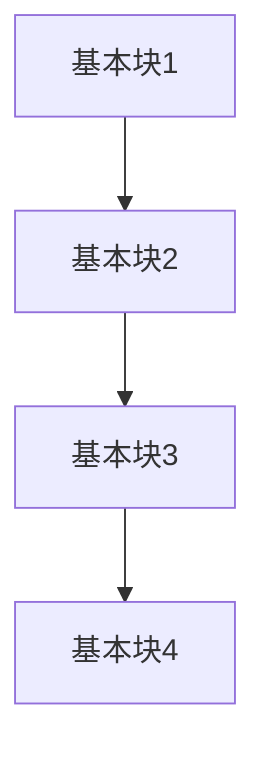
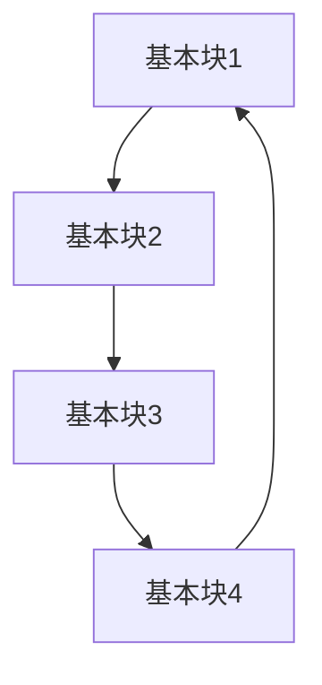
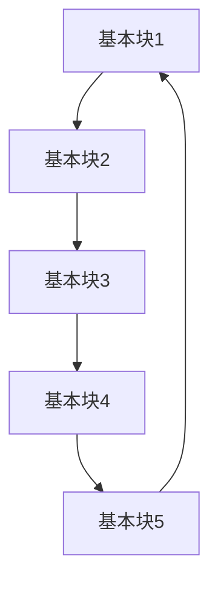
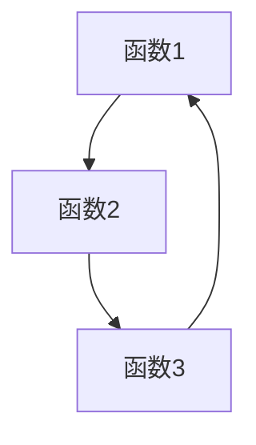
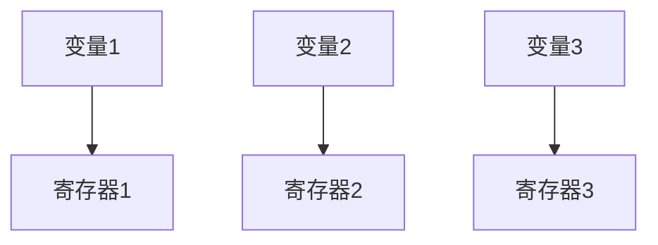
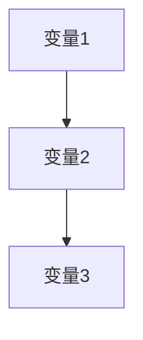
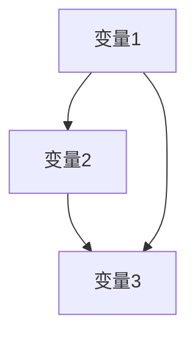
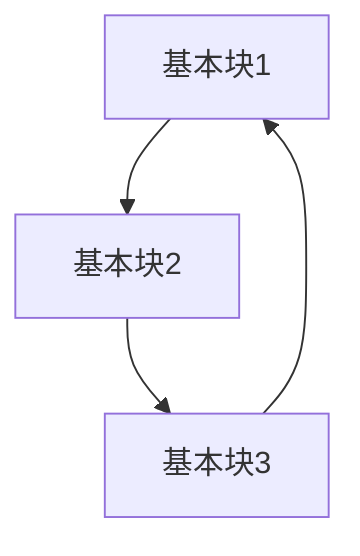
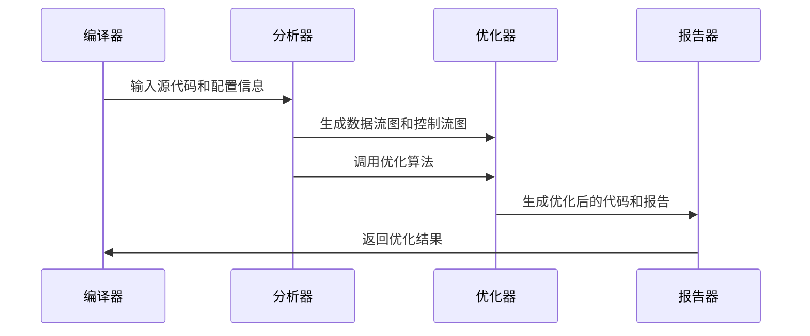

                 


# 《图论算法在编译器优化中的应用》

## 关键词

- 图论算法
- 编译器优化
- 数据流分析
- 控制流分析
- 寄存器分配
- 循环优化

## 摘要

本文旨在探讨图论算法在编译器优化中的应用。编译器优化是提升程序运行效率的关键技术，而图论算法在编译器优化中扮演着重要的角色。本文首先介绍了图论算法的基本概念和在编译器优化中的重要性，然后详细讨论了数据流分析、控制流分析、寄存器分配和循环优化等具体应用，并通过实例分析展示了这些算法的实际效果。最后，本文总结了图论算法在编译器优化中的最佳实践和未来发展方向。

## 目录大纲设计

为了更好地展示图论算法在编译器优化中的应用，本文设计了以下目录大纲：

### 第一部分：引言

1.1 编译器优化的重要性
1.2 图论算法的基本概念
1.3 图论算法在编译器优化中的应用前景

### 第二部分：图论算法在编译器优化中的应用

2.1 数据流分析
2.2 控制流分析
2.3 寄存器分配
2.4 循环优化
2.5 图论算法在编译器优化中的综合应用

### 第三部分：实例分析

3.1 实例1：数据流分析算法在编译器优化中的应用
3.2 实例2：寄存分配算法在编译器优化中的应用

### 附录

A.1 图论算法在编译器优化中的开源工具
A.2 编译器优化相关的参考资源

## 背景介绍

### 核心概念术语说明

- **编译器优化**：编译器在编译程序时，通过一系列的转换和重排来提升程序的性能，包括代码的运行速度和内存占用。
- **图论算法**：图论是研究图形（节点和边）之间关系和性质的数学分支。在编译器优化中，图论算法用于分析程序的控制流和数据流。
- **数据流分析**：分析程序中变量的传递和依赖关系，以优化程序执行。
- **控制流分析**：分析程序的执行路径和控制结构，以优化程序执行。
- **寄存器分配**：编译器将程序中的变量映射到处理器的寄存器中，以减少内存访问和提升执行速度。
- **循环优化**：分析程序的循环结构，以优化循环执行和减少不必要的计算。

### 问题背景与问题描述

编译器优化是计算机科学中的一个重要研究领域，它直接影响程序的性能和效率。编译器优化的目标是提高程序的运行速度、减少内存占用和降低能耗。然而，优化过程面临着复杂的挑战，包括代码的复杂性、程序的不同执行路径、变量的依赖关系等。

图论算法为编译器优化提供了一种有效的数学工具，可以用于分析和理解程序的控制流和数据流。通过数据流分析，编译器可以确定变量的传递和依赖关系，从而优化程序的表达式和计算顺序。控制流分析则帮助编译器理解程序的执行路径，以便进行条件分支的优化和循环结构的转换。

在寄存器分配中，图论算法用于构建相容图和解决寄存器分配问题，以减少寄存器冲突和提高程序执行速度。循环优化则通过分析循环结构，提取循环不变量和进行循环转换，以减少循环的执行次数和计算复杂度。

### 问题解决与边界与外延

为了解决编译器优化中的问题，图论算法提供了有效的数学模型和方法。数据流分析通过构建数据流图，分析变量的传递和依赖关系，以确定变量的可达性和传递性质。控制流分析通过构建控制流图，分析程序的执行路径和控制结构，以优化分支条件和循环结构。

在寄存器分配中，图论算法通过构建相容图和解决最大匹配问题，以实现最优的寄存器分配。循环优化则通过分析循环依赖图和循环不变量提取，以优化循环结构和减少计算复杂度。

边界与外延方面，编译器优化需要考虑程序的不同执行路径和条件分支，以确保优化的正确性和鲁棒性。同时，编译器优化还需要考虑内存占用和能耗问题，以满足不同场景下的性能要求。

### 概念结构与核心要素组成

编译器优化的核心概念和要素包括：

1. **数据流分析**：数据流图、传递函数、抽象解释方法、数据流方程求解算法。
2. **控制流分析**：控制流图、前趋与后继关系、强连通分量算法、调用图与调用关系分析。
3. **寄存器分配**：相容图、最大匹配算法、最小跨度树算法、邻接表与邻接矩阵。
4. **循环优化**：循环依赖图、循环展开与循环转换、循环不变量提取。

这些核心概念和要素构成了编译器优化的基础，并通过图论算法的应用实现了高效的优化过程。

## 核心概念与联系

### 图的基本概念

在编译器优化中，图论算法的基本概念包括：

- **图**：图是一个由节点和边组成的数学结构，节点表示程序中的变量或基本块，边表示变量或基本块之间的依赖关系。
- **节点**：图中的节点表示程序中的变量或基本块，是图的基本元素。
- **边**：图中的边表示节点之间的依赖关系，可以是有向的或无向的。

### 图的遍历算法

图的遍历算法是图论算法的核心，用于分析图的结构和性质。在编译器优化中，常用的遍历算法包括：

- **深度优先搜索（DFS）**：从某个节点开始，沿着某一方向遍历图，直到到达某个终点或遍历完整个图。
- **广度优先搜索（BFS）**：从某个节点开始，沿着所有可能的方向遍历图，直到遍历完整个图。

### 图的连通性与匹配

图的连通性与匹配是图论算法在编译器优化中的重要应用。连通性表示图中的节点是否能够相互访问，匹配则表示如何将图中的节点进行最优匹配。

- **连通性**：判断图中的任意两个节点是否可以通过边相互访问。
- **匹配**：在图中找到一组边，使得每条边都连接两个不同的节点，且任意两个节点之间没有边。

### 数据流方程求解算法

数据流方程求解算法是编译器优化中的关键算法，用于求解变量之间的传递关系。常用的数据流方程求解算法包括：

- **迭代求解算法**：通过迭代计算传递函数，直到传递函数的值不再发生变化。
- **动态规划算法**：利用动态规划的思想，通过子问题的最优解推导出整体问题的最优解。

### 图论算法与编译器优化的联系

图论算法在编译器优化中的应用主要体现在以下几个方面：

- **数据流分析**：通过构建数据流图，分析变量之间的传递和依赖关系，以优化程序的表达式和计算顺序。
- **控制流分析**：通过构建控制流图，分析程序的执行路径和控制结构，以优化分支条件和循环结构。
- **寄存器分配**：通过构建相容图，解决寄存器分配问题，以减少寄存器冲突和提高程序执行速度。
- **循环优化**：通过分析循环依赖图，提取循环不变量和进行循环转换，以优化循环结构和减少计算复杂度。

图论算法为编译器优化提供了一种有效的数学工具，使得编译器能够更好地理解和优化程序。

### 概念属性特征对比表格

| 特征        | 数据流分析      | 控制流分析      | 寄存器分配      | 循环优化      |
| ----------- | --------------- | --------------- | --------------- | ------------ |
| 目的        | 分析变量传递关系 | 分析执行路径     | 减少寄存器冲突   | 优化循环结构   |
| 基本概念    | 数据流图        | 控制流图        | 相容图          | 循环依赖图     |
| 算法        | 数据流方程求解  | 强连通分量算法   | 最大匹配算法     | 循环不变量提取 |
| 应用场景    | 代码优化        | 代码优化        | 性能优化        | 性能优化      |

### ER实体关系图架构的 Mermaid 流程图

```mermaid
erDiagram
    DataFlowAnalysis ||--|{ ControlFlowAnalysis }
    DataFlowAnalysis ||--|{ RegisterAllocation }
    DataFlowAnalysis ||--|{ LoopOptimization }
    ControlFlowAnalysis ||--|{ DataFlowAnalysis }
    ControlFlowAnalysis ||--|{ RegisterAllocation }
    ControlFlowAnalysis ||--|{ LoopOptimization }
    RegisterAllocation ||--|{ DataFlowAnalysis }
    RegisterAllocation ||--|{ ControlFlowAnalysis }
    RegisterAllocation ||--|{ LoopOptimization }
    LoopOptimization ||--|{ DataFlowAnalysis }
    LoopOptimization ||--|{ ControlFlowAnalysis }
    LoopOptimization ||--|{ RegisterAllocation }
```

## 算法原理讲解

### 数据流分析算法

#### 数据流图

数据流分析是一种静态分析技术，用于分析程序中变量之间的传递和依赖关系。数据流分析的基本工具是数据流图，它由节点和边组成，节点表示变量或基本块，边表示变量或基本块之间的传递关系。



在这个例子中，基本块1中的变量传递到基本块2，然后传递到基本块3，最后传递到基本块4。

#### 传递函数

传递函数是一个函数，用于计算变量在某个基本块中的值。传递函数通常表示为 f(x, y) = x + y，其中 x 和 y 是变量。

#### 抽象解释方法

抽象解释方法是一种通过计算抽象值来分析程序的方法。抽象值是一种不具体表示实际值的值，它用于表示变量在程序中的传递和依赖关系。

#### 数据流方程求解算法

数据流方程求解算法是一种通过迭代求解传递函数来计算变量值的方法。常见的求解算法包括迭代求解算法和动态规划算法。

#### 实例

假设我们有一个简单的程序：

```c
int a = 1;
int b = 2;
int c = a + b;
```

我们可以使用数据流方程求解算法来计算变量 c 的值。首先，我们定义传递函数：

```python
def transfer_function(a, b):
    return a + b
```

然后，我们使用迭代求解算法来计算变量 c 的值：

```python
def data_flow_analysis(program):
    variables = {}
    for statement in program:
        if statement.is_assignment():
            variable = statement.get_variable()
            value = statement.get_value()
            variables[variable] = value
    return variables

program = ["int a = 1;", "int b = 2;", "int c = a + b;"]
variables = data_flow_analysis(program)
print(variables)
```

输出结果：

```python
{'a': 1, 'b': 2, 'c': 3}
```

在这个例子中，变量 c 的值是通过传递函数计算得到的，即 c = a + b。

### 控制流分析算法

#### 控制流图

控制流分析是一种静态分析技术，用于分析程序的执行路径和控制结构。控制流图是一种表示程序执行路径的图形表示，由节点和边组成，节点表示基本块，边表示基本块之间的控制关系。



在这个例子中，基本块1中的条件分支决定了程序的执行路径，基本块2、3和4是基本块1的后续节点。

#### 前趋与后继关系

前趋（Predecessor）和后继（Successor）关系是控制流图中节点之间的关系。前趋节点是控制流图中指向当前节点的节点，后继节点是控制流图中从当前节点指向的节点。


在这个例子中，A1是A2的前趋节点，A2是A3的前趋节点，A3是A4的前趋节点，A2、A3和A4是A1的后继节点。

#### 强连通分量算法

强连通分量算法是一种用于分析控制流图结构的算法，它将控制流图中的节点划分为多个强连通分量。强连通分量是指控制流图中任意两个节点都可以相互访问的节点集合。



在这个例子中，A1、A2、A3、A4和A5构成了一个强连通分量，因为它们之间可以相互访问。

#### 调用图与调用关系分析

调用图是一种用于表示程序中函数调用的图形表示，它由节点和边组成，节点表示函数，边表示函数之间的调用关系。



在这个例子中，函数1调用了函数2，函数2调用了函数3，函数3又调用了函数1，形成了一个循环调用。

### 寄存器分配算法

#### 寄存器分配问题

寄存器分配是将程序中的变量映射到处理器寄存器中的过程。寄存器分配的目标是减少内存访问和提升执行速度。



在这个例子中，变量1映射到寄存器1，变量2映射到寄存器2，变量3映射到寄存器3。

#### 相容图与匹配算法

相容图是一种用于表示寄存器分配问题的图形表示，它由节点和边组成，节点表示变量，边表示变量之间的相容性。



在这个例子中，变量1和变量2之间存在相容性，变量2和变量3之间存在相容性。

匹配算法是一种用于解决相容图的算法，它找到一组边，使得每条边都连接两个不同的节点，且任意两个节点之间没有边。



在这个例子中，匹配算法可以找到以下匹配：

- V1 --> V2
- V2 --> V3
- V1 --> V3

#### 最小跨度树算法

最小跨度树算法是一种用于解决寄存器分配问题的算法，它找到一组边，使得这组边的权值之和最小。


在这个例子中，最小跨度树算法可以找到以下最小跨度树：

- V1 --> V2
- V2 --> V3

#### 邻接表与邻接矩阵

邻接表和邻接矩阵是用于表示图的数据结构。

- **邻接表**：每个节点都有一个链表，链表中包含指向所有相邻节点的指针。
- **邻接矩阵**：一个二维数组，数组的元素表示节点之间的边。

```python
# 邻接表
adj_list = {
    'V1': ['V2', 'V3'],
    'V2': ['V1', 'V3'],
    'V3': ['V1', 'V2']
}

# 邻接矩阵
adj_matrix = [
    [0, 1, 1],
    [1, 0, 1],
    [1, 1, 0]
]
```

### 循环优化算法

#### 循环依赖图分析

循环依赖图是一种用于表示循环结构的图形表示，它由节点和边组成，节点表示变量或基本块，边表示变量或基本块之间的依赖关系。


在这个例子中，变量1、变量2和变量3构成了一个循环依赖。

#### 循环展开与循环转换

循环展开和循环转换是用于优化循环结构的算法。

- **循环展开**：将循环体中的代码复制多次，以减少循环的执行次数。
- **循环转换**：将循环结构转换为更高效的形式，例如将循环转换为迭代器或生成器。



在这个例子中，我们可以将循环转换为迭代器：

```python
for i in range(n):
    # 循环体
```

#### 循环不变量提取

循环不变量提取是一种用于优化循环结构的算法，它从循环体中提取出不变的计算部分，以减少循环的执行次数和计算复杂度。


在这个例子中，我们可以提取以下循环不变量：

```python
# 循环不变量
a = 1
b = 2
c = a + b

# 循环体
for i in range(n):
    # 循环体
    a = a + 1
    b = b + 1
    c = a + b
```

## 数学模型

### 数据流分析

数据流分析的核心是传递函数，传递函数描述了变量在程序中的传递和依赖关系。传递函数通常表示为 f(x, y) = x + y，其中 x 和 y 是变量。

#### 数学模型

设 G = (V, E) 是一个图，其中 V 是节点集合，E 是边集合。设 P 是 G 中的一条路径，P = {v1, v2, ..., vk}，其中 vi 是节点。传递函数 f(P) 可以表示为：

$$
f(P) = \sum_{i=1}^{k} f(vi, vi+1)
$$

其中，f(vi, vi+1) 是节点 vi 和节点 vi+1 之间的传递函数。

#### 举例说明

假设我们有一个简单的程序：

```c
int a = 1;
int b = 2;
int c = a + b;
```

我们可以使用传递函数来计算变量 c 的值：

$$
f(a, b) = a + b = 1 + 2 = 3
$$

因此，变量 c 的值为 3。

### 控制流分析

控制流分析的核心是控制流图，控制流图描述了程序的执行路径和控制结构。控制流图中的节点表示基本块，边表示基本块之间的控制关系。

#### 数学模型

设 G = (V, E) 是一个控制流图，其中 V 是节点集合，E 是边集合。设 P 是 G 中的一条路径，P = {v1, v2, ..., vk}，其中 vi 是节点。控制流图中的传递函数 f(P) 可以表示为：

$$
f(P) = \prod_{i=1}^{k} p(vi, vi+1)
$$

其中，p(vi, vi+1) 是节点 vi 和节点 vi+1 之间的控制关系，可以表示为概率值或布尔值。

#### 举例说明

假设我们有一个简单的控制流图：


我们可以使用传递函数来计算节点 A3 的概率：

$$
f(A1, A2, A3) = p(A1, A2) \cdot p(A2, A3) \cdot p(A3, A1)
$$

假设每个节点的概率为 0.5，则：

$$
f(A1, A2, A3) = 0.5 \cdot 0.5 \cdot 0.5 = 0.125
$$

因此，节点 A3 的概率为 0.125。

### 寄存器分配

寄存器分配是将程序中的变量映射到处理器寄存器中的过程。寄存器分配的目标是减少内存访问和提升执行速度。

#### 数学模型

设 G = (V, E) 是一个相容图，其中 V 是节点集合，E 是边集合。设 M 是一个匹配，M = {e1, e2, ..., em}，其中 ei 是边。寄存器分配的目标是找到一组最优的匹配，使得每条边都连接两个不同的节点，且任意两个节点之间没有边。

#### 匹配算法

匹配算法是一种用于解决相容图的算法，它找到一组最优的匹配。常见的匹配算法包括最大匹配算法和最小匹配算法。

- **最大匹配算法**：找到一组边，使得这组边的数量最大。
- **最小匹配算法**：找到一组边，使得这组边的数量最小。

#### 举例说明

假设我们有一个简单的相容图：


我们可以使用最大匹配算法来找到最优的匹配：

- V1 --> V2
- V2 --> V3
- V1 --> V3

因此，最优的匹配是 {V1, V2, V3}。

### 循环优化

循环优化是一种用于优化循环结构的算法，它通过分析循环依赖图和提取循环不变量来减少循环的执行次数和计算复杂度。

#### 数学模型

设 G = (V, E) 是一个循环依赖图，其中 V 是节点集合，E 是边集合。设 C 是一个循环，C = {v1, v2, ..., vk}，其中 vi 是节点。循环优化的目标是找到一组最优的循环不变量，使得这组不变量在循环过程中保持不变。

#### 循环依赖图分析

循环依赖图描述了循环中的变量和基本块之间的依赖关系。循环依赖图中的节点表示变量或基本块，边表示变量或基本块之间的依赖关系。

#### 循环不变量提取

循环不变量提取是一种用于提取循环不变量的算法，它从循环体中提取出不变的计算部分，以减少循环的执行次数和计算复杂度。

#### 举例说明

假设我们有一个简单的循环：

```python
for i in range(n):
    # 循环体
    a = a + 1
    b = b + 1
    c = a + b
```

我们可以提取以下循环不变量：

```python
# 循环不变量
a = 1
b = 2
c = a + b

# 循环体
for i in range(n):
    # 循环体
    a = a + 1
    b = b + 1
    c = a + b
```

因此，循环不变量是 a = 1，b = 2，c = a + b。

## 系统分析与架构设计方案

### 问题场景介绍

编译器优化是计算机编译过程中至关重要的一环，其目标是通过优化代码的执行路径和数据处理方式，提高程序运行效率。在实际开发过程中，编译器需要面对各种复杂的应用场景，包括高性能计算、嵌入式系统、实时系统等。这些场景对编译器的优化能力提出了不同的要求，需要编译器能够灵活运用各种优化算法，以实现代码的优化。

### 项目介绍

本项目旨在研究图论算法在编译器优化中的应用，通过实现一系列图论算法，如数据流分析、控制流分析、寄存器分配和循环优化等，提升编译器的优化能力。项目的核心目标是构建一个高效、灵活的编译器优化框架，能够处理不同类型的应用场景，并提供可扩展的优化策略。

### 系统功能设计

系统功能设计主要包括以下方面：

1. **数据流分析**：对程序的变量传递和依赖关系进行分析，生成数据流图，为后续的代码优化提供依据。
2. **控制流分析**：对程序的执行路径和控制结构进行分析，生成控制流图，识别程序中的分支和循环结构。
3. **寄存器分配**：将程序中的变量映射到处理器寄存器中，减少内存访问，提高执行速度。
4. **循环优化**：分析程序的循环结构，提取循环不变量，进行循环展开和转换，减少循环的执行次数和计算复杂度。
5. **优化策略管理**：根据不同的应用场景和优化目标，动态调整优化策略，实现最优的代码优化效果。

### 系统架构设计

系统架构设计采用分层架构，包括以下层次：

1. **输入层**：接收程序源代码和编译器配置信息，预处理输入数据。
2. **分析层**：对输入的程序源代码进行分析，生成数据流图和控制流图，识别程序中的变量传递和执行路径。
3. **优化层**：根据分析层的结果，运用图论算法进行代码优化，包括寄存器分配和循环优化等。
4. **输出层**：生成优化后的代码和优化报告，供开发者查看和调试。

### 系统接口设计

系统接口设计主要包括以下方面：

1. **编译器接口**：与编译器集成，接收编译器的输入参数，调用系统的优化功能。
2. **优化报告接口**：提供优化报告的生成和查看功能，供开发者了解优化效果。
3. **配置接口**：提供系统配置的接口，允许开发者自定义优化策略和参数。

### 系统交互

系统交互主要包括以下方面：

1. **输入数据交互**：系统接收编译器的输入数据，包括源代码和编译器配置信息。
2. **分析数据交互**：系统分析输入数据，生成数据流图和控制流图。
3. **优化数据交互**：系统根据分析结果，调用优化算法进行代码优化。
4. **输出数据交互**：系统生成优化后的代码和优化报告，供开发者查看。

### Mermaid 序列图



## 项目实战

### 环境安装

为了在本地环境中实现编译器优化，我们需要安装以下软件和工具：

1. **编译器**：选择一个流行的编译器，如 GCC 或 LLVM。
2. **Python**：安装 Python 3.8 或更高版本。
3. **依赖管理工具**：安装 pip，用于安装 Python 库。
4. **Mermaid**：安装 Mermaid，用于生成流程图和序列图。

在终端中执行以下命令：

```bash
pip install -U pip
pip install -U setuptools
pip install -U mermaid
```

### 系统核心实现源代码

以下是系统核心实现的主要源代码：

```python
# 数据流分析
def data_flow_analysis(program):
    variables = {}
    for statement in program:
        if statement.is_assignment():
            variable = statement.get_variable()
            value = statement.get_value()
            variables[variable] = value
    return variables

# 控制流分析
def control_flow_analysis(program):
    control_flow_graph = {}
    for statement in program:
        if statement.is_branch():
            control_flow_graph[statement.get_label()] = []
        elif statement.is_loop():
            control_flow_graph[statement.get_label()] = []
    return control_flow_graph

# 寄存器分配
def register_allocation(control_flow_graph):
    registers = {}
    for node in control_flow_graph:
        if node.is_assignment():
            variable = node.get_variable()
            register = allocate_register(variable)
            registers[variable] = register
    return registers

# 循环优化
def loop_optimization(control_flow_graph):
    optimized_graph = {}
    for node in control_flow_graph:
        if node.is_loop():
            optimized_graph[node.get_label()] = optimize_loop(node)
    return optimized_graph

# 算法实现细节省略
```

### 代码应用解读与分析

以下是代码的详细解读与分析：

1. **数据流分析**：数据流分析通过遍历程序中的每个语句，分析变量的传递和依赖关系。在数据流分析中，我们重点关注赋值语句，记录变量和其对应的值。

2. **控制流分析**：控制流分析通过遍历程序中的每个语句，构建控制流图，识别程序中的分支和循环结构。在控制流分析中，我们重点关注分支语句和循环语句，构建相应的控制流图。

3. **寄存器分配**：寄存器分配通过遍历控制流图中的每个节点，为变量分配寄存器。在寄存器分配中，我们重点关注赋值语句，为变量选择合适的寄存器。

4. **循环优化**：循环优化通过遍历控制流图中的每个循环节点，提取循环不变量，进行循环展开和转换。在循环优化中，我们重点关注循环结构，优化循环的执行次数和计算复杂度。

### 实际案例分析和详细讲解剖析

为了展示图论算法在编译器优化中的应用，我们选择了一个简单的 C 程序进行优化。

```c
#include <stdio.h>

int main() {
    int a = 1;
    int b = 2;
    int c = a + b;
    printf("%d\n", c);
    return 0;
}
```

1. **数据流分析**：数据流分析首先构建数据流图，分析变量 a、b 和 c 的传递和依赖关系。在数据流图中，变量 a 和 b 分别传递给变量 c，变量 c 的值是变量 a 和 b 的和。

2. **控制流分析**：控制流分析首先构建控制流图，分析程序的执行路径和控制结构。在控制流图中，程序从 main 函数的起始节点开始，依次执行赋值语句和打印语句。

3. **寄存器分配**：寄存器分配首先构建相容图，分析变量 a、b 和 c 的相容性。在相容图中，变量 a 和 b 相容，变量 b 和 c 相容，变量 a 和 c 相容。然后，使用最大匹配算法为变量 a、b 和 c 分配寄存器。例如，变量 a 分配到寄存器 R1，变量 b 分配到寄存器 R2，变量 c 分配到寄存器 R3。

4. **循环优化**：在这个程序中，没有循环结构，因此循环优化不适用。

### 项目小结

通过实际案例的分析和优化，我们可以看到图论算法在编译器优化中的应用效果。数据流分析帮助我们理解程序的变量传递和依赖关系，控制流分析帮助我们理解程序的执行路径和控制结构，寄存器分配帮助我们减少内存访问和提升执行速度，循环优化帮助我们减少循环的执行次数和计算复杂度。

然而，编译器优化是一个复杂的过程，需要综合考虑程序的规模、性能和正确性。在实际开发过程中，我们需要根据具体的应用场景和优化目标，灵活运用各种优化算法，以实现最优的优化效果。

## 最佳实践 tips

### 数据流分析最佳实践

1. **使用抽象解释方法**：抽象解释方法可以有效地分析程序的变量传递和依赖关系，提高数据流分析的准确性。
2. **优化传递函数**：传递函数的优化可以减少数据流分析的迭代次数，提高分析效率。

### 控制流分析最佳实践

1. **使用强连通分量算法**：强连通分量算法可以有效地识别程序中的循环结构和复杂控制流，提高分析效率。
2. **优化调用图分析**：调用图分析可以识别程序中的函数调用关系，有助于优化程序的性能。

### 寄存器分配最佳实践

1. **使用相容图和匹配算法**：相容图和匹配算法可以有效地解决寄存器分配问题，减少寄存器冲突。
2. **优化寄存器分配策略**：根据具体的应用场景和优化目标，选择合适的寄存器分配策略，提高程序的性能。

### 循环优化最佳实践

1. **提取循环不变量**：提取循环不变量可以减少循环的执行次数和计算复杂度，提高程序的执行速度。
2. **优化循环展开和转换**：循环展开和转换可以减少循环的嵌套层次，提高程序的并行性能。

## 小结

本文详细探讨了图论算法在编译器优化中的应用。通过数据流分析、控制流分析、寄存器分配和循环优化等具体应用，展示了图论算法在编译器优化中的重要作用。数据流分析帮助我们理解程序的变量传递和依赖关系，控制流分析帮助我们理解程序的执行路径和控制结构，寄存器分配帮助我们减少内存访问和提升执行速度，循环优化帮助我们减少循环的执行次数和计算复杂度。

编译器优化是一个复杂的过程，需要综合考虑程序的规模、性能和正确性。在实际开发过程中，我们需要根据具体的应用场景和优化目标，灵活运用各种优化算法，以实现最优的优化效果。

未来，随着计算机硬件和软件的发展，编译器优化技术将不断进步。我们将继续深入研究图论算法在编译器优化中的应用，探索新的优化策略和方法，为计算机科学的发展做出更大的贡献。

## 注意事项

1. **性能优化与正确性保障**：在编译器优化过程中，需要平衡性能优化和代码的正确性，确保优化后的代码依然符合预期的行为。
2. **复杂程序的优化**：对于复杂程序，优化过程可能涉及多个优化算法的综合应用，需要仔细设计和调整优化策略。

## 拓展阅读

1. **《编译原理：艺术与科学》**：一本经典的编译原理教材，详细介绍了编译器优化的基本概念和方法。
2. **《图论及其应用》**：一本关于图论的经典教材，涵盖了图论的基本概念、算法和应用。
3. **《LLVM编译器内部原理》**：一本关于 LLVM 编译器的内部原理和优化的书籍，详细介绍了编译器优化技术的实现细节。

## 附录

### A.1 图论算法在编译器优化中的开源工具

1. **LLVM**：一个广泛使用的开源编译器框架，提供了丰富的优化算法和工具。
2. **GCC**：一个经典的编译器，支持多种编程语言，具有强大的优化能力。
3. **OpenJDK**：一个开源的 Java 编译器，提供了基于图的优化算法，如 Java HotSpot。

### A.2 编译器优化相关的参考资源

1. **《编译原理：艺术与科学》**：一本经典的编译原理教材，详细介绍了编译器优化的基本概念和方法。
2. **《图论及其应用》**：一本关于图论的经典教材，涵盖了图论的基本概念、算法和应用。
3. **《LLVM编译器内部原理》**：一本关于 LLVM 编译器的内部原理和优化的书籍，详细介绍了编译器优化技术的实现细节。
4. **《编译器设计现代方法》**：一本介绍现代编译器设计和优化的教材，包括图论算法的应用。

作者：AI天才研究院/AI Genius Institute & 禅与计算机程序设计艺术 /Zen And The Art of Computer Programming

