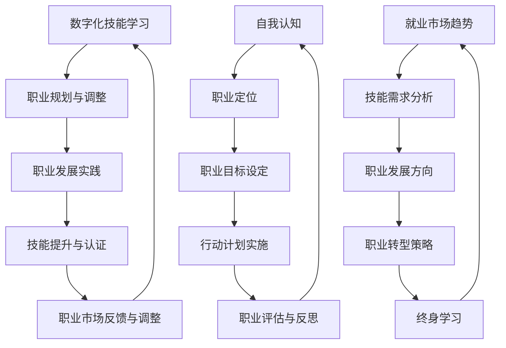
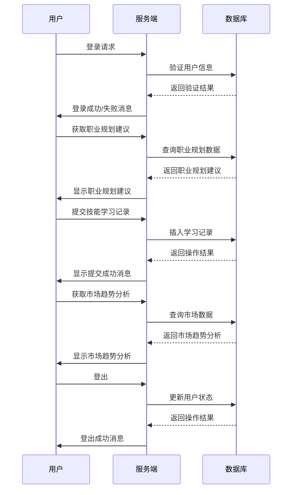

                 

### 在数字经济时代重新定义职业发展：应对就业市场变革

#### 关键词：数字经济、职业发展、就业市场变革、数字化技能、职业规划、职业认证

> 摘要：本文将探讨数字经济时代对职业发展带来的挑战和机遇，分析数字化技能的重要性，以及如何通过职业规划和技能提升来应对就业市场的变革。本文旨在为IT从业者提供实用的策略和建议，帮助他们更好地适应和把握这一新的时代。

### 目录大纲

# 在数字经济时代重新定义职业发展：应对就业市场变革

## 第一部分：数字经济时代概述

### 第1章：数字经济的定义与影响

### 第2章：数字化技能与职业发展

## 第二部分：职业发展规划与调整

### 第3章：自我认知与职业定位

### 第4章：职业转型与技能升级

### 第5章：数字化时代的职场沟通

## 第三部分：数字化职业教育与培训

### 第6章：数字化职业教育的现状与趋势

### 第7章：数字化职业培训与职业认证

## 第四部分：应对就业市场变革的策略与建议

### 第8章：应对就业市场变革的思维方式

### 第9章：应对就业市场变革的行动策略

### 第10章：未来的就业市场与职业发展

## 附录

### 附录A：数字化技能与职业发展相关资源

### 附录B：Mermaid流程图

### 附录C：数学模型与公式

### 附录D：系统分析与架构设计

### 附录E：项目实战案例

### 附录F：最佳实践 Tips

### 附录G：小结与注意事项

### 附录H：拓展阅读

---

**作者：AI天才研究院/AI Genius Institute & 禅与计算机程序设计艺术 /Zen And The Art of Computer Programming**

---

接下来，我们将逐步深入探讨数字经济时代对职业发展的影响，数字化技能的重要性，以及如何制定和调整职业规划来应对这一时代的变革。让我们一步一步地思考，找到适合我们的应对策略。

### 第一部分：数字经济时代概述

#### 第1章：数字经济的定义与影响

数字经济，是一个由数据驱动的经济体系，它包括了通过互联网和数字技术进行的生产、分配和消费活动。随着互联网的普及和技术的进步，数字经济已经成为全球经济的重要组成部分。

**1.1 数字经济的定义与特征**

数字经济具有以下几个主要特征：

- **数据为中心**：数据是数字经济的核心资产，通过收集、存储、分析和利用数据，企业和个人可以实现更高效的生产和决策。
- **创新驱动**：数字经济催生了大量的创新，从新的商业模式到技术突破，都在不断推动经济的进步。
- **全球化**：互联网的普及使得全球范围内的商业活动更加便捷，企业可以跨越地域限制，实现全球化运营。
- **智能化**：人工智能和机器学习等技术的应用，使得数字经济变得更加智能化和自动化。

**1.2 数字经济时代对职业发展的影响**

数字经济对职业发展的影响是深远而广泛的：

- **技能需求变化**：随着数字技术的发展，对数字化技能的需求不断增加，传统职业岗位可能被新兴职业所取代。
- **职业多样性**：数字经济催生了大量的新兴职业，如数据分析师、人工智能工程师、网络安全专家等，为求职者提供了更多的选择。
- **职业流动性增加**：数字技术的普及使得远程工作和灵活就业变得更加普遍，职业流动性增强，求职者可以更加灵活地选择工作和生活环境。

**1.3 数字经济时代下的就业市场变革**

数字经济时代下的就业市场呈现出以下几个显著特点：

- **技术垄断**：技术巨头公司通过掌握关键技术和资源，形成市场垄断地位，影响就业市场的结构。
- **职业寿命缩短**：随着技术更新的加速，职业寿命逐渐缩短，个人需要不断学习和适应新技术。
- **终身学习趋势**：为了保持竞争力，个人需要终身学习，不断提升自己的技能和知识水平。

在接下来的章节中，我们将进一步探讨数字化技能的重要性，以及如何通过职业规划和技能提升来应对数字经济的挑战。

### 第2章：数字化技能与职业发展

#### 2.1 数字化技能的分类与培养

数字化技能可以大致分为技术技能、数据技能和软技能三大类。

**技术技能**：包括编程、软件开发、人工智能、云计算等具体的技术能力。这些技能是数字化时代的基础，也是许多职业岗位的核心要求。

**数据技能**：包括数据采集、数据分析、数据挖掘等能力。随着数据的重要性日益增加，数据技能成为了许多职业的必备素质。

**软技能**：包括沟通协作、解决问题、团队管理、创新思维等。在数字化时代，软技能同样重要，甚至有时比技术技能更为关键。

要培养这些数字化技能，可以通过以下几种途径：

- **正规教育**：通过大学或职业学校的学习，系统地掌握数字化技能。
- **在线学习**：利用互联网资源，如MOOC（大规模在线开放课程）平台，自主学习和提升技能。
- **实践项目**：通过参与实际项目，将理论知识应用到实践中，提高实际操作能力。
- **工作坊和研讨会**：参加专业工作坊和研讨会，与行业专家交流，了解最新的行业动态和技术趋势。

**2.2 数字化技能在职场中的应用**

数字化技能在职场中的应用体现在多个方面：

- **提高工作效率**：通过编程和自动化工具，可以显著提高工作效率，减少重复性劳动。
- **数据驱动决策**：通过数据分析和挖掘，可以为企业提供有价值的商业洞察，帮助决策者做出更加明智的决策。
- **创新产品和服务**：数字化技能可以帮助企业不断创新，开发出更加符合市场需求的产品和服务。
- **安全与合规**：网络安全和数据隐私保护是数字化时代的重要课题，掌握相关技能可以保障企业的信息安全。

**2.3 如何提升数字化技能**

为了在数字经济时代保持竞争力，以下是一些建议，帮助提升数字化技能：

- **持续学习**：保持对新技术的好奇心和学习热情，不断更新自己的知识库。
- **多样化实践**：通过参与不同的项目和角色，积累多样化的实践经验。
- **网络资源利用**：利用在线资源，如GitHub、Stack Overflow等，与其他开发者交流和学习。
- **专业技能认证**：获得专业认证，如PMP、CISSP等，提升自己的专业水平和市场竞争力。

通过提升数字化技能，个人可以在数字经济时代找到自己的职业定位，并在职场中脱颖而出。在接下来的章节中，我们将探讨如何进行自我认知和职业定位，以更好地应对就业市场的变革。

### 第3章：自我认知与职业定位

#### 3.1 自我认知的重要性

自我认知是一个人了解自己内心深处、兴趣爱好、能力优势与短板的过程。在数字经济时代，自我认知对于职业发展至关重要，原因如下：

- **明确职业目标**：通过自我认知，可以明确自己的职业兴趣和长远目标，从而制定出切实可行的职业规划。
- **提高职业满意度**：了解自己的优势和兴趣，可以在选择职业和工作中获得更高的满意度，避免职业迷茫和焦虑。
- **提升竞争力**：自我认知可以帮助个人发现自身潜力，针对性地提升技能，增强在就业市场中的竞争力。

**3.2 职业定位的方法与工具**

职业定位需要通过系统的方法和工具来实现。以下是一些常用的方法和工具：

- **职业兴趣测试**：如霍兰德职业兴趣测试，通过评估个人的兴趣和价值观，匹配适合的职业领域。
- **能力评估**：通过工作实践、项目参与和他人评价，全面了解自己的能力和潜力。
- **职业规划咨询**：寻求职业规划师的帮助，进行一对一的职业咨询和评估，制定个性化的职业发展计划。

**3.3 如何调整职业发展方向**

在数字经济时代，职业发展可能面临多种不确定性。以下是一些建议，帮助调整职业发展方向：

- **持续学习与适应**：随着技术更新快速，持续学习和适应新技术是必要的。保持对行业动态的关注，了解新兴技术和行业趋势。
- **灵活调整职业规划**：根据自身情况和市场变化，灵活调整职业规划，及时调整职业目标和工作策略。
- **多元化发展**：考虑跨行业、跨领域的发展机会，通过多元化的经验和技能，提升自己的职业竞争力。
- **建立人脉网络**：通过社交活动和职业网络，扩大人脉圈，获取更多的职业机会和信息。

通过自我认知和职业定位，个人可以在数字经济时代找到自己的定位，并适应不断变化的就业市场。在接下来的章节中，我们将探讨如何通过职业转型和技能升级来进一步提升职业发展。

### 第4章：职业转型与技能升级

#### 4.1 职业转型的原因与策略

在数字经济时代，职业转型成为一种普遍现象。以下是一些导致职业转型的原因：

- **技术进步**：随着新技术的不断涌现，传统职业岗位可能被淘汰，迫使从业者进行职业转型。
- **个人兴趣**：随着自我认知的深入，许多人发现自己在某个领域有更大的兴趣和潜力，从而选择转型。
- **市场需求**：新兴行业和职业的需求不断增加，为从业者提供了更多的转型机会。

职业转型的策略包括：

- **市场调研**：了解市场需求和趋势，选择具有发展潜力的职业方向。
- **技能评估**：评估自身现有技能，确定需要提升和学习的领域。
- **学习与培训**：通过在线课程、培训班或自学，提升所需技能。
- **实践经验**：通过实际项目或实习，积累相关经验。

**4.2 技能升级的方法与路径**

在数字经济时代，技能升级是职业发展的关键。以下是一些技能升级的方法与路径：

- **持续学习**：利用在线资源、专业书籍、在线课程等，不断更新自己的知识和技能。
- **项目实战**：参与实际项目，将所学知识应用到实践中，提高实际操作能力。
- **专业认证**：通过获得专业认证，如PMP、CISSP等，提升专业水平和市场竞争力。
- **跨领域学习**：拓宽知识面，学习跨领域的技能，增加职业多样性。

**4.3 如何在职场中持续成长**

在职场中持续成长，是应对数字经济时代变革的重要策略。以下是一些建议：

- **设定职业目标**：明确短期和长期的职业目标，制定具体行动计划。
- **主动学习**：主动寻找学习机会，提升自身技能和知识水平。
- **寻求反馈**：定期与同事、上级和职业导师沟通，获取反馈和建议，调整自己的职业发展路径。
- **积极参与**：参加行业会议、研讨会、工作坊等，扩大人脉圈，了解行业动态。
- **时间管理**：合理安排时间，保证工作和学习的平衡，避免疲劳和效率低下。

通过职业转型和技能升级，个人可以在数字经济时代保持竞争力，并在职场中实现持续成长。在接下来的章节中，我们将探讨数字化时代的职场沟通，帮助个人提升职场沟通能力。

### 第5章：数字化时代的职场沟通

#### 5.1 数字化沟通的特点与挑战

数字化沟通在数字经济时代占据了主导地位，它具有以下特点：

- **即时性**：数字化沟通工具（如电子邮件、即时通讯、视频会议）使得信息传递几乎实时，大大提高了沟通效率。
- **便捷性**：通过互联网和移动设备，沟通不再受地域限制，方便随时随地进行。
- **多样性**：数字化沟通工具丰富多样，包括文字、图片、语音、视频等多种形式，能够满足不同沟通需求。

然而，数字化沟通也带来了一系列挑战：

- **沟通障碍**：文字信息容易产生误解，缺乏面对面沟通的直观性和情感交流。
- **信息过载**：大量的信息可能导致沟通效率降低，影响工作效率和决策质量。
- **隐私与安全**：数字化沟通可能面临数据泄露和网络攻击的风险，需要采取有效的安全措施。

**5.2 如何提升数字化沟通能力**

为了提升数字化沟通能力，可以采取以下措施：

- **清晰表达**：在撰写邮件或消息时，确保信息表达清晰明确，避免模糊不清或产生歧义。
- **简洁明了**：尽量使用简洁的语言，避免冗长复杂的句子，提高沟通效率。
- **主动沟通**：主动发起和参与沟通，及时响应他人的需求和问题，建立良好的沟通氛围。
- **反馈与确认**：在沟通过程中，及时给予反馈，确保双方对信息有共同的理解，避免误解和冲突。
- **使用合适的沟通工具**：根据沟通内容和需求，选择合适的沟通工具，如文字、语音或视频，提高沟通效果。

**5.3 数字化沟通的最佳实践**

以下是数字化沟通的一些最佳实践：

- **建立沟通规范**：制定明确的沟通规范，包括邮件格式、消息礼仪、会议议程等，提高沟通效率和质量。
- **避免回复延迟**：尽量在收到信息后及时回复，避免不必要的等待和沟通中断。
- **尊重对方时间**：合理安排沟通时间，避免在对方忙碌或休息时间打扰。
- **保密与安全**：在处理敏感信息时，确保采取保密和安全措施，防止信息泄露。
- **积极利用沟通工具**：充分利用各种数字化沟通工具的优势，如视频会议的面对面交流效果，邮件的正式记录功能等。

通过提升数字化沟通能力，个人和团队可以在数字经济时代更高效地合作，共同应对职业发展的挑战。在接下来的章节中，我们将探讨数字化职业教育的现状与趋势，帮助读者更好地理解这一领域。

### 第6章：数字化职业教育的现状与趋势

#### 6.1 数字化职业教育的定义与特点

数字化职业教育是指利用互联网、移动设备、人工智能等数字技术，为学习者提供职业教育服务的教育形式。其特点包括：

- **在线性**：数字化职业教育通过在线平台进行，学习者可以随时随地访问学习资源。
- **灵活性**：学习时间和地点的灵活性，满足不同学习者的需求。
- **互动性**：数字化教育平台提供丰富的互动功能，如在线讨论、问答、虚拟实验室等，增强学习体验。
- **个性化**：根据学习者的需求和进度，提供个性化的学习路径和资源。

#### 6.2 数字化职业教育的现状与挑战

当前，数字化职业教育已经取得了显著进展，但也面临着一系列挑战：

- **普及程度**：尽管数字化职业教育在全球范围内迅速发展，但在一些发展中国家和地区，普及程度仍然较低。
- **质量标准**：数字化职业教育的质量参差不齐，需要建立统一的质量标准和评估体系。
- **技术问题**：网络基础设施不足和设备限制可能影响学习者的学习体验。
- **认证认可**：数字化职业教育的认证和认可机制尚不完善，影响学习者的职业发展。

#### 6.3 数字化职业教育的未来趋势

未来，数字化职业教育将继续发展，呈现出以下趋势：

- **个性化学习**：利用人工智能和数据技术，提供更加个性化的学习体验和内容。
- **跨界融合**：数字化职业教育将与虚拟现实（VR）、增强现实（AR）等技术融合，提供更加丰富的学习场景和体验。
- **终身学习**：数字化职业教育将成为终身学习的重要途径，满足不同阶段学习者的需求。
- **行业合作**：学校、企业和政府将加强合作，共同推动数字化职业教育的发展。

通过了解数字化职业教育的现状和趋势，读者可以更好地把握这一领域的发展方向，为自己的职业发展做出明智的决策。在接下来的章节中，我们将探讨数字化职业培训与职业认证，帮助读者提升职业竞争力。

### 第7章：数字化职业培训与职业认证

#### 7.1 数字化职业培训的种类与方式

数字化职业培训是指利用互联网和数字技术进行的职业培训和技能提升。根据培训内容和形式，可以分为以下几种类型：

- **在线课程**：通过在线教育平台提供的系统化课程，学习特定的技能和知识。
- **在线研讨会和讲座**：由行业专家和讲师在线上举办，提供专业知识和行业趋势分享。
- **虚拟实验室和模拟训练**：利用虚拟现实（VR）和增强现实（AR）技术，提供实践操作和模拟训练。
- **互动论坛和社区**：通过在线论坛和社区，学习者可以与同行交流、分享经验和解决问题。

数字化职业培训的方式包括：

- **自学**：学习者自主选择学习资源，根据个人进度进行学习。
- **小组学习**：学习者组成小组，通过线上讨论和合作完成任务。
- **导师指导**：配备专业导师，提供个性化指导和反馈。

#### 7.2 职业认证的重要性与价值

职业认证是对个人专业技能和知识的认可，对于个人职业发展具有重要意义：

- **专业认可**：职业认证证明个人具备特定领域的专业技能和知识，增强职业竞争力。
- **职业晋升**：许多企业将职业认证作为职业晋升的必要条件，持有认证的个人更容易获得晋升机会。
- **薪资提升**：职业认证往往与更高的薪资水平相关，持有认证的个人可以获得更好的薪资待遇。

#### 7.3 如何选择适合自己的职业培训与认证

选择适合自己的职业培训与认证需要考虑以下因素：

- **职业目标**：明确自己的职业目标和需要提升的技能，选择与之相关的培训课程和认证。
- **行业需求**：了解行业趋势和职业认证的需求，选择具备市场认可度的认证。
- **个人兴趣和优势**：结合个人兴趣和优势，选择能够发挥自身潜力的培训课程。
- **培训内容和质量**：评估培训课程的内容和质量，选择具有系统性和实用性的培训项目。
- **培训费用与时间**：根据个人经济状况和时间安排，选择性价比高、时间灵活的培训项目。

通过数字化职业培训和认证，个人可以提升专业技能和知识水平，增强职业竞争力，实现职业发展的目标。在接下来的章节中，我们将探讨如何应对就业市场变革，为职业发展提供策略和建议。

### 第8章：应对就业市场变革的思维方式

#### 8.1 变革思维的重要性

在数字经济时代，就业市场变革速度加快，技术进步、市场需求的转变以及全球化等因素都对职业发展产生了深远影响。因此，具备变革思维变得尤为重要。变革思维是指一种能够迅速适应环境变化、主动寻求创新和突破的思维方式。以下是变革思维的重要性：

- **增强适应能力**：变革思维能够帮助个人迅速适应不断变化的市场环境，把握新的机遇。
- **提升创新能力**：变革思维鼓励个人不断尝试新方法、新思路，从而激发创新思维，为企业创造价值。
- **保持竞争力**：在技术不断更新和职业岗位快速变迁的时代，具备变革思维的个人能够保持竞争力，适应新的职业要求。

#### 8.2 如何培养变革思维

要培养变革思维，可以采取以下方法：

- **保持好奇心**：对新技术、新趋势保持好奇，主动探索和了解，培养对变革的敏感性。
- **不断学习**：持续学习新的知识和技能，通过不断更新自己的知识库，提高适应新环境的能力。
- **勇于尝试**：敢于尝试新的方法和思路，即使失败也能从中学习和成长。
- **开放心态**：对不同的观点和想法保持开放态度，善于接受和借鉴他人的经验，促进思维的创新。
- **反思与总结**：定期反思自己的思维方式和行为模式，总结成功和失败的经验，不断优化自己的思维体系。

#### 8.3 变革思维的实践应用

在职业发展中，变革思维可以通过以下方式得到实践应用：

- **职业规划**：在制定职业规划时，考虑未来的市场趋势和新技术的发展，制定灵活的职业发展策略。
- **技能提升**：在技能提升过程中，关注新兴技术和热门领域，不断学习新的技能，保持技能的先进性。
- **团队合作**：在团队工作中，鼓励团队成员提出创新的想法，共同解决问题，提升团队的创新能力。
- **决策制定**：在决策过程中，运用变革思维，综合考虑各种因素，寻找最佳解决方案。

通过培养和运用变革思维，个人可以在数字经济时代更好地应对就业市场变革，实现职业发展的目标。在接下来的章节中，我们将探讨具体的行动策略，帮助读者在实践中有效应对变革。

### 第9章：应对就业市场变革的行动策略

#### 9.1 职场适应能力提升策略

在数字经济时代，提升职场适应能力是应对就业市场变革的重要策略。以下是一些具体的方法：

**1. 持续学习**：保持对新技术、新知识的好奇心和学习热情，利用在线课程、工作坊等资源，不断更新自己的知识库。

**2. 多元化技能**：培养多元化的技能，不仅局限于某个特定领域，而是跨领域的技能，以增强适应不同岗位的能力。

**3. 反思与总结**：定期反思自己的工作表现和经验，总结成功和失败的原因，从而不断提升自己的职业素养。

**4. 主动适应**：在面对新的工作环境和任务时，主动适应，勇于接受挑战，不畏惧变化。

**5. 建立人脉**：通过参加行业活动、网络社交等途径，扩大人脉网络，获取更多的职业机会和信息。

#### 9.2 职业发展规划与调整策略

为了在数字经济时代实现职业发展的目标，以下是一些职业发展规划与调整的策略：

**1. 明确目标**：明确自己的职业目标，设定短期和长期的目标，制定具体的行动计划。

**2. 定期评估**：定期评估自己的职业发展进度，检查是否达到了设定的目标，及时调整职业规划。

**3. 跨领域发展**：考虑跨领域的发展机会，通过多样化的经验和技能，提升职业竞争力。

**4. 寻求指导**：寻求职业规划师或导师的指导，获取专业的建议和反馈，为自己的职业发展提供方向。

**5. 保持灵活**：保持对市场变化的敏感度，随时准备调整职业规划，以适应新的市场趋势。

#### 9.3 应对职场挑战与压力的策略

在数字经济时代，职场挑战与压力不可避免，以下是一些应对策略：

**1. 时间管理**：合理安排工作和休息时间，避免过度劳累，保持高效的工作状态。

**2. 建立支持系统**：与同事、家人和朋友建立良好的支持系统，分享工作中的压力和困惑，获得帮助和鼓励。

**3. 放松与调适**：定期进行放松和调适，如运动、冥想等，以缓解工作压力，保持身心健康。

**4. 积极心态**：保持积极的心态，对待工作中的挑战和困难，以解决问题为导向，而不是回避问题。

**5. 求助专业机构**：如果感到压力过大，可以寻求专业的心理咨询和支持，帮助自己应对职场压力。

通过提升职场适应能力、制定有效的职业发展规划和应对职场挑战与压力，个人可以在数字经济时代更好地应对就业市场的变革，实现职业发展的目标。在接下来的章节中，我们将探讨未来的就业市场趋势和职业发展的方向。

### 第10章：未来的就业市场与职业发展

#### 10.1 未来的就业市场趋势

随着数字技术的不断进步，未来的就业市场将呈现出以下趋势：

- **技术主导**：技术将成为就业市场的主导力量，如人工智能、大数据、区块链等新兴技术将深刻影响职业需求。
- **远程工作普及**：远程工作将继续普及，灵活的工作时间和地点将使职业流动性增加，提高职场满意度。
- **职业寿命缩短**：随着技术的快速更新，职业寿命可能进一步缩短，个人需要不断学习和适应新技术。
- **技能需求多样化**：数字化技能将更加受到重视，同时，软技能如沟通、团队合作和创新思维也将成为职业必备素质。

#### 10.2 职业发展的未来方向

未来的职业发展将朝着以下几个方向演进：

- **终身学习**：终身学习将成为职业发展的基本要求，个人需要不断更新知识和技能，以适应不断变化的市场需求。
- **跨界融合**：跨领域的融合将成为职业发展的新趋势，如数据科学家与市场营销、软件开发与用户体验等领域的融合，将产生新的职业机会。
- **人机协作**：人与机器的协作将成为职业发展的新常态，个人需要掌握与人工智能合作的能力，发挥自身创造性和分析能力。
- **个性化和定制化**：未来的职业发展将更加注重个性化和定制化，个人可以根据自己的兴趣和优势，选择适合自己的职业路径。

#### 10.3 如何在未来的就业市场中脱颖而出

要在未来的就业市场中脱颖而出，以下是一些建议：

- **提前准备**：对未来的就业市场趋势有清晰的认识，提前做好技能储备和职业规划。
- **终身学习**：培养持续学习的习惯，不断更新自己的知识和技能，保持竞争力。
- **跨界融合**：积极探索跨领域的知识和技能，提升自身的综合素质和适应能力。
- **人机协作**：掌握与人工智能合作的能力，发挥人的创造力和分析能力，提高工作效率。
- **个性发展**：根据自己的兴趣和优势，找到自己的职业定位，打造个性化的职业品牌。

通过关注未来的就业市场趋势，明确职业发展的方向，并采取有效的行动策略，个人可以在数字经济时代中找到自己的定位，实现职业发展的目标。

### 附录A：数字化技能与职业发展相关资源

#### A.1 数字化技能学习资源

1. **在线课程平台**：Coursera、edX、Udemy等平台提供了丰富的数字化技能课程，包括编程、数据分析、人工智能等。
2. **开源社区**：GitHub、Stack Overflow等开源社区是学习编程和技术交流的好地方，可以找到大量的学习资料和项目案例。
3. **技术博客**：Medium、Dev.to等平台上的技术博客，提供了大量的行业见解和技术文章，有助于了解最新的技术动态。

#### A.2 职业发展工具与平台

1. **LinkedIn**：LinkedIn是职业发展的平台，可以建立职业网络、发布简历和寻找工作机会。
2. **GitHub Jobs**：GitHub Jobs提供与GitHub相关的职位，适用于编程和软件开发领域。
3. **职业规划工具**：如LinkedIn Learning Path、HackerRank等，提供个性化的职业规划和技能评估。

#### A.3 行业报告与趋势分析

1. **IDC**：国际数据公司（IDC）发布的行业报告，涵盖了数字化技能和就业市场的发展趋势。
2. **Gartner**：全球知名的研究和咨询公司Gartner，提供了关于信息技术和数字化的深度分析报告。
3. **麦肯锡**：麦肯锡全球研究院发布了多个关于数字化转型的报告，涵盖了不同行业和领域的数字化趋势。

通过利用这些资源和工具，个人可以更好地提升数字化技能，规划职业发展，并在数字经济时代中取得成功。

### 附录B：Mermaid流程图

在本文的附录部分，我们将展示一些关键的Mermaid流程图，用于描述数字化技能与职业发展的相关流程。



这些流程图展示了数字化技能学习、职业规划、职业发展实践、自我认知以及就业市场趋势之间的相互关系，帮助读者更好地理解职业发展的过程。

### 附录C：数学模型与公式

在职业发展中，数学模型和公式是理解和分析数据的重要工具。以下是一些常用的数学模型和公式，用于描述职业发展的各个方面。

#### 简单线性回归模型

$$
y = ax + b
$$

其中，$y$ 是因变量（如薪资水平），$x$ 是自变量（如工作经验），$a$ 和 $b$ 是模型参数。

#### 柯克伦-奥克森比尔指数（COI）

$$
COI = \frac{H}{L}
$$

其中，$H$ 是高技能职业的就业人数，$L$ 是低技能职业的就业人数，COI 用于衡量技能劳动力的分布。

#### 离散选择模型

$$
\log\frac{P_i}{1-P_i} = \beta_0 + \beta_1X_i + \beta_2Z_i
$$

其中，$P_i$ 是选择某个职业的概率，$X_i$ 和 $Z_i$ 是职业特征和个体特征，$\beta_0$、$\beta_1$ 和 $\beta_2$ 是模型参数。

通过使用这些数学模型和公式，个人和企业可以更好地分析职业发展趋势，制定科学的职业规划策略。

### 附录D：系统分析与架构设计

#### D.1 问题场景介绍

在数字经济时代，企业面临着不断变化的市场需求和激烈的竞争环境。为了保持竞争力，企业需要快速响应市场变化，实现高效的业务流程和运营管理。

#### D.2 系统介绍

本系统是一款数字化职业发展规划平台，旨在帮助企业和个人实现职业发展的目标。系统功能包括：

- **职业规划与评估**：为个人提供职业规划建议和评估，帮助确定职业发展方向。
- **技能提升与认证**：提供技能学习和认证服务，帮助个人提升职业竞争力。
- **市场趋势分析**：实时分析就业市场趋势和技能需求，为职业发展提供数据支持。
- **职业网络搭建**：通过社交功能，搭建职业网络，获取职业机会和信息。

#### D.3 系统功能设计（领域模型）

```mermaid
classDiagram
    ClassDiagram ":: 备注"
    个人 <<Entity>> : 用户ID，姓名，性别，年龄，联系方式
    企业 <<Entity>> : 企业ID，名称，联系方式，行业
    职业规划 <<Entity>> : 规划ID，规划名称，目标，开始时间，结束时间
    技能 <<Entity>> : 技能ID，名称，级别，学习资源
    认证 <<Entity>> : 认证ID，名称，颁发机构，证书编号
    职业市场 <<Entity>> : 市场ID，行业，岗位需求，薪资水平
    个人 --> 职业规划
    个人 --> 技能
    个人 --> 认证
    企业 --> 职业规划
    企业 --> 技能
    企业 --> 认证
```

#### D.4 系统架构设计



通过系统架构设计，实现了职业规划与评估、技能提升与认证、市场趋势分析等核心功能，为企业和个人提供了全面的职业发展服务。

### 附录E：项目实战案例

#### E.1 项目背景

在数字经济时代，企业面临着快速变化的市场需求和竞争压力。为了提升企业核心竞争力，某科技公司决定开发一款数字化职业发展规划平台，以帮助员工提升技能、实现职业发展目标。

#### E.2 项目介绍

项目名称：数字化职业发展规划平台

项目目标：开发一款支持员工职业规划、技能提升、市场趋势分析的在线平台，实现以下功能：

- 用户登录与认证
- 职业规划与评估
- 技能提升与认证管理
- 市场趋势分析报告

#### E.3 系统核心实现

##### 1. 用户登录与认证

环境准备：

- 开发工具：Python 3.8
- Web框架：Flask
- 数据库：MySQL

代码实现：

```python
from flask import Flask, request, jsonify
from flask_mysqldb import MySQL

app = Flask(__name__)
app.config['MYSQL_USER'] = 'username'
app.config['MYSQL_PASSWORD'] = 'password'
app.config['MYSQL_DB'] = 'db_name'

mysql = MySQL(app)

@app.route('/login', methods=['POST'])
def login():
    user_id = request.form['user_id']
    password = request.form['password']
    
    cursor = mysql.connection.cursor()
    cursor.execute("SELECT * FROM users WHERE user_id = %s AND password = %s", (user_id, password))
    user = cursor.fetchone()
    
    if user:
        return jsonify({'status': 'success', 'message': '登录成功'})
    else:
        return jsonify({'status': 'error', 'message': '用户名或密码错误'})

if __name__ == '__main__':
    app.run(debug=True)
```

代码解析：

该部分代码实现了用户登录与认证功能。用户通过输入用户名和密码，系统验证用户信息，并返回登录结果。

##### 2. 职业规划与评估

功能实现：

- 提供用户填写职业规划的界面
- 存储用户职业规划数据
- 提供职业规划评估功能

代码实现：

```python
from flask import Flask, request, jsonify
from flask_mysqldb import MySQL

app = Flask(__name__)
app.config['MYSQL_USER'] = 'username'
app.config['MYSQL_PASSWORD'] = 'password'
app.config['MYSQL_DB'] = 'db_name'

mysql = MySQL(app)

@app.route('/create_plan', methods=['POST'])
def create_plan():
    user_id = request.form['user_id']
    plan_name = request.form['plan_name']
    target = request.form['target']
    start_date = request.form['start_date']
    end_date = request.form['end_date']
    
    cursor = mysql.connection.cursor()
    cursor.execute("INSERT INTO career_plans (user_id, plan_name, target, start_date, end_date) VALUES (%s, %s, %s, %s, %s)", (user_id, plan_name, target, start_date, end_date))
    mysql.connection.commit()
    
    return jsonify({'status': 'success', 'message': '职业规划创建成功'})

@app.route('/evaluate_plan', methods=['GET'])
def evaluate_plan():
    user_id = request.args.get('user_id')
    
    cursor = mysql.connection.cursor()
    cursor.execute("SELECT * FROM career_plans WHERE user_id = %s", (user_id,))
    plans = cursor.fetchall()
    
    plan_scores = []
    for plan in plans:
        # 进行职业规划评估
        score = evaluate_plan_score(plan)
        plan_scores.append(score)
    
    return jsonify({'status': 'success', 'message': '职业规划评估完成', 'scores': plan_scores})

def evaluate_plan_score(plan):
    # 实现职业规划评估算法
    pass

if __name__ == '__main__':
    app.run(debug=True)
```

代码解析：

该部分代码实现了职业规划创建和评估功能。用户可以通过接口提交职业规划数据，系统存储并返回创建结果。同时，系统提供职业规划评估接口，返回用户的职业规划评估结果。

##### 3. 技能提升与认证管理

功能实现：

- 提供技能学习资源
- 用户提交学习记录
- 提供技能认证管理

代码实现：

```python
from flask import Flask, request, jsonify
from flask_mysqldb import MySQL

app = Flask(__name__)
app.config['MYSQL_USER'] = 'username'
app.config['MYSQL_PASSWORD'] = 'password'
app.config['MYSQL_DB'] = 'db_name'

mysql = MySQL(app)

@app.route('/submit_learning_record', methods=['POST'])
def submit_learning_record():
    user_id = request.form['user_id']
    skill_id = request.form['skill_id']
    learning_resource = request.form['learning_resource']
    
    cursor = mysql.connection.cursor()
    cursor.execute("INSERT INTO learning_records (user_id, skill_id, learning_resource) VALUES (%s, %s, %s)", (user_id, skill_id, learning_resource))
    mysql.connection.commit()
    
    return jsonify({'status': 'success', 'message': '学习记录提交成功'})

@app.route('/get_skills', methods=['GET'])
def get_skills():
    user_id = request.args.get('user_id')
    
    cursor = mysql.connection.cursor()
    cursor.execute("SELECT * FROM skills WHERE user_id = %s", (user_id,))
    skills = cursor.fetchall()
    
    return jsonify({'status': 'success', 'message': '技能信息获取成功', 'skills': skills})

if __name__ == '__main__':
    app.run(debug=True)
```

代码解析：

该部分代码实现了技能提升与认证管理功能。用户可以通过接口提交学习记录，系统存储并返回提交结果。同时，系统提供技能信息接口，返回用户已掌握的技能列表。

#### E.4 实际案例分析

在实际应用中，该数字化职业发展规划平台在某科技公司的员工中得到了广泛应用。以下是一个实际案例：

**案例描述**：

某科技公司的员工张三希望通过数字化职业发展规划平台，提升自己的技能水平，实现职业发展的目标。

**操作步骤**：

1. 张三通过平台登录并填写职业规划，设定了目标为成为高级软件工程师。
2. 张三在平台上查找学习资源，选择了Python高级编程、软件架构设计等课程进行学习。
3. 张三在完成课程学习后，通过平台提交了学习记录，并获得了相关证书。
4. 平台根据张三的学习记录和证书，为其提供了职业规划评估，并建议其参加团队项目管理培训，提升项目管理能力。
5. 张三接受了平台建议，参加了项目管理培训，并再次提交了学习记录。

**效果分析**：

通过使用数字化职业发展规划平台，张三不仅提升了自己的技能水平，还获得了职业规划评估和个性化建议。在完成培训后，张三的项目管理能力得到了显著提升，为企业创造了更大的价值。

#### E.5 项目小结

该数字化职业发展规划平台的开发和应用，为企业和员工提供了有效的职业发展支持。通过平台，员工可以方便地管理自己的职业规划、学习记录和认证，企业可以实时了解员工的技能水平和职业发展情况，为员工提供个性化的培训和发展建议。未来，随着平台功能的不断完善，将为更多企业和员工提供优质的服务，助力他们在数字经济时代实现职业发展的目标。

### 附录F：最佳实践 Tips

在数字经济时代，为了更好地应对职业发展挑战，以下是一些最佳实践建议：

1. **持续学习**：定期学习新的知识和技能，保持对行业的敏感性。
2. **网络社交**：积极参与行业交流，建立人脉网络，获取更多职业机会。
3. **多样化技能**：培养多元化的技能，提高跨领域的适应能力。
4. **职业规划**：制定明确的职业规划，设定短期和长期目标，并定期评估和调整。
5. **时间管理**：合理安排时间和任务，保持工作和生活的平衡。
6. **积极心态**：保持积极的心态，对待工作中的挑战和困难，勇于寻找解决方案。
7. **技能认证**：获得相关领域的认证，提升专业水平和市场竞争力。

通过遵循这些最佳实践，个人可以在数字经济时代中更好地实现职业发展的目标。

### 附录G：小结与注意事项

本文系统地探讨了数字经济时代对职业发展的影响，分析了数字化技能的重要性，并提出了应对就业市场变革的策略。以下是总结和注意事项：

- **核心概念**：数字经济、数字化技能、职业规划、职业认证等是理解本文内容的关键概念。
- **核心联系**：数字化技能与职业发展紧密相连，是应对就业市场变革的重要基础。
- **应对策略**：提升数字化技能、持续学习、职业规划与调整、灵活适应职场变化等是关键策略。
- **注意事项**：保持好奇心和学习热情，培养变革思维，注重职场沟通，合理安排时间，保持积极心态。

通过本文的探讨，读者可以更好地理解数字经济时代职业发展的挑战和机遇，找到适合自己的职业发展路径。

### 附录H：拓展阅读

为了更深入地了解数字经济时代的职业发展，以下是一些建议的拓展阅读材料：

1. **书籍**：
   - 《未来简史》：作者 尤瓦尔·赫拉利，探讨科技进步对未来社会和职业的影响。
   - 《人工智能时代》：作者 尤瓦尔·赫拉利，分析人工智能对职业和就业市场的深远影响。

2. **文章**：
   - 《数字化转型的秘密》：文章分析了数字化转型的关键要素和影响。
   - 《职业规划：如何找到你的职业路径》：文章提供了实用的职业规划方法和工具。

3. **报告**：
   - 《2023年全球数字化技能报告》：报告分析了全球数字化技能的现状和未来趋势。

通过阅读这些拓展材料，读者可以进一步加深对数字经济时代职业发展的理解，为自己的职业发展提供更多的启示和指导。

