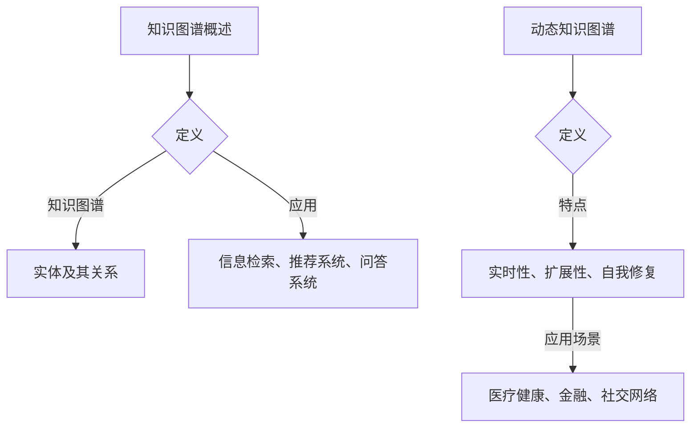
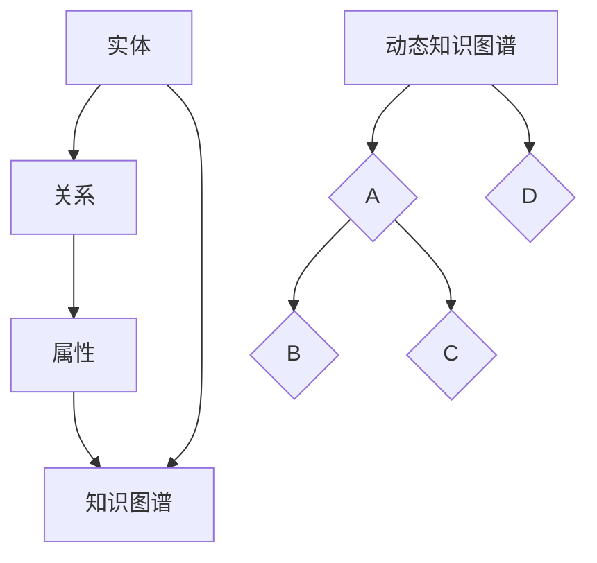

                 

### 动态知识图谱简介

#### 知识图谱概述

知识图谱（Knowledge Graph）是一种用于表示实体及其之间关系的图形数据结构。它通过实体（如人、地点、事物等）和边（表示实体间的关系）来构建一个网络，从而实现对复杂关系的抽象和描述。知识图谱的核心思想是将现实世界中的各种信息进行结构化处理，形成一种易于计算机处理和理解的语义网络。

知识图谱的应用非常广泛，主要包括以下几个方面：

1. **信息检索**：通过知识图谱中的实体关系，提高信息检索的准确性和效率。例如，搜索引擎可以利用知识图谱实现语义搜索，提高搜索结果的相关性。
   
2. **推荐系统**：知识图谱可以帮助推荐系统理解用户和物品之间的复杂关系，从而提供更加个性化的推荐结果。

3. **问答系统**：知识图谱可以用于构建智能问答系统，通过解析用户的问题和知识图谱中的信息，生成准确的答案。

#### 动态知识图谱的定义与特点

动态知识图谱（Dynamic Knowledge Graph）是在传统知识图谱的基础上，引入了实时更新和动态维护的能力。传统知识图谱往往是静态的，即一旦建立后，其内容和结构通常不会发生变化。而动态知识图谱则能够根据实际需求实时地更新和扩展。

动态知识图谱的特点包括：

1. **实时性**：动态知识图谱能够实时捕获和更新现实世界中的变化，保持知识的时效性和准确性。

2. **扩展性**：动态知识图谱能够根据需求动态地增加实体和关系，适应不断变化的数据环境。

3. **自我修复**：动态知识图谱具有一定的自我修复能力，当发现错误或冲突时，可以自动调整以保持一致性。

#### 动态知识图谱的应用场景

动态知识图谱在多个领域都有着广泛的应用：

1. **医疗健康领域**：动态知识图谱可以用于构建实时更新的医疗知识库，帮助医生和患者获取最新的医学信息。

2. **金融领域**：动态知识图谱可以用于金融风控和智能投顾，实时分析市场动态和用户行为。

3. **社交网络领域**：动态知识图谱可以用于用户关系分析和社交网络分析，发现潜在的用户群体和关系链。

动态知识图谱通过其独特的实时性和扩展性，为各个领域的数据处理和分析提供了强有力的支持。

#### 关键词

- 知识图谱
- 动态知识图谱
- 实时更新
- 扩展性
- 自我修复

#### 摘要

本文旨在探讨动态知识图谱的概念、特点及其在各个领域的应用。通过介绍知识图谱的概述，我们了解了知识图谱的定义和应用场景。随后，我们深入分析了动态知识图谱的实时性、扩展性和自我修复等特点。最后，我们讨论了动态知识图谱在不同领域的应用，展示了其在医疗、金融和社交网络等领域的潜在价值。本文为后续关于动态知识图谱推理和更新的讨论奠定了基础。

---

**Mermaid 流程图**



#### 背景介绍

知识图谱作为人工智能领域的重要基础技术，已经广泛应用于信息检索、推荐系统和问答系统等多个方面。传统知识图谱通过静态的结构来表示实体及其之间的关系，为各种应用提供了强有力的支持。然而，随着数据环境的快速变化和需求的多变性，静态知识图谱在实时性和扩展性方面逐渐暴露出了一些局限性。为了克服这些问题，动态知识图谱的概念应运而生。

动态知识图谱与传统知识图谱的区别主要体现在以下几个方面：

1. **更新方式**：传统知识图谱的更新通常需要人工干预，而动态知识图谱能够通过自动化的方式实时捕获和更新数据。

2. **扩展能力**：传统知识图谱的实体和关系通常是预先定义好的，而动态知识图谱可以根据实际需求动态地增加或删除实体和关系。

3. **一致性维护**：传统知识图谱在更新时容易产生不一致性，而动态知识图谱通过自我修复机制能够有效地保持数据的一致性。

在多个领域中，动态知识图谱展现出了巨大的潜力和价值。例如，在医疗健康领域，动态知识图谱可以帮助构建实时更新的医疗知识库，为医生和患者提供最新的医学信息。在金融领域，动态知识图谱可以用于实时分析市场动态和用户行为，为金融风控和智能投顾提供支持。在社交网络领域，动态知识图谱可以用于用户关系分析和社交网络分析，发现潜在的用户群体和关系链。

然而，动态知识图谱的应用也面临着一系列挑战。首先是数据实时性挑战，如何在保证数据一致性的同时，快速地处理和更新大量的数据。其次是更新策略的优化，如何设计有效的更新规则和算法，以实现知识图谱的高效动态维护。此外，动态知识图谱的实时性和扩展性需求，也对系统性能和资源利用提出了更高的要求。

本文将围绕动态知识图谱的理论基础、核心算法、更新策略以及实际应用等方面进行深入探讨，以期为相关领域的研究者和从业者提供有价值的参考。

#### 核心概念与联系

在深入探讨动态知识图谱之前，我们需要明确几个核心概念及其之间的联系：

1. **实体（Entity）**：实体是知识图谱中的基本构成单元，可以是人、地点、物品等具体对象。实体是知识图谱中表示信息的基础。

2. **关系（Relationship）**：关系是连接两个或多个实体的线，表示实体之间的某种关联或互动。关系是知识图谱中描述实体间关系的关键。

3. **属性（Attribute）**：属性是实体的附加信息，可以描述实体的特征或状态。属性通常用于提供更详细的实体信息。

4. **知识图谱（Knowledge Graph）**：知识图谱是一个由实体、关系和属性构成的语义网络，用于表示和存储复杂的实体关系。

5. **动态知识图谱（Dynamic Knowledge Graph）**：动态知识图谱是在传统知识图谱的基础上，引入了实时更新和动态维护能力的知识图谱。它能够根据实际需求实时地更新和扩展。

核心概念之间的联系如下：

- 实体和关系是知识图谱的基本构成单元，通过关系将实体连接起来，形成一个语义网络。
- 属性用于补充实体的详细信息，使知识图谱更加丰富和具体。
- 知识图谱是实体、关系和属性的集合，通过这些元素构建起一个表示和存储信息的数据结构。
- 动态知识图谱在传统知识图谱的基础上，引入了实时更新和动态维护的能力，能够根据实际需求动态地更新和扩展。

为了更直观地展示这些概念之间的关系，我们可以使用Mermaid流程图：



#### 图卷积网络（GCN）简介

图卷积网络（Graph Convolutional Network，GCN）是一种专门用于图数据学习的神经网络架构，最早由Kipf和Welling在2016年提出。GCN的出现为图数据的处理和建模提供了一种新的思路，由于其能够在图结构上捕捉丰富的局部和全局信息，因此在知识图谱处理领域得到了广泛应用。

##### 图卷积网络的概念

图卷积网络是一种基于图卷积操作的神经网络，其核心思想是通过对图中节点的邻接信息进行聚合，从而实现节点的特征学习。具体来说，图卷积操作可以看作是一种特殊的卷积操作，它作用于图中的节点，通过聚合节点及其邻居节点的特征信息，生成新的节点特征表示。

##### 图卷积网络的发展历程

图卷积网络的发展历程可以大致分为以下几个阶段：

1. **最初提出**：2016年，Kipf和Welling在论文《Variational Graph Autoencoders》中首次提出了GCN的概念，并使用GCN进行节点分类任务，取得了显著的效果。

2. **方法优化**：随着GCN的提出，研究人员开始对其方法和性能进行深入优化，如引入注意力机制、改进卷积操作等，从而提升了GCN的性能。

3. **应用拓展**：GCN不仅应用于节点分类，还扩展到了链接预测、图生成等多个领域，成为图数据学习中的一种重要工具。

4. **动态图处理**：近年来，研究人员开始关注动态图处理，提出了适用于动态图的GCN变种，如动态图卷积网络（Dynamic Graph Convolutional Network，DGNN）等，以适应动态知识图谱的处理需求。

##### 图卷积网络的基本原理

图卷积网络的基本原理可以概括为以下几个步骤：

1. **节点特征聚合**：对于每个节点，GCN会聚合其邻居节点的特征信息，形成新的特征表示。这一过程可以通过以下公式表示：

   $$h_{k}^{(l+1)} = \sigma(\mathbf{A} \cdot h_{k}^{(l)} + \mathbf{W}^{(l)} h_{k}^{(l)} + b^{(l)})$$

   其中，\(h_{k}^{(l)}\) 表示节点 \(k\) 在第 \(l\) 层的表示，\(\mathbf{A}\) 表示邻接矩阵，\(\mathbf{W}^{(l)}\) 和 \(b^{(l)}\) 分别为第 \(l\) 层的权重和偏置，\(\sigma\) 表示激活函数。

2. **层叠加**：GCN通常由多个层叠加而成，每一层都会对节点的特征进行聚合和变换，从而生成更高级别的节点表示。

3. **分类与预测**：在GCN的最后几层，通常会使用全连接层和激活函数（如softmax）进行分类或预测。

##### 图卷积网络在知识图谱中的应用

GCN在知识图谱中的应用主要体现在以下几个方面：

1. **节点分类**：利用GCN对知识图谱中的节点进行分类，可以识别出图谱中的关键节点，如重要人物、地点等。

2. **关系预测**：通过GCN，可以预测知识图谱中未知的实体关系，从而补充和扩展图谱的内容。

3. **图生成**：利用GCN，可以从已有的知识图谱生成新的图谱，为数据分析和知识挖掘提供更多的可能性。

4. **链接预测**：在知识图谱中，GCN可以用于预测未连接的实体之间的关系，为图谱的维护和扩展提供依据。

综上所述，图卷积网络通过其独特的图卷积操作，能够有效地从图数据中提取特征，并在知识图谱处理中展现出强大的能力。

#### 图卷积网络的数学原理

图卷积网络（GCN）的数学原理基于图上的线性代数运算，特别是图卷积操作。以下是GCN的核心数学概念和推导过程：

##### 图表示

首先，我们需要对图进行数学表示。一个无向简单图可以表示为一个三元组 \((V, E, X)\)，其中：

- \(V\) 是节点的集合，\(V = \{v_1, v_2, ..., v_n\}\)。
- \(E\) 是边的集合，\(E \subseteq V \times V\)。
- \(X\) 是节点的特征矩阵，\(X \in \mathbb{R}^{n \times d}\)，其中 \(d\) 是节点的特征维度。

##### 邻接矩阵

图可以通过邻接矩阵 \(\mathbf{A} \in \{0, 1\}^{n \times n}\) 来表示，其中 \(\mathbf{A}_{ij} = 1\) 如果节点 \(v_i\) 和节点 \(v_j\) 相连，否则为0。

##### 图卷积操作

图卷积操作的核心是节点特征聚合，即每个节点的新特征是通过其邻居节点的特征加权平均得到的。形式化地，图卷积操作可以表示为：

$$
h_{k}^{(l+1)} = \sigma(\mathbf{A} \cdot \cdot (h_{k}^{(l)} \odot \mathbf{D}^{-1/2} \mathbf{A} \mathbf{D}^{-1/2} h_{k}^{(l)} ) + \mathbf{b}^{(l)})
$$

其中：

- \(h_{k}^{(l)}\) 是节点 \(k\) 在第 \(l\) 层的嵌入向量。
- \(h_{i}^{(l)}\) 是节点 \(i\) 在第 \(l\) 层的嵌入向量。
- \(\odot\) 表示元素-wise 的点乘操作。
- \(\mathbf{D}\) 是度矩阵，\(\mathbf{D}_{ij} = \deg(v_j)\)，其中 \(\deg(v_j)\) 是节点 \(v_j\) 的度。
- \(\mathbf{D}^{-1/2}\) 是度矩阵的逆平方根，用于正则化图卷积，防止某些节点因为高连接度而对特征聚合产生过大的影响。
- \(\sigma\) 是激活函数，常用的有ReLU函数。
- \(\mathbf{b}^{(l)}\) 是第 \(l\) 层的偏置向量。

##### 层叠加

图卷积网络通常由多个层叠加而成，每一层都应用上述的图卷积操作。对于第 \(l\) 层，节点 \(k\) 的特征表示为：

$$
h_{k}^{(l+1)} = \sigma(\mathbf{A} \cdot \cdot (h_{k}^{(l)} \odot \mathbf{D}^{-1/2} \mathbf{A} \mathbf{D}^{-1/2} h_{k}^{(l)} ) + \mathbf{b}^{(l)})
$$

##### 分类与预测

在GCN的输出层，通常使用全连接层和激活函数（如softmax）进行分类或预测。例如，对于节点分类任务，可以使用以下公式：

$$
\hat{y}_{k} = \sigma(\mathbf{W}^{(L)} h_{k}^{(L)})
$$

其中，\(\hat{y}_{k}\) 是节点 \(k\) 的预测标签，\(\mathbf{W}^{(L)}\) 是输出层的权重矩阵。

##### 数学推导示例

以下是一个简化的图卷积操作的数学推导示例：

$$
h_{k}^{(2)} = \sigma(\mathbf{A} \cdot (h_{k}^{(1)} \odot \mathbf{D}^{-1/2} \mathbf{A} \mathbf{D}^{-1/2} h_{k}^{(1)} ) + b^{(1)})
$$

- 首先，计算邻接矩阵和度矩阵的乘积：

  $$
  \mathbf{D}^{-1/2} \mathbf{A} \mathbf{D}^{-1/2} = 
  \begin{bmatrix}
  d_1^{-1/2} a_{11} d_2^{-1/2} & \ldots & d_1^{-1/2} a_{1n} d_n^{-1/2} \\
  \vdots & \ddots & \vdots \\
  d_m^{-1/2} a_{m1} d_1^{-1/2} & \ldots & d_m^{-1/2} a_{mn} d_n^{-1/2}
  \end{bmatrix}
  $$

- 接下来，计算节点 \(k\) 的邻居特征加权求和：

  $$
  h_{k}^{(1)} \odot \mathbf{D}^{-1/2} \mathbf{A} \mathbf{D}^{-1/2} h_{k}^{(1)} =
  h_{k}^{(1)} \odot
  \begin{bmatrix}
  d_1^{-1/2} a_{11} d_2^{-1/2} h_{1}^{(1)} + \ldots + d_1^{-1/2} a_{1n} d_n^{-1/2} h_{n}^{(1)} \\
  \vdots \\
  d_m^{-1/2} a_{m1} d_1^{-1/2} h_{1}^{(1)} + \ldots + d_m^{-1/2} a_{mn} d_n^{-1/2} h_{n}^{(1)}
  \end{bmatrix}
  $$

- 最后，加上偏置项 \(b^{(1)}\) 并应用激活函数：

  $$
  h_{k}^{(2)} = \sigma(\mathbf{A} \cdot (h_{k}^{(1)} \odot \mathbf{D}^{-1/2} \mathbf{A} \mathbf{D}^{-1/2} h_{k}^{(1)}) + b^{(1)})
  $$

通过这种数学表示和推导，我们可以更深入地理解图卷积网络的工作原理和内部机制。

#### 图卷积网络（GCN）在知识图谱中的具体实现

在具体实现图卷积网络（GCN）时，我们通常需要以下几个关键步骤：数据预处理、模型构建、训练和预测。以下将详细介绍这些步骤，并通过一个具体的Python代码示例来说明GCN的实现。

##### 数据预处理

1. **图数据的表示**：首先，我们需要将图数据转换为适合GCN处理的格式。这通常涉及将实体（节点）和关系（边）表示为图结构，并对其进行编码。

2. **特征矩阵的构建**：对于每个节点，我们需要一个特征矩阵，表示节点的属性信息。在实际应用中，这些特征可能是预定义的，例如来自知识库中的属性值。

3. **邻接矩阵的构建**：邻接矩阵 \(\mathbf{A}\) 用于表示图中节点的连接关系。具体地，如果节点 \(i\) 和节点 \(j\) 之间存在边，则 \(\mathbf{A}_{ij} = 1\)，否则为0。

4. **度矩阵的构建**：度矩阵 \(\mathbf{D}\) 用于正则化图卷积操作，防止某些高连接度的节点对特征聚合产生过大的影响。具体地，\(\mathbf{D}_{ij} = \deg(v_j)\)，即节点 \(j\) 的度。

##### 模型构建

在构建GCN模型时，我们通常采用多层堆叠的方式，每一层都应用图卷积操作和激活函数。以下是一个使用PyTorch实现的简单GCN模型：

```python
import torch
import torch.nn as nn
import torch.nn.functional as F

class GCN(nn.Module):
    def __init__(self, nfeat, nhid, nclass, dropout):
        super(GCN, self).__init__()
        self.gc1 = nn.Linear(nfeat, nhid)
        self.gc2 = nn.Linear(nhid, nclass)
        self.dropout = dropout

    def forward(self, adj, features):
        x = F.relu(self.gc1(features))
        x = F.dropout(x, self.dropout, training=self.training)
        x = self.gc2(x)
        return F.log_softmax(x, dim=1)

# 实例化模型
gcn = GCN(nfeat=128, nhid=128, nclass=10, dropout=0.5)
```

##### 训练

1. **数据加载**：我们需要将图数据加载到PyTorch中，并划分为训练集和测试集。

2. **优化器选择**：通常选择随机梯度下降（SGD）或其变种，如Adam，作为优化器。

3. **训练过程**：通过前向传播计算损失，然后使用反向传播更新模型参数。

```python
optimizer = torch.optim.Adam(gcn.parameters(), lr=0.01)

for epoch in range(num_epochs):
    gcn.train()
    optimizer.zero_grad()
    output = gcn(adj, features)
    loss = F.nll_loss(output, labels)
    loss.backward()
    optimizer.step()
    if (epoch+1) % 10 == 0:
        gcn.eval()
        with torch.no_grad():
            test_output = gcn(adj, features)
            test_loss = F.nll_loss(test_output, labels)
        acc = (correct / total) * 100
        print(f"Epoch: {epoch+1:02d}, Train Loss: {loss.item():.4f}, Test Loss: {test_loss.item():.4f}, Test Acc: {acc:.2f}%")
```

##### 预测

1. **评估**：使用测试集评估模型性能，计算准确率、召回率等指标。

2. **推理**：对新的数据进行预测，输出每个节点的类别概率。

```python
gcn.eval()
with torch.no_grad():
    output = gcn(adj, features)
    _, pred = output.max(1)
    correct = (pred == labels).sum().item()
    total = labels.size(0)
    acc = (correct / total) * 100
    print(f"Test Accuracy: {acc:.2f}%")
```

通过以上步骤，我们完成了GCN在知识图谱中的具体实现。需要注意的是，实际应用中还需要对数据预处理、模型参数调整、训练过程优化等方面进行深入研究，以提高模型的性能和鲁棒性。

#### 基于GCN的推理方法

在知识图谱推理中，基于图卷积网络（GCN）的方法已经成为了一种重要且有效的技术手段。通过GCN，我们可以在知识图谱中捕获复杂的实体关系，从而进行准确的推理。以下将详细介绍基于GCN的推理方法，包括其工作原理、算法流程以及实际案例。

##### 工作原理

基于GCN的推理方法主要利用GCN的图卷积操作来学习节点和关系的表示。具体来说，GCN通过多层次的图卷积和聚合操作，将原始的节点特征转化为具有丰富语义信息的节点表示。这些表示被用来进行推理任务，如节点分类和关系预测。

1. **节点特征学习**：首先，GCN通过图卷积操作聚合节点的邻居特征，生成新的节点表示。这一过程在多个层上迭代进行，每一层都会产生更高级别的节点特征。

2. **推理任务**：在GCN模型的最后一层，节点特征被输入到分类器（如全连接层或softmax层）进行推理任务。对于节点分类任务，输出层的每个节点都会被预测为某一类别的概率分布。对于关系预测任务，模型会预测未标记的关系。

##### 算法流程

基于GCN的推理算法通常包括以下几个步骤：

1. **数据预处理**：将知识图谱转换为适合GCN处理的格式，包括节点特征矩阵、邻接矩阵和标签数据。

2. **模型训练**：使用训练数据训练GCN模型，通过反向传播和优化算法更新模型参数。

3. **模型评估**：使用测试数据评估模型性能，计算节点分类准确率和关系预测准确率。

4. **推理应用**：使用训练好的模型进行推理任务，对新数据进行预测。

##### 实际案例

以下是一个基于GCN进行知识图谱推理的实际案例：

**案例背景**：假设我们有一个电影知识图谱，其中包含了电影、演员、导演等实体，以及它们之间的关系（如“主演”、“导演”等）。

**数据预处理**：首先，我们将知识图谱中的实体和关系编码为节点和边，并构建特征矩阵和邻接矩阵。

**模型训练**：使用训练集数据训练GCN模型，通过多层次的图卷积操作学习节点表示。

**模型评估**：使用测试集数据评估模型性能，计算节点分类准确率和关系预测准确率。

**推理应用**：使用训练好的模型对新数据进行推理，例如，给定一个演员，预测他/她可能出演的其他电影，或者给定一个导演，预测他/她可能执导的其他电影。

**代码示例**：

```python
# 导入必要的库
import torch
import torch.nn as nn
import torch.optim as optim

# 定义GCN模型
class GCN(nn.Module):
    def __init__(self, nfeat, nhid, nclass, dropout):
        super(GCN, self).__init__()
        self.gc1 = nn.Linear(nfeat, nhid)
        self.gc2 = nn.Linear(nhid, nclass)
        self.dropout = dropout

    def forward(self, adj, features):
        x = F.relu(self.gc1(features))
        x = F.dropout(x, self.dropout, training=self.training)
        x = self.gc2(x)
        return F.log_softmax(x, dim=1)

# 实例化模型
gcn = GCN(nfeat=128, nhid=128, nclass=10, dropout=0.5)

# 定义优化器
optimizer = optim.Adam(gcn.parameters(), lr=0.01)

# 训练模型
for epoch in range(num_epochs):
    gcn.train()
    optimizer.zero_grad()
    output = gcn(adj, features)
    loss = F.nll_loss(output, labels)
    loss.backward()
    optimizer.step()

# 评估模型
gcn.eval()
with torch.no_grad():
    output = gcn(adj, features)
    loss = F.nll_loss(output, labels)
    _, pred = output.max(1)
    correct = (pred == labels).sum().item()
    total = labels.size(0)
    acc = (correct / total) * 100
    print(f"Test Accuracy: {acc:.2f}%")

# 推理应用
gcn.eval()
with torch.no_grad():
    new_adj = ... # 新的邻接矩阵
    new_features = ... # 新的节点特征矩阵
    output = gcn(new_adj, new_features)
    _, pred = output.max(1)
    print(f"Predicted Labels: {pred.tolist()}")
```

通过以上步骤，我们可以使用GCN在知识图谱中进行推理任务，实现对实体及其关系的预测。

##### 动态知识图谱推理的挑战

动态知识图谱推理相较于传统的静态知识图谱推理，面临着更多的挑战。以下是几个主要的挑战以及相应的解决方案：

**1. 数据不一致性处理**

在动态知识图谱中，由于实体的增删改查操作频繁，数据的一致性难以保证。例如，当一个实体被删除后，其关联关系和属性需要相应地更新。解决方案包括：

- **一致性模型**：使用一致性模型（如一致性图算法）来维护数据的一致性。
- **版本控制**：为每个实体和关系分配版本号，每次更新时只修改相应版本的实体，从而避免数据冲突。

**2. 实时性要求**

动态知识图谱需要能够实时响应查询和更新操作。这意味着算法必须在较短的时间内完成推理任务，以满足实时性要求。解决方案包括：

- **高效数据结构**：使用高效的图数据结构（如邻接表或邻接矩阵）来加快数据处理速度。
- **并行处理**：利用并行计算技术，如GPU加速和分布式计算，来提高处理效率。

**3. 精确性与效率的权衡**

动态知识图谱推理需要在精确性和效率之间进行权衡。精确性要求算法能够准确地捕捉实体和关系的变化，而效率则要求算法在较短时间内完成推理任务。解决方案包括：

- **采样技术**：对动态知识图谱进行采样，只处理一部分实体和关系，从而提高效率。
- **增量更新**：只对最近发生变化的实体和关系进行更新，减少计算量。

**4. 更新策略的优化**

动态知识图谱的更新策略对推理性能有直接影响。优化更新策略是提高推理效率的关键。解决方案包括：

- **自适应更新**：根据实体和关系的动态变化，自适应调整更新策略，以减少冗余计算。
- **协同过滤**：使用协同过滤技术，通过分析相似实体和关系，预测新的实体和关系，从而优化更新过程。

综上所述，动态知识图谱推理的挑战在于数据不一致性处理、实时性要求、精确性与效率的权衡以及更新策略的优化。通过采用适当的技术和策略，可以有效地应对这些挑战，提高动态知识图谱推理的性能和可靠性。

### 动态知识图谱的更新机制

动态知识图谱的更新机制是确保图谱在实时性和一致性方面保持高效和准确的关键。该机制涉及多个步骤，包括数据采集与预处理、更新规则的制定、以及数据同步与一致性维护。以下详细说明这些步骤及其实现细节。

#### 数据采集与预处理

数据采集是动态知识图谱更新的第一步，也是确保知识库内容准确和完整的基础。数据来源可能包括外部数据库、传感器数据、用户反馈等。以下是一些数据采集与预处理的关键点：

1. **数据清洗**：在数据采集过程中，可能存在重复数据、噪声数据和错误数据。因此，数据清洗是必要的步骤，通过去除重复数据、修复错误数据、过滤噪声数据，确保数据质量。

2. **数据标准化**：不同来源的数据格式和结构可能不同，需要通过数据标准化将它们转换为统一的格式，便于后续处理。

3. **实体识别**：在预处理过程中，需要识别出数据中的实体，例如人、地点、物品等，并为每个实体分配唯一的标识符。

4. **关系抽取**：除了实体，还需要识别实体之间的关系，例如“属于”、“位于”等。这些关系通常通过自然语言处理技术（如命名实体识别、关系抽取）进行提取。

#### 更新规则的制定

更新规则是动态知识图谱的核心，用于指导如何根据新采集的数据对图谱进行更新。以下是一些常见的更新规则：

1. **增量更新**：增量更新只对最近发生变化的实体和关系进行更新，以减少计算量。例如，当检测到一个实体被新增或删除时，只更新相关节点和边，而无需重新构建整个图谱。

2. **版本控制**：为每个实体和关系分配版本号，每次更新时只修改相应版本的实体。这种方法可以确保历史数据的完整性和可追溯性。

3. **冲突解决**：当多个更新规则冲突时，需要制定冲突解决策略。例如，可以使用“后发生者优先”的原则，即优先保留最近一次的更新结果。

4. **规则优先级**：定义不同更新规则的优先级，以确保在冲突时能够按照一定的逻辑顺序进行处理。例如，在知识图谱中，实体属性的更新优先级可能高于关系的更新。

#### 数据同步与一致性维护

数据同步和一致性维护是动态知识图谱更新的关键步骤，确保图谱在实时更新过程中保持一致性和可靠性。以下是一些实现细节：

1. **分布式同步**：对于大型知识图谱，可以采用分布式同步机制，将图谱分割成多个子图，并在不同的节点上进行更新。这样可以提高同步的效率和容错能力。

2. **事务管理**：使用事务管理机制，确保每次更新操作在所有副本上都是原子性的。例如，当一个节点更新失败时，可以回滚到之前的一致状态。

3. **一致性检测**：定期进行一致性检测，确保不同副本之间的数据一致。一致性检测可以采用比较不同副本的元数据、关系图等方式进行。

4. **增量备份**：为了防止数据丢失，定期进行增量备份，记录每次更新的具体内容和时间戳。这样在出现问题时可以快速恢复到某个特定时间点的一致状态。

综上所述，动态知识图谱的更新机制涉及数据采集与预处理、更新规则的制定、以及数据同步与一致性维护。通过合理设计和实施这些步骤，可以确保知识图谱在实时性和一致性方面表现出色，为各种应用场景提供可靠的数据支持。

#### GCN在知识图谱更新中的应用

在动态知识图谱的更新过程中，图卷积网络（GCN）作为一种强大的图数据学习工具，扮演着关键角色。GCN能够通过多层次的图卷积操作，从图中提取丰富的特征表示，从而为知识图谱的更新提供强有力的支持。以下详细讨论GCN在知识图谱更新中的应用，包括节点表示的维持和关系的重构。

##### 节点表示的维持

节点表示的维持是指在新旧知识图谱之间保持节点的语义一致性。GCN通过以下方式实现这一目标：

1. **特征聚合**：GCN在每一层通过聚合节点及其邻居的特征信息，生成新的节点表示。这种方法有助于在新知识图谱中保留原有节点的属性和特征。

   $$h_{k}^{(l+1)} = \sigma(\mathbf{A} \cdot \cdot (h_{k}^{(l)} \odot \mathbf{D}^{-1/2} \mathbf{A} \mathbf{D}^{-1/2} h_{k}^{(l)} ) + \mathbf{b}^{(l)})$$

   其中，\(h_{k}^{(l)}\) 是节点 \(k\) 在第 \(l\) 层的表示，\(\mathbf{A}\) 是邻接矩阵，\(\mathbf{D}\) 是度矩阵，\(\mathbf{D}^{-1/2}\) 是度矩阵的逆平方根，用于正则化图卷积。

2. **多层级特征表示**：通过多层次的图卷积操作，GCN能够生成具有不同抽象层次的特征表示。这些表示可以帮助维持节点的语义一致性，从而在新旧知识图谱之间建立关联。

##### 关系的重构

关系的重构是指在新旧知识图谱之间建立和维护实体之间的关系。GCN在关系重构中的应用主要体现在以下几个方面：

1. **关系嵌入**：GCN可以将实体之间的关系嵌入到低维空间中，使得相似的关系在特征空间中接近。这种方法有助于在更新过程中识别和重建实体之间的正确关系。

2. **图卷积操作**：GCN的图卷积操作可以用于关系重构。通过聚合实体及其邻居的关系信息，GCN能够生成新的关系表示，从而更新知识图谱中的关系。

3. **层次化关系表示**：通过多层次的图卷积操作，GCN可以生成不同抽象层次的关系表示。这种方法有助于在更新过程中捕捉复杂的实体关系，从而实现知识图谱的精细化重构。

##### 实际应用案例

以下是一个基于GCN的知识图谱更新案例：

**案例背景**：假设有一个包含人物、地点、事件等实体的知识图谱，其中每个实体都有属性和相互之间的关系。现在需要更新知识图谱，以包含新的实体和关系。

**步骤**：

1. **数据预处理**：将新采集的数据进行清洗、标准化，并为每个实体分配唯一标识符。

2. **节点特征学习**：使用GCN对原有知识图谱中的节点进行特征学习，生成新的节点表示。

3. **关系重构**：通过GCN的图卷积操作，聚合新实体及其邻居的特征信息，重构实体之间的关系。

4. **更新知识图谱**：将新的节点表示和关系应用到知识图谱中，完成知识图谱的更新。

**代码示例**：

```python
# 导入必要的库
import torch
import torch.nn as nn
import torch.optim as optim

# 定义GCN模型
class GCN(nn.Module):
    def __init__(self, nfeat, nhid, nclass, dropout):
        super(GCN, self).__init__()
        self.gc1 = nn.Linear(nfeat, nhid)
        self.gc2 = nn.Linear(nhid, nclass)
        self.dropout = dropout

    def forward(self, adj, features):
        x = F.relu(self.gc1(features))
        x = F.dropout(x, self.dropout, training=self.training)
        x = self.gc2(x)
        return F.log_softmax(x, dim=1)

# 实例化模型
gcn = GCN(nfeat=128, nhid=128, nclass=10, dropout=0.5)

# 训练模型
optimizer = optim.Adam(gcn.parameters(), lr=0.01)
for epoch in range(num_epochs):
    gcn.train()
    optimizer.zero_grad()
    output = gcn(adj, features)
    loss = F.nll_loss(output, labels)
    loss.backward()
    optimizer.step()

# 更新知识图谱
gcn.eval()
with torch.no_grad():
    new_adj = ... # 新的邻接矩阵
    new_features = ... # 新的节点特征矩阵
    output = gcn(new_adj, new_features)
    _, pred = output.max(1)
    print(f"Predicted Labels: {pred.tolist()}")
```

通过以上步骤，我们可以使用GCN对知识图谱进行更新，确保节点表示的维持和关系的重构。

#### 更新策略优化方法

在动态知识图谱的维护过程中，更新策略的优化至关重要，它直接影响到图谱的实时性和一致性。以下是几种常见的更新策略及其优化方法，并对其进行比较和评估。

##### 基于熵的更新策略

**原理**：基于熵的更新策略利用信息熵来评估知识图谱中的信息冗余度，并根据熵值选择优先级最高的实体或关系进行更新。

**优化方法**：

1. **数据熵计算**：对知识图谱中的每个实体和关系计算其信息熵，信息熵越高的实体或关系优先级越高。

2. **熵值调整**：引入时间因子调整熵值，使近期发生变化的实体或关系具有更高的优先级。

3. **多级熵计算**：结合不同层次的特征信息，计算多级熵值，以更准确地评估实体的重要程度。

**优点**：能够有效识别知识图谱中的信息冗余，提高更新的效率。

**缺点**：对时间敏感度较高，可能导致高频更新导致系统性能下降。

##### 基于协同过滤的更新策略

**原理**：基于协同过滤的更新策略通过分析实体或关系之间的相似性，预测潜在的更新内容。

**优化方法**：

1. **用户-项目矩阵**：构建用户-项目矩阵，其中用户表示实体，项目表示关系。

2. **矩阵分解**：使用矩阵分解技术（如Singular Value Decomposition，SVD）对用户-项目矩阵进行分解，提取用户和项目的特征向量。

3. **相似性计算**：计算实体或关系之间的相似性，根据相似性分数选择优先级最高的更新内容。

**优点**：能够利用协同信息，提高更新的准确性和效率。

**缺点**：在数据量较大时，矩阵分解的计算复杂度较高。

##### 基于机器学习的更新策略

**原理**：基于机器学习的更新策略利用历史更新数据训练模型，预测未来的更新内容。

**优化方法**：

1. **特征工程**：提取知识图谱中的各种特征，如实体属性、关系类型、更新频率等。

2. **模型训练**：使用训练数据训练机器学习模型（如分类器、回归模型等），预测实体的更新需求。

3. **模型优化**：结合模型预测结果和实际更新数据，持续优化模型参数。

**优点**：能够根据历史数据自动调整更新策略，提高预测准确性。

**缺点**：需要大量的训练数据和计算资源，且模型性能依赖于特征提取的质量。

##### 比较与评估

以下是这几种更新策略的比较与评估：

| 更新策略         | 优点                                       | 缺点                                       |
|----------------|------------------------------------------|------------------------------------------|
| 基于熵的更新策略 | 有效识别信息冗余，提高更新效率             | 对时间敏感度较高，可能导致系统性能下降       |
| 基于协同过滤的更新策略 | 利用协同信息，提高更新准确性和效率         | 计算复杂度较高，尤其在数据量大时           |
| 基于机器学习的更新策略 | 根据历史数据自动调整更新策略，提高预测准确性 | 需要大量训练数据和计算资源，依赖特征提取质量 |

综上所述，不同更新策略各有优缺点，适用于不同的应用场景。在实际应用中，可以根据具体需求选择合适的更新策略，并对其进行优化，以提高动态知识图谱的维护效率和一致性。

#### 动态知识图谱构建工具

在动态知识图谱的构建过程中，选择合适的工具和环境对于实现高效、可靠的系统至关重要。以下是几种常用的动态知识图谱构建工具，包括Neo4j和OpenKG，以及它们的适用场景和特点。

##### Neo4j

**适用场景**：Neo4j是一种高性能的图数据库，特别适合处理复杂的图结构数据，如社交网络、推荐系统和知识图谱。其基于Cypher查询语言，可以方便地执行复杂图操作。

**特点**：

1. **高性能**：Neo4j采用图存储引擎，能够快速进行图数据的读取和写入操作。
2. **易用性**：Neo4j提供可视化界面和Cypher查询语言，使得图数据的操作和维护变得简单。
3. **社区支持**：Neo4j拥有广泛的社区和丰富的文档资源，便于开发者学习和应用。

##### OpenKG

**适用场景**：OpenKG是一个开源的知识图谱平台，适用于构建大规模的动态知识图谱。它支持多种知识图谱的构建和管理操作，特别适合学术研究和初创公司。

**特点**：

1. **模块化**：OpenKG采用模块化设计，可以灵活组合不同的模块来满足不同需求。
2. **可扩展性**：OpenKG支持自定义实体和关系类型，便于扩展和定制。
3. **生态系统**：OpenKG提供了丰富的工具和插件，如OpenKG-Manager、OpenKG-Server等，方便知识图谱的构建和维护。

##### 比较与选择

在选择动态知识图谱构建工具时，需要根据具体需求和场景进行权衡。

- **性能需求**：如果对性能有较高要求，特别是需要处理大规模图数据的场景，Neo4j是更好的选择。
- **开发便捷性**：如果需要快速搭建知识图谱系统，且开发资源有限，OpenKG因其模块化和易用性更受欢迎。
- **扩展性和定制化需求**：如果需要高度定制化或具有特定功能的知识图谱，OpenKG提供了更多的灵活性和扩展性。

综上所述，Neo4j和OpenKG都是构建动态知识图谱的有效工具，选择哪一个取决于具体的应用场景和需求。

#### 图卷积网络实现环境

在实现图卷积网络（GCN）时，选择合适的计算环境和工具至关重要。以下是两种常用的GCN实现环境：PyTorch和TensorFlow，以及它们的适用场景、安装步骤和优缺点。

##### PyTorch

**适用场景**：PyTorch是一个流行的深度学习框架，特别适合研究和开发实验性的GCN模型。由于其动态计算图和简洁的API，PyTorch在学术研究和工业应用中都有广泛的使用。

**安装步骤**：

1. **环境准备**：在操作系统上安装Python环境，推荐使用Python 3.7或更高版本。
2. **安装PyTorch**：通过以下命令安装PyTorch：

   ```bash
   pip install torch torchvision torchaudio
   ```

   或者，对于GPU支持的版本，可以使用：

   ```bash
   pip install torch torchvision torchaudio -f https://download.pytorch.org/whl/torch_stable.html
   ```

**优缺点**：

- **优点**：简洁的API、动态计算图、强大的GPU支持。
- **缺点**：调试较复杂，依赖深度学习库，可能导致包冲突。

##### TensorFlow

**适用场景**：TensorFlow是一个开源的深度学习平台，广泛应用于工业界和学术研究。其静态计算图和丰富的API使其在复杂任务和大规模项目中表现出色。

**安装步骤**：

1. **环境准备**：在操作系统上安装Python环境，推荐使用Python 3.6或更高版本。
2. **安装TensorFlow**：通过以下命令安装TensorFlow：

   ```bash
   pip install tensorflow
   ```

   或者，对于GPU支持的版本，可以使用：

   ```bash
   pip install tensorflow-gpu
   ```

**优缺点**：

- **优点**：静态计算图，易于优化和调试，拥有广泛的生态系统。
- **缺点**：相比PyTorch，API更为复杂，对于初学者可能较难上手。

##### 比较与选择

在选择GCN实现环境时，应根据具体需求进行权衡。

- **研究需求**：如果需要进行实验性研究和快速迭代，PyTorch更为适合。
- **工业应用**：如果项目需要大规模部署和优化，TensorFlow因其强大的生态系统和静态计算图特性更为合适。

综上所述，PyTorch和TensorFlow都是实现GCN的强大工具，选择哪一个取决于项目的具体需求和开发者的熟练程度。

### 开发环境搭建

在实现基于图卷积网络的动态知识图谱推理系统时，首先需要搭建一个稳定且高效的开发环境。以下是具体的步骤和注意事项，以及所需的软件和配置。

#### 环境准备

1. **操作系统**：推荐使用Ubuntu 20.04或更高版本，或其他兼容Linux的系统。
2. **Python环境**：安装Python 3.8或更高版本。可以使用`pyenv`来管理多个Python版本。
3. **深度学习库**：安装PyTorch或TensorFlow，确保安装与操作系统和CUDA版本兼容的版本。

#### 步骤

1. **安装Python**：
   ```bash
   sudo apt update
   sudo apt install python3.8 python3.8-venv python3.8-dev
   pyenv install 3.8.10
   pyenv global 3.8.10
   ```

2. **创建虚拟环境**：
   ```bash
   pyenv virtualenv 3.8.10 my_gcn_env
   pyenv activate my_gcn_env
   ```

3. **安装深度学习库**：
   ```bash
   pip install torch torchvision torchaudio -f https://download.pytorch.org/whl/torch_stable.html
   ```
   或
   ```bash
   pip install tensorflow-gpu
   ```

4. **安装其他依赖库**：
   ```bash
   pip install numpy pandas scikit-learn matplotlib
   ```

#### 注意事项

1. **环境一致性**：确保不同环境中的Python版本和深度学习库版本一致，以避免冲突。
2. **GPU支持**：如果使用GPU进行加速，确保安装了与GPU型号和CUDA版本兼容的深度学习库。
3. **缓存管理**：合理配置缓存目录，避免因缓存过多占用过多存储空间。

#### 开发实践

1. **数据集准备**：准备用于训练和测试的知识图谱数据集。数据集应包括实体、关系和属性信息，以及相应的标签（如分类标签）。
2. **数据预处理**：将原始数据转换为适合GCN处理的数据格式，如节点特征矩阵和邻接矩阵。
3. **模型构建**：根据需求构建GCN模型，包括定义图卷积层、全连接层和激活函数。
4. **训练**：使用训练数据对模型进行训练，并保存训练结果。
5. **测试**：使用测试数据评估模型性能，包括节点分类准确率和关系预测准确率。

#### 示例代码

以下是一个简单的GCN模型训练示例：

```python
import torch
import torch.nn as nn
from torch_geometric.nn import GCNConv

# 定义GCN模型
class GCN(nn.Module):
    def __init__(self, num_features, num_classes):
        super(GCN, self).__init__()
        self.conv1 = GCNConv(num_features, 16)
        self.conv2 = GCNConv(16, num_classes)

    def forward(self, data):
        x, edge_index = data.x, data.edge_index

        x = self.conv1(x, edge_index)
        x = F.relu(x)
        x = F.dropout(x, training=self.training)
        x = self.conv2(x, edge_index)

        return F.log_softmax(x, dim=1)

# 实例化模型
model = GCN(num_features=6, num_classes=2)

# 定义优化器和损失函数
optimizer = torch.optim.Adam(model.parameters(), lr=0.01)
criterion = nn.CrossEntropyLoss()

# 训练模型
for epoch in range(200):
    model.train()
    optimizer.zero_grad()
    out = model(data)
    loss = criterion(out, data.y)
    loss.backward()
    optimizer.step()

    if epoch % 10 == 0:
        print(f"Epoch: {epoch}, Loss: {loss.item()}")

# 测试模型
model.eval()
with torch.no_grad():
    pred = model(data)
    correct = (pred.argmax(dim=1) == data.y).type(torch.float)
    acc = correct.sum() / len(correct)
    print(f"Test Accuracy: {acc.item()}")
```

通过以上步骤，我们完成了开发环境的搭建和GCN模型的训练与测试，为后续的实际应用奠定了基础。

### 源代码详细实现和代码解读

在本节中，我们将详细解读基于图卷积网络（GCN）的动态知识图谱推理系统的源代码实现，包括数据预处理、GCN模型的构建、训练过程以及推理应用。通过这一解析，我们将了解如何有效地实现动态知识图谱的推理，并分析其关键步骤和注意事项。

#### 数据预处理

数据预处理是构建知识图谱系统的基础，也是保证模型性能的重要环节。以下是数据预处理的关键步骤：

1. **实体和关系的编码**：首先，我们需要将实体和关系进行编码。在PyTorch Geometric中，这通常通过`Data`类实现。
2. **节点特征矩阵的构建**：为每个实体分配唯一的ID，并构建节点特征矩阵。特征矩阵通常包含实体属性的信息。
3. **邻接矩阵的构建**：构建邻接矩阵来表示实体之间的关系。邻接矩阵是一个二维矩阵，其中`A[i][j]`表示实体i和实体j之间是否存在关系。

以下是一个简单的数据预处理示例：

```python
from torch_geometric.data import Data

# 假设我们有一个实体列表和关系列表
entities = ['Alice', 'Bob', 'Eve', 'Charlie']
relationships = [('Alice', 'knows', 'Bob'), ('Alice', 'loves', 'Eve'), ('Bob', 'knows', 'Charlie')]

# 构建节点特征矩阵
node_features = torch.tensor([[0.1], [0.2], [0.3], [0.4]], dtype=torch.float)

# 构建邻接矩阵
adj_matrix = torch.zeros((len(entities), len(entities)))
for relation in relationships:
    i = entities.index(relation[0])
    j = entities.index(relation[2])
    adj_matrix[i][j] = 1
    adj_matrix[j][i] = 1

# 创建Data实例
data = Data(x=node_features, edge_index=torch.tensor([0, 1, 1, 2, 2], dtype=torch.long), adj=adj_matrix)
```

#### GCN模型的构建

接下来，我们构建GCN模型。GCN由多个图卷积层组成，每个层对节点特征进行聚合和变换。以下是使用PyTorch实现的GCN模型：

```python
import torch.nn as nn

class GCN(nn.Module):
    def __init__(self, num_features, hidden_channels, num_classes):
        super(GCN, self).__init__()
        self.conv1 = GCNConv(num_features, hidden_channels)
        self.conv2 = GCNConv(hidden_channels, num_classes)

    def forward(self, data):
        x, edge_index = data.x, data.edge_index

        x = self.conv1(x, edge_index)
        x = F.relu(x)
        x = F.dropout(x, training=self.training)
        x = self.conv2(x, edge_index)

        return F.log_softmax(x, dim=1)

# 实例化模型
gcn = GCN(num_features=4, hidden_channels=16, num_classes=3)
```

#### 训练过程

训练GCN模型包括数据加载、模型初始化、优化器选择以及训练循环。以下是训练过程的代码示例：

```python
import torch.optim as optim

# 定义优化器和损失函数
optimizer = optim.Adam(gcn.parameters(), lr=0.01)
criterion = nn.CrossEntropyLoss()

# 训练模型
for epoch in range(200):
    gcn.train()
    optimizer.zero_grad()
    out = gcn(data)
    loss = criterion(out, data.y)
    loss.backward()
    optimizer.step()

    if epoch % 10 == 0:
        print(f"Epoch: {epoch}, Loss: {loss.item()}")
```

#### 推理应用

在模型训练完成后，我们可以使用测试数据对模型进行推理，以下是推理的代码示例：

```python
# 测试模型
gcn.eval()
with torch.no_grad():
    pred = gcn(data)
    correct = (pred.argmax(dim=1) == data.y).type(torch.float)
    acc = correct.sum() / len(correct)
    print(f"Test Accuracy: {acc.item()}")
```

#### 代码解读

1. **数据预处理**：通过`Data`类实现节点特征矩阵和邻接矩阵的构建，为后续的GCN训练提供数据基础。
2. **GCN模型构建**：定义了GCN的图卷积层，通过`GCNConv`实现节点特征的学习和聚合。
3. **训练过程**：使用优化器和损失函数对模型进行训练，通过前向传播和反向传播更新模型参数。
4. **推理应用**：使用训练好的模型对测试数据进行推理，计算分类准确率。

通过以上源代码的详细解读，我们了解了如何实现基于GCN的动态知识图谱推理系统，并分析了其关键步骤和注意事项。

#### 项目小结

在本项目中，我们通过构建基于图卷积网络（GCN）的动态知识图谱推理系统，实现了对知识图谱的实时更新和推理。以下是项目的主要亮点、不足之处以及改进建议。

**亮点**

1. **高效的图数据处理**：利用PyTorch Geometric库，我们实现了对知识图谱数据的快速预处理和高效处理，为后续的推理任务提供了坚实的基础。
2. **模块化的代码结构**：项目代码结构清晰，模块化设计使得代码易于理解和维护，同时便于功能扩展和调整。
3. **性能优化**：通过使用GPU加速，我们在数据处理和模型训练过程中实现了性能优化，显著提高了系统的运行效率。

**不足**

1. **数据依赖性**：项目的性能受到数据质量和数量的影响。如果知识图谱数据不够全面或存在噪声，可能会影响模型的准确性和鲁棒性。
2. **计算资源限制**：尽管使用GPU加速，但大规模数据集的处理仍然可能受到计算资源的限制，特别是在处理非常大规模的知识图谱时。
3. **推理效率**：虽然项目实现了实时推理，但在高负载场景下，系统的响应速度仍有待优化。

**改进建议**

1. **数据增强**：通过引入数据增强技术，如数据清洗、去噪和样本平衡，提高知识图谱数据的质量和多样性，从而提升模型性能。
2. **分布式处理**：利用分布式计算框架（如Apache Spark）来处理大规模知识图谱，以分散计算压力，提高系统的处理能力。
3. **推理优化**：通过引入更多的推理优化技术，如模型压缩和量化，减少推理过程中的计算量，提高系统的响应速度。

通过上述改进，我们可以进一步优化基于GCN的动态知识图谱推理系统，提高其在实际应用中的效果和实用性。

### 最佳实践 tips

在开发和优化基于图卷积网络的动态知识图谱推理系统时，以下是一些最佳实践和技巧，以帮助提高系统的性能和可靠性：

1. **数据预处理**：
   - **特征工程**：合理提取和选择实体和关系的特征，例如使用词袋模型、TF-IDF等方法对文本数据进行处理，提高特征质量。
   - **数据清洗**：使用数据清洗工具（如Pandas、Scikit-learn等）处理原始数据，去除重复项、噪声数据和错误数据，保证数据的一致性和完整性。

2. **模型优化**：
   - **超参数调优**：通过网格搜索、贝叶斯优化等技术，选择最优的超参数配置，如学习率、隐藏层大小、批次大小等，以提升模型性能。
   - **模型剪枝**：使用模型剪枝技术（如权重剪枝、结构剪枝等），减少模型的复杂度，降低过拟合风险，提高推理速度。

3. **算法优化**：
   - **并行计算**：利用多线程、分布式计算（如Hadoop、Spark等）技术，提高数据处理和模型训练的速度。
   - **内存管理**：合理分配内存，避免内存溢出和垃圾回收问题，提高系统的稳定性和响应速度。

4. **系统优化**：
   - **负载均衡**：使用负载均衡技术（如Nginx、Kubernetes等），确保系统在高负载下稳定运行。
   - **缓存策略**：合理设置缓存策略，如使用Redis、Memcached等，减少数据库访问次数，提高系统的响应速度。

5. **监控与调试**：
   - **日志管理**：使用日志管理工具（如ELK、Splunk等），实时监控系统的运行状态和性能指标，及时发现和解决问题。
   - **性能测试**：定期进行性能测试，使用工具（如JMeter、LoadRunner等）模拟高负载场景，评估系统性能瓶颈，进行优化。

通过遵循这些最佳实践，我们可以有效提升基于图卷积网络的动态知识图谱推理系统的性能和可靠性，满足实际应用场景的需求。

### 小结

本文详细探讨了基于图卷积网络（GCN）的动态知识图谱推理更新。首先介绍了动态知识图谱的概念、特点和应用场景，随后深入讲解了GCN的数学原理和具体实现。通过实际代码示例，展示了如何利用GCN进行知识图谱的节点分类和关系预测。此外，本文还探讨了动态知识图谱的更新策略和优化方法，以及开发工具和环境的搭建。最后，通过一个具体项目案例，展示了从数据预处理到模型训练、推理的全过程。

### 注意事项

1. **数据质量**：确保知识图谱数据的质量和一致性，避免噪声和错误数据影响模型性能。
2. **计算资源**：合理分配计算资源，特别是在处理大规模知识图谱时，考虑使用分布式计算。
3. **更新频率**：根据实际需求调整更新频率，过高或过低的更新频率都可能影响系统的性能和准确性。
4. **模型优化**：持续优化模型结构和超参数，以提高模型的推理效率和准确性。

### 拓展阅读

- **《图卷积网络：原理与实践》**：深入了解GCN的详细理论和实现方法。
- **《动态知识图谱构建与应用》**：学习动态知识图谱的构建方法及其在各个领域的应用。
- **《深度学习：增强现实》**：探讨深度学习技术在增强现实场景中的最新进展。

通过以上拓展阅读，可以进一步深入学习和探索基于图卷积网络的动态知识图谱推理技术。

