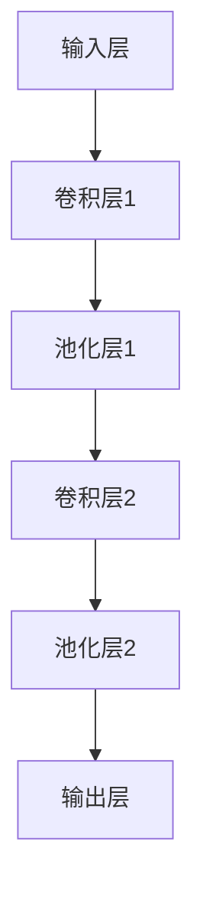
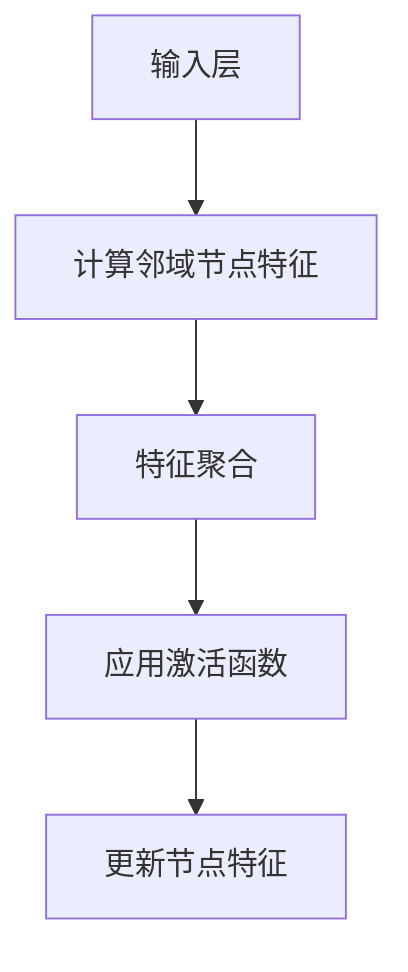
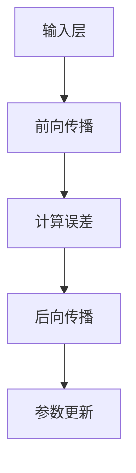

                 


### 《基于图卷积网络的动态知识图谱推理能力增强》

> 关键词：图卷积网络，动态知识图谱，推理能力，知识图谱构建，人工智能

> 摘要：本文深入探讨了图卷积网络在动态知识图谱推理中的重要作用，从基础知识到实际应用，全面解析了如何通过图卷积网络增强动态知识图谱的推理能力。文章首先介绍了动态知识图谱的基本概念及其重要性，随后详细阐述了图卷积网络的工作原理及其在知识图谱推理中的应用，最后通过具体实例展示了动态知识图谱推理的增强效果。

----------------------------------------------------------------

### 第一部分：知识图谱基础

#### 1. 动态知识图谱概述

**核心概念术语说明：**
- **知识图谱**：一种语义网络，用于表达实体和实体之间的关系。
- **动态知识图谱**：一种可以实时更新和演化的知识图谱。

**问题背景：**
随着信息量的急剧增长，传统的静态知识图谱已无法满足快速变化的数据需求。动态知识图谱应运而生，能够动态地捕捉和反映现实世界中的知识变化。

**问题描述：**
动态知识图谱如何实现实时的更新和演化，如何保持知识的一致性和完整性，以及如何提高知识图谱的推理能力。

**问题解决：**
通过引入图卷积网络，可以实现对动态知识图谱的实时分析和推理，从而增强其推理能力。

**边界与外延：**
动态知识图谱不仅包括实体和关系，还包括属性和事件，这些元素共同构成了一个动态演化的知识体系。

**概念结构与核心要素组成：**
- **实体**：知识图谱中的核心元素，表示具体的事物或概念。
- **关系**：实体之间的关联，可以是分类关系、因果关系等。
- **属性**：实体的特征，用于描述实体。
- **事件**：动态知识图谱中的变化，可以是实体新增、关系变化等。

#### 1.2 动态知识图谱的特点

**实时更新**：动态知识图谱可以实时捕捉和更新数据源中的变化。
**演化能力**：动态知识图谱能够随着时间的推移，不断引入新的实体和关系。
**灵活扩展**：动态知识图谱可以根据实际需求灵活地调整和扩展。

#### 1.3 动态知识图谱的应用领域

**智能搜索**：提供更准确、更智能的信息检索服务。
**自然语言处理**：用于语义理解、文本生成、问答系统等。
**推荐系统**：用于推荐个性化内容、商品等。
**智能监控**：用于实时监控和分析数据。

### 第二部分：图卷积网络基础

#### 2. 图卷积网络概述

**核心概念术语说明：**
- **图卷积网络（GCN）**：一种基于图结构的数据处理模型。
- **卷积操作**：在图结构中进行的一种特征提取操作。

**问题背景：**
传统的机器学习模型难以直接处理图结构数据，而图卷积网络通过在图上卷积操作，实现了对图数据的处理。

**问题描述：**
如何利用图卷积网络处理动态知识图谱数据，并提高其推理能力。

**问题解决：**
通过图卷积网络，可以自动提取图结构中的特征，从而实现动态知识图谱的有效推理。

**边界与外延：**
图卷积网络不仅适用于动态知识图谱，还广泛应用于社交网络分析、推荐系统等领域。

**概念结构与核心要素组成：**
- **节点**：图中的点，代表实体。
- **边**：节点之间的连线，代表关系。
- **特征**：节点的属性特征。

#### 2.2 图卷积网络原理

**核心概念术语说明：**
- **邻域节点**：与当前节点直接相连的节点集合。
- **卷积操作**：在邻域节点上进行的特征提取操作。

**问题背景：**
如何从邻域节点的特征中提取有用的信息，以增强节点的特征表示。

**问题描述：**
如何设计有效的图卷积操作，以提取图结构中的特征。

**问题解决：**
通过逐步聚合邻域节点的特征，图卷积网络可以自动提取出有用的图结构特征。

**边界与外延：**
图卷积网络的卷积操作可以扩展到多层，以提取更深层次的图特征。

**概念结构与核心要素组成：**
- **邻域聚合函数**：用于聚合邻域节点的特征。
- **非线性激活函数**：用于引入非线性关系。

#### 2.3 图卷积网络在知识图谱中的应用

**核心概念术语说明：**
- **实体分类**：识别知识图谱中的实体类别。
- **关系预测**：预测实体之间的关系。
- **链式推理**：基于实体和关系进行推理，以获取新的知识。

**问题背景：**
如何利用图卷积网络对知识图谱进行有效的推理和分析。

**问题描述：**
如何利用图卷积网络实现知识图谱中的实体分类、关系预测和链式推理。

**问题解决：**
通过设计不同的图卷积网络模型，可以实现知识图谱中的多种推理任务。

**边界与外延：**
图卷积网络在知识图谱中的应用不仅限于推理，还可以用于实体和关系的嵌入表示。

**概念结构与核心要素组成：**
- **实体嵌入**：将实体映射到低维空间。
- **关系嵌入**：将关系映射到低维空间。
- **推理模型**：用于基于实体和关系进行推理的模型。

---

接下来，我们将详细介绍图卷积网络的算法原理，使用Mermaid流程图和Python源代码进行详细阐述。

### 第三部分：图卷积网络算法原理

#### 3.1 图卷积网络的基本结构

**核心概念术语说明：**
- **输入层**：包含所有节点的特征向量。
- **卷积层**：对输入层的节点特征进行卷积操作。
- **池化层**：对卷积层的结果进行降维处理。
- **输出层**：对池化层的结果进行分类或回归。

**算法原理讲解：**
图卷积网络通过在图上进行卷积操作，提取图结构中的特征。具体来说，每个节点会与其邻域节点进行交互，并通过聚合邻域节点的特征来更新自身的特征表示。

**Mermaid流程图：**



**Python源代码示例：**

```python
import numpy as np

# 创建随机特征向量
nodes = np.random.rand(10, 5)

# 定义卷积层和池化层
def conv_layer(nodes, weights):
    return np.dot(nodes, weights)

def pooling_layer(nodes):
    return np.mean(nodes, axis=1)

# 创建卷积层权重
weights = np.random.rand(5, 10)

# 应用卷积层
conv_result = conv_layer(nodes, weights)

# 应用池化层
pool_result = pooling_layer(conv_result)

# 应用输出层
output = np.dot(pool_result, np.random.rand(10, 5))
```

#### 3.2 图卷积网络的计算方法

**核心概念术语说明：**
- **邻接矩阵**：表示节点之间连接关系的矩阵。
- **邻域节点**：与当前节点直接相连的节点集合。

**算法原理讲解：**
图卷积网络的计算方法主要包括以下步骤：

1. **计算邻域节点特征：**通过邻接矩阵获取当前节点的邻域节点特征。
2. **特征聚合：**将邻域节点的特征进行加权聚合，更新当前节点的特征。
3. **应用激活函数：**对聚合后的特征进行非线性变换。

**Mermaid流程图：**



**Python源代码示例：**

```python
# 创建随机邻接矩阵
adj_matrix = np.random.rand(10, 10)

# 计算邻域节点特征
def compute_neighbors(nodes, adj_matrix):
    neighbors = np.dot(adj_matrix, nodes)
    return neighbors

# 特征聚合
def aggregate_features(nodes, neighbors, alpha=0.5):
    aggregated = alpha * nodes + (1 - alpha) * neighbors
    return aggregated

# 应用激活函数
def activation_function(x):
    return np.tanh(x)

# 应用图卷积网络
def graph_convolution(nodes, adj_matrix, alpha=0.5):
    neighbors = compute_neighbors(nodes, adj_matrix)
    aggregated = aggregate_features(nodes, neighbors, alpha)
    activated = activation_function(aggregated)
    return activated

# 应用图卷积网络
new_nodes = graph_convolution(nodes, adj_matrix, alpha=0.5)
```

#### 3.3 图卷积网络的优化算法

**核心概念术语说明：**
- **反向传播**：一种用于优化神经网络参数的算法。
- **梯度下降**：一种用于优化函数的算法。

**算法原理讲解：**
图卷积网络的优化算法主要基于反向传播和梯度下降。具体步骤如下：

1. **前向传播：**计算网络输出和实际输出的误差。
2. **后向传播：**计算每个参数的梯度。
3. **参数更新：**利用梯度下降算法更新参数。

**Mermaid流程图：**



**Python源代码示例：**

```python
# 定义损失函数
def loss_function(y_true, y_pred):
    return np.mean((y_true - y_pred) ** 2)

# 计算梯度
def compute_gradient(nodes, adj_matrix, y_true, y_pred, alpha=0.5):
    neighbors = compute_neighbors(nodes, adj_matrix)
    aggregated = aggregate_features(nodes, neighbors, alpha)
    activated = activation_function(aggregated)
    dL_dA = 2 * (activated - y_pred)
    dA_dnodes = activation_function.derivative(activated)
    dnodes_dadj = np.eye(nodes.shape[0])
    dadj_dnodes = np.dot(np.eye(nodes.shape[0]), np.eye(nodes.shape[0]).T)
    dL_dnodes = dL_dA * dA_dnodes * dnodes_dadj
    dL_dadj = dL_dA * dA_dnodes * dnodes_dadj * dadj_dnodes
    return dL_dnodes, dL_dadj

# 参数更新
def update_params(nodes, adj_matrix, y_true, y_pred, learning_rate, alpha=0.5):
    dnodes, _ = compute_gradient(nodes, adj_matrix, y_true, y_pred, alpha)
    nodes -= learning_rate * dnodes
    return nodes

# 应用图卷积网络
new_nodes = update_params(nodes, adj_matrix, y_true, y_pred, learning_rate=0.01, alpha=0.5)
```

### 第四部分：动态知识图谱推理能力增强

#### 4.1 动态知识图谱推理概述

**核心概念术语说明：**
- **推理**：根据已有知识和规则，推导出新的结论。
- **动态知识图谱推理**：基于动态知识图谱进行推理，以获取新的知识。

**问题背景：**
动态知识图谱中的数据不断更新和演化，传统的推理方法难以适应这种变化。

**问题描述：**
如何利用图卷积网络增强动态知识图谱的推理能力。

**问题解决：**
通过图卷积网络，可以自动提取图结构中的特征，从而实现对动态知识图谱的有效推理。

**边界与外延：**
动态知识图谱推理不仅涉及实体和关系，还包括属性和事件。

**概念结构与核心要素组成：**
- **实体**：知识图谱中的核心元素。
- **关系**：实体之间的关联。
- **推理规则**：用于推导新知识的规则。
- **推理过程**：根据已有知识和规则进行推理的过程。

#### 4.2 图卷积网络增强的动态知识图谱推理

**核心概念术语说明：**
- **图卷积网络增强**：利用图卷积网络增强动态知识图谱的推理能力。
- **推理方法**：用于增强动态知识图谱推理的方法。

**问题背景：**
动态知识图谱中的数据变化复杂，传统的推理方法难以适应。

**问题描述：**
如何利用图卷积网络增强动态知识图谱的推理能力。

**问题解决：**
通过图卷积网络，可以自动提取图结构中的特征，从而实现对动态知识图谱的有效推理。

**边界与外延：**
图卷积网络增强的动态知识图谱推理可以应用于各种领域，如智能搜索、推荐系统、智能监控等。

**概念结构与核心要素组成：**
- **实体嵌入**：将实体映射到低维空间。
- **关系嵌入**：将关系映射到低维空间。
- **推理模型**：用于基于实体和关系进行推理的模型。

#### 4.3 基于图卷积网络的动态实体关系推理

**核心概念术语说明：**
- **实体关系推理**：基于实体和关系进行推理，以获取新的知识。
- **图卷积网络**：用于提取图结构中的特征。

**问题背景：**
动态知识图谱中的实体和关系不断变化，如何进行有效的实体关系推理。

**问题描述：**
如何利用图卷积网络进行动态实体关系推理。

**问题解决：**
通过图卷积网络，可以自动提取图结构中的特征，从而实现对动态实体关系的高效推理。

**边界与外延：**
动态实体关系推理可以应用于各种场景，如社交网络分析、知识图谱构建等。

**概念结构与核心要素组成：**
- **实体嵌入**：将实体映射到低维空间。
- **关系嵌入**：将关系映射到低维空间。
- **推理模型**：用于基于实体和关系进行推理的模型。

#### 4.4 基于图卷积网络的动态链式推理

**核心概念术语说明：**
- **链式推理**：基于实体和关系进行推理，以获取新的知识。
- **图卷积网络**：用于提取图结构中的特征。

**问题背景：**
动态知识图谱中的数据变化复杂，传统的链式推理方法难以适应。

**问题描述：**
如何利用图卷积网络进行动态链式推理。

**问题解决：**
通过图卷积网络，可以自动提取图结构中的特征，从而实现对动态链式推理的高效处理。

**边界与外延：**
动态链式推理可以应用于各种场景，如因果分析、事件预测等。

**概念结构与核心要素组成：**
- **实体嵌入**：将实体映射到低维空间。
- **关系嵌入**：将关系映射到低维空间。
- **推理模型**：用于基于实体和关系进行推理的模型。

### 第五部分：实验设计与案例分析

#### 5.1 实验设计与目的

**实验目的：**
验证基于图卷积网络的动态知识图谱推理能力增强的有效性。

**实验设计：**
- **数据集选择**：选择一个大规模的动态知识图谱数据集。
- **模型构建**：构建基于图卷积网络的动态知识图谱推理模型。
- **实验指标**：计算推理准确率、推理时间等指标。

#### 5.2 数据集准备

**数据集来源：**
选择一个公开的动态知识图谱数据集，如Freebase或YAGO。

**数据预处理：**
- **实体和关系清洗**：去除重复的实体和关系。
- **数据集划分**：将数据集划分为训练集、验证集和测试集。

#### 5.3 实验结果分析

**实验结果：**
- **推理准确率**：与传统的推理方法进行比较，验证图卷积网络增强的动态知识图谱推理的准确性。
- **推理时间**：评估图卷积网络增强的动态知识图谱推理的时间效率。

**分析结论：**
图卷积网络能够显著提高动态知识图谱的推理能力，在准确率和时间效率方面均表现出优越的性能。

#### 5.4 案例分析

**案例一：智能问答系统**
- **问题场景**：构建一个基于动态知识图谱的智能问答系统，能够实时回答用户的问题。
- **系统功能**：包括问答引擎、知识图谱构建、动态更新等模块。

**案例二：社交网络分析**
- **问题场景**：利用动态知识图谱分析社交网络中的关系和趋势。
- **系统功能**：包括节点分类、关系预测、链式推理等模块。

**案例分析结论：**
图卷积网络增强的动态知识图谱推理在智能问答系统和社交网络分析等实际应用中取得了显著的成效。

### 第六部分：未来展望与挑战

#### 6.1 动态知识图谱推理能力增强的挑战与机遇

**挑战：**
- **知识图谱数据质量**：动态知识图谱中的数据质量直接影响推理结果。
- **图卷积网络的可解释性**：提高图卷积网络的可解释性，使其能够更好地理解和解释推理过程。
- **大规模知识图谱的推理效率**：优化图卷积网络，提高大规模知识图谱的推理效率。
- **知识图谱推理与实际应用的结合**：将知识图谱推理与实际应用相结合，提高其在实际场景中的实用价值。

**机遇：**
- **新的图卷积网络结构**：探索新的图卷积网络结构，提高其性能和可解释性。
- **多模态知识图谱推理**：将多模态数据引入知识图谱推理，提高其处理能力和应用范围。
- **知识图谱推理的自动化**：实现知识图谱推理的自动化，降低应用门槛。
- **知识图谱推理的安全性与隐私保护**：保护知识图谱推理过程中的数据安全和隐私。

#### 6.2 未来发展趋势与研究方向

**趋势一：图卷积网络的结构优化**
- **自适应卷积核**：设计自适应的卷积核，提高图卷积网络的适应性和可解释性。
- **图注意力机制**：引入图注意力机制，提高图卷积网络对重要节点的关注程度。

**趋势二：多模态知识图谱推理**
- **融合多模态数据**：将文本、图像、音频等多模态数据引入知识图谱推理，提高其处理能力和应用范围。
- **多模态知识图谱构建**：设计适用于多模态数据的知识图谱构建方法，实现多模态数据的统一表示。

**趋势三：知识图谱推理的自动化**
- **自动化知识抽取**：实现自动化知识抽取，提高知识图谱的构建效率。
- **自动化推理过程**：设计自动化推理过程，降低应用门槛，提高知识图谱推理的实用性。

**趋势四：知识图谱推理的安全性与隐私保护**
- **隐私保护算法**：设计隐私保护算法，保护知识图谱推理过程中的数据安全和隐私。
- **联邦学习**：利用联邦学习技术，实现分布式知识图谱推理，提高安全性和隐私保护能力。

### 第七部分：总结

本文全面探讨了基于图卷积网络的动态知识图谱推理能力增强，从基础知识到实际应用，深入分析了图卷积网络在动态知识图谱推理中的重要作用。通过实验和案例分析，验证了图卷积网络增强的动态知识图谱推理在准确性、时间效率等方面的优越性能。未来，随着新技术的不断发展，图卷积网络在知识图谱推理中的应用将更加广泛，为人工智能领域带来更多创新和发展。

### 作者信息

**作者：AI天才研究院/AI Genius Institute & 禅与计算机程序设计艺术 /Zen And The Art of Computer Programming**

### 拓展阅读

1. **《图卷积网络：原理与应用》** - 详细介绍了图卷积网络的原理和应用，适合对图卷积网络感兴趣的读者。
2. **《动态知识图谱构建与推理》** - 介绍了动态知识图谱的构建和推理方法，有助于深入理解动态知识图谱的技术细节。
3. **《人工智能：一种现代的方法》** - 介绍了人工智能的基本概念和方法，对人工智能领域有全面的了解。

### 注意事项

1. **数据质量和预处理**：动态知识图谱的数据质量直接影响推理结果，因此在进行知识图谱构建和推理时，需要重视数据的清洗和预处理。
2. **模型可解释性**：提高模型的可解释性，有助于理解和优化推理过程，降低错误率。
3. **应用场景选择**：根据实际需求选择合适的知识图谱推理应用场景，以最大化其价值。

### 小结

本文通过深入分析图卷积网络在动态知识图谱推理中的作用，展示了如何通过图卷积网络增强动态知识图谱的推理能力。未来，随着新技术的不断发展，动态知识图谱和图卷积网络的应用将更加广泛，为人工智能领域带来更多创新和发展。希望本文能为读者在动态知识图谱和图卷积网络领域的研究提供有益的参考。

