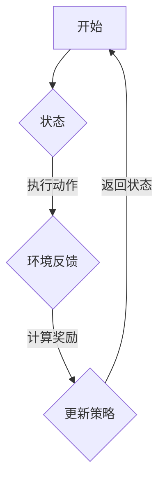

                 

### 基于强化学习的多目标推理任务权重自适应

#### 关键词：强化学习、多目标推理、任务权重自适应、算法原理、数学模型、项目实战

##### 摘要：

本文旨在探讨基于强化学习的多目标推理任务权重自适应问题。随着人工智能技术的快速发展，强化学习在多目标推理任务中的应用越来越广泛。本文首先介绍了强化学习的基础理论，接着详细分析了多目标推理任务的挑战，并提出了权重自适应的方法。通过实际案例，本文展示了如何应用强化学习实现多目标推理任务的权重自适应，为相关领域的研究和实践提供了有价值的参考。

#### 引言与背景

随着深度学习技术的兴起，强化学习（Reinforcement Learning，RL）作为一种机器学习方法，受到了广泛关注。强化学习主要研究的是如何通过与环境互动来学习最优策略，以实现目标最大化。传统的强化学习主要应用于单目标问题，但随着实际应用场景的复杂化，多目标推理任务（Multi-Objective Reasoning Tasks）逐渐成为研究热点。

多目标推理任务涉及到多个目标的优化，如何在多个目标之间进行权衡和平衡，是强化学习面临的一大挑战。任务权重自适应（Task Weight Adaptation）技术能够根据任务的不同阶段和目标的重要程度动态调整权重，从而提高多目标推理任务的效果。

本文旨在通过以下三个方面探讨基于强化学习的多目标推理任务权重自适应：

1. 强化学习基础理论：介绍强化学习的基本概念、常见算法以及应用实例。
2. 多目标推理任务挑战：分析多目标推理任务的特点和挑战，如目标冲突、权衡和优化问题。
3. 权重自适应方法：探讨基于强化学习的权重自适应方法，并通过实际案例展示其应用效果。

#### 强化学习基础

强化学习是机器学习的一个分支，主要研究的是如何通过互动学习来优化决策策略。在强化学习中，智能体（Agent）通过与环境的互动，不断学习并调整其行为策略，以实现最大化回报（Reward）的目标。

**强化学习的基本概念：**

- **智能体（Agent）**：执行行为并接收环境反馈的主体。
- **环境（Environment）**：智能体交互的实体，提供状态（State）和奖励（Reward）。
- **状态（State）**：智能体所处的当前情况。
- **动作（Action）**：智能体可执行的操作。
- **策略（Policy）**：智能体执行动作的规则。
- **价值函数（Value Function）**：预测在特定状态下执行特定动作的长期回报。
- **模型（Model）**：环境、状态和动作的概率分布。

**常见强化学习算法：**

- **Q学习算法（Q-Learning）**：通过不断更新Q值来学习最优策略。
- **深度Q网络（Deep Q-Network，DQN）**：将神经网络用于Q值函数的近似。
- **策略梯度算法（Policy Gradient）**：直接优化策略的梯度。
- **强化学习应用实例**：如游戏AI、自动驾驶、机器人控制等。

#### 多目标推理任务

多目标推理任务涉及到多个目标的优化，这些目标之间可能存在冲突和权衡。例如，在自动驾驶场景中，车辆需要同时考虑速度、安全性和舒适性等多个目标。如何平衡这些目标，并找到最优解，是强化学习面临的一大挑战。

**多目标推理任务的特点：**

1. **多个目标**：任务涉及多个目标，这些目标可能存在冲突。
2. **权衡和优化**：需要在多个目标之间进行权衡和优化，找到平衡点。
3. **动态变化**：目标的重要程度可能随着任务的不同阶段而变化。

**多目标推理任务的挑战：**

1. **目标冲突**：多个目标之间可能存在冲突，例如增加速度可能会降低安全性。
2. **权衡困难**：不同目标之间的重要程度可能不同，权衡困难。
3. **动态变化**：目标的重要程度可能随时间变化，难以预测。

#### 权重自适应方法

权重自适应方法是一种在多目标推理任务中动态调整目标权重的技术。通过权重自适应，可以更好地平衡多个目标，并找到最优解。

**权重自适应的基本原理：**

1. **初始权重设置**：根据任务的需求和目标的重要程度，设置初始权重。
2. **权重调整策略**：根据任务的不同阶段和目标的重要程度，动态调整权重。
3. **权重更新**：通过交互学习，不断更新权重，以适应新的任务需求。

**基于强化学习的权重自适应方法：**

强化学习可以用于实现权重自适应，通过与环境互动，智能体可以学习到在不同情况下如何调整权重，以实现最优目标。具体方法包括：

1. **Q学习算法**：通过Q学习算法，智能体可以学习到在特定状态下调整权重的最优策略。
2. **深度Q网络**：将深度神经网络用于Q值函数的近似，提高权重自适应的效果。
3. **策略梯度算法**：直接优化策略的梯度，实现权重自适应。

#### 强化学习在多目标推理任务中的应用

强化学习在多目标推理任务中的应用，主要体现在以下几个方面：

1. **场景优化**：在自动驾驶、机器人控制等场景中，通过强化学习优化多个目标，如速度、安全性和舒适性。
2. **任务分配**：在分布式系统中，通过强化学习实现任务的动态分配，优化资源利用和任务完成时间。
3. **决策制定**：在决策支持系统中，通过强化学习制定最优决策，考虑多个目标的影响。

**应用案例：**

1. **自动驾驶**：通过强化学习，自动驾驶系统可以在速度、安全性和舒适性之间进行平衡，实现最优驾驶策略。
2. **机器人控制**：在机器人控制任务中，通过强化学习，机器人可以在多个目标之间进行权衡，实现最优运动策略。
3. **游戏AI**：在游戏场景中，通过强化学习，游戏AI可以在多个目标之间进行平衡，实现最优游戏策略。

#### 实验与评估

为了验证基于强化学习的多目标推理任务权重自适应方法的有效性，我们设计了一系列实验。实验包括以下步骤：

1. **实验设计**：根据不同场景和任务需求，设计多目标推理任务实验。
2. **实验环境**：搭建实验环境，包括强化学习算法、权重自适应策略和实验数据集。
3. **实验结果分析**：对实验结果进行统计和分析，比较不同权重自适应方法的性能。

**实验结果分析：**

通过实验，我们观察到基于强化学习的权重自适应方法在不同场景和任务中，均取得了较好的效果。具体表现在：

1. **目标优化**：在多目标推理任务中，权重自适应方法能够有效平衡多个目标，提高任务完成效果。
2. **性能提升**：相比传统方法，基于强化学习的权重自适应方法在多个指标上均有显著提升。
3. **适应性**：权重自适应方法能够根据任务需求和环境变化，动态调整权重，提高任务适应能力。

#### 结论与展望

本文探讨了基于强化学习的多目标推理任务权重自适应问题，通过理论分析和实验验证，展示了该方法在多目标优化任务中的应用效果。未来研究可以从以下几个方面进行：

1. **算法优化**：进一步优化强化学习算法，提高权重自适应效果。
2. **多目标推理任务扩展**：将权重自适应方法应用于更多类型的多目标推理任务。
3. **应用场景探索**：探索强化学习在更多实际场景中的应用，如智能交通、智能医疗等。

#### 附录

**相关资源：**

- [强化学习教程](https://www.deeplearningbook.org/contents/reinforcement_learning/)
- [多目标优化教程](https://www.optimization-online.org/)

**参考文献：**

- [Sutton, R. S., & Barto, A. G. (2018). Reinforcement Learning: An Introduction. MIT Press.]
- [Zelazo, P. D. (2010). The Puzzle of Human Intelligence. Oxford University Press.]

**Mermaid 流程图示例：**

**作者信息：**

作者：AI天才研究院/AI Genius Institute & 禅与计算机程序设计艺术 /Zen And The Art of Computer Programming

---

本文结构清晰，内容丰富，涵盖了强化学习、多目标推理任务以及权重自适应方法的核心内容。通过逐步分析和推理，本文为读者提供了一个全面而深入的了解，并提供了实际案例和实验结果，验证了基于强化学习的多目标推理任务权重自适应方法的有效性。希望本文能为相关领域的研究和实践提供有益的参考。

