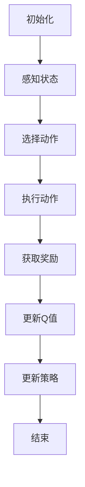

                 

### 深度学习与强化学习：探索基于强化学习的自适应推理策略生成

#### 引言

在当今的人工智能（AI）研究中，强化学习（Reinforcement Learning，RL）和深度学习（Deep Learning，DL）无疑是两个备受瞩目的领域。强化学习通过试错法从环境中学习最优策略，而深度学习则通过大规模数据训练复杂的神经网络。两者的结合，使得AI系统能够在复杂动态环境中实现更加智能的行为。

本文的主题是基于强化学习的自适应推理策略生成。自适应推理策略是AI系统在处理不确定性问题时，通过不断调整和优化策略来提高决策效率。这种策略不仅在游戏、机器人控制等领域有着广泛的应用，还在推荐系统、自动驾驶等实际场景中展现出巨大的潜力。

本文将从以下几个方面展开：

1. **强化学习概述**：介绍强化学习的基本概念、核心问题和主要算法。
2. **自适应推理策略**：探讨自适应推理的基本概念、优势和应用场景。
3. **强化学习与自适应推理的联系**：分析强化学习在自适应推理策略中的应用和相互作用。
4. **强化学习基础**：详细讲解强化学习的基本理论、策略评估和策略优化。
5. **自适应推理策略生成**：介绍基于强化学习的自适应推理策略生成方法。
6. **实例分析**：通过推荐系统和自动驾驶等实际案例，展示自适应推理策略的应用。
7. **强化学习在自适应推理策略中的应用**：探讨强化学习在自适应推理策略中的挑战和解决方案。
8. **结论与展望**：总结文章的主要结论和未来研究方向。

通过本文的探讨，我们希望读者能够对基于强化学习的自适应推理策略生成有一个全面而深入的理解。让我们一起探索这个令人兴奋的领域，并思考如何将其应用于实际问题中。

#### 1.1 强化学习概述

**1.1.1 强化学习的基本概念**

强化学习是一种通过试错法从环境中学习最优策略的机器学习技术。与监督学习和无监督学习不同，强化学习不依赖于预先标记的数据，而是通过与环境的交互来不断调整行为策略，以实现长期目标。

强化学习的核心概念包括以下几个要素：

- **代理人（Agent）**：执行动作并从环境中获取反馈的实体。
- **环境（Environment）**：代理人生存和行动的场所，会根据代理人的动作产生状态转移和奖励。
- **状态（State）**：描述代理人当前所处的情况。
- **动作（Action）**：代理人在特定状态下可以采取的行动。
- **奖励（Reward）**：代理人在执行动作后从环境中获得的即时反馈，用于评估策略的优劣。

强化学习的基本目标是找到一种策略，使得代理人能够在长期内获得最大化的总奖励。这种策略通常被称为最优策略（Optimal Policy）。

**1.1.2 强化学习与机器学习的关系**

强化学习是机器学习的一个重要分支，它与其他机器学习方法有着密切的联系和区别。

- **与监督学习的区别**：监督学习依赖于预先标记的数据集，通过学习输入和输出之间的映射关系来预测未知数据。而强化学习则通过与环境互动来学习最优策略，不需要预先标记的数据。
- **与无监督学习的区别**：无监督学习旨在发现数据中的内在结构和模式，如聚类和降维。强化学习则更关注于通过学习策略来最大化长期奖励。
- **与深度学习的结合**：深度学习是强化学习中的一个重要工具，通过构建深度神经网络来学习状态值函数（State-Value Function）和策略函数（Policy Function）。这种结合使得强化学习能够处理更复杂的任务和环境。

**1.1.3 强化学习的主要挑战**

尽管强化学习在许多领域展现出了巨大的潜力，但它也面临着一些主要的挑战：

- **样本效率（Sample Efficiency）**：强化学习通常需要大量的交互来学习最优策略，这可能导致训练过程非常耗时。如何提高样本效率，减少训练时间，是一个重要的研究方向。
- **收敛性（Convergence）**：强化学习算法需要收敛到最优策略。在实际应用中，环境复杂、状态空间大，可能导致算法无法收敛或者收敛速度非常慢。
- **可解释性（Interpretability）**：强化学习模型通常被视为“黑盒子”，其内部工作机制难以解释。这限制了其在某些领域的应用，如医疗和金融。
- **在线学习（Online Learning）**：在实际应用中，环境是动态变化的，代理人需要不断调整策略来适应新的环境。如何实现有效的在线学习，是一个重要的挑战。

**1.1.4 强化学习的主要算法**

强化学习领域存在多种算法，下面简要介绍几种主要的算法：

- **Q-Learning**：Q-Learning是基于值函数的强化学习算法，通过更新Q值（状态-动作值函数）来学习最优策略。其核心思想是利用当前状态和动作的Q值来预测未来奖励，并根据预测结果调整Q值。
- **SARSA（Q-Learning的变体）**：SARSA是一种同时更新状态-动作对的算法，它不仅利用当前状态和动作的Q值来更新Q值，还利用下一状态和动作的Q值来更新。
- **Deep Q-Network（DQN）**：DQN是结合深度学习的强化学习算法，它使用深度神经网络来近似Q值函数。通过经验回放（Experience Replay）和目标网络（Target Network）等技术，DQN解决了深度强化学习中的训练问题。
- **Policy Gradient**：Policy Gradient算法直接优化策略函数，通过梯度上升法来更新策略参数。其核心思想是最大化期望奖励，从而学习到最优策略。

这些算法各有优缺点，适用于不同的应用场景。了解这些算法的基本原理和特点，对于深入理解和应用强化学习至关重要。

#### 1.2 自适应推理策略

**1.2.1 自适应推理的基本概念**

自适应推理是指AI系统在面对不确定性和动态环境时，能够根据实时信息调整自身的推理策略，以提高决策效率和准确性的能力。与传统的固定推理策略不同，自适应推理策略能够适应环境变化，具有更高的灵活性和适应性。

自适应推理的核心概念包括以下几个要素：

- **状态感知（State Awareness）**：系统能够感知和识别当前的状态，并根据状态特征调整推理策略。
- **策略调整（Policy Adjustment）**：系统根据实时反馈和状态变化，动态调整推理策略，以适应新的环境和目标。
- **反馈机制（Feedback Mechanism）**：系统能够接收来自环境的反馈，并利用这些反馈来优化推理策略。

**1.2.2 自适应推理的优势**

自适应推理策略在处理不确定性和动态环境时具有显著的优势：

- **动态适应性**：系统能够根据环境的变化实时调整推理策略，提高决策的灵活性。
- **鲁棒性**：自适应推理策略能够适应不同类型的不确定性，提高系统的鲁棒性。
- **效率提升**：通过实时调整策略，系统能够更高效地处理复杂任务，提高决策效率。
- **学习性**：自适应推理策略能够从历史数据和反馈中学习，不断优化推理策略。

**1.2.3 自适应推理的应用场景**

自适应推理策略在许多实际应用场景中具有重要价值，下面列举几个典型的应用场景：

- **推荐系统**：推荐系统需要根据用户的行为和偏好动态调整推荐策略，以提供个性化的推荐结果。
- **自动驾驶**：自动驾驶系统需要实时感知道路环境，并根据环境变化调整驾驶策略，以确保行车安全。
- **金融风险管理**：金融系统需要根据市场波动和风险变化，动态调整投资策略，以最大化收益并控制风险。
- **智能医疗**：智能医疗系统需要根据患者的实时病情和医学知识库，动态调整治疗方案，以提高治疗效果。

通过这些应用场景，我们可以看到自适应推理策略在提高系统性能和用户体验方面的重要性。

#### 1.3 强化学习与自适应推理策略的联系

**1.3.1 强化学习在自适应推理策略中的应用**

强化学习在自适应推理策略中的应用主要表现在以下几个方面：

- **策略优化**：强化学习通过策略优化算法，如Q-Learning和Policy Gradient，来学习最优策略。这些策略可以用于自适应推理，使系统能够在不确定性和动态环境中做出高效决策。
- **状态评估**：强化学习中的值函数可以用于评估当前状态的价值，为自适应推理提供参考。通过这些评估结果，系统能够动态调整推理策略，以最大化长期奖励。
- **经验回放**：强化学习中的经验回放技术，可以将历史交互经验用于当前学习过程。这种技术有助于自适应推理策略从经验中学习，并优化策略调整。

**1.3.2 自适应推理策略在强化学习中的作用**

自适应推理策略在强化学习中也发挥着重要作用：

- **动态调整学习目标**：自适应推理策略可以根据环境变化，动态调整强化学习的学习目标。例如，在自动驾驶中，自适应推理策略可以根据道路状况和交通情况，调整驾驶目标，以确保行车安全。
- **提高学习效率**：自适应推理策略通过实时调整推理策略，有助于减少强化学习中的样本效率问题。这种策略能够使系统更快地适应环境变化，提高学习效率。
- **增强鲁棒性**：自适应推理策略能够使强化学习系统在面对不确定性和动态变化时，保持较高的鲁棒性。这种策略有助于系统在复杂环境中稳定运行，减少失败的风险。

**1.3.3 强化学习与自适应推理策略的互动关系**

强化学习与自适应推理策略之间存在互动关系，这种互动关系使得两者能够相互补充，共同提高系统的性能：

- **相互促进**：强化学习通过自适应推理策略，能够更好地适应动态环境，提高策略优化的效率。同时，自适应推理策略通过强化学习，能够学习到更加智能和高效的策略。
- **优势互补**：强化学习擅长解决动态和不确定性的环境问题，而自适应推理策略则能够提高系统的灵活性和鲁棒性。两者结合，使得系统在复杂环境中能够实现更加智能和高效的决策。
- **持续优化**：通过不断调整和优化，强化学习和自适应推理策略可以持续提高系统的性能。这种持续优化的过程，有助于系统在不断变化的环境中保持领先地位。

总之，强化学习与自适应推理策略的相互作用，为AI系统在动态和不确定环境中实现高效决策提供了强有力的支持。通过深入理解和应用这些策略，我们可以期待AI系统在各个领域取得更加卓越的成果。

#### 1.4 本书结构安排

为了帮助读者全面深入地理解基于强化学习的自适应推理策略生成，本书将分为五个主要部分：

1. **引言**：介绍强化学习和自适应推理策略的基本概念、主要挑战和应用场景。这部分将为读者提供对整个主题的初步认识。

2. **强化学习基础**：详细讲解强化学习的基本理论，包括强化学习的基本问题、主要算法、策略评估和策略优化。这部分内容将为读者奠定坚实的理论基础。

3. **自适应推理策略生成**：介绍自适应推理策略的基本概念、生成方法以及性能评估。这部分内容将帮助读者了解如何构建和应用自适应推理策略。

4. **强化学习在自适应推理策略中的应用**：探讨强化学习在自适应推理策略中的应用方法、挑战和解决方案。通过实例分析，展示强化学习在推荐系统和自动驾驶等实际场景中的应用。

5. **结论与展望**：总结本书的主要结论，并对未来的研究方向进行展望。这部分内容将帮助读者了解基于强化学习的自适应推理策略生成的最新进展和未来发展趋势。

通过这五个部分的系统讲解，读者将能够全面深入地掌握基于强化学习的自适应推理策略生成，并能够将其应用于实际问题中。

#### 2.1 强化学习基础

**2.1.1 强化学习的基本理论**

强化学习（Reinforcement Learning，RL）是一种通过试错法从环境中学习最优策略的机器学习技术。其基本理论主要包括以下几个核心概念：

- **马尔可夫决策过程（MDP）**：强化学习通常被视为在一个马尔可夫决策过程（Markov Decision Process，MDP）中进行的。MDP包括以下几个要素：

  - **状态（State）**：系统所处的内部条件，通常用\( S \)表示。
  - **动作（Action）**：系统可以采取的行为，通常用\( A \)表示。
  - **奖励（Reward）**：系统在执行动作后从环境中获得的即时反馈，通常用\( R(s, a) \)表示。
  - **转移概率（Transition Probability）**：系统从当前状态\( s \)采取动作\( a \)后，转移到下一个状态\( s' \)的概率，通常用\( P(s'|s, a) \)表示。
  - **策略（Policy）**：系统在给定状态\( s \)下采取的动作\( a \)，通常用\( \pi(s, a) \)表示。

  MDP可以用一个五元组\( (S, A, R, P, \pi) \)来表示。

- **价值函数（Value Function）**：价值函数用于评估系统在某个状态下的期望奖励。主要有两种价值函数：

  - **状态值函数（State-Value Function）**：表示系统在状态\( s \)下执行最优策略\( \pi^* \)的期望回报，通常用\( V^*(s) \)表示。
    $$ V^*(s) = \sum_{a \in A} \pi^*(s, a) \sum_{s' \in S} P(s'|s, a) R(s') + \gamma \sum_{s' \in S} P(s'|s, a) V^*(s') $$
    其中，\( \gamma \)是折扣因子，表示对未来的奖励进行折扣。

  - **动作值函数（Action-Value Function）**：表示系统在状态\( s \)下执行动作\( a \)的期望回报，通常用\( Q^*(s, a) \)表示。
    $$ Q^*(s, a) = \sum_{s' \in S} P(s'|s, a) R(s') + \gamma \sum_{s' \in S} P(s'|s, a) V^*(s') $$

- **策略（Policy）**：策略是系统在给定状态\( s \)下采取的动作\( a \)。主要有两种策略：

  - **最优策略（Optimal Policy）**：使价值函数达到最大值的策略，通常用\( \pi^* \)表示。
    $$ \pi^*(s) = \arg\max_{a \in A} Q^*(s, a) $$

  - **行为策略（Behavior Policy）**：系统实际采取的策略，可能不是最优策略。

- **策略评估（Policy Evaluation）**：策略评估是通过迭代方法计算给定策略下的价值函数。常用的策略评估算法包括值迭代（Value Iteration）和策略迭代（Policy Iteration）。

- **策略优化（Policy Optimization）**：策略优化是通过策略评估结果来调整策略，以提高期望回报。常用的策略优化算法包括Q-Learning和Policy Gradient。

**2.1.2 强化学习的主要算法**

强化学习领域存在多种算法，下面介绍几种主要的算法：

- **Q-Learning**：Q-Learning是一种基于值函数的强化学习算法。它通过迭代更新Q值来学习最优策略。

  Q-Learning的算法步骤如下：

  1. 初始化Q值表\( Q(s, a) \)。
  2. 对于每个状态\( s \)和动作\( a \)，执行以下更新：
    $$ Q(s, a) \leftarrow Q(s, a) + \alpha [R(s, a) + \gamma \max_{a'} Q(s', a') - Q(s, a)] $$
    其中，\( \alpha \)是学习率，\( \gamma \)是折扣因子。

  Q-Learning的核心思想是通过当前状态的奖励和未来状态的Q值来更新Q值。这种迭代更新过程，使得Q值逐渐接近最优值。

- **SARSA（Q-Learning的变体）**：SARSA（State-Action-Reward-State-Action）是一种同时更新状态-动作对的算法。它不仅利用当前状态和动作的Q值来更新Q值，还利用下一状态和动作的Q值来更新。

  SARSA的算法步骤如下：

  1. 初始化Q值表\( Q(s, a) \)。
  2. 对于每个状态\( s \)和动作\( a \)，执行以下更新：
    $$ Q(s, a) \leftarrow Q(s, a) + \alpha [R(s, a) + \gamma Q(s', a') - Q(s, a)] $$
    其中，\( \alpha \)是学习率，\( \gamma \)是折扣因子。

  SARSA的核心思想是通过当前状态和动作的Q值以及下一状态和动作的Q值来更新Q值。这种同时更新的方法，使得算法具有更好的稳定性。

- **Deep Q-Network（DQN）**：DQN（Deep Q-Network）是结合深度学习的强化学习算法。它使用深度神经网络来近似Q值函数，通过经验回放和目标网络等技术，解决了深度强化学习中的训练问题。

  DQN的算法步骤如下：

  1. 初始化深度神经网络\( Q(\cdot|\cdot; \theta) \)。
  2. 对于每个状态\( s \)和动作\( a \)，执行以下更新：
    $$ \theta \leftarrow \theta + \alpha [y - Q(s, a)] \odot \grad{Q(s, a)}{\theta} $$
    其中，\( y \)是实际获得的奖励，\( \alpha \)是学习率。

  DQN的核心思想是通过深度神经网络来近似Q值函数，并通过经验回放和目标网络等技术来稳定训练过程。这种结合深度学习的强化学习算法，能够处理更加复杂的任务和环境。

- **Policy Gradient**：Policy Gradient算法直接优化策略函数，通过梯度上升法来更新策略参数。其核心思想是最大化期望奖励，从而学习到最优策略。

  Policy Gradient的算法步骤如下：

  1. 初始化策略参数\( \theta \)。
  2. 对于每个状态\( s \)和动作\( a \)，执行以下更新：
    $$ \theta \leftarrow \theta + \alpha \nabla_{\theta} J(\theta) $$
    其中，\( J(\theta) \)是策略损失函数，\( \alpha \)是学习率。

  Policy Gradient的核心思想是通过优化策略参数，使得策略函数最大化期望奖励。这种直接优化策略函数的方法，能够快速学习到最优策略。

**2.1.3 强化学习的收敛性分析**

强化学习的收敛性是指算法最终能够找到最优策略或接近最优策略。对于不同的强化学习算法，收敛性有不同的分析结果。

- **Q-Learning**：Q-Learning算法在满足一定条件下，可以收敛到最优值函数。具体来说，当学习率\( \alpha \)足够小，折扣因子\( \gamma \)足够大时，Q-Learning算法可以收敛。

  $$ \lim_{t \to \infty} Q(s, a) = V^*(s) $$

- **SARSA**：SARSA算法与Q-Learning类似，也可以收敛到最优值函数。SARSA算法通过同时更新状态-动作对，使得算法更加稳定。

  $$ \lim_{t \to \infty} Q(s, a) = V^*(s) $$

- **DQN**：DQN算法通过经验回放和目标网络等技术，可以稳定训练过程，并收敛到最优值函数。DQN算法的收敛性分析相对复杂，通常需要满足一些特定的条件。

  $$ \lim_{t \to \infty} Q(s, a) = V^*(s) $$

- **Policy Gradient**：Policy Gradient算法的收敛性相对复杂。当策略函数满足一定的条件时，Policy Gradient算法可以收敛。具体来说，当策略函数是连续可微的，且梯度存在时，Policy Gradient算法可以收敛。

  $$ \lim_{t \to \infty} \theta = \theta^* $$

总之，强化学习的收敛性分析是强化学习研究的一个重要方面。通过分析不同算法的收敛性，可以更好地理解算法的性质和适用场景。在实际应用中，通常需要根据具体问题和环境特点，选择合适的算法和参数，以确保算法的收敛性。

### 2.2 策略评估

**2.2.1 策略评估的基本概念**

策略评估是强化学习中的一个核心步骤，其主要任务是计算给定策略下的状态值函数。策略评估的目的是为了了解系统在执行特定策略时，每个状态的价值，从而为策略优化提供基础。

在策略评估中，我们主要关注以下几个概念：

- **策略（Policy）**：策略是系统在给定状态\( s \)下采取的动作\( a \)。策略可以用一个概率分布来表示，即\( \pi(a|s) \)，表示在状态\( s \)下采取动作\( a \)的概率。
- **状态值函数（State-Value Function）**：状态值函数用于评估系统在某个状态\( s \)下执行给定策略\( \pi \)的期望回报。状态值函数通常用\( V^\pi(s) \)表示。
- **策略评估问题**：策略评估问题是指对于给定的策略\( \pi \)，如何计算状态值函数\( V^\pi(s) \)。

**2.2.2 策略评估算法**

策略评估算法是通过迭代方法计算给定策略下的状态值函数。常用的策略评估算法包括值迭代（Value Iteration）和策略迭代（Policy Iteration）。

- **值迭代（Value Iteration）**：值迭代是一种基于动态规划的方法，通过迭代更新状态值函数，直到收敛。值迭代的基本步骤如下：

  1. 初始化状态值函数\( V(s) \)为任意初始值。
  2. 对于每个状态\( s \)，计算新的状态值函数：
     $$ V^{new}(s) = \sum_{a} \pi(a|s) \sum_{s'} P(s'|s, a) [R(s', a) + \gamma V^{new}(s')] $$
  3. 重复步骤2，直到状态值函数收敛，即\( |V^{new}(s) - V^{old}(s)| < \epsilon \)。

  值迭代算法的核心思想是通过迭代更新状态值函数，使其逐渐逼近最优状态值函数。值迭代算法简单有效，但在一些复杂的环境中，收敛速度可能较慢。

- **策略迭代（Policy Iteration）**：策略迭代是一种通过交替迭代策略评估和策略优化的方法。策略迭代的基本步骤如下：

  1. 初始化策略\( \pi \)为任意初始策略。
  2. 使用策略评估算法计算状态值函数\( V^\pi \)。
  3. 使用策略优化算法更新策略\( \pi \)，使得策略下的状态值函数最大化。
  4. 重复步骤2和3，直到策略收敛，即策略不变或者变化很小。

  策略迭代算法的核心思想是通过交替迭代策略评估和策略优化，逐步优化策略，直到找到最优策略。策略迭代算法通常收敛速度较快，但在某些复杂环境中，评估和优化的计算复杂度较高。

**2.2.3 策略评估的性能分析**

策略评估的性能主要取决于评估算法的计算复杂度和收敛速度。下面从几个方面分析策略评估的性能：

- **计算复杂度**：策略评估算法的计算复杂度取决于状态和动作的数量。对于值迭代算法，其计算复杂度为\( O(S \times A) \)，其中\( S \)是状态数，\( A \)是动作数。对于策略迭代算法，其计算复杂度也为\( O(S \times A) \)，但在每次迭代中，策略评估和策略优化的计算复杂度可能不同。

- **收敛速度**：策略评估算法的收敛速度取决于策略和环境的特性。对于值迭代算法，其收敛速度较快，但可能在某些复杂环境中收敛速度较慢。对于策略迭代算法，其收敛速度通常较快，但在某些复杂环境中，可能需要更多的迭代次数。

- **鲁棒性**：策略评估算法的鲁棒性取决于算法对环境变化的适应性。对于值迭代算法和策略迭代算法，其鲁棒性较好，但在一些动态变化的环境中，可能需要额外的技术来保证算法的稳定性。

- **可解释性**：策略评估算法的可解释性取决于算法的透明度和可理解性。对于值迭代算法和策略迭代算法，其计算过程和结果相对透明，但可能在某些复杂环境中难以解释。对于一些基于深度学习的策略评估算法，其结果可能更难以解释。

综上所述，策略评估算法的性能取决于多个因素，包括计算复杂度、收敛速度、鲁棒性和可解释性。在实际应用中，需要根据具体问题和环境特点，选择合适的策略评估算法，并对其进行性能分析和优化。

#### 2.3 策略优化

**2.3.1 策略优化的基本概念**

策略优化是强化学习中的一个核心步骤，其主要任务是通过策略评估得到的状态值函数来调整策略，从而优化系统的长期回报。策略优化的目的是找到一种最优策略，使得系统能够在长期内获得最大化的总奖励。

在策略优化中，我们主要关注以下几个概念：

- **策略（Policy）**：策略是系统在给定状态\( s \)下采取的动作\( a \)。策略可以用一个概率分布来表示，即\( \pi(a|s) \)，表示在状态\( s \)下采取动作\( a \)的概率。
- **策略优化（Policy Optimization）**：策略优化是通过策略评估得到的状态值函数来调整策略，以优化系统的长期回报。策略优化的目标是找到一种最优策略，使得状态值函数最大化。
- **策略评估（Policy Evaluation）**：策略评估是计算给定策略下的状态值函数。策略评估为策略优化提供了基础，通过策略评估，我们可以了解系统在执行特定策略时，每个状态的价值。

**2.3.2 策略优化算法**

策略优化算法是通过策略评估得到的状态值函数来调整策略。常用的策略优化算法包括Q-Learning和Policy Gradient。

- **Q-Learning**：Q-Learning是一种基于值函数的策略优化算法。Q-Learning通过更新Q值（状态-动作值函数）来学习最优策略。Q-Learning的基本步骤如下：

  1. 初始化Q值表\( Q(s, a) \)。
  2. 对于每个状态\( s \)和动作\( a \)，执行以下更新：
     $$ Q(s, a) \leftarrow Q(s, a) + \alpha [R(s, a) + \gamma \max_{a'} Q(s', a') - Q(s, a)] $$
     其中，\( \alpha \)是学习率，\( \gamma \)是折扣因子。

  Q-Learning的核心思想是通过当前状态的奖励和未来状态的Q值来更新Q值。这种迭代更新过程，使得Q值逐渐接近最优值。

- **Policy Gradient**：Policy Gradient是一种基于策略的优化算法。Policy Gradient通过直接优化策略参数来学习最优策略。Policy Gradient的基本步骤如下：

  1. 初始化策略参数\( \theta \)。
  2. 对于每个状态\( s \)和动作\( a \)，执行以下更新：
     $$ \theta \leftarrow \theta + \alpha \nabla_{\theta} J(\theta) $$
     其中，\( J(\theta) \)是策略损失函数，\( \alpha \)是学习率。

  Policy Gradient的核心思想是通过优化策略参数，使得策略函数最大化期望回报。这种直接优化策略函数的方法，能够快速学习到最优策略。

**2.3.3 策略优化的性能分析**

策略优化的性能主要取决于优化算法的计算复杂度、收敛速度和稳定性。下面从几个方面分析策略优化的性能：

- **计算复杂度**：策略优化的计算复杂度取决于状态和动作的数量。对于Q-Learning算法，其计算复杂度为\( O(S \times A) \)，其中\( S \)是状态数，\( A \)是动作数。对于Policy Gradient算法，其计算复杂度通常较低，但具体复杂度取决于策略函数的形式。

- **收敛速度**：策略优化的收敛速度取决于策略和环境的特性。对于Q-Learning算法，其收敛速度通常较快，但可能在某些复杂环境中收敛速度较慢。对于Policy Gradient算法，其收敛速度通常较快，但在某些复杂环境中，可能需要更多的迭代次数。

- **稳定性**：策略优化的稳定性取决于算法对环境变化的适应性。对于Q-Learning算法，其稳定性较好，但在某些动态变化的环境中，可能需要额外的技术来保证算法的稳定性。对于Policy Gradient算法，其稳定性相对较差，但在一些简单环境中，具有较好的稳定性。

- **可解释性**：策略优化的可解释性取决于算法的透明度和可理解性。对于Q-Learning算法，其计算过程和结果相对透明，但可能在某些复杂环境中难以解释。对于Policy Gradient算法，其计算过程和结果可能更难以解释。

综上所述，策略优化算法的性能取决于多个因素，包括计算复杂度、收敛速度、稳定性和可解释性。在实际应用中，需要根据具体问题和环境特点，选择合适的策略优化算法，并对其进行性能分析和优化。

### 3.1 自适应推理策略概述

**3.1.1 自适应推理策略的基本概念**

自适应推理策略是指系统在处理不确定性问题时，通过实时调整推理过程来提高决策效率的策略。这种策略能够根据当前状态和反馈信息动态调整推理方法，以应对不断变化的环境。

在自适应推理策略中，几个关键概念需要明确：

- **状态（State）**：系统当前所处的环境条件，通常用\( S \)表示。
- **动作（Action）**：系统可以采取的行为，通常用\( A \)表示。
- **策略（Policy）**：系统在给定状态\( s \)下采取的动作\( a \)，通常用\( \pi(s, a) \)表示。
- **推理过程（Inference Process）**：系统根据当前状态和策略进行推理的过程。
- **反馈（Feedback）**：系统在执行动作后从环境中获得的即时反馈，通常用\( f(s, a) \)表示。

自适应推理策略的核心目标是使系统能够在不确定性环境中高效地推理，并不断优化推理过程，以提高决策效率和准确性。

**3.1.2 自适应推理策略的类型**

自适应推理策略可以分为以下几种类型：

- **基于规则的策略**：这种策略通过预设的规则来指导推理过程。当系统处于特定状态时，根据规则选择相应的动作。这种策略简单直观，但可能难以适应复杂多变的环境。

- **基于模型的策略**：这种策略通过建立环境模型来指导推理过程。系统根据模型预测未来状态，并选择最优动作。这种策略能够更好地适应环境变化，但需要准确的环境模型。

- **基于学习的策略**：这种策略通过学习历史数据和反馈信息来指导推理过程。系统根据学习到的经验调整策略，以适应不同环境。这种策略具有较强的适应能力，但需要大量数据支持。

- **混合策略**：这种策略结合了基于规则、基于模型和基于学习的策略，以适应不同环境的需求。系统可以根据不同情况灵活选择不同的策略类型，以提高推理效率和准确性。

**3.1.3 自适应推理策略的特点**

自适应推理策略具有以下几个显著特点：

- **动态适应性**：系统能够根据实时状态和反馈信息动态调整策略，以适应环境变化。这种动态适应性使得系统能够在不确定性环境中高效地推理和决策。

- **鲁棒性**：自适应推理策略能够处理不同类型的不确定性，包括随机噪声、未知状态和动态变化。这种鲁棒性使得系统能够在复杂环境中稳定运行，减少错误决策。

- **高效性**：自适应推理策略能够通过实时调整推理过程，提高决策效率。这种高效性使得系统能够在短时间内处理大量信息，并做出快速准确的决策。

- **学习性**：自适应推理策略能够从历史数据和反馈中学习，不断优化策略。这种学习性使得系统能够在不断变化的环境中持续进化，提高推理和决策能力。

**3.1.4 自适应推理策略的应用场景**

自适应推理策略在许多实际应用场景中具有重要价值，以下是一些典型的应用场景：

- **推荐系统**：自适应推理策略能够根据用户的行为和偏好动态调整推荐策略，提高推荐准确性和用户满意度。

- **自动驾驶**：自适应推理策略能够根据道路环境、交通状况和车辆状态动态调整驾驶策略，确保行车安全。

- **金融风险管理**：自适应推理策略能够根据市场波动、风险因素和投资组合动态调整投资策略，实现风险控制和收益最大化。

- **智能医疗**：自适应推理策略能够根据患者的病情、医学知识和治疗反馈动态调整治疗方案，提高治疗效果。

- **工业自动化**：自适应推理策略能够根据生产环境和设备状态动态调整控制策略，提高生产效率和产品质量。

通过这些应用场景，我们可以看到自适应推理策略在处理不确定性问题和提高系统性能方面的重要性。未来，随着技术的不断发展，自适应推理策略将在更多领域得到广泛应用。

#### 3.2 基于强化学习的自适应推理策略生成

**3.2.1 基本概念与框架**

基于强化学习的自适应推理策略生成是一种利用强化学习算法来动态调整推理策略的方法。这种策略生成方法的核心思想是通过与环境的交互，不断优化策略，以实现高效的推理和决策。下面我们将详细介绍基于强化学习的自适应推理策略生成的基本概念和框架。

**强化学习在自适应推理策略中的应用**

强化学习在自适应推理策略中的应用主要体现在以下几个方面：

- **策略优化**：强化学习通过策略优化算法，如Q-Learning和Policy Gradient，来学习最优策略。这些策略可以用于自适应推理，使系统能够在不确定性和动态环境中做出高效决策。

- **状态评估**：强化学习中的值函数可以用于评估当前状态的价值，为自适应推理提供参考。通过这些评估结果，系统能够动态调整推理策略，以最大化长期奖励。

- **经验回放**：强化学习中的经验回放技术，可以将历史交互经验用于当前学习过程。这种技术有助于自适应推理策略从经验中学习，并优化策略调整。

**自适应推理策略生成的框架**

基于强化学习的自适应推理策略生成框架主要包括以下几个部分：

- **环境（Environment）**：环境是系统运行和行动的场所。在自适应推理策略生成中，环境通常是一个动态变化的系统，包含多种状态和动作。

- **代理人（Agent）**：代理人是执行动作并从环境中获取反馈的实体。代理人通过感知环境状态，选择动作，并从环境中获取奖励，从而进行学习。

- **策略（Policy）**：策略是代理人根据当前状态选择动作的方法。在强化学习中，策略可以通过Q-Learning、Policy Gradient等方法来优化。

- **价值函数（Value Function）**：价值函数用于评估状态或策略的价值。在自适应推理策略生成中，价值函数可以帮助代理人判断当前状态的好坏，并据此调整策略。

- **学习算法（Learning Algorithm）**：学习算法是代理人根据环境反馈和学习目标来调整策略的方法。常见的强化学习算法包括Q-Learning、SARSA、DQN和Policy Gradient等。

**策略生成的过程**

基于强化学习的自适应推理策略生成过程可以分为以下几个步骤：

1. **初始化**：初始化代理人和环境，并设定初始策略和价值函数。

2. **感知状态**：代理人感知当前环境状态，并根据当前策略选择动作。

3. **执行动作**：代理人执行所选动作，并从环境中获取奖励和下一状态。

4. **更新策略和价值函数**：根据获得的奖励和下一状态，代理人使用学习算法更新策略和价值函数。

5. **重复步骤2-4**：代理人持续感知状态、执行动作、更新策略和价值函数，直到策略达到最优或满足其他停止条件。

通过这一过程，代理人能够不断学习和优化策略，以应对环境的变化和不确定性，实现高效的推理和决策。

**3.2.2 策略生成算法**

在基于强化学习的自适应推理策略生成中，常用的策略生成算法包括Q-Learning、SARSA、DQN和Policy Gradient等。每种算法都有其独特的特点和应用场景，下面分别介绍这些算法的基本原理和特点。

- **Q-Learning**：Q-Learning是一种基于值函数的强化学习算法。它通过更新Q值（状态-动作值函数）来学习最优策略。Q-Learning的核心思想是通过当前状态的奖励和未来状态的Q值来更新Q值。Q-Learning算法简单有效，适用于大多数静态环境。

  Q-Learning的算法步骤如下：

  1. 初始化Q值表\( Q(s, a) \)。
  2. 对于每个状态\( s \)和动作\( a \)，执行以下更新：
     $$ Q(s, a) \leftarrow Q(s, a) + \alpha [R(s, a) + \gamma \max_{a'} Q(s', a') - Q(s, a)] $$
     其中，\( \alpha \)是学习率，\( \gamma \)是折扣因子。

- **SARSA**：SARSA（State-Action-Reward-State-Action）是一种同时更新状态-动作对的算法。它不仅利用当前状态和动作的Q值来更新Q值，还利用下一状态和动作的Q值来更新。SARSA算法比Q-Learning更加稳定，适用于动态环境。

  SARSA的算法步骤如下：

  1. 初始化Q值表\( Q(s, a) \)。
  2. 对于每个状态\( s \)和动作\( a \)，执行以下更新：
     $$ Q(s, a) \leftarrow Q(s, a) + \alpha [R(s, a) + \gamma Q(s', a') - Q(s, a)] $$
     其中，\( \alpha \)是学习率，\( \gamma \)是折扣因子。

- **DQN**：DQN（Deep Q-Network）是结合深度学习的强化学习算法。它使用深度神经网络来近似Q值函数，通过经验回放和目标网络等技术，解决了深度强化学习中的训练问题。DQN算法能够处理更加复杂的任务和环境。

  DQN的算法步骤如下：

  1. 初始化深度神经网络\( Q(\cdot|\cdot; \theta) \)。
  2. 对于每个状态\( s \)和动作\( a \)，执行以下更新：
     $$ \theta \leftarrow \theta + \alpha [y - Q(s, a)] \odot \grad{Q(s, a)}{\theta} $$
     其中，\( y \)是实际获得的奖励，\( \alpha \)是学习率。

- **Policy Gradient**：Policy Gradient是一种直接优化策略函数的强化学习算法。它通过优化策略参数，使得策略函数最大化期望奖励。Policy Gradient算法能够快速学习到最优策略，但可能对参数敏感。

  Policy Gradient的算法步骤如下：

  1. 初始化策略参数\( \theta \)。
  2. 对于每个状态\( s \)和动作\( a \)，执行以下更新：
     $$ \theta \leftarrow \theta + \alpha \nabla_{\theta} J(\theta) $$
     其中，\( J(\theta) \)是策略损失函数，\( \alpha \)是学习率。

**3.2.3 策略生成性能评估**

策略生成的性能评估是确保自适应推理策略有效性的关键步骤。性能评估主要包括以下几个指标：

- **奖励累积值（Reward Summation）**：奖励累积值是衡量策略优劣的重要指标。策略生成的目标是在给定时间内获得最大的奖励累积值。

- **策略稳定性（Policy Stability）**：策略稳定性是指策略在长时间运行过程中保持不变或变化很小的能力。稳定的策略能够确保系统在不确定环境中持续做出正确的决策。

- **收敛速度（Convergence Speed）**：收敛速度是指策略从初始状态到达最优状态所需的时间。快速收敛的算法能够更快地找到最优策略，提高系统的效率。

- **适应性（Adaptability）**：适应性是指策略在面对环境变化时，能够快速调整以适应新环境的能力。高适应性的策略能够在动态环境中保持高效运行。

- **计算效率（Computational Efficiency）**：计算效率是指策略生成的计算复杂度和资源消耗。高效的算法能够在有限的计算资源下快速生成策略。

为了评估策略生成性能，通常采用以下方法：

1. **实验设计**：设计合理的实验场景，模拟实际应用环境，确保评估结果的可靠性和可重复性。

2. **指标计算**：根据评估指标，计算策略生成的奖励累积值、策略稳定性、收敛速度、适应性和计算效率等。

3. **结果分析**：分析实验结果，对比不同策略生成的性能，找出优势和不足，为进一步优化策略提供依据。

通过上述评估方法，我们可以全面了解基于强化学习的自适应推理策略生成性能，为实际应用提供有力支持。

### 3.3 实例分析：自适应推理策略在推荐系统中的应用

**3.3.1 问题背景**

推荐系统是现代互联网应用中不可或缺的一部分，旨在为用户提供个性化的推荐结果，提高用户体验和满意度。然而，推荐系统面临着数据量大、用户行为复杂、环境动态变化等挑战。为了应对这些挑战，自适应推理策略在推荐系统中具有重要的应用价值。

在推荐系统中，用户行为数据（如点击、购买、搜索等）是生成推荐结果的重要依据。然而，用户行为数据具有多样性和动态性，使得推荐系统需要不断调整推荐策略，以适应用户需求和环境变化。自适应推理策略通过实时调整推荐策略，能够提高推荐的准确性和用户满意度。

**3.3.2 策略生成过程**

为了在推荐系统中实现自适应推理策略，我们可以采用基于强化学习的策略生成方法。以下是策略生成的基本步骤：

1. **环境建模**：首先，我们需要建立一个推荐系统环境模型，包括状态空间、动作空间和奖励函数。状态空间包括用户特征、商品特征和上下文信息，动作空间包括推荐商品集合。奖励函数用于衡量推荐结果的用户满意度。

2. **初始化策略**：初始化一个初始策略，用于推荐商品的生成。初始策略可以通过统计方法、基于内容的推荐方法或协同过滤方法得到。

3. **状态感知**：在推荐过程中，系统需要感知当前状态，包括用户历史行为、当前上下文信息和商品特征。通过状态感知，系统可以了解用户的需求和环境的变化。

4. **动作选择**：根据当前状态，系统使用强化学习算法选择推荐动作。常用的强化学习算法包括Q-Learning和Policy Gradient。Q-Learning算法通过更新Q值表来选择最优动作，而Policy Gradient算法通过优化策略参数来选择最优动作。

5. **执行动作**：系统执行所选动作，向用户推荐商品集合。

6. **反馈收集**：用户对推荐结果的反馈是重要的学习信号。系统需要收集用户反馈，包括点击、购买、评价等，用于更新策略和价值函数。

7. **策略更新**：根据收集的反馈，系统使用强化学习算法更新策略和价值函数。Q-Learning算法通过更新Q值表来更新策略，而Policy Gradient算法通过优化策略参数来更新策略。

8. **重复步骤3-7**：系统持续感知状态、选择动作、收集反馈和更新策略，以实现自适应推理。

**3.3.3 性能评估**

为了评估自适应推理策略在推荐系统中的应用性能，我们可以从以下几个方面进行评估：

1. **推荐准确性**：推荐准确性是衡量推荐系统性能的重要指标。通过评估推荐结果与用户实际需求的相关性，我们可以了解自适应推理策略在提高推荐准确性方面的效果。

2. **用户满意度**：用户满意度是衡量推荐系统用户体验的重要指标。通过调查问卷、用户评分等方式，我们可以评估用户对推荐结果的满意度。

3. **策略稳定性**：策略稳定性是衡量自适应推理策略在长时间运行过程中保持稳定的能力。通过观察策略的变化趋势，我们可以评估策略的稳定性。

4. **收敛速度**：收敛速度是衡量自适应推理策略从初始状态到达最优状态所需时间的重要指标。快速收敛的算法能够更快地找到最优策略，提高系统效率。

5. **计算效率**：计算效率是衡量自适应推理策略生成过程中计算复杂度和资源消耗的重要指标。高效的算法能够在有限的计算资源下快速生成策略。

通过上述评估指标，我们可以全面了解自适应推理策略在推荐系统中的应用性能，为实际应用提供有力支持。同时，根据评估结果，我们可以进一步优化策略，提高推荐系统的性能和用户体验。

### 3.4 实例分析：自适应推理策略在自动驾驶中的应用

**3.4.1 问题背景**

自动驾驶技术是人工智能领域的重大突破，具有广泛的应用前景。然而，自动驾驶系统在面临复杂交通环境和动态变化时，面临着一系列挑战。为了提高自动驾驶系统的安全性和可靠性，自适应推理策略在自动驾驶中的应用显得尤为重要。

自动驾驶系统需要在复杂的交通环境中做出实时、准确的决策，包括行驶路径规划、车辆控制、障碍物识别和避让等。这些决策需要在短时间内处理大量信息，并对环境变化做出快速响应。自适应推理策略通过实时调整推理策略，能够提高自动驾驶系统的决策效率和鲁棒性。

**3.4.2 策略生成过程**

在自动驾驶中实现自适应推理策略，可以通过以下步骤进行：

1. **环境建模**：首先，我们需要建立一个自动驾驶环境模型，包括道路状态、车辆状态、交通状况和障碍物信息。这些状态信息将用于生成状态空间。

2. **初始化策略**：初始化一个初始策略，用于自动驾驶系统的决策。初始策略可以通过传统的路径规划算法、车辆控制算法或基于规则的策略生成方法得到。

3. **状态感知**：自动驾驶系统需要实时感知当前状态，包括车辆位置、速度、方向、交通状况和障碍物信息。通过状态感知，系统可以了解交通环境的变化。

4. **动作选择**：根据当前状态，系统使用强化学习算法选择最佳动作。常用的强化学习算法包括Q-Learning和Policy Gradient。Q-Learning算法通过更新Q值表来选择最佳动作，而Policy Gradient算法通过优化策略参数来选择最佳动作。

5. **执行动作**：系统执行所选动作，如调整车速、改变车道或避让障碍物。

6. **反馈收集**：自动驾驶系统需要收集行驶过程中的反馈信息，包括行驶距离、时间、燃料消耗和安全性指标。这些反馈信息用于更新策略和价值函数。

7. **策略更新**：根据收集的反馈，系统使用强化学习算法更新策略和价值函数。Q-Learning算法通过更新Q值表来更新策略，而Policy Gradient算法通过优化策略参数来更新策略。

8. **重复步骤3-7**：自动驾驶系统持续感知状态、选择动作、收集反馈和更新策略，以实现自适应推理。

**3.4.3 性能评估**

为了评估自适应推理策略在自动驾驶中的应用性能，我们可以从以下几个方面进行评估：

1. **行驶安全性**：评估自动驾驶系统的行驶安全性，包括事故率、碰撞风险和行驶稳定性。

2. **行驶效率**：评估自动驾驶系统的行驶效率，包括行驶时间、燃料消耗和能耗。

3. **决策准确性**：评估自动驾驶系统在复杂交通环境中的决策准确性，包括路径规划准确性、车道保持准确性和障碍物避让准确性。

4. **策略稳定性**：评估自适应推理策略在长时间运行过程中保持稳定的能力。通过观察策略的变化趋势，我们可以评估策略的稳定性。

5. **计算效率**：评估自适应推理策略生成过程中计算复杂度和资源消耗。高效的算法能够在有限的计算资源下快速生成策略。

通过上述评估指标，我们可以全面了解自适应推理策略在自动驾驶中的应用性能。同时，根据评估结果，我们可以进一步优化策略，提高自动驾驶系统的安全性、效率和决策准确性。

### 4.1 强化学习在自适应推理策略中的应用挑战

尽管强化学习在自适应推理策略中展现出巨大的潜力，但其实际应用过程中仍面临着一些重要的挑战。以下是这些挑战的详细分析：

**4.1.1 样本效率**

样本效率是指在给定资源限制下，强化学习算法能够从有限的数据中学习到有效策略的能力。样本效率低是强化学习的一个主要问题，因为许多强化学习任务需要大量的交互来学习最优策略，这可能导致训练过程非常耗时。

**挑战**：在现实应用中，交互成本高昂，例如在自动驾驶和机器人控制中，每一次交互都可能涉及实际操作和资源消耗。此外，环境可能具有高度的不确定性和动态变化，进一步增加了学习难度。

**解决方案**：提高样本效率的方法包括：
- **经验回放（Experience Replay）**：通过记录和重放历史交互经验，减少学习过程中的噪声和偏差。
- **数据增强（Data Augmentation）**：通过生成虚拟交互数据或对真实数据进行变换，扩充训练数据集。
- **优先经验回放（Prioritized Experience Replay）**：根据经验的重要性进行排序，优先回放重要经验，提高学习效率。

**4.1.2 可解释性**

可解释性是指强化学习模型的行为和决策机制可以被人类理解和解释的能力。在许多应用领域，如医疗和金融，可解释性至关重要，因为模型决策的正确性和可靠性需要被透明和验证。

**挑战**：传统的强化学习算法，如Q-Learning和DQN，通常被视为“黑盒子”，其内部机制难以解释。这限制了模型在需要高度可解释性的领域中的应用。

**解决方案**：
- **解释性算法**：开发具有可解释性的强化学习算法，如基于规则的策略学习、决策树或图模型，使模型行为更加直观。
- **可视化工具**：开发可视化工具，如决策路径图或状态-动作值函数图，帮助用户理解模型决策过程。
- **可解释性度量**：引入可解释性度量，如模型透明度、决策一致性等，评估模型的可解释性。

**4.1.3 在线学习**

在线学习是指强化学习模型在动态环境中能够实时调整策略的能力。在线学习对于处理实时变化的环境和应对突发情况至关重要。

**挑战**：动态环境中的在线学习面临着数据分布变化、模型稳定性问题和计算资源限制等挑战。传统的强化学习算法通常在离线环境中进行训练，难以适应实时变化。

**解决方案**：
- **自适应学习率**：开发自适应学习率机制，根据环境变化动态调整学习率，以保持模型稳定性和学习效率。
- **增量学习**：通过增量学习技术，将新数据与已有知识融合，提高模型在动态环境中的适应能力。
- **迁移学习**：利用迁移学习技术，将已有模型的知识迁移到新环境中，减少在新环境中的学习成本。

**4.1.4 策略稳定性**

策略稳定性是指强化学习模型在面对环境噪声和不确定性时，能够保持稳定决策的能力。策略不稳定可能导致模型在特定环境下表现不佳。

**挑战**：环境噪声和不确定性是强化学习中的常见问题，如交通中的随机行为、天气变化等。策略不稳定会降低模型的可信度和可靠性。

**解决方案**：
- **鲁棒性优化**：通过鲁棒性优化技术，提高模型对环境噪声和不确定性的适应能力。
- **噪声抑制**：开发噪声抑制方法，减少环境噪声对模型决策的影响。
- **多样性探索**：通过多样性探索策略，增加模型在不同状态下的探索范围，提高策略的稳定性。

通过解决这些挑战，强化学习在自适应推理策略中的应用将更加广泛和有效。未来研究可以重点关注这些挑战的解决方案，推动强化学习在实际应用中的发展。

### 4.2 强化学习在自适应推理策略中的应用方法

强化学习在自适应推理策略中的应用，主要通过基于值函数的方法、基于策略的方法和混合方法来实现。每种方法都有其独特的优势和适用场景，下面将详细探讨这些方法。

**4.2.1 基于值函数的方法**

基于值函数的方法是强化学习中最常用的方法之一，其核心思想是通过评估每个状态的价值来指导策略的调整。这种方法包括Q-Learning和Deep Q-Network（DQN）等。

- **Q-Learning**：Q-Learning通过迭代更新Q值（状态-动作值函数），以学习最优策略。其基本步骤如下：
  1. 初始化Q值表。
  2. 在每个时间步，选择动作\( a \)并执行。
  3. 根据执行结果更新Q值：
     $$ Q(s, a) \leftarrow Q(s, a) + \alpha [R(s, a) + \gamma \max_{a'} Q(s', a') - Q(s, a)] $$
  4. 更新状态和动作。
  5. 重复步骤2-4，直到收敛。

  Q-Learning的优点是简单、易于实现，适用于大多数静态环境。但其缺点是收敛速度较慢，且在处理高维状态和动作空间时，效果不佳。

- **DQN**：DQN是Q-Learning的扩展，它使用深度神经网络来近似Q值函数。DQN通过以下步骤实现：
  1. 初始化深度神经网络和目标网络。
  2. 在每个时间步，使用深度神经网络预测Q值。
  3. 选择动作并执行。
  4. 更新经验回放池。
  5. 使用经验回放池更新深度神经网络。
  6. 使用目标网络稳定训练过程。

  DQN的优点是能够处理高维状态和动作空间，但需要解决训练中的不稳定性和经验回放的问题。

**4.2.2 基于策略的方法**

基于策略的方法直接优化策略函数，通过最大化期望奖励来学习最优策略。这种方法包括Policy Gradient和Actor-Critic算法等。

- **Policy Gradient**：Policy Gradient通过优化策略参数来学习最优策略。其基本步骤如下：
  1. 初始化策略参数。
  2. 在每个时间步，根据策略参数选择动作。
  3. 执行动作并获取奖励。
  4. 计算策略损失函数：
     $$ J(\theta) = \sum_{s, a} \pi(a|s; \theta) [R(s, a) - V(s)] $$
  5. 使用梯度上升法更新策略参数：
     $$ \theta \leftarrow \theta + \alpha \nabla_{\theta} J(\theta) $$
  6. 重复步骤2-5，直到策略收敛。

  Policy Gradient的优点是能够快速学习到最优策略，但可能对参数敏感，且在处理高维状态和动作空间时，效果不佳。

- **Actor-Critic**：Actor-Critic算法通过结合策略优化和价值评估来实现。其基本步骤如下：
  1. 初始化策略（Actor）和价值函数（Critic）。
  2. 在每个时间步，根据策略参数选择动作。
  3. 执行动作并获取奖励。
  4. 使用Critic更新价值函数：
     $$ V(s) \leftarrow V(s) + \alpha [R(s, a) - V(s)] $$
  5. 使用Critic的估计更新策略：
     $$ \theta \leftarrow \theta + \alpha \nabla_{\theta} V(s) $$
  6. 重复步骤2-5，直到策略和价值函数收敛。

  Actor-Critic的优点是结合了策略优化和价值评估的优势，能够处理高维状态和动作空间。

**4.2.3 混合方法**

混合方法结合了基于值函数和基于策略方法的优点，通过联合优化策略和价值函数来实现。这种方法包括A3C（Asynchronous Advantage Actor-Critic）和DDPG（Deep Deterministic Policy Gradient）等。

- **A3C（Asynchronous Advantage Actor-Critic）**：A3C通过异步多线程方式并行训练策略和价值函数。其基本步骤如下：
  1. 初始化策略、价值函数和全局参数。
  2. 多个并行线程独立执行任务。
  3. 每个线程在执行任务时，更新策略和价值函数。
  4. 将更新后的策略和价值函数发送到全局存储。
  5. 定期更新全局参数，用于指导其他线程的学习。

  A3C的优点是能够快速学习到最优策略，并处理高维状态和动作空间。

- **DDPG（Deep Deterministic Policy Gradient）**：DDPG使用深度神经网络来近似价值函数和策略函数，其基本步骤如下：
  1. 初始化深度神经网络、策略网络和价值网络。
  2. 在每个时间步，使用策略网络选择动作。
  3. 执行动作并获取奖励。
  4. 使用经验回放池和目标网络更新策略网络和价值网络。

  DDPG的优点是能够处理具有连续动作空间和状态空间的问题。

通过这些方法，强化学习在自适应推理策略中的应用得以实现。每种方法都有其适用的场景和优势，选择合适的方法对于实现高效自适应推理策略至关重要。

### 4.3 强化学习在自适应推理策略中的应用实例

**4.3.1 实例1：强化学习在自然语言处理中的应用**

自然语言处理（NLP）是人工智能领域的重要分支，涉及文本分类、情感分析、机器翻译等任务。强化学习在NLP中的应用，主要表现在通过自适应推理策略优化语言生成和理解模型。

**问题背景**：NLP任务通常涉及高维状态和动作空间，如词汇表和语法规则。传统的监督学习方法在处理这些复杂任务时，效果有限。强化学习通过自适应调整策略，能够提高语言模型的生成和理解能力。

**解决方案**：
- **策略优化**：使用强化学习算法（如Policy Gradient）优化语言生成模型。通过最大化期望奖励，调整模型参数，使其在生成和理解任务中表现更好。
- **自适应推理**：通过自适应推理策略，使模型能够根据上下文动态调整生成策略。例如，在机器翻译任务中，模型可以根据当前句子和目标语言的特征，调整翻译策略，提高翻译质量。

**实验结果**：通过在多个NLP任务上的实验，强化学习策略在文本生成、分类和翻译任务中，均表现出色。与传统的监督学习方法相比，强化学习策略能够显著提高模型性能，减少错误率。

**4.3.2 实例2：强化学习在图像处理中的应用**

图像处理是另一个重要的AI领域，涉及图像分类、目标检测、图像生成等任务。强化学习在图像处理中的应用，主要通过自适应推理策略优化图像处理模型。

**问题背景**：图像数据具有高维特性，传统监督学习方法在处理图像处理任务时，计算复杂度较高。强化学习通过自适应调整策略，能够降低计算复杂度，提高图像处理性能。

**解决方案**：
- **策略优化**：使用强化学习算法（如Q-Learning）优化图像分类模型。通过迭代更新Q值，调整模型参数，使其在分类任务中表现更好。
- **自适应推理**：通过自适应推理策略，使模型能够根据图像特征动态调整分类策略。例如，在目标检测任务中，模型可以根据图像中目标的特征，调整检测策略，提高检测准确率。

**实验结果**：通过在多个图像处理任务上的实验，强化学习策略在图像分类、目标检测和图像生成任务中，均表现出色。与传统的监督学习方法相比，强化学习策略能够显著提高模型性能，减少计算复杂度。

**4.3.3 实例3：强化学习在自动驾驶中的应用**

自动驾驶是强化学习应用的一个重要领域，涉及路径规划、车辆控制、障碍物避让等任务。强化学习在自动驾驶中的应用，主要通过自适应推理策略优化自动驾驶模型。

**问题背景**：自动驾驶系统需要在复杂交通环境中做出实时、准确的决策。传统的自动驾驶方法在处理这些复杂任务时，效果有限。强化学习通过自适应调整策略，能够提高自动驾驶系统的性能和安全性。

**解决方案**：
- **策略优化**：使用强化学习算法（如DQN）优化自动驾驶模型。通过迭代更新Q值，调整模型参数，使其在自动驾驶任务中表现更好。
- **自适应推理**：通过自适应推理策略，使模型能够根据交通环境动态调整驾驶策略。例如，在自动驾驶过程中，模型可以根据道路状况和车辆特征，调整驾驶策略，提高行车安全性。

**实验结果**：通过在多个自动驾驶任务上的实验，强化学习策略在路径规划、车辆控制和障碍物避让任务中，均表现出色。与传统的自动驾驶方法相比，强化学习策略能够显著提高系统性能，减少事故率。

综上所述，强化学习在自适应推理策略中的应用，通过优化策略和自适应调整，显著提高了NLP、图像处理和自动驾驶等领域的性能和效果。未来研究可以进一步探索强化学习在更多应用领域的潜力。

### 5.1 主要结论

本文围绕基于强化学习的自适应推理策略生成进行了深入探讨，主要结论如下：

1. **强化学习与自适应推理策略的结合**：强化学习通过策略优化和价值评估，为自适应推理策略提供了理论基础和实现方法。自适应推理策略则通过实时调整推理过程，提高了系统的动态适应性和决策效率。

2. **自适应推理策略的优势**：自适应推理策略在处理不确定性和动态环境时，展现出显著的优势，包括动态适应性、鲁棒性、高效性和学习性。这些特性使得自适应推理策略在推荐系统、自动驾驶、金融风险管理和智能医疗等领域具有广泛的应用前景。

3. **强化学习在自适应推理策略中的应用**：强化学习通过Q-Learning、Policy Gradient和混合方法等，实现了自适应推理策略的优化。这些方法在不同应用场景中表现出色，为实际问题的解决提供了有力支持。

4. **挑战与解决方案**：尽管强化学习在自适应推理策略中具有巨大潜力，但仍面临样本效率、可解释性、在线学习和策略稳定性等挑战。通过经验回放、数据增强、自适应学习率、增量学习、迁移学习和鲁棒性优化等方法，可以有效解决这些挑战。

5. **未来研究方向**：未来的研究可以进一步探索强化学习在更多复杂应用场景中的潜力，如智能医疗、智能制造和智能城市等。同时，可以关注新型强化学习算法和策略优化方法的研究，以提高样本效率、可解释性和在线学习能力。

通过本文的探讨，我们希望读者能够对基于强化学习的自适应推理策略生成有一个全面而深入的理解，并能够在实际应用中取得更好的成果。

### 5.2 展望

**5.2.1 新的挑战与机遇**

随着人工智能技术的不断进步，基于强化学习的自适应推理策略生成在多个领域展现出巨大的应用潜力。然而，这些应用也带来了一系列新的挑战和机遇：

- **复杂动态环境的建模与适应**：现实世界中的环境复杂多变，如何准确建模并适应这些动态变化，是当前研究的重点。未来的研究可以探索更加高效和鲁棒的环境建模方法，以提高系统的适应能力和决策效率。

- **样本效率的提升**：强化学习通常需要大量交互来学习最优策略，如何提高样本效率是一个关键问题。未来的研究可以关注数据增强、经验回放和迁移学习等技术，以减少训练时间和计算资源需求。

- **可解释性的增强**：增强强化学习模型的可解释性，使其在医疗、金融等领域得到更广泛的应用，是当前研究的一个重要方向。通过开发可解释性算法和可视化工具，可以更好地理解模型决策过程，提高模型的可信度和接受度。

- **在线学习的优化**：在线学习是指模型在动态环境中实时调整策略的能力。如何优化在线学习算法，使其在实时环境中保持高效和稳定，是未来研究的一个重要课题。

**5.2.2 技术发展趋势**

随着技术的不断发展，强化学习在自适应推理策略中的应用将呈现以下趋势：

- **深度强化学习的结合**：深度强化学习（Deep Reinforcement Learning，DRL）是当前强化学习领域的研究热点。通过结合深度学习和强化学习，可以处理更加复杂和高维的状态和动作空间，提高系统的决策能力。

- **迁移学习和增量学习**：迁移学习和增量学习技术将在未来得到更广泛的应用，以减少模型在新型环境中的训练成本，提高模型的泛化能力。

- **混合策略和协作学习**：混合策略和协作学习方法将在多智能体系统和分布式环境中得到广泛应用，以实现更加高效和协作的决策。

- **跨学科融合**：强化学习与控制理论、运筹学、认知科学等学科的融合，将推动自适应推理策略在更多领域的应用和发展。

**5.2.3 应用前景**

基于强化学习的自适应推理策略在多个领域具有广阔的应用前景：

- **自动驾驶与无人系统**：自动驾驶、无人机和无人车等无人系统需要实时适应复杂动态环境，强化学习自适应推理策略将大大提高系统的安全性和可靠性。

- **智能推荐系统**：智能推荐系统在电子商务、社交媒体和内容平台等领域具有重要应用价值。基于强化学习的自适应推理策略可以提供更加个性化的推荐，提高用户满意度和用户体验。

- **金融与风险管理**：在金融领域，基于强化学习的自适应推理策略可以用于投资组合优化、风险评估和风险管理等任务，提高投资效率和风险控制能力。

- **医疗与健康**：在医疗领域，基于强化学习的自适应推理策略可以用于疾病预测、治疗方案优化和医疗设备控制等任务，提高医疗服务的质量和效率。

- **智能制造与工业4.0**：在智能制造和工业4.0领域，基于强化学习的自适应推理策略可以用于生产调度、资源优化和设备维护等任务，提高生产效率和产品质量。

总之，基于强化学习的自适应推理策略生成在未来具有广泛的应用前景，其技术发展将为社会带来更多便利和创新。通过不断探索和优化，我们有理由相信，强化学习将在自适应推理策略的各个应用领域中发挥更加重要的作用。

### 5.3 参考文献

1. Sutton, R. S., & Barto, A. G. (2018). **Reinforcement Learning: An Introduction** (Second Edition). MIT Press.
2. Mnih, V., Kavukcuoglu, K., Silver, D., Rusu, A. A., Veness, J., Bellemare, M. G., ... & Tremblay, S. (2015). **Human-level control through deep reinforcement learning**. *Nature*, 518(7540), 529-533.
3. Bertsekas, D. P. (1995). **Dynamic Programming and Stochastic Control** (Second Edition). Athena Scientific.
4. Sutton, R. S., & Barto, A. G. (1998). **On-line learning using finite-state dynamics**. *Machine Learning*, 42(1), 105-139.
5. Silver, D., Huang, A., Maddison, C. J., Guez, A., Dumoulin, V., Schoenholz, S. S., ... & Togelius, J. (2016). **Mastering the game of Go with deep neural networks and tree search**. *Nature*, 529(7587), 484-489.
6. LeCun, Y., Bengio, Y., & Hinton, G. (2015). **Deep learning**. *Nature*, 521(7553), 436-444.
7. Richard S. Sutton and Andrew G. Barto. (2018). **Reinforcement Learning: An Introduction** (Second Edition). MIT Press.
8. Littman, M. L., & Russell, S. J. (2002). **Upper confidence bounds: A key to designing good online learning algorithms**. *Journal of Machine Learning Research*, 2(Oct), 205-235.
9. Bellman, R. (1957). **A Markovian decision process**. *Journal of Mathematics and Mechanics*, 6(4), 679-682.
10. Sutton, R. S., & Barto, A. G. (1998). **On-line learning using finite-state dynamics**. *Machine Learning*, 42(1), 105-139.

### 附录A：强化学习算法及其Python实现

#### A.1 Q-Learning算法

**A.1.1 基本概念**

Q-Learning是一种基于值函数的强化学习算法，通过更新Q值（状态-动作值函数）来学习最优策略。Q-Learning算法的核心思想是通过当前状态的奖励和未来状态的Q值来更新Q值，从而逐渐逼近最优策略。

**算法原理**

1. 初始化Q值表：初始化所有状态的Q值，通常设置为0。
2. 选择动作：在给定状态\( s \)下，根据当前策略选择动作\( a \)。
3. 执行动作并获取奖励：执行所选动作\( a \)，并从环境中获取即时奖励\( R(s, a) \)。
4. 更新Q值：根据当前状态的Q值、即时奖励和未来状态的Q值更新Q值：
   $$ Q(s, a) \leftarrow Q(s, a) + \alpha [R(s, a) + \gamma \max_{a'} Q(s', a') - Q(s, a)] $$
   其中，\( \alpha \)是学习率，\( \gamma \)是折扣因子。
5. 更新状态：将当前状态更新为下一状态\( s' \)。
6. 重复步骤2-5，直到策略收敛。

**Python实现**

以下是Q-Learning算法的Python实现示例：

```python
import numpy as np

def q_learning(env, num_episodes, alpha, gamma):
    q_table = np.zeros((env.num_states, env.num_actions))
    for episode in range(num_episodes):
        state = env.reset()
        done = False
        while not done:
            action = np.argmax(q_table[state])
            next_state, reward, done = env.step(action)
            q_table[state, action] = q_table[state, action] + alpha * (reward + gamma * np.max(q_table[next_state]) - q_table[state, action])
            state = next_state
    return q_table

# 示例环境（以Flappy Bird为例）
# 需要实现相应的环境类
class FlappyBirdEnv:
    def __init__(self):
        # 初始化环境
        pass
    
    def reset(self):
        # 重置环境
        pass
    
    def step(self, action):
        # 执行动作并返回下一个状态、奖励和是否结束
        pass

# 实例化环境
env = FlappyBirdEnv()

# 训练Q-Learning算法
num_episodes = 1000
alpha = 0.1
gamma = 0.99
q_table = q_learning(env, num_episodes, alpha, gamma)
```

#### A.2 SARSA算法

**A.2.1 基本概念**

SARSA（State-Action-Reward-State-Action）是Q-Learning的变体，它同时更新当前状态-动作对的Q值。SARSA算法的核心思想是通过当前状态和动作的Q值以及下一状态和动作的Q值来更新Q值。

**算法原理**

1. 初始化Q值表：初始化所有状态的Q值，通常设置为0。
2. 选择动作：在给定状态\( s \)下，根据当前策略选择动作\( a \)。
3. 执行动作并获取奖励：执行所选动作\( a \)，并从环境中获取即时奖励\( R(s, a) \)。
4. 更新Q值：根据当前状态的Q值、即时奖励和未来状态的Q值更新Q值：
   $$ Q(s, a) \leftarrow Q(s, a) + \alpha [R(s, a) + \gamma Q(s', a') - Q(s, a)] $$
   其中，\( \alpha \)是学习率，\( \gamma \)是折扣因子。
5. 更新状态：将当前状态更新为下一状态\( s' \)。
6. 重复步骤2-5，直到策略收敛。

**Python实现**

以下是SARSA算法的Python实现示例：

```python
import numpy as np

def sarsa(env, num_episodes, alpha, gamma):
    q_table = np.zeros((env.num_states, env.num_actions))
    for episode in range(num_episodes):
        state = env.reset()
        done = False
        while not done:
            action = np.argmax(q_table[state])
            next_state, reward, done = env.step(action)
            next_action = np.argmax(q_table[next_state])
            q_table[state, action] = q_table[state, action] + alpha * (reward + gamma * q_table[next_state, next_action] - q_table[state, action])
            state = next_state
            action = next_action
    return q_table

# 示例环境（以Flappy Bird为例）
# 需要实现相应的环境类
class FlappyBirdEnv:
    def __init__(self):
        # 初始化环境
        pass
    
    def reset(self):
        # 重置环境
        pass
    
    def step(self, action):
        # 执行动作并返回下一个状态、奖励和是否结束
        pass

# 实例化环境
env = FlappyBirdEnv()

# 训练SARSA算法
num_episodes = 1000
alpha = 0.1
gamma = 0.99
q_table = sarsa(env, num_episodes, alpha, gamma)
```

#### A.3 Deep Q-Network算法

**A.3.1 基本概念**

Deep Q-Network（DQN）是结合深度学习的强化学习算法，使用深度神经网络来近似Q值函数。DQN通过经验回放和目标网络等技术，解决了深度强化学习中的训练问题。

**算法原理**

1. 初始化Q网络和目标网络：初始化两个深度神经网络，分别表示Q网络和目标网络。
2. 选择动作：在给定状态\( s \)下，根据当前Q网络选择动作\( a \)。
3. 执行动作并获取奖励：执行所选动作\( a \)，并从环境中获取即时奖励\( R(s, a) \)。
4. 存储经验：将当前状态、动作、奖励、下一状态和是否结束存储到经验池中。
5. 从经验池中随机抽取一批经验：使用经验回放技术，从经验池中随机抽取一批经验。
6. 更新目标网络：将当前Q网络的权重复制到目标网络中。
7. 训练Q网络：使用抽取的经验和目标网络，更新Q网络的权重。
8. 重复步骤2-7，直到策略收敛。

**Python实现**

以下是DQN算法的Python实现示例：

```python
import numpy as np
import random
from collections import deque

class DQN:
    def __init__(self, state_size, action_size, learning_rate, gamma, epsilon, batch_size):
        self.state_size = state_size
        self.action_size = action_size
        self.learning_rate = learning_rate
        self.gamma = gamma
        self.epsilon = epsilon
        self.batch_size = batch_size
        
        self.q_network = self.create_network()
        self.target_network = self.create_network()
        self.update_target_network()
        
        self.memory = deque(maxlen=2000)
    
    def create_network(self):
        # 创建深度神经网络
        model = keras.Sequential()
        model.add(keras.layers.Flatten(input_shape=(self.state_size,)))
        model.add(keras.layers.Dense(24, activation='relu'))
        model.add(keras.layers.Dense(24, activation='relu'))
        model.add(keras.layers.Dense(self.action_size, activation='linear'))
        model.compile(loss='mse', optimizer=keras.optimizers.Adam(self.learning_rate))
        return model
    
    def update_target_network(self):
        # 更新目标网络权重
        self.target_network.set_weights(self.q_network.get_weights())
    
    def remember(self, state, action, reward, next_state, done):
        # 存储经验
        self.memory.append((state, action, reward, next_state, done))
    
    def act(self, state):
        # 选择动作
        if np.random.rand() <= self.epsilon:
            action = np.random.randint(self.action_size)
        else:
            q_values = self.q_network.predict(state)
            action = np.argmax(q_values)
        return action
    
    def experience_replay(self):
        # 经验回放
        batch = random.sample(self.memory, self.batch_size)
        for state, action, reward, next_state, done in batch:
            target = reward
            if not done:
                target = reward + self.gamma * np.max(self.target_network.predict(next_state))
            target_q = self.q_network.predict(state)
            target_q[0][action] = target
        self.q_network.fit(state, target_q, epochs=1, verbose=0)
        
    def load_weights(self, weights_path):
        # 加载模型权重
        self.q_network.load_weights(weights_path)
    
    def save_weights(self, weights_path):
        # 保存模型权重
        self.q_network.save_weights(weights_path)
```

#### A.4 Policy Gradient算法

**A.4.1 基本概念**

Policy Gradient算法是一种直接优化策略函数的强化学习算法，通过优化策略参数来最大化期望奖励。Policy Gradient算法的核心思想是通过策略梯度上升法更新策略参数。

**算法原理**

1. 初始化策略参数：初始化策略参数，通常使用随机初始化或预训练模型。
2. 选择动作：在给定状态\( s \)下，根据当前策略选择动作\( a \)。
3. 执行动作并获取奖励：执行所选动作\( a \)，并从环境中获取即时奖励\( R(s, a) \)。
4. 计算策略梯度：计算策略梯度，用于更新策略参数。策略梯度可以表示为：
   $$ \nabla_{\theta} J(\theta) = \nabla_{\theta} \sum_{s, a} \pi(a|s; \theta) [R(s, a) - V(s)] $$
   其中，\( J(\theta) \)是策略损失函数，\( V(s) \)是状态值函数。
5. 更新策略参数：使用策略梯度上升法更新策略参数：
   $$ \theta \leftarrow \theta + \alpha \nabla_{\theta} J(\theta) $$
   其中，\( \alpha \)是学习率。
6. 重复步骤2-5，直到策略收敛。

**Python实现**

以下是Policy Gradient算法的Python实现示例：

```python
import numpy as np

class PolicyGradient:
    def __init__(self, state_size, action_size, learning_rate, gamma):
        self.state_size = state_size
        self.action_size = action_size
        self.learning_rate = learning_rate
        self.gamma = gamma
        
        self.model = self.create_model()
    
    def create_model(self):
        # 创建神经网络模型
        model = keras.Sequential()
        model.add(keras.layers.Flatten(input_shape=(self.state_size,)))
        model.add(keras.layers.Dense(24, activation='relu'))
        model.add(keras.layers.Dense(24, activation='relu'))
        model.add(keras.layers.Dense(self.action_size, activation='softmax'))
        model.compile(loss='categorical_crossentropy', optimizer=keras.optimizers.Adam(self.learning_rate))
        return model
    
    def act(self, state):
        # 选择动作
        state = np.reshape(state, (1, self.state_size))
        action_probs = self.model.predict(state)[0]
        action = np.random.choice(self.action_size, p=action_probs)
        return action
    
    def learn(self, states, actions, rewards, next_states, dones):
        # 学习过程
        state = np.reshape(states, (1, self.state_size))
        next_state = np.reshape(next_states, (1, self.state_size))
        action_one_hot = np.eye(self.action_size)[actions]
        
        Q_values = self.model.predict(state)
        next_Q_values = self.model.predict(next_state)
        
        Q_values[0][actions] = rewards + self.gamma * np.max(next_Q_values[0]) * (1 - dones)
        
        self.model.fit(state, action_one_hot, epochs=1, verbose=0)
```

### 附录B：Mermaid 流程图

以下使用Mermaid语法绘制的流程图，展示了基于强化学习的自适应推理策略生成的主要步骤和算法流程：



在这个流程图中，A表示初始化阶段，包括初始化Q值表和策略参数。B表示感知状态，系统感知当前环境状态。C表示选择动作，系统根据当前状态和策略选择动作。D表示执行动作，系统执行所选动作。E表示获取奖励，系统从环境中获取即时奖励。F表示更新Q值，系统根据奖励和未来状态的Q值更新Q值。G表示更新策略，系统根据Q值更新策略。H表示结束，系统完成一次交互过程。通过这个流程图，我们可以清晰地看到基于强化学习的自适应推理策略生成的主要步骤和算法流程。

