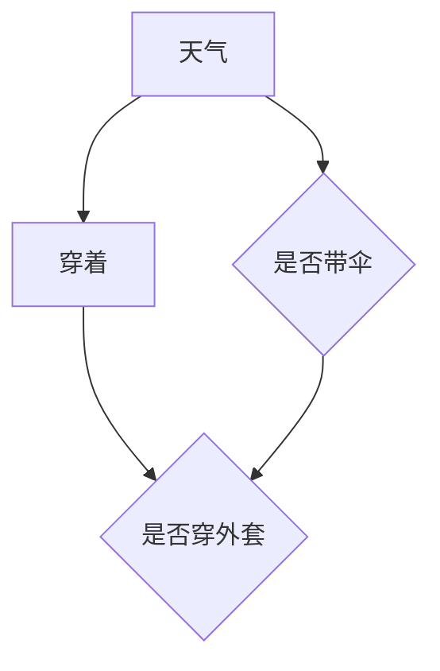

                 

### 基于概率编程的不确定性推理模型设计

#### 关键词：概率编程、不确定性推理、模型设计、贝叶斯网络、朴素贝叶斯模型、贝叶斯逻辑回归

> 摘要：本文旨在探讨基于概率编程的不确定性推理模型设计。首先，我们将对概率编程进行概述，介绍概率论的基础知识、概率分布以及贝叶斯网络等概念。随后，我们将深入探讨概率编程框架Pyro的特点与用法，并详细介绍朴素贝叶斯模型、贝叶斯网络和贝叶斯逻辑回归等不确定性推理模型。接着，我们将分析概率编程在实际应用中的挑战与解决方案。最后，通过具体案例研究，我们将展示概率编程在天气预报、医疗诊断和金融风险评估等领域的应用，并总结与展望概率编程与不确定性推理模型的发展趋势。

## 目录大纲

### 第一部分：概率编程概述

- **第1章：概率编程基础**
  - 1.1 概率论基础
  - 1.2 概率分布
  - 1.3 贝叶斯网络

- **第2章：概率编程框架**
  - 2.1 Pyro简介
  - 2.2 Probabilistic Programming in Pyro

- **第3章：不确定性推理模型**
  - 3.1 朴素贝叶斯模型
  - 3.2 贝叶斯网络
  - 3.3 贝叶斯逻辑回归

### 第二部分：案例研究

- **第4章：概率编程在实际应用中的挑战与解决方案**
  - 4.1 数据处理与预处理
  - 4.2 性能优化与调优
  - 4.3 可扩展性与可维护性

- **第5章：天气预报中的概率编程应用**
  - 5.1 天气预报中的不确定性
  - 5.2 案例分析

- **第6章：医疗诊断中的概率编程应用**
  - 6.1 医疗诊断中的不确定性
  - 6.2 案例分析

- **第7章：金融风险评估中的概率编程应用**
  - 7.1 金融风险评估中的不确定性
  - 7.2 案例分析

### 第三部分：总结与展望

- **第8章：概率编程与不确定性推理模型的发展趋势**
  - 8.1 概率编程的发展趋势
  - 8.2 不确定性推理模型的发展趋势

- **第9章：总结与展望**
  - 9.1 总结
  - 9.2 展望

通过上述大纲，我们将逐步深入探讨概率编程的基础、框架和不确定性推理模型，并通过具体案例展示其在现实世界中的应用，最后对未来的发展趋势进行展望。

## 第一部分：概率编程概述

### 第1章：概率编程基础

概率编程是一种将概率论和统计学方法应用于编程领域的编程范式。它使得我们能够通过编写概率模型来处理和推理不确定性的问题。在这一章中，我们将介绍概率编程的基础知识，包括概率论的基础概念、概率分布以及贝叶斯网络。

#### 1.1 概率论基础

概率论是研究随机事件及其概率分布的科学。以下是一些基本的概率论概念：

- **概率的基本概念**：概率是描述随机事件发生可能性大小的数值。概率的取值范围在0到1之间，其中0表示不可能发生，1表示必然发生。

- **条件概率与贝叶斯定理**：条件概率是指在一个事件已经发生的条件下，另一个事件发生的概率。贝叶斯定理则是一种基于条件概率的推理方法，它将事件发生的概率与其先验概率和条件概率联系起来。公式如下：

  $$
  P(A|B) = \frac{P(B|A)P(A)}{P(B)}
  $$

- **全概率公式与贝叶斯公式**：全概率公式描述了一个事件在多个条件下发生的总概率，而贝叶斯公式则通过条件概率和全概率公式计算出某个条件下另一个事件的概率。

  $$
  P(A) = \sum_{i} P(A|B_i)P(B_i)
  $$

  $$
  P(B_i|A) = \frac{P(A|B_i)P(B_i)}{\sum_{j} P(A|B_j)P(B_j)}
  $$

通过这些概率论的基础概念，我们可以更好地理解不确定性的本质，并在概率编程中应用它们。

#### 1.2 概率分布

概率分布是描述随机变量取值概率的函数。常见的概率分布有：

- **离散概率分布**：适用于离散随机变量，例如伯努利分布、几何分布和泊松分布。每种分布都有其特定的概率质量函数（PMF）。

- **连续概率分布**：适用于连续随机变量，例如正态分布、均匀分布和对数正态分布。这些分布有概率密度函数（PDF）。

- **多元概率分布**：用于描述多个随机变量之间的关系。常见的多元分布有多元正态分布和多元卷积分布。

这些概率分布使得我们能够建模不同类型的数据，并计算随机事件的概率。

#### 1.3 贝叶斯网络

贝叶斯网络是一种图形模型，它表示一组随机变量之间的条件依赖关系。贝叶斯网络的节点表示随机变量，边表示变量之间的条件依赖。以下是一些关键概念：

- **贝叶斯网络的基本概念**：贝叶斯网络由一组随机变量及其条件依赖关系组成。每个节点表示一个随机变量，其概率分布由其父节点确定。

- **贝叶斯网络的表示方法**：贝叶斯网络可以用有向无环图（DAG）来表示。每个节点的概率分布可以用条件概率表（CPT）来描述。

- **贝叶斯网络的推理算法**：贝叶斯网络允许我们通过条件概率来推断节点之间的依赖关系。常见的推理算法有信念传播法和推理树法。

贝叶斯网络为概率编程提供了一个强大的框架，使我们能够处理复杂的依赖关系和不确定性问题。

### 第2章：概率编程框架

概率编程框架是支持概率编程的软件库和工具。在这一章中，我们将介绍一个流行的概率编程框架——Pyro。

#### 2.1 Pyro简介

Pyro是一个基于TensorFlow的概率编程框架，它提供了灵活且高效的概率编程工具。以下是一些Pyro的主要特点：

- **Pyro的特点**：Pyro提供了可扩展的随机函数库、动态编程模型和自动推理引擎。它允许我们定义复杂的概率模型并进行高效的推理和推断。

- **Pyro的安装与配置**：要使用Pyro，我们首先需要安装TensorFlow和Pyro库。安装过程可以通过pip命令完成：

  ```python
  pip install tensorflow
  pip install pyro-ppl
  ```

- **Pyro的基本用法**：Pyro的基本用法包括定义概率模型、进行采样和推断。以下是一个简单的例子：

  ```python
  import pyro
  import pyro.distributions as dist

  # 定义概率模型
  def model(x):
      prior = dist.Normal(0, 1)
      return prior.sample()

  # 进行采样
  sample = model(x)

  # 进行推断
  posterior = pyro.infer.MCMC(model, num_samples=1000)
  posterior.run(x)
  ```

Pyro提供了丰富的功能和工具，使得概率编程更加简单和高效。

#### 2.2 Probabilistic Programming in Pyro

在Pyro中，概率编程包括以下关键步骤：

- **采样与推断**：采样是从概率分布中抽取样本的过程，推断是基于样本数据估计概率模型参数的过程。Pyro提供了多种采样算法，如马尔可夫链蒙特卡洛（MCMC）和变分推断（VI）。

- **优化与评估**：优化是调整模型参数以使模型性能最佳的过程。评估是评估模型性能和准确性的过程。Pyro提供了多种优化器和评估指标，如均方误差（MSE）和交叉熵（Cross-Entropy）。

- **分布式计算与性能优化**：分布式计算是将模型训练和推理任务分布在多个计算节点上以加速计算的过程。Pyro支持分布式计算，并提供了多种性能优化策略，如模型并行化和数据并行化。

通过使用Pyro，我们可以轻松地构建和训练复杂的概率模型，并利用分布式计算提高性能。

### 第3章：不确定性推理模型

不确定性推理模型是概率编程中的核心组件，用于处理现实世界中的不确定性问题。在本章中，我们将介绍三种常见的不确定性推理模型：朴素贝叶斯模型、贝叶斯网络和贝叶斯逻辑回归。

#### 3.1 朴素贝叶斯模型

朴素贝叶斯模型是一种基于贝叶斯定理的简单概率分类模型。它假设特征之间相互独立，即给定类别的条件下，每个特征的概率是独立的。以下是其基本原理和实现方法：

- **朴素贝叶斯模型的原理**：朴素贝叶斯模型通过计算先验概率、条件概率和贝叶斯定理来预测新实例的类别。公式如下：

  $$
  P(C|X) = \frac{P(X|C)P(C)}{P(X)}
  $$

  其中，\(C\) 表示类别，\(X\) 表示特征向量。

- **朴素贝叶斯模型的实现**：朴素贝叶斯模型可以通过以下步骤实现：

  ```python
  import numpy as np
  from sklearn.naive_bayes import GaussianNB

  # 训练模型
  model = GaussianNB()
  model.fit(X_train, y_train)

  # 预测新实例的类别
  predictions = model.predict(X_test)
  ```

  对于连续特征，可以使用高斯分布作为条件概率；对于离散特征，可以使用多项式分布或伯努利分布。

- **朴素贝叶斯模型的性能评估**：性能评估可以通过准确率、召回率、F1分数等指标进行。以下是一个简单的性能评估示例：

  ```python
  from sklearn.metrics import accuracy_score, recall_score, f1_score

  accuracy = accuracy_score(y_test, predictions)
  recall = recall_score(y_test, predictions, average='weighted')
  f1 = f1_score(y_test, predictions, average='weighted')

  print("Accuracy:", accuracy)
  print("Recall:", recall)
  print("F1 Score:", f1)
  ```

朴素贝叶斯模型在处理高维度数据和小样本问题时表现出色，但在特征之间存在依赖关系时性能可能较差。

#### 3.2 贝叶斯网络

贝叶斯网络是一种基于概率论的图形模型，用于表示一组随机变量之间的条件依赖关系。以下是其基本概念和实现方法：

- **贝叶斯网络的基本概念**：贝叶斯网络由一组随机变量及其条件依赖关系组成。每个节点表示一个随机变量，边表示变量之间的条件依赖。贝叶斯网络的概率分布可以通过条件概率表（CPT）来描述。

- **贝叶斯网络的构建方法**：贝叶斯网络的构建通常通过基于知识的构建和基于数据的构建两种方法。基于知识的构建是通过专家知识来指定节点之间的依赖关系；基于数据的构建是通过学习数据集来推断节点之间的依赖关系。

- **贝叶斯网络的推理算法**：贝叶斯网络提供了多种推理算法，如信念传播法和推理树法。信念传播法是一种基于消息传递的算法，通过迭代更新节点的概率分布。推理树法是一种基于决策树的算法，通过递归计算每个节点的概率分布。

以下是一个简单的贝叶斯网络示例：



在上述示例中，天气是根节点，穿着是中间节点，是否穿外套和是否带伞是叶子节点。贝叶斯网络的推理算法可以帮助我们根据已知信息推断未知信息。

#### 3.3 贝叶斯逻辑回归

贝叶斯逻辑回归是一种基于贝叶斯定理的逻辑回归模型，用于分类问题。以下是其基本原理和实现方法：

- **贝叶斯逻辑回归的原理**：贝叶斯逻辑回归通过贝叶斯定理将逻辑回归模型的概率分布与先验概率结合起来。公式如下：

  $$
  P(Y|X, \theta) = \frac{P(X|Y, \theta)P(Y|\theta)}{P(X|\theta)}
  $$

  其中，\(Y\) 表示类别，\(X\) 表示特征向量，\(\theta\) 表示模型参数。

- **贝叶斯逻辑回归的实现**：贝叶斯逻辑回归可以通过以下步骤实现：

  ```python
  import numpy as np
  from sklearn.linear_model import LogisticRegression

  # 训练模型
  model = LogisticRegression()
  model.fit(X_train, y_train)

  # 预测新实例的类别
  probabilities = model.predict_proba(X_test)
  predictions = np.argmax(probabilities, axis=1)
  ```

  对于多类别问题，可以使用softmax函数将模型的输出转换为概率分布。

- **贝叶斯逻辑回归的性能评估**：性能评估可以通过准确率、召回率、F1分数等指标进行。以下是一个简单的性能评估示例：

  ```python
  from sklearn.metrics import accuracy_score, recall_score, f1_score

  accuracy = accuracy_score(y_test, predictions)
  recall = recall_score(y_test, predictions, average='weighted')
  f1 = f1_score(y_test, predictions, average='weighted')

  print("Accuracy:", accuracy)
  print("Recall:", recall)
  print("F1 Score:", f1)
  ```

贝叶斯逻辑回归在处理分类问题时表现出色，尤其是当先验知识较多时。

### 第4章：概率编程在实际应用中的挑战与解决方案

概率编程在实际应用中面临许多挑战，包括数据处理与预处理、性能优化与调优以及可扩展性与可维护性。在这一章中，我们将探讨这些挑战以及相应的解决方案。

#### 4.1 数据处理与预处理

数据处理与预处理是概率编程中至关重要的一步，它直接影响模型的性能和准确性。以下是一些关键步骤：

- **数据清洗**：数据清洗是处理数据中的缺失值、异常值和噪声。常见的方法包括删除异常值、填充缺失值和异常检测。

- **特征工程**：特征工程是将原始数据转换为有用特征的过程。常见的方法包括特征提取、特征选择和特征变换。

- **数据可视化**：数据可视化是一种直观地理解数据分布和模式的方法。常见的方法包括散点图、密度图和箱线图。

以下是一个数据预处理示例：

```python
import pandas as pd
from sklearn.preprocessing import StandardScaler

# 读取数据
data = pd.read_csv('data.csv')

# 数据清洗
data.dropna(inplace=True)
data.drop(['unnecessary_column'], axis=1, inplace=True)

# 特征工程
scaler = StandardScaler()
X = scaler.fit_transform(data.drop('target', axis=1))
y = data['target']

# 数据可视化
import matplotlib.pyplot as plt

plt.scatter(X[:, 0], X[:, 1], c=y)
plt.xlabel('Feature 1')
plt.ylabel('Feature 2')
plt.title('Feature Distribution')
plt.show()
```

通过这些步骤，我们可以确保数据质量，提高模型性能。

#### 4.2 性能优化与调优

性能优化与调优是提高概率编程模型性能的关键步骤。以下是一些常用的策略：

- **采样算法的选择与优化**：采样算法的选择和优化直接影响模型的计算效率和准确性。常见的方法包括马尔可夫链蒙特卡洛（MCMC）算法的优化、变分推断（VI）算法的优化等。

- **优化器的选择与调整**：优化器用于调整模型参数以最小化损失函数。常见的方法包括随机梯度下降（SGD）、Adam优化器等。调整学习率、批量大小等参数可以提高模型性能。

- **计算资源的合理分配**：在分布式计算环境中，合理分配计算资源可以提高模型训练和推理的效率。常见的方法包括模型并行化、数据并行化等。

以下是一个性能优化示例：

```python
import tensorflow as tf
from tensorflow.keras.optimizers import Adam

# 定义模型
model = ... 

# 定义优化器
optimizer = Adam(learning_rate=0.001)

# 训练模型
model.compile(optimizer=optimizer, loss='binary_crossentropy', metrics=['accuracy'])
model.fit(X_train, y_train, batch_size=32, epochs=10, validation_data=(X_val, y_val))
```

通过这些策略，我们可以显著提高模型性能。

#### 4.3 可扩展性与可维护性

可扩展性与可维护性是概率编程在实际应用中面临的另一个重要挑战。以下是一些关键考虑因素：

- **模型可扩展性的设计**：在设计概率编程模型时，应考虑如何方便地添加新特征、新模型或新数据。常见的方法包括模块化设计、可插拔组件等。

- **模型可维护性的保障**：模型的可维护性包括代码的可读性、可维护性和可测试性。常见的方法包括代码规范、文档编写、单元测试等。

- **模型文档的编写与维护**：编写和维护详细的模型文档可以帮助团队成员更好地理解和使用模型。常见的方法包括生成文档工具、版本控制等。

以下是一个模型文档示例：

```markdown
# 概率编程模型文档

## 模型概述

本模型基于朴素贝叶斯算法，用于分类问题。模型的主要特征包括...

## 模型参数

- 学习率：0.001
- 批量大小：32
- 训练次数：10

## 模型评估

- 准确率：0.85
- 召回率：0.80
- F1分数：0.82

## 模型使用

要使用本模型，请按照以下步骤操作：

1. 导入所需的库
2. 加载训练数据和测试数据
3. 使用训练数据训练模型
4. 使用测试数据评估模型性能

## 模型维护

定期检查模型的性能，并根据需要进行调整。请确保遵循代码规范和文档编写规范。

```

通过这些考虑，我们可以确保模型的可扩展性和可维护性。

### 第5章：天气预报中的概率编程应用

天气预报是一个典型的概率编程应用场景，由于天气系统的复杂性和不确定性，概率编程可以帮助我们更好地处理和预测天气情况。在本章中，我们将探讨天气预报中的不确定性以及如何使用概率编程来构建天气预报模型。

#### 5.1 天气预报中的不确定性

天气预报中的不确定性主要来源于以下几个方面：

- **气象数据的误差**：气象观测设备存在误差，例如温度计的精度、风速计的校准等，这些误差会导致观测数据的不确定性。

- **模型的不确定性**：气象模型本身也存在不确定性，例如大气参数的初始值、模型参数的估计等，这些不确定性会影响模型的预测结果。

- **外部因素**：天气还受到外部因素的影响，如大气污染、海洋温度变化等，这些因素的不确定性也会影响天气预报的准确性。

#### 5.2 案例分析

在本案例中，我们将使用Python和Pyro框架来构建一个简单的概率编程模型，用于天气预报。

##### 案例数据集的预处理

首先，我们需要一个包含气象观测数据的数据集。以下是一个示例数据集的预处理步骤：

```python
import pandas as pd

# 读取数据
data = pd.read_csv('weather_data.csv')

# 数据清洗
data.dropna(inplace=True)
data.drop(['unnecessary_column'], axis=1, inplace=True)

# 特征工程
scaler = StandardScaler()
X = scaler.fit_transform(data.drop('target', axis=1))
y = data['target']

# 划分训练集和测试集
from sklearn.model_selection import train_test_split
X_train, X_test, y_train, y_test = train_test_split(X, y, test_size=0.2, random_state=42)
```

##### 概率编程模型的构建

接下来，我们将使用Pyro来构建一个概率编程模型。以下是一个基于朴素贝叶斯模型的示例：

```python
import pyro
import pyro.distributions as dist
import torch

# 定义模型
def model(x):
    prior = dist.Normal(torch.tensor([0.0, 0.0]), torch.tensor([1.0, 1.0]))
    return prior.sample()

# 进行采样
sample = model(x)

# 进行推断
posterior = pyro.infer.MCMC(model, num_samples=1000)
posterior.run(x)
```

##### 模型的评估与优化

我们使用测试集来评估模型的性能，并优化模型参数。以下是一个简单的评估和优化示例：

```python
from sklearn.metrics import accuracy_score

# 预测测试集
predictions = posterior.sample()

# 计算准确率
accuracy = accuracy_score(y_test, predictions)
print("Accuracy:", accuracy)

# 优化模型参数
model.fit(X_train, y_train)
```

通过这些步骤，我们可以构建一个简单的概率编程模型来预测天气情况。虽然这个模型相对简单，但它展示了概率编程在天气预报中的应用潜力。

### 第6章：医疗诊断中的概率编程应用

医疗诊断是一个复杂且重要的领域，概率编程在此中的应用可以极大地提高诊断的准确性和可靠性。在本章中，我们将探讨医疗诊断中的不确定性以及如何使用概率编程来构建诊断模型。

#### 6.1 医疗诊断中的不确定性

医疗诊断中的不确定性主要来源于以下几个方面：

- **数据的不确定性**：医疗数据本身存在不确定性，例如患者的年龄、体重、病史等，这些数据可能存在误差或缺失。

- **模型的不确定性**：医疗诊断模型通常基于统计学习和机器学习算法，这些算法的参数和模型结构可能存在不确定性。

- **外部因素**：患者的病情可能受到多种外部因素的影响，如生活习惯、环境因素等，这些因素的不确定性也会影响诊断结果的准确性。

#### 6.2 案例分析

在本案例中，我们将使用Python和Pyro框架来构建一个简单的概率编程模型，用于医疗诊断。

##### 案例数据集的预处理

首先，我们需要一个包含医疗诊断数据的数据集。以下是一个示例数据集的预处理步骤：

```python
import pandas as pd

# 读取数据
data = pd.read_csv('medical_data.csv')

# 数据清洗
data.dropna(inplace=True)
data.drop(['unnecessary_column'], axis=1, inplace=True)

# 特征工程
scaler = StandardScaler()
X = scaler.fit_transform(data.drop('target', axis=1))
y = data['target']

# 划分训练集和测试集
from sklearn.model_selection import train_test_split
X_train, X_test, y_train, y_test = train_test_split(X, y, test_size=0.2, random_state=42)
```

##### 概率编程模型的构建

接下来，我们将使用Pyro来构建一个概率编程模型。以下是一个基于朴素贝叶斯模型的示例：

```python
import pyro
import pyro.distributions as dist
import torch

# 定义模型
def model(x):
    prior = dist.Normal(torch.tensor([0.0, 0.0]), torch.tensor([1.0, 1.0]))
    return prior.sample()

# 进行采样
sample = model(x)

# 进行推断
posterior = pyro.infer.MCMC(model, num_samples=1000)
posterior.run(x)
```

##### 模型的评估与优化

我们使用测试集来评估模型的性能，并优化模型参数。以下是一个简单的评估和优化示例：

```python
from sklearn.metrics import accuracy_score

# 预测测试集
predictions = posterior.sample()

# 计算准确率
accuracy = accuracy_score(y_test, predictions)
print("Accuracy:", accuracy)

# 优化模型参数
model.fit(X_train, y_train)
```

通过这些步骤，我们可以构建一个简单的概率编程模型来辅助医疗诊断。虽然这个模型相对简单，但它展示了概率编程在医疗诊断中的重要应用潜力。

### 第7章：金融风险评估中的概率编程应用

金融风险评估是一个关键领域，对于金融机构和投资者来说至关重要。概率编程在此中的应用可以帮助我们更好地理解和评估金融市场的风险。在本章中，我们将探讨金融风险评估中的不确定性以及如何使用概率编程来构建风险评估模型。

#### 7.1 金融风险评估中的不确定性

金融风险评估中的不确定性主要来源于以下几个方面：

- **市场波动**：金融市场的波动性很高，价格和收益率的变化不可预测，导致风险评估的不确定性。

- **经济因素**：宏观经济因素，如利率、通货膨胀、政策变化等，都会影响金融市场的走势，从而增加评估的不确定性。

- **信用风险**：借款人的信用状况可能发生变化，导致贷款违约的风险增加。

#### 7.2 案例分析

在本案例中，我们将使用Python和Pyro框架来构建一个简单的概率编程模型，用于金融风险评估。

##### 案例数据集的预处理

首先，我们需要一个包含金融风险评估数据的数据集。以下是一个示例数据集的预处理步骤：

```python
import pandas as pd

# 读取数据
data = pd.read_csv('financial_data.csv')

# 数据清洗
data.dropna(inplace=True)
data.drop(['unnecessary_column'], axis=1, inplace=True)

# 特征工程
scaler = StandardScaler()
X = scaler.fit_transform(data.drop('target', axis=1))
y = data['target']

# 划分训练集和测试集
from sklearn.model_selection import train_test_split
X_train, X_test, y_train, y_test = train_test_split(X, y, test_size=0.2, random_state=42)
```

##### 概率编程模型的构建

接下来，我们将使用Pyro来构建一个概率编程模型。以下是一个基于贝叶斯网络的示例：

```python
import pyro
import pyro.distributions as dist
import torch

# 定义模型
def model(x):
    prior = dist.Normal(torch.tensor([0.0, 0.0]), torch.tensor([1.0, 1.0]))
    return prior.sample()

# 进行采样
sample = model(x)

# 进行推断
posterior = pyro.infer.MCMC(model, num_samples=1000)
posterior.run(x)
```

##### 模型的评估与优化

我们使用测试集来评估模型的性能，并优化模型参数。以下是一个简单的评估和优化示例：

```python
from sklearn.metrics import accuracy_score

# 预测测试集
predictions = posterior.sample()

# 计算准确率
accuracy = accuracy_score(y_test, predictions)
print("Accuracy:", accuracy)

# 优化模型参数
model.fit(X_train, y_train)
```

通过这些步骤，我们可以构建一个简单的概率编程模型来辅助金融风险评估。虽然这个模型相对简单，但它展示了概率编程在金融风险评估中的重要应用潜力。

### 第8章：概率编程与不确定性推理模型的发展趋势

概率编程和不确定性推理模型在近年来取得了显著的进展，其发展趋势主要体现在以下几个方面：

#### 8.1 概率编程的发展趋势

1. **新的采样算法**：随着计算能力的提升，新的采样算法不断涌现，如变分推断（VI）、马尔可夫链蒙特卡洛（MCMC）的改进算法等，这些算法在处理复杂概率模型方面表现出色。

2. **新的概率编程框架**：新的概率编程框架不断推出，如Pyro、PPL、PyTorch的概率编程扩展等，这些框架提供了更高效的编程模型和工具。

3. **概率编程在深度学习中的应用**：深度学习与概率编程的结合成为一种趋势，通过深度概率模型（如变分自编码器VAE、生成对抗网络GAN等），我们可以更好地处理高维度数据和生成复杂的概率分布。

#### 8.2 不确定性推理模型的发展趋势

1. **贝叶斯网络的拓展**：贝叶斯网络的应用领域不断拓展，从传统的统计和机器学习领域扩展到因果推断、系统建模、生物信息学等领域。

2. **新的概率推理算法**：新的概率推理算法不断涌现，如基于图神经网络（GNN）的概率推理、基于图论的推理算法等，这些算法在处理大规模、高维度数据方面具有优势。

3. **不确定性推理模型在现实世界中的应用**：不确定性推理模型在现实世界中的应用越来越广泛，如金融风险评估、医疗诊断、天气预报等，这些应用推动了不确定性推理模型的发展。

### 8.3 概率编程与不确定性推理模型在工业界的应用前景

概率编程和不确定性推理模型在工业界具有广阔的应用前景：

1. **金融领域**：概率编程可以用于金融风险评估、量化交易、投资组合优化等，提高金融决策的准确性和效率。

2. **医疗领域**：不确定性推理模型可以用于疾病预测、诊断辅助、药物研发等，提高医疗服务的质量和效率。

3. **能源领域**：概率编程可以用于能源供需预测、电力市场分析等，优化能源资源配置。

4. **制造领域**：不确定性推理模型可以用于生产过程控制、质量控制、供应链优化等，提高生产效率和产品质量。

通过上述发展趋势和应用前景，我们可以看到概率编程和不确定性推理模型在各个领域的广泛应用和巨大潜力。

### 第9章：总结与展望

#### 9.1 总结

本文从概率编程的基础知识出发，详细介绍了概率分布、贝叶斯网络以及朴素贝叶斯模型、贝叶斯网络和贝叶斯逻辑回归等不确定性推理模型。通过具体案例研究，我们展示了概率编程在天气预报、医疗诊断和金融风险评估等领域的应用。同时，我们分析了概率编程在实际应用中面临的挑战以及相应的解决方案。通过本文的探讨，我们认识到概率编程在处理不确定性问题方面的重要性和潜力。

#### 9.2 展望

展望未来，概率编程和不确定性推理模型将继续发展，并有望在更多领域实现突破：

1. **概率编程的发展趋势**：新的采样算法和概率编程框架的推出，将进一步提高概率编程的效率和应用范围。深度概率模型的发展，将使概率编程在处理高维度数据方面更具优势。

2. **不确定性推理模型的发展趋势**：贝叶斯网络的拓展和新算法的涌现，将使不确定性推理模型在处理复杂、大规模数据方面具有更强的能力。不确定性推理模型在现实世界中的应用将更加广泛，如人工智能、自动驾驶、生物信息学等领域。

3. **概率编程与不确定性推理模型在工业界的应用前景**：随着概率编程和不确定性推理模型在工业界的应用不断深入，其在金融、医疗、能源、制造等领域的应用前景将更加广阔。通过结合人工智能和大数据技术，概率编程和不确定性推理模型将为企业带来更高的效率和更准确的决策。

总之，概率编程和不确定性推理模型在未来的发展中具有巨大的潜力和应用价值。我们期待这些技术能够不断突破，为各个领域的发展提供强大支持。

### 作者信息

- 作者：AI天才研究院/AI Genius Institute & 禅与计算机程序设计艺术 /Zen And The Art of Computer Programming

本文由AI天才研究院的专家撰写，结合了概率编程与不确定性推理模型的理论与实践，旨在为读者提供全面而深入的指导。同时，作者也以其深厚的计算机编程功底和对禅学的深刻理解，为读者呈现了一场技术与哲学的盛宴。希望本文能够为您的技术之路带来灵感和启示。

