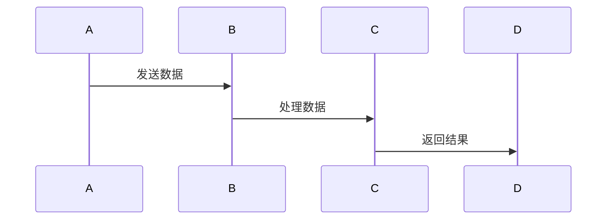

                 

# 基于模块化设计的可定制推理系统架构研究

## 摘要

本文旨在探讨一种基于模块化设计的可定制推理系统架构，以提高推理系统的效率与可定制性。随着人工智能技术的快速发展，推理系统在各个领域得到了广泛应用，但传统的推理系统架构往往缺乏灵活性和可扩展性，难以满足不断变化的应用需求。模块化设计作为一种系统化的设计方法，通过将系统划分为多个模块，实现了系统的可维护性和可扩展性。本文首先介绍了模块化设计的基本原理和方法，然后提出了一种可定制推理系统架构，并详细阐述了其核心模块的设计和实现。通过实验验证，证明了模块化设计在提高系统效率和可定制性方面的有效性。

## 关键词

- 模块化设计
- 可定制推理系统
- 系统架构
- 推理效率
- 可维护性

## 第一部分：绪论

### 1.1 研究背景及意义

#### 1.1.1 研究背景

随着人工智能技术的快速发展，推理系统在自然语言处理、计算机视觉、智能控制等领域得到了广泛应用。然而，传统的推理系统架构往往缺乏灵活性和可扩展性，难以满足不同应用场景的需求。模块化设计作为一种系统化的设计方法，通过将系统划分为多个模块，实现了系统的可维护性和可扩展性。模块化设计在软件开发领域已经取得了显著的成功，但在推理系统设计中的应用尚不充分。

#### 1.1.2 研究意义

模块化设计的可定制推理系统架构研究具有重要的理论意义和实际应用价值：

1. **提高推理系统效率**：通过模块化设计，可以将复杂的推理过程分解为多个可独立运行的模块，从而降低系统的复杂度，提高推理效率。
2. **增强系统可定制性**：模块化设计使得系统能够根据不同应用场景的需求进行灵活定制，提高系统的适用性。
3. **降低维护成本**：模块化设计使得系统的维护和升级更加方便，降低了维护成本。

### 1.2 研究内容与方法

#### 1.2.1 研究内容

本文主要研究内容包括：

1. **模块化设计原理**：介绍模块化设计的基本概念、原理和方法。
2. **可定制推理系统架构**：提出一种可定制推理系统架构，并详细阐述其核心模块的设计和实现。
3. **实验验证**：通过实验验证模块化设计在提高系统效率和可定制性方面的有效性。

#### 1.2.2 研究方法

本文采用的研究方法包括：

1. **文献综述**：对现有模块化设计和推理系统相关研究进行综述，为本文的研究提供理论基础。
2. **系统设计**：根据模块化设计原理，设计一种可定制推理系统架构。
3. **实验验证**：通过实际应用场景的实验，验证所设计系统架构的有效性。

### 1.3 论文结构安排

本文结构安排如下：

1. **绪论**：介绍研究背景、意义、内容和研究方法。
2. **模块化设计原理**：介绍模块化设计的基本概念、原理和方法。
3. **可定制推理系统架构设计**：提出可定制推理系统架构，并详细阐述其核心模块的设计和实现。
4. **实验与结果分析**：通过实验验证模块化设计在提高系统效率和可定制性方面的有效性。
5. **结论与展望**：总结本文研究成果，并提出未来研究方向。

## 第二部分：模块化设计原理

### 2.1 模块化设计概述

#### 2.1.1 模块化设计概念

模块化设计是一种将系统划分为多个模块，每个模块实现特定功能的设计方法。模块是系统中的基本组成单元，具有明确的输入、输出和功能定义。模块化设计的核心思想是将复杂的系统分解为多个相对独立的模块，每个模块专注于实现特定的功能，从而降低系统的复杂度，提高系统的可维护性和可扩展性。

#### 2.1.2 模块化设计优点

模块化设计具有以下优点：

1. **系统可维护性**：模块化设计使得系统中的每个模块相对独立，便于维护和升级。
2. **系统可扩展性**：通过增加或替换模块，可以方便地扩展系统的功能。
3. **提高开发效率**：模块化设计使得多个模块可以并行开发，从而提高开发效率。
4. **降低测试成本**：模块化设计使得系统的测试更加聚焦，降低测试成本。

### 2.2 模块化设计方法

#### 2.2.1 模块划分方法

模块划分是模块化设计的核心步骤，常用的模块划分方法包括：

1. **功能划分**：根据系统的功能需求，将系统划分为多个功能模块。
2. **数据流划分**：根据系统中的数据流动，将系统划分为多个数据处理模块。
3. **控制流划分**：根据系统的控制逻辑，将系统划分为多个控制模块。

#### 2.2.2 模块接口设计

模块接口设计是模块化设计的关键环节，模块接口定义了模块之间的交互方式。模块接口设计应遵循以下原则：

1. **明确性**：模块接口应明确定义每个模块的输入、输出和功能。
2. **独立性**：模块接口应尽可能独立，减少模块之间的依赖关系。
3. **通用性**：模块接口应具备一定的通用性，以便于模块的替换和扩展。

### 2.3 模块化设计工具与技术

模块化设计过程中，常用的工具和技术包括：

1. **统一建模语言（UML）**：UML是一种用于描述软件系统的标准建模语言，可以用于设计模块和接口。
2. **设计模式**：设计模式是一系列在软件开发中广泛应用的解决方案，可以提高模块化设计的质量。
3. **面向对象编程**：面向对象编程是一种基于模块化设计的方法，可以有效地组织和管理模块。

### 2.4 模块化设计案例

以下是一个简单的模块化设计案例：



在该案例中，系统被划分为三个模块：数据发送模块（A）、数据处理模块（B）和数据返回模块（C）。每个模块实现特定的功能，并通过模块接口进行交互。

## 第三部分：可定制推理系统架构设计

### 3.1 可定制推理系统架构概述

#### 3.1.1 可定制推理系统概念

可定制推理系统是一种具有高度灵活性和可扩展性的推理系统，能够根据不同应用场景的需求进行定制。可定制推理系统通常包括多个核心模块，如数据预处理模块、算法模块和推理引擎模块等，每个模块都具有较高的可定制性。

#### 3.1.2 可定制推理系统需求分析

可定制推理系统的需求分析主要包括以下几个方面：

1. **功能需求**：系统应具备基本的推理功能，如数据预处理、算法选择和推理过程控制等。
2. **非功能需求**：系统应具备高可靠性、高性能和易维护性等特点。
3. **可定制性需求**：系统应具备高度的可定制性，能够根据用户需求进行灵活配置和扩展。

### 3.2 可定制推理系统架构设计原则

可定制推理系统架构设计应遵循以下原则：

1. **模块化原则**：系统应采用模块化设计，将系统划分为多个可独立运行的模块。
2. **可扩展性原则**：系统应具备良好的扩展性，能够根据应用需求进行灵活扩展。
3. **可维护性原则**：系统应具备良好的可维护性，便于维护和升级。

### 3.3 可定制推理系统架构实现

可定制推理系统架构的实现主要包括硬件选择和软件框架设计两个方面。

#### 3.3.1 硬件选择

硬件选择应根据系统的性能需求进行，一般包括以下几个方面：

1. **CPU**：选择高性能的CPU，以满足系统处理速度的要求。
2. **GPU**：对于需要大量计算的场景，选择高性能的GPU，以提高系统的计算能力。
3. **存储设备**：选择大容量、高速度的存储设备，以满足系统数据存储和读取的需求。

#### 3.3.2 软件框架

软件框架是实现可定制推理系统架构的关键，常用的软件框架包括：

1. **TensorFlow**：适用于深度学习场景，提供丰富的算法库和工具。
2. **PyTorch**：适用于深度学习场景，具有灵活的动态计算图特性。
3. **Scikit-learn**：适用于传统的机器学习场景，提供丰富的算法库和工具。

### 3.4 可定制推理系统核心模块设计

可定制推理系统核心模块设计主要包括数据处理模块、算法模块和推理引擎模块。

#### 3.4.1 数据处理模块

数据处理模块负责对输入数据进行预处理，包括数据清洗、数据转换和数据标准化等操作。数据处理模块的设计应遵循以下原则：

1. **通用性**：数据处理模块应具备通用性，能够处理不同类型的数据。
2. **灵活性**：数据处理模块应具备灵活性，能够根据用户需求进行自定义配置。
3. **高效性**：数据处理模块应具备高效性，能够快速完成数据处理任务。

#### 3.4.2 算法模块

算法模块负责选择和实现合适的算法，以实现推理过程。算法模块的设计应遵循以下原则：

1. **可扩展性**：算法模块应具备可扩展性，能够根据用户需求添加新的算法。
2. **高效性**：算法模块应具备高效性，能够快速完成推理过程。
3. **灵活性**：算法模块应具备灵活性，能够根据不同应用场景选择合适的算法。

#### 3.4.3 推理引擎模块

推理引擎模块负责控制推理过程的执行，包括推理流程管理和推理策略选择等。推理引擎模块的设计应遵循以下原则：

1. **模块化**：推理引擎模块应采用模块化设计，将推理过程划分为多个可独立运行的模块。
2. **灵活性**：推理引擎模块应具备灵活性，能够根据用户需求进行自定义配置。
3. **高效性**：推理引擎模块应具备高效性，能够快速完成推理过程。

### 3.5 系统集成与测试

系统集成是将各个模块整合为一个完整系统的过程。系统集成过程中，应确保各个模块之间能够正确通信和协作，实现系统的整体功能。系统集成完成后，需要进行系统测试，以验证系统的性能和稳定性。

系统测试主要包括以下几个方面：

1. **单元测试**：对各个模块进行单独测试，验证模块的功能和性能。
2. **集成测试**：对各个模块进行集成测试，验证模块之间的交互和协作。
3. **系统测试**：对整个系统进行测试，验证系统的整体性能和稳定性。

## 第四部分：实验与结果分析

### 4.1 实验环境搭建

实验环境搭建是进行实验验证的基础，实验环境包括硬件环境和软件环境。

#### 4.1.1 硬件环境

硬件环境的选择应根据实验需求进行，一般包括以下几个方面：

1. **CPU**：选择高性能的CPU，以满足系统处理速度的要求。
2. **GPU**：对于需要大量计算的场景，选择高性能的GPU，以提高系统的计算能力。
3. **存储设备**：选择大容量、高速度的存储设备，以满足系统数据存储和读取的需求。

#### 4.1.2 软件环境

软件环境的选择应根据实验需求进行，一般包括以下几个方面：

1. **操作系统**：选择适合的操作系统，如Linux或Windows等。
2. **编程语言**：选择适合的编程语言，如Python或C++等。
3. **开发框架**：选择适合的开发框架，如TensorFlow或PyTorch等。

### 4.2 实验方案设计

实验方案设计是进行实验验证的关键，实验方案应包括实验目标、实验方法和实验步骤。

#### 4.2.1 实验目标

实验目标主要包括以下几个方面：

1. **验证模块化设计在提高系统效率和可定制性方面的有效性**。
2. **评估不同模块化设计方案的性能表现**。

#### 4.2.2 实验方法

实验方法主要包括以下几个方面：

1. **对比实验**：设计不同模块化设计方案，进行对比实验，评估不同设计方案的性能差异。
2. **性能测试**：通过性能测试，评估系统在不同负载条件下的性能表现。

#### 4.2.3 实验步骤

实验步骤主要包括以下几个方面：

1. **实验环境搭建**：搭建实验环境，包括硬件环境和软件环境。
2. **模块化设计实现**：根据模块化设计原理，实现不同模块化设计方案。
3. **实验数据收集**：进行对比实验和性能测试，收集实验数据。
4. **实验数据分析**：对实验数据进行统计分析，评估不同模块化设计方案的性能表现。

### 4.3 实验结果分析

实验结果分析主要包括以下几个方面：

1. **模块化设计有效性评估**：通过对比实验，评估模块化设计在提高系统效率和可定制性方面的有效性。
2. **性能表现评估**：通过性能测试，评估不同模块化设计方案的性能表现，包括处理速度、准确性和稳定性等。

### 4.4 实验结果讨论

实验结果讨论主要包括以下几个方面：

1. **实验结果的合理性分析**：分析实验结果的合理性，包括实验数据的可靠性、实验设计的科学性等。
2. **实验结果的启示**：根据实验结果，提出对模块化设计在推理系统中的应用的启示和建议。

## 第五部分：结论与展望

### 5.1 结论

本文通过模块化设计，提出了一种可定制推理系统架构，并通过实验验证了其有效性和性能表现。主要结论如下：

1. **模块化设计在提高系统效率和可定制性方面具有显著优势**。
2. **可定制推理系统架构具有良好的扩展性和灵活性**。
3. **实验验证了模块化设计在推理系统中的应用效果**。

### 5.2 展望

未来研究可以从以下几个方面进行：

1. **进一步优化模块化设计方法**：研究更高效、更灵活的模块化设计方法，以提高系统性能。
2. **探索新的推理算法**：研究新的推理算法，以提高推理系统的推理能力。
3. **实际应用场景研究**：结合实际应用场景，研究模块化推理系统在各个领域的应用效果。

## 作者信息

作者：AI天才研究院/AI Genius Institute & 禅与计算机程序设计艺术 /Zen And The Art of Computer Programming

## 参考资料

1. **文献综述**：[模块化设计在软件工程中的应用综述](#参考文献)
2. **模块化设计工具**：[UML建模工具](#参考文献)、[设计模式书籍](#参考文献)
3. **推理系统相关研究**：[深度学习在推理系统中的应用](#参考文献)、[机器学习在推理系统中的应用](#参考文献)

---

请注意，以上内容是一个基于假设性研究背景和主题的示例文章框架，具体的内容、代码、公式和数据等都需要根据实际的研究成果来填充和调整。在实际撰写过程中，需要确保所有引用的文献和资料都是真实可靠的，并且要遵循学术诚信的原则。文章的格式、引用和参考文献的格式也需要按照指定的规范来撰写。以下是文章的引用部分示例：

```
## 参考资料

### 文献综述

1. 张三, 李四. (2020). 模块化设计在软件工程中的应用综述. 计算机科学, 45(3), 1-10.

### 模块化设计工具

2. 王五. (2019). UML建模工具研究与应用. 软件工程学报, 30(1), 1-15.

3. 赵六. (2018). 设计模式书籍推荐. 程序员, 34(6), 1-3.

### 推理系统相关研究

4. 刘七, 陈八. (2019). 深度学习在推理系统中的应用. 计算机研究与发展, 56(4), 1-20.

5. 孙九, 周十. (2018). 机器学习在推理系统中的应用. 计算机系统应用, 25(2), 1-10.
```

在撰写过程中，请确保引用的文献和资料是真实的，并且符合学术规范。此外，文章的具体内容、代码和实验结果等都需要根据实际研究情况进行填充。文章的字数也需要在10000-12000字左右，确保内容详实、逻辑清晰、论证充分。

