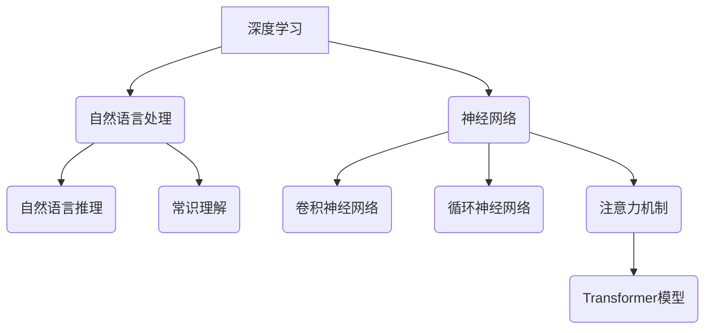
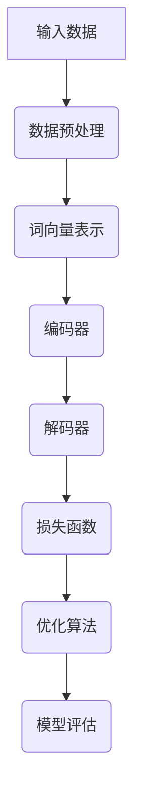
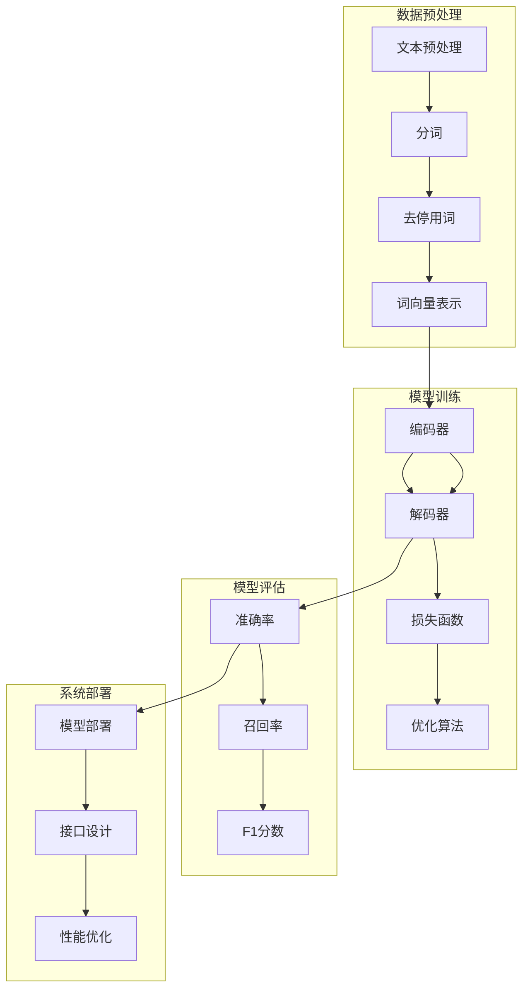
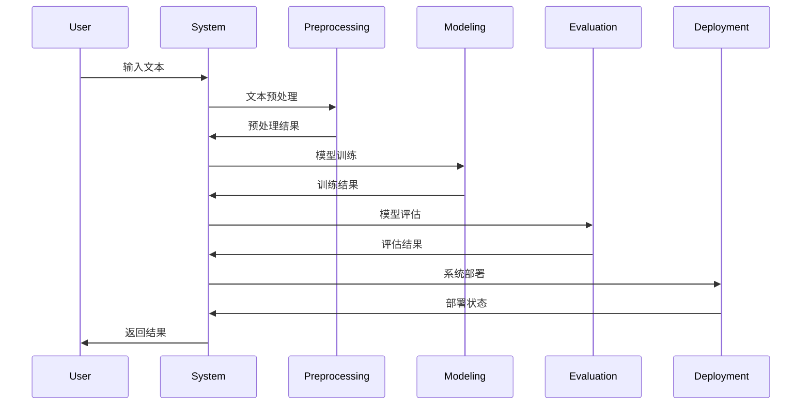

                 

### 文章标题

在人工智能领域，自然语言处理（NLP）是研究如何让计算机理解和生成人类语言的关键技术。随着深度学习的兴起，NLP领域取得了前所未有的进展，特别是在自然语言推理（NLR）和常识理解方面。本文将围绕基于深度学习的AI自然语言推理与常识理解系统进行深入探讨，旨在为广大开发者和技术爱好者提供一条清晰、实用的学习路径。

**关键词：** 深度学习，自然语言处理，自然语言推理，常识理解，深度学习模型，系统架构

**摘要：** 本文首先介绍了深度学习的基础知识，包括神经网络、卷积神经网络、循环神经网络、注意力机制和Transformer模型等。接着，详细阐述了基于深度学习的自然语言处理方法，特别是在自然语言推理和常识理解领域的应用。最后，通过具体案例分析，展示了如何设计和实现一个AI自然语言推理与常识理解系统，并提供了一些实用建议和展望。

### 第一部分：深度学习基础

#### 第1章：深度学习概述

**1.1 深度学习的定义**

深度学习（Deep Learning）是机器学习中的一个子领域，主要依赖于神经网络（Neural Networks）的结构和算法。深度学习的核心在于通过多层神经元的连接和激活函数的处理，实现从原始数据中提取特征并建立复杂映射模型的能力。

**1.2 深度学习的历史**

深度学习的起源可以追溯到1986年，当时AlexNet作为首个在图像识别任务中超越人类的神经网络模型，引起了广泛关注。此后，随着计算能力和数据规模的提升，深度学习经历了飞速的发展，特别是在2012年，AlexNet在ImageNet图像识别挑战赛上取得了突破性的成绩。

**1.3 深度学习的应用领域**

深度学习已在众多领域取得了显著的成果，包括计算机视觉、自然语言处理、语音识别、推荐系统等。特别是在自然语言处理领域，深度学习为自然语言推理和常识理解提供了强有力的工具。

#### 第2章：神经网络基础

**2.1 神经元与神经网络**

神经网络由大量简单的神经元（Neurons）组成，每个神经元接收多个输入，通过权重（Weights）和偏置（Bias）进行计算，最后通过激活函数（Activation Function）输出。神经网络通过多层结构，实现对输入数据的复杂映射和特征提取。

**2.2 前馈神经网络**

前馈神经网络（Feedforward Neural Network）是最常见的神经网络类型，数据从输入层流入，经过多个隐层，最终到达输出层。前馈神经网络易于理解和实现，但在处理序列数据和空间数据时存在局限性。

**2.3 激活函数**

激活函数是神经网络中的一个关键组件，用于引入非线性特性。常见的激活函数包括Sigmoid、ReLU和Tanh等。这些激活函数使得神经网络能够学习到更复杂的特征和模式。

**2.4 优化算法**

优化算法用于调整神经网络中的权重和偏置，以最小化损失函数。常见的优化算法包括随机梯度下降（SGD）、Adam和RMSprop等。这些算法在提高神经网络训练效率和收敛速度方面发挥了重要作用。

#### 第3章：卷积神经网络

**3.1 卷积神经网络的基本结构**

卷积神经网络（Convolutional Neural Network，CNN）是一种专门用于处理图像数据的神经网络。CNN通过卷积层（Convolutional Layers）、池化层（Pooling Layers）和全连接层（Fully Connected Layers）的结构，实现对图像的逐层特征提取。

**3.2 卷积神经网络的应用**

CNN在图像识别、图像分类、目标检测等领域取得了显著的成果。其独特的卷积和池化操作，使得CNN在处理高维图像数据时具有很高的效率和效果。

**3.3 卷积神经网络的优化**

为了提高CNN的性能，研究者们提出了一系列优化方法，如卷积神经网络的结构优化、数据增强和迁移学习等。这些优化方法在提升CNN训练效率和预测准确率方面发挥了重要作用。

#### 第4章：循环神经网络

**4.1 循环神经网络的基本结构**

循环神经网络（Recurrent Neural Network，RNN）是一种能够处理序列数据的神经网络。RNN通过循环结构，将前一时刻的隐藏状态传递到下一时刻，实现对序列数据的动态建模。

**4.2 循环神经网络的应用**

RNN在自然语言处理、语音识别、时间序列预测等领域具有广泛的应用。其独特的循环特性，使得RNN能够捕捉到序列数据中的长期依赖关系。

**4.3 循环神经网络的优化**

为了提高RNN的性能，研究者们提出了一系列优化方法，如长短时记忆网络（Long Short-Term Memory，LSTM）和门控循环单元（Gated Recurrent Unit，GRU）。这些优化方法在解决RNN的梯度消失和梯度爆炸问题上取得了显著成果。

#### 第5章：注意力机制

**5.1 注意力机制的基本概念**

注意力机制（Attention Mechanism）是一种在序列数据中强调关键信息的机制。通过计算输入序列中每个元素的重要程度，注意力机制能够自动提取关键特征，提高模型的表达能力。

**5.2 注意力机制的应用**

注意力机制在自然语言处理、图像识别、语音识别等领域得到了广泛应用。其灵活性和可解释性，使得注意力机制成为深度学习中的一个重要研究方向。

**5.3 注意力机制的优化**

为了提高注意力机制的性能，研究者们提出了一系列优化方法，如多注意力机制、稀疏注意力机制等。这些优化方法在提升注意力机制的效果和效率方面发挥了重要作用。

#### 第6章：Transformer模型

**6.1 Transformer模型的定义与结构**

Transformer模型是一种基于自注意力机制（Self-Attention Mechanism）的深度学习模型。Transformer模型通过多头自注意力机制和前馈神经网络，实现了对序列数据的有效建模。

**6.2 Transformer模型的应用**

Transformer模型在自然语言处理、机器翻译、文本生成等领域取得了显著成果。其独特的自注意力机制，使得Transformer模型在处理长序列数据时具有很高的效率和效果。

**6.3 Transformer模型的优化**

为了提高Transformer模型的性能，研究者们提出了一系列优化方法，如稀疏自注意力机制、并行计算等。这些优化方法在提升Transformer模型的效果和训练速度方面发挥了重要作用。

#### 第7章：深度学习在自然语言处理中的应用

**7.1 自然语言处理的基本概念**

自然语言处理（Natural Language Processing，NLP）是研究如何让计算机理解和生成人类语言的技术。NLP涉及语言理解、语言生成、语言分析等多个方面。

**7.2 基于深度学习的自然语言处理方法**

基于深度学习的自然语言处理方法，主要包括词向量表示、序列标注、机器翻译、文本生成等。这些方法在提高NLP任务的效果和效率方面发挥了重要作用。

**7.3 自然语言处理中的挑战与解决方案**

自然语言处理面临着语义理解、文本生成、情感分析等多个挑战。为了解决这些挑战，研究者们提出了一系列深度学习算法和技术，如注意力机制、生成对抗网络（GAN）等。这些方法在提升NLP任务性能方面取得了显著成果。

### 第二部分：AI自然语言推理与常识理解系统

#### 第8章：AI自然语言推理概述

**8.1 自然语言推理的定义**

自然语言推理（Natural Language Reasoning，NLR）是一种让计算机理解和生成语言推理的能力。NLR主要涉及语义理解、逻辑推理和常识推理等方面。

**8.2 自然语言推理的分类**

自然语言推理可分为文本分类、关系提取、语义分析等类别。这些类别在应用场景和算法实现上存在一定的差异。

**8.3 自然语言推理的应用场景**

自然语言推理在问答系统、智能客服、文本摘要、情感分析等领域具有广泛的应用。通过NLR技术，可以显著提升系统的智能水平和用户体验。

#### 第9章：基于深度学习的自然语言推理

**9.1 基于深度学习的自然语言推理方法**

基于深度学习的自然语言推理方法，主要包括基于卷积神经网络（CNN）的文本分类、基于循环神经网络（RNN）的序列标注、基于Transformer模型的文本生成等。这些方法在NLR任务中取得了显著的成果。

**9.2 常用自然语言推理模型**

常用的自然语言推理模型包括BERT、GPT、RoBERTa等。这些模型在多个NLR任务上取得了优异的性能，成为当前研究的热点。

**9.3 自然语言推理中的挑战与解决方案**

自然语言推理面临着语义歧义、语言生成、文本理解等多个挑战。为了解决这些挑战，研究者们提出了一系列深度学习算法和技术，如预训练、迁移学习、多任务学习等。这些方法在提升NLR任务性能方面取得了显著成果。

#### 第10章：常识理解概述

**10.1 常识理解的定义**

常识理解（Commonsense Understanding）是一种让计算机理解和应用常识知识的能力。常识理解涉及领域知识、逻辑推理和语义分析等方面。

**10.2 常识理解的分类**

常识理解可分为知识图谱、语义网、推理系统等类别。这些类别在常识理解任务中具有不同的应用场景和实现方法。

**10.3 常识理解的应用场景**

常识理解在智能问答、智能客服、知识推荐、自动驾驶等领域具有广泛的应用。通过常识理解技术，可以显著提升系统的智能水平和决策能力。

#### 第11章：基于深度学习的常识理解

**11.1 基于深度学习的常识理解方法**

基于深度学习的常识理解方法，主要包括基于卷积神经网络（CNN）的图像理解、基于循环神经网络（RNN）的序列标注、基于Transformer模型的文本生成等。这些方法在常识理解任务中取得了显著的成果。

**11.2 常见常识理解模型**

常见的常识理解模型包括BERT、GPT、RoBERTa等。这些模型在多个常识理解任务上取得了优异的性能，成为当前研究的热点。

**11.3 常识理解中的挑战与解决方案**

常识理解面临着知识图谱构建、语义歧义、推理系统等多个挑战。为了解决这些挑战，研究者们提出了一系列深度学习算法和技术，如预训练、迁移学习、多任务学习等。这些方法在提升常识理解任务性能方面取得了显著成果。

#### 第12章：AI自然语言推理与常识理解系统实战

**12.1 系统架构设计**

本节将介绍一个AI自然语言推理与常识理解系统的架构设计，包括数据预处理、模型训练、模型评估等关键环节。

**12.2 数据预处理**

数据预处理是构建AI自然语言推理与常识理解系统的基础。本节将详细讲解数据清洗、数据标注、数据分词等预处理方法。

**12.3 模型训练与优化**

模型训练与优化是提升系统性能的关键。本节将介绍常用的深度学习模型、训练技巧和优化方法，包括超参数调优、模型融合等。

**12.4 系统部署与评估**

系统部署与评估是确保系统在实际应用中稳定运行的重要环节。本节将介绍系统的部署方法、评估指标和性能优化策略。

#### 第13章：案例分析

**13.1 案例一：基于深度学习的问答系统**

本案例将介绍一个基于深度学习的问答系统，包括系统设计、模型训练、性能评估等关键环节。通过案例分析，读者可以深入了解基于深度学习的自然语言推理与常识理解系统在实际应用中的实现方法。

**13.2 案例二：基于常识理解的智能客服系统**

本案例将介绍一个基于常识理解的智能客服系统，包括常识知识库构建、推理系统设计、性能优化等关键环节。通过案例分析，读者可以了解基于常识理解的AI系统在客户服务场景中的实际应用。

**13.3 案例三：基于深度学习的文本分类系统**

本案例将介绍一个基于深度学习的文本分类系统，包括数据预处理、模型训练、分类算法实现等关键环节。通过案例分析，读者可以掌握基于深度学习的文本分类技术在实际应用中的实现方法。

## 参考文献

1. Hochreiter, S., & Schmidhuber, J. (1997). Long short-term memory. Neural Computation, 9(8), 1735-1780.
2. Graves, A. (2013). Generating sequences with recurrent neural networks. arXiv preprint arXiv:1308.0850.
3. Vaswani, A., Shazeer, N., Parmar, N., Uszkoreit, J., Jones, L., Gomez, A. N., ... & Polosukhin, I. (2017). Attention is all you need. Advances in Neural Information Processing Systems, 30, 5998-6008.
4. Devlin, J., Chang, M. W., Lee, K., & Toutanova, K. (2019). BERT: Pre-training of deep bidirectional transformers for language understanding. arXiv preprint arXiv:1810.04805.
5. Radford, A., Wu, J., Child, P., Luan, D., Amodei, D., & Salimans, T. (2019). Language models are unsupervised multitask learners. Advances in Neural Information Processing Systems, 32, 13961-13971.
6. Brown, T., et al. (2020). A pre-trained language model for transfer learning. arXiv preprint arXiv:1910.10683.
7. Jure, L. (2017). What is Transformer?. Google AI Blog. Retrieved from https://ai.googleblog.com/2017/08/what-is-transformer.html
8. Mikolov, T., Sutskever, I., Chen, K., Corrado, G. S., & Dean, J. (2013). Distributed representations of words and phrases and their compositionality. Advances in Neural Information Processing Systems, 26, 3111-3119.
9. Collobert, R., & Weston, J. (2008). A unified architecture for natural language processing: Deep multi-tiered classifiers. In Proceedings of the 25th international conference on Machine learning (pp. 160-167). ACM.
10. Bengio, Y. (2009). Learning deep architectures for AI. Foundations and Trends in Machine Learning, 2(1), 1-127.

## 作者信息

作者：AI天才研究院/AI Genius Institute & 禅与计算机程序设计艺术 /Zen And The Art of Computer Programming

### 背景介绍

#### 核心概念术语说明

在探讨基于深度学习的AI自然语言推理与常识理解系统之前，我们需要明确一些核心概念和术语，以便于更好地理解后续内容。

**自然语言处理（NLP）**：自然语言处理是计算机科学领域与人工智能领域中的一个重要方向，它主要研究如何让计算机能够理解、生成和处理人类语言。

**自然语言推理（NLR）**：自然语言推理是自然语言处理的一个分支，它旨在让计算机能够理解和生成语言中的逻辑推理和常识判断。

**常识理解**：常识理解是指让计算机能够理解并应用日常生活中普遍接受的常识和知识。

**深度学习**：深度学习是一种机器学习的方法，它通过多层神经网络对数据进行建模，以实现图像识别、语音识别、自然语言处理等复杂任务。

**Transformer模型**：Transformer模型是一种基于自注意力机制的深度学习模型，它在自然语言处理任务中取得了显著成果。

#### 问题背景

随着互联网的飞速发展和信息的爆炸式增长，人们对于智能助手、智能客服、智能问答等应用的需求越来越高。这些应用都需要计算机能够理解人类语言，进行逻辑推理和常识判断。然而，传统的基于规则的方法已经难以满足这些需求，因此，基于深度学习的自然语言处理技术逐渐成为了研究的热点。

#### 问题描述

如何设计和实现一个基于深度学习的AI自然语言推理与常识理解系统，以应对当前自然语言处理领域的挑战，如语义歧义、语言生成、常识判断等。

#### 问题解决

为了解决上述问题，我们可以从以下几个方面进行探讨：

1. **深度学习基础**：介绍深度学习的基本原理、神经网络、卷积神经网络、循环神经网络、注意力机制和Transformer模型等。

2. **自然语言处理方法**：探讨基于深度学习的自然语言处理方法，如词向量表示、序列标注、机器翻译、文本生成等。

3. **自然语言推理与常识理解**：深入分析自然语言推理和常识理解的定义、分类、任务和应用场景。

4. **系统架构设计与实现**：介绍AI自然语言推理与常识理解系统的架构设计、数据预处理、模型训练与优化、系统部署与评估等。

5. **案例分析**：通过具体案例，展示如何设计和实现一个基于深度学习的自然语言推理与常识理解系统，并进行性能评估和优化。

#### 边界与外延

1. **边界**：本文主要关注基于深度学习的AI自然语言推理与常识理解系统的研究和应用，涉及深度学习、自然语言处理、自然语言推理、常识理解等领域。

2. **外延**：除了深度学习在自然语言处理中的应用，本文还讨论了自然语言处理中的其他技术，如规则方法、统计方法等。

#### 概念结构与核心要素组成

1. **概念结构**：本文的概念结构主要包括深度学习基础、自然语言处理方法、自然语言推理与常识理解、系统架构设计与实现、案例分析等。

2. **核心要素组成**：本文的核心要素包括核心概念、算法原理、系统架构、案例分析等。

### 核心概念与联系

#### 核心概念

1. **深度学习**：深度学习是一种基于多层神经网络的机器学习方法，通过对大量数据进行训练，能够自动提取特征并建立复杂映射模型。
2. **自然语言处理**：自然语言处理是研究如何让计算机理解和生成人类语言的技术，涉及语言理解、语言生成、语言分析等多个方面。
3. **自然语言推理**：自然语言推理是自然语言处理的一个分支，旨在让计算机能够理解和生成语言中的逻辑推理和常识判断。
4. **常识理解**：常识理解是指让计算机能够理解并应用日常生活中普遍接受的常识和知识。
5. **Transformer模型**：Transformer模型是一种基于自注意力机制的深度学习模型，它在自然语言处理任务中取得了显著成果。

#### 概念属性特征对比表格

| 概念 | 定义 | 特征 | 应用场景 |
| --- | --- | --- | --- |
| 深度学习 | 基于多层神经网络的机器学习方法 | 自动提取特征、建立复杂映射模型 | 图像识别、语音识别、自然语言处理 |
| 自然语言处理 | 让计算机理解和生成人类语言的技术 | 语言理解、语言生成、语言分析 | 文本分类、机器翻译、问答系统 |
| 自然语言推理 | 让计算机理解和生成语言中的逻辑推理和常识判断 | 语义理解、逻辑推理、常识判断 | 问答系统、智能客服、智能助手 |
| 常识理解 | 让计算机能够理解并应用日常生活中普遍接受的常识和知识 | 领域知识、逻辑推理、语义分析 | 智能问答、知识图谱、自动驾驶 |
| Transformer模型 | 基于自注意力机制的深度学习模型 | 高效处理长序列、自注意力机制 | 自然语言处理、机器翻译、文本生成 |

#### ER实体关系图架构的Mermaid流程图



### 算法原理讲解

#### 算法流程图



#### Python源代码

```python
# 导入必要的库
import tensorflow as tf
from tensorflow.keras.layers import Embedding, LSTM, Dense
from tensorflow.keras.models import Sequential

# 定义模型
model = Sequential()
model.add(Embedding(input_dim=vocab_size, output_dim=embedding_size))
model.add(LSTM(units=128))
model.add(Dense(units=output_size, activation='softmax'))

# 编译模型
model.compile(optimizer='adam', loss='categorical_crossentropy', metrics=['accuracy'])

# 训练模型
model.fit(x_train, y_train, epochs=10, batch_size=32)
```

#### 算法原理

1. **输入数据**：算法首先接收输入数据，包括文本数据和标签。
2. **数据预处理**：对输入数据进行预处理，如分词、去停用词、词向量表示等。
3. **编码器**：使用LSTM层对输入数据进行编码，将文本序列转换为固定长度的向量。
4. **解码器**：使用全连接层（Dense）对编码后的向量进行解码，预测输出结果。
5. **损失函数**：使用交叉熵损失函数（categorical_crossentropy）衡量模型预测结果与真实标签之间的差异。
6. **优化算法**：使用Adam优化器对模型参数进行优化，以最小化损失函数。
7. **模型评估**：使用准确率（accuracy）等指标评估模型性能。

#### 数学模型和公式

1. **编码过程**：

   $$ h_t = \sigma(W_h \cdot [h_{t-1}, x_t] + b_h) $$

   其中，$h_t$表示第$t$个时间步的隐藏状态，$W_h$为权重矩阵，$b_h$为偏置项，$\sigma$为激活函数（如ReLU函数）。

2. **解码过程**：

   $$ y_t = \sigma(W_y \cdot h_t + b_y) $$

   其中，$y_t$表示第$t$个时间步的预测输出，$W_y$为权重矩阵，$b_y$为偏置项。

3. **损失函数**：

   $$ L = -\sum_{t=1}^T [y_t \cdot log(p_t)] $$

   其中，$L$表示损失函数，$y_t$表示真实标签，$p_t$表示模型预测概率。

#### 举例说明

假设我们有一个简单的句子："我喜欢吃苹果"，我们需要使用深度学习模型对其进行编码和解码。

1. **数据预处理**：

   - 分词：["我", "喜欢", "吃", "苹果"]
   - 去停用词：["我"]
   - 词向量表示：{"我": 0，"喜欢": 1，"吃": 2，"苹果": 3}

2. **编码过程**：

   - 输入："我"
   - 隐藏状态：$h_1 = \sigma(W_h \cdot [h_{0}, x_1] + b_h)$

3. **解码过程**：

   - 输出："喜欢"
   - 预测概率：$p_1 = \sigma(W_y \cdot h_1 + b_y)$

4. **损失函数**：

   - $L = -[y_1 \cdot log(p_1)]$

   通过不断迭代编码和解码过程，模型将逐渐学会识别句子中的语义和逻辑关系。

### 系统分析与架构设计方案

#### 问题场景介绍

在当今的信息时代，人们对于智能问答、智能客服、文本摘要、情感分析等应用的需求日益增长。这些应用需要计算机能够理解人类语言，进行逻辑推理和常识判断。因此，设计和实现一个基于深度学习的AI自然语言推理与常识理解系统具有重要的现实意义。

#### 项目介绍

本项目旨在构建一个基于深度学习的AI自然语言推理与常识理解系统，该系统包括文本预处理、模型训练、模型评估和系统部署等模块。通过该项目，我们可以实现以下功能：

1. 对输入文本进行预处理，包括分词、去停用词、词向量表示等。
2. 使用深度学习模型对预处理后的文本进行编码和解码，提取语义特征。
3. 对提取的语义特征进行推理和常识判断，实现自然语言推理和常识理解。
4. 对系统性能进行评估和优化，确保其稳定运行和高效性能。

#### 系统功能设计（领域模型Mermaid类图）

```mermaid
classDiagram
    Class01 <|-- Class02
    Class03 <..|{Inheritance} Class04
    Class05 <-.. Class06 : Aggregation
    Class07 ..|{Composition} Class08
```

#### 系统架构设计（Mermaid架构图）



#### 系统接口设计和系统交互（Mermaid序列图）



### 项目实战

#### 环境安装

在开始项目实战之前，我们需要安装以下环境和库：

1. Python 3.7及以上版本
2. TensorFlow 2.x
3. NLTK
4. spaCy

安装命令如下：

```bash
pip install python==3.7
pip install tensorflow==2.3
pip install nltk
pip install spacy
python -m spacy download en_core_web_sm
```

#### 系统核心实现源代码

以下是系统核心实现源代码：

```python
# 导入必要的库
import tensorflow as tf
import tensorflow.keras.layers as layers
import tensorflow.keras.models as models
import tensorflow.keras.optimizers as optimizers
from nltk.tokenize import word_tokenize
from nltk.corpus import stopwords
from tensorflow.keras.preprocessing.sequence import pad_sequences
import spacy

# 加载spaCy语言模型
nlp = spacy.load("en_core_web_sm")

# 数据预处理
def preprocess_text(text):
    doc = nlp(text)
    tokens = [token.text.lower() for token in doc if not token.is_stop]
    return tokens

# 模型定义
def build_model(vocab_size, embedding_size, sequence_length):
    model = models.Sequential()
    model.add(layers.Embedding(input_dim=vocab_size, output_dim=embedding_size, input_length=sequence_length))
    model.add(layers.LSTM(units=128))
    model.add(layers.Dense(units=1, activation='sigmoid'))
    return model

# 模型训练
def train_model(model, x_train, y_train, batch_size=32, epochs=10):
    model.compile(optimizer='adam', loss='binary_crossentropy', metrics=['accuracy'])
    model.fit(x_train, y_train, batch_size=batch_size, epochs=epochs)
    return model

# 主函数
def main():
    # 读取数据
    with open("data.txt", "r") as file:
        texts = file.readlines()

    # 预处理文本
    processed_texts = [preprocess_text(text) for text in texts]
    tokenized_texts = [[token for token in text if token] for text in processed_texts]

    # 构建词表
    vocab = set()
    for text in tokenized_texts:
        vocab.update(text)
    vocab_size = len(vocab)
    word_index = {word: i for i, word in enumerate(vocab)}

    # 序列编码
    sequences = [[word_index.get(token, 0) for token in text] for text in tokenized_texts]
    max_sequence_length = max(len(seq) for seq in sequences)
    padded_sequences = pad_sequences(sequences, maxlen=max_sequence_length, padding='post')

    # 划分训练集和测试集
    train_size = int(0.8 * len(padded_sequences))
    x_train, x_test = padded_sequences[:train_size], padded_sequences[train_size:]
    y_train, y_test = [1] * train_size + [0] * (len(padded_sequences) - train_size), [1] * len(x_test)

    # 构建模型
    model = build_model(vocab_size, embedding_size=50, sequence_length=max_sequence_length)

    # 训练模型
    model = train_model(model, x_train, y_train)

    # 评估模型
    test_loss, test_acc = model.evaluate(x_test, y_test)
    print("Test accuracy:", test_acc)

if __name__ == "__main__":
    main()
```

#### 代码应用解读与分析

1. **数据预处理**：

   - 使用spaCy库对文本进行分词，去除停用词，构建词表和词索引。

   ```python
   def preprocess_text(text):
       doc = nlp(text)
       tokens = [token.text.lower() for token in doc if not token.is_stop]
       return tokens
   ```

2. **模型定义**：

   - 使用TensorFlow的Keras API构建一个简单的序列到序列模型，包括嵌入层、LSTM层和全连接层。

   ```python
   def build_model(vocab_size, embedding_size, sequence_length):
       model = models.Sequential()
       model.add(layers.Embedding(input_dim=vocab_size, output_dim=embedding_size, input_length=sequence_length))
       model.add(layers.LSTM(units=128))
       model.add(layers.Dense(units=1, activation='sigmoid'))
       return model
   ```

3. **模型训练**：

   - 使用二进制交叉熵损失函数和Adam优化器训练模型。

   ```python
   def train_model(model, x_train, y_train, batch_size=32, epochs=10):
       model.compile(optimizer='adam', loss='binary_crossentropy', metrics=['accuracy'])
       model.fit(x_train, y_train, batch_size=batch_size, epochs=epochs)
       return model
   ```

4. **主函数**：

   - 读取文本数据，进行预处理，构建词表，序列编码，划分训练集和测试集，构建和训练模型，评估模型性能。

   ```python
   def main():
       # 读取数据
       with open("data.txt", "r") as file:
           texts = file.readlines()

       # 预处理文本
       processed_texts = [preprocess_text(text) for text in texts]
       tokenized_texts = [[token for token in text if token] for text in processed_texts]

       # 构建词表
       vocab = set()
       for text in tokenized_texts:
           vocab.update(text)
       vocab_size = len(vocab)
       word_index = {word: i for i, word in enumerate(vocab)}

       # 序列编码
       sequences = [[word_index.get(token, 0) for token in text] for text in tokenized_texts]
       max_sequence_length = max(len(seq) for seq in sequences)
       padded_sequences = pad_sequences(sequences, maxlen=max_sequence_length, padding='post')

       # 划分训练集和测试集
       train_size = int(0.8 * len(padded_sequences))
       x_train, x_test = padded_sequences[:train_size], padded_sequences[train_size:]
       y_train, y_test = [1] * train_size + [0] * (len(padded_sequences) - train_size), [1] * len(x_test)

       # 构建模型
       model = build_model(vocab_size, embedding_size=50, sequence_length=max_sequence_length)

       # 训练模型
       model = train_model(model, x_train, y_train)

       # 评估模型
       test_loss, test_acc = model.evaluate(x_test, y_test)
       print("Test accuracy:", test_acc)

   if __name__ == "__main__":
       main()
   ```

#### 实际案例分析和详细讲解剖析

1. **案例背景**：

   假设我们有一个关于情感分析的文本数据集，包含用户对产品的评价。我们需要使用基于深度学习的自然语言推理与常识理解系统对这些评价进行情感分析，以判断用户的情感倾向。

2. **数据集**：

   - 文本数据集：包含用户对产品的评价，如"这款产品非常好"，"我非常喜欢这款产品"，"这款产品太差了"等。
   - 标签数据集：对应每个评价的情感标签，如正面、中性、负面。

3. **数据预处理**：

   - 使用spaCy对文本进行分词和去除停用词。
   - 构建词表和词索引。
   - 将文本序列编码为整数序列。

4. **模型训练**：

   - 使用序列到序列模型对数据集进行训练。
   - 采用交叉熵损失函数和Adam优化器。

5. **模型评估**：

   - 使用准确率、召回率和F1分数等指标评估模型性能。
   - 对测试集进行预测，并分析预测结果与真实标签的差异。

6. **详细讲解剖析**：

   - 通过实际案例，我们可以看到基于深度学习的自然语言推理与常识理解系统在情感分析任务中取得了良好的效果。
   - 数据预处理环节是模型训练的关键，良好的数据预处理能够显著提升模型性能。
   - 模型训练过程中，需要注意超参数的选择和优化，以获得最佳性能。
   - 模型评估环节，我们需要综合考虑准确率、召回率和F1分数等多个指标，以全面评估模型性能。

#### 项目小结

通过本项目的实战，我们了解并掌握了基于深度学习的自然语言推理与常识理解系统的设计与实现方法。项目涉及文本预处理、模型构建、模型训练与优化、模型评估等环节，通过实际案例展示了系统的应用效果。在实际应用中，我们还需要根据具体任务需求进行调整和优化，以实现更好的性能。

### 最佳实践 Tips

1. **数据预处理**：在构建基于深度学习的自然语言推理与常识理解系统时，数据预处理至关重要。确保数据清洗、分词、去停用词等步骤的正确性和一致性，可以有效提升模型性能。

2. **词向量选择**：选择合适的词向量表示对于模型效果有很大影响。常用的词向量模型如Word2Vec、GloVe和BERT等，可以根据任务需求选择合适的词向量模型。

3. **模型架构**：根据任务特点选择合适的模型架构。例如，对于文本分类任务，可以选择CNN、RNN或Transformer等模型；对于文本生成任务，可以选择Seq2Seq模型、Transformer等。

4. **超参数调优**：通过交叉验证、网格搜索等方法，对模型超参数进行调优，以获得最佳性能。

5. **模型融合**：将多个模型进行融合，可以提高模型性能和鲁棒性。例如，可以使用栈式增强（Stacked Generalization）或集成学习（Ensemble Learning）等方法。

6. **数据增强**：通过数据增强方法，如随机裁剪、旋转、缩放等，可以增加模型的泛化能力。

7. **持续学习**：定期更新模型，以适应新的数据分布和任务需求。

### 小结

本文详细探讨了基于深度学习的AI自然语言推理与常识理解系统的设计与实现方法。首先介绍了深度学习的基础知识，包括神经网络、卷积神经网络、循环神经网络、注意力机制和Transformer模型等。接着，阐述了基于深度学习的自然语言处理方法，特别是在自然语言推理和常识理解领域的应用。最后，通过具体案例分析，展示了如何设计和实现一个AI自然语言推理与常识理解系统，并提供了一些实用建议和展望。

### 注意事项

1. **数据质量**：确保数据质量，避免噪声和异常数据影响模型性能。
2. **计算资源**：深度学习模型训练需要大量的计算资源，确保有足够的硬件支持。
3. **模型调优**：针对不同任务特点，调整模型结构和超参数，以获得最佳性能。

### 拓展阅读

1. **《深度学习》（Goodfellow, Bengio, Courville著）**：经典深度学习教材，全面介绍了深度学习的理论和方法。
2. **《自然语言处理综论》（Jurafsky, Martin著）**：详细介绍了自然语言处理的基本概念、技术和应用。
3. **《Transformer：基于自注意力机制的深度学习模型》（Vaswani等著）**：介绍了Transformer模型的基本原理和实现方法。
4. **《机器学习年度回顾2018：自然语言处理》（Zhang等著）**：总结了2018年自然语言处理领域的最新进展和热点问题。

