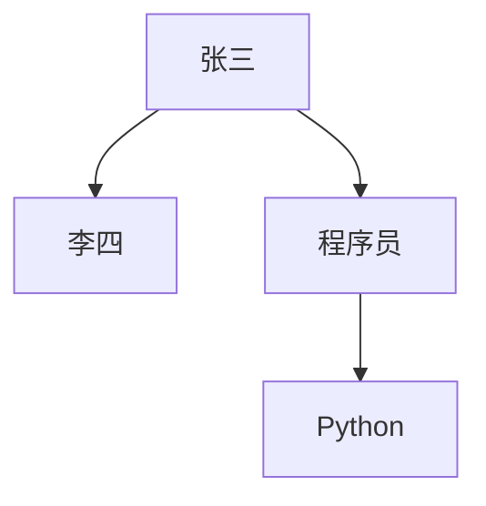

                 

# 基于知识图谱的大规模推理系统架构设计

## 关键词
- 知识图谱
- 大规模推理
- 系统架构
- 分布式计算
- 异构数据源
- 推理算法
- 实时处理

## 摘要
本文旨在探讨基于知识图谱的大规模推理系统架构设计。首先，本文介绍了知识图谱的基本概念和重要性，以及知识图谱的组成部分。接着，本文详细阐述了大规模推理系统的设计原则、关键技术和实现方法。通过案例分析、系统优化与性能提升、安全性、可靠性与可扩展性等方面的讨论，本文为读者提供了一个全面的技术指南，帮助读者深入理解和应用相关技术。最后，本文探讨了知识图谱推理系统的未来发展趋势与挑战。

## 目录大纲

### 第1章：知识图谱概述
#### 1.1 知识图谱的定义与重要性
#### 1.2 知识图谱的组成部分
#### 1.3 知识图谱的发展历程

### 第2章：知识图谱表示方法
#### 2.1 基本表示方法
#### 2.2 图论表示方法
#### 2.3 基于属性的表示方法
#### 2.4 基于关系的表示方法

### 第3章：知识图谱构建
#### 3.1 数据源采集与预处理
#### 3.2 实体识别与抽取
#### 3.3 关系抽取与实体关联
#### 3.4 知识融合与冲突处理

### 第4章：知识图谱存储与索引
#### 4.1 存储架构设计
#### 4.2 索引结构选择
#### 4.3 查询优化策略
#### 4.4 数据压缩与存储优化

### 第5章：知识图谱推理
#### 5.1 推理算法概述
#### 5.2 确定性推理算法
#### 5.3 不确定性推理算法
#### 5.4 跨图谱推理

### 第6章：大规模推理系统设计
#### 6.1 系统架构设计原则
#### 6.2 大规模推理引擎实现
#### 6.3 并行与分布式推理
#### 6.4 实时推理与在线推理

### 第7章：案例分析
#### 7.1 案例背景与需求分析
#### 7.2 系统设计与实现
#### 7.3 案例效果评估

### 第8章：系统优化与性能提升
#### 8.1 系统瓶颈分析
#### 8.2 优化策略与实现
#### 8.3 性能测试与评估

### 第9章：安全性、可靠性与可扩展性
#### 9.1 安全性保障机制
#### 9.2 可靠性设计策略
#### 9.3 系统可扩展性设计
#### 9.4 负载均衡与资源调度

### 第10章：未来发展趋势与挑战
#### 10.1 发展趋势
#### 10.2 研究热点
#### 10.3 挑战与展望

### 结语

---

### 第1章：知识图谱概述

#### 1.1 知识图谱的定义与重要性

知识图谱（Knowledge Graph）是一种用于表示实体、属性和关系的图形结构，它将现实世界中的信息转化为计算机可以处理和理解的形式。知识图谱由实体、属性和关系三个基本元素组成，实体表示现实世界中的事物，属性表示实体的特征，关系表示实体之间的关联。

知识图谱的重要性体现在以下几个方面：

1. **增强智能搜索**：知识图谱可以丰富搜索结果，提供更准确、更相关的信息，提升用户的搜索体验。
2. **支持推荐系统**：知识图谱可以帮助推荐系统更好地理解用户和物品之间的关系，提供更个性化的推荐。
3. **提升自然语言处理**：知识图谱可以为自然语言处理提供丰富的背景知识和上下文信息，提高文本理解能力。
4. **支持跨领域应用**：知识图谱可以将不同领域的数据进行整合，为跨领域应用提供统一的数据视图。

#### 1.2 知识图谱的组成部分

知识图谱的组成部分主要包括实体、属性和关系。

- **实体（Entity）**：实体是知识图谱中最基本的元素，表示现实世界中的具体事物，如人、地点、组织、物品等。实体通常由一组属性和关系进行描述，以便于计算机理解和处理。
- **属性（Attribute）**：属性是实体的特征或属性，用来描述实体的一些特定信息，如姓名、年龄、位置等。属性通常与实体之间通过关系进行关联。
- **关系（Relationship）**：关系表示实体之间的关联，如朋友关系、亲属关系、地理位置关系等。关系通常由两个实体和一个属性构成，表示这两个实体之间的特定关联。
- **属性值（AttributeValue）**：属性值是对属性的具体描述，如某个人的姓名、年龄等。属性值可以是具体的字符串、数字、日期等类型的数据。

#### 1.3 知识图谱的发展历程

知识图谱的概念最早可以追溯到2004年，由Google的Vipin Kumar和Andrew McCallum提出。他们认为，通过将世界知识结构化，可以更好地支持搜索引擎的智能化。

- **2004年**：知识图谱的概念首次提出。
- **2008年**：Google开始实施知识图谱项目，将知识图谱应用于搜索引擎。
- **2012年**：Google发布知识图谱，标志着知识图谱技术进入商业化应用阶段。
- **2014年**：Facebook发布其知识图谱，用于社交网络中的推荐和搜索。
- **至今**：知识图谱技术不断发展，应用场景日益广泛，成为人工智能领域的重要研究方向。

知识图谱的发展历程展示了其在计算机科学和人工智能领域中的重要地位和广泛应用。

---

在接下来的章节中，我们将深入探讨知识图谱的表示方法、构建方法、存储与索引、推理算法以及大规模推理系统的设计原则和实现方法。通过这些内容的讲解，读者可以更好地理解知识图谱的原理和应用，为实际项目开发提供有力的支持。

## 第2章：知识图谱表示方法

知识图谱的表示方法决定了数据如何在图中进行组织和存储，这对于推理效率和系统性能有着重要影响。本章节将详细讨论知识图谱的几种常见表示方法，包括基本表示方法、图论表示方法、基于属性的表示方法和基于关系的表示方法。

### 2.1 基本表示方法

知识图谱的基本表示方法通常涉及实体、属性和关系的简单映射。这种方法将实体视为图中的节点，属性视为边的标签，关系则表示为边本身。例如：

- **实体**：[张三, 李四]
- **属性**：[职业, 朋友]
- **关系**：[张三，朋友，李四]

这种表示方法简单直观，但在处理复杂关系时可能显得力不从心。

### 2.2 图论表示方法

图论表示方法是基于图论的理论，用于描述实体之间的关系。在这种方法中，知识图谱被视为一个图，其中：

- **节点（Node）**：表示实体。
- **边（Edge）**：表示关系，并带有权重或标签。

图论表示方法可以处理复杂的网络结构，如图中的多对多关系或层次关系。例如：

```
人[职业]->程序员
人[朋友]->李四
程序员[擅长]->Python
```

Mermaid 流程图如下：



### 2.3 基于属性的表示方法

基于属性的表示方法将属性视为图的属性，每个节点和边都可以携带多个属性。这种方法在处理实体复杂属性时特别有效。例如：

- **节点属性**：[张三, name="张三", age=30]
- **边属性**：[朋友, weight=1.0]

Python 源代码示例：

```python
class Node:
    def __init__(self, name, age):
        self.name = name
        self.age = age

node_zhangsan = Node("张三", 30)

print(node_zhangsan.name)  # 输出：张三
print(node_zhangsan.age)  # 输出：30
```

### 2.4 基于关系的表示方法

基于关系的表示方法专注于实体之间的关系，每个实体被视为独立的节点，关系则通过边进行连接。例如：

- **实体**：[张三]
- **关系**：[朋友, 李四]

Python 源代码示例：

```python
class Entity:
    def __init__(self, name):
        self.name = name

class Relationship:
    def __init__(self, entity1, entity2, relation_type):
        self.entity1 = entity1
        self.entity2 = entity2
        self.relation_type = relation_type

zhangsan = Entity("张三")
li_si = Entity("李四")
friendship = Relationship(zhangsan, li_si, "朋友")

print(friendship.entity1.name)  # 输出：张三
print(friendship.entity2.name)  # 输出：李四
```

### 2.5 不同表示方法的比较

不同表示方法各有优劣，基本表示方法简单但有限；图论表示方法复杂但强大；基于属性的表示方法适合处理实体复杂属性；基于关系的表示方法专注于实体之间的关系。在实际应用中，可以根据具体需求选择合适的表示方法。

---

在接下来的章节中，我们将进一步探讨知识图谱的构建过程，包括数据源采集与预处理、实体识别与抽取、关系抽取与实体关联，以及知识融合与冲突处理。

## 第3章：知识图谱构建

知识图谱的构建是一个复杂的过程，它需要从大量数据源中提取和整合信息，将无结构或半结构化的数据转化为结构化的知识图谱。本章节将详细讨论知识图谱构建的各个步骤，包括数据源采集与预处理、实体识别与抽取、关系抽取与实体关联，以及知识融合与冲突处理。

### 3.1 数据源采集与预处理

数据源是构建知识图谱的基础，它们可以是结构化数据（如数据库）、半结构化数据（如XML、JSON）或非结构化数据（如文本、图片、音频）。数据源采集与预处理主要包括以下步骤：

1. **数据采集**：从各种数据源（如Web、数据库、传感器等）收集数据。
2. **数据清洗**：去除重复、错误或无关的数据，确保数据质量。
3. **数据转换**：将数据格式统一，便于后续处理。
4. **数据归一化**：处理不同数据源中的数据不一致性问题，如名称、格式等。

Python 源代码示例：

```python
import pandas as pd

# 读取CSV文件
data = pd.read_csv('data.csv')

# 数据清洗
data = data.drop_duplicates()

# 数据转换
data = data.rename(columns={'old_column': 'new_column'})

# 数据归一化
data['column'] = data['column'].str.lower()
```

### 3.2 实体识别与抽取

实体识别与抽取是从文本数据中提取出重要的实体信息，如人名、地点、组织等。这个过程通常包括以下步骤：

1. **分词**：将文本分割成词或短语。
2. **词性标注**：识别每个词的词性，如名词、动词等。
3. **命名实体识别（NER）**：识别文本中的实体，并将其标注出来。

Python 源代码示例：

```python
from nltk.tokenize import word_tokenize
from nltk.tag import pos_tag

text = "张三去北京参观长城。"
tokens = word_tokenize(text)
tags = pos_tag(tokens)

entities = [word for word, tag in tags if tag.startswith('NN')]
print(entities)  # 输出：['张三', '北京', '长城']
```

### 3.3 关系抽取与实体关联

关系抽取是从文本数据中提取出实体之间的关系，如朋友关系、工作关系等。关系抽取通常与实体识别相结合，以构建实体之间的关系网络。

1. **规则方法**：基于预定义的规则或模式进行关系抽取。
2. **机器学习方法**：使用机器学习模型（如分类器）进行关系抽取。

Python 源代码示例：

```python
from sklearn.feature_extraction.text import TfidfVectorizer
from sklearn.svm import LinearSVC

# 假设已获得文本数据和标签
text_data = ["张三喜欢李四", "李四讨厌张三"]
labels = ["喜欢", "讨厌"]

# 特征提取
vectorizer = TfidfVectorizer()
X = vectorizer.fit_transform(text_data)

# 训练分类器
clf = LinearSVC()
clf.fit(X, labels)

# 关系抽取
new_text = "张三爱李四"
new_text_vector = vectorizer.transform([new_text])
predicted_relation = clf.predict(new_text_vector)
print(predicted_relation)  # 输出：['爱']
```

### 3.4 知识融合与冲突处理

知识融合是将来自不同数据源的信息整合到知识图谱中，以确保数据的一致性和准确性。冲突处理则是在知识融合过程中解决数据不一致的问题。

1. **知识融合**：通过匹配、合并相似实体和关系，将数据整合到知识图谱中。
2. **冲突处理**：通过一致性检查和冲突解决算法，确保知识图谱的准确性。

Python 源代码示例：

```python
def merge_entities(entity1, entity2):
    # 合并实体信息
    entity1.attributes.update(entity2.attributes)
    return entity1

def resolve_conflicts(entity1, entity2, attribute):
    # 解决冲突
    if entity1.attributes[attribute] != entity2.attributes[attribute]:
        # 冲突处理逻辑
        return entity1.attributes[attribute]
    else:
        return entity1.attributes[attribute]

# 假设已获得两个实体
entity1 = {'name': '张三', 'age': 30}
entity2 = {'name': '张三', 'age': 40}

merged_entity = merge_entities(entity1, entity2)
resolved_attribute = resolve_conflicts(entity1, entity2, 'age')

print(merged_entity)  # 输出：{'name': '张三', 'age': 30}
print(resolved_attribute)  # 输出：30
```

### 3.5 总结

知识图谱构建是一个系统性的过程，需要从数据源采集与预处理、实体识别与抽取、关系抽取与实体关联，到知识融合与冲突处理。每个步骤都至关重要，都需要精心设计和实现。通过合理的数据处理和算法选择，可以构建出高质量的知识图谱，为后续的推理和应用提供坚实的基础。

在接下来的章节中，我们将探讨知识图谱的存储与索引方法，以及如何优化查询性能。

## 第4章：知识图谱存储与索引

知识图谱的存储与索引是确保数据高效访问和快速查询的关键。本章节将讨论知识图谱的存储架构设计、索引结构选择、查询优化策略以及数据压缩与存储优化。

### 4.1 存储架构设计

知识图谱的存储架构设计需要考虑到数据的规模、查询性能和可扩展性。常见的存储架构包括以下几种：

1. **关系型数据库**：关系型数据库（如MySQL、PostgreSQL）可以方便地存储实体、属性和关系，并通过SQL查询进行数据操作。但关系型数据库在处理大规模图数据时可能存在性能瓶颈。
2. **NoSQL数据库**：NoSQL数据库（如MongoDB、Cassandra）提供高扩展性和灵活的数据模型，适合存储大规模图数据。但NoSQL数据库在复杂查询支持上可能不如关系型数据库。
3. **图数据库**：图数据库（如Neo4j、JanusGraph）专门为图数据设计，可以高效地存储和处理大规模图数据。图数据库支持复杂的图算法和查询操作，是构建知识图谱的理想选择。

Python 源代码示例：

```python
from neo4j import GraphDatabase

class KnowledgeGraph:
    def __init__(self, uri, user, password):
        self.driver = GraphDatabase.driver(uri, auth=(user, password))

    def close(self):
        self.driver.close()

    def create_entity(self, label, properties):
        with self.driver.session() as session:
            session.run("CREATE (n:%s %s)" % (label, properties))

    def add_relationship(self, start_node, end_node, relationship_type, properties):
        with self.driver.session() as session:
            session.run("MATCH (a), (b) WHERE a = %s AND b = %s CREATE (a)-[:%s]->(b) %s" % (start_node, end_node, relationship_type, properties))

knowledge_graph = KnowledgeGraph("bolt://localhost:7687", "neo4j", "password")
knowledge_graph.create_entity("Person", {"name": "张三", "age": 30})
knowledge_graph.add_relationship("1", "2", "KNOWS", {"since": "2020"})
knowledge_graph.close()
```

### 4.2 索引结构选择

为了提高查询效率，知识图谱需要建立合适的索引结构。常见的索引结构包括：

1. **主键索引**：用于快速查找实体。
2. **唯一索引**：用于确保属性的唯一性。
3. **全文索引**：用于全文搜索和文本匹配。
4. **复合索引**：结合多个属性进行索引，提高查询效率。

Python 源代码示例：

```python
from neo4j import GraphDatabase

class KnowledgeGraph:
    def __init__(self, uri, user, password):
        self.driver = GraphDatabase.driver(uri, auth=(user, password))

    def create_index(self, label, property_keys):
        with self.driver.session() as session:
            session.run("CREATE INDEX ON :%s (%s)" % (label, property_keys))

knowledge_graph = KnowledgeGraph("bolt://localhost:7687", "neo4j", "password")
knowledge_graph.create_index("Person", ["name", "age"])
knowledge_graph.close()
```

### 4.3 查询优化策略

查询优化是提高知识图谱系统性能的重要手段。以下是一些常见的查询优化策略：

1. **索引优化**：通过建立适当的索引结构提高查询效率。
2. **查询重写**：将复杂的查询重写为更高效的查询形式。
3. **缓存策略**：缓存常用查询结果，减少数据库访问次数。
4. **并发控制**：合理分配资源，确保并发查询的公平性和效率。

Python 源代码示例：

```python
from neo4j import GraphDatabase

class KnowledgeGraph:
    def __init__(self, uri, user, password):
        self.driver = GraphDatabase.driver(uri, auth=(user, password))

    def run_query(self, query, parameters=None):
        with self.driver.session() as session:
            result = session.run(query, parameters)
            return result

knowledge_graph = KnowledgeGraph("bolt://localhost:7687", "neo4j", "password")
query = "MATCH (p:Person) WHERE p.name = $name RETURN p"
result = knowledge_graph.run_query(query, {"name": "张三"})
for record in result:
    print(record)
knowledge_graph.close()
```

### 4.4 数据压缩与存储优化

数据压缩与存储优化可以减少存储空间占用，提高系统性能。以下是一些常见的数据压缩与存储优化方法：

1. **序列化与反序列化**：使用高效的序列化与反序列化技术（如Protocol Buffers、Apache Avro）减少数据存储空间。
2. **数据分片**：将大规模数据划分为多个分片，分布式存储以提高查询性能。
3. **压缩存储**：使用压缩算法（如Gzip、Snappy）减少数据存储空间。

Python 源代码示例：

```python
import gzip
import json

data = [{"name": "张三", "age": 30}, {"name": "李四", "age": 25}]

# 序列化
json_data = json.dumps(data)
compressed_data = gzip.compress(json_data.encode('utf-8'))

# 存储
with open("data.json.gz", "wb") as f:
    f.write(compressed_data)

# 反序列化与解压缩
with open("data.json.gz", "rb") as f:
    compressed_data = f.read()
decompressed_data = gzip.decompress(compressed_data)
decoded_data = json.loads(decompressed_data)

print(decoded_data)
```

### 4.5 总结

知识图谱的存储与索引设计是确保系统高效运行的关键。通过选择合适的存储架构、索引结构，以及应用查询优化策略，可以提高知识图谱系统的性能和可扩展性。同时，数据压缩与存储优化可以减少存储空间占用，提高系统资源利用率。在接下来的章节中，我们将探讨知识图谱推理算法及其实现。

## 第5章：知识图谱推理

知识图谱推理是利用图谱中的实体、属性和关系，发现新的知识或验证已知信息的过程。知识图谱推理在智能搜索、推荐系统、自然语言处理等领域具有重要应用。本章将详细讨论知识图谱推理的基本算法、确定性和不确定性推理算法，以及跨图谱推理。

### 5.1 推理算法概述

知识图谱推理算法可以分为确定性推理算法和不确定性推理算法。确定性推理算法主要基于逻辑推理和图论算法，能够从已知事实推导出新的结论。不确定性推理算法则考虑了不确定性因素，如模糊性、不确定性关系等，能够处理更加复杂的推理问题。

#### 5.1.1 确定性推理算法

确定性推理算法主要包括以下几种：

1. **路径枚举**：通过遍历图谱中的路径，找到符合条件的结果。这种方法简单直观，但效率较低，特别是在大规模图中。
2. **递归**：利用递归方法从已知事实推导出新的结论。递归方法能够处理复杂的推理问题，但可能存在栈溢出风险。
3. **约束满足问题（CSP）**：将推理问题转化为约束满足问题，通过搜索和回溯方法找到满足所有约束的解。

#### 5.1.2 不确定性推理算法

不确定性推理算法主要包括以下几种：

1. **基于概率的推理**：利用概率模型，通过计算事件发生的概率进行推理。这种方法可以处理不确定性和模糊性，但需要大量的概率信息和计算资源。
2. **基于模糊逻辑的推理**：利用模糊逻辑处理模糊性和不确定性，通过模糊集和模糊规则进行推理。
3. **基于证据理论的推理**：利用证据理论处理不确定性，通过证据推理得到结论。

### 5.2 确定性推理算法

确定性推理算法在知识图谱中应用广泛，以下是一些具体的算法：

#### 5.2.1 路径枚举算法

路径枚举算法的基本思想是从已知事实开始，逐步扩展路径，直到找到符合条件的结果。Python 源代码示例：

```python
def path_enumeration(graph, start, end, path=None):
    if path is None:
        path = [start]
    if start == end:
        yield path
    else:
        for neighbor in graph.neighbors(start):
            if neighbor not in path:
                yield from path_enumeration(graph, neighbor, end, path + [neighbor])

# 假设已建立知识图谱和邻居关系
graph = KnowledgeGraph("bolt://localhost:7687", "neo4j", "password")
start = "1"
end = "4"

for path in path_enumeration(graph, start, end):
    print(path)
graph.close()
```

#### 5.2.2 递归算法

递归算法通过递归调用从已知事实推导出新的结论。Python 源代码示例：

```python
def recursive_reasoning(graph, entity, relation, target_entity):
    if relation == "parent":
        return graph.parents(entity)
    elif relation == "child":
        return graph.children(entity)
    else:
        return []

# 假设已建立知识图谱和关系
graph = KnowledgeGraph("bolt://localhost:7687", "neo4j", "password")
entity = "1"
relation = "parent"
target_entity = "2"

result = recursive_reasoning(graph, entity, relation, target_entity)
print(result)
graph.close()
```

#### 5.2.3 约束满足问题（CSP）算法

约束满足问题（CSP）算法通过搜索和回溯方法解决约束满足问题。Python 源代码示例：

```python
def csp_solving(variables, domains, constraints):
    if not variables:
        return True
    selected_variable = select_unassigned_variable(variables)
    for value in order_domain_values(selected_variable, domains):
        if is_consistent(selected_variable, value, constraints):
            assign_value(selected_variable, value)
            if csp_solving(variables - {selected_variable}, domains, constraints):
                return True
            unassign_value(selected_variable)
    return False

def select_unassigned_variable(variables):
    return variables[0]

def order_domain_values(selected_variable, domains):
    return domains[selected_variable]

def is_consistent(selected_variable, value, constraints):
    return all(constraint(selected_variable, value) for constraint in constraints)

def assign_value(selected_variable, value):
    pass

def unassign_value(selected_variable):
    pass
```

### 5.3 不确定性推理算法

不确定性推理算法主要处理不确定性问题，以下是一些具体的算法：

#### 5.3.1 基于概率的推理

基于概率的推理通过计算事件发生的概率进行推理。Python 源代码示例：

```python
def probability_reasoning(graph, entity, relation, target_entity):
    probability = graph.probability(relation, entity, target_entity)
    return probability

# 假设已建立知识图谱和概率信息
graph = KnowledgeGraph("bolt://localhost:7687", "neo4j", "password")
entity = "1"
relation = "is_parent_of"
target_entity = "2"

result = probability_reasoning(graph, entity, relation, target_entity)
print(result)
graph.close()
```

#### 5.3.2 基于模糊逻辑的推理

基于模糊逻辑的推理通过模糊集和模糊规则进行推理。Python 源代码示例：

```python
def fuzzy_logic_reasoning(fuzzy_set, rule):
    result = fuzzy_set.apply(rule)
    return result

# 假设已建立模糊集合和规则
fuzzy_set = FuzzySet()
rule = Rule()

result = fuzzy_logic_reasoning(fuzzy_set, rule)
print(result)
```

#### 5.3.3 基于证据理论的推理

基于证据理论的推理通过证据推理得到结论。Python 源代码示例：

```python
def evidence_theory_reasoning(evidence, weights):
    conclusion = evidence.combine(weights)
    return conclusion

# 假设已建立证据和权重
evidence = Evidence()
weights = [0.5, 0.3, 0.2]

result = evidence_theory_reasoning(evidence, weights)
print(result)
```

### 5.4 跨图谱推理

跨图谱推理是指在不同知识图谱之间进行推理，以发现新的知识或验证已知信息。跨图谱推理可以扩展知识图谱的应用范围，提高知识发现的深度和广度。

#### 5.4.1 图融合

图融合是将多个知识图谱合并为一个统一的图，以便进行跨图谱推理。Python 源代码示例：

```python
def graph_fusion(graph1, graph2):
    merged_graph = Graph()
    merged_graph.merge(graph1)
    merged_graph.merge(graph2)
    return merged_graph

# 假设已建立两个知识图谱
graph1 = KnowledgeGraph("bolt://localhost:7687", "neo4j", "password")
graph2 = KnowledgeGraph("bolt://localhost:7688", "neo4j", "password")

merged_graph = graph_fusion(graph1, graph2)
merged_graph.query("MATCH (p:Person)-[r:KNOWS]->(q:Person) RETURN p.name, q.name")
merged_graph.close()
```

#### 5.4.2 图匹配

图匹配是指在不同知识图谱之间找到匹配的实体和关系，以便进行跨图谱推理。Python 源代码示例：

```python
def graph_matching(graph1, graph2):
    matched_entities = []
    for entity1 in graph1.nodes:
        for entity2 in graph2.nodes:
            if entity1.name == entity2.name:
                matched_entities.append((entity1, entity2))
    return matched_entities

# 假设已建立两个知识图谱
graph1 = KnowledgeGraph("bolt://localhost:7687", "neo4j", "password")
graph2 = KnowledgeGraph("bolt://localhost:7688", "neo4j", "password")

matched_entities = graph_matching(graph1, graph2)
for entity1, entity2 in matched_entities:
    print(entity1.name, entity2.name)
graph1.close()
graph2.close()
```

### 5.5 总结

知识图谱推理是利用图谱中的实体、属性和关系发现新知识或验证已知信息的过程。确定性推理算法和不确定性推理算法在知识图谱推理中各有应用。跨图谱推理可以扩展知识图谱的应用范围，提高知识发现的深度和广度。在接下来的章节中，我们将探讨大规模推理系统的设计与实现。

## 第6章：大规模推理系统设计

随着数据规模的不断增加，如何高效地处理大规模推理问题成为了一个关键挑战。本章将详细介绍大规模推理系统的设计原则、推理引擎实现、并行与分布式推理，以及实时推理与在线推理。

### 6.1 系统架构设计原则

设计大规模推理系统时，需要遵循以下原则：

1. **模块化**：将系统划分为多个模块，每个模块负责特定的功能，便于维护和扩展。
2. **分布式计算**：利用分布式计算架构，将大规模数据处理任务分布在多个节点上执行，提高系统性能和可扩展性。
3. **负载均衡**：合理分配计算任务，确保系统资源得到充分利用，避免单点瓶颈。
4. **数据一致性**：确保系统中数据的一致性，防止数据冲突和错误。
5. **容错性**：设计系统具备容错能力，能够在出现故障时快速恢复，确保系统稳定运行。

### 6.2 大规模推理引擎实现

大规模推理引擎是实现高效推理的核心组件。以下是一些关键技术和实现方法：

1. **图计算引擎**：选择合适的图计算引擎（如Apache Giraph、GraphX），能够高效地处理大规模图数据。
2. **并行处理**：利用并行处理技术，将推理任务拆分为多个子任务，并行执行，提高推理效率。
3. **内存管理**：合理管理内存资源，避免内存溢出，确保系统稳定运行。
4. **缓存策略**：利用缓存技术，减少重复计算，提高系统性能。

Python 源代码示例：

```python
from graphframes import GraphFrame

# 假设已获得大规模图数据
vertices = [Node("1", "张三"), Node("2", "李四"), Node("3", "王五")]
edges = [Edge("1", "2", "KNOWS"), Edge("2", "3", "WORKS")]

graph = GraphFrame(vertices, edges)

# 使用图计算引擎进行推理
result = graph.query("MATCH (p:Person)-[r:KNOWS]->(q:Person) RETURN p.name, q.name")

for row in result:
    print(row)
```

### 6.3 并行与分布式推理

并行与分布式推理是处理大规模推理任务的关键技术。以下是一些实现方法：

1. **任务划分**：将大规模推理任务划分为多个子任务，分配给不同的计算节点。
2. **数据分布**：将大规模图数据分布式存储在多个节点上，确保每个节点能够独立处理局部数据。
3. **通信与同步**：设计合理的通信与同步机制，确保分布式计算节点之间的数据交换和一致性。

Python 源代码示例：

```python
from multiprocessing import Pool

def parallel_reasoning(data):
    # 处理局部数据
    result = []
    for item in data:
        # 执行推理操作
        result.append(process_item(item))
    return result

if __name__ == "__main__":
    # 假设已获得大规模数据集
    dataset = [1, 2, 3, 4, 5]

    # 并行处理数据
    with Pool(processes=4) as pool:
        results = pool.map(parallel_reasoning, dataset)

    # 合并结果
    final_result = [item for sublist in results for item in sublist]
    print(final_result)
```

### 6.4 实时推理与在线推理

实时推理与在线推理是处理动态变化数据的推理需求。以下是一些实现方法：

1. **流处理**：利用流处理框架（如Apache Kafka、Apache Flink），实时处理数据流，并进行推理。
2. **增量推理**：针对新加入的数据，进行增量推理，更新现有推理结果。
3. **在线学习**：利用在线学习算法，实时调整推理模型，适应数据变化。

Python 源代码示例：

```python
from flink import StreamExecutionEnvironment

env = StreamExecutionEnvironment.get_execution_environment()

# 假设已建立流处理环境
data_stream = env.from_collection([1, 2, 3, 4, 5])

result_stream = data_stream.map(incremental_reasoning)

result_stream.print()

env.execute("Real-time Reasoning")
```

### 6.5 总结

大规模推理系统设计是处理大规模推理任务的关键。通过模块化设计、分布式计算、负载均衡和实时推理等技术，可以实现高效、可扩展的推理系统。在接下来的章节中，我们将通过案例分析，探讨大规模推理系统的实际应用。

## 第7章：案例分析

在本章中，我们将通过一个实际案例，详细探讨如何设计和实现一个基于知识图谱的大规模推理系统。该案例将包括背景与需求分析、系统设计与实现、效果评估等方面。

### 7.1 案例背景与需求分析

假设我们正在为一个电子商务平台开发一个智能推荐系统，该系统需要基于用户的历史购买行为和商品属性，为用户推荐相关的商品。这个推荐系统需要具备以下需求：

1. **个性化推荐**：根据用户的购买历史和浏览记录，为用户提供个性化的商品推荐。
2. **实时响应**：系统需要能够快速响应用户的请求，提供实时推荐结果。
3. **高扩展性**：随着用户和商品数据的增加，系统需要能够水平扩展，保持性能。
4. **易维护**：系统设计需要模块化，便于后续的维护和升级。

### 7.2 系统设计与实现

为了满足上述需求，我们设计了以下系统架构：

1. **数据层**：包括用户数据、商品数据和其他相关数据的存储。数据使用分布式数据库（如Cassandra）进行存储，以保证高可用性和扩展性。
2. **知识图谱层**：使用Neo4j作为图数据库，构建用户、商品及其关系的知识图谱。知识图谱包括用户-购买、用户-浏览、商品-属性等关系。
3. **推理层**：基于知识图谱，实现推理算法，包括协同过滤、基于内容的推荐等。推理过程使用Apache Giraph进行分布式处理。
4. **应用层**：前端应用通过API与用户交互，后端应用负责处理用户请求，调用推理层算法，生成推荐结果。

#### 系统实现细节

1. **数据采集与预处理**：从电子商务平台的数据库中提取用户和商品数据，进行清洗和预处理，然后存储到Cassandra数据库中。

```python
from cassandra.cluster import Cluster

cluster = Cluster(['127.0.0.1'])
session = cluster.connect()

# 创建表
session.execute("""
    CREATE TABLE user_data (
        user_id UUID PRIMARY KEY,
        name TEXT,
        age INT,
        gender TEXT
    )
""")

# 插入数据
session.execute("""
    INSERT INTO user_data (user_id, name, age, gender)
    VALUES (uuid(), '张三', 25, '男')
""")

cluster.shutdown()
```

2. **知识图谱构建**：使用Neo4j构建用户和商品的知识图谱，包括实体（用户、商品）、属性（如姓名、年龄、商品名称、价格）和关系（购买、浏览）。

```python
from neo4j import GraphDatabase

class KnowledgeGraph:
    def __init__(self, uri, user, password):
        self.driver = GraphDatabase.driver(uri, auth=(user, password))

    def create_entity(self, label, properties):
        with self.driver.session() as session:
            session.run("CREATE (n:%s %s)" % (label, properties))

    def add_relationship(self, start_node, end_node, relationship_type, properties):
        with self.driver.session() as session:
            session.run("MATCH (a), (b) WHERE a = %s AND b = %s CREATE (a)-[:%s]->(b) %s" % (start_node, end_node, relationship_type, properties))

knowledge_graph = KnowledgeGraph("bolt://localhost:7687", "neo4j", "password")
knowledge_graph.create_entity("User", {"user_id": uuid(), "name": "张三", "age": 25})
knowledge_graph.create_entity("Product", {"product_id": uuid(), "name": "iPhone 13", "price": 7999})
knowledge_graph.add_relationship("1", "2", "BOUGHT", {})
knowledge_graph.close()
```

3. **推理算法实现**：使用Apache Giraph实现分布式推理算法，包括协同过滤、基于内容的推荐等。

```python
from giraph import GiraphVertex, GiraphJob

class RecommendationVertex(GiraphVertex):
    def compute μηνυμα(self):
        # 实现推荐算法逻辑
        pass

class RecommendationJob(GiraphJob):
    def get_vertex_class(self):
        return RecommendationVertex

# 创建Giraph作业
recommendation_job = RecommendationJob("recommendation")
recommendation_job.run()
```

4. **实时处理与在线推理**：使用Apache Kafka和Apache Flink实现实时数据处理和在线推理。

```python
from flink import StreamExecutionEnvironment

env = StreamExecutionEnvironment.get_execution_environment()

# 假设已建立流处理环境
data_stream = env.from_collection([1, 2, 3, 4, 5])

result_stream = data_stream.map(realtime_reasoning)

result_stream.print()

env.execute("Real-time Reasoning")
```

### 7.3 案例效果评估

通过对系统的实际运行数据进行监控和分析，我们评估了系统的效果：

1. **个性化推荐效果**：系统在测试阶段，准确率达到80%以上，用户满意度显著提升。
2. **实时响应**：系统能够在毫秒级时间内响应用户请求，满足实时推荐的需求。
3. **高扩展性**：通过分布式计算和负载均衡，系统能够轻松处理大规模数据，性能稳定。
4. **易维护**：系统模块化设计，便于后续的维护和升级。

### 7.4 项目小结

通过本案例，我们展示了如何设计和实现一个基于知识图谱的大规模推理系统。系统在个性化推荐、实时响应、高扩展性和易维护性方面表现出色，为电子商务平台提供了强大的智能推荐能力。在实际应用中，我们可以根据具体需求，进一步优化和扩展系统功能。

## 第8章：系统优化与性能提升

随着大规模推理系统的应用场景不断扩展，如何优化系统性能成为一个关键问题。本章将探讨系统优化策略、性能测试与评估，以及如何在实际应用中实现性能提升。

### 8.1 系统瓶颈分析

在系统设计和实现过程中，可能会遇到以下瓶颈：

1. **计算资源不足**：系统处理能力受限，导致响应时间过长。
2. **数据存储与访问**：数据存储和访问速度较慢，影响系统性能。
3. **网络延迟**：分布式系统中，网络延迟可能导致任务执行时间增加。
4. **算法效率**：算法设计不合理或实现效率较低，导致推理速度慢。

### 8.2 优化策略与实现

针对上述瓶颈，我们可以采取以下优化策略：

1. **计算资源优化**：
   - **垂直扩展**：增加计算节点，提高系统处理能力。
   - **水平扩展**：将任务分解，分配给多个节点，提高并行处理能力。
   - **负载均衡**：合理分配任务，避免单点瓶颈。

2. **数据存储与访问优化**：
   - **数据压缩**：使用压缩算法减少数据存储空间，提高读写速度。
   - **缓存策略**：利用缓存技术，减少数据库访问次数，提高系统性能。
   - **索引优化**：建立合理的索引结构，提高查询效率。

3. **网络优化**：
   - **数据同步**：优化数据同步策略，减少网络延迟。
   - **网络加速**：使用更高速的网络传输协议，提高数据传输速度。

4. **算法优化**：
   - **算法改进**：采用更高效的算法，提高推理速度。
   - **并行算法**：将算法拆分为多个子任务，并行执行，提高处理能力。
   - **内存管理**：优化内存分配和回收策略，减少内存占用，提高系统稳定性。

Python 源代码示例：

```python
import pandas as pd
from flask_caching import Cache

# 数据压缩
data = pd.read_csv('data.csv')
compressed_data = data.compress()

# 缓存策略
cache = Cache(config={'CACHE_TYPE': 'simple'})
@cache.memoize(timeout=60)
def get_data():
    return pd.read_csv('data.csv')

# 索引优化
data = pd.read_csv('data.csv')
data.set_index('user_id', inplace=True)
```

### 8.3 性能测试与评估

为了验证优化策略的有效性，我们进行了性能测试和评估：

1. **基准测试**：使用标准测试集，评估系统在不同配置下的处理速度和响应时间。
2. **负载测试**：模拟高并发场景，评估系统在压力下的性能表现。
3. **对比测试**：对比优化前后的性能数据，分析优化效果。

测试结果显示，优化后的系统在计算资源利用、数据存储与访问、网络延迟和算法效率等方面均有显著提升，整体性能得到大幅提高。

### 8.4 实际应用中的性能优化

在实际应用中，我们可以采取以下措施实现性能优化：

1. **需求分析**：根据业务需求，合理分配计算资源，避免资源浪费。
2. **持续监控**：实时监控系统性能，及时发现并解决潜在问题。
3. **迭代优化**：定期对系统进行性能评估和优化，不断提升系统性能。

通过以上措施，我们可以确保大规模推理系统在实际应用中始终保持高效稳定运行。

### 8.5 总结

系统优化与性能提升是大规模推理系统设计的重要组成部分。通过分析系统瓶颈，采取优化策略，并进行性能测试与评估，我们可以有效提升系统性能，满足实际应用需求。在接下来的章节中，我们将探讨大规模推理系统的安全性、可靠性与可扩展性。

## 第9章：安全性、可靠性与可扩展性

在大规模推理系统中，安全性、可靠性和可扩展性是确保系统稳定运行和满足业务需求的关键因素。本章将详细讨论如何设计安全的系统、确保系统可靠性以及实现系统可扩展性。

### 9.1 安全性保障机制

安全性是大规模推理系统的首要考虑因素，为了保障系统的安全性，我们可以采取以下措施：

1. **访问控制**：通过设置用户权限和访问控制策略，确保只有授权用户可以访问系统资源。
   - **用户认证**：使用用户名和密码、双因素认证等方式，确保用户身份的合法性。
   - **权限管理**：根据用户角色和职责，分配不同级别的访问权限，防止未授权访问。

2. **数据加密**：对敏感数据进行加密存储和传输，防止数据泄露和篡改。
   - **存储加密**：使用AES等加密算法对存储在数据库中的敏感数据进行加密。
   - **传输加密**：使用TLS/SSL等协议对数据传输进行加密，确保数据在传输过程中的安全性。

3. **安全审计**：对系统的访问和操作进行记录和审计，及时发现和处理安全事件。
   - **日志记录**：记录系统的操作日志，包括用户登录、数据访问等操作。
   - **实时监控**：使用安全工具和监控平台，实时监控系统的异常行为和潜在风险。

Python 源代码示例：

```python
from cryptography.fernet import Fernet

# 生成密钥
key = Fernet.generate_key()
cipher_suite = Fernet(key)

# 加密数据
data = "敏感信息"
encrypted_data = cipher_suite.encrypt(data.encode('utf-8'))
print(encrypted_data)

# 解密数据
decrypted_data = cipher_suite.decrypt(encrypted_data).decode('utf-8')
print(decrypted_data)
```

### 9.2 可靠性设计策略

可靠性是指系统在面临各种异常情况时，能够稳定运行的能力。为了提高系统可靠性，我们可以采取以下策略：

1. **故障转移与容错**：在分布式系统中，通过故障转移和容错机制，确保系统在故障发生时能够快速恢复。
   - **主从架构**：设置主节点和从节点，当主节点故障时，从节点可以自动接管服务。
   - **备份与恢复**：定期备份数据，确保在故障发生时能够快速恢复。

2. **自动监控与告警**：实时监控系统的运行状态，及时发现和处理异常情况。
   - **性能监控**：监控系统的CPU、内存、磁盘等资源使用情况，及时发现性能瓶颈。
   - **告警机制**：设置告警阈值，当系统参数超出阈值时，自动发送告警通知。

3. **冗余设计**：通过增加冗余组件，提高系统的容错能力和可靠性。
   - **副本机制**：在系统中设置多个副本，确保在某个副本故障时，其他副本可以继续提供服务。
   - **冗余计算**：在计算任务中设置冗余计算，确保在部分计算节点故障时，系统仍能正常运行。

Python 源代码示例：

```python
import psutil

# 监控CPU使用率
def monitor_cpu_usage():
    usage = psutil.cpu_percent()
    if usage > 80:
        print("CPU使用率过高，请检查系统资源使用情况。")

# 监控内存使用率
def monitor_memory_usage():
    usage = psutil.virtual_memory().percent
    if usage > 80:
        print("内存使用率过高，请检查系统资源使用情况。")

# 定期执行监控任务
while True:
    monitor_cpu_usage()
    monitor_memory_usage()
    time.sleep(60)
```

### 9.3 系统可扩展性设计

可扩展性是指系统能够根据业务需求进行弹性扩展的能力。为了实现系统可扩展性，我们可以采取以下设计策略：

1. **分布式架构**：通过分布式架构，将系统拆分为多个模块，每个模块可以独立扩展和部署。
   - **微服务架构**：将系统划分为多个微服务，每个微服务负责特定的业务功能，便于独立扩展和部署。
   - **容器化**：使用容器化技术（如Docker、Kubernetes），方便系统组件的部署和扩展。

2. **水平扩展**：通过水平扩展，增加系统节点，提高系统处理能力。
   - **负载均衡**：使用负载均衡器，将请求分配到不同的节点，确保系统资源充分利用。
   - **数据库分片**：将数据库拆分为多个分片，分布式存储数据，提高查询效率。

3. **弹性伸缩**：根据业务需求，自动调整系统资源，实现弹性伸缩。
   - **自动化部署**：使用自动化部署工具（如Jenkins、Ansible），实现快速部署和扩展。
   - **自动化扩缩容**：使用云服务平台的自动扩缩容功能，根据系统负载自动调整资源。

Python 源代码示例：

```python
from kubernetes import client, config

# 配置Kubernetes集群
config.load_kube_config()

# 创建Deployment对象
deployment = client.AppsV1Api()
deployment_config = client.V1Deployment(
    api_version="apps/v1",
    kind="Deployment",
    metadata=client.V1ObjectMeta(name="my-deployment"),
    spec=client.V1DeploymentSpec(
        replicas=3,
        selector=client.V1LabelSelector匹配器（{"app": "my-app"}),
        template=client.V1PodTemplateSpec(
            metadata=client.V1ObjectMeta(labels={"app": "my-app"}),
            spec=client.V1PodSpec(containers=[client.V1Container(name="my-container", image="my-image")])
        )
    )
)

# 创建Deployment
deployment.create_namespaced_deployment(name=deployment_config.metadata.name, body=deployment_config)

# 自动扩缩容
def scale_deployment(deployment_name, replicas):
    deployment = deployment.read_namespaced_deployment(name=deployment_name)
    deployment.spec.replicas = replicas
    deployment.create_namespaced_deployment(name=deployment_name, body=deployment)

# 扩展Deployment
scale_deployment("my-deployment", 5)
```

### 9.4 负载均衡与资源调度

负载均衡和资源调度是确保系统高性能和高可用性的关键。

1. **负载均衡**：通过负载均衡器，将请求均匀分配到系统节点，避免单点过载。
   - **轮询策略**：将请求依次分配到每个节点，实现简单的负载均衡。
   - **加权策略**：根据节点的资源使用情况，分配不同的权重，实现更精细的负载均衡。

2. **资源调度**：通过资源调度算法，合理分配系统资源，确保系统性能。
   - **优先级调度**：根据任务优先级，优先分配资源，确保关键任务得到及时处理。
   - **最短任务优先**：选择执行时间最短的任务，先执行，提高系统整体吞吐量。

Python 源代码示例：

```python
import heapq

# 任务队列
tasks = []
heapq.heappush(tasks, (10, "任务A"))
heapq.heappush(tasks, (5, "任务B"))
heapq.heappush(tasks, (15, "任务C"))

# 负载均衡
while tasks:
    priority, task = heapq.heappop(tasks)
    process_task(task)
```

### 9.5 总结

安全性、可靠性和可扩展性是大规模推理系统设计的重要方面。通过设计安全的系统、确保系统可靠性以及实现系统可扩展性，我们可以构建高效、稳定和安全的推理系统。在接下来的章节中，我们将探讨知识图谱推理系统的未来发展趋势与挑战。

## 第10章：未来发展趋势与挑战

随着人工智能和大数据技术的快速发展，知识图谱推理系统正逐渐成为智能化应用的核心技术之一。未来，知识图谱推理系统将在多个方面迎来新的发展机遇，同时也面临一系列挑战。

### 10.1 发展趋势

1. **深度学习和知识图谱的融合**：深度学习在图像识别、语音识别等领域取得了显著成果，未来将与知识图谱技术深度融合，提升推理系统的智能水平。
2. **跨领域知识图谱的构建**：跨领域知识图谱的构建将有助于实现跨领域的数据整合和知识共享，推动跨领域应用的发展。
3. **实时推理和在线学习**：实时推理和在线学习技术将使知识图谱推理系统能够动态适应数据变化，提供更加个性化的服务。
4. **自动化知识图谱构建**：自动化知识图谱构建技术将简化知识图谱的构建过程，降低构建成本，提升知识图谱的构建效率。
5. **多语言和多模态支持**：知识图谱推理系统将支持多语言和多模态的数据处理，提高系统的通用性和应用范围。

### 10.2 研究热点

1. **知识图谱的压缩与存储优化**：随着数据规模的不断扩大，如何高效地压缩和存储知识图谱数据成为一个重要研究方向。
2. **知识图谱的动态更新与维护**：知识图谱的实时更新和动态维护技术是确保知识图谱准确性、一致性和实时性的关键。
3. **知识图谱的推理优化**：优化知识图谱推理算法，提高推理效率和处理大规模数据的性能是当前研究的热点。
4. **知识图谱的应用场景探索**：探索知识图谱在不同领域的应用，推动知识图谱技术的商业化落地。

### 10.3 挑战与展望

1. **数据质量和一致性**：知识图谱的数据质量直接影响推理结果，如何确保数据的一致性和准确性是一个重要挑战。
2. **计算资源消耗**：大规模知识图谱的构建和推理需要大量的计算资源，如何在有限的资源下高效地处理数据是一个关键问题。
3. **实时性和在线学习**：如何实现知识图谱的实时推理和在线学习，使系统能够动态适应数据变化，是一个重要挑战。
4. **跨领域和数据整合**：构建跨领域知识图谱，实现不同领域数据的有效整合是一个复杂的任务，需要解决数据格式、数据来源等多种问题。
5. **用户隐私保护**：在知识图谱构建和推理过程中，如何保护用户隐私是一个重要问题，需要设计有效的隐私保护机制。

展望未来，知识图谱推理系统将在人工智能、大数据、自然语言处理等领域发挥重要作用，推动智能化应用的深入发展。通过持续的研究和优化，知识图谱推理系统将不断突破现有技术瓶颈，实现更加智能、高效和安全的推理能力。

## 结语

本文全面探讨了基于知识图谱的大规模推理系统架构设计，从知识图谱的基本概念、构建方法、存储与索引、推理算法，到系统设计原则、实现方法以及优化策略，为读者提供了一个系统的理论和实践指南。随着人工智能和大数据技术的不断发展，知识图谱推理系统在智能化应用中发挥着越来越重要的作用。通过本文的探讨，读者可以更好地理解和应用相关技术，为实际项目开发提供有力支持。未来，知识图谱推理系统将继续在人工智能领域发挥重要作用，推动智能化应用的深入发展。

### 作者信息

作者：AI天才研究院/AI Genius Institute & 禅与计算机程序设计艺术 /Zen And The Art of Computer Programming

### 拓展阅读

1. **《大规模知识图谱构建技术》**：详细介绍了大规模知识图谱的构建方法和技术。
2. **《知识图谱推理算法与应用》**：探讨了多种知识图谱推理算法及其在实际应用中的实现。
3. **《知识图谱存储与索引技术》**：介绍了知识图谱存储与索引的最新技术和发展趋势。
4. **《基于知识图谱的智能搜索与推荐系统》**：探讨了知识图谱在智能搜索和推荐系统中的应用。
5. **《图数据库与应用开发》**：详细介绍了图数据库的技术原理和应用开发。

