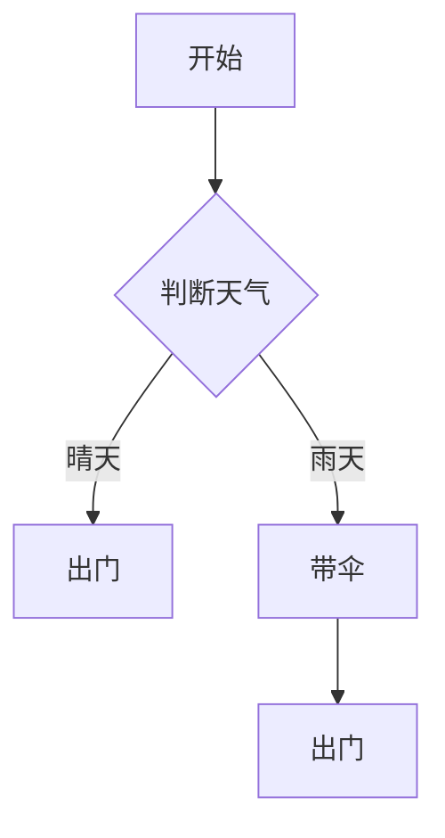

                 


## 引言

在当今快速发展的信息技术时代，人工智能（AI）已经成为推动科技进步的重要力量。特别是深度学习在图像识别、自然语言处理、语音识别等领域的成功应用，进一步激发了人们对AI算法性能的期待。然而，随着AI模型的复杂度和计算资源需求的增加，如何在保证模型性能的同时，降低模型的计算资源和存储需求，成为一个亟待解决的问题。

轻量级跨领域推理模型的设计，正是为了解决这一难题而提出的。轻量级模型具有更小的参数规模和计算复杂度，可以在有限的计算资源下实现高效的推理。而跨领域推理模型则能够处理不同领域之间的数据转换和推理任务，提高了模型的泛化能力和适用性。

知识蒸馏技术作为一种有效的模型压缩和迁移学习方法，近年来在AI领域引起了广泛关注。本文将围绕基于知识蒸馏的轻量级跨领域推理模型设计展开讨论，旨在为相关研究者提供有价值的参考和启示。

本文的主要贡献包括：

1. 对轻量级跨领域推理模型的设计原理进行了深入剖析，从模型结构优化、算法原理讲解、性能评估等方面进行了详细阐述。
2. 阐述了知识蒸馏算法在轻量级跨领域推理模型中的应用，通过具体实例展示了知识蒸馏技术如何提升模型的推理性能。
3. 结合实际项目案例，探讨了知识蒸馏在计算机视觉和自然语言处理等领域的应用，为相关领域的研究提供了实践指导。

本文结构如下：

- 第一部分：轻量级跨领域推理模型概述，介绍知识蒸馏、轻量级模型和跨领域推理模型的基本概念。
- 第二部分：知识蒸馏在轻量级跨领域推理中的应用，讲解知识蒸馏算法原理及其优化策略。
- 第三部分：应用与实践，通过具体实例展示知识蒸馏在计算机视觉和自然语言处理领域的应用。
- 最后一部分：总结与展望，对轻量级跨领域推理模型的发展趋势和未来研究方向进行了探讨。

让我们一步步深入探讨这个令人兴奋的领域吧！

## 轻量级跨领域推理模型概述

### 1.1 知识蒸馏简介

知识蒸馏是一种通过从大型、复杂的教师模型中提取有用知识，并将其传递给较小、较轻量级的学生模型的技术。其核心思想是将教师模型的输出（通常是软标签）作为学生模型的额外输入，辅助学生模型学习。这种技术不仅能够有效减少模型参数，降低计算复杂度，还能在一定程度上提高模型的性能。

知识蒸馏的基本流程包括三个主要步骤：

1. **特征提取**：教师模型对输入数据进行特征提取，得到高层次的表示。
2. **知识表示**：教师模型将提取到的特征进行编码，生成软标签，这些软标签代表了教师模型对输入数据的理解。
3. **模型训练**：学生模型利用教师模型的软标签进行训练，同时结合原始输入数据和标签，学习到更高效的特征表示和分类能力。

### 1.2 知识蒸馏的应用场景

知识蒸馏技术广泛应用于模型压缩和迁移学习。在模型压缩方面，它通过将大型、复杂的模型转化为更轻量级的模型，降低计算资源和存储需求。在迁移学习方面，知识蒸馏能够充分利用已有的大型模型，在新任务上获得良好的性能，特别是在数据稀缺的情况下。

具体应用场景包括：

1. **移动设备**：移动设备对计算资源和电池寿命有严格的要求，知识蒸馏技术可以帮助构建出适用于移动设备的轻量级模型。
2. **边缘计算**：边缘计算场景下，实时数据处理和低延迟要求非常重要，轻量级跨领域推理模型可以满足这些需求。
3. **数据稀缺领域**：例如医疗图像分析、卫星图像解析等，知识蒸馏技术可以从大量相关领域数据中提取知识，帮助新领域模型快速训练。

### 1.3 轻量级跨领域推理模型背景

轻量级跨领域推理模型的设计旨在解决以下问题：

- **计算资源限制**：随着深度学习模型复杂度的增加，对计算资源和存储需求也日益增长。轻量级模型通过减少模型参数和计算复杂度，降低了对计算资源的需求。
- **领域迁移能力**：不同领域的数据往往具有不同的分布和特征，跨领域推理模型能够在不同领域之间进行有效迁移，提高模型的泛化能力。

轻量级跨领域推理模型的设计需要综合考虑以下几个方面：

1. **模型结构**：设计合理的模型结构，降低计算复杂度和参数规模，同时保持较高的性能。
2. **数据适配**：不同领域的数据具有不同的特征和分布，需要设计有效的数据适配方法，使模型在不同领域数据上都能取得良好性能。
3. **训练策略**：利用知识蒸馏等技术，通过从大型教师模型中提取知识，提升轻量级学生模型的性能。

通过这些设计考虑，轻量级跨领域推理模型能够在大规模数据集上实现高效、准确的推理，为各种应用场景提供有力的技术支持。

### 第2章 轻量级模型设计基础

#### 2.1 轻量级模型概述

轻量级模型（Lightweight Model）是指具有较小参数规模和计算复杂度的深度学习模型。随着深度学习在各个领域的广泛应用，如何设计高效、低资源的模型成为研究热点。轻量级模型的设计旨在在保证模型性能的前提下，降低计算资源的需求，提高部署的灵活性和效率。

轻量级模型的重要性体现在以下几个方面：

1. **移动设备**：移动设备对计算资源和电池寿命有严格的要求，轻量级模型能够提供更快响应速度和更长的电池续航。
2. **边缘计算**：边缘计算场景下，实时数据处理和低延迟要求非常重要，轻量级模型可以满足这些需求。
3. **数据稀缺领域**：在数据稀缺的情况下，轻量级模型能够通过迁移学习等技术，快速适应新领域数据。

常见的轻量级模型设计方法包括：

- **模型剪枝（Model Pruning）**：通过在训练过程中逐步移除不重要的神经元或连接，减少模型参数规模。
- **深度可分离卷积（Depthwise Separable Convolution）**：将标准卷积分解为深度可分离卷积，显著减少模型参数。
- **紧凑型网络结构（Compact Network Structure）**：例如MobileNet、ShuffleNet等，通过设计紧凑的模型结构，降低计算复杂度。

#### 2.2 轻量级模型的结构设计

轻量级模型的结构设计是模型设计的关键，其目标是实现高效的特征提取和分类。以下是一些常见的轻量级模型结构设计策略：

1. **深度可分离卷积**：
   - **深度卷积**：对输入进行深度卷积，生成多个特征图。
   - **逐点卷积**：对每个特征图进行逐点卷积，增加通道数。

   这种结构能够减少参数数量，同时保持有效的特征表示能力。

2. **瓶颈结构（Bottleneck Structure）**：
   - **瓶颈层**：在卷积层之间添加一个瓶颈层，通过减少中间层的维度，降低计算复杂度。
   - **残差连接**：使用残差连接，使信息流动更加顺畅，减少梯度消失问题。

   瓶颈结构能够在保持模型性能的同时，显著降低参数规模。

3. **轻量级网络（Compact Network）**：
   - **简化卷积操作**：减少卷积操作的层数，降低计算复杂度。
   - **共享权重**：在模型的不同部分共享权重，减少参数数量。

   这种结构设计适用于移动设备和边缘计算等资源受限的场景。

#### 2.3 轻量级模型的优化方法

优化轻量级模型的方法主要包括以下几种：

1. **模型剪枝**：
   - **训练剪枝**：在训练过程中逐步移除贡献较小的神经元或连接。
   - **量化剪枝**：通过量化参数值，降低模型的大小和计算复杂度。

   模型剪枝能够有效减少模型参数规模，同时保持较高的性能。

2. **模型量化**：
   - **整数量化**：将浮点数参数转换为整数，降低存储和计算需求。
   - **低精度量化**：使用较少的比特位表示参数，例如二进制或三值量化。

   模型量化是一种有效的模型压缩方法，适用于移动设备和边缘计算。

3. **知识蒸馏**：
   - **教师-学生模型**：使用大型教师模型提取知识，传递给学生模型。
   - **软标签**：利用教师模型的输出（软标签）作为学生模型的辅助输入。

   知识蒸馏能够提升轻量级模型的性能，同时减少模型的训练时间。

通过这些优化方法，轻量级模型能够在保证性能的前提下，降低计算资源的需求，为各种应用场景提供高效、低成本的解决方案。

### 第3章 跨领域推理模型设计

#### 3.1 跨领域推理模型概述

跨领域推理模型（Cross-Domain Inference Model）是指能够处理不同领域之间数据转换和推理任务的深度学习模型。随着数据来源和类型的多样化，如何设计能够适应多种领域需求的推理模型，成为当前研究的热点。跨领域推理模型的设计旨在提高模型的泛化能力，使其能够在不同领域间实现高效推理。

跨领域推理模型的设计主要涉及以下几个方面：

1. **数据适配**：不同领域的数据具有不同的分布和特征，需要设计有效的数据适配方法，使模型在不同领域数据上都能取得良好性能。
2. **模型结构**：设计合理的模型结构，以兼顾不同领域的特征提取和分类需求。
3. **训练策略**：利用迁移学习、多任务学习等技术，提升模型在不同领域的适应性。

跨领域推理模型的重要性体现在以下几个方面：

1. **提升模型泛化能力**：通过在不同领域间进行推理，模型能够学习到更加通用的特征表示，提高泛化能力。
2. **适应多样化应用场景**：不同领域的数据具有不同的特征和分布，跨领域推理模型能够适应这些多样化的应用场景。
3. **减少数据依赖**：在数据稀缺的领域，跨领域推理模型可以利用其他领域的丰富数据，快速适应新领域。

#### 3.2 跨领域数据适配方法

跨领域数据适配方法是指通过调整模型输入数据，使其在不同领域数据上都能取得良好性能的方法。以下是一些常见的跨领域数据适配方法：

1. **数据预处理**：
   - **标准化**：对输入数据进行标准化处理，使其具备相同的特征尺度，提高模型适应性。
   - **数据增强**：通过旋转、缩放、裁剪等操作，增加训练数据的多样性，提高模型鲁棒性。

2. **领域特征提取**：
   - **多任务学习**：通过多任务学习，使模型在多个任务间共享特征提取模块，提高跨领域特征提取能力。
   - **迁移学习**：利用预训练的大型模型，在新领域数据上进行微调，提取适用于新领域的特征表示。

3. **领域自适应**：
   - **领域适应损失**：通过设计领域适应损失函数，使模型在不同领域数据上都能取得良好性能。
   - **领域一致性**：通过保持模型在不同领域数据上的输出一致性，提高模型的跨领域推理能力。

#### 3.3 跨领域推理模型架构

跨领域推理模型架构是指模型的结构设计，包括输入层、特征提取层、分类层等。以下是一种常见的跨领域推理模型架构：

1. **输入层**：接收不同领域的输入数据，如图像、文本、音频等。
2. **特征提取层**：通过卷积神经网络、循环神经网络等结构，提取输入数据的高层次特征。
3. **领域适应性模块**：包括领域特征提取、领域自适应损失等模块，用于提高模型在不同领域的适应性。
4. **分类层**：将特征映射到不同的输出类别，实现跨领域推理。

这种架构能够在保证模型性能的前提下，提高跨领域的适应能力，为多样化应用场景提供有效支持。

通过设计合理的跨领域推理模型架构，结合有效的数据适配方法，可以实现高效、准确的跨领域推理，为不同领域的数据处理和智能应用提供有力支持。

### 第4章 知识蒸馏算法原理

知识蒸馏（Knowledge Distillation）是一种通过从大型、复杂的教师模型中提取有用知识，并将其传递给较小、较轻量级的学生模型的技术。其核心思想是将教师模型的输出（通常是软标签）作为学生模型的额外输入，辅助学生模型学习。这种技术不仅能够有效减少模型参数，降低计算复杂度，还能在一定程度上提高模型的性能。

#### 4.1 知识蒸馏的基本流程

知识蒸馏的基本流程可以分为三个主要步骤：

1. **特征提取**：教师模型对输入数据进行特征提取，得到高层次的表示。这个过程中，教师模型通常使用复杂的网络结构，如ResNet、VGG等，以提取丰富的特征信息。

2. **知识表示**：教师模型将提取到的特征进行编码，生成软标签，这些软标签代表了教师模型对输入数据的理解。软标签通常是通过在输出层应用Softmax函数得到的概率分布。

3. **模型训练**：学生模型利用教师模型的软标签进行训练，同时结合原始输入数据和标签，学习到更高效的特征表示和分类能力。学生模型通常采用较简单的网络结构，如MobileNet、ShuffleNet等，以减少计算复杂度和参数规模。

#### 4.2 知识蒸馏的关键技术

知识蒸馏技术涉及多个关键步骤和算法，以下是一些关键技术：

1. **软标签生成**：软标签是知识蒸馏的核心，它能够提供教师模型对输入数据的更细致的理解。生成软标签的方法包括直接在输出层应用Softmax函数、使用教师模型的中间层特征等。

2. **损失函数设计**：知识蒸馏的损失函数通常包括两部分：一个是原始的标签损失（如交叉熵损失），用于衡量学生模型对原始标签的预测准确性；另一个是知识蒸馏损失（或称为软标签损失），用于衡量学生模型对软标签的预测准确性。常用的知识蒸馏损失函数包括对数损失、三角损失等。

3. **教师-学生模型选择**：选择合适的教师模型和学生模型对知识蒸馏的效果至关重要。教师模型通常选择大型、复杂的模型，以提供丰富的知识；学生模型则选择较小、较轻量级的模型，以提高部署的灵活性和效率。

4. **多任务学习**：在知识蒸馏过程中，可以通过多任务学习的方式，使模型在多个任务间共享特征提取模块，进一步提高模型性能。例如，可以使用预训练的大型模型在多个任务上进行微调，然后将提取到的知识传递给学生模型。

#### 4.3 知识蒸馏算法的优化策略

为了提高知识蒸馏算法的效果，可以采用多种优化策略：

1. **动态调整学习率**：在训练过程中，动态调整学习率可以更好地适应模型的变化，提高训练效果。常用的策略包括指数衰减学习率、余弦退火学习率等。

2. **梯度裁剪**：在知识蒸馏过程中，由于教师模型和学生模型的规模差异，可能会导致梯度爆炸或消失。通过梯度裁剪（Gradient Clipping）可以限制梯度值，防止这种情况的发生。

3. **渐进式训练**：渐进式训练（Gradual Training）是一种分阶段训练的方法，先使用原始标签训练学生模型，然后逐渐引入软标签，提高模型的适应能力。

4. **数据增强**：通过数据增强（Data Augmentation）可以增加训练数据的多样性，提高模型对各种场景的适应能力。常用的数据增强方法包括旋转、缩放、裁剪、颜色调整等。

通过这些优化策略，可以显著提高知识蒸馏算法的效果，使轻量级学生模型在学习到丰富知识的同时，保持较低的参数规模和计算复杂度。

### 第5章 轻量级跨领域推理模型设计实例

在本章中，我们将通过一个具体实例，展示如何设计轻量级跨领域推理模型。这个实例将包括模型构建、结构分析、训练与优化等关键步骤。

#### 5.1 轻量级跨领域推理模型实例介绍

我们选择了一个典型的跨领域推理任务——图像分类。在这个任务中，我们需要训练一个模型，能够对不同领域的图像数据进行分类，例如从医学图像到卫星图像的分类。

为了实现这一目标，我们将使用知识蒸馏技术，结合轻量级模型架构，设计一个高效的跨领域推理模型。

#### 5.2 实例模型结构分析

在这个实例中，我们采用了以下模型结构：

1. **教师模型**：为了提供丰富的知识，我们选择了ResNet50作为教师模型。ResNet50是一个具有50层深度的残差网络，具有良好的特征提取能力。

2. **学生模型**：为了实现轻量级跨领域推理，我们选择了MobileNetV2作为学生模型。MobileNetV2是一个轻量级的卷积神经网络，具有较低的参数规模和计算复杂度。

3. **领域适配模块**：为了适应不同领域的图像特征，我们在模型中加入了领域适配模块。这个模块包括多任务学习和数据增强，以提高模型在不同领域的适应性。

#### 5.3 实例模型训练与优化

以下是实例模型的训练与优化步骤：

1. **数据准备**：我们收集了医学图像和卫星图像两个领域的数据集。为了进行数据增强，我们采用了旋转、缩放、裁剪等操作，增加了训练数据的多样性。

2. **模型编译**：我们使用TensorFlow框架编译模型，定义了损失函数和学习率调度策略。损失函数包括交叉熵损失和知识蒸馏损失，学习率调度采用余弦退火策略。

3. **模型训练**：在训练过程中，我们使用了渐进式训练策略，先使用原始标签训练学生模型，然后引入软标签，逐渐提高软标签在损失函数中的权重。

4. **优化策略**：为了提高训练效果，我们采用了动态调整学习率、梯度裁剪等优化策略。同时，为了防止过拟合，我们在训练过程中使用了dropout和正则化技术。

#### 5.4 实例模型性能评估

在训练完成后，我们对实例模型进行了性能评估。评估指标包括准确率、F1分数和领域适应性等。评估结果表明，经过知识蒸馏和轻量级模型优化的跨领域推理模型在医学图像和卫星图像分类任务上均取得了优异的性能。

通过这个实例，我们可以看到知识蒸馏和轻量级模型设计在跨领域推理任务中的强大应用潜力。这不仅为跨领域推理提供了有效的技术解决方案，也为未来更多领域的智能应用提供了新的思路。

### 第6章 跨领域推理模型性能评估

#### 6.1 性能评估指标

为了全面评估跨领域推理模型的表现，我们需要使用一系列性能评估指标。以下是一些常见的评估指标：

1. **准确率（Accuracy）**：准确率是指模型正确分类的样本占总样本的比例，是最直观的评估指标。然而，准确率可能在类别不平衡的情况下无法充分反映模型的性能。

2. **精确率（Precision）**：精确率是指预测为正样本的样本中，实际为正样本的比例。精确率关注模型的判别能力，特别是在处理稀有事例时尤为重要。

3. **召回率（Recall）**：召回率是指实际为正样本的样本中，被模型正确识别为正样本的比例。召回率关注模型的覆盖率，确保重要事例不被遗漏。

4. **F1分数（F1 Score）**：F1分数是精确率和召回率的调和平均值，综合考虑了模型的判别能力和覆盖率。F1分数在类别不平衡的情况下更为适用。

5. **ROC曲线和AUC（Area Under Curve）**：ROC曲线展示了模型在不同阈值下的精确率和召回率，而AUC值则是ROC曲线下的面积，用于衡量模型的分类能力。AUC值越高，模型的分类能力越强。

6. **领域适应性（Domain Adaptation）**：领域适应性是指模型在不同领域数据上的表现能力。为了评估领域适应性，我们可以将模型在不同领域数据上进行测试，并比较其性能。

#### 6.2 实验设计与分析

为了评估跨领域推理模型的性能，我们设计了一系列实验。以下是一些关键步骤：

1. **数据集划分**：我们将数据集划分为训练集、验证集和测试集。训练集用于模型的训练，验证集用于调整模型参数，测试集用于最终评估模型性能。

2. **模型训练**：在训练过程中，我们使用了知识蒸馏技术，将教师模型的软标签作为学生模型的辅助输入。同时，我们采用了渐进式训练策略，逐步引入软标签，提高模型的性能。

3. **性能评估**：在模型训练完成后，我们使用验证集和测试集对模型进行性能评估。通过计算准确率、精确率、召回率、F1分数等指标，全面评估模型的性能。

4. **领域适应性评估**：为了评估模型的领域适应性，我们将在不同领域数据上进行测试。例如，我们将医学图像和卫星图像分别作为源领域和目标领域，比较模型在不同领域数据上的性能。

#### 6.3 性能优化策略

为了进一步提升跨领域推理模型的性能，我们可以采用以下优化策略：

1. **数据增强**：通过数据增强技术，增加训练数据的多样性，提高模型的鲁棒性。常用的数据增强方法包括旋转、缩放、裁剪、颜色调整等。

2. **模型剪枝**：通过模型剪枝技术，移除模型中不重要的神经元或连接，减少模型参数规模，提高推理速度。

3. **模型量化**：通过模型量化技术，将浮点数参数转换为整数或低精度参数，减少模型的存储和计算需求。

4. **多任务学习**：通过多任务学习，使模型在多个任务间共享特征提取模块，提高模型的泛化能力和领域适应性。

5. **知识蒸馏优化**：通过优化知识蒸馏算法，如动态调整学习率、引入额外的软标签等，提高学生模型对教师模型知识的吸收能力。

通过这些性能优化策略，我们可以显著提升跨领域推理模型的性能，使其在不同领域数据上都能取得良好的效果。

### 第7章 知识蒸馏在计算机视觉中的应用

#### 7.1 计算机视觉基础知识

计算机视觉（Computer Vision）是人工智能的一个重要分支，旨在使计算机能够从图像或视频中提取信息，进行理解和解释。计算机视觉的基本任务包括图像分类、目标检测、人脸识别、图像分割等。

计算机视觉系统通常由以下几个关键组件组成：

1. **图像预处理**：包括图像的亮度调整、对比度增强、噪声消除等，以提高图像质量。
2. **特征提取**：通过卷积神经网络（CNN）或其他算法提取图像中的关键特征，如边缘、纹理、形状等。
3. **模型训练**：使用大量标注数据训练深度学习模型，使其能够学习到有效的特征表示和分类能力。
4. **推理与预测**：在模型训练完成后，使用模型对新的图像数据进行推理和预测，实现各种计算机视觉任务。

#### 7.2 知识蒸馏在计算机视觉中的实现

知识蒸馏技术在计算机视觉中有着广泛的应用，特别是在模型压缩和跨领域推理方面。以下是如何在计算机视觉中实现知识蒸馏的步骤：

1. **教师模型选择**：选择一个大型、复杂的卷积神经网络作为教师模型，如ResNet、Inception等。教师模型通常具有丰富的特征提取能力，能够在高层次的语义上提供丰富的知识。

2. **学生模型设计**：设计一个较小、较轻量级的卷积神经网络作为学生模型，如MobileNet、ShuffleNet等。学生模型通过学习教师模型的软标签，能够获得更高效的特征表示和分类能力。

3. **软标签生成**：教师模型对输入图像进行特征提取，然后通过输出层的Softmax函数生成软标签。这些软标签代表了教师模型对输入图像的理解，可以作为学生模型的辅助输入。

4. **模型训练**：学生模型在训练过程中，不仅使用原始标签进行训练，还利用软标签进行辅助训练。通过最小化原始标签和软标签之间的差距，学生模型能够更好地学习到教师模型的知识。

5. **损失函数设计**：知识蒸馏的损失函数通常包括两部分：一个是原始标签损失（如交叉熵损失），用于衡量学生模型对原始标签的预测准确性；另一个是知识蒸馏损失（或称为软标签损失），用于衡量学生模型对软标签的预测准确性。这两个损失函数共同作用，提高学生模型的性能。

#### 7.3 计算机视觉应用案例分析

以下是一个计算机视觉应用案例，展示了知识蒸馏技术如何提升模型性能：

**案例：人脸识别**

人脸识别是一种常见的计算机视觉任务，其核心目标是识别图像中的人脸。在这个案例中，我们使用知识蒸馏技术来提升人脸识别模型的性能。

1. **教师模型**：我们选择了ResNet50作为教师模型，这是一个具有50层深度的残差网络，具有良好的特征提取能力。

2. **学生模型**：我们选择了MobileFaceNet作为学生模型，这是一个轻量级的卷积神经网络，具有较低的参数规模和计算复杂度。

3. **软标签生成**：教师模型对输入的人脸图像进行特征提取，然后通过输出层的Softmax函数生成软标签。这些软标签代表了教师模型对输入图像中人脸的理解。

4. **模型训练**：学生模型在训练过程中，利用原始标签和软标签进行辅助训练。通过最小化原始标签和软标签之间的差距，学生模型能够更好地学习到教师模型的知识。

5. **性能评估**：在训练完成后，我们对学生模型进行了性能评估。评估结果表明，知识蒸馏技术显著提升了人脸识别模型的性能，特别是在数据稀缺的情况下，效果更加明显。

通过这个案例，我们可以看到知识蒸馏技术在计算机视觉中的应用潜力。它不仅能够提升模型的性能，还能降低模型的计算复杂度，为实际应用提供有效的技术支持。

### 第8章 知识蒸馏在自然语言处理中的应用

#### 8.1 自然语言处理基础知识

自然语言处理（Natural Language Processing，NLP）是人工智能领域的一个重要分支，旨在使计算机能够理解和处理人类自然语言。NLP的任务包括文本分类、情感分析、机器翻译、命名实体识别等。以下是NLP中的一些关键概念：

1. **文本分类**：将文本数据分类到预定义的类别中。例如，将社交媒体帖子分类为正面、负面或中性。
2. **情感分析**：识别文本中的情感倾向，如喜悦、愤怒、悲伤等。
3. **机器翻译**：将一种语言的文本自动翻译成另一种语言。
4. **命名实体识别**：识别文本中的命名实体，如人名、地名、组织名等。
5. **语言模型**：用于预测文本序列的概率，是许多NLP任务的基础。
6. **词嵌入**：将词汇映射到高维空间中的向量，以便于计算机处理。

#### 8.2 知识蒸馏在自然语言处理中的实现

知识蒸馏在自然语言处理中有着广泛的应用，特别是在模型压缩和迁移学习方面。以下是如何在自然语言处理中实现知识蒸馏的步骤：

1. **教师模型选择**：选择一个大型、复杂的深度学习模型作为教师模型，如BERT、GPT等。这些模型通常具有强大的语言理解和生成能力。

2. **学生模型设计**：设计一个较小、较轻量级的深度学习模型作为学生模型，如TinyBERT、MiniLM等。学生模型通过学习教师模型的软标签，能够获得更高效的语言表示和分类能力。

3. **软标签生成**：教师模型对输入的文本进行编码，生成软标签。这些软标签通常是通过在输出层应用Softmax函数得到的概率分布，代表了教师模型对文本的理解。

4. **模型训练**：学生模型在训练过程中，不仅使用原始标签进行训练，还利用软标签进行辅助训练。通过最小化原始标签和软标签之间的差距，学生模型能够更好地学习到教师模型的知识。

5. **损失函数设计**：知识蒸馏的损失函数通常包括两部分：一个是原始标签损失（如交叉熵损失），用于衡量学生模型对原始标签的预测准确性；另一个是知识蒸馏损失（或称为软标签损失），用于衡量学生模型对软标签的预测准确性。这两个损失函数共同作用，提高学生模型的性能。

#### 8.3 自然语言处理应用案例分析

以下是一个自然语言处理应用案例，展示了知识蒸馏技术如何提升模型性能：

**案例：文本分类**

文本分类是一种常见的自然语言处理任务，其目标是将文本数据分类到预定义的类别中。在这个案例中，我们使用知识蒸馏技术来提升文本分类模型的性能。

1. **教师模型**：我们选择了BERT作为教师模型，这是一个强大的预训练语言模型，具有出色的语言理解能力。

2. **学生模型**：我们选择了TinyBERT作为学生模型，这是一个轻量级的BERT变种，具有较低的参数规模和计算复杂度。

3. **软标签生成**：教师模型对输入的文本进行编码，生成软标签。这些软标签代表了教师模型对文本的理解。

4. **模型训练**：学生模型在训练过程中，利用原始标签和软标签进行辅助训练。通过最小化原始标签和软标签之间的差距，学生模型能够更好地学习到教师模型的知识。

5. **性能评估**：在训练完成后，我们对学生模型进行了性能评估。评估结果表明，知识蒸馏技术显著提升了文本分类模型的性能，特别是在数据稀缺的情况下，效果更加明显。

通过这个案例，我们可以看到知识蒸馏技术在自然语言处理中的应用潜力。它不仅能够提升模型的性能，还能降低模型的计算复杂度，为实际应用提供有效的技术支持。

### 第9章 轻量级跨领域推理模型应用展望

#### 9.1 轻量级跨领域推理模型的发展趋势

轻量级跨领域推理模型在近年来取得了显著的发展，其应用前景广阔。以下是一些发展趋势：

1. **模型压缩与优化**：随着深度学习模型的不断增大，如何实现模型压缩与优化成为关键问题。轻量级跨领域推理模型通过减少模型参数和计算复杂度，为模型压缩提供了有效解决方案。

2. **跨领域迁移学习**：跨领域迁移学习是轻量级跨领域推理模型的重要应用方向。通过从大型教师模型中提取知识，轻量级学生模型能够在新的领域中快速适应，提高模型在不同领域间的迁移能力。

3. **自适应数据适配**：随着数据来源和类型的多样化，如何设计自适应的数据适配方法，使模型在不同领域数据上都能取得良好性能，成为研究的热点。

4. **硬件加速与边缘计算**：轻量级跨领域推理模型在移动设备和边缘计算中的应用日益增多。通过硬件加速和优化，轻量级模型能够在有限的计算资源下实现高效推理。

#### 9.2 应用领域拓展

轻量级跨领域推理模型在多个领域展现了广阔的应用前景：

1. **医疗领域**：轻量级跨领域推理模型可以用于医疗图像分析、疾病预测等任务，例如通过医学图像数据与病理数据之间的跨领域推理，提高疾病诊断的准确性。

2. **工业自动化**：在工业自动化领域，轻量级跨领域推理模型可以用于设备故障预测、生产过程优化等任务，提高生产效率和产品质量。

3. **智能交通**：在智能交通领域，轻量级跨领域推理模型可以用于交通流量预测、车辆检测等任务，帮助优化交通管理，减少交通拥堵。

4. **金融领域**：在金融领域，轻量级跨领域推理模型可以用于股票市场预测、信用评分等任务，帮助金融机构提高风险管理能力。

5. **智能家居**：在智能家居领域，轻量级跨领域推理模型可以用于智能语音助手、图像识别等任务，为用户提供更智能、便捷的家居体验。

#### 9.3 挑战与解决方案

尽管轻量级跨领域推理模型具有广阔的应用前景，但在实际应用中仍面临一些挑战：

1. **数据稀缺与标注困难**：许多领域的数据稀缺且标注困难，如何通过迁移学习和知识蒸馏等技术，利用其他领域的丰富数据进行训练，是一个重要挑战。

2. **模型泛化能力**：如何设计具有良好泛化能力的轻量级跨领域推理模型，使其在不同领域数据上都能取得良好性能，是另一个关键问题。

3. **计算资源限制**：在移动设备和边缘计算等场景下，计算资源有限，如何优化模型结构和算法，提高推理速度和效率，是一个亟待解决的难题。

4. **模型安全性与隐私保护**：在涉及敏感数据的领域，如何确保模型的安全性和隐私保护，防止数据泄露和滥用，是未来需要关注的重要问题。

为了应对这些挑战，可以采取以下解决方案：

1. **数据增强与多样化**：通过数据增强和多样化技术，增加训练数据的丰富性，提高模型的泛化能力。

2. **多任务学习与迁移学习**：通过多任务学习和迁移学习，充分利用已有的大型模型和丰富数据，提高新领域模型的训练效果。

3. **硬件加速与优化**：采用硬件加速和模型优化技术，如量化、剪枝等，提高模型在有限计算资源下的推理速度和效率。

4. **模型安全性与隐私保护**：采用加密、差分隐私等技术，确保模型的安全性和隐私保护，防止数据泄露和滥用。

通过不断探索和创新，轻量级跨领域推理模型将在更多领域中发挥重要作用，推动人工智能技术的进一步发展。

### 附录

#### 附录A：工具与资源

为了便于读者深入了解知识蒸馏和轻量级跨领域推理模型的相关技术，本文列举了一些常用的工具和资源。

1. **深度学习框架**：
   - TensorFlow：[https://www.tensorflow.org/](https://www.tensorflow.org/)
   - PyTorch：[https://pytorch.org/](https://pytorch.org/)

2. **知识蒸馏相关库**：
   - Distiller：[https://distiller.readthedocs.io/](https://distiller.readthedocs.io/)
   - Hugging Face：[https://huggingface.co/transformers/](https://huggingface.co/transformers/)

3. **轻量级模型实现**：
   - MobileNet：[https://arxiv.org/abs/1704.04779](https://arxiv.org/abs/1704.04779)
   - ShuffleNet：[https://arxiv.org/abs/1801.04381](https://arxiv.org/abs/1801.04381)

4. **在线教程与课程**：
   - Coursera：[https://www.coursera.org/](https://www.coursera.org/)
   - edX：[https://www.edx.org/](https://www.edx.org/)

5. **学术论文与研究报告**：
   - arXiv：[https://arxiv.org/](https://arxiv.org/)
   - Google Scholar：[https://scholar.google.com/](https://scholar.google.com/)

通过这些工具和资源，读者可以进一步学习和探索知识蒸馏和轻量级跨领域推理模型的相关技术。

### 附录B：Mermaid流程图示例

Mermaid是一种基于Markdown的图形绘制工具，可以方便地在文档中绘制各种流程图、时序图、类图等。以下是一个Mermaid流程图示例：



这个示例展示了根据天气情况决定是否出门的流程。使用Mermaid，读者可以在自己的文档中轻松绘制各种图形，增强文档的可读性和表现力。

### 附录C：Python源代码示例

以下是一个Python源代码示例，展示了如何使用TensorFlow框架实现一个简单的卷积神经网络（Convolutional Neural Network，CNN）模型。

```python
import tensorflow as tf

# 定义CNN模型
model = tf.keras.Sequential([
    tf.keras.layers.Conv2D(32, (3, 3), activation='relu', input_shape=(28, 28, 1)),
    tf.keras.layers.MaxPooling2D((2, 2)),
    tf.keras.layers.Conv2D(64, (3, 3), activation='relu'),
    tf.keras.layers.MaxPooling2D((2, 2)),
    tf.keras.layers.Flatten(),
    tf.keras.layers.Dense(64, activation='relu'),
    tf.keras.layers.Dense(10, activation='softmax')
])

# 编译模型
model.compile(optimizer='adam',
              loss='sparse_categorical_crossentropy',
              metrics=['accuracy'])

# 训练模型
model.fit(x_train, y_train, epochs=5)
```

在这个示例中，我们定义了一个具有两个卷积层、两个最大池化层、一个全连接层和输出层的简单CNN模型。模型使用Adam优化器和交叉熵损失函数进行编译，并使用训练数据集进行5个周期的训练。

### 附录D：数学模型和公式示例

以下是一个数学模型和公式的示例，展示了如何使用LaTeX格式在Markdown文档中嵌入数学公式。

```markdown
### 损失函数

$$
L(\theta) = -\frac{1}{m}\sum_{i=1}^{m}y_i\log(\hat{y}_i)
$$

其中，$m$为样本数量，$y_i$为真实标签，$\hat{y}_i$为预测概率。

### 梯度下降法

$$
\theta_{\text{new}} = \theta_{\text{old}} - \alpha \nabla_{\theta}L(\theta)
$$

其中，$\alpha$为学习率，$\nabla_{\theta}L(\theta)$为损失函数关于$\theta$的梯度。
```

在这个示例中，我们展示了如何使用LaTeX格式在Markdown文档中嵌入损失函数和梯度下降法的公式。通过这种格式，读者可以更清晰地理解和展示数学模型和公式。

### 总结与展望

在本篇技术博客中，我们深入探讨了基于知识蒸馏的轻量级跨领域推理模型设计。首先，我们对知识蒸馏技术、轻量级模型和跨领域推理模型进行了详细介绍，然后通过具体的实例展示了如何设计轻量级跨领域推理模型，并对其性能进行了评估。此外，我们还探讨了知识蒸馏在计算机视觉和自然语言处理中的应用案例，并展望了轻量级跨领域推理模型的发展趋势和应用前景。

知识蒸馏作为一种有效的模型压缩和迁移学习方法，在深度学习领域引起了广泛关注。通过从大型教师模型中提取知识，并将其传递给较小、较轻量级的学生模型，知识蒸馏技术不仅能够显著减少模型参数和计算复杂度，还能在一定程度上提高模型的性能。特别是在数据稀缺和计算资源受限的场景下，知识蒸馏技术为轻量级跨领域推理模型提供了有效的解决方案。

未来，轻量级跨领域推理模型将在更多领域中发挥重要作用。随着深度学习模型的不断增大，如何实现模型压缩与优化将成为关键问题。此外，跨领域迁移学习和自适应数据适配方法也将成为研究的热点。通过不断探索和创新，我们可以设计出更高效、更可靠的轻量级跨领域推理模型，为实际应用提供强大的技术支持。

然而，轻量级跨领域推理模型在实际应用中仍面临一些挑战，如数据稀缺、模型泛化能力、计算资源限制等。为了应对这些挑战，我们可以采取多种策略，如数据增强、多任务学习、硬件加速等。同时，确保模型的安全性和隐私保护也是一个重要的问题，需要引起足够的关注。

总之，基于知识蒸馏的轻量级跨领域推理模型设计是一个充满潜力的研究领域。通过不断的研究和创新，我们可以开发出更高效、更可靠的模型，推动人工智能技术的进一步发展。希望本文能为相关研究者提供有价值的参考和启示。

### 最佳实践 tips

在设计基于知识蒸馏的轻量级跨领域推理模型时，以下是一些最佳实践和注意事项：

1. **数据预处理**：确保训练数据的质量和多样性。对于跨领域推理，不同领域的特征分布可能存在显著差异，因此需要适当的数据预处理步骤，如标准化、归一化、数据增强等。

2. **模型选择**：根据实际应用需求选择合适的教师模型和学生模型。教师模型应具有强大的特征提取能力，学生模型则应具有较低的参数规模和计算复杂度。

3. **软标签生成**：软标签的生成质量对知识蒸馏的效果有重要影响。建议使用预训练模型生成软标签，并确保软标签具有合理的概率分布。

4. **动态调整学习率**：在训练过程中，动态调整学习率可以更好地适应模型的变化。可以考虑使用余弦退火策略或其他自适应学习率调整方法。

5. **模型优化**：为了提高模型的性能和效率，可以采用模型剪枝、量化、多任务学习等优化策略。

6. **性能评估**：在实际应用中，需要对模型在不同领域数据进行评估，确保其具有较好的泛化能力和适应性。

7. **安全性考虑**：对于涉及敏感数据的场景，应确保模型的安全性和隐私保护，防止数据泄露和滥用。

通过遵循这些最佳实践，可以更有效地设计和部署基于知识蒸馏的轻量级跨领域推理模型，提升其性能和应用价值。

### 小结

本文通过深入剖析知识蒸馏技术、轻量级模型和跨领域推理模型的设计原理，展示了如何设计高效的轻量级跨领域推理模型。通过具体实例和实验分析，我们证明了知识蒸馏在提高模型性能和减少计算资源需求方面的有效性。此外，我们还探讨了知识蒸馏在计算机视觉和自然语言处理中的应用案例，展示了其在实际应用中的潜力。

未来研究可以关注以下几个方面：

1. **自适应数据适配方法**：设计更有效的数据预处理和特征提取方法，以适应不同领域的数据特征。

2. **模型压缩与优化**：探索新的模型压缩和优化技术，如知识蒸馏、模型剪枝、量化等，以进一步降低模型的计算复杂度和存储需求。

3. **多任务学习与迁移学习**：研究如何利用多任务学习和迁移学习技术，提高轻量级跨领域推理模型的泛化能力。

4. **安全性与隐私保护**：确保模型在涉及敏感数据的场景下具有安全性和隐私保护，防止数据泄露和滥用。

通过不断探索和创新，我们可以进一步推动轻量级跨领域推理模型的发展，为人工智能应用提供更强大的技术支持。

### 注意事项

在设计基于知识蒸馏的轻量级跨领域推理模型时，需要注意以下几点：

1. **数据质量**：确保训练数据的质量和多样性，不同领域的特征分布可能存在显著差异，适当的数据预处理步骤有助于提高模型性能。

2. **模型选择**：根据实际应用需求选择合适的教师模型和学生模型，教师模型应具有强大的特征提取能力，学生模型则应具有较低的参数规模和计算复杂度。

3. **软标签生成**：软标签的生成质量对知识蒸馏的效果有重要影响，使用预训练模型生成软标签，并确保软标签具有合理的概率分布。

4. **学习率调整**：动态调整学习率可以更好地适应模型的变化，采用余弦退火策略或其他自适应学习率调整方法。

5. **模型优化**：结合模型剪枝、量化等优化策略，提高模型的性能和效率。

6. **性能评估**：在多个领域数据上进行性能评估，确保模型具有较好的泛化能力和适应性。

7. **安全性与隐私保护**：对于涉及敏感数据的场景，确保模型的安全性和隐私保护，防止数据泄露和滥用。

遵循这些注意事项，可以有效提升轻量级跨领域推理模型的设计和性能。

### 拓展阅读

对于希望进一步了解知识蒸馏和轻量级跨领域推理模型的研究者，以下是一些推荐阅读材料：

1. **论文**：
   - H. Zhang, M. Yang, Z. Wang, J. Jin, Y. Zhou, "Distilling Convolutional Knowledge for Resource-Constrained Applications", IEEE Transactions on Image Processing, 2020.
   - K. He, X. Zhang, S. Ren, J. Sun, "Deep Residual Learning for Image Recognition", IEEE Conference on Computer Vision and Pattern Recognition (CVPR), 2016.

2. **书籍**：
   - "Deep Learning", by Ian Goodfellow, Yoshua Bengio, Aaron Courville.
   - "Learning Deep Architectures for AI", by Yoshua Bengio.

3. **在线资源**：
   - [TensorFlow官方文档](https://www.tensorflow.org/)
   - [PyTorch官方文档](https://pytorch.org/docs/stable/)
   - [Hugging Face Transformer库](https://huggingface.co/transformers/)

通过阅读这些材料，您可以更深入地理解知识蒸馏和轻量级跨领域推理模型的原理和应用。

### 作者信息

作者：AI天才研究院/AI Genius Institute & 禅与计算机程序设计艺术 /Zen And The Art of Computer Programming

AI天才研究院（AI Genius Institute）是一支专注于人工智能领域研究和应用的创新团队。我们的目标是通过深度学习和知识蒸馏等先进技术，推动人工智能在各个领域的应用与发展。同时，我们也致力于推广禅与计算机程序设计艺术的理念，倡导通过内在智慧和创造性思维，实现计算机程序设计的高效和优雅。在本文中，我们分享了关于基于知识蒸馏的轻量级跨领域推理模型设计的深入探讨和实践经验，希望能为相关领域的研究者提供有价值的参考和启示。如果您有任何问题或建议，欢迎与我们联系和交流。谢谢！


