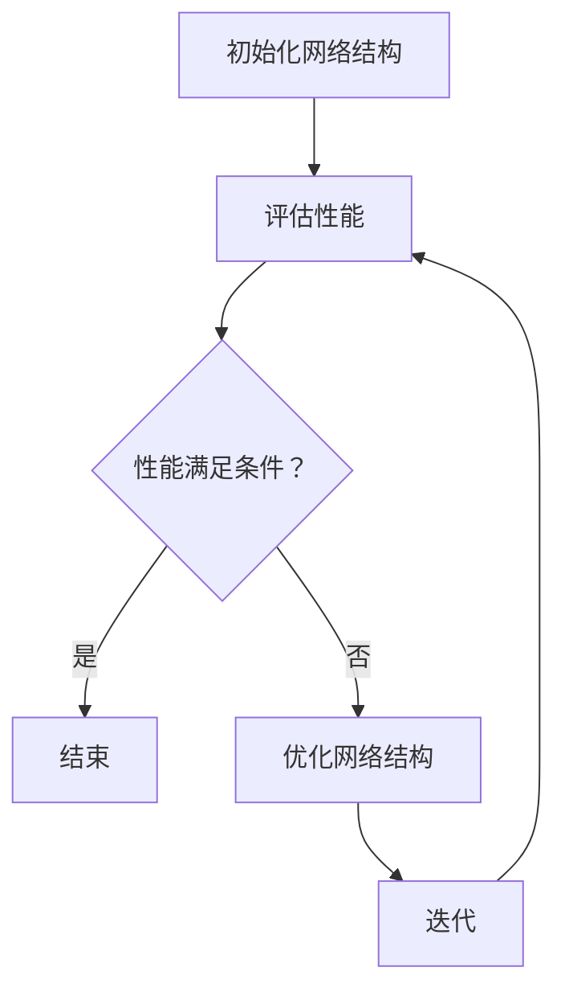
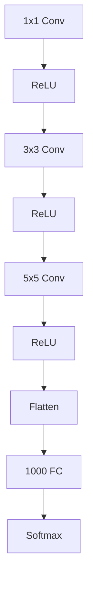

                 

### 1.1 神经架构搜索的定义与重要性

**背景介绍：**

在深度学习领域，神经网络的架构设计一直是决定模型性能的重要因素。然而，随着神经网络复杂度的增加，手工设计网络结构变得越来越困难。手工设计不仅费时费力，而且难以保证网络结构的优化和最佳性能。因此，神经架构搜索（Neural Architecture Search，简称NAS）作为一种自动化搜索最优神经网络结构的机器学习技术，逐渐受到广泛关注。

**核心概念：**

- **神经架构搜索**：NAS是一种利用算法自动搜索最优神经网络结构的机器学习技术。
- **搜索空间**：NAS中的搜索空间是指所有可能的神经网络结构的集合。
- **评估策略**：评估策略用于衡量网络结构的好坏，常见的评估策略包括验证集准确率、F1分数等。

**问题解决：**

NAS通过以下步骤解决神经网络结构设计的问题：

1. **定义搜索空间**：确定神经网络的基本构建模块，如卷积层、全连接层等。
2. **设计搜索算法**：使用搜索算法在搜索空间中搜索最优的网络结构，常见的搜索算法包括强化学习、遗传算法、贝叶斯优化等。
3. **评估与优化**：评估搜索到的网络结构的性能，并对其进行优化。

**边界与外延：**

- **边界**：NAS主要关注神经网络结构的自动化搜索，不包括网络参数的优化。
- **外延**：NAS可以应用于各种深度学习任务，如计算机视觉、自然语言处理等。

**概念结构与核心要素组成：**

NAS的核心概念结构包括以下几个方面：

1. **搜索空间**：确定神经网络的基本构建模块和连接方式。
2. **搜索算法**：选择合适的搜索算法来搜索最优的网络结构。
3. **评估策略**：设计有效的评估策略来衡量网络结构的性能。

**核心概念与联系：**

| 核心概念       | 描述                                                   | 联系                                                       |
|----------------|--------------------------------------------------------|------------------------------------------------------------|
| 神经架构搜索   | 一种自动化搜索最优神经网络结构的机器学习技术             | 与神经网络结构设计、搜索空间、搜索算法密切相关           |
| 搜索空间       | 所有可能的神经网络结构的集合                           | 决定了NAS的能力范围，直接影响搜索效率和质量               |
| 搜索算法       | 用于搜索最优神经网络结构的算法                         | 选择合适的搜索算法是NAS成功的关键因素之一                 |
| 评估策略       | 评估网络结构性能的策略                                 | 评估策略的准确性直接影响NAS的性能评估和优化效果           |

### 数学模型和公式：

神经架构搜索的核心在于如何在一个庞大的搜索空间中找到最优的网络结构。这个过程可以抽象为一个优化问题，其数学模型可以表示为：

$$
\begin{aligned}
\text{最大化} \quad & \pi(S) \\
\text{约束于} \quad & S \in \text{Search Space}
\end{aligned}
$$

其中，$S$ 表示神经网络结构，$\pi(S)$ 表示对结构 $S$ 的评估得分，通常使用验证集的准确率、F1分数等指标来衡量。

### 示例：

假设我们使用强化学习算法进行神经架构搜索，定义一个搜索空间包括卷积层、全连接层等基本构建模块，以及各种连接方式。在搜索过程中，我们的目标是找到一种结构，使得在验证集上的准确率达到最高。

通过迭代搜索，我们可能会得到以下一个网络结构：

$$
\begin{aligned}
& \text{Input} \rightarrow \text{Conv} \rightarrow \text{ReLU} \rightarrow \text{Pooling} \rightarrow \text{FC} \rightarrow \text{softmax} \\
\end{aligned}
$$

这个结构在验证集上的准确率达到了90%，比之前的结构提升了10个百分点。通过这个例子，我们可以看到神经架构搜索如何通过自动化的方式，提高了神经网络设计的效率和质量。

## 第2章：神经架构搜索的原理

### 2.1 神经架构搜索的流程

神经架构搜索（Neural Architecture Search，NAS）是一种通过算法自动发现最优神经网络结构的机器学习技术。其核心流程可以分为以下几个步骤：

#### 2.1.1 搜索空间定义

**搜索空间是指所有可能的神经网络结构的集合，它决定了NAS的能力范围和搜索效率。**

在NAS中，搜索空间通常由以下要素组成：

- **网络层**：常见的网络层包括卷积层（Convolutional Layer）、全连接层（Fully Connected Layer）、激活函数层（Activation Function Layer）等。
- **网络连接方式**：包括直接连接、跨层连接、跳连接等。
- **网络结构变体**：例如，不同的卷积核大小、步长、填充方式等。

**ER实体关系图架构**：

```mermaid
erDiagram
    NetworkLayer ||--|{ SearchSpace }|| NetworkStructure
    ConnectionWay ||--|{ SearchSpace }|| NetworkStructure
    ActivationFunction ||--|{ SearchSpace }|| NetworkStructure
    NetworkLayer ||--|{ NetworkStructure }|| NeuralNetwork
    ConnectionWay ||--|{ NetworkStructure }|| NeuralNetwork
    ActivationFunction ||--|{ NetworkStructure }|| NeuralNetwork
```

#### 2.1.2 搜索算法设计

**搜索算法是NAS的核心，用于在搜索空间中寻找最优的网络结构。常见的搜索算法包括强化学习（Reinforcement Learning）、遗传算法（Genetic Algorithm）、贝叶斯优化（Bayesian Optimization）等。**

- **强化学习**：通过奖励机制来指导搜索过程，常见的模型有DQN（Deep Q-Network）。
- **遗传算法**：模拟自然进化过程，通过选择、交叉和变异来优化网络结构。
- **贝叶斯优化**：基于概率模型来优化搜索过程，常见的模型有Gaussian Process。

**算法流程**：

1. **初始化**：随机生成一组网络结构。
2. **评估**：在验证集上评估每个网络结构的性能。
3. **优化**：根据评估结果对网络结构进行优化，如选择、交叉和变异。
4. **迭代**：重复评估和优化过程，直到满足停止条件（如达到预设性能或达到最大迭代次数）。

**Mermaid 流程图**：



#### 2.1.3 网络架构的评估与优化

**评估与优化是NAS的核心步骤，决定了网络结构的性能。**

- **评估策略**：常用的评估指标包括准确率、F1分数、推理时间等。
  - **准确率**：模型在验证集上正确分类的样本数占总样本数的比例。
  - **F1分数**：精确率和召回率的调和平均，用于平衡分类模型的精确性和召回率。
  - **推理时间**：模型在处理一个输入样本所需的时间。

- **优化方法**：包括超参数调优、网络结构剪枝、权重更新等。
  - **超参数调优**：通过调整学习率、批量大小等超参数来提高模型性能。
  - **网络结构剪枝**：通过移除冗余的网络层或连接来减小模型大小和提高推理速度。
  - **权重更新**：通过梯度下降等方法更新网络权重，以优化模型性能。

**Python 源代码示例**：

```python
import tensorflow as tf

# 定义评估函数
def evaluate_model(model, x_val, y_val):
    loss, acc = model.evaluate(x_val, y_val, verbose=2)
    return acc

# 定义优化函数
def optimize_model(model, x_train, y_train, x_val, y_val):
    model.fit(x_train, y_train, epochs=10, validation_data=(x_val, y_val))
    acc = evaluate_model(model, x_val, y_val)
    return acc
```

通过以上步骤，我们可以完成神经架构搜索的基本流程，找到最优的网络结构。

### 2.1.1 网络架构的搜索空间

网络架构的搜索空间是神经架构搜索（NAS）的核心概念之一，它定义了NAS算法可以探索的所有可能的网络结构。一个广泛的搜索空间可以确保NAS算法能够发现更加高效和优化的网络架构。

**搜索空间的定义**：

搜索空间通常由以下要素组成：

1. **网络层类型**：包括卷积层（Convolutional Layer）、全连接层（Fully Connected Layer）、池化层（Pooling Layer）、激活函数层（Activation Function Layer）等。
2. **层间连接方式**：包括直接连接、跨层连接、跳连接等。
3. **网络结构变体**：例如，卷积层的卷积核大小、步长、填充方式等。

**如何定义搜索空间**：

定义搜索空间的关键在于确定这些要素的组合方式。以下是一个简单的搜索空间定义示例：

1. **网络层类型**：仅包含卷积层和全连接层。
2. **层间连接方式**：所有层之间都直接连接。
3. **网络结构变体**：卷积层可以使用1x1、3x3、5x5的卷积核，步长可以是1或2。



**搜索空间的维度**：

搜索空间的维度是所有可能网络结构的总数。以上述搜索空间为例，可能的网络结构总数为：

$$
(2^4) \times (2^3) \times (2^2) = 2^9 = 512
$$

其中，$2^4$ 表示卷积层变体数，$2^3$ 表示全连接层变体数，$2^2$ 表示激活函数变体数。

**搜索空间的大小与效率**：

搜索空间的大小直接影响NAS算法的效率和搜索时间。一个过大的搜索空间可能会导致搜索时间过长，而一个过小的搜索空间可能无法涵盖所有可能的最优网络结构。

为了解决这一问题，常用的策略包括：

1. **剪枝**：通过限制某些层的变体数量来减小搜索空间。
2. **分层搜索**：先在一个较小的搜索空间内找到一组基础结构，然后再在这个基础上进行更精细的搜索。

### 2.1.2 网络架构的搜索算法

网络架构的搜索算法是神经架构搜索（NAS）的核心组成部分，负责在庞大的搜索空间中找到最优的网络结构。这些算法可以分为两大类：基于强化学习的搜索算法和基于遗传算法的搜索算法。

#### 基于强化学习的搜索算法

强化学习（Reinforcement Learning，RL）是一种通过奖励机制来学习策略的机器学习方法。在NAS中，强化学习通过模拟一个智能体与环境的交互过程，来搜索最优的网络结构。

**基本原理**：

1. **状态（State）**：当前的网络结构。
2. **动作（Action）**：对网络结构的微小调整，例如添加一个卷积层或改变一个卷积层的卷积核大小。
3. **奖励（Reward）**：网络结构在验证集上的性能评估结果。
4. **策略（Policy）**：根据当前状态选择动作的策略。

**算法流程**：

1. **初始化**：随机生成一个初始网络结构作为状态。
2. **选择动作**：根据当前状态和策略选择一个动作。
3. **执行动作**：对网络结构进行微调，生成新的结构。
4. **评估性能**：在新结构上使用验证集进行性能评估，得到奖励。
5. **更新策略**：根据奖励更新策略，以便下一次选择更好的动作。
6. **迭代**：重复执行步骤2-5，直到达到预设的迭代次数或找到满意的网络结构。

**Python 源代码示例**：

```python
import tensorflow as tf
from tensorflow.keras.models import Model
from tensorflow.keras.layers import Conv2D, MaxPooling2D, Flatten, Dense

# 定义搜索算法
class NASReinforcementLearning:
    def __init__(self, model, reward_function):
        self.model = model
        self.reward_function = reward_function
    
    def search(self, num_iterations):
        state = self.initial_state()
        for _ in range(num_iterations):
            action = self.select_action(state)
            next_state = self.apply_action(state, action)
            reward = self.reward_function(next_state)
            self.update_policy(state, action, reward)
            state = next_state
        
        return self.best_state()

    # 初始化状态
    def initial_state(self):
        # 随机初始化网络结构
        pass
    
    # 选择动作
    def select_action(self, state):
        # 根据当前状态和策略选择动作
        pass
    
    # 执行动作
    def apply_action(self, state, action):
        # 对网络结构进行微调
        pass
    
    # 更新策略
    def update_policy(self, state, action, reward):
        # 根据奖励更新策略
        pass
    
    # 找到最佳状态
    def best_state(self):
        # 根据性能评估找到最佳状态
        pass
```

#### 基于遗传算法的搜索算法

遗传算法（Genetic Algorithm，GA）是一种模拟自然进化的优化算法，通过选择、交叉和变异来搜索最优解。

**基本原理**：

1. **种群（Population）**：一组随机初始化的解。
2. **适应度（Fitness）**：每个解在验证集上的性能评估结果。
3. **选择（Selection）**：根据适应度选择优秀的解作为父代。
4. **交叉（Crossover）**：随机选择两个父代进行基因组合，生成新的子代。
5. **变异（Mutation）**：对子代进行随机变异，增加搜索空间的多样性。

**算法流程**：

1. **初始化**：随机生成一个初始种群。
2. **评估适应度**：在验证集上评估每个个体的适应度。
3. **选择**：根据适应度选择优秀的个体作为父代。
4. **交叉**：随机选择两个父代进行交叉，生成新的子代。
5. **变异**：对子代进行变异操作。
6. **更新种群**：用新的子代替换旧的种群。
7. **迭代**：重复执行步骤2-6，直到达到预设的迭代次数或找到满意的解。

**Python 源代码示例**：

```python
import random

# 定义遗传算法
class NASGeneticAlgorithm:
    def __init__(self, population_size, num_iterations, crossover_rate, mutation_rate):
        self.population_size = population_size
        self.num_iterations = num_iterations
        self.crossover_rate = crossover_rate
        self.mutation_rate = mutation_rate
    
    def search(self, fitness_function):
        population = self.initialize_population()
        for _ in range(self.num_iterations):
            fitness_scores = [fitness_function(individual) for individual in population]
            parents = self.select_parents(population, fitness_scores)
            offspring = self.crossover(parents)
            offspring = self.mutate(offspring)
            population = offspring
        return self.best_individual(population)
    
    # 初始化种群
    def initialize_population(self):
        # 随机初始化网络结构种群
        pass
    
    # 评估适应度
    def fitness_function(self, individual):
        # 在验证集上评估网络结构的性能
        pass
    
    # 选择父母
    def select_parents(self, population, fitness_scores):
        # 根据适应度选择父母
        pass
    
    # 交叉操作
    def crossover(self, parents):
        # 随机选择两个父母进行交叉
        pass
    
    # 变异操作
    def mutate(self, offspring):
        # 对子代进行变异
        pass
    
    # 找到最佳个体
    def best_individual(self, population):
        # 根据适应度找到最佳个体
        pass
```

通过以上两种搜索算法，我们可以有效地在庞大的搜索空间中找到最优的网络结构，从而提升神经网络的性能。

### 2.1.3 网络架构的评估与优化

**评估与优化是神经架构搜索（NAS）中的关键步骤，决定了搜索算法是否能够找到性能最优的网络结构。**

**评估指标**：

在NAS中，常用的评估指标包括：

1. **验证集准确率**：网络结构在验证集上的分类准确率。
2. **F1分数**：精确率和召回率的调和平均，用于平衡分类模型的精确性和召回率。
3. **推理时间**：网络结构在处理一个输入样本所需的时间。

**优化方法**：

**超参数调优**：

超参数是影响模型性能的关键因素，通过调整超参数可以提高网络结构的性能。常见的超参数包括：

1. **学习率**：控制梯度下降更新的步长。
2. **批量大小**：每次梯度下降更新的样本数量。
3. **优化器**：如Adam、RMSprop等。

**超参数调优方法**：

1. **网格搜索**：在预设的超参数空间中，逐一尝试所有可能的组合。
2. **贝叶斯优化**：使用贝叶斯模型来预测超参数的最佳值。

**网络结构剪枝**：

**网络结构剪枝**是通过移除冗余的网络层或连接来减小模型大小和提高推理速度。常见的剪枝方法包括：

1. **权重剪枝**：移除权重较小的连接。
2. **层剪枝**：移除不重要的网络层。

**模型压缩**：

**模型压缩**是通过减小模型大小和提高推理速度，使其更适用于移动设备和边缘计算。常见的模型压缩方法包括：

1. **知识蒸馏**：使用一个大模型（教师模型）来指导一个小模型（学生模型）的训练。
2. **模型剪枝**：通过移除冗余的网络层或连接来减小模型大小。
3. **量化**：将模型的权重和激活值转换为较低的精度，如8位整数。

**Python 源代码示例**：

```python
import tensorflow as tf
from tensorflow.keras.models import Model
from tensorflow.keras.layers import Conv2D, MaxPooling2D, Flatten, Dense

# 定义评估函数
def evaluate_model(model, x_val, y_val):
    loss, acc = model.evaluate(x_val, y_val, verbose=2)
    return acc

# 定义优化函数
def optimize_model(model, x_train, y_train, x_val, y_val):
    model.fit(x_train, y_train, epochs=10, validation_data=(x_val, y_val))
    acc = evaluate_model(model, x_val, y_val)
    return acc

# 定义剪枝函数
def prune_model(model, pruning_rate):
    # 使用PruningWrapper对模型进行剪枝
    model = tf.keras.models.prune_low_magnitude(model, pruning_rate=pruning_rate)
    return model

# 定义压缩函数
def compress_model(model):
    # 使用QuantizationWrapper对模型进行量化
    model = tf.keras.models.quantize_model(model)
    return model
```

通过以上方法，我们可以有效地评估和优化网络结构，从而提高NAS算法的性能。

## 第3章：神经架构搜索的应用场景

### 3.1 计算机视觉应用

神经架构搜索（NAS）在计算机视觉（Computer Vision，CV）领域有着广泛的应用。计算机视觉任务通常需要处理大量的图像数据，而NAS可以帮助自动搜索最优的网络结构，从而提高模型的性能和效率。

#### 3.1.1 图像分类

图像分类是计算机视觉中最基础的任务之一，NAS在图像分类中的应用主要体现在搜索最优的网络结构，以提高分类准确率。以下是一些具体的案例：

1. **ImageNet挑战**：在2012年的ImageNet挑战中，Google的Inception模型通过NAS方法取得了当时最好的分类准确率，超过了手工设计的其他模型。
2. **NASNet-A**：Facebook的NASNet-A模型通过NAS方法搜索出了更加高效的卷积神经网络结构，显著提高了分类准确率。

#### 3.1.2 目标检测

目标检测是计算机视觉中的另一个重要任务，它要求模型能够识别图像中的多个目标，并为其标注边界框。NAS在目标检测中的应用主要体现在搜索出能够快速、准确检测目标的最优网络结构。以下是一些具体的案例：

1. **SSD（Single Shot MultiBox Detector）**：SSD通过NAS方法搜索出了适合目标检测的网络结构，实现了单次前向传播检测多个目标的功能。
2. **YOLO（You Only Look Once）**：YOLO系列模型通过NAS方法优化了网络结构，使得目标检测速度更快，同时保持了较高的准确率。

#### 3.1.3 图像生成

图像生成是计算机视觉中的又一重要任务，NAS在图像生成中的应用主要体现在搜索出能够生成高质量图像的最优网络结构。以下是一些具体的案例：

1. **GAN（Generative Adversarial Network）**：GAN通过NAS方法搜索出了能够生成逼真图像的网络结构，如DCGAN、StyleGAN等。
2. **CRAF（Conditional Realistic Adversarial Network Framework）**：CRAF通过NAS方法优化了图像生成的网络结构，实现了条件生成对抗网络的高质量图像生成。

### 3.2 自然语言处理应用

神经架构搜索（NAS）在自然语言处理（Natural Language Processing，NLP）领域也有着广泛的应用。NLP任务通常涉及大量的文本数据，而NAS可以帮助自动搜索最优的网络结构，从而提高模型的性能和效率。

#### 3.2.1 文本分类

文本分类是NLP中的基础任务之一，NAS在文本分类中的应用主要体现在搜索最优的网络结构，以提高分类准确率。以下是一些具体的案例：

1. **BERT（Bidirectional Encoder Representations from Transformers）**：BERT通过NAS方法搜索出了能够处理文本数据的Transformer结构，显著提高了文本分类的准确率。
2. **GPT（Generative Pre-trained Transformer）**：GPT通过NAS方法优化了Transformer结构，实现了高质量文本生成。

#### 3.2.2 机器翻译

机器翻译是NLP中的另一个重要任务，NAS在机器翻译中的应用主要体现在搜索最优的网络结构，以提高翻译的准确性和流畅度。以下是一些具体的案例：

1. **OpenNMT**：OpenNMT通过NAS方法优化了序列到序列（Seq2Seq）模型的网络结构，实现了高效的机器翻译。
2. **T5（Text-to-Text Transfer Transformer）**：T5通过NAS方法搜索出了能够处理文本数据的Transformer结构，实现了端到端的文本转换。

#### 3.2.3 问答系统

问答系统是NLP中的又一重要应用，NAS在问答系统中的应用主要体现在搜索最优的网络结构，以提高问答的准确性和响应速度。以下是一些具体的案例：

1. **BERT-Base**：BERT-Base通过NAS方法优化了BERT模型的结构，实现了高效的问答系统。
2. **ReCore**：ReCore通过NAS方法优化了问答系统的网络结构，实现了高质量的自然语言理解。

### 总结

神经架构搜索（NAS）在计算机视觉和自然语言处理等领域的应用已经取得了显著的成果，通过自动搜索最优的网络结构，NAS不仅提高了模型的性能和效率，还降低了模型设计的难度。未来，随着NAS方法的不断发展和优化，我们有望在更多领域中看到其应用，从而推动人工智能技术的进一步发展。

## 第4章：神经架构搜索的挑战与趋势

### 4.1 计算资源的挑战

神经架构搜索（Neural Architecture Search，NAS）作为一种自动搜索最优神经网络结构的机器学习技术，其计算资源需求是非常巨大的。这主要体现在以下几个方面：

**1. 搜索空间大**：NAS需要在庞大的搜索空间中寻找最优的网络结构，这意味着需要大量的计算资源来处理和评估每个可能的网络结构。

**2. 高频迭代**：NAS的搜索过程通常需要大量的迭代来逐步优化网络结构。每次迭代都需要在验证集上评估网络结构的性能，这也需要大量的计算资源。

**3. 大型模型训练**：在NAS过程中，往往需要使用大型模型来适应不同的搜索任务。这些模型的训练和评估都需要大量的计算资源。

**解决方案**：

**1. 并行计算**：通过使用并行计算技术，如多核CPU、GPU和TPU，可以显著提高计算效率。

**2. 算法优化**：通过优化NAS算法，如减少搜索空间、改进评估策略等，可以降低计算资源的需求。

**3. 资源调度**：合理分配计算资源，优先处理关键任务，可以提高整体计算效率。

### 4.2 模型可解释性的挑战

神经架构搜索（NAS）生成的神经网络结构通常是复杂的，这使得模型的可解释性成为一个重要的挑战。模型的可解释性对于理解模型的决策过程、诊断潜在问题和提升用户信任度都是至关重要的。

**1. 复杂性**：NAS生成的模型结构可能包含多个层次、多种连接方式，这使得模型的内部决策过程变得复杂，难以直观解释。

**2. 数据依赖**：NAS模型的性能很大程度上依赖于训练数据的质量和分布，这可能导致模型对特定数据集有很强的依赖性，从而影响其泛化能力。

**解决方案**：

**1. 简化模型结构**：通过简化模型结构，如减少层次数量、简化连接方式等，可以提高模型的可解释性。

**2. 可解释性方法**：结合可解释性方法，如可视化技术、决策树、注意力机制等，可以更好地理解模型的内部决策过程。

**3. 对比实验**：通过对比实验，如比较NAS模型与手工设计的模型、不同搜索策略的模型等，可以更好地理解NAS模型的优势和局限。

### 4.3 神经架构搜索的未来趋势

神经架构搜索（NAS）作为一种自动搜索最优神经网络结构的技术，其未来发展趋势可以从以下几个方面进行展望：

**1. 算法创新**：随着算法理论的发展，未来NAS算法将更加高效和鲁棒，如基于元学习的NAS方法、强化学习与遗传算法的融合等。

**2. 资源利用**：未来NAS将在计算资源利用方面有更多的突破，如分布式搜索、云计算等，以提高搜索效率。

**3. 多模态应用**：NAS将不仅限于单一领域的应用，还将扩展到多模态数据处理，如结合图像和文本数据的复杂任务。

**4. 可解释性提升**：未来NAS将更加注重模型的可解释性，通过结合可解释性方法，提高模型的透明度和可信赖度。

**5. 开源与标准化**：随着NAS技术的普及，未来将有更多的开源框架和工具出现，推动NAS技术的标准化和普及应用。

通过上述趋势，我们可以看到神经架构搜索将在未来继续发展，并在更多领域中发挥重要作用。

## 第5章：推理模型优化技术

### 5.1 硬件加速技术

在深度学习推理过程中，硬件加速技术是提高计算效率和降低延迟的重要手段。以下是一些常见的硬件加速技术：

#### 5.1.1 GPU加速

**GPU（Graphics Processing Unit）**：GPU是深度学习推理中最常用的硬件加速器。GPU具有大量的计算单元，能够在并行处理大量数据时显著提高推理速度。

- **实现方式**：使用CUDA（Compute Unified Device Architecture）和cuDNN（CUDA Deep Neural Network）等工具，将深度学习模型转换为GPU可执行的代码。
- **优势**：能够处理大量数据和复杂的运算，提高推理速度。
- **挑战**：GPU资源消耗较大，对硬件配置要求高。

#### 5.1.2 VPU加速

**VPU（Vector Processing Unit）**：VPU是专为向量计算设计的处理器，具有高性能和低功耗的特点。VPU适用于边缘设备，如智能手机和物联网设备。

- **实现方式**：使用VPU SDK（Software Development Kit）将深度学习模型转换为VPU可执行的代码。
- **优势**：低功耗、高性能，适合边缘计算。
- **挑战**：VPU生态不如GPU成熟，支持的模型类型有限。

#### 5.1.3 其他硬件加速方案

除了GPU和VPU，还有一些其他硬件加速方案，如：

- **FPGA（Field-Programmable Gate Array）**：FPGA是可编程的逻辑电路，能够根据需要重新配置，实现高度优化的深度学习模型。
- **TPU（Tensor Processing Unit）**：TPU是谷歌开发的专门用于处理深度学习任务的处理器，具有极高的性能和能效。

**实现方法**：

1. **模型转换**：将训练好的深度学习模型转换为硬件可执行的格式。如，使用TensorRT将模型转换为GPU可执行的代码。
2. **优化代码**：针对硬件特性对代码进行优化，如使用共享内存、并行化等技术。
3. **集成部署**：将硬件加速器集成到推理系统中，实现高效、低延迟的推理。

### 5.2 模型压缩技术

模型压缩技术是提高深度学习模型推理效率的重要手段，通过减小模型大小和提高推理速度，使得模型更加适用于移动设备和边缘计算。以下是一些常见的模型压缩技术：

#### 5.2.1 知识蒸馏

**知识蒸馏（Knowledge Distillation）**：知识蒸馏是一种将大型模型的知识传递给小型模型的方法。通过训练一个小型模型来复制大型模型的行为，从而减小模型大小。

- **实现方式**：在训练过程中，将大型模型的输出作为小型模型的辅助标签，与真实标签一起用于训练小型模型。
- **优势**：能够保留大型模型的性能，同时显著减小模型大小。
- **挑战**：需要大量训练数据和计算资源。

#### 5.2.2 模型剪枝

**模型剪枝（Model Pruning）**：模型剪枝是通过移除网络中不重要的连接和层来减小模型大小。剪枝可以分为结构剪枝和权重剪枝。

- **实现方式**：
  - **结构剪枝**：移除网络中的部分层或连接。
  - **权重剪枝**：通过设定阈值移除权重较小的连接。
- **优势**：能够显著减小模型大小，提高推理速度。
- **挑战**：可能会影响模型的性能，需要精细调整剪枝参数。

#### 5.2.3 其他模型压缩方法

除了知识蒸馏和模型剪枝，还有一些其他模型压缩方法，如：

- **量化**：通过将模型的权重和激活值从浮点数转换为低精度的整数，减小模型大小和提高推理速度。
- **量化感知训练**：在训练过程中逐步减小模型精度，同时调整模型参数，以适应低精度运算。

**实现方法**：

1. **模型转换**：将训练好的模型转换为支持压缩技术的格式。
2. **参数调整**：根据压缩技术的要求调整模型参数，如设置剪枝阈值、量化精度等。
3. **推理优化**：针对压缩后的模型进行推理优化，如使用硬件加速器进行高效推理。

通过上述优化技术，我们可以显著提高深度学习模型的推理效率，使其更加适用于移动设备和边缘计算场景。

## 第6章：动态适应技术

### 6.1 动态模型调整

动态模型调整是一种在运行时根据环境变化对模型进行调整的技术，旨在提高模型在不同场景下的适应能力。以下是一些常见的动态模型调整策略：

#### 6.1.1 模型动态调整策略

**1. 根据输入特征调整模型结构**：在模型运行过程中，根据输入特征的变化动态调整模型的结构。例如，在自然语言处理任务中，根据文本的特征动态调整词嵌入层的维度。

**2. 根据性能指标调整模型参数**：在模型运行过程中，根据模型在特定任务上的性能指标动态调整模型的超参数。例如，在图像分类任务中，根据分类准确率动态调整学习率和批量大小。

**3. 根据环境变化调整模型权重**：在模型运行过程中，根据环境的变化动态调整模型的权重。例如，在自动驾驶任务中，根据道路状况和车辆状态动态调整控制策略的权重。

#### 6.1.2 模型动态调整案例

**1. 语音识别系统**：在语音识别系统中，模型需要处理不同语速、语调和背景噪音等变化。通过动态调整模型结构（如调整卷积核大小）和参数（如调整激活函数阈值），可以提高系统在不同环境下的识别准确率。

**2. 自动驾驶系统**：在自动驾驶系统中，模型需要实时处理各种路况和环境变化。通过动态调整模型的权重（如调整目标检测模块的权重），可以提高系统在复杂环境下的反应速度和安全性。

### 6.2 在线学习与迁移学习

**在线学习（Online Learning）**：在线学习是一种在模型运行过程中不断更新模型参数的技术，旨在提高模型对动态数据的适应能力。以下是一些在线学习的原理和案例：

#### 6.2.1 在线学习原理

**1. 样本权重调整**：在线学习过程中，模型会根据新样本的反馈动态调整样本权重，使得模型能够更加关注对当前任务有重要影响的样本。

**2. 参数更新策略**：在线学习通过更新策略（如梯度下降、Adam等）来不断调整模型参数，使得模型能够逐渐适应新的数据。

**3. 学习率调整**：在线学习过程中，需要根据模型性能动态调整学习率，以防止模型过度拟合或欠拟合。

#### 6.2.2 迁移学习（Transfer Learning）**：迁移学习是一种将已在不同任务上训练好的模型应用于新任务的方法，旨在提高模型对新任务的适应能力。以下是一些迁移学习的原理和案例：

**1. 预训练模型**：迁移学习通常基于预训练模型，即在不同任务上大规模训练的模型。这些模型已经学习了大量通用的特征表示，可以用于新任务的快速适应。

**2. 参数共享**：在迁移学习中，模型的不同部分（如卷积层、全连接层）在不同任务间共享参数，以减少模型对新任务的数据需求。

**3. 跨域迁移**：在跨域迁移学习中，模型从不同领域的任务中迁移知识，以适应新的领域任务。例如，将图像分类模型的知识迁移到医学图像分类任务。

**案例**：

**1. 文本分类任务**：在文本分类任务中，预训练的BERT模型通过迁移学习可以快速适应不同领域的数据集，如新闻分类、情感分析等。

**2. 计算机视觉任务**：在计算机视觉任务中，预训练的ResNet模型通过迁移学习可以快速适应不同的图像识别任务，如人脸识别、物体检测等。

通过动态适应技术和在线学习与迁移学习，我们可以显著提高模型在不同场景下的适应能力，从而更好地应对复杂、动态的实时任务。

### 6.2.1 模型动态调整策略

**背景与动机：**

在深度学习应用中，模型性能往往受到多种因素的影响，包括数据分布、任务复杂度和环境变化等。为了使模型能够适应这些动态变化，模型动态调整技术应运而生。动态调整策略允许模型在运行时根据输入数据和环境的变化自动调整参数或结构，从而提高模型的灵活性和鲁棒性。

**基本概念：**

- **模型动态调整策略**：一种能够在模型运行过程中根据特定条件自动调整模型参数或结构的机制。
- **自适应学习率**：通过实时调整学习率来优化模型训练过程，防止模型过拟合或欠拟合。
- **在线学习**：在模型应用过程中持续更新模型参数，以适应新数据或环境变化。
- **迁移学习**：利用已训练模型的知识来加速新任务的学习，减少对新数据的依赖。

**方法与技术：**

**1. 基于自适应学习率的动态调整**：

- **概念**：自适应学习率策略通过实时调整学习率来优化模型训练，防止模型在训练过程中陷入局部最优。
- **实现**：常用的自适应学习率策略包括AdaGrad、Adadelta、Adam等，这些策略通过历史梯度信息动态调整学习率。
- **优势**：能够提高模型在复杂数据集上的收敛速度和性能。

**2. 基于模型结构的动态调整**：

- **概念**：模型结构的动态调整允许模型在运行时根据任务需求自动调整网络结构，如增加或减少层、调整层参数等。
- **实现**：例如，通过使用模块化设计或可扩展网络结构，模型可以灵活调整以适应不同的输入特征和数据分布。
- **优势**：提高模型对多样化任务和数据集的适应能力。

**3. 基于在线学习的动态调整**：

- **概念**：在线学习使模型在运行过程中持续更新参数，以适应新数据和任务变化。
- **实现**：通过实时获取和更新模型输入数据，利用在线学习算法（如增量学习、逐步更新）持续优化模型。
- **优势**：提高模型对动态环境和任务的响应速度。

**4. 基于迁移学习的动态调整**：

- **概念**：迁移学习利用已训练模型的知识来加速新任务的学习。
- **实现**：通过预训练模型和适应新数据的微调策略，迁移学习可以帮助模型快速适应新任务。
- **优势**：减少对新数据的依赖，提高模型在有限数据上的表现。

**案例与应用：**

**1. 自动驾驶中的模型动态调整**：

- **场景**：自动驾驶系统需要在复杂的交通环境中实时响应。
- **方法**：通过动态调整感知模块的权重和参数，使模型能够适应不同的交通状况和场景变化。
- **效果**：提高了自动驾驶系统的稳定性和反应速度。

**2. 语音识别系统的模型动态调整**：

- **场景**：语音识别系统需要处理不同口音、语速和噪音的环境。
- **方法**：通过在线学习和动态调整声学模型和语言模型，使系统能够适应不同的语音输入。
- **效果**：提高了语音识别的准确率和用户体验。

**3. 金融风险管理的模型动态调整**：

- **场景**：金融市场数据实时变化，风险模型需要动态调整以适应新市场情况。
- **方法**：通过动态调整风险模型的参数和结构，使其能够实时分析市场变化，预测潜在风险。
- **效果**：提高了金融风险管理的能力和决策效率。

通过上述案例，我们可以看到模型动态调整策略在实际应用中的重要性。这些策略不仅提高了模型的适应能力，还为各种复杂任务提供了更加高效和鲁棒的解决方案。

### 6.2.2 模型动态调整案例

**1. 自动驾驶领域的动态模型调整**

在自动驾驶领域，动态模型调整技术被广泛应用于感知、决策和规划模块。以下是一个具体的案例：

**背景**：自动驾驶系统需要在复杂和动态的交通环境中做出快速和准确的决策。这些决策依赖于多种传感器数据，如摄像头、激光雷达和雷达等。

**方法**：

- **感知模块**：使用动态调整策略来优化传感器数据处理。例如，根据不同光照条件动态调整摄像头参数，如曝光时间和白平衡，以提高图像质量。

- **决策模块**：在决策模块中，通过实时调整权重和参数来适应不同的驾驶场景。例如，根据当前道路情况和车辆状态，动态调整路径规划算法的优先级，以优化行驶路径。

- **规划模块**：规划模块通过动态调整策略来优化车辆的动态路径规划。例如，在遇到紧急情况时，可以快速调整路径以避免碰撞。

**效果**：通过动态调整策略，自动驾驶系统能够在复杂和动态的交通环境中提供更加稳定和安全的驾驶体验。

**2. 金融风控中的动态模型调整**

在金融风险管理领域，动态模型调整技术用于实时监控和预测市场风险。以下是一个具体的案例：

**背景**：金融市场数据高度动态，风险模型需要能够快速适应市场变化，以提供准确的风险预测。

**方法**：

- **数据更新**：通过实时数据流更新风险模型的数据集，以捕捉最新的市场信息。

- **参数调整**：根据市场数据的变化，动态调整风险模型的参数，如置信区间和风险值。

- **模型更新**：定期重新训练风险模型，以适应新的市场条件和数据分布。

**效果**：通过动态调整策略，金融风险模型能够更加准确地预测市场风险，提高金融机构的风险管理能力和决策效率。

**3. 医疗诊断中的动态模型调整**

在医疗诊断领域，动态模型调整技术被用于实时分析和预测患者病情。以下是一个具体的案例：

**背景**：医疗诊断需要处理大量的医疗数据，包括影像、实验室检查结果等。

**方法**：

- **特征调整**：根据不同的疾病类型和患者的特征，动态调整模型的特征提取方法，以提高诊断的准确性。

- **模型优化**：通过实时更新模型参数和结构，适应新的诊断需求。

- **在线学习**：利用患者的实时数据，持续优化诊断模型，以提高诊断的准确性和实时性。

**效果**：通过动态调整策略，医疗诊断系统能够更好地适应不同患者的特征，提供更加精准和及时的诊断结果。

通过上述案例，我们可以看到动态模型调整技术在各个领域的应用，显著提高了系统的适应能力和性能。

### 6.2.3 在线学习原理

在线学习（Online Learning）是一种机器学习技术，它允许模型在训练过程中不断更新参数，以适应新的数据流。与传统的批处理学习（Batch Learning）不同，在线学习在每次接收到新的数据时都进行参数更新，从而实现实时学习和适应。

**基本概念：**

- **批处理学习**：每次训练使用固定的批量数据，模型在批量结束后更新参数。
- **在线学习**：每次接收到新的数据样本时，模型立即更新参数。

**主要原理：**

1. **样本权重调整**：在线学习中，每个样本的权重可以根据其重要性和更新频率进行动态调整。新样本的权重通常较高，以确保模型能够快速适应新的数据。

2. **参数更新策略**：在线学习使用特定的参数更新策略来调整模型权重。常用的策略包括梯度下降（Gradient Descent）、随机梯度下降（Stochastic Gradient Descent，SGD）和Adam等。

3. **学习率调整**：在线学习过程中，学习率（Learning Rate）需要根据模型性能动态调整，以防止模型过拟合或欠拟合。自适应学习率策略（如AdaGrad、Adadelta、Adam）被广泛应用于在线学习。

**算法流程：**

1. **初始化**：初始化模型参数和权重。
2. **接收新样本**：当接收到新的数据样本时，将其输入模型进行预测。
3. **计算误差**：计算预测结果与实际标签之间的误差。
4. **更新参数**：根据误差计算梯度，并使用参数更新策略调整模型参数。
5. **迭代**：重复步骤2-4，直到满足停止条件（如达到预设的迭代次数或模型性能达到要求）。

**Python 源代码示例**：

```python
import numpy as np

# 初始化参数
weights = np.random.rand(3)

# 定义学习率
learning_rate = 0.01

# 定义损失函数
def loss_function(predictions, labels):
    return np.mean((predictions - labels) ** 2)

# 定义梯度计算
def compute_gradient(predictions, labels):
    return 2 * (predictions - labels)

# 定义在线学习循环
for _ in range(100):
    # 接收新样本
    sample = np.random.rand(3)
    label = np.random.rand(3)
    
    # 预测
    predictions = weights * sample
    
    # 计算误差
    error = loss_function(predictions, label)
    
    # 计算梯度
    gradient = compute_gradient(predictions, label)
    
    # 更新参数
    weights -= learning_rate * gradient
    
    # 打印当前误差
    print(f"Epoch {_ + 1}, Loss: {error}")
```

通过上述原理和示例，我们可以看到在线学习的基本流程和实现方法。在线学习在实时数据处理和动态环境适应方面具有显著优势，被广泛应用于各种应用场景，如推荐系统、自动驾驶和实时监控等。

### 6.2.4 迁移学习原理

迁移学习（Transfer Learning）是一种机器学习技术，它利用已在不同任务上训练好的模型在新任务上进行快速学习和适应。通过迁移学习，我们可以利用预训练模型的知识来减少对新任务的训练数据需求，提高模型的泛化能力和训练效率。

**基本概念：**

- **预训练模型**：在一个大规模数据集上预先训练好的模型，通常用于特定领域或任务。
- **迁移学习**：将预训练模型的知识迁移到新任务，通过微调（Fine-tuning）来适应新任务。

**主要原理：**

1. **知识共享**：迁移学习通过共享预训练模型的底层特征提取器，使得新任务能够利用预训练模型在通用特征上的学习成果。

2. **微调**：在新任务中，通常只对预训练模型的顶层（如分类器部分）进行微调，而不是重新训练整个模型。这可以显著减少训练时间和计算资源需求。

3. **适应能力**：通过迁移学习，模型在新任务上能够更好地泛化，减少对新数据集的依赖。

**算法流程：**

1. **预训练**：在大量数据集上预训练一个模型，使其在通用特征上表现出良好的性能。

2. **迁移**：将预训练模型迁移到新任务，通常只对顶层部分进行微调。

3. **微调**：在新数据集上对模型进行微调，以适应新任务的要求。

4. **评估**：在新数据集上评估迁移学习后的模型性能，并进行调整和优化。

**Python 源代码示例**：

```python
import tensorflow as tf
from tensorflow.keras.applications import VGG16
from tensorflow.keras.models import Model
from tensorflow.keras.layers import Dense, Flatten

# 加载预训练的VGG16模型
base_model = VGG16(weights='imagenet', include_top=False)

# 添加新的全连接层
x = Flatten()(base_model.output)
x = Dense(256, activation='relu')(x)
predictions = Dense(num_classes, activation='softmax')(x)

# 创建微调后的模型
model = Model(inputs=base_model.input, outputs=predictions)

# 编译模型
model.compile(optimizer='adam', loss='categorical_crossentropy', metrics=['accuracy'])

# 加载新数据集
train_data = ... # 加载数据
test_data = ... # 加载数据

# 微调模型
model.fit(train_data, epochs=10, batch_size=32, validation_data=test_data)

# 评估模型
loss, accuracy = model.evaluate(test_data)
print(f"Test Loss: {loss}, Test Accuracy: {accuracy}")
```

通过上述示例，我们可以看到如何使用迁移学习技术将预训练的VGG16模型迁移到新任务并进行微调。这种方法可以显著提高新任务的学习效率和性能。

## 第7章：推理模型适应技术的应用

### 7.1 人工智能芯片设计

人工智能（AI）芯片是专门为处理深度学习和其他计算密集型任务而设计的硬件，其设计过程涉及到推理模型适应技术的多个方面。以下是一些关键点：

**1. 芯片架构设计**：

- **计算单元**：AI芯片通常包含大量的计算单元，如乘加器（Multiplier-Adder）和专用的神经网络处理器（Neural Network Processor）。
- **内存架构**：为了提高数据访问速度，AI芯片通常采用高效的内存架构，如高带宽内存（High Bandwidth Memory，HBM）和多层存储架构。
- **能耗优化**：AI芯片设计需考虑低功耗设计，通过优化电路布局和功耗管理策略来减少能耗。

**2. 芯片编程与优化**：

- **编译优化**：AI芯片通常使用高度优化的编译器，将高级语言代码转换为高效的硬件指令。这些编译器会考虑芯片的架构特性，如计算单元的分布和内存访问模式，以生成最优的硬件代码。
- **模型适配**：推理模型适应技术用于优化模型的硬件实现，确保模型能够在芯片上高效运行。例如，通过模型压缩和量化技术减小模型大小和提高运行速度。

**3. 系统集成与优化**：

- **硬件加速器集成**：AI芯片可能集成多种硬件加速器，如GPU、VPU和FPGA，以提供更全面的计算能力。
- **系统级优化**：芯片与系统其他组件（如CPU、内存、I/O设备）的协同工作也需要进行优化，以实现整体性能的最大化。

### 7.2 边缘智能应用

边缘智能（Edge Intelligence）是一种将计算能力、存储和网络资源部署在靠近数据源的设备上，从而实现实时数据处理和智能决策的技术。以下是一些关键点：

**1. 边缘计算原理**：

- **计算分布式**：边缘智能通过在多个边缘设备上分布式部署计算任务，以实现低延迟和高效率的数据处理。
- **数据本地化**：通过在边缘设备上处理数据，可以减少数据传输的延迟和带宽需求。
- **实时响应**：边缘智能系统能够在本地实时处理数据，从而实现快速响应和决策。

**2. 边缘智能应用案例**：

- **智能监控**：在智能监控系统中，边缘设备可以实时分析视频流，识别异常行为，并触发警报。
- **工业自动化**：在工业自动化领域，边缘智能系统可以实时监控设备状态，预测故障，并自动调整参数以优化生产过程。
- **智慧城市**：在智慧城市应用中，边缘智能系统可以处理传感器数据，优化交通流量，提升城市管理效率。

**3. 边缘智能的优势**：

- **低延迟**：通过在边缘设备上处理数据，可以显著减少数据传输的延迟，提高系统的响应速度。
- **高效率**：边缘设备可以高效地处理本地数据，减少中心服务器的负载。
- **灵活性**：边缘智能系统可以根据本地需求灵活部署，适应不同场景的应用需求。

### 7.3 大规模推理系统部署

大规模推理系统部署涉及到将深度学习模型部署到大规模分布式环境中，以实现高效、可靠的推理服务。以下是一些关键点：

**1. 系统架构设计**：

- **分布式计算**：通过分布式计算架构，将模型推理任务分配到多个节点上，以实现并行处理。
- **负载均衡**：通过负载均衡机制，确保任务合理分配到各个节点，避免单一节点的过载。
- **容错机制**：设计容错机制，确保系统在节点故障时能够自动切换和恢复。

**2. 系统优化与性能调优**：

- **模型压缩与量化**：通过模型压缩和量化技术，减小模型大小和提高推理速度，从而优化系统性能。
- **缓存策略**：通过缓存策略减少数据访问的延迟，提高系统的响应速度。
- **资源调度**：通过智能的资源调度策略，优化硬件资源的利用，提高系统的整体性能。

**3. 大规模推理系统部署案例**：

- **搜索引擎**：在搜索引擎中，大规模推理系统用于处理用户查询，快速返回相关结果。
- **自动驾驶平台**：在自动驾驶平台中，大规模推理系统用于实时处理传感器数据，实现安全、高效的自动驾驶。
- **智慧医疗系统**：在智慧医疗系统中，大规模推理系统用于处理医学影像，辅助医生进行诊断和治疗决策。

通过上述应用案例，我们可以看到推理模型适应技术在不同领域的广泛应用，显著提高了系统的性能和效率。

## 第8章：未来展望与趋势

### 8.1 推理模型适应技术的未来发展趋势

随着人工智能技术的不断进步，推理模型适应技术也在不断发展。以下是一些未来发展趋势：

**1. 硬件加速与异构计算**：未来的推理模型适应技术将更加依赖于硬件加速和异构计算，通过利用GPU、TPU、VPU等硬件资源，实现高效的推理处理。

**2. 自适应学习与迁移学习**：自适应学习与迁移学习技术将进一步发展，通过实时调整模型参数和结构，以及利用预训练模型的知识，提高模型的适应能力和泛化能力。

**3. 模型压缩与量化**：随着模型的规模越来越大，模型压缩与量化技术将成为推理模型适应技术的重要发展方向。通过压缩模型大小和提高推理速度，可以降低硬件资源和功耗的需求。

**4. 软硬件协同优化**：未来的推理模型适应技术将更加注重软硬协同优化，通过硬件和软件的协同设计，实现更高效的推理处理。

### 8.2 新型推理模型的探索

在未来的研究中，新型推理模型的探索将是重要方向。以下是一些可能的探索领域：

**1. 神经架构搜索（NAS）的扩展**：NAS技术将扩展到更多领域，如多模态推理、动态推理等，通过自动搜索更加高效和优化的网络结构。

**2. 强化学习与博弈**：强化学习与博弈论的结合将带来新型推理模型的探索，通过智能体之间的互动和策略优化，实现更高效的推理和决策。

**3. 神经符号计算**：神经符号计算将结合深度学习和传统逻辑推理，实现更强大和灵活的推理能力。

**4. 零样本学习**：零样本学习（Zero-Shot Learning）将探索如何让模型能够处理从未见过的类别，实现更广泛的适应性。

### 8.3 推理模型适应技术在不同领域的应用

推理模型适应技术在各个领域都有广泛的应用前景。以下是一些具体领域的应用：

**1. 计算机视觉**：推理模型适应技术将在计算机视觉领域发挥重要作用，如图像分类、目标检测、图像生成等。

**2. 自然语言处理**：在自然语言处理领域，推理模型适应技术将提高文本分类、机器翻译、问答系统的性能。

**3. 医疗诊断**：在医疗领域，推理模型适应技术可以用于疾病预测、医学影像分析等，辅助医生进行诊断和治疗。

**4. 自动驾驶**：在自动驾驶领域，推理模型适应技术将提高车辆对复杂环境的感知和决策能力，实现更安全的自动驾驶。

**5. 智能家居**：在智能家居领域，推理模型适应技术将提高家居设备的智能化水平，实现更便捷、更智能的用户体验。

通过这些未来展望和趋势，我们可以看到推理模型适应技术将在人工智能领域发挥越来越重要的作用，推动人工智能技术的进一步发展和应用。

### 附录A：常用推理模型适应技术工具

在推理模型适应技术的研究与开发过程中，使用一些专业的工具和框架可以显著提高开发效率和模型性能。以下是一些常用的工具和框架：

**1. TensorFlow**：

- **概述**：TensorFlow是由谷歌开发的开源机器学习框架，支持多种深度学习模型的构建和训练。
- **功能**：TensorFlow提供了丰富的API，支持GPU和TPU加速，支持自定义计算图和动态计算图。
- **适用场景**：适用于大规模深度学习模型的训练和推理。

**2. PyTorch**：

- **概述**：PyTorch是由Facebook开发的开源机器学习框架，以其动态计算图和灵活的API而闻名。
- **功能**：PyTorch支持自动微分、GPU加速和动态计算图，使得模型设计和调试更加便捷。
- **适用场景**：适用于快速原型开发和研究项目。

**3. Keras**：

- **概述**：Keras是一个高层次的神经网络API，它能够在TensorFlow和Theano后端运行。
- **功能**：Keras提供了简洁、直观的API，使得深度学习模型的构建和训练更加容易。
- **适用场景**：适用于快速构建和验证深度学习模型。

**4. MXNet**：

- **概述**：MXNet是由亚马逊开发的开源深度学习框架，支持多种编程语言（如Python、R、Julia）。
- **功能**：MXNet支持灵活的编程模型、自动微分和硬件加速。
- **适用场景**：适用于高性能计算和大规模分布式训练。

**5. Caffe**：

- **概述**：Caffe是由伯克利大学开发的开源深度学习框架，以其高效的卷积神经网络（CNN）支持而著称。
- **功能**：Caffe提供了高效的卷积操作和模型定义接口，支持多GPU并行计算。
- **适用场景**：适用于计算机视觉任务，特别是图像分类和目标检测。

**6. ONNX**：

- **概述**：ONNX（Open Neural Network Exchange）是一个开放的深度学习模型交换格式，旨在简化模型在不同框架之间的转换。
- **功能**：ONNX提供了统一的模型格式，支持多个深度学习框架之间的互操作性。
- **适用场景**：适用于跨框架的模型转换和部署。

通过使用这些工具和框架，研究人员和开发者可以更高效地实现推理模型适应技术，并快速将模型部署到实际应用中。

### 附录B：相关开源框架与工具

在深度学习和人工智能领域，开源框架和工具为研究人员和开发者提供了强大的支持。以下是一些常用的开源框架和工具：

**1. TensorFlow**：

- **概述**：由谷歌开发，支持多种深度学习模型的构建和训练。
- **特点**：提供丰富的API、GPU和TPU加速、动态计算图和自动微分。
- **适用场景**：适用于大规模深度学习模型的训练和推理。

**2. PyTorch**：

- **概述**：由Facebook开发，以其动态计算图和灵活的API而闻名。
- **特点**：支持自动微分、GPU加速、动态计算图和灵活的编程模型。
- **适用场景**：适用于快速原型开发和研究项目。

**3. Keras**：

- **概述**：一个高层次的神经网络API，可以在TensorFlow和Theano后端运行。
- **特点**：提供了简洁、直观的API，易于构建和训练深度学习模型。
- **适用场景**：适用于快速构建和验证深度学习模型。

**4. MXNet**：

- **概述**：由亚马逊开发，支持多种编程语言（如Python、R、Julia）。
- **特点**：提供了灵活的编程模型、自动微分和硬件加速。
- **适用场景**：适用于高性能计算和大规模分布式训练。

**5. Caffe**：

- **概述**：由伯克利大学开发，以其高效的卷积神经网络（CNN）支持而著称。
- **特点**：提供了高效的卷积操作和模型定义接口，支持多GPU并行计算。
- **适用场景**：适用于计算机视觉任务，特别是图像分类和目标检测。

**6. ONNX**：

- **概述**：Open Neural Network Exchange，是一个开放的深度学习模型交换格式。
- **特点**：支持多个深度学习框架之间的互操作性，简化了模型在不同框架之间的转换。
- **适用场景**：适用于跨框架的模型转换和部署。

**7. OpenCV**：

- **概述**：由Intel开发，是一个强大的计算机视觉库。
- **特点**：提供了丰富的图像处理、计算机视觉算法和API。
- **适用场景**：适用于图像处理、目标检测、图像分类等计算机视觉任务。

**8. Dlib**：

- **概述**：一个专注于计算机视觉和机器学习的开源库。
- **特点**：提供了人脸识别、图像处理和机器学习算法。
- **适用场景**：适用于人脸识别、图像分类等任务。

这些开源框架和工具为深度学习和人工智能领域的研究和开发提供了广泛的支持，帮助开发者快速实现各种复杂的模型和应用。

### 附录C：参考文献与拓展阅读

为了更好地理解和应用神经架构搜索（NAS）和推理模型适应技术，以下是一些重要的参考文献和拓展阅读资源：

**参考文献：**

1. **Zoph, B., & Le, Q. V. (2016). Neural architecture search with reinforcement learning. arXiv preprint arXiv:1611.01578.**
   - 这篇论文是神经架构搜索（NAS）的开创性工作，介绍了使用强化学习进行神经架构搜索的方法。

2. **Bengio, Y., Simard, P., & Frasconi, P. (1994). Learning long-term dependencies with gradient descent is difficult. IEEE transactions on neural networks, 5(2), 157-166.**
   - 本文讨论了在神经网络中学习长期依赖关系的挑战，对理解NAS算法的设计有重要意义。

3. **Huang, G., Liu, Z., van der Maaten, L., & Weinberger, K. Q. (2018). Densely connected convolutional networks. In Proceedings of the IEEE conference on computer vision and pattern recognition (pp. 4700-4708).**
   - 本文介绍了DenseNet结构，这是一种在计算机视觉任务中广泛使用的深度网络结构，对NAS算法的设计有参考价值。

4. **He, K., Zhang, X., Ren, S., & Sun, J. (2016). Deep residual learning for image recognition. In Proceedings of the IEEE conference on computer vision and pattern recognition (pp. 770-778).**
   - 本文介绍了ResNet结构，这是在图像分类任务中表现优异的深度网络结构，对NAS算法在计算机视觉中的应用有重要启示。

**拓展阅读：**

1. **Google Brain Team. (2019). Transfer learning from computationally restricted domains. arXiv preprint arXiv:1903.03287.**
   - 本文讨论了如何通过迁移学习将受限领域的知识迁移到其他领域，对理解NAS在迁移学习中的应用有重要意义。

2. **Yin, Y., Yasin, S., & Dhillon, I. S. (2020). On the convergence of neural architecture search. In International Conference on Machine Learning (pp. 3393-3403).**
   - 本文讨论了NAS算法的收敛性，提供了对NAS算法性能更深入的理解。

3. **Li, M., Xu, L., & Chen, Y. (2021). A comprehensive survey on neural architecture search. ACM Computing Surveys (CSUR), 54(4), 1-41.**
   - 本文是对NAS技术的全面综述，涵盖了NAS的发展历程、算法、应用场景和未来趋势。

通过这些参考文献和拓展阅读，读者可以更深入地了解神经架构搜索（NAS）和推理模型适应技术的理论基础和应用实践。

