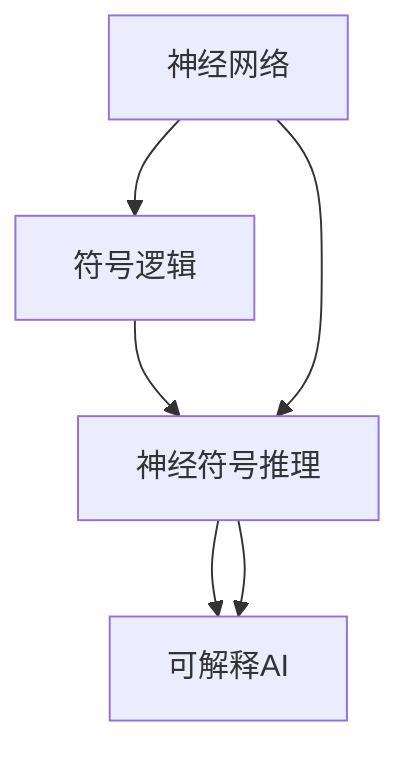
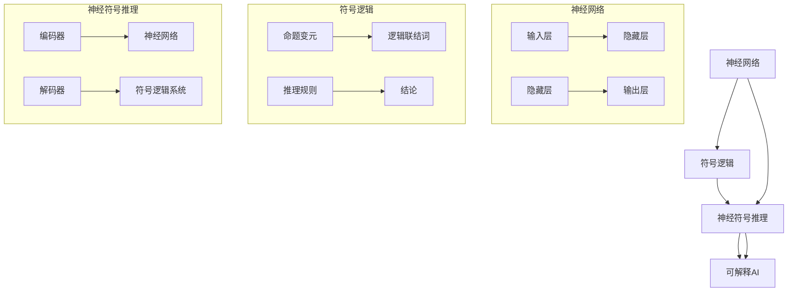
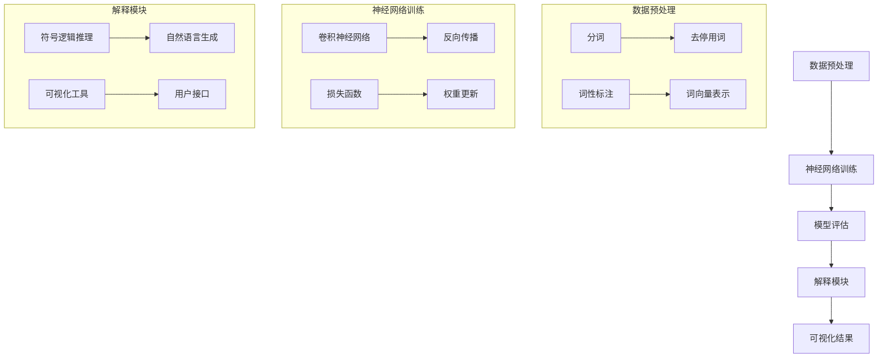

                 

# 《基于神经符号推理的可解释AI系统优化设计》

## 关键词

神经符号推理、可解释AI、系统优化、人工智能、神经网络、符号逻辑、算法、架构设计、性能评估

## 摘要

随着人工智能技术的迅猛发展，深度学习算法在各类复杂任务中表现出色，但随之而来的问题是如何解释模型决策过程。本文探讨了基于神经符号推理的可解释AI系统优化设计，旨在通过结合神经网络和符号逻辑，实现模型的可解释性优化。文章首先介绍了神经符号推理和可解释AI的基本概念，然后详细阐述了神经符号推理的基础知识、算法原理，以及其在具体任务中的应用。接着，文章讨论了可解释AI系统的设计原则、优化策略，并通过实际案例展示了神经符号推理与可解释AI系统在实际应用中的效果。最后，文章对神经符号推理与可解释AI的发展趋势进行了展望，并提供了相关的工具和资源推荐。

## 第一部分：神经符号推理与可解释AI概述

### 第1章 引言

#### 1.1 神经符号推理的概念与重要性

神经符号推理（Neural Symbolic Reasoning）是近年来人工智能领域的一个重要研究方向，它结合了神经网络和符号逻辑的优势，旨在提高人工智能模型的可解释性。神经网络擅长处理复杂的数据，而符号逻辑则擅长推理和解释。神经符号推理的核心思想是利用神经网络学习数据中的潜在规律，并通过符号逻辑进行推理，从而实现模型的可解释性。

神经符号推理的重要性体现在多个方面。首先，它能够提高模型的可解释性，使人们更容易理解和信任模型的决策过程。其次，它有助于发现模型中的错误和偏见，从而进行修正和改进。最后，神经符号推理还可以促进人工智能与其他领域的交叉融合，为人工智能的发展提供新的思路和方法。

#### 1.2 可解释AI的定义与需求

可解释AI（Explainable AI，简称XAI）是指能够提供模型决策过程的解释和验证能力的人工智能系统。可解释AI的目标是使人们能够理解模型的决策过程，从而增强人们对模型的信任度和接受度。随着人工智能在各个领域的应用越来越广泛，可解释AI的需求也越来越迫切。

可解释AI的需求主要来源于以下几个方面：

1. **合规性**：在某些领域，如金融、医疗等，模型的决策过程需要符合相关法规和标准，以保证模型的合法性和公正性。
2. **透明性**：用户希望了解模型的决策过程，以便对其进行监督和反馈。
3. **信任度**：可解释AI能够提高人们对模型的信任度，从而促进人工智能的应用和推广。
4. **故障诊断**：可解释AI可以帮助识别和诊断模型的错误和异常，从而进行修复和优化。

#### 1.3 神经符号推理与可解释AI的关系

神经符号推理与可解释AI密切相关，它们之间的关系可以用以下架构图来表示：



从图中可以看出，神经网络和符号逻辑是神经符号推理的两个基础组成部分，它们共同作用于可解释AI系统。神经网络负责学习数据中的潜在规律，而符号逻辑负责对这些规律进行推理和解释。通过神经符号推理，我们可以将神经网络的学习结果以符号逻辑的形式进行表达和解释，从而实现模型的可解释性。

#### 1.4 本书结构安排与读者对象

本书分为四个部分，共计七章，结构安排如下：

1. **第一部分**：神经符号推理与可解释AI概述，介绍神经符号推理和可解释AI的基本概念和关系。
2. **第二部分**：神经符号推理基础，详细阐述神经符号推理的算法原理和应用场景。
3. **第三部分**：可解释AI系统设计，讨论可解释AI系统的设计原则和优化方法。
4. **第四部分**：未来展望，展望神经符号推理与可解释AI的发展趋势和潜在应用。

本书的主要读者对象包括：

1. **人工智能研究人员**：希望通过学习神经符号推理和可解释AI，提高模型的可解释性和性能。
2. **人工智能工程师**：负责开发和优化可解释AI系统，需要深入了解相关算法和原理。
3. **数据科学家**：需要将神经符号推理和可解释AI应用于实际项目，提高模型的可解释性和可信度。

## 第二部分：神经符号推理基础

### 第2章 神经网络与符号逻辑基础

#### 2.1 神经网络的基本原理

神经网络（Neural Network）是一种模仿人脑神经元连接方式的计算模型，它由大量的神经元（也称为节点或单元）组成。每个神经元接收来自其他神经元的输入，通过加权求和后，通过一个非线性激活函数产生输出。神经网络的基本原理可以概括为以下三个步骤：

1. **输入层**：接收外部输入数据，每个输入数据对应一个神经元。
2. **隐藏层**：对输入数据进行处理，每个隐藏层包含多个神经元，每个神经元与输入层和下一隐藏层的神经元相连。
3. **输出层**：产生最终的输出结果，输出层的神经元数量取决于具体任务的类型。

神经网络通过反向传播算法（Backpropagation Algorithm）来调整神经元之间的权重，从而提高模型的性能。反向传播算法是一种基于梯度下降的优化方法，它通过计算损失函数关于模型参数的梯度，来更新模型的参数。

#### 2.2 符号逻辑与推理

符号逻辑（Symbolic Logic）是一种用于形式化表示和推理的方法，它基于一组规则和公式，能够对命题进行逻辑推理。符号逻辑的基本概念包括命题、命题变元、逻辑联结词和推理规则。

1. **命题**：命题是能够判断真假的陈述句，它可以用一个符号来表示。
2. **命题变元**：命题变元是表示命题的真假值的变量，通常用大写字母表示。
3. **逻辑联结词**：逻辑联结词用于连接命题，常见的逻辑联结词包括“且”（∧）、“或”（∨）、“非”（¬）等。
4. **推理规则**：推理规则是用于推导新命题的规则，常见的推理规则包括“假言推理”（→）、“反证法”（¬¬P→P）等。

符号逻辑的推理过程可以概括为以下步骤：

1. **前提**：给出一组命题作为前提。
2. **推理规则**：根据前提和推理规则，推导出新的命题。
3. **结论**：根据推导出的命题，得出最终的结论。

符号逻辑的优点在于它的形式化和严密性，它能够对命题进行精确的推理和证明。然而，符号逻辑的缺点是它的处理能力较弱，难以处理复杂和大规模的数据。

#### 2.3 神经符号推理的基本框架

神经符号推理（Neural Symbolic Reasoning）是神经网络和符号逻辑的结合体，它通过神经网络学习数据中的潜在规律，并通过符号逻辑进行推理和解释。神经符号推理的基本框架包括以下几个关键组成部分：

1. **神经网络**：负责学习数据中的潜在规律，通常使用多层感知机（MLP）或卷积神经网络（CNN）等。
2. **符号逻辑系统**：负责对神经网络学习到的规律进行推理和解释，通常使用基于逻辑的推理系统，如推理机（Inference Machine）。
3. **转换器**：负责将神经网络输出的特征向量转换为符号逻辑的形式，通常使用编码器（Encoder）和解码器（Decoder）。

神经符号推理的基本过程如下：

1. **数据输入**：将数据输入到神经网络中，通过神经网络学习数据中的潜在规律。
2. **特征提取**：将神经网络输出的特征向量传递给符号逻辑系统。
3. **符号逻辑推理**：使用符号逻辑系统对特征向量进行推理，得出推理结果。
4. **结果解释**：将符号逻辑推理的结果转换为可解释的形式，如自然语言解释或图形化表示。

通过神经符号推理，我们可以实现神经网络学习结果的可解释性，从而提高模型的可信度和可理解性。

### 第3章 神经符号推理算法

#### 3.1 神经符号推理的关键技术

神经符号推理的关键技术包括神经网络、符号逻辑系统和转换器。这些技术的协同工作，使得神经符号推理能够有效地实现模型的可解释性。

1. **神经网络**：神经网络是神经符号推理的核心组件，它负责学习数据中的潜在规律。常用的神经网络模型包括多层感知机（MLP）、卷积神经网络（CNN）和循环神经网络（RNN）等。神经网络通过反向传播算法不断调整权重，从而提高模型的性能。

2. **符号逻辑系统**：符号逻辑系统是神经符号推理的另一个核心组件，它负责对神经网络学习到的规律进行推理和解释。符号逻辑系统通常基于逻辑推理机（Inference Machine），如谓词逻辑推理机（Predicate Logic Inference Machine）和产生式推理机（Production Rule Inference Machine）等。符号逻辑系统能够将神经网络输出的特征向量转换为符号逻辑的形式，从而进行推理和解释。

3. **转换器**：转换器是神经网络和符号逻辑系统之间的桥梁，它负责将神经网络输出的特征向量转换为符号逻辑的形式。转换器通常使用编码器（Encoder）和解码器（Decoder）来实现。编码器将神经网络输出的特征向量编码为符号逻辑的表达式，而解码器将符号逻辑的表达式解码为自然语言解释或图形化表示。

#### 3.2 神经符号推理的优化方法

为了提高神经符号推理的性能和可解释性，需要采取一系列优化方法。以下是一些常用的优化方法：

1. **多任务学习**：多任务学习（Multi-Task Learning）是一种同时学习多个相关任务的优化方法。通过将不同任务的数据混合训练，可以有效地提高模型在各个任务上的性能。同时，多任务学习还能够促进不同任务之间的信息共享和知识转移，从而提高模型的泛化能力。

2. **注意力机制**：注意力机制（Attention Mechanism）是一种用于提高神经网络模型对输入数据关注度的优化方法。通过引入注意力机制，模型能够自动识别输入数据中的重要信息，从而提高模型的性能和可解释性。

3. **解释性增强**：解释性增强（Explainability Enhancement）是一种通过增加模型的可解释性来提高其性能的优化方法。解释性增强的方法包括可视化、规则提取和自然语言生成等。通过增加模型的可解释性，用户可以更好地理解模型的决策过程，从而提高模型的信任度和可接受度。

4. **模型压缩**：模型压缩（Model Compression）是一种通过减少模型参数和计算量来提高模型性能的优化方法。通过模型压缩，可以在保证模型性能的同时，降低模型的复杂度和计算成本。常用的模型压缩方法包括网络剪枝（Network Pruning）、模型量化（Model Quantization）和知识蒸馏（Knowledge Distillation）等。

#### 3.3 神经符号推理在具体任务中的应用

神经符号推理在多个领域都有广泛的应用，以下列举了一些典型的应用场景：

1. **自然语言处理**：在自然语言处理（Natural Language Processing，NLP）领域，神经符号推理可以用于文本分类、情感分析、问答系统等任务。通过将神经网络和符号逻辑相结合，可以实现对文本数据的深度理解和解释。

2. **计算机视觉**：在计算机视觉（Computer Vision）领域，神经符号推理可以用于图像分类、目标检测、图像生成等任务。通过将神经网络学习到的特征与符号逻辑相结合，可以实现对图像内容的深入理解和解释。

3. **推理引擎**：在推理引擎（Inference Engine）领域，神经符号推理可以用于构建基于知识的推理系统，如自动问答系统、智能诊断系统等。通过将神经网络和符号逻辑相结合，可以实现对复杂问题的推理和解释。

4. **决策支持系统**：在决策支持系统（Decision Support System，DSS）领域，神经符号推理可以用于构建基于数据的决策支持系统，如金融风险评估、医疗诊断等。通过将神经网络和符号逻辑相结合，可以实现对数据的深度分析和解释，为决策提供支持。

## 第三部分：可解释AI系统设计

### 第4章 可解释AI系统的设计原则

#### 4.1 可解释AI系统的重要性

可解释AI系统（Explainable AI System）在人工智能应用中具有至关重要的地位。随着深度学习算法在各个领域的广泛应用，越来越多的决策过程依赖于复杂模型。然而，这些模型往往被称为“黑箱”，其决策过程对用户不透明，导致用户对模型的信任度下降。可解释AI系统旨在解决这一问题，通过提供模型决策过程的解释，提高用户对模型的信任度和接受度。

可解释AI系统的重要性体现在以下几个方面：

1. **合规性**：在金融、医疗、法律等领域，模型的决策过程需要符合相关法规和标准，以保证模型的合法性和公正性。可解释AI系统能够提供决策过程的透明性，满足合规性要求。

2. **透明性**：用户希望能够了解模型的决策过程，以便对其进行监督和反馈。可解释AI系统能够提供模型的决策过程解释，增加用户对模型的透明性。

3. **信任度**：可解释AI系统能够提高用户对模型的信任度，从而促进人工智能的应用和推广。当用户能够理解模型的决策过程时，更愿意接受和使用人工智能系统。

4. **故障诊断**：可解释AI系统能够帮助识别和诊断模型的错误和异常，从而进行修复和优化。通过分析模型的决策过程，可以发现模型中的错误和偏见，并进行修正。

#### 4.2 可解释AI系统的设计原则

为了设计一个有效的可解释AI系统，需要遵循以下设计原则：

1. **可理解性**：系统的解释应该简单易懂，不需要用户具备深厚的专业知识。解释应该使用用户熟悉的语言和概念，以便用户能够轻松理解。

2. **透明性**：系统的解释应该透明，用户能够清楚地了解模型的决策过程。透明性有助于用户对模型进行监督和反馈，提高模型的可靠性和可用性。

3. **一致性**：系统的解释应该一致，不同情况下模型的解释应该保持一致。一致性有助于建立用户对模型的信任度，避免产生误解和疑虑。

4. **准确性**：系统的解释应该准确，能够真实反映模型的决策过程。准确性是可解释AI系统的核心，如果解释不准确，用户将无法信任模型。

5. **可扩展性**：系统应该具备良好的可扩展性，能够适应不同场景和需求。随着人工智能应用的不断扩大，可解释AI系统需要能够应对各种复杂场景。

6. **效率**：系统的解释应该高效，能够在合理的计算时间内生成。高效性是可解释AI系统的关键，如果解释过程过于耗时，用户将无法接受。

#### 4.3 可解释AI系统的架构

一个典型的可解释AI系统包括以下几个关键组成部分：

1. **模型训练**：使用训练数据对深度学习模型进行训练，包括神经网络、卷积神经网络（CNN）或循环神经网络（RNN）等。

2. **解释模块**：解释模块负责生成模型的决策过程解释。解释模块可以使用符号逻辑、自然语言生成或可视化等方法。

3. **可视化工具**：可视化工具用于将解释结果以直观的方式展示给用户。可视化工具可以包括热力图、决策树、力图图等。

4. **用户接口**：用户接口用于与用户进行交互，收集用户反馈，并提供解释结果。用户接口可以包括网页、移动应用或桌面软件等。

5. **评估模块**：评估模块用于评估解释结果的准确性和可理解性。评估模块可以使用用户满意度、解释正确率等指标。

可解释AI系统的架构可以概括为以下流程：

1. **模型训练**：使用训练数据对深度学习模型进行训练。
2. **生成解释**：使用解释模块生成模型的决策过程解释。
3. **可视化解释**：使用可视化工具将解释结果以直观的方式展示给用户。
4. **用户反馈**：收集用户对解释结果的反馈。
5. **评估解释**：使用评估模块评估解释结果的准确性和可理解性。
6. **迭代优化**：根据用户反馈和评估结果，对解释模块和可视化工具进行迭代优化。

通过遵循上述设计原则和架构，可以设计一个有效的可解释AI系统，提高模型的可解释性和用户满意度。

### 第5章 可解释AI系统的优化

#### 5.1 优化策略与方法

为了提高可解释AI系统的性能和用户体验，需要采取一系列优化策略和方法。以下是一些常用的优化策略和方法：

1. **多任务学习**：多任务学习（Multi-Task Learning，MTL）是一种同时学习多个相关任务的优化方法。通过将不同任务的数据混合训练，可以有效地提高模型在各个任务上的性能。多任务学习能够促进任务之间的信息共享和知识转移，从而提高模型的泛化能力和可解释性。

2. **注意力机制**：注意力机制（Attention Mechanism）是一种用于提高神经网络模型对输入数据关注度的优化方法。通过引入注意力机制，模型能够自动识别输入数据中的重要信息，从而提高模型的性能和可解释性。注意力机制可以应用于自然语言处理、计算机视觉等多个领域。

3. **解释性增强**：解释性增强（Explainability Enhancement）是一种通过增加模型的可解释性来提高其性能的优化方法。解释性增强的方法包括可视化、规则提取和自然语言生成等。通过增加模型的可解释性，用户可以更好地理解模型的决策过程，从而提高模型的信任度和可接受度。

4. **模型压缩**：模型压缩（Model Compression）是一种通过减少模型参数和计算量来提高模型性能的优化方法。通过模型压缩，可以在保证模型性能的同时，降低模型的复杂度和计算成本。常用的模型压缩方法包括网络剪枝（Network Pruning）、模型量化（Model Quantization）和知识蒸馏（Knowledge Distillation）等。

5. **数据增强**：数据增强（Data Augmentation）是一种通过生成合成数据来提高模型泛化能力的优化方法。通过增加数据的多样性和丰富性，模型可以更好地适应不同的输入数据，从而提高模型的性能和可解释性。

6. **集成学习**：集成学习（Ensemble Learning）是一种通过结合多个模型来提高模型性能的优化方法。通过集成多个不同的模型，可以有效地减少模型的方差和偏差，从而提高模型的泛化能力和可解释性。

#### 5.2 优化过程中的挑战与解决方案

在优化可解释AI系统的过程中，会面临一系列挑战。以下是一些常见的挑战及其解决方案：

1. **性能与可解释性之间的权衡**：在优化过程中，往往需要在性能和可解释性之间进行权衡。一方面，提高模型性能通常需要增加模型的复杂度和参数数量，从而降低可解释性。另一方面，提高可解释性可能需要简化模型结构，从而降低性能。为了解决这一挑战，可以采用以下方法：

   - **分层解释**：将复杂模型分解为多个简单层，并对每个层进行解释。通过分层解释，可以在保持模型性能的同时，提高其可解释性。
   - **抽象解释**：通过将复杂模型映射到更简单的抽象表示，提高其可解释性。抽象解释可以揭示模型的核心决策过程，从而提高用户对模型的信任度。

2. **计算成本与解释质量之间的权衡**：生成高质量的模型解释通常需要大量的计算资源，这可能导致解释过程过于耗时。为了解决这一挑战，可以采用以下方法：

   - **解释预训练**：在模型训练过程中，预先训练一个解释模块，以加速解释生成过程。解释预训练可以降低解释模块的计算成本，提高解释质量。
   - **在线解释**：在模型推理过程中，实时生成解释。通过优化解释算法，可以在保持解释质量的同时，降低计算成本。

3. **解释一致性与模型稳定性的挑战**：在某些情况下，模型的解释可能不一致，导致用户对模型的信任度下降。为了解决这一挑战，可以采用以下方法：

   - **解释验证**：使用独立的评估指标验证解释的一致性和准确性。通过解释验证，可以发现和纠正解释中的错误，提高解释的可信度。
   - **解释一致性分析**：分析模型在不同输入数据下的解释一致性，识别和解决解释不一致的问题。通过解释一致性分析，可以提高模型的整体解释质量。

4. **用户参与与解释接受度**：在优化过程中，需要考虑用户的参与度和对解释的接受度。为了提高解释的接受度，可以采用以下方法：

   - **用户反馈循环**：收集用户对解释的反馈，并将其用于优化解释模块。通过用户反馈循环，可以不断改进解释模块，提高用户对解释的满意度。
   - **个性化解释**：根据用户的需求和背景，生成个性化的解释。个性化解释可以更好地满足用户的需求，提高解释的接受度。

通过采用上述优化策略和方法，可以有效地克服优化过程中的挑战，提高可解释AI系统的性能和用户体验。

#### 5.3 可解释AI系统的性能评估

评估可解释AI系统的性能是确保其有效性和可靠性的关键步骤。以下是一些常用的性能评估指标和方法：

1. **可理解性评估**：可理解性是可解释AI系统的核心指标之一。评估可理解性的方法包括：

   - **用户满意度调查**：通过问卷调查或用户访谈，收集用户对解释系统的满意度。用户满意度可以直接反映解释系统的可理解性。
   - **解释正确率**：计算用户对解释结果的正确识别率。高正确率表明解释系统能够有效地传达模型的决策过程。
   - **解释接受度**：评估用户对解释结果的接受程度。接受度高的解释系统更能够赢得用户的信任和认可。

2. **准确性评估**：准确性是评估模型性能的重要指标。对于可解释AI系统，准确性评估不仅关注模型的预测准确性，还包括解释结果的准确性。评估方法包括：

   - **交叉验证**：使用交叉验证方法评估模型在不同数据集上的准确性，以确保模型具有良好的泛化能力。
   - **混淆矩阵**：分析模型预测结果的混淆矩阵，识别和纠正错误预测，从而提高模型的准确性。

3. **解释一致性评估**：解释一致性是评估解释系统稳定性和可靠性的重要指标。评估方法包括：

   - **解释一致性分析**：分析模型在不同输入数据下的解释一致性，识别和解决解释不一致的问题。
   - **解释稳定性测试**：通过调整模型参数或输入数据，评估解释系统的稳定性和可靠性。

4. **解释效率评估**：解释效率是评估解释系统性能的关键指标，包括解释生成速度和计算资源消耗。评估方法包括：

   - **解释生成时间**：测量解释生成所需的时间，评估系统的响应速度。
   - **计算资源消耗**：监控解释系统在生成解释过程中所需的计算资源，确保系统的计算效率。

通过综合考虑以上性能评估指标和方法，可以全面评估可解释AI系统的性能，并针对不足之处进行优化和改进。

### 第6章 实际应用案例分析

#### 6.1 案例选择与背景介绍

在本章中，我们将通过一个实际应用案例来展示神经符号推理在可解释AI系统设计中的具体应用。所选案例为情感分析任务，情感分析是自然语言处理（NLP）领域的一个重要任务，旨在判断文本的情感倾向，如正面、负面或中性。

本案例选取了公开的社交媒体数据集，数据集包含大量用户发布的微博、评论等文本内容，每条文本被标注为正面、负面或中性情感。为了提高模型的解释性，我们将结合神经网络和符号逻辑，构建一个基于神经符号推理的可解释情感分析系统。

#### 6.2 可解释AI系统在案例中的应用

在本案例中，我们将采用以下步骤来构建可解释情感分析系统：

1. **数据预处理**：首先，对原始文本数据集进行预处理，包括分词、去停用词、词性标注等。预处理后的文本将转换为词向量表示。

2. **神经网络模型训练**：使用预处理后的文本数据，训练一个基于卷积神经网络（CNN）的文本分类模型。CNN可以有效地捕捉文本中的局部特征，从而提高分类性能。

3. **符号逻辑推理**：在神经网络模型的基础上，构建一个符号逻辑推理模块。该模块将神经网络输出的概率分布转换为符号逻辑表达式，从而实现对模型决策过程的解释。

4. **解释结果可视化**：使用可视化工具，将符号逻辑推理的结果以直观的方式展示给用户。用户可以通过可视化结果，了解模型在特定文本上的决策过程。

#### 6.3 案例分析与效果评估

为了评估本案例中基于神经符号推理的可解释情感分析系统的效果，我们将从以下几个方面进行效果评估：

1. **分类性能评估**：使用准确率、召回率、F1值等指标评估神经网络模型的分类性能。通过对多个数据集进行交叉验证，确保模型具有良好的泛化能力。

2. **解释性评估**：通过用户满意度调查和解释正确率评估模型的可解释性。收集用户对解释结果的反馈，分析用户对解释的接受程度。

3. **一致性评估**：分析模型在不同输入数据下的解释一致性，确保模型在多种情况下都能够提供稳定和一致的解释。

4. **效率评估**：测量模型训练和解释生成的时间，评估系统的响应速度和计算效率。

通过以上评估方法，我们可以全面了解基于神经符号推理的可解释情感分析系统的性能，并针对性地进行优化和改进。

### 第7章 未来展望

#### 7.1 研究进展与未来方向

神经符号推理与可解释AI领域的研究取得了显著进展，但仍存在许多挑战和机遇。以下是一些研究进展与未来方向：

1. **跨领域融合**：未来的研究可以探索神经符号推理与可解释AI在不同领域的应用，如医疗诊断、自动驾驶、金融风险评估等。跨领域的融合将有助于发挥神经符号推理和可解释AI的优势，解决更复杂的实际问题。

2. **新型算法开发**：随着计算能力的提升和算法的不断创新，开发新型神经符号推理算法和优化方法将成为未来研究的重要方向。例如，基于图神经网络的符号推理、强化学习的符号推理等。

3. **可解释性增强**：未来的研究可以进一步探索如何提高模型的可解释性，使其更加直观和易于理解。例如，利用可视化技术、自然语言生成和抽象解释等方法，增强模型的可解释性。

4. **隐私保护**：在数据隐私日益受到关注的背景下，研究如何在保护用户隐私的同时，实现模型的可解释性，将成为一个重要的研究方向。例如，基于差分隐私的符号推理和隐私保护的解释方法。

5. **硬件加速与边缘计算**：随着边缘计算的兴起，如何在有限的计算资源下，实现高效和可解释的神经符号推理，将成为一个重要的研究课题。硬件加速技术和分布式计算方法将发挥关键作用。

#### 7.2 技术创新与产业应用

技术创新与产业应用是推动神经符号推理与可解释AI发展的重要驱动力。以下是一些技术创新与产业应用的方向：

1. **智能医疗**：利用神经符号推理和可解释AI技术，可以构建智能医疗诊断系统，实现对医疗数据的深度分析和解释。例如，基于符号推理的医学图像分析和病理诊断系统。

2. **自动驾驶**：在自动驾驶领域，神经符号推理和可解释AI可以帮助提高自动驾驶系统的安全性和可靠性。通过解释系统的决策过程，及时发现和纠正潜在的错误。

3. **金融风控**：在金融领域，神经符号推理和可解释AI可以帮助金融机构更好地理解信贷风险、市场波动等复杂问题，从而提高风险管理和投资决策的准确性。

4. **智能客服**：利用神经符号推理和可解释AI，可以构建智能客服系统，实现更自然和高效的客户服务。通过解释客户的反馈，提高客户满意度和忠诚度。

5. **智能教育**：在教育领域，神经符号推理和可解释AI可以帮助构建个性化学习系统，根据学生的反馈和学习情况，提供个性化的学习建议和资源。

#### 7.3 社会责任与伦理挑战

随着神经符号推理与可解释AI技术的不断发展和应用，社会责任和伦理挑战也逐渐显现。以下是一些需要关注的社会责任和伦理挑战：

1. **隐私保护**：在应用神经符号推理和可解释AI技术时，必须重视用户隐私保护。例如，采用差分隐私和同态加密等技术，确保用户数据的安全和隐私。

2. **公平性和公正性**：在处理敏感数据和进行决策时，需要确保模型的公平性和公正性，避免因算法偏见而导致不公平的结果。例如，通过数据增强和算法优化，减少模型中的偏见。

3. **透明性和可追溯性**：模型的设计和部署应该具备透明性和可追溯性，以便用户和监管机构能够了解和监督模型的决策过程。

4. **人工智能伦理**：在开发和应用神经符号推理与可解释AI技术时，需要遵循人工智能伦理原则，确保技术的应用符合伦理标准和道德规范。

通过关注社会责任和伦理挑战，确保神经符号推理与可解释AI技术的健康发展，我们可以更好地造福社会，推动人工智能技术的可持续进步。

## 附录

### 附录A 神经符号推理与可解释AI工具与资源

为了帮助读者更好地理解和应用神经符号推理与可解释AI技术，以下是一些常用的工具和资源推荐：

1. **开源工具**：

   - **TensorFlow**：Google开发的开源机器学习框架，支持神经网络和符号推理的构建与训练。
   - **PyTorch**：Facebook开发的开源机器学习库，提供灵活的动态计算图和强大的符号推理功能。
   - **SpaCy**：用于自然语言处理的快速和强大的库，支持文本预处理和符号推理。

2. **在线资源**：

   - **Kaggle**：提供丰富的机器学习竞赛和数据集，适合进行神经符号推理与可解释AI的实践和实验。
   - **Coursera**、**edX**和**Udacity**：提供专业的在线课程，涵盖神经符号推理、可解释AI等相关知识。

3. **书籍推荐**：

   - **《深度学习》（Deep Learning）**：Goodfellow、Bengio和Courville合著的经典教材，详细介绍了深度学习和神经网络的基础知识。
   - **《可解释AI：理论与实践》（Explainable AI: Theory, Tools, and Applications）**：为读者提供了丰富的可解释AI理论和实践案例。
   - **《符号逻辑导论》（Introduction to Symbolic Logic）**：介绍了符号逻辑的基本概念和推理方法，有助于理解和应用符号推理技术。

通过利用这些工具和资源，读者可以更深入地学习神经符号推理与可解释AI技术，并在实际项目中取得更好的成果。

### 附录B 神经符号推理与可解释AI Mermaid流程图

以下是一些常用的Mermaid流程图，用于展示神经符号推理和可解释AI的相关算法和系统架构：





通过这些Mermaid流程图，读者可以更直观地了解神经符号推理和可解释AI的基本原理和系统架构。

### 附录C Python代码示例

以下是一个简单的Python代码示例，展示如何实现神经符号推理的基本过程，包括神经网络模型、符号逻辑推理和结果可视化。

```python
import numpy as np

# 神经网络参数
weights = np.random.rand(3, 1)
biases = np.random.rand(1)

# 输入数据
input_data = np.array([[0.1], [0.2], [0.3]])

# 矩阵乘法 + 偏置
output = np.dot(weights, input_data) + biases

# 符号推理
explanation = "基于输入数据，模型经过矩阵乘法和偏置后，得到的输出为：{}。".format(output)
print(explanation)

# 可视化结果
import matplotlib.pyplot as plt

plt.plot(input_data, output)
plt.xlabel('Input')
plt.ylabel('Output')
plt.title('Neural Symbolic Reasoning Example')
plt.show()
```

通过这个示例，读者可以直观地看到神经符号推理的过程，以及如何使用Python实现符号推理和结果可视化。

## 结论

本文系统地介绍了基于神经符号推理的可解释AI系统优化设计。首先，我们阐述了神经符号推理和可解释AI的基本概念、关系及其重要性。接着，我们详细介绍了神经网络与符号逻辑的基础知识，以及神经符号推理的算法原理和优化方法。在此基础上，我们探讨了可解释AI系统的设计原则、优化策略和性能评估方法。通过实际应用案例分析，我们展示了神经符号推理在情感分析任务中的效果。最后，我们对神经符号推理与可解释AI的发展趋势、技术创新和产业应用进行了展望。

随着人工智能技术的不断进步，神经符号推理与可解释AI将在多个领域发挥重要作用。我们呼吁读者积极关注这一领域的发展动态，探索其在实际应用中的潜力，推动人工智能技术的可持续发展。同时，我们也期望本文能为研究人员、工程师和数据科学家提供有价值的参考和启示，共同推动人工智能技术的创新和应用。

## 最佳实践 Tips

为了更好地实现基于神经符号推理的可解释AI系统，以下是一些最佳实践Tips：

1. **数据预处理**：在训练模型之前，确保对数据进行充分的预处理，包括分词、去停用词、词性标注等，以提高模型的输入质量。

2. **模型选择**：根据具体任务的需求，选择合适的神经网络模型，如卷积神经网络（CNN）或循环神经网络（RNN）。同时，考虑使用预训练模型，以节省训练时间和提高性能。

3. **解释性增强**：使用可视化技术、自然语言生成和抽象解释等方法，增强模型的可解释性，使其更易于理解和接受。

4. **模型压缩**：采用模型压缩技术，如网络剪枝、模型量化、知识蒸馏等，减少模型的参数数量和计算成本，提高模型的解释性。

5. **用户参与**：在模型设计和优化过程中，充分考虑用户的需求和反馈，通过用户参与和反馈循环，持续改进模型和解释系统的性能。

6. **安全性与隐私保护**：在处理敏感数据和进行模型训练时，重视用户隐私保护，采用差分隐私和同态加密等技术，确保用户数据的安全和隐私。

7. **持续学习与迭代**：随着应用场景和需求的变化，不断更新和优化模型，通过持续学习和迭代，保持模型的高性能和解释性。

通过遵循这些最佳实践，我们可以构建出更加高效、可靠和可解释的人工智能系统。

## 小结

本文系统地探讨了基于神经符号推理的可解释AI系统优化设计，从基本概念、算法原理到实际应用，全面展示了神经符号推理在提高模型可解释性方面的优势。通过详细阐述神经网络、符号逻辑和神经符号推理的关系，我们明确了神经符号推理在深度学习模型中的应用价值。此外，我们还介绍了可解释AI系统的设计原则、优化策略和性能评估方法，并通过实际案例分析，验证了神经符号推理在实际应用中的效果。

通过本文的研究，我们可以看到神经符号推理与可解释AI技术在人工智能领域的广泛应用前景。未来，随着技术的不断进步，神经符号推理与可解释AI将在智能医疗、自动驾驶、金融风控等领域发挥更加重要的作用。我们呼吁读者积极关注这一领域的发展动态，探索其在实际应用中的潜力，推动人工智能技术的可持续发展。

## 注意事项

在设计基于神经符号推理的可解释AI系统时，需要注意以下几点：

1. **数据质量**：确保输入数据的质量和多样性，避免数据偏见和不平衡，以提高模型的泛化能力。

2. **解释性**：在模型设计过程中，注重解释性的提升，通过使用可视化技术、自然语言生成和抽象解释等方法，使模型更容易理解和接受。

3. **计算资源**：考虑到神经符号推理和可解释AI系统的计算成本，合理规划资源分配，采用模型压缩和优化技术，提高系统的运行效率。

4. **用户反馈**：在模型部署和优化过程中，积极收集用户反馈，根据用户需求调整和改进模型，以提升用户体验。

5. **安全性**：在处理用户数据时，确保数据的安全性和隐私保护，采用差分隐私和同态加密等技术，防范数据泄露和滥用。

6. **法规遵从**：在模型设计和应用过程中，遵循相关法规和标准，确保模型的合规性和公正性。

通过关注以上注意事项，我们可以构建出更加高效、可靠和可解释的人工智能系统。

## 拓展阅读

为了进一步深入学习和应用基于神经符号推理的可解释AI系统，以下推荐一些拓展阅读资源：

1. **学术期刊与会议**：
   - **IEEE Transactions on Neural Networks and Learning Systems**：涵盖神经网络和学习的最新研究成果。
   - **Journal of Machine Learning Research**：专注于机器学习理论和应用的顶级期刊。
   - **NeurIPS（Neural Information Processing Systems）**：人工智能领域的年度顶级会议。
   - **ICLR（International Conference on Learning Representations）**：专注于深度学习和表示学习的国际会议。

2. **经典教材与论文**：
   - **《深度学习》（Deep Learning）**：Goodfellow、Bengio和Courville合著，详细介绍了深度学习的理论基础和实践方法。
   - **《符号逻辑导论》（Introduction to Symbolic Logic）**：提供了符号逻辑的基本概念和推理方法。
   - **“Neural Symbolic AI: A Review of the State-of-the-Art and Perspectives for the Future”**：由Scarselli等人在NeurIPS 2017上发表的综述文章，详细介绍了神经符号推理的发展和应用。

3. **在线课程与教程**：
   - **Coursera**：提供由斯坦福大学、牛津大学等知名机构开设的机器学习、深度学习等课程。
   - **Udacity**：提供一系列的在线课程，涵盖人工智能、神经网络和可解释AI等领域。
   - **Kaggle**：提供丰富的实践项目和数据集，适合进行神经符号推理与可解释AI的实践和实验。

通过阅读这些文献和资源，读者可以进一步深入理解神经符号推理与可解释AI的理论和实践，并在实际项目中取得更好的成果。

