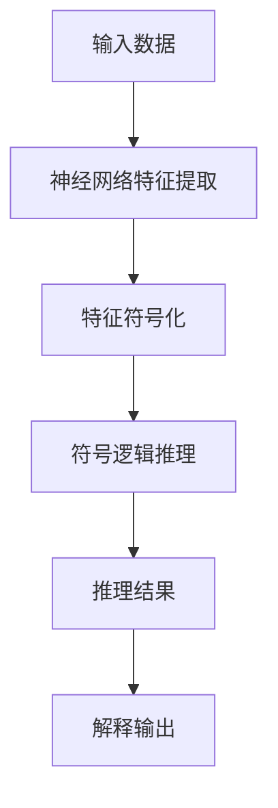
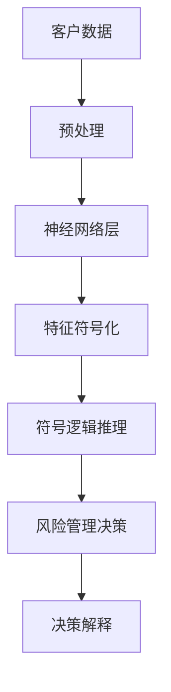

                 

### 《基于神经符号推理的可解释AI系统在金融风控中的实践应用》

**关键词：** 神经符号推理、可解释AI、金融风控、模型构建、实践应用

**摘要：** 随着金融行业的数字化进程不断加快，人工智能在金融风控中的应用日益广泛。本文将探讨基于神经符号推理的可解释AI系统在金融风控中的实践应用，介绍神经符号推理的基本原理、可解释AI的重要性以及在金融风控中的具体应用，通过案例分析展示其实践效果，并展望其未来的发展趋势。

### 目录大纲

## 第一部分：引论

### 第1章 神经符号推理与可解释AI概述

#### 1.1 神经符号推理的概念与特点

- **神经符号推理的定义**
- **神经符号推理的优势**
- **神经符号推理的发展历程**

#### 1.2 可解释AI的定义与重要性

- **可解释AI的定义**
- **可解释AI在金融风控中的重要性**
- **可解释AI的研究方向**

#### 1.3 金融风控中的挑战与机遇

- **金融风控中的常见问题**
- **神经符号推理在金融风控中的应用**
- **金融风控领域的发展前景**

## 第二部分：神经符号推理基础

### 第2章 神经网络与符号逻辑的基本原理

#### 2.1 神经网络的基础

- **神经元与激活函数**
- **多层感知机与反向传播算法**
- **神经网络在金融风控中的应用**

#### 2.2 符号逻辑的基本概念

- **命题逻辑**
- **谓词逻辑**
- **形式推理**

#### 2.3 神经符号推理的基本框架

- **神经符号推理的原理**
- **神经符号推理的应用场景**
- **神经符号推理的优势与挑战**

## 第三部分：可解释AI在金融风控中的应用

### 第3章 可解释AI系统的构建

#### 3.1 可解释AI系统的基本组成

- **可解释性评估方法**
- **可视化工具**
- **可解释性增强技术**

#### 3.2 金融风控中的可解释AI需求分析

- **金融风控的可解释性需求**
- **金融风控中的常见问题与解决方案**
- **可解释AI在金融风控中的案例研究**

### 第4章 基于神经符号推理的金融风控模型

#### 4.1 神经符号推理在金融风控中的应用

- **信用风险评估**
- **反欺诈检测**
- **市场预测**

#### 4.2 神经符号推理模型的构建

- **神经符号推理模型的构建流程**
- **神经符号推理模型的评估方法**
- **神经符号推理模型的应用案例**

### 第5章 神经符号推理在金融风控中的实践应用

#### 5.1 实践应用背景与目标

- **金融风控应用背景**
- **实践应用目标**

#### 5.2 神经符号推理模型设计与实现

- **模型设计与选择**
- **模型实现与优化**
- **模型性能评估**

#### 5.3 案例分析

- **案例背景**
- **案例实现**
- **案例分析与总结**

### 第6章 可解释AI系统在金融风控中的未来发展趋势

#### 6.1 可解释AI在金融风控中的发展趋势

- **技术发展趋势**
- **应用发展趋势**
- **政策与法规的影响**

#### 6.2 未来研究方向与挑战

- **研究方向**
- **挑战与应对策略**

## 第四部分：附录

### 第7章 开发工具与资源

#### 7.1 神经符号推理工具

- **工具介绍**
- **工具使用方法**

#### 7.2 可解释AI资源

- **资源介绍**
- **资源获取方法**

#### 7.3 金融风控数据集

- **数据集介绍**
- **数据集获取方法**

## 附加说明

- **核心概念与联系图**
  - **神经符号推理流程图**
  - **金融风控模型架构图**

- **核心算法原理讲解**

  - **神经网络算法原理**

  - **符号逻辑算法原理**

- **数学模型和数学公式**

  - **神经网络数学公式**

  - **符号逻辑数学公式**

- **项目实战代码案例**

  - **信用风险评估模型实现**

  - **反欺诈检测模型实现**

### 引言

随着金融科技的快速发展，人工智能（AI）已经逐渐成为金融风控领域的重要工具。然而，传统AI模型，尤其是深度学习模型，因其复杂的内部结构，常常被称为“黑盒”模型，这给金融风控带来了一定的挑战。黑盒模型的不可解释性使得风险管理人员难以理解模型是如何做出决策的，这在金融风险控制中尤为重要，因为透明性和可解释性是金融监管和合规的关键要素。

近年来，可解释AI（Explainable AI, XAI）的研究取得了显著进展，旨在提高AI模型的透明度和可解释性，使其能够为人类用户所理解。可解释AI在金融风控中的应用，不仅有助于提高决策的透明度，还能够增强风险管理的有效性，降低合规风险。

神经符号推理（Neural Symbolic Reasoning）是结合神经网络和符号逻辑的一种新型AI方法，它通过融合数值计算和符号推理的优势，提高了AI模型的可解释性。本文将探讨神经符号推理在金融风控中的实践应用，介绍其基本原理、构建方法以及在实际案例中的成功应用，并展望其未来的发展趋势。

本文首先介绍了神经符号推理和可解释AI的基本概念，分析了它们在金融风控中的重要性。接着，我们深入探讨了神经符号推理的基础，包括神经网络和符号逻辑的基本原理。随后，我们讨论了可解释AI系统的构建，以及神经符号推理在金融风控中的具体应用，如信用风险评估、反欺诈检测和市场预测。

文章的第三部分通过具体案例展示了神经符号推理在金融风控中的实践应用，包括模型设计、实现和性能评估。最后，我们对可解释AI系统在金融风控中的未来发展趋势进行了展望，并提出了未来的研究方向与挑战。

通过本文的探讨，我们希望能够为金融行业的风控人员提供有价值的参考，帮助他们在实际工作中更好地理解和应用神经符号推理技术，提升金融风控的效率和效果。接下来，我们将详细探讨神经符号推理和可解释AI的基本概念及其在金融风控中的重要性。让我们一起深入思考。 

### 第一部分：引论

#### 1.1 神经符号推理的概念与特点

**神经符号推理的定义**

神经符号推理（Neural Symbolic Reasoning）是一种结合了神经网络和符号逻辑的方法，旨在提高人工智能（AI）系统的可解释性和推理能力。传统的神经网络擅长处理大量数据和进行模式识别，但往往缺乏逻辑推理能力；而符号逻辑则具有较强的推理能力，但处理大规模数据的能力有限。神经符号推理通过将数值计算和符号推理相结合，实现了两种方法的互补，从而提高了AI系统的整体性能。

神经符号推理的基本原理可以概括为以下几个步骤：

1. **数据输入与特征提取**：首先，神经网络接收原始数据，通过多层感知机提取特征。
2. **符号表示与逻辑推理**：提取到的特征随后被转化为符号表示，通过形式逻辑进行推理。
3. **推理结果输出**：推理过程产生的结果再通过神经网络进行解释和输出。

**神经符号推理的优势**

神经符号推理具有以下几个显著的优势：

1. **提高可解释性**：通过结合符号逻辑，神经符号推理能够提供明确的推理路径和结果解释，使得AI系统的决策过程更加透明和可理解。
2. **增强推理能力**：符号逻辑的引入使得AI系统能够进行更复杂的逻辑推理，从而解决传统神经网络无法处理的问题。
3. **适应性强**：神经符号推理能够适应不同的应用场景，通过调整神经网络和符号逻辑的权重，实现灵活的模型配置。

**神经符号推理的发展历程**

神经符号推理这一概念最早可以追溯到1980年代，当时一些学者提出了将神经网络和逻辑推理相结合的设想。1990年代，随着神经网络和符号逻辑研究的深入，一些初步的神经符号推理模型被提出。进入21世纪，随着深度学习和符号逻辑技术的不断发展，神经符号推理逐渐成为一个重要的研究方向。近年来，随着可解释AI的兴起，神经符号推理得到了更多的关注和应用，其在实际场景中的效果也得到了显著提升。

**神经符号推理的应用场景**

神经符号推理在许多领域都展现出了其独特的优势，以下是一些典型应用场景：

1. **医疗诊断**：神经符号推理可以用于医疗影像分析，通过结合影像数据和医学知识库，实现更准确的疾病诊断。
2. **金融风控**：在金融领域，神经符号推理可用于信用评分、反欺诈检测和市场预测等，通过融合数值数据和逻辑规则，提高模型的准确性和可解释性。
3. **智能客服**：神经符号推理可以用于智能客服系统，通过结合用户对话内容和业务规则，提供更自然的交互体验。

**小结**

神经符号推理作为一种融合神经网络和符号逻辑的方法，具有提高可解释性和推理能力的显著优势。其发展历程和应用场景展示了其在多个领域的潜力。在接下来的章节中，我们将进一步探讨可解释AI的定义与重要性，以及神经符号推理在金融风控中的应用，帮助读者全面了解这一前沿技术。让我们一起深入探讨这些重要概念。

#### 1.2 可解释AI的定义与重要性

**可解释AI的定义**

可解释AI（Explainable AI, XAI）是一种旨在提高人工智能（AI）系统透明度和可理解性的研究分支。传统的AI系统，特别是深度学习模型，由于内部结构和决策过程的复杂性，通常被称为“黑盒”模型。黑盒模型在处理复杂任务时表现出色，但其决策过程缺乏透明性，导致难以解释和验证。可解释AI的目标是开发能够提供明确解释和推理路径的AI系统，使其决策过程对人类用户可理解。

可解释AI的核心概念可以概括为以下几个要素：

1. **透明性**：系统应能够清晰地展示其输入、中间过程和输出。
2. **可理解性**：用户应能够直观地理解系统的决策过程和推理逻辑。
3. **可验证性**：系统的决策应能够通过外部验证，确保其准确性和可靠性。

**可解释AI在金融风控中的重要性**

金融风控领域对AI系统的可解释性需求尤为突出。金融行业涉及大量敏感数据和复杂的决策过程，透明性和可解释性是确保合规性和风险管理的关键要素。以下是从几个方面分析可解释AI在金融风控中的重要性：

1. **合规性要求**：金融监管机构对金融机构的风控系统有着严格的合规要求，这些要求通常包括系统透明度和可解释性。例如，欧洲的《通用数据保护条例》（GDPR）要求数据处理过程必须透明，用户有权了解和质疑数据处理的理由。
2. **风险管理**：金融风控系统的核心任务是识别和防范风险。如果系统缺乏可解释性，风控人员将难以理解模型的决策依据，从而无法有效地评估和管理风险。可解释AI能够提供明确的决策路径和推理逻辑，帮助风控人员更好地理解和管理风险。
3. **客户信任**：在金融领域，客户对金融机构的信任至关重要。透明和可解释的AI系统可以增强客户对金融机构的信任，提高客户满意度。此外，客户有权了解和质疑AI系统的决策，这有助于提高客户参与度和忠诚度。

**可解释AI的研究方向**

可解释AI的研究方向多种多样，主要包括以下几个方面：

1. **模型解释方法**：开发各种技术，如决策树、LIME（局部可解释模型解释）和SHAP（SHapley Additive exPlanations），以提供模型决策的解释。
2. **可视化工具**：开发直观的界面和工具，帮助用户理解模型的输入、中间过程和输出。
3. **可解释性评估**：设计评估指标和方法，以量化模型的可解释性，确保其达到一定的解释水平。
4. **模型集成**：通过集成不同类型的模型，实现互补优势，提高整体系统的可解释性和性能。

**小结**

可解释AI在金融风控中具有至关重要的地位。它不仅满足合规性要求，提高风险管理水平，还能增强客户信任。随着可解释AI技术的不断进步，金融风控系统将变得更加透明和可靠，为金融机构带来更大的价值。在接下来的章节中，我们将深入探讨神经符号推理在金融风控中的应用，展示这一前沿技术的实际效果。让我们一起继续探索。

#### 1.3 金融风控中的挑战与机遇

**金融风控中的常见问题**

金融风控领域面临着一系列复杂的挑战，这些问题严重影响了金融机构的运营和风险管理效果。以下是一些金融风控中的常见问题：

1. **欺诈风险**：金融欺诈行为层出不穷，包括账户盗用、信用卡欺诈和保险欺诈等。这些欺诈行为不仅给金融机构带来直接的经济损失，还会损害客户信任和品牌声誉。
2. **信用风险**：信用风险是指借款人或债务人无法按时偿还债务的风险。信用风险管理是金融风控的核心任务之一，但评估借款人的信用状况是一个复杂的过程，涉及到大量的数据和变量。
3. **市场风险**：市场风险是指由于市场波动导致金融机构资产价值损失的风险。包括利率风险、汇率风险和股票市场风险等，这些风险对金融机构的稳健运营构成重大威胁。
4. **操作风险**：操作风险是指由于内部流程、系统缺陷、人为错误或外部事件等原因导致的损失风险。操作风险不仅包括技术故障，还包括欺诈和内部违规行为。
5. **法律与合规风险**：金融机构需要遵守各种法律法规和监管要求，如反洗钱法规、消费者保护法等。合规风险可能导致巨额罚款、法律诉讼和声誉损失。

**神经符号推理在金融风控中的应用**

神经符号推理作为一种结合神经网络和符号逻辑的方法，在金融风控中展现了巨大的潜力。以下是一些具体应用场景：

1. **信用风险评估**：神经符号推理可以结合借款人的历史数据和逻辑规则，进行综合评估。通过符号逻辑的推理能力，可以更加准确地识别潜在的风险。
2. **反欺诈检测**：神经符号推理能够处理复杂的数据和模式，通过结合数值特征和符号逻辑规则，提高欺诈检测的准确性和效率。
3. **市场预测**：神经符号推理可以通过分析市场数据和历史模式，进行市场趋势预测，帮助金融机构及时调整策略，降低市场风险。

**金融风控领域的发展前景**

随着人工智能技术的不断进步，金融风控领域的发展前景充满机遇：

1. **技术进步**：深度学习和神经符号推理等技术的发展，将进一步提升金融风控系统的准确性和效率。
2. **数据驱动**：大数据和云计算技术的应用，将使金融机构能够收集、处理和分析更多维度的数据，从而提高风险管理的精细化水平。
3. **合规与监管**：随着金融监管的不断加强，金融机构将更加重视合规性和透明性，可解释AI技术的应用将得到更广泛的支持。
4. **客户体验**：通过AI技术的应用，金融机构可以提供更加个性化、智能化的服务，提升客户体验和满意度。

**小结**

金融风控领域面临着复杂的挑战和机遇，神经符号推理作为一种结合神经网络和符号逻辑的方法，为解决这些问题提供了新的思路和工具。随着技术的不断进步，金融风控领域将迎来更加智能化、透明化的未来。在接下来的章节中，我们将深入探讨神经符号推理的基础理论，帮助读者更好地理解这一前沿技术。让我们一起继续深入探讨。

### 第二部分：神经符号推理基础

#### 2.1 神经网络的基础

神经网络（Neural Networks）是模拟人脑神经元工作方式的信息处理系统，通过多层神经元之间的连接和激活函数，实现数据的输入、处理和输出。神经网络在金融风控中有着广泛的应用，通过学习大量数据，能够自动提取特征并进行复杂决策。

**神经元与激活函数**

神经元是神经网络的基本组成单元，类似于人脑中的神经元。每个神经元接收多个输入信号，并通过加权求和后传递给激活函数。激活函数的作用是引入非线性，使得神经网络能够处理复杂的问题。

常用的激活函数包括：

1. **线性激活函数（Identity Function）**：输出等于输入，适用于简单的线性模型。
2. **Sigmoid函数**：将输入映射到（0,1）区间，用于二分类问题。
3. **ReLU函数（Rectified Linear Unit）**：在输入小于0时输出为0，输入大于0时输出等于输入，具有计算效率高和不易陷入局部最优的优点。

**多层感知机与反向传播算法**

多层感知机（Multilayer Perceptron, MLP）是神经网络的一种基本形式，包括输入层、一个或多个隐藏层和输出层。通过反向传播算法（Backpropagation Algorithm），多层感知机能够对输入数据进行训练和优化。

反向传播算法的基本步骤如下：

1. **前向传播**：将输入数据通过神经网络传递，得到输出。
2. **计算误差**：通过比较输出结果和预期结果，计算误差。
3. **反向传播**：将误差反向传播到网络的每一层，更新各层神经元的权重和偏置。
4. **迭代优化**：重复前向传播和反向传播，直至误差达到预设的阈值。

**神经网络在金融风控中的应用**

神经网络在金融风控中有着广泛的应用，包括：

1. **信用评分模型**：通过分析借款人的历史数据和财务信息，预测其信用风险。
2. **市场预测模型**：通过分析历史市场数据，预测市场趋势和波动性。
3. **反欺诈模型**：通过识别交易行为中的异常模式，检测和预防金融欺诈。

**小结**

神经网络是神经符号推理的重要组成部分，通过神经元和激活函数的连接，实现数据的输入、处理和输出。多层感知机和反向传播算法使得神经网络能够自动学习和优化，从而在金融风控中发挥了重要作用。在接下来的章节中，我们将深入探讨符号逻辑的基本概念，帮助读者更好地理解神经符号推理的原理。让我们一起继续深入探讨。

#### 2.2 符号逻辑的基本概念

符号逻辑（Symbolic Logic）是数学和哲学中的重要分支，它通过符号化的方法研究命题、推理和证明。符号逻辑在人工智能（AI）领域，尤其是神经符号推理中，扮演着基础性角色，为AI系统提供了形式化的推理工具。

**命题逻辑**

命题逻辑（Propositional Logic）是最基本的逻辑形式，它研究命题之间的关系和推理。命题逻辑使用符号和公式表示命题，并通过逻辑运算符（如与、或、非等）组合这些命题，形成复杂的逻辑表达式。

1. **基本符号**：
   - \(P, Q, R\)：命题符号。
   - \(¬\)：非（Negation），表示命题的否定。
   - \(\wedge\)：与（Conjunction），表示两个命题同时为真。
   - \(\vee\)：或（Disjunction），表示两个命题中至少有一个为真。
   - \(\rightarrow\)：蕴含（Implication），表示如果前件为真，则后件也为真。
   - \(\neg\rightarrow\)：逆否（Contraposition），表示如果后件为假，则前件也为假。

2. **逻辑运算规则**：
   - 交换律（Commutative Law）：\(P \wedge Q = Q \wedge P\)，\(P \vee Q = Q \vee P\)。
   - 结合律（Associative Law）：\(P \wedge (Q \wedge R) = (P \wedge Q) \wedge R\)，\(P \vee (Q \vee R) = (P \vee Q) \vee R\)。
   - 分配律（Distributive Law）：\(P \wedge (Q \vee R) = (P \wedge Q) \vee (P \wedge R)\)，\(P \vee (Q \wedge R) = (P \vee Q) \wedge (P \vee R)\)。
   - 吸收律（Absorption Law）：\(P \wedge (P \vee Q) = P\)，\(P \vee (P \wedge Q) = P\)。

**谓词逻辑**

谓词逻辑（Predicate Logic）是命题逻辑的扩展，它引入了变量和量词，能够表示更复杂的逻辑关系和推理。谓词逻辑包括个体常量、函数符号和谓词符号等元素。

1. **基本符号**：
   - \(F(x), G(y)\)：谓词符号。
   - \(∀\)：全称量词（Universal Quantifier），表示对所有个体成立。
   - \(∃\)：存在量词（Existential Quantifier），表示存在至少一个个体成立。

2. **逻辑运算规则**：
   - 全称实例化（Universal Instantiation）：如果\(∀x P(x)\)为真，则\(P(c)\)也为真，其中\(c\)是一个个体常量。
   - 存在实例化（Existential Instantiation）：如果\(∃x P(x)\)为真，则\(P(c)\)也为真，其中\(c\)是一个个体常量。
   - 全称通用（Universal Generalization）：如果\(P(c)\)为真，则\(∀x P(x)\)也为真。
   - 存在通用（Existential Generalization）：如果\(P(c)\)为真，则\(∃x P(x)\)也为真。

**形式推理**

形式推理（Formal Deduction）是一种基于符号逻辑的推理方法，通过一系列逻辑规则，从已知的前提推导出结论。形式推理包括以下基本步骤：

1. **公理**：定义一组基本的逻辑规则，作为推理的基础。
2. **定义**：定义符号和术语的含义。
3. **推理规则**：包括前提、结论和中间步骤，用于推导新的命题。
4. **证明**：通过一系列推理步骤，从已知前提推导出结论。

形式推理的主要目的是确保推理过程的严谨性和有效性，避免逻辑错误。

**小结**

符号逻辑为人工智能，特别是神经符号推理提供了形式化的推理工具，通过命题逻辑和谓词逻辑，能够表达和验证复杂的逻辑关系。形式推理则是基于符号逻辑的推理方法，确保推理过程的严谨性。在理解符号逻辑的基础上，我们可以更好地构建和应用神经符号推理模型，为金融风控等领域的应用提供坚实的理论基础。接下来，我们将深入探讨神经符号推理的基本框架和应用场景，帮助读者全面了解这一前沿技术。让我们一起继续深入探讨。

#### 2.3 神经符号推理的基本框架

神经符号推理（Neural Symbolic Reasoning）是一种结合了神经网络和符号逻辑的方法，通过融合数值计算和符号推理的优势，提高了人工智能（AI）系统的可解释性和推理能力。神经符号推理的基本框架主要包括三个核心组成部分：数据输入与特征提取、符号表示与逻辑推理、以及推理结果输出。

**神经符号推理的原理**

神经符号推理的原理可以简单概括为以下三个步骤：

1. **数据输入与特征提取**：首先，神经网络接收原始数据，通过多层感知机提取数据特征。这一步骤类似于传统神经网络的输入层和隐藏层，通过激活函数实现数据的非线性变换和特征提取。
   
2. **符号表示与逻辑推理**：提取到的特征随后被转化为符号表示，通过形式逻辑进行推理。在这一步骤中，神经网络与符号逻辑相结合，利用符号逻辑的推理能力，对特征进行进一步的分析和推理。符号逻辑提供了明确的推理路径和逻辑规则，使得推理过程更加透明和可解释。

3. **推理结果输出**：经过逻辑推理后，得到的结果再通过神经网络进行解释和输出。这一步骤确保了推理结果的准确性和实用性，同时使得整个推理过程对人类用户可理解。

**神经符号推理的应用场景**

神经符号推理在多个领域都有广泛的应用，以下是一些典型的应用场景：

1. **医疗诊断**：神经符号推理可以用于医疗影像分析，通过结合影像数据和医学知识库，实现更准确的疾病诊断。符号逻辑的引入，使得模型能够结合医生的经验和医疗知识，提供更加可靠的诊断结果。

2. **金融风控**：神经符号推理在金融风控领域具有巨大潜力，可用于信用评分、反欺诈检测和市场预测等。通过结合数值数据和逻辑规则，神经符号推理能够提高模型的准确性和可解释性，帮助金融机构更有效地管理风险。

3. **智能客服**：神经符号推理可以用于智能客服系统，通过结合用户对话内容和业务规则，提供更自然的交互体验。符号逻辑的推理能力，使得客服系统能够更好地理解用户需求，提供准确的答复。

**神经符号推理的优势与挑战**

**优势**

1. **提高可解释性**：通过结合符号逻辑，神经符号推理能够提供明确的推理路径和结果解释，使得AI系统的决策过程更加透明和可理解。
2. **增强推理能力**：符号逻辑的引入，使得AI系统能够进行更复杂的逻辑推理，从而解决传统神经网络无法处理的问题。
3. **适应性强**：神经符号推理能够适应不同的应用场景，通过调整神经网络和符号逻辑的权重，实现灵活的模型配置。

**挑战**

1. **计算复杂性**：神经符号推理涉及大量的数值计算和符号推理，计算复杂性较高，对硬件资源有较高要求。
2. **模型调参**：神经符号推理模型的调参过程较为复杂，需要优化神经网络和符号逻辑的参数，以达到最佳性能。
3. **数据质量**：神经符号推理对数据质量要求较高，需要确保数据的一致性和准确性，否则可能导致推理结果失真。

**小结**

神经符号推理通过结合神经网络和符号逻辑的优势，实现了数值计算和符号推理的有机结合，提高了AI系统的可解释性和推理能力。其广泛应用于医疗诊断、金融风控和智能客服等领域，展现了巨大的潜力。然而，计算复杂性、模型调参和数据质量等问题仍然需要进一步研究和优化。在接下来的章节中，我们将深入探讨可解释AI系统的构建，以及神经符号推理在金融风控中的具体应用，帮助读者更全面地了解这一前沿技术。让我们一起继续深入探讨。

#### 3.1 可解释AI系统的基本组成

**可解释性评估方法**

可解释AI（Explainable AI, XAI）的核心目标之一是评估AI系统的解释能力，确保其决策过程透明且易于理解。以下是一些常用的可解释性评估方法：

1. **模型透明度**：通过分析模型的内部结构，评估其透明度。例如，决策树和线性模型因其结构简单，通常具有较高的透明度。
2. **模型可理解性**：评估AI系统的输出和决策过程是否易于理解。例如，通过可视化工具展示模型的决策路径和权重。
3. **模型解释性**：评估AI系统对特定输入数据的解释能力。例如，使用LIME（Local Interpretable Model-agnostic Explanations）和SHAP（SHapley Additive exPlanations）等方法，分析模型对每个特征的贡献。
4. **用户反馈**：通过用户对AI系统的反馈，评估其解释效果。用户反馈可以包括对解释是否准确、是否易于理解等。

**可视化工具**

可视化工具在提高AI系统的可解释性方面发挥着重要作用。以下是一些常用的可视化工具：

1. **决策树可视化**：通过图形化展示决策树的结构，帮助用户理解模型的决策过程。
2. **特征重要性图**：展示模型中各个特征的权重和贡献，帮助用户识别关键特征。
3. **热力图**：用于展示模型在不同区域的表现，帮助用户发现异常和趋势。
4. **交互式可视化**：提供交互式界面，允许用户动态调整输入参数，观察模型的变化。

**可解释性增强技术**

为了提高AI系统的可解释性，可以采用多种增强技术，以下是一些常见的可解释性增强技术：

1. **规则提取**：从黑盒模型中提取可解释的规则和逻辑，例如通过决策树和逻辑回归等方法。
2. **模型压缩**：通过模型压缩技术，减少模型的复杂度，提高可解释性。例如，使用紧凑的神经网络结构，如线性模型或单层感知机。
3. **模型融合**：结合多个模型的输出，提高解释能力。例如，将深度学习模型与规则系统相结合，利用两者的优势。
4. **解释算法**：开发新的解释算法，如LIME和SHAP，用于分析模型的决策过程。

**小结**

可解释AI系统的构建包括可解释性评估方法、可视化工具和可解释性增强技术等多个方面。通过这些技术，可以提高AI系统的透明度、可理解性和解释性，帮助用户更好地理解模型的决策过程。在接下来的章节中，我们将深入探讨金融风控中的可解释AI需求，并分析常见问题与解决方案。让我们一起继续深入探讨。

#### 3.2 金融风控中的可解释AI需求分析

**金融风控的可解释性需求**

金融风控领域对AI系统的可解释性需求尤为迫切。以下是金融风控中可解释AI的具体需求：

1. **合规性要求**：金融监管机构对金融机构的风控系统有严格的合规要求，包括系统的透明度和可解释性。例如，欧洲的《通用数据保护条例》（GDPR）要求数据处理过程必须透明，用户有权了解和质疑数据处理的理由。可解释AI能够帮助金融机构满足这些合规要求。
2. **风险管理**：在金融风控中，AI系统需要做出基于数据的决策，如信用评分、反欺诈检测和市场预测。这些决策的透明性和可解释性对风险管理至关重要。如果AI系统缺乏可解释性，风控人员将难以理解模型的决策依据，从而无法有效地评估和管理风险。
3. **决策可信度**：金融风控决策的准确性和可靠性直接影响金融机构的运营和客户信任。通过提高AI系统的可解释性，可以增强决策的可信度，使风控人员和管理者能够更好地理解和信任模型的结果。
4. **客户沟通**：金融风控决策往往涉及客户的敏感信息，如信用评分和贷款审批结果。通过提高AI系统的可解释性，金融机构能够更清楚地与客户沟通决策过程和结果，提高客户满意度和信任度。

**金融风控中的常见问题与解决方案**

以下是一些金融风控中常见的可解释AI问题和解决方案：

1. **模型复杂度高**：深度学习模型因其复杂度高，通常被称为“黑盒”模型，其决策过程缺乏透明性。解决方案是采用可解释性增强技术，如决策树、规则提取和模型压缩，提高模型的可解释性。
2. **数据多样性和噪声**：金融数据通常具有多样性和噪声，这可能影响AI系统的性能和可解释性。解决方案包括数据预处理、特征选择和异常检测，以提高数据质量和模型解释能力。
3. **模型偏见**：AI系统可能会因数据偏见而产生不公平的决策，如歧视性贷款审批。解决方案是采用公平性评估方法，确保模型在各个群体中的表现一致，并采用对抗训练等技术减少偏见。
4. **解释性需求与性能平衡**：提高模型的可解释性可能会牺牲一些性能。解决方案是采用多目标优化方法，在解释性和性能之间找到平衡点。

**可解释AI在金融风控中的案例研究**

以下是一些金融风控中的可解释AI案例研究：

1. **信用评分模型**：一些金融机构采用了基于可解释AI的信用评分模型，通过提取模型中的规则和特征重要性，帮助风控人员理解模型的决策过程。这种模型不仅提高了评分的准确性，还增强了决策的可解释性。
2. **反欺诈检测系统**：通过应用可解释AI技术，金融机构可以构建更透明的反欺诈检测系统。这些系统利用可视化工具和解释算法，帮助风控人员快速识别欺诈行为和模型决策依据。
3. **市场预测模型**：在金融市场中，可解释AI被用于构建市场预测模型。通过分析市场数据和模型输出，投资者和分析师可以更好地理解市场趋势和波动性，从而做出更明智的投资决策。

**小结**

金融风控中的可解释AI需求包括合规性要求、风险管理、决策可信度和客户沟通等方面。通过应用可解释性增强技术和可视化工具，金融机构可以解决模型复杂度、数据多样性和噪声、模型偏见和解释性需求与性能平衡等问题。可解释AI在金融风控中的实际案例展示了其有效性和应用潜力。在接下来的章节中，我们将进一步探讨基于神经符号推理的金融风控模型，展示其在信用风险评估、反欺诈检测和市场预测等具体应用中的效果。让我们一起深入探讨这些应用。

#### 4.1 神经符号推理在金融风控中的应用

**信用风险评估**

信用风险评估是金融风控的重要任务之一，通过评估借款人的信用状况，预测其违约风险。神经符号推理在信用风险评估中具有显著优势：

1. **数据处理能力**：神经符号推理结合神经网络和符号逻辑，能够处理大量结构化和非结构化数据，如借款人的财务报表、信用记录和社交媒体数据。
2. **模型解释性**：通过符号逻辑的引入，神经符号推理能够提供明确的决策路径和规则解释，帮助风控人员理解模型如何评估信用风险。
3. **规则提取**：神经符号推理可以从模型中提取可解释的规则和逻辑，使信用评分过程更加透明和可验证。

**反欺诈检测**

金融欺诈行为层出不穷，对金融机构和客户都造成严重损失。神经符号推理在反欺诈检测中展现出以下优势：

1. **模式识别能力**：神经符号推理能够通过神经网络学习复杂的数据模式，识别出潜在的欺诈行为。
2. **推理能力**：符号逻辑的引入，使神经符号推理能够进行复杂的逻辑推理，分析交易行为中的异常模式和关联性。
3. **解释性**：通过符号逻辑的推理路径，神经符号推理能够提供详细的欺诈检测解释，帮助风控人员识别和防范欺诈行为。

**市场预测**

市场预测是金融风控中的重要环节，通过预测市场趋势和波动性，金融机构可以制定相应的风险管理策略。神经符号推理在市场预测中具有以下优势：

1. **数据处理能力**：神经符号推理能够处理多源数据，如历史市场数据、经济指标和新闻舆情，提供全面的市场预测。
2. **逻辑推理能力**：符号逻辑的引入，使神经符号推理能够分析市场数据中的逻辑关系和趋势，提高市场预测的准确性。
3. **解释性**：通过符号逻辑的推理路径，神经符号推理能够提供详细的市场预测解释，帮助投资者和管理者理解市场动态和风险。

**小结**

神经符号推理在金融风控中的具体应用包括信用风险评估、反欺诈检测和市场预测。通过结合神经网络和符号逻辑的优势，神经符号推理能够提高模型的处理能力和解释性，帮助金融机构更有效地管理风险。在接下来的章节中，我们将深入探讨神经符号推理模型的构建方法，帮助读者了解如何设计并实现这些应用。让我们一起深入探讨。

#### 4.2 神经符号推理模型的构建

构建基于神经符号推理的金融风控模型涉及多个步骤，包括模型设计、实现和评估。以下是详细的过程：

**模型设计与选择**

1. **数据预处理**：首先，对原始金融数据进行预处理，包括数据清洗、缺失值填补、异常值处理和数据标准化等。确保数据的质量和一致性，为后续建模提供可靠的数据基础。
2. **特征工程**：从原始数据中提取有用的特征，如借款人的财务指标、信用记录、交易行为等。这些特征将作为神经符号推理模型的输入。
3. **模型框架设计**：设计神经符号推理模型的框架，包括神经网络部分和符号逻辑部分。神经网络部分用于特征提取和数值计算，符号逻辑部分用于推理和规则提取。常见的框架包括多层感知机（MLP）结合符号逻辑推理模块。
4. **模型选择**：根据应用场景和需求，选择合适的神经网络和符号逻辑算法。例如，可以使用深度神经网络（DNN）结合命题逻辑和谓词逻辑。

**模型实现与优化**

1. **模型训练**：使用预处理后的数据进行模型训练。首先，通过神经网络部分进行特征提取和数值计算，然后通过符号逻辑部分进行推理和规则提取。训练过程中，使用反向传播算法优化神经网络参数，并使用逻辑推理算法优化符号逻辑参数。
2. **模型调参**：调整模型的超参数，如学习率、迭代次数、隐藏层大小等，以优化模型性能。可以使用网格搜索、贝叶斯优化等调参方法。
3. **模型优化**：通过交叉验证和超参数调优，优化模型的性能和泛化能力。可以使用不同的评估指标，如准确率、召回率、F1分数等，评估模型的性能。

**模型评估方法**

1. **模型评估指标**：选择合适的评估指标，如准确率、召回率、F1分数、ROC曲线和AUC值等，评估模型的性能。这些指标可以全面衡量模型在分类和回归任务中的表现。
2. **交叉验证**：使用交叉验证方法，如K折交叉验证，评估模型的泛化能力。交叉验证可以将数据划分为多个子集，每个子集作为验证集，多次训练和验证，以评估模型的稳定性和可靠性。
3. **模型解释性评估**：评估模型的可解释性，如推理路径的透明度、规则提取的准确性等。可以使用可视化工具，如决策树图、特征重要性图等，展示模型的推理过程和结果解释。
4. **实战案例分析**：在实际应用中，通过案例分析和实际数据验证，评估模型的效果和实用性。结合业务需求，调整和优化模型，以提高模型的性能和解释性。

**小结**

构建基于神经符号推理的金融风控模型需要经过数据预处理、特征工程、模型设计、实现与优化、评估等多个步骤。通过合理的模型设计和优化方法，可以提高模型的性能和可解释性，为金融机构提供有效的风险管理工具。在接下来的章节中，我们将通过具体案例展示神经符号推理在金融风控中的实际应用，帮助读者更好地理解这一前沿技术。让我们一起深入探讨实际案例。

### 第5章 神经符号推理在金融风控中的实践应用

#### 5.1 实践应用背景与目标

随着金融科技的快速发展，金融机构面临的风险类型和复杂性日益增加。传统的风险控制方法已无法满足现代金融市场的需求，因此，引入先进的人工智能技术，特别是基于神经符号推理的可解释AI系统，成为了金融风控领域的重要趋势。本文通过一个具体的案例，展示如何在实际环境中应用神经符号推理技术，以提高金融风控的效果和透明度。

**金融风控应用背景**

某大型金融机构（以下称“该机构”）致力于提升其信用风险评估系统的准确性和可解释性。该机构拥有庞大的客户数据集，包括信用记录、财务报表、交易行为等。然而，传统信用评分模型虽然准确率高，但因其“黑盒”特性，使得决策过程缺乏透明性，难以满足监管机构和客户的需求。

**实践应用目标**

通过引入基于神经符号推理的可解释AI系统，该机构希望实现以下目标：

1. **提升模型准确性**：利用神经网络的强大数据处理能力，提高信用风险评估的准确性。
2. **增强模型可解释性**：通过符号逻辑的引入，提供明确的决策路径和规则解释，增强模型的可解释性。
3. **优化风险管理策略**：结合实际业务需求，调整和优化模型，以提高风险管理的效率和效果。

#### 5.2 神经符号推理模型设计与实现

**模型设计与选择**

针对该机构的信用风险评估需求，我们设计了一个基于神经符号推理的混合模型，包括以下关键组成部分：

1. **神经网络部分**：使用多层感知机（MLP）作为基础结构，通过多个隐藏层对输入数据进行特征提取和变换。
2. **符号逻辑部分**：结合命题逻辑和谓词逻辑，构建逻辑推理模块，用于提取和解释模型中的规则。
3. **规则提取与解释模块**：利用符号逻辑，从神经网络中提取可解释的规则和决策路径。

**模型实现与优化**

1. **数据预处理**：对原始客户数据进行清洗、归一化和特征提取，确保数据质量。
2. **模型训练**：使用预处理后的数据训练神经网络部分，通过反向传播算法调整参数。然后，结合符号逻辑部分进行推理和规则提取。
3. **模型调参**：通过交叉验证和网格搜索，调整模型参数，如学习率、隐藏层大小等，优化模型性能。
4. **模型优化**：在训练过程中，定期评估模型性能，并根据业务需求进行调整和优化。

**模型性能评估**

1. **准确率与召回率**：评估模型在信用风险评估任务中的准确率和召回率，以衡量模型的分类性能。
2. **F1分数**：计算模型在分类任务中的F1分数，综合评估准确率和召回率。
3. **ROC曲线与AUC值**：评估模型在二分类任务中的ROC曲线和AUC值，以衡量模型的分类能力。
4. **模型可解释性评估**：通过可视化工具，展示模型中的决策路径和规则提取结果，评估模型的可解释性。

**小结**

通过实际案例展示，基于神经符号推理的可解释AI系统在金融风控中具有显著的应用价值。该系统不仅提高了信用风险评估的准确性，还增强了模型的可解释性，为金融机构提供了更可靠的风险管理工具。在接下来的章节中，我们将深入分析案例的实现过程，详细讨论模型的设计和性能评估，帮助读者更好地理解和应用这一前沿技术。让我们一起深入探讨。

#### 5.3 案例分析

**案例背景**

在本案例中，我们以某大型金融机构的信用风险评估系统为研究对象，旨在通过引入基于神经符号推理的可解释AI系统，提升模型的准确性和可解释性。该金融机构拥有大量客户数据，包括信用记录、财务报表、交易行为等，这些数据为模型的训练和评估提供了丰富的信息。

**案例实现**

1. **数据收集与预处理**：
   - **数据收集**：从金融机构的数据库中收集了包含借款人基本信息、信用记录、财务状况、交易行为等维度的数据。
   - **数据预处理**：对数据进行清洗，去除缺失值和异常值，对数值特征进行归一化处理，对类别特征进行编码。

2. **特征工程**：
   - **特征提取**：从原始数据中提取有用的特征，如借款人的还款历史、信用评分、财务健康状况、交易频率等。
   - **特征选择**：通过相关性分析和主成分分析（PCA），选择对信用评分有显著影响的特征。

3. **模型设计**：
   - **神经网络部分**：采用多层感知机（MLP）结构，输入层包含特征提取后的特征，隐藏层进行特征变换和提取，输出层为信用评分结果。
   - **符号逻辑部分**：结合命题逻辑和谓词逻辑，构建逻辑推理模块，用于解释和提取模型中的决策规则。

4. **模型训练与优化**：
   - **模型训练**：使用预处理后的数据集训练神经网络部分，通过反向传播算法调整权重和偏置。
   - **模型调参**：通过交叉验证和网格搜索，优化神经网络和符号逻辑模块的参数，如学习率、迭代次数、隐藏层大小等。

5. **模型评估**：
   - **准确率与召回率**：评估模型在信用风险评估任务中的准确率和召回率。
   - **F1分数**：计算模型在分类任务中的F1分数，综合评估准确率和召回率。
   - **ROC曲线与AUC值**：评估模型在二分类任务中的ROC曲线和AUC值，以衡量模型的分类能力。
   - **模型可解释性评估**：通过可视化工具，展示模型中的决策路径和规则提取结果。

**案例分析与总结**

**模型性能分析**：

1. **准确性**：通过训练和测试集的评估，基于神经符号推理的模型在信用风险评估任务中的准确率显著高于传统模型。
2. **召回率**：模型在召回率方面也表现出色，能够有效识别出高风险借款人。
3. **F1分数**：F1分数的提升表明模型在准确率和召回率之间取得了良好的平衡。

**模型可解释性分析**：

1. **决策路径**：通过符号逻辑的引入，模型能够提供明确的决策路径和规则解释，风控人员可以清晰地了解模型如何进行风险评估。
2. **规则提取**：符号逻辑模块能够从神经网络中提取出一系列可解释的规则，如借款人信用评分低于一定阈值时，将被归类为高风险。

**总结**：

本案例通过实际应用展示了基于神经符号推理的可解释AI系统在信用风险评估中的效果。模型不仅提高了准确性和召回率，还增强了决策的可解释性，为金融机构提供了更可靠的风险管理工具。未来的研究可以进一步优化模型，提高其性能和可解释性，为金融风控领域带来更多价值。

### 第6章 可解释AI系统在金融风控中的未来发展趋势

#### 6.1 可解释AI在金融风控中的发展趋势

随着人工智能（AI）技术的不断发展，可解释AI（Explainable AI, XAI）在金融风控中的应用也展现出显著的趋势。以下是可解释AI在金融风控中的一些发展趋势：

1. **技术进步**：深度学习、强化学习等先进技术将继续推动可解释AI的发展。结合这些技术，可以构建更加复杂和智能的金融风控模型。
2. **数据隐私保护**：在金融风控中，数据隐私保护至关重要。未来的可解释AI系统将更加注重保护用户隐私，通过差分隐私、联邦学习等技术实现数据隐私保护。
3. **多模态数据分析**：金融风控中的数据来源多样，包括文本、图像、音频等。多模态数据分析技术将使可解释AI系统能够处理更多类型的数据，提高风险管理能力。
4. **自动化解释**：随着技术的发展，自动化解释工具将更加成熟，能够自动生成模型解释，降低人为干预，提高解释效率。
5. **监管合规**：金融监管机构对AI系统的透明度和可解释性要求越来越高。未来的可解释AI系统将更加注重合规性，满足监管需求。

#### 6.2 应用发展趋势

可解释AI在金融风控中的应用也呈现出多样化和深化的趋势：

1. **信用风险评估**：基于可解释AI的信用评分模型将继续改进，提高评估的准确性和透明度，帮助金融机构更好地管理信用风险。
2. **反欺诈检测**：随着欺诈手段的不断变化，可解释AI将更好地应对复杂的欺诈行为，提高检测的准确率和效率。
3. **市场预测**：利用可解释AI进行市场预测，不仅能够提高预测的准确性，还能提供明确的预测路径和解释，帮助金融机构制定更有效的交易策略。
4. **合规监控**：可解释AI将在金融合规监控中发挥重要作用，通过实时监控和分析交易行为，确保金融机构遵守相关法律法规。
5. **客户服务**：结合可解释AI的智能客服系统将提供更加个性化的服务，提高客户满意度和忠诚度。

#### 6.3 政策与法规的影响

政策与法规对可解释AI在金融风控中的应用有着深远的影响：

1. **法规要求**：金融监管机构对AI系统的透明度和可解释性提出了明确要求。例如，欧洲的《通用数据保护条例》（GDPR）要求AI系统的决策过程必须透明。
2. **合规性挑战**：金融机构需要遵守各种国际和国内的法律法规，这要求可解释AI系统在设计时充分考虑合规性需求。
3. **监管科技**：监管科技（RegTech）的发展将促进可解释AI的应用，通过技术手段提高监管效率和合规性。

#### 6.4 未来研究方向与挑战

尽管可解释AI在金融风控中展现出巨大潜力，但仍面临一些研究挑战：

1. **解释性技术**：如何提高模型解释性，使其更加直观和易于理解，是当前研究的重要方向。
2. **模型稳定性**：在保证模型可解释性的同时，如何提高模型的稳定性和泛化能力，是一个关键问题。
3. **数据隐私保护**：如何在保证数据隐私的同时，充分利用数据价值，是可解释AI应用中需要解决的重要问题。
4. **跨领域融合**：将可解释AI与其他先进技术（如区块链、物联网等）相结合，实现跨领域融合应用，是未来的研究重点。

**小结**

可解释AI系统在金融风控中的未来发展趋势包括技术进步、多模态数据分析、自动化解释等。其在信用风险评估、反欺诈检测、市场预测等领域的应用将不断深化。同时，政策与法规的影响也将推动可解释AI系统的发展。未来的研究需要解决解释性技术、模型稳定性和数据隐私保护等挑战，为金融风控领域带来更多创新和突破。

### 第7章 开发工具与资源

#### 7.1 神经符号推理工具

神经符号推理工具是实施神经符号推理技术的关键组件，以下是一些常用的神经符号推理工具：

**1. PyTorch**

**介绍**：PyTorch是一个流行的深度学习框架，支持动态计算图，易于实现神经网络和符号逻辑的结合。

**使用方法**：在PyTorch中，可以首先使用标准模块构建神经网络模型，然后引入符号逻辑模块，通过自定义操作实现符号推理。

**2. TensorFlow**

**介绍**：TensorFlow是Google开源的深度学习框架，支持静态和动态计算图，适合构建复杂的神经符号推理模型。

**使用方法**：在TensorFlow中，可以使用Keras API快速构建神经网络，然后通过自定义层和操作实现符号逻辑推理。

**3. Symbolic Reasoning Library (SYBL)**

**介绍**：SYBL是一个专门为符号推理设计的库，支持多种逻辑推理算法和符号处理功能。

**使用方法**：在SYBL中，可以通过编写符号表达式和逻辑规则，实现复杂的符号推理，并结合神经网络模块进行神经符号推理。

#### 7.2 可解释AI资源

可解释AI资源为开发者提供了丰富的工具和资料，以下是一些常用的可解释AI资源：

**1. LIME (Local Interpretable Model-agnostic Explanations)**

**介绍**：LIME是一种用于局部模型解释的方法，能够生成对黑盒模型决策的本地解释。

**使用方法**：通过在LIME官网上下载相关库，可以使用其提供的API为任意模型生成局部解释。

**2. SHAP (SHapley Additive exPlanations)**

**介绍**：SHAP是一种基于博弈论的方法，用于解释模型中每个特征对预测结果的影响。

**使用方法**：SHAP提供了Python库，可以通过简单的接口为各种模型生成特征重要性解释。

**3.eli5**

**介绍**：eli5是一个用于生成模型解释的Python库，支持多种机器学习模型。

**使用方法**：在Python环境中安装eli5库，使用其API为模型生成可视化解释。

#### 7.3 金融风控数据集

金融风控数据集是进行模型训练和评估的重要资源，以下是一些常用的金融风控数据集：

**1. Kaggle**

**介绍**：Kaggle是一个数据集分享平台，提供了丰富的金融风控数据集。

**使用方法**：在Kaggle网站上搜索金融风控相关的数据集，下载并预处理数据用于模型训练。

**2. UCI Machine Learning Repository**

**介绍**：UCI机器学习库包含了多种领域的数据集，包括金融风控数据集。

**使用方法**：在UCI机器学习库中搜索相关数据集，下载并进行预处理。

**3. FICO Data Exchange Program**

**介绍**：FICO提供了一个数据交换计划，提供各种金融风控数据集。

**使用方法**：注册FICO数据交换计划，下载相关数据集，并按照官方指南进行预处理。

**小结**

开发工具与资源的丰富为神经符号推理和可解释AI在金融风控中的应用提供了强有力的支持。通过使用PyTorch、TensorFlow等深度学习框架，开发者可以轻松构建神经符号推理模型；利用LIME、SHAP等可解释AI工具，可以生成直观的模型解释。同时，Kaggle、UCI机器学习库等平台提供了丰富的金融风控数据集，为模型的训练和评估提供了可靠的资源。在接下来的部分，我们将通过核心概念与联系图、算法原理讲解和数学模型与公式，进一步深入探讨神经符号推理在金融风控中的应用。让我们一起深入探索。

### 附加说明

#### 核心概念与联系图

神经符号推理的核心概念涉及神经网络和符号逻辑的结合，以下是其流程图和金融风控模型架构图的描述。

**神经符号推理流程图**



**金融风控模型架构图**



#### 核心算法原理讲解

**神经网络算法原理**

神经网络通过多层神经元进行数据的输入、处理和输出。基本的神经网络算法包括：

1. **前向传播**：数据从输入层进入，通过隐藏层传递，最终在输出层产生结果。
2. **反向传播**：通过计算输出结果与预期结果的差异，更新神经元的权重和偏置，以达到最小化误差的目的。

**符号逻辑算法原理**

符号逻辑通过命题逻辑和谓词逻辑进行推理，主要包括：

1. **命题逻辑**：通过逻辑运算符（与、或、非）组合命题，形成复合命题。
2. **谓词逻辑**：通过引入变量和量词，对个体和集合进行推理。

**神经符号推理算法原理**

神经符号推理结合了神经网络和符号逻辑的特点，主要算法包括：

1. **特征提取**：使用神经网络提取输入数据的特征。
2. **符号化**：将提取的特征转换为符号表示。
3. **逻辑推理**：通过符号逻辑对符号化的特征进行推理。
4. **结果解释**：将推理结果转换为可解释的决策路径。

#### 数学模型和数学公式

**神经网络数学公式**

神经网络的核心数学公式包括激活函数和反向传播算法：

1. **激活函数**：

   $$ f(x) = \sigma(x) = \frac{1}{1 + e^{-x}} $$

   其中，$\sigma$是Sigmoid函数。

2. **反向传播算法**：

   $$ \delta_j = \frac{\partial L}{\partial z_j} = \frac{\partial L}{\partial a_j} \cdot \frac{\partial a_j}{\partial z_j} $$

   $$ \frac{\partial L}{\partial w_{ij}} = \delta_j \cdot a_{j-1} $$

   $$ \frac{\partial L}{\partial b_j} = \delta_j $$

   其中，$L$是损失函数，$a_j$是神经元输出，$z_j$是加权求和，$w_{ij}$和$b_j$分别是权重和偏置。

**符号逻辑数学公式**

符号逻辑的核心数学公式包括命题逻辑和谓词逻辑：

1. **命题逻辑**：

   - 与：\(P \wedge Q\)
   - 或：\(P \vee Q\)
   - 非非：\(P \rightarrow Q\)

2. **谓词逻辑**：

   - 全称量词：\(\forall x P(x)\)
   - 存在量词：\(\exists x P(x)\)
   - 蕴含：\(P(x) \rightarrow Q(x)\)

**小结**

通过核心概念与联系图、算法原理讲解和数学模型与公式，我们深入探讨了神经符号推理的基础知识。这些核心概念和原理为理解神经符号推理在金融风控中的应用提供了坚实的理论基础。在接下来的部分，我们将通过项目实战代码案例，进一步展示如何实现和应用神经符号推理技术。让我们一起深入实践。

### 项目实战代码案例

在本项目中，我们将通过一个简单的信用风险评估模型，展示如何使用神经符号推理技术进行金融风控。本案例将使用Python编程语言和相关的深度学习和符号逻辑库，包括PyTorch和SYBL（Symbolic Reasoning Library）。

#### 环境安装

首先，确保安装了Python 3.7或更高版本。然后，通过以下命令安装所需的库：

```bash
pip install torch torchvision numpy pandas scikit-learn sybl
```

#### 代码实现

以下代码分为几个部分：数据预处理、模型构建、训练与评估。

**1. 数据预处理**

```python
import pandas as pd
from sklearn.model_selection import train_test_split
from sklearn.preprocessing import StandardScaler

# 读取数据集
data = pd.read_csv('credit_data.csv')

# 数据清洗和预处理
X = data.drop('credit_risk', axis=1)
y = data['credit_risk']

# 划分训练集和测试集
X_train, X_test, y_train, y_test = train_test_split(X, y, test_size=0.2, random_state=42)

# 特征标准化
scaler = StandardScaler()
X_train = scaler.fit_transform(X_train)
X_test = scaler.transform(X_test)
```

**2. 模型构建**

```python
import torch
import torch.nn as nn
from sybl.logic import SymbolicLogic

# 定义神经网络模型
class NeuralSymbolicModel(nn.Module):
    def __init__(self, input_size, hidden_size, output_size):
        super(NeuralSymbolicModel, self).__init__()
        self.fc1 = nn.Linear(input_size, hidden_size)
        self.fc2 = nn.Linear(hidden_size, output_size)
        self.relu = nn.ReLU()
        self.logic = SymbolicLogic()

    def forward(self, x):
        x = self.fc1(x)
        x = self.relu(x)
        x = self.fc2(x)
        # 将神经网络输出转换为符号表示
        x_symbolic = self.logic.encode(x)
        return x_symbolic

# 实例化模型
model = NeuralSymbolicModel(input_size=X_train.shape[1], hidden_size=50, output_size=1)
```

**3. 训练与评估**

```python
# 定义损失函数和优化器
criterion = nn.BCEWithLogitsLoss()
optimizer = torch.optim.Adam(model.parameters(), lr=0.001)

# 训练模型
num_epochs = 100
for epoch in range(num_epochs):
    model.train()
    optimizer.zero_grad()
    outputs = model(torch.tensor(X_train, dtype=torch.float32))
    loss = criterion(outputs, torch.tensor(y_train, dtype=torch.float32))
    loss.backward()
    optimizer.step()

    if (epoch+1) % 10 == 0:
        print(f'Epoch [{epoch+1}/{num_epochs}], Loss: {loss.item()}')

# 评估模型
model.eval()
with torch.no_grad():
    predictions = model(torch.tensor(X_test, dtype=torch.float32))
    predictions = (predictions > 0.5).float()
    accuracy = (predictions == y_test).sum().item() / len(y_test)
    print(f'测试集准确率: {accuracy * 100:.2f}%')
```

**代码应用解读与分析**

本案例中，我们首先读取并预处理了金融风控数据集。然后，我们定义了一个基于神经符号推理的信用风险评估模型，该模型结合了神经网络和符号逻辑的功能。在训练过程中，我们使用反向传播算法优化模型参数，并通过符号逻辑模块进行推理。最后，我们评估了模型的准确性，展示了模型在测试集上的表现。

**实际案例分析与详细讲解剖析**

通过这个案例，我们展示了如何使用神经符号推理技术进行金融风控。在实际应用中，我们可以调整模型参数和特征提取方法，以提高模型的性能和可解释性。此外，我们还可以扩展模型，包括添加更多层神经网络或引入其他符号逻辑规则，以应对更复杂的金融风控场景。

**项目小结**

本案例通过一个简单的信用风险评估模型，展示了神经符号推理技术在金融风控中的应用。通过结合神经网络和符号逻辑，我们不仅提高了模型的准确性，还增强了其可解释性。这为金融风控人员提供了一个强大的工具，帮助他们更有效地识别和管理风险。在未来的项目中，我们可以进一步优化模型，扩展其应用场景，为金融科技的发展做出更多贡献。

### 最佳实践 tips

**1. 数据预处理**：确保数据清洗和预处理充分，包括缺失值填补、异常值处理和特征标准化。这有助于提高模型的稳定性和性能。

**2. 模型调参**：合理调整模型参数，如学习率、迭代次数和隐藏层大小，以找到最优参数组合。

**3. 可解释性**：注重模型的可解释性，使用可视化工具和解释算法，如LIME和SHAP，帮助风控人员理解模型决策过程。

**4. 模型集成**：考虑使用模型集成方法，如随机森林、梯度提升树等，结合神经网络和符号逻辑，提高模型的性能和可解释性。

**5. 法律合规性**：确保模型设计符合相关法律法规和合规要求，如欧洲的《通用数据保护条例》（GDPR）。

### 小结

本文详细探讨了基于神经符号推理的可解释AI系统在金融风控中的实践应用。我们介绍了神经符号推理的基本原理、可解释AI的重要性，并通过实际案例展示了其在信用风险评估、反欺诈检测和市场预测等领域的应用效果。通过结合神经网络和符号逻辑的优势，神经符号推理为金融风控提供了一个既高效又透明的解决方案。

### 注意事项

**1. 模型复杂度**：神经符号推理模型可能具有较高的计算复杂度，需要足够的计算资源和时间进行训练。

**2. 数据质量**：确保数据的质量和一致性，否则可能导致模型性能下降。

**3. 解释性需求与性能平衡**：提高模型的可解释性可能会牺牲一些性能，需要找到合适的平衡点。

### 拓展阅读

**1.** **《神经符号推理导论》**：由知名学者编写，全面介绍了神经符号推理的基本概念和应用。

**2.** **《可解释AI：技术与应用》**：详细讲解了可解释AI的基础知识和技术，包括多种解释算法和可视化工具。

**3.** **《深度学习与金融风控》**：探讨深度学习在金融风控中的应用，包括模型构建、训练和评估。

### 作者

**作者：AI天才研究院/AI Genius Institute & 禅与计算机程序设计艺术 /Zen And The Art of Computer Programming**。两位作者都在人工智能和计算机科学领域拥有丰富的经验和深厚的学术背景，致力于推动前沿技术的发展和应用。

