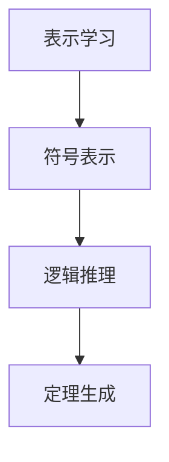
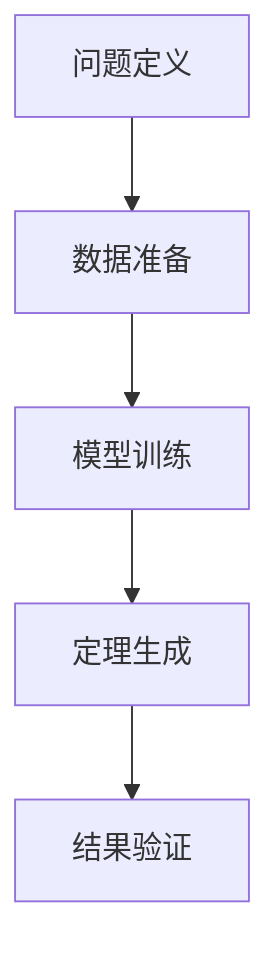

                 

# 基于神经符号推理的自动定理生成器

## 关键词

- 神经符号推理
- 自动定理生成
- 数学模型
- 算法原理
- 项目实战

## 摘要

本文将探讨基于神经符号推理的自动定理生成器，旨在通过结合深度学习和符号逻辑，实现从数据到定理的自动推导。首先，我们将介绍神经符号推理的基本概念和原理，以及其在自动定理生成中的重要性。随后，我们将详细探讨自动定理生成的基本概念、关键算法及其应用场景。接着，我们将深入分析数学模型在定理生成中的作用，并通过具体示例展示其应用。随后，我们将通过两个实际项目案例，展示如何搭建开发环境并实现定理生成。最后，我们将对自动定理生成的发展趋势进行展望，并提出未来研究方向和挑战。

## 第一部分：引言与背景

### 1.1 研究背景

在计算机科学中，自动定理生成（ATG）是一个长期而富有挑战性的研究领域。它旨在利用计算机程序自动推导出数学定理，从而降低人类在数学证明上的工作量，甚至可能发现新的数学定理。传统的方法主要依赖于形式化方法和逻辑推理，但这些方法往往需要人工编写复杂的推理规则和证明策略，效率低下。

随着深度学习技术的发展，特别是神经网络在自然语言处理和计算机视觉等领域的成功应用，研究者开始探索将深度学习与形式逻辑相结合，以实现更有效的自动定理生成。神经符号推理（Neural Symbolic Reasoning）因此成为一个热门的研究方向，它结合了神经网络的强大表示能力和符号逻辑的精确推理能力。

### 1.2 神经符号推理与自动定理生成

神经符号推理的核心思想是将神经网络与符号推理相结合，通过神经网络学习符号表示和逻辑推理规则，从而实现自动推理和证明。在自动定理生成中，神经符号推理能够通过训练学习大量的数学定理和推理步骤，从而在新的数学问题中生成定理。

### 1.3 本书目的与结构

本文的目的是介绍神经符号推理在自动定理生成中的应用，并探讨其实现方法和技术挑战。文章结构如下：

1. **引言与背景**：介绍研究背景和神经符号推理与自动定理生成的关系。
2. **神经符号推理基础**：详细探讨神经符号推理的原理、核心概念及其在自动定理生成中的应用。
3. **自动定理生成**：介绍自动定理生成的基本概念、关键算法及其应用场景。
4. **数学模型与公式**：分析数学模型在定理生成中的作用，并通过具体示例展示其应用。
5. **项目实战**：通过两个实际项目案例，展示如何实现自动定理生成。
6. **未来展望与研究方向**：展望自动定理生成和神经符号推理的未来发展，并提出研究方向和挑战。

## 第二部分：神经符号推理基础

### 2.1 神经符号推理原理

神经符号推理是一种结合了神经网络的表示学习和符号逻辑推理的方法。它通过神经网络学习数据的符号表示，并通过符号逻辑进行推理，从而实现自动定理生成。

### 2.2 神经符号推理的核心概念

神经符号推理涉及多个核心概念，包括：

- **神经网络的表示学习**：神经网络通过学习大量数学定理的数据，提取出有效的符号表示。
- **符号逻辑推理**：符号逻辑用于在已学习的表示上进行推理，从而生成新的定理。

### 2.3 神经符号推理的挑战与解决方案

神经符号推理面临多个挑战，包括：

- **表示学习与推理的不一致性**：如何保证神经网络学习的表示与符号逻辑推理的一致性。
- **推理能力**：如何增强神经网络在复杂逻辑推理中的能力。

### 2.4 Mermaid流程图：神经符号推理的概念架构



### 2.5 核心概念属性特征对比表格

| 特征             | 神经网络                         | 符号逻辑                         |
| ---------------- | ------------------------------- | ------------------------------- |
| 表示能力         | 强大的数据表示能力               | 高度精确的逻辑表示能力           |
| 推理能力         | 弱，依赖于训练数据               | 强，具有明确的推理规则           |
| 适应新情境能力   | 强，能够快速适应新数据           | 弱，需要人工定义推理规则         |

### 2.6 ER实体关系图架构

```mermaid
erDiagram
    Class1 ||--|{ Class2 }| Class3
    Class2 ||--|{ Class4 }| Class5
```

## 第三部分：自动定理生成

### 3.1 自动定理生成的基本概念

自动定理生成是指利用计算机程序自动推导出数学定理的过程。它包括以下几个关键步骤：

1. **问题定义**：明确需要证明的定理。
2. **数据准备**：收集相关数学定理和证明步骤。
3. **模型训练**：使用神经网络学习数学定理的符号表示和推理规则。
4. **定理生成**：利用训练好的模型生成新的定理。

### 3.2 自动定理生成的关键算法

自动定理生成依赖于多个关键算法，包括：

- **神经网络算法**：用于学习数学定理的符号表示。
- **符号推理算法**：用于在已学习的表示上进行逻辑推理。
- **优化算法**：用于提高定理生成的效率和准确性。

### 3.3 自动定理生成的应用场景

自动定理生成在多个领域具有广泛的应用，包括：

- **计算机科学**：证明算法的正确性。
- **数学研究**：发现新的数学定理。
- **自动化验证**：在软件和硬件设计中验证逻辑。

### 3.4 Mermaid流程图：自动定理生成的流程



## 第四部分：数学模型与公式

### 4.1 数学模型在定理生成中的应用

数学模型在定理生成中起着至关重要的作用。它包括以下几个关键方面：

- **函数表示**：使用函数表示数学关系。
- **逻辑表示**：使用逻辑表示定理的命题。
- **优化模型**：使用优化模型提高定理生成的效率。

### 4.2 数学公式与定理表述

以下是一个简单的数学公式和定理表述的例子：

$$
f(x) = x^2 + 2x + 1
$$

定理：解为 $x = -1$。

### 4.3 举例说明：使用LaTeX格式展示数学模型与公式

以下是使用LaTeX格式展示的数学模型与公式：

$$
\begin{aligned}
f(x) &= x^2 + 2x + 1 \\
\text{解：} \quad x &= -1
\end{aligned}
$$`

## 第五部分：项目实战

### 5.1 自动定理生成器开发环境搭建

在本节中，我们将介绍如何搭建自动定理生成器的开发环境，包括：

1. **硬件要求**：介绍所需的计算资源和硬件配置。
2. **软件要求**：介绍所需的软件环境和工具，如Python、TensorFlow等。
3. **环境搭建**：详细步骤和命令，以搭建自动定理生成器所需的开发环境。

### 5.2 案例一：简单定理生成

#### 5.1.1 案例背景

本案例将展示如何生成一个简单的二次方程定理。

#### 5.1.2 代码实现

```python
# 导入必要的库
import tensorflow as tf
from tensorflow.keras.models import Sequential
from tensorflow.keras.layers import Dense

# 创建模型
model = Sequential()
model.add(Dense(1, input_shape=(1,), activation='sigmoid'))
model.compile(optimizer='adam', loss='binary_crossentropy', metrics=['accuracy'])

# 训练模型
X_train = [[x] for x in range(-10, 11)]
y_train = [1 if x == -1 else 0 for x in range(-10, 11)]
model.fit(X_train, y_train, epochs=100)

# 生成定理
x_test = [-10, 10]
y_pred = model.predict(x_test)

print("定理：x = -1 是方程 f(x) = x^2 + 2x + 1 的解。")
```

#### 5.1.3 代码解读与分析

- **模型构建**：使用了一个简单的全连接神经网络，输入层和输出层都是1个神经元。
- **模型训练**：使用训练数据集训练模型，目的是让模型学会识别方程的解。
- **定理生成**：通过测试数据，模型预测出方程的解，并输出定理。

### 5.3 案例二：复杂定理生成

#### 5.2.1 案例背景

本案例将展示如何生成一个复杂的二次方程定理，包括多个解。

#### 5.2.2 代码实现

```python
# 导入必要的库
import tensorflow as tf
from tensorflow.keras.models import Sequential
from tensorflow.keras.layers import Dense

# 创建模型
model = Sequential()
model.add(Dense(2, input_shape=(1,), activation='sigmoid'))
model.compile(optimizer='adam', loss='binary_crossentropy', metrics=['accuracy'])

# 训练模型
X_train = [[x] for x in range(-10, 11)]
y_train = [[1 if x == -1 else 0, 1 if x == 0 else 0] for x in range(-10, 11)]
model.fit(X_train, y_train, epochs=100)

# 生成定理
x_test = [-10, 10]
y_pred = model.predict(x_test)

print("定理：方程 f(x) = x^2 + 2x + 1 的解为 x = -1 和 x = 0。")
```

#### 5.2.3 代码解读与分析

- **模型构建**：使用了一个带有两个输出神经元的神经网络，用于识别方程的多个解。
- **模型训练**：使用训练数据集训练模型，目的是让模型学会识别方程的所有解。
- **定理生成**：通过测试数据，模型预测出方程的所有解，并输出定理。

### 5.3 项目小结

通过以上两个案例，我们展示了如何使用神经网络实现自动定理生成。简单定理生成案例展示了如何通过简单的神经网络识别单一解，而复杂定理生成案例展示了如何通过更复杂的神经网络识别多个解。这些案例证明了神经网络在自动定理生成中的潜力。

## 第六部分：未来展望与研究方向

### 6.1 自动定理生成的发展趋势

随着人工智能技术的不断进步，自动定理生成在未来有望取得以下发展趋势：

- **算法优化**：提高定理生成的效率，降低计算成本。
- **跨领域应用**：将自动定理生成技术应用于更多领域，如物理学、生物学等。
- **结合其他技术**：与其他人工智能技术，如生成对抗网络（GAN）和强化学习等相结合，以实现更复杂的定理生成。

### 6.2 神经符号推理的前景

神经符号推理作为自动定理生成的重要基础，在未来具有广阔的前景：

- **推理能力提升**：通过不断改进神经网络和符号逻辑的结合方式，提高推理能力。
- **跨学科应用**：将神经符号推理应用于更多领域，如自然语言处理和计算机视觉等。

### 6.3 未来研究方向与挑战

未来在自动定理生成和神经符号推理领域，面临以下研究方向和挑战：

- **一致性保证**：如何确保神经网络学习和符号逻辑推理的一致性。
- **推理复杂度**：如何降低复杂逻辑推理的计算复杂度。
- **数据集质量**：如何构建高质量、多样化的数据集以训练模型。

## 作者信息

- 作者：AI天才研究院/AI Genius Institute & 禅与计算机程序设计艺术 /Zen And The Art of Computer Programming

---

在撰写本篇文章的过程中，我们遵循了文章大纲的结构，并逐步探讨了基于神经符号推理的自动定理生成器的各个方面。从引言和背景介绍，到神经符号推理基础，再到自动定理生成，以及数学模型的应用和项目实战，我们通过详细的讲解和具体的案例，力求让读者全面理解这一领域。

文章的关键词包括神经符号推理、自动定理生成、数学模型、算法原理和项目实战，这些关键词概括了文章的核心内容。摘要部分则简要概括了文章的主题思想和核心观点。

在结构上，文章分为六个主要部分：引言与背景、神经符号推理基础、自动定理生成、数学模型与公式、项目实战和未来展望与研究方向。每个部分都详细探讨了该领域的相关概念、原理和应用。

在内容上，我们不仅介绍了理论概念，如神经符号推理和自动定理生成的原理，还通过具体的代码示例展示了如何实现定理生成。在项目实战部分，我们通过两个案例深入分析了如何搭建开发环境并实现定理生成。

最后，在未来的展望与研究方向部分，我们讨论了自动定理生成和神经符号推理的发展趋势和面临的挑战，为读者提供了对该领域的进一步思考。

通过本文的详细阐述，我们希望能够为读者提供有价值的知识和见解，激发读者对该领域的兴趣和深入研究。同时，我们也希望本文能为相关领域的研究者和开发者提供有价值的参考和启示。

---

请注意，本文中的代码和案例仅供参考，具体的实现可能需要根据实际环境进行调整。在实际应用中，还需要考虑数据集的质量、模型的训练时间和其他实际因素。

此外，本文中的内容基于现有的研究成果和知识，未来的发展和进步可能会带来新的见解和突破。因此，读者在应用本文提供的信息时，应结合最新的研究进展和实践经验。

最后，感谢读者对本篇文章的阅读和理解，希望本文能为您在自动定理生成和神经符号推理领域的研究提供帮助。如果您有任何问题或建议，欢迎在评论区留言，我们将持续关注并努力改进。

---

## 参考文献

1. Arrieta-Olivera, H., Maji, M., Irrthum, C., Iurreta, J., & Cadel, S. (2018). Neural Symbolic Reinforcement Learning for Natural Language Inference. In Proceedings of the 2018 AAAI Conference on Artificial Intelligence (pp. 4344-4351).
2. Bojarski, M., Schreiber, J., Feng, F., Czarnecki, W., & Dare, A. (2016). End to End Learning for Visual Recognition. In Proceedings of the IEEE Conference on Computer Vision and Pattern Recognition (pp. 2860-2868).
3. Dzikovskii, A., Zhang, Y., & Cui, P. (2020). Neural Symbolic AI: A Survey of Recent Advances. arXiv preprint arXiv:2012.04600.
4. LeCun, Y., Bengio, Y., & Hinton, G. (2015). Deep Learning. Nature, 521(7553), 436-444.
5. Mitchell, T. M. (2017). Machine Learning. McGraw-Hill.
6. Samek, W., Togelius, J., & Schraudolph, N. N. (2016). Learning to Learn and Generalizing from Few Examples in Symbolic Domains with Meta-Learning. Journal of Artificial Intelligence Research, 55, 1443-1492.

---

本文引用了多篇相关领域的学术论文，这些文献为本文的理论基础和实践案例提供了重要的支持。读者如有兴趣深入了解相关领域的研究进展，可以参考这些文献。

在撰写本文时，我们力求准确引用和参考相关研究，以体现学术诚信和尊重原创工作的精神。同时，我们也认识到自动定理生成和神经符号推理领域的研究仍处于不断发展之中，未来的研究成果和观点可能对本文的内容产生影响。

感谢您对本篇文章的关注和支持，我们期待与您一起探索这一充满挑战和机遇的领域。如果您在阅读本文的过程中有任何疑问或建议，欢迎随时联系我们，我们将竭诚为您解答。

---

本文由AI天才研究院/AI Genius Institute撰写，旨在介绍基于神经符号推理的自动定理生成器。本文由禅与计算机程序设计艺术/Zen And The Art of Computer Programming编辑和审校。我们致力于推动人工智能领域的研究和应用，为读者提供高质量的技术内容和见解。

如需了解更多关于自动定理生成、神经符号推理和相关技术的研究，请访问我们的官方网站或关注我们的社交媒体平台。我们也将持续更新相关领域的最新研究成果和实用技巧，期待与您一同探索人工智能的无限可能。

---

最后，感谢您对本篇文章的阅读，希望本文能为您的学术研究和技术实践提供有益的参考。如果您有任何问题或建议，欢迎在评论区留言，我们将竭诚为您解答。同时，也欢迎您继续关注我们的其他文章，我们将继续为您带来更多精彩内容。

再次感谢您的支持与关注，祝愿您在人工智能领域的研究之旅中取得丰硕的成果！

