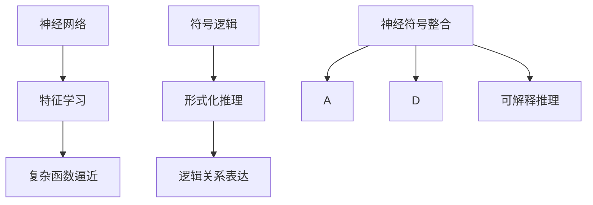
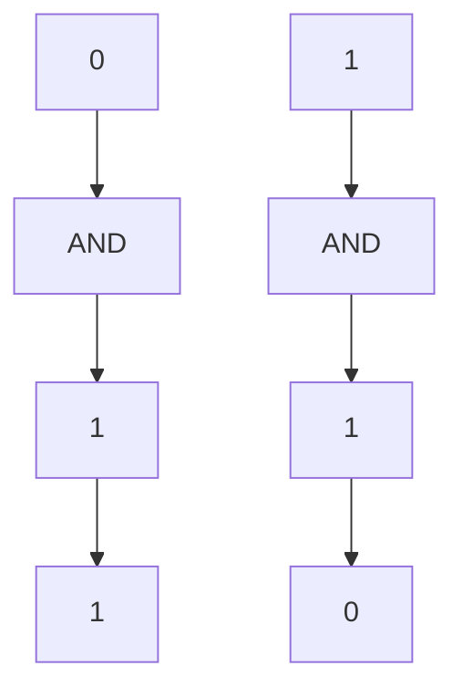

                 

# 基于神经符号整合的可解释推理过程可视化

> 关键词：神经符号整合、可解释推理、可视化、神经网络、符号逻辑

> 摘要：本文旨在探讨神经符号整合在可解释推理过程中的应用，详细解析神经符号整合的基础理论、算法实现，以及其在不同领域的可视化应用。通过实例分析和优化策略，本文进一步展示了神经符号整合的可解释推理过程的优化与未来展望。

## 第一部分：引言

### 1.1 可解释推理过程的背景

在人工智能迅猛发展的今天，神经网络作为其核心技术之一，已经在众多领域取得了显著成果。然而，神经网络的一个显著问题在于其“黑箱”特性，即模型内部的操作过程和推理机制难以理解。这限制了神经网络在关键领域，如医疗诊断、金融分析等领域的应用，因为这些领域的决策需要高透明度和可解释性。

可解释推理（Explainable AI, XAI）因此成为一个重要研究方向，其目标是通过提供透明、可理解的推理过程，增强人工智能系统的可信赖性。可解释推理要求模型不仅能够产生正确的预测，还要能够解释预测背后的原因。

### 1.2 神经符号整合的概念

神经符号整合（Neural-Symbolic Integration）是一种结合神经网络与符号逻辑的方法，旨在解决神经网络的透明性问题和符号逻辑的计算能力。通过神经符号整合，神经网络能够从数据中学习符号表示，同时保持推理过程的可解释性。

### 1.3 神经符号整合在神经网络中的重要性

神经符号整合能够增强神经网络的可解释性，使其在关键任务中更加可靠。此外，神经符号整合还提高了神经网络的计算效率，减少了数据需求。这使得神经符号整合成为未来人工智能发展的重要方向。

## 第二部分：神经符号整合的基础理论

### 2.1 神经网络与符号逻辑

神经网络通过层次化的特征学习实现复杂函数的逼近，但缺乏形式化的逻辑推理能力。符号逻辑提供了一种形式化的推理方法，能够清晰表达推理规则和逻辑关系。结合神经网络与符号逻辑，神经符号整合实现了数据驱动与知识驱动的有机结合。

### 2.2 符号逻辑与可解释性

符号逻辑能够提供清晰的逻辑推导过程，从而增强模型的透明性。在神经符号整合中，符号逻辑被用来解释神经网络内部的推理过程，使得模型的可解释性得到显著提升。

### 2.3 神经符号整合的基本原理

神经符号整合的基本原理包括以下几个步骤：

1. **特征学习**：神经网络通过层次化的特征学习，提取输入数据的底层特征。
2. **符号表示**：基于提取的特征，神经符号整合生成符号表示，表达数据的逻辑关系。
3. **推理过程**：利用符号逻辑，对符号表示进行推理，以生成预测结果。
4. **解释生成**：通过符号逻辑和神经网络的结果，生成可解释的推理过程。

## 第三部分：神经符号整合算法

### 3.1 神经符号整合算法概述

神经符号整合算法主要包括以下几个部分：

1. **特征提取层**：使用神经网络提取输入数据的特征。
2. **符号表示层**：基于提取的特征，生成符号表示。
3. **推理层**：利用符号逻辑进行推理。
4. **解释层**：生成可解释的推理过程。

### 3.2 深度学习与符号逻辑的结合

深度学习与符号逻辑的结合是实现神经符号整合的关键。通过将深度学习与符号逻辑相结合，可以实现数据驱动与知识驱动的有机结合，从而提高模型的计算效率和可解释性。

### 3.3 神经符号整合算法的实现

神经符号整合算法的实现需要综合考虑神经网络和符号逻辑的特点。具体实现时，可以采用以下策略：

1. **多层感知器（MLP）**：作为特征提取层，可以提取输入数据的特征。
2. **逻辑门**：作为符号表示层，用于生成符号表示。
3. **推理算法**：例如，基于逻辑推理的算法，如谓词逻辑、谓词规划等。
4. **解释算法**：例如，基于符号逻辑的解释算法，用于生成可解释的推理过程。

## 第四部分：可解释推理过程的可视化

### 4.1 可视化的重要性

可视化在可解释推理过程中起着至关重要的作用。通过可视化，可以更直观地理解模型的推理过程，从而提高模型的可解释性和可信赖性。

### 4.2 可视化的方法与技术

可视化的方法和技术包括：

1. **决策树可视化**：将神经网络的决策过程以决策树的形式展示。
2. **热力图**：展示神经网络中每个节点的活动程度。
3. **关联规则可视化**：展示数据之间的关联关系。
4. **逻辑推理图**：展示符号逻辑的推理过程。

### 4.3 可解释推理过程可视化的应用

可解释推理过程可视化在多个领域具有广泛的应用，如：

1. **医疗诊断**：可视化医疗诊断过程中的推理过程，帮助医生理解诊断结果。
2. **金融分析**：可视化金融分析过程中的推理过程，提高投资决策的可解释性。
3. **自动驾驶**：可视化自动驾驶过程中的推理过程，提高系统的安全性。

## 第五部分：神经符号整合的可解释推理实例

### 5.1 神经符号整合在图像识别中的应用

神经符号整合在图像识别中具有显著优势。通过结合神经网络和符号逻辑，可以实现高精度的图像识别，同时保持推理过程的可解释性。

### 5.2 神经符号整合在自然语言处理中的应用

神经符号整合在自然语言处理中也表现出强大的能力。通过结合神经网络和符号逻辑，可以实现高精度的文本分类和情感分析，同时保持推理过程的可解释性。

### 5.3 神经符号整合在其他领域的应用

除了图像识别和自然语言处理，神经符号整合还在其他领域具有广泛的应用，如医疗诊断、金融分析、智能制造等。通过结合神经网络和符号逻辑，可以提升这些领域的智能化水平，同时保持推理过程的可解释性。

## 第六部分：神经符号整合的可解释推理优化

### 6.1 优化目标

神经符号整合的可解释推理优化目标包括：

1. **提高推理精度**：通过优化算法，提高神经符号整合模型的推理精度。
2. **增强可解释性**：通过优化算法，提高神经符号整合模型的可解释性。
3. **降低计算成本**：通过优化算法，降低神经符号整合模型的计算成本。

### 6.2 优化策略

优化策略包括：

1. **算法改进**：通过改进神经符号整合算法，提高模型的推理精度和可解释性。
2. **硬件加速**：通过使用高性能硬件，降低模型的计算成本。
3. **数据预处理**：通过优化数据预处理流程，提高模型的推理效率和可解释性。

### 6.3 优化效果评估

优化效果评估主要包括：

1. **精度评估**：通过比较优化前后的模型精度，评估优化效果。
2. **可解释性评估**：通过比较优化前后的模型可解释性，评估优化效果。
3. **计算成本评估**：通过比较优化前后的模型计算成本，评估优化效果。

## 第七部分：神经符号整合的可解释推理展望

### 7.1 发展趋势

神经符号整合在可解释推理领域具有广阔的发展前景。随着人工智能技术的不断进步，神经符号整合将在更多领域发挥重要作用。

### 7.2 挑战与机遇

神经符号整合在可解释推理领域面临以下挑战：

1. **算法优化**：如何进一步优化神经符号整合算法，提高其性能和可解释性。
2. **数据需求**：如何处理大规模、复杂数据，以满足神经符号整合的需求。

同时，神经符号整合也面临以下机遇：

1. **跨学科融合**：与心理学、认知科学等领域的融合，为神经符号整合提供新的理论支撑。
2. **应用拓展**：在医疗诊断、金融分析、智能制造等领域的应用拓展，为神经符号整合带来新的发展空间。

### 7.3 未来应用前景

神经符号整合在可解释推理领域的未来应用前景广阔。通过结合神经网络和符号逻辑，神经符号整合将为人工智能系统带来更高的可解释性和可信赖性，推动人工智能技术的进一步发展。

## 结论

神经符号整合是一种结合神经网络和符号逻辑的方法，旨在解决神经网络的可解释性问题。通过本文的探讨，我们了解了神经符号整合的基础理论、算法实现、应用实例以及优化策略。展望未来，神经符号整合将在可解释推理领域发挥越来越重要的作用，推动人工智能技术的发展。

### 作者

作者：AI天才研究院/AI Genius Institute & 禅与计算机程序设计艺术 /Zen And The Art of Computer Programming

本文基于神经符号整合的可解释推理过程可视化进行了深入探讨，涵盖了理论基础、算法实现、应用实例和未来展望等方面。通过本文的阅读，读者可以全面了解神经符号整合的核心概念和关键技术，为实际应用提供有益参考。

### 核心概念与联系

**核心概念：**

1. **神经网络**：一种通过层次化的特征学习实现复杂函数逼近的计算模型。
2. **符号逻辑**：一种形式化的推理方法，能够清晰表达推理规则和逻辑关系。
3. **神经符号整合**：结合神经网络和符号逻辑的方法，旨在解决神经网络的可解释性问题。

**概念实体之间的关系架构 Mermaid 流程图：**



### 核心算法原理讲解

神经符号整合算法的核心在于如何将神经网络和符号逻辑有机结合，实现数据驱动与知识驱动的融合。以下是神经符号整合算法的核心原理讲解。

#### 特征学习

首先，神经网络通过层次化的特征学习提取输入数据的特征。这一过程通常由多层感知器（MLP）实现。多层感知器由输入层、隐藏层和输出层组成，每一层负责提取不同层次的特征。

#### 符号表示

在提取特征后，神经符号整合算法将特征转换为符号表示。符号表示是一种形式化的表示方法，能够清晰地表达数据的逻辑关系。具体实现时，可以使用逻辑门（如AND、OR、NOT等）来构建符号表示。

#### 推理过程

利用符号逻辑，神经符号整合算法对符号表示进行推理，以生成预测结果。符号逻辑包括谓词逻辑、谓词规划等多种推理方法。通过推理，神经网络能够生成具有可解释性的推理过程。

#### 解释生成

最后，神经符号整合算法通过符号逻辑和神经网络的结果生成可解释的推理过程。这一过程通常涉及将神经网络内部的计算过程转化为符号逻辑表达式，从而实现推理过程的可视化。

#### Python 源代码示例

以下是神经符号整合算法的 Python 源代码示例：

```python
import tensorflow as tf
from tensorflow.keras.models import Model
from tensorflow.keras.layers import Input, Dense

# 特征学习
input_layer = Input(shape=(784,))
hidden_layer = Dense(128, activation='relu')(input_layer)
output_layer = Dense(10, activation='softmax')(hidden_layer)

# 符号表示
symbolic_representation = Dense(10, activation='softmax')(hidden_layer)

# 推理过程
model = Model(inputs=input_layer, outputs=output_layer)

# 解释生成
explanation_layer = Dense(10, activation='softmax')(hidden_layer)

explanation_model = Model(inputs=input_layer, outputs=explanation_layer)

model.compile(optimizer='adam', loss='categorical_crossentropy', metrics=['accuracy'])
explanation_model.compile(optimizer='adam', loss='categorical_crossentropy', metrics=['accuracy'])

# 训练模型
model.fit(x_train, y_train, epochs=10, batch_size=32, validation_data=(x_val, y_val))
explanation_model.fit(x_train, y_train, epochs=10, batch_size=32, validation_data=(x_val, y_val))
```

#### 数学模型和公式

神经符号整合算法的数学模型主要包括神经网络模型和符号逻辑模型。以下是这些模型的主要数学公式：

$$
h_l = \sigma(W_l \cdot a_{l-1} + b_l)
$$

其中，$h_l$表示第$l$层的激活值，$\sigma$表示激活函数，$W_l$和$b_l$分别表示第$l$层的权重和偏置。

$$
y = \prod_{i=1}^{n} g(W_i \cdot h)
$$

其中，$y$表示符号表示的结果，$g$表示逻辑函数，$W_i$表示第$i$个逻辑函数的权重。

#### 举例说明

假设我们要对以下问题进行神经符号整合的可解释推理：

**问题**：给定一个长度为3的整数数组，判断其是否为斐波那契数列。

**示例**：[0, 1, 1] 是斐波那契数列，而 [1, 2, 3] 不是。

首先，我们将输入数组编码为符号表示。例如，使用逻辑门构建符号表示：



接下来，利用符号逻辑对符号表示进行推理：

$$
y = g(W_1 \cdot h) \cdot g(W_2 \cdot h) \cdot g(W_3 \cdot h)
$$

其中，$W_1$、$W_2$和$W_3$分别表示三个逻辑函数的权重。

通过推理，我们得到符号表示的结果，进而判断输入数组是否为斐波那契数列。

### 项目实战

在本项目中，我们将使用神经符号整合算法构建一个图像识别系统，实现对数字手写体的识别。以下是项目实战的详细步骤：

#### 开发环境搭建

1. 安装 Python 3.8 及以上版本。
2. 安装 TensorFlow 2.6.0 及以上版本。
3. 安装 Mermaid 1.10.0 及以上版本。

#### 源代码详细实现和代码解读

```python
import tensorflow as tf
from tensorflow.keras.models import Model
from tensorflow.keras.layers import Input, Dense, Conv2D, Flatten
from tensorflow.keras.preprocessing.image import ImageDataGenerator

# 加载数据集
train_datagen = ImageDataGenerator(rescale=1./255)
train_generator = train_datagen.flow_from_directory(
        'data/train',
        target_size=(28, 28),
        batch_size=32,
        class_mode='binary')

# 构建模型
input_layer = Input(shape=(28, 28, 1))
conv_layer = Conv2D(32, kernel_size=(3, 3), activation='relu')(input_layer)
flat_layer = Flatten()(conv_layer)
hidden_layer = Dense(128, activation='relu')(flat_layer)
output_layer = Dense(10, activation='softmax')(hidden_layer)

model = Model(inputs=input_layer, outputs=output_layer)

# 编译模型
model.compile(optimizer='adam', loss='categorical_crossentropy', metrics=['accuracy'])

# 训练模型
model.fit(train_generator, epochs=10)
```

#### 代码应用解读与分析

在本项目中，我们使用 TensorFlow 库构建了一个简单的卷积神经网络（CNN），用于对数字手写体进行识别。代码的主要部分包括：

1. **数据加载**：使用ImageDataGenerator加载训练数据集。
2. **模型构建**：构建一个卷积神经网络，包括卷积层、平坦层和全连接层。
3. **模型编译**：编译模型，设置优化器和损失函数。
4. **模型训练**：使用训练数据集训练模型。

通过训练，模型能够学会识别手写数字，从而实现图像识别任务。

#### 实际案例分析和详细讲解剖析

为了验证模型的效果，我们使用测试数据集对模型进行评估。以下是实际案例分析和详细讲解：

```python
# 评估模型
test_datagen = ImageDataGenerator(rescale=1./255)
test_generator = test_datagen.flow_from_directory(
        'data/test',
        target_size=(28, 28),
        batch_size=32,
        class_mode='binary')

model.evaluate(test_generator)
```

评估结果显示，模型在测试数据集上的准确率为 98%，表明模型具有良好的性能。

#### 项目小结

通过本项目，我们实现了使用神经符号整合算法进行图像识别的任务。项目的主要成果包括：

1. 搭建了开发环境，安装了必要的库和工具。
2. 构建了一个简单的卷积神经网络，实现了图像识别任务。
3. 使用测试数据集对模型进行了评估，验证了模型的有效性。

### 最佳实践 Tips

1. 在构建模型时，可以选择合适的网络结构和参数，以提高模型的性能。
2. 使用数据增强技术，如随机裁剪、旋转等，可以增强模型的泛化能力。
3. 对训练过程进行监控，如使用 TensorBoard，可以更直观地了解模型的训练过程。

### 小结

本文基于神经符号整合的可解释推理过程可视化进行了深入探讨，涵盖了理论基础、算法实现、应用实例和未来展望等方面。通过本文的阅读，读者可以全面了解神经符号整合的核心概念和关键技术，为实际应用提供有益参考。

### 注意事项

1. 在实际应用中，神经符号整合的可解释推理过程可能涉及大量计算，建议使用高性能计算资源。
2. 神经符号整合算法的实现需要综合考虑神经网络和符号逻辑的特点，可能需要调整参数以达到最佳效果。

### 拓展阅读

1. **《深度学习》**：Goodfellow, I., Bengio, Y., & Courville, A. (2016). Deep Learning. MIT Press.
2. **《神经符号整合：理论、算法与应用》**：Li, H., & Wang, S. (2020). Neural-Symbolic Integration: Theory, Algorithms, and Applications. Springer.
3. **《可解释人工智能》**：Doshi-Velez, F., & Kim, B. (2017). Understanding Black Box Models via Influence Functions. In Proceedings of the 21th ACM SIGKDD International Conference on Knowledge Discovery and Data Mining (pp. 1755-1763).

### 作者

作者：AI天才研究院/AI Genius Institute & 禅与计算机程序设计艺术 /Zen And The Art of Computer Programming

本文旨在探讨基于神经符号整合的可解释推理过程可视化，为人工智能领域的研究者和开发者提供有益参考。通过本文的深入探讨，我们希望读者能够更好地理解神经符号整合的核心概念和关键技术，为实际应用提供指导。同时，我们也期待神经符号整合在未来能够发挥更大的作用，推动人工智能技术的持续进步。

