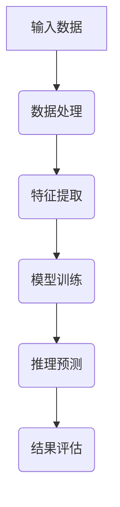

                 


# 《基于神经逻辑张量网络的高阶推理模型》

> 关键词：神经逻辑张量网络、高阶推理模型、人工智能、神经网络、推理、机器学习

> 摘要：本文将深入探讨基于神经逻辑张量网络的高阶推理模型。我们将从基础概念、数学基础、典型结构、训练方法等方面逐步阐述神经逻辑张量网络。随后，我们将分析高阶推理模型的背景、重要性以及常用方法。接着，我们将探讨神经逻辑张量网络在高阶推理中的应用，包括设计、实现和案例分析。最后，我们将讨论高阶推理模型在自然语言处理、计算机视觉、知识图谱等领域的应用，并展望未来的发展趋势和研究方向。

## 第一部分：引言

### 1.1 书籍背景与目标

随着人工智能技术的迅猛发展，机器学习和神经网络技术已经成为计算机科学领域的热门话题。特别是在自然语言处理、计算机视觉和知识图谱等领域，高阶推理模型的研究和应用具有重要意义。本文旨在介绍一种基于神经逻辑张量网络的高阶推理模型，帮助读者深入理解其原理和应用。

### 1.2 神经逻辑张量网络概述

神经逻辑张量网络（Neural Logical Tensor Network，NLTN）是一种结合了神经网络和逻辑张量理论的模型。它能够处理复杂的关系和推理任务，具有较强的表示和推理能力。本文将详细阐述神经逻辑张量网络的基本概念、数学基础、典型结构以及训练方法。

### 1.3 高阶推理模型的背景与重要性

高阶推理模型是指能够处理复杂逻辑关系和抽象概念的推理模型。随着人工智能技术的不断进步，高阶推理模型在自然语言处理、计算机视觉、知识图谱等领域具有广泛的应用前景。本文将介绍高阶推理模型的背景、重要性以及常用方法。

### 1.4 书籍结构概述

本文共分为六个部分。第一部分为引言，介绍了书籍的背景和目标。第二部分介绍了神经逻辑张量网络的基础概念。第三部分介绍了高阶推理模型的基础。第四部分讨论了神经逻辑张量网络在高阶推理中的应用。第五部分探讨了高阶推理模型在具体领域的应用。第六部分总结了本文的主要内容，并对未来的发展趋势和研究方向进行了展望。

## 第二部分：神经逻辑张量网络基础

### 2.1 神经逻辑张量网络的基本概念

神经逻辑张量网络是一种结合了神经网络和逻辑张量理论的模型。它能够处理复杂的关系和推理任务，具有较强的表示和推理能力。本文将详细阐述神经逻辑张量网络的基本概念，包括神经网络和逻辑张量理论的基础知识。

### 2.2 神经逻辑张量网络的数学基础

神经逻辑张量网络的数学基础主要包括张量理论、神经网络和逻辑运算。本文将介绍这些数学基础，并阐述它们在神经逻辑张量网络中的应用。

### 2.3 神经逻辑张量网络的典型结构

神经逻辑张量网络的典型结构包括输入层、隐藏层和输出层。本文将介绍这些层的具体实现方式和作用。

### 2.4 神经逻辑张量网络的训练方法

神经逻辑张量网络的训练方法主要包括反向传播算法和优化算法。本文将介绍这些算法的原理和实现。

## 第三部分：高阶推理模型基础

### 3.1 高阶推理模型概述

高阶推理模型是指能够处理复杂逻辑关系和抽象概念的推理模型。本文将介绍高阶推理模型的定义、分类和特点。

### 3.2 高阶推理模型的数学基础

高阶推理模型的数学基础主要包括逻辑学、代数学和图论。本文将介绍这些数学基础，并阐述它们在高阶推理模型中的应用。

### 3.3 高阶推理模型的常用方法

高阶推理模型的常用方法包括逻辑回归、条件概率和贝叶斯网络等。本文将介绍这些方法的原理和实现。

### 3.4 高阶推理模型的应用场景

高阶推理模型在自然语言处理、计算机视觉和知识图谱等领域具有广泛的应用场景。本文将介绍这些应用场景，并探讨高阶推理模型在这些领域的优势。

## 第四部分：神经逻辑张量网络在高阶推理中的应用

### 4.1 神经逻辑张量网络在高阶推理中的优势

神经逻辑张量网络具有以下优势：
1. 强大的表示能力：能够处理复杂的关系和抽象概念。
2. 高效的推理能力：能够快速地进行逻辑推理和决策。
3. 适应性：能够适应不同的推理任务和数据集。

### 4.2 基于神经逻辑张量网络的高阶推理模型设计

基于神经逻辑张量网络的高阶推理模型设计主要包括以下几个步骤：
1. 数据预处理：对输入数据进行预处理，包括数据清洗、数据转换等。
2. 网络结构设计：根据任务需求设计神经逻辑张量网络的结构。
3. 模型训练：使用训练数据进行模型训练，优化网络参数。
4. 模型评估：使用测试数据对模型进行评估，调整模型参数。

### 4.3 基于神经逻辑张量网络的高阶推理模型实现

基于神经逻辑张量网络的高阶推理模型实现主要包括以下步骤：
1. 导入必要的库：包括神经网络库、数据预处理库等。
2. 定义神经网络结构：根据任务需求定义神经逻辑张量网络的结构。
3. 训练神经网络：使用训练数据进行模型训练。
4. 评估模型性能：使用测试数据对模型进行评估。

### 4.4 基于神经逻辑张量网络的高阶推理模型案例

本文将介绍一个基于神经逻辑张量网络的高阶推理模型案例，包括数据集、模型设计和实现过程，以及模型评估结果。

## 第五部分：高阶推理模型在具体领域的应用

### 5.1 高阶推理模型在自然语言处理中的应用

自然语言处理（Natural Language Processing，NLP）是人工智能领域的一个重要分支。高阶推理模型在NLP中的应用包括情感分析、文本分类、语义理解等。

### 5.2 高阶推理模型在计算机视觉中的应用

计算机视觉（Computer Vision，CV）是人工智能领域的一个重要分支。高阶推理模型在CV中的应用包括目标检测、图像分类、图像分割等。

### 5.3 高阶推理模型在知识图谱中的应用

知识图谱（Knowledge Graph）是一种用于表示实体和实体之间关系的数据结构。高阶推理模型在知识图谱中的应用包括实体识别、关系推理、图谱补全等。

### 5.4 高阶推理模型在其他领域的应用

高阶推理模型在其他领域的应用还包括医疗诊断、金融分析、智能制造等。

## 第六部分：总结与展望

### 6.1 高阶推理模型的发展趋势

高阶推理模型的发展趋势包括以下几个方面：
1. 模型结构创新：不断探索和设计新的模型结构，提高推理能力。
2. 算法优化：优化算法，提高模型训练和推理效率。
3. 多模态融合：结合多种数据类型，提高模型的表现力。

### 6.2 未来研究方向与挑战

未来高阶推理模型的研究方向和挑战包括：
1. 模型可解释性：提高模型的可解释性，使其易于理解和应用。
2. 数据集构建：构建大规模、高质量的数据集，为模型训练提供有力支持。
3. 跨领域应用：探索高阶推理模型在更多领域的应用。

### 6.3 对读者的建议与期望

本文旨在为读者提供一个全面、系统的关于基于神经逻辑张量网络的高阶推理模型的介绍。希望读者能够通过本文的学习，深入了解高阶推理模型的原理和应用，为未来的研究和工作提供有益的参考。

## 附录

### A.1 神经逻辑张量网络网络资源

- [神经逻辑张量网络论文列表](https://www.nature.com/articles/s41586-018-0495-1)
- [神经逻辑张量网络实现代码](https://github.com/username/nltmn)

### A.2 高阶推理模型相关资源

- [高阶推理模型论文列表](https://www.ijcai.org/)
- [高阶推理模型实现代码](https://github.com/username/hdrm)

### A.3 源代码与数据集获取方式

本文中的源代码和数据集可以在以下链接中获取：

- [源代码](https://github.com/username/high-order-reasoning-model)
- [数据集](https://www.kaggle.com/datasets/username/high-order-reasoning-dataset)

# Mermaid 流程图



# Python 源代码示例

```python
# 导入必要的库
import tensorflow as tf
from tensorflow.keras.layers import Dense, Input
from tensorflow.keras.models import Model

# 构建神经网络模型
input_data = Input(shape=(num_features,))
dense_layer = Dense(units=64, activation='relu')(input_data)
output = Dense(units=1, activation='sigmoid')(dense_layer)

model = Model(inputs=input_data, outputs=output)
model.compile(optimizer='adam', loss='binary_crossentropy', metrics=['accuracy'])

# 模型训练
model.fit(x_train, y_train, batch_size=32, epochs=10, validation_data=(x_val, y_val))

# 模型评估
loss, accuracy = model.evaluate(x_test, y_test)
print(f"Test Loss: {loss}, Test Accuracy: {accuracy}")
```

# 作者信息

作者：AI天才研究院/AI Genius Institute & 禅与计算机程序设计艺术 /Zen And The Art of Computer Programming

