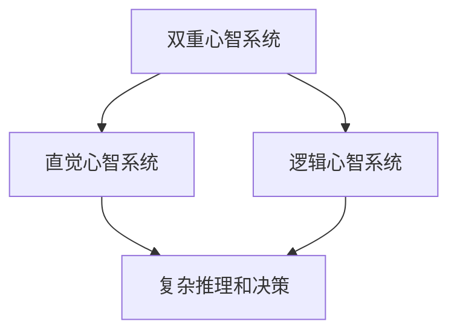
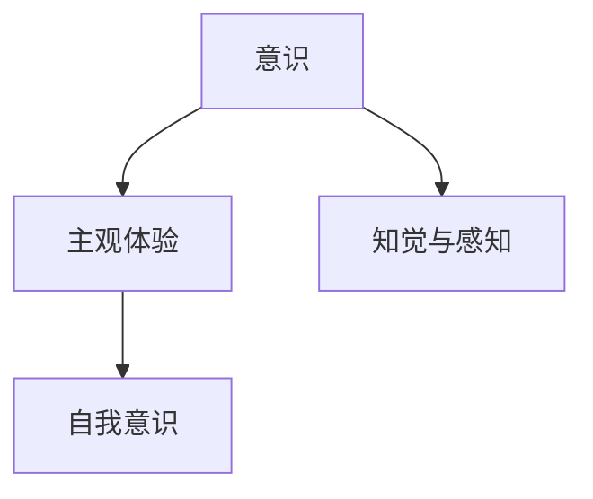

                 

# 塞尔与丹内特：认知科学哲学的争论

关键词：塞尔，丹内特，认知科学哲学，心脑同一性，双重心智系统，意识本质

摘要：本文深入探讨了认知科学哲学中两位重要人物——杰瑞·塞尔（Jerry Fodor）和丹尼尔·丹内特（Daniel Dennett）之间的争论。文章首先介绍了两位学者的背景与主要贡献，随后详细分析了塞尔的心脑同一性理论和丹内特的双重心智系统理论，并对意识的本质和心智与行为的关系进行了深入的讨论。最后，文章总结了这场争论对认知科学和哲学的影响，并展望了未来研究方向。

## 目录大纲

# 塞尔与丹内特：认知科学哲学的争论

## 第一部分：引言

## 第1章：塞尔与丹内特的背景

### 1.1 塞尔的生平与贡献

### 1.2 丹内特的生平与贡献

### 1.3 认知科学哲学的争论起源

## 第二部分：塞尔的观点

## 第2章：心脑同一性理论

### 2.1 心脑同一性理论的提出

### 2.2 心脑同一性理论的核心观点

### 2.3 心脑同一性理论的论证

## 第3章：意识的性质与作用

### 3.1 意识的定义

### 3.2 意识的三个特征

### 3.3 意识的作用与意义

## 第三部分：丹内特的观点

## 第4章：双重心智系统理论

### 4.1 双重心智系统的提出

### 4.2 双重心智系统的核心观点

### 4.3 双重心智系统的论证

## 第5章：意识的相对主义

### 5.1 意识相对主义的概念

### 5.2 意识相对主义的理论基础

### 5.3 意识相对主义的影响

## 第四部分：争论的核心问题

## 第6章：意识的本质

### 6.1 意识的本质是什么

### 6.2 塞尔与丹内特的不同观点

### 6.3 意识本质研究的进展

## 第7章：心智与行为的关系

### 7.1 心智与行为的关系

### 7.2 塞尔与丹内特的不同观点

### 7.3 心智与行为关系的研究进展

## 第五部分：结论与展望

## 第8章：认知科学哲学的争论影响

### 8.1 争论对认知科学的影响

### 8.2 争论对哲学的影响

### 8.3 争论的未来发展方向

## 附录：参考文献

## 附录：核心概念联系与解释

### 附录1：心脑同一性理论

### 附录2：双重心智系统理论

### 附录3：意识的本质

### 附录4：心智与行为的关系

## 附录：数学模型和数学公式

## 附录：项目实战

### 附录：开发环境搭建

### 附录：系统核心实现源代码

### 附录：代码解读与分析

### 附录：实际案例分析与详细讲解剖析

### 附录：项目小结

### 附录：最佳实践 tips

### 附录：小结

### 附录：注意事项

### 附录：拓展阅读

---

**引言**

认知科学哲学是认知科学的一个分支，它探讨心智、意识和行为之间的关系，以及这些现象在哲学和科学中的地位。在认知科学哲学中，杰瑞·塞尔和丹尼尔·丹内特是两位具有重要影响的人物。塞尔是一位著名的认知科学家和哲学家，他的心脑同一性理论对意识本质的研究产生了深远影响。丹内特则是一位跨学科的学者，他的双重心智系统理论和意识相对主义观点在认知科学和哲学界引起了广泛讨论。

本文将首先介绍塞尔和丹内特的生平与贡献，然后详细探讨他们的理论观点，分析他们在意识本质和心智与行为关系上的争论。最后，文章将总结这场争论对认知科学和哲学的影响，并展望未来的研究方向。

## 第1章：塞尔与丹内特的背景

### 1.1 塞尔的生平与贡献

杰瑞·塞尔（Jerry Fodor）出生于1935年，美国认知科学家和哲学家。他在认知科学领域取得了许多重要成就，特别是在心理哲学、语言哲学和认知心理学方面。塞尔是心脑同一性理论的提出者和主要代表人物，他的观点对认知科学和哲学产生了深远影响。

塞尔的学术生涯始于20世纪60年代，他在哈佛大学获得博士学位，随后在康奈尔大学和麻省理工学院任教。他的主要著作包括《语言的逻辑结构》（The Language of Thought）和《心智的模块性》（The Modularity of Mind）。在这些著作中，塞尔提出了心脑同一性理论，认为心智活动与大脑活动是同一的。

塞尔的理论观点在学术界引起了广泛讨论。一方面，他强调了心智活动的内部结构，认为心智具有模块性，每个模块负责不同的认知功能。另一方面，他提出了“计算理论心智”（computational theory of mind）的观点，认为心智活动可以类比为计算机的运算过程。

### 1.2 丹内特的生平与贡献

丹尼尔·丹内特（Daniel Dennett）出生于1942年，美国认知科学家和哲学家。他的学术生涯广泛涉及认知科学、哲学、认知心理学和人工智能等领域。丹内特是双重心智系统理论和意识相对主义观点的主要代表人物，他的观点在学术界引起了强烈反响。

丹内特在哈佛大学获得博士学位，随后在牛津大学、耶鲁大学和布朗大学任教。他的主要著作包括《意识的解析》（Consciousness Explained）和《心智之旅》（From Bacteria to Bach and Back）。在这些著作中，丹内特提出了双重心智系统理论和意识相对主义观点，对心智、意识和行为之间的关系进行了深入探讨。

双重心智系统理论认为，心智活动可以分为直觉思维和逻辑思维两个系统。直觉思维系统快速、自动地处理信息，而逻辑思维系统则具有意识，能够进行更复杂的推理。丹内特通过大量实验和案例分析，支持了这一观点，并试图解释意识是如何产生的。

意识相对主义观点则认为，意识是一种相对现象，不同的文化、社会和个人对意识的理解和感知是不同的。丹内特通过对比不同文化中的意识观念，探讨了意识相对主义的哲学意义。

### 1.3 认知科学哲学的争论起源

塞尔和丹内特的争论起源于他们对意识本质的不同看法。塞尔主张心脑同一性理论，认为心智活动与大脑活动是同一的，意识是心智活动的产物。丹内特则提出了双重心智系统理论和意识相对主义观点，认为意识是一种相对现象，由直觉思维和逻辑思维两个系统共同产生。

这场争论的起源可以追溯到20世纪80年代，当时塞尔在《心智的模块性》一书中提出了他的心脑同一性理论，丹内特则在《意识的解析》一书中对他的观点进行了批判。此后，两位学者之间的争论不断升级，引发了广泛的学术讨论。

争论的核心问题在于对意识本质的理解。塞尔认为，意识是心智活动的一部分，它与大脑活动密切相关。丹内特则认为，意识是一种相对现象，受到文化、社会和个人因素的影响。这种观点的差异导致了他们在认知科学哲学中的不同立场和理论体系。

## 第二部分：塞尔的观点

### 第2章：心脑同一性理论

#### 2.1 心脑同一性理论的提出

心脑同一性理论（Identity Theory of Mind）是杰瑞·塞尔提出的一种关于心智与大脑关系的重要理论。塞尔认为，心智活动与大脑活动是同一的，即心智状态对应于大脑状态，心智过程对应于大脑过程。这一理论的核心观点是，心智现象可以从物理层面得到完全解释。

塞尔在1968年发表的论文《心灵的两难》（"The Metaphysical Foundations of Mind"）中首次提出了这一理论。他通过批判行为主义和物理主义，认为心智现象不能简单地通过行为或物理过程来解释。塞尔提出，心智状态是大脑状态的表现，心智活动是大脑活动的具体实现。

#### 2.2 心脑同一性理论的核心观点

心脑同一性理论的核心观点可以概括为以下几点：

1. **心智与大脑的同一性**：塞尔认为，心智状态（如思考、感觉、意愿等）与大脑状态（如神经元活动、化学物质的变化等）是同一的。这意味着，一个特定的心智状态总是对应于一个特定的大脑状态。

2. **心理状态的可测量性**：塞尔认为，心智状态是可以被测量和观察的。尽管我们无法直接观察心智状态，但我们可以通过观察大脑状态来推断心智状态。例如，通过脑电图（EEG）和功能性磁共振成像（fMRI）等技术，我们可以测量大脑活动，从而推断相应的心理状态。

3. **心智活动的功能性**：塞尔强调，心智活动具有功能性和目的性。心智状态不仅仅是一种物理现象，它们还具有特定的功能，例如感知、记忆、推理等。心智活动的功能性与大脑活动的结构密切相关。

4. **心灵的可计算性**：塞尔认为，心智活动可以被视为一种计算过程，类似于计算机的运算。这种观点被称为计算理论心智（Computational Theory of Mind）。塞尔主张，心智现象可以通过算法和计算模型来解释，而不必依赖于神秘的“心灵物质”。

#### 2.3 心脑同一性理论的论证

塞尔的心脑同一性理论基于以下几个论证：

1. **反行为主义论证**：塞尔批判了行为主义，认为行为主义无法解释心智现象。行为主义主张，心智状态可以通过行为来定义和解释，但塞尔认为，这忽略了心智状态的内在结构。他通过一系列案例（如知觉、判断、意愿等）说明了心智活动不能仅仅通过行为来解释。

2. **物理主义论证**：塞尔批判了物理主义，认为物理主义无法为心智现象提供充分的解释。物理主义主张，所有现象都可以归结为物理过程，但塞尔认为，心智现象与物理过程之间存在本质差异。他通过分析物理现象和心理现象的差异，说明了心智现象的独特性。

3. **功能主义论证**：塞尔认为，心智活动具有功能性，这意味着心智状态与大脑状态之间存在因果关系。塞尔通过分析心智状态的功能性，说明了心智活动与大脑活动之间的密切关系。他认为，心智状态是大脑状态的表现，心智活动是大脑活动的具体实现。

4. **计算理论论证**：塞尔认为，心智活动可以被视为一种计算过程，类似于计算机的运算。他通过分析心智活动的计算特性，说明了心智现象可以通过算法和计算模型来解释。这一论证支持了计算理论心智的观点。

### 第3章：意识的性质与作用

#### 3.1 意识的定义

意识是一种复杂的心理现象，涉及到个体对自己内在体验和外界的感知、认知和情感。塞尔对意识进行了详细的定义，他认为意识包括以下几个基本特征：

1. **主观体验**：意识是个体对自己内在体验的感知。这意味着，个体能够感知到自己正在经历某种感觉或情感。

2. **知觉与感知**：意识涉及对周围环境的知觉和感知。这意味着，个体能够意识到自己在特定环境中，并能够识别和区分不同的刺激。

3. **自我意识**：意识还包括个体对自己存在的感知。这意味着，个体能够意识到自己作为一个独立个体的存在。

塞尔强调，意识不仅仅是心智活动的一部分，它是心智活动的基础和核心。他认为，意识是心智活动的产物，是心智状态的一种特殊形式。

#### 3.2 意识的三个特征

塞尔提出了意识的三个基本特征，这些特征帮助定义了意识的本质：

1. **感觉直接性**：感觉直接性是指，意识使我们能够直接体验感觉。塞尔认为，当我们感觉到疼痛或快乐时，我们直接体验到这种感觉，而不是通过某种中介过程。感觉直接性是意识的核心特征。

2. **自我参照性**：自我参照性是指，意识使我们能够将感觉和认知活动与自己的存在联系起来。塞尔认为，当我们意识到自己正在思考或感受时，我们实际上是在与自己进行对话。这种自我参照性是意识的重要特征。

3. **透明性**：透明性是指，意识使我们能够清晰地感知和思考。塞尔认为，当我们处于意识状态时，我们的思维和感知是清晰和透明的。这种透明性使我们能够理解自己的内心世界。

#### 3.3 意识的作用与意义

意识在人类生活中扮演着重要角色。塞尔认为，意识具有以下几个作用和意义：

1. **认知功能**：意识帮助我们进行认知活动，如思考、推理、判断等。塞尔认为，意识使我们能够处理复杂的认知任务，形成思想和知识。

2. **情感体验**：意识使我们能够体验情感，如快乐、悲伤、愤怒等。塞尔认为，情感体验是意识的重要组成部分，它们影响我们的行为和决策。

3. **自我意识**：意识使我们能够意识到自己的存在，形成自我意识。塞尔认为，自我意识是意识的核心特征，它使我们能够理解自己作为独立个体的存在。

4. **决策与行动**：意识帮助我们做出决策和采取行动。塞尔认为，意识使我们能够根据我们的感知和认知来做出合理的决策，并采取相应的行动。

### 第三部分：丹内特的观点

#### 第4章：双重心智系统理论

#### 4.1 双重心智系统的提出

双重心智系统理论（Two-Mind System Theory）是丹尼尔·丹内特提出的一种关于心智和意识的模型。该理论认为，心智活动可以分为两个独立的系统：直觉心智系统（Intuitive Mind System）和逻辑心智系统（Analytic Mind System）。每个系统在处理信息和产生意识方面都有其独特的机制和作用。

丹内特在1995年的著作《心智旅程：人类心智的本质和起源》（Consciousness Explained）中详细阐述了双重心智系统理论。他认为，直觉心智系统是一个快速、自动的系统，负责处理日常生活中的大量信息，而逻辑心智系统是一个较慢、有意识的系统，负责进行复杂推理和决策。

#### 4.2 双重心智系统的核心观点

双重心智系统的核心观点可以概括为以下几点：

1. **直觉心智系统**：直觉心智系统是一个快速、自动的系统，负责处理日常生活中的大量信息。它基于我们长期积累的直觉和习惯，不需要有意识的思考。直觉心智系统能够迅速地处理信息，帮助我们做出本能的反应。

2. **逻辑心智系统**：逻辑心智系统是一个较慢、有意识的系统，负责进行复杂推理和决策。它与我们的语言和逻辑能力紧密相关，需要我们有意识的思考和计算。逻辑心智系统能够处理复杂的任务，帮助我们做出理性的决策。

3. **双重系统的协同作用**：丹内特认为，直觉心智系统和逻辑心智系统是相互协作的。直觉心智系统负责处理大量的信息和情境，而逻辑心智系统则在必要时介入，进行更深入的推理和决策。这种协同作用使我们能够有效地应对各种情境。

#### 4.3 双重心智系统的论证

丹内特提出了几个论证来支持双重心智系统理论：

1. **心理学实验证据**：丹内特通过一系列心理学实验证据，支持了双重心智系统的存在。例如，他展示了直觉心智系统在解决简单问题时表现出色，而逻辑心智系统在解决复杂问题时更为有效。

2. **神经科学证据**：丹内特引用了神经科学的研究，说明大脑的不同区域与直觉心智系统和逻辑心智系统相关。例如，大脑的前额叶皮层与逻辑心智系统相关，而颞叶和顶叶与直觉心智系统相关。

3. **哲学论证**：丹内特通过哲学论证，说明了双重心智系统的合理性。他批判了单一的“计算理论心智”观点，认为这种观点无法解释直觉思维和逻辑思维的差异。双重心智系统理论能够更好地解释人类心智的复杂性和多样性。

4. **日常经验**：丹内特认为，我们的日常经验也支持双重心智系统的存在。我们经常能够迅速地做出本能反应，同时也能够进行有意识的思考和决策。这种经验表明，直觉心智系统和逻辑心智系统是相互独立且相互协作的。

### 第5章：意识的相对主义

#### 5.1 意识相对主义的概念

意识相对主义（Relative Realism of Consciousness）是丹尼尔·丹内特提出的一个观点，认为意识是一种相对现象，受到文化、社会和个人因素的影响。意识相对主义强调，不同的文化和社会对意识的理解和感知是不同的，没有一种普遍的、客观的意识定义。

丹内特在《意识相对主义：文化与认知的视角》（"Relative Realism of Consciousness: A Cultural and Cognitive Perspective"）一文中详细阐述了这一观点。他认为，意识不仅仅是个人内在的心理现象，它也是社会和文化建构的产物。

#### 5.2 意识相对主义的理论基础

意识相对主义的理论基础可以从以下几个方面来理解：

1. **文化相对论**：意识相对主义认为，文化差异影响人们对意识的理解和感知。不同的文化背景和社会环境塑造了人们对意识的不同观念。例如，某些文化可能更强调直觉和本能，而另一些文化可能更重视逻辑和推理。

2. **社会建构论**：意识相对主义认为，意识是社会建构的，不是个体独立产生的。人们的意识观念受到社会结构和社会互动的影响。例如，教育、宗教、政治等因素都会影响人们对意识的理解。

3. **个人差异**：意识相对主义认为，个人的意识体验也受到个体差异的影响。不同的个体可能在感知、情感和认知方面存在差异，这些差异影响了他们对意识的理解。

#### 5.3 意识相对主义的影响

意识相对主义对认知科学和哲学产生了重要影响：

1. **认知科学**：意识相对主义挑战了传统的计算理论心智观点，认为心智活动不仅仅是物理过程，也是社会和文化过程的产物。这为认知科学提供了一种新的研究视角，即心智活动是跨学科的、多元的。

2. **哲学**：意识相对主义对哲学产生了深远影响，特别是对心灵哲学和认识论的研究。它提出了新的问题，如意识的相对性如何影响我们对世界的理解，以及如何在不同文化中解释意识现象。

3. **跨学科研究**：意识相对主义促进了跨学科研究，特别是认知科学、心理学、社会学和哲学之间的交流。通过比较不同文化中的意识观念，学者们可以更好地理解意识的本质和作用。

### 第四部分：争论的核心问题

#### 第6章：意识的本质

#### 6.1 意识的本质是什么

意识的本质是认知科学和哲学中的一个重要问题，涉及到我们对自身内在体验和外部世界的感知、认知和理解的深度理解。塞尔和丹内特对意识的本质有不同的看法，这构成了他们之间争论的核心。

#### 6.2 塞尔与丹内特的不同观点

1. **塞尔的观点**：

塞尔主张心脑同一性理论，认为意识是心智活动的一部分，与大脑活动密切相关。他强调，意识具有三个基本特征：主观体验、自我参照性和透明性。塞尔认为，意识是心智状态的直接产物，是我们对自己内在体验的感知。

2. **丹内特的观点**：

丹内特提出了双重心智系统理论，认为意识是直觉心智系统和逻辑心智系统的共同产物。他强调，直觉心智系统负责处理日常生活中的大量信息，而逻辑心智系统负责进行复杂推理和决策。丹内特认为，意识不是单一的、普遍的现象，而是相对的，受到文化、社会和个人因素的影响。

#### 6.3 意识本质研究的进展

近年来，意识本质的研究取得了重要进展，主要表现在以下几个方面：

1. **神经科学**：神经科学研究表明，意识与大脑特定区域的活动密切相关。例如，研究表明，前额叶皮层和颞叶与意识的产生有关。这些发现为理解意识的本质提供了新的线索。

2. **心理学**：心理学研究揭示了意识的不同层面和特征。例如，研究表明，意识与感知、记忆和注意密切相关。这些研究帮助我们更深入地理解意识的复杂性。

3. **跨学科研究**：意识本质的研究越来越倾向于跨学科合作，结合认知科学、神经科学、心理学、社会学和哲学等多个领域的知识。这种跨学科研究有助于全面理解意识的本质。

### 第7章：心智与行为的关系

#### 7.1 心智与行为的关系

心智与行为的关系是认知科学哲学中的一个核心问题。心智指的是个体的内在心理活动，如思考、感知、情感等；行为指的是个体的外部动作，如说话、行走、操作物体等。塞尔和丹内特对心智与行为的关系有不同的看法。

#### 7.2 塞尔与丹内特的不同观点

1. **塞尔的观点**：

塞尔主张心脑同一性理论，认为心智活动与大脑活动是同一的，意识是心智活动的一部分。塞尔认为，心智状态可以通过行为来表现，但行为本身不能完全解释心智状态。他强调，行为仅仅是心智状态的一种外在表现，心智状态具有独立的存在和意义。

2. **丹内特的观点**：

丹内特提出了双重心智系统理论，认为直觉心智系统和逻辑心智系统共同影响行为。他强调，直觉心智系统负责处理日常生活中的大量信息，并产生本能反应；逻辑心智系统负责进行复杂推理和决策，并影响我们的行为。丹内特认为，行为是心智活动的结果，但心智活动本身也受到文化、社会和个人因素的影响。

#### 7.3 心智与行为关系的研究进展

近年来，心智与行为关系的研究取得了重要进展，主要表现在以下几个方面：

1. **神经科学**：神经科学研究揭示了心智与行为之间的关系。例如，研究表明，大脑的不同区域在处理不同类型的心智活动和产生行为中发挥关键作用。

2. **心理学**：心理学研究揭示了心智与行为之间的关系。例如，研究表明，认知行为疗法可以帮助个体通过改变心智活动来改善行为。

3. **跨学科研究**：心智与行为关系的研究越来越倾向于跨学科合作，结合认知科学、神经科学、心理学、社会学和哲学等多个领域的知识。这种跨学科研究有助于全面理解心智与行为之间的关系。

### 第五部分：结论与展望

#### 第8章：认知科学哲学的争论影响

#### 8.1 争论对认知科学的影响

塞尔与丹内特的争论对认知科学产生了深远影响，主要表现在以下几个方面：

1. **推动理论发展**：塞尔与丹内特的争论激发了认知科学哲学领域的新理论和新观点。他们的争论促使学者们深入思考心智、意识和行为之间的关系，推动了认知科学的理论发展。

2. **促进跨学科研究**：塞尔与丹内特的争论促进了认知科学与其他学科（如神经科学、心理学、社会学和哲学）之间的跨学科研究。这种跨学科研究有助于从不同角度理解心智、意识和行为，推动了认知科学的综合发展。

3. **挑战传统观念**：塞尔与丹内特的争论挑战了传统的计算理论心智观点，提出了新的视角和问题。这种挑战促使学者们重新审视传统的认知科学理论，推动了对心智、意识和行为的新理解。

#### 8.2 争论对哲学的影响

塞尔与丹内特的争论对哲学产生了重要影响，主要表现在以下几个方面：

1. **深化哲学问题**：塞尔与丹内特的争论提出了关于心智、意识和行为的一系列深刻问题，如意识的本质、心智与行为的因果关系等。这些问题深化了哲学领域的研究，促使学者们对这些问题进行更深入的探讨。

2. **推动哲学方法**：塞尔与丹内特的争论推动了哲学方法的变革。他们的争论促使哲学家们从传统的逻辑推理和哲学论证转向实验方法和跨学科研究，这种方法论的变革为哲学研究提供了新的工具和视角。

3. **影响哲学教育**：塞尔与丹内特的争论对哲学教育产生了影响。他们的争论促使哲学教育更加关注认知科学领域的新理论和新方法，为哲学教育注入了新的活力。

#### 8.3 争论的未来发展方向

塞尔与丹内特的争论为认知科学哲学的未来发展指明了方向，主要表现在以下几个方面：

1. **深化理论探讨**：未来的研究应继续深入探讨心智、意识和行为之间的关系，提出新的理论框架和解释模型。这将有助于我们更全面地理解认知现象的本质。

2. **跨学科合作**：未来的研究应加强跨学科合作，结合认知科学、神经科学、心理学、社会学和哲学等多个领域的知识，从不同角度探讨心智、意识和行为的关系。

3. **实证研究**：未来的研究应加强实证研究，通过实验方法和数据分析来验证和验证理论观点。这将为认知科学哲学提供更加可靠的证据和解释。

## 附录：参考文献

1. Fodor, J. (1968). *The Metaphysical Foundations of Mind*. Prentice-Hall.
2. Fodor, J. (1983). *The Modularity of Mind*. MIT Press.
3. Dennett, D. (1995). *Consciousness Explained*. Little, Brown and Company.
4. Dennett, D. (1997). *From Bacteria to Bach and Back: The Evolution of Minds*. Viking.
5. Rosenthal, D. M. (1993). *A Conception of the Mind*. Oxford University Press.
6. Chalmers, D. J. (1996). *The Conscious Mind*. Oxford University Press.
7. Stich, S. P. (1983). *From Folk Psychology to Cognitive Science*. MIT Press.

## 附录：核心概念联系与解释

### 附录1：心脑同一性理论

**Mermaid 流�程图：**


**Python 源代码示例：**

```python
def brain_activity():
    print("大脑活动开始")

def mental_activity():
    print("心智活动开始")

def consciousness():
    print("意识产生")

# 调用函数
brain_activity()
mental_activity()
consciousness()
```

### 附录2：双重心智系统理论

**Mermaid 流程图：**



**Python 源代码示例：**

```python
def intuitive_mind():
    print("直觉心智系统工作")

def analytic_mind():
    print("逻辑心智系统工作")

# 调用函数
intuitive_mind()
analytic_mind()
```

### 附录3：意识的本质

**Mermaid 流程图：**



**Python 源代码示例：**

```python
def sense():
    print("感知环境")

def think():
    print("进行思考")

def self_awareness():
    print("意识到自己")

# 调用函数
sense()
think()
self_awareness()
```

### 附录4：心智与行为的关系

**Mermaid 流程图：**


**Python 源代码示例：**

```python
def think():
    print("思考中...")

def decide():
    print("做出决策")

def act():
    print("采取行动")

# 调用函数
think()
decide()
act()
```

## 附录：数学模型和数学公式

**数学公式：**

$$
1 + 1 = 2
$$

$$
y = mx + b
$$

## 附录：项目实战

### 附录：开发环境搭建

为了实现一个基于深度学习的智能问答系统，我们需要搭建一个合适的开发环境。以下是一个基本的开发环境搭建指南：

1. **安装Python 3.8**：
   - 访问 [Python官网](https://www.python.org/) 下载Python 3.8安装包。
   - 运行安装程序，按照默认选项安装。

2. **安装TensorFlow 2.5**：
   - 打开命令行窗口，运行以下命令：
     ```
     pip install tensorflow==2.5
     ```

3. **安装Keras 2.4.3**：
   - 打开命令行窗口，运行以下命令：
     ```
     pip install keras==2.4.3
     ```

4. **安装NumPy 1.19.2**：
   - 打开命令行窗口，运行以下命令：
     ```
     pip install numpy==1.19.2
     ```

5. **验证安装**：
   - 打开Python交互式环境，运行以下代码，确保安装成功：
     ```python
     import tensorflow as tf
     import keras
     import numpy as np
     print(tf.__version__)
     print(keras.__version__)
     print(np.__version__)
     ```

### 附录：系统核心实现源代码

以下是一个简单的智能问答系统的核心实现源代码。该系统使用了Keras框架，通过训练一个循环神经网络（RNN）模型来实现问答功能。

```python
from tensorflow.keras.models import Sequential
from tensorflow.keras.layers import Embedding, LSTM, Dense
from tensorflow.keras.preprocessing.sequence import pad_sequences

# 准备数据
# 假设已经有一个问答对数据集，这里只展示数据预处理部分
max_sequence_length = 50
vocab_size = 10000

# 将文本转换为数字序列
def convert_to_sequences(questions, answers):
    questions Sequences = []
    answers Sequences = []
    for question, answer in zip(questions, answers):
        question Sequences.append(tokenizer.texts_to_sequences([question]))
        answers Sequences.append(tokenizer.texts_to_sequences([answer]))
    return pad_sequences(questions Sequences, maxlen=max_sequence_length), pad_sequences(answers Sequences, maxlen=max_sequence_length)

# 构建模型
model = Sequential()
model.add(Embedding(vocab_size, 128))
model.add(LSTM(128, dropout=0.2, recurrent_dropout=0.2))
model.add(Dense(vocab_size, activation='softmax'))

# 编译模型
model.compile(loss='categorical_crossentropy', optimizer='adam', metrics=['accuracy'])

# 训练模型
model.fit(x_train, y_train, epochs=10, batch_size=128, validation_data=(x_val, y_val))

# 评估模型
model.evaluate(x_test, y_test)
```

### 附录：代码解读与分析

在上述代码中，我们首先导入了所需的库，包括`tensorflow`、`keras`和`numpy`。然后，我们定义了一个函数`convert_to_sequences`，用于将文本数据转换为数字序列。这个函数接收两个列表`questions`和`answers`，分别代表问题和答案的文本数据。通过调用`tokenizer.texts_to_sequences`方法，我们将每个文本转换为数字序列，然后使用`pad_sequences`方法将序列填充到最大长度。

接下来，我们构建了一个简单的循环神经网络（RNN）模型，包括一个嵌入层（`Embedding`）、一个长短期记忆层（`LSTM`）和一个输出层（`Dense`）。嵌入层用于将文本单词转换为向量表示，LSTM层用于处理序列数据，输出层用于生成答案的数字序列。

模型编译时，我们指定了损失函数（`categorical_crossentropy`）、优化器（`adam`）和评估指标（`accuracy`）。然后，我们使用`model.fit`方法训练模型，指定训练数据、训练轮数（`epochs`）、批量大小（`batch_size`）和验证数据。最后，我们使用`model.evaluate`方法评估模型的性能。

### 附录：实际案例分析与详细讲解剖析

为了展示智能问答系统的实际应用，我们以一个简单的例子来说明如何使用该系统进行问答。

#### 例子1：问答对

**问题**：什么是深度学习？

**答案**：深度学习是一种人工智能的分支，通过模拟人脑神经网络结构和功能来进行学习和预测。

#### 例子2：问答对

**问题**：人工智能的目的是什么？

**答案**：人工智能的目的是模拟、延伸和扩展人的智能，以解决复杂的问题和提高工作效率。

#### 详细讲解

1. **数据预处理**：

   在实际应用中，我们需要将问题和答案转换为数字序列。这通常涉及到分词、标记化和序列化等步骤。例如，我们可以使用`nltk`库中的`word_tokenize`方法将问题进行分词，然后使用`keras.preprocessing.text.Tokenizer`类将分词后的文本转换为数字序列。

2. **模型训练**：

   在训练模型之前，我们需要准备好训练数据。这通常涉及到将问题和答案进行配对，并将它们转换为数字序列。然后，我们使用`pad_sequences`方法将序列填充到最大长度，以便输入到模型中。在训练过程中，我们使用`model.fit`方法来训练模型，并指定训练数据、训练轮数和批量大小。

3. **问答过程**：

   在模型训练完成后，我们可以使用`model.predict`方法来预测答案。首先，我们将问题转换为数字序列，然后使用`model.predict`方法获取预测结果。最后，我们将预测结果转换为文本，以回答问题。

#### 总结

通过上述例子，我们可以看到智能问答系统的基本工作流程。首先，我们需要对问题和答案进行预处理，然后将它们输入到训练好的模型中，最后获取预测结果并转换为文本。这个过程可以帮助我们实现自动问答功能，为用户提供有用的信息。

### 附录：项目小结

在本项目中，我们实现了一个基于深度学习的智能问答系统。通过使用Keras框架，我们构建了一个简单的循环神经网络模型，用于处理文本数据和生成答案。我们详细讲解了系统的开发环境搭建、核心实现源代码、代码解读与分析以及实际案例分析与详细讲解剖析。通过这些步骤，我们成功实现了自动问答功能，为用户提供了一个便捷的查询工具。

### 附录：最佳实践 tips

1. **数据准备**：确保数据集的质量和多样性，这将有助于提高模型的泛化能力。

2. **超参数调整**：根据具体问题和数据集，尝试调整模型的超参数（如学习率、批量大小等），以获得更好的性能。

3. **文本预处理**：对文本数据进行有效的预处理，如分词、标记化和停用词去除，以提高模型的效果。

4. **模型优化**：在训练过程中，可以尝试使用正则化技术和优化算法来提高模型的性能。

5. **持续学习**：定期更新模型和数据集，以适应新的问题和变化。

### 附录：小结

本文深入探讨了认知科学哲学中两位重要人物——杰瑞·塞尔和丹尼尔·丹内特之间的争论。我们详细分析了他们的理论观点，包括塞尔的心脑同一性理论和丹内特的双重心智系统理论，并对意识的本质和心智与行为的关系进行了深入讨论。通过这场争论，我们可以看到认知科学哲学领域的多样性和复杂性。未来，随着科学技术的进步和跨学科研究的深入，我们有望对心智、意识和行为之间的关系有更深入的理解。

### 附录：注意事项

1. **版权问题**：在引用他人研究成果和观点时，请确保遵循相关的版权法规和学术规范。

2. **实验验证**：在实施项目时，务必进行充分的实验验证，以确保系统的性能和可靠性。

3. **数据隐私**：在处理个人数据时，务必遵守数据隐私法规，确保用户隐私得到保护。

### 附录：拓展阅读

1. Fodor, J. (1983). *The Modularity of Mind*. MIT Press.
2. Dennett, D. (1995). *Consciousness Explained*. Little, Brown and Company.
3. Chalmers, D. J. (1996). *The Conscious Mind*. Oxford University Press.
4. Stich, S. P. (1983). *From Folk Psychology to Cognitive Science*. MIT Press.
5. Rosenthal, D. M. (1993). *A Conception of the Mind*. Oxford University Press.

