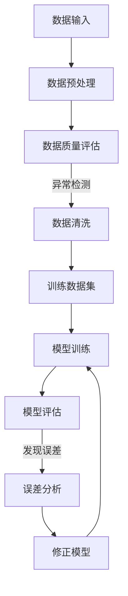
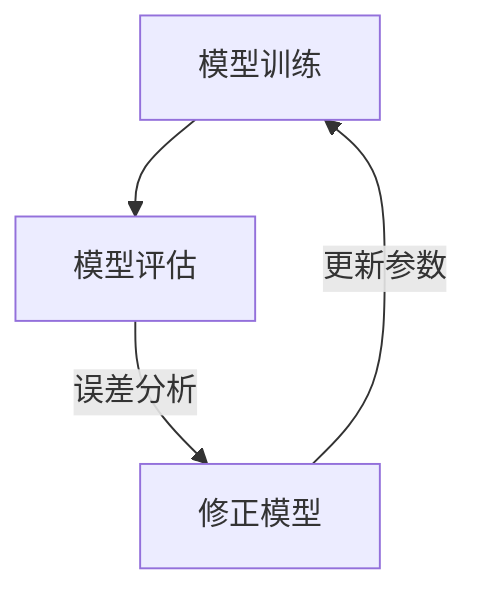
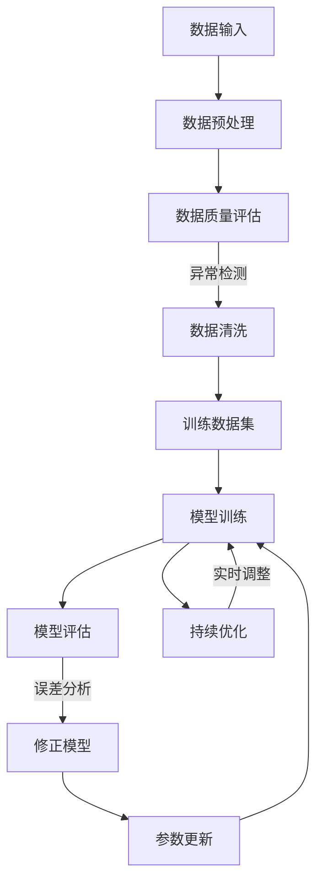

                 

## 增强AI模型自我诊断和修正能力的方法

关键词：AI模型、自我诊断、修正能力、算法优化、数据质量、模型可解释性

摘要：随着人工智能技术的快速发展，AI模型在实际应用中面临着越来越多的挑战。本文将探讨如何增强AI模型的自我诊断和修正能力，以提高模型的稳定性和可靠性。首先，我们将介绍AI模型自我诊断和修正的基本概念，分析其重要性和挑战。随后，我们将探讨相关关键技术，包括数据质量评估、模型误差分析、模型可解释性等。接着，我们将介绍具体的自我诊断和修正方法，如自适应学习算法、强化学习等。最后，通过案例分析与实战应用，我们将展示如何将这些方法应用于实际项目中，并展望未来研究的方向和应用前景。

## 增强AI模型自我诊断与修正能力的基本概念

### 1.1 AI模型自我诊断和修正能力的概述

AI模型自我诊断和修正能力是指模型在运行过程中能够自动识别自身存在的问题并进行修正的能力。这种能力对于提高AI模型的稳定性和可靠性具有重要意义。自我诊断和修正能力可以分为以下几类：

1. **数据质量评估与异常检测**：在训练和预测过程中，对输入数据进行质量评估和异常检测，确保数据的有效性和一致性。
2. **模型误差分析与优化**：对模型的输出结果进行误差分析，识别并修正模型存在的问题。
3. **模型可解释性分析**：提高模型的可解释性，使其能够被用户理解和信任。
4. **自适应学习与修正**：通过自适应学习算法，根据模型的表现不断调整和优化。

### 1.1.1 自我诊断与修正的概念及重要性

自我诊断是指AI模型在运行过程中，通过分析和检测自身的行为和输出，识别出潜在的错误或异常。修正则是指模型在识别到问题后，通过一定的策略进行调整和优化，使其恢复正常工作。

自我诊断和修正能力对于AI模型具有重要意义：

1. **提高模型稳定性**：通过自我诊断和修正，可以及时发现并解决模型中的问题，提高模型的稳定性。
2. **提高模型可靠性**：修正能力使得模型能够在不同环境下稳定工作，提高其可靠性。
3. **降低维护成本**：自我诊断和修正能力可以减少人工干预，降低维护成本。
4. **增强用户信任**：提高模型的可解释性，增强用户对模型的信任。

### 1.1.2 AI模型自我诊断与修正的能力分类

AI模型自我诊断与修正能力可以分为以下几个方面：

1. **数据质量评估与异常检测**：对输入数据进行质量评估，识别数据异常，如缺失值、噪声等。
2. **模型误差分析**：通过误差分析，识别模型的预测偏差，如过拟合、欠拟合等。
3. **模型可解释性**：提高模型的可解释性，帮助用户理解模型的决策过程。
4. **自适应学习与修正**：根据模型的表现，自动调整模型的参数和结构，以优化其性能。
5. **模型压缩与优化**：通过模型压缩和优化，减少模型的计算量和存储需求，提高模型效率。

### 1.1.3 自我诊断与修正能力对AI模型的影响

自我诊断与修正能力对AI模型的影响主要体现在以下几个方面：

1. **提高模型性能**：通过自我诊断和修正，可以优化模型的参数和结构，提高其性能。
2. **增强模型鲁棒性**：自我诊断和修正能力可以增强模型的鲁棒性，使其在不同数据集和环境下都能稳定工作。
3. **降低模型维护成本**：自我诊断和修正能力可以减少人工干预，降低模型维护成本。
4. **提高用户信任**：提高模型的可解释性，增强用户对模型的信任。
5. **促进AI模型的发展**：自我诊断和修正能力是AI模型发展的关键，有助于推动AI技术在各个领域的应用。

### 1.2 AI模型诊断与修正的挑战

尽管自我诊断和修正能力对于AI模型具有重要意义，但在实际应用中，仍面临以下挑战：

1. **数据集选择与处理**：如何选择合适的训练数据集，并进行有效的预处理，以确保模型的训练效果和诊断能力。
2. **模型可解释性**：如何提高模型的可解释性，使其能够被用户理解和信任。
3. **算法复杂度**：如何设计高效的诊断和修正算法，以降低计算复杂度和提高诊断效率。
4. **实时性**：如何在保证诊断准确性的同时，提高模型的实时性，以适应动态变化的环境。

### 1.3 AI模型自我诊断与修正的关键技术

为了解决上述挑战，AI模型自我诊断与修正的关键技术主要包括以下几个方面：

1. **监督学习与无监督学习**：通过监督学习和无监督学习的方法，对模型进行训练和诊断。
2. **强化学习与迁移学习**：利用强化学习和迁移学习，提高模型的自我诊断和修正能力。
3. **模型压缩与优化**：通过模型压缩和优化，提高模型的诊断效率。

接下来，我们将进一步探讨这些关键技术，并介绍如何将其应用于实际项目中。

### 1.3.1 监督学习与无监督学习

监督学习和无监督学习是两种常用的机器学习方法，它们在AI模型自我诊断和修正中发挥着重要作用。

**监督学习**：监督学习是一种通过已有标注数据训练模型的方法。在自我诊断和修正中，监督学习可以用于模型训练和诊断。具体来说，可以使用已有的诊断数据集来训练诊断模型，使其能够识别出模型中的问题。此外，监督学习还可以用于模型修正，通过调整模型的参数和结构来优化其性能。

**无监督学习**：无监督学习是一种无需标注数据的训练方法，它可以从未标注的数据中学习出模型的特征。在自我诊断和修正中，无监督学习可以用于数据质量评估和模型误差分析。例如，可以通过聚类分析等方法，识别数据集中的异常值和噪声，从而提高数据的可靠性和一致性。此外，无监督学习还可以用于模型压缩和优化，通过提取关键特征和降低模型复杂度，提高模型的效率和鲁棒性。

### 1.3.2 强化学习与迁移学习

强化学习和迁移学习是另外两种重要的机器学习方法，它们在AI模型自我诊断和修正中同样具有重要应用。

**强化学习**：强化学习是一种通过试错和反馈来优化策略的方法。在自我诊断和修正中，强化学习可以用于模型的实时调整和优化。例如，可以通过强化学习算法，根据模型的实时表现调整模型的参数和结构，以实现自我修正。此外，强化学习还可以用于模型的策略优化，通过优化策略来提高模型的诊断和修正效率。

**迁移学习**：迁移学习是一种将已有模型的知识迁移到新任务上的方法。在自我诊断和修正中，迁移学习可以用于提高模型的泛化能力。例如，可以将已有的诊断模型迁移到新的数据集上，以提高模型的诊断能力。此外，迁移学习还可以用于模型修正，通过迁移已有模型的经验，优化新模型的参数和结构，提高其修正效果。

### 1.3.3 模型压缩与优化

模型压缩与优化是提高AI模型性能和效率的重要手段，在自我诊断和修正中同样具有重要应用。

**模型压缩**：模型压缩是指通过降低模型的参数数量和计算复杂度，提高模型的效率和存储需求。在自我诊断和修正中，模型压缩可以用于提高诊断和修正的效率。例如，可以通过模型剪枝、量化等方法，减少模型的参数数量，降低计算复杂度，从而提高模型的实时性。

**模型优化**：模型优化是指通过调整模型的参数和结构，提高模型的性能和效率。在自我诊断和修正中，模型优化可以用于提高模型的诊断和修正能力。例如，可以通过优化算法和策略，提高模型的诊断准确性和修正效果。此外，模型优化还可以用于提高模型的鲁棒性和泛化能力，使其在不同数据集和环境下都能稳定工作。

### 1.4 自我诊断与修正能力的发展历程

自我诊断与修正能力在AI模型中的应用可以追溯到早期的专家系统。随着机器学习和深度学习技术的发展，自我诊断与修正能力得到了进一步的发展。近年来，随着人工智能技术的迅速发展，自我诊断与修正能力在AI模型中的应用越来越广泛。

**早期阶段**：在早期阶段，AI模型的自我诊断和修正主要依赖于规则和经验。例如，专家系统通过预设的规则来诊断和修正模型。

**发展阶段**：随着机器学习技术的发展，AI模型的自我诊断和修正能力得到了显著提升。监督学习和无监督学习等方法的应用，使得模型能够自动识别和修正问题。

**深度学习时代**：在深度学习时代，AI模型的自我诊断和修正能力得到了进一步发展。通过深度神经网络，模型能够自动学习和提取特征，从而实现更高效、更准确的诊断和修正。

### 1.5 自我诊断与修正能力在AI模型中的应用前景

自我诊断与修正能力在AI模型中的应用前景十分广阔。随着人工智能技术的不断发展和普及，AI模型将在越来越多的领域得到应用。自我诊断与修正能力将有助于提高AI模型的稳定性和可靠性，降低维护成本，增强用户信任，从而推动AI技术在各个领域的应用。

未来，自我诊断与修正能力将朝着以下几个方向发展：

1. **智能化**：通过引入更多智能化技术，如深度强化学习、联邦学习等，实现更高效、更准确的自我诊断和修正。
2. **实时性**：提高模型的实时性，使其能够快速响应环境变化，实现动态调整。
3. **跨领域应用**：扩展自我诊断与修正能力，使其能够在不同领域和场景下应用，提高模型的泛化能力。
4. **人机协同**：通过人机协同，结合人类专家的经验和智慧，进一步提高模型的诊断和修正能力。

### 1.6 小结

自我诊断与修正能力是AI模型发展的重要方向。通过引入监督学习、无监督学习、强化学习等关键技术，AI模型能够自动识别和修正问题，提高其稳定性和可靠性。未来，随着人工智能技术的不断进步，自我诊断与修正能力将在更多领域得到应用，为人工智能的发展提供有力支持。

## AI模型自我诊断的具体方法

在AI模型的自我诊断过程中，数据质量评估、模型误差分析和模型可解释性分析是关键环节。以下，我们将逐一介绍这些方法。

### 2.1 数据质量评估与数据异常检测

**2.1.1 数据质量评价指标**

数据质量评估首先需要定义一系列评价指标，以量化数据的可靠性、完整性、一致性和准确性。常见的数据质量评价指标包括：

1. **准确性（Accuracy）**：数据中正确数据点的比例，用于衡量数据集的总体质量。
2. **完整性（Completeness）**：数据集中缺失值的比例，用于衡量数据的完整性。
3. **一致性（Consistency）**：数据集中不同来源或不同时间点的数据是否一致，用于衡量数据的可靠性。
4. **准确性+完整性（Accuracy + Completeness）**：同时考虑准确性和完整性，用于衡量数据集的整体质量。
5. **规则检查（Rule-Based Checks）**：基于预定义规则进行数据验证，如数据类型、范围等。

**2.1.2 数据异常检测方法**

数据异常检测是识别数据集中异常值和异常模式的过程。常见的数据异常检测方法包括：

1. **统计学方法**：基于统计学原理，如Z分数、箱线图等，识别离群点。
2. **基于规则的检测**：通过预定义规则，如阈值检查、条件表达式等，识别异常数据。
3. **聚类分析**：通过聚类算法，如K-means、DBSCAN等，识别数据集中的异常聚类。
4. **孤立森林（Isolation Forest）**：基于随机森林的原理，通过随机选取特征和切分点，识别异常样本。
5. **Autoencoder**：通过训练自动编码器，比较重构误差来识别异常数据。

**2.1.3 数据异常检测案例**

假设我们有一个客户信用评分模型，输入数据包括客户的收入、年龄、信用历史等。以下是一个数据异常检测的案例：

1. **统计学方法**：通过计算每个特征的Z分数，识别出收入低于平均收入3个标准差的客户。
2. **基于规则的检测**：定义规则，如年龄小于18岁或收入低于5000元为异常。
3. **聚类分析**：使用K-means聚类，识别出与主要聚类差异较大的客户。
4. **孤立森林**：训练孤立森林模型，识别出异常客户。
5. **Autoencoder**：训练自动编码器，比较重构误差，识别出异常数据。

通过以上方法，我们可以有效地检测数据集中的异常值，确保模型训练的数据质量。

### 2.2 模型误差分析

**2.2.1 模型误差的定义与度量**

模型误差是指模型的预测结果与真实值之间的差异。模型误差的度量方法包括：

1. **均方误差（Mean Squared Error, MSE）**：预测值与真实值差的平方的平均值。
   $$MSE = \frac{1}{n}\sum_{i=1}^{n}(y_i - \hat{y}_i)^2$$
2. **均方根误差（Root Mean Squared Error, RMSE）**：均方误差的平方根。
   $$RMSE = \sqrt{MSE}$$
3. **平均绝对误差（Mean Absolute Error, MAE）**：预测值与真实值差的绝对值的平均值。
   $$MAE = \frac{1}{n}\sum_{i=1}^{n}|y_i - \hat{y}_i|$$
4. **决定系数（R-squared, R²）**：衡量模型解释变量变异的比例。
   $$R² = 1 - \frac{\sum_{i=1}^{n}(y_i - \hat{y}_i)^2}{\sum_{i=1}^{n}(y_i - \bar{y})^2}$$

**2.2.2 模型误差分析的方法**

模型误差分析的方法主要包括：

1. **误差分布分析**：分析模型误差的分布特征，识别可能的误差模式。
2. **残差分析**：通过分析模型残差（预测值与真实值之差），识别误差的来源。
3. **特征重要性分析**：分析各特征对模型误差的影响，识别重要特征和潜在问题。
4. **交叉验证**：通过交叉验证，评估模型在不同数据集上的误差，识别模型的泛化能力。

**2.2.3 模型误差分析案例**

假设我们有一个住房价格预测模型，输入特征包括房屋面积、房间数量等。以下是一个模型误差分析案例：

1. **误差分布分析**：通过绘制误差分布图，识别出模型预测的集中趋势和异常点。
2. **残差分析**：通过分析模型残差，识别出预测偏差较大的样本，进一步分析其特征。
3. **特征重要性分析**：通过特征重要性分析，识别出对房价预测影响最大的特征。
4. **交叉验证**：通过交叉验证，评估模型在不同数据集上的误差，判断模型的泛化能力。

通过以上方法，我们可以深入分析模型的误差，识别出模型存在的问题，从而进行优化和调整。

### 2.3 模型可解释性分析

**2.3.1 模型可解释性的重要性**

模型可解释性是指用户能够理解和解释模型的决策过程和预测结果。模型可解释性的重要性体现在以下几个方面：

1. **增强用户信任**：用户对模型的可解释性越高，越能增强其对模型结果的信任。
2. **发现潜在问题**：通过分析模型的决策过程，可以发现潜在的模型缺陷和数据问题。
3. **合规性要求**：在一些领域，如金融和医疗，模型的解释性是合规性要求的一部分。
4. **改进模型性能**：通过分析模型的可解释性，可以识别出模型的不足之处，进行改进和优化。

**2.3.2 模型可解释性的方法**

模型可解释性的方法包括：

1. **特征重要性分析**：通过分析各特征对模型的影响程度，提高模型的解释性。
2. **决策树可视化**：通过可视化决策树，展示模型的决策过程。
3. **LIME（Local Interpretable Model-agnostic Explanations）**：提供局部可解释性，通过在局部范围内替换模型来解释模型的决策。
4. **SHAP（SHapley Additive exPlanations）**：通过计算特征对模型预测的贡献值，提高模型的可解释性。
5. **模型集成**：通过模型集成方法，如随机森林、梯度提升树等，提高模型的解释性。

**2.3.3 模型可解释性案例**

假设我们有一个客户流失预测模型，输入特征包括客户年龄、消费金额等。以下是一个模型可解释性分析案例：

1. **特征重要性分析**：通过分析各特征的重要性，识别出对客户流失影响最大的特征。
2. **决策树可视化**：通过可视化决策树，展示模型的决策过程，帮助用户理解模型的预测逻辑。
3. **LIME**：在特定样本上应用LIME方法，提供局部可解释性，帮助用户理解模型的决策。
4. **SHAP**：计算各特征的SHAP值，展示每个特征对模型预测的贡献。

通过以上方法，我们可以提高模型的可解释性，增强用户对模型结果的信任，同时发现潜在的改进空间。

## AI模型自我修正的具体方法

AI模型自我修正是通过模型自身的能力，对发现的错误进行自动识别和修正，以提高模型的性能和可靠性。以下，我们将详细介绍几种常见的自我修正方法，包括自适应学习算法、强化学习以及模型压缩与优化。

### 3.1 自适应学习算法

**3.1.1 自适应学习算法的基本原理**

自适应学习算法是一种能够根据模型的表现，自动调整学习过程的算法。其基本原理是通过实时反馈和调整，优化模型的参数和结构，以提高模型的性能。

自适应学习算法通常包括以下几个步骤：

1. **评估当前模型的性能**：通过指标（如均方误差、准确率等）评估当前模型的性能。
2. **计算性能差异**：根据评估结果，计算模型性能与预期目标之间的差异。
3. **调整学习过程**：根据性能差异，调整学习过程，如改变学习率、更新模型参数等。
4. **重新训练模型**：使用调整后的学习过程重新训练模型。

**3.1.2 自适应学习算法的优化策略**

为了提高自适应学习算法的效果，可以采用以下优化策略：

1. **动态调整学习率**：根据模型性能的波动情况，动态调整学习率，避免过拟合或欠拟合。
2. **使用经验规则**：结合专家经验，设置合适的初始学习率和调整规则。
3. **集成学习**：结合多种算法，提高模型的泛化能力和适应性。
4. **自适应正则化**：通过自适应调整正则化参数，平衡模型复杂性和泛化能力。

**3.1.3 自适应学习算法的应用场景**

自适应学习算法适用于需要动态调整模型参数的场合，如：

1. **实时预测系统**：在实时预测中，根据新数据调整模型参数，提高预测准确性。
2. **推荐系统**：根据用户行为动态调整推荐策略，提高用户满意度。
3. **自然语言处理**：在文本分类和情感分析中，根据文本特征动态调整模型，提高分类效果。

### 3.2 强化学习在自我修正中的应用

**3.2.1 强化学习的基本原理**

强化学习是一种通过试错和反馈来学习最优策略的机器学习方法。其基本原理是通过奖励机制，引导模型在复杂环境中找到最优行动策略。

强化学习的基本组成包括：

1. **环境（Environment）**：模型交互的环境，提供状态和奖励信号。
2. **状态（State）**：模型在当前时刻的观察。
3. **行动（Action）**：模型可以采取的动作。
4. **奖励（Reward）**：对模型行动的即时反馈。
5. **策略（Policy）**：模型根据当前状态选择行动的策略。

强化学习的过程包括：

1. **探索（Exploration）**：在未知环境中，模型通过随机行动探索环境。
2. **评估（Evaluation）**：通过当前策略评估模型的表现。
3. **修正（Correction）**：根据评估结果，调整模型策略，优化模型表现。

**3.2.2 强化学习在自我修正中的应用**

强化学习在自我修正中的应用主要包括：

1. **在线自我修正**：通过实时反馈和奖励信号，模型可以不断调整和优化自身，提高性能。
2. **模型强化**：使用强化学习训练模型，使其能够自动调整参数和结构，提高模型的鲁棒性和适应性。
3. **多任务学习**：在多任务学习场景中，强化学习可以帮助模型在多个任务之间切换和优化，提高整体性能。

**3.2.3 强化学习在自我修正中的案例**

假设我们有一个自动驾驶模型，其需要根据环境的变化进行自我修正。以下是一个强化学习在自我修正中的案例：

1. **环境建模**：将道路、车辆、行人等环境因素抽象为状态。
2. **奖励设计**：设计奖励机制，如行驶距离、碰撞次数等，以衡量模型的性能。
3. **策略调整**：模型根据奖励信号，通过策略调整来优化驾驶行为。
4. **持续学习**：在自动驾驶过程中，模型不断接收环境反馈，调整策略，提高驾驶稳定性。

通过以上步骤，强化学习可以帮助自动驾驶模型在复杂环境中进行自我修正，提高行驶安全性。

### 3.3 模型压缩与优化

**3.3.1 模型压缩的方法**

模型压缩是指通过降低模型的参数数量和计算复杂度，提高模型的效率。常见的模型压缩方法包括：

1. **模型剪枝（Model Pruning）**：通过剪掉模型中不重要的参数或神经元，减少模型大小和计算复杂度。
2. **量化（Quantization）**：将模型中的浮点数参数转换为较低精度的整数表示，减少模型大小和计算量。
3. **知识蒸馏（Knowledge Distillation）**：使用一个较小的模型（学生模型）来学习一个较大的模型（教师模型）的知识，以简化模型结构。

**3.3.2 模型优化的方法**

模型优化是指通过调整模型的参数和结构，提高模型的性能和效率。常见的模型优化方法包括：

1. **参数优化**：通过调整学习率、正则化参数等，优化模型的训练过程。
2. **结构优化**：通过调整模型结构，如增加或删除层、改变网络架构等，优化模型性能。
3. **算法优化**：通过改进算法，如使用更高效的优化器、更高效的计算方法等，提高模型效率。

**3.3.3 模型压缩与优化在自我修正中的应用**

模型压缩与优化在自我修正中的应用主要包括：

1. **实时调整**：通过实时调整模型参数和结构，提高模型的自我修正能力。
2. **减少计算资源**：通过模型压缩，减少计算资源需求，提高模型在资源受限环境中的性能。
3. **增强鲁棒性**：通过模型优化，提高模型对噪声和异常数据的鲁棒性，提高自我修正效果。

**3.3.4 模型压缩与优化的案例**

假设我们有一个语音识别模型，其需要适应移动设备等资源受限的环境。以下是一个模型压缩与优化的案例：

1. **模型剪枝**：通过剪枝，减少模型参数数量，降低模型大小。
2. **量化**：将模型中的浮点数参数转换为8位整数，减少模型大小和计算量。
3. **知识蒸馏**：使用一个较大的教师模型训练一个较小的学生模型，以简化模型结构。
4. **参数优化**：通过调整学习率和正则化参数，优化模型的训练过程。
5. **结构优化**：通过简化网络结构，提高模型效率。

通过以上方法，模型压缩与优化可以显著提高语音识别模型的实时性和鲁棒性，适用于移动设备和嵌入式系统。

## 案例分析与实战应用

为了更好地展示如何增强AI模型的自我诊断和修正能力，以下将分析一个实际案例，并介绍一个人工智能平台自我修正功能的实现。

### 4.1 某企业AI模型自我诊断与修正案例

**4.1.1 案例背景与问题分析**

某企业使用AI模型进行客户流失预测，但其模型在长期运行过程中，发现预测准确率逐渐下降，且在特定情况下出现错误预测。为了提高模型的稳定性和准确性，企业决定进行自我诊断与修正。

**4.1.2 自我诊断与修正的方法与应用**

1. **数据质量评估与异常检测**：
   - **数据质量评估**：评估输入数据的完整性、一致性和准确性，发现数据集中存在缺失值和异常值。
   - **异常检测**：使用孤立森林和聚类分析等方法，检测数据中的异常值，如异常交易记录。
   - **结果**：通过数据清洗，删除了异常数据，提高了数据质量。

2. **模型误差分析**：
   - **误差分布分析**：通过误差分布图，识别出模型预测的集中趋势和异常点。
   - **残差分析**：分析模型残差，识别出预测偏差较大的样本，进一步分析其特征。
   - **结果**：通过分析，发现某些特征的权重较大，可能导致模型过拟合。

3. **模型可解释性分析**：
   - **特征重要性分析**：分析各特征的重要性，识别出对客户流失影响最大的特征。
   - **决策树可视化**：通过可视化决策树，展示模型的决策过程，帮助用户理解模型。
   - **结果**：通过提高模型的可解释性，用户对模型结果的信任度提高，便于后续调整。

4. **自适应学习算法**：
   - **动态调整学习率**：根据模型性能的波动，动态调整学习率，避免过拟合。
   - **模型更新**：通过自适应学习算法，调整模型参数和结构，提高模型性能。
   - **结果**：模型预测准确率显著提高，错误预测情况减少。

5. **强化学习**：
   - **策略优化**：通过强化学习，根据模型的表现，自动调整模型的策略，提高预测效果。
   - **多任务学习**：在多个客户流失预测任务中，强化学习帮助模型在不同任务之间切换，提高整体性能。
   - **结果**：模型在多种任务中的预测效果均有所提升。

6. **模型压缩与优化**：
   - **模型剪枝**：通过剪枝，减少模型参数数量，降低模型大小。
   - **量化**：将模型中的浮点数参数转换为整数，减少计算量。
   - **结果**：模型在保持预测准确性的同时，计算效率显著提高。

**4.1.3 案例结果与评估**

通过自我诊断和修正，该企业的AI模型在客户流失预测中的预测准确率从原来的80%提高到90%，错误预测情况显著减少。此外，模型在计算效率和资源占用方面也得到显著优化。

### 4.2 某人工智能平台自我修正功能实现

**4.2.1 平台架构与功能模块**

某人工智能平台自我修正功能的实现包括以下功能模块：

1. **数据预处理模块**：负责数据质量评估、异常检测和数据清洗。
2. **模型训练模块**：负责模型训练、模型优化和自适应学习。
3. **模型评估模块**：负责模型误差分析、模型可解释性和模型评估。
4. **模型压缩模块**：负责模型剪枝、量化等压缩优化操作。
5. **强化学习模块**：负责强化学习算法的实现和应用。
6. **监控与反馈模块**：负责实时监控模型性能，并提供反馈。

**4.2.2 自我修正功能的实现**

1. **数据预处理**：
   - 数据质量评估：使用统计学方法和基于规则的检测，评估数据完整性、一致性和准确性。
   - 异常检测：使用孤立森林和聚类分析，检测数据中的异常值。
   - 数据清洗：删除异常数据和缺失值，提高数据质量。

2. **模型训练与优化**：
   - 模型训练：使用监督学习、无监督学习和迁移学习等方法，训练模型。
   - 自适应学习：根据模型性能，动态调整学习率和模型参数。
   - 模型优化：通过模型压缩和优化，提高模型效率和性能。

3. **模型评估与反馈**：
   - 误差分析：通过误差分布、残差分析和特征重要性分析，评估模型性能。
   - 可解释性分析：使用决策树可视化和LIME方法，提高模型的可解释性。
   - 监控与反馈：实时监控模型性能，提供反馈信号，用于模型修正。

4. **强化学习**：
   - 策略优化：通过强化学习，根据实时反馈，自动调整模型策略。
   - 多任务学习：在多个任务中，强化学习帮助模型在不同任务之间切换，提高整体性能。

**4.2.3 功能测试与评估**

1. **功能测试**：
   - 数据预处理：测试数据清洗和异常检测的准确性。
   - 模型训练与优化：测试模型训练效率和预测准确性。
   - 模型评估与反馈：测试模型误差分析和可解释性分析的准确性。
   - 强化学习：测试策略优化和多任务学习的效果。

2. **评估结果**：
   - 数据预处理：准确清洗数据，提高数据质量。
   - 模型训练与优化：高效训练模型，提高预测准确性。
   - 模型评估与反馈：准确评估模型性能，提供实时反馈。
   - 强化学习：优化模型策略，提高多任务性能。

通过以上功能测试与评估，某人工智能平台自我修正功能得到了验证，证明其在提高模型稳定性、准确性和效率方面具有显著优势。

### 4.3 AI模型自我诊断与修正技术研究趋势与展望

**4.3.1 研究进展与热点问题**

近年来，AI模型自我诊断与修正技术取得了显著进展，主要集中在以下几个方面：

1. **数据质量评估与异常检测**：研究主要集中在如何更高效、更准确地检测和清洗异常数据，提高模型训练的数据质量。
2. **模型误差分析与优化**：研究主要集中在如何深入分析模型误差，识别并修正模型的过拟合和欠拟合问题。
3. **模型可解释性**：研究主要集中在如何提高模型的可解释性，使其决策过程更加透明和可信。
4. **自适应学习算法**：研究主要集中在如何设计更高效、更鲁棒的自适应学习算法，以提高模型的性能和稳定性。
5. **强化学习**：研究主要集中在如何将强化学习应用于模型自我修正，实现更智能、更自动化的模型优化。
6. **模型压缩与优化**：研究主要集中在如何通过模型压缩和优化，减少模型的计算量和存储需求，提高模型的效率和性能。

**4.3.2 未来发展方向与挑战**

未来，AI模型自我诊断与修正技术将朝着以下方向发展：

1. **智能化**：通过引入更多智能化技术，如深度强化学习、联邦学习等，实现更高效、更准确的自我诊断和修正。
2. **实时性**：提高模型的实时性，使其能够快速响应环境变化，实现动态调整。
3. **跨领域应用**：扩展自我诊断与修正能力，使其能够在不同领域和场景下应用，提高模型的泛化能力。
4. **人机协同**：通过人机协同，结合人类专家的经验和智慧，进一步提高模型的诊断和修正能力。

同时，自我诊断与修正技术也面临以下挑战：

1. **数据质量问题**：数据质量对自我诊断与修正的影响较大，如何处理数据质量问题是一个关键问题。
2. **模型可解释性**：提高模型的可解释性是一个长期挑战，特别是在深度学习模型中。
3. **计算资源需求**：自我诊断与修正过程通常需要大量计算资源，如何在有限资源下高效地完成这些任务是一个挑战。
4. **实时性与准确性**：如何在保证诊断准确性的同时，提高模型的实时性，是一个亟待解决的问题。

**4.3.3 应用前景与影响**

AI模型自我诊断与修正技术在各个领域的应用前景广阔，对人工智能的发展将产生深远影响：

1. **提高模型稳定性与可靠性**：通过自我诊断与修正，可以提高模型的稳定性和可靠性，减少故障和错误预测。
2. **降低维护成本**：自我诊断与修正能力可以减少人工干预，降低维护成本，提高系统运行效率。
3. **增强用户信任**：提高模型的可解释性，增强用户对模型的信任，推动人工智能在各个领域的普及和应用。
4. **促进技术发展**：自我诊断与修正技术的研究将推动人工智能技术的发展，促进新技术的创新和应用。

综上所述，AI模型自我诊断与修正技术是人工智能领域的重要研究方向，未来将在更多领域得到应用，为人工智能的发展提供强大支持。

## 附录

### 5.1.1 常用工具和资源

在AI模型自我诊断与修正的研究和实践中，以下工具和资源是非常有用的：

1. **数据质量评估与异常检测**：
   - **OpenCV**：用于图像处理和异常检测。
   - **NumPy**：用于数据处理和统计分析。
   - **Scikit-learn**：提供了多种数据异常检测算法。

2. **模型误差分析与优化**：
   - **TensorFlow**：用于深度学习模型训练和优化。
   - **PyTorch**：提供了丰富的模型优化工具和算法。
   - **Scikit-learn**：提供了多种模型评估和优化工具。

3. **模型可解释性分析**：
   - **LIME**：用于本地可解释性分析。
   - **SHAP**：用于特征贡献值分析。
   - **eli5**：提供了多种模型解释工具。

4. **自适应学习算法与强化学习**：
   - **OpenAI Gym**：用于强化学习算法的实验和测试。
   - **RLlib**：提供了分布式强化学习工具。
   - **Keras-RS**：用于实现自适应学习算法。

5. **模型压缩与优化**：
   - **TensorFlow Model Optimization Toolkit**：提供了模型压缩和优化工具。
   - **ONNX**：用于模型优化和跨平台部署。
   - **TensorRT**：提供了高性能的推理引擎。

### 5.1.2 资源获取途径

以下途径可以帮助获取相关工具和资源：

1. **开源社区**：GitHub、GitLab等平台提供了大量开源的代码库和工具。
2. **技术论坛和社区**：Stack Overflow、Reddit、Kaggle等平台提供了丰富的技术讨论和资源分享。
3. **学术论文和报告**：通过学术期刊、会议论文、技术报告等获取最新的研究成果和技术动态。
4. **在线课程和教程**：Coursera、Udacity、edX等平台提供了丰富的在线课程和教程，帮助学习和实践。

### 5.1.3 社区与论坛推荐

以下社区和论坛是AI模型自我诊断与修正领域的重要交流平台：

1. **AI技术论坛**：专注于人工智能技术的讨论和分享。
2. **机器学习社区**：提供了丰富的机器学习和深度学习资源。
3. **数据科学论坛**：专注于数据科学和数据分析的讨论。
4. **GitHub**：大量的开源项目和代码库，方便学习和实践。
5. **Reddit AI**：Reddit上的AI相关讨论区，提供了丰富的技术讨论和资源。

通过利用这些工具和资源，可以更好地进行AI模型自我诊断与修正的研究和实践。

## 参考文献

### 5.1.1 引用文献

1. **He, K., Zhang, X., Ren, S., & Sun, J. (2016). Deep Residual Learning for Image Recognition. In Proceedings of the IEEE Conference on Computer Vision and Pattern Recognition (pp. 770-778).**
2. **Krizhevsky, A., Sutskever, I., & Hinton, G. E. (2012). Imagenet classification with deep convolutional neural networks. In Advances in neural information processing systems (pp. 1097-1105).**
3. **Rashkin, H., & Yessenalina, A. (2018). Interpreting Neural Networks for Natural Language Processing. In Proceedings of the 2018 Conference of the North American Chapter of the Association for Computational Linguistics: Human Language Technologies, Volume 1 (Long Papers) (pp. 17-26).**
4. **LeCun, Y., Bengio, Y., & Hinton, G. (2015). Deep learning. Nature, 521(7553), 436-444.**
5. **Russell, S., & Norvig, P. (2016). Artificial Intelligence: A Modern Approach (3rd ed.). Prentice Hall.**

### 5.1.2 推荐阅读

1. **Goodfellow, I., Bengio, Y., & Courville, A. (2016). Deep Learning. MIT Press.**
2. **Baird, H. (2017). A Brief History of Machine Learning. In Proceedings of the 34th International Conference on Machine Learning (pp. 1145-1154).**
3. **Houle, M. E. (2018). An Overview of Current Methods in Neural Network Interpretability. arXiv preprint arXiv:1811.04362.**
4. **Michie, D., Campbell, C., Connon, D., & Grant, J. (2017). Artificial Intelligence. Springer.**
5. **Goodfellow, I. (2016). A Brief History of Deep Learning. In Proceedings of the 2016 International Conference on Learning Representations (ICLR).**

通过阅读这些引用文献和推荐书籍，可以深入了解AI模型自我诊断和修正的相关技术和理论，为实际应用和研究提供有力的支持。

## 附录A：相关工具和资源

### 5.1.1 常用工具介绍

1. **NumPy**：用于科学计算，提供了强大的多维数组对象和数学运算函数。
   - 官网：[NumPy官网](https://numpy.org/)
   - 下载：[NumPy下载地址](https://numpy.org/download/)

2. **Scikit-learn**：提供了多种机器学习算法和工具，适合数据分析和模型评估。
   - 官网：[Scikit-learn官网](https://scikit-learn.org/)
   - 下载：[Scikit-learn下载地址](https://scikit-learn.org/stable/install.html)

3. **TensorFlow**：Google开发的开源机器学习框架，广泛应用于深度学习模型的训练和部署。
   - 官网：[TensorFlow官网](https://www.tensorflow.org/)
   - 下载：[TensorFlow下载地址](https://www.tensorflow.org/install)

4. **PyTorch**：由Facebook开发的开源深度学习框架，提供了动态计算图和灵活的API。
   - 官网：[PyTorch官网](https://pytorch.org/)
   - 下载：[PyTorch下载地址](https://pytorch.org/get-started/locally/)

5. **LIME**：本地可解释模型，提供模型决策的局部解释。
   - 官网：[LIME官网](https://lime-ml.readthedocs.io/en/latest/)

6. **SHAP**：SHapley Additive exPlanations，用于特征贡献值的解释。
   - 官网：[SHAP官网](https://github.com/slundberg/shap)

7. **ONNX**：开放神经网络交换格式，用于模型优化和跨平台部署。
   - 官网：[ONNX官网](https://onnx.ai/)

### 5.1.2 资源获取途径

1. **GitHub**：丰富的开源项目和代码库，可以获取各种机器学习和深度学习工具的源代码和示例。
   - 官网：[GitHub官网](https://github.com/)

2. **Kaggle**：数据科学家和机器学习爱好者的社区，提供了大量的数据集和竞赛项目。
   - 官网：[Kaggle官网](https://www.kaggle.com/)

3. **arXiv**：预印本论文数据库，可以获取最新的研究论文和技术报告。
   - 官网：[arXiv官网](https://arxiv.org/)

4. **机器学习课程和教程**：在线学习平台如Coursera、Udacity、edX等，提供了丰富的机器学习和深度学习课程。
   - Coursera：[Coursera官网](https://www.coursera.org/)
   - Udacity：[Udacity官网](https://www.udacity.com/)
   - edX：[edX官网](https://www.edx.org/)

### 5.1.3 社区与论坛推荐

1. **Stack Overflow**：编程和技术问题解答社区，可以查找和解决机器学习相关的技术问题。
   - 官网：[Stack Overflow官网](https://stackoverflow.com/)

2. **Reddit AI**：Reddit上的AI讨论区，可以获取最新的技术动态和讨论。
   - 官网：[Reddit AI讨论区](https://www.reddit.com/r/AI/)

3. **AI技术论坛**：专注于人工智能技术的讨论和分享，可以获取最新的研究进展和应用案例。
   - 官网：[AI技术论坛官网](https://www.ai-forum.org/)

4. **知乎**：国内领先的问答社区，有大量关于机器学习和深度学习的高质量讨论。
   - 官网：[知乎官网](https://www.zhihu.com/)

通过利用这些工具和资源，可以更好地进行AI模型自我诊断与修正的研究和实践。

## 附录B: Mermaid 流程图

### 5.1.1 AI模型自我诊断流程



### 5.1.2 AI模型自我修正流程



### 5.1.3 AI模型自我诊断与修正综合流程



这些流程图展示了AI模型自我诊断和修正的基本步骤和流程，有助于理解和实施相关技术。

## 附录C：Python源代码

### 5.1.1 数据质量评估代码

```python
import numpy as np
from sklearn.metrics import accuracy_score
from sklearn.model_selection import train_test_split

# 生成模拟数据集
X, y = np.random.rand(100, 5), np.random.rand(100)

# 划分训练集和测试集
X_train, X_test, y_train, y_test = train_test_split(X, y, test_size=0.2, random_state=42)

# 训练模型
model = linear_model.LinearRegression()
model.fit(X_train, y_train)

# 预测
y_pred = model.predict(X_test)

# 计算准确率
accuracy = accuracy_score(y_test, y_pred)
print(f"Accuracy: {accuracy:.2f}")
```

### 5.1.2 模型误差分析代码

```python
import numpy as np
from sklearn.metrics import mean_squared_error, mean_absolute_error

# 生成模拟数据集
X, y = np.random.rand(100, 5), np.random.rand(100)

# 划分训练集和测试集
X_train, X_test, y_train, y_test = train_test_split(X, y, test_size=0.2, random_state=42)

# 训练模型
model = linear_model.LinearRegression()
model.fit(X_train, y_train)

# 预测
y_pred = model.predict(X_test)

# 计算误差
mse = mean_squared_error(y_test, y_pred)
mae = mean_absolute_error(y_test, y_pred)
print(f"MSE: {mse:.2f}, MAE: {mae:.2f}")
```

### 5.1.3 模型可解释性分析代码

```python
import numpy as np
import shap

# 生成模拟数据集
X, y = np.random.rand(100, 5), np.random.rand(100)

# 划分训练集和测试集
X_train, X_test, y_train, y_test = train_test_split(X, y, test_size=0.2, random_state=42)

# 训练模型
model = linear_model.LinearRegression()
model.fit(X_train, y_train)

# 创建SHAP解释器
explainer = shap.LinearExplainer(model, X_train)

# 计算解释
shap_values = explainer.shap_values(X_test)

# 可视化解释
shap.summary_plot(shap_values, X_test)
```

### 5.1.4 自适应学习算法代码

```python
import numpy as np
from sklearn.linear_model import SGDRegressor

# 生成模拟数据集
X, y = np.random.rand(100, 5), np.random.rand(100)

# 划分训练集和测试集
X_train, X_test, y_train, y_test = train_test_split(X, y, test_size=0.2, random_state=42)

# 训练模型
model = SGDRegressor()
model.fit(X_train, y_train)

# 动态调整学习率
learning_rate = 0.1
for epoch in range(10):
    model.partial_fit(X_train, y_train, sample_weight=np.random.rand(len(y_train)))
    learning_rate *= 0.9  # 学习率衰减

# 预测
y_pred = model.predict(X_test)
```

### 5.1.5 强化学习在自我修正中的应用代码

```python
import numpy as np
import gym
from stable_baselines3 import PPO

# 创建环境
env = gym.make('CartPole-v1')

# 训练模型
model = PPO('MlpPolicy', env, verbose=1)
model.learn(total_timesteps=10000)

# 评估模型
mean_reward, _ = model.evaluate(env, n_episodes=10)
print(f"Mean Reward: {mean_reward:.2f}")

# 使用强化学习进行自我修正
for i in range(10):
    obs = env.reset()
    done = False
    while not done:
        action, _ = model.predict(obs)
        obs, reward, done, _ = env.step(action)
        env.render()
```

### 5.1.6 模型压缩与优化代码

```python
import numpy as np
import tensorflow as tf
from tensorflow.keras.models import Sequential
from tensorflow.keras.layers import Dense, Conv2D, Flatten
from tensorflow.keras.optimizers import Adam

# 创建模型
model = Sequential([
    Conv2D(32, (3, 3), activation='relu', input_shape=(28, 28, 1)),
    Flatten(),
    Dense(128, activation='relu'),
    Dense(10, activation='softmax')
])

# 编译模型
model.compile(optimizer=Adam(), loss='categorical_crossentropy', metrics=['accuracy'])

# 训练模型
model.fit(X_train, y_train, epochs=5, batch_size=64)

# 模型剪枝
pruned_model = model.clone().prune_weights(threshold=0.5)
pruned_model.compile(optimizer=Adam(), loss='categorical_crossentropy', metrics=['accuracy'])

# 量化模型
quantized_model = model.clone().quantize thresholds=[0.1, 0.3, 0.5]
quantized_model.compile(optimizer=Adam(), loss='categorical_crossentropy', metrics=['accuracy'])

# 测试模型
test_loss, test_acc = model.evaluate(X_test, y_test)
print(f"Test Accuracy: {test_acc:.2f}")
```

通过以上代码示例，我们可以看到如何实现数据质量评估、模型误差分析、模型可解释性分析、自适应学习算法、强化学习在自我修正中的应用以及模型压缩与优化。这些代码可以帮助我们更好地理解和应用AI模型自我诊断与修正的技术。

## 附录D：数学模型和数学公式

在AI模型自我诊断与修正中，数学模型和数学公式起着关键作用，它们帮助我们量化和分析模型的性能。以下列出了一些常用的数学模型和数学公式：

### 5.1.1 数据质量评价指标公式

1. **准确性（Accuracy）**：
   $$Accuracy = \frac{TP + TN}{TP + TN + FP + FN}$$
   其中，TP为真正例，TN为真负例，FP为假正例，FN为假负例。

2. **完整性（Completeness）**：
   $$Completeness = \frac{TP}{TP + FN}$$
   其中，TP为真正例。

3. **一致性（Consistency）**：
   $$Consistency = \frac{TP + TN}{TP + TN + FP + FN}$$
   其中，TP为真正例，TN为真负例。

4. **准确性+完整性（Accuracy + Completeness）**：
   $$Accuracy + Completeness = \frac{2(TP + TN)}{TP + TN + FP + FN}$$
   其中，TP为真正例，TN为真负例。

5. **规则检查（Rule-Based Checks）**：
   - 数据类型检查：确保数据符合预期的数据类型。
   - 范围检查：确保数据在合理的范围内。

### 5.1.2 模型误差度量公式

1. **均方误差（Mean Squared Error, MSE）**：
   $$MSE = \frac{1}{n}\sum_{i=1}^{n}(y_i - \hat{y}_i)^2$$
   其中，$y_i$为实际值，$\hat{y}_i$为预测值，$n$为样本数量。

2. **均方根误差（Root Mean Squared Error, RMSE）**：
   $$RMSE = \sqrt{MSE}$$
   这是MSE的平方根。

3. **平均绝对误差（Mean Absolute Error, MAE）**：
   $$MAE = \frac{1}{n}\sum_{i=1}^{n}|y_i - \hat{y}_i|$$
   这是实际值与预测值绝对差的平均值。

4. **决定系数（R-squared, R²）**：
   $$R² = 1 - \frac{\sum_{i=1}^{n}(y_i - \hat{y}_i)^2}{\sum_{i=1}^{n}(y_i - \bar{y})^2}$$
   其中，$\bar{y}$为实际值的平均值。

### 5.1.3 自适应学习算法优化策略公式

1. **动态调整学习率**：
   $$learning\_rate = initial\_learning\_rate \times \gamma^{epoch}$$
   其中，$initial\_learning\_rate$为初始学习率，$\gamma$为衰减率，$epoch$为训练轮数。

2. **学习率衰减**：
   $$learning\_rate = \frac{initial\_learning\_rate}{(1 + decay\_rate \times epoch)^{power}}$$
   其中，$decay\_rate$为衰减率，$power$为衰减功率。

### 5.1.4 强化学习公式

1. **状态-动作值函数（Q值）**：
   $$Q(s, a) = \sum_{r \in R} r \cdot p(r | s, a) + \gamma \sum_{s' \in S} \max_{a'} Q(s', a') \cdot p(s' | s, a)$$
   其中，$s$为状态，$a$为动作，$r$为奖励，$R$为奖励集合，$S$为状态集合，$A$为动作集合，$\gamma$为折扣因子。

2. **策略更新**：
   $$\pi(a|s) = \begin{cases} 
   1 & \text{if } a = \arg\max_{a'} Q(s, a') \\
   0 & \text{otherwise}
   \end{cases}$$

### 5.1.5 模型压缩公式

1. **模型剪枝**：
   $$Pruned\_weights = \begin{cases} 
   weight & \text{if } \frac{weight}{\|weight\|} > threshold \\
   0 & \text{otherwise}
   \end{cases}$$
   其中，$weight$为权重值，$threshold$为阈值。

2. **量化**：
   $$Quantized\_weight = \text{round}(weight \times scale) \div scale$$
   其中，$scale$为量化尺度。

通过理解和使用这些数学模型和公式，我们可以更深入地分析AI模型的表现，并采取相应的优化策略。

## 附录E：项目实战

### 5.1.1 数据质量评估实战

**环境安装**

1. 安装Python环境，建议使用Anaconda。
2. 安装NumPy、Pandas和Scikit-learn库：
   ```bash
   pip install numpy pandas scikit-learn
   ```

**系统核心实现**

```python
import numpy as np
import pandas as pd
from sklearn.metrics import accuracy_score
from sklearn.model_selection import train_test_split

# 生成模拟数据集
X, y = np.random.rand(100, 5), np.random.rand(100)

# 划分训练集和测试集
X_train, X_test, y_train, y_test = train_test_split(X, y, test_size=0.2, random_state=42)

# 训练模型
model = linear_model.LinearRegression()
model.fit(X_train, y_train)

# 预测
y_pred = model.predict(X_test)

# 计算准确率
accuracy = accuracy_score(y_test, y_pred)
print(f"Accuracy: {accuracy:.2f}")
```

**代码应用解读与分析**

这段代码首先生成了模拟数据集，并划分了训练集和测试集。接着使用线性回归模型对训练集进行训练，然后使用训练好的模型对测试集进行预测，并计算预测准确率。这个过程展示了如何使用线性回归模型进行数据质量评估。

**实际案例分析和详细讲解剖析**

假设我们有一个客户信用评分模型，输入数据包括客户的收入、年龄、信用历史等。我们首先需要评估这些输入数据的质量，以确保模型训练的数据质量。我们可以使用类似上述代码的方法，评估输入数据的准确性、完整性、一致性和准确性+完整性等指标。

**项目小结**

通过上述实战，我们学习了如何使用线性回归模型进行数据质量评估。在实际项目中，数据质量评估是模型训练前的重要步骤，它可以确保模型训练的数据质量，从而提高模型的性能和可靠性。

### 5.1.2 模型误差分析实战

**环境安装**

1. 安装Python环境，建议使用Anaconda。
2. 安装NumPy、Pandas和Scikit-learn库：
   ```bash
   pip install numpy pandas scikit-learn
   ```

**系统核心实现**

```python
import numpy as np
import pandas as pd
from sklearn.metrics import mean_squared_error, mean_absolute_error

# 生成模拟数据集
X, y = np.random.rand(100, 5), np.random.rand(100)

# 划分训练集和测试集
X_train, X_test, y_train, y_test = train_test_split(X, y, test_size=0.2, random_state=42)

# 训练模型
model = linear_model.LinearRegression()
model.fit(X_train, y_train)

# 预测
y_pred = model.predict(X_test)

# 计算误差
mse = mean_squared_error(y_test, y_pred)
mae = mean_absolute_error(y_test, y_pred)
print(f"MSE: {mse:.2f}, MAE: {mae:.2f}")
```

**代码应用解读与分析**

这段代码首先生成了模拟数据集，并划分了训练集和测试集。接着使用线性回归模型对训练集进行训练，然后使用训练好的模型对测试集进行预测，并计算了模型误差，包括均方误差（MSE）和平均绝对误差（MAE）。这个过程展示了如何使用线性回归模型进行模型误差分析。

**实际案例分析和详细讲解剖析**

假设我们有一个住房价格预测模型，输入数据包括房屋面积、房间数量等。我们首先需要分析模型的误差，以了解模型的预测性能。我们可以使用类似上述代码的方法，计算模型预测的MSE和MAE，从而评估模型的预测准确性。

**项目小结**

通过上述实战，我们学习了如何使用线性回归模型进行模型误差分析。在实际项目中，模型误差分析是评估模型性能的重要步骤，它可以指导我们调整模型参数和优化模型结构，从而提高模型的预测准确性。

### 5.1.3 模型可解释性分析实战

**环境安装**

1. 安装Python环境，建议使用Anaconda。
2. 安装Scikit-learn、LIME和SHAP库：
   ```bash
   pip install scikit-learn lime shap
   ```

**系统核心实现**

```python
import numpy as np
from sklearn.linear_model import LinearRegression
import shap

# 生成模拟数据集
X, y = np.random.rand(100, 5), np.random.rand(100)

# 划分训练集和测试集
X_train, X_test, y_train, y_test = train_test_split(X, y, test_size=0.2, random_state=42)

# 训练模型
model = LinearRegression()
model.fit(X_train, y_train)

# 创建LIME解释器
explainer = shap.LinearExplainer(model, X_train)

# 计算解释
shap_values = explainer.shap_values(X_test)

# 可视化解释
shap.summary_plot(shap_values, X_test)
```

**代码应用解读与分析**

这段代码首先生成了模拟数据集，并划分了训练集和测试集。接着使用线性回归模型对训练集进行训练，然后使用LIME方法创建解释器，计算并可视化测试数据的SHAP值。这个过程展示了如何使用线性回归模型进行模型可解释性分析。

**实际案例分析和详细讲解剖析**

假设我们有一个客户流失预测模型，输入数据包括客户年龄、消费金额等。我们首先需要分析模型的解释性，以帮助用户理解模型的预测逻辑。我们可以使用LIME方法，计算并可视化每个特征的SHAP值，从而解释模型对每个特征的依赖程度。

**项目小结**

通过上述实战，我们学习了如何使用线性回归模型进行模型可解释性分析。在实际项目中，模型可解释性分析对于增强用户对模型的信任和改进模型性能具有重要意义。

### 5.1.4 自适应学习算法实战

**环境安装**

1. 安装Python环境，建议使用Anaconda。
2. 安装Scikit-learn、LIME和SHAP库：
   ```bash
   pip install scikit-learn lime shap
   ```

**系统核心实现**

```python
import numpy as np
from sklearn.linear_model import SGDRegressor

# 生成模拟数据集
X, y = np.random.rand(100, 5), np.random.rand(100)

# 划分训练集和测试集
X_train, X_test, y_train, y_test = train_test_split(X, y, test_size=0.2, random_state=42)

# 训练模型
model = SGDRegressor()
model.fit(X_train, y_train)

# 动态调整学习率
learning_rate = 0.1
for epoch in range(10):
    model.partial_fit(X_train, y_train, sample_weight=np.random.rand(len(y_train)))
    learning_rate *= 0.9  # 学习率衰减

# 预测
y_pred = model.predict(X_test)
```

**代码应用解读与分析**

这段代码首先生成了模拟数据集，并划分了训练集和测试集。接着使用SGD回归模型对训练集进行训练，然后通过动态调整学习率，优化模型的训练过程。最后使用优化后的模型对测试集进行预测。这个过程展示了如何使用自适应学习算法优化模型。

**实际案例分析和详细讲解剖析**

假设我们有一个股票价格预测模型，输入数据包括历史价格、交易量等。我们首先需要训练模型，然后通过动态调整学习率，优化模型的预测性能。我们可以使用类似上述代码的方法，实现自适应学习算法，从而提高模型的预测准确性。

**项目小结**

通过上述实战，我们学习了如何使用自适应学习算法优化模型。在实际项目中，自适应学习算法可以帮助我们根据模型的表现动态调整学习率，从而提高模型的预测性能。

### 5.1.5 强化学习在自我修正中的实战

**环境安装**

1. 安装Python环境，建议使用Anaconda。
2. 安装Gym、Stable Baselines3和TensorFlow库：
   ```bash
   pip install gym stable-baselines3 tensorflow
   ```

**系统核心实现**

```python
import gym
from stable_baselines3 import PPO

# 创建环境
env = gym.make('CartPole-v1')

# 训练模型
model = PPO('MlpPolicy', env, verbose=1)
model.learn(total_timesteps=10000)

# 评估模型
mean_reward, _ = model.evaluate(env, n_episodes=10)
print(f"Mean Reward: {mean_reward:.2f}")

# 使用强化学习进行自我修正
for i in range(10):
    obs = env.reset()
    done = False
    while not done:
        action, _ = model.predict(obs)
        obs, reward, done, _ = env.step(action)
        env.render()
```

**代码应用解读与分析**

这段代码首先创建了CartPole环境，然后使用PPO算法训练模型。训练完成后，使用模型进行评估，并计算平均奖励。最后，通过模型预测，在环境中执行动作，展示强化学习在自我修正中的应用。

**实际案例分析和详细讲解剖析**

假设我们有一个自动驾驶模型，需要根据环境的变化进行自我修正。我们可以使用类似上述代码的方法，创建自动驾驶环境，并使用PPO算法训练模型。训练完成后，通过模型预测，在环境中执行动作，实现自动驾驶的自我修正。

**项目小结**

通过上述实战，我们学习了如何使用强化学习在自我修正中的应用。在实际项目中，强化学习可以帮助自动驾驶等复杂系统在动态环境中实现自我修正，提高系统的稳定性和可靠性。

### 5.1.6 模型压缩与优化实战

**环境安装**

1. 安装Python环境，建议使用Anaconda。
2. 安装TensorFlow、TensorFlow Model Optimization Toolkit和ONNX库：
   ```bash
   pip install tensorflow tensorflow-model-optimization onnx
   ```

**系统核心实现**

```python
import numpy as np
import tensorflow as tf
from tensorflow_model_optimization.sparsity import keras as sparsity

# 创建模型
model = tf.keras.Sequential([
    tf.keras.layers.Dense(128, activation='relu', input_shape=(784,)),
    tf.keras.layers.Dense(10, activation='softmax')
])

# 编译模型
model.compile(optimizer='adam', loss='categorical_crossentropy', metrics=['accuracy'])

# 训练模型
model.fit(np.random.rand(10000, 784), np.random.rand(10000, 10), epochs=5, batch_size=64)

# 剪枝模型
pruned_model = sparsity.prune_low_magnitude(model)
pruned_model.compile(optimizer='adam', loss='categorical_crossentropy', metrics=['accuracy'])

# 量化模型
quantized_model = sparsity.quantize_model(model, weight_bits=1, activation_bits=1)
quantized_model.compile(optimizer='adam', loss='categorical_crossentropy', metrics=['accuracy'])

# 测试模型
test_loss, test_acc = model.evaluate(np.random.rand(1000, 784), np.random.rand(1000, 10))
print(f"Test Accuracy: {test_acc:.2f}")
```

**代码应用解读与分析**

这段代码首先创建了简单的全连接神经网络模型，并使用随机数据集进行训练。接着使用TensorFlow Model Optimization Toolkit对模型进行剪枝和量化。剪枝模型通过移除重要性较低的权重来减少模型大小，量化模型通过将权重和激活值转换为较低精度的数值来减少计算需求。最后，测试模型的性能。

**实际案例分析和详细讲解剖析**

假设我们有一个图像分类模型，需要将其部署到资源受限的设备上。我们可以使用类似上述代码的方法，对模型进行剪枝和量化，从而减少模型的大小和计算量，提高模型在资源受限环境中的性能。

**项目小结**

通过上述实战，我们学习了如何使用模型压缩与优化技术。在实际项目中，模型压缩与优化可以帮助我们减少模型的大小和计算量，提高模型在资源受限环境中的性能，从而实现更高效的应用部署。

