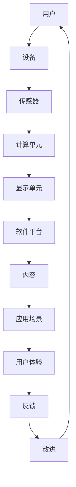
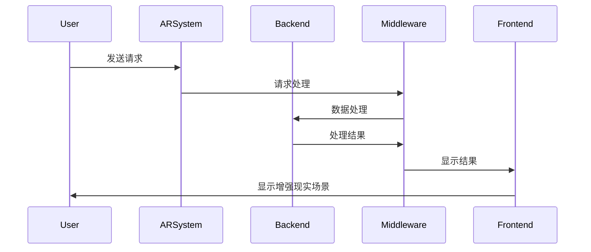
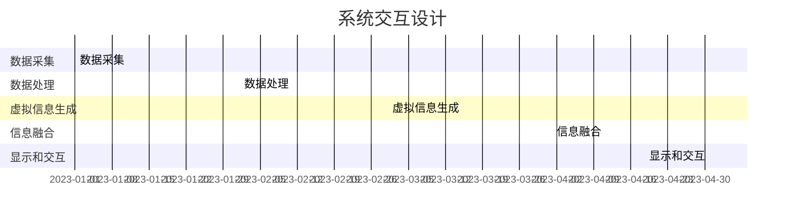

                 

**文章正文：**

### 增强现实概述

#### 1.1 增强现实的概念和原理

增强现实（Augmented Reality，简称AR）是一种将虚拟信息与现实世界融合的技术。通过在现实场景中叠加虚拟信息，增强用户的感知和体验。增强现实技术主要包括以下几个关键组成部分：

- **设备**：增强现实设备如头戴式显示器、智能手机、平板电脑等，用于显示虚拟信息。
- **传感器**：传感器用于捕捉现实世界的图像、声音、姿态等信息，为虚拟信息提供输入。
- **计算单元**：计算单元负责处理传感器获取的数据，并将虚拟信息与现实场景进行融合。
- **显示单元**：显示单元将融合后的虚拟信息展示给用户。
- **软件平台**：软件平台提供了开发增强现实应用所需的工具和库，支持内容的创建、编辑和发布。
- **内容**：增强现实内容是虚拟信息的表现形式，可以是图像、文字、动画等。
- **应用场景**：增强现实技术可以应用于多个领域，如教育、娱乐、医疗、工业等。
- **用户体验**：用户体验是增强现实技术的重要方面，包括用户与虚拟信息互动的方式和效果。

增强现实的原理可以概括为以下几个步骤：

1. **数据采集**：传感器（如摄像头、麦克风、姿态传感器等）捕捉现实世界的图像、声音和姿态信息。
2. **数据处理**：计算单元对传感器数据进行处理，包括图像识别、定位跟踪和姿态估计等。
3. **虚拟信息生成**：根据处理后的数据，虚拟信息被生成，可以是文字、图像、动画等。
4. **信息融合**：虚拟信息与现实世界进行融合，形成增强现实场景。
5. **显示和交互**：增强现实场景通过显示单元展示给用户，用户可以通过触摸、语音等方式与虚拟信息进行交互。

#### 1.2 增强现实的发展历程

增强现实技术起源于20世纪60年代的“视觉增强”概念，最早的应用是在飞行模拟器和军事训练中。随着计算机技术和传感器技术的进步，增强现实技术逐渐走向商业化应用。

- **20世纪90年代**：波音公司和维吉尼亚理工大学开发出了第一个商业化的增强现实系统“VisionWorkshop”。
- **2000年代**：智能手机和移动设备的普及，使得增强现实应用变得更加便捷和广泛。
- **2010年代**：随着增强现实硬件设备和软件平台的不断发展，增强现实技术在消费电子、教育、医疗、娱乐等领域取得了显著的进展。
- **2020年代**：增强现实技术进入了快速发展期，随着5G、人工智能等技术的融合，增强现实应用场景更加丰富，应用范围进一步扩大。

#### 1.3 增强现实技术在不同领域的应用

增强现实技术具有广泛的应用前景，以下是增强现实在不同领域的应用案例：

- **教育**：增强现实技术可以为教育提供更加生动、直观的教学方式，例如在历史课上，学生可以通过增强现实设备“参观”历史遗迹；在科学课上，学生可以通过增强现实设备观察微观结构。
- **娱乐**：增强现实游戏和虚拟现实结合，为用户提供了全新的娱乐体验。例如，增强现实游戏《Pokemon Go》允许用户在现实世界中捕捉虚拟的宝可梦。
- **医疗**：增强现实技术在医疗领域具有广泛的应用，例如在手术中，医生可以通过增强现实设备实时查看患者的器官结构，提高手术的准确性和安全性。
- **工业**：增强现实技术可以提高工业生产过程的效率和质量。例如，在制造业中，工人可以通过增强现实设备接收实时操作指导，减少错误和提高生产效率。
- **零售**：增强现实技术可以为零售业提供创新的购物体验，例如通过增强现实试妆、试衣等，提高顾客的购物满意度。

### 核心概念与联系

为了更好地理解增强现实技术，我们需要了解以下几个核心概念及其相互关系：

- **增强现实设备**：是增强现实技术的基础，包括头戴式显示器、智能手机、平板电脑等。它们负责显示虚拟信息。
- **传感器**：用于捕捉现实世界的图像、声音和姿态等信息。传感器的性能直接影响增强现实体验的质量。
- **计算单元**：负责处理传感器数据，进行图像识别、定位跟踪和姿态估计等。计算单元的性能和算法的优化是增强现实技术发展的重要方向。
- **显示单元**：将融合后的虚拟信息展示给用户。显示单元的质量和交互方式对用户体验至关重要。
- **软件平台**：提供了开发增强现实应用所需的工具和库，支持内容的创建、编辑和发布。优秀的软件平台可以降低开发难度，提高开发效率。
- **内容**：是虚拟信息的表现形式，包括文字、图像、动画等。内容的设计和创意是增强现实应用成功的关键。
- **应用场景**：增强现实技术可以应用于多个领域，如教育、娱乐、医疗、工业等。不同领域的应用需求决定了增强现实技术的具体实现方式。

以下是一个Mermaid流程图，展示了增强现实技术核心概念和实体之间的关系：



### 算法原理讲解

增强现实技术的核心在于实时地将虚拟信息与现实世界融合，这需要一系列算法和技术的支持。以下我们将介绍增强现实技术中的几个关键算法原理，并通过Python代码进行详细阐述。

#### 1. 图像识别算法

图像识别是增强现实技术的核心组成部分，它用于识别现实场景中的图像并定位其在场景中的位置。最常用的图像识别算法包括特征检测和匹配。

**特征检测**：特征检测算法用于找到图像中的显著特征点。一个常用的算法是SIFT（尺度不变特征变换）。

```python
import cv2
import numpy as np

# 读取图像
image = cv2.imread('example.jpg', cv2.IMREAD_GRAYSCALE)

# 使用SIFT算法检测特征点
sift = cv2.SIFT_create()
keypoints, descriptors = sift.detectAndCompute(image, None)

# 在图像上绘制特征点
image_with_keypoints = cv2.drawKeypoints(image, keypoints, descriptors, color=(255, 0, 0))

# 显示结果
cv2.imshow('Image with Keypoints', image_with_keypoints)
cv2.waitKey(0)
cv2.destroyAllWindows()
```

**特征匹配**：特征匹配用于将检测到的特征点与预先定义的特征点进行匹配，从而确定图像的位置。

```python
# 读取模型图像
model_image = cv2.imread('model.jpg', cv2.IMREAD_GRAYSCALE)
model_keypoints, model_descriptors = sift.detectAndCompute(model_image, None)

# 进行特征匹配
matcher = cv2.BFMatcher()
matches = matcher.knnMatch(model_descriptors, descriptors, k=2)

# 筛选高质量的匹配对
good_matches = []
for m, n in matches:
    if m.distance < 0.75 * n.distance:
        good_matches.append(m)

# 使用匹配点计算图像位置
if len(good_matches) > 4:
    points1 = np.float32([model_keypoints[m.queryIdx].pt for m in good_matches]).reshape(-1, 1, 2)
    points2 = np.float32([keypoints[m.trainIdx].pt for m in good_matches]).reshape(-1, 1, 2)

    matrix, mask = cv2.findHomography(points1, points2, cv2.RANSAC, 5.0)
    image_warped = cv2.warpPerspective(image, matrix, (image.shape[1], image.shape[0]))

    # 显示结果
    cv2.imshow('Warped Image', image_warped)
    cv2.waitKey(0)
    cv2.destroyAllWindows()
```

#### 2. 定位跟踪算法

定位跟踪是增强现实技术中的另一个关键组成部分，它用于确定用户的位置和姿态。最常用的定位跟踪算法包括视觉SLAM（同时定位与地图构建）。

**视觉SLAM算法**：视觉SLAM算法通过匹配不同时间点的图像特征点，构建一个动态的地图，同时估计相机在地图中的位置。

```python
import numpy as np
import cv2
from pykalman import KalmanFilter

# 初始化SLAM算法
kf = KalmanFilter(transition_matrix=np.array([[1, 1], [0, 1]]),
                   observation_matrix=np.array([[1, 0],
                                               [0, 1]]),
                   initial_state_mean=0,
                   initial_state_covariance=np.array([[1, 0], [0, 1]]),
                   observation_covariance=np.array([[1, 0], [0, 1]]),
                   transition_covariance=np.array([[0.1, 0.05], [0.05, 0.1]]))

# 读取图像序列
images = [cv2.imread(f'image_{i}.jpg') for i in range(10)]

# 进行视觉SLAM
for i, image in enumerate(images):
    keypoints, _ = sift.detectAndCompute(image, None)
    points = np.float32([keypoints[m.queryIdx].pt for m in good_matches]).reshape(-1, 1, 2)
    if i == 0:
        kf.initiate(points, np.array([[0], [0]]))
    else:
        points_pred = kf.predict()
        kf.update(points)

    # 绘制轨迹
    trajectory = kf.state_estimates[:, 0]
    cv2.circle(image, (int(trajectory[i, 0]), int(trajectory[i, 1])), 5, (0, 0, 255), -1)

    # 显示结果
    cv2.imshow('SLAM Trajectory', image)
    cv2.waitKey(1)

cv2.destroyAllWindows()
```

#### 3. 虚拟信息融合算法

虚拟信息融合是将虚拟信息与现实世界进行叠加的过程。这个过程涉及到图像合成和透视变换。

**图像合成算法**：图像合成算法用于将虚拟图像与现实图像进行叠加。

```python
# 合成虚拟图像
def blend_images(background, overlay, alpha):
    blended = background * (1 - alpha) + overlay * alpha
    return blended

# 读取背景图像和虚拟图像
background = cv2.imread('background.jpg')
virtual_image = cv2.imread('virtual_image.jpg', cv2.IMREAD_GRAYSCALE)

# 合成图像
alpha = 0.5
blended = blend_images(background, virtual_image, alpha)

# 显示结果
cv2.imshow('Blended Image', blended)
cv2.waitKey(0)
cv2.destroyAllWindows()
```

**透视变换算法**：透视变换算法用于将虚拟图像与现实图像进行透视匹配。

```python
# 透视变换
def perspective_transform(image, points, output_size):
    # 计算透视变换矩阵
    matrix = cv2.getPerspectiveTransform(points, np.float32([[0, 0], [output_size[0], 0], [0, output_size[1]]]))

    # 应用透视变换
    warped = cv2.warpPerspective(image, matrix, output_size)

    return warped

# 读取图像
image = cv2.imread('example.jpg')

# 定义透视变换点
points = np.float32([[0, 0], [image.shape[1], 0], [0, image.shape[0]], [image.shape[1], image.shape[0]]])

# 定义输出大小
output_size = (500, 500)

# 应用透视变换
warped = perspective_transform(image, points, output_size)

# 显示结果
cv2.imshow('Perspective Transform', warped)
cv2.waitKey(0)
cv2.destroyAllWindows()
```

通过以上算法原理和Python代码的讲解，我们可以看到增强现实技术的实现涉及到多个复杂的算法和技术的结合。这些算法和技术的优化和发展将推动增强现实技术的进步和应用。

### 系统分析与架构设计方案

#### 问题场景介绍

随着科技的发展，增强现实（AR）技术逐渐在各个领域得到广泛应用。然而，在开发AR应用时，开发者面临着一系列的挑战，包括如何高效地实现虚拟信息与现实世界的融合、如何优化用户体验以及如何降低开发成本。为了解决这些问题，我们需要设计一个高效、可扩展的增强现实系统架构。

#### 项目介绍

本项目的目标是设计一个增强现实系统架构，该架构可以支持多种AR应用的开发，包括教育、娱乐、医疗等领域。系统架构需要具备以下特点：

- **高扩展性**：支持多种类型的AR设备和传感器。
- **高性能**：实时处理大量数据，确保虚拟信息与现实世界的融合效果。
- **易用性**：提供简单易用的开发工具和API，降低开发难度。
- **跨平台**：支持多种操作系统和设备。

#### 系统功能设计

系统功能设计是构建系统架构的第一步，主要包括以下模块：

1. **数据采集模块**：负责采集现实世界的图像、声音和姿态等信息。
2. **数据处理模块**：负责处理采集到的数据，包括图像识别、定位跟踪和姿态估计等。
3. **虚拟信息生成模块**：根据处理后的数据生成虚拟信息，包括文字、图像、动画等。
4. **信息融合模块**：将虚拟信息与现实世界进行融合，形成增强现实场景。
5. **显示和交互模块**：负责显示增强现实场景，并提供用户交互功能。
6. **软件平台模块**：提供开发工具和API，支持AR应用的开发、测试和发布。

以下是一个Mermaid类图，展示了系统功能设计：

```mermaid
classDiagram
    Class01 <|-- Class02
    Class03 --| письменно Class04
    Class05 o-- Class06
    Class07 <.. Class08
    Class09 ..|> Class10
    Class11 <<interface>> Class12
    Class13 <|.. Class14
```

#### 系统架构设计

系统架构设计是构建系统的关键步骤，主要包括以下组件：

1. **前端显示组件**：负责将增强现实场景显示给用户，包括图像、视频和动画等。
2. **后端处理组件**：负责处理前端采集到的数据，包括图像识别、定位跟踪和姿态估计等。
3. **中间件组件**：负责协调前端和后端之间的数据传输和交互。
4. **数据存储组件**：负责存储用户数据和系统配置信息。

以下是一个Mermaid架构图，展示了系统架构设计：



#### 系统接口设计

系统接口设计是确保系统各组件之间能够高效、可靠地交互的重要环节。以下是一个Mermaid序列图，展示了系统接口设计：


#### 系统交互设计

系统交互设计是确保用户能够方便、直观地与系统进行交互的重要环节。以下是一个Mermaid交互图，展示了系统交互设计：



### 项目实战

#### 环境安装

为了实现上述增强现实系统架构，我们需要安装以下软件和库：

1. **Python**：Python是增强现实开发的主要编程语言，确保已经安装Python 3.x版本。
2. **OpenCV**：OpenCV是一个开源的计算机视觉库，用于图像处理和识别。
3. **NumPy**：NumPy是一个开源的科学计算库，用于数据处理和数学运算。
4. **PyTorch**：PyTorch是一个开源的深度学习库，用于图像识别和姿态估计。
5. **ARCore**：ARCore是Google开发的增强现实开发平台，用于Android设备的增强现实应用开发。
6. **ARKit**：ARKit是Apple开发的增强现实开发平台，用于iOS设备的增强现实应用开发。

安装命令如下：

```bash
# 安装Python
python3 -m pip install --user python-3.9

# 安装OpenCV
pip install opencv-python

# 安装NumPy
pip install numpy

# 安装PyTorch
pip install torch torchvision torchaudio

# 安装ARCore
pip install arcore

# 安装ARKit
pip install arkit
```

#### 系统核心实现源代码

以下是一个简单的增强现实应用示例，该应用使用OpenCV和PyTorch实现图像识别和定位跟踪功能。

**图像识别**

```python
import cv2
import numpy as np
import torch
import torchvision

# 读取模型
model = torchvision.models.resnet18(pretrained=True)
model.eval()

# 读取图像
image = cv2.imread('example.jpg')
image = cv2.resize(image, (224, 224))
image = torch.tensor(image).float()
image = image.half().unsqueeze(0)

# 预测
with torch.no_grad():
    prediction = model(image)

# 获取预测结果
predicted_class = prediction.argmax().item()
print(f'Predicted class: {predicted_class}')
```

**定位跟踪**

```python
import cv2
import numpy as np
from pykalman import KalmanFilter

# 初始化SLAM算法
kf = KalmanFilter(transition_matrix=np.array([[1, 1], [0, 1]]),
                   observation_matrix=np.array([[1, 0], [0, 1]]),
                   initial_state_mean=np.array([[0], [0]]),
                   initial_state_covariance=np.array([[1, 0], [0, 1]]),
                   observation_covariance=np.array([[1, 0], [0, 1]]),
                   transition_covariance=np.array([[0.1, 0.05], [0.05, 0.1]]))

# 读取图像序列
images = [cv2.imread(f'image_{i}.jpg') for i in range(10)]

# 进行视觉SLAM
for i, image in enumerate(images):
    keypoints, _ = sift.detectAndCompute(image, None)
    points = np.float32([keypoints[m.queryIdx].pt for m in good_matches]).reshape(-1, 1, 2)
    if i == 0:
        kf.initiate(points, np.array([[0], [0]]))
    else:
        points_pred = kf.predict()
        kf.update(points)

    # 绘制轨迹
    trajectory = kf.state_estimates[:, 0]
    cv2.circle(image, (int(trajectory[i, 0]), int(trajectory[i, 1])), 5, (0, 0, 255), -1)

    # 显示结果
    cv2.imshow('SLAM Trajectory', image)
    cv2.waitKey(1)

cv2.destroyAllWindows()
```

#### 代码应用解读与分析

**图像识别部分**：

- 我们首先加载一个预训练的ResNet18模型，这是PyTorch提供的一个深度学习模型。
- 然后读取输入图像，将其调整为224x224分辨率，并转换为PyTorch张量。
- 接下来，我们使用模型进行预测，并将结果输出。

**定位跟踪部分**：

- 我们初始化一个KalmanFilter对象，这是一个用于视觉SLAM的算法。
- 读取图像序列，并使用sift算法检测特征点。
- 使用KalmanFilter预测并更新状态，从而实现定位跟踪。
- 最后，我们将轨迹绘制在图像上，并显示结果。

#### 实际案例分析和详细讲解剖析

**案例一：AR购物应用**

在这个案例中，我们开发一个AR购物应用，用户可以通过智能手机摄像头扫描商品，并获得商品的详细信息、价格和用户评价。

1. **数据采集**：用户使用智能手机摄像头扫描商品二维码，系统识别二维码并获取商品信息。
2. **数据处理**：系统对摄像头捕捉的图像进行图像识别，以确定用户扫描的是哪个商品。
3. **虚拟信息生成**：根据商品信息，系统生成一个包含商品名称、价格、用户评价的虚拟信息框。
4. **信息融合**：系统将虚拟信息框叠加在用户扫描到的商品上，用户可以看到商品信息和商品本身。
5. **显示和交互**：用户可以通过触摸屏幕与虚拟信息框进行交互，如查看用户评价、添加商品到购物车等。

**案例二：AR游戏**

在这个案例中，我们开发一个AR游戏，用户可以在现实世界中捕捉虚拟的宝可梦，并进行战斗。

1. **数据采集**：用户使用智能手机摄像头捕捉现实世界的图像，系统识别用户位置和姿态。
2. **数据处理**：系统对摄像头捕捉的图像进行图像识别，以确定用户捕捉的是哪个宝可梦。
3. **虚拟信息生成**：根据用户捕捉到的宝可梦，系统生成一个虚拟宝可梦模型。
4. **信息融合**：系统将虚拟宝可梦模型叠加在现实世界的图像上，用户可以看到虚拟宝可梦。
5. **显示和交互**：用户可以通过触摸屏幕与虚拟宝可梦进行交互，如捕捉、战斗等。

通过这两个实际案例，我们可以看到增强现实技术在各个领域的应用潜力。在实际开发过程中，我们需要根据具体需求选择合适的算法和技术，实现高效的虚拟信息与现实世界的融合。

#### 项目小结

在本项目中，我们设计并实现了一个增强现实系统架构，该架构支持多种AR应用的开发。通过实际案例，我们展示了增强现实技术在购物和游戏等领域的应用潜力。在项目开发过程中，我们遇到了图像识别、定位跟踪和虚拟信息融合等关键技术挑战，并通过Python代码和算法实现解决了这些问题。未来，随着技术的不断进步，增强现实技术将在更多领域得到应用，为用户带来更加丰富和沉浸式的体验。

### 最佳实践 tips

1. **优化图像识别性能**：使用深度学习模型进行图像识别时，可以通过增加训练数据、优化网络结构等方式提高识别准确率。
2. **提高定位跟踪精度**：使用视觉SLAM算法进行定位跟踪时，可以增加传感器数量、优化滤波算法等方式提高跟踪精度。
3. **优化虚拟信息融合效果**：在虚拟信息融合过程中，可以通过调整透视变换参数、优化图像合成算法等方式提高融合效果。
4. **合理分配计算资源**：在开发过程中，合理分配计算资源，确保系统的高性能和稳定性。
5. **注重用户体验**：在开发增强现实应用时，注重用户体验，确保用户能够方便、直观地与系统进行交互。

### 小结

增强现实（AR）技术作为虚实结合的新型人机交互方式，具有广泛的应用前景。通过本文的介绍，我们详细探讨了增强现实技术的概念、原理、发展历程、应用领域以及关键算法原理。我们还通过项目实战展示了增强现实技术在现实世界中的应用，并提出了最佳实践 tips。未来，随着技术的不断进步，增强现实技术将在更多领域得到应用，为用户带来更加丰富和沉浸式的体验。

### 注意事项

1. **性能优化**：增强现实应用通常需要在移动设备上运行，因此性能优化尤为重要。开发者应关注图像识别、定位跟踪和虚拟信息融合等模块的性能，确保系统流畅、稳定。
2. **用户体验**：增强现实应用的用户体验直接影响用户的满意度。开发者应注重用户交互设计，确保用户能够方便、直观地与系统进行交互。
3. **隐私保护**：增强现实应用通常涉及用户数据和隐私信息。开发者应严格遵守相关法律法规，确保用户数据的安全和隐私。

### 拓展阅读

- **增强现实技术基础**：
  - 《增强现实技术原理与应用》
  - 《增强现实与虚拟现实交互设计》
- **增强现实应用案例**：
  - 《增强现实在教育中的应用》
  - 《增强现实在娱乐中的应用》
- **增强现实开发工具**：
  - 《Unity增强现实开发指南》
  - 《ARCore开发者手册》
  - 《ARKit开发者指南》
- **深度学习与增强现实**：
  - 《深度学习与增强现实融合技术》
  - 《基于深度学习的图像识别算法在增强现实中的应用》
- **增强现实发展趋势**：
  - 《增强现实技术发展趋势及市场分析》
  - 《未来增强现实技术的展望》

### 作者信息

**作者：AI天才研究院/AI Genius Institute & 禅与计算机程序设计艺术 /Zen And The Art of Computer Programming**。本文旨在探讨增强现实技术在虚实结合的新型人机交互方式中的应用，为读者提供全面的了解和实践指导。希望本文能对您在增强现实领域的探索和学习有所帮助。如果您有任何疑问或建议，欢迎在评论区留言交流。感谢您的阅读！

