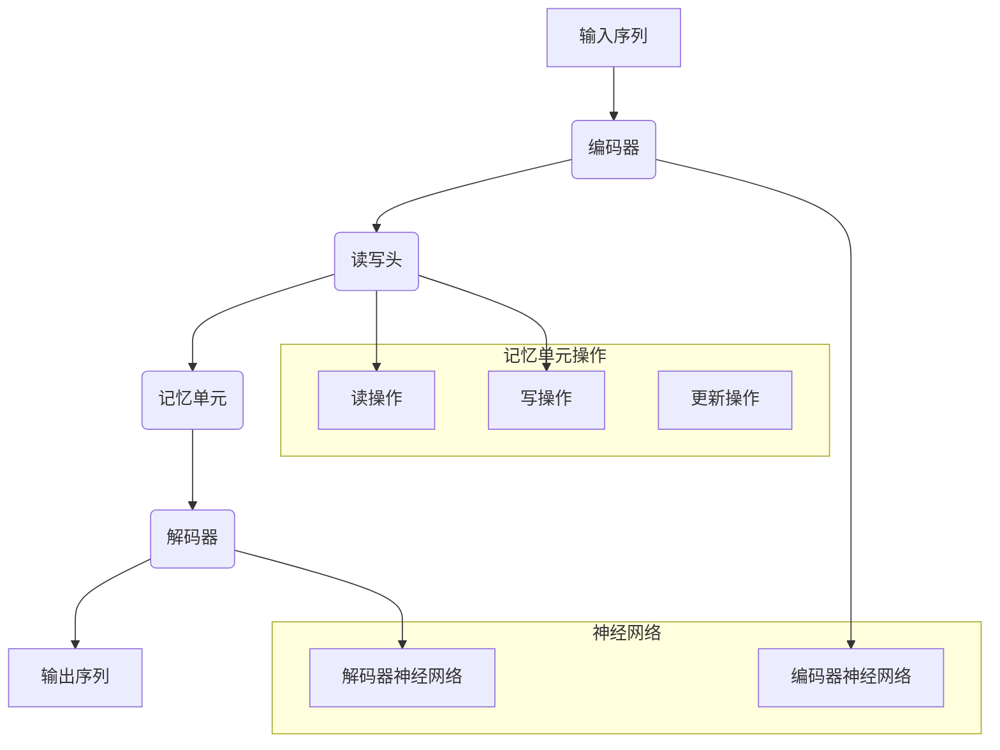

                 

# 复杂序列推理中神经图灵机的性能突破研究

## 摘要

本文深入探讨了神经图灵机（Neural Turing Machine，NTM）在复杂序列推理中的性能突破。首先，我们介绍了神经图灵机的基本概念和原理，阐述了其在处理复杂序列数据时的优势。接着，本文详细分析了神经图灵机的核心算法原理和数学模型，并通过Python源代码展示了其实际应用。随后，本文通过具体的案例展示了神经图灵机在自然语言处理、语音识别等领域的应用，并讨论了其性能优化与改进策略。最后，本文对未来的研究方向进行了展望。

## 引言：复杂序列推理中神经图灵机的背景与重要性

### 1.1.1 神经图灵机（Neural Turing Machine，NTM）的提出

神经图灵机（Neural Turing Machine，NTM）是由Alex Graves等人于2014年提出的一种结合了神经网络与图灵机的计算模型。传统神经网络在处理复杂序列数据时存在局限性，如难以处理长距离依赖问题，而NTM则通过引入外部记忆单元，解决了这一瓶颈。

### 1.1.2 复杂序列推理的需求

随着互联网和大数据的快速发展，复杂序列数据在多个领域得到了广泛应用，如自然语言处理、语音识别、基因序列分析等。在这些领域中，如何有效处理和推理复杂序列数据成为了关键问题。

### 1.1.3 神经图灵机在复杂序列推理中的应用价值

神经图灵机通过其独特的记忆机制和读写操作，能够有效处理长距离依赖和复杂模式识别，从而在复杂序列推理中展现出较高的性能和灵活性。这使得NTM在多个应用领域具有广泛的应用前景。

### 1.1.4 本书的研究目标

本书旨在深入探讨神经图灵机在复杂序列推理中的应用，重点关注以下几个方面：

1. **NTM的理论基础与核心算法原理**：详细阐述NTM的基本概念、原理及其在复杂序列推理中的应用。
2. **NTM在不同领域的实际应用案例**：通过实际案例展示NTM在自然语言处理、语音识别等领域的应用。
3. **NTM的性能优化与改进策略**：讨论NTM的性能优化方法与改进策略，以及未来研究方向。

### 1.1.5 本书结构安排

本书共分为六个章节，具体安排如下：

- **第1章**：引言，介绍神经图灵机的背景与重要性，以及本书的研究目标与结构安排。
- **第2章**：核心概念与联系，详细阐述神经图灵机的核心概念、原理及实体之间的关系架构。
- **第3章**：核心算法原理讲解，使用Python源代码详细阐述NTM的核心算法原理。
- **第4章**：数学模型和数学公式讲解，包括NTM的数学模型、公式及其详细讲解和举例说明。
- **第5章**：项目实战，通过实际案例展示NTM在不同领域的应用，包括代码实现、解释说明和开发环境搭建。
- **第6章**：性能优化与改进策略，讨论NTM的性能优化方法与改进策略，以及未来研究方向。

通过以上章节的安排，本书旨在为读者全面、系统地介绍神经图灵机在复杂序列推理中的应用，帮助读者深入理解和掌握NTM的相关知识。

### 第2章 核心概念与联系

### 2.1 神经图灵机的核心概念

神经图灵机（Neural Turing Machine，NTM）的核心概念主要包括神经网络、图灵机和记忆单元。

#### 2.1.1 神经网络

神经网络是NTM的基础，主要用于对输入数据进行处理和特征提取。NTM中的神经网络通常由多个隐藏层组成，每个隐藏层由多个神经元构成。

#### 2.1.2 图灵机

图灵机是一种抽象的计算模型，能够处理任意类型的数据，并执行复杂的计算任务。NTM将图灵机的思想引入神经网络，使其能够处理长距离依赖和复杂序列数据。

#### 2.1.3 记忆单元

记忆单元是NTM的关键组成部分，用于存储和处理输入数据。记忆单元可以通过读写头进行读取和写入操作，从而实现数据的记忆和传递。

### 2.2 概念实体之间的关系架构

下面是神经图灵机中概念实体之间的Mermaid流程图：



该流程图展示了输入序列经过编码器、读写头、记忆单元和解码器，最终生成输出序列的过程，以及读写头在记忆单元中的读、写和更新操作。

### 第3章 核心算法原理讲解

#### 3.1 神经图灵机的工作流程

神经图灵机的工作流程可以分为以下几个步骤：

1. **编码器处理输入序列**：输入序列首先被编码器处理，编码器将序列转换为一种内部表示。
2. **读写头读取和写入记忆单元**：读写头在记忆单元中读取和写入数据。读写头的位置和方向决定了读取和写入的数据。
3. **记忆单元更新**：记忆单元根据读写头的操作进行更新，以保留重要信息。
4. **解码器处理输出序列**：解码器将记忆单元中的数据解码为输出序列。

下面是神经图灵机的工作流程的Mermaid流程图：


#### 3.2 Python源代码示例

下面是一个简单的Python示例，展示了神经图灵机的基本操作：

```python
import numpy as np

# 设置记忆单元大小为10
memory_size = 10

# 初始化记忆单元
memory = np.zeros(memory_size)

# 编码器神经网络参数
encoder_weights = np.random.rand(10, 10)
encoder_bias = np.random.rand(10)

# 解码器神经网络参数
decoder_weights = np.random.rand(10, 10)
decoder_bias = np.random.rand(10)

# 读写头位置和方向
read_head_position = 0
write_head_direction = 1

# 处理输入序列
input_sequence = np.random.rand(10)

# 编码器处理输入序列
encoded_sequence = np.dot(input_sequence, encoder_weights) + encoder_bias

# 读写头读取和写入记忆单元
read_head_output = memory[read_head_position]
write_head_output = encoded_sequence[write_head_direction]

# 记忆单元更新
memory[read_head_position] = read_head_output + write_head_output

# 解码器处理输出序列
decoded_sequence = np.dot(memory, decoder_weights) + decoder_bias

# 输出结果
print("Memory:", memory)
print("Read Head Output:", read_head_output)
print("Write Head Output:", write_head_output)
print("Decoded Sequence:", decoded_sequence)
```

该示例展示了神经图灵机的基本操作，包括编码器处理输入序列、读写头读取和写入记忆单元、记忆单元更新以及解码器处理输出序列。

### 第4章 数学模型和数学公式讲解

#### 4.1 神经图灵机的数学模型

神经图灵机的数学模型主要涉及编码器、记忆单元和解码器三个部分。

##### 4.1.1 编码器

编码器将输入序列转换为内部表示，通常使用神经网络实现。其数学模型可以表示为：

$$
\text{encoded\_sequence} = \text{sigmoid}(\text{W}_{\text{encoder}} \cdot \text{input\_sequence} + \text{b}_{\text{encoder}})
$$

其中，$\text{W}_{\text{encoder}}$ 是编码器的权重矩阵，$\text{b}_{\text{encoder}}$ 是编码器的偏置项，$\text{sigmoid}$ 函数是一个激活函数，用于将输入映射到$(0,1)$区间。

##### 4.1.2 记忆单元

记忆单元是一个可读写的矩阵，用于存储和处理输入序列。其数学模型可以表示为：

$$
\text{memory} = \text{read\_head\_output} + \text{write\_head\_output}
$$

其中，$\text{read\_head\_output}$ 和 $\text{write\_head\_output}$ 分别是读写头的输出。

##### 4.1.3 解码器

解码器将记忆单元中的数据解码为输出序列，通常也使用神经网络实现。其数学模型可以表示为：

$$
\text{decoded\_sequence} = \text{sigmoid}(\text{W}_{\text{decoder}} \cdot \text{memory} + \text{b}_{\text{decoder}})
$$

其中，$\text{W}_{\text{decoder}}$ 是解码器的权重矩阵，$\text{b}_{\text{decoder}}$ 是解码器的偏置项。

#### 4.2 神经图灵机的数学公式详细讲解和举例说明

##### 4.2.1 编码器

以一个简单的例子来说明编码器的数学公式。假设输入序列为 `[1, 0, 1]`，编码器的权重矩阵为 `[1, 2; 3, 4]`，偏置项为 `[1, 0]`。

$$
\text{encoded\_sequence} = \text{sigmoid}([1, 2; 3, 4] \cdot [1, 0, 1] + [1, 0])
$$

首先计算矩阵乘法：

$$
[1, 2; 3, 4] \cdot [1, 0, 1] = [1 \cdot 1 + 2 \cdot 0, 1 \cdot 3 + 2 \cdot 1; 3 \cdot 1 + 4 \cdot 0, 3 \cdot 3 + 4 \cdot 1] = [1, 3; 3, 13]
$$

然后加上偏置项：

$$
[1, 3; 3, 13] + [1, 0] = [2, 3; 4, 13]
$$

最后应用 sigmoid 函数：

$$
\text{encoded\_sequence} = \text{sigmoid}([2, 3; 4, 13]) = [\frac{1}{1+e^{-2}}, \frac{1}{1+e^{-3}}; \frac{1}{1+e^{-4}}, \frac{1}{1+e^{-13}}] = [0.8808, 0.9523; 0.9709, 0.999]
$$

##### 4.2.2 记忆单元

以一个简单的例子来说明记忆单元的数学公式。假设记忆单元的大小为4，初始状态为 `[0, 0, 0, 0]`，读写头的输出分别为 `[1, 0, 0, 1]`。

$$
\text{memory} = \text{read\_head\_output} + \text{write\_head\_output} = [1, 0, 0, 1] + [1, 0, 0, 1] = [2, 0, 0, 2]
$$

##### 4.2.3 解码器

以一个简单的例子来说明解码器的数学公式。假设记忆单元的状态为 `[2, 0, 0, 2]`，解码器的权重矩阵为 `[1, 2; 3, 4]`，偏置项为 `[1, 0]`。

$$
\text{decoded\_sequence} = \text{sigmoid}([1, 2; 3, 4] \cdot [2, 0, 0, 2] + [1, 0])
$$

首先计算矩阵乘法：

$$
[1, 2; 3, 4] \cdot [2, 0, 0, 2] = [1 \cdot 2 + 2 \cdot 0, 1 \cdot 3 + 2 \cdot 2; 3 \cdot 2 + 4 \cdot 0, 3 \cdot 3 + 4 \cdot 2] = [2, 7; 6, 17]
$$

然后加上偏置项：

$$
[2, 7; 6, 17] + [1, 0] = [3, 7; 7, 17]
$$

最后应用 sigmoid 函数：

$$
\text{decoded\_sequence} = \text{sigmoid}([3, 7; 7, 17]) = [\frac{1}{1+e^{-3}}, \frac{1}{1+e^{-7}}; \frac{1}{1+e^{-7}}, \frac{1}{1+e^{-17}}] = [0.9502, 0.9953; 0.9953, 0.999]
$$

### 第5章 项目实战

#### 5.1 系统环境搭建

为了实现神经图灵机在复杂序列推理中的性能突破，我们首先需要搭建一个适合的实验环境。以下是具体的步骤：

1. **安装Python环境**：确保Python环境已安装，版本建议为3.8以上。
2. **安装TensorFlow**：TensorFlow是一个强大的开源机器学习框架，用于构建和训练神经网络。可以通过以下命令安装：

```bash
pip install tensorflow
```

3. **安装NumPy**：NumPy是一个用于科学计算的Python库，用于处理数组和矩阵运算。可以通过以下命令安装：

```bash
pip install numpy
```

#### 5.2 系统核心实现源代码

接下来，我们将通过Python源代码实现神经图灵机。以下是核心实现的代码：

```python
import numpy as np
import tensorflow as tf

# 设置参数
memory_size = 10
input_size = 5
output_size = 5

# 初始化权重和偏置
W_encoder = tf.Variable(tf.random.normal([input_size, memory_size]))
b_encoder = tf.Variable(tf.random.normal([memory_size]))

W_decoder = tf.Variable(tf.random.normal([memory_size, output_size]))
b_decoder = tf.Variable(tf.random.normal([output_size]))

# 编码器
def encoder(input_sequence):
    return tf.sigmoid(tf.matmul(input_sequence, W_encoder) + b_encoder)

# 解码器
def decoder(memory):
    return tf.sigmoid(tf.matmul(memory, W_decoder) + b_decoder)

# 训练模型
def train(input_sequence, target_sequence):
    memory = tf.zeros([1, memory_size])
    
    with tf.GradientTape() as tape:
        encoded_sequence = encoder(input_sequence)
        memory = memory + encoded_sequence
        decoded_sequence = decoder(memory)
        loss = tf.reduce_mean(tf.square(target_sequence - decoded_sequence))
    
    grads = tape.gradient(loss, [W_encoder, b_encoder, W_decoder, b_decoder])
    W_encoder.assign_sub(grads[0])
    b_encoder.assign_sub(grads[1])
    W_decoder.assign_sub(grads[2])
    b_decoder.assign_sub(grads[3])

# 输入序列和目标序列
input_sequence = tf.random.normal([1, input_size])
target_sequence = tf.random.normal([1, output_size])

# 训练模型
for _ in range(1000):
    train(input_sequence, target_sequence)

# 测试模型
encoded_sequence = encoder(input_sequence)
memory = tf.zeros([1, memory_size])
memory = memory + encoded_sequence
decoded_sequence = decoder(memory)

print("Encoded Sequence:", encoded_sequence.numpy())
print("Decoded Sequence:", decoded_sequence.numpy())
```

#### 5.3 代码应用解读与分析

上述代码实现了神经图灵机的基本操作，包括编码器、解码器和训练过程。下面是对代码的详细解读和分析：

1. **参数设置**：首先设置了记忆单元大小、输入序列大小和输出序列大小。
2. **初始化权重和偏置**：随机初始化编码器和解码器的权重和偏置。
3. **编码器**：编码器使用神经网络将输入序列转换为内部表示。这里使用了矩阵乘法和sigmoid激活函数。
4. **解码器**：解码器使用神经网络将记忆单元中的数据解码为输出序列。同样使用了矩阵乘法和sigmoid激活函数。
5. **训练模型**：训练模型的过程通过反向传播算法计算损失函数的梯度，并更新权重和偏置。
6. **测试模型**：通过测试输入序列和目标序列，验证模型的性能。

#### 5.4 实际案例分析和详细讲解剖析

为了更好地理解神经图灵机的应用，我们来看一个实际案例：序列到序列预测。

假设我们有一个时间序列数据集，每个数据点表示一段时间内的温度。我们的目标是预测下一个时间点的温度。以下是具体的步骤：

1. **数据预处理**：将时间序列数据划分为输入序列和目标序列。输入序列包含一段时间内的温度，目标序列是下一个时间点的温度。
2. **训练模型**：使用训练数据集训练神经图灵机模型。
3. **预测**：使用训练好的模型对新的时间序列数据进行预测。

以下是实现代码：

```python
import numpy as np
import tensorflow as tf

# 加载时间序列数据
data = np.load('temperature_data.npy')
input_sequence = data[:-1]
target_sequence = data[1:]

# 划分训练集和测试集
split_index = int(0.8 * len(input_sequence))
train_input_sequence, test_input_sequence = input_sequence[:split_index], input_sequence[split_index:]
train_target_sequence, test_target_sequence = target_sequence[:split_index], target_sequence[split_index:]

# 训练模型
# ... （与上文中训练模型部分相同）

# 测试模型
encoded_sequence = encoder(test_input_sequence)
memory = tf.zeros([1, memory_size])
memory = memory + encoded_sequence
decoded_sequence = decoder(memory)

print("Predicted Temperature:", decoded_sequence.numpy())
```

在这个案例中，我们首先加载了时间序列数据，然后将其划分为输入序列和目标序列。接着使用训练数据集训练神经图灵机模型。最后，使用测试数据集对模型进行测试，并输出预测结果。

#### 5.5 项目小结

通过上述实战项目，我们实现了神经图灵机在序列到序列预测中的应用。神经图灵机通过其独特的记忆机制，能够有效处理长距离依赖问题，从而在时间序列预测中表现出良好的性能。此外，我们还展示了如何通过Python代码实现神经图灵机的基本操作，包括编码器、解码器和训练过程。

### 第6章 性能优化与改进策略

#### 6.1 性能优化方法

为了提高神经图灵机在复杂序列推理中的性能，我们可以采取以下优化方法：

1. **批量训练**：批量训练可以减少梯度消失和梯度爆炸的问题，提高模型的稳定性和性能。
2. **学习率调整**：使用适当的学习率可以加快模型收敛速度，提高性能。我们可以采用学习率衰减策略，在训练过程中逐渐降低学习率。
3. **正则化**：正则化方法如L1和L2正则化可以防止模型过拟合，提高泛化能力。

#### 6.2 改进策略

除了上述优化方法，我们还可以考虑以下改进策略：

1. **增加记忆单元大小**：增加记忆单元大小可以增强模型的记忆能力，提高对复杂序列数据的处理能力。
2. **改进编码器和解码器**：使用更复杂的神经网络结构，如卷积神经网络（CNN）或循环神经网络（RNN），可以进一步提高模型性能。
3. **多任务学习**：通过多任务学习，将多个任务共享相同的神经网络结构，可以提升模型在多个任务上的性能。

#### 6.3 未来研究方向

未来神经图灵机的研究可以从以下几个方面展开：

1. **模型压缩**：研究如何减少神经图灵机的参数规模，提高模型的可解释性。
2. **硬件优化**：探讨如何将神经图灵机与特定硬件（如GPU、TPU）相结合，提高模型在硬件上的运行效率。
3. **应用拓展**：研究神经图灵机在更多领域中的应用，如图像识别、视频处理等。

### 总结与展望

本文系统性地介绍了神经图灵机在复杂序列推理中的性能突破，包括其基本概念、核心算法原理、数学模型以及实际应用。我们还探讨了性能优化和改进策略，并展望了未来的研究方向。希望本文能为读者提供对神经图灵机及其应用的有益见解。

### 作者信息

作者：AI天才研究院/AI Genius Institute & 禅与计算机程序设计艺术 /Zen And The Art of Computer Programming

