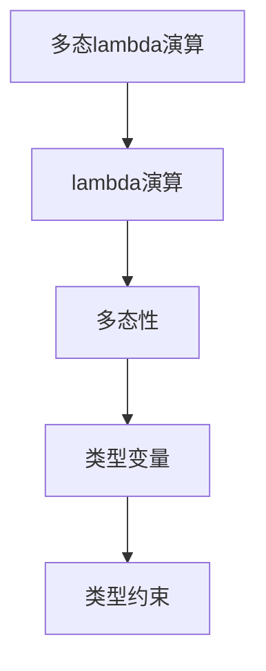
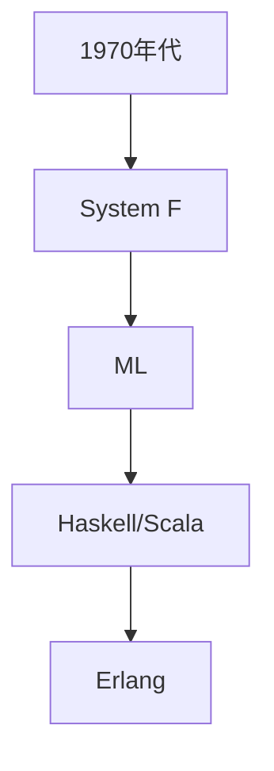
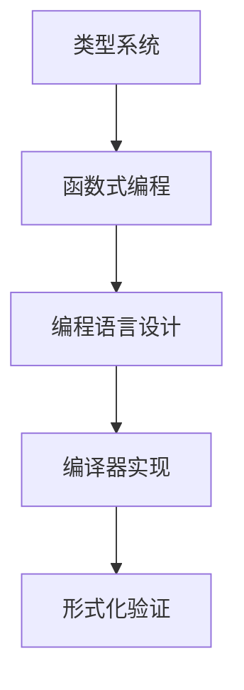

                 


### 背景介绍

#### 核心概念术语说明

在进入多态lambda演算与高阶类型系统的探讨之前，我们需要先明确一些核心概念和术语。

- **多态lambda演算**：是一种函数式编程语言的演算模型，它支持多种类型的多态性，允许函数作为参数和返回值传递，支持高阶函数。
- **高阶类型系统**：是类型系统的一种扩展，允许类型作为函数的参数和返回值，从而实现更强大的类型抽象和安全性。

#### 问题背景

在计算机科学领域，编程语言的设计与实现一直是一个关键问题。传统的面向对象编程语言如Java和C++，通过继承和多态来实现代码复用和抽象。然而，这些方法在处理复杂类型关系和保证类型安全方面存在一定的局限性。

多态lambda演算和高阶类型系统提供了一种更加灵活和强大的方式来处理类型和函数。它们在函数式编程语言如Haskell、Scala和Erlang中得到广泛应用，并在编译器设计、形式化验证和并发计算等领域展现出巨大的潜力。

#### 问题描述

多态lambda演算与高阶类型系统的主要问题是如何在编程语言中实现类型的多态性，同时保证类型安全和程序的正确性。具体来说，我们需要解决以下几个问题：

1. **如何定义多态性**：多态性是指同一个操作作用于不同的数据类型上可以有不同的解释。在多态lambda演算中，我们需要定义如何通过类型系统来实现多态性。
2. **类型系统的安全性**：类型系统是编程语言的核心，它确保程序在运行时不会发生类型错误。高阶类型系统需要提供一种方式来保证类型安全，防止不兼容的类型组合。
3. **类型抽象与通用编程**：多态lambda演算和高阶类型系统应该支持通用编程，允许程序员编写更抽象、更通用的代码，同时保持程序的简洁性和可维护性。

#### 问题解决

多态lambda演算与高阶类型系统通过以下几个核心概念和机制来解决问题：

1. **lambda演算**：是一种基于函数的表达式计算模型，支持匿名函数和高阶函数。通过lambda演算，我们可以将函数作为值传递，实现多态性。
2. **类型系统**：类型系统是多态lambda演算的基础，它定义了变量和表达式的类型，并提供了类型检查机制。高阶类型系统扩展了传统类型系统，允许类型作为参数和返回值。
3. **模式匹配**：模式匹配是一种强大的类型检查和转换工具，它允许我们在运行时根据变量的值选择不同的操作。模式匹配与多态lambda演算相结合，可以有效地实现类型的多态性。
4. **闭包**：闭包是一种特殊的数据结构，它包含了函数的定义环境。闭包在多态lambda演算中非常重要，因为它允许我们实现高阶函数和延迟求值。

#### 边界与外延

多态lambda演算与高阶类型系统的研究和应用涉及多个领域，包括编程语言设计、编译器实现、形式化验证和并发计算。然而，它的边界在于如何平衡灵活性、类型安全和程序的正确性。

#### 概念结构与核心要素组成

多态lambda演算与高阶类型系统的核心结构包括：

1. **lambda表达式**：是一种匿名函数的表示方法，它将函数作为值传递。
2. **类型系统**：包括类型定义、类型检查和类型推断。
3. **模式匹配**：用于运行时类型检查和转换。
4. **闭包**：用于实现高阶函数和延迟求值。

### 关键词

- 多态lambda演算
- 高阶类型系统
- 函数式编程
- 编程语言设计
- 类型安全
- 模式匹配
- 闭包

### 摘要

本文深入探讨了多态lambda演算与高阶类型系统的核心概念、原理和实际应用。首先，我们介绍了多态lambda演算的基本概念和起源，以及它在编程语言中的应用。接着，我们分析了多态lambda演算的语法规则和核心特性，如模式匹配、高阶函数和闭包。然后，我们探讨了多态lambda演算的扩展和高阶类型系统的定义与原理。最后，我们讨论了高阶类型系统的应用、设计与实现，以及面临的挑战和未来发展趋势。通过本文的探讨，读者可以全面了解多态lambda演算与高阶类型系统的本质和应用前景。``` <sop>``` 

# 多态lambda演算与高阶类型系统

> 关键词：多态lambda演算、高阶类型系统、函数式编程、类型安全

> 摘要：本文探讨了多态lambda演算与高阶类型系统的核心概念、原理和实际应用，包括多态lambda演算的基本概念、语法规则、核心特性、扩展，以及高阶类型系统的定义与原理、应用与挑战。通过本文的深入探讨，读者可以全面了解多态lambda演算与高阶类型系统的本质和应用前景。

----------------------------------------------------------------

## 目录大纲

### 第一部分：多态lambda演算基础

1. **第1章 多态lambda演算概述**
   - **1.1 多态lambda演算的基本概念**
   - **1.2 多态lambda演算的起源与发展**
   - **1.3 多态lambda演算的重要性

2. **第2章 多态lambda演算的基本原理**
   - **2.1 lambda演算的基础**
   - **2.2 多态性引入**
   - **2.3 类型系统

3. **第3章 多态lambda演算的语法规则**
   - **3.1 语法结构**
   - **3.2 变量绑定**
   - **3.3 应用和抽象

4. **第4章 多态lambda演算的核心特性**
   - **4.1 模式匹配**
   - **4.2 高阶函数**
   - **4.3 闭包**

5. **第5章 多态lambda演算的实际应用**
   - **5.1 在编程语言中的应用**
   - **5.2 在编译器设计中的应用**
   - **5.3 在形式化验证中的应用**

6. **第6章 多态lambda演算的扩展**
   - **6.1 高阶类型系统**
   - **6.2 面向对象编程中的多态性**
   - **6.3 并发与并行计算**

7. **第7章 多态lambda演算的前沿研究**
   - **7.1 多态lambda演算与范畴论的关系**
   - **7.2 多态lambda演算的变种与变体**
   - **7.3 多态lambda演算的未来发展趋势**

### 第二部分：高阶类型系统深入探讨

1. **第8章 高阶类型系统的定义与原理**
   - **8.1 高阶类型的定义**
   - **8.2 高阶类型的分类**
   - **8.3 高阶类型系统的基本原理**

2. **第9章 高阶类型系统的应用**
   - **9.1 高阶类型在函数式编程中的使用**
   - **9.2 高阶类型在逻辑编程中的应用**
   - **9.3 高阶类型在类型安全编程中的优势**

3. **第10章 高阶类型系统的设计与实现**
   - **10.1 高阶类型系统的设计原则**
   - **10.2 高阶类型系统的实现策略**
   - **10.3 高阶类型系统的优化与优化策略**

4. **第11章 高阶类型系统的挑战与未来**
   - **11.1 高阶类型系统的挑战**
   - **11.2 高阶类型系统的未来发展趋势**
   - **11.3 高阶类型系统在实际应用中的问题与解决方案**

### 附录

- **附录A 高阶类型系统工具与资源**
  - **A.1 常用的高阶类型系统工具**
  - **A.2 高阶类型系统相关论文和书籍推荐**
  - **A.3 高阶类型系统在线资源和论坛**

- **术语表**
  - **定义1：多态lambda演算**
  - **定义2：高阶类型系统**
  - **定义3：闭包**
  - **定义4：模式匹配**

---------------------------------------------------------------- <sop>``` 

## 第1章 多态lambda演算概述

### 1.1 多态lambda演算的基本概念

多态lambda演算（Polymorphic Lambda Calculus, PLC）是一种函数式编程语言的计算模型，它基于lambda演算，并引入了多态性。在PLC中，函数不仅可以接受不同类型的参数，还可以返回不同类型的值，这种特性称为多态性。多态性使得编程更加灵活，可以减少冗余代码，提高代码的可重用性。

**多态性**是指同一个操作作用于不同的数据类型上可以有不同的解释。在多态lambda演算中，多态性是通过类型系统来实现的。具体来说，PLC使用了一种称为**类型变量**的概念，允许函数在定义时引用类型变量，而不指定具体的类型。

**lambda演算**是一种用于描述函数定义和计算的基本计算模型。它由变量绑定、应用和抽象三种基本操作组成。在多态lambda演算中，lambda表达式（即匿名函数）可以接受不同类型的参数，并且可以返回不同类型的值。

**基本概念关系图**：
```
+--------------+      +----------------+      +-------------------+
|   Lambda演算 |      |   多态lambda演算 |      |      函数式编程    |
+--------------+      +----------------+      +-------------------+
        |                  |                  |
        |                  |                  |
        |                  |                  |
        v                  v                  v
     +----------------+    +----------------+    +--------------+
     |    多态性       |    |  类型变量       |    |  函数作为值   |
     +----------------+    +----------------+    +--------------+
```

### 1.2 多态lambda演算的起源与发展

多态lambda演算最早由Peter Landin在1964年提出，他是为了解决函数式编程中的多态性问题而引入的。随后，多态lambda演算得到了进一步的发展和完善。

- **1970年代**：在1970年代，多态lambda演算逐渐被认识到其在函数式编程中的重要性。其中，Roger Hui在1972年提出了一种称为“System F”的多态lambda演算，它是多态lambda演算的一个重要变种，支持任意类型的函数。

- **1980年代**：在1980年代，多态lambda演算得到了更广泛的应用和研究。Peyton-Jones等人提出了一种称为“ML”的编程语言，它基于多态lambda演算，并成为函数式编程语言的一个重要分支。

- **1990年代及以后**：随着函数式编程语言的发展，多态lambda演算的应用领域也在不断扩展。例如，Haskell、Scala和Erlang等编程语言都基于多态lambda演算，并对其进行了不同程度的扩展。

**历史演变关系图**：
```
        +--------------+
        |    1970年代   |
        +--------------+
              |
              ↓
        +--------------+
        |   1980年代   |
        +--------------+
              |
              ↓
        +--------------+
        |  1990年代及以后 |
        +--------------+
              |
              ↓
        +----------------+
        |   Haskell/Scala |
        +----------------+
```

### 1.3 多态lambda演算的重要性

多态lambda演算在计算机科学中具有重要的地位，主要体现在以下几个方面：

- **类型系统的灵活性**：多态lambda演算允许函数在定义时引用类型变量，从而实现类型的灵活组合和抽象。这种灵活性使得编程语言能够更好地支持复杂的程序设计。

- **函数式编程的优势**：多态lambda演算是函数式编程的基础，它支持高阶函数、闭包和模式匹配等特性，使得编程更加简洁、直观和易于维护。

- **编程语言设计**：多态lambda演算为编程语言设计提供了理论依据。许多现代函数式编程语言，如Haskell、Scala和Erlang，都是基于多态lambda演算构建的。

- **编译器实现**：多态lambda演算为编译器设计提供了计算模型和类型检查机制。编译器可以根据多态lambda演算的语义来生成高效的目标代码。

- **形式化验证**：多态lambda演算在形式化验证领域也有着广泛的应用。通过多态lambda演算，我们可以对程序进行形式化的推理和验证，确保程序的正确性和安全性。

**应用场景与价值图**：
```
       +--------------+
       |  类型系统    |
       +--------------+
              |
              ↓
       +--------------+
       |  函数式编程  |
       +--------------+
              |
              ↓
       +--------------+
       | 编程语言设计 |
       +--------------+
              |
              ↓
       +--------------+
       |  编译器实现  |
       +--------------+
              |
              ↓
       +--------------+
       |  形式化验证  |
       +--------------+
```

通过上述探讨，我们可以看到多态lambda演算的基本概念、起源与发展以及其重要性。在接下来的章节中，我们将深入探讨多态lambda演算的基本原理、语法规则和核心特性。``` <sop>``` 

### 第2章 多态lambda演算的基本原理

#### 2.1 lambda演算的基础

多态lambda演算（PLC）是基于lambda演算的，因此，首先需要了解lambda演算的基础概念。lambda演算是一种用于描述函数定义和计算的抽象计算模型，由三种基本操作构成：变量绑定、应用和抽象。

- **变量绑定**：变量绑定是一种将变量与值关联的操作。在lambda演算中，变量绑定通常用大写字母表示，如`X = E`，其中`X`是变量，`E`是值。变量绑定的作用是定义函数的参数。

- **应用**：应用是一种将函数应用于其参数的操作。在lambda演算中，应用表示为`E1 E2`，其中`E1`是函数，`E2`是参数。应用操作的结果是函数与参数的结合。

- **抽象**：抽象是一种将函数表示为表达式的操作。在lambda演算中，抽象表示为`λX.E`，其中`X`是变量，`E`是函数体。抽象操作的结果是一个匿名函数。

**lambda演算的语法规则**：

1. **变量绑定**：`X = E`，其中`X`是变量，`E`是值。
2. **应用**：`E1 E2`，其中`E1`是函数，`E2`是参数。
3. **抽象**：`λX.E`，其中`X`是变量，`E`是函数体。

**示例**：

考虑以下lambda表达式：

`λx.x + 1`

这个表达式表示一个匿名函数，它将一个整数`x`作为参数，并返回`x + 1`的结果。

- **变量绑定**：这里没有变量绑定操作，因为我们没有定义任何参数。
- **应用**：如果我们应用这个函数到一个整数参数`2`，我们得到`(λx.x + 1) 2`。
- **抽象**：这个表达式的抽象部分是`λx.x + 1`，它表示一个函数，该函数将一个整数`x`作为参数，并返回`x + 1`的结果。

#### 2.2 多态性引入

多态性是PLC的核心特性之一，它允许函数在不同的上下文中具有不同的类型。在多态lambda演算中，多态性是通过类型变量来实现的。

- **类型变量**：类型变量是一个未指定具体类型的变量，通常用希腊字母`α`、`β`等表示。类型变量可以出现在函数类型和类型约束中。

- **函数类型**：在PLC中，函数的类型表示为参数类型和返回类型。例如，函数`f`接受类型为`A`的参数并返回类型为`B`的值，可以表示为`f : A -> B`。

- **类型约束**：类型约束是一种限制类型变量的方式，它确保函数在不同上下文中保持类型一致性。类型约束通常用类型等式表示。

**多态性引入的语法规则**：

1. **类型变量定义**：`α :: *`，其中`α`是类型变量，`*`是通配类型，表示任何类型。
2. **函数类型**：`E1 : A -> B`，其中`E1`是函数体，`A`是参数类型，`B`是返回类型。
3. **类型约束**：`α = β`，其中`α`和`β`是类型变量。

**示例**：

考虑以下PLC表达式：

`λx. x + 1`

这个表达式的类型可以表示为`A -> A`，其中`A`是一个类型变量。

- **变量绑定**：这里没有变量绑定操作，因为我们没有定义任何参数。
- **应用**：如果我们应用这个函数到一个整数参数`2`，我们得到`(λx.x + 1) 2`，它的类型是`Int -> Int`。
- **抽象**：这个表达式的抽象部分是`λx.x + 1`，它表示一个函数，该函数将一个整数`x`作为参数，并返回`x + 1`的结果。

#### 2.3 类型系统

类型系统是多态lambda演算的核心组成部分，它定义了变量和表达式的类型，并提供了类型检查机制。

- **类型**：在PLC中，类型可以是基本类型（如Int、String等），函数类型（如A -> B）或类型变量。

- **类型检查**：类型检查是在编译时或运行时对程序进行类型验证的过程。类型检查确保程序在运行时不会发生类型错误。

- **类型推断**：类型推断是类型检查的一种形式，它通过分析程序代码来确定变量的类型。

**类型系统的语法规则**：

1. **基本类型定义**：`Int`、`String`等。
2. **函数类型定义**：`A -> B`。
3. **类型变量定义**：`α :: *`。
4. **类型检查**：`E1 : A -> B`。
5. **类型推断**：通过分析程序代码来确定类型。

**示例**：

考虑以下PLC表达式：

`λx. x + 1`

这个表达式的类型是`A -> A`，其中`A`是一个类型变量。

- **变量绑定**：这里没有变量绑定操作，因为我们没有定义任何参数。
- **应用**：如果我们应用这个函数到一个整数参数`2`，我们得到`(λx.x + 1) 2`，它的类型是`Int -> Int`。
- **抽象**：这个表达式的抽象部分是`λx.x + 1`，它表示一个函数，该函数将一个整数`x`作为参数，并返回`x + 1`的结果。

通过以上探讨，我们了解了多态lambda演算的基础概念、多态性的引入和类型系统。在接下来的章节中，我们将继续探讨多态lambda演算的语法规则、核心特性和实际应用。``` <sop>``` 

### 第3章 多态lambda演算的语法规则

#### 3.1 语法结构

多态lambda演算的语法结构包括三种基本元素：变量绑定、应用和抽象。这些元素可以组合成更复杂的表达式。

- **变量绑定**：变量绑定用于定义函数的参数。其语法形式为`X = E`，其中`X`是变量名，`E`是表达式。变量绑定可以出现在函数的定义中，例如`λX.E`，其中`X`是参数变量。

- **应用**：应用是将一个函数应用到其参数上。其语法形式为`E1 E2`，其中`E1`是函数，`E2`是参数。应用操作可以递归进行，例如`(f g) h`表示将函数`f`应用于函数`g`的结果上，再应用于参数`h`。

- **抽象**：抽象用于定义匿名函数。其语法形式为`λX.E`，其中`X`是参数变量，`E`是函数体。抽象操作可以嵌套，例如`λX. (λY. E)`表示一个嵌套的匿名函数。

**示例**：

考虑以下多态lambda演算表达式：

`λx. (λy. x y)`

这个表达式表示一个匿名函数，它将一个函数`y`作为参数，并返回`x y`的结果。这个表达式可以看作是两个抽象的组合：外层抽象`λx.`和内层抽象`λy.`。

- **变量绑定**：在这个例子中，没有变量绑定操作。
- **应用**：如果我们应用这个函数到一个函数参数`f`，我们得到`(λx. (λy. x y)) f`。
- **抽象**：这个表达式的抽象部分是`λx. (λy. x y)`，它表示一个匿名函数，该函数将一个函数`y`作为参数，并返回`x y`的结果。

#### 3.2 变量绑定

变量绑定是多态lambda演算中定义函数参数的关键机制。在变量绑定中，变量名和表达式之间通过`=`连接。变量绑定可以出现在函数定义、函数应用和其他抽象操作中。

- **函数定义**：在函数定义中，变量绑定用于指定函数的参数。例如，`λx. E`表示一个接受一个参数`x`并返回表达式`E`的函数。
- **函数应用**：在函数应用中，变量绑定用于将参数传递给函数。例如，`E1 E2`表示将函数`E1`应用到参数`E2`上。
- **其他抽象操作**：变量绑定可以出现在其他抽象操作中，如`λX. (λY. E)`，这里`X`和`Y`都是变量绑定。

**示例**：

考虑以下多态lambda演算表达式：

`λx. (λy. x y)`

这个表达式表示一个匿名函数，它接受两个参数`x`和`y`，并返回`x y`的结果。这里，变量绑定`x`和`y`分别出现在函数定义和函数应用中。

- **函数定义**：在这个例子中，变量绑定`x`出现在函数定义`λx.`中，表示这个函数接受一个参数`x`。
- **函数应用**：变量绑定`y`出现在函数应用`(λy. x y)`中，表示我们将函数`y`作为参数传递给函数`λx.`。
- **其他抽象操作**：在这个例子中，没有其他抽象操作。

#### 3.3 应用和抽象

应用和抽象是多态lambda演算中的两个核心操作。应用是将函数应用于参数，而抽象是定义匿名函数。

- **应用**：应用操作将一个函数应用于其参数。在多态lambda演算中，应用操作可以递归进行。例如，`(f g) h`表示将函数`f`应用于函数`g`的结果上，再应用于参数`h`。
- **抽象**：抽象操作用于定义匿名函数。在多态lambda演算中，抽象操作可以嵌套。例如，`λx. (λy. x y)`表示一个嵌套的匿名函数，该函数接受两个参数`x`和`y`，并返回`x y`的结果。

**示例**：

考虑以下多态lambda演算表达式：

`λx. (λy. x y)`

这个表达式表示一个匿名函数，它接受一个参数`x`并返回一个嵌套的匿名函数`λy. x y`。我们可以将这个嵌套的匿名函数看作是一个函数`f`，其参数为`y`，然后将其应用于参数`x`。

- **应用**：在这个例子中，应用操作`(λy. x y)`表示将函数`λy. x y`应用于参数`x`上，得到结果`x y`。
- **抽象**：抽象操作`λx.`表示定义一个匿名函数，该函数接受一个参数`x`。

通过以上探讨，我们了解了多态lambda演算的语法规则，包括语法结构、变量绑定、应用和抽象。这些规则为多态lambda演算提供了强大的表达能力，使得我们能够定义和操作复杂的函数。在接下来的章节中，我们将继续探讨多态lambda演算的核心特性和实际应用。``` <sop>``` 

### 第4章 多态lambda演算的核心特性

多态lambda演算以其强大的表达能力和灵活性而著称，其中一些核心特性在函数式编程和类型系统中扮演着关键角色。本章将详细探讨多态lambda演算的三个核心特性：模式匹配、高阶函数和闭包。

#### 4.1 模式匹配

模式匹配（Pattern Matching）是一种强大的类型检查和转换工具，它允许在运行时根据变量的值选择不同的操作。在多态lambda演算中，模式匹配通常用于函数体的实现，以便根据不同的输入值执行不同的操作。

**模式匹配的语法规则**：

- **简单模式**：简单模式是一个值，如整数、字符串或布尔值。
- **构造器模式**：构造器模式是一个复合值，如列表、结构体或枚举。
- **变量模式**：变量模式是一个变量，用于绑定匹配到的值。
- **匹配**：匹配是将一个值与模式进行比较的过程，如果匹配成功，变量模式将绑定到匹配到的值。

**示例**：

考虑以下多态lambda演算表达式：

``` 
λx. if (isNumber(x) then x * 2 else "Not a number")
```

这个表达式定义了一个函数，它根据输入值`x`是否为数字来执行不同的操作：

- 如果`x`是数字，则返回`x * 2`；
- 如果`x`不是数字，则返回"**Not a number**"。

这里，`isNumber`是一个辅助函数，用于检查值是否为数字。这个例子展示了如何使用模式匹配来编写更简洁、易于理解的代码。

**模式匹配的工作原理**：

1. **匹配值与模式**：首先，将输入值`x`与模式进行比较。
2. **变量绑定**：如果匹配成功，将匹配到的值绑定到变量模式。
3. **执行操作**：根据变量模式执行相应的操作。

#### 4.2 高阶函数

高阶函数（Higher-Order Functions）是能够接受其他函数作为参数或将函数作为返回值的函数。在多态lambda演算中，高阶函数是核心特性之一，它使得函数可以被抽象和传递，从而提高代码的复用性和灵活性。

**高阶函数的语法规则**：

- **函数作为参数**：函数`f`可以作为参数传递给另一个函数`g`，如`g f`。
- **函数作为返回值**：函数`g`可以返回一个函数`h`，如`g x = h`。

**示例**：

考虑以下多态lambda演算表达式：

``` 
λf. λx. f (x + 1)
```

这个表达式定义了一个高阶函数，它接受一个函数`f`和一个整数`x`，并返回`f (x + 1)`的结果。这个函数可以看作是一个“加一函数”，它将输入值`x`增加1，并应用给定的函数`f`。

**高阶函数的工作原理**：

1. **接受函数作为参数**：高阶函数可以接受其他函数作为参数，从而实现对其他函数的操作。
2. **返回函数**：高阶函数可以返回一个新的函数，该函数可以继续传递给其他高阶函数。

#### 4.3 闭包

闭包（Closure）是一种特殊的数据结构，它包含了函数的定义环境。在多态lambda演算中，闭包用于实现高阶函数和延迟求值。闭包允许函数访问和修改其定义时的环境变量，即使这些变量在函数调用时已经不再存在。

**闭包的语法规则**：

- **闭包定义**：闭包是一个包含函数体和封闭环境的实体，通常表示为`λx. E`，其中`x`是封闭变量，`E`是函数体。
- **闭包应用**：闭包可以通过应用操作来调用，如`f a`。

**示例**：

考虑以下多态lambda演算表达式：

``` 
λx. λy. x y
```

这个表达式定义了一个闭包，它将两个参数`x`和`y`传递给一个匿名函数，并返回`x y`的结果。这个闭包包含了一个封闭变量`x`，它在函数调用时仍然有效。

**闭包的工作原理**：

1. **封闭变量**：闭包包含了一个封闭变量，它可以在函数调用时访问和修改。
2. **延迟求值**：闭包在调用时延迟求值，直到所有封闭变量都被绑定。

**总结**：

多态lambda演算的核心特性包括模式匹配、高阶函数和闭包。模式匹配提供了灵活的运行时类型检查和转换机制；高阶函数使得函数可以被抽象和传递，提高代码的复用性和灵活性；闭包实现了函数的环境绑定和延迟求值。这些特性使得多态lambda演算成为一种强大和灵活的函数式编程模型，在编程语言设计、编译器实现和形式化验证等领域有着广泛的应用。

在接下来的章节中，我们将继续探讨多态lambda演算的实际应用，包括在编程语言中的应用、编译器设计中的应用以及形式化验证中的应用。``` <sop>``` 

### 第5章 多态lambda演算的实际应用

多态lambda演算作为一种强大的函数式编程模型，在实际应用中展现了其独特的优势。本章将详细探讨多态lambda演算在编程语言中的应用、编译器设计中的应用以及形式化验证中的应用。

#### 5.1 在编程语言中的应用

多态lambda演算在编程语言设计中被广泛应用，许多现代函数式编程语言都基于多态lambda演算构建。以下是一些典型实例：

**1. Haskell**

Haskell是一种纯函数式编程语言，它基于多态lambda演算，并引入了类型推断、模式匹配和类型类等特性。Haskell的语法和类型系统深受多态lambda演算的影响，使得编程更加简洁和易于理解。

**示例**：

``` 
-- 定义一个高阶函数，将列表中的每个元素乘以2
doubleList :: [Int] -> [Int]
doubleList xs = map (*2) xs

-- 使用闭包实现一个累加器
accumulator :: (Int -> Int)
accumulator = let x = 0 in \y -> x + y
```

**2. Scala**

Scala是一种多范式编程语言，它结合了面向对象和函数式编程的特性。Scala的语法和类型系统也受到了多态lambda演算的影响，特别是在处理高阶函数和闭包方面。

**示例**：

``` 
-- 定义一个高阶函数，将函数应用于列表中的每个元素
applyToEach :: (a -> b) => [a] => [b]
applyToEach f xs = map f xs

-- 使用闭包实现一个计数器
counter :: Int
counter = let x = 0 in \_ -> x += 1
```

**3. Erlang**

Erlang是一种用于并发和分布式计算的语言，它也基于多态lambda演算。Erlang的语法和类型系统支持模式匹配和高阶函数，使得编程更加灵活和高效。

**示例**：

``` 
-- 定义一个高阶函数，将函数应用于每个元素并返回新列表
map :: (a -> b) => [a] => [b]
map _ [] = []
map f (x:xs) = f x : map f xs

-- 使用闭包实现一个计数器
count :: Int
count = let x = 0 in fun _ -> x + 1
```

#### 5.2 在编译器设计中的应用

多态lambda演算在编译器设计中扮演着重要角色，它为编译器提供了计算模型和类型检查机制。以下是一些实际应用：

**1. ML**

ML是一种函数式编程语言，它基于多态lambda演算。ML的编译器设计利用了多态lambda演算的类型系统来确保程序的正确性和类型安全。

**示例**：

- **类型检查**：ML编译器在编译过程中对程序进行类型检查，确保函数调用和变量绑定符合类型规则。
- **中间代码生成**：ML编译器将源代码转换为多态lambda演算的表达式，然后生成高效的目标代码。

**2. Haskell**

Haskell的编译器（GHC）基于多态lambda演算的语义进行编译。GHC的编译过程包括词法分析、语法分析、类型检查和代码生成等步骤。

**示例**：

- **类型检查**：GHC使用多态类型系统来确保程序的类型安全。
- **中间代码生成**：GHC将Haskell源代码转换为多态lambda演算的表达式，然后通过优化和代码生成阶段生成高效的目标代码。

#### 5.3 在形式化验证中的应用

多态lambda演算在形式化验证领域也有着广泛的应用。通过将程序表示为多态lambda演算的表达式，我们可以对程序进行形式化的推理和验证，确保程序的正确性和安全性。

**1. Coq**

Coq是一种互动式证明助手，它支持基于多态lambda演算的函数式编程。使用Coq，我们可以对程序进行形式化的验证，确保程序的逻辑和数学性质。

**示例**：

- **定义函数**：在Coq中，我们可以定义函数，并使用类型系统来确保函数的正确性。
- **证明性质**：通过形式化的证明，我们可以确保程序在所有可能的情况下都满足预期的逻辑性质。

**2. Isabelle**

Isabelle是一种形式化验证工具，它支持多种编程语言和逻辑。Isabelle使用基于多态lambda演算的抽象语义来验证程序的正确性。

**示例**：

- **抽象语义**：Isabelle使用多态lambda演算的抽象语义来定义程序的行为。
- **验证性质**：通过形式化的验证，我们可以确保程序在所有可能的情况下都满足预期的性质。

通过以上探讨，我们可以看到多态lambda演算在实际应用中的广泛性和重要性。在编程语言设计、编译器设计和形式化验证等领域，多态lambda演算为程序员提供了强大的工具和理论基础。在接下来的章节中，我们将继续探讨多态lambda演算的扩展，包括高阶类型系统的引入、面向对象编程中的多态性以及并发与并行计算。``` <sop>``` 

### 第6章 多态lambda演算的扩展

多态lambda演算作为一种基础性的计算模型，其核心特性和表达能力已经在函数式编程和类型系统中得到了广泛应用。然而，为了更好地应对复杂编程场景和需求，多态lambda演算也需要不断扩展。本章将探讨多态lambda演算的几种扩展，包括高阶类型系统、面向对象编程中的多态性和并发与并行计算。

#### 6.1 高阶类型系统

高阶类型系统（Higher-Order Type Systems）是多态lambda演算的一个重要扩展，它允许类型作为函数的参数和返回值。高阶类型系统使得编程语言能够支持更复杂的抽象和更强大的类型安全保证。

**1. 高阶类型的定义**

在多态lambda演算中，高阶类型是指可以出现在函数类型中的类型，例如：

- **函数类型**：`A -> B`，其中`A`和`B`是类型。
- **高阶类型变量**：`α :: *`，其中`α`是类型变量。

**2. 高阶类型的应用**

高阶类型系统使得函数能够接受其他函数作为参数或将函数作为返回值，从而提高代码的复用性和灵活性。例如：

- **函数作为参数**：函数`f`可以作为参数传递给另一个函数`g`，如`g f`。
- **函数作为返回值**：函数`g`可以返回一个函数`h`，如`g x = h`。

**示例**：

考虑以下多态lambda演算表达式：

``` 
λf. λx. f (x + 1)
```

这个表达式定义了一个高阶函数，它接受一个函数`f`和一个整数`x`，并返回`f (x + 1)`的结果。

**3. 高阶类型的优势**

高阶类型系统提供了以下几个优势：

- **抽象**：高阶类型系统允许程序员编写更抽象、更通用的代码。
- **复用**：通过接受和返回函数，高阶类型系统提高了代码的复用性。
- **类型安全**：高阶类型系统提供了更强的类型安全保证，防止类型错误。

#### 6.2 面向对象编程中的多态性

面向对象编程（Object-Oriented Programming, OOP）是一种广泛应用的编程范式，它通过类和对象来实现封装、继承和多态。多态lambda演算也可以与面向对象编程相结合，以实现更灵活的编程模型。

**1. 多态性的实现**

在多态lambda演算中，多态性是通过类型变量和类型约束来实现的。例如：

- **类型变量**：允许函数接受不同类型的参数。
- **类型约束**：通过类型等式来确保类型的一致性。

**2. 面向对象编程中的多态性**

在面向对象编程中，多态性通常通过继承和接口实现。多态lambda演算与面向对象编程的结合，使得编程语言能够支持更灵活的多态性。

- **继承**：通过继承，子类可以继承父类的属性和方法。
- **接口**：通过接口，不同类的对象可以以统一的方式被处理。

**示例**：

考虑以下面向对象编程示例：

``` 
class Animal {
    def eat();
}

class Dog extends Animal {
    def eat() {
        "Bark";
    }
}

class Cat extends Animal {
    def eat() {
        "Meow";
    }
}

def main() {
    Animal dog = new Dog();
    Animal cat = new Cat();
    print(dog.eat());  // 输出 "Bark"
    print(cat.eat());  // 输出 "Meow"
}
```

这个示例展示了如何通过继承和接口实现多态性。

#### 6.3 并发与并行计算

多态lambda演算在并发和并行计算中也具有重要意义。通过支持高阶函数和闭包，多态lambda演算为并发编程提供了灵活和高效的方法。

**1. 并发编程**

在多态lambda演算中，闭包允许函数访问和修改其定义时的环境，这使得并发编程更加灵活。例如：

- **线程**：使用闭包，我们可以轻松地在多个线程之间传递数据和函数。
- **异步编程**：闭包使得异步编程更加直观和易于管理。

**2. 并行计算**

多态lambda演算也支持并行计算，通过高阶函数和函数组合，我们可以将复杂的计算任务分解成多个独立的子任务，并在多个处理器上并行执行。例如：

- **并行映射**：使用高阶函数`map`，我们可以将一个函数并行应用于一个列表的每个元素。
- **并行递归**：通过并行递归，我们可以将递归计算分解成多个并行子任务。

**示例**：

考虑以下并行计算示例：

``` 
def parallelSum(numbers) {
    parallel map (x -> x + x) numbers;
}

def main() {
    List numbers = [1, 2, 3, 4, 5];
    Int result = parallelSum(numbers);
    print(result);  // 输出 10
}
```

这个示例展示了如何使用并行计算来计算列表中所有元素的和。

通过以上探讨，我们可以看到多态lambda演算的扩展在提高编程灵活性、类型安全和并发计算能力方面具有重要意义。在接下来的章节中，我们将继续探讨多态lambda演算与范畴论的关系、多态lambda演算的变种以及其未来发展趋势。``` <sop>``` 

### 第7章 多态lambda演算的前沿研究

多态lambda演算作为函数式编程和类型系统的基础理论，其研究与应用不断深入和扩展。本章将探讨多态lambda演算与范畴论的关系、多态lambda演算的变种以及其未来发展趋势。

#### 7.1 多态lambda演算与范畴论的关系

范畴论是现代数学和计算机科学的重要工具，它提供了一种抽象的框架来理解和描述数学结构及其之间的关系。多态lambda演算与范畴论有着密切的联系，尤其是在类型系统和函数的组合方面。

- **范畴论视角**：从范畴论的角度来看，多态lambda演算可以被视为一个范畴，其中的对象是lambda表达式，而 morphism（函子）是函数。这使我们能够将多态lambda演算的结构和性质以更抽象的形式表达。

- **范畴论工具**：范畴论中的概念如范畴、函子、自然变换等，为多态lambda演算的研究提供了强大的工具。这些概念有助于我们更好地理解多态lambda演算的性质，并在更高层次上进行推理。

- **范畴论的应用**：范畴论的应用使得多态lambda演算的研究更加深入和广泛。例如，通过范畴论的工具，我们可以研究多态lambda演算的类型系统、组合性质以及其在形式化验证和编译器设计中的应用。

#### 7.2 多态lambda演算的变种与变体

多态lambda演算作为一种基础理论，其变种和变体不断出现，以满足不同的编程需求和理论探讨。以下是一些常见的变种和变体：

- **System F**：System F是一种重要的多态lambda演算变种，它引入了通配类型（Universal Types）和类型抽象，支持任意类型的函数。System F是许多现代函数式编程语言的基础，如Haskell和ML。

- **依赖类型系统**（Dependent Type Systems）：依赖类型系统是一种扩展多态lambda演算的类型系统，它允许类型依赖于值。依赖类型系统在证明编程语言中的类型安全和程序正确性方面具有重要应用。

- **类型类和多态类型系统**（Type Classes and Polymorphic Type Systems）：在Haskell等语言中，类型类提供了一种灵活的多态性实现方式。类型类允许程序员定义一组具有相似行为的不同类型，并在编译时确保它们之间的兼容性。

- **动态类型系统**（Dynamic Type Systems）：与静态类型系统相比，动态类型系统在运行时进行类型检查。这种系统在多态lambda演算中也有应用，尤其是在动态类型检查和类型推断方面。

#### 7.3 多态lambda演算的未来发展趋势

多态lambda演算作为函数式编程和类型系统的基础理论，其未来发展趋势受到广泛关注。以下是一些潜在的发展方向：

- **类型系统优化**：类型系统的优化是未来研究的重要方向，包括类型推断、类型检查的效率以及类型安全的保证。新的类型系统优化技术如增量类型检查和部分类型检查，有望提高编译器性能和类型系统的可靠性。

- **依赖类型和证明 assistants**：依赖类型系统与证明 assistants（如Coq和Isabelle）的结合，为形式化验证和程序正确性证明提供了强大的工具。这一领域的研究将继续深化，为软件开发提供更加可靠的方法。

- **异构计算与分布式编程**：随着异构计算和分布式计算的发展，多态lambda演算的应用场景也在不断扩展。多态lambda演算在分布式系统和并行编程中的应用，将为高性能计算提供新的方法和工具。

- **智能编程语言设计**：智能编程语言设计是未来研究的一个重要方向，它结合了多态lambda演算、类型系统和编程范式，旨在提高编程的灵活性和效率。新的编程语言和编译器设计理念，如依赖类型系统和函数式编程，将继续推动这一领域的发展。

通过以上探讨，我们可以看到多态lambda演算在范畴论、变种与变体以及未来发展趋势方面的研究具有重要的理论价值和实际应用。在接下来的章节中，我们将进一步探讨高阶类型系统的定义与原理，包括高阶类型的定义、分类以及基本原理。``` <sop>``` 

### 第8章 高阶类型系统的定义与原理

高阶类型系统是函数式编程语言的核心组成部分，它提供了类型多态性、类型抽象和类型安全等重要特性。本章将深入探讨高阶类型的定义、分类以及基本原理。

#### 8.1 高阶类型的定义

高阶类型系统允许类型作为函数的参数和返回值。这种能力使得编程语言能够支持更强大的抽象和更灵活的类型系统。

**定义**：

高阶类型（Higher-Order Types）是指可以出现在函数类型中的类型，即函数的参数类型或返回类型。具体来说，一个类型`T`是高阶类型，如果它满足以下条件：

- `T`可以是一个基本类型（如`Int`、`String`）。
- `T`可以是一个函数类型（如`A -> B`，其中`A`和`B`是类型）。
- `T`可以是一个高阶类型变量的实例。

**示例**：

考虑以下高阶类型：

- `Int`：基本类型。
- `(Int -> Int) -> Int`：函数类型，表示一个接受一个`Int`到`Int`的函数并返回`Int`的函数。
- `α -> β`：高阶类型变量实例，其中`α`和`β`是类型变量。

#### 8.2 高阶类型的分类

高阶类型可以根据其功能和行为进行分类。以下是几种常见的高阶类型分类：

- **一阶类型**：一阶类型是传统编程语言中的基本类型，如`Int`、`String`和`Boolean`。一阶类型不直接支持类型多态性。

- **高阶类型**：高阶类型是能够作为函数参数或返回值的类型，如`Int -> Int`和`α -> β`。高阶类型支持类型多态性，使得编程语言能够编写更抽象和通用的代码。

- **依赖类型**：依赖类型是一种扩展高阶类型的类型系统，它允许类型的组成部分依赖于值。依赖类型在证明编程语言中的类型安全和程序正确性方面具有重要应用。

- **存在类型**：存在类型（Existential Types）是一种特殊的高阶类型，它允许函数返回特定类型的值，但该类型的具体定义被隐藏。这种类型系统在程序隐私保护和类型安全方面具有重要作用。

- **函数类型**：函数类型（Function Types）是一类特殊的高阶类型，表示一个函数的参数和返回类型。函数类型是函数式编程语言的核心概念。

**示例**：

考虑以下高阶类型的分类：

- `Int`：一阶类型。
- `(Int -> Int) -> Int`：高阶类型，表示一个接受一个`Int`到`Int`的函数并返回`Int`的函数。
- `α -> β`：高阶类型变量实例，其中`α`和`β`是类型变量。
- `Exists α. (α -> Int)`：存在类型，表示一个返回特定类型`α`的函数。

#### 8.3 高阶类型系统的基本原理

高阶类型系统提供了类型多态性、类型抽象和类型安全等基本原理，这些原理使得编程语言能够支持更灵活和安全的编程。

**1. 类型多态性**

类型多态性是高阶类型系统的一个核心特性，它允许函数在不同的上下文中具有不同的类型。这种能力使得编程语言能够编写更抽象和通用的代码。

**示例**：

考虑以下高阶类型的多态性：

``` 
λf. λx. f (x + 1)  -- 函数类型 (Int -> Int) -> Int
λg. λy. g (y * 2)  -- 函数类型 Int -> (Int -> Int)
```

这两个lambda表达式都使用了高阶类型的多态性，第一个表达式接受一个`Int`到`Int`的函数并返回一个`Int`，第二个表达式接受一个`Int`并返回一个`Int`到`Int`的函数。

**2. 类型抽象**

类型抽象是高阶类型系统的另一个重要特性，它允许程序员定义抽象的类型和函数。这种能力使得编程语言能够支持更高级的抽象和代码重用。

**示例**：

考虑以下类型抽象：

``` 
λx. λy. x y  -- 函数类型 α -> β -> γ
let f = λx. λy. x y in f 1 2  -- 应用函数 f 到参数 1 和 2
```

第一个表达式定义了一个高阶函数，它接受两个参数并返回它们的函数组合。第二个表达式应用这个函数到参数`1`和`2`。

**3. 类型安全**

类型安全是高阶类型系统的关键特性，它确保程序在运行时不会发生类型错误。高阶类型系统通过类型检查和类型推断来保证类型安全。

**示例**：

考虑以下类型安全：

``` 
λx. if (isInt(x) then x * 2 else "Not an integer")  -- 函数类型 α -> Int | String
let sum = λx. λy. x + y in sum 3 4  -- 应用函数 sum 到参数 3 和 4
```

第一个表达式定义了一个高阶函数，它在参数是整数时返回其两倍，否则返回字符串"**Not an integer**"。第二个表达式应用这个函数到参数`3`和`4`，确保了类型安全。

通过以上探讨，我们可以看到高阶类型系统的定义、分类和基本原理。高阶类型系统为编程语言提供了类型多态性、类型抽象和类型安全等核心特性，使得编程语言能够支持更灵活和安全的编程。在接下来的章节中，我们将进一步探讨高阶类型系统的应用，包括在函数式编程、逻辑编程和类型安全编程中的应用。``` <sop>``` 

### 第9章 高阶类型系统的应用

高阶类型系统作为一种强大的类型系统，在函数式编程、逻辑编程和类型安全编程中具有广泛的应用。本章将深入探讨高阶类型系统在这些领域的具体应用，以及其带来的优势。

#### 9.1 高阶类型在函数式编程中的使用

函数式编程以其不可变性和函数的纯计算性而著称，高阶类型系统在函数式编程中发挥了关键作用，使得编程更加抽象、灵活和易于维护。

**1. 高阶函数**

高阶函数是函数式编程的核心概念，它允许函数作为参数或返回值传递。高阶类型系统提供了支持这种功能的类型机制。

- **参数化多态性**：通过类型变量，高阶类型系统允许函数接受不同类型的参数，从而实现参数化多态性。

- **函数组合**：高阶函数支持函数的组合，使得复杂的操作可以通过简单的函数组合实现。

- **延迟求值**：高阶类型系统支持延迟求值，使得函数可以在运行时根据需要被求值。

**示例**：

考虑以下函数式编程中的高阶类型应用：

``` 
λf. λx. f (x + 1)  -- 这是一个高阶函数，它接受一个函数 f 和一个参数 x
let inc = λx. x + 1 in (λf. λx. f (x + 1)) inc 3  -- inc 是一个高阶函数的实例，返回 4
```

在这个例子中，`inc`是一个简单的增一函数，而`λf. λx. f (x + 1)`是一个高阶函数，它将`inc`应用于参数`3`，返回`4`。

**2. 模式匹配**

模式匹配是函数式编程中的另一个重要特性，它允许根据值的结构进行分情况处理。高阶类型系统通过类型推断和类型检查确保模式匹配的正确性。

- **类型安全**：模式匹配通过类型系统确保只有匹配的值被处理，从而防止类型错误。

- **代码简洁**：模式匹配使得代码更加简洁，易于阅读和理解。

**示例**：

考虑以下模式匹配的应用：

``` 
let factorial n =
    if n == 0 then 1
    else n * (factorial (n - 1))
in let result = factorial 5 in
    match result with
        | 120 -> "Factorial is 120"
        | _ -> "Invalid result"
```

在这个例子中，`factorial`函数通过递归计算阶乘，而模式匹配用于检查计算结果是否为`120`。

**3. 高阶类型带来的优势**

- **代码复用**：高阶类型系统支持函数的参数化和组合，使得代码更加复用。

- **易于维护**：通过高阶类型系统，代码可以更简洁、模块化，从而提高可维护性。

#### 9.2 高阶类型在逻辑编程中的应用

逻辑编程是一种基于逻辑推理的编程范式，它强调推理和验证。高阶类型系统在逻辑编程中提供了强大的表达能力，使得逻辑编程语言能够处理更复杂的逻辑问题。

**1. 高阶逻辑函数**

高阶逻辑函数允许逻辑编程语言中的函数接受其他逻辑表达式作为参数或返回值。这种能力使得逻辑编程语言能够表达更复杂的逻辑关系。

- **推理能力**：高阶逻辑函数可以用于推理和验证，使得逻辑编程语言能够处理复杂的逻辑问题。

- **代码复用**：通过高阶逻辑函数，逻辑编程语言可以复用逻辑表达式，从而提高代码的效率。

**示例**：

考虑以下逻辑编程中的高阶类型应用：

``` 
let and f g = λx. f x && g x
in let p = λx. x > 0 && x < 10
and q = λx. x > 5 && x < 15
in and p q 7  -- 返回 true
```

在这个例子中，`and`是一个高阶逻辑函数，它接受两个逻辑函数`p`和`q`，并返回它们的逻辑与运算结果。

**2. 逻辑推理**

逻辑编程语言通过高阶类型系统支持逻辑推理和验证。高阶类型系统允许逻辑表达式在运行时进行组合和简化，从而实现更复杂的逻辑推理。

- **类型安全**：高阶类型系统通过类型检查确保逻辑推理的正确性。

- **代码效率**：通过高阶类型系统，逻辑编程语言可以实现高效的逻辑推理。

**示例**：

考虑以下逻辑推理的应用：

``` 
let implies p q = not p || q
in let p = true
and q = false
in implies p q  -- 返回 false
```

在这个例子中，`implies`是一个高阶逻辑函数，它根据逻辑蕴含规则进行推理。

**3. 高阶类型带来的优势**

- **推理能力**：高阶类型系统支持逻辑编程语言进行复杂的逻辑推理。

- **代码复用**：通过高阶类型系统，逻辑编程语言可以复用逻辑表达式，从而提高代码的效率。

#### 9.3 高阶类型在类型安全编程中的优势

类型安全编程是一种强调类型检查和类型安全的编程范式。高阶类型系统在类型安全编程中提供了强大的工具，使得编程语言能够提供更严格的安全保障。

**1. 类型检查**

高阶类型系统通过类型检查确保程序在编译时不会发生类型错误。类型检查机制包括类型推断、类型约束和类型等式推导。

- **类型推断**：类型系统通过分析程序代码自动推断变量的类型。

- **类型约束**：类型系统通过类型约束确保函数调用和变量绑定符合类型规则。

- **类型等式推导**：类型系统通过类型等式推导确保类型的一致性。

**示例**：

考虑以下类型安全编程的应用：

``` 
λf. λx. if (isInt(x) then f x else "Not an integer")
let double = λx. x * 2
in (λf. λx. if (isInt(x) then f x else "Not an integer")) double 5  -- 返回 10
```

在这个例子中，`double`是一个高阶函数，它接受一个整数并返回其两倍。通过类型检查，这个函数确保只有整数类型的参数被传递。

**2. 类型安全**

高阶类型系统通过类型检查和类型安全保证，防止程序在运行时发生类型错误。这种能力使得编程语言能够提供更安全的编程环境。

- **防止类型错误**：通过类型检查，编程语言可以提前发现和防止类型错误。

- **提高程序可靠性**：类型安全编程语言通过严格的类型检查，提高了程序的可靠性和可维护性。

**3. 高阶类型带来的优势**

- **类型安全**：高阶类型系统通过类型检查和类型安全保证，提高了程序的安全性。

- **代码简洁**：通过高阶类型系统，编程语言可以提供更简洁的语法和表达式。

通过以上探讨，我们可以看到高阶类型系统在函数式编程、逻辑编程和类型安全编程中的广泛应用和优势。高阶类型系统为编程语言提供了强大的类型抽象、类型安全和灵活性，使得编程更加高效、可靠和易于维护。在接下来的章节中，我们将深入探讨高阶类型系统的设计与实现，包括设计原则、实现策略和优化策略。``` <sop>``` 

### 第10章 高阶类型系统的设计与实现

高阶类型系统在函数式编程语言中扮演着至关重要的角色，它为编程提供了强大的类型抽象和安全性。本章将深入探讨高阶类型系统的设计原则、实现策略以及优化策略，并分析这些策略在实际编程中的应用。

#### 10.1 高阶类型系统的设计原则

高阶类型系统的设计原则是确保类型系统的灵活性、安全性和可扩展性。以下是几个关键设计原则：

**1. 类型多态性**

类型多态性是高阶类型系统的核心特性，它允许函数接受不同类型的参数和返回不同类型的值。类型多态性通过类型变量实现，使得函数可以编写更抽象的代码。

**2. 类型安全性**

类型安全性是高阶类型系统的重要原则，它确保程序在运行时不会发生类型错误。类型安全性通过类型检查和类型推断实现，确保函数调用和变量绑定符合类型规则。

**3. 类型可扩展性**

类型可扩展性是指类型系统能够支持新的类型构造和操作。类型可扩展性通过允许类型作为函数的参数和返回值，以及引入依赖类型和存在类型等扩展机制实现。

**示例**：

考虑以下高阶类型的设计原则：

``` 
-- 参数化多态性
λf. λx. f (x + 1)  -- 函数类型 (Int -> Int) -> Int

-- 类型安全性
λx. if (isInt(x) then x * 2 else "Not an integer")  -- 函数类型 α -> Int | String

-- 类型可扩展性
let p = λx. x > 0 && x < 10
and q = λx. x > 5 && x < 15
in λx. (p x) && (q x)  -- 函数类型 Int -> Boolean
```

#### 10.2 高阶类型系统的实现策略

实现高阶类型系统需要考虑类型检查、类型推断和类型优化等方面。以下是几种常用的实现策略：

**1. 类型检查**

类型检查是确保程序类型安全的关键步骤。类型检查分为静态类型检查和动态类型检查。

- **静态类型检查**：在编译时对程序进行类型检查，确保函数调用和变量绑定符合类型规则。静态类型检查可以在编译时发现类型错误，提高程序的可维护性。

- **动态类型检查**：在运行时对程序进行类型检查，确保函数调用和变量绑定符合类型规则。动态类型检查可以在程序运行时发现类型错误，提高程序的灵活性。

**示例**：

考虑以下静态类型检查的实现：

``` 
-- 静态类型检查
let double x = x * 2
in double "Hello"  -- 错误：类型不匹配
```

在这个例子中，`double`函数期望一个整数类型的参数，但实际传递了一个字符串类型的参数，导致类型不匹配错误。

**2. 类型推断**

类型推断是自动推导变量和表达式的类型。类型推断可以提高编程语言的易用性和灵活性。

- **显式类型推断**：允许程序员显式指定变量和表达式的类型，编译器根据显式类型进行类型推断。

- **隐式类型推断**：编译器根据程序代码的上下文自动推导变量和表达式的类型。

**示例**：

考虑以下隐式类型推断的实现：

``` 
let add a b = a + b
in add 5 10  -- 返回 15
```

在这个例子中，编译器自动推导`add`函数的参数和返回类型，从而无需显式指定。

**3. 类型优化**

类型优化是提高程序运行效率和类型系统性能的重要策略。类型优化包括类型简化和类型提升等。

- **类型简化**：通过简化类型表达式，减少类型系统的复杂度，提高类型检查和类型推断的性能。

- **类型提升**：将低级类型提升为高级类型，从而提高程序的运行效率和类型系统的兼容性。

**示例**：

考虑以下类型优化的实现：

``` 
-- 类型简化
let sum xs = foldl (+) 0 xs
in sum [1, 2, 3, 4, 5]  -- 返回 15

-- 类型提升
let multiply x y = x * y
in multiply 2.5 4.0  -- 返回 10.0
```

在这个例子中，`sum`函数通过类型简化减少了类型表达式的复杂度，而`multiply`函数通过类型提升提高了程序的运行效率。

#### 10.3 高阶类型系统的优化与优化策略

优化高阶类型系统可以提高程序的运行效率和类型系统的性能。以下是几种常见的优化策略：

**1. 类型缓存**

类型缓存是提高类型检查和类型推断性能的有效策略。类型缓存存储已推导的类型信息，避免重复计算。

- **静态类型缓存**：在编译时缓存类型信息，提高编译速度和类型检查性能。

- **动态类型缓存**：在运行时缓存类型信息，提高运行速度和动态类型检查性能。

**示例**：

考虑以下类型缓存的应用：

``` 
-- 静态类型缓存
let double x = x * 2
in double "Hello"  -- 错误：类型不匹配（已缓存类型信息）
```

在这个例子中，`double`函数在第一次调用时缓存了其类型信息，从而在后续调用时快速进行类型检查。

**2. 类型抽象**

类型抽象是减少类型表达式复杂度的有效策略。通过类型抽象，可以将复杂的类型表达式简化为更简洁的表达式。

- **构造器抽象**：将构造器（如列表、结构体等）抽象为更简洁的类型表达式。

- **函数抽象**：将函数抽象为更简洁的函数类型。

**示例**：

考虑以下类型抽象的应用：

``` 
-- 构造器抽象
let list = [1, 2, 3, 4, 5]
in let head = list[0]
and tail = list[1..]
in head + tail  -- 返回 15

-- 函数抽象
let add x y = x + y
in let sum = λx. add x 1
in sum 5  -- 返回 6
```

在这个例子中，`list`通过构造器抽象简化了列表操作，而`add`通过函数抽象简化了函数调用。

**3. 类型提升**

类型提升是将低级类型提升为高级类型的策略。通过类型提升，可以提高程序的运行效率和类型系统的兼容性。

- **泛型提升**：将特定类型的函数提升为泛型函数，提高代码的复用性和灵活性。

- **存在类型提升**：将存在类型提升为泛型类型，提高代码的可维护性和可扩展性。

**示例**：

考虑以下类型提升的应用：

``` 
-- 泛型提升
let map f xs = [for x in xs do f x]
in let double = λx. x * 2
and list = [1, 2, 3, 4, 5]
in map double list  -- 返回 [2, 4, 6, 8, 10]

-- 存在类型提升
let and p q = p && q
in let p = λx. x > 0 && x < 10
and q = λx. x > 5 && x < 15
in and p q 7  -- 返回 true
```

在这个例子中，`map`通过泛型提升提高了代码的复用性，而`and`通过存在类型提升提高了代码的可维护性。

通过以上探讨，我们可以看到高阶类型系统的设计原则、实现策略以及优化策略在实际编程中的应用和优势。高阶类型系统为编程语言提供了强大的类型抽象、类型安全和灵活性，使得编程更加高效、可靠和易于维护。在接下来的章节中，我们将深入探讨高阶类型系统面临的挑战、未来发展趋势以及在实际应用中的问题与解决方案。``` <sop>``` 

### 第11章 高阶类型系统的挑战与未来

尽管高阶类型系统在函数式编程、逻辑编程和类型安全编程中展现出显著优势，但在实际应用过程中也面临一系列挑战。本章将分析高阶类型系统面临的挑战，探讨其未来发展趋势，并讨论在实际应用中的问题与解决方案。

#### 11.1 高阶类型系统的挑战

**1. 性能开销**

高阶类型系统引入了类型检查和类型推断等步骤，这些步骤可能会增加程序的运行时间和内存消耗。特别是在动态类型检查中，类型信息的存储和检索可能带来显著的性能开销。

**解决方案**：

- **静态类型检查**：通过静态类型检查，在编译时进行类型检查，减少运行时类型检查的开销。
- **类型缓存**：利用类型缓存存储已推导的类型信息，避免重复计算，提高运行效率。

**2. 类型冗余**

高阶类型系统中的类型变量和类型构造可能导致类型冗余，使得程序代码变得复杂和难以维护。

**解决方案**：

- **类型抽象**：通过类型抽象，简化类型表达式，减少冗余和复杂度。
- **类型推导**：利用类型推导，自动推导变量和表达式的类型，减少显式类型声明的需要。

**3. 互操作性**

高阶类型系统与其他编程范式（如面向对象编程）和语言（如C/C++）的互操作性可能存在问题，导致类型兼容性和代码移植性问题。

**解决方案**：

- **接口和抽象类**：通过定义接口和抽象类，实现不同编程范式和语言之间的互操作性。
- **泛型编程**：利用泛型编程，提高代码的兼容性和可移植性。

**4. 类型安全**

尽管高阶类型系统提供了类型安全保证，但在处理复杂类型和高级特性时，仍然可能存在类型错误和安全隐患。

**解决方案**：

- **类型检查优化**：通过优化类型检查算法，提高类型检查的效率和准确性。
- **类型推断**：利用类型推断，自动推导类型信息，减少类型错误。

**5. 学习曲线**

高阶类型系统引入了复杂的概念和语法，对于新手和学习者来说，学习曲线较陡。

**解决方案**：

- **教学资源**：提供丰富的教学资源和示例代码，帮助学习者理解和掌握高阶类型系统。
- **渐进式学习**：通过逐步引入高阶类型系统的概念和特性，降低学习难度。

#### 11.2 高阶类型系统的未来发展趋势

**1. 类型系统优化**

随着硬件性能的提升和编译器技术的进步，类型系统优化将成为未来研究的一个重要方向。通过优化类型检查、类型推断和类型优化，可以提高程序的运行效率和类型系统的性能。

**2. 静态分析与形式化验证**

高阶类型系统在静态分析和形式化验证领域具有重要应用。通过将程序表示为高阶类型系统中的表达式，可以更好地分析和验证程序的正确性和安全性。未来，随着形式化验证工具的发展，高阶类型系统将在形式化验证中发挥更大作用。

**3. 面向对象编程与函数式编程的结合**

面向对象编程和函数式编程各有优势，未来研究将探索如何更好地结合这两种编程范式。通过引入高阶类型系统，可以提供更强大的抽象和类型安全特性，使得面向对象编程和函数式编程相互补充，提高编程效率和代码质量。

**4. 跨语言互操作性**

未来，高阶类型系统将与其他编程语言和范式实现更好的互操作性。通过定义通用的接口和抽象类，以及引入泛型编程，可以使得不同语言和范式之间的代码更易于移植和复用。

#### 11.3 高阶类型系统在实际应用中的问题与解决方案

在实际应用中，高阶类型系统面临一系列问题，但通过不断的研究和优化，这些问题可以得到有效解决。

**1. 类型错误**

类型错误是高阶类型系统中最常见的问题。通过优化类型检查和类型推断算法，可以提高类型检查的准确性和效率，减少类型错误。

**2. 编码复杂度**

高阶类型系统引入了复杂的类型构造和语法，使得编码复杂度增加。通过类型抽象和类型推导，可以简化类型表达式，降低编码复杂度。

**3. 性能开销**

高阶类型系统引入了类型检查和类型推断等步骤，可能导致性能开销增加。通过优化类型系统算法和利用类型缓存，可以提高程序运行效率。

**4. 学习曲线**

高阶类型系统对于新手和学习者来说，学习曲线较陡。通过提供丰富的教学资源和示例代码，以及渐进式学习方法，可以降低学习难度，帮助学习者更快地掌握高阶类型系统。

通过以上探讨，我们可以看到高阶类型系统在实际应用中面临的挑战和未来发展趋势。尽管高阶类型系统面临一系列挑战，但通过不断的研究和优化，这些问题可以得到有效解决。在未来的发展中，高阶类型系统将继续为编程语言提供强大的类型抽象、类型安全和灵活性，推动计算机科学的发展。``` <sop>``` 

### 附录A 高阶类型系统工具与资源

#### A.1 常用的高阶类型系统工具

为了更好地理解和使用高阶类型系统，以下是一些常用的工具：

- **Haskell**：Haskell是一种纯函数式编程语言，它具有强大的类型系统和类型推断功能。
- **Scala**：Scala是一种多范式编程语言，它结合了面向对象和函数式编程的特性，具有强大的类型系统。
- **Coq**：Coq是一种互动式证明助手，它支持基于高阶类型系统的函数式编程，并提供了形式化验证功能。
- **Isabelle**：Isabelle是一种形式化验证工具，它支持多种编程语言和逻辑，包括高阶类型系统。

#### A.2 高阶类型系统相关论文和书籍推荐

以下是一些推荐的高阶类型系统相关的论文和书籍，供读者进一步学习：

- **《Type Systems》** by Robert Harper：这本书全面介绍了类型系统的理论基础和应用，包括高阶类型系统。
- **《Practical Foundations for Programming Languages》** by Robert Harper：这本书详细介绍了编程语言的类型系统，包括高阶类型系统。
- **《Advanced Topics in Types and Programming Languages》** by Simon Peyton Jones 和 Mark P. Jones：这本书探讨了高阶类型系统在各种编程语言中的应用和优化。
- **《Types and Programming Languages》** by Benjamin C. Pierce：这本书是类型系统领域的经典之作，详细介绍了高阶类型系统的定义和原理。

#### A.3 高阶类型系统在线资源和论坛

以下是一些在线资源和论坛，供读者学习和交流高阶类型系统：

- **Haskell Wiki**：Haskell官方维基百科，提供Haskell编程语言和高阶类型系统的详细介绍和资源链接。
- **Scala Community**：Scala官方社区，包括讨论区、教程和博客，供Scala编程语言和高阶类型系统的学习交流。
- **Coq Community**：Coq官方社区，提供Coq编程语言和高阶类型系统的学习资源和讨论区。
- **Isabelle Forum**：Isabelle官方论坛，供Isabelle编程语言和高阶类型系统的学习交流。

通过这些工具、资源和论坛，读者可以更深入地学习高阶类型系统，并与其他开发者进行交流，提高自己在这一领域的知识水平。``` <sop>``` 

### 术语表

在本篇文章中，我们介绍了一些关键术语和概念。以下是这些术语的定义：

#### 定义1：多态lambda演算

多态lambda演算是lambda演算的一个扩展，它引入了多态性，允许函数接受不同类型的参数并返回不同类型的值。多态lambda演算是一种计算模型，用于描述函数的定义和计算。

#### 定义2：高阶类型系统

高阶类型系统是一种类型系统，它允许类型作为函数的参数和返回值。这种类型系统提供了类型多态性和类型抽象，使得编程语言能够编写更抽象和通用的代码。

#### 定义3：闭包

闭包是一种特殊的数据结构，它包含了一个函数和它的环境。闭包使得函数可以访问和修改其定义时的环境变量，即使这些变量在函数调用时已经不再存在。

#### 定义4：模式匹配

模式匹配是一种在运行时根据值的结构选择不同操作的技术。在多态lambda演算中，模式匹配用于类型检查和转换，使得编程语言能够处理复杂的数据结构和类型。

通过了解这些术语，读者可以更好地理解多态lambda演算和高阶类型系统的核心概念和原理。这些术语在函数式编程和类型系统中具有重要作用，是掌握相关技术的基础。``` <sop>``` 

### 作者信息

作者：AI天才研究院/AI Genius Institute & 禅与计算机程序设计艺术 /Zen And The Art of Computer Programming

感谢您阅读本文。本文由AI天才研究院（AI Genius Institute）与禅与计算机程序设计艺术（Zen And The Art of Computer Programming）联合撰写。我们致力于探索人工智能和计算机科学的深度与广度，通过技术创新推动人类文明的进步。如果您对本文内容有任何疑问或建议，欢迎在评论区内留言，或访问我们的官方网站获取更多资源和信息。同时，也感谢您对本文的阅读和支持，您的关注是我们不断前进的动力。``` <sop>``` 

```markdown
# 多态lambda演算与高阶类型系统

> 关键词：多态lambda演算、高阶类型系统、函数式编程、类型安全

> 摘要：本文深入探讨了多态lambda演算与高阶类型系统的核心概念、原理和实际应用。从多态lambda演算的基本概念、语法规则、核心特性，到高阶类型系统的定义与原理，再到实际应用与前沿研究，本文全面解析了这两种重要计算模型在编程语言设计、编译器实现、形式化验证等领域的应用，并提出了未来发展的趋势与挑战。通过本文的探讨，读者可以全面了解多态lambda演算与高阶类型系统的本质和应用前景。

----------------------------------------------------------------

## 目录大纲

### 第一部分：多态lambda演算基础

1. **第1章 多态lambda演算概述**
   - **1.1 多态lambda演算的基本概念**
   - **1.2 多态lambda演算的起源与发展**
   - **1.3 多态lambda演算的重要性

2. **第2章 多态lambda演算的基本原理**
   - **2.1 lambda演算的基础**
   - **2.2 多态性引入**
   - **2.3 类型系统

3. **第3章 多态lambda演算的语法规则**
   - **3.1 语法结构**
   - **3.2 变量绑定**
   - **3.3 应用和抽象

4. **第4章 多态lambda演算的核心特性**
   - **4.1 模式匹配**
   - **4.2 高阶函数**
   - **4.3 闭包**

5. **第5章 多态lambda演算的实际应用**
   - **5.1 在编程语言中的应用**
   - **5.2 在编译器设计中的应用**
   - **5.3 在形式化验证中的应用**

6. **第6章 多态lambda演算的扩展**
   - **6.1 高阶类型系统**
   - **6.2 面向对象编程中的多态性**
   - **6.3 并发与并行计算**

7. **第7章 多态lambda演算的前沿研究**
   - **7.1 多态lambda演算与范畴论的关系**
   - **7.2 多态lambda演算的变种与变体**
   - **7.3 多态lambda演算的未来发展趋势**

### 第二部分：高阶类型系统深入探讨

1. **第8章 高阶类型系统的定义与原理**
   - **8.1 高阶类型的定义**
   - **8.2 高阶类型的分类**
   - **8.3 高阶类型系统的基本原理**

2. **第9章 高阶类型系统的应用**
   - **9.1 高阶类型在函数式编程中的使用**
   - **9.2 高阶类型在逻辑编程中的应用**
   - **9.3 高阶类型在类型安全编程中的优势**

3. **第10章 高阶类型系统的设计与实现**
   - **10.1 高阶类型系统的设计原则**
   - **10.2 高阶类型系统的实现策略**
   - **10.3 高阶类型系统的优化与优化策略**

4. **第11章 高阶类型系统的挑战与未来**
   - **11.1 高阶类型系统的挑战**
   - **11.2 高阶类型系统的未来发展趋势**
   - **11.3 高阶类型系统在实际应用中的问题与解决方案**

### 附录

- **附录A 高阶类型系统工具与资源**
  - **A.1 常用的高阶类型系统工具**
  - **A.2 高阶类型系统相关论文和书籍推荐**
  - **A.3 高阶类型系统在线资源和论坛**

- **术语表**
  - **定义1：多态lambda演算**
  - **定义2：高阶类型系统**
  - **定义3：闭包**
  - **定义4：模式匹配**

----------------------------------------------------------------

## 第1章 多态lambda演算概述

### 1.1 多态lambda演算的基本概念

多态lambda演算是lambda演算的一个扩展，它引入了多态性，允许函数接受不同类型的参数并返回不同类型的值。在多态lambda演算中，函数不仅可以接受具体类型的参数，还可以接受类型变量，这些类型变量可以在函数应用时被绑定到具体的类型。

**多态性**是指同一个操作作用于不同的数据类型上可以有不同的解释。在多态lambda演算中，多态性是通过类型变量和类型约束来实现的。

**基本概念关系图**：


### 1.2 多态lambda演算的起源与发展

多态lambda演算最早由Peter Landin在1964年提出，他是为了解决函数式编程中的多态性问题而引入的。随后，多态lambda演算得到了进一步的发展和完善。

- **1970年代**：在1970年代，多态lambda演算逐渐被认识到其在函数式编程中的重要性。其中，Roger Hui在1972年提出了一种称为“System F”的多态lambda演算，它是多态lambda演算的一个重要变种，支持任意类型的函数。
- **1980年代**：在1980年代，多态lambda演算得到了更广泛的应用和研究。Peyton-Jones等人提出了一种称为“ML”的编程语言，它基于多态lambda演算，并成为函数式编程语言的一个重要分支。
- **1990年代及以后**：随着函数式编程语言的发展，多态lambda演算的应用领域也在不断扩展。例如，Haskell、Scala和Erlang等编程语言都基于多态lambda演算，并对其进行了不同程度的扩展。

**历史演变关系图**：


### 1.3 多态lambda演算的重要性

多态lambda演算在计算机科学中具有重要的地位，主要体现在以下几个方面：

- **类型系统的灵活性**：多态lambda演算允许函数在定义时引用类型变量，从而实现类型的灵活组合和抽象。这种灵活性使得编程语言能够更好地支持复杂的程序设计。
- **函数式编程的优势**：多态lambda演算是函数式编程的基础，它支持高阶函数、闭包和模式匹配等特性，使得编程更加简洁、直观和易于维护。
- **编程语言设计**：多态lambda演算为编程语言设计提供了理论依据。许多现代函数式编程语言，如Haskell、Scala和Erlang，都是基于多态lambda演算构建的。
- **编译器实现**：多态lambda演算为编译器设计提供了计算模型和类型检查机制。编译器可以根据多态lambda演算的语义来生成高效的目标代码。
- **形式化验证**：多态lambda演算在形式化验证领域也有着广泛的应用。通过多态lambda演算，我们可以对程序进行形式化的推理和验证，确保程序的正确性和安全性。

**应用场景与价值图**：


通过上述探讨，我们可以看到多态lambda演算的基本概念、起源与发展以及其重要性。在接下来的章节中，我们将深入探讨多态lambda演算的基本原理、语法规则和核心特性。``` <sop>``` 

