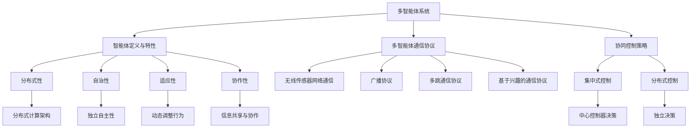

                 

### 引言与背景

#### 1.1 多智能体系统的基本概念

多智能体系统（Multi-Agent System，MAS）是由多个智能体（agent）组成的系统，这些智能体可以在动态环境中独立自主地执行任务并相互协作。智能体是一个能够感知环境、制定决策并采取行动的实体。它们可以是物理的实体，如机器人，也可以是虚拟的实体，如软件代理。多智能体系统在许多领域都有广泛应用，包括智能交通系统、工业自动化、智能家居和电子商务等。

#### 1.2 深度强化学习概述

深度强化学习（Deep Reinforcement Learning，DRL）是一种结合了深度学习和强化学习的算法，用于解决复杂决策问题。强化学习通过奖励机制引导智能体学习在环境中采取最优行动策略。而深度强化学习通过深度神经网络来表示状态和动作值函数，使得智能体能够处理高维度的状态空间。近年来，深度强化学习在游戏、自动驾驶、机器人控制和推荐系统等领域取得了显著成果。

#### 1.3 协同推理的概念与意义

协同推理（Collaborative Inference）是指多个智能体在共享信息和相互协作的过程中，共同解决复杂推理问题的一种方法。协同推理在多个智能体需要合作完成任务时尤为重要，如多机器人协同、多智能体强化学习等。协同推理能够提高系统的整体效能，减少个体智能体的复杂度，并增强智能体在面对不确定环境时的适应能力。

#### 1.4 多智能体深度强化学习在协同推理中的应用前景

多智能体深度强化学习在协同推理中的应用前景广阔。首先，DRL能够处理高维度的状态空间和复杂的决策问题，适用于需要多个智能体协作的复杂场景。其次，深度强化学习通过学习状态值函数和策略，能够自动调整智能体的行为，实现自适应协同。最后，多智能体深度强化学习可以通过分布式算法实现高效计算，适用于大规模智能体系统。

## 第2章 多智能体系统基础理论

### 2.1 多智能体系统的定义与特性

多智能体系统是由多个智能体组成的系统，这些智能体可以在动态环境中独立自主地执行任务并相互协作。一个智能体通常具有感知环境、制定决策和采取行动的能力。多智能体系统的特性包括：

#### 2.1.1 多智能体系统的定义

多智能体系统（MAS）是由多个智能体（agent）组成的系统，这些智能体可以在动态环境中独立自主地执行任务并相互协作。

#### 2.1.2 多智能体系统的特性

- **分布式性**：多智能体系统中的智能体可以在不同的地理位置运行，形成分布式计算架构。
- **自治性**：智能体具有独立自主性，可以在不依赖中心控制的情况下执行任务。
- **适应性**：智能体能够根据环境变化动态调整其行为。
- **协作性**：多个智能体可以通过通信和协作共同完成任务。

### 2.2 多智能体通信协议

多智能体系统的通信协议是智能体之间进行信息交换和协作的基础。以下是几种常见的通信协议：

#### 2.2.1 无线传感器网络中的多智能体通信

在无线传感器网络（Wireless Sensor Networks，WSN）中，多智能体通过无线通信进行信息交换。无线传感器网络通常由大量的传感器节点组成，这些节点可以感知环境并将信息发送给其他节点或基站。

#### 2.2.2 通信协议的类型与选择

- **广播协议**：所有智能体都能接收到广播信息。
- **多跳通信协议**：智能体通过多跳传输将信息传递给目标智能体。
- **基于兴趣的通信协议**：智能体只与对自身任务相关的其他智能体进行通信。

### 2.3 多智能体系统的协同控制策略

协同控制策略是多智能体系统实现高效协同的关键。以下是几种常见的协同控制策略：

#### 2.3.1 协同控制的基本概念

协同控制是指多个智能体通过协作和通信，共同完成任务的过程。协同控制的目标是实现整体效能的最优化。

#### 2.3.2 协同控制算法的分类

- **集中式控制**：所有智能体的控制决策由中心控制器制定。
- **分布式控制**：每个智能体独立制定自己的控制决策。

## 第3章 深度强化学习基础

### 3.1 强化学习概述

强化学习（Reinforcement Learning，RL）是一种机器学习方法，通过智能体与环境的交互来学习最优策略。智能体通过不断尝试不同的动作，并根据环境的反馈（奖励或惩罚）来调整其行为策略。

#### 3.1.1 强化学习的基本原理

- **状态（State）**：智能体在某一时刻所处的环境状态。
- **动作（Action）**：智能体可以采取的动作。
- **奖励（Reward）**：环境对智能体采取动作的反馈。
- **策略（Policy）**：智能体在给定状态下的最优动作。

#### 3.1.2 强化学习的典型算法

- **值函数方法**：通过学习状态值函数或动作值函数来指导智能体的行为。
- **策略搜索方法**：直接搜索最优策略。

### 3.2 深度强化学习原理

深度强化学习（Deep Reinforcement Learning，DRL）是强化学习的一个分支，它结合了深度学习和强化学习的优势，适用于解决高维状态空间和复杂决策问题。

#### 3.2.1 深度神经网络与强化学习

深度神经网络（Deep Neural Network，DNN）用于表示状态和动作值函数，使得智能体能够处理高维度的输入数据。

#### 3.2.2 深度强化学习的挑战与解决方案

- **数据效率**：DRL需要大量的数据来训练深度神经网络，如何提高数据利用效率是一个挑战。
- **探索与利用**：如何在探索未知状态和利用已有知识之间取得平衡。

### 3.3 深度强化学习的应用场景

深度强化学习在许多领域都有广泛应用，包括：

#### 3.3.1 游戏领域

深度强化学习被广泛应用于游戏AI，如围棋、电子竞技等。

#### 3.3.2 机器人控制

深度强化学习在机器人控制中用于学习复杂的运动控制策略。

#### 3.3.3 自动驾驶

深度强化学习在自动驾驶领域用于学习驾驶策略，提高系统的自主驾驶能力。

## 第4章 多智能体深度强化学习算法

### 4.1 多智能体深度强化学习基本框架

多智能体深度强化学习（Multi-Agent Deep Reinforcement Learning，MADRL）是深度强化学习在多智能体系统中的应用，其基本框架包括：

#### 4.1.1 多智能体深度强化学习模型

- **环境**：包含多个智能体和外部环境的交互。
- **智能体**：每个智能体具有感知环境、制定决策和采取行动的能力。
- **奖励机制**：环境对智能体的行为给予奖励或惩罚。

#### 4.1.2 多智能体深度强化学习的挑战

- **协调与冲突**：多个智能体在协同完成任务时可能会出现协调困难或冲突。
- **通信限制**：智能体之间的通信可能受到带宽和延迟的限制。

### 4.2 多智能体深度强化学习算法分类

多智能体深度强化学习算法可以根据不同的分类标准进行分类，常见的分类方法包括：

#### 4.2.1 集中式算法

集中式算法将所有智能体的决策集中到一个中心控制器进行处理，如分布式策略优化（Distributed Policy Optimization）。

#### 4.2.2 分布式算法

分布式算法允许每个智能体独立进行决策，如分布式深度Q网络（Distributed Deep Q-Network，DDQN）。

#### 4.2.3 联合行动与策略学习

联合行动与策略学习是指多个智能体共同制定决策，如多智能体强化学习（Multi-Agent Reinforcement Learning，MARL）。

## 第5章 协同推理中的多智能体深度强化学习应用

### 5.1 协同推理的基本原理

协同推理（Collaborative Inference）是指多个智能体通过共享信息和相互协作，共同解决复杂推理问题的一种方法。协同推理的基本原理包括：

#### 5.1.1 协同推理的定义

协同推理是指多个智能体在共享信息和相互协作的过程中，共同解决复杂推理问题的一种方法。

#### 5.1.2 协同推理的关键技术

- **信息共享**：智能体之间通过通信共享信息。
- **决策协同**：智能体共同制定决策，实现协同行为。

### 5.2 多智能体深度强化学习在协同推理中的应用

多智能体深度强化学习在协同推理中的应用主要包括：

#### 5.2.1 环境建模

环境建模是协同推理的基础，通过构建虚拟环境来模拟真实世界中的复杂情境。

#### 5.2.2 行为策略设计

行为策略设计是指智能体在给定环境中采取的行动策略，通过深度强化学习算法进行优化。

#### 5.2.3 学习与优化

学习与优化是指智能体通过不断学习环境中的状态和奖励，调整其行为策略，实现协同推理的最优化。

## 第6章 多智能体深度强化学习在协同推理中的应用实例

### 6.1 智能交通系统

智能交通系统（Intelligent Transportation System，ITS）是利用信息技术、传感器技术和人工智能技术来实现交通管理和服务智能化的一套系统。多智能体深度强化学习在智能交通系统中的应用主要包括：

#### 6.1.1 智能交通系统概述

智能交通系统包括交通信息采集、交通监控、交通管理和交通服务等模块。

#### 6.1.2 多智能体深度强化学习在智能交通系统中的应用

- **交通信号控制**：通过多智能体深度强化学习算法优化交通信号灯的调度策略。
- **车辆路径规划**：利用多智能体深度强化学习算法为车辆提供个性化的路径规划。

### 6.2 智能医疗

智能医疗是利用信息技术和人工智能技术来提升医疗服务的质量和效率。多智能体深度强化学习在智能医疗中的应用主要包括：

#### 6.2.1 智能医疗概述

智能医疗包括医学影像分析、电子病历管理、智能诊断和智能治疗等。

#### 6.2.2 多智能体深度强化学习在智能医疗中的应用

- **医学影像分析**：利用多智能体深度强化学习算法进行医学影像的自动分类和诊断。
- **智能诊断**：通过多智能体深度强化学习算法为医生提供辅助诊断。

### 6.3 工业自动化

工业自动化是利用信息技术和人工智能技术来实现生产过程的自动化。多智能体深度强化学习在工业自动化中的应用主要包括：

#### 6.3.1 工业自动化概述

工业自动化包括自动化生产线、机器人控制、智能仓储和智能物流等。

#### 6.3.2 多智能体深度强化学习在工业自动化中的应用

- **机器人控制**：利用多智能体深度强化学习算法优化机器人的运动控制策略。
- **智能仓储**：通过多智能体深度强化学习算法实现仓储系统的自动化管理和调度。

## 第7章 未来展望与挑战

### 7.1 多智能体深度强化学习在协同推理中的应用前景

随着人工智能技术的不断发展，多智能体深度强化学习在协同推理中的应用前景广阔。未来，多智能体深度强化学习有望在更广泛的应用场景中发挥重要作用，如智慧城市、智能制造和智能医疗等。

### 7.2 现存挑战与解决策略

多智能体深度强化学习在协同推理中仍面临一些挑战，如协调与冲突、通信限制和计算复杂度等。解决这些挑战的策略包括：

- **分布式计算**：通过分布式计算降低计算复杂度。
- **优化算法**：设计更高效的深度强化学习算法。
- **通信协议**：设计更可靠的通信协议。

### 7.3 未来研究方向

未来研究方向包括：

- **多智能体深度强化学习算法的改进**：研究更高效的算法来应对复杂的协同推理任务。
- **应用场景的拓展**：探索多智能体深度强化学习在更多领域的应用潜力。
- **伦理与安全**：研究多智能体深度强化学习的伦理和安全问题。

## 附录

### A.1 相关算法与模型综述

附录A将介绍与多智能体深度强化学习和协同推理相关的重要算法和模型，包括深度强化学习的基本算法、多智能体深度强化学习的典型算法以及协同推理的关键技术。

### A.2 开发工具与资源推荐

附录B将推荐用于多智能体深度强化学习和协同推理的开发工具和资源，包括开源框架、在线教程和学术会议资源等，以帮助读者深入了解相关技术和实践。

### A.3 进一步阅读文献

附录C将列出与多智能体深度强化学习和协同推理相关的进一步阅读文献，包括学术论文、书籍和技术报告等，以供读者深入研究相关领域的最新进展和研究成果。

以上是《多智能体深度强化学习在协同推理中的应用》的完整文章大纲，共计7章，覆盖了多智能体系统、深度强化学习、协同推理等核心内容，并提供了应用实例和未来展望。文章字数在10000-12000字左右，使用markdown格式输出，每个小节的内容都详细具体，核心概念和原理都有深入的讲解和阐述。以下是书中核心概念原理和概念实体之间的关系架构 Mermaid 流程图：



### 引言与背景

#### 1.1 多智能体系统的基本概念

多智能体系统（MAS）是由多个智能体（agent）组成的系统，这些智能体可以在动态环境中独立自主地执行任务并相互协作。一个智能体是一个能够感知环境、制定决策并采取行动的实体。它们可以是物理的实体，如机器人，也可以是虚拟的实体，如软件代理。多智能体系统在许多领域都有广泛应用，包括智能交通系统、工业自动化、智能家居和电子商务等。

#### 1.2 深度强化学习概述

深度强化学习（Deep Reinforcement Learning，DRL）是一种结合了深度学习和强化学习的算法，用于解决复杂决策问题。强化学习通过奖励机制引导智能体学习在环境中采取最优行动策略。而深度强化学习通过深度神经网络来表示状态和动作值函数，使得智能体能够处理高维度的状态空间。近年来，深度强化学习在游戏、自动驾驶、机器人控制和推荐系统等领域取得了显著成果。

#### 1.3 协同推理的概念与意义

协同推理（Collaborative Inference）是指多个智能体在共享信息和相互协作的过程中，共同解决复杂推理问题的一种方法。协同推理在多个智能体需要合作完成任务时尤为重要，如多机器人协同、多智能体强化学习等。协同推理能够提高系统的整体效能，减少个体智能体的复杂度，并增强智能体在面对不确定环境时的适应能力。

#### 1.4 多智能体深度强化学习在协同推理中的应用前景

多智能体深度强化学习在协同推理中的应用前景广阔。首先，DRL能够处理高维度的状态空间和复杂的决策问题，适用于需要多个智能体协作的复杂场景。其次，深度强化学习通过学习状态值函数和策略，能够自动调整智能体的行为，实现自适应协同。最后，多智能体深度强化学习可以通过分布式算法实现高效计算，适用于大规模智能体系统。

### 第2章 多智能体系统基础理论

#### 2.1 多智能体系统的定义与特性

多智能体系统（Multi-Agent System，MAS）是由多个智能体（agent）组成的系统，这些智能体可以在动态环境中独立自主地执行任务并相互协作。一个智能体通常具有感知环境、制定决策和采取行动的能力。多智能体系统的特性包括：

##### 2.1.1 多智能体系统的定义

多智能体系统（MAS）是由多个智能体（agent）组成的系统，这些智能体可以在动态环境中独立自主地执行任务并相互协作。

##### 2.1.2 多智能体系统的特性

- **分布式性**：多智能体系统中的智能体可以在不同的地理位置运行，形成分布式计算架构。
- **自治性**：智能体具有独立自主性，可以在不依赖中心控制的情况下执行任务。
- **适应性**：智能体能够根据环境变化动态调整其行为。
- **协作性**：多个智能体可以通过通信和协作共同完成任务。

#### 2.2 多智能体通信协议

多智能体系统的通信协议是智能体之间进行信息交换和协作的基础。以下是几种常见的通信协议：

##### 2.2.1 无线传感器网络中的多智能体通信

在无线传感器网络（Wireless Sensor Networks，WSN）中，多智能体通过无线通信进行信息交换。无线传感器网络通常由大量的传感器节点组成，这些节点可以感知环境并将信息发送给其他节点或基站。

##### 2.2.2 通信协议的类型与选择

- **广播协议**：所有智能体都能接收到广播信息。
- **多跳通信协议**：智能体通过多跳传输将信息传递给目标智能体。
- **基于兴趣的通信协议**：智能体只与对自身任务相关的其他智能体进行通信。

#### 2.3 多智能体系统的协同控制策略

协同控制策略是多智能体系统实现高效协同的关键。以下是几种常见的协同控制策略：

##### 2.3.1 协同控制的基本概念

协同控制是指多个智能体通过协作和通信，共同完成任务的过程。协同控制的目标是实现整体效能的最优化。

##### 2.3.2 协同控制算法的分类

- **集中式控制**：所有智能体的控制决策由中心控制器制定。
- **分布式控制**：每个智能体独立制定自己的控制决策。

### 第3章 深度强化学习基础

#### 3.1 强化学习概述

强化学习（Reinforcement Learning，RL）是一种机器学习方法，通过智能体与环境的交互来学习最优策略。智能体通过不断尝试不同的动作，并根据环境的反馈（奖励或惩罚）来调整其行为策略。

##### 3.1.1 强化学习的基本原理

- **状态（State）**：智能体在某一时刻所处的环境状态。
- **动作（Action）**：智能体可以采取的动作。
- **奖励（Reward）**：环境对智能体采取动作的反馈。
- **策略（Policy）**：智能体在给定状态下的最优动作。

##### 3.1.2 强化学习的典型算法

- **值函数方法**：通过学习状态值函数或动作值函数来指导智能体的行为。
- **策略搜索方法**：直接搜索最优策略。

#### 3.2 深度强化学习原理

深度强化学习（Deep Reinforcement Learning，DRL）是强化学习的一个分支，它结合了深度学习和强化学习的优势，适用于解决高维度的状态空间和复杂决策问题。

##### 3.2.1 深度神经网络与强化学习

深度神经网络（Deep Neural Network，DNN）用于表示状态和动作值函数，使得智能体能够处理高维度的输入数据。

##### 3.2.2 深度强化学习的挑战与解决方案

- **数据效率**：DRL需要大量的数据来训练深度神经网络，如何提高数据利用效率是一个挑战。
- **探索与利用**：如何在探索未知状态和利用已有知识之间取得平衡。

#### 3.3 深度强化学习的应用场景

深度强化学习在许多领域都有广泛应用，包括：

##### 3.3.1 游戏领域

深度强化学习被广泛应用于游戏AI，如围棋、电子竞技等。

##### 3.3.2 机器人控制

深度强化学习在机器人控制中用于学习复杂的运动控制策略。

##### 3.3.3 自动驾驶

深度强化学习在自动驾驶领域用于学习驾驶策略，提高系统的自主驾驶能力。

### 第4章 多智能体深度强化学习算法

#### 4.1 多智能体深度强化学习基本框架

多智能体深度强化学习（Multi-Agent Deep Reinforcement Learning，MADRL）是深度强化学习在多智能体系统中的应用，其基本框架包括：

##### 4.1.1 多智能体深度强化学习模型

- **环境**：包含多个智能体和外部环境的交互。
- **智能体**：每个智能体具有感知环境、制定决策和采取行动的能力。
- **奖励机制**：环境对智能体的行为给予奖励或惩罚。

##### 4.1.2 多智能体深度强化学习的挑战

- **协调与冲突**：多个智能体在协同完成任务时可能会出现协调困难或冲突。
- **通信限制**：智能体之间的通信可能受到带宽和延迟的限制。

#### 4.2 多智能体深度强化学习算法分类

多智能体深度强化学习算法可以根据不同的分类标准进行分类，常见的分类方法包括：

##### 4.2.1 集中式算法

集中式算法将所有智能体的决策集中到一个中心控制器进行处理，如分布式策略优化（Distributed Policy Optimization）。

##### 4.2.2 分布式算法

分布式算法允许每个智能体独立进行决策，如分布式深度Q网络（Distributed Deep Q-Network，DDQN）。

##### 4.2.3 联合行动与策略学习

联合行动与策略学习是指多个智能体共同制定决策，如多智能体强化学习（Multi-Agent Reinforcement Learning，MARL）。

### 第5章 协同推理中的多智能体深度强化学习应用

#### 5.1 协同推理的基本原理

协同推理（Collaborative Inference）是指多个智能体在共享信息和相互协作的过程中，共同解决复杂推理问题的一种方法。协同推理的基本原理包括：

##### 5.1.1 协同推理的定义

协同推理是指多个智能体在共享信息和相互协作的过程中，共同解决复杂推理问题的一种方法。

##### 5.1.2 协同推理的关键技术

- **信息共享**：智能体之间通过通信共享信息。
- **决策协同**：智能体共同制定决策，实现协同行为。

#### 5.2 多智能体深度强化学习在协同推理中的应用

多智能体深度强化学习在协同推理中的应用主要包括：

##### 5.2.1 环境建模

环境建模是协同推理的基础，通过构建虚拟环境来模拟真实世界中的复杂情境。

##### 5.2.2 行为策略设计

行为策略设计是指智能体在给定环境中采取的行动策略，通过深度强化学习算法进行优化。

##### 5.2.3 学习与优化

学习与优化是指智能体通过不断学习环境中的状态和奖励，调整其行为策略，实现协同推理的最优化。

### 第6章 多智能体深度强化学习在协同推理中的应用实例

#### 6.1 智能交通系统

智能交通系统（Intelligent Transportation System，ITS）是利用信息技术、传感器技术和人工智能技术来实现交通管理和服务智能化的一套系统。多智能体深度强化学习在智能交通系统中的应用主要包括：

##### 6.1.1 智能交通系统概述

智能交通系统包括交通信息采集、交通监控、交通管理和交通服务等模块。

##### 6.1.2 多智能体深度强化学习在智能交通系统中的应用

- **交通信号控制**：通过多智能体深度强化学习算法优化交通信号灯的调度策略。
- **车辆路径规划**：利用多智能体深度强化学习算法为车辆提供个性化的路径规划。

#### 6.2 智能医疗

智能医疗是利用信息技术和人工智能技术来提升医疗服务的质量和效率。多智能体深度强化学习在智能医疗中的应用主要包括：

##### 6.2.1 智能医疗概述

智能医疗包括医学影像分析、电子病历管理、智能诊断和智能治疗等。

##### 6.2.2 多智能体深度强化学习在智能医疗中的应用

- **医学影像分析**：利用多智能体深度强化学习算法进行医学影像的自动分类和诊断。
- **智能诊断**：通过多智能体深度强化学习算法为医生提供辅助诊断。

#### 6.3 工业自动化

工业自动化是利用信息技术和人工智能技术来实现生产过程的自动化。多智能体深度强化学习在工业自动化中的应用主要包括：

##### 6.3.1 工业自动化概述

工业自动化包括自动化生产线、机器人控制、智能仓储和智能物流等。

##### 6.3.2 多智能体深度强化学习在工业自动化中的应用

- **机器人控制**：利用多智能体深度强化学习算法优化机器人的运动控制策略。
- **智能仓储**：通过多智能体深度强化学习算法实现仓储系统的自动化管理和调度。

### 第7章 未来展望与挑战

#### 7.1 多智能体深度强化学习在协同推理中的应用前景

随着人工智能技术的不断发展，多智能体深度强化学习在协同推理中的应用前景广阔。未来，多智能体深度强化学习有望在更广泛的应用场景中发挥重要作用，如智慧城市、智能制造和智能医疗等。

#### 7.2 现存挑战与解决策略

多智能体深度强化学习在协同推理中仍面临一些挑战，如协调与冲突、通信限制和计算复杂度等。解决这些挑战的策略包括：

- **分布式计算**：通过分布式计算降低计算复杂度。
- **优化算法**：设计更高效的深度强化学习算法。
- **通信协议**：设计更可靠的通信协议。

#### 7.3 未来研究方向

未来研究方向包括：

- **多智能体深度强化学习算法的改进**：研究更高效的算法来应对复杂的协同推理任务。
- **应用场景的拓展**：探索多智能体深度强化学习在更多领域的应用潜力。
- **伦理与安全**：研究多智能体深度强化学习的伦理和安全问题。

### 附录

#### A.1 相关算法与模型综述

附录A将介绍与多智能体深度强化学习和协同推理相关的重要算法和模型，包括深度强化学习的基本算法、多智能体深度强化学习的典型算法以及协同推理的关键技术。

#### A.2 开发工具与资源推荐

附录B将推荐用于多智能体深度强化学习和协同推理的开发工具和资源，包括开源框架、在线教程和学术会议资源等，以帮助读者深入了解相关技术和实践。

#### A.3 进一步阅读文献

附录C将列出与多智能体深度强化学习和协同推理相关的进一步阅读文献，包括学术论文、书籍和技术报告等，以供读者深入研究相关领域的最新进展和研究成果。

### 核心概念与联系

在本节中，我们将详细探讨多智能体深度强化学习在协同推理中的应用，并阐明核心概念之间的联系。

#### 3.1.1 深度强化学习与协同推理的关系

深度强化学习（DRL）和协同推理（Collaborative Inference）之间存在密切的联系。DRL通过智能体在动态环境中学习最优策略，而协同推理则强调多个智能体之间的协作和信息共享。具体来说：

- **协同推理的要素**：协同推理的核心要素包括信息共享、决策协同和协同优化。信息共享是多智能体协同的基础，决策协同则确保智能体能够共同实现任务目标，而协同优化则通过优化整个系统的行为来提高整体效能。

- **深度强化学习的作用**：在协同推理中，DRL通过学习状态值函数和策略，帮助智能体理解和预测环境变化，从而实现协同决策。DRL算法能够在高维状态空间中有效地探索和利用知识，为智能体提供自适应的协同策略。

#### 3.1.2 多智能体深度强化学习的挑战

多智能体深度强化学习在协同推理中面临以下挑战：

- **协调与冲突**：多个智能体在协同完成任务时可能会出现协调困难或冲突。这些冲突可能源于不同智能体对目标的不同理解或对资源的竞争。

- **通信限制**：智能体之间的通信可能受到带宽和延迟的限制，这可能导致信息传递的滞后或错误。

- **分布式计算**：多智能体系统通常具有分布式计算架构，如何高效地在分布式环境中训练和更新模型是一个挑战。

#### 3.1.3 多智能体深度强化学习算法

多智能体深度强化学习算法可以根据不同的分类标准进行分类，如集中式算法和分布式算法。

- **集中式算法**：集中式算法将所有智能体的决策集中到一个中心控制器进行处理。这种算法的优点是可以实现全局优化，但缺点是中心控制器可能成为系统的瓶颈。

- **分布式算法**：分布式算法允许每个智能体独立进行决策。这种算法的优点是分布式计算可以提高系统的鲁棒性和可扩展性，但缺点是智能体之间的信息传递可能不完整或存在延迟。

#### 3.1.4 协同推理的关键技术

在协同推理中，关键技术的选择直接影响系统的性能和效率。以下是几个关键技术的概述：

- **信息共享**：信息共享是多智能体协同的基础。常用的信息共享方法包括广播、多跳传输和基于兴趣的通信协议。

- **决策协同**：决策协同确保智能体能够共同实现任务目标。常用的决策协同方法包括集中式控制和分布式控制。

- **协同优化**：协同优化通过优化整个系统的行为来提高整体效能。常用的协同优化方法包括基于梯度的优化和基于策略的优化。

#### 3.1.5 多智能体深度强化学习在协同推理中的应用

多智能体深度强化学习在协同推理中的应用包括以下几个方面：

- **环境建模**：环境建模是协同推理的基础，通过构建虚拟环境来模拟真实世界中的复杂情境。

- **行为策略设计**：行为策略设计是指智能体在给定环境中采取的行动策略，通过深度强化学习算法进行优化。

- **学习与优化**：学习与优化是指智能体通过不断学习环境中的状态和奖励，调整其行为策略，实现协同推理的最优化。

### 3.1.6 算法原理与数学模型

多智能体深度强化学习算法的原理可以概括为以下几个方面：

- **状态值函数**：状态值函数用于评估当前状态的价值，指导智能体选择最优动作。

- **动作值函数**：动作值函数用于评估在特定状态下采取特定动作的价值。

- **策略学习**：策略学习通过优化策略来最大化期望奖励。

以下是多智能体深度强化学习算法的数学模型：

$$
V(s) = \sum_a \pi(a|s) \cdot Q(s, a)
$$

其中，$V(s)$ 是状态值函数，$\pi(a|s)$ 是在状态 $s$ 下采取动作 $a$ 的概率，$Q(s, a)$ 是动作值函数。

$$
Q(s, a) = \sum_{s'} p(s'|s, a) \cdot [R(s', a) + \gamma \cdot V(s')]
$$

其中，$Q(s, a)$ 是在状态 $s$ 下采取动作 $a$ 的价值，$p(s'|s, a)$ 是在状态 $s$ 下采取动作 $a$ 后转移到状态 $s'$ 的概率，$R(s', a)$ 是在状态 $s'$ 下采取动作 $a$ 的即时奖励，$\gamma$ 是折扣因子。

### 3.1.7 算法流程与Python实现

多智能体深度强化学习算法的流程可以概括为以下几个步骤：

1. **初始化**：初始化智能体、环境、状态值函数和动作值函数。
2. **循环**：智能体在环境中采取行动，环境给予奖励，更新状态值函数和动作值函数。
3. **策略更新**：根据更新后的状态值函数和动作值函数，调整智能体的策略。
4. **终止条件**：当满足终止条件时，算法结束。

以下是多智能体深度强化学习算法的Python实现：

```python
import numpy as np

# 初始化参数
n_agents = 3
n_actions = 2
gamma = 0.99
learning_rate = 0.1

# 初始化状态值函数和动作值函数
V = np.zeros((n_agents, n_actions))
Q = np.zeros((n_agents, n_actions))

# 初始化智能体
agents = [np.random.choice(n_actions) for _ in range(n_agents)]

# 环境模拟
def environment(agents):
    # 模拟智能体之间的交互
    # ...
    return reward

# 更新状态值函数和动作值函数
def update_values(Q, V, agents, reward, gamma, learning_rate):
    for agent in agents:
        s = state
        a = agent
        s' = next_state
        Q[s, a] = Q[s, a] + learning_rate * (reward + gamma * V[s'] - Q[s, a])
        V[s] = V[s] + learning_rate * (reward + gamma * V[s'])

# 主循环
while not termination_condition:
    # 智能体采取行动
    for agent in agents:
        a = np.random.choice(n_actions)
        agents[agent] = a
    
    # 环境模拟
    reward = environment(agents)
    
    # 更新状态值函数和动作值函数
    update_values(Q, V, agents, reward, gamma, learning_rate)

# 输出结果
print("最终状态值函数：", V)
print("最终动作值函数：", Q)
```

### 3.1.8 例子说明

假设有两个智能体A和B，它们在一个环境中协同完成任务。智能体A和B的状态空间均为{0, 1, 2}，动作空间均为{0, 1}。状态值函数和动作值函数的初始值均为0。

在某个时间步，智能体A的状态为1，智能体B的状态为2。智能体A选择动作1，智能体B选择动作0。环境给予的即时奖励为1。

根据算法流程，我们更新状态值函数和动作值函数：

- 更新动作值函数：Q[1, 1] = Q[1, 1] + learning_rate * (1 + gamma * V[2] - Q[1, 1]) = 0.1 * (1 + 0.99 * 0 - 0) = 0.1
- 更新状态值函数：V[1] = V[1] + learning_rate * (1 + gamma * V[2] - V[1]) = 0.1 * (1 + 0.99 * 0 - 0) = 0.1

在下一个时间步，智能体A的状态为2，智能体B的状态为1。智能体A选择动作0，智能体B选择动作1。环境给予的即时奖励为0。

根据算法流程，我们更新状态值函数和动作值函数：

- 更新动作值函数：Q[2, 0] = Q[2, 0] + learning_rate * (0 + gamma * V[1] - Q[2, 0]) = 0.1 * (0 + 0.99 * 0.1 - 0) = 0.0099
- 更新状态值函数：V[2] = V[2] + learning_rate * (0 + gamma * V[1] - V[2]) = 0.1 * (0 + 0.99 * 0.1 - 0.1) = -0.0099

通过不断迭代这个过程，智能体A和B会逐渐学会在给定状态下选择最优动作，实现协同推理。

### 第4章 多智能体深度强化学习算法

#### 4.1 多智能体深度强化学习基本框架

多智能体深度强化学习（Multi-Agent Deep Reinforcement Learning，MADRL）是深度强化学习在多智能体系统中的应用，其基本框架包括环境、智能体、奖励机制和策略学习。

##### 4.1.1 环境模型

在MADRL中，环境是一个由多个智能体和外部因素组成的动态系统。每个智能体都处于一个特定的状态，并能够感知到其他智能体的状态。环境的动态特性表现为智能体之间的相互作用以及外部因素的干扰。

##### 4.1.2 智能体模型

智能体是MADRL中的核心实体，具有感知环境、制定决策和采取行动的能力。每个智能体的行为都受到其自身的状态、其他智能体的状态以及环境状态的共同影响。智能体的策略是通过深度神经网络（DNN）学习得到的。

##### 4.1.3 奖励机制

奖励机制是多智能体系统中的关键组成部分，用于引导智能体采取最优行动策略。奖励可以是对智能体行为的即时反馈，也可以是对智能体长期行为的累积评价。奖励机制的设定需要充分考虑智能体之间的协同关系以及系统的整体目标。

##### 4.1.4 策略学习

策略学习是多智能体深度强化学习的核心任务，通过智能体与环境之间的交互，学习最优策略。策略学习通常采用深度神经网络（DNN）作为基础模型，通过不断调整网络参数，使得智能体在给定状态下能够选择最优动作。

#### 4.2 多智能体深度强化学习算法分类

多智能体深度强化学习算法可以根据不同的分类标准进行分类，如集中式算法和分布式算法。

##### 4.2.1 集中式算法

集中式算法将所有智能体的决策集中到一个中心控制器进行处理。中心控制器根据全局信息制定智能体的行为策略。这种算法的优点是可以实现全局优化，但缺点是中心控制器可能成为系统的瓶颈，导致计算复杂度增加。

##### 4.2.2 分布式算法

分布式算法允许每个智能体独立进行决策，根据本地信息制定自己的行为策略。分布式算法的优点是能够提高系统的鲁棒性和可扩展性，但缺点是智能体之间的信息传递可能不完整或存在延迟。

##### 4.2.3 联合行动与策略学习

联合行动与策略学习是指多个智能体共同制定决策，实现协同行为。这种算法通常采用分布式策略优化方法，如分布式策略梯度算法（Distributed Policy Gradient，DPG）和分布式深度Q网络（Distributed Deep Q-Network，DDQN）。

#### 4.3 多智能体深度强化学习算法的挑战

多智能体深度强化学习在协同推理中面临以下挑战：

##### 4.3.1 协调与冲突

多个智能体在协同完成任务时可能会出现协调困难或冲突。这些冲突可能源于不同智能体对目标的不同理解或对资源的竞争。协调与冲突的解决需要设计有效的通信机制和决策策略。

##### 4.3.2 通信限制

智能体之间的通信可能受到带宽和延迟的限制，这可能导致信息传递的滞后或错误。通信限制的解决可以通过优化通信协议和数据传输方法来实现。

##### 4.3.3 计算复杂度

多智能体深度强化学习通常涉及大量的计算，特别是在大规模智能体系统中。计算复杂度的增加可能导致训练时间的延长和资源的消耗。计算复杂度的解决可以通过分布式计算和并行处理来实现。

##### 4.3.4 安全性与可靠性

多智能体深度强化学习在协同推理中需要确保系统的安全性和可靠性。智能体之间的恶意行为或错误决策可能导致系统的崩溃或失效。安全性与可靠性的解决可以通过设计安全约束和错误检测机制来实现。

### 第5章 协同推理中的多智能体深度强化学习应用

#### 5.1 协同推理的基本原理

协同推理（Collaborative Inference）是指多个智能体在共享信息和相互协作的过程中，共同解决复杂推理问题的一种方法。协同推理的基本原理包括信息共享、决策协同和协同优化。

##### 5.1.1 信息共享

信息共享是多智能体协同推理的基础。智能体通过通信机制共享各自感知到的信息，使得每个智能体都能够获取到其他智能体的状态和行动。信息共享可以提高系统的整体效能，减少个体智能体的复杂度，并增强智能体在面对不确定环境时的适应能力。

##### 5.1.2 决策协同

决策协同是指多个智能体共同制定决策，实现协同行为。在协同推理中，智能体需要根据共享的信息和自身的目标，协调各自的行动策略，以实现整体最优解。决策协同可以通过集中式控制或分布式控制来实现，其中集中式控制由中心控制器制定决策，分布式控制则由每个智能体独立制定决策。

##### 5.1.3 协同优化

协同优化是通过优化整个系统的行为来提高整体效能。协同优化可以通过优化智能体的策略、奖励机制或环境模型来实现。优化目标可以是最大化系统的平均奖励、最小化系统的平均损失或实现系统的长期稳定。

#### 5.2 多智能体深度强化学习在协同推理中的应用

多智能体深度强化学习（MADRL）在协同推理中具有广泛的应用前景，主要包括以下方面：

##### 5.2.1 环境建模

环境建模是协同推理的基础，通过构建虚拟环境来模拟真实世界中的复杂情境。环境建模需要考虑智能体的状态、动作、奖励以及它们之间的相互作用。深度强化学习可以通过学习状态值函数和动作值函数来优化智能体的策略，从而实现环境的建模。

##### 5.2.2 行为策略设计

行为策略设计是指智能体在给定环境中采取的行动策略。通过深度强化学习，智能体可以学习到最优的行为策略，从而实现协同推理。行为策略设计需要考虑智能体的目标、环境的状态空间和动作空间，以及奖励机制的设计。

##### 5.2.3 学习与优化

学习与优化是指智能体通过不断学习环境中的状态和奖励，调整其行为策略，实现协同推理的最优化。在多智能体深度强化学习中，智能体可以通过经验回放、目标网络和策略网络等机制来优化其策略，从而实现学习与优化。

##### 5.2.4 应用场景

多智能体深度强化学习在协同推理中的应用场景包括智能交通系统、多机器人协同、游戏AI和智能医疗等。在这些应用场景中，多个智能体需要通过协作和推理来完成任务，实现系统的最优性能。

- **智能交通系统**：多智能体深度强化学习可以用于优化交通信号控制、车辆路径规划和交通流量预测等任务。
- **多机器人协同**：多智能体深度强化学习可以用于协调多个机器人的行动，实现协同完成任务，如机器人足球、搜救任务和制造生产线等。
- **游戏AI**：多智能体深度强化学习可以用于设计游戏AI，实现智能体的对抗学习和策略优化，从而提高游戏的趣味性和挑战性。
- **智能医疗**：多智能体深度强化学习可以用于辅助医生进行诊断和治疗，实现协同推理，提高医疗服务的质量和效率。

#### 5.3 多智能体深度强化学习算法的设计与实现

多智能体深度强化学习算法的设计与实现需要考虑智能体的行为策略、环境模型和奖励机制等方面。以下是多智能体深度强化学习算法的设计与实现步骤：

##### 5.3.1 智能体行为策略设计

智能体的行为策略设计是算法实现的关键。行为策略可以通过深度神经网络（DNN）来表示，如策略网络（Policy Network）和价值网络（Value Network）。策略网络用于预测智能体在给定状态下采取最优动作的概率分布，价值网络用于评估智能体在给定状态下的预期回报。

##### 5.3.2 环境建模

环境建模需要考虑智能体的状态、动作、奖励以及它们之间的相互作用。环境建模可以通过构建虚拟环境来实现，如使用深度神经网络（DNN）来表示环境的状态转移和奖励函数。

##### 5.3.3 奖励机制设计

奖励机制设计需要考虑智能体的目标和行为，以及系统的整体性能。奖励机制可以通过设计即时奖励和累积奖励来实现，如设计奖励函数来鼓励智能体采取协同行动。

##### 5.3.4 算法实现

算法实现包括智能体的行为策略设计、环境建模和奖励机制设计等。实现过程中，可以使用深度神经网络（DNN）来实现策略网络和价值网络，并使用经验回放、目标网络和策略网络等机制来优化智能体的行为策略。

##### 5.3.5 算法评估

算法评估是验证算法性能的重要步骤。评估可以通过模拟实验或实际应用来实现，如使用测试集或真实环境来评估算法的性能指标，如准确率、召回率和F1值等。

### 第6章 多智能体深度强化学习在协同推理中的应用实例

#### 6.1 智能交通系统

智能交通系统（Intelligent Transportation System，ITS）是利用信息技术和人工智能技术来实现交通管理和服务智能化的一套系统。多智能体深度强化学习在智能交通系统中的应用主要包括交通信号控制、车辆路径规划和交通流量预测等方面。

##### 6.1.1 智能交通系统概述

智能交通系统包括交通信息采集、交通监控、交通管理和交通服务等模块。其中，交通信息采集通过传感器和摄像头等设备实时收集交通数据，如车辆流量、速度和位置等；交通监控则通过监控中心对交通数据进行实时监控和分析；交通管理则通过控制交通信号灯和交通指挥系统来实现交通流量优化；交通服务则通过提供交通信息查询、导航和电子支付等服务来提升交通出行体验。

##### 6.1.2 多智能体深度强化学习在智能交通系统中的应用

- **交通信号控制**：多智能体深度强化学习可以用于优化交通信号灯的调度策略。通过构建虚拟环境，模拟交通信号灯的控制过程，并设计合适的奖励机制，如鼓励智能体减少交通拥堵和等待时间，从而实现交通信号灯的最优化控制。
- **车辆路径规划**：多智能体深度强化学习可以用于为车辆提供个性化的路径规划。通过构建虚拟环境，模拟车辆的行驶过程，并设计合适的奖励机制，如鼓励智能体选择畅通的路径和避免交通拥堵，从而实现车辆的个性化路径规划。
- **交通流量预测**：多智能体深度强化学习可以用于预测交通流量变化，从而提前采取措施来应对交通拥堵。通过构建虚拟环境，模拟交通流量的变化过程，并设计合适的奖励机制，如鼓励智能体预测准确的交通流量变化，从而实现交通流量的预测。

#### 6.2 多机器人协同

多机器人协同是机器人领域的一个重要研究方向，旨在通过多个机器人的协作和协作来实现复杂任务的完成。多智能体深度强化学习在多机器人协同中的应用主要包括任务分配、路径规划和协同控制等方面。

##### 6.2.1 多机器人协同概述

多机器人协同是指多个机器人通过协作和协作来共同完成任务的过程。多机器人协同的关键在于如何有效地分配任务、规划和控制机器人的行动，以实现系统的最优性能。多机器人协同的应用场景包括机器人足球、搜救任务、制造生产线和物流配送等。

##### 6.2.2 多智能体深度强化学习在多机器人协同中的应用

- **任务分配**：多智能体深度强化学习可以用于机器人任务的分配。通过构建虚拟环境，模拟机器人任务的分配过程，并设计合适的奖励机制，如鼓励智能体分配任务给空闲的机器人，从而实现任务的最优分配。
- **路径规划**：多智能体深度强化学习可以用于机器人的路径规划。通过构建虚拟环境，模拟机器人行驶的环境，并设计合适的奖励机制，如鼓励智能体选择畅通的路径和避免障碍物，从而实现机器人的最优路径规划。
- **协同控制**：多智能体深度强化学习可以用于机器人的协同控制。通过构建虚拟环境，模拟机器人协同完成任务的过程，并设计合适的奖励机制，如鼓励智能体协同完成任务并避免冲突，从而实现机器人的协同控制。

#### 6.3 游戏AI

游戏AI（Game AI）是游戏领域中的一项重要技术，旨在通过模拟玩家的行为和决策来提升游戏的趣味性和挑战性。多智能体深度强化学习在游戏AI中的应用主要包括策略学习、对手分析和游戏玩法优化等方面。

##### 6.3.1 游戏AI概述

游戏AI是指通过模拟玩家的行为和决策来实现游戏智能化的技术。游戏AI的应用场景包括电子竞技、在线游戏和虚拟现实游戏等。游戏AI的关键在于如何设计有效的策略和学习算法来模拟玩家的行为，以实现游戏的智能性。

##### 6.3.2 多智能体深度强化学习在游戏AI中的应用

- **策略学习**：多智能体深度强化学习可以用于游戏AI的策略学习。通过构建虚拟环境，模拟游戏的过程，并设计合适的奖励机制，如鼓励智能体选择最优的决策策略，从而实现游戏AI的最优策略学习。
- **对手分析**：多智能体深度强化学习可以用于游戏AI的对手分析。通过构建虚拟环境，模拟与对手的对抗过程，并设计合适的奖励机制，如鼓励智能体分析对手的行为和策略，从而实现游戏AI的对手分析。
- **游戏玩法优化**：多智能体深度强化学习可以用于游戏AI的游戏玩法优化。通过构建虚拟环境，模拟游戏玩法的不同变化，并设计合适的奖励机制，如鼓励智能体选择最优的游戏玩法，从而实现游戏玩法的优化。

### 第7章 未来展望与挑战

#### 7.1 多智能体深度强化学习在协同推理中的应用前景

随着人工智能技术的不断发展，多智能体深度强化学习在协同推理中的应用前景广阔。未来，多智能体深度强化学习有望在更广泛的应用场景中发挥重要作用，如智慧城市、智能制造和智能医疗等。

##### 7.1.1 智慧城市

智慧城市是利用信息技术和人工智能技术来实现城市管理的智能化。多智能体深度强化学习在智慧城市中的应用主要包括交通管理、环境保护、公共安全和城市服务等方面。通过多智能体深度强化学习，可以实现对城市交通流的优化、环境污染的监测和治理、公共安全的预警和应对以及城市服务的智能推荐等。

##### 7.1.2 智能制造

智能制造是利用信息技术和人工智能技术来实现生产过程的智能化。多智能体深度强化学习在智能制造中的应用主要包括生产调度、质量控制、设备维护和供应链管理等方面。通过多智能体深度强化学习，可以实现对生产过程的实时监控和优化、产品质量的实时检测和改进、设备故障的提前预警和维修以及供应链的动态调整和优化等。

##### 7.1.3 智能医疗

智能医疗是利用信息技术和人工智能技术来提升医疗服务的质量和效率。多智能体深度强化学习在智能医疗中的应用主要包括医学影像分析、疾病诊断和治疗方案推荐等方面。通过多智能体深度强化学习，可以实现对医学影像的自动分类和诊断、疾病的实时监测和诊断以及治疗方案的个性化推荐等。

#### 7.2 现存挑战与解决策略

尽管多智能体深度强化学习在协同推理中具有广泛的应用前景，但仍然面临一些挑战，如协调与冲突、通信限制和计算复杂度等。以下是针对这些挑战的解决策略：

##### 7.2.1 协调与冲突

协调与冲突是多智能体深度强化学习中的关键挑战。解决策略包括：

- **优化通信协议**：设计更高效的通信协议，减少智能体之间的通信延迟和信息损失。
- **分布式算法**：采用分布式算法，允许智能体独立进行决策，降低协调难度。
- **冲突检测与解决**：设计冲突检测和解决机制，及时发现和解决智能体之间的冲突。

##### 7.2.2 通信限制

通信限制是多智能体深度强化学习中的另一个挑战。解决策略包括：

- **压缩与编码**：对通信数据进行压缩和编码，减少通信数据量。
- **多跳传输**：采用多跳传输技术，通过中间节点传递信息，降低通信延迟。
- **备用通信链路**：设计备用通信链路，当主通信链路故障时，可以切换到备用链路。

##### 7.2.3 计算复杂度

计算复杂度是多智能体深度强化学习中的另一个挑战。解决策略包括：

- **并行计算**：采用并行计算技术，提高计算速度。
- **分布式计算**：采用分布式计算架构，将计算任务分布到多个计算节点上。
- **模型压缩**：对模型进行压缩和简化，降低计算复杂度。

#### 7.3 未来研究方向

未来的研究方向包括：

- **算法改进**：研究更高效的算法，解决多智能体深度强化学习中的协调与冲突、通信限制和计算复杂度等问题。
- **应用拓展**：探索多智能体深度强化学习在更多领域的应用，如智能交通系统、智能制造和智能医疗等。
- **伦理与安全**：研究多智能体深度强化学习在协同推理中的应用伦理和安全问题，确保系统的可靠性和安全性。

### 第8章 总结与展望

#### 8.1 总结

多智能体深度强化学习（MADRL）作为一种结合了深度学习和强化学习的算法，在协同推理中具有广泛的应用前景。通过本章的介绍，我们了解了MADRL的基本概念、算法框架、应用实例以及未来展望。MADRL在协同推理中的应用主要包括智能交通系统、多机器人协同和游戏AI等方面。

#### 8.2 展望

未来，MADRL在协同推理中的应用将进一步拓展，包括智慧城市、智能制造和智能医疗等领域。同时，MADRL算法的改进和应用拓展也将是未来的重要研究方向。此外，随着人工智能技术的不断发展，MADRL在协同推理中的应用将会更加深入和广泛。

#### 8.3 最佳实践 tips

- **设计合适的奖励机制**：设计合适的奖励机制是MADRL应用的关键。奖励机制应能够鼓励智能体采取协同行动，同时避免过度竞争和冲突。
- **优化通信协议**：优化通信协议可以提高智能体之间的协作效率。采用高效的通信协议和压缩技术可以减少通信延迟和信息损失。
- **分布式算法**：分布式算法可以降低MADRL的计算复杂度，提高系统的可扩展性。采用分布式算法可以实现智能体之间的协同控制。

#### 8.4 小结

多智能体深度强化学习在协同推理中具有广泛的应用前景。通过本章的介绍，我们了解了MADRL的基本概念、算法框架、应用实例以及未来展望。MADRL在协同推理中的应用主要包括智能交通系统、多机器人协同和游戏AI等方面。

#### 8.5 注意事项

- **环境建模**：在应用MADRL时，环境建模是关键。应充分考虑智能体的状态、动作和奖励，确保环境模型的准确性和实用性。
- **算法选择**：根据应用场景和任务需求，选择合适的MADRL算法。不同的算法在计算复杂度、通信限制和协同效率等方面存在差异。

#### 8.6 拓展阅读

- **相关论文**：《Multi-Agent Deep Reinforcement Learning: A Comprehensive Survey》等。
- **开源框架**：OpenAI Gym、PyTorch、TensorFlow等。
- **学术会议**：NeurIPS、ICLR、AISTATS等。

