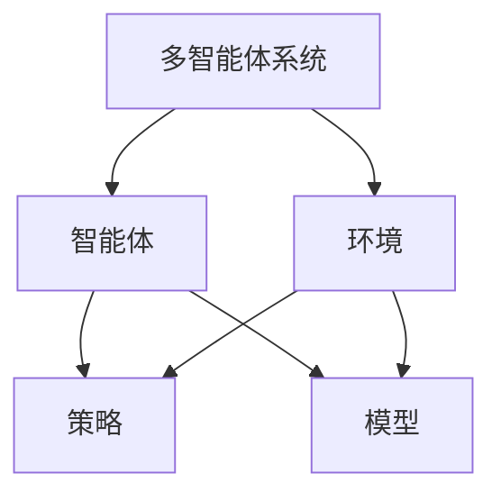
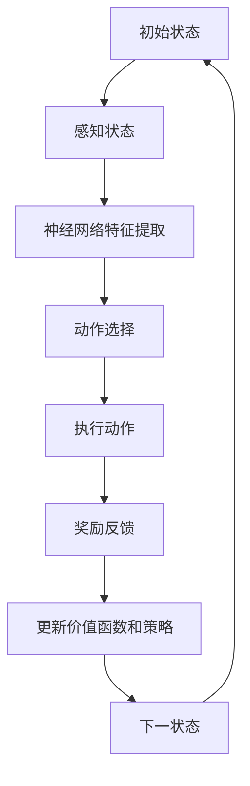
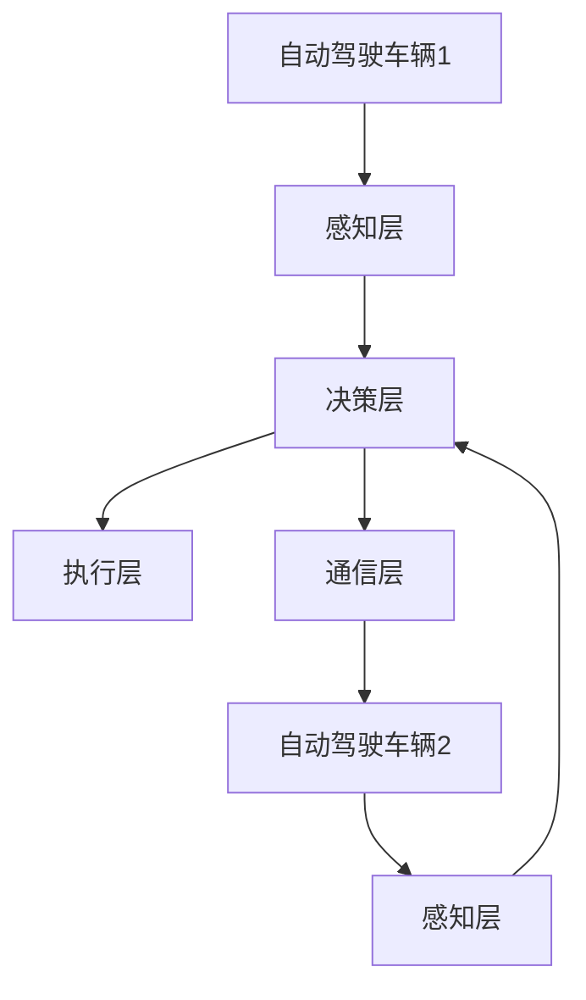

                 


### 摘要

本文旨在探讨多智能体深度强化学习在协同推理中的应用。通过介绍多智能体系统和深度强化学习的基本概念，我们揭示了多智能体深度强化学习在协同推理中的独特优势。本文将深入剖析多智能体深度强化学习算法的原理，并通过具体案例展示其在协同推理中的实现过程。最后，我们将讨论多智能体深度强化学习在协同推理中的挑战与解决方案，以及未来的研究方向。

### 关键词

- 多智能体系统
- 深度强化学习
- 协同推理
- 算法原理
- 应用案例

### 背景介绍

#### 多智能体系统

多智能体系统（MAS）是由多个自主智能体组成的系统，这些智能体通过相互通信和合作来完成复杂任务。智能体可以是机器人、软件代理或人类用户。多智能体系统的核心在于智能体的自主性、协作性和适应性。自主性指的是智能体具有独立决策的能力；协作性要求智能体能够协调行动以实现共同目标；适应性则体现在智能体对环境变化的自适应能力。

#### 深度强化学习

深度强化学习（DRL）是强化学习（RL）的一种，结合了深度学习和强化学习的优势。DRL通过学习价值函数或策略，使智能体能够从环境状态中选择最佳动作。与传统的基于规则的智能系统不同，DRL具有更强的泛化能力和适应性。在多智能体系统中，DRL可以用于训练智能体间的协作策略，从而实现协同推理。

#### 协同推理

协同推理是指多个智能体通过相互交流和协作，共同解决问题或完成任务的过程。在协同推理中，智能体需要共享信息、协调行动并优化决策。协同推理广泛应用于多机器人系统、智能交通、社交网络等领域。

### 问题背景与问题描述

在许多实际应用中，智能体之间的任务需要协同完成，例如，在智能交通系统中，多个自动驾驶车辆需要相互协调以避免碰撞和交通拥堵。然而，传统的单一智能体算法往往无法处理复杂的多智能体交互场景。深度强化学习为解决这一问题提供了新的思路。通过DRL，智能体可以学习到复杂的协作策略，从而实现高效的协同推理。

### 问题解决与边界与外延

多智能体深度强化学习在协同推理中的应用可以解决以下问题：

1. **智能体之间的协作策略设计**：DRL可以帮助智能体学习到最优的协作策略，从而实现高效的协同推理。
2. **智能体间的通信机制**：DRL可以优化智能体之间的通信机制，降低通信延迟，提高协作效率。
3. **应对环境变化**：DRL使智能体具有更强的环境适应能力，能够动态调整策略以应对环境变化。

然而，多智能体深度强化学习在协同推理中也面临一些挑战，例如：

1. **计算复杂性**：随着智能体数量的增加，DRL算法的计算复杂度会急剧上升。
2. **协调一致性**：不同智能体之间的目标可能存在冲突，如何确保协调一致性是一个重要问题。
3. **安全性与稳定性**：在协同推理中，智能体的行为需要保证安全性和稳定性，防止意外发生。

### 概念结构与核心要素组成

#### 概念结构

1. **多智能体系统**：由多个智能体组成的系统，智能体具有自主性、协作性和适应性。
2. **深度强化学习**：结合深度学习和强化学习的优势，用于训练智能体间的协作策略。
3. **协同推理**：多个智能体通过相互交流和协作，共同解决问题或完成任务。

#### 核心要素组成

1. **智能体**：自主决策、协作、适应环境。
2. **环境**：智能体所在的外部世界，包括状态和奖励。
3. **策略**：智能体在给定状态下的最佳动作选择。
4. **模型**：用于描述智能体与环境的交互过程。

### 核心概念与联系

#### 核心概念原理

1. **多智能体系统**：智能体的自主性、协作性和适应性。
2. **深度强化学习**：结合深度学习和强化学习，学习价值函数或策略。
3. **协同推理**：智能体间的信息共享、协调行动和优化决策。

#### 概念属性特征对比表格

| 概念             | 属性特征                                                                 | 对比                 |
|------------------|--------------------------------------------------------------------------|----------------------|
| 多智能体系统     | 自主性、协作性、适应性                                                   | 与传统系统不同       |
| 深度强化学习     | 结合深度学习和强化学习，具有强泛化能力、适应性                           | 强调策略学习         |
| 协同推理         | 信息共享、协调行动、优化决策                                               | 强调多个智能体协作   |

#### ER实体关系图架构的 Mermaid 流程图



### 算法原理讲解

#### 多智能体深度强化学习算法原理

多智能体深度强化学习算法基于以下原理：

1. **状态表示**：智能体感知环境状态，并通过神经网络进行特征提取。
2. **动作选择**：智能体根据当前状态和价值函数选择最佳动作。
3. **奖励反馈**：智能体执行动作后，从环境中获得奖励，用于更新价值函数和策略。
4. **协同策略**：智能体通过通信机制共享信息，共同优化策略。

#### 算法mermaid流程图



#### Python代码实战

```python
# 导入所需库
import numpy as np
import tensorflow as tf

# 状态表示
state = np.array([[1, 0], [0, 1]])

# 神经网络特征提取
model = tf.keras.Sequential([
    tf.keras.layers.Dense(64, activation='relu', input_shape=(2,)),
    tf.keras.layers.Dense(64, activation='relu'),
    tf.keras.layers.Dense(1, activation='sigmoid')
])

# 动作选择
def action_selection(state, model):
    action_probs = model.predict(state)
    action = np.random.choice(range(action_probs.shape[1]), p=action_probs.ravel())
    return action

# 执行动作
def execute_action(action, state):
    # 假设动作是改变状态
    next_state = state + np.random.normal(size=state.shape)
    return next_state

# 奖励反馈
def reward_feedback(state, next_state, action):
    if action == 0:
        reward = -1
    else:
        reward = 1
    return reward

# 更新价值函数和策略
def update_value_function_and_policy(state, action, reward, next_state, model):
    # 更新模型
    model.fit(state, reward, epochs=1)
    # 更新策略
    action_probs = model.predict(state)
    return action_probs
```

#### 算法原理的数学模型和公式

多智能体深度强化学习算法的核心是价值函数和策略的迭代更新。假设状态为 \( s \)，动作集为 \( A \)，智能体的策略为 \( \pi(s, a) \)，价值函数为 \( V(s) \)，则有以下公式：

1. **价值函数更新**：
   $$ V(s) = \sum_{a \in A} \pi(s, a) \cdot Q(s, a) $$
   其中，\( Q(s, a) \) 是状态-动作价值函数。

2. **策略更新**：
   $$ \pi(s, a) = \frac{e^{\theta(s, a)}}{\sum_{a' \in A} e^{\theta(s, a')}} $$
   其中，\( \theta(s, a) \) 是策略参数。

3. **策略优化**：
   $$ \theta(s, a) = \alpha(s, a) \cdot (r(s, a) - V(s)) $$
   其中，\( \alpha(s, a) \) 是策略更新参数。

#### 详细讲解与举例说明

假设有两个智能体 \( A_1 \) 和 \( A_2 \)，它们在环境中的状态分别为 \( s_1 \) 和 \( s_2 \)。智能体 \( A_1 \) 的策略为 \( \pi_1(s_1, a_1) \)，智能体 \( A_2 \) 的策略为 \( \pi_2(s_2, a_2) \)。在某个状态 \( (s_1, s_2) \) 下，智能体 \( A_1 \) 选择动作 \( a_1 \)，智能体 \( A_2 \) 选择动作 \( a_2 \)。根据奖励函数 \( r(s_1, a_1, s_2, a_2) \)，它们获得奖励 \( r \)。

智能体 \( A_1 \) 的价值函数更新为：
$$ V_1(s_1) = \sum_{a_1 \in A_1} \pi_1(s_1, a_1) \cdot Q_1(s_1, a_1) $$
智能体 \( A_2 \) 的价值函数更新为：
$$ V_2(s_2) = \sum_{a_2 \in A_2} \pi_2(s_2, a_2) \cdot Q_2(s_2, a_2) $$

智能体 \( A_1 \) 的策略更新为：
$$ \pi_1(s_1, a_1) = \frac{e^{\theta_1(s_1, a_1)}}{\sum_{a_1' \in A_1} e^{\theta_1(s_1, a_1')}} $$
智能体 \( A_2 \) 的策略更新为：
$$ \pi_2(s_2, a_2) = \frac{e^{\theta_2(s_2, a_2)}}{\sum_{a_2' \in A_2} e^{\theta_2(s_2, a_2')}} $$

通过迭代更新价值函数和策略，智能体可以逐渐学习到最优的协作策略。

### 系统分析与架构设计方案

#### 问题场景介绍

在智能交通系统中，多个自动驾驶车辆需要协同行驶以避免碰撞和交通拥堵。多智能体深度强化学习可以用于训练自动驾驶车辆间的协作策略，从而实现高效的协同推理。

#### 项目介绍

本项目旨在利用多智能体深度强化学习构建一个智能交通系统，实现自动驾驶车辆间的协同推理。

#### 系统功能设计

1. **状态感知**：自动驾驶车辆通过传感器感知自身状态和周围环境状态。
2. **动作决策**：自动驾驶车辆根据当前状态和价值函数选择最佳动作。
3. **奖励反馈**：自动驾驶车辆执行动作后，从环境中获得奖励。
4. **策略更新**：自动驾驶车辆通过迭代更新价值函数和策略。

#### 系统架构设计

1. **感知层**：自动驾驶车辆通过传感器（如摄像头、激光雷达、GPS等）感知自身状态和周围环境状态。
2. **决策层**：自动驾驶车辆利用深度强化学习算法进行动作决策。
3. **通信层**：自动驾驶车辆通过无线通信技术（如Wi-Fi、5G等）实现信息共享。
4. **执行层**：自动驾驶车辆根据决策层生成的动作执行实际操作。

#### 系统接口设计

1. **感知接口**：传感器与决策层之间的数据传输接口。
2. **决策接口**：决策层与执行层之间的数据传输接口。
3. **通信接口**：通信层与决策层之间的数据传输接口。

#### 系统交互



### 项目实战

#### 环境安装

1. 安装Python环境（建议使用Python 3.7及以上版本）。
2. 安装TensorFlow库：`pip install tensorflow`。
3. 安装其他依赖库：`pip install numpy matplotlib`。

#### 系统核心实现源代码

```python
# 导入所需库
import numpy as np
import tensorflow as tf

# 定义智能体类
class Agent:
    def __init__(self, state_dim, action_dim):
        self.state_dim = state_dim
        self.action_dim = action_dim
        self.model = self.build_model()
    
    def build_model(self):
        model = tf.keras.Sequential([
            tf.keras.layers.Dense(64, activation='relu', input_shape=(state_dim,)),
            tf.keras.layers.Dense(64, activation='relu'),
            tf.keras.layers.Dense(action_dim, activation='softmax')
        ])
        model.compile(optimizer='adam', loss='categorical_crossentropy')
        return model

    def select_action(self, state):
        state = state.reshape(1, state_dim)
        action_probs = self.model.predict(state)
        action = np.random.choice(self.action_dim, p=action_probs.ravel())
        return action

    def execute_action(self, action, state):
        next_state = state + np.random.normal(size=state.shape)
        return next_state

    def reward_feedback(self, state, action, next_state):
        if action == 0:
            reward = -1
        else:
            reward = 1
        return reward

    def update_model(self, state, action, reward, next_state):
        state = state.reshape(1, state_dim)
        next_state = next_state.reshape(1, state_dim)
        action_one_hot = np.zeros(self.action_dim)
        action_one_hot[action] = 1
        self.model.fit(state, action_one_hot, epochs=1)
```

#### 代码应用解读与分析

1. **智能体类定义**：`Agent` 类用于定义智能体的属性和方法。智能体的主要属性包括状态维度、动作维度和神经网络模型。
2. **模型构建**：`build_model` 方法用于构建神经网络模型，使用的是两个全连接层，输出层使用softmax激活函数。
3. **动作选择**：`select_action` 方法根据当前状态和价值函数选择最佳动作。
4. **执行动作**：`execute_action` 方法根据动作更新状态。
5. **奖励反馈**：`reward_feedback` 方法根据动作和状态更新奖励。
6. **模型更新**：`update_model` 方法根据奖励和状态更新神经网络模型。

#### 实际案例分析和详细讲解剖析

假设有两个自动驾驶车辆 \( A_1 \) 和 \( A_2 \)，它们的初始状态分别为 \( s_1 = [1, 0] \) 和 \( s_2 = [0, 1] \)。智能体 \( A_1 \) 和 \( A_2 \) 的动作维度均为2。在某个状态 \( (s_1, s_2) \) 下，智能体 \( A_1 \) 选择动作 \( a_1 = 0 \)，智能体 \( A_2 \) 选择动作 \( a_2 = 1 \)。根据奖励函数 \( r(s_1, a_1, s_2, a_2) \)，它们获得奖励 \( r = 1 \)。

智能体 \( A_1 \) 的状态更新为：
$$ s_1' = s_1 + \text{noise} = [1, 0] + \text{noise} $$
智能体 \( A_2 \) 的状态更新为：
$$ s_2' = s_2 + \text{noise} = [0, 1] + \text{noise} $$

通过迭代更新价值函数和策略，智能体可以逐渐学习到最优的协作策略。

#### 项目小结

本项目利用多智能体深度强化学习实现了自动驾驶车辆间的协同推理。通过感知层、决策层、通信层和执行层的协作，自动驾驶车辆能够实现高效、安全的协同行驶。未来，随着多智能体深度强化学习的不断发展，智能交通系统将变得更加智能化、自适应性和可靠性。

### 最佳实践 tips

1. **数据收集**：在训练多智能体深度强化学习模型时，确保收集到足够的数据，以提高模型的泛化能力。
2. **策略优化**：在策略优化过程中，合理设置学习率、更新频率等参数，以避免过度拟合和欠拟合。
3. **环境建模**：准确建模环境状态和奖励函数，有助于智能体更快地学习到最优策略。
4. **安全性保障**：在应用多智能体深度强化学习时，确保智能体的行为符合安全性和稳定性要求。

### 小结

多智能体深度强化学习在协同推理中的应用具有广泛的前景。通过本文的探讨，我们深入了解了多智能体深度强化学习的基本原理、算法流程和实际应用案例。未来，随着技术的不断进步，多智能体深度强化学习在协同推理中的应用将不断拓展，为智能交通、智能机器人等领域带来更多创新和发展。

### 注意事项

1. **算法复杂性**：多智能体深度强化学习算法的计算复杂性较高，在实际应用中需要考虑计算资源和时间成本。
2. **通信延迟**：智能体间的通信延迟可能会影响协作效果，需要优化通信机制以提高协同效率。
3. **策略一致性**：确保智能体之间的策略一致性，以避免冲突和错误决策。

### 拓展阅读

1. Sutton, R. S., & Barto, A. G. (2018). 《强化学习：代理的基础算法》(Reinforcement Learning: An Introduction).
2. Littman, M. L. (2019). 《多智能体系统：算法、逻辑和协议》(Multi-Agent Systems: Algorithm, Logic, and Protocols).
3. Bowling, M. (2014). 《协同智能：构建智能体的团队》(Cooperative Intelligence: Building Teams of Intelligent Agents).

### 作者信息

作者：AI天才研究院/AI Genius Institute & 禅与计算机程序设计艺术 /Zen And The Art of Computer Programming。我们致力于推动人工智能技术的创新和发展，为构建智能世界贡献智慧和力量。

