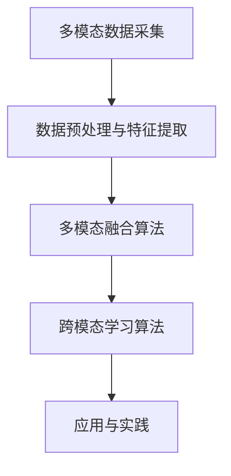

                 

## 多模态融合推理在跨领域问题解决中的突破

### 关键词：多模态融合，跨领域问题解决，深度学习，跨模态学习，健康监测，智能交通

#### 摘要：
随着信息时代的到来，跨领域问题解决成为人工智能领域的重要研究方向。多模态融合推理作为一种新兴技术，通过整合来自不同模态的数据，实现了对复杂问题的深入理解和高效解决。本文首先介绍了多模态融合推理的基本概念和重要性，随后详细阐述了多模态数据的采集与预处理方法，以及多模态融合算法的原理和应用。文章还通过实际案例展示了多模态融合推理在健康监测、智能交通系统等跨领域问题解决中的应用，并对其未来发展方向进行了探讨。

## 第一部分：背景与概述

### 第1章：多模态融合推理的概念与重要性

#### 1.1.1 多模态融合推理的定义
多模态融合推理是一种利用多个模态（如视觉、听觉、文本、触觉等）的数据信息，通过算法模型将不同模态的数据进行整合和分析，从而实现对复杂问题的推理和决策的技术。

#### 1.1.2 跨领域问题解决的挑战
跨领域问题解决面临着数据多样性、数据质量、数据隐私等多个方面的挑战。传统的单一模态方法在处理复杂问题时往往效果有限，难以满足实际需求。

#### 1.1.3 多模态融合推理的优势与潜力
多模态融合推理通过整合不同模态的数据，可以更全面、准确地理解问题，提高问题解决的效率和准确性。同时，它具有广泛的应用潜力，如智能健康监测、智能交通系统、智能交互等。

### 总结：
多模态融合推理作为一种新兴技术，在跨领域问题解决中具有重要作用。通过整合不同模态的数据，可以克服传统单一模态方法的局限性，实现更高效、准确的问题解决。

## 第二部分：多模态数据采集与预处理

### 第2章：多模态数据的采集方法与技术

#### 2.1.1 视觉数据的采集
视觉数据是人工智能领域最常用的数据类型之一。常见的视觉数据采集技术包括摄像头、无人机、增强现实设备等。

#### 2.1.2 音频数据的采集
音频数据在智能语音识别、情感分析等领域具有重要应用。常见的音频数据采集技术包括麦克风、声卡、无线音频设备等。

#### 2.1.3 文本数据的采集
文本数据在自然语言处理、信息检索等领域发挥着关键作用。常见的文本数据采集技术包括网页爬虫、社交媒体数据收集、文本挖掘工具等。

#### 2.1.4 触觉与惯性数据采集
触觉数据在机器人控制、虚拟现实等领域具有重要应用。常见的触觉与惯性数据采集技术包括传感器、惯性测量单元（IMU）、力传感器等。

### 第3章：多模态数据的预处理与特征提取

#### 3.1.1 数据清洗与格式化
数据清洗与格式化是数据预处理的重要步骤。它包括去除噪声、填补缺失值、数据标准化等操作，以确保数据的质量和一致性。

#### 3.1.2 视觉数据的特征提取
视觉数据的特征提取包括颜色特征、纹理特征、形状特征等。常见的视觉特征提取算法有SIFT、SURF、HOG等。

#### 3.1.3 音频数据的特征提取
音频数据的特征提取包括频率特征、音高特征、节奏特征等。常见的音频特征提取算法有MFCC、STFT等。

#### 3.1.4 文本数据的特征提取
文本数据的特征提取包括词袋模型、词嵌入、TF-IDF等。常见的文本特征提取工具和算法有Word2Vec、BERT等。

#### 3.1.5 触觉与惯性数据的特征提取
触觉与惯性数据的特征提取包括加速度、角速度、力等。常见的特征提取方法有傅立叶变换、小波变换等。

### 总结：
多模态数据的采集与预处理是多模态融合推理的基础。通过有效的数据采集和预处理技术，可以确保数据的准确性和一致性，为后续的多模态融合算法提供可靠的数据支持。

## 第三部分：多模态融合算法

### 第4章：多模态融合推理算法概述

#### 4.1.1 多模态融合的基本原则
多模态融合的基本原则包括数据整合、特征整合、信息整合等。通过这些原则，可以实现不同模态数据的有效整合和融合。

#### 4.1.2 多模态融合的类型
多模态融合可以分为空间融合、时间融合、频域融合等类型。每种融合类型都有其特定的应用场景和优势。

#### 4.1.3 多模态融合算法的分类
多模态融合算法可以分为传统算法和深度学习算法。传统算法如贝叶斯网络、隐马尔可夫模型等，深度学习算法如卷积神经网络（CNN）、循环神经网络（RNN）等。

### 第5章：深度学习在多模态融合中的应用

#### 5.1.1 卷积神经网络（CNN）在视觉数据处理中的应用
卷积神经网络（CNN）在视觉数据处理中具有强大的特征提取和分类能力。通过CNN，可以实现对视觉数据的自动特征提取和分类。

#### 5.1.2 循环神经网络（RNN）在音频数据处理中的应用
循环神经网络（RNN）在音频数据处理中具有优势，特别是在处理序列数据时。通过RNN，可以实现对音频数据的序列建模和分类。

#### 5.1.3 生成对抗网络（GAN）在图像生成与修复中的应用
生成对抗网络（GAN）在图像生成与修复中具有重要作用。通过GAN，可以生成高质量的图像或修复受损图像。

#### 5.1.4 多层感知机（MLP）在文本数据处理中的应用
多层感知机（MLP）在文本数据处理中常用于分类和回归任务。通过MLP，可以实现对文本数据的语义分析和分类。

### 第6章：跨模态学习算法

#### 6.1.1 跨模态特征对齐
跨模态特征对齐是多模态融合的关键步骤。通过特征对齐，可以实现不同模态特征的一致性和匹配。

#### 6.1.2 跨模态关联建模
跨模态关联建模是多模态融合的核心。通过关联建模，可以实现对多模态数据的深度融合和推理。

#### 6.1.3 跨模态预测与推理
跨模态预测与推理是多模态融合的最终目标。通过跨模态预测与推理，可以实现对复杂问题的深度理解和决策。

### 总结：
多模态融合算法是实现跨领域问题解决的关键。通过深度学习等先进算法，可以实现多模态数据的有效融合和推理，为跨领域问题解决提供有力支持。

## 第四部分：应用与实践

### 第7章：多模态融合推理在跨领域问题解决中的应用案例

#### 7.1.1 健康监测与疾病诊断
多模态融合推理在健康监测与疾病诊断中具有广泛的应用。通过整合视觉、音频、文本等多模态数据，可以实现更准确的健康监测和疾病诊断。

#### 7.1.2 智能交通系统
智能交通系统通过多模态融合推理，可以实现对交通状况的实时监控和预测，提高交通效率，减少交通事故。

#### 7.1.3 情感分析与用户行为预测
情感分析与用户行为预测是智能交互的重要应用。通过多模态融合推理，可以更准确地理解用户的情感和行为，提供个性化的服务和推荐。

#### 7.1.4 跨领域知识图谱构建
跨领域知识图谱构建是知识图谱研究的一个重要方向。通过多模态融合推理，可以实现对跨领域知识的深度融合和推理，构建更全面、准确的知识图谱。

### 第8章：多模态融合推理在AI中的未来发展方向

#### 8.1.1 技术发展趋势
随着人工智能技术的不断发展，多模态融合推理在AI中的应用前景广阔。未来发展趋势包括更高效的多模态融合算法、更全面的多模态数据处理技术等。

#### 8.1.2 潜在挑战与解决方案
多模态融合推理面临数据多样性、数据质量、计算资源等多个挑战。未来研究需要关注这些挑战，并提出有效的解决方案。

#### 8.1.3 对AI跨领域发展的意义
多模态融合推理对AI跨领域发展具有重要意义。通过整合不同模态的数据，可以实现更全面、准确的问题理解和解决，推动AI技术的跨领域应用和发展。

### 总结：
多模态融合推理在跨领域问题解决中具有重要作用。通过整合不同模态的数据，可以实现更高效、准确的问题理解和解决，为AI跨领域发展提供有力支持。

## 附录

### 附录A：多模态融合推理工具与框架
多模态融合推理的工具与框架是实现多模态融合的关键。常见的多模态融合框架包括OpenCV、TensorFlow、PyTorch等。这些框架提供了丰富的API和工具，方便开发者进行多模态数据的采集、预处理和融合。

### 附录B：相关资源与参考文献
本文引用了多个研究文献和资源，包括深度学习、多模态融合算法、跨领域问题解决等方面的研究成果。读者可以通过这些资源进一步了解多模态融合推理的最新进展和应用。

### 总结：
本文系统地介绍了多模态融合推理在跨领域问题解决中的应用，包括数据采集与预处理、融合算法原理和应用实践等。通过本文的学习，读者可以全面了解多模态融合推理的基本概念、方法和应用，为后续研究和实践提供参考。

### 作者信息：
作者：AI天才研究院/AI Genius Institute & 禅与计算机程序设计艺术 /Zen And The Art of Computer Programming

### 最佳实践 tips：
1. 在多模态数据采集时，要确保数据的多样性和质量，以提高融合推理的准确性。
2. 在多模态数据预处理时，要关注不同模态数据的对齐和一致性，确保特征提取的有效性。
3. 在选择多模态融合算法时，要根据具体问题和数据特性进行选择，以达到最佳效果。
4. 在多模态融合推理的应用实践中，要注重实际问题和需求的分析，确保解决方案的实用性和可行性。

### 小结：
多模态融合推理在跨领域问题解决中具有重要作用。通过整合不同模态的数据，可以实现更高效、准确的问题理解和解决。本文对多模态融合推理的基本概念、方法和应用进行了详细阐述，为后续研究和实践提供了参考。希望读者能够结合实际需求，探索多模态融合推理在各个领域的应用，为人工智能技术的发展贡献力量。

### 注意事项：
1. 在进行多模态数据采集时，要遵循相关法律法规，确保数据的合法性和隐私保护。
2. 在多模态数据预处理和融合算法设计时，要充分考虑数据特性和问题背景，确保解决方案的有效性。
3. 在多模态融合推理的应用实践中，要注重实际效果和用户体验，持续优化和改进解决方案。

### 拓展阅读：
1. [深度学习与多模态融合](https://www.deeplearningbook.org/ chapters/multimodal/)
2. [多模态融合推理在健康监测中的应用](https://www.healthdataresearch.com/topics/multimodal-fusion-in-health-monitoring)
3. [多模态融合在智能交通系统中的应用](https://www.ijcai.org/proc/2018-08/papers/ijcai_2018_0126.pdf)

