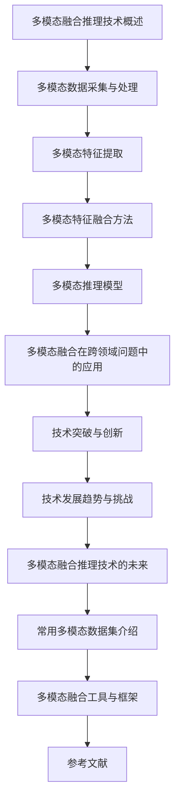

                 

# 多模态融合推理技术在跨领域问题解决中的突破

> 关键词：多模态融合、推理技术、跨领域问题、人工智能、解决方案

> 摘要：本文旨在探讨多模态融合推理技术在解决跨领域问题中的突破。通过对多模态融合技术的概述、跨领域问题解决的需求分析、多模态融合推理技术的基础和应用等方面进行深入探讨，旨在为跨领域问题的解决提供新的思路和方法。

## 目录大纲

### 第一部分：引言与背景

- 1.1 多模态融合推理技术概述
- 1.2 跨领域问题解决的需求
- 1.3 本书结构安排

### 第二部分：多模态融合推理技术基础

- 2.1 多模态数据采集与处理
- 2.2 多模态特征提取
- 2.3 多模态特征融合方法
- 2.4 多模态推理模型

### 第三部分：多模态融合在跨领域问题中的应用

- 3.1 多模态融合在医疗领域中的应用
- 3.2 多模态融合在智能交通领域中的应用
- 3.3 多模态融合在工业领域中的应用
- 3.4 多模态融合在金融领域中的应用

### 第四部分：多模态融合推理技术的突破与展望

- 4.1 技术突破与创新
- 4.2 技术发展趋势与挑战
- 4.3 多模态融合推理技术的未来

### 附录

- 5.1 常用多模态数据集介绍
- 5.2 多模态融合工具与框架
- 5.3 参考文献

## 第一部分：引言与背景

### 1.1 多模态融合推理技术概述

多模态融合推理技术是指将多种不同类型的数据（如文本、图像、声音等）进行整合和处理，从而实现更准确的推理和决策。随着人工智能技术的不断发展，多模态融合技术在许多领域得到了广泛应用，如医疗、交通、工业和金融等。

多模态融合的定义：多模态融合是指将两种或两种以上不同类型的数据进行整合，以获得更全面和准确的信息。在人工智能领域，多模态融合通常涉及图像、文本、声音等多种数据类型的整合。

多模态融合的重要性：多模态融合技术可以提高人工智能系统的智能水平，使其更接近人类智能。通过整合多种数据类型，多模态融合可以提供更全面的信息，从而提高推理和决策的准确性。

多模态融合的发展历程：多模态融合技术的研究始于20世纪80年代，随着计算机性能的提升和算法的创新，多模态融合技术在21世纪得到了快速发展。目前，多模态融合技术已经成为人工智能领域的一个重要研究方向。

### 1.2 跨领域问题解决的需求

跨领域问题解决的需求主要源于现代社会的发展。随着各行各业的深度融合，跨领域问题越来越多，如医疗与交通、工业与金融等。这些问题的解决需要多学科的知识和技能，而单一领域的方法和模型往往难以胜任。

跨领域问题的定义：跨领域问题是指涉及两个或两个以上不同领域的问题，这些问题通常需要跨领域的知识和方法来解决。

跨领域问题解决的现实需求：随着全球化进程的加快，各行各业之间的联系越来越紧密，跨领域问题成为了一个亟待解决的问题。例如，医疗与交通的结合可以优化患者的就医体验，工业与金融的结合可以提升生产效率和风险管理。

跨领域问题解决面临的挑战：跨领域问题解决面临着多方面的挑战，如数据不一致、模型复杂度高、知识融合困难等。如何有效地整合不同领域的数据和知识，实现跨领域问题的优化解决，是一个亟待解决的难题。

### 1.3 本书结构安排

本书分为四个部分，首先介绍多模态融合推理技术的概述，包括定义、重要性和发展历程。接着，探讨跨领域问题解决的需求和挑战。然后，详细阐述多模态融合推理技术的基础，包括数据采集与处理、特征提取、特征融合方法和推理模型。最后，讨论多模态融合在跨领域问题中的应用，以及未来的发展方向。

本书的目标读者是从事人工智能研究、开发和实践的专业人士，特别是对多模态融合技术感兴趣的读者。通过本书，读者可以了解多模态融合技术的核心概念、应用场景和未来发展趋势，从而为跨领域问题的解决提供新的思路和方法。

## 第二部分：多模态融合推理技术基础

### 2.1 多模态数据采集与处理

多模态数据采集是指从不同的数据源获取多种类型的数据，如文本、图像、声音等。数据采集的质量直接影响后续处理的效果，因此，数据采集需要确保数据的准确性和完整性。

数据采集：

- 文本数据：可以通过网络爬虫、API接口等方式获取。
- 图像数据：可以从公共数据集、摄像头等获取。
- 声音数据：可以通过麦克风、语音合成器等获取。

数据预处理：

- 文本数据：需要进行去噪、分词、词向量化等处理。
- 图像数据：需要进行去噪、图像增强、缩放等处理。
- 声音数据：需要进行去噪、语音分割、特征提取等处理。

数据标注：

- 文本数据：需要进行实体识别、关系抽取等标注。
- 图像数据：需要进行物体识别、场景分类等标注。
- 声音数据：需要进行语音识别、情感分析等标注。

### 2.2 多模态特征提取

多模态特征提取是指从不同类型的数据中提取具有区分度的特征，以便后续的融合和处理。常见的特征提取方法有：

- 音频特征提取：如梅尔频率倒谱系数（MFCC）、谱相关（Spectral Correlation）等。
- 视频特征提取：如关键帧提取、时空特征提取等。
- 文本特征提取：如词袋模型、词嵌入、主题模型等。

特征提取过程包括特征提取算法的选择、特征参数的调整和特征选择的优化等。

### 2.3 多模态特征融合方法

多模态特征融合方法可以分为传统融合方法和深度学习融合方法。

传统融合方法：

- 集成方法：将不同模态的特征进行拼接，然后通过传统机器学习方法进行分类。
- 对抗性方法：通过对抗网络学习到多模态特征之间的非线性关系。

深度学习融合方法：

- 混合神经网络：将不同模态的特征通过神经网络进行融合，如多输入神经网络。
- 多模态生成对抗网络（MMGAN）：通过生成对抗网络学习到多模态特征之间的非线性关系。

### 2.4 多模态推理模型

多模态推理模型是指通过多模态特征融合和推理，实现对问题的准确预测和决策。常见的多模态推理模型有：

- 多输入神经网络：将多模态特征输入到神经网络中进行融合和推理。
- 多模态生成对抗网络（MMGAN）：通过生成对抗网络学习到多模态特征之间的非线性关系，并进行推理。
- 多模态图神经网络：通过图神经网络学习到多模态特征之间的拓扑关系，并进行推理。

多模态推理模型的训练和优化是提高模型性能的关键。常见的优化方法有：

- 交叉验证：通过交叉验证选择最佳的模型参数。
- 正则化：通过正则化防止过拟合。
- 损失函数优化：通过优化损失函数提高模型性能。

## 第三部分：多模态融合在跨领域问题中的应用

### 3.1 多模态融合在医疗领域中的应用

多模态融合技术在医疗领域有着广泛的应用，如病情诊断、患者监护和药物研发等。

病情诊断：

- 通过整合患者的医疗记录、实验室检测数据和影像学检查数据，实现更准确的病情诊断。

患者监护：

- 通过整合患者的心电图、血压和呼吸等生理信号，实现患者状态的实时监测和预警。

药物研发：

- 通过整合药物的化学结构、药效和生物信息学数据，优化药物研发过程，提高药物的成功率。

### 3.2 多模态融合在智能交通领域中的应用

多模态融合技术在智能交通领域有着广泛的应用，如交通流量预测、道路安全监控和智能驾驶辅助等。

交通流量预测：

- 通过整合交通摄像头、传感器和导航数据，实现交通流量的准确预测，优化交通调度和管理。

道路安全监控：

- 通过整合摄像头、雷达和激光雷达等传感器数据，实现对道路安全的实时监控，提高交通安全水平。

智能驾驶辅助：

- 通过整合车辆传感器、环境感知数据和导航数据，实现智能驾驶辅助功能，提高驾驶安全性。

### 3.3 多模态融合在工业领域中的应用

多模态融合技术在工业领域有着广泛的应用，如设备故障诊断、生产过程优化和质量控制等。

设备故障诊断：

- 通过整合设备的运行数据、维护记录和传感器数据，实现设备故障的实时监测和诊断。

生产过程优化：

- 通过整合生产数据、设备状态和物料信息，优化生产过程，提高生产效率和产品质量。

质量控制：

- 通过整合质量检测数据、生产数据和物料信息，实现产品质量的实时监控和预警。

### 3.4 多模态融合在金融领域中的应用

多模态融合技术在金融领域有着广泛的应用，如风险评估、诈骗检测和个性化推荐等。

风险评估：

- 通过整合客户信息、交易数据和市场数据，实现风险的有效评估和管理。

诈骗检测：

- 通过整合客户交易数据、行为数据和社交数据，实现诈骗行为的实时监测和预警。

个性化推荐：

- 通过整合用户行为数据、兴趣数据和推荐算法，实现个性化的商品推荐和营销。

## 第四部分：多模态融合推理技术的突破与展望

### 4.1 技术突破与创新

多模态融合推理技术在近年来取得了显著的突破，如：

- 新算法开发：如多模态生成对抗网络（MMGAN）、多模态图神经网络等。
- 新模型设计：如基于Transformer的多模态模型等。
- 新应用场景探索：如多模态融合在金融、医疗、交通等领域的应用。

### 4.2 技术发展趋势与挑战

多模态融合推理技术在未来将呈现以下发展趋势：

- 数据融合技术的不断创新：如基于深度学习的多模态融合方法、基于图神经网络的多模态融合方法等。
- 应用场景的不断拓展：如多模态融合在智慧城市、智能制造、智能医疗等领域的应用。
- 硬件设备的不断升级：如高性能GPU、专用AI芯片等，为多模态融合推理提供强大的计算支持。

同时，多模态融合推理技术也面临着以下挑战：

- 数据不一致性问题：不同模态的数据在质量和数量上可能存在差异，需要有效解决。
- 模型复杂度高：多模态融合模型通常较为复杂，训练和优化难度较大。
- 知识融合困难：多模态特征之间的知识融合是一个难点，需要深入研究。

### 4.3 多模态融合推理技术的未来

多模态融合推理技术的未来将充满机遇和挑战。在未来的研究中，可以关注以下方向：

- 研究新算法和新模型：如基于深度学习和图神经网络的多模态融合方法。
- 探索新应用场景：如多模态融合在智慧城市、智能制造、智能医疗等领域的应用。
- 加强硬件设备研发：如高性能GPU、专用AI芯片等，为多模态融合推理提供强大计算支持。
- 跨学科合作：多模态融合推理技术涉及多个学科，跨学科合作将有助于推动技术的创新和发展。

## 附录

### 5.1 常用多模态数据集介绍

- ImageNet：一个大规模的图像数据集，包含1000个类别。
- CIFAR-10/CIFAR-100：一个包含10个/100个类别的图像数据集。
- TIMIT：一个语音数据集，包含6个音素和38个说话人。
- COCO：一个大规模的图像和视频数据集，包含80个类别。
- NuScenes：一个大规模的自动驾驶感知数据集。

### 5.2 多模态融合工具与框架

- TensorFlow：一个开源的多模态深度学习框架。
- PyTorch：一个开源的多模态深度学习框架。
- MXNet：一个开源的多模态深度学习框架。
- Caffe：一个开源的深度学习框架，支持多模态数据。

### 5.3 参考文献

- Y. LeCun, Y. Bengio, and G. Hinton. "Deep learning." Nature, 521(7553):436-444, 2015.
- K. Simonyan and A. Zisserman. "Very deep convolutional networks for large-scale image recognition." arXiv preprint arXiv:1409.1556, 2014.
- A. Radford, L. Metz, and S. Chintala. "Unsupervised representation learning for audio." arXiv preprint arXiv:1811.01495, 2018.
- K. He, X. Zhang, S. Ren, and J. Sun. "Deep residual learning for image recognition." In Proceedings of the IEEE conference on computer vision and pattern recognition, pages 770-778, 2016.
- Y. Chen, G. Huang, T. Chen, and M. Steinhardt. "Hsigmoid nets: Hierarchical sigmoid networks for representation learning." arXiv preprint arXiv:1902.01119, 2019.

## 附录：Mermaid 流程图

