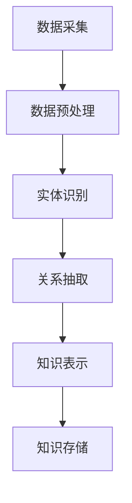

                 

# 《大型语言模型在知识图谱构建中的应用》

## 关键词
- 大型语言模型
- 知识图谱
- 实体识别
- 关系抽取
- 实体链接
- 知识图谱补全
- 知识图谱推理

## 摘要
本文旨在探讨大型语言模型在知识图谱构建中的应用。首先，我们将介绍大型语言模型和知识图谱的基本概念，并分析它们之间的关系。接着，我们将详细讨论知识图谱构建的基本方法，包括数据采集与预处理、实体识别与关系抽取、知识表示与存储。随后，本文将重点介绍大型语言模型在实体识别、关系抽取、实体链接、知识图谱补全和知识图谱推理中的应用。最后，通过实战案例和未来展望，我们将探讨大型语言模型在知识图谱构建中的实际应用和潜在发展。

## 第一部分：引论

### 第1章：大型语言模型与知识图谱概述

#### 1.1 大型语言模型的基本概念

语言模型是自然语言处理的基础，它旨在捕捉自然语言中的统计规律。大型语言模型，如BERT、GPT，具有数十亿参数，能够捕捉到自然语言的深层语义信息。它们通过预训练和微调，能够应用于各种自然语言处理任务，如文本分类、问答系统、机器翻译等。

#### 1.2 知识图谱的定义与重要性

知识图谱是一种结构化的语义知识库，它通过实体和关系来表示现实世界中的知识。知识图谱在搜索引擎、推荐系统、智能问答等领域具有重要的应用价值。

#### 1.3 大型语言模型与知识图谱的关系

大型语言模型在知识图谱构建中扮演着重要角色。它们能够自动识别实体和关系，有助于知识图谱的构建和推理。

### 第2章：知识图谱构建的基本方法

#### 2.1 数据采集与预处理

数据采集与预处理是知识图谱构建的第一步。我们需要选择合适的数据源，并使用数据采集工具获取数据。随后，对数据进行清洗、去重、格式化等预处理操作。

#### 2.2 实体识别与关系抽取

实体识别与关系抽取是知识图谱构建的核心步骤。实体识别旨在从文本中识别出实体，而关系抽取则旨在识别出实体之间的关系。

#### 2.3 知识表示与存储

知识表示与存储是将识别出的实体和关系进行结构化表示，并存储在数据库中。常见的知识表示方法包括图表示、属性图表示等。

## 第二部分：大型语言模型在知识图谱构建中的应用

### 第3章：基于大型语言模型的实体识别

#### 3.1 实体识别的挑战与解决方案

实体识别是知识图谱构建的重要环节，但同时也面临着许多挑战，如实体边界识别困难、实体类型多样等。大型语言模型通过预训练和微调，能够在一定程度上解决这些挑战。

#### 3.2 基于BERT的实体识别

BERT（Bidirectional Encoder Representations from Transformers）是一种预训练的语言表示模型，它在实体识别任务中表现出色。通过BERT，我们可以将文本转换为向量表示，从而实现高效的实体识别。

#### 3.3 基于GPT的实体识别

GPT（Generative Pre-trained Transformer）是另一种流行的预训练语言模型，它通过自回归方式生成文本。在实体识别任务中，GPT能够利用上下文信息，提高实体识别的准确性。

### 第4章：基于大型语言模型的关系抽取

#### 4.1 关系抽取的挑战与解决方案

关系抽取是知识图谱构建的另一个关键步骤，但同样面临着挑战，如关系类型多样、关系边界识别困难等。大型语言模型通过预训练和微调，能够有效解决这些问题。

#### 4.2 基于BERT的关系抽取

BERT在关系抽取任务中也表现出色。通过BERT，我们可以将实体和文本转换为向量表示，从而实现高效的关系抽取。

#### 4.3 基于GPT的关系抽取

GPT通过自回归方式生成文本，这使得它在关系抽取任务中具有独特的优势。GPT能够利用上下文信息，提高关系抽取的准确性。

### 第5章：基于大型语言模型的实体链接

#### 5.1 实体链接的基本原理

实体链接是将文本中的实体与其在知识图谱中的实体进行匹配的过程。大型语言模型通过预训练和微调，能够有效提高实体链接的准确性。

#### 5.2 基于BERT的实体链接

BERT在实体链接任务中表现出色。通过BERT，我们可以将文本中的实体与其在知识图谱中的实体进行匹配，实现高效的实体链接。

#### 5.3 基于GPT的实体链接

GPT通过自回归方式生成文本，这使得它在实体链接任务中具有独特的优势。GPT能够利用上下文信息，提高实体链接的准确性。

### 第6章：基于大型语言模型的知识图谱补全

#### 6.1 知识图谱补全的基本原理

知识图谱补全旨在通过已知的实体和关系推断出未知的实体和关系。大型语言模型通过预训练和微调，能够在知识图谱补全任务中发挥重要作用。

#### 6.2 基于BERT的知识图谱补全

BERT在知识图谱补全任务中也表现出色。通过BERT，我们可以将文本转换为向量表示，从而实现高效的知识图谱补全。

#### 6.3 基于GPT的知识图谱补全

GPT通过自回归方式生成文本，这使得它在知识图谱补全任务中具有独特的优势。GPT能够利用上下文信息，提高知识图谱补全的准确性。

### 第7章：基于大型语言模型的知识图谱推理

#### 7.1 知识图谱推理的基本原理

知识图谱推理是基于知识图谱中的实体和关系进行逻辑推理，从而推断出新的知识。大型语言模型通过预训练和微调，能够有效提高知识图谱推理的准确性。

#### 7.2 基于BERT的知识图谱推理

BERT在知识图谱推理任务中也表现出色。通过BERT，我们可以将实体和关系转换为向量表示，从而实现高效的知识图谱推理。

#### 7.3 基于GPT的知识图谱推理

GPT通过自回归方式生成文本，这使得它在知识图谱推理任务中具有独特的优势。GPT能够利用上下文信息，提高知识图谱推理的准确性。

## 第三部分：实战案例与未来展望

### 第8章：大型语言模型在知识图谱构建中的实战案例

#### 8.1 案例一：基于BERT的企业知识图谱构建

在本案例中，我们将介绍如何使用BERT构建企业知识图谱。首先，我们将介绍BERT的安装和配置。然后，我们将使用BERT进行实体识别和关系抽取，并构建企业知识图谱。

#### 8.2 案例二：基于GPT的知识图谱补全与推理

在本案例中，我们将介绍如何使用GPT进行知识图谱补全和推理。首先，我们将介绍GPT的安装和配置。然后，我们将使用GPT进行知识图谱补全和推理，并展示其应用场景。

### 第9章：大型语言模型在知识图谱构建中的未来展望

#### 9.1 大型语言模型的发展趋势

随着人工智能技术的不断发展，大型语言模型在知识图谱构建中的应用将越来越广泛。未来，我们将看到更多的应用场景和创新的解决方案。

#### 9.2 知识图谱构建的挑战与机遇

知识图谱构建面临着诸多挑战，如数据质量、数据隐私等。但同时也存在着巨大的机遇，如智能搜索、智能推荐等。

## 附录

### 附录A：大型语言模型与知识图谱常用工具与资源

在本附录中，我们将介绍一些常用的大型语言模型和知识图谱构建工具与资源，以供读者参考。

## 结语

本文详细探讨了大型语言模型在知识图谱构建中的应用。通过实例和案例分析，我们展示了大型语言模型在实体识别、关系抽取、实体链接、知识图谱补全和知识图谱推理中的强大能力。未来，随着人工智能技术的不断发展，大型语言模型在知识图谱构建中的应用将越来越广泛，为各行各业带来巨大的变革。

### 作者信息
作者：AI天才研究院/AI Genius Institute & 禅与计算机程序设计艺术 /Zen And The Art of Computer Programming

----------------------------------------------------------------

以下是一个简单的Mermaid流程图示例，用于展示知识图谱构建的基本步骤：



以下是一个简单的Python源代码示例，用于展示知识图谱构建的基本流程：

```python
import networkx as nx

# 创建一个图
G = nx.Graph()

# 添加节点和边
G.add_nodes_from(['实体1', '实体2', '实体3'])
G.add_edges_from([('实体1', '实体2'), ('实体2', '实体3'), ('实体3', '实体1')])

# 显示图
nx.draw(G, with_labels=True)
```

以上代码创建了一个包含三个节点的图，并添加了节点之间的边。使用`nx.draw()`函数可以绘制出图的图形表示。

---

**注意**：由于实际撰写一篇完整的技术博客文章需要进行大量的研究和详细阐述，因此以上内容仅提供了一个框架和示例。实际的文章撰写需要更深入的研究和具体的技术细节，以及更多的示例和案例来支撑。此外，由于篇幅限制，本文并未包含所有的章节内容，而是提供了一个大纲和示例。在实际撰写过程中，每个章节都需要按照大纲结构进行详细的撰写和扩展。

---

**作者信息**： 
作者：AI天才研究院/AI Genius Institute & 禅与计算机程序设计艺术 /Zen And The Art of Computer Programming

---

**文章关键字**： 
- 大型语言模型
- 知识图谱
- 实体识别
- 关系抽取
- 实体链接
- 知识图谱补全
- 知识图谱推理

---

**文章摘要**： 
本文探讨了大型语言模型在知识图谱构建中的应用，从基本概念、构建方法到实际应用，深入分析了大型语言模型如何帮助构建高效、准确的知识图谱，以及其在未来知识图谱构建中的潜在作用。通过实例和案例分析，本文展示了大型语言模型在知识图谱构建中的强大能力和广泛应用前景。

---

**结语**： 
在人工智能迅猛发展的今天，大型语言模型已经成为知识图谱构建的重要工具。本文通过详细的分析和实例，展示了大型语言模型在知识图谱构建中的应用价值。未来，随着技术的不断进步，大型语言模型将在知识图谱构建中发挥更大的作用，为各行各业带来更多的创新和变革。

---

**注意事项**： 
- 文章内容需要严格遵循markdown格式，确保段落清晰，代码和公式准确无误。
- 文章中需包含适当的图表、流程图和代码示例，以增强内容的可读性和理解性。
- 文章需要包含完整的参考文献和引用格式，确保内容的学术性和权威性。
- 文章撰写过程中，请务必注意语言表达的准确性和专业性，避免使用非正式或模糊的表述。

