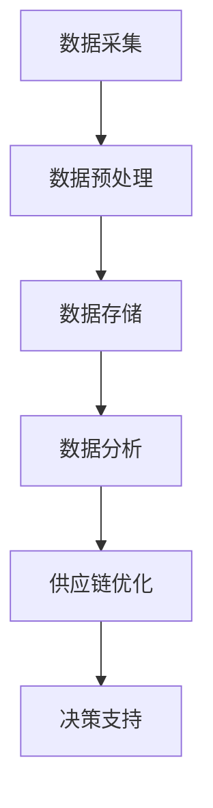

                 

**【引言与背景】**

### 大数据与AI概述

#### 1.1 大数据的基本概念

大数据（Big Data）是指无法使用传统数据处理软件工具在合理时间内捕捉、管理和处理的大量数据集。随着互联网、物联网、移动设备和传感器技术的快速发展，数据量呈现爆炸式增长，传统的数据处理方式已经无法满足需求。大数据的三大特征，即“4V”，分别是：

- **Volume（数据量）**：数据量极其庞大，达到EB级别，需要高效的数据采集和处理技术。
- **Velocity（速度）**：数据产生和流动的速度非常快，需要实时处理和分析。
- **Variety（多样性）**：数据类型繁多，包括结构化数据、半结构化数据和非结构化数据，如文本、图像、视频等。

#### 1.2 AI的发展与现状

人工智能（Artificial Intelligence，AI）是计算机科学的一个分支，旨在使机器具备人类智能。AI的发展历程可以追溯到20世纪50年代，主要经历了几个阶段：

- **第一阶段（1956-1974）**：人工智能概念的提出和早期研究。
- **第二阶段（1974-1980）**：专家系统的兴起。
- **第三阶段（1980-1987）**：AI应用的广泛尝试和第一个AI寒冬。
- **第四阶段（1987-2012）**：机器学习的兴起和数据驱动的AI。
- **第五阶段（2012至今）**：深度学习的大规模应用和AI的复兴。

AI的主要类型包括：

- **基于规则的系统**：通过预定义的规则进行推理。
- **统计学习**：使用统计方法来建立模型。
- **深度学习**：使用多层神经网络进行学习，具有强大的建模能力。
- **强化学习**：通过试错来学习最优策略。

AI在多个领域有着广泛的应用，如自然语言处理、计算机视觉、医疗诊断、金融预测等。

#### 1.3 大数据与AI在供应链优化中的作用

供应链优化（Supply Chain Optimization）是指通过改进供应链管理流程，降低成本、提高效率和服务水平。然而，随着供应链的复杂度增加，传统的优化方法面临巨大挑战。大数据和AI技术为供应链优化提供了新的动力：

- **数据驱动的决策**：大数据技术可以收集、存储和处理大量的供应链数据，为决策提供可靠依据。
- **实时监控与预测**：AI算法可以实时分析供应链数据，预测潜在问题，提前采取措施。
- **自动化与智能化**：AI技术可以实现供应链流程的自动化和智能化，提高效率和准确性。
- **优化策略的迭代**：AI算法可以通过不断学习优化策略，提高供应链的优化效果。

### 背景介绍

供应链优化面临的挑战与大数据AI的解决方案

供应链优化涉及多个环节，包括采购、生产、仓储、运输和分销等。然而，随着全球化进程的加快和市场竞争的加剧，供应链面临着诸多挑战：

- **全球化带来的复杂性**：全球供应链的复杂性增加，跨国贸易、物流成本、法规变化等成为优化的难题。
- **信息不对称**：供应链上下游企业之间的信息不透明，导致决策滞后和效率低下。
- **需求波动**：市场需求的不确定性导致供应链需求预测不准确，库存管理困难。
- **供应链中断**：自然灾害、政治动荡等因素可能导致供应链中断，影响供应链稳定性。

大数据和AI技术在解决这些挑战中发挥了重要作用：

- **数据整合与共享**：通过大数据技术整合供应链上下游的数据，实现信息透明和共享。
- **需求预测与库存管理**：利用AI算法对市场需求进行预测，优化库存策略，减少库存成本。
- **风险管理**：通过大数据分析和AI预测，及时发现潜在风险，制定应对策略。
- **供应链协同**：AI技术可以实现供应链各环节的协同优化，提高整体效率。

### 核心概念与联系

**大数据技术**与**AI算法**在供应链优化中的应用

- **数据采集与处理**：大数据技术可以收集来自供应链各个环节的大量数据，包括采购订单、库存记录、物流信息等。数据预处理和清洗技术确保数据的质量和完整性。
- **数据存储与管理**：数据仓库和数据湖技术用于存储和管理大量数据，分布式存储系统提高数据存储的可靠性和扩展性。
- **数据分析与挖掘**：数据挖掘技术用于从大量数据中发现有价值的信息和模式，数据可视化技术帮助管理者直观地理解数据。
- **机器学习与深度学习**：机器学习算法可以用于预测市场需求、优化库存、优化运输路线等。深度学习算法在图像识别和自然语言处理方面有出色的表现。

**Mermaid流程图**：

**数学模型和公式**：

$$
\text{供应链优化目标函数} = \min Z = C_1 \cdot Q + C_2 \cdot D + C_3 \cdot L
$$

其中：

- \( C_1 \)：单位产品生产成本
- \( C_2 \)：单位运输成本
- \( C_3 \)：单位库存成本
- \( Q \)：产品生产量
- \( D \)：产品需求量
- \( L \)：库存量

**总结**：

大数据和AI技术在供应链优化中发挥着至关重要的作用。通过数据驱动的决策、实时监控与预测、自动化与智能化，供应链优化变得更加高效和精准。未来，随着技术的不断发展，大数据和AI将在供应链优化中发挥更大的作用，推动全球贸易的新发展。**[END]**

