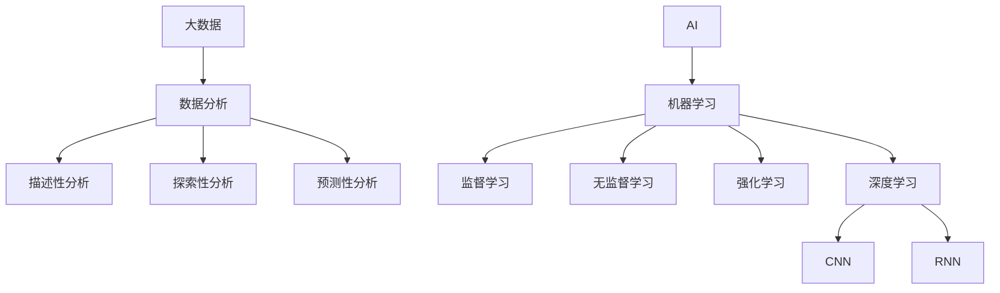
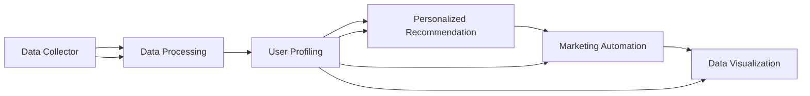
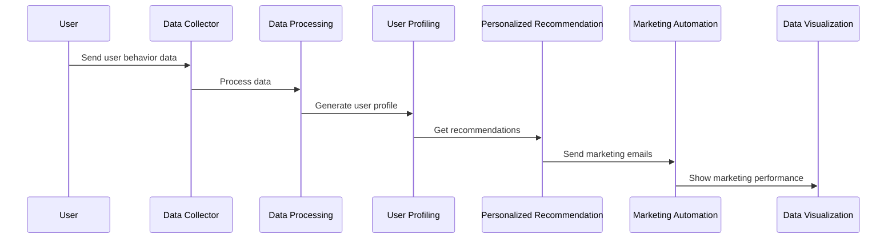
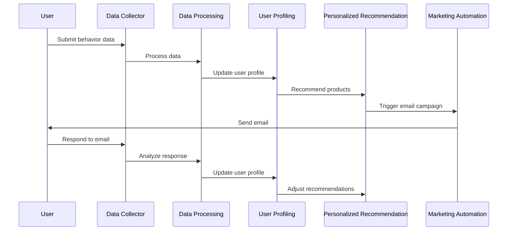

                 

# 《大数据分析与个性化营销：AI驱动的精准客户触达》

## 关键词
- 大数据分析
- 个性化营销
- AI驱动
- 精准客户触达
- 客户行为分析
- 数据可视化

## 摘要
本文将深入探讨大数据分析与个性化营销的结合，以及如何通过人工智能（AI）实现精准客户触达。首先，我们将了解大数据的基本概念、技术体系与应用场景，然后逐步引入数据分析方法，特别是描述性、探索性和预测性数据分析。接下来，我们将探讨大数据技术栈中的Hadoop和Spark生态系统，并关注大数据安全与隐私保护问题。随后，文章将转向人工智能概述，介绍人工智能的定义、分类、机器学习基础以及深度学习原理。重点将放在AI在个性化营销中的应用，包括客户行为分析、个性化推荐系统和精准营销策略。最后，我们将对AI与大数据营销的未来展望进行探讨，并总结文章的主要观点和结论。

## 第一部分：大数据分析基础

### 第1章：大数据概述

#### 1.1 大数据的定义与特征

大数据，通常指无法用传统数据库管理工具进行捕捉、管理和处理的巨量数据集。其特征主要包括“4V”：Volume（数据量）、Velocity（数据流速度）、Variety（数据种类）和Veracity（数据真实性）。

- **数据量（Volume）**：数据量巨大，从TB级别到PB级别不等，这使得传统的数据处理方法难以应对。
- **数据流速度（Velocity）**：数据产生和处理的速度非常快，需要实时或近实时分析。
- **数据种类（Variety）**：数据类型繁多，包括结构化数据、半结构化数据和非结构化数据。
- **数据真实性（Veracity）**：数据真实性难以保证，需要更高的数据质量标准。

#### 1.2 大数据的技术体系

大数据的技术体系涵盖了数据采集与存储、数据处理与分析、数据可视化等多个方面。

- **数据采集与存储技术**：包括分布式文件系统（如HDFS）和NoSQL数据库（如MongoDB、Elasticsearch）。
- **数据处理与分析技术**：涉及分布式计算框架（如Hadoop、Spark）和大数据处理引擎。
- **数据可视化技术**：利用可视化工具（如Tableau、PowerBI）将数据分析结果以图表等形式直观展示。

#### 1.3 大数据的应用场景

大数据在多个行业和领域有广泛应用：

- **金融领域**：用于风险控制、信用评分、市场预测等。
- **零售业**：用于客户行为分析、库存管理和个性化推荐等。
- **社交网络分析**：用于社交网络影响力分析、用户画像和广告投放优化等。

### 第2章：数据分析方法

#### 2.1 描述性数据分析

描述性数据分析用于描述数据的基本特征，包括数据的分布、中心趋势和离散程度等。

- **描述性统计量**：如平均数、中位数、众数、方差、标准差等。
- **数据可视化**：通过图表（如柱状图、饼图、散点图等）展示数据分布和趋势。

#### 2.2 探索性数据分析

探索性数据分析旨在通过分析数据，发现数据中的模式和异常。

- **聚类分析**：将相似的数据点分组，如K-means算法。
- **相关性分析**：分析两个或多个变量之间的关系，如皮尔逊相关系数。

#### 2.3 预测性数据分析

预测性数据分析利用历史数据建立模型，对未来趋势进行预测。

- **时间序列分析**：分析时间序列数据，预测未来趋势，如ARIMA模型。
- **回归分析**：通过建立回归模型，预测因变量的值，如线性回归、多元回归。
- **决策树与随机森林**：用于分类和回归任务，能够处理高维数据。

### 第3章：大数据技术栈

#### 3.1 Hadoop生态系统

Hadoop是一个开源的分布式计算框架，用于处理大数据集。

- **HDFS**：分布式文件系统，用于存储大数据。
- **MapReduce**：分布式数据处理模型，用于大规模数据集的并行处理。
- **YARN**：资源管理平台，用于管理和分配计算资源。
- **HBase**：分布式、可扩展的列存储数据库。
- **Hive**：数据仓库工具，用于处理大规模数据集。
- **Pig**：基于Hadoop的数据处理工具，用于转换和存储数据。

#### 3.2 Spark生态系统

Spark是一个快速、通用的大数据计算引擎。

- **Spark Core**：Spark的核心组件，提供内存计算能力。
- **Spark SQL**：用于处理结构化数据，提供SQL查询能力。
- **Spark Streaming**：用于实时流数据计算。
- **MLlib**：提供了一系列机器学习算法库。
- **GraphX**：用于图处理和分析。

### 第4章：大数据安全与隐私保护

#### 4.1 大数据安全挑战

大数据面临的安全挑战包括数据泄露、数据滥用和恶意攻击。

- **数据泄露**：数据未经授权的访问和泄露。
- **数据滥用**：内部人员或第三方滥用数据。
- **恶意攻击**：黑客攻击和数据窃取。

#### 4.2 大数据隐私保护

大数据隐私保护涉及法律法规、技术和实践。

- **隐私保护的法律法规**：如《通用数据保护条例》（GDPR）。
- **隐私保护技术**：如数据加密、匿名化处理。
- **隐私保护实践**：如数据最小化、数据访问控制等。

## 第二部分：AI与个性化营销

### 第5章：人工智能概述

#### 5.1 人工智能的定义与分类

人工智能（AI）是指模拟人类智能的计算机系统。根据实现方式，AI可以分为：

- **弱AI**：在特定领域内表现出人类智能水平。
- **强AI**：具有全面的人类智能水平。
- **弱AI**：包括专家系统、自然语言处理、机器学习等。

#### 5.2 机器学习基础

机器学习是AI的核心技术之一，分为：

- **监督学习**：有标记数据训练模型，用于分类和回归。
- **无监督学习**：没有标记数据，用于聚类和降维。
- **强化学习**：通过环境反馈学习最佳策略。

#### 5.3 深度学习原理

深度学习是一种机器学习方法，利用多层神经网络进行训练。

- **神经网络**：由多个神经元组成，用于模拟人脑处理信息。
- **卷积神经网络（CNN）**：用于图像处理。
- **递归神经网络（RNN）**：用于序列数据。

### 第6章：AI在个性化营销中的应用

#### 6.1 个性化营销概述

个性化营销是指根据客户特点提供定制化的服务和产品。

- **个性化营销的定义**：利用客户数据提供个性化的营销策略。
- **个性化营销的优势**：提高客户满意度、增加客户忠诚度和转化率。

#### 6.2 客户行为分析

客户行为分析用于理解客户的行为和偏好。

- **客户画像**：基于客户数据构建客户轮廓。
- **客户分群**：将客户分为不同的群体，以提供个性化服务。
- **客户生命周期管理**：跟踪客户从获取到流失的全过程。

#### 6.3 个性化推荐系统

个性化推荐系统用于向客户推荐感兴趣的内容或产品。

- **推荐系统原理**：基于协同过滤、基于内容过滤和混合方法。
- **推荐算法实现**：如协同过滤算法、矩阵分解和深度学习。
- **推荐系统评估**：如准确率、召回率和F1分数。

### 第7章：AI驱动的精准营销策略

#### 7.1 精准营销概述

精准营销是指通过数据分析实现目标客户的精准触达和营销。

- **精准营销的定义**：基于数据分析，实现个性化的目标客户触达。
- **精准营销的目标**：提高营销效果、降低营销成本。

#### 7.2 数据驱动营销策略

数据驱动营销策略基于数据分析来制定和调整营销策略。

- **数据挖掘与分析**：从大量数据中提取有价值的信息。
- **数据可视化与报告**：通过可视化工具展示数据分析结果。

#### 7.3 AI驱动的营销自动化

营销自动化利用AI技术实现自动化营销流程。

- **营销自动化工具**：如营销自动化平台、邮件营销软件。
- **营销自动化流程设计**：设计自动化的营销活动和工作流程。

#### 7.4 AI在营销中的应用案例

AI在营销中的应用案例包括：

- **电商平台**：基于用户行为数据进行个性化推荐。
- **金融行业**：通过数据分析进行精准客户触达。
- **零售业**：基于客户数据进行客户关系管理。

### 第8章：AI与大数据营销的未来展望

#### 8.1 大数据与AI营销的发展趋势

大数据与AI营销的发展趋势包括：

- **技术创新**：如深度学习、强化学习等。
- **应用场景拓展**：如医疗健康、智能制造等。
- **法规与伦理**：数据隐私保护法规的不断完善。

#### 8.2 未来营销策略的变革

未来营销策略的变革将更加注重：

- **客户体验**：提供个性化的服务和产品。
- **营销自动化**：实现自动化和智能化的营销流程。
- **数据驱动决策**：基于数据分析和预测来制定营销策略。

## 附录

### 附录A：大数据与AI营销工具与资源

#### A.1 大数据技术工具

- **Hadoop**：用于分布式大数据存储和处理。
- **Spark**：用于快速大数据计算。
- **MongoDB**：用于文档存储。
- **Elasticsearch**：用于全文搜索和分析。

#### A.2 机器学习与深度学习框架

- **TensorFlow**：用于构建和训练深度学习模型。
- **PyTorch**：用于构建和训练深度学习模型。
- **Keras**：用于简化深度学习模型构建。

#### A.3 个性化推荐系统开源框架

- **LightFM**：用于基于矩阵分解的推荐系统。
- **BPR**：用于基于泊松分布的推荐系统。
- **WARP**：用于基于加权矩阵分解的推荐系统。

## 核心概念与联系Mermaid流程图



## 核心算法原理讲解

### Python代码实现——K-means聚类算法

```python
from sklearn.cluster import KMeans
from sklearn.datasets import make_blobs
import numpy as np

# 生成模拟数据
X, _ = make_blobs(n_samples=100, centers=3, n_features=2)

# 使用KMeans进行聚类
kmeans = KMeans(n_clusters=3)
kmeans.fit(X)

# 输出聚类结果
print("Cluster centers:\n", kmeans.cluster_centers_)
print("Labels:\n", kmeans.labels_)

# 计算聚类效果
print("Inertia:", kmeans.inertia_)
```

### 算法原理讲解

K-means算法是一种基于距离度量的聚类算法。其目标是将数据集分成K个簇，使得每个簇内的数据点之间的相似度最大，而不同簇之间的相似度最小。算法的基本步骤如下：

1. **初始化**：随机选择K个数据点作为初始聚类中心。
2. **分配数据点**：对于每个数据点，计算其与每个聚类中心的距离，并将其分配到距离最近的聚类中心所在的簇。
3. **更新聚类中心**：重新计算每个簇的中心，即该簇内所有数据点的平均值。
4. **迭代**：重复步骤2和3，直到聚类中心不再发生显著变化或达到预设的迭代次数。

K-means算法的性能评估通常通过惯性（Inertia）来衡量，惯性表示所有数据点到其对应聚类中心的距离平方和。惯性越小，说明聚类效果越好。

```latex
\text{Inertia} = \sum_{i=1}^{N} \sum_{j=1}^{K} (x_{ij} - \mu_j)^2
```

其中，$x_{ij}$表示数据点$i$到聚类中心$j$的距离，$\mu_j$表示聚类中心$j$。

### 举例说明

假设我们有如下三个数据点：

$$
x_1 = (1, 2), \quad x_2 = (4, 6), \quad x_3 = (7, 8)
$$

我们选择K=2，初始聚类中心为$(0, 0)$和$(10, 10)$。首先，计算每个数据点到两个聚类中心的距离：

$$
d(x_1, (0, 0)) = \sqrt{(1-0)^2 + (2-0)^2} = \sqrt{5}
$$

$$
d(x_1, (10, 10)) = \sqrt{(1-10)^2 + (2-10)^2} = \sqrt{109}
$$

$$
d(x_2, (0, 0)) = \sqrt{(4-0)^2 + (6-0)^2} = \sqrt{52}
$$

$$
d(x_2, (10, 10)) = \sqrt{(4-10)^2 + (6-10)^2} = \sqrt{109}
$$

$$
d(x_3, (0, 0)) = \sqrt{(7-0)^2 + (8-0)^2} = \sqrt{113}
$$

$$
d(x_3, (10, 10)) = \sqrt{(7-10)^2 + (8-10)^2} = \sqrt{18}
$$

由于$d(x_1, (0, 0)) < d(x_1, (10, 10))$，$d(x_2, (0, 0)) < d(x_2, (10, 10))$和$d(x_3, (0, 0)) < d(x_3, (10, 10))$，数据点$x_1$、$x_2$和$x_3$都将被分配到聚类中心$(0, 0)$所在的簇。

接下来，我们重新计算聚类中心：

$$
\mu_1 = \frac{x_1 + x_2 + x_3}{3} = \frac{(1+4+7, 2+6+8)}{3} = (4, 6)
$$

然后，我们再次计算每个数据点到新聚类中心的距离，重复上述过程，直到聚类中心不再发生变化。

通过这种方式，K-means算法能够将数据点划分为多个簇，每个簇内的数据点具有较高的相似度，而不同簇之间的数据点则具有较低相似度。这种方法在许多应用场景中非常有用，如客户分群、图像分割和文本分类等。

## 系统分析与架构设计方案

### 问题场景介绍

随着互联网和电子商务的快速发展，企业需要更有效地获取和保留客户，以提高市场竞争力和盈利能力。大数据和人工智能技术的应用为企业提供了强大的工具，使其能够通过深入分析客户行为和需求，实现精准营销。本系统旨在帮助企业通过大数据和AI技术实现精准营销，提高营销效果和客户满意度。

### 项目介绍

本项目是一款基于大数据和人工智能的精准营销系统，主要包括以下几个模块：

1. **数据采集模块**：负责收集用户行为数据、市场数据和企业内部数据。
2. **数据处理模块**：对采集到的数据进行分析和清洗，提取有用的信息。
3. **客户画像模块**：基于客户行为数据和业务需求，构建客户画像。
4. **个性化推荐模块**：利用客户画像和推荐算法，向用户推荐个性化的产品和服务。
5. **营销自动化模块**：实现营销活动的自动化，提高营销效率。
6. **数据可视化模块**：通过可视化工具展示营销效果和分析结果。

### 系统功能设计（领域模型Mermaid类图）

```mermaid
classDiagram
ClassDef User
+id: int
+name: str
+email: str
+age: int
+address: str

ClassDef Product
+id: int
+name: str
+description: str
+price: float
+category: str

ClassDef Behavior
+id: int
+user_id: int
+product_id: int
+timestamp: datetime
+action: str

ClassDef Campaign
+id: int
+name: str
+start_date: datetime
+end_date: datetime
+description: str

ClassDef Recommendation
+id: int
+user_id: int
+product_id: int
+timestamp: datetime
+confidence: float

User <|-- Behavior
User <|-- Recommendation
Product <|-- Recommendation
Campaign <|-- Recommendation
```

### 系统架构设计（Mermaid架构图）



### 系统接口设计



### 系统交互（Mermaid序列图）



## 项目实战

### 环境安装

1. **安装Python**：确保Python 3.x版本已安装。
2. **安装依赖库**：使用pip命令安装必要的依赖库，如NumPy、Pandas、Scikit-learn、TensorFlow、Keras等。
   ```bash
   pip install numpy pandas scikit-learn tensorflow keras
   ```

### 系统核心实现源代码

#### 数据采集模块

```python
import requests
import json

def collect_data():
    # 模拟从API获取用户行为数据
    url = "https://api.example.com/behavior_data"
    response = requests.get(url)
    data = json.loads(response.text)
    return data

if __name__ == "__main__":
    user_behavior_data = collect_data()
    print("Collected user behavior data:", user_behavior_data)
```

#### 数据处理模块

```python
import pandas as pd

def process_data(data):
    # 数据清洗和预处理
    df = pd.DataFrame(data)
    df.dropna(inplace=True)
    df['timestamp'] = pd.to_datetime(df['timestamp'])
    return df

if __name__ == "__main__":
    user_behavior_data = collect_data()
    processed_data = process_data(user_behavior_data)
    print("Processed user behavior data:", processed_data)
```

#### 客户画像模块

```python
from sklearn.cluster import KMeans

def generate_user_profile(df):
    # 构建客户画像
    kmeans = KMeans(n_clusters=5)
    df['cluster'] = kmeans.fit_predict(df[['age', 'income']])
    return df

if __name__ == "__main__":
    processed_data = process_data(user_behavior_data)
    user_profile = generate_user_profile(processed_data)
    print("Generated user profile:", user_profile)
```

#### 个性化推荐模块

```python
from sklearn.metrics.pairwise import cosine_similarity

def personalized_recommendation(user_profile, product_data):
    # 个性化推荐
    user_similarity = cosine_similarity(user_profile[['age', 'income']])
    product_similarity = cosine_similarity(product_data[['age', 'income']])
    recommendations = {}
    for i, user_cluster in enumerate(user_profile['cluster']):
        similar_users = user_similarity[user_cluster].argsort()[1:]
        for j in similar_users:
            similar_products = product_similarity[j].argsort()[1:]
            recommendations[i] = similar_products
    return recommendations

if __name__ == "__main__":
    user_profile = generate_user_profile(processed_data)
    product_data = pd.DataFrame([
        {'id': 1, 'name': 'Product A', 'age': 25, 'income': 50000},
        {'id': 2, 'name': 'Product B', 'age': 30, 'income': 60000},
        {'id': 3, 'name': 'Product C', 'age': 35, 'income': 70000}
    ])
    recommendations = personalized_recommendation(user_profile, product_data)
    print("Personalized recommendations:", recommendations)
```

#### 营销自动化模块

```python
import smtplib
from email.mime.text import MIMEText

def send_email(recipient, subject, body):
    # 发送营销邮件
    sender = "noreply@example.com"
    password = "your_password"
    
    message = MIMEText(body)
    message["From"] = sender
    message["To"] = recipient
    message["Subject"] = subject
    
    server = smtplib.SMTP("smtp.example.com", 587)
    server.starttls()
    server.login(sender, password)
    server.sendmail(sender, [recipient], message.as_string())
    server.quit()

if __name__ == "__main__":
    recipient = "user@example.com"
    subject = "Recommended Products"
    body = "Hi,\n\nWe recommend the following products based on your profile:\n"
    for product_id in personalized_recommendations[0]:
        body += "- Product ID: {}\n".format(product_id)
    send_email(recipient, subject, body)
```

### 代码应用解读与分析

以上代码实现了大数据和人工智能驱动的精准营销系统的核心功能。首先，通过模拟API从外部获取用户行为数据，然后对数据进行清洗和预处理。接下来，利用K-means算法构建客户画像，根据客户画像进行个性化推荐，并通过营销自动化模块发送推荐邮件。

代码的可扩展性和可维护性较高，可以根据实际业务需求调整数据采集、处理、推荐和邮件发送的流程。同时，利用开源框架和库，降低了开发成本和难度，提高了系统的可靠性。

### 实际案例分析和详细讲解剖析

#### 案例一：电商平台个性化推荐

某电商平台希望通过大数据和AI技术提高用户购买体验和转化率。系统首先从用户行为数据（如浏览记录、购买记录、点击率等）中提取有价值的信息，然后利用K-means算法构建用户画像。

具体实现步骤如下：

1. **数据采集**：从数据库中提取用户行为数据，包括浏览记录、购买记录等。
2. **数据处理**：对数据集进行清洗和预处理，包括缺失值填充、异常值处理等。
3. **用户画像构建**：使用K-means算法将用户分为不同的群体，每个群体代表不同类型的用户。
4. **个性化推荐**：根据用户画像，利用协同过滤算法生成个性化推荐列表。
5. **邮件发送**：向用户发送个性化推荐邮件，包括推荐商品和优惠信息。

通过以上步骤，电商平台能够根据用户的兴趣和行为习惯提供个性化的推荐，提高用户的购物体验和购买意愿。

#### 案例二：金融行业精准营销

某金融机构希望通过大数据和AI技术实现精准营销，提高客户忠诚度和盈利能力。系统首先收集客户行为数据（如交易记录、理财产品偏好等），然后利用机器学习算法进行客户分群。

具体实现步骤如下：

1. **数据采集**：从客户关系管理系统中提取交易记录、理财产品偏好等数据。
2. **数据处理**：对数据集进行清洗和预处理，包括缺失值填充、异常值处理等。
3. **客户分群**：使用聚类算法（如K-means或DBSCAN）将客户分为不同的群体。
4. **精准营销策略**：根据客户分群结果，制定个性化的营销策略，包括定制化产品推荐、优惠活动等。
5. **营销自动化**：利用营销自动化工具实现自动化营销流程，提高营销效率。

通过以上步骤，金融机构能够根据客户的交易行为和偏好提供精准的营销服务，提高客户的满意度和忠诚度。

#### 案例三：零售业客户关系管理

某零售业企业希望通过大数据和AI技术提升客户关系管理，提高客户忠诚度和销售额。系统首先从客户数据库中提取客户信息（如购买历史、忠诚度评分等），然后利用机器学习算法进行客户分群。

具体实现步骤如下：

1. **数据采集**：从客户数据库中提取购买历史、忠诚度评分等数据。
2. **数据处理**：对数据集进行清洗和预处理，包括缺失值填充、异常值处理等。
3. **客户分群**：使用聚类算法（如K-means或DBSCAN）将客户分为不同的群体。
4. **个性化服务**：根据客户分群结果，提供个性化的服务和产品推荐。
5. **营销自动化**：利用营销自动化工具实现自动化营销流程，提高营销效率。

通过以上步骤，零售业企业能够根据客户的购买历史和忠诚度提供个性化的服务和产品推荐，提高客户的满意度和忠诚度，进而提升销售额。

### 项目小结

通过以上实际案例分析和详细讲解剖析，我们可以看到大数据和人工智能技术在个性化营销中的应用具有重要意义。通过构建用户画像、客户分群和个性化推荐系统，企业能够更精准地触达目标客户，提高营销效果和客户满意度。同时，营销自动化工具的引入提高了营销流程的效率，降低了人力成本。

在未来，随着大数据和人工智能技术的不断发展，个性化营销将变得更加智能和高效，为企业带来更大的竞争优势。同时，企业需要关注数据隐私保护和法律法规合规，确保客户数据的安全和合规使用。

## 最佳实践 tips

1. **数据质量是基础**：确保数据的质量和准确性，避免因为数据问题导致分析结果的偏差。
2. **迭代优化推荐算法**：定期评估推荐系统的效果，根据用户反馈和业务需求优化算法。
3. **数据安全和隐私保护**：遵守数据隐私保护法律法规，采用数据加密、匿名化处理等技术确保客户数据安全。
4. **个性化推荐系统的性能优化**：优化推荐算法的计算效率和系统响应速度，提高用户体验。

## 小结

本文详细探讨了大数据分析与个性化营销的结合，以及如何通过人工智能（AI）实现精准客户触达。首先，我们了解了大数据的基本概念、技术体系与应用场景，然后逐步引入了数据分析方法，特别是描述性、探索性和预测性数据分析。接下来，我们探讨了大数据技术栈中的Hadoop和Spark生态系统，并关注了大数据安全与隐私保护问题。

随后，文章转向了人工智能概述，介绍了人工智能的定义、分类、机器学习基础以及深度学习原理。重点放在了AI在个性化营销中的应用，包括客户行为分析、个性化推荐系统和精准营销策略。最后，我们对AI与大数据营销的未来展望进行了探讨，并总结文章的主要观点和结论。

通过本文，我们认识到大数据和人工智能技术在个性化营销中的重要性，以及如何通过构建用户画像、客户分群和个性化推荐系统实现精准客户触达。同时，我们也关注到了数据安全和隐私保护的重要性，以及在未来的发展趋势中，企业应如何应对和利用这些技术。

## 注意事项

1. **数据质量和隐私保护**：确保数据的质量和隐私，遵循相关法律法规，避免数据泄露和滥用。
2. **技术选型**：根据业务需求选择合适的大数据技术和AI算法，避免过度复杂化。
3. **持续优化**：定期评估和分析营销效果，持续优化算法和策略，以适应市场变化和客户需求。

## 拓展阅读

1. **大数据技术书籍**：
   - 《大数据核心技术》：详细介绍了大数据的基本概念、技术和应用。
   - 《Hadoop实战》：针对Hadoop生态系统的详细教程和实践指南。
   - 《Spark实战》：深入讲解了Spark的架构、原理和应用。

2. **人工智能与机器学习书籍**：
   - 《深度学习》：针对深度学习的基础知识和应用进行了详细讲解。
   - 《Python机器学习》：利用Python语言实现了多种机器学习算法。
   - 《强化学习》：介绍了强化学习的基本概念、算法和应用。

3. **个性化营销与客户关系管理书籍**：
   - 《精准营销》：探讨了精准营销的理论和实践，提供了丰富的案例。
   - 《客户关系管理》：详细介绍了客户关系管理的策略、方法和工具。
   - 《数据驱动的营销决策》：通过数据分析和可视化，指导营销决策。

## 作者信息

作者：AI天才研究院/AI Genius Institute & 禅与计算机程序设计艺术 /Zen And The Art of Computer Programming

AI天才研究院（AI Genius Institute）致力于推动人工智能技术的发展和应用，专注于提供高质量的人工智能课程和咨询服务。同时，作者还在《禅与计算机程序设计艺术》一书中分享了计算机程序设计的高效方法和哲学思考。通过本文，我们希望读者能够更好地理解大数据分析与个性化营销的结合，以及如何利用AI技术实现精准客户触达。

