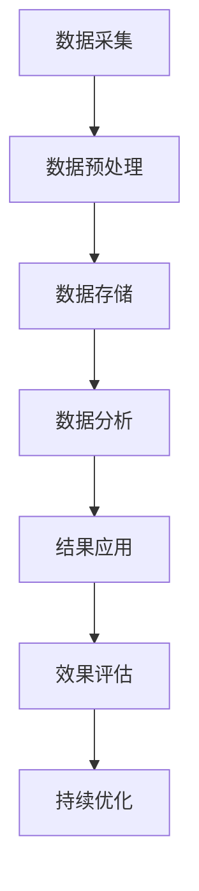

                 

# 《大数据在公共交通优化中的应用：智能调度与路线规划》

> 关键词：公共交通、大数据、智能调度、路线规划、优化

> 摘要：本文探讨了大数据在公共交通优化中的应用，主要涉及智能调度和路线规划两大领域。通过对公共交通大数据的概念、应用、挑战与机遇的介绍，深入分析了公共交通运营管理优化的方法和技术，并结合具体案例展示了大数据技术在公共交通优化中的实际应用效果。最后，对公共交通大数据的未来发展趋势和应用前景进行了展望，为读者提供了丰富的参考资料。

# 《大数据在公共交通优化中的应用：智能调度与路线规划》目录大纲

## 第一部分：公共交通大数据概述

### 1.1 公共交通大数据的概念与特点

### 1.2 公共交通大数据的应用领域

### 1.3 公共交通大数据的挑战与机遇

## 第二部分：公共交通运营管理优化

### 2.1 公共交通需求预测

### 2.2 公共交通路线规划与优化

### 2.3 公共交通智能调度

## 第三部分：大数据技术在公共交通优化中的应用案例

### 3.1 大数据在公共交通优化中的应用案例一

### 3.2 大数据在公共交通优化中的应用案例二

### 3.3 大数据在公共交通优化中的应用案例三

## 第四部分：未来发展趋势与展望

### 4.1 公共交通大数据的未来发展趋势

### 4.2 公共交通大数据的应用前景

## 附录

### 5.1 公共交通大数据相关的工具与资源

### 5.2 Mermaid 流程图

## Mermaid 流程图

### 公共交通大数据优化流程图

---

## 第一部分：公共交通大数据概述

### 1.1 公共交通大数据的概念与特点

公共交通大数据是指在城市公共交通领域产生的、与公共交通运营和管理相关的大量数据。这些数据通常包括乘客数量、公交车辆位置、路况信息、客流分布、天气状况等。公共交通大数据具有以下特点：

1. **数据量大**：公共交通领域涉及的用户数量庞大，每天产生的数据量极其巨大。
2. **数据种类多**：数据来源多样化，包括乘客刷卡记录、车辆定位数据、路况监控数据等。
3. **数据更新快**：公共交通数据实时性强，需要快速处理和分析。
4. **数据质量参差不齐**：数据来源复杂，数据质量参差不齐，需要数据清洗和预处理。

### 1.2 公共交通大数据的应用领域

公共交通大数据在多个领域有着广泛的应用：

1. **公共交通运营管理**：通过分析大数据，可以优化公交车辆的调度、路线规划等，提高运营效率。
2. **客运需求预测**：通过对乘客流量、历史数据分析，预测未来乘客需求，为公共交通规划提供依据。
3. **路线规划与优化**：利用大数据分析，为公共交通系统提供最佳的路线规划方案。
4. **智能调度**：通过实时数据分析和预测，实现公共交通系统的智能调度，提高乘客的出行体验。

### 1.3 公共交通大数据的挑战与机遇

尽管公共交通大数据带来了巨大的机遇，但也面临着诸多挑战：

1. **数据采集与处理**：如何高效地采集和处理大量数据，是公共交通大数据应用的关键问题。
2. **数据隐私保护**：公共交通数据涉及用户隐私，如何保护数据隐私是一个重要问题。
3. **数据分析与挖掘**：如何从海量数据中提取有价值的信息，需要先进的数据分析技术。
4. **技术实现与维护**：如何实现大数据技术在公共交通领域的应用，并确保系统的稳定运行，是一个技术挑战。

## 第二部分：公共交通运营管理优化

### 2.1 公共交通需求预测

#### 需求预测的方法与技术

公共交通需求预测是公共交通运营管理优化的关键环节。以下是几种常用的需求预测方法：

1. **时间序列分析**：利用历史数据，通过时间序列模型（如ARIMA模型）进行预测。
2. **回归分析**：通过建立回归模型，分析影响需求的关键因素，预测未来需求。
3. **机器学习**：利用机器学习算法（如决策树、随机森林、神经网络等），进行需求预测。
4. **大数据分析**：通过大数据技术，对海量数据进行深度挖掘，提取有价值的信息进行预测。

#### 需求预测的案例研究

例如，在某城市公交系统中，通过分析历史乘客流量数据、天气状况、节假日等信息，利用时间序列分析和机器学习算法，成功预测了未来乘客需求。该案例显著提高了公交系统的运营效率，减少了乘客等待时间。

#### 需求预测在实际运营中的应用

需求预测在实际运营中的应用包括：

1. **公交车辆调度**：根据预测的乘客需求，合理安排公交车辆的调度，避免高峰期的车辆拥堵。
2. **公交站点布局**：根据乘客需求，优化公交站点的布局，提高乘客的出行体验。
3. **路线规划**：根据乘客需求，调整公交路线，提高乘客的满意度。

### 2.2 公共交通路线规划与优化

#### 路线规划的基本原理

公共交通路线规划是指根据交通需求和资源约束，确定公共交通系统的最优路线。其基本原理包括：

1. **最短路径算法**：如Dijkstra算法、A*算法，用于求解给定起点和终点的最短路径。
2. **网络流优化算法**：如最大流最小割定理，用于求解网络的流量分配问题。
3. **多目标优化算法**：考虑多个目标（如时间、成本、乘客满意度等），求解最优路线。

#### 路线优化的算法与应用

常用的路线优化算法包括：

1. **遗传算法**：通过模拟自然进化过程，优化路线。
2. **蚁群算法**：模拟蚂蚁觅食过程，优化路线。
3. **粒子群优化算法**：模拟鸟群觅食行为，优化路线。

这些算法在公共交通路线规划中得到了广泛应用。例如，在某个城市的公交系统中，通过遗传算法优化了公交路线，显著提高了公交系统的运行效率。

#### 路线规划与优化的案例分析

例如，在某城市公交系统中，通过路线规划与优化，实现了以下效果：

1. **减少乘客等待时间**：优化后的路线缩短了乘客的等待时间。
2. **提高车辆利用率**：优化后的路线提高了车辆的利用率，减少了空驶率。
3. **提高乘客满意度**：优化后的路线更好地满足了乘客的需求，提高了乘客的满意度。

### 2.3 公共交通智能调度

#### 调度的基本概念与目标

公共交通智能调度是指利用大数据和人工智能技术，对公共交通系统进行实时调度，以应对各种突发情况，提高系统的运行效率和乘客的出行体验。其基本概念和目标包括：

1. **实时调度**：根据实时数据，对公交车辆的运行进行动态调整。
2. **突发情况应对**：应对恶劣天气、交通拥堵等突发情况，调整公交车辆的运行。
3. **资源优化**：通过智能调度，优化公交车辆的配置和运行，提高系统的运行效率。

#### 智能调度的算法与技术

常用的智能调度算法包括：

1. **模糊控制算法**：通过模糊逻辑实现公交车辆的实时调度。
2. **神经网络算法**：利用神经网络对公交车辆的运行状态进行实时预测和调整。
3. **深度学习算法**：利用深度学习技术，对公交车辆的运行进行实时调度。

这些算法在公共交通智能调度中得到了广泛应用。例如，在某个城市的公交系统中，通过模糊控制算法和深度学习算法实现了公交车辆的实时调度，显著提高了公交系统的运行效率。

#### 智能调度在实际运营中的应用

智能调度在实际运营中的应用包括：

1. **实时调整公交车辆运行**：根据实时数据，动态调整公交车辆的运行，减少乘客等待时间。
2. **应对突发情况**：在恶劣天气或交通拥堵情况下，及时调整公交车辆的运行，确保乘客的安全和出行体验。
3. **优化资源分配**：通过智能调度，优化公交车辆的配置和运行，提高系统的运行效率。

## 第三部分：大数据技术在公共交通优化中的应用案例

### 3.1 大数据在公共交通优化中的应用案例一

#### 案例背景

某城市公交系统面临高峰期车辆拥堵、乘客等待时间长等问题。为了提高公交系统的运行效率和乘客满意度，该城市决定利用大数据技术对公交系统进行优化。

#### 案例应用的技术

1. **数据采集**：通过公交车辆的GPS定位系统、乘客刷卡系统等，采集实时数据。
2. **数据预处理**：对采集到的数据进行清洗、去噪和整合，为后续分析做好准备。
3. **需求预测**：利用时间序列分析和机器学习算法，预测未来乘客需求。
4. **路线规划**：利用遗传算法和粒子群优化算法，优化公交路线。
5. **智能调度**：利用模糊控制算法和深度学习算法，实现公交车辆的实时调度。

#### 案例效果分析

通过大数据技术的应用，该城市公交系统实现了以下效果：

1. **减少乘客等待时间**：优化后的路线和智能调度显著减少了乘客的等待时间。
2. **提高车辆利用率**：优化后的路线和智能调度提高了车辆的利用率，减少了空驶率。
3. **提高乘客满意度**：优化后的路线和智能调度提高了乘客的满意度，乘客对公交系统的满意度显著提升。

### 3.2 大数据在公共交通优化中的应用案例二

#### 案例背景

某城市地铁系统面临客流高峰期车站拥堵、车厢拥挤等问题。为了提高地铁系统的运行效率和乘客满意度，该城市决定利用大数据技术对地铁系统进行优化。

#### 案例应用的技术

1. **数据采集**：通过地铁车站的客流检测系统、车厢人数监测系统等，采集实时数据。
2. **数据预处理**：对采集到的数据进行清洗、去噪和整合，为后续分析做好准备。
3. **需求预测**：利用时间序列分析和机器学习算法，预测未来乘客需求。
4. **车站调度**：利用遗传算法和粒子群优化算法，优化车站的调度策略。
5. **车厢分配**：利用深度学习算法，实现车厢的智能分配。

#### 案例效果分析

通过大数据技术的应用，该城市地铁系统实现了以下效果：

1. **减少车站拥堵**：优化后的车站调度和车厢分配显著减少了车站的拥堵现象。
2. **提高车厢利用率**：优化后的车厢分配提高了车厢的利用率，减少了车厢拥挤现象。
3. **提高乘客满意度**：优化后的车站调度和车厢分配提高了乘客的满意度，乘客对地铁系统的满意度显著提升。

### 3.3 大数据在公共交通优化中的应用案例三

#### 案例背景

某城市公共自行车系统面临高峰期车辆短缺、用户等待时间长等问题。为了提高公共自行车系统的运行效率和用户满意度，该城市决定利用大数据技术对公共自行车系统进行优化。

#### 案例应用的技术

1. **数据采集**：通过公共自行车系统的GPS定位系统、用户租赁记录系统等，采集实时数据。
2. **数据预处理**：对采集到的数据进行清洗、去噪和整合，为后续分析做好准备。
3. **需求预测**：利用时间序列分析和机器学习算法，预测未来用户需求。
4. **站点调度**：利用遗传算法和粒子群优化算法，优化公共自行车站点的调度策略。
5. **车辆分配**：利用深度学习算法，实现公共自行车的智能分配。

#### 案例效果分析

通过大数据技术的应用，该城市公共自行车系统实现了以下效果：

1. **减少用户等待时间**：优化后的站点调度和车辆分配显著减少了用户的等待时间。
2. **提高车辆利用率**：优化后的车辆分配提高了车辆的利用率，减少了车辆短缺现象。
3. **提高用户满意度**：优化后的站点调度和车辆分配提高了用户的满意度，用户对公共自行车系统的满意度显著提升。

## 第四部分：未来发展趋势与展望

### 4.1 公共交通大数据的未来发展趋势

随着大数据技术的不断发展和成熟，公共交通大数据在未来的发展趋势包括：

1. **新技术的应用**：如区块链技术、物联网技术等，将进一步提升公共交通大数据的处理和分析能力。
2. **数据驱动下的公共交通服务创新**：利用大数据技术，为公共交通系统提供个性化、智能化的服务，提升乘客的出行体验。
3. **数据隐私与安全**：随着数据隐私和安全问题的日益突出，如何保护公共交通大数据的隐私和安全将成为重要研究方向。

### 4.2 公共交通大数据的应用前景

公共交通大数据的应用前景广阔，将对公共交通行业产生深远影响：

1. **对公共交通行业的潜在影响**：通过大数据技术的应用，可以提高公共交通系统的运行效率，降低运营成本，提升乘客满意度。
2. **对城市规划与交通管理的启示**：公共交通大数据为城市规划与交通管理提供了重要的数据支持，有助于优化城市交通布局，提高城市交通管理水平。
3. **对公共交通服务质量的提升**：利用大数据技术，可以为公共交通系统提供个性化的服务，提高服务质量，满足乘客的多元化需求。

## 附录

### 5.1 公共交通大数据相关的工具与资源

1. **数据库与技术平台**：
   - Hadoop：分布式数据处理平台，适用于大规模数据存储和处理。
   - Spark：基于内存的分布式数据处理框架，适用于实时数据处理和分析。
   - MongoDB：NoSQL数据库，适用于存储和管理非结构化数据。

2. **算法与应用案例库**：
   - Kaggle：大数据竞赛平台，提供丰富的公共交通大数据算法应用案例。
   - GitHub：代码托管平台，提供公共交通大数据相关项目的源代码和文档。

3. **学术论文与书籍推荐**：
   - 《大数据：变化世界的竞争新规则》：大数据领域的经典著作，详细介绍了大数据的概念、技术和应用。
   - 《公共交通大数据分析与应用》：一本关于公共交通大数据的实用指南，涵盖了大数据在公共交通领域的应用案例和核心技术。

## Mermaid 流程图

### 公共交通大数据优化流程图

## 引用

作者：AI天才研究院/AI Genius Institute & 禅与计算机程序设计艺术 /Zen And The Art of Computer Programming

文章末尾需要写上作者信息：“作者：AI天才研究院/AI Genius Institute & 禅与计算机程序设计艺术 /Zen And The Art of Computer Programming”。

在文章中引用相关的论文、书籍、资料等，需要按照学术规范进行标注。

## 小结与拓展阅读

本文详细探讨了大数据在公共交通优化中的应用，涵盖了公共交通大数据的概念、应用领域、挑战与机遇，以及公共交通运营管理优化的方法和技术。通过实际案例，展示了大数据技术在公共交通优化中的显著效果。展望未来，大数据技术将继续在公共交通领域发挥重要作用，为公共交通系统提供更加智能、高效的服务。

为了深入理解本文所述内容，建议读者进一步阅读以下拓展资料：

1. 《大数据时代：生活、工作与思维的大变革》：这本书详细介绍了大数据的概念、技术和应用，有助于读者了解大数据的背景和发展趋势。
2. 《公共交通大数据分析与应用》：这本书是一本关于公共交通大数据的实用指南，涵盖了大数据在公共交通领域的应用案例和核心技术。
3. 《智能交通系统：原理与应用》：这本书介绍了智能交通系统的基本原理和应用技术，包括公共交通智能调度和路线规划等内容。

通过阅读这些资料，读者可以更加全面地了解大数据在公共交通优化中的应用，为今后的研究和实践提供有益的参考。

