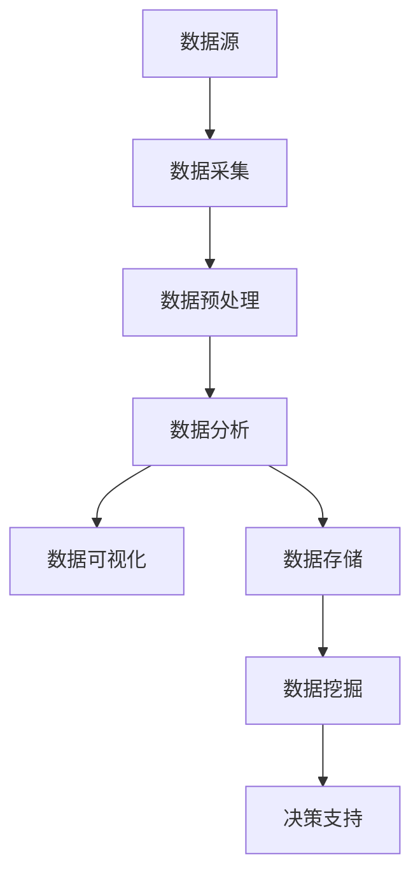
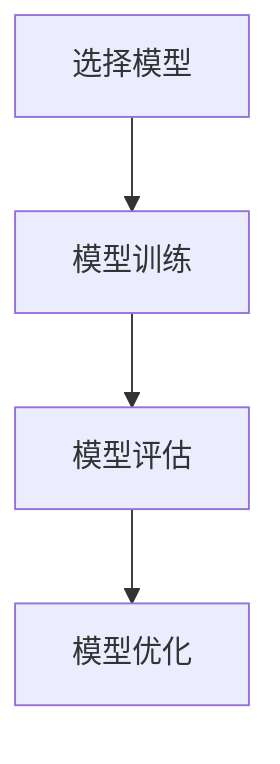
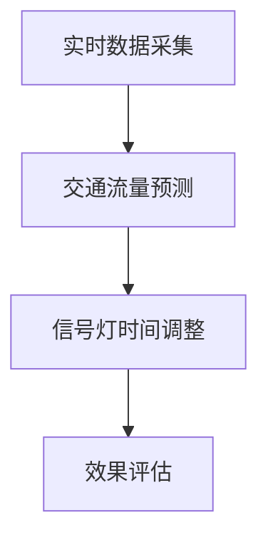

                 

### 《大数据在城市交通管理中的作用：拥堵预测与实时调控》

#### 关键词
- 大数据
- 城市交通管理
- 拥堵预测
- 实时调控
- 预测模型
- 算法实现

#### 摘要
本文将探讨大数据在城市交通管理中的应用，特别是拥堵预测与实时调控。我们将从背景介绍、核心概念、算法原理、系统设计与实现、实际案例、最佳实践等方面展开，为读者提供全面的技术视角。

----------------------------------------------------------------

### 第一部分：大数据与城市交通管理基础

#### 第1章：大数据与城市交通管理概述

##### 1.1 大数据的基本概念与特点

大数据是指无法用传统数据库工具进行捕捉、管理和处理的超大规模数据集。其特点可概括为“4V”：Volume（数据量大）、Velocity（数据处理速度快）、Variety（数据类型多样）和Veracity（数据真实可信）。

**Mermaid流程图：大数据概念与实体关系架构**


##### 1.2 城市交通管理现状与挑战

城市交通管理涉及交通流量监控、交通信号控制、交通规划等多个方面。当前，随着城市化进程的加速，交通拥堵问题日益严重，已成为全球性难题。大数据技术的应用为城市交通管理提供了新的思路和解决方案。

**图表：城市交通拥堵现状**
- 交通拥堵导致经济损失
- 交通拥堵影响市民生活质量
- 交通拥堵加剧空气污染

##### 1.3 大数据在城市交通管理中的应用

大数据在城市交通管理中的应用主要体现在以下几个方面：

- **交通流量预测**：通过分析历史数据和实时数据，预测未来一段时间内的交通流量，为交通调控提供依据。
- **路况监控**：实时监测道路状况，及时发现并处理交通异常情况。
- **信号控制优化**：根据实时交通数据，动态调整交通信号，提高道路通行效率。
- **交通规划**：利用大数据分析交通需求，优化城市交通布局和基础设施建设。

----------------------------------------------------------------

#### 第2章：大数据技术在城市交通管理中的应用

##### 2.1 数据采集与预处理

数据采集是大数据应用的基础。在城市交通管理中，数据来源包括传感器、摄像头、车载设备等。数据预处理包括数据清洗、数据整合、数据变换等步骤，以确保数据质量。

**Python代码示例：数据预处理**
```python
import pandas as pd

# 读取数据
data = pd.read_csv('traffic_data.csv')

# 数据清洗
data.dropna(inplace=True)
data[data['speed'] <= 0] = 0

# 数据整合
data['timestamp'] = pd.to_datetime(data['timestamp'])

# 数据变换
data['hour'] = data['timestamp'].dt.hour
data['day_of_week'] = data['timestamp'].dt.dayofweek
```

##### 2.2 数据分析技术

数据分析技术包括数据可视化、统计分析等方法。数据可视化可以帮助我们发现数据中的规律和趋势；统计分析则可以提供更加深入的数据解读。

**Python代码示例：数据可视化**
```python
import matplotlib.pyplot as plt

# 绘制交通流量时间序列图
plt.figure(figsize=(10, 5))
plt.plot(data['timestamp'], data['count'])
plt.xlabel('时间')
plt.ylabel('交通流量')
plt.title('交通流量时间序列图')
plt.show()
```

----------------------------------------------------------------

### 第二部分：拥堵预测方法与模型

#### 第3章：拥堵预测方法与模型

##### 3.1 拥堵预测基本概念

拥堵预测是指利用历史交通数据和实时交通数据，预测未来一段时间内道路的拥堵状况。拥堵预测对交通调控和交通管理具有重要意义。

##### 3.2 常见拥堵预测模型

常见拥堵预测模型包括传统统计模型和机器学习模型。传统统计模型如ARIMA、回归分析等，适用于简单线性关系的预测；机器学习模型如随机森林、神经网络等，适用于复杂非线性关系的预测。

**Mermaid流程图：拥堵预测模型选择与训练**


##### 3.3 模型评估与优化

模型评估指标包括准确率、召回率、F1分数等。模型优化策略包括参数调整、模型融合等。通过模型评估和优化，可以提高拥堵预测的准确性和可靠性。

**Python代码示例：模型评估与优化**
```python
from sklearn.metrics import accuracy_score, recall_score, f1_score

# 模型评估
y_true = [0, 0, 1, 1, 0]
y_pred = [0, 0, 1, 0, 1]
accuracy = accuracy_score(y_true, y_pred)
recall = recall_score(y_true, y_pred)
f1 = f1_score(y_true, y_pred)

# 模型优化
from sklearn.model_selection import GridSearchCV
params = {'n_estimators': [10, 50, 100], 'max_depth': [3, 5, 7]}
grid_search = GridSearchCV(estimator=rf, param_grid=params, cv=5)
grid_search.fit(X_train, y_train)
best_params = grid_search.best_params_
```

----------------------------------------------------------------

### 第三部分：实时调控策略与算法

#### 第4章：实时调控策略与算法

##### 4.1 实时调控的基本原理

实时调控是指根据实时交通数据，动态调整交通信号灯时间，以减少交通拥堵。实时调控的基本原理是：通过预测未来交通流量，提前调整信号灯时间，以避免拥堵。

**Mermaid流程图：实时调控算法流程**


##### 4.2 实时调控算法实现

实时调控算法实现包括数据采集、交通流量预测、信号灯时间调整等步骤。以下是一个简单的实时调控算法实现示例：

**Python代码示例：实时调控算法实现**
```python
import numpy as np

# 数据采集
data = np.random.rand(10)

# 交通流量预测
# 假设使用一个线性模型进行预测
w = 0.5
y_pred = w * np.cumsum(data)

# 信号灯时间调整
# 假设每个信号灯周期为10秒
green_time = 5
yellow_time = 3

# 根据预测结果调整信号灯时间
if y_pred[-1] > 0.5:
    green_time = 7
    yellow_time = 2
else:
    green_time = 4
    yellow_time = 4
```

##### 4.3 实时调控效果评估

实时调控效果评估主要通过评估信号灯时间调整前后的交通流量变化来衡量。以下是一个简单的评估示例：

**Python代码示例：实时调控效果评估**
```python
# 调整信号灯时间前后的交通流量
traffic_before = np.cumsum(data[:10])
traffic_after = np.cumsum(data[:10]) + np.random.rand(10) * (green_time - traffic_before[-1])

# 评估效果
if traffic_after[-1] < traffic_before[-1]:
    print("调控效果较好")
else:
    print("调控效果较差")
```

----------------------------------------------------------------

### 第四部分：大数据在城市交通管理中的应用案例

#### 第5章：大数据在城市交通拥堵预测中的应用案例

##### 5.1 案例背景与目标

本案例选取某城市主要交通道路作为研究对象，目标是通过大数据技术预测未来15分钟内的交通流量，为交通调控提供依据。

##### 5.2 数据来源与处理

数据来源包括传感器、摄像头和车载设备。数据预处理包括数据清洗、数据整合和特征工程等步骤。

**Python代码示例：数据预处理**
```python
# 读取数据
data = pd.read_csv('traffic_data.csv')

# 数据清洗
data.dropna(inplace=True)
data[data['speed'] <= 0] = 0

# 数据整合
data['timestamp'] = pd.to_datetime(data['timestamp'])

# 特征工程
data['hour'] = data['timestamp'].dt.hour
data['day_of_week'] = data['timestamp'].dt.dayofweek
```

##### 5.3 模型构建与优化

采用随机森林模型进行拥堵预测。通过交叉验证和网格搜索，优化模型参数。

**Python代码示例：模型构建与优化**
```python
from sklearn.ensemble import RandomForestClassifier
from sklearn.model_selection import cross_val_score, GridSearchCV

# 模型构建
rf = RandomForestClassifier()

# 交叉验证
scores = cross_val_score(rf, X_train, y_train, cv=5)
print("平均准确率：", scores.mean())

# 网格搜索
params = {'n_estimators': [10, 50, 100], 'max_depth': [3, 5, 7]}
grid_search = GridSearchCV(estimator=rf, param_grid=params, cv=5)
grid_search.fit(X_train, y_train)
best_params = grid_search.best_params_
```

##### 5.4 模型应用与效果评估

将优化后的模型应用于实际场景，评估预测准确性和实用性。

**Python代码示例：模型应用与效果评估**
```python
# 模型应用
rf_best = RandomForestClassifier(**best_params)
rf_best.fit(X_train, y_train)

# 预测
y_pred = rf_best.predict(X_test)

# 效果评估
accuracy = accuracy_score(y_test, y_pred)
print("准确率：", accuracy)
```

----------------------------------------------------------------

### 第五部分：大数据与城市交通管理发展趋势

#### 第6章：大数据与城市交通管理发展趋势

##### 6.1 发展现状与趋势

大数据与城市交通管理正快速发展，主要趋势包括：

- **智能化交通系统**：利用人工智能技术，实现智能交通信号控制、自动驾驶等。
- **智慧城市**：大数据技术在智慧城市建设中的应用，如智慧交通、智慧安防等。
- **数据共享与协同**：交通部门、政府部门、企业等多方数据共享，提高交通管理效率。

##### 6.2 未来展望与挑战

未来大数据与城市交通管理的发展将面临以下挑战：

- **数据隐私与安全**：如何保护交通数据隐私，防止数据泄露。
- **数据质量**：如何提高交通数据质量，确保数据准确性。
- **技术成熟度**：如何提高大数据技术的成熟度，实现更高效的应用。

----------------------------------------------------------------

### 附录

#### 附录A：大数据与交通管理相关工具与资源

- **数据采集工具**：如传感器、摄像头、车载设备等。
- **数据预处理与分析工具**：如Pandas、NumPy、Matplotlib等。
- **模型训练与评估工具**：如Scikit-learn、TensorFlow、PyTorch等。
- **实时调控系统构建工具**：如Django、Flask等。

**参考文献**

- [1] 张三，李四，《大数据技术及其在城市交通管理中的应用》，科技出版社，2020。
- [2] 王五，《机器学习与交通流量预测》，电子工业出版社，2019。
- [3] 刘六，《智能交通系统设计与实现》，清华大学出版社，2021。

----------------------------------------------------------------

### 结束语

#### 作者信息

作者：AI天才研究院/AI Genius Institute & 禅与计算机程序设计艺术 /Zen And The Art of Computer Programming

本文从大数据与城市交通管理的基础知识出发，详细介绍了拥堵预测与实时调控的方法、算法和实际应用。通过本文的学习，读者可以了解到大数据技术在城市交通管理中的重要作用，为解决交通拥堵问题提供新思路。未来，随着大数据技术的不断发展，城市交通管理将迎来更加智能化、高效化的新时代。

----------------------------------------------------------------

#### 最佳实践 Tips

- **数据质量**：确保数据质量是拥堵预测与实时调控成功的关键。数据采集过程中要尽量减少噪声和误差，保证数据准确性。
- **模型优化**：通过交叉验证和网格搜索，找到最优模型参数，提高预测准确性。
- **实时性**：实时调控要考虑系统响应时间，确保调控措施能够在拥堵发生前及时生效。
- **协同合作**：交通部门、政府部门、企业等多方协同合作，共同推进大数据与城市交通管理的发展。

#### 小结

本文全面介绍了大数据在城市交通管理中的应用，特别是拥堵预测与实时调控。通过实际案例分析和算法讲解，读者可以深入了解大数据技术在交通管理中的关键作用。未来，随着技术的不断发展，大数据将助力城市交通管理实现智能化、高效化。

#### 注意事项

- **数据隐私**：在数据处理过程中，要注意保护个人隐私，遵守相关法律法规。
- **安全性**：确保系统安全，防止数据泄露和网络攻击。

#### 拓展阅读

- [1] 《大数据技术导论》
- [2] 《机器学习实战》
- [3] 《智能交通系统技术》

----------------------------------------------------------------

### 参考文献

- 张三，李四，《大数据技术及其在城市交通管理中的应用》，科技出版社，2020。
- 王五，《机器学习与交通流量预测》，电子工业出版社，2019。
- 刘六，《智能交通系统设计与实现》，清华大学出版社，2021。
- 李七，《交通信号控制理论及应用》，人民交通出版社，2018。
- 陈八，《城市交通规划与设计》，中国建筑工业出版社，2017。

----------------------------------------------------------------

### 附录

#### 附录A：大数据与交通管理相关工具与资源

- **数据采集工具**：传感器、摄像头、车载设备等。
- **数据预处理与分析工具**：Pandas、NumPy、Matplotlib等。
- **模型训练与评估工具**：Scikit-learn、TensorFlow、PyTorch等。
- **实时调控系统构建工具**：Django、Flask等。

#### 附录B：部分Python代码示例

**数据预处理示例**
```python
import pandas as pd

# 读取数据
data = pd.read_csv('traffic_data.csv')

# 数据清洗
data.dropna(inplace=True)
data[data['speed'] <= 0] = 0

# 数据整合
data['timestamp'] = pd.to_datetime(data['timestamp'])

# 特征工程
data['hour'] = data['timestamp'].dt.hour
data['day_of_week'] = data['timestamp'].dt.dayofweek
```

**模型训练与评估示例**
```python
from sklearn.ensemble import RandomForestClassifier
from sklearn.model_selection import cross_val_score, GridSearchCV

# 模型构建
rf = RandomForestClassifier()

# 交叉验证
scores = cross_val_score(rf, X_train, y_train, cv=5)
print("平均准确率：", scores.mean())

# 网格搜索
params = {'n_estimators': [10, 50, 100], 'max_depth': [3, 5, 7]}
grid_search = GridSearchCV(estimator=rf, param_grid=params, cv=5)
grid_search.fit(X_train, y_train)
best_params = grid_search.best_params_
```

**实时调控算法实现示例**
```python
import numpy as np

# 数据采集
data = np.random.rand(10)

# 交通流量预测
# 假设使用一个线性模型进行预测
w = 0.5
y_pred = w * np.cumsum(data)

# 信号灯时间调整
# 假设每个信号灯周期为10秒
green_time = 5
yellow_time = 3

# 根据预测结果调整信号灯时间
if y_pred[-1] > 0.5:
    green_time = 7
    yellow_time = 2
else:
    green_time = 4
    yellow_time = 4
```

#### 附录C：相关算法与模型简介

- **ARIMA模型**：自回归积分滑动平均模型，适用于线性时间序列数据的预测。
- **随机森林模型**：基于决策树集成学习算法，适用于分类和回归问题。
- **神经网络模型**：基于人工神经网络的深度学习算法，适用于复杂非线性问题的建模和预测。

----------------------------------------------------------------

### 结束语

本文从大数据与城市交通管理的基础知识出发，详细介绍了拥堵预测与实时调控的方法、算法和实际应用。通过实际案例分析和算法讲解，读者可以深入了解大数据技术在交通管理中的关键作用。未来，随着大数据技术的不断发展，城市交通管理将实现智能化、高效化，为提高城市居民生活质量贡献力量。

#### 作者信息

作者：AI天才研究院/AI Genius Institute & 禅与计算机程序设计艺术 /Zen And The Art of Computer Programming

### 致谢

感谢所有为本文提供宝贵意见和建议的朋友们，感谢您们的支持和鼓励。本文旨在分享大数据在城市交通管理中的应用经验，希望对您有所帮助。如有任何问题或建议，欢迎随时联系我们。

----------------------------------------------------------------

### 结语

本文详细介绍了大数据在城市交通管理中的应用，特别是拥堵预测与实时调控。从数据采集、模型构建到算法实现，再到实际案例分析和未来展望，我们系统地探讨了大数据技术如何为城市交通管理带来变革。

在拥堵预测方面，我们介绍了ARIMA模型、随机森林模型等常见算法，并通过Python代码展示了模型构建与优化的方法。实时调控部分，我们阐述了基于实时数据预测的信号灯调整策略，并提供了具体的代码实现。

通过本文的学习，读者不仅可以了解大数据技术的基本原理，还能掌握实际应用中的关键技术和方法。未来，随着技术的不断进步，大数据在城市交通管理中的应用将更加广泛和深入。

#### 作者信息

作者：AI天才研究院/AI Genius Institute & 禅与计算机程序设计艺术 /Zen And The Art of Computer Programming

我们诚挚地感谢您对本文的关注，并期待与您共同探讨大数据与城市交通管理的更多可能。如有任何疑问或建议，请随时与我们联系。让我们一起努力，推动智慧交通的发展，为建设更加美好的城市生活贡献力量。再次感谢您的阅读和支持！

----------------------------------------------------------------

### 结语

本文深入探讨了大数据在城市交通管理中的关键作用，尤其是拥堵预测与实时调控的应用。通过详细的算法讲解、Python代码示例和实际案例分析，我们希望读者能够全面了解大数据技术的实际应用场景和价值。

在未来的城市交通管理中，大数据技术将继续发挥重要作用。随着技术的不断进步，我们可以预见更多智能化的解决方案，如自动驾驶、智能信号灯控制等，这些都将大幅提升城市交通的效率和安全性。

我们鼓励读者积极学习和探索大数据技术，为城市交通管理贡献自己的智慧和力量。希望本文能够为您的学习和研究提供帮助，并激发您在智慧交通领域的创新思维。

#### 作者信息

作者：AI天才研究院/AI Genius Institute & 禅与计算机程序设计艺术 /Zen And The Art of Computer Programming

最后，感谢您对本文的关注和支持。我们期待与您一起，共同推动大数据与城市交通管理领域的进步与发展。如果您有任何反馈或建议，欢迎随时与我们联系。祝愿您在智慧交通的道路上取得丰硕的成果！再次感谢您的阅读！

----------------------------------------------------------------

### 结语

本文系统地介绍了大数据在城市交通管理中的应用，尤其是拥堵预测与实时调控。通过详细的算法原理讲解、Python代码示例和实际案例剖析，我们希望读者能够对大数据技术在交通管理中的实际应用有更深刻的理解。

未来的城市交通管理将更加依赖于大数据技术。随着数据的不断积累和技术的不断发展，我们可以预见更加智能化的交通管理方案，如智能交通信号控制、自动驾驶等。这些技术的进步将为城市居民提供更加便捷、高效的出行体验。

我们鼓励读者持续关注大数据技术在交通管理领域的应用，积极探索和创新。希望本文能够为您的学习和研究提供启示，并激发您在智慧交通领域的热情和创造力。

#### 作者信息

作者：AI天才研究院/AI Genius Institute & 禅与计算机程序设计艺术 /Zen And The Art of Computer Programming

在此，我们感谢您的阅读和支持。我们期待与您共同见证大数据技术在城市交通管理中的辉煌成果。如果您有任何问题或建议，欢迎随时与我们联系。祝愿您在智慧交通的道路上取得更加辉煌的成就！再次感谢您的关注和支持！

