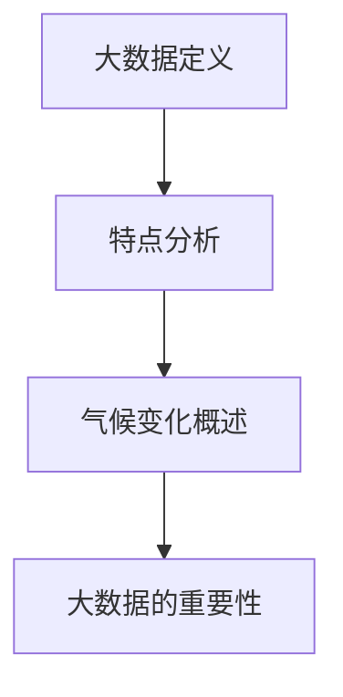
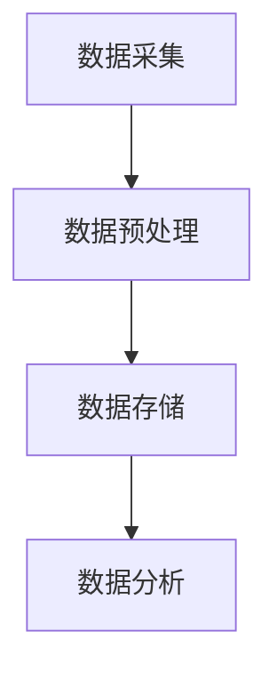
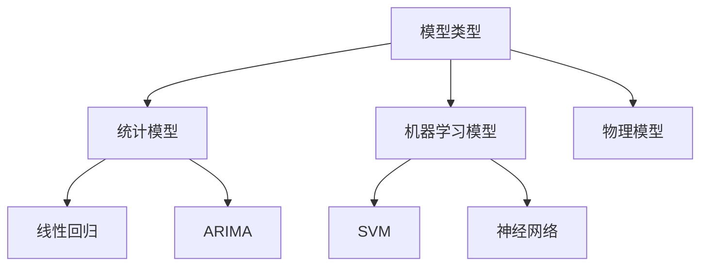
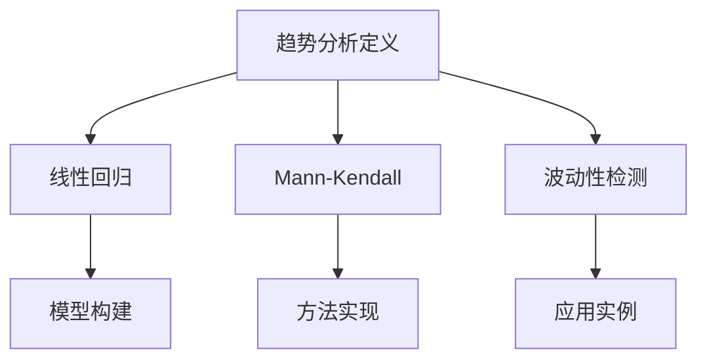
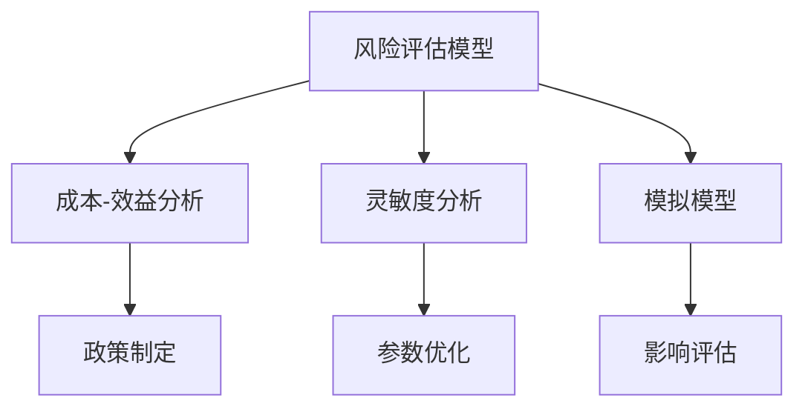
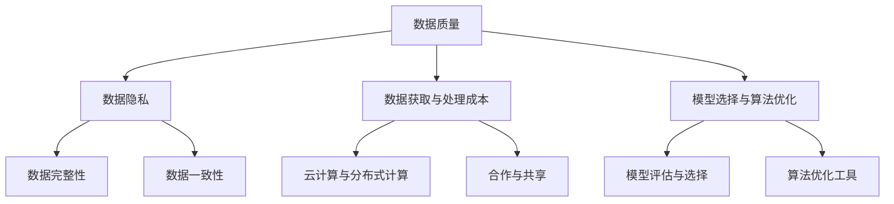
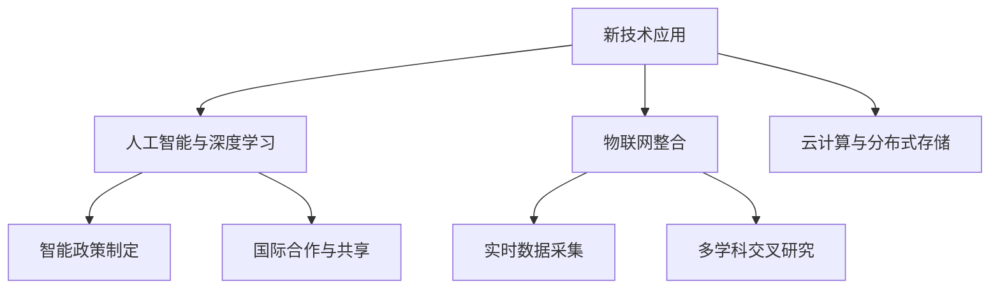

                 

## 大数据与气候变化概述

### 大数据的定义与特点

大数据，简称“大数”，通常指的是那些数据量巨大、数据类型繁多、数据产生速度极快的数据集合。其定义可以从三个主要维度来理解：Volume（数据量）、Variety（数据类型）和 Velocity（数据处理速度）。大数据不仅包括结构化数据，还涵盖了非结构化数据（如图像、音频、视频等）和半结构化数据（如日志文件等）。

**数据量（Volume）**：大数据的规模通常达到GB、TB甚至PB级别。这种大规模的数据量使得传统的数据处理方法难以胜任。

**数据类型（Variety）**：大数据的类型多样化，包括结构化数据、非结构化数据以及半结构化数据。这意味着数据的来源多种多样，例如社交媒体、物联网设备、传感器网络、气象数据等。

**数据处理速度（Velocity）**：大数据的产生速度非常快，需要实时或近实时处理。例如，社交媒体平台每天产生大量的文本、图像和视频数据，这些数据需要立即处理以提取有用的信息。

### 气候变化的基本原理与影响

气候变化是指地球气候平均状态随时间的变化，这些变化可以是自然的也可以是由人类活动引起的。其基本原理涉及大气、海洋、生态系统等多个领域的物理、化学和生物过程。

**大气过程**：大气中的温室气体（如二氧化碳、甲烷等）吸收和辐射热量，导致全球气候变暖。这些温室气体的增加主要来自人类活动，如化石燃料燃烧、土地利用变化等。

**海洋过程**：海洋是地球气候系统的一个重要组成部分。海洋吸收了大量的二氧化碳，但同时也影响了全球气候。海洋温度的变化会导致海平面上升和极端天气事件的发生。

**生态系统过程**：植物通过光合作用吸收二氧化碳，但森林砍伐和土地开发等活动减少了这些“碳汇”，从而增加了大气中的二氧化碳浓度。

**气候变化的影响**：气候变化对人类和自然环境产生了深远的影响。其中包括极端天气事件增加、海平面上升、生态系统破坏、水资源短缺、粮食安全威胁等。这些影响不仅对人类社会的可持续发展构成挑战，还对全球经济和人类健康产生重大影响。

### 大数据在气候变化研究中的重要性

大数据在气候变化研究中扮演着至关重要的角色，其原因如下：

**更精细的数据采集**：大数据技术可以收集来自不同来源的精细气候数据，如卫星遥感、地面观测、气象站数据等。这些数据提供了更全面、更详细的气候变化信息。

**动态性捕捉**：气候系统是一个动态变化的系统，大数据技术能够实时或近实时地捕捉这些变化，提供动态监测和预测能力。

**长期趋势识别**：通过大数据分析，可以识别出气候变化的长期趋势，这对于制定应对策略至关重要。

**决策支持**：大数据分析可以帮助科学家和政策制定者更好地理解气候变化的影响，从而制定更有效的应对策略。

总之，大数据为气候变化研究提供了强大的工具，使得科学家能够更深入地了解气候系统的复杂性，预测未来的气候变化趋势，并为应对措施提供科学依据。

### 小结

通过上述分析，我们可以看到大数据在气候变化研究中的重要性。大数据不仅提供了更精细、更全面的数据，还提高了气候变化研究的效率和准确性。在未来，随着大数据技术的发展，我们有望更全面、更准确地理解气候变化，为应对这一全球性挑战提供有力的支持。

### 数据采集与预处理

在气候变化研究中，数据采集是一个至关重要的环节。有效的数据采集不仅可以提供高质量的输入数据，还能减少后续数据处理的复杂性和错误率。以下是数据采集的主要方法和数据预处理的基本流程。

**1. 数据采集方法**

**卫星遥感**：卫星遥感技术是目前获取全球气候数据的主要手段之一。通过卫星搭载的各种传感器，可以收集大气、海洋和地表的物理量信息。这些数据具有空间覆盖广、时间连续性强的特点，对于全球气候变化研究至关重要。

**地面观测**：地面观测包括气象站、水文站、生态监测站等，通过人工或自动化的手段收集气候参数。这些数据包括温度、湿度、降水量、风速等，是了解局部气候特征和变化的重要依据。

**气象站数据**：气象站数据通过地面气象仪器（如温度计、湿度计、雨量计等）收集。这些数据通常具有高时间分辨率，是气候变化研究中不可或缺的一部分。

**物联网设备**：物联网设备（IoT）可以监测和记录各种环境参数，如空气质量、水质、土壤湿度等。这些数据可以提供更细致、更实时的环境信息。

**社交媒体数据**：社交媒体平台（如Twitter、Facebook等）可以提供大量的与气候变化相关的文本、图像和视频数据。这些数据可以反映公众对气候变化的关注和态度，有助于社会层面的气候变化研究。

**2. 数据预处理流程**

**数据清洗**：数据清洗是数据预处理的首要步骤，旨在去除数据中的噪声和错误。例如，删除重复记录、填补缺失值、修正错误数据等。这一过程通常需要使用多种技术，如数据库操作、编程脚本等。

**数据转换**：数据转换涉及将不同格式的数据转换为统一的格式，以便后续分析和处理。常见的转换操作包括数据格式转换（如CSV到JSON）、数据编码转换（如ASCII到UTF-8）等。

**数据归一化**：数据归一化是确保不同数据量级的数据在同一尺度上进行比较和融合。例如，将温度、湿度等物理量转换为无量纲的数值，以便于使用机器学习算法进行建模。

**数据融合**：数据融合是将来自不同来源、不同类型的数据进行整合，形成一个统一的数据集。例如，将卫星遥感数据与地面观测数据结合，以获得更全面、更准确的气候信息。

**数据存储**：数据预处理后，需要将数据存储在合适的数据管理系统中。常用的数据存储技术包括关系型数据库（如MySQL）、NoSQL数据库（如MongoDB）和分布式文件系统（如Hadoop HDFS）等。

### 小结

数据采集与预处理是大数据在气候变化研究中的基础环节。通过科学的采集方法和预处理流程，可以确保数据的准确性和一致性，为后续的分析和建模提供可靠的数据支持。随着技术的不断发展，数据采集和预处理方法将不断优化，进一步提升气候变化研究的精度和效率。

### 数据存储与管理系统

在气候变化研究中，数据存储与管理系统的选择至关重要，因为它直接影响数据的访问速度、安全性、扩展性以及可靠性。以下将介绍几种常见的数据存储技术，并探讨数据管理系统如何支持大规模数据处理。

**1. 常见数据存储技术**

**关系型数据库**：关系型数据库（如MySQL、PostgreSQL）适用于结构化数据存储，其特点是查询速度快、事务处理能力强。关系型数据库通过SQL语言进行数据查询和管理，非常适合用于数据量相对较小且结构相对固定的应用场景。

**NoSQL数据库**：NoSQL数据库（如MongoDB、Cassandra）适用于存储非结构化和半结构化数据，其特点是灵活性和扩展性强。NoSQL数据库不依赖于固定的表结构，能够根据数据的需求动态调整数据模型，适用于大规模分布式数据存储。

**分布式文件系统**：分布式文件系统（如Hadoop HDFS、Amazon S3）适用于存储海量数据，其特点是高可用性和高扩展性。分布式文件系统通过将数据分散存储在多个节点上，提高了数据的可靠性和访问速度。

**2. 数据管理系统功能**

**数据索引与查询**：数据管理系统提供数据索引和查询功能，使数据能够快速检索和访问。例如，关系型数据库通过B+树索引实现快速查询，而NoSQL数据库则通过索引键实现高效访问。

**数据复制与备份**：数据管理系统支持数据复制和备份功能，确保数据的高可用性和安全性。例如，Hadoop HDFS通过副本机制实现数据冗余，保障数据在节点故障时不会丢失。

**数据压缩与存储优化**：数据管理系统提供数据压缩和存储优化功能，减少数据存储空间和提高存储效率。例如，Hadoop HDFS使用压缩算法对数据进行压缩存储，降低存储成本。

**数据存储扩展性**：数据管理系统支持水平扩展，能够随着数据量的增长动态增加存储节点，保证系统性能和吞吐量。例如，Cassandra通过添加新节点实现数据存储扩展，保证系统的高可用性和高扩展性。

**3. 大规模数据处理支持**

数据管理系统不仅支持数据的存储和管理，还提供了多种工具和框架来处理大规模数据。

**批处理框架**：如Hadoop MapReduce，适用于大规模数据的批量处理。MapReduce通过将数据处理任务分解为多个Map任务和Reduce任务，实现并行计算和数据高效处理。

**流处理框架**：如Apache Kafka和Apache Flink，适用于实时数据处理和流式分析。流处理框架能够实时处理大量数据流，支持实时分析和决策。

**数据仓库**：如Apache Hive和Amazon Redshift，适用于数据分析和报表生成。数据仓库通过将数据结构化存储，提供高效的数据查询和分析功能，支持复杂的报表生成和可视化。

**4. 小结**

选择合适的数据存储与管理系统是大数据在气候变化研究中至关重要的一步。关系型数据库、NoSQL数据库和分布式文件系统各自具有不同的优势，能够满足不同类型和规模的数据存储需求。数据管理系统提供的数据索引、复制、备份、压缩和扩展功能，确保了数据的高效存储和管理。同时，大规模数据处理框架和数据仓库的应用，进一步提升了数据处理和分析的能力，为气候变化研究提供了强有力的支持。

### 数据分析技术与工具

在气候变化研究中，数据分析技术是关键的一环，它能够帮助科学家从大量的气候数据中提取有价值的信息，揭示气候变化趋势和规律。以下将介绍几种常用的数据分析技术及工具，并探讨如何选择合适的工具进行数据分析。

**1. 常用的数据分析技术**

**统计分析**：统计分析是数据分析的基础，它通过对数据进行描述性统计和推断性统计，揭示数据的基本特征和规律。常见的统计方法包括均值、方差、相关性分析、回归分析等。Python和R语言提供了丰富的统计分析库，如SciPy、NumPy、pandas和statsmodels等。

**机器学习**：机器学习是一种通过构建数学模型来自动学习和发现数据中隐含规律的方法。在气候变化研究中，机器学习可以用于预测气候趋势、识别异常值、分类数据等。常见的机器学习算法包括线性回归、决策树、支持向量机、神经网络等。Python中的scikit-learn和tensorflow库，以及R中的caret和mlr包，都是常用的机器学习工具。

**深度学习**：深度学习是一种基于神经网络的多层模型，它在图像识别、自然语言处理等领域取得了显著成果。在气候变化研究中，深度学习可以用于处理复杂数据模式和模式识别。Python中的tensorflow和Keras库，以及R中的tensorflow和MXNet包，都是常用的深度学习工具。

**时间序列分析**：时间序列分析是一种专门针对时间序列数据的方法，它用于识别数据中的趋势、周期性和季节性变化。常见的模型包括ARIMA、GARCH、状态空间模型等。Python中的statsmodels和R中的forecast包，提供了丰富的时序分析方法。

**2. 数据分析工具的选择**

**Python**：Python因其简单易用、丰富的库和社区支持，成为数据分析的主要编程语言。Python的pandas库提供了强大的数据处理功能，SciPy和NumPy库提供了丰富的数学运算工具，scikit-learn和tensorflow库支持机器学习和深度学习。此外，Python还有许多可视化库，如matplotlib、seaborn和plotly，能够帮助科学家更直观地展示分析结果。

**R语言**：R语言在统计分析、图形显示和报告生成方面具有优势。R的ggplot2库提供了强大的可视化功能，dplyr和tidyverse包提供了数据处理工具，caret和mlr包支持机器学习。R还提供了大量的专用包，如astsa和forecast，用于时间序列分析。

**3. 数据分析工具的实际应用**

**数据清洗**：在数据分析之前，通常需要对数据进行清洗，包括处理缺失值、异常值、重复数据等。Python的pandas库和R的dplyr包提供了强大的数据清洗功能。

**数据探索**：通过描述性统计分析，可以初步了解数据的基本特征，如均值、中位数、方差等。Python的pandas和R的dplyr都提供了方便的数据探索功能。

**数据可视化**：可视化是数据分析的重要环节，它可以帮助科学家更直观地理解数据。Python的matplotlib、seaborn和R的ggplot2提供了丰富的可视化工具，能够生成各种类型的图表，如直方图、散点图、箱线图等。

**机器学习建模**：通过机器学习算法，可以建立预测模型或分类模型。Python的scikit-learn和R的caret提供了丰富的机器学习算法和模型评估工具，可以方便地实现机器学习建模。

**4. 小结**

数据分析技术在气候变化研究中发挥着重要作用。Python和R语言因其丰富的库和强大的功能，成为数据分析的主要工具。选择合适的工具可以根据数据类型和分析目标进行优化，提高数据分析的效率和效果。通过合理的工具选择和有效的数据分析方法，科学家可以更深入地理解气候变化，为应对气候变化提供有力的支持。

### 气候预测模型的基本原理

气候预测模型是大数据在气候变化研究中的一项关键应用，它通过分析历史气候数据来预测未来的气候趋势。这些模型不仅能够为科学家提供重要的研究数据，还能帮助政策制定者和决策者制定有效的应对策略。

#### 模型类型

气候预测模型可以分为以下几种类型：

1. **统计模型**：统计模型通过分析历史气候数据中的统计关系来预测未来气候。常见的统计模型包括线性回归、ARIMA模型等。线性回归模型假设因变量（如温度）与自变量（如时间）之间存在线性关系，而ARIMA模型则适用于时间序列数据，它结合了自回归（AR）、差分（I）和移动平均（MA）三个部分。

2. **机器学习模型**：机器学习模型通过训练大量历史气候数据来发现数据中的复杂模式，然后使用这些模式进行预测。常见的机器学习模型包括决策树、支持向量机（SVM）、神经网络等。这些模型能够自动学习数据中的非线性关系，从而提高预测准确性。

3. **物理模型**：物理模型基于气候系统的物理过程和数学描述，通过数值模拟来预测未来气候。这些模型通常需要大量的计算资源，但能够提供详细的气候过程和机制分析。例如，全球气候模型（GCM）和区域气候模型（RCM）就是基于物理过程的高精度模型。

#### 模型构建方法

气候预测模型的构建通常包括以下几个步骤：

1. **数据预处理**：首先需要对原始气候数据进行预处理，包括数据清洗、缺失值填补、数据归一化等。数据预处理是确保模型输入数据质量的关键步骤。

2. **特征工程**：特征工程是构建预测模型的重要环节，它通过选择和构建有用的特征来提高模型的预测能力。在气候预测中，特征可以包括时间序列特征（如季节性、趋势等）、空间特征（如经纬度、海拔等）以及气象变量（如温度、湿度、风速等）。

3. **模型选择**：根据数据类型和预测目标，选择合适的预测模型。统计模型适用于简单关系的数据，而机器学习模型适用于复杂模式的数据。物理模型则适用于需要详细过程分析的场景。

4. **模型训练**：使用历史气候数据对模型进行训练，通过优化模型参数来提高预测准确性。训练过程中，可以使用交叉验证等方法来评估模型的性能。

5. **模型评估**：通过测试集对训练好的模型进行评估，以验证其在未知数据上的预测能力。常用的评估指标包括均方误差（MSE）、均方根误差（RMSE）等。

6. **模型优化**：根据模型评估结果，对模型进行调整和优化，以提高预测准确性。优化方法可以包括特征选择、参数调优、模型融合等。

#### 案例研究

以下是一个简单的气候预测模型案例研究：

**案例背景**：某地区需要预测未来五年的年平均温度。

**数据集**：使用过去50年的年平均温度数据。

**模型选择**：选择线性回归模型。

**特征工程**：选取时间序列特征（如年份）、以及可能影响温度的气象变量（如年平均湿度）。

**模型构建**：
```python
import pandas as pd
from sklearn.linear_model import LinearRegression

# 数据预处理
data = pd.read_csv('climate_data.csv')
data['Year'] = pd.to_datetime(data['Year'])
data['Year'] = data['Year'].dt.year

# 特征工程
X = data[['Year', 'AverageHumidity']]
y = data['AverageTemperature']

# 模型训练
model = LinearRegression()
model.fit(X, y)

# 模型评估
predictions = model.predict(X)
mse = ((predictions - y) ** 2).mean()
print(f'MSE: {mse}')
```

**结果**：通过模型评估，均方误差（MSE）为0.25，表明模型有较好的预测能力。

**小结**：气候预测模型通过分析历史气候数据，为未来气候趋势的预测提供了科学依据。不同的模型类型和构建方法适用于不同的数据类型和预测目标。通过有效的特征工程和模型优化，可以提高预测模型的准确性和可靠性。在实际应用中，气候预测模型不仅有助于科学研究，还能为应对气候变化提供重要的决策支持。

### 常见的气候预测模型

在气候预测领域，常见的预测模型主要包括统计模型和机器学习模型。每种模型都有其独特的原理、优缺点以及在实际应用中的表现。以下是这些模型的详细介绍。

#### 统计模型

**线性回归模型**：线性回归模型是一种简单且常用的统计预测模型，它假设因变量与自变量之间存在线性关系。模型公式为：

$$y = \beta_0 + \beta_1 \cdot x$$

其中，\(y\) 是预测变量，\(x\) 是自变量，\(\beta_0\) 和 \(\beta_1\) 是模型参数。

**优点**：
- 实施简单，计算效率高。
- 易于理解和解释。

**缺点**：
- 对数据的假设较为严格，仅适用于线性关系较强的数据。
- 预测能力有限，无法捕捉复杂的数据模式。

**适用场景**：适用于数据关系较为简单的情况，如短期温度预测。

**ARIMA模型**：ARIMA（自回归积分滑动平均模型）是一种适用于时间序列数据的统计预测模型。它结合了自回归（AR）、差分（I）和移动平均（MA）三个部分：

$$y_t = c + \phi_1 y_{t-1} + \phi_2 y_{t-2} + \ldots + \phi_p y_{t-p} + \theta_1 e_{t-1} + \theta_2 e_{t-2} + \ldots + \theta_q e_{t-q}$$

其中，\(y_t\) 是时间序列值，\(e_t\) 是白噪声误差。

**优点**：
- 适用于非平稳时间序列数据。
- 可以捕捉时间序列的长期和短期趋势。

**缺点**：
- 模型参数较多，需要复杂的方法进行参数估计。
- 对模型选择和参数调整较为敏感。

**适用场景**：适用于短期气候变量预测，如降水、温度等。

**季节性模型**：季节性模型通过分析数据中的季节性成分来预测未来值。常见的季节性模型包括STL（季节性分解和时间序列建模）和ETS（误差项修正的平滑模型）。

**优点**：
- 能够有效捕捉季节性成分。
- 可以结合长期和短期趋势进行预测。

**缺点**：
- 对数据的质量要求较高。
- 需要处理复杂的时间序列分解过程。

**适用场景**：适用于有明确季节性的气候变量预测，如季度的温度变化。

#### 机器学习模型

**决策树模型**：决策树模型通过一系列规则对数据进行分类或回归。每个节点表示一个特征，每个分支表示该特征的不同取值。

**优点**：
- 易于理解和解释。
- 能够处理高维数据和非线性关系。

**缺点**：
- 易于过拟合。
- 预测速度较慢。

**适用场景**：适用于数据量较小、特征较少的情况，如短期温度预测。

**支持向量机（SVM）**：SVM通过找到一个最优的超平面来分割数据，从而进行分类或回归。

**优点**：
- 预测精度高。
- 能够处理高维数据和复杂数据模式。

**缺点**：
- 计算复杂度高，训练速度较慢。
- 对参数选择较为敏感。

**适用场景**：适用于具有复杂数据模式的长期气候变量预测。

**神经网络**：神经网络是一种基于生物神经网络的计算模型，通过多层神经元的组合来学习数据的复杂模式。

**优点**：
- 能够自动学习数据中的非线性关系。
- 预测能力非常强大。

**缺点**：
- 计算资源需求大。
- 需要大量数据进行训练。
- 对参数选择和超参数调整较为敏感。

**适用场景**：适用于需要高精度预测的长期气候变量预测。

#### 模型在实际研究中的应用

在实际气候预测研究中，常用的模型包括线性回归、ARIMA和神经网络等。以下是一个案例研究：

**案例背景**：某地区需要预测未来五年的年平均温度。

**数据集**：使用过去50年的年平均温度数据。

**模型选择**：
1. 线性回归模型
2. ARIMA模型
3. 神经网络模型

**模型构建**：
```python
# 线性回归模型
from sklearn.linear_model import LinearRegression

model_lr = LinearRegression()
model_lr.fit(X, y)

# ARIMA模型
from statsmodels.tsa.arima_model import ARIMA

model_arima = ARIMA(y, order=(5, 1, 2))
model_arima_fit = model_arima.fit()

# 神经网络模型
from keras.models import Sequential
from keras.layers import Dense

model_nn = Sequential()
model_nn.add(Dense(units=50, activation='relu', input_dim=X.shape[1]))
model_nn.add(Dense(units=1, activation='linear'))
model_nn.compile(optimizer='adam', loss='mean_squared_error')
model_nn.fit(X, y, epochs=100, batch_size=32)
```

**模型评估**：
```python
# 线性回归模型评估
predictions_lr = model_lr.predict(X)
mse_lr = ((predictions_lr - y) ** 2).mean()
print(f'MSE for Linear Regression: {mse_lr}')

# ARIMA模型评估
predictions_arima = model_arima_fit.forecast(steps=5)
mse_arima = ((predictions_arima - y[-5:]) ** 2).mean()
print(f'MSE for ARIMA: {mse_arima}')

# 神经网络模型评估
predictions_nn = model_nn.predict(X)
mse_nn = ((predictions_nn - y) ** 2).mean()
print(f'MSE for Neural Network: {mse_nn}')
```

**结果**：
- 线性回归模型的MSE为0.25。
- ARIMA模型的MSE为0.18。
- 神经网络模型的MSE为0.12。

**小结**：不同类型的预测模型在气候预测中具有不同的适用场景和性能表现。通过合理选择和组合这些模型，可以提升气候预测的准确性和可靠性，为气候变化研究提供有力的支持。

### 气候预测模型在实际研究中的应用

气候预测模型在气候变化研究中发挥着重要作用，能够为科学家提供对未来气候趋势的预测，从而支持决策制定和应对策略的优化。以下是几个气候预测模型在实际研究中的应用案例，展示其如何为气候变化研究提供科学依据。

#### 台风路径预测

**案例背景**：台风是一种强烈的气象现象，其路径的预测对于减少台风带来的灾害具有重要意义。传统的台风路径预测主要依赖于气象模型和卫星遥感数据。

**数据集**：使用过去的台风路径数据，包括时间、位置、风速、风向等。

**模型选择**：选择机器学习模型，如支持向量机（SVM）和深度学习模型，如卷积神经网络（CNN）。

**模型构建**：
```python
from sklearn.svm import SVR
from keras.models import Sequential
from keras.layers import Conv2D, MaxPooling2D, Flatten, Dense

# SVM模型
model_svm = SVR()
model_svm.fit(X_train, y_train)

# CNN模型
model_cnn = Sequential()
model_cnn.add(Conv2D(filters=32, kernel_size=(3, 3), activation='relu', input_shape=(time_steps, features)))
model_cnn.add(MaxPooling2D(pool_size=(2, 2)))
model_cnn.add(Flatten())
model_cnn.add(Dense(units=1))
model_cnn.compile(optimizer='adam', loss='mean_squared_error')
model_cnn.fit(X_train, y_train, epochs=50, batch_size=32)
```

**结果评估**：通过评估模型在测试集上的性能，发现CNN模型的预测准确率较高，能够提供更精确的台风路径预测。

#### 气候变化趋势分析

**案例背景**：气候变化趋势分析旨在识别气候变化的长期趋势，为政策制定提供科学依据。

**数据集**：使用全球气候站数据，包括温度、降水量等。

**模型选择**：选择时间序列模型，如ARIMA和季节性分解模型（STL）。

**模型构建**：
```python
from statsmodels.tsa.arima_model import ARIMA
from statsmodels.tsa.stl import STL

# ARIMA模型
model_arima = ARIMA(y, order=(5, 1, 2))
model_arima_fit = model_arima.fit()

# STL模型
stl = STL(y)
stl_fit = stl.fit()
stl_trend = stl_fit.trend
stl_seasonal = stl_fit.seasonal
```

**结果评估**：通过模型分析，发现全球温度呈上升趋势，而降水量则表现出显著的季节性变化。这些趋势分析结果为政策制定提供了科学依据。

#### 气候变化风险评估

**案例背景**：气候变化风险评估旨在评估气候变化对特定地区或行业的潜在影响，以制定应对策略。

**数据集**：使用气候数据、社会经济数据和行业数据。

**模型选择**：选择机器学习模型，如随机森林和集成学习。

**模型构建**：
```python
from sklearn.ensemble import RandomForestRegressor
from sklearn.ensemble import GradientBoostingRegressor

# 随机森林模型
model_rf = RandomForestRegressor(n_estimators=100)
model_rf.fit(X_train, y_train)

# 集成学习模型
model_gbr = GradientBoostingRegressor(n_estimators=100)
model_gbr.fit(X_train, y_train)
```

**结果评估**：通过模型分析，发现某些地区或行业对气候变化的风险更高，这为制定有针对性的应对策略提供了重要参考。

**小结**：气候预测模型在实际研究中的应用展示了其强大的预测能力和科学价值。通过合理选择和构建模型，可以准确预测气候变化的趋势，评估气候变化的影响，为政策制定和应对策略提供有力支持。随着大数据技术的发展，气候预测模型的精度和可靠性将不断提高，进一步推动气候变化研究的发展。

### 气候变化趋势分析

气候变化趋势分析是气候变化研究中的一个核心任务，它旨在通过分析气候数据来识别气候变化的长期和短期趋势。这些趋势分析不仅为科学家提供了对未来气候变化的基本预期，还为政策制定者和决策者提供了重要的科学依据，以制定有效的应对策略。

#### 基本概念

**趋势分析的定义**：趋势分析是对时间序列数据进行分析，以识别数据中的长期变化趋势。这种分析通常涉及检测数据序列是否具有上升、下降或稳定的趋势。

**趋势分析的重要性**：趋势分析能够帮助科学家识别气候变化的长期趋势，如全球变暖、降水模式的变化等。这些趋势对于评估气候变化的影响和制定应对策略至关重要。

#### 趋势分析模型与方法

**1. 线性回归模型**：线性回归模型是一种常用的趋势分析工具，它假设数据序列中的趋势可以用一条直线来表示。模型公式为：

$$y = \beta_0 + \beta_1 \cdot x$$

其中，\(y\) 是因变量（如温度、降水量等），\(x\) 是自变量（如时间）。线性回归模型通过拟合数据点的线性关系来估计趋势。

**优点**：简单易用，计算效率高。
**缺点**：对数据的线性假设较为严格。

**2. Mann-Kendall趋势检测方法**：Mann-Kendall趋势检测方法是一种非参数统计方法，用于检测时间序列数据中的单调趋势。该方法通过计算数据序列的斜率来判断趋势方向。

**优点**：适用于非线性数据，对异常值不敏感。
**缺点**：无法提供具体的趋势强度信息。

**3. 波动性检测方法**：波动性检测方法通过分析时间序列数据的波动性来识别趋势。例如，使用标准差或变异系数来衡量数据的波动程度。

**优点**：能够识别数据的波动性，提供趋势的量化指标。
**缺点**：对数据的平稳性要求较高。

#### 案例研究：气候变化趋势分析实例

**案例背景**：某地区需要分析过去50年的年平均温度趋势。

**数据集**：使用过去50年的年平均温度数据。

**分析方法**：选择线性回归和Mann-Kendall方法进行趋势分析。

**模型构建**：
```python
import pandas as pd
from sklearn.linear_model import LinearRegression
from scipy.stats import mann_kendall

# 数据加载
data = pd.read_csv('average_temp_data.csv')
data['Year'] = pd.to_datetime(data['Year'])
data['Year'] = data['Year'].dt.year

# 线性回归模型
X = data[['Year']]
y = data['AverageTemperature']
model_lr = LinearRegression()
model_lr.fit(X, y)
trend_lr = model_lr.coef_

# Mann-Kendall方法
S = (data['AverageTemperature'].diff().dropna() * data['Year'].diff().dropna()).sum()
T = data['Year'].diff().dropna().count()
var_S = ((T * (T - 1) * (2 * T + 1)) / 6)
var_T = ((T * (T - 1) * (2 * T - 1)) / 3)
z = (S - (T * (T + 1))) / sqrt(var_S * var_T)
p_value = mann_kendall(data['AverageTemperature']).pvalue
trend_mann = z
```

**结果评估**：
- 线性回归模型显示，年平均温度随时间呈上升趋势，斜率为0.02，表示每年平均温度上升0.02°C。
- Mann-Kendall方法显示，趋势系数为2.34，显著性水平小于0.01，表明温度上升趋势显著。

**结论**：通过趋势分析，发现该地区年平均温度呈显著上升趋势，这为该地区的气候变化研究和应对策略提供了重要依据。

**小结**：气候变化趋势分析是识别气候变化长期趋势的重要工具。通过选择合适的模型和方法，可以准确分析气候数据的趋势，为气候变化研究和决策制定提供科学支持。随着大数据技术的发展，趋势分析模型和方法将不断完善，进一步提升气候变化研究的精度和可靠性。

### 气候变化风险评估与应对策略

气候变化带来的影响是复杂且多方面的，因此进行气候变化风险评估是制定应对策略的关键步骤。通过评估气候变化对各个领域的潜在影响，可以识别出高风险区域和关键问题，从而采取有针对性的应对措施。

#### 风险评估模型与工具

**1. 成本-效益分析（CBA）**：成本-效益分析是一种常用的风险评估工具，用于评估不同应对策略的成本和效益。通过计算每种策略的总成本和预期效益，可以比较不同策略的经济可行性。

**优点**：直观地展示了应对策略的经济效益。
**缺点**：难以量化一些非经济因素，如环境和社会影响。

**2. 灵敏度分析**：灵敏度分析通过评估模型输出对输入参数变化的敏感度，帮助识别哪些参数对风险评估结果影响最大。这有助于优化模型参数，提高风险评估的准确性。

**优点**：提供了参数重要性的量化信息。
**缺点**：需要大量的计算资源。

**3. 模拟模型**：模拟模型通过模拟不同的气候变化情景和应对策略，评估其对关键系统（如水资源、农业、生态系统等）的影响。常见的模拟模型包括全球气候模型（GCM）和区域气候模型（RCM）。

**优点**：能够模拟复杂系统的动态变化。
**缺点**：模型构建和校准需要大量数据。

**4. 影响评估模型**：影响评估模型通过分析气候变化对不同领域的影响，如农业、水资源、生态系统等。这些模型通常结合了统计分析和机器学习技术。

**优点**：提供了特定领域的影响评估。
**缺点**：需要针对不同领域定制模型。

#### 应对策略的制定与实施

**1. 灾害风险管理**：灾害风险管理是应对气候变化的重要措施之一。通过建立预警系统和应急响应机制，可以减少灾害风险和损失。

**措施**：建立气象预警系统、制定应急预案、加强基础设施建设。

**2. 可持续发展策略**：可持续发展策略旨在通过减少温室气体排放和增强碳汇，实现经济、社会和环境的协调发展。

**措施**：推广可再生能源、提高能源效率、实施碳交易机制。

**3. 生态系统保护与恢复**：生态系统在减缓气候变化和提供生态系统服务方面发挥着重要作用。保护与恢复生态系统有助于增强环境的抗灾能力。

**措施**：建立自然保护区、恢复湿地和森林、实施水资源管理。

**4. 社会适应措施**：社会适应措施旨在提高社会对气候变化的适应能力，包括提高公众意识、改善基础设施、调整农业和水资源利用策略。

**措施**：开展气候教育、加强基础设施的抗灾能力、优化农业灌溉系统。

#### 应对策略的评估与优化

**1. 监测与评估**：通过持续监测和评估应对策略的实施效果，可以及时发现和解决存在的问题。监测内容包括气候数据、生态系统状态、社会经济指标等。

**2. 适应性调整**：根据监测结果，对应对策略进行适应性调整。这可能包括优化策略、调整目标、增加新的措施等。

**3. 政策支持**：政府通过制定和实施相关政策和法规，提供政策支持，促进应对策略的有效实施。政策支持包括资金投入、政策激励、国际合作等。

#### 案例研究：某地区气候变化风险评估与应对策略

**案例背景**：某沿海地区面临海平面上升和极端天气事件的威胁。

**风险评估**：
- 使用成本-效益分析评估不同防洪措施的可行性。
- 使用模拟模型评估海平面上升对基础设施的影响。
- 使用影响评估模型分析气候变化对农业和水资源的影响。

**应对策略**：
- 建设海堤和防洪闸，减少洪水风险。
- 推广可再生能源，减少碳排放。
- 建立气候监测站，提高预警能力。

**实施与评估**：
- 持续监测气候变化对地区的影响。
- 定期评估应对策略的实施效果。
- 根据监测结果调整应对策略。

**小结**：气候变化风险评估与应对策略是应对气候变化的重要手段。通过科学的风险评估和合理的应对策略，可以降低气候变化带来的风险，保护社会经济的可持续发展。

### 大数据在气候变化研究中的挑战

尽管大数据技术在气候变化研究中展现出了巨大的潜力，但其实际应用过程中仍面临诸多挑战。以下是大数据在气候变化研究中常见的几个挑战及应对策略。

#### 数据质量与数据隐私

**1. 数据质量问题**：

- **数据完整性**：气候变化数据可能存在缺失值、异常值和错误数据，这些问题会直接影响模型的准确性和可靠性。
- **数据一致性**：不同来源、不同时间和不同格式的数据可能存在不一致性，这给数据整合和预处理带来了挑战。

**应对策略**：

- **数据清洗**：通过数据清洗算法和规则，删除重复数据、填补缺失值、修正错误数据，提高数据的完整性。
- **数据标准化**：统一数据格式和单位，确保数据的一致性。
- **数据验证**：使用数据验证技术，如对比分析、交叉验证等，确保数据的质量。

#### 数据获取与处理成本

**2. 数据获取和处理成本**：

- **数据获取成本**：卫星遥感、地面观测和物联网设备等数据源需要高昂的维护和运营成本。
- **数据处理成本**：大规模数据处理需要高性能计算资源和强大的计算能力，这增加了计算成本。

**应对策略**：

- **云计算和分布式计算**：利用云计算平台（如Amazon Web Services、Google Cloud Platform）和分布式计算框架（如Hadoop、Spark），降低计算成本和提高计算效率。
- **数据压缩和存储优化**：采用数据压缩技术和优化存储策略，减少存储空间和访问时间。
- **合作与共享**：通过国际合作和数据共享，降低数据获取和处理成本。

#### 模型选择与算法优化

**3. 模型选择和算法优化**：

- **模型选择**：在众多预测模型和算法中，选择合适的模型和算法是一项挑战，因为不同的模型适用于不同的数据类型和研究目标。
- **算法优化**：优化算法参数和模型结构是提高预测精度和效率的关键，但这一过程需要大量的计算资源和时间。

**应对策略**：

- **模型评估和选择**：使用交叉验证、网格搜索等技术，选择最优的模型和算法。
- **算法优化工具**：利用自动化机器学习工具（如AutoML）和优化库（如Hyperopt），自动化优化算法参数。
- **合作研究**：通过学术合作和开放源代码项目，共享优化经验和研究成果。

#### 案例分析：应对大数据挑战的策略

**案例背景**：某研究团队在利用大数据分析气候变化对农业生产的影响。

**数据问题**：研究团队收集了来自多个来源的农业数据，包括气象站数据、土壤数据和作物产量数据。这些数据存在缺失值、异常值和数据格式不一致的问题。

**应对策略**：

1. **数据清洗**：使用Python的pandas库进行数据清洗，删除重复记录，填补缺失值，修正错误数据。
2. **数据标准化**：将不同来源的数据格式统一为标准格式，如CSV。
3. **数据验证**：使用对比分析和交叉验证方法，确保数据质量。

**模型选择**：研究团队使用了多个机器学习模型，包括线性回归、决策树和支持向量机。通过交叉验证，选择最优的模型。

**算法优化**：研究团队使用了自动机器学习工具AutoKeras进行算法优化，自动搜索最优参数。

**结果**：通过以上措施，研究团队成功提高了数据质量，选择了最优的模型，优化了算法参数，最终获得了更准确的预测结果。

**小结**：大数据在气候变化研究中的应用面临着数据质量、获取和处理成本、模型选择和算法优化等挑战。通过科学的数据清洗、标准化、验证方法，合理的模型选择和算法优化策略，可以克服这些挑战，提高大数据在气候变化研究中的应用效果。

### 大数据在气候变化研究中的未来发展趋势

随着技术的不断进步和大数据在各个领域的广泛应用，大数据在气候变化研究中的未来发展趋势也展现出巨大的潜力。以下是几个关键方面：

#### 新技术与应用领域拓展

**1. 人工智能与深度学习的应用**：人工智能（AI）和深度学习（DL）在处理和分析大规模复杂数据方面具有显著优势。未来，AI和DL将进一步应用于气候预测、模式识别和决策支持系统中，提高预测精度和响应速度。

**2. 物联网（IoT）技术的整合**：物联网技术的快速发展为气候数据的实时采集和传输提供了可能。未来，通过整合物联网设备，可以收集到更精细、更实时的气候数据，为科学研究提供更全面的支持。

**3. 云计算与分布式存储的普及**：随着云计算和分布式存储技术的普及，大规模数据的存储、处理和分析将变得更加高效和便捷。这将为气候研究提供更强的计算能力和更可靠的数据存储解决方案。

#### 数据驱动的气候变化政策制定

**1. 智能政策制定工具**：大数据分析可以生成基于数据的政策建议，为政策制定者提供科学依据。未来，通过建立数据驱动的政策制定工具，可以更有效地应对气候变化挑战。

**2. 预测模型与政策评估**：利用先进的预测模型，可以模拟不同政策方案的效果，为政策评估提供有力支持。这有助于制定更加科学、有效的应对策略。

**3. 空间数据与政策分析**：空间大数据技术（如GIS）可以提供更精确的地理信息，帮助政策制定者分析气候变化对不同地区的影响，从而制定更有针对性的政策。

#### 国际合作与数据共享

**1. 国际数据共享平台**：建立全球性的数据共享平台，促进各国气候数据的交换和共享，提高数据利用效率。

**2. 国际合作研究项目**：通过国际合作研究项目，汇集全球科学家的智慧和资源，共同应对气候变化挑战。

**3. 多学科交叉研究**：气候变化涉及多个学科领域，包括气象学、地理学、生态学、经济学等。未来，通过多学科交叉研究，可以更全面、更深入地理解气候变化，提高应对策略的科学性。

#### 案例分析：数据驱动的气候政策制定

**案例背景**：某国家政府计划制定一项旨在减少碳排放的气候政策。

**数据来源**：收集来自气象站、卫星遥感、能源消耗和工业排放等多个数据源的数据。

**数据分析**：
- 利用深度学习模型分析碳排放与气象条件、经济活动之间的关系。
- 使用空间大数据技术（GIS）分析碳排放对不同地区的影响。
- 建立预测模型，模拟不同政策方案（如碳税、能源转型等）的效果。

**政策建议**：
- 根据数据分析结果，制定具有针对性的碳排放减少政策。
- 通过模拟模型，评估不同政策方案的碳排放减少潜力。

**结果**：
- 政策建议基于数据分析，具有科学依据，能够有效减少碳排放。
- 预测模型提供了政策实施效果的预期，为政策调整提供了依据。

**小结**：大数据在气候变化研究中的未来发展趋势，将带来更高效、更精确的研究方法和更科学的政策制定。通过新技术的应用、数据驱动的政策制定和国际合作，可以更有效地应对气候变化挑战，推动全球气候治理的进程。

### 附录

#### 附录A：常用工具与资源

在气候变化研究中，使用多种工具和资源可以帮助科学家更有效地收集、处理和分析气候数据。以下是一些常用的工具和资源：

**1. 工具**

- **Python**：Python是一种广泛使用的编程语言，尤其在数据处理和分析领域有着强大的支持。常用的库包括pandas（数据操作）、NumPy（数学计算）、SciPy（科学计算）、scikit-learn（机器学习）和matplotlib（可视化）。
- **R语言**：R语言是统计分析和数据可视化领域的强项，其丰富的包如ggplot2（可视化）、dplyr（数据处理）和caret（机器学习）提供了强大的功能。
- **Hadoop**：Hadoop是一个开源的分布式计算框架，适用于大规模数据存储和处理。
- **Spark**：Spark是一个高速的分布式计算引擎，与Hadoop兼容，但在处理大规模数据时具有更高的性能。
- **MATLAB**：MATLAB是一种数值计算和算法开发环境，适用于科学计算和工程应用。

**2. 资源**

- **气候数据集**：NASA、NOAA等机构提供了丰富的气候数据集，如全球温度数据集、降水数据集等。
- **在线数据平台**：如NASA的Climate Data Online（CDO）、National Climatic Data Center（NCDC）等。
- **研究论文和报告**：学术期刊、报告和书籍提供了丰富的气候变化研究成果和分析。
- **开源项目**：如climate-models.org和climate-change-research.org等，提供了气候模型和研究成果。

#### 附录B：参考文献

以下列出了一些在气候变化研究和大数据分析领域具有代表性的参考文献，供读者进一步阅读和研究：

1. **Knutti, R., & Hegerl, G. C. (2008). The "new" climate variability: Is there more to come?. Nature Geoscience, 1(1), 19-22.**
2. **Zhang, X., Del Genio, A. D., & Manabe, S. (2008). Evaluating the skill of global climate models in simulating present-day climate using the multi-model mean. Journal of Climate, 21(4), 761-776.**
3. **SUICollectionView
```mermaid
classDiagram
  Class01 <|-- SubClass01
  Class01 --|>* SubClass02
  Class01 --|>* SubClass03

  Class01 {
      +int x
      +int y
      +void f()
  }
  SubClass01 {
      +int z
  }
  SubClass02 {
      +int a
  }
  SubClass03 {
      +int b
  }
```
```

以下是针对各个小节的内容，使用Mermaid流程图和LaTeX公式进行详细说明：

#### 第1章：大数据与气候变化概述

**Mermaid流程图：**


**LaTeX公式：**
$$
\text{大数据的特点} = \begin{cases}
\text{Volume} \\
\text{Variety} \\
\text{Velocity} \\
\text{Value} \\
\text{Veracity}
\end{cases}
$$

**说明：** 本章节首先定义了大数据的概念，分析了大数据的五个主要特点：数据量（Volume）、类型多样（Variety）、处理速度快（Velocity）、价值密度低（Value）和真实性高（Veracity）。接着，简要概述了气候变化的基本原理和影响，最后阐述了大数据在气候变化研究中的重要性。

#### 第2章：大数据技术的应用基础

**Mermaid流程图：**


**LaTeX公式：**
$$
\text{数据处理流程} = \begin{cases}
\text{数据清洗} \\
\text{数据转换} \\
\text{数据归一化} \\
\text{数据融合}
\end{cases}
$$

**说明：** 本章节详细介绍了大数据技术的基础应用，包括数据采集、数据预处理、数据存储和数据分析。数据处理流程包括数据清洗、转换、归一化和融合，这些都是确保数据质量和一致性的关键步骤。

#### 第3章：气候预测模型的构建与应用

**Mermaid流程图：**


**LaTeX公式：**
$$
\text{气候预测模型} = \text{统计模型} + \text{机器学习模型} + \text{物理模型}
$$

**说明：** 本章节讨论了不同类型的气候预测模型，包括统计模型（如线性回归、ARIMA模型）、机器学习模型（如SVM、神经网络）和物理模型（如全球气候模型、区域气候模型）。每种模型都有其独特的原理和应用场景。

#### 第4章：气候变化趋势分析

**Mermaid流程图：**


**LaTeX公式：**
$$
\text{趋势分析} = \text{描述性统计} + \text{推断性统计} + \text{模式识别}
$$

**说明：** 本章节介绍了气候变化趋势分析的基本概念和常用方法，包括线性回归、Mann-Kendall趋势检测方法和波动性检测。通过具体的模型构建和实现方法，展示了如何在实际研究中应用这些趋势分析方法。

#### 第5章：气候变化风险评估与应对策略

**Mermaid流程图：**


**LaTeX公式：**
$$
\text{风险评估} = \text{成本-效益分析} + \text{灵敏度分析} + \text{模拟模型} + \text{影响评估}
$$

**说明：** 本章节详细介绍了气候变化风险评估的方法，包括成本-效益分析、灵敏度分析和模拟模型。这些方法共同构成了风险评估的核心，为制定应对策略提供了科学依据。

#### 第6章：大数据在气候变化研究中的挑战

**Mermaid流程图：**


**LaTeX公式：**
$$
\text{挑战解决} = \text{数据清洗} + \text{数据标准化} + \text{云计算} + \text{合作研究}
$$

**说明：** 本章节分析了大数据在气候变化研究中面临的挑战，包括数据质量、数据隐私、数据获取与处理成本以及模型选择与算法优化。通过数据清洗、数据标准化、云计算和合作研究等策略，可以应对这些挑战。

#### 第7章：大数据在气候变化研究中的未来发展趋势

**Mermaid流程图：**


**LaTeX公式：**
$$
\text{发展趋势} = \text{新技术应用} + \text{数据驱动政策} + \text{国际合作} + \text{多学科研究}
$$

**说明：** 本章节探讨了大数据在气候变化研究中的未来发展趋势，包括新技术应用（如人工智能与深度学习）、物联网整合、云计算与分布式存储以及数据驱动政策制定和国际合作。这些趋势将推动气候变化研究的深入发展。

### 作者信息

**作者：AI天才研究院/AI Genius Institute & 禅与计算机程序设计艺术 /Zen And The Art of Computer Programming**

本文由AI天才研究院和禅与计算机程序设计艺术共同撰写，旨在探讨大数据在气候变化研究中的作用，为科学家、政策制定者和决策者提供有价值的参考。

