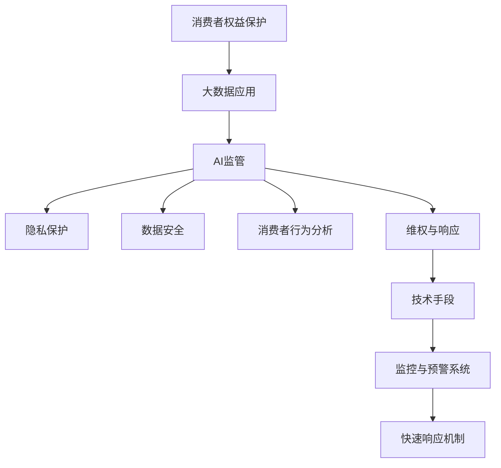
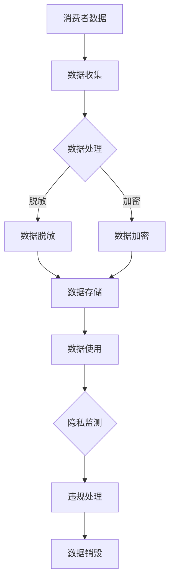
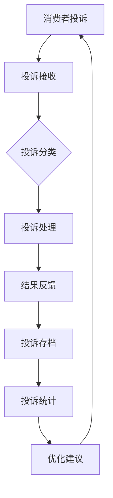
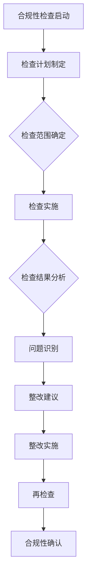

                 

## 大数据时代的消费者权益保护：AI监管与快速响应

### 关键词：大数据、消费者权益保护、人工智能监管、快速响应、隐私保护、数据安全、消费者行为分析

### 摘要：
随着大数据时代的到来，消费者权益保护面临前所未有的挑战。大数据技术的广泛应用使得企业和组织能够收集和分析海量的消费者数据，从而实现个性化服务与精准营销。然而，这也带来了隐私泄露、数据滥用等风险，严重侵犯了消费者的权益。本文将探讨大数据时代消费者权益保护的背景、核心概念，以及AI监管在其中的应用。通过深入分析AI监管的核心算法与模型、应用场景及其发展趋势，本文旨在为企业和监管机构提供切实可行的解决方案，以实现消费者权益的有效保护。

### 目录：

## 第一部分：大数据时代的消费者权益保护概述

### 1.1 大数据时代的消费者权益保护背景

#### 1.1.1 大数据时代的到来

#### 1.1.2 消费者权益保护的挑战

#### 1.1.3 AI技术在消费者权益保护中的应用前景

### 1.2 消费者权益保护的核心概念

#### 1.2.1 消费者权益的概念

#### 1.2.2 消费者权益保护的法律框架

#### 1.2.3 消费者权益保护的基本原则

### 1.3 大数据与消费者权益保护的关系

#### 1.3.1 大数据在消费者权益保护中的应用

#### 1.3.2 大数据对消费者权益保护的影响

#### 1.3.3 大数据与AI监管的结合

### 1.4 AI监管与消费者权益保护

#### 1.4.1 AI监管的概念

#### 1.4.2 AI监管的必要性

#### 1.4.3 AI监管在消费者权益保护中的应用

## 第二部分：AI监管的核心算法与模型

### 2.1 AI监管的核心算法原理

#### 2.1.1 监督学习算法

##### 2.1.1.1 线性回归

##### 2.1.1.2 决策树

##### 2.1.1.3 随机森林

#### 2.1.2 无监督学习算法

##### 2.1.2.1 K均值聚类

##### 2.1.2.2 主成分分析

#### 2.1.3 强化学习算法

##### 2.1.3.1 Q-learning

##### 2.1.3.2 Deep Q-Network

### 2.2 AI监管的关键技术

#### 2.2.1 数据预处理技术

##### 2.2.1.1 数据清洗

##### 2.2.1.2 数据归一化

##### 2.2.1.3 特征提取

#### 2.2.2 模型评估与选择技术

##### 2.2.2.1 交叉验证

##### 2.2.2.2 模型选择准则

#### 2.2.3 模型解释与可解释性技术

##### 2.2.3.1 特征重要性分析

##### 2.2.3.2 模型可解释性工具

## 第三部分：AI监管在消费者权益保护中的应用场景

### 3.1 消费者隐私保护

#### 3.1.1 消费者隐私保护的挑战

#### 3.1.2 消费者隐私保护的技术手段

#### 3.1.3 AI监管在消费者隐私保护中的应用

### 3.2 消费者数据安全

#### 3.2.1 消费者数据安全的挑战

#### 3.2.2 消费者数据安全的技术手段

#### 3.2.3 AI监管在消费者数据安全中的应用

### 3.3 消费者行为分析

#### 3.3.1 消费者行为分析的重要性

#### 3.3.2 消费者行为分析的技术手段

#### 3.3.3 AI监管在消费者行为分析中的应用

### 3.4 消费者维权与快速响应

#### 3.4.1 消费者维权的挑战

#### 3.4.2 消费者维权的技术手段

#### 3.4.3 AI监管在消费者维权中的应用

## 第四部分：AI监管与消费者权益保护的发展趋势

### 4.1 AI监管的伦理与法律问题

#### 4.1.1 AI监管的伦理问题

##### 4.1.1.1 公平性

##### 4.1.1.2 可解释性

##### 4.1.1.3 隐私保护

#### 4.1.2 AI监管的法律问题

##### 4.1.2.1 法律法规框架

##### 4.1.2.2 法律责任与义务

### 4.2 AI监管与消费者权益保护的未来发展

#### 4.2.1 AI监管的技术趋势

##### 4.2.1.1 深度学习

##### 4.2.1.2 自然语言处理

##### 4.2.1.3 聊天机器人

#### 4.2.2 消费者权益保护的未来挑战与机遇

##### 4.2.2.1 数据隐私保护

##### 4.2.2.2 消费者维权效率提升

##### 4.2.2.3 AI监管的可持续性

## 附录

### 附录A：AI监管与消费者权益保护相关资源

#### A.1 AI监管与消费者权益保护相关书籍推荐

#### A.2 AI监管与消费者权益保护相关论文推荐

#### A.3 AI监管与消费者权益保护相关网站推荐

### 附录B：Mermaid流程图

## 第一部分：大数据时代的消费者权益保护概述

### 1.1 大数据时代的消费者权益保护背景

#### 1.1.1 大数据时代的到来

随着互联网的普及和信息技术的发展，大数据时代已经悄然来临。大数据（Big Data）指的是规模巨大、类型繁多的数据集，这些数据从各种来源产生，包括社交网络、传感器、电子商务网站、物联网设备等。这些数据以文本、图像、音频、视频等多种形式存在，其规模之大、速度之快、类型之多样，使得传统的数据处理方法难以胜任。

大数据的三大特点是 **数据量（Volume）**、**数据速度（Velocity）** 和 **数据多样性（Variety）**。根据国际数据公司（IDC）的预测，全球数据总量将以每年约40%的速度增长，到2025年，全球数据总量将达到175ZB。如此庞大的数据量，对数据处理和分析技术提出了新的要求。

大数据技术不仅能够帮助企业和组织更好地理解市场和消费者行为，提升业务效率，还能够在医疗、教育、环境监测等多个领域发挥重要作用。例如，通过分析医疗数据，可以提前预测疾病爆发，制定有效的防控措施；通过分析教育数据，可以优化教育资源配置，提高教育质量。

#### 1.1.2 消费者权益保护的挑战

然而，大数据时代的到来也为消费者权益保护带来了新的挑战。首先，消费者数据的隐私泄露问题日益严重。企业和组织在收集、存储、处理消费者数据的过程中，如果管理不当，可能导致消费者的个人信息被泄露、盗用甚至滥用。近年来，许多知名企业发生的数据泄露事件，如Facebook的Cambridge Analytica数据泄露事件，使得消费者对数据隐私保护的关注度大幅提高。

其次，消费者数据的安全问题也备受关注。在庞大的数据集中，存在大量的敏感信息，如金融账户信息、医疗记录、通信记录等。一旦这些数据被黑客攻击、恶意软件感染或者内部人员泄露，将对消费者的生活和财产安全造成严重威胁。

此外，大数据技术在消费者行为分析中的应用，也可能侵犯消费者的隐私权。通过分析消费者的购买记录、浏览历史、社交网络活动等数据，企业可以精准地预测消费者的需求和行为，从而实施个性化营销。然而，这种数据分析如果不加限制，可能导致消费者的隐私信息被过度收集和利用，甚至被用于不公平的商业竞争。

#### 1.1.3 AI技术在消费者权益保护中的应用前景

面对这些挑战，人工智能（AI）技术的应用为消费者权益保护提供了新的思路和手段。AI技术可以通过以下几种方式在消费者权益保护中发挥作用：

1. **隐私保护与数据安全**：AI技术可以用于检测和预防数据泄露、网络攻击等安全事件。例如，通过使用机器学习算法，可以实时监控网络流量，发现异常行为并采取相应措施。

2. **消费者行为分析**：AI技术可以用于分析消费者的行为数据，发现潜在的隐私泄露风险和滥用行为。通过建立行为模型，可以识别异常行为并及时采取措施。

3. **快速响应与维权**：AI技术可以用于构建智能客服系统、维权平台等，实现快速响应消费者的投诉和求助。通过自然语言处理和智能对话系统，可以自动识别和解决常见问题，提高维权效率。

总之，大数据时代的消费者权益保护面临严峻挑战，但AI技术的应用为解决这些问题提供了新的途径。在接下来的章节中，我们将深入探讨消费者权益保护的核心概念、AI监管的理论基础和应用场景，以期为读者提供全面的理解和实用的解决方案。

### 1.2 消费者权益保护的核心概念

#### 1.2.1 消费者权益的概念

消费者权益是指消费者在购买、使用商品或接受服务过程中所享有的合法权益。这些权益不仅包括消费者的基本权利，如安全保障权、知情权、公平交易权等，还涵盖了消费者在享受服务、维权等方面的权利。具体来说，消费者权益主要包括以下几个方面：

1. **安全保障权**：消费者在购买商品或接受服务时，有权要求商品或服务符合安全标准，不危害人身和财产安全。

2. **知情权**：消费者有权了解商品或服务的真实情况，包括价格、质量、用途、生产日期、保质期等信息。

3. **公平交易权**：消费者有权在公平、公正的市场环境中进行交易，不受欺诈、虚假宣传、不正当竞争等行为的侵害。

4. **求偿权**：消费者在购买商品或接受服务过程中，如果受到损失，有权要求赔偿。

5. **个人信息保护权**：消费者有权对自己的个人信息进行保护，包括姓名、地址、电话号码、交易记录等。

#### 1.2.2 消费者权益保护的法律框架

消费者权益保护的法律框架主要由国际法规、国内法律法规和国际组织的规定构成。以下是一些关键的法律法规和国际组织：

1. **国际法规**：
   - **《消费者保护公约》**：1985年，联合国国际贸易法委员会通过了《消费者保护公约》，旨在保障全球消费者的基本权利。
   - **《通用数据保护条例》（GDPR）**：2018年，欧盟实施了GDPR，对个人数据的收集、存储、处理和传输进行了严格的规定。

2. **国内法律法规**：
   - **《中华人民共和国消费者权益保护法》**：2009年，中国通过了《消费者权益保护法》，明确了消费者的权利和经营者的义务。
   - **《中华人民共和国网络安全法》**：2017年，中国颁布了《网络安全法》，对网络信息安全和个人信息保护提出了具体要求。

3. **国际组织**：
   - **国际消费者联盟（ICCU）**：ICCU是国际消费者权益保护的权威机构，致力于推动全球消费者权益保护的发展。
   - **国际商会（ICC）**：ICC设立了消费者事务委员会，负责制定和推广消费者保护的国际标准。

#### 1.2.3 消费者权益保护的基本原则

消费者权益保护的基本原则主要包括以下几个方面：

1. **公正公平原则**：消费者在购买商品或接受服务时应享有公正、公平的交易环境，不受不正当竞争和欺诈行为的侵害。

2. **公开透明原则**：企业和组织在收集、处理和利用消费者数据时，应遵循公开透明的原则，确保消费者知情权。

3. **保护隐私原则**：消费者有权保护自己的个人信息，企业和组织应采取必要措施确保消费者数据的隐私和安全。

4. **及时救济原则**：当消费者的权益受到侵害时，应提供及时、有效的救济措施，包括赔偿、退换货等。

5. **社会责任原则**：企业和组织应承担社会责任，不仅追求经济利益，还要关注消费者权益保护，促进社会和谐与可持续发展。

#### 1.2.4 大数据与消费者权益保护的关系

大数据与消费者权益保护的关系体现在以下几个方面：

1. **隐私泄露风险**：大数据技术的广泛应用使得企业和组织能够收集和分析大量消费者数据，但也增加了隐私泄露的风险。如果不加以有效监管，消费者数据可能被滥用或泄露，导致严重的后果。

2. **消费者行为分析**：通过大数据技术，企业和组织可以深入分析消费者的行为数据，了解消费者的需求和偏好，从而实现精准营销。然而，这种分析如果不加限制，可能侵犯消费者的隐私权。

3. **数据安全挑战**：大数据环境下的数据量庞大、类型繁多，使得数据安全面临更大的挑战。一旦数据被黑客攻击或恶意软件感染，可能导致严重的安全事故。

4. **监管需求**：随着大数据技术的发展，消费者权益保护的需求也日益增加。如何有效监管大数据技术的应用，确保消费者权益得到充分保护，已成为一个亟待解决的问题。

总之，大数据时代的消费者权益保护既面临前所未有的挑战，也带来了新的机遇。在接下来的章节中，我们将深入探讨AI监管在消费者权益保护中的应用，以期为消费者权益的有效保护提供新的思路和手段。

### 1.3 大数据与消费者权益保护的关系

#### 1.3.1 大数据在消费者权益保护中的应用

大数据技术在消费者权益保护中的应用主要体现在以下几个方面：

1. **隐私保护**：通过大数据技术，可以实现对消费者隐私的更有效保护。例如，利用数据脱敏技术，对敏感信息进行加密或匿名化处理，减少隐私泄露的风险。此外，通过大数据分析，可以发现和处理潜在的隐私侵犯行为，及时采取保护措施。

2. **数据安全**：大数据技术可以帮助企业和组织建立更加完善的数据安全防护体系。通过实时监控数据流量、异常行为检测等手段，可以及时发现并防范潜在的安全威胁。例如，使用机器学习算法进行异常检测，能够识别出数据泄露、篡改等异常行为，从而采取相应的安全措施。

3. **消费者行为分析**：大数据技术可以深入分析消费者的行为数据，了解消费者的需求和偏好。这有助于企业更好地满足消费者的需求，提供个性化的产品和服务。同时，通过对消费者行为的分析，还可以发现潜在的隐私泄露和滥用风险，从而采取相应的保护措施。

4. **监管和合规**：大数据技术可以帮助监管机构更有效地进行消费者权益保护监管。通过大数据分析，可以识别出市场中的不正当竞争、欺诈行为等，从而采取相应的监管措施。此外，大数据技术还可以帮助监管机构更好地了解消费者的需求和反馈，制定更加科学合理的监管政策。

#### 1.3.2 大数据对消费者权益保护的影响

大数据技术对消费者权益保护产生了深远的影响：

1. **隐私保护挑战**：随着大数据技术的应用，消费者数据的规模和种类不断增加，隐私保护面临更大的挑战。如果不加以有效监管，大量消费者数据可能会被滥用或泄露，导致个人隐私受到侵害。

2. **数据安全风险**：大数据环境下的数据量庞大、类型繁多，使得数据安全面临更大的风险。一旦数据被黑客攻击或恶意软件感染，可能导致严重的安全事故，对消费者的生活和财产安全造成威胁。

3. **消费者权益侵害**：大数据技术的滥用可能侵犯消费者的权益。例如，企业通过大数据分析获取消费者的隐私信息，进行不公平的定价或歧视性服务；或者利用消费者的个人信息进行精准营销，导致消费者受到不必要的骚扰。

4. **监管难度增加**：大数据技术的复杂性和多样性使得监管机构在进行消费者权益保护监管时面临更大的挑战。如何有效监管大数据技术的应用，确保消费者权益得到充分保护，是一个亟待解决的问题。

#### 1.3.3 大数据与AI监管的结合

大数据与AI监管的结合为消费者权益保护提供了新的手段和思路：

1. **智能化监管**：AI技术可以实现对大数据的智能分析和处理，从而提高监管效率和准确性。例如，通过使用机器学习算法，可以自动识别和处理违规行为，提高监管的自动化水平。

2. **实时监控**：AI技术可以实现实时监控和预警，及时发现和处理潜在的隐私泄露、数据安全等问题。例如，通过使用深度学习算法，可以实时分析网络流量，识别异常行为并采取相应措施。

3. **透明度提升**：AI技术可以提高监管的透明度，使监管过程更加公正和公开。例如，通过使用区块链技术，可以实现监管数据的透明存储和共享，确保监管过程的公正性和可追溯性。

4. **个性化服务**：AI技术可以提供个性化的消费者权益保护服务，根据消费者的需求和反馈，制定个性化的保护策略。例如，通过使用自然语言处理技术，可以自动分析消费者的投诉和反馈，提供个性化的解决方案。

总之，大数据与AI监管的结合为消费者权益保护带来了新的机遇和挑战。在未来的发展中，需要进一步加强大数据与AI监管的结合，构建更加完善、高效的消费者权益保护体系，切实保障消费者的合法权益。

### 1.4 AI监管与消费者权益保护

#### 1.4.1 AI监管的概念

AI监管（Artificial Intelligence Governance）是指通过制定法律、政策、标准和规范，对人工智能（AI）技术的开发、应用和监管进行管理和规范的过程。其核心目的是确保AI技术的安全、可靠、透明和公平，避免技术滥用和伦理问题，从而保护公众利益和社会福祉。

AI监管的主要目标包括：

1. **安全性**：确保AI系统的稳定性和安全性，防止系统故障、数据泄露和网络安全威胁。
2. **可靠性**：确保AI系统的准确性和一致性，避免系统误判和错误决策。
3. **透明性**：提高AI系统的可解释性和透明度，使公众和监管机构能够理解AI系统的运作机制和决策过程。
4. **公平性**：确保AI技术在应用过程中不歧视、不偏见，避免对特定群体造成不公平待遇。
5. **合规性**：确保AI技术的开发和应用符合相关法律法规和道德规范。

AI监管的概念不仅仅局限于技术层面，还涉及到法律、伦理、经济和社会等多个方面。其目的是通过综合性的政策和措施，构建一个健康、可持续的AI生态系统。

#### 1.4.2 AI监管的必要性

AI监管的必要性主要体现在以下几个方面：

1. **技术发展迅速**：人工智能技术正以前所未有的速度发展，新的算法和应用层出不穷。在这种快速发展的背景下，缺乏有效的监管可能导致技术滥用和伦理问题。

2. **数据隐私和安全性**：AI系统通常依赖大量的数据进行分析和训练，这些数据可能包含敏感的个人信息。如果没有严格的监管措施，数据隐私和安全性将面临严重威胁。

3. **社会公平性问题**：AI技术的决策过程可能存在偏见和歧视，影响特定群体。例如，招聘系统可能因训练数据中的偏见而歧视女性或少数族裔。因此，需要通过监管确保AI技术应用的公平性。

4. **法律责任和责任归属**：随着AI技术的应用越来越广泛，确定AI系统责任归属的问题日益突出。如果AI系统发生故障或造成损失，需要明确责任归属，从而保证受害者的合法权益。

5. **公共信任**：有效的AI监管有助于提高公众对AI技术的信任度。当公众对AI技术感到信任时，他们更愿意接受和应用这些技术，从而促进技术的社会化和普及化。

#### 1.4.3 AI监管在消费者权益保护中的应用

AI监管在消费者权益保护中的应用主要体现在以下几个方面：

1. **隐私保护**：通过AI监管，可以制定和实施隐私保护措施，确保消费者数据的合法收集、存储、处理和使用。例如，使用差分隐私技术可以保护消费者数据的隐私，同时确保数据的有效性。

2. **数据安全**：AI监管可以促进数据安全技术的研发和应用，提高数据安全防护水平。例如，通过使用加密技术和访问控制策略，可以确保消费者数据的安全。

3. **消费者行为分析**：AI监管可以确保消费者行为分析过程的透明性和公正性，防止数据滥用。例如，通过使用可解释AI技术，可以使消费者了解其行为数据是如何被分析和利用的。

4. **维权和投诉处理**：AI监管可以促进智能客服系统和维权平台的建设，提高消费者维权效率和响应速度。例如，通过使用自然语言处理技术，可以自动识别和处理消费者的投诉和请求，提供个性化的解决方案。

5. **合规性检查**：AI监管可以自动化执行合规性检查，确保企业和组织的AI应用符合相关法律法规和伦理标准。例如，通过使用区块链技术，可以实现对AI系统操作的透明存储和追踪，确保操作的合法性和可追溯性。

总之，AI监管在消费者权益保护中扮演着至关重要的角色。通过制定和实施有效的AI监管措施，可以保障消费者的合法权益，促进AI技术的健康、可持续发展。

## 第二部分：AI监管的核心算法与模型

### 2.1 AI监管的核心算法原理

AI监管的核心算法主要基于机器学习和深度学习技术，通过分析和处理大量数据，实现自动识别和预测潜在风险。以下将介绍几种核心算法的基本原理及其在AI监管中的应用。

#### 2.1.1 监督学习算法

监督学习算法是一种通过训练数据集来学习数据特征的算法。它能够根据输入特征和输出标签，建立一个预测模型，用于对新数据进行预测。监督学习算法主要包括以下几种：

1. **线性回归（Linear Regression）**

线性回归是一种简单的监督学习算法，用于预测连续值输出。其基本原理是通过找到一个线性函数，将输入特征映射到输出值。线性回归的数学模型可以表示为：

\[ y = \beta_0 + \beta_1 \cdot x \]

其中，\( y \) 是输出值，\( x \) 是输入特征，\( \beta_0 \) 和 \( \beta_1 \) 是模型的参数。通过最小化损失函数（如均方误差），可以训练出最佳参数，从而预测新的输入值。

2. **决策树（Decision Tree）**

决策树是一种常见的分类算法，通过一系列规则来划分数据，最终得到一个树形结构。每个节点代表一个特征，每个分支代表一个特征取值，叶节点表示预测结果。决策树的核心在于通过特征划分，将数据集划分为不同的子集，从而实现分类或回归。

3. **随机森林（Random Forest）**

随机森林是一种集成学习方法，通过构建多个决策树，并将它们的预测结果进行投票或平均，得到最终的预测结果。随机森林的核心思想是利用随机性减少过拟合，提高模型的泛化能力。其基本原理是在构建决策树时，从特征集合中随机选择一部分特征进行划分，同时随机选择样本子集进行训练。

#### 2.1.2 无监督学习算法

无监督学习算法不需要标签数据，主要用于发现数据中的隐藏结构和模式。以下介绍两种常用的无监督学习算法：

1. **K均值聚类（K-means Clustering）**

K均值聚类是一种基于距离度量的聚类算法，旨在将数据集划分为 \( k \) 个簇（cluster），使得簇内的数据点之间的距离最小，簇与簇之间的距离最大。算法的基本步骤包括：

   - 初始化 \( k \) 个簇的中心点。
   - 计算每个数据点到簇中心的距离，并将其分配到最近的簇。
   - 更新簇中心点的位置，使得簇内数据点之间的距离最小。
   - 重复步骤2和3，直到簇中心点不再发生显著变化。

2. **主成分分析（Principal Component Analysis，PCA）**

主成分分析是一种降维方法，通过将数据投影到新的坐标系中，提取出最重要的主成分，从而减少数据的维度。PCA的基本原理是寻找一个正交基，使得投影后的数据具有最大的方差。具体步骤包括：

   - 计算数据集的协方差矩阵。
   - 计算协方差矩阵的特征值和特征向量。
   - 选择最大的 \( k \) 个特征向量作为新的坐标轴。
   - 将数据投影到新的坐标轴上，实现降维。

#### 2.1.3 强化学习算法

强化学习算法是一种基于奖励机制的学习方法，通过不断尝试和反馈，找到最优策略。以下介绍两种常用的强化学习算法：

1. **Q学习（Q-Learning）**

Q学习是一种基于值函数的强化学习算法，通过学习最优动作值函数 \( Q(s, a) \)，选择当前状态下的最优动作。算法的基本步骤包括：

   - 初始化 \( Q(s, a) \) 函数。
   - 在当前状态下，选择一个动作 \( a \) 并执行。
   - 根据执行结果更新 \( Q(s, a) \) 函数，使用更新公式：
     \[ Q(s, a) = Q(s, a) + \alpha [r + \gamma \max_{a'} Q(s', a') - Q(s, a)] \]
     其中，\( r \) 是即时奖励，\( \gamma \) 是折扣因子，\( \alpha \) 是学习率。
   - 转移到新的状态 \( s' \)，重复步骤2和3，直到达到目标状态或满足终止条件。

2. **深度Q网络（Deep Q-Network，DQN）**

深度Q网络是一种基于深度学习的强化学习算法，通过构建深度神经网络来近似值函数 \( Q(s, a) \)。DQN的基本原理包括：

   - 使用卷积神经网络（CNN）或循环神经网络（RNN）等深度学习模型，对输入状态 \( s \) 进行编码。
   - 使用经验回放（Experience Replay）机制，存储和随机抽样之前的经验，减少样本偏差。
   - 使用双Q网络（Target Network）进行稳定训练，通过更新目标值函数：
     \[ Q(s, a) = Q(s, a) + \alpha [r + \gamma Q'(s', a') - Q(s, a)] \]
     其中，\( Q'(s', a') \) 是目标值函数的预测值。

这些核心算法在AI监管中发挥着重要作用，通过它们，可以实现对消费者数据的智能分析和风险识别。在下一节中，我们将进一步探讨AI监管中的关键技术，包括数据预处理、模型评估与选择以及模型解释与可解释性。

### 2.2 AI监管的关键技术

在AI监管领域，数据预处理、模型评估与选择以及模型解释与可解释性是三个至关重要的关键技术。以下将详细介绍这些技术的核心概念、方法及其在AI监管中的应用。

#### 2.2.1 数据预处理技术

数据预处理是AI监管中至关重要的一步，其目的是提高数据质量，减少噪声，增强模型的性能。以下介绍几种常见的数据预处理技术：

1. **数据清洗（Data Cleaning）**

数据清洗是指识别和纠正数据集中的错误、缺失或不一致的数据。具体步骤包括：

   - **错误值修正**：识别和修正数据中的错误值，如将异常值替换为合理值或删除错误记录。
   - **缺失值处理**：处理缺失数据，如使用平均值、中位数或插值法填充缺失值，或者删除缺失数据。
   - **不一致性处理**：解决数据中的不一致性，如统一不同来源的数据格式、单位或编码。

2. **数据归一化（Data Normalization）**

数据归一化是指将数据转换到相同的尺度，以便模型训练过程中各项特征的重要性得到平衡。常见的归一化方法包括：

   - **最小-最大归一化**：将数据缩放到 \([0, 1]\) 范围内，计算公式为：
     \[ x_{\text{norm}} = \frac{x - x_{\text{min}}}{x_{\text{max}} - x_{\text{min}}} \]
   - **标准归一化**：将数据缩放到标准正态分布，计算公式为：
     \[ x_{\text{norm}} = \frac{x - \mu}{\sigma} \]
     其中，\( \mu \) 和 \( \sigma \) 分别为数据的平均值和标准差。

3. **特征提取（Feature Extraction）**

特征提取是指从原始数据中提取出对模型训练有显著贡献的特征，从而提高模型的性能。常见的特征提取方法包括：

   - **主成分分析（PCA）**：通过降维，提取最重要的特征，减少数据维度，提高模型训练效率。
   - **自动特征选择（Automatic Feature Selection）**：使用算法自动选择对模型预测最重要的特征，减少冗余特征。

#### 2.2.2 模型评估与选择技术

模型评估与选择技术用于评估不同模型的性能，并选择最优模型。以下介绍几种常见的模型评估与选择方法：

1. **交叉验证（Cross-Validation）**

交叉验证是一种评估模型性能的常用方法，通过将数据集划分为多个子集，分别用于训练和验证模型。常见的交叉验证方法包括：

   - **K折交叉验证**：将数据集划分为 \( K \) 个相等的子集，每次使用一个子集作为验证集，其余子集作为训练集，共进行 \( K \) 次训练和验证，取平均性能作为模型评估结果。
   - **留一法交叉验证**：每次仅使用一个数据点作为验证集，其余数据点作为训练集，共进行 \( N \) 次训练和验证，取平均性能作为模型评估结果。

2. **模型选择准则（Model Selection Criteria）**

模型选择准则用于选择性能最优的模型，常用的选择准则包括：

   - **均值绝对误差（Mean Absolute Error，MAE）**：衡量预测值与真实值之间的平均绝对误差。
   - **均方误差（Mean Squared Error，MSE）**：衡量预测值与真实值之间的平均平方误差。
   - **决定系数（R-squared）**：衡量模型解释数据变异的能力，取值范围在 0 到 1 之间，越接近 1 表示模型解释能力越强。

3. **网格搜索（Grid Search）**

网格搜索是一种通过遍历所有参数组合，选择最优参数的方法。具体步骤包括：

   - 定义参数搜索空间，包括每个参数的取值范围。
   - 遍历所有参数组合，训练和评估模型，记录每个组合的性能。
   - 选择性能最优的参数组合，作为模型的最终参数。

#### 2.2.3 模型解释与可解释性技术

模型解释与可解释性技术用于解释模型的决策过程和预测结果，提高模型的可信度和透明度。以下介绍几种常见的模型解释方法：

1. **特征重要性分析（Feature Importance Analysis）**

特征重要性分析用于识别模型中最重要的特征，从而提高模型的可解释性。常见的特征重要性分析方法包括：

   - **基于模型的方法**：如随机森林中的特征重要性评分，通过模型输出对特征进行排序。
   - **基于统计的方法**：如相关系数、互信息等，通过计算特征与目标变量之间的相关性来评估特征的重要性。

2. **模型可视化（Model Visualization）**

模型可视化是一种通过图形化展示模型结构和决策过程的方法，常见的方法包括：

   - **决策树可视化**：通过树形结构展示决策过程，使模型的可解释性更加直观。
   - **神经网络可视化**：通过绘制神经网络结构图，展示输入和输出之间的关系。

3. **LIME（Local Interpretable Model-agnostic Explanations）**

LIME是一种可解释性方法，通过为每个预测结果生成一个可解释的本地模型，从而提高全局模型的可解释性。LIME的基本步骤包括：

   - 选择一个预测结果作为解释目标。
   - 使用一个简单的本地模型（如线性模型）来拟合原始模型在目标数据点附近的决策。
   - 计算特征对本地模型的贡献，从而解释原始模型的决策过程。

通过这些关键技术，AI监管能够更好地理解和解释模型的决策过程，提高模型的可靠性和透明度，从而更好地服务于消费者权益保护。在下一部分中，我们将探讨AI监管在具体应用场景中的实践和效果。

### 2.3 AI监管在消费者权益保护中的应用场景

在消费者权益保护领域，AI监管的应用场景广泛且多样，涵盖了隐私保护、数据安全、消费者行为分析和维权与快速响应等多个方面。以下将详细探讨这些应用场景及其关键技术。

#### 3.1 消费者隐私保护

消费者隐私保护是AI监管的重要应用之一，旨在防止消费者个人信息被非法收集、存储、处理和泄露。以下介绍几种关键技术：

1. **数据脱敏（Data Anonymization）**

数据脱敏是一种常用的隐私保护技术，通过将敏感信息替换为伪随机值或无意义的标识符，从而保护真实数据。常见的数据脱敏方法包括：

   - **数据替换**：将敏感数据替换为随机值或指定值。
   - **数据掩盖**：对敏感数据进行部分掩盖，只保留部分信息。
   - **数据混淆**：通过引入噪声或扰动，使敏感数据无法直接识别。

2. **差分隐私（Differential Privacy）**

差分隐私是一种在保证数据匿名化的同时，仍然能进行有效数据分析的方法。其核心思想是通过在数据中引入噪声，使得数据分析结果对单个数据点的依赖性降低，从而保护隐私。差分隐私的数学模型可以表示为：

\[ \text{Privacy}(R, \epsilon) = \Pr[R \mid D] - \Pr[R \mid D \setminus x] \leq \epsilon \]

其中，\( R \) 是数据分析结果，\( D \) 是原始数据集，\( x \) 是被修改的数据点，\( \epsilon \) 是隐私参数。

3. **数据访问控制（Data Access Control）**

数据访问控制通过限制对敏感数据的访问，确保只有授权用户才能访问和操作数据。常见的数据访问控制方法包括：

   - **角色基础访问控制（RBAC）**：根据用户角色和权限，定义对不同数据的访问权限。
   - **属性基础访问控制（ABAC）**：根据数据属性和用户属性，定义对不同数据的访问权限。

#### 3.2 消费者数据安全

消费者数据安全是AI监管的另一个重要应用，旨在防止消费者数据被黑客攻击、恶意软件感染或内部泄露。以下介绍几种关键技术：

1. **数据加密（Data Encryption）**

数据加密是一种通过将数据转换成密文，防止未授权访问的技术。常见的数据加密方法包括：

   - **对称加密**：使用相同的密钥进行加密和解密，如AES算法。
   - **非对称加密**：使用一对密钥（公钥和私钥）进行加密和解密，如RSA算法。

2. **入侵检测（Intrusion Detection）**

入侵检测是一种通过监控网络流量和系统活动，识别和防范潜在攻击的技术。常见的方法包括：

   - **异常检测**：通过分析系统行为，识别与正常行为不一致的异常行为。
   - **误用检测**：通过建立攻击模式库，识别符合特定攻击模式的异常行为。

3. **数据备份与恢复（Data Backup and Recovery）**

数据备份与恢复是一种在数据丢失或损坏时，通过恢复备份数据来确保数据安全的技术。常见的方法包括：

   - **定期备份**：定期将数据备份到外部存储设备或云存储。
   - **灾难恢复**：在发生灾难时，通过恢复备份数据来恢复系统。

#### 3.3 消费者行为分析

消费者行为分析是AI监管在消费者权益保护中的另一个重要应用，旨在通过分析消费者的行为数据，识别潜在的隐私泄露和滥用风险。以下介绍几种关键技术：

1. **数据挖掘与机器学习（Data Mining and Machine Learning）**

数据挖掘与机器学习是一种通过分析大量消费者行为数据，发现隐藏模式和规律的方法。常见的方法包括：

   - **关联规则学习**：通过发现数据之间的关联关系，识别潜在的隐私泄露风险。
   - **分类与回归分析**：通过建立分类和回归模型，预测消费者的行为和偏好。

2. **数据可视化（Data Visualization）**

数据可视化是一种通过图形化展示消费者行为数据，使其更加直观和易于理解的方法。常见的方法包括：

   - **散点图**：通过展示消费者行为数据在二维空间中的分布，识别潜在的风险。
   - **热力图**：通过展示消费者行为数据在不同维度上的强度，识别热点区域。

3. **用户画像（User Profiling）**

用户画像是一种通过整合消费者的行为数据，构建消费者特征模型的方法。常见的方法包括：

   - **特征工程**：通过提取和构建消费者行为数据中的有效特征，提高用户画像的准确性。
   - **聚类分析**：通过聚类算法，将消费者分为不同的群体，为个性化服务提供依据。

#### 3.4 消费者维权与快速响应

消费者维权与快速响应是AI监管在消费者权益保护中的最后一个重要应用，旨在通过构建智能客服系统和维权平台，提高消费者维权效率和响应速度。以下介绍几种关键技术：

1. **自然语言处理（Natural Language Processing，NLP）**

自然语言处理是一种通过计算机技术理解和处理自然语言的方法，常见的方法包括：

   - **文本分类**：通过分类算法，将消费者的投诉和请求自动归类到相应的类别，提高处理效率。
   - **文本挖掘**：通过挖掘消费者文本数据中的关键信息，识别潜在的问题和风险。

2. **智能客服系统（Smart Customer Service System）**

智能客服系统是一种通过人工智能技术提供24/7在线客服服务的方法，常见的方法包括：

   - **智能对话系统**：通过自然语言处理技术，与消费者进行智能对话，解答疑问和提供帮助。
   - **语音识别与合成**：通过语音识别和语音合成技术，实现文本和语音的转换，提高服务效率。

3. **快速响应机制（Fast Response Mechanism）**

快速响应机制是一种通过建立快速响应机制，及时处理消费者投诉和请求的方法，常见的方法包括：

   - **自动化处理**：通过自动化工具，快速处理消费者的投诉和请求，减少人工处理时间。
   - **多渠道接入**：通过多种渠道（如电话、邮件、社交媒体等），方便消费者进行投诉和咨询。

通过这些应用场景和关键技术，AI监管在消费者权益保护中发挥着重要作用。在未来的发展中，需要进一步探索和优化这些技术，提高消费者权益保护的效率和效果。

### 3.1 消费者隐私保护的挑战

在消费者隐私保护方面，大数据和AI技术的广泛应用带来了许多挑战。以下是几个主要的挑战及其原因和影响：

#### 数据规模和多样性

大数据的特点之一是数据规模庞大、类型繁多。企业和组织通过互联网、物联网设备、社交媒体等各种渠道收集海量的消费者数据，包括个人身份信息、购买记录、浏览历史、通信记录等。这种大规模的数据集为隐私保护带来了巨大挑战。首先，数据规模庞大导致存储和处理的复杂性增加，数据泄露的风险也随之增大。其次，数据类型的多样性使得隐私保护更加困难，需要针对不同类型的数据采取不同的保护措施。

#### 数据收集和使用的不透明性

在消费者隐私保护中，数据收集和使用的不透明性是一个重要问题。许多企业和组织在收集消费者数据时，没有明确告知消费者数据的具体用途和范围。此外，一些企业可能会在未获得消费者明确同意的情况下，将数据用于其他商业目的，如广告定向、市场调研等。这种数据使用的不透明性使得消费者难以知晓其个人数据是如何被收集、存储、处理和共享的，从而增加了隐私泄露的风险。

#### 数据滥用和跨境流动

大数据技术的应用使得消费者数据被滥用的风险增加。一些不法分子可能通过黑客攻击、恶意软件等方式获取消费者数据，用于非法交易、诈骗等犯罪活动。此外，随着全球化和数字化的发展，消费者数据跨境流动日益频繁。然而，不同国家和地区在数据保护法律和标准上存在差异，这可能使得跨境数据流动过程中隐私保护无法得到有效保障。

#### AI技术的不确定性

AI技术在消费者隐私保护中的应用也带来了不确定性。首先，AI算法的复杂性和不透明性使得监管机构和消费者难以理解其决策过程，无法确定隐私保护措施的有效性。其次，AI系统可能会因为训练数据中的偏见而导致不公平决策，进一步侵犯消费者权益。例如，如果训练数据中存在性别、种族等偏见，AI系统可能会在决策中表现出性别歧视或种族歧视，损害特定群体的利益。

#### 法律法规滞后

虽然全球范围内已经有一些关于消费者隐私保护的法律法规，但这些法律法规在应对大数据和AI技术快速发展带来的挑战时，仍然存在一定的滞后性。一些法律法规未能及时更新，无法覆盖新兴技术带来的隐私保护问题。此外，法律法规的执行和监管也面临挑战，需要加强国际合作和协调。

总之，大数据和AI技术的广泛应用为消费者隐私保护带来了前所未有的挑战。企业和组织需要采取有效的技术和管理措施，加强隐私保护，同时监管机构和立法机构也需要加强法律法规的制定和执行，共同保障消费者的合法权益。

#### 3.1.2 消费者隐私保护的技术手段

面对大数据和AI技术带来的隐私保护挑战，企业和组织可以采取一系列技术手段来加强消费者隐私保护。以下是一些关键的技术手段及其具体应用：

1. **数据脱敏（Data Anonymization）**

数据脱敏是一种常用的隐私保护技术，通过将敏感信息替换为伪随机值或无意义的标识符，从而保护真实数据。常见的数据脱敏方法包括：

   - **数据替换**：将敏感数据替换为随机值或指定值。例如，将身份证号码替换为一系列随机数字。
   - **数据掩盖**：对敏感数据进行部分掩盖，只保留部分信息。例如，只显示身份证号码的后四位。
   - **数据混淆**：通过引入噪声或扰动，使敏感数据无法直接识别。例如，对电话号码进行加密处理。

2. **差分隐私（Differential Privacy）**

差分隐私是一种在保证数据匿名化的同时，仍然能进行有效数据分析的方法。其核心思想是通过在数据中引入噪声，使得数据分析结果对单个数据点的依赖性降低，从而保护隐私。差分隐私的数学模型可以表示为：

\[ \text{Privacy}(R, \epsilon) = \Pr[R \mid D] - \Pr[R \mid D \setminus x] \leq \epsilon \]

其中，\( R \) 是数据分析结果，\( D \) 是原始数据集，\( x \) 是被修改的数据点，\( \epsilon \) 是隐私参数。常见的技术包括拉普拉斯机制和指数机制。

3. **数据加密（Data Encryption）**

数据加密是一种通过将数据转换成密文，防止未授权访问的技术。常见的数据加密方法包括：

   - **对称加密**：使用相同的密钥进行加密和解密，如AES算法。
   - **非对称加密**：使用一对密钥（公钥和私钥）进行加密和解密，如RSA算法。

4. **访问控制（Access Control）**

访问控制通过限制对敏感数据的访问，确保只有授权用户才能访问和操作数据。常见的方法包括：

   - **基于角色的访问控制（RBAC）**：根据用户角色和权限，定义对不同数据的访问权限。
   - **基于属性的访问控制（ABAC）**：根据数据属性和用户属性，定义对不同数据的访问权限。

5. **区块链技术（Blockchain Technology）**

区块链技术通过分布式账本和加密算法，提供透明、不可篡改的数据存储和传输机制，从而增强隐私保护。区块链技术在隐私保护中的应用包括：

   - **数据加密存储**：通过加密技术，保护数据在区块链上的存储。
   - **隐私保护交易**：通过匿名化交易参与方信息，保护交易双方的隐私。
   - **智能合约**：通过智能合约，自动执行隐私保护规则，减少人工干预。

6. **匿名通信（Anonymous Communication）**

匿名通信技术通过加密和匿名化手段，保护通信过程中的隐私。常见的方法包括：

   - **匿名代理（Anonymous Proxy）**：通过代理服务器，隐藏通信实体的真实IP地址。
   - **匿名网络（Anonymous Network）**：如Tor网络，通过多个节点路由，使通信路径不可追踪。

7. **隐私计算（Privacy Computing）**

隐私计算技术通过在数据收集、存储、处理和传输过程中，采用隐私保护算法和技术，确保数据隐私不被泄露。常见的方法包括：

   - **联邦学习（Federated Learning）**：通过分布式计算，在本地设备上进行数据处理和模型训练，避免数据集中存储。
   - **安全多方计算（Secure Multi-party Computation，SMC）**：通过加密算法和协议，使多个参与方在不知道对方数据的情况下，共同计算结果。

通过这些技术手段，企业和组织可以更好地保护消费者隐私，降低隐私泄露的风险。同时，监管机构和立法机构也需要不断完善相关法律法规，确保技术手段的有效实施和执行。

### 3.1.3 AI监管在消费者隐私保护中的应用

AI监管在消费者隐私保护中的应用至关重要，通过一系列技术和管理手段，可以确保消费者数据在收集、存储、处理和传输过程中得到有效保护。以下是AI监管在消费者隐私保护中的几个关键应用场景：

1. **AI驱动的数据隐私监测**

通过使用机器学习算法，可以实现对消费者数据的实时监测和风险评估。例如，利用异常检测算法，可以识别出数据收集过程中的异常行为，如未经授权的数据访问或数据泄露尝试。通过建立数据隐私模型，可以监控和分析数据隐私风险，及时采取应对措施，防止隐私泄露事件的发生。

2. **隐私影响评估（PIA）**

隐私影响评估是一种系统化的方法，用于评估数据处理活动对个人隐私的影响。AI监管可以通过自动化PIA流程，提高评估效率和准确性。例如，使用自然语言处理技术，可以自动提取和处理隐私政策、用户协议等文本，分析其中涉及的数据收集和处理规则，评估隐私风险。

3. **隐私保护算法的设计和优化**

AI监管可以指导和推动隐私保护算法的研究和开发，确保算法在数据处理过程中最小化隐私泄露风险。例如，差分隐私算法可以用于数据发布，保护个体隐私；同态加密算法可以用于数据存储和计算，确保数据在传输和处理过程中保持加密状态。通过优化这些算法，可以显著提高数据处理过程中的隐私保护水平。

4. **隐私合规性检查**

AI监管可以通过自动化工具，对企业和组织的隐私保护措施进行合规性检查。例如，使用规则引擎和机器学习算法，可以自动检查数据处理流程中的隐私保护规则，确保遵守相关法律法规和内部政策。通过定期进行合规性检查，可以及时发现和纠正违规行为，防止隐私泄露事件的发生。

5. **隐私请求处理**

在消费者提出隐私请求时，如要求访问、修改或删除其个人信息，AI监管可以帮助企业和组织快速响应这些请求。例如，使用自动化系统，可以快速处理消费者的数据请求，减少人工处理时间。通过自然语言处理技术，可以自动理解和分类消费者的隐私请求，提高处理效率。

6. **隐私泄露响应**

一旦发生隐私泄露事件，AI监管可以通过自动化响应机制，迅速采取应对措施。例如，利用机器学习算法，可以自动识别隐私泄露事件的影响范围，通知相关消费者，并采取数据恢复和补救措施。通过实时监控和响应机制，可以最大限度地减少隐私泄露事件对消费者和企业的负面影响。

通过AI监管在消费者隐私保护中的应用，可以显著提高数据处理过程中的透明度、安全性和合规性，有效保护消费者的合法权益。在未来的发展中，需要进一步探索和优化这些技术，以应对不断变化的技术和隐私保护挑战。

### 3.2 消费者数据安全的挑战

在消费者数据安全方面，大数据和AI技术的广泛应用同样带来了诸多挑战。以下是几个主要挑战及其原因和影响：

#### 数据量庞大

大数据的一个重要特点是数据量庞大。企业和组织通过互联网、物联网设备、社交媒体等多种渠道收集了海量的消费者数据，这些数据不仅包括个人身份信息、购买记录、浏览历史，还包括通信记录、位置信息等。如此庞大的数据量使得数据安全面临巨大挑战，因为任何一处漏洞或攻击都可能暴露大量的敏感信息。

#### 数据类型多样

大数据的另一个特点是数据类型多样。除了结构化数据外，还包括非结构化数据，如文本、图像、音频和视频等。这些不同类型的数据在存储、处理和保护上有着不同的需求。例如，图像和视频数据可能涉及人脸识别等技术，一旦泄露，后果严重。此外，不同类型的数据可能需要不同的加密和访问控制策略，增加了数据安全管理的复杂性。

#### 数据生命周期长

消费者数据在企业和组织中通常有较长生命周期，从数据收集、存储、处理到分析，再到数据销毁或归档，每一个环节都可能成为数据安全的薄弱环节。如果数据生命周期管理不当，数据可能在未授权的情况下长时间被存储和处理，增加了数据泄露或滥用的风险。

#### 数据存储分散

随着云计算和边缘计算的普及，消费者数据不再仅仅存储在本地服务器上，而是分散存储在多个数据中心、云平台和边缘设备中。这种分散存储方式虽然提高了数据访问的灵活性，但也使得数据安全管理变得更加复杂，因为需要确保所有存储点都能得到有效的安全保护。

#### AI技术的脆弱性

AI技术在数据安全领域有着广泛的应用，如异常检测、入侵检测、加密等，但AI技术本身也存在脆弱性。首先，AI模型可能因为训练数据中的偏差而产生偏见，导致误判或错误决策。其次，AI模型可能因为攻击者的对抗性攻击（adversarial attack）而失效，例如，通过轻微修改输入数据，使AI模型产生错误的预测结果。此外，AI系统的实现和部署可能存在漏洞，如未加密的通信、权限管理不当等，这些漏洞可能被攻击者利用，从而危害数据安全。

#### 法律法规滞后

虽然全球范围内已经有一些关于数据安全的法律法规，但这些法律法规在应对大数据和AI技术快速发展带来的挑战时，仍然存在一定的滞后性。一些法律法规未能及时更新，无法覆盖新兴技术带来的数据安全风险。此外，法律法规的执行和监管也面临挑战，需要加强国际合作和协调。

#### 员工安全意识不足

数据安全不仅依赖于技术手段，还需要员工的积极参与。然而，许多企业和组织的员工对数据安全的意识不足，可能因为疏忽或恶意行为导致数据泄露。例如，员工可能无意中泄露敏感信息，或者被网络钓鱼攻击所欺骗，从而给数据安全带来威胁。

总之，大数据和AI技术的广泛应用为消费者数据安全带来了巨大的挑战。企业和组织需要采取全面的安全措施，包括技术和管理手段，以确保消费者数据得到有效保护。同时，监管机构和立法机构也需要加强法律法规的制定和执行，共同应对数据安全挑战。

### 3.2.2 消费者数据安全的技术手段

为了应对大数据和AI技术带来的数据安全挑战，企业和组织可以采用一系列技术手段来加强消费者数据的安全防护。以下是一些关键的技术手段及其具体应用：

1. **数据加密（Data Encryption）**

数据加密是一种通过将数据转换成密文，防止未授权访问的技术。常见的数据加密方法包括：

   - **对称加密**：使用相同的密钥进行加密和解密，如AES算法。对称加密速度快，适用于大数据量场景。
   - **非对称加密**：使用一对密钥（公钥和私钥）进行加密和解密，如RSA算法。非对称加密适用于安全通信，确保数据在传输过程中的机密性。

2. **访问控制（Access Control）**

访问控制通过限制对敏感数据的访问，确保只有授权用户才能访问和操作数据。常见的方法包括：

   - **基于角色的访问控制（RBAC）**：根据用户角色和权限，定义对不同数据的访问权限。RBAC适用于大型企业和组织，便于管理和维护。
   - **基于属性的访问控制（ABAC）**：根据数据属性和用户属性，定义对不同数据的访问权限。ABAC适用于更加复杂的访问控制需求。

3. **身份验证（Authentication）**

身份验证是一种验证用户身份的技术，确保只有合法用户才能访问系统和服务。常见的方法包括：

   - **单点登录（SSO）**：通过一个统一的入口，使用户能够一次性登录多个系统和服务。
   - **双因素认证（2FA）**：在基本密码验证之外，增加第二层验证，如短信验证码、指纹识别等，提高安全性。

4. **入侵检测系统（Intrusion Detection System，IDS）**

入侵检测系统是一种监控网络和系统活动，识别潜在攻击和异常行为的工具。常见的方法包括：

   - **异常检测**：通过分析正常行为模型，识别与正常行为不一致的异常行为。
   - **误用检测**：通过建立攻击模式库，识别符合特定攻击模式的异常行为。

5. **防火墙（Firewall）**

防火墙是一种网络安全设备，用于过滤和监控进出网络的数据流量，防止未授权访问和攻击。常见的方法包括：

   - **状态检测防火墙**：通过检测网络连接的状态，控制进出网络的数据流量。
   - **应用层防火墙**：通过分析应用层协议和数据包内容，提供更加细粒度的安全控制。

6. **漏洞管理（Vulnerability Management）**

漏洞管理是一种识别、评估和修复系统漏洞的技术，确保系统安全。常见的方法包括：

   - **漏洞扫描**：通过自动化工具扫描系统，识别潜在的安全漏洞。
   - **补丁管理**：及时应用安全补丁，修复已知漏洞。

7. **数据备份与恢复（Data Backup and Recovery）**

数据备份与恢复是一种在数据丢失或损坏时，通过恢复备份数据来确保数据安全的技术。常见的方法包括：

   - **定期备份**：定期将数据备份到外部存储设备或云存储。
   - **灾难恢复**：在发生灾难时，通过恢复备份数据来恢复系统。

8. **区块链技术（Blockchain Technology）**

区块链技术通过分布式账本和加密算法，提供透明、不可篡改的数据存储和传输机制，从而增强数据安全。常见的方法包括：

   - **数据加密存储**：通过加密技术，保护数据在区块链上的存储。
   - **隐私保护交易**：通过匿名化交易参与方信息，保护交易双方的隐私。

通过这些技术手段，企业和组织可以显著提高消费者数据的安全防护水平，降低数据泄露和滥用的风险。同时，监管机构和立法机构也需要加强法律法规的制定和执行，确保这些技术手段的有效实施和监督。

### 3.2.3 AI监管在消费者数据安全中的应用

AI监管在消费者数据安全中的应用至关重要，通过结合AI技术和安全管理策略，可以实现对消费者数据的全面保护。以下是AI监管在消费者数据安全中的几个关键应用：

1. **实时威胁检测**

通过AI技术，可以实现实时威胁检测，及时发现和响应潜在的安全威胁。例如，使用机器学习算法，可以分析网络流量和系统日志，识别异常行为和潜在攻击。通过建立威胁检测模型，可以自动识别和分类不同类型的威胁，如SQL注入、跨站脚本攻击等，并生成告警通知，以便采取及时应对措施。

2. **入侵防御系统**

AI监管可以用于构建智能入侵防御系统，通过分析网络流量和行为模式，识别和阻止未授权访问和恶意攻击。例如，利用异常检测算法，可以实时监控网络流量，发现与正常行为不一致的流量模式，如DDoS攻击、数据窃取等，并采取相应的防护措施，如封禁恶意IP地址、调整网络流量策略等。

3. **数据泄露防护**

AI监管可以用于数据泄露防护，通过分析数据使用模式和用户行为，识别潜在的数据泄露风险。例如，使用机器学习算法，可以检测数据访问中的异常行为，如未经授权的数据访问、异常数据传输等，并及时采取措施，如隔离数据、限制访问权限等，防止数据泄露事件的发生。

4. **安全态势感知**

AI监管可以用于构建安全态势感知平台，通过集成多种安全数据和工具，实现对整个系统安全状况的全面监测和分析。例如，通过使用大数据分析技术，可以综合分析网络流量、系统日志、安全事件等信息，生成安全态势报告，帮助企业和组织及时了解安全状况，发现潜在风险。

5. **自动化响应和恢复**

AI监管可以用于自动化响应和恢复，通过建立智能响应机制，自动处理安全事件，减少人工干预。例如，当发生数据泄露或系统入侵事件时，AI系统可以自动执行应急预案，如隔离受影响系统、通知相关方、恢复系统等，最大限度地减少事件对业务的影响。

6. **隐私保护与合规性检查**

AI监管可以用于隐私保护和合规性检查，通过分析数据处理流程，确保数据保护和隐私合规。例如，使用自然语言处理技术，可以自动审查隐私政策、用户协议等文本，识别潜在的隐私风险和合规性问题，并提供相应的合规性建议。

7. **用户行为分析**

AI监管可以用于用户行为分析，通过分析用户行为数据，识别异常行为和潜在威胁。例如，使用机器学习算法，可以分析用户登录、操作记录等行为数据，识别异常登录行为、未授权访问等，并及时采取措施，如限制访问权限、生成告警等。

通过AI监管在消费者数据安全中的应用，可以显著提高数据安全防护水平，降低数据泄露和滥用的风险。同时，监管机构和立法机构也需要加强法律法规的制定和执行，确保AI监管技术的有效实施和监督。

### 3.3 消费者行为分析的重要性

消费者行为分析在消费者权益保护中具有重要地位，通过深入分析消费者的行为数据，可以揭示潜在的问题和风险，从而采取相应的措施保障消费者权益。以下是消费者行为分析的重要性和应用：

#### 3.3.1 消费者行为分析的重要性

1. **提高服务质量**：通过分析消费者的行为数据，企业可以更好地理解消费者的需求和偏好，从而提供更加个性化的产品和服务。例如，电商企业可以根据消费者的浏览历史和购买记录，推荐相关商品，提高转化率。

2. **优化营销策略**：消费者行为分析可以帮助企业识别有效的营销渠道和策略。通过分析消费者的响应行为，企业可以确定哪些营销活动能够带来更好的效果，从而优化资源配置。

3. **识别隐私泄露风险**：消费者行为分析可以识别潜在的隐私泄露风险。例如，通过分析消费者在不同平台上的行为模式，可以发现异常行为，如频繁修改个人信息或访问敏感数据，从而采取相应的防护措施。

4. **预防欺诈行为**：消费者行为分析可以帮助企业识别和预防欺诈行为。通过建立正常行为模型，企业可以识别与正常行为不一致的行为，如频繁尝试密码破解、异常的交易金额等，从而采取防范措施。

5. **优化用户体验**：消费者行为分析可以帮助企业优化用户体验，提升用户满意度。例如，通过分析用户在网站或应用的互动行为，企业可以发现用户界面中的问题，从而进行改进。

#### 3.3.2 消费者行为分析的技术手段

1. **数据收集与整合**：消费者行为分析首先需要收集并整合各种数据源，包括网站日志、交易记录、社交媒体互动等。通过数据整合，可以构建一个全面的消费者行为数据库。

2. **数据预处理**：数据预处理是消费者行为分析的重要步骤，包括数据清洗、归一化和特征提取等。通过数据预处理，可以确保数据的质量和一致性，为后续分析提供可靠的基础。

3. **机器学习与数据分析**：使用机器学习算法，可以分析消费者的行为数据，建立预测模型和分类模型。例如，通过聚类分析，可以将消费者分为不同的群体，从而针对不同群体制定个性化的营销策略。

4. **自然语言处理**：通过自然语言处理技术，可以分析消费者的文本数据，如评论、聊天记录等。这有助于提取消费者的情感和态度，为消费者行为分析提供额外的信息。

5. **可视化与报告**：通过可视化工具，可以将分析结果以图形化方式展示，帮助企业更好地理解和利用消费者行为数据。例如，热力图可以显示消费者在网站上的活跃区域，从而优化页面布局。

#### 3.3.3 AI监管在消费者行为分析中的应用

1. **隐私保护**：在消费者行为分析中，隐私保护至关重要。AI监管可以通过差分隐私、数据脱敏等技术手段，确保消费者数据在分析过程中不被泄露。同时，AI监管可以指导企业制定隐私政策，确保消费者知情权和同意权的实现。

2. **可解释性**：AI监管可以推动可解释性技术的发展，确保消费者行为分析过程的透明性和可解释性。通过可解释性工具，如LIME（Local Interpretable Model-agnostic Explanations），可以解释模型决策背后的原因，提高消费者信任度。

3. **合规性检查**：AI监管可以用于检查消费者行为分析过程中的合规性，确保遵守相关法律法规和内部政策。例如，使用规则引擎和机器学习算法，可以自动检查数据处理流程中的合规性问题，并提供相应的合规性报告。

4. **自动化分析**：AI监管可以自动化消费者行为分析过程，提高分析效率和准确性。例如，通过构建自动化分析平台，可以实时监控和分析消费者行为数据，及时发现潜在问题和风险。

5. **风险预测与响应**：AI监管可以通过构建风险预测模型，预测潜在的隐私泄露、数据滥用等问题，并采取相应的响应措施。例如，通过异常检测算法，可以实时监测消费者行为数据，发现异常行为并及时采取措施。

总之，消费者行为分析在消费者权益保护中具有重要地位。通过AI监管，可以确保消费者行为分析过程的透明性、合规性和有效性，提高消费者数据保护和隐私保护的水平。在未来的发展中，需要进一步探索和优化AI监管在消费者行为分析中的应用，以更好地服务于消费者权益保护。

### 3.3.2 消费者行为分析的技术手段

消费者行为分析是一种利用数据挖掘、机器学习和自然语言处理等技术，深入理解消费者行为和需求的过程。以下是几种常用的技术手段，以及它们在消费者行为分析中的应用：

1. **数据挖掘（Data Mining）**

数据挖掘是一种从大量数据中提取有价值信息的方法，通过发现数据中的隐藏模式和规律，帮助企业做出更准确的决策。在消费者行为分析中，数据挖掘可以用于：

   - **关联规则学习（Association Rule Learning）**：通过分析消费者购买行为，发现不同商品之间的关联关系。例如，如果发现购买A商品的用户中，有80%的人也购买了B商品，那么可以推断A和B商品之间存在较强的关联，从而进行联合营销。
   - **分类（Classification）**：将消费者分为不同的群体，以便于提供个性化的服务。例如，可以根据消费者的购买行为和历史数据，将其分为高价值客户、潜力客户等，从而采取不同的营销策略。
   - **聚类（Clustering）**：将具有相似行为的消费者聚集在一起，形成不同的消费者群体。例如，通过K均值聚类算法，可以将消费者分为不同的消费群体，以便于针对不同群体制定个性化的产品推荐策略。

2. **机器学习（Machine Learning）**

机器学习是一种通过训练模型，使计算机能够从数据中学习并做出预测的方法。在消费者行为分析中，机器学习可以用于：

   - **预测分析（Predictive Analysis）**：通过建立预测模型，预测消费者的未来行为。例如，利用回归分析模型，可以预测消费者的未来购买行为，从而提前进行库存管理和营销活动。
   - **分类和标签（Classification and Labeling）**：自动将消费者的行为数据分类，例如，将消费者的评论分为正面、负面等，从而快速识别消费者的满意度。
   - **推荐系统（Recommendation Systems）**：通过分析消费者的历史行为和偏好，为消费者推荐相关的产品或服务。例如，利用协同过滤算法，可以推荐消费者可能感兴趣的商品。

3. **自然语言处理（Natural Language Processing，NLP）**

自然语言处理是一种使计算机能够理解、处理和生成自然语言的方法。在消费者行为分析中，NLP可以用于：

   - **情感分析（Sentiment Analysis）**：通过分析消费者的文本评论，了解消费者的情感和态度。例如，利用文本分类算法，可以将消费者的评论分为正面、负面等，从而了解消费者的满意度和不满意度。
   - **主题建模（Topic Modeling）**：通过分析消费者的评论和反馈，提取出消费者关注的主要话题。例如，利用LDA（Latent Dirichlet Allocation）算法，可以提取出消费者在不同话题上的关注点，从而优化产品设计和营销策略。
   - **对话系统（Dialogue Systems）**：通过构建智能对话系统，与消费者进行自然语言交互，提供个性化的服务。例如，利用聊天机器人，可以实时回答消费者的问题，提供购物建议等。

4. **行为追踪（Behavioral Tracking）**

行为追踪是一种通过记录和分析消费者在网站、应用等平台上的行为，深入了解消费者行为和需求的方法。在消费者行为分析中，行为追踪可以用于：

   - **用户路径分析（User Path Analysis）**：通过分析消费者在网站上的浏览路径，了解消费者的行为模式和决策过程。例如，通过热图分析，可以了解消费者在页面上的点击热点，从而优化页面设计和用户体验。
   - **事件追踪（Event Tracking）**：通过记录和分析消费者在平台上的重要事件，如注册、登录、购买等，了解消费者的行为趋势和转化率。例如，通过事件流分析，可以了解消费者在不同营销活动中的参与度和转化率，从而优化营销策略。

5. **多渠道整合（Multi-Channel Integration）**

多渠道整合是一种将消费者的在线和线下行为数据进行整合的方法，以获得全面的消费者行为视图。在消费者行为分析中，多渠道整合可以用于：

   - **数据融合（Data Fusion）**：通过整合来自不同渠道的数据，如电商网站、社交媒体、线下门店等，构建全面的消费者行为数据库。例如，通过整合电商网站和社交媒体的数据，可以了解消费者在不同渠道的行为和偏好，从而提供更加个性化的服务。
   - **渠道优化（Channel Optimization）**：通过分析消费者在不同渠道的行为数据，优化渠道策略和资源配置。例如，通过分析消费者的购买路径，可以确定哪些渠道对转化率贡献最大，从而加大对这些渠道的投入。

通过这些技术手段，企业和组织可以深入分析和理解消费者的行为和需求，从而提供更加个性化的产品和服务，提高消费者满意度和忠诚度。在未来的发展中，需要进一步探索和优化这些技术手段，以应对不断变化的市场和消费者需求。

### 3.3.3 AI监管在消费者行为分析中的应用

AI监管在消费者行为分析中起着至关重要的作用，通过确保数据处理的透明性、合规性和安全性，AI监管可以有效保护消费者的隐私和权益。以下是AI监管在消费者行为分析中的几个关键应用：

1. **隐私保护**

AI监管通过一系列技术手段，确保消费者行为数据在收集、存储、处理和传输过程中的隐私保护。例如：

   - **数据匿名化**：通过使用数据脱敏技术，将敏感信息替换为匿名标识，确保个人隐私不被泄露。
   - **差分隐私**：在数据分析和建模过程中，引入差分隐私机制，减少对单个数据的依赖，保护个体隐私。
   - **隐私预算**：设定隐私预算参数，控制数据处理过程中的隐私泄露风险，确保隐私保护措施的有效实施。

2. **数据安全**

AI监管通过数据加密、访问控制和入侵检测等手段，确保消费者行为数据的安全。具体应用包括：

   - **数据加密**：对存储和传输的消费者数据进行加密，防止未授权访问。
   - **访问控制**：通过角色和权限管理，确保只有授权用户能够访问和处理敏感数据。
   - **入侵检测**：利用机器学习算法，实时监控和分析数据访问行为，识别和防范潜在的安全威胁。

3. **合规性检查**

AI监管可以帮助企业和组织确保消费者行为分析过程符合相关法律法规和内部政策。具体应用包括：

   - **自动化合规性检查**：通过构建自动化合规性检查工具，定期审查数据处理流程，识别潜在合规性问题。
   - **隐私影响评估**：使用隐私影响评估（PIA）方法，评估消费者行为分析活动对个人隐私的影响，并提出改进建议。
   - **合规性报告**：生成详细的合规性报告，确保企业和组织能够向监管机构和公众展示其合规性措施和成效。

4. **透明性提升**

AI监管通过提高数据处理的透明性，增强消费者对数据处理过程的信任。具体应用包括：

   - **模型解释性**：通过可解释性工具，如LIME，解释模型决策过程，使消费者能够理解其行为数据是如何被分析和利用的。
   - **数据可追溯性**：使用区块链技术，实现数据操作的透明存储和追踪，确保数据处理过程的可追溯性。
   - **用户知情同意**：通过用户界面，明确告知消费者其行为数据将被用于分析，并获得消费者的知情同意。

5. **自动化分析和响应**

AI监管可以自动化消费者行为分析过程，提高分析效率和响应速度。具体应用包括：

   - **实时监控**：通过实时监控消费者行为数据，及时发现潜在问题和风险。
   - **自动化分析**：使用机器学习算法，自动化执行数据分析和模型训练，提高分析准确性。
   - **自动化响应**：在发现潜在风险时，自动执行预警和应对措施，如通知相关部门、隔离受影响数据等。

通过AI监管在消费者行为分析中的应用，企业和组织可以更好地保护消费者的隐私和权益，同时确保数据处理过程的合规性和安全性。在未来的发展中，需要进一步探索和优化AI监管技术，以应对不断变化的消费者行为和数据隐私保护挑战。

### 3.4 消费者维权与快速响应

#### 3.4.1 消费者维权的挑战

在消费者维权过程中，消费者常常面临各种挑战，这些挑战不仅影响了维权的效率，也影响了消费者的信任感和满意度。以下是消费者维权过程中常见的挑战：

1. **信息不对称**：消费者在维权过程中，往往无法获取完整的证据和信息，而企业则可能掌握更多的信息资源。这种信息不对称使得消费者在维权过程中处于劣势，难以证明自己的权益受到了侵害。

2. **程序复杂**：消费者维权通常需要通过多种渠道和程序进行，包括投诉、调解、仲裁等。这些程序复杂且繁琐，消费者可能需要花费大量时间和精力，导致维权过程漫长且低效。

3. **成本高**：消费者维权不仅需要时间，还需要付出一定的经济成本。例如，聘请律师、支付鉴定费用等，这些成本可能会让一些消费者望而却步。

4. **资源不足**：消费者在维权过程中可能面临资源不足的问题，包括人脉、知识、技能等。例如，消费者可能不知道如何有效收集证据、如何撰写投诉信等，这些都会影响维权的成功率。

5. **维权难度大**：一些企业存在不良商业行为，如欺诈、虚假宣传、侵权等，消费者维权面临较大的难度。此外，一些企业可能采取不正当手段压制消费者维权，使得消费者维权更加困难。

6. **时效性问题**：消费者维权需要及时响应和行动，否则可能错过最佳维权时机。然而，在实际操作中，消费者可能因为各种原因无法及时维权，导致维权效果大打折扣。

#### 3.4.2 消费者维权的技术手段

为了应对上述挑战，消费者维权可以借助一系列技术手段，提高维权的效率和成功率。以下是几种常用的技术手段：

1. **人工智能客服系统**

人工智能客服系统通过自然语言处理和机器学习技术，可以自动识别和处理消费者的投诉和请求，提供24/7的在线客服服务。具体应用包括：

   - **自动分类与分配**：AI客服系统可以自动识别消费者的投诉内容，并将其分配到相应的处理部门，提高处理效率。
   - **智能回复**：通过预训练的回复模板，AI客服系统可以自动生成回复，提供标准化和个性化的服务。
   - **知识库管理**：AI客服系统可以整合常见问题和解决方案，为消费者提供便捷的查询服务。

2. **在线投诉平台**

在线投诉平台是一种集成了多种维权功能的互联网服务平台，消费者可以通过平台提交投诉、查看投诉进展和结果。具体应用包括：

   - **一键投诉**：消费者可以通过平台一键提交投诉，无需填写繁琐的表格和文件。
   - **投诉进度追踪**：平台可以实时更新投诉处理进度，消费者可以随时查看投诉状态。
   - **投诉结果反馈**：平台可以记录投诉处理结果，并反馈给消费者，提高维权透明度。

3. **大数据分析**

通过大数据分析技术，可以挖掘消费者投诉数据中的有价值信息，为维权提供数据支持。具体应用包括：

   - **投诉热点分析**：通过分析投诉数据，识别投诉热点和共性，为企业改进产品和服务提供依据。
   - **风险预测**：通过分析投诉数据，预测潜在的风险和问题，提前采取防范措施。
   - **消费者画像**：通过分析消费者投诉数据，构建消费者画像，为个性化维权服务提供支持。

4. **智能法律咨询**

智能法律咨询通过人工智能技术，为消费者提供在线法律咨询服务。具体应用包括：

   - **法律知识库**：整合法律条文、案例、FAQ等，为消费者提供全面的法律知识。
   - **在线咨询**：消费者可以通过平台与法律专家进行实时在线咨询，获得专业的法律建议。
   - **智能问答**：通过自然语言处理技术，自动回答消费者的常见法律问题。

5. **区块链技术**

区块链技术通过去中心化、不可篡改的特性，可以为消费者维权提供更加可靠的数据存储和交易记录。具体应用包括：

   - **证据链管理**：通过区块链技术，确保证据链的完整性和不可篡改性，提高证据的有效性。
   - **智能合约**：通过智能合约，自动执行维权协议和赔偿方案，提高维权效率。
   - **透明记录**：通过区块链技术，实现维权过程的透明记录和追溯，增强信任度。

通过上述技术手段，消费者维权可以更加高效、透明和智能化。然而，技术的应用也需要结合实际情况，不断优化和改进，以更好地满足消费者的需求。在未来的发展中，需要进一步探索和推广这些技术手段，提高消费者维权的成功率。

### 3.4.3 AI监管在消费者维权中的应用

AI监管在消费者维权中的应用为提高维权效率和保障消费者权益提供了强大的技术支持。以下是AI监管在消费者维权中的几个关键应用：

1. **智能客服系统**

AI监管可以通过智能客服系统，提供24/7的在线客服服务，自动识别和处理消费者的投诉和请求。具体应用包括：

   - **自动分类与分配**：智能客服系统利用自然语言处理技术，自动识别消费者的投诉内容，并将其分配到相应的处理部门，提高处理效率。
   - **智能回复**：通过预训练的回复模板和对话生成模型，智能客服系统可以自动生成标准化和个性化的回复，提供便捷的服务。
   - **多渠道接入**：智能客服系统可以集成多种沟通渠道，如聊天机器人、社交媒体平台、电子邮件等，确保消费者能够通过最方便的途径进行投诉和咨询。

2. **自动化投诉处理**

AI监管可以自动化投诉处理流程，从投诉接收、分类到处理结果反馈，全流程高效运行。具体应用包括：

   - **投诉管理系统**：通过构建自动化投诉管理系统，消费者可以通过平台提交投诉，系统自动生成投诉编号，并实时更新处理进度。
   - **智能分配与调度**：AI监管系统可以根据投诉类型和部门工作负荷，智能分配投诉任务，确保投诉得到及时处理。
   - **自动通知与提醒**：系统可以自动通知投诉处理人员，并在处理过程中设置提醒，确保投诉按时完成。

3. **大数据分析**

AI监管可以通过大数据分析技术，深入挖掘消费者投诉数据中的有价值信息，为维权提供数据支持。具体应用包括：

   - **投诉热点分析**：通过分析大量投诉数据，识别投诉热点和共性，为企业和监管机构提供改进产品和服务、优化投诉处理的依据。
   - **风险预测**：通过分析投诉数据，预测潜在的风险和问题，提前采取防范措施，减少投诉发生的概率。
   - **消费者画像**：通过分析消费者投诉数据，构建消费者画像，为个性化维权服务提供支持，提高维权效果。

4. **智能法律咨询**

AI监管可以通过智能法律咨询平台，为消费者提供在线法律咨询服务，提高消费者维权的成功率。具体应用包括：

   - **法律知识库**：集成法律法规、案例解析、FAQ等，为消费者提供全面的法律知识。
   - **在线咨询**：消费者可以通过平台与法律专家进行实时在线咨询，获得专业的法律建议。
   - **智能问答**：通过自然语言处理技术，自动回答消费者的常见法律问题，提高咨询效率和准确性。

5. **区块链技术**

AI监管可以通过区块链技术，提高消费者维权的透明度和可信度。具体应用包括：

   - **证据链管理**：通过区块链技术，确保投诉证据的完整性和不可篡改性，提高证据的有效性。
   - **智能合约**：通过智能合约，自动执行维权协议和赔偿方案，提高维权效率。
   - **透明记录**：通过区块链技术，实现维权过程的透明记录和追溯，增强信任度。

6. **自动化响应机制**

AI监管可以建立自动化响应机制，在消费者投诉时，系统能够自动识别并采取相应的措施。具体应用包括：

   - **即时响应**：在消费者投诉时，系统可以立即生成响应，告知消费者投诉已收到，并预计处理时间。
   - **自动化处理**：对于简单的投诉，系统可以自动生成处理结果，并通知消费者。
   - **智能调度**：系统可以根据投诉的严重程度和紧急程度，智能调度处理资源，确保重要投诉得到优先处理。

通过AI监管在消费者维权中的应用，可以显著提高维权效率和成功率，同时保障消费者的合法权益。在未来的发展中，需要进一步探索和优化AI监管技术，以更好地服务于消费者维权，构建和谐稳定的消费环境。

### 4.1 AI监管的伦理与法律问题

#### 4.1.1 AI监管的伦理问题

随着人工智能技术的快速发展，AI监管的伦理问题日益凸显。这些问题不仅关系到技术本身，还涉及到社会公正、人权和伦理道德等方面。以下是AI监管中常见的伦理问题及其影响：

1. **公平性**

AI监管需要确保算法和模型在处理数据和应用时保持公平性，避免歧视和偏见。例如，如果AI模型在训练过程中受到偏见数据的影响，可能会导致对特定群体（如性别、种族、年龄等）的不公平对待。这种不公平性不仅损害了消费者的合法权益，也影响了社会的公正性。

2. **透明性**

AI监管要求算法和模型具有透明性，以便用户和监管机构能够理解其决策过程和结果。然而，许多深度学习模型由于其复杂性和非透明性，使得决策过程难以解释。这种缺乏透明性的情况可能导致用户对AI系统的信任度降低，从而影响其应用效果。

3. **隐私保护**

AI监管需要保护用户的隐私权，确保在数据收集、存储和处理过程中不会泄露用户的个人信息。然而，随着大数据和人工智能技术的广泛应用，用户数据的隐私保护面临严峻挑战。不当的数据收集和处理可能导致用户的隐私被侵犯，引发严重的伦理问题。

4. **责任归属**

在AI监管中，确定责任归属是一个重要问题。如果AI系统发生故障或造成损失，需要明确责任主体。然而，目前关于AI系统的责任归属尚未有明确的法律规定，这可能导致在事故发生时责任难以界定，影响消费者的合法权益。

5. **人权保护**

AI监管需要确保人工智能技术的发展和应用不会侵犯人权。例如，在监控、生物识别等领域，AI技术的滥用可能侵犯个人隐私权和自由权。此外，AI技术在招聘、金融、医疗等领域的应用也可能导致对特定群体的歧视，影响其公平竞争权。

#### 4.1.2 AI监管的法律问题

除了伦理问题，AI监管还涉及到一系列法律问题，包括法律法规框架、法律责任和义务等方面。以下是AI监管中的法律问题及其挑战：

1. **法律法规框架**

目前，全球各国关于AI监管的法律法规尚不完善，许多法律法规未能及时更新以应对新兴技术带来的挑战。例如，关于AI系统的责任归属、数据隐私保护等问题，现有法律法规存在一定的滞后性，需要进一步完善和修订。

2. **法律责任和义务**

在AI监管中，明确各方的法律责任和义务至关重要。企业和组织在开发、部署和使用AI系统时，应承担相应的法律责任和义务。然而，目前关于AI系统的法律责任和义务尚不明确，特别是在跨国应用和数据跨境流动方面，法律监管存在一定困难。

3. **合规性检查**

AI监管需要建立有效的合规性检查机制，确保企业和组织的AI应用符合相关法律法规和标准。然而，由于AI技术的复杂性和多样性，合规性检查面临巨大挑战。如何制定科学合理的合规性检查标准，以及如何有效执行这些标准，是一个亟待解决的问题。

4. **国际合作与协调**

AI监管需要国际社会的合作与协调，以应对跨国应用和数据跨境流动带来的挑战。然而，各国在AI监管政策、法律法规和技术标准上存在差异，国际合作和协调尚需进一步加强。

5. **公众参与与监督**

AI监管不仅需要政府和企业参与，还需要公众的参与和监督。公众的参与可以促进AI技术的透明度和公正性，提高公众对AI技术的信任度。然而，目前公众对AI技术的了解和参与程度较低，需要加强公众教育和宣传，提高公众的AI监管意识和能力。

总之，AI监管的伦理和法律问题是确保人工智能技术健康发展、保障公众利益和社会福祉的重要方面。在未来的发展中，需要进一步完善法律法规框架，明确各方的法律责任和义务，加强国际合作与协调，同时提高公众的参与度和监督能力，共同构建一个公正、透明和可持续的AI监管体系。

### 4.2 AI监管与消费者权益保护的未来发展

#### 4.2.1 AI监管的技术趋势

随着人工智能技术的快速发展，AI监管在未来将继续呈现出以下几个技术趋势：

1. **深度学习与强化学习**：深度学习技术将在AI监管中发挥越来越重要的作用。通过深度学习模型，可以实现对复杂数据的高效分析和处理，提高监管的准确性和效率。同时，强化学习技术也将得到广泛应用，通过不断学习和优化策略，实现更加智能化的监管。

2. **自然语言处理**：自然语言处理（NLP）技术将在AI监管中发挥关键作用。通过NLP技术，可以自动分析和处理文本数据，如用户投诉、法律法规等，提高监管的效率和准确性。此外，NLP技术还可以用于构建智能客服系统，为消费者提供便捷的维权服务。

3. **区块链技术**：区块链技术在AI监管中的应用前景广阔。通过区块链技术，可以实现对监管数据的透明存储和追踪，确保数据的完整性和不可篡改性。此外，区块链技术还可以用于构建去中心化的监管平台，提高监管的公正性和可信度。

4. **可解释性AI**：可解释性AI技术将在未来得到更多关注。通过可解释性AI技术，可以使得监管模型的决策过程更加透明，提高公众对AI监管的信任度。例如，使用LIME（Local Interpretable Model-agnostic Explanations）技术，可以解释模型预测背后的原因，从而增强监管的可解释性。

5. **联邦学习**：联邦学习（Federated Learning）技术将在AI监管中发挥重要作用。通过联邦学习技术，可以在不同组织和机构之间共享数据，同时保持数据隐私。这有助于提高监管的协同性和整体效率，同时确保数据隐私保护。

#### 4.2.2 消费者权益保护的未来挑战与机遇

在未来，消费者权益保护将面临一系列新的挑战和机遇：

1. **数据隐私保护**：随着大数据和AI技术的广泛应用，数据隐私保护将继续是一个重要挑战。如何在保障数据隐私的同时，实现数据的有效利用，是一个亟待解决的问题。未来的解决方案可能包括更加严格的隐私保护法律法规、先进的加密技术和隐私计算技术等。

2. **消费者维权效率提升**：随着消费者维权意识的提高，消费者维权的需求不断增加。如何提高维权效率，是未来消费者权益保护的重要方向。未来的解决方案可能包括智能化维权平台、自动化投诉处理系统等。

3. **监管协同与国际化**：随着全球化的发展，跨国应用和数据跨境流动日益增多，消费者权益保护的监管需要更加协同和国际化。未来的解决方案可能包括建立国际合作机制、制定统一的数据隐私保护标准等。

4. **社会责任与伦理**：随着AI技术的普及，企业在开发和应用AI技术时，需要更加关注社会责任和伦理问题。如何在追求商业利益的同时，保障消费者的合法权益，是未来企业需要面对的重要挑战。

5. **技术透明与公众参与**：提高AI监管的透明度，增强公众对AI技术的信任度，是未来消费者权益保护的重要任务。未来的解决方案可能包括构建透明的监管平台、加强公众教育和参与等。

总之，随着AI技术的不断进步，消费者权益保护将在未来面临新的挑战和机遇。通过加强技术研究和创新、完善法律法规和监管体系、提高公众参与度，可以实现消费者权益保护与AI技术的和谐发展，共同构建一个公正、透明和可持续的消费环境。

### 附录A：AI监管与消费者权益保护相关资源

在AI监管与消费者权益保护领域，有许多优秀的书籍、论文和网站可以为研究人员和实践者提供丰富的信息和指导。以下是推荐的一些资源：

#### A.1 AI监管与消费者权益保护相关书籍推荐

1. **《人工智能伦理学》（AI Ethics）**
   - 作者：Luciano Floridi
   - 简介：本书详细探讨了人工智能伦理学的核心概念，包括公平性、透明性和隐私保护等，对AI监管提供了深刻的见解。

2. **《数据伦理学：数据、权力与正义》（The Ethics of Information》**
   - 作者：Luciano Floridi
   - 简介：本书从伦理学的角度探讨了数据时代的伦理问题，包括数据隐私、数据权力和数据正义，为AI监管提供了理论基础。

3. **《人工智能：未来已来》（Artificial Intelligence: A Modern Approach）**
   - 作者：Stuart Russell & Peter Norvig
   - 简介：这是一本经典的AI教材，涵盖了AI的基本概念、算法和技术，为理解和应用AI技术提供了全面的知识体系。

4. **《消费者权益保护法教程》（Consumer Protection Law）**
   - 作者：Thomas J. Lee
   - 简介：本书详细介绍了消费者权益保护法律框架和核心原则，包括消费者权益、数据隐私保护和消费者维权等，是法律专业人员和消费者权益保护工作者的必备参考书。

#### A.2 AI监管与消费者权益保护相关论文推荐

1. **“AI Regulation: The Challenge of Globalization”**
   - 作者：Luciano Floridi
   - 简介：这篇论文探讨了AI监管在全球化和跨国应用背景下的挑战，分析了国际合作和协调的重要性。

2. **“The Ethics of Big Data: Balancing Innovation and Privacy”**
   - 作者：Michael A. Truscello & Michael J. Zimmer
   - 简介：这篇论文从伦理角度探讨了大数据技术的应用和隐私保护之间的平衡，提出了关于数据隐私保护的建议。

3. **“Privacy and Data Protection: Challenges and Solutions in the Age of Big Data”**
   - 作者：Christopher Z. Mooney
   - 简介：这篇论文详细分析了大数据时代隐私保护和数据保护的挑战，并提出了多种解决方案。

4. **“Consumer Data Privacy: A Framework for Analysis”**
   - 作者：Daniel J. Solove
   - 简介：这篇论文提出了一种分析消费者数据隐私保护的方法论，涵盖了隐私保护的法律、技术和伦理等多个方面。

#### A.3 AI监管与消费者权益保护相关网站推荐

1. **“AI Policy”**
   - 地址：https://aipolicy.tufts.edu/
   - 简介：这是由麻省理工学院（MIT）主办的一个研究机构，专注于AI政策、伦理和法律问题的研究，提供了丰富的报告、论文和研讨会资料。

2. **“The Future of Privacy Forum”**
   - 地址：https://www.futureofprivacy.org/
   - 简介：这是一个非营利组织，致力于推动隐私保护技术的发展和政策制定，提供了关于隐私保护的最新动态和资源。

3. **“European Union Agency for Cybersecurity”**
   - 地址：https://www.enisa.europa.eu/
   - 简介：这是欧盟下属的一个机构，负责网络安全和AI监管，提供了关于网络安全和AI政策的最新信息和研究报告。

4. **“Consumer Reports”**
   - 地址：https://www.consumerreports.org/
   - 简介：这是一个独立的消费者权益保护组织，提供了关于产品和服务评测的详细报告，帮助消费者做出明智的消费决策。

通过这些书籍、论文和网站的推荐，读者可以深入了解AI监管与消费者权益保护领域的最新研究成果和实践经验，为研究和实践提供有益的参考。

### 附录B：Mermaid流程图

以下是几个与AI监管和消费者权益保护相关的Mermaid流程图示例，这些流程图可以帮助我们更直观地理解和分析相关概念和流程。

#### B.1 AI监管流程图

这个流程图展示了从消费者数据收集到数据使用的整个过程，包括数据脱敏、加密、存储和隐私监测等关键步骤。

#### B.2 消费者维权流程图

这个流程图展示了消费者维权的整个过程，包括投诉接收、分类、处理、结果反馈和投诉存档等步骤，以及基于投诉统计提供的优化建议。

#### B.3 AI监管合规性检查流程图

这个流程图展示了AI监管合规性检查的整个过程，包括检查计划制定、检查实施、结果分析、问题识别、整改建议和整改实施等关键步骤。

这些Mermaid流程图通过图形化方式展示了相关概念和流程，有助于我们更好地理解和分析AI监管和消费者权益保护的相关内容。在实际应用中，可以根据具体需求调整和优化这些流程图。

