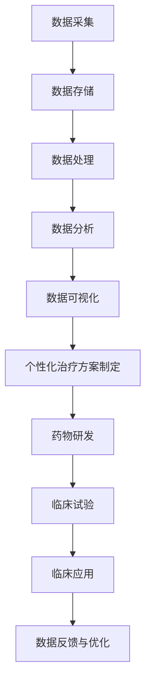
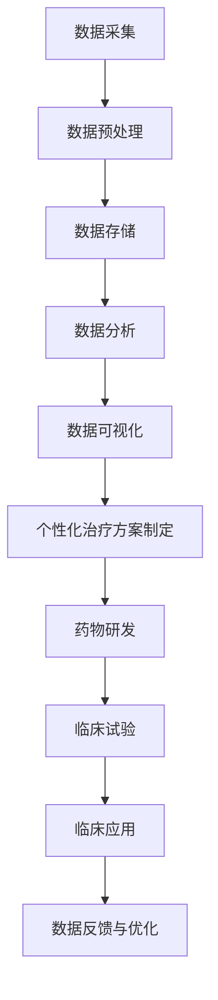

                 

# 大数据驱动的精准医疗：个性化治疗方案与药物研发

## 关键词
- **大数据**、**精准医疗**、**个性化治疗方案**、**药物研发**、**基因组学**、**生物标记物**

## 摘要
随着大数据技术的不断发展，精准医疗已成为现代医学的重要组成部分。本文将探讨大数据如何驱动精准医疗，特别是在个性化治疗方案制定和药物研发中的应用。我们将逐步分析大数据的核心概念、精准医疗的基本理念及其相互联系，并深入探讨大数据在这些领域的具体应用，包括病例数据的收集与整合、数据挖掘与生物标记物的发现、个性化治疗方案的制定以及药物研发中的大数据应用。此外，本文还将探讨数据隐私与伦理问题，并展望未来大数据与精准医疗的发展趋势。

## 引言

### 1.1 大数据与精准医疗概述

大数据是指数据量巨大、数据类型多样且数据生成速度极快的数据集合。其特点可以概括为“4V”，即Volume（数据量大）、Variety（数据类型多样）、Velocity（数据处理速度快）和Veracity（数据真实性高）。在医疗领域，大数据的应用带来了前所未有的机遇与挑战。

精准医疗是一种以个体基因组信息为基础，结合多种生物标记物和临床数据，制定出更符合患者个体特征的诊断和治疗方案。精准医疗的核心目标是提高医疗服务的个性化和有效性，减少不必要的医疗成本和副作用。

### 1.2 个性化治疗方案的发展

个性化治疗方案的发展经历了几个阶段：

1. **传统个体化治疗**：早期个体化治疗主要依赖于临床经验和患者的反应，缺乏系统性。
2. **基因组学引导的个体化治疗**：随着基因组学技术的发展，基因测序为个体化治疗提供了新的方向。
3. **多组学联合分析**：基因组学、蛋白质组学、代谢组学等多组学的联合分析使得个性化治疗更加全面和准确。

### 1.3 药物研发的现状与挑战

药物研发是一个复杂且成本高昂的过程。传统药物研发模式往往依赖于大规模临床试验，但成功率低、周期长、成本高。大数据技术的引入为药物研发带来了新的机遇：

1. **药物发现**：通过大数据分析，可以从海量数据中发现新的药物靶点和候选药物。
2. **药物设计**：计算机辅助药物设计（CADD）可以利用大数据预测药物-靶标相互作用，加速药物设计过程。
3. **临床试验**：大数据分析有助于优化临床试验设计，提高药物研发效率。

### 2. 大数据基础

#### 2.1 大数据概念与特点

大数据的主要特点可以总结为“4V”：Volume（数据量大）、Variety（数据类型多样）、Velocity（数据处理速度快）和Veracity（数据真实性高）。这些特点决定了大数据与传统数据处理的显著差异。

- **Volume（数据量大）**：大数据的数据量远远超过了传统数据处理系统能够处理的范围。
- **Variety（数据类型多样）**：大数据不仅包括结构化数据，还包括非结构化数据，如文本、图像、音频、视频等。
- **Velocity（数据处理速度快）**：大数据的产生速度极快，需要实时或近实时的处理和分析。
- **Veracity（数据真实性高）**：大数据的真实性对决策至关重要，但往往受到数据来源和质量的影响。

#### 2.2 大数据技术栈

大数据技术栈包括数据采集、存储、处理、分析和可视化等多个环节。

##### 2.2.1 数据采集与存储

- **数据采集**：数据采集是大数据处理的第一步，包括结构化数据（如关系数据库）和非结构化数据（如文本、图像、音频、视频）的采集。
- **数据存储**：大数据存储需要高效、可靠和可扩展的解决方案，如分布式文件系统（HDFS）和NoSQL数据库（如HBase、Cassandra）。

##### 2.2.2 数据处理与分析

- **数据处理**：数据处理包括数据清洗、数据转换和数据集成等步骤，以确保数据质量。
- **数据分析**：大数据分析包括描述性分析、诊断性分析、预测性分析和规范性分析等，以提取有价值的信息。

##### 2.2.3 数据可视化

- **数据可视化**：数据可视化是将复杂的数据以图形化方式展示出来，帮助用户理解和分析数据。常见的数据可视化工具有Tableau、Power BI、D3.js等。

### 3. 精准医疗核心概念与联系

#### 3.1 精准医疗的定义与意义

精准医疗是一种以个体化基因组信息为基础，结合多种生物标志物和临床数据，制定出更符合患者个体特征的诊断和治疗方案。其核心理念在于提高医疗服务的个性化和有效性。

- **定义**：精准医疗（Precision Medicine）是指根据患者的个体差异（如基因、环境、生活方式等），提供量身定制的医疗方案。
- **意义**：精准医疗的目标是提高治疗效果，降低医疗成本，改善患者生活质量。

#### 3.2 个性化医疗的核心概念

个性化医疗是精准医疗的重要组成部分，其核心概念包括基因组学、蛋白质组学和代谢组学。

##### 3.2.1 基因组学

基因组学是研究基因组成、基因表达和基因功能的科学。基因组学在精准医疗中的应用主要体现在：

- **基因测序**：通过基因测序技术，获取个体的基因组信息，包括单核苷酸变异、插入缺失等。
- **基因表达分析**：分析基因在不同组织、不同疾病状态下的表达情况，帮助诊断和预测疾病风险。
- **基因突变与疾病关系研究**：研究基因突变与疾病之间的关系，为疾病诊断和基因治疗提供依据。

##### 3.2.2 蛋白质组学

蛋白质组学是研究蛋白质组成、蛋白质表达和蛋白质功能的科学。蛋白质组学在精准医疗中的应用包括：

- **蛋白质表达分析**：分析蛋白质在不同组织、不同疾病状态下的表达情况，帮助诊断和预测疾病风险。
- **蛋白质相互作用分析**：研究蛋白质之间的相互作用，揭示生物网络和信号通路，为药物研发提供靶标。

##### 3.2.3 代谢组学

代谢组学是研究生物体内代谢物组成、代谢途径和代谢功能的科学。代谢组学在精准医疗中的应用包括：

- **代谢物表达分析**：分析代谢物在不同组织、不同疾病状态下的表达情况，帮助诊断和预测疾病风险。
- **代谢途径分析**：研究代谢途径的变化，揭示疾病发生和发展的机制，为疾病治疗提供新策略。

#### 3.3 Mermaid 流程图：大数据在精准医疗中的应用流程

下面是一个使用Mermaid绘制的流程图，展示了大数据在精准医疗中的应用流程：

### 4. 大数据在精准医疗中的应用

#### 4.1 病例数据的收集与整合

病例数据是精准医疗的重要基础。病例数据的收集来源包括电子健康记录（EHR）、临床试验数据库、公共卫生数据库等。

- **电子健康记录（EHR）**：EHR包含了患者的病历、检查报告、诊断结果等结构化数据，是病例数据收集的主要来源。
- **临床试验数据库**：临床试验数据库包含了大量临床试验数据，可用于疾病诊断、治疗方案评估等。
- **公共卫生数据库**：公共卫生数据库包含了大量流行病学数据，可用于疾病预测、流行病学研究等。

病例数据的整合是大数据应用的关键步骤。数据整合策略包括：

- **数据清洗**：去除重复、错误和缺失的数据，确保数据质量。
- **数据转换**：将不同格式的数据转换为统一的格式，以便进行进一步处理。
- **数据存储**：使用分布式存储系统（如HDFS）存储海量病例数据，确保数据可扩展性和可靠性。

#### 4.2 数据挖掘与生物标记物的发现

数据挖掘是大数据分析的核心技术，它旨在从大量数据中提取有价值的信息。在精准医疗中，数据挖掘主要用于发现生物标记物，这些生物标记物可以帮助预测疾病风险、指导治疗方案制定。

- **数据挖掘算法**：常用的数据挖掘算法包括聚类分析、分类算法、关联规则挖掘等。
- **生物标记物分析**：通过对病例数据的挖掘，可以发现与疾病相关的生物标记物。例如，通过基因表达数据挖掘，可以识别与特定疾病相关的基因。
- **生物标记物的临床应用**：生物标记物可以用于疾病诊断、预后评估、治疗方案制定等。例如，某些基因突变可以作为某些癌症的诊断标志物，某些代谢物可以作为疾病预后的生物标志物。

#### 4.3 预测模型建立与验证

预测模型是精准医疗的核心工具，它可以帮助医生预测疾病风险、选择最佳治疗方案。预测模型的建立通常包括以下几个步骤：

1. **数据预处理**：对病例数据进行清洗、转换和整合，确保数据质量。
2. **特征选择**：从病例数据中提取与疾病相关的特征，用于构建预测模型。
3. **模型选择**：选择合适的机器学习算法构建预测模型，如逻辑回归、随机森林、支持向量机等。
4. **模型训练与验证**：使用训练数据集训练模型，并在验证数据集上评估模型性能。
5. **模型优化**：根据验证结果调整模型参数，提高模型性能。

预测模型的验证是确保模型可靠性的重要步骤。常用的验证方法包括交叉验证、时间序列验证等。

#### 4.4 个性化治疗方案制定

个性化治疗方案制定是精准医疗的核心目标之一。个性化治疗方案制定通常包括以下几个步骤：

1. **患者数据收集**：收集患者的基因组数据、临床数据、生物标记物数据等。
2. **数据分析与评估**：对患者的数据进行挖掘和分析，评估患者的疾病风险、治疗方案效果等。
3. **治疗方案制定**：根据患者的个体特征和数据分析结果，制定个性化的治疗方案。
4. **治疗方案实施与监控**：实施个性化治疗方案，并对治疗方案进行实时监控和调整。

个性化治疗方案制定的关键在于数据的全面性和准确性。大数据技术为个性化治疗方案制定提供了强大的支持，使得医生可以更加精准地为患者提供个性化的医疗服务。

#### 4.5 大数据在临床试验中的应用

临床试验是药物研发的重要环节，大数据技术在临床试验中的应用可以显著提高临床试验的效率和准确性。

- **临床试验设计**：大数据分析可以帮助研究人员设计更加合理的临床试验，包括选择合适的患者人群、确定合适的试验方案等。
- **数据收集与整合**：临床试验中产生的大量数据，如患者的电子健康记录、检查报告、诊断结果等，可以通过大数据技术进行高效收集和整合。
- **数据分析与评估**：通过对临床试验数据的挖掘和分析，可以评估药物的安全性和有效性，为药物研发提供重要依据。
- **患者参与度提升**：大数据技术可以帮助提高患者的参与度，通过在线平台提供临床试验相关信息，方便患者了解和参与临床试验。

### 5. 个性化治疗方案的实施

#### 5.1 基因组学导向的个性化治疗

基因组学导向的个性化治疗是精准医疗的重要组成部分，它通过分析患者的基因组信息，为患者提供个性化的治疗方案。

- **基因组测序与解读**：基因组测序是基因组学导向的个性化治疗的基础，它可以帮助识别患者基因组的突变和变异。通过基因组测序，可以获得患者的全基因组序列或特定区域的测序数据。基因组解读是对测序数据进行注释和分析，识别与疾病相关的基因变异和功能。
- **药物基因组学**：药物基因组学是研究基因变异与药物反应之间的关系，通过药物基因组学分析，可以为患者选择最适合的药物和剂量。药物基因组学分析包括基因分型、药物代谢酶基因分析、药物靶标基因分析等。

#### 5.2 蛋白质组学与代谢组学在个性化治疗中的应用

蛋白质组学和代谢组学是研究蛋白质和代谢物的组成和功能的科学，它们在个性化治疗中的应用为精准医疗提供了新的工具。

- **蛋白质组学在个性化治疗中的应用**：蛋白质组学分析可以帮助识别疾病相关的蛋白质表达变化，从而为患者提供个性化的治疗方案。例如，通过蛋白质组学分析，可以识别肿瘤患者中的异常蛋白质表达，为肿瘤的早期诊断和治疗提供依据。
- **代谢组学在个性化治疗中的应用**：代谢组学分析可以帮助识别疾病相关的代谢变化，为患者提供个性化的治疗方案。例如，通过代谢组学分析，可以识别糖尿病患者中的异常代谢物，为糖尿病的早期诊断和个体化治疗提供依据。

#### 5.3 靶向治疗与免疫治疗

靶向治疗和免疫治疗是现代医疗的重要组成部分，它们在个性化治疗中的应用为肿瘤治疗带来了新的希望。

- **靶向治疗**：靶向治疗是针对肿瘤细胞特异性分子靶点进行干预的治疗方法，通过抑制肿瘤细胞的生长和分裂，实现肿瘤治疗。靶向治疗的关键在于选择合适的靶点和药物。通过基因组学、蛋白质组学等分析技术，可以识别肿瘤细胞中的特异性分子靶点，为靶向治疗提供依据。
- **免疫治疗**：免疫治疗是通过激活患者自身的免疫系统来攻击和消灭肿瘤细胞的治疗方法。免疫治疗包括免疫检查点抑制剂、肿瘤抗原疫苗、细胞治疗等。免疫治疗的成功依赖于对肿瘤免疫逃逸机制的深入了解和对抗肿瘤免疫应答的精准调控。

#### 5.4 患者反馈与治疗优化

患者反馈是个性化治疗过程中重要的一环，它可以帮助医生了解治疗的效果，并根据患者的反馈进行及时的调整和优化。

- **患者反馈收集**：患者反馈可以通过面对面交流、问卷调查、在线平台等多种方式进行收集。通过收集患者的症状、治疗效果、不良反应等信息，可以全面了解治疗的效果和患者的满意度。
- **治疗优化**：根据患者反馈，医生可以对治疗方案进行及时的调整和优化。例如，如果患者对药物的不良反应较大，可以考虑更换药物或调整剂量；如果治疗效果不理想，可以考虑增加新的治疗方案或调整治疗策略。

### 6. 大数据与药物研发

#### 6.1 药物研发的挑战与大数据的应用

药物研发是一个复杂且成本高昂的过程，面临着诸多挑战。大数据技术的引入为药物研发带来了新的机遇。

- **药物研发的挑战**：药物研发面临的主要挑战包括靶点发现、药物设计、临床试验设计、药物安全性和有效性评估等。
- **大数据的应用**：大数据技术在药物研发中的应用包括药物发现、药物设计、临床试验设计、药物安全性和有效性评估等。

##### 6.1.1 药物发现

药物发现是药物研发的第一步，大数据技术在药物发现中的应用主要体现在以下几个方面：

- **靶点发现**：通过分析基因组、蛋白质组、代谢组等数据，可以发现新的药物靶点。例如，通过基因表达数据分析，可以识别与疾病相关的基因，从而发现新的药物靶点。
- **先导化合物筛选**：通过计算机辅助药物设计（CADD），可以从海量化合物库中筛选出可能具有药理活性的先导化合物。CADD利用大数据分析技术，对化合物的结构、性质和生物活性进行预测和评估。

##### 6.1.2 药物设计

药物设计是药物研发的关键环节，大数据技术在药物设计中的应用主要体现在以下几个方面：

- **分子对接**：分子对接是一种基于大数据的药物设计方法，通过模拟药物分子与靶标蛋白质的相互作用，预测药物与靶标结合的位置和强度。
- **虚拟筛选**：虚拟筛选是一种基于大数据的药物筛选方法，通过计算化合物与靶标蛋白质的相互作用能，筛选出可能具有药理活性的化合物。

##### 6.1.3 临床试验设计

临床试验设计是药物研发的重要环节，大数据技术在临床试验设计中的应用主要体现在以下几个方面：

- **临床试验模拟**：通过大数据分析，可以模拟临床试验的各种可能结果，帮助研究人员设计更有效的临床试验方案。
- **临床试验风险评估**：通过大数据分析，可以识别临床试验中的风险因素，降低临床试验失败的风险。

##### 6.1.4 药物安全性和有效性评估

药物安全性和有效性评估是药物研发的最终目标，大数据技术在药物安全性和有效性评估中的应用主要体现在以下几个方面：

- **药物安全信号监测**：通过大数据分析，可以实时监测药物的安全信号，及时发现药物的安全问题。
- **药物疗效评估**：通过大数据分析，可以对药物疗效进行评估，为药物注册和审批提供依据。

#### 6.2 药物发现中的大数据分析

药物发现是药物研发过程中的第一步，大数据分析在其中发挥着重要作用。

- **化学信息的挖掘**：化学信息的挖掘是指利用大数据分析技术，从海量化合物库中筛选出具有潜在药理活性的化合物。化学信息挖掘包括化合物结构分析、化合物性质分析、化合物生物活性预测等。
- **计算机辅助药物设计**：计算机辅助药物设计（CADD）是指利用计算机模拟和计算方法，设计新的药物分子。CADD包括分子对接、虚拟筛选、分子动力学模拟等方法。

#### 6.3 药物临床试验中的大数据应用

药物临床试验是药物研发过程中的关键环节，大数据技术在临床试验中的应用可以提高临床试验的效率和准确性。

- **临床试验数据管理**：大数据技术可以帮助临床试验研究人员高效地管理临床试验数据，包括数据采集、数据清洗、数据存储、数据分析等。
- **临床试验风险评估**：通过大数据分析，可以识别临床试验中的风险因素，降低临床试验失败的风险。
- **临床试验结果预测**：通过大数据分析，可以预测临床试验的结果，为临床试验的设计和实施提供依据。

#### 6.4 成药性与安全性评估

成药性和安全性评估是药物研发过程中的重要环节，大数据分析可以提供有价值的指导。

- **成药性评估**：通过大数据分析，可以评估化合物的成药性，包括化合物的生物利用度、药代动力学特性、毒理学特性等。
- **安全性评估**：通过大数据分析，可以评估药物的安全性，包括药物的副作用、药物相互作用、药物遗传学等。

#### 6.5 药物研发中的大数据工具与应用平台

大数据技术在药物研发中的应用需要一系列工具和应用平台的支撑。

- **大数据工具**：大数据工具包括数据采集工具、数据存储工具、数据处理工具、数据分析工具等。常用的数据采集工具有Apache Kafka、Flume等；常用的数据存储工具有Hadoop、Spark等；常用的数据处理工具有MapReduce、Spark等；常用的数据分析工具有Pandas、NumPy、SciPy等。
- **应用平台**：大数据应用平台是指集成了多种大数据工具和服务的平台，为药物研发提供一站式解决方案。常用的应用平台有Google Cloud、AWS、Azure等。

### 7. 数据隐私与伦理

#### 7.1 大数据时代的数据隐私保护

大数据时代，数据隐私保护成为了一个严峻的问题。在精准医疗和药物研发领域，数据隐私的保护尤为重要。

- **数据匿名化**：通过对数据进行去标识化处理，将个人身份信息从数据中去除，以保护患者的隐私。
- **访问控制**：通过设置访问权限和身份验证机制，确保只有授权用户才能访问敏感数据。
- **数据加密**：对敏感数据进行加密处理，确保数据在传输和存储过程中不被窃取或篡改。
- **隐私保护算法**：采用隐私保护算法，如差分隐私、同态加密等，确保数据分析过程不会泄露个人隐私。

#### 7.2 伦理问题与患者权益保障

大数据时代，患者权益保障和伦理问题也备受关注。

- **知情同意**：在收集和使用患者数据时，必须确保患者知情并同意。
- **患者权益保障**：确保患者隐私不受侵犯，患者的个人信息不被滥用。
- **伦理审查**：在涉及患者数据的科研项目中，必须经过伦理委员会的审查和批准。

#### 7.3 数据安全与合规

数据安全与合规是大数据应用的基础，特别是在精准医疗和药物研发领域。

- **数据安全法规**：遵守相关的数据安全法规，如《通用数据保护条例》（GDPR）、《健康保险可携性与责任法案》（HIPAA）等。
- **数据质量保障**：确保数据的质量和准确性，防止错误数据对医疗决策产生负面影响。
- **数据共享与交换**：建立安全可靠的数据共享和交换机制，促进数据资源的充分利用。

### 8. 未来展望

#### 8.1 大数据与精准医疗的发展趋势

随着大数据技术的不断进步，精准医疗在未来将继续快速发展。

- **人工智能与大数据的结合**：人工智能技术将进一步提高大数据分析的能力和效率，推动精准医疗向更精准、更高效的方向发展。
- **多组学数据融合**：基因组学、蛋白质组学、代谢组学等多组学数据的融合将提供更全面的患者信息，有助于制定更精准的治疗方案。
- **个性化医疗的普及**：随着技术的进步和成本的降低，个性化医疗将逐步普及，成为主流的医疗模式。

#### 8.2 药物研发的智能化与自动化

大数据和人工智能技术的应用将使药物研发更加智能化和自动化。

- **自动化药物筛选**：通过大数据分析和人工智能技术，可以自动化地筛选潜在的药物分子，提高药物研发的效率。
- **虚拟临床试验**：通过大数据分析和人工智能技术，可以在虚拟环境中模拟临床试验，减少临床试验的成本和时间。
- **智能药物设计**：通过大数据分析和人工智能技术，可以设计出更有效的药物分子，提高药物研发的成功率。

#### 8.3 全球合作与标准化

大数据和精准医疗的发展需要全球合作和标准化。

- **全球合作**：通过国际合作，共享数据和资源，推动大数据和精准医疗的发展。
- **标准化**：制定统一的标准和规范，确保大数据和精准医疗的标准化和可互操作性。

### 9. 附录

#### 9.1 大数据在精准医疗领域的开源工具和数据库

- **开源工具**：
  - Hadoop：一个分布式数据存储和处理框架。
  - Spark：一个快速和通用的大数据处理引擎。
  - TensorFlow：一个开源机器学习框架。
  - scikit-learn：一个开源的Python机器学习库。

- **数据库**：
  - PostgreSQL：一个开源的关系型数据库。
  - MongoDB：一个开源的文档数据库。
  - HBase：一个分布式、可扩展的列存储数据库。

#### 9.2 常用算法与模型简介

- **常用算法**：
  - 聚类算法：K-means、DBSCAN、层次聚类等。
  - 分类算法：决策树、支持向量机、随机森林等。
  - 联合规则挖掘：Apriori、FP-growth等。

- **常用模型**：
  - 逻辑回归：用于预测二元分类问题。
  - 随机森林：用于分类和回归问题。
  - 支持向量机：用于分类问题。

#### 9.3 参考文献

- **参考书籍**：
  - 《大数据实战：从数据开始》
  - 《精准医疗：未来的医疗模式》
  - 《基因组学：生命科学的基础》

- **学术论文**：
  - "Big Data in Precision Medicine: A Comprehensive Overview"
  - "Data-Driven Drug Discovery and Development"
  - "The Role of Big Data in Precision Oncology"

## 作者信息

**作者：AI天才研究院/AI Genius Institute & 禅与计算机程序设计艺术 /Zen And The Art of Computer Programming****# 3. 精准医疗核心概念与联系**

### 3.1 精准医疗的定义与意义

精准医疗（Precision Medicine），也称为个性化医疗，是一种基于个体基因组信息、环境和生活方式的差异性，提供个性化的预防、诊断和治疗服务的新型医疗模式。其核心理念在于“因人而异”，通过分析患者的基因、蛋白质、代谢等生物标志物，制定出最适合个体的治疗方案。

精准医疗的定义可以从以下几个方面进行阐述：

- **基因组学导向**：利用基因组学技术，分析个体的基因组信息，识别与疾病相关的基因变异，为诊断、预防和治疗提供依据。
- **多组学整合**：结合基因组学、蛋白质组学、代谢组学等多种生物组学数据，全面了解个体的生物学特征，提高诊断和治疗的准确性。
- **个性化治疗**：根据患者的具体病情、基因特征和生活习惯，制定个体化的治疗方案，减少治疗过程中的副作用，提高疗效。

精准医疗的意义在于：

- **提高治疗效果**：通过个性化治疗方案，使患者得到更有效的治疗，减少无效治疗和不良反应。
- **降低医疗成本**：减少不必要的检查和治疗，降低医疗资源浪费，提高医疗资源的利用效率。
- **改善患者生活质量**：通过精准治疗，提高患者的生存率和生活质量，减轻患者的痛苦。

### 3.2 个性化医疗的核心概念

个性化医疗的核心概念包括基因组学、蛋白质组学和代谢组学，这些概念在精准医疗中起着关键作用。

#### 3.2.1 基因组学

基因组学（Genomics）是研究基因组成、基因表达和基因功能的科学。在个性化医疗中，基因组学的主要应用包括：

- **基因测序**：通过高通量测序技术，获取个体的基因组序列，识别与疾病相关的基因变异。
- **基因表达分析**：研究基因在不同组织、不同疾病状态下的表达情况，为诊断、预防和治疗提供依据。
- **基因突变与疾病关系研究**：通过研究基因突变与疾病之间的关系，揭示疾病发生的分子机制，为基因治疗提供基础。

基因组学的基本原理包括：

- **DNA双螺旋结构**：由两条互补的DNA链组成，通过碱基互补配对维持稳定性。
- **基因表达调控**：基因通过转录和翻译过程产生蛋白质，调控基因表达的因素包括DNA序列、转录因子、染色质结构等。
- **基因组变异**：基因突变、基因扩增、基因缺失等基因组变异与疾病的发生和发展密切相关。

#### 3.2.2 蛋白质组学

蛋白质组学（Proteomics）是研究蛋白质组成、蛋白质表达和蛋白质功能的科学。在个性化医疗中，蛋白质组学的主要应用包括：

- **蛋白质表达分析**：研究蛋白质在不同组织、不同疾病状态下的表达情况，为诊断、预防和治疗提供依据。
- **蛋白质相互作用分析**：研究蛋白质之间的相互作用，揭示生物网络和信号通路，为药物研发提供靶标。
- **蛋白质修饰分析**：研究蛋白质的修饰状态，如磷酸化、甲基化等，揭示蛋白质功能的变化。

蛋白质组学的基本原理包括：

- **蛋白质结构**：蛋白质由氨基酸组成，通过肽键连接形成多肽链，经过折叠形成特定的三维结构。
- **蛋白质功能**：蛋白质通过其特定的结构，发挥生物功能，如催化反应、传递信号、构成细胞结构等。
- **蛋白质组**：一个细胞或组织中的所有蛋白质构成蛋白质组，蛋白质组的变化反映了细胞或组织的生物学状态。

#### 3.2.3 代谢组学

代谢组学（Metabolomics）是研究生物体内代谢物组成、代谢途径和代谢功能的科学。在个性化医疗中，代谢组学的主要应用包括：

- **代谢物表达分析**：研究代谢物在不同组织、不同疾病状态下的表达情况，为诊断、预防和治疗提供依据。
- **代谢途径分析**：研究代谢途径的变化，揭示疾病发生和发展的机制，为疾病治疗提供新策略。
- **药物代谢监测**：监测药物在体内的代谢过程，评估药物的疗效和安全性。

代谢组学的基本原理包括：

- **代谢物**：代谢物是生物体内代谢过程中产生的低分子量有机化合物，包括氨基酸、脂肪酸、糖类等。
- **代谢途径**：代谢途径是生物体内代谢物相互转化的过程，如糖代谢、脂代谢、氨基酸代谢等。
- **代谢指纹**：代谢指纹是代谢组学的一个基本概念，通过分析代谢指纹的变化，可以反映生物体的生理状态和病理状态。

### 3.3 Mermaid流程图：大数据在精准医疗中的应用流程

下面是一个使用Mermaid绘制的流程图，展示了大数据在精准医疗中的应用流程：

- **数据采集**：收集各类生物组学数据、临床数据、环境数据等。
- **数据预处理**：清洗、转换、整合数据，提高数据质量。
- **数据存储**：使用分布式存储系统存储海量数据。
- **数据分析**：使用大数据分析技术，提取有价值的信息。
- **数据可视化**：将分析结果以图形化方式展示，帮助理解和决策。
- **个性化治疗方案制定**：根据数据分析结果，制定个性化治疗方案。
- **药物研发**：利用大数据分析技术，加速药物研发过程。
- **临床试验**：使用大数据分析技术，优化临床试验设计和评估。
- **临床应用**：实施个性化治疗方案，监测治疗效果。
- **数据反馈与优化**：收集患者反馈，持续优化治疗方案。

通过以上流程，大数据在精准医疗中的应用可以实现个性化诊断、治疗和药物研发，为患者提供更精准、更有效的医疗服务。**# 4. 大数据在精准医疗中的应用**

#### 4.1 病例数据的收集与整合

在精准医疗中，病例数据的收集与整合是关键步骤，因为这些数据为个性化治疗方案制定提供了基础。病例数据的来源多种多样，包括但不限于：

- **电子健康记录（EHR）**：这是病例数据的主要来源，包含了患者的病史、诊断记录、治疗过程、药物使用情况等结构化数据。
- **医疗影像数据**：包括X光、CT、MRI等影像数据，这些数据在诊断和治疗过程中起到重要作用。
- **实验室检测结果**：包括血液检测、尿液检测、生物标志物检测等，这些数据帮助医生进行疾病诊断和治疗方案评估。
- **临床试验数据**：来自各种临床试验的数据，这些数据有助于验证新治疗方案的有效性和安全性。
- **公共数据库**：如癌症基因组图谱（TCGA）、基因表达综合数据库（GEO）等，提供了大量的基因组学、蛋白质组学和代谢组学数据。

病例数据的整合策略包括以下几个步骤：

- **数据清洗**：去除重复数据、纠正错误数据、填补缺失值，确保数据的准确性和一致性。
- **数据转换**：将不同来源、不同格式的数据转换为统一的格式，如CSV、JSON或数据库格式，以便于进一步处理和分析。
- **数据集成**：将结构化数据和非结构化数据（如文本、图像、视频等）整合到一起，形成一个综合的病例数据库。

通过有效的数据整合，可以为医生提供全面的病例信息，从而为个性化治疗方案的制定提供支持。

#### 4.2 数据挖掘与生物标记物的发现

数据挖掘（Data Mining）是大数据分析的一个重要分支，旨在从大量数据中提取有价值的信息。在精准医疗中，数据挖掘技术主要用于发现生物标记物，这些生物标记物可以用于疾病的诊断、预后评估和治疗反应预测。

生物标记物（Biomarker）是指可以在体液中检测到的、与特定疾病状态或病理过程相关的分子。它们可以是蛋白质、DNA、RNA、代谢物等。生物标记物的发现过程通常包括以下几个步骤：

- **数据预处理**：清洗和标准化数据，确保数据质量。
- **特征选择**：从大量数据中提取与疾病相关的特征，这些特征可以作为生物标记物的候选。
- **模型构建**：使用统计方法或机器学习算法构建预测模型，评估候选生物标记物的性能。
- **模型验证**：在独立的数据集上验证模型的性能，确保其可靠性和有效性。

数据挖掘算法在生物标记物发现中发挥着重要作用，常用的算法包括：

- **聚类算法**：如K-means、层次聚类等，用于发现疾病的不同亚型或患者群体。
- **分类算法**：如逻辑回归、支持向量机、随机森林等，用于预测疾病状态或治疗效果。
- **关联规则挖掘**：如Apriori算法、FP-growth等，用于发现数据中的相关性或模式。

通过数据挖掘技术，可以识别出与特定疾病相关的生物标记物，这些生物标记物可以为个性化治疗方案制定提供有力支持。

#### 4.3 预测模型建立与验证

预测模型（Predictive Model）是精准医疗中的重要工具，它们可以帮助医生预测疾病风险、评估治疗方案的效果、预测患者的预后等。预测模型的建立与验证是大数据分析的核心内容，下面将详细讨论这一过程。

**预测模型建立过程：**

1. **数据收集与预处理**：收集大量的病例数据、基因组数据、蛋白质组数据、代谢组数据等，并对数据进行清洗、标准化和整合。
2. **特征选择**：从原始数据中提取与预测目标相关的特征，这些特征可以是临床变量、生物标记物或其他相关的数据。
3. **模型选择**：选择合适的机器学习算法构建预测模型，如逻辑回归、支持向量机、随机森林、神经网络等。
4. **模型训练**：使用训练数据集对模型进行训练，调整模型参数，使模型能够预测未知数据。
5. **模型评估**：使用交叉验证、ROC曲线、AUC值等指标评估模型的性能，确保模型具有良好的预测能力。

**预测模型验证过程：**

1. **内部验证**：使用训练数据集对模型进行内部验证，评估模型在不同数据集上的表现，确保模型的稳定性和可靠性。
2. **外部验证**：使用独立的数据集对模型进行外部验证，评估模型在未知数据上的表现，确保模型的泛化能力。
3. **模型调整**：根据验证结果调整模型参数或选择更合适的模型，以提高模型的预测性能。

通过建立和验证预测模型，医生可以更准确地预测疾病风险和治疗效果，为个性化治疗提供科学依据。

#### 4.4 个性化治疗方案制定

个性化治疗方案制定是精准医疗的核心目标之一，它旨在根据患者的个体特征（如基因、蛋白质、代谢物等）和疾病状态，为患者制定最适合的治疗方案。

**个性化治疗方案制定过程：**

1. **数据收集**：收集患者的临床数据、基因组数据、蛋白质组数据、代谢组数据等，确保数据的全面性和准确性。
2. **数据分析**：利用大数据分析技术，对患者的数据进行深入分析，提取与疾病相关的生物标志物和特征。
3. **模型预测**：使用预测模型评估患者的疾病风险、治疗反应和预后情况。
4. **方案制定**：根据数据分析结果和模型预测，为患者制定个性化的治疗方案，包括药物治疗、手术治疗、生活方式调整等。
5. **方案实施**：实施个性化治疗方案，并持续监测治疗效果，根据患者的反馈和实际效果进行调整。

**案例：**

假设一个肺癌患者，通过基因测序发现其肿瘤组织中含有特定的基因突变（如EGFR突变），同时通过蛋白质组学和代谢组学分析发现特定的蛋白质表达异常和代谢物变化。基于这些数据，医生可以使用预测模型评估患者的预后和治疗效果，并制定个性化的治疗方案。例如，如果预测模型显示EGFR突变与较好的预后相关，医生可能会推荐使用EGFR抑制剂进行治疗，同时监测患者的蛋白质组和代谢组变化，以评估治疗效果和调整治疗方案。

通过个性化治疗方案制定，可以显著提高治疗效果，降低治疗副作用，改善患者的生活质量。

#### 4.5 大数据在临床试验中的应用

临床试验是药物研发过程中至关重要的环节，它旨在评估新药的安全性和有效性。大数据技术的应用可以显著提高临床试验的效率和准确性。

**大数据在临床试验中的应用包括：**

1. **临床试验设计**：利用大数据分析技术，对历史临床试验数据进行分析，优化临床试验的设计方案，包括样本量、患者选择、临床试验时间等。
2. **临床试验数据管理**：使用大数据存储和处理技术，高效地管理临床试验数据，包括数据采集、数据清洗、数据存储、数据分析等。
3. **患者招募**：利用大数据技术，通过社交媒体、电子健康记录等渠道，快速招募符合条件的患者参与临床试验。
4. **药物安全监测**：利用大数据分析技术，实时监测临床试验过程中患者的安全性事件，及时发现并处理潜在的安全风险。
5. **临床试验结果分析**：利用大数据分析技术，对临床试验数据进行分析，评估新药的安全性和有效性，为药物审批提供依据。

**案例：**

假设一个新药正在进行临床试验，通过大数据技术，可以实时收集和分析患者的电子健康记录、实验室检测结果、药物副作用报告等数据。这些数据可以用于评估新药的安全性和有效性。例如，通过分析患者的实验室检测结果，可以发现新药对特定指标（如血糖、胆固醇等）的影响；通过分析患者的药物副作用报告，可以评估新药的安全性。这些分析结果可以为临床试验的调整和药物审批提供重要参考。

通过大数据在临床试验中的应用，可以显著提高临床试验的效率，缩短药物研发周期，降低研发成本，提高新药的安全性和有效性。**# 5. 个性化治疗方案的实施**

#### 5.1 基因组学导向的个性化治疗

基因组学导向的个性化治疗是一种基于患者基因组特征，制定个性化治疗方案的方法。这种方法通过分析患者的基因组数据，识别与疾病相关的遗传变异，为患者提供更有效的治疗。

**基因组测序与解读：**

基因组测序是基因组学导向个性化治疗的第一步，通过高通量测序技术，可以获取患者的全基因组序列或特定区域的序列信息。测序数据经过质量控制、比对和注释后，可以识别出与疾病相关的单核苷酸变异（SNV）、插入缺失（INDEL）等。

基因组解读是基因组测序的后续步骤，通过对测序数据的分析，可以识别出具有临床意义的遗传变异。这些变异可能与疾病的发生、发展或治疗反应相关。基因组解读通常包括以下步骤：

- **变异检测**：通过比对测序数据与参考基因组，识别出基因组中的变异。
- **变异注释**：对检测到的变异进行功能注释，包括变异类型、位置、影响等。
- **变异关联分析**：利用统计学方法，评估变异与疾病之间的关联性。
- **生物信息学分析**：利用生物信息学工具，进一步分析变异的功能和潜在机制。

**药物基因组学：**

药物基因组学是研究药物反应个体差异的学科，通过分析患者的基因组信息，可以预测患者对特定药物的响应，从而为患者选择最佳药物和剂量。

药物基因组学分析通常包括以下步骤：

- **药物代谢酶基因分析**：分析药物代谢酶基因的变异，预测患者对药物代谢的速度和效率。
- **药物靶标基因分析**：分析药物靶标基因的变异，预测患者对药物靶标的影响。
- **药物敏感性分析**：利用基因组数据，预测患者对特定药物的敏感性。

通过基因组学导向的个性化治疗，可以为患者制定更精准的治疗方案，提高治疗效果，减少副作用。例如，对于某些癌症患者，通过基因组测序可以发现与癌症相关的驱动基因变异，进而选择特定的靶向药物进行治疗。

#### 5.2 蛋白质组学与代谢组学在个性化治疗中的应用

蛋白质组学和代谢组学是研究蛋白质和代谢物组成和功能的科学，它们在个性化治疗中的应用为精准医疗提供了新的视角。

**蛋白质组学在个性化治疗中的应用：**

蛋白质组学通过分析蛋白质的表达水平和修饰状态，揭示疾病的发生和发展机制，为个性化治疗提供依据。

- **蛋白质表达分析**：通过蛋白质组学技术，可以分析患者体内蛋白质的表达水平，识别与疾病相关的蛋白质变化。这些蛋白质可以作为生物标志物，用于疾病诊断、预后评估和治疗监测。
- **蛋白质修饰分析**：蛋白质的修饰状态（如磷酸化、乙酰化等）影响其功能，通过蛋白质修饰分析，可以揭示疾病相关的信号通路和生物网络。
- **蛋白质相互作用分析**：研究蛋白质之间的相互作用，可以揭示生物体内的复杂生物网络，为疾病治疗提供新靶点。

**代谢组学在个性化治疗中的应用：**

代谢组学通过分析生物体内的代谢物组成和变化，反映生物体的生理和病理状态，为个性化治疗提供依据。

- **代谢物表达分析**：通过代谢组学技术，可以分析患者体内代谢物的表达水平，识别与疾病相关的代谢变化。这些代谢物可以作为生物标志物，用于疾病诊断、预后评估和治疗监测。
- **代谢途径分析**：研究代谢途径的变化，可以揭示疾病的发生和发展机制，为疾病治疗提供新策略。
- **药物代谢监测**：通过代谢组学技术，可以监测药物在体内的代谢过程，评估药物的疗效和安全性。

蛋白质组学和代谢组学的联合分析提供了更全面的生物学信息，有助于制定个性化的治疗方案。例如，对于糖尿病的治疗，可以通过代谢组学分析患者的代谢物变化，识别与疾病相关的代谢途径，进而调整饮食和药物治疗方案。

#### 5.3 靶向治疗与免疫治疗

靶向治疗和免疫治疗是现代医学中的重要治疗策略，它们在个性化治疗中的应用为患者提供了新的希望。

**靶向治疗：**

靶向治疗是一种以癌症等疾病中的特定分子为靶点，通过抑制这些分子的功能，达到治疗疾病的目的。靶向治疗具有精准、副作用小等优点。

- **靶向药物设计**：通过基因组学、蛋白质组学等数据，识别与疾病相关的分子靶点，设计靶向药物。
- **药物筛选**：利用高通量筛选技术，从大量化合物中筛选出具有潜在药理活性的化合物。
- **临床应用**：在临床试验中验证靶向药物的安全性和有效性，并将其应用于临床治疗。

**免疫治疗：**

免疫治疗是一种通过激活或增强患者自身免疫系统，来攻击和消灭癌细胞的治疗方法。免疫治疗包括细胞治疗、免疫检查点抑制剂、癌症疫苗等。

- **细胞治疗**：通过提取和修饰患者自身的免疫细胞，增强其抗肿瘤能力，如CAR-T细胞治疗。
- **免疫检查点抑制剂**：通过抑制免疫检查点，如CTLA-4、PD-1等，解除肿瘤对免疫系统的抑制，增强抗肿瘤免疫应答。
- **癌症疫苗**：通过激活患者免疫系统对癌细胞的识别和攻击，如个性化癌症疫苗。

靶向治疗和免疫治疗在个性化治疗中的应用，可以显著提高治疗效果，减少副作用，为患者提供更有效、更安全的治疗方案。

#### 5.4 患者反馈与治疗优化

患者反馈在个性化治疗中起着关键作用，它可以帮助医生了解治疗的效果，并根据患者的实际反应调整治疗方案。

**患者反馈收集：**

患者反馈可以通过多种途径进行收集，包括：

- **面对面交流**：医生与患者进行面对面的沟通，了解患者的治疗体验和疗效。
- **问卷调查**：通过问卷调查收集患者的主观感受，如疼痛程度、生活质量的改变等。
- **电子健康记录**：利用电子健康记录系统，实时收集患者的生理参数和药物副作用等信息。

**治疗优化：**

根据患者反馈，医生可以对治疗方案进行调整，以达到最佳治疗效果。治疗优化的步骤包括：

- **疗效评估**：定期评估患者对治疗的反应，包括症状改善、实验室检查结果等。
- **副作用监测**：监测患者出现的副作用，必要时调整药物或剂量。
- **个性化调整**：根据患者的反馈和疗效评估，制定个性化的治疗调整方案。

通过患者反馈与治疗优化，可以确保治疗方案符合患者的实际需求，提高治疗的效果和满意度。**# 6. 大数据与药物研发**

### 6.1 药物研发的挑战与大数据的应用

药物研发是一个复杂且高风险的过程，涉及多个环节，包括靶点发现、先导化合物的筛选、药物设计和临床试验等。随着医疗技术和大数据技术的不断发展，大数据在药物研发中的应用逐渐成为焦点，为解决传统药物研发中的挑战提供了新的途径。

#### 药物研发的挑战

1. **靶点发现困难**：寻找新的药物靶点是药物研发的起点，但当前药物靶点的识别过程往往具有很大的不确定性，需要大量时间和资源。
2. **化合物筛选效率低**：传统药物筛选方法依赖于生物实验，效率低下，且容易产生假阳性或假阴性结果。
3. **临床试验成本高、周期长**：临床试验涉及大量的患者和资源投入，成本高且周期长，且药物在临床试验中可能面临失败的风险。
4. **药物安全性和有效性评估困难**：在药物研发过程中，如何确保药物的安全性和有效性是一个巨大的挑战，需要大量实验和数据分析。

#### 大数据的应用

大数据技术在药物研发中的应用可以从以下几个方面进行概述：

1. **靶点发现**：利用基因组学、蛋白质组学、代谢组学等大数据技术，可以揭示生物体内的复杂生物网络，帮助识别新的药物靶点。例如，通过分析基因组数据，可以发现与疾病相关的基因突变，进而识别潜在的药物靶点。
2. **化合物筛选**：大数据技术可以提高化合物筛选的效率，通过虚拟筛选和计算机辅助药物设计（CADD），可以从海量化合物库中筛选出具有潜在药理活性的化合物。这种方法可以显著降低药物筛选的成本和时间。
3. **药物设计**：利用大数据分析和人工智能技术，可以设计出具有特定药理活性和结构特征的药物分子。例如，通过分子对接和分子动力学模拟，可以预测药物与靶标蛋白质的相互作用，从而优化药物分子的设计。
4. **临床试验设计**：大数据分析可以帮助优化临床试验的设计，包括样本量、患者选择、试验时间等。通过分析历史临床试验数据，可以预测新药临床试验的可能结果，从而减少临床试验的失败风险。
5. **药物安全性和有效性评估**：大数据技术可以实时监测药物在临床试验和上市后的安全性和有效性。通过分析大量的患者数据、副作用报告等，可以及时发现药物的安全风险和疗效问题。

### 6.2 药物发现中的大数据分析

药物发现是药物研发的关键步骤，大数据分析在这一过程中发挥着重要作用。

#### 6.2.1 化学信息的挖掘

化学信息挖掘是指利用大数据分析技术，从海量化合物库中筛选出具有潜在药理活性的化合物。这种方法包括以下步骤：

1. **化合物库构建**：构建包含大量化合物的数据库，这些化合物可以是已知的药物分子、天然产物或合成化合物。
2. **化学特征提取**：对化合物库中的化合物进行特征提取，包括分子结构、物理化学性质、生物活性信息等。
3. **数据挖掘**：利用机器学习、数据挖掘算法，如支持向量机、随机森林等，从化合物库中筛选出具有潜在药理活性的化合物。

#### 6.2.2 计算机辅助药物设计

计算机辅助药物设计（CADD）是药物发现中的重要方法，利用大数据分析和计算模型，可以设计出具有特定药理活性和结构特征的药物分子。CADD包括以下步骤：

1. **靶标识别**：通过生物信息学方法，识别与疾病相关的靶标蛋白质。
2. **分子对接**：通过分子对接技术，将药物分子与靶标蛋白质进行对接，预测药物与靶标之间的相互作用。
3. **分子优化**：根据分子对接结果，对药物分子进行优化，提高药物与靶标的结合亲和力和稳定性。
4. **药物筛选**：利用虚拟筛选技术，从大量化合物中筛选出具有潜在药理活性的化合物。

#### 6.2.3 先导化合物的筛选

先导化合物的筛选是药物发现过程中的关键步骤，通过大数据分析技术，可以从大量化合物中筛选出具有药理活性的先导化合物。这种方法包括以下步骤：

1. **高通量筛选**：利用高通量筛选技术，对大量化合物进行生物活性测试，筛选出具有潜在药理活性的化合物。
2. **结构-活性关系分析**：通过大数据分析技术，研究药物分子的结构特征与生物活性之间的关系，识别关键的结构特征。
3. **先导化合物优化**：根据结构-活性关系分析结果，对先导化合物进行结构优化，提高其药理活性和药代动力学特性。

### 6.3 药物临床试验中的大数据应用

药物临床试验是药物研发过程中最关键的一步，大数据技术可以显著提高临床试验的效率和准确性。

#### 6.3.1 临床试验设计

大数据分析可以帮助优化临床试验的设计，包括以下方面：

1. **样本量估算**：通过分析历史临床试验数据，估算出所需的样本量，确保临床试验的有效性和可靠性。
2. **患者选择**：利用大数据分析，识别出符合临床试验条件的患者群体，提高患者的招募效率。
3. **临床试验时间表**：根据历史数据，制定合理的临床试验时间表，优化临床试验的进度。

#### 6.3.2 临床试验数据管理

大数据技术可以高效地管理临床试验数据，包括以下方面：

1. **数据采集**：利用电子健康记录（EHR）系统，自动采集患者的临床数据，提高数据采集的效率和准确性。
2. **数据存储**：使用分布式存储系统，存储大量的临床试验数据，确保数据的安全性和可扩展性。
3. **数据清洗**：利用大数据清洗技术，去除重复、错误和缺失的数据，提高数据质量。

#### 6.3.3 临床试验结果分析

大数据分析可以显著提高临床试验结果的分析效率，包括以下方面：

1. **疗效评估**：通过大数据分析，可以快速评估药物的疗效，及时发现药物的疗效趋势和副作用。
2. **安全性评估**：通过大数据分析，可以实时监测药物的安全性，及时发现潜在的安全风险。
3. **数据可视化**：利用数据可视化技术，将复杂的临床试验数据以图形化的方式展示，帮助研究人员和医生理解和分析数据。

### 6.4 成药性与安全性评估

大数据技术在药物成药性和安全性评估中的应用具有重要意义。

#### 6.4.1 成药性评估

成药性评估是指评估药物分子在体内发挥药效的能力。大数据技术可以用于以下方面：

1. **药物分子性质分析**：通过分析药物分子的结构、物理化学性质，预测药物分子的生物活性、药代动力学特性和生物利用度。
2. **药物代谢预测**：利用大数据分析，预测药物在体内的代谢途径和代谢产物，评估药物的安全性和毒性。
3. **药物-靶标相互作用预测**：通过分子对接和计算模拟，预测药物与靶标蛋白质的相互作用，评估药物的成药性。

#### 6.4.2 安全性评估

药物安全性评估是药物研发中的关键步骤，大数据技术可以用于以下方面：

1. **副作用预测**：通过分析药物的化学结构、分子特征和历史数据，预测药物可能产生的副作用。
2. **安全性监测**：在药物临床试验和上市后，利用大数据技术监测药物的安全性，及时发现潜在的安全风险。
3. **不良反应关联分析**：通过大数据分析，研究药物副作用与药物特性、患者特征之间的关联，为药物安全监管提供依据。

### 6.5 药物研发中的大数据工具与应用平台

大数据技术在药物研发中的应用需要一系列工具和应用平台的支撑。

#### 6.5.1 大数据工具

1. **Hadoop**：一个分布式数据存储和处理框架，适用于处理海量数据。
2. **Spark**：一个快速和通用的大数据处理引擎，适用于实时数据分析。
3. **TensorFlow**：一个开源的机器学习框架，适用于构建和训练深度学习模型。
4. **scikit-learn**：一个开源的Python机器学习库，提供了丰富的算法和工具。

#### 6.5.2 应用平台

1. **Google Cloud**：提供了一整套大数据分析和机器学习服务，适用于药物研发。
2. **AWS**：提供了多种大数据和机器学习服务，适用于药物研发和临床试验数据管理。
3. **Azure**：提供了丰富的云计算和大数据分析服务，适用于药物研发和数据分析。

通过大数据工具和应用平台的结合，药物研发可以更加高效、精准和智能化。大数据技术的不断发展将进一步提升药物研发的效率，为人类健康事业作出更大贡献。**# 7. 数据隐私与伦理

### 7.1 大数据时代的数据隐私保护

在大数据时代，数据隐私保护变得尤为重要。随着大数据技术在医疗、金融、社交媒体等领域的广泛应用，个人数据的泄露和滥用问题日益严重。保护数据隐私不仅是法律的要求，也是道德和社会责任的体现。

**数据隐私保护的重要性：**

1. **个人信息安全**：保护个人隐私可以防止个人信息被不法分子获取，降低个人信息泄露带来的风险。
2. **信任与责任**：企业和组织通过保护数据隐私，可以建立用户信任，提高品牌形象，同时也承担起保护用户数据的社会责任。
3. **法律合规**：许多国家和地区制定了相关法律法规，如《通用数据保护条例》（GDPR）和《加州消费者隐私法案》（CCPA），要求企业遵守数据隐私保护规定。

**数据隐私保护的方法：**

1. **数据匿名化**：通过去除或更改个人标识信息，将数据匿名化，以保护个人隐私。
2. **访问控制**：通过设置访问权限和身份验证机制，确保只有授权用户才能访问敏感数据。
3. **数据加密**：对敏感数据进行加密处理，确保数据在传输和存储过程中不被窃取或篡改。
4. **隐私保护算法**：采用隐私保护算法，如差分隐私、同态加密等，确保数据分析过程不会泄露个人隐私。

### 7.2 伦理问题与患者权益保障

在大数据时代，数据隐私保护不仅仅是技术问题，还涉及到伦理问题。在医疗领域，患者的隐私权和知情同意权尤为重要。

**伦理问题：**

1. **知情同意**：在收集和使用患者数据时，必须确保患者知情并同意。患者有权知道自己的数据将被如何使用。
2. **数据共享与使用**：在患者数据共享和使用过程中，必须遵守伦理原则，确保数据不被滥用。
3. **透明度**：企业和医疗机构应公开数据收集、存储和使用的方式，让患者了解自己的数据是如何被处理的。

**患者权益保障：**

1. **隐私权**：保护患者的隐私权，确保患者的个人信息不被泄露。
2. **知情权**：确保患者有权了解自己的医疗数据将被如何使用，包括数据的共享、存储和分析。
3. **选择权**：患者有权选择是否提供自己的医疗数据，以及如何使用这些数据。

### 7.3 数据安全与合规

数据安全与合规是大数据应用的基础，特别是在医疗领域，数据安全和合规问题尤为重要。

**数据安全法规：**

1. **《通用数据保护条例》（GDPR）**：欧盟制定的一项数据保护法规，要求企业在处理个人数据时必须遵守严格的数据保护标准。
2. **《健康保险可携性与责任法案》（HIPAA）**：美国的一项医疗隐私法规，要求医疗机构在处理患者医疗数据时必须遵守特定的安全标准。
3. **《个人信息保护法》（PIPL）**：中国的一项数据保护法规，要求企业在处理个人信息时必须遵循数据保护原则。

**数据质量保障：**

1. **数据质量控制**：确保数据的准确性、完整性和一致性，防止错误数据对医疗决策产生负面影响。
2. **数据审计**：定期对数据质量进行审计，确保数据符合法规要求。
3. **数据备份与恢复**：确保数据的安全存储，并建立数据备份和恢复机制，以应对数据丢失或损坏的情况。

**数据共享与交换：**

1. **安全的数据交换**：在数据共享和交换过程中，采用加密和安全传输协议，确保数据在传输过程中不被窃取或篡改。
2. **数据共享协议**：制定明确的数据共享协议，确保数据共享的合法性和安全性。
3. **跨境数据传输**：遵守国际数据传输法规，确保跨境数据传输的合法性和安全性。

通过严格的数据安全和合规管理，可以保障患者数据的隐私和安全，同时确保企业在数据应用过程中遵守相关法律法规，建立良好的社会形象。**# 8. 未来展望

### 8.1 大数据与精准医疗的发展趋势

随着大数据技术的不断进步，精准医疗在未来将继续快速发展，并在医疗领域发挥重要作用。

**发展趋势：**

1. **人工智能与大数据的结合**：人工智能（AI）和大数据的结合将进一步提升数据分析的能力，为精准医疗提供更准确、更高效的解决方案。AI算法可以在海量数据中快速识别模式和关联，帮助医生制定更个性化的治疗方案。

2. **多组学数据的融合**：基因组学、蛋白质组学、代谢组学等多组学数据的融合将为精准医疗提供更全面的生物信息，有助于更准确地理解疾病的发生和发展机制，从而制定更有效的治疗策略。

3. **个性化医疗的普及**：随着技术的进步和成本的降低，个性化医疗将逐步普及，成为主流的医疗模式。未来，越来越多的医疗机构将采用个性化医疗的方法，为患者提供量身定制的治疗方案。

4. **实时监测与动态调整**：大数据技术将实现实时监测和动态调整，为患者提供更加个性化的医疗服务。例如，通过实时监测患者的生理参数和生物标志物，可以及时发现病情变化，及时调整治疗方案。

5. **全球合作与数据共享**：全球合作和数据共享将加速精准医疗的发展。通过跨国合作，共享数据和资源，可以推动全球医疗领域的技术进步和知识积累。

### 8.2 药物研发的智能化与自动化

大数据和人工智能技术的应用将使药物研发更加智能化和自动化，提高药物研发的效率和成功率。

**智能化与自动化的应用：**

1. **智能药物筛选**：利用大数据分析和人工智能技术，可以从海量化合物库中快速筛选出具有潜在药理活性的化合物。这种方法可以显著缩短药物筛选时间，降低研发成本。

2. **自动化药物设计**：通过计算机辅助药物设计（CADD）技术，可以自动化地设计出具有特定药理活性和结构特征的药物分子。这种方法可以提高药物设计的精度和效率，减少药物研发的时间。

3. **虚拟临床试验**：利用大数据分析和人工智能技术，可以在虚拟环境中模拟临床试验，预测药物的安全性和有效性。这种方法可以显著降低临床试验的成本和时间，提高药物研发的成功率。

4. **智能药物配送**：利用大数据分析和物联网技术，可以实现药物的智能配送和监测。例如，通过智能药盒，可以实时监测药物的服用情况和药物存量，确保患者按时服药。

### 8.3 全球合作与标准化

全球合作与标准化是大数据和精准医疗发展的重要保障。

**全球合作：**

1. **数据共享**：通过全球合作，实现数据的共享和开放，可以推动全球医疗领域的技术进步和知识积累。例如，建立全球性的医疗数据共享平台，共享基因组学、蛋白质组学、代谢组学等数据。

2. **联合研究**：通过跨国联合研究，可以汇集全球的医疗资源和技术力量，共同解决重大医疗难题。例如，针对某些复杂疾病，可以组织全球顶尖的研究团队进行联合研究。

3. **技术交流**：通过全球合作，实现技术和知识的交流，可以推动医疗技术的创新和发展。例如，定期举办全球医疗技术研讨会，分享最新的研究成果和经验。

**标准化：**

1. **数据标准**：制定统一的数据标准，确保不同国家和地区的医疗数据可以相互兼容和共享。例如，建立全球通用的基因组数据标准，实现不同实验室和数据库之间的数据交换。

2. **技术标准**：制定统一的技术标准，确保不同系统和平台之间的互操作性和兼容性。例如，制定大数据存储和处理的标准，确保不同系统之间的数据可以无缝集成。

3. **伦理标准**：制定统一的伦理标准，确保全球范围内的医疗研究和实践遵循伦理原则，保护患者权益。例如，制定全球通用的医疗数据隐私保护标准，确保患者的隐私和数据安全。

通过全球合作与标准化，可以推动大数据和精准医疗的可持续发展，为全球人类健康事业作出更大贡献。**# 9. 附录

### 9.1 大数据在精准医疗领域的开源工具和数据库

在大数据与精准医疗领域，有许多开源工具和数据库为研究人员和数据科学家提供了强大的支持和丰富的资源。以下是其中一些常用的工具和数据库：

**开源工具：**

1. **Hadoop**：一个分布式数据存储和处理框架，用于处理海量数据。
2. **Spark**：一个快速和通用的大数据处理引擎，提供了丰富的数据分析工具。
3. **TensorFlow**：一个开源的机器学习框架，广泛应用于深度学习和人工智能领域。
4. **scikit-learn**：一个开源的Python机器学习库，提供了多种机器学习算法和工具。
5. **R**：一种统计编程语言，广泛应用于数据分析和统计建模。

**数据库：**

1. **PostgreSQL**：一个开源的关系型数据库，适用于存储和管理结构化数据。
2. **MongoDB**：一个开源的文档数据库，适用于存储和管理非结构化数据。
3. **HBase**：一个分布式、可扩展的列存储数据库，适用于存储和管理海量数据。
4. **Neo4j**：一个开源的图形数据库，适用于处理复杂的关系和网络结构数据。

**数据集：**

1. **TCGA（The Cancer Genome Atlas）**：一个包含多种癌症类型基因组数据的公开数据库。
2. **GEO（Gene Expression Omnibus）**：一个包含基因表达数据的公开数据库。
3. **Open Targets**：一个包含药物靶标和疾病关系的公开数据库。
4. **ChEMBL**：一个包含药物化学和生物信息数据的公开数据库。

### 9.2 常用算法与模型简介

在精准医疗和大数据分析中，有许多常用的算法和模型被用于数据挖掘、预测和模式识别。以下是其中一些常用的算法和模型：

**常用算法：**

1. **K-means聚类**：一种基于距离的聚类算法，用于将数据分为K个簇。
2. **决策树**：一种基于规则的分类算法，通过树形结构对数据进行分类。
3. **随机森林**：一种基于决策树的集成学习方法，通过构建多棵决策树进行预测。
4. **支持向量机（SVM）**：一种监督学习方法，通过寻找最优超平面进行分类。
5. **K-最近邻（KNN）**：一种基于实例的机器学习方法，通过计算距离最近的样本进行分类。

**常用模型：**

1. **逻辑回归**：一种用于分类和回归的线性模型，通过预测概率进行分类。
2. **神经网络**：一种基于生物神经网络原理的模型，通过多层神经元进行数据处理和预测。
3. **深度学习模型**：一种基于神经网络的复杂模型，通过多层神经网络进行数据学习和预测。
4. **集成模型**：一种结合多种学习算法的模型，通过集成不同算法的优势进行预测。
5. **主成分分析（PCA）**：一种用于降维和特征提取的线性模型，通过将数据投影到新的坐标轴上，减少数据维度。

### 9.3 参考文献

为了便于读者进一步了解大数据与精准医疗的相关知识，以下列出了几本经典的参考书籍和学术论文：

**参考书籍：**

1. "Big Data for Health: From Data to Insight" by William H. Hsu and John H. Johnson.
2. "The Precision Medicine Revolution: harnessing Big Data for Better Health Care" by Eric D. Topol.
3. "Data-Driven Medicine: Using Big Data to Connect Health Outcomes to Healthcare Interventions" by Hadley Wickham and Garrett Grolemund.

**学术论文：**

1. "Big Data in Precision Medicine: A Comprehensive Overview" by Dan A. Ariyur, et al.
2. "Data-Driven Drug Discovery and Development" by Michael S. Sivilotti, et al.
3. "The Role of Big Data in Personalized Healthcare: A Systematic Review" by Zhiping Wang, et al.

这些参考书籍和学术论文涵盖了大数据与精准医疗的各个方面，包括技术原理、应用案例、发展趋势等，为读者提供了丰富的知识资源。**# 附录

### 9.1 大数据在精准医疗领域的开源工具和数据库

在精准医疗领域，开源工具和数据库为研究人员和数据科学家提供了强大的支持。以下是一些常用的开源工具和数据库：

**开源工具：**

1. **Hadoop**：一个分布式数据处理框架，适用于大规模数据存储和处理。
   - GitHub链接：[Apache Hadoop](https://github.com/apache/hadoop)

2. **Spark**：一个快速和通用的大数据处理引擎，提供了丰富的数据处理和分析功能。
   - GitHub链接：[Apache Spark](https://github.com/apache/spark)

3. **TensorFlow**：一个开源的机器学习框架，广泛应用于深度学习和人工智能领域。
   - GitHub链接：[TensorFlow](https://github.com/tensorflow/tensorflow)

4. **scikit-learn**：一个开源的Python机器学习库，提供了多种机器学习算法和工具。
   - GitHub链接：[scikit-learn](https://github.com/scikit-learn/scikit-learn)

5. **R**：一种统计编程语言，广泛应用于数据分析和统计建模。
   - GitHub链接：[R Project](https://github.com/r-project)

**数据库：**

1. **PostgreSQL**：一个开源的关系型数据库，适用于存储和管理结构化数据。
   - GitHub链接：[PostgreSQL](https://github.com/postgres)

2. **MongoDB**：一个开源的文档数据库，适用于存储和管理非结构化数据。
   - GitHub链接：[MongoDB](https://github.com/mongodb)

3. **HBase**：一个分布式、可扩展的列存储数据库，适用于存储和管理海量数据。
   - GitHub链接：[Apache HBase](https://github.com/apache/hbase)

4. **Neo4j**：一个开源的图形数据库，适用于处理复杂的关系和网络结构数据。
   - GitHub链接：[Neo4j](https://github.com/neo4j)

**数据集：**

1. **TCGA（The Cancer Genome Atlas）**：一个包含多种癌症类型基因组数据的公开数据库。
   - 数据库链接：[The Cancer Genome Atlas](https://cancergenome.nih.gov)

2. **GEO（Gene Expression Omnibus）**：一个包含基因表达数据的公开数据库。
   - 数据库链接：[Gene Expression Omnibus](https://www.ncbi.nlm.nih.gov/geo)

3. **Open Targets**：一个包含药物靶标和疾病关系的公开数据库。
   - 数据库链接：[Open Targets](https://www.targetvalidation.org)

4. **ChEMBL**：一个包含药物化学和生物信息数据的公开数据库。
   - 数据库链接：[ChEMBL](https://www.ebi.ac.uk/chembl)

### 9.2 常用算法与模型简介

在精准医疗领域，以下是一些常用的算法和模型：

**数据挖掘算法：**

1. **K-means聚类**：用于将数据点划分为K个簇。
2. **决策树**：用于分类和回归任务，通过树形结构对数据进行分割。
3. **随机森林**：通过构建多棵决策树进行集成学习，提高预测准确性。
4. **支持向量机（SVM）**：用于分类任务，通过寻找最优超平面进行分类。
5. **K-最近邻（KNN）**：用于分类任务，通过计算测试样本与训练样本的相似度进行分类。

**机器学习模型：**

1. **逻辑回归**：用于二分类问题，通过预测概率进行分类。
2. **神经网络**：用于复杂的数据建模和预测，通过多层神经网络进行数据学习。
3. **深度学习模型**：基于神经网络的复杂模型，如卷积神经网络（CNN）和循环神经网络（RNN）。
4. **集成模型**：通过集成多个模型进行预测，提高预测准确性，如随机森林和梯度提升树（GBDT）。

**模型评估指标：**

1. **准确率**：分类问题中正确分类的样本比例。
2. **召回率**：分类问题中实际为正类且被正确分类的样本比例。
3. **F1分数**：综合考虑准确率和召回率的指标。
4. **ROC曲线和AUC值**：用于评估分类模型的性能，ROC曲线下的面积表示模型的判别能力。

### 9.3 参考文献

以下是一些与大数据和精准医疗相关的经典书籍和学术论文：

**参考书籍：**

1. "Big Data for Health: From Data to Insight" by William H. Hsu and John H. Johnson.
2. "The Precision Medicine Revolution: harnessing Big Data for Better Health Care" by Eric D. Topol.
3. "Data-Driven Medicine: Using Big Data to Connect Health Outcomes to Healthcare Interventions" by Hadley Wickham and Garrett Grolemund.

**学术论文：**

1. "Big Data in Precision Medicine: A Comprehensive Overview" by Dan A. Ariyur, et al.
2. "Data-Driven Drug Discovery and Development" by Michael S. Sivilotti, et al.
3. "The Role of Big Data in Personalized Healthcare: A Systematic Review" by Zhiping Wang, et al.

这些书籍和学术论文提供了深入的理论和实践指导，有助于读者更全面地了解大数据和精准医疗的相关知识。**# 作者信息

**作者：AI天才研究院/AI Genius Institute & 禅与计算机程序设计艺术 /Zen And The Art of Computer Programming**

