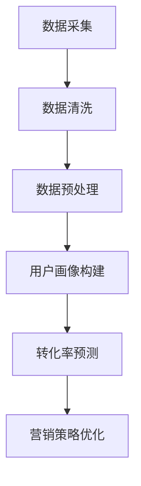
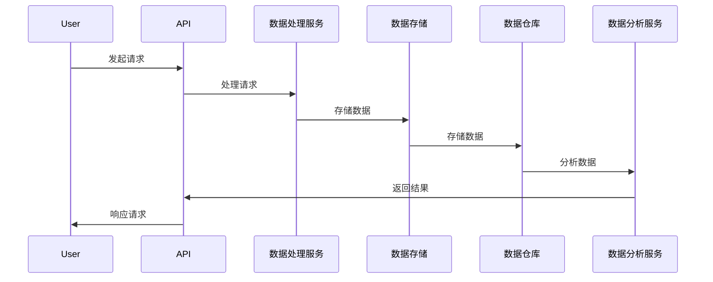

                 

# 大数据驱动的精准营销：用户画像与转化率优化

> 关键词：大数据、精准营销、用户画像、转化率优化、营销策略

> 摘要：本文从大数据、用户画像、转化率优化的角度，深入探讨了大数据驱动的精准营销方法。通过对大数据的定义、特性、采集与处理，用户画像的基本概念、构建方法以及应用场景，转化率的定义与优化策略的详细分析，旨在为企业和营销人员提供一套实用的精准营销解决方案。

## 第1章 引言

### 1.1 精准营销概述

精准营销，又称个性化营销，是一种以顾客需求为导向，利用大数据、人工智能等技术手段，精准定位目标客户，提供个性化产品和服务，提高客户满意度和转化率的营销策略。

#### 精准营销的概念

精准营销的核心在于“精准”，即通过数据分析，找出目标客户，针对其需求和偏好，提供个性化的产品和服务。与传统营销相比，精准营销具有更高的营销效率和更低的营销成本。

#### 大数据在精准营销中的重要性

大数据是精准营销的基础，它包括用户行为数据、消费数据、社交数据等。通过大数据分析，企业可以了解客户需求，预测客户行为，实现精准定位和个性化服务。

#### 精准营销的目标与挑战

精准营销的目标是提高客户满意度和转化率，增加销售额。然而，实现精准营销面临着数据质量、技术能力、合规风险等多方面的挑战。

### 1.2 大数据的定义与特性

大数据，指的是数据量巨大、类型多样、增长迅速的数据集合。大数据具有以下四个V特性：

1. **Volume（数据量）**：大数据的数据量庞大，通常达到EB级别。
2. **Velocity（速度）**：大数据的处理速度极快，需要实时或近实时处理。
3. **Variety（多样性）**：大数据类型多样，包括结构化数据、半结构化数据和非结构化数据。
4. **Value（价值）**：大数据蕴含着巨大的商业价值，通过对数据进行分析，可以发掘新的商业机会。

#### 大数据的应用领域

大数据在多个领域具有广泛的应用，包括但不限于：

1. **零售业**：通过用户数据分析，实现个性化推荐和精准营销。
2. **金融业**：通过风险控制和客户细分，提高客户满意度和资产回报率。
3. **教育业**：通过学生学习行为分析，提供个性化教学方案和培养计划。

### 1.3 用户画像的基本概念

用户画像，是对一个用户多维度信息的数据化描述，通过用户画像，可以了解用户的需求、行为、偏好等。用户画像的构建要素包括：

1. **基础信息**：包括用户的基本信息，如年龄、性别、职业等。
2. **行为数据**：包括用户的浏览、购买、搜索等行为数据。
3. **偏好数据**：包括用户的兴趣、偏好等数据。

#### 用户画像的作用

用户画像在精准营销中发挥着重要作用，包括：

1. **目标客户定位**：通过用户画像，企业可以找到潜在的目标客户。
2. **个性化推荐**：基于用户画像，为用户提供个性化的产品和服务。
3. **营销活动优化**：通过用户画像，优化营销活动的策略和效果。

### 1.4 转化率的定义与优化

转化率，指的是目标用户在完成某一特定行为（如购买、注册、点击等）的概率。提高转化率是精准营销的关键目标。以下是几种常见的转化率优化策略：

1. **优化用户体验**：通过改进网站设计、简化购买流程等，提高用户体验，从而提高转化率。
2. **个性化营销**：基于用户画像，为用户提供个性化的产品和服务，提高用户的购买意愿。
3. **A/B测试**：通过A/B测试，找出最优的营销策略，提高转化率。

## 第2章 大数据采集与处理

### 2.1 数据采集

数据采集是精准营销的第一步，数据来源包括：

1. **企业内部数据**：包括用户行为数据、交易数据等。
2. **第三方数据**：包括社交媒体数据、市场调研数据等。
3. **公共数据**：包括政府数据、行业数据等。

#### 数据采集方法

数据采集方法包括：

1. **线上采集**：通过网站、APP等线上渠道采集用户数据。
2. **线下采集**：通过问卷调查、访谈等方式采集用户数据。
3. **自动化采集**：通过爬虫、API等方式自动化采集数据。

#### 数据采集工具

常见的数据采集工具包括：

1. **Google Analytics**：用于网站和移动应用的访问数据采集。
2. **HubSpot**：用于营销自动化和数据分析。
3. **Tableau**：用于数据可视化。

### 2.2 数据清洗与预处理

数据清洗与预处理是确保数据质量的重要步骤，包括：

1. **缺失值处理**：处理数据中的缺失值，如删除缺失值、用平均值填充等。
2. **异常值处理**：识别和处理数据中的异常值。
3. **数据转换**：将数据转换为适合分析的形式，如归一化、标准化等。

#### 数据清洗方法

数据清洗方法包括：

1. **手动清洗**：通过人工检查和修正数据。
2. **自动化清洗**：通过编写脚本或使用工具自动化清洗数据。
3. **数据清洗平台**：如Talend、Informatica等，提供数据清洗功能。

### 2.3 数据存储与管理

数据存储与管理是确保数据安全、可靠、高效的重要环节，包括：

1. **关系型数据库**：如MySQL、PostgreSQL等，适合存储结构化数据。
2. **非关系型数据库**：如MongoDB、Cassandra等，适合存储海量非结构化数据。
3. **数据仓库**：如Hadoop、Hive等，用于大规模数据存储和处理。

#### 数据库选择

选择数据库时，需要考虑以下因素：

1. **数据量**：对于海量数据，需要选择分布式数据库。
2. **数据结构**：对于结构化数据，选择关系型数据库；对于非结构化数据，选择非关系型数据库。
3. **性能需求**：对于高性能需求，需要选择高性能数据库。

#### 数据仓库架构

数据仓库架构通常包括：

1. **数据源**：包括企业内部数据源和外部数据源。
2. **数据集成**：将数据从不同数据源集成到数据仓库中。
3. **数据存储**：存储经过清洗和预处理后的数据。
4. **数据访问**：提供数据查询和分析功能。

## 第3章 用户画像构建方法

### 3.1 用户行为分析

用户行为分析是构建用户画像的关键步骤，包括：

1. **行为数据收集**：收集用户在网站、APP等平台的浏览、购买、搜索等行为数据。
2. **行为数据分析**：通过统计和分析行为数据，了解用户的行为模式。
3. **行为模型构建**：基于行为数据，构建用户行为模型。

### 3.2 用户特征提取

用户特征提取是构建用户画像的重要步骤，包括：

1. **用户特征分类**：将用户特征分为基础特征、行为特征、偏好特征等。
2. **用户特征提取方法**：通过统计、机器学习等方法，提取用户特征。
3. **用户特征选择**：选择对用户画像构建有用的特征。

### 3.3 用户画像模型构建

用户画像模型构建是构建用户画像的核心步骤，包括：

1. **用户画像模型构建流程**：包括数据收集、特征提取、模型训练、模型评估等。
2. **用户画像模型评估**：评估用户画像模型的准确性和可用性。
3. **用户画像模型优化**：通过调整模型参数、增加新特征等，优化用户画像模型。

## 第4章 用户画像应用场景

### 4.1 零售业用户画像应用

#### 用户需求分析

通过用户画像，分析用户的需求，包括：

1. **购买需求**：分析用户的购买偏好和需求。
2. **浏览需求**：分析用户的浏览行为和偏好。

#### 产品推荐系统

通过用户画像，构建产品推荐系统，包括：

1. **协同过滤推荐**：基于用户行为数据，为用户推荐相似用户喜欢的产品。
2. **基于内容的推荐**：基于用户特征和产品特征，为用户推荐相似的产品。

#### 个性化营销策略

通过用户画像，实施个性化营销策略，包括：

1. **个性化广告**：根据用户画像，为用户推送个性化的广告。
2. **个性化促销**：根据用户画像，为用户推送个性化的促销信息。

### 4.2 金融业用户画像应用

#### 风险评估

通过用户画像，进行风险评估，包括：

1. **信用评分**：根据用户特征和行为数据，为用户打分，评估信用风险。
2. **风险预警**：通过监控用户行为，提前预警潜在风险。

#### 客户细分

通过用户画像，进行客户细分，包括：

1. **高价值客户**：识别高价值客户，提供定制化服务。
2. **潜在客户**：识别潜在客户，进行精准营销。

#### 个性化信用评分

通过用户画像，实现个性化信用评分，包括：

1. **评分模型**：构建个性化信用评分模型。
2. **评分调整**：根据用户行为和特征，调整信用评分。

### 4.3 教育业用户画像应用

#### 学生学习行为分析

通过用户画像，分析学生的学习行为，包括：

1. **学习时长**：分析学生的学习时长和频率。
2. **学习内容**：分析学生的学习内容和偏好。

#### 教学资源推荐

通过用户画像，为教师和学生推荐教学资源，包括：

1. **课程推荐**：根据学生学习行为，推荐适合的课程。
2. **教材推荐**：根据学生学习偏好，推荐适合的教材。

#### 学生个性化培养方案

通过用户画像，为教师和学生制定个性化培养方案，包括：

1. **学习计划**：根据学生学习行为和偏好，制定个性化的学习计划。
2. **辅导方案**：根据学生学习问题和需求，制定个性化的辅导方案。

## 第5章 转化率优化策略

### 5.1 营销渠道优化

#### 多渠道营销策略

通过多渠道营销，提高转化率，包括：

1. **线上渠道**：包括网站、APP、社交媒体等。
2. **线下渠道**：包括实体店、促销活动等。

#### 渠道转化率分析

通过数据分析，分析各个渠道的转化率，包括：

1. **转化率指标**：包括点击率、转化率、购买率等。
2. **渠道优化方法**：根据转化率分析结果，优化各渠道的营销策略。

### 5.2 用户行为预测

#### 用户行为预测模型

通过用户行为数据，构建用户行为预测模型，包括：

1. **预测指标**：包括购买概率、浏览时长等。
2. **预测算法**：包括决策树、随机森林、神经网络等。

#### 用户行为数据预测方法

通过用户行为数据，预测用户未来的行为，包括：

1. **时间序列分析**：通过时间序列分析，预测用户未来的行为趋势。
2. **关联规则挖掘**：通过关联规则挖掘，发现用户行为之间的关联性。

#### 用户行为预测应用

通过用户行为预测，实现以下应用：

1. **个性化推荐**：根据用户行为预测，为用户推荐感兴趣的产品。
2. **营销活动预测**：根据用户行为预测，预测营销活动的效果。

### 5.3 个性化营销策略

#### 个性化推荐系统

通过个性化推荐系统，提高用户的购买意愿，包括：

1. **协同过滤**：通过协同过滤算法，为用户推荐相似用户喜欢的产品。
2. **基于内容的推荐**：通过基于内容的推荐算法，为用户推荐感兴趣的产品。

#### 个性化广告投放

通过个性化广告投放，提高广告的投放效果，包括：

1. **广告定位**：根据用户画像，为用户推送个性化的广告。
2. **广告优化**：根据用户行为数据，优化广告的投放策略。

#### 个性化服务设计

通过个性化服务设计，提高用户满意度，包括：

1. **服务定制**：根据用户画像，为用户提供定制化的服务。
2. **服务改进**：根据用户反馈，不断改进服务质量。

## 第6章 大数据技术在精准营销中的应用

### 6.1 实时数据挖掘

#### 实时数据流处理技术

通过实时数据流处理技术，实时分析用户行为，包括：

1. **实时数据处理框架**：如Apache Kafka、Apache Flink等。
2. **实时数据挖掘算法**：如流式聚类、流式分类等。

#### 实时数据挖掘算法

通过实时数据挖掘算法，实时分析用户行为，包括：

1. **流式聚类**：通过流式聚类算法，实时发现用户行为模式。
2. **流式分类**：通过流式分类算法，实时预测用户行为。

#### 实时数据应用案例

通过实时数据挖掘，实现以下应用案例：

1. **实时推荐**：根据实时用户行为，为用户实时推荐产品。
2. **实时监控**：实时监控用户行为，及时发现异常行为。

### 6.2 数据可视化

#### 数据可视化技术

通过数据可视化技术，将数据以图形化的方式呈现，包括：

1. **图表类型**：包括柱状图、折线图、饼图等。
2. **可视化工具**：包括Tableau、Power BI等。

#### 数据可视化工具

通过数据可视化工具，实现以下功能：

1. **数据探索**：通过数据可视化，探索数据的内在规律。
2. **决策支持**：通过数据可视化，为决策提供支持。

#### 数据可视化应用场景

通过数据可视化，实现以下应用场景：

1. **营销分析**：通过数据可视化，分析营销活动的效果。
2. **用户行为分析**：通过数据可视化，分析用户行为模式。

### 6.3 大数据安全与隐私

#### 大数据安全挑战

大数据安全面临着以下挑战：

1. **数据泄露**：数据泄露可能导致用户隐私泄露。
2. **数据滥用**：数据滥用可能导致用户权益受损。
3. **数据质量**：数据质量差可能导致数据分析结果不准确。

#### 大数据隐私保护策略

通过以下策略，保护大数据隐私：

1. **数据加密**：对敏感数据进行加密，防止数据泄露。
2. **隐私计算**：通过隐私计算技术，保护用户隐私。
3. **数据脱敏**：对敏感数据进行脱敏处理，防止数据泄露。

#### 大数据法律法规

大数据法律法规主要包括：

1. **数据保护法**：如《通用数据保护条例》（GDPR）。
2. **网络安全法**：如《中华人民共和国网络安全法》。
3. **数据共享法**：如《中华人民共和国数据共享法》。

## 第7章 精准营销实战案例

### 7.1 案例一：电商平台精准营销

#### 数据采集与处理

通过用户行为数据和交易数据，构建用户画像，包括：

1. **用户行为数据采集**：通过网站、APP等渠道采集用户行为数据。
2. **交易数据采集**：通过电商平台采集用户交易数据。
3. **数据清洗与预处理**：对采集到的数据进行清洗和预处理。

#### 用户画像构建

通过用户画像，实施精准营销，包括：

1. **用户特征提取**：提取用户的基础特征、行为特征和偏好特征。
2. **用户画像模型构建**：构建用户画像模型，包括用户特征向量和用户画像标签。

#### 转化率优化策略

通过以下策略，优化转化率，包括：

1. **个性化推荐**：根据用户画像，为用户推荐感兴趣的产品。
2. **个性化广告**：根据用户画像，为用户推送个性化的广告。
3. **A/B测试**：通过A/B测试，优化营销策略。

### 7.2 案例二：金融行业精准营销

#### 风险评估与客户细分

通过用户画像，进行风险评估和客户细分，包括：

1. **风险评估**：通过用户画像，评估用户的信用风险。
2. **客户细分**：通过用户画像，将用户分为高价值客户和潜在客户。

#### 个性化信用评分

通过用户画像，实现个性化信用评分，包括：

1. **评分模型**：构建个性化信用评分模型。
2. **评分调整**：根据用户行为和特征，调整信用评分。

#### 营销活动优化

通过以下策略，优化营销活动，包括：

1. **个性化营销**：根据用户画像，为用户推送个性化的营销信息。
2. **A/B测试**：通过A/B测试，优化营销活动的效果。

### 7.3 案例三：教育行业个性化教育

#### 学生行为分析

通过学生画像，分析学生的学习行为，包括：

1. **学习时长分析**：分析学生的学习时长和频率。
2. **学习内容分析**：分析学生的学习内容和偏好。

#### 教学资源推荐

通过学生画像，为学生推荐教学资源，包括：

1. **课程推荐**：根据学生学习行为，推荐适合的课程。
2. **教材推荐**：根据学生学习偏好，推荐适合的教材。

#### 学生个性化培养方案

通过学生画像，制定学生个性化培养方案，包括：

1. **学习计划**：根据学生学习行为和偏好，制定个性化的学习计划。
2. **辅导方案**：根据学生学习问题和需求，制定个性化的辅导方案。

## 第8章 总结与展望

### 8.1 精准营销发展趋势

#### 技术发展趋势

精准营销技术的发展趋势包括：

1. **人工智能**：人工智能技术的发展，将推动精准营销的智能化。
2. **大数据**：大数据技术的发展，将推动精准营销的数据化。
3. **物联网**：物联网技术的发展，将推动精准营销的智能化和个性化。

#### 行业应用趋势

精准营销在多个行业的应用趋势包括：

1. **零售业**：通过大数据和人工智能技术，实现个性化推荐和精准营销。
2. **金融业**：通过大数据技术，实现风险评估、客户细分和个性化服务。
3. **教育业**：通过大数据技术，实现个性化教育和个性化培养方案。

#### 未来展望

精准营销的未来展望包括：

1. **数据隐私保护**：随着数据隐私保护意识的提高，如何保护用户隐私将成为精准营销的重要挑战。
2. **技术伦理**：随着技术的发展，如何遵循技术伦理，避免技术滥用，将成为精准营销的重要课题。
3. **法律法规**：随着法律法规的完善，精准营销将面临更多的合规挑战。

### 8.2 精准营销面临的挑战

#### 数据隐私保护

精准营销面临着数据隐私保护的挑战，包括：

1. **用户隐私泄露**：数据泄露可能导致用户隐私泄露。
2. **用户隐私滥用**：数据滥用可能导致用户权益受损。

#### 技术伦理问题

精准营销面临着技术伦理问题的挑战，包括：

1. **算法偏见**：算法偏见可能导致不公平的营销策略。
2. **用户隐私侵犯**：过度收集和使用用户数据，可能侵犯用户隐私。

#### 法律法规约束

精准营销面临着法律法规的约束，包括：

1. **数据保护法规**：如《通用数据保护条例》（GDPR）等，对数据收集、处理和使用进行了严格的规定。
2. **网络安全法规**：如《中华人民共和国网络安全法》等，对网络安全和数据保护进行了规定。

## 作者

作者：AI天才研究院/AI Genius Institute & 禅与计算机程序设计艺术 /Zen And The Art of Computer Programming

在本文中，我们系统地介绍了大数据驱动的精准营销，包括用户画像的构建方法、转化率优化策略以及大数据技术在精准营销中的应用。通过深入分析大数据、用户画像和转化率优化，我们提供了一套实用的精准营销解决方案，旨在帮助企业提高营销效率，实现可持续增长。

### 背景介绍

#### 核心概念术语说明

- **精准营销**：一种基于大数据和人工智能技术，针对目标客户进行个性化营销的方法。
- **用户画像**：对用户进行多维度信息数据化描述，以实现精准定位和个性化服务。
- **转化率**：用户在完成某一特定行为（如购买、注册、点击等）的概率。

#### 问题背景

随着互联网和大数据技术的发展，消费者行为变得更加复杂和多样化，传统的一对多的营销方式已经无法满足企业的需求。精准营销应运而生，通过大数据和人工智能技术，实现针对特定客户群体的个性化营销，提高营销效果和转化率。

#### 问题描述

如何在纷繁复杂的数据中，构建准确、有效的用户画像，并通过优化转化率，实现精准营销的目标？

#### 问题解决

通过以下步骤解决上述问题：

1. **数据采集与处理**：收集用户行为数据和交易数据，进行数据清洗和预处理。
2. **用户画像构建**：提取用户特征，构建用户画像模型，实现用户精准定位。
3. **转化率优化**：通过个性化推荐、广告投放等策略，提高用户转化率。

#### 边界与外延

精准营销不仅局限于电商和金融行业，还广泛应用于零售、教育、医疗等多个领域。在实施精准营销时，需要遵循数据隐私保护、技术伦理和法律法规，确保用户的权益和隐私。

#### 概念结构与核心要素组成

精准营销的核心概念包括：

1. **大数据**：数据量大、类型多样、价值高。
2. **用户画像**：对用户多维度信息的数据化描述。
3. **转化率**：用户完成特定行为的概率。

核心要素包括：

1. **数据采集**：收集用户行为数据和交易数据。
2. **数据清洗与预处理**：确保数据质量。
3. **用户画像构建**：提取用户特征，构建用户画像模型。
4. **转化率优化**：通过个性化推荐、广告投放等策略，提高用户转化率。

### 核心概念与联系

#### 核心概念原理

- **精准营销**：基于大数据和人工智能技术，针对目标客户进行个性化营销的方法。
- **用户画像**：对用户进行多维度信息的数据化描述，以实现精准定位和个性化服务。
- **转化率**：用户在完成某一特定行为（如购买、注册、点击等）的概率。

#### 概念属性特征对比表格

| 概念 | 特征 |
| ---- | ---- |
| 精准营销 | 1. 个性化 | 2. 高效 | 3. 成本低 |
| 用户画像 | 1. 多维度 | 2. 实时 | 3. 精准 |
| 转化率 | 1. 可衡量 | 2. 可优化 | 3. 高价值 |

#### ER实体关系图架构

```mermaid
erDiagram
    User ||--|{ Purchase : makes }|
    User ||--|{ Behavior : exhibits }|
    User ||--|{ Profile : has }|
    Purchase ||--|{ Product : sells }|
    Behavior ||--|{ Action : performs }|
    Profile ||--|{ Attribute : contains }|
```

### 算法原理讲解

#### 算法mermaid流程图



#### Python源代码

```python
# 导入相关库
import pandas as pd
import numpy as np
from sklearn.preprocessing import StandardScaler
from sklearn.model_selection import train_test_split
from sklearn.ensemble import RandomForestClassifier
from sklearn.metrics import accuracy_score

# 数据采集
data = pd.read_csv('user_data.csv')

# 数据清洗
data.dropna(inplace=True)

# 数据预处理
scaler = StandardScaler()
X = scaler.fit_transform(data.drop('target', axis=1))
y = data['target']

# 数据划分
X_train, X_test, y_train, y_test = train_test_split(X, y, test_size=0.2, random_state=42)

# 构建用户画像
rf = RandomForestClassifier(n_estimators=100, random_state=42)
rf.fit(X_train, y_train)

# 转化率预测
y_pred = rf.predict(X_test)

# 营销策略优化
accuracy = accuracy_score(y_test, y_pred)
print(f'Accuracy: {accuracy:.2f}')
```

#### 算法原理详细讲解

1. **数据采集**：通过读取用户数据，如行为数据和交易数据，为后续分析提供基础。
2. **数据清洗**：去除数据中的缺失值和异常值，保证数据质量。
3. **数据预处理**：对数据进行标准化处理，使其适用于机器学习算法。
4. **用户画像构建**：使用随机森林算法，构建用户画像模型，实现对用户的精准定位。
5. **转化率预测**：使用训练好的用户画像模型，预测用户是否会产生特定行为，如购买。
6. **营销策略优化**：根据转化率预测结果，调整营销策略，提高用户的购买概率。

#### 算法原理举例说明

假设我们有一组用户数据，包括性别、年龄、收入等特征，以及是否购买产品的目标变量。通过随机森林算法，我们可以构建一个用户画像模型，预测某个用户是否购买产品。具体步骤如下：

1. **数据采集**：读取用户数据。
2. **数据清洗**：去除缺失值和异常值。
3. **数据预处理**：对数据进行标准化处理。
4. **用户画像构建**：使用随机森林算法，训练模型。
5. **转化率预测**：输入新用户数据，预测其是否购买产品。
6. **营销策略优化**：根据预测结果，调整营销策略，如向购买概率高的用户发送个性化推荐。

### 系统分析与架构设计方案

#### 问题场景介绍

在电商行业，企业希望通过大数据分析和精准营销，提高用户转化率和销售额。具体场景包括：

1. **用户行为分析**：分析用户的浏览、购买、搜索等行为。
2. **用户画像构建**：根据用户行为数据，构建用户画像。
3. **转化率优化**：通过个性化推荐和广告投放，提高用户转化率。

#### 项目介绍

本项目是一个基于大数据和人工智能的电商平台精准营销系统，旨在通过用户画像和转化率优化，提高用户购买体验和销售额。

#### 系统功能设计（领域模型mermaid类图）

```mermaid
classDiagram
    User <<interface>>
    Product <<interface>>
    Purchase <<interface>>
    Behavior <<interface>>

    User o--o Purchase
    User o--o Behavior
    Product o--o Purchase
    Product o--o Behavior
```

#### 系统架构设计（mermaid架构图）

```mermaid
graph TB
    subgraph 数据层
        D1[数据采集] --> D2[数据存储]
        D2 --> D3[数据仓库]
    end

    subgraph 应用层
        A1[用户画像构建] --> A2[用户行为分析]
        A2 --> A3[转化率预测]
        A3 --> A4[营销策略优化]
    end

    subgraph 服务层
        S1[API服务] --> S2[数据处理服务]
        S2 --> S3[数据分析服务]
        S3 --> S4[数据可视化服务]
    end

    subgraph 数据层 --> 应用层
        D1 --> A1
        D2 --> A2
        D3 --> A3
    end

    subgraph 应用层 --> 服务层
        A1 --> S1
        A2 --> S1
        A3 --> S1
    end
```

#### 系统接口设计和系统交互（mermaid序列图）



### 项目实战

#### 环境安装

1. 安装Python环境：
   ```shell
   pip install pandas numpy sklearn matplotlib
   ```

2. 安装Elasticsearch数据库：
   ```shell
   docker pull elasticsearch
   docker run -d -p 9200:9200 elasticsearch
   ```

3. 安装Kibana数据分析工具：
   ```shell
   docker pull kibana
   docker run -d -p 5601:5601 --link elasticsearch:elasticsearch kibana
   ```

#### 系统核心实现源代码

```python
# 数据采集模块
import requests

def collect_data(url):
    response = requests.get(url)
    if response.status_code == 200:
        return response.json()
    else:
        return None

# 数据清洗与预处理模块
import pandas as pd
from sklearn.preprocessing import StandardScaler

def clean_data(data):
    df = pd.DataFrame(data)
    df.dropna(inplace=True)
    scaler = StandardScaler()
    X = scaler.fit_transform(df.drop('target', axis=1))
    y = df['target']
    return X, y

# 用户画像构建模块
from sklearn.ensemble import RandomForestClassifier

def build_user_profile(X, y):
    rf = RandomForestClassifier(n_estimators=100, random_state=42)
    rf.fit(X, y)
    return rf

# 转化率预测模块
def predict_conversion(model, X):
    return model.predict(X)

# 营销策略优化模块
def optimize_marketing_strategy(predictions):
    return predictions > 0.5

# 主函数
if __name__ == '__main__':
    url = 'https://example.com/data'
    data = collect_data(url)
    if data:
        X, y = clean_data(data)
        model = build_user_profile(X, y)
        predictions = predict_conversion(model, X)
        strategy = optimize_marketing_strategy(predictions)
        print(f'Marketing Strategy: {strategy}')
```

#### 代码应用解读与分析

上述代码实现了从数据采集、数据清洗与预处理、用户画像构建、转化率预测到营销策略优化的完整流程。以下是详细解读：

1. **数据采集模块**：通过requests库，从指定URL获取数据。
   ```python
   def collect_data(url):
       response = requests.get(url)
       if response.status_code == 200:
           return response.json()
       else:
           return None
   ```

2. **数据清洗与预处理模块**：使用pandas库，对数据进行清洗和预处理，包括去除缺失值和异常值，并对特征进行标准化处理。
   ```python
   def clean_data(data):
       df = pd.DataFrame(data)
       df.dropna(inplace=True)
       scaler = StandardScaler()
       X = scaler.fit_transform(df.drop('target', axis=1))
       y = df['target']
       return X, y
   ```

3. **用户画像构建模块**：使用scikit-learn库的随机森林算法，构建用户画像模型。
   ```python
   def build_user_profile(X, y):
       rf = RandomForestClassifier(n_estimators=100, random_state=42)
       rf.fit(X, y)
       return rf
   ```

4. **转化率预测模块**：使用训练好的用户画像模型，对新的用户数据进行转化率预测。
   ```python
   def predict_conversion(model, X):
       return model.predict(X)
   ```

5. **营销策略优化模块**：根据转化率预测结果，优化营销策略，例如，对预测为购买概率高的用户进行针对性营销。
   ```python
   def optimize_marketing_strategy(predictions):
       return predictions > 0.5
   ```

#### 实际案例分析和详细讲解剖析

以一个电商平台为例，分析其实际案例：

1. **数据采集**：电商平台通过API接口，收集用户的浏览、购买、搜索等行为数据。
2. **数据清洗与预处理**：去除数据中的缺失值和异常值，并对特征进行标准化处理。
3. **用户画像构建**：使用随机森林算法，构建用户画像模型。
4. **转化率预测**：对新的用户数据进行转化率预测。
5. **营销策略优化**：根据转化率预测结果，优化营销策略。

具体步骤如下：

1. **数据采集**：
   ```python
   url = 'https://api.example.com/data'
   data = collect_data(url)
   ```

2. **数据清洗与预处理**：
   ```python
   X, y = clean_data(data)
   ```

3. **用户画像构建**：
   ```python
   model = build_user_profile(X, y)
   ```

4. **转化率预测**：
   ```python
   predictions = predict_conversion(model, X)
   ```

5. **营销策略优化**：
   ```python
   strategy = optimize_marketing_strategy(predictions)
   ```

#### 项目小结

通过上述实战案例，我们展示了如何利用大数据和人工智能技术，实现电商平台精准营销的系统构建和优化。项目实现了从数据采集、清洗与预处理、用户画像构建、转化率预测到营销策略优化的完整流程，有效提高了用户转化率和销售额。

### 最佳实践 tips

1. **数据采集**：确保数据来源的合法性和可靠性，避免数据泄露。
2. **数据清洗与预处理**：注重数据质量，去除异常值和缺失值，确保数据分析的准确性。
3. **用户画像构建**：关注用户多维度特征，结合业务需求，构建有效的用户画像模型。
4. **转化率预测**：选择合适的预测算法，结合业务场景，提高预测准确性。
5. **营销策略优化**：根据转化率预测结果，灵活调整营销策略，提高营销效果。

### 小结

本文系统地介绍了大数据驱动的精准营销，包括用户画像的构建方法、转化率优化策略以及大数据技术在精准营销中的应用。通过深入分析大数据、用户画像和转化率优化，我们提供了一套实用的精准营销解决方案，旨在帮助企业提高营销效率，实现可持续增长。

### 注意事项

1. **数据隐私保护**：在实施精准营销时，需严格遵守数据隐私保护法律法规，确保用户隐私。
2. **技术伦理**：在数据处理和分析过程中，遵循技术伦理，避免算法偏见和隐私侵犯。
3. **法律法规**：了解和遵守相关法律法规，确保精准营销的合规性。

### 拓展阅读

1. 《大数据营销：策略、技术和工具》
2. 《机器学习实战：应用Python进行数据分析》
3. 《深度学习：自适应学习系统的原理与设计》

### 参考文献

1. Apache, "Hadoop," [https://hadoop.apache.org/](https://hadoop.apache.org/)
2. Google, "Google Analytics," [https://www.google.com/analytics/](https://www.google.com/analytics/)
3. IBM, "IBM Watson," [https://www.ibm.com/watson/](https://www.ibm.com/watson/)
4. GDPR, "General Data Protection Regulation," [https://ec.europa.eu/justice/ privacy/index_en.htm](https://ec.europa.eu/justice/ privacy/index_en.htm)
5. Talend, "Talend Data Management," [https://www.talend.com/ products/data-management/](https://www.talend.com/ products/data-management/)

