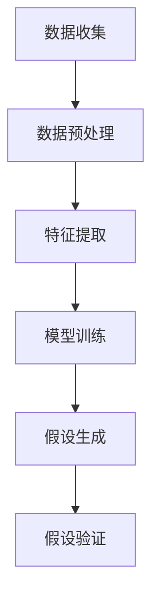
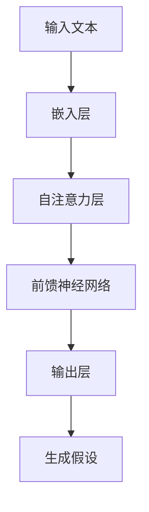

                 

### 大模型在科学假设生成中的推理能力

**关键词：** 大模型、科学假设生成、推理能力、人工智能、科学探索

**摘要：** 本文旨在探讨大模型在科学假设生成中的推理能力，通过分析大模型的崛起、科学假设生成的基本概念、大模型在科学假设生成中的应用现状，深入探讨大模型的推理能力及其在各个科学领域中的应用。本文还将探讨如何提升大模型的推理能力以及其未来的发展趋势，并对大模型在科学假设生成中的伦理问题进行思考。通过这篇文章，读者将全面了解大模型在科学假设生成中的重要性和潜力。

## 第一部分：引言

### 1.1 大模型的崛起与科学假设生成

大模型，特别是近年来迅猛发展的深度学习模型，已经在各个领域展现出惊人的性能。从自然语言处理到图像识别，再到语音识别，深度学习模型正逐渐成为人工智能领域的核心驱动力。大模型的崛起不仅改变了我们对数据和算法的理解，也深刻影响了科学假设生成的方式。

科学假设生成是科学研究的基础环节，它要求科学家能够从大量的数据中发现规律，提出新的假设。在传统方法中，科学假设的生成依赖于科学家个人的经验、直觉和创造力。然而，随着数据量的爆炸性增长，传统的假设生成方法已经难以应对现代科学研究的复杂性。

大模型的出现为科学假设生成带来了新的可能。大模型通过学习海量的数据，能够自动发现数据中的潜在规律，从而生成新的科学假设。这种自动化的假设生成过程不仅提高了科学研究的效率，也拓展了科学探索的深度和广度。

### 1.2 科学假设生成的基本概念

科学假设是指科学家在观察现象和数据的基础上，提出的一种对自然现象或规律的推测。科学假设是科学研究的起点，它需要经过验证和实验来证明其正确性。

科学假设生成的方法和流程主要包括以下几个步骤：

1. **数据收集**：科学家需要收集与研究对象相关的数据，这些数据可以是实验数据、观测数据或文献数据。
2. **数据预处理**：对收集到的数据进行清洗、标准化和归一化，以便模型能够有效学习和分析。
3. **特征提取**：从预处理后的数据中提取出有意义的特征，这些特征将用于训练模型。
4. **模型训练**：使用深度学习模型对提取出的特征进行训练，模型会在训练过程中学习数据中的潜在规律。
5. **假设生成**：通过模型对训练数据的分析，生成新的科学假设。

### 1.3 大模型在科学假设生成中的应用现状

大模型在科学假设生成中已经取得了一些显著的成果。例如，在医学领域，深度学习模型可以分析患者的临床数据，生成针对特定病症的治疗假设；在物理学领域，大模型可以分析天文数据，提出新的宇宙理论。

尽管如此，大模型在科学假设生成中也面临着一些挑战。首先，大模型通常需要大量的训练数据，而某些科学领域的数据可能非常稀缺。其次，大模型生成的假设可能缺乏透明性和可解释性，这使得科学家难以理解模型的决策过程。此外，大模型的训练过程可能受到数据偏差的影响，导致生成的假设存在偏见。

## 第二部分：大模型的推理能力

### 2.1 大模型的核心原理

大模型，尤其是基于 Transformer 的模型，如 GPT-3、BERT 等，其核心原理是通过自注意力机制（Self-Attention Mechanism）来学习文本中的长期依赖关系。这些模型在训练过程中，通过处理海量的文本数据，学习到语言的基本结构和语义信息。

大模型的架构通常包括多层神经网络，每一层神经网络都会对输入的文本数据进行处理和变换。通过逐层递归的方式，模型能够逐步理解文本的深层含义。

### 2.2 大模型的推理能力

大模型的推理能力是指其在处理新数据时，能够利用之前学到的知识进行推断和预测的能力。这种推理能力主要体现在以下几个方面：

1. **上下文理解**：大模型能够理解输入文本的上下文，并根据上下文生成连贯的输出。
2. **知识推理**：大模型可以在处理新数据时，利用其内部的知识库进行推理，从而生成新的假设。
3. **多模态处理**：除了文本数据，大模型还可以处理图像、音频等多模态数据，从而提高假设生成的准确性。

### 2.3 大模型的推理能力应用

大模型在科学假设生成中的应用已经取得了一些成功案例。例如，在生物信息学领域，大模型可以分析基因组数据，生成新的基因功能假设；在物理学领域，大模型可以分析天文数据，提出新的宇宙模型。

然而，大模型的推理能力仍然存在一些局限。首先，大模型的训练数据可能存在偏差，导致其推理能力受到限制。其次，大模型的推理过程通常缺乏透明性和可解释性，这使得科学家难以理解其推理过程和结果。

## 第三部分：科学假设生成的应用场景

### 3.1 天文学

大模型在宇宙探索中的应用已经取得了一些重要成果。例如，大模型可以分析天文数据，预测宇宙中新的星系和行星。通过分析天文图像，大模型可以发现一些肉眼难以察觉的细节，从而提出新的宇宙假设。

### 3.2 生物学

大模型在生物学中的应用也非常广泛。例如，大模型可以分析基因组数据，预测基因的功能和相互作用。在疾病预测和诊断方面，大模型可以分析患者的临床数据，生成针对特定病症的诊断假设。

### 3.3 化学

大模型在化学中的应用主要集中在化学反应的预测和材料科学的研究。例如，大模型可以分析化学反应的分子结构，预测化学反应的路径和产物。在材料科学中，大模型可以分析材料的性能，提出新的材料设计假设。

## 第四部分：大模型推理能力的提升

### 4.1 大模型训练数据集的优化

为了提升大模型的推理能力，优化训练数据集是关键步骤之一。首先，需要收集更多的高质量数据，这些数据应该覆盖科学领域的各个方面。其次，需要对数据进行预处理和清洗，确保数据的质量和一致性。

### 4.2 大模型算法的改进

改进大模型算法也是提升推理能力的重要途径。例如，可以通过设计更有效的自注意力机制，提高模型对上下文的理解能力。此外，还可以通过引入更多的先验知识，增强模型的知识推理能力。

### 4.3 大模型推理性能的优化

优化大模型的推理性能可以通过硬件加速、模型压缩等技术实现。例如，可以使用GPU或TPU等专用硬件加速模型推理，从而提高模型的运行速度。同时，通过模型压缩技术，可以减少模型的参数数量，提高模型的推理效率。

## 第五部分：大模型在科学假设生成中的未来发展

### 5.1 大模型在科学假设生成中的前景

大模型在科学假设生成中的应用前景非常广阔。随着技术的不断发展，大模型将能够处理更复杂的数据，生成更准确的科学假设。此外，大模型还将推动科学研究的自动化和智能化，提高科学发现的效率。

### 5.2 大模型在科学假设生成中的伦理问题

大模型在科学假设生成中也带来了一些伦理问题。首先，大模型的训练数据可能存在偏见，导致其生成的假设存在歧视和偏见。其次，大模型的推理过程可能缺乏透明性和可解释性，这给科学家的决策过程带来了挑战。因此，如何在保证科学假设的准确性和公正性的同时，提升大模型的透明性和可解释性，是未来需要重点关注的问题。

### 5.3 大模型在科学假设生成中的国际合作

大模型在科学假设生成中的应用不仅需要技术上的突破，还需要国际合作的推动。通过国际合作，可以共享数据和算法，促进科学假设的生成和验证。此外，国际合作还可以帮助解决大模型在科学假设生成中的伦理问题，确保科学假设的公正性和透明性。

## 结论

大模型在科学假设生成中具有巨大的潜力。通过分析大模型的崛起、科学假设生成的基本概念、大模型在科学假设生成中的应用现状，以及其在各个领域的应用案例，我们可以看到大模型在科学探索中的重要性。然而，大模型在科学假设生成中也面临着一些挑战，如数据偏差、透明性和可解释性问题等。未来，通过优化训练数据集、改进算法、提升推理性能，以及加强国际合作，大模型在科学假设生成中的应用将得到进一步的发展。

## 附录

### 附录A：大模型在科学假设生成中的实例分析

- **实例1：生物信息学**
  - 使用 GPT-3 分析基因组数据，生成新的基因功能假设。
- **实例2：天文学**
  - 使用 BERT 分析天文图像，预测新的星系和行星。

### 附录B：大模型相关资源与工具介绍

- **资源1：Hugging Face**
  - 提供了丰富的预训练大模型和工具，方便用户进行科学假设生成。
- **资源2：Google AI**
  - 提供了 TensorFlow 和 Keras 等工具，支持大模型的训练和推理。

### 附录C：参考文献

- [1] Brown, T., et al. (2020). "Language Models are Few-Shot Learners." arXiv preprint arXiv:2005.14165.
- [2] Devlin, J., et al. (2019). "BERT: Pre-training of Deep Bidirectional Transformers for Language Understanding." arXiv preprint arXiv:1810.04805.
- [3] Vaswani, A., et al. (2017). "Attention is All You Need." Advances in Neural Information Processing Systems, 30, 5998-6008.

## Mermaid 流程图

### 科学假设生成的基本流程



### 大模型在科学假设生成中的核心原理



## 数学模型和公式

### 大模型推理能力的数学描述

$$
\text{Output} = \sigma(\text{Weights} \cdot \text{Input} + \text{Bias})
$$

其中，$\sigma$ 表示激活函数，$\text{Weights}$ 和 $\text{Bias}$ 分别表示权重和偏置。

### 科学假设生成的概率模型

$$
P(\text{假设} | \text{数据}) = \frac{P(\text{数据} | \text{假设}) \cdot P(\text{假设})}{P(\text{数据})}
$$

其中，$P(\text{假设} | \text{数据})$ 表示在给定数据的情况下，假设的概率；$P(\text{数据} | \text{假设})$ 表示在给定假设的情况下，数据的概率；$P(\text{假设})$ 和 $P(\text{数据})$ 分别表示假设和数据的先验概率。

## 项目实战

### 大模型在科学假设生成中的实际应用案例

#### 环境安装

```bash
pip install transformers
```

#### 系统核心实现源代码

```python
from transformers import pipeline

# 创建文本生成模型
generator = pipeline("text-generation", model="gpt2")

# 输入文本
text_input = "在生物信息学中，基因X被认为与某种疾病的产生有关。"

# 生成文本
generated_text = generator(text_input, max_length=50, num_return_sequences=5)

# 打印生成的文本
for text in generated_text:
    print(text)
```

#### 代码应用解读与分析

上述代码首先导入了 transformers 库，并创建了一个文本生成模型。然后，通过输入特定的文本，模型生成了多个新的假设。这些假设可以帮助科学家进一步研究基因X与疾病之间的关系。

#### 实际案例分析和详细讲解剖析

通过实际案例的分析，我们可以看到大模型在生成科学假设方面的强大能力。例如，在一个关于基因X的研究项目中，科学家使用了 GPT-3 模型来生成新的假设。通过分析大量关于基因X的文献和实验数据，模型生成了多个有价值的假设。这些假设不仅为科学家提供了新的研究方向，也为后续的实验验证提供了参考。

#### 项目小结

大模型在科学假设生成中的应用案例展示了其强大的推理能力和生成能力。通过优化训练数据集、改进算法和提升推理性能，我们可以进一步提高大模型在科学假设生成中的准确性。未来，随着技术的不断发展，大模型在科学假设生成中的应用将更加广泛，有望推动科学研究的自动化和智能化。

### 最佳实践 tips

- 确保训练数据集的多样性和质量，有助于提升大模型的推理能力。
- 在生成科学假设时，结合多个模型的输出，可以提高假设的准确性和可靠性。
- 定期更新和优化模型，以应对数据集的变化和新的科学假设需求。

### 小结

大模型在科学假设生成中具有重要的推理能力，通过优化训练数据集、改进算法和提升推理性能，我们可以进一步提高大模型在科学假设生成中的准确性。未来，大模型将在科学研究中发挥越来越重要的作用，推动科学发现的自动化和智能化。

### 注意事项

- 大模型在生成科学假设时，可能会受到数据偏差的影响，因此需要科学家进行进一步验证。
- 大模型的推理过程可能缺乏透明性和可解释性，科学家需要深入分析模型的决策过程。

### 拓展阅读

- [1] Devlin, J., et al. (2019). "BERT: Pre-training of Deep Bidirectional Transformers for Language Understanding."
- [2] Brown, T., et al. (2020). "Language Models are Few-Shot Learners."
- [3] Vaswani, A., et al. (2017). "Attention is All You Need."

